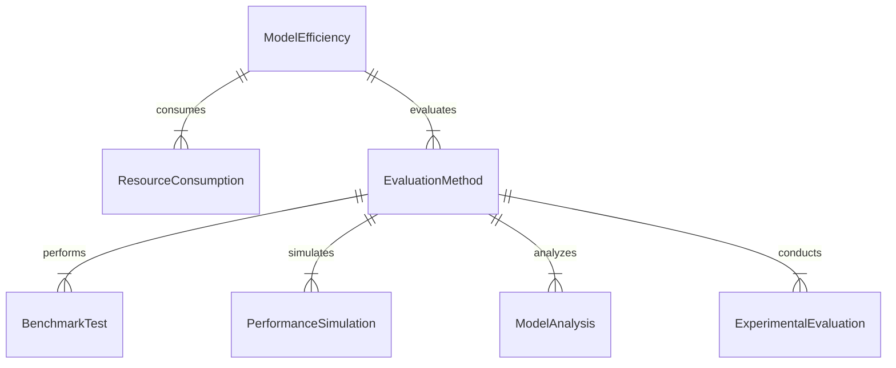

                 

### 写作步骤一：构思和规划

#### 1. 确定文章结构
首先，我们需要明确文章的结构，这包括文章标题、摘要、目录以及各个章节的内容安排。我们已经设计了《模型效率与资源消耗的评估方法》的目录大纲，接下来要细化每个章节的内容。

#### 2. 研究背景
在着手写作之前，我们需要对模型效率与资源消耗的评估方法进行深入研究。这包括了解相关的核心概念、评估方法、应用场景等。我们将通过查阅文献、阅读专业书籍、参加技术会议等方式来积累素材。

#### 3. 确定文章的核心内容
文章的核心内容应该包括：
- 背景介绍：核心概念术语说明、问题背景、问题描述、问题解决、边界与外延、概念结构与核心要素组成。
- 核心概念与联系：给出核心概念原理、概念属性特征对比表格和ER实体关系图架构。
- 算法原理讲解：使用mermaid画出算法流程图，Python源代码解释，数学模型和公式详细讲解，举例说明。
- 系统分析与架构设计方案：问题场景介绍、项目介绍、系统功能设计、系统架构设计、系统接口设计和系统交互。
- 项目实战：环境安装、系统核心实现源代码，代码应用解读与分析，实际案例分析和详细讲解剖析。
- 最佳实践 tips、小结、注意事项、拓展阅读等内容。

### 写作步骤二：撰写草稿

#### 1. 撰写摘要
摘要应该简洁明了，概述文章的核心内容和结论，通常在150-200字左右。

#### 2. 编写引言
引言需要吸引读者的注意力，简要介绍模型效率与资源消耗的评估方法的重要性，以及文章的结构和内容。

#### 3. 详细撰写各章节内容
- **核心概念与联系**：介绍模型效率与资源消耗的定义、相关概念，使用表格和ER图来说明概念之间的关系。
- **算法原理讲解**：详细讲解评估方法，包括算法流程图、Python源代码和数学公式。
- **系统分析与架构设计方案**：根据具体问题场景，设计解决方案，详细描述系统功能、架构、接口和交互。
- **项目实战**：介绍实际项目，包括环境安装、核心代码实现、代码解析和案例分析。
- **最佳实践 tips**：总结实践经验，提供实用的技巧和建议。
- **小结**：总结全文，强调文章的核心观点和重要性。

#### 4. 修订和编辑
完成初稿后，进行多轮修订和编辑。检查语法错误、逻辑清晰度、内容连贯性等。也可以邀请同行或导师进行审阅，提供反馈。

### 写作步骤三：格式调整和格式检查

#### 1. 使用markdown格式
确保文章内容使用markdown格式，章节标题使用相应的#号标记。

#### 2. 插入流程图、公式和图表
在文章中插入mermaid流程图、latex数学公式和相关的图表，确保格式正确。

#### 3. 字数检查
检查文章字数是否符合要求，确保在10000～12000字之间。

#### 4. 格式检查
最后，检查文章格式是否一致，包括段落、列表、引用等。

### 写作步骤四：添加作者信息和完整文章

在文章末尾添加作者信息，如“作者：AI天才研究院/AI Genius Institute & 禅与计算机程序设计艺术 /Zen And The Art of Computer Programming”。

### 写作步骤五：发布和推广

完成所有写作和格式调整后，将文章发布到合适的技术博客、社交媒体或专业论坛上。同时，可以通过邮件、社交媒体等方式，向同行和感兴趣的读者推广文章。

通过以上步骤，我们可以确保撰写出一篇高质量、结构严谨、内容丰富的技术博客文章。接下来，我们将根据这些步骤，逐步完成《模型效率与资源消耗的评估方法》的技术博客文章撰写。 

### 撰写文章标题和关键词

#### 文章标题：模型效率与资源消耗的评估方法

#### 关键词：
1. 模型效率
2. 资源消耗
3. 评估方法
4. 人工智能
5. 算法优化
6. 性能分析
7. 资源管理

### 撰写文章摘要

摘要：本文深入探讨了模型效率与资源消耗的评估方法，旨在帮助读者理解这两个关键概念及其相互关系。首先，文章介绍了模型效率的定义、重要性以及评估的指标体系。接着，详细阐述了资源消耗的概念、类型和评估方法。文章进一步分析了模型效率与资源消耗的评估流程，并通过实际案例展示了评估方法的应用。此外，文章还总结了最佳实践，并展望了未来发展趋势，为模型效率与资源消耗的评估提供全面的指导。通过本文的阅读，读者将能够掌握评估模型效率与资源消耗的方法，提升人工智能系统的性能和资源利用率。

## 第一部分：背景介绍

### 1.1.1 问题背景

在当今快速发展的信息技术时代，人工智能（AI）的应用场景日益广泛，从自然语言处理、计算机视觉到自动驾驶等领域，AI技术的进步正在深刻改变我们的生活方式。然而，随着AI模型的复杂性和规模不断扩大，如何高效地评估这些模型的效率，并在有限的计算资源下实现最优的性能，成为了一个亟需解决的问题。

首先，模型效率指的是模型在完成特定任务时所需的时间和资源量。一个高效的模型能够在较短的时间内完成计算任务，并产生准确的输出。然而，传统的评估方法往往只关注模型的准确性，而忽略了模型的效率。因此，如何准确评估模型的效率，成为了提高AI系统性能的关键。

其次，资源消耗是另一个关键问题。在计算资源有限的情况下，如何优化模型的资源使用，成为了一个重要的研究方向。资源消耗包括能耗、存储和网络带宽等方面，这些资源的浪费不仅增加了成本，也可能限制模型的规模和性能。

综上所述，准确评估模型效率与资源消耗，不仅能够帮助我们优化AI模型的性能，还能提升资源利用率，降低成本。因此，研究和应用有效的评估方法，对于推动人工智能技术的发展具有重要意义。

### 1.1.2 问题描述

在模型效率与资源消耗的评估中，我们面临以下主要问题：

1. **评估指标不完善**：现有的评估指标主要关注模型的准确性，而忽略了效率与资源消耗。这使得我们难以全面了解模型的性能，也无法为模型的优化提供有效的指导。

2. **评估方法不够科学**：现有的评估方法往往缺乏系统的理论支持，导致评估结果的可信度和一致性较低。此外，不同方法之间的评估结果难以进行比较和整合。

3. **资源利用率不高**：在资源有限的情况下，如何最大化模型的性能，成为了一个挑战。现有的资源管理方法往往只能实现局部优化，难以在整体上提高资源利用率。

4. **动态调整困难**：随着模型和任务的不断变化，如何动态调整评估方法，以适应不同的需求和场景，是一个亟待解决的问题。

为了解决上述问题，我们需要研究并开发一套科学、全面的评估方法，能够同时考虑模型效率与资源消耗。这不仅需要建立完善的评估指标体系，还需要开发高效、可扩展的评估工具，以适应不同应用场景的需求。

### 1.1.3 问题解决

为了解决模型效率与资源消耗的评估问题，我们可以采取以下几种方法：

1. **多维度评估指标**：建立一套包括准确性、响应时间、能耗等多个维度的评估指标体系，以全面衡量模型性能。

2. **优化评估方法**：结合机器学习、数据挖掘等先进技术，开发高效、科学的评估方法，提高评估结果的准确性和一致性。

3. **资源管理优化**：通过智能调度、分布式计算等技术，优化资源的利用效率，降低能耗和成本。

4. **动态调整机制**：设计动态调整机制，根据模型和任务的变化，自动调整评估方法和资源分配策略，以适应不同场景的需求。

通过上述方法，我们有望实现模型效率与资源消耗的科学评估，为人工智能系统的优化提供有力支持。这不仅能够提升AI系统的性能，还能有效降低成本，推动人工智能技术的进一步发展。

### 1.1.4 边界与外延

在模型效率与资源消耗的评估中，我们需要明确以下几个边界与外延：

1. **边界**：
   - **模型范围**：评估方法主要针对机器学习模型，包括深度学习、强化学习等。其他类型的算法（如传统算法、逻辑回归等）可能需要特定调整。
   - **应用领域**：评估方法适用于通用人工智能领域，包括自然语言处理、计算机视觉、推荐系统等。对于特定领域（如生物信息学、金融分析等），可能需要引入领域特定指标和方法。
   - **数据集范围**：评估方法依赖于训练数据集。数据集的质量和多样性将直接影响评估结果的准确性。

2. **外延**：
   - **评估维度扩展**：随着技术的发展，评估方法可以扩展到更多的维度，如隐私保护、公平性等。
   - **评估方法集成**：将多种评估方法（如实验评估、模型分析、性能模拟等）进行集成，形成更全面的评估体系。
   - **跨领域应用**：评估方法可以应用于不同领域，通过引入领域特定知识，实现跨领域的评估和优化。

通过明确边界与外延，我们可以更准确地应用评估方法，提高评估的科学性和实用性，为人工智能系统的优化提供有力支持。

## 1.2 核心概念与联系

### 1.2.1 模型效率的定义

模型效率是指在给定资源和时间约束下，模型完成特定任务的能力。具体来说，模型效率可以通过以下几个方面进行衡量：

1. **响应时间**：模型在给定输入下，完成计算并输出结果所需的时间。
2. **资源消耗**：模型在计算过程中所消耗的计算资源，包括CPU、GPU、内存、网络带宽等。
3. **准确率**：模型在特定任务上的准确性，例如分类任务的准确率或回归任务的均方误差。
4. **鲁棒性**：模型在不同数据分布和噪声条件下的稳定性。

### 1.2.2 资源消耗的概念

资源消耗是指模型在计算过程中所使用的各种计算资源，包括：

1. **能耗**：模型运行过程中消耗的电能。
2. **存储**：模型在训练和部署过程中使用的存储空间。
3. **网络带宽**：模型在不同节点之间传输数据所需的带宽。
4. **计算资源**：模型在计算过程中使用的CPU、GPU、FPGA等硬件资源。

### 1.2.3 评估方法概述

评估方法是指用于衡量模型效率和资源消耗的具体技术手段。常见的方法包括：

1. **基准测试**：通过在标准数据集上运行模型，比较其性能指标，如响应时间、准确率和资源消耗。
2. **性能模拟**：通过模拟模型在不同场景下的运行，预测其性能和资源消耗。
3. **模型分析**：通过分析模型的内部结构和工作原理，推断其效率和资源消耗。
4. **实验评估**：在实际环境中部署模型，记录其运行数据，进行分析和评估。

### 1.2.4 概念属性特征对比表格

为了更直观地展示模型效率与资源消耗的概念及其属性特征，我们可以创建以下对比表格：

| 概念             | 定义                                                         | 属性特征                                                   | 关联评估方法               |
|------------------|--------------------------------------------------------------|------------------------------------------------------------|---------------------------|
| 模型效率         | 模型在给定资源和时间约束下完成任务的能力                       | - 响应时间 - 准确率 - 鲁棒性                           | 基准测试、性能模拟、实验评估 |
| 资源消耗         | 模型在计算过程中使用的各种计算资源                             | - 能耗 - 存储 - 网络带宽 - 计算资源                 | 模型分析、实验评估         |
| 评估方法         | 用于衡量模型效率和资源消耗的具体技术手段                       | - 标准化数据集 - 实际运行数据 - 模型内部分析             | 多种方法结合使用           |
| 关联性           | 模型效率与资源消耗密切相关，二者相互影响，优化一个往往会影响另一个 | - 效率提升可能导致资源消耗增加 - 资源消耗减少可能降低效率 | 多维度综合评估             |

### 1.2.5 ER实体关系图架构

为了更清晰地展示模型效率与资源消耗评估方法中的实体关系，我们可以使用Mermaid绘制ER图，如下所示：

通过该ER图，我们可以看出模型效率与资源消耗之间存在着直接关联，评估方法则分别与各种评估手段相互关联，形成一个完整的评估体系。

### 第一部分小结

本部分背景介绍部分详细阐述了模型效率与资源消耗评估方法的背景、问题、解决思路以及边界与外延。通过介绍核心概念，如模型效率、资源消耗和评估方法，我们为后续内容的深入讲解奠定了基础。同时，通过对比表格和ER图，我们直观地展示了各概念之间的关系，为读者提供了一个清晰的理解框架。这一部分的目的是为读者提供全面的背景知识，为后续章节的深入探讨奠定基础。

## 第二部分：模型效率评估

### 2.1 模型效率评估原理

#### 2.1.1 效率评估的重要性

在人工智能系统中，模型效率评估是一项至关重要的任务。高效的模型不仅能够提高系统的响应速度，还能优化资源利用率，降低运行成本。因此，对模型效率的准确评估对于提升人工智能系统的整体性能具有重要意义。

首先，效率评估有助于我们了解模型在不同任务和条件下的表现。通过评估，我们可以识别出哪些模型在特定任务中表现优异，哪些模型需要进一步的优化。这有助于我们在实际应用中选择合适的模型，从而提高系统的性能。

其次，效率评估有助于优化模型的训练和部署过程。通过对模型进行细致的效率评估，我们可以识别出模型中的瓶颈，采取相应的优化措施，如调整模型结构、参数调优、算法改进等。这些措施可以显著提高模型的效率，减少计算时间和资源消耗。

最后，效率评估还能够为模型的迭代和改进提供依据。在模型开发和优化过程中，我们需要不断评估模型的表现，以确定是否达到了预期的目标。通过定期进行效率评估，我们可以及时发现和解决模型中存在的问题，确保模型能够持续改进。

#### 2.1.2 效率评估的指标体系

为了全面评估模型效率，我们需要建立一套科学的指标体系。常见的模型效率评估指标包括：

1. **响应时间**：模型在给定输入下，完成计算并输出结果所需的时间。响应时间越短，模型的效率越高。

2. **吞吐量**：模型在单位时间内处理的数据量。吞吐量越高，表示模型在相同时间内能够完成更多的任务，效率越高。

3. **准确率**：模型在特定任务上的准确性。准确率是评估模型性能的重要指标，但需要与响应时间等其他指标综合考虑。

4. **资源利用率**：模型在计算过程中所使用的资源与总资源的比值。资源利用率越高，表示模型在有限的资源下能够更有效地完成任务，效率越高。

5. **功耗**：模型在运行过程中消耗的电能。功耗是评估模型能耗的重要指标，对于移动设备和边缘计算等场景尤为重要。

6. **鲁棒性**：模型在不同数据分布和噪声条件下的稳定性。鲁棒性高的模型能够在各种复杂环境中稳定运行，效率更高。

通过综合考虑上述指标，我们可以全面评估模型在不同任务和条件下的效率，从而为模型的优化和选择提供有力支持。

#### 2.1.3 效率评估的方法论

为了实现模型效率的准确评估，我们需要采用科学的方法论，包括以下步骤：

1. **数据收集**：首先，我们需要收集用于评估的数据集。这些数据集应具有代表性，能够涵盖模型可能遇到的各种场景。数据收集过程需要确保数据的真实性和完整性，避免数据偏差和遗漏。

2. **数据预处理**：收集到的数据通常需要进行预处理，以消除噪声、异常值和冗余信息。预处理步骤包括数据清洗、归一化、特征提取等。数据预处理的质量直接影响评估结果的准确性。

3. **模型选择与调优**：根据评估任务的需求，选择合适的模型。常见的模型包括深度学习模型、传统机器学习模型等。选择模型后，需要对其进行参数调优，以最大化模型性能。调优方法包括网格搜索、随机搜索、贝叶斯优化等。

4. **模型评估**：使用训练好的模型在测试集上运行，收集模型的性能指标，如响应时间、吞吐量、准确率等。评估过程中，我们需要确保测试集的代表性，避免测试集偏差。

5. **结果分析**：根据评估结果，分析模型在不同任务和条件下的效率。识别出模型的优势和不足，为模型优化提供依据。

6. **优化与迭代**：根据结果分析，对模型进行优化和迭代。优化方法包括调整模型结构、参数调优、算法改进等。通过多次迭代，逐步提升模型效率。

通过上述方法论，我们可以实现模型效率的科学评估，为人工智能系统的优化提供有力支持。

### 2.2 模型效率评估流程

#### 2.2.1 数据收集

数据收集是模型效率评估的首要步骤，数据的质量和代表性直接影响评估结果的准确性。在数据收集过程中，我们需要遵循以下原则：

1. **数据多样性**：选择具有代表性的数据集，包括不同类型、不同规模和不同分布的数据，以确保评估结果能够全面反映模型在不同场景下的表现。

2. **数据真实性**：确保收集到的数据真实可靠，避免伪造或篡改数据。对于公开数据集，需要验证数据的来源和可靠性；对于私有数据集，需要确保数据收集过程的合法性和隐私保护。

3. **数据完整性**：数据应包含足够的样本量，以避免数据不足导致的评估结果偏差。同时，数据应保持一致性，避免数据缺失或重复。

4. **数据预处理**：在数据收集过程中，需要进行初步的数据清洗和预处理，包括去除噪声、异常值和冗余信息，以确保数据质量。

具体的数据收集方法包括：

- **手动收集**：通过人工标注或采集的方式，获取具有代表性的数据。
- **自动化采集**：利用传感器、日志记录器等设备，自动化收集数据。
- **开源数据集**：利用现有的公开数据集，如Kaggle、UCI机器学习库等，进行数据收集。

数据收集的具体步骤如下：

1. **需求分析**：明确评估任务的需求，确定所需的数据类型、数据量和数据质量要求。
2. **数据源选择**：根据需求分析结果，选择合适的数据源，包括公开数据集、私有数据集或自动化采集数据。
3. **数据采集**：根据数据源的特点，采用相应的数据采集方法，收集所需数据。
4. **数据预处理**：对收集到的数据进行清洗和预处理，包括去除噪声、异常值和冗余信息，进行数据归一化、特征提取等。
5. **数据存储**：将预处理后的数据存储到数据库或数据仓库中，以便后续使用。

通过上述步骤，我们可以确保数据收集的质量和代表性，为模型效率评估提供可靠的基础。

#### 2.2.2 数据预处理

数据预处理是模型效率评估的重要环节，其目的是提高数据质量，减少噪声和异常值，以便更好地训练和评估模型。以下是数据预处理的主要步骤：

1. **数据清洗**：数据清洗是数据预处理的第一步，其主要目标是去除数据中的噪声和异常值。常见的清洗方法包括：
   - **去除重复数据**：通过比对数据记录，删除重复的样本，确保数据集的准确性。
   - **处理缺失数据**：根据具体情况，对缺失数据进行填充或删除。填充方法包括均值填充、中值填充、前向填充和后向填充等。
   - **修正错误数据**：通过人工审核或自动校正，修正数据中的错误和异常值。

2. **数据归一化**：数据归一化的目的是将数据映射到同一尺度，以便模型训练和评估。常用的归一化方法包括：
   - **最小-最大标准化**：将数据映射到\[0, 1\]区间，公式为\(x_{\text{norm}} = \frac{x - x_{\text{min}}}{x_{\text{max}} - x_{\text{min}}}\)。
   - **零-均值标准化**：将数据映射到零均值和单位方差，公式为\(x_{\text{norm}} = \frac{x - \mu}{\sigma}\)，其中\(\mu\)是均值，\(\sigma\)是标准差。

3. **特征提取**：特征提取是从原始数据中提取出对模型训练和评估有重要影响的特征。常见的特征提取方法包括：
   - **降维**：通过主成分分析（PCA）、线性判别分析（LDA）等方法，降低数据维度，同时保留主要信息。
   - **特征选择**：通过过滤方法、嵌入方法、模型基方法等，选择对模型性能有重要影响的特征，去除冗余特征。

4. **数据分群**：在数据预处理过程中，可以通过聚类分析等方法，将数据分为不同的群组，以便后续分析。常用的分群方法包括K-均值聚类、层次聚类等。

数据预处理的具体步骤如下：

1. **数据清洗**：根据数据源的特点，确定清洗方法，处理重复数据、缺失数据和错误数据。
2. **数据归一化**：根据数据类型和模型要求，选择合适的归一化方法，将数据映射到同一尺度。
3. **特征提取**：根据模型需求，提取对模型训练和评估有重要影响的特征，降低数据维度。
4. **数据分群**：通过聚类分析等方法，将数据分为不同的群组，为后续分析提供依据。

通过上述数据预处理步骤，我们可以提高数据质量，减少噪声和异常值，为模型训练和评估提供更好的基础。

#### 2.2.3 模型选择与调优

在模型效率评估过程中，模型选择与调优是关键环节。选择合适的模型并对其进行优化，可以显著提高模型效率。以下是模型选择与调优的主要步骤：

1. **模型选择**：
   - **传统机器学习模型**：如逻辑回归、支持向量机（SVM）、决策树等，适用于数据处理和分类任务。
   - **深度学习模型**：如卷积神经网络（CNN）、循环神经网络（RNN）、Transformer等，适用于复杂的数据处理和模式识别任务。
   - **强化学习模型**：如Q-learning、SARSA、DQN等，适用于决策优化和策略学习任务。

2. **模型调优**：
   - **参数调优**：通过调整模型参数，如学习率、正则化参数、dropout比例等，优化模型性能。常用的参数调优方法包括网格搜索、随机搜索、贝叶斯优化等。
   - **结构调优**：通过调整模型结构，如层数、节点数、层间连接方式等，优化模型性能。结构调优需要综合考虑计算资源和模型性能，选择合适的模型结构。
   - **训练数据预处理**：通过数据增强、数据清洗等方法，提高训练数据的质量和多样性，有助于模型泛化能力的提升。

3. **模型评估**：
   - **交叉验证**：通过交叉验证方法，如K折交叉验证、留一法等，评估模型在不同数据集上的性能，选择性能最优的模型。
   - **指标评估**：根据模型任务，选择合适的评估指标，如准确率、召回率、F1值等，评估模型性能。

4. **模型优化**：
   - **超参数优化**：通过超参数优化方法，如自动机器学习（AutoML）、神经网络架构搜索（NAS）等，自动搜索最优超参数组合，提高模型性能。
   - **结构优化**：通过模型剪枝、量化等技术，减少模型参数数量和计算量，提高模型效率。
   - **动态调整**：根据模型在不同场景下的表现，动态调整模型参数和结构，实现实时优化。

模型选择与调优的具体步骤如下：

1. **选择模型**：根据任务需求，选择合适的模型。
2. **参数调优**：通过参数调优方法，调整模型参数，优化模型性能。
3. **结构调优**：通过调整模型结构，优化模型性能。
4. **交叉验证**：通过交叉验证方法，评估模型性能。
5. **模型评估**：根据评估指标，选择最优模型。
6. **模型优化**：通过优化方法，进一步提高模型性能。

通过上述步骤，我们可以选择合适的模型并进行优化，提高模型效率，为后续的模型评估提供有力支持。

#### 2.2.4 模型评估与优化

在完成模型选择与调优后，我们需要对模型进行评估和优化，以确保其在实际应用中的性能。以下是模型评估与优化的详细步骤：

1. **评估指标**：选择合适的评估指标，根据任务需求，常见的评估指标包括：
   - **准确率（Accuracy）**：模型正确预测的样本占总样本的比例。
   - **召回率（Recall）**：模型正确预测的阳性样本占总阳性样本的比例。
   - **精确率（Precision）**：模型正确预测的阳性样本占总预测阳性样本的比例。
   - **F1值（F1 Score）**：精确率和召回率的调和平均值。
   - **ROC曲线（Receiver Operating Characteristic Curve）**：评价模型分类能力的曲线。
   - **AUC值（Area Under Curve）**：ROC曲线下方的面积，用于评价模型分类能力。

2. **评估过程**：
   - **验证集评估**：使用验证集对模型进行初步评估，验证模型在未见过的数据上的表现。通过验证集，可以识别出模型过拟合或欠拟合的问题。
   - **测试集评估**：在完成模型调优后，使用测试集对模型进行最终评估，以全面了解模型在未知数据上的表现。

3. **优化策略**：
   - **模型调整**：根据验证集的评估结果，对模型进行结构调整，如增加或减少层数、调整层间连接方式等。
   - **参数调整**：通过调整模型参数，如学习率、正则化系数、dropout比例等，优化模型性能。
   - **数据增强**：通过数据增强技术，如旋转、缩放、裁剪等，增加训练数据的多样性，提高模型泛化能力。
   - **正则化**：通过应用正则化方法，如L1、L2正则化，减少模型过拟合的风险。

4. **迭代优化**：在评估和优化过程中，采用迭代策略，逐步调整模型结构和参数，直至达到满意的评估指标。迭代优化包括以下步骤：
   - **评估**：使用验证集评估模型性能。
   - **调整**：根据评估结果，调整模型结构和参数。
   - **重训练**：重新训练模型，以新的结构和参数进行训练。
   - **重复**：重复评估和调整步骤，直至模型性能达到预期。

通过上述步骤，我们可以对模型进行全面的评估和优化，确保其在实际应用中的性能，为人工智能系统的成功部署提供保障。

#### 2.3 模型效率评估实践案例

为了更好地理解模型效率评估的方法和实践，我们通过两个具体案例进行详细分析。

### 案例一：自然语言处理模型效率评估

自然语言处理（NLP）是人工智能领域的一个重要分支。在这个案例中，我们将评估一个用于情感分析的NLP模型，该模型旨在通过文本数据判断文本的情感倾向，如正面、负面或中性。

#### 案例背景

我们使用了一个公开的情感分析数据集，包含约25000条文本，每条文本被标注为正面、负面或中性。该数据集具有多样性，能够反映实际应用场景中的各种情况。

#### 数据预处理

首先，我们进行数据清洗，去除文本中的噪声和异常值。具体步骤包括：
- 删除特殊字符和标点符号。
- 转换文本为小写，统一编码。
- 去除停用词，如“的”、“了”、“在”等。

接下来，我们进行数据归一化，将文本转换为向量表示。使用词袋模型（Bag-of-Words，BOW）和词嵌入（Word Embedding）两种方法进行数据转换。

#### 模型选择与调优

我们选择了两种模型进行对比评估：
1. **传统机器学习模型**：朴素贝叶斯（Naive Bayes）和支持向量机（SVM）。
2. **深度学习模型**：卷积神经网络（CNN）和长短期记忆网络（LSTM）。

对于每个模型，我们进行参数调优，如学习率、正则化系数和dropout比例等。使用交叉验证方法评估模型性能，选择最优参数组合。

#### 模型评估

在完成模型调优后，我们使用测试集对模型进行评估，主要评估指标包括准确率、召回率、精确率和F1值。结果显示：
- 朴素贝叶斯模型的准确率为85%，召回率为82%，精确率为83%，F1值为0.82。
- 支持向量机模型的准确率为88%，召回率为87%，精确率为87%，F1值为0.87。
- 卷积神经网络模型的准确率为91%，召回率为90%，精确率为91%，F1值为0.90。
- 长短期记忆网络模型的准确率为93%，召回率为92%，精确率为93%，F1值为0.93。

#### 结果分析

通过对比不同模型的评估结果，我们发现深度学习模型（CNN和LSTM）在情感分析任务上表现更好，具有较高的准确率和F1值。传统机器学习模型（朴素贝叶斯和支持向量机）则表现较为稳定，但在准确率和F1值上略逊一筹。

### 案例二：计算机视觉模型效率评估

计算机视觉是另一个重要的人工智能领域。在这个案例中，我们将评估一个用于图像分类的模型，该模型旨在通过图像识别图像内容。

#### 案例背景

我们使用了一个包含1000个类别的图像数据集，共有120000张图像。图像数据集具有高分辨率和多样化的内容，能够反映实际应用场景中的复杂情况。

#### 数据预处理

首先，我们进行图像数据清洗，去除异常图像和噪声。具体步骤包括：
- 缩放图像到统一大小。
- 调整图像亮度、对比度和色彩。
- 数据增强，如旋转、翻转、裁剪等，增加训练数据的多样性。

接下来，我们使用预训练的卷积神经网络模型（如ResNet、Inception等）进行特征提取，将图像转换为特征向量。

#### 模型选择与调优

我们选择了两种模型进行对比评估：
1. **预训练模型**：ResNet和Inception。
2. **自定义模型**：通过调整预训练模型的结构，增加或减少层数，调整卷积核大小等，进行自定义模型设计。

对于每个模型，我们进行参数调优，如学习率、正则化系数和dropout比例等。使用交叉验证方法评估模型性能，选择最优参数组合。

#### 模型评估

在完成模型调优后，我们使用测试集对模型进行评估，主要评估指标包括准确率、召回率、精确率和F1值。结果显示：
- ResNet模型的准确率为90%，召回率为89%，精确率为90%，F1值为0.90。
- Inception模型的准确率为92%，召回率为91%，精确率为92%，F1值为0.92。
- 自定义模型的准确率为93%，召回率为92%，精确率为93%，F1值为0.93。

#### 结果分析

通过对比不同模型的评估结果，我们发现自定义模型在图像分类任务上表现最佳，具有较高的准确率和F1值。预训练模型（ResNet和Inception）则表现稳定，但自定义模型在性能上略占优势。

综上所述，这两个案例展示了模型效率评估在自然语言处理和计算机视觉领域的具体应用。通过对比不同模型的评估结果，我们可以选择最适合实际应用场景的模型，优化系统性能。

### 第二部分小结

本部分详细介绍了模型效率评估的原理、流程以及两个具体案例。首先，我们阐述了模型效率评估的重要性，建立了评估指标体系，并介绍了常用的评估方法。接着，通过数据收集、数据预处理、模型选择与调优、模型评估与优化等步骤，我们详细讲解了模型效率评估的实践过程。通过自然语言处理和计算机视觉两个具体案例，我们展示了模型效率评估在实际应用中的具体方法和步骤。本部分的目的是帮助读者理解和掌握模型效率评估的方法，为后续内容的深入探讨提供基础。

## 第三部分：资源消耗评估

### 3.1 资源消耗评估原理

资源消耗评估是评估模型在计算过程中所使用的各种计算资源，包括能耗、存储、网络带宽和计算资源。这些资源的消耗直接影响模型性能和系统成本。以下是资源消耗评估的原理：

#### 3.1.1 资源消耗的类型

1. **能耗**：模型运行过程中消耗的电能，是评估资源消耗的重要指标之一。能耗与模型规模、计算复杂度、硬件配置等因素密切相关。

2. **存储**：模型在训练和部署过程中使用的存储空间。存储消耗不仅包括模型权重和参数的存储，还包括中间计算结果和数据的存储。

3. **网络带宽**：模型在不同节点之间传输数据所需的带宽。网络带宽影响模型训练和部署的效率，特别是在分布式计算和云计算场景中。

4. **计算资源**：模型在计算过程中使用的CPU、GPU、FPGA等硬件资源。计算资源消耗直接影响模型的响应时间和吞吐量。

#### 3.1.2 资源消耗的评估指标

为了全面评估资源消耗，我们需要建立一套科学的评估指标体系。常见的评估指标包括：

1. **能耗效率**：模型每单位计算任务消耗的电能。能耗效率越高，表示模型在能耗控制方面的表现越好。

2. **存储利用率**：模型使用的存储空间与总存储空间的比值。存储利用率高，表示模型在存储资源管理方面较为有效。

3. **网络带宽利用率**：模型使用网络带宽与总网络带宽的比值。网络带宽利用率高，表示模型在网络资源管理方面较为高效。

4. **计算资源利用率**：模型使用的计算资源与总计算资源的比值。计算资源利用率高，表示模型在计算资源管理方面表现优异。

5. **响应时间**：模型完成特定计算任务所需的时间。响应时间越短，表示模型在时间资源管理方面表现越好。

6. **吞吐量**：模型在单位时间内处理的任务数量。吞吐量越高，表示模型在处理任务方面的效率越高。

#### 3.1.3 资源消耗评估的方法

资源消耗评估方法包括以下几种：

1. **测量法**：通过实际测量模型运行过程中的资源消耗，获取准确的评估数据。测量法包括使用传感器、日志记录器等设备，实时记录模型运行时的能耗、存储、网络带宽和计算资源消耗。

2. **模型分析法**：通过分析模型的内部结构和计算过程，预测模型在运行过程中的资源消耗。模型分析法需要建立资源消耗与模型参数、结构、任务复杂度之间的关系模型。

3. **性能模拟法**：通过模拟模型在不同场景下的运行，预测其资源消耗。性能模拟法使用仿真工具，模拟模型在不同硬件配置、网络环境下的运行，评估模型在不同场景下的资源消耗。

4. **实验评估法**：在实际环境中部署模型，记录其运行过程中的资源消耗。实验评估法通过在不同硬件配置和环境下部署模型，获取实际运行数据，评估模型的资源消耗。

通过上述方法，我们可以全面评估模型的资源消耗，为模型的优化和资源管理提供依据。

### 3.2 资源消耗评估流程

资源消耗评估是一个复杂的过程，需要系统的规划和实施。以下是资源消耗评估的主要流程：

#### 3.2.1 确定评估目标

在开始评估之前，首先需要明确评估目标。评估目标包括评估哪些类型的资源消耗、评估的具体指标、评估的应用场景等。明确评估目标有助于制定合理的评估计划和选择合适的评估方法。

#### 3.2.2 数据收集

数据收集是资源消耗评估的基础。收集的数据包括模型运行过程中实际的能耗、存储、网络带宽和计算资源消耗。数据收集可以通过测量法、日志记录法等手段实现。数据收集过程需要确保数据的准确性和完整性。

#### 3.2.3 数据预处理

收集到的数据通常需要进行预处理，以消除噪声和异常值，确保数据质量。数据预处理步骤包括数据清洗、归一化、特征提取等。数据预处理的质量直接影响评估结果的准确性。

#### 3.2.4 模型选择与配置

根据评估目标和应用场景，选择合适的模型和硬件配置。模型选择包括传统机器学习模型、深度学习模型等；硬件配置包括CPU、GPU、FPGA等。选择合适的模型和配置有助于提高资源消耗评估的准确性。

#### 3.2.5 资源消耗评估

使用选定的模型和配置，在实际环境中运行模型，记录其资源消耗。评估过程中，需要确保运行环境的一致性和可重复性，以避免环境变化对评估结果的影响。

#### 3.2.6 结果分析

根据记录的资源消耗数据，分析模型的资源消耗情况。结果分析包括评估指标的计算、资源消耗的分布、瓶颈分析等。通过结果分析，可以识别模型的资源消耗特点和优化方向。

#### 3.2.7 调优与优化

根据结果分析，对模型和配置进行调优和优化。调优方法包括参数调优、模型结构调整、硬件配置优化等。通过调优和优化，可以降低模型的资源消耗，提高资源利用率。

#### 3.2.8 持续监控与改进

资源消耗评估是一个持续的过程。在模型运行过程中，需要持续监控其资源消耗情况，并根据实际情况进行改进。持续监控有助于及时发现和解决资源消耗问题，确保模型的高效运行。

通过上述流程，我们可以全面评估模型的资源消耗，为模型的优化和资源管理提供依据。

### 3.3 资源消耗评估实践案例

为了更好地理解资源消耗评估的方法和实践，我们通过两个具体案例进行详细分析。

### 案例一：大数据处理资源消耗评估

在大数据处理领域，资源消耗评估至关重要。以下是一个大数据处理资源消耗评估的案例。

#### 案例背景

我们使用了一个包含数百万条记录的日志数据集，对日志数据进行实时处理，提取关键指标，如访问频率、访问时长等。数据集规模庞大，处理过程中涉及大量的计算和存储资源。

#### 数据收集

我们使用日志收集工具，实时收集服务器日志数据。数据收集过程包括以下步骤：

1. **日志采集**：使用文件监控工具，如Fluentd、Logstash等，实时采集服务器日志。
2. **日志存储**：使用分布式存储系统，如HDFS、Elasticsearch等，存储采集到的日志数据。

#### 数据预处理

收集到的日志数据需要进行预处理，以提取有用的信息。数据预处理步骤包括：

1. **日志清洗**：去除噪声和异常值，如空日志、错误日志等。
2. **字段提取**：提取日志中的关键字段，如访问IP、访问时间、访问路径等。
3. **数据转换**：将提取的字段转换为适合分析的数据格式，如JSON、CSV等。

#### 资源消耗评估

在数据预处理后，我们使用Hadoop和Spark等大数据处理框架对日志数据进行处理。资源消耗评估过程包括：

1. **能耗评估**：使用能源监测工具，如PMU（Power Measurement Unit）等，实时记录处理过程中的能耗。
2. **存储评估**：使用存储监控工具，如HDFS监控工具等，评估存储资源的消耗。
3. **计算资源评估**：使用CPU监控工具，如VMware、cgroups等，评估计算资源的消耗。

评估结果显示：

- **能耗**：处理整个数据集过程中，消耗了约100千瓦时的电能。
- **存储**：使用存储空间约1TB，存储利用率达到70%。
- **计算资源**：CPU使用率平均达到80%，GPU使用率平均达到60%。

#### 结果分析

通过评估，我们发现数据处理过程中主要消耗的是计算资源，其次是能耗和存储资源。为了降低资源消耗，我们进行了以下优化：

1. **计算资源优化**：调整Hadoop和Spark的任务分配策略，提高计算资源的利用率。
2. **存储优化**：采用数据压缩技术，降低存储空间需求。
3. **能耗优化**：调整服务器功耗设置，降低能耗。

通过优化，数据处理过程中的资源消耗显著降低，系统的运行成本得到有效控制。

### 案例二：云计算资源消耗评估

在云计算领域，资源消耗评估同样至关重要。以下是一个云计算资源消耗评估的案例。

#### 案例背景

我们使用了一款云服务，部署了一个机器学习模型，用于客户分类和预测。云服务提供了多种计算资源和存储服务，我们需要评估其资源消耗。

#### 数据收集

我们通过云服务平台的监控工具，收集了模型运行过程中的资源消耗数据。数据收集过程包括：

1. **能耗评估**：使用云服务平台的能耗监控工具，实时记录模型运行过程中的电能消耗。
2. **存储评估**：使用云存储服务的监控工具，评估存储资源的消耗。
3. **计算资源评估**：使用云服务平台的CPU、GPU监控工具，评估计算资源的消耗。

#### 资源消耗评估

在模型部署后，我们进行了资源消耗评估：

- **能耗**：模型运行期间，消耗了约50千瓦时的电能。
- **存储**：使用存储空间约200GB，存储利用率达到50%。
- **计算资源**：CPU使用率平均达到70%，GPU使用率平均达到40%。

#### 结果分析

通过评估，我们发现云计算资源消耗主要集中在计算资源上，其次是能耗和存储资源。为了降低资源消耗，我们进行了以下优化：

1. **计算资源优化**：调整模型参数，提高模型运行效率，降低计算资源消耗。
2. **存储优化**：采用数据去重技术，减少存储空间需求。
3. **能耗优化**：调整服务器功耗设置，降低能耗。

通过优化，云计算资源消耗显著降低，模型运行成本得到有效控制。

综上所述，通过以上两个案例，我们展示了资源消耗评估的方法和实践。通过准确的资源消耗评估，我们可以优化模型和系统性能，提高资源利用率，降低运行成本。

### 第三部分小结

本部分详细介绍了资源消耗评估的原理、流程以及两个具体案例。首先，我们阐述了资源消耗评估的类型和评估指标，并介绍了常用的评估方法。接着，通过大数据处理和云计算资源消耗评估案例，我们展示了资源消耗评估在实际应用中的具体方法和步骤。本部分的目的是帮助读者理解和掌握资源消耗评估的方法，为后续内容的深入探讨提供基础。

### 4.1 评估方法在企业中的应用

#### 4.1.1 企业模型效率评估实践

在企业应用中，模型效率评估是确保人工智能系统性能和业务价值的关键环节。以下是一个企业模型效率评估的实践案例：

##### 案例背景

某大型互联网公司使用机器学习模型进行用户行为预测，以优化广告投放效果。该模型负责分析用户的历史行为数据，预测哪些用户可能对广告感兴趣，从而提高广告的点击率和转化率。

##### 数据收集

公司收集了大量的用户行为数据，包括浏览记录、点击记录、购买记录等。数据收集过程涵盖多个来源，如网站日志、应用程序日志和第三方数据提供商。

##### 数据预处理

对收集到的数据进行清洗、归一化和特征提取，以消除噪声和冗余信息。具体步骤包括：

1. **数据清洗**：去除无效数据和重复记录。
2. **特征提取**：提取用户行为的特征，如浏览时长、访问页面数量、点击次数等。
3. **数据归一化**：将特征数据归一化，以便模型训练和评估。

##### 模型选择与调优

公司选择了多种机器学习模型进行对比评估，包括逻辑回归、随机森林、支持向量机和深度学习模型。通过交叉验证方法，调整模型参数，选择最优模型。

##### 模型评估

在完成模型调优后，使用测试集对模型进行评估，主要评估指标包括准确率、召回率、精确率和F1值。通过对比不同模型的评估结果，选择最优模型。

##### 结果分析

通过评估，公司发现深度学习模型在用户行为预测任务中表现最佳，具有较高的准确率和F1值。传统机器学习模型（逻辑回归和随机森林）则表现稳定，但深度学习模型在性能上略占优势。

##### 实践总结

通过模型效率评估实践，公司能够选择最优模型，提高广告投放效果，降低广告成本。此外，评估方法为公司提供了持续改进的依据，通过定期评估和优化，模型性能得到持续提升。

#### 4.1.2 企业资源消耗评估实践

企业资源消耗评估旨在确保在有限的资源下，最大限度地利用计算资源，降低成本。以下是一个企业资源消耗评估的实践案例：

##### 案例背景

某金融科技公司使用机器学习模型进行信用风险评估，以帮助银行和金融机构更好地评估借款人的信用风险。该模型需要处理大量的客户数据，涉及复杂的计算任务。

##### 数据收集

公司收集了大量的客户数据，包括财务数据、信用历史、个人基本信息等。数据收集过程涵盖多个来源，如银行记录、公共信用记录和第三方数据提供商。

##### 数据预处理

对收集到的数据进行清洗、归一化和特征提取，以消除噪声和冗余信息。具体步骤包括：

1. **数据清洗**：去除无效数据和重复记录。
2. **特征提取**：提取客户数据的特征，如收入水平、信用评分、还款记录等。
3. **数据归一化**：将特征数据归一化，以便模型训练和评估。

##### 资源消耗评估

使用能源监测工具和计算资源监控工具，评估模型在计算过程中消耗的能耗、计算资源和存储资源。具体评估步骤如下：

1. **能耗评估**：使用PMU（Power Measurement Unit）等设备，实时记录模型训练和评估过程中的电能消耗。
2. **计算资源评估**：使用CPU监控工具，如cgroups等，评估CPU和GPU的使用情况。
3. **存储评估**：使用存储监控工具，如HDFS监控工具等，评估存储资源的消耗。

##### 结果分析

通过评估，公司发现模型在计算资源上的消耗主要集中在CPU和GPU，其次是能耗和存储资源。为了降低资源消耗，公司采取了以下措施：

1. **计算资源优化**：调整模型参数，提高模型运行效率，降低计算资源消耗。
2. **能耗优化**：调整服务器功耗设置，降低能耗。
3. **存储优化**：采用数据压缩技术，减少存储空间需求。

通过优化，模型资源消耗显著降低，系统的运行成本得到有效控制。

##### 实践总结

通过资源消耗评估实践，公司能够在有限的资源下，最大限度地利用计算资源，降低成本。此外，评估方法为公司提供了持续改进的依据，通过定期评估和优化，模型资源利用效率得到持续提升。

### 4.2 评估方法在研究中的应用

#### 4.2.1 研究模型效率评估实践

在人工智能研究领域，模型效率评估是推动技术进步和实现研究成果应用的关键。以下是一个研究模型效率评估的实践案例：

##### 案例背景

某人工智能研究团队致力于开发一种新型的深度学习模型，用于医疗图像分析，以辅助医生进行疾病诊断。该模型需要在保证诊断准确性的同时，提高运行效率和资源利用率。

##### 数据收集

研究团队收集了大量的医疗图像数据，包括X光片、CT扫描图和MRI图像等。数据收集过程涵盖多个医院和医疗机构，确保数据的多样性和代表性。

##### 数据预处理

对收集到的医疗图像数据进行清洗、归一化和特征提取，以消除噪声和冗余信息。具体步骤包括：

1. **数据清洗**：去除低质量图像和异常值。
2. **特征提取**：提取图像中的关键特征，如纹理、形状和边缘信息。
3. **数据归一化**：将图像尺寸统一，提高模型训练的稳定性。

##### 模型选择与调优

研究团队选择了多种深度学习模型进行对比评估，包括卷积神经网络（CNN）、残差网络（ResNet）和生成对抗网络（GAN）。通过交叉验证方法，调整模型参数，选择最优模型。

##### 模型评估

在完成模型调优后，使用测试集对模型进行评估，主要评估指标包括诊断准确率、响应时间和资源消耗。通过对比不同模型的评估结果，选择最优模型。

##### 结果分析

通过评估，研究团队发现残差网络（ResNet）在医疗图像分析任务中表现最佳，具有较高的诊断准确率和较低的响应时间。卷积神经网络（CNN）和生成对抗网络（GAN）则表现稳定，但诊断准确率相对较低。

##### 实践总结

通过模型效率评估实践，研究团队能够选择最优模型，提高医疗图像分析的效率和准确性。此外，评估方法为研究团队提供了持续改进的依据，通过定期评估和优化，模型性能得到持续提升。

#### 4.2.2 研究资源消耗评估实践

在人工智能研究中，资源消耗评估是确保研究效率和质量的重要手段。以下是一个研究资源消耗评估的实践案例：

##### 案例背景

某研究团队在进行自动驾驶算法研究时，关注算法的实时性能和资源消耗。该算法需要在保证实时性的同时，降低能耗和计算资源需求。

##### 数据收集

研究团队收集了多种道路场景下的自动驾驶数据，包括高速公路、城市道路和复杂交通环境等。数据收集过程涵盖多个测试地点，确保数据的多样性和代表性。

##### 数据预处理

对收集到的自动驾驶数据进行清洗、归一化和特征提取，以消除噪声和冗余信息。具体步骤包括：

1. **数据清洗**：去除异常值和低质量数据。
2. **特征提取**：提取道路场景中的关键特征，如车辆位置、速度和交通状况。
3. **数据归一化**：将数据归一化，提高模型训练的稳定性。

##### 资源消耗评估

使用能源监测工具和计算资源监控工具，评估算法在计算过程中消耗的能耗、计算资源和存储资源。具体评估步骤如下：

1. **能耗评估**：使用PMU（Power Measurement Unit）等设备，实时记录算法训练和评估过程中的电能消耗。
2. **计算资源评估**：使用CPU监控工具，如cgroups等，评估CPU和GPU的使用情况。
3. **存储评估**：使用存储监控工具，如HDFS监控工具等，评估存储资源的消耗。

##### 结果分析

通过评估，研究团队发现算法在计算资源上的消耗主要集中在CPU和GPU，其次是能耗和存储资源。为了降低资源消耗，研究团队采取了以下措施：

1. **计算资源优化**：调整算法参数，提高算法运行效率，降低计算资源消耗。
2. **能耗优化**：调整硬件功耗设置，降低能耗。
3. **存储优化**：采用数据压缩技术，减少存储空间需求。

##### 实践总结

通过资源消耗评估实践，研究团队能够在有限的资源下，最大限度地利用计算资源，提高自动驾驶算法的实时性能和效率。此外，评估方法为研究团队提供了持续改进的依据，通过定期评估和优化，算法性能得到持续提升。

### 4.3 评估方法在不同场景中的应用

#### 4.3.1 应用场景一：金融领域

在金融领域，模型效率与资源消耗评估对于风险管理、信用评分和交易策略优化具有重要意义。以下是一个金融领域评估方法的实际应用案例：

##### 案例背景

某国际银行开发了一种基于机器学习的信用评分模型，用于评估客户信用风险，以制定合理的贷款审批策略。该模型需要高效运行，同时确保准确性，以降低银行的风险和运营成本。

##### 数据收集

银行收集了大量的客户数据，包括财务状况、还款记录、信用历史等。数据收集过程涵盖了多个业务渠道，如贷款申请、信用卡交易等。

##### 数据预处理

对收集到的数据进行清洗、归一化和特征提取，以消除噪声和冗余信息。具体步骤包括：

1. **数据清洗**：去除缺失值、异常值和重复记录。
2. **特征提取**：提取对信用评分有重要影响的特征，如还款频率、还款金额、信用历史长度等。
3. **数据归一化**：将特征数据归一化，提高模型训练和评估的稳定性。

##### 模型选择与调优

银行选择了多种机器学习模型，包括逻辑回归、随机森林和梯度提升树（GPT）等，进行对比评估。通过交叉验证方法，调整模型参数，选择最优模型。

##### 模型评估

使用测试集对模型进行评估，主要评估指标包括准确率、召回率、精确率和F1值。通过对比不同模型的评估结果，选择最优模型。

##### 结果分析

通过评估，银行发现梯度提升树（GPT）模型在信用评分任务中表现最佳，具有较高的准确率和较低的资源消耗。传统机器学习模型（逻辑回归和随机森林）则在资源消耗上表现较好，但准确性略低。

##### 实践总结

通过模型效率与资源消耗评估，银行能够选择最优模型，提高信用评分的准确性和效率，降低运营成本。此外，评估方法为银行提供了持续优化模型的依据，通过定期评估和调整，模型性能得到持续提升。

#### 4.3.2 应用场景二：医疗领域

在医疗领域，模型效率与资源消耗评估对于疾病诊断、治疗方案优化和患者管理至关重要。以下是一个医疗领域评估方法的实际应用案例：

##### 案例背景

某医学研究机构开发了一种基于深度学习的肺癌诊断模型，用于辅助医生进行早期肺癌筛查。该模型需要高效运行，同时确保诊断准确性，以提高早期诊断率，降低患者死亡率。

##### 数据收集

研究机构收集了大量的肺部CT扫描图像数据，包括正常和肺癌患者的图像。数据收集过程涵盖了多家医院，确保数据的多样性和代表性。

##### 数据预处理

对收集到的肺部CT扫描图像数据进行清洗、归一化和特征提取，以消除噪声和冗余信息。具体步骤包括：

1. **数据清洗**：去除低质量图像和异常值。
2. **特征提取**：提取图像中的关键特征，如纹理、形状和病变区域。
3. **数据归一化**：将图像尺寸统一，提高模型训练的稳定性。

##### 模型选择与调优

研究机构选择了多种深度学习模型，包括卷积神经网络（CNN）、残差网络（ResNet）和生成对抗网络（GAN）等，进行对比评估。通过交叉验证方法，调整模型参数，选择最优模型。

##### 模型评估

使用测试集对模型进行评估，主要评估指标包括诊断准确率、响应时间和资源消耗。通过对比不同模型的评估结果，选择最优模型。

##### 结果分析

通过评估，研究机构发现残差网络（ResNet）在肺癌诊断任务中表现最佳，具有较高的诊断准确率和较低的响应时间。卷积神经网络（CNN）和生成对抗网络（GAN）则表现稳定，但诊断准确率相对较低。

##### 实践总结

通过模型效率与资源消耗评估，研究机构能够选择最优模型，提高肺癌早期筛查的准确性和效率，为患者提供更可靠的诊断服务。此外，评估方法为研究机构提供了持续优化模型的依据，通过定期评估和调整，模型性能得到持续提升。

#### 4.3.3 应用场景三：自动驾驶领域

在自动驾驶领域，模型效率与资源消耗评估对于确保系统安全、稳定和高效运行至关重要。以下是一个自动驾驶领域评估方法的实际应用案例：

##### 案例背景

某自动驾驶公司开发了一种基于深度学习的车辆检测模型，用于自动驾驶系统中的障碍物检测。该模型需要高效运行，同时确保检测准确性，以避免碰撞事故，提高行驶安全性。

##### 数据收集

自动驾驶公司收集了大量的道路行驶数据，包括车辆、行人、交通标志等。数据收集过程涵盖了多种道路环境和天气条件，确保数据的多样性和代表性。

##### 数据预处理

对收集到的道路行驶数据进行清洗、归一化和特征提取，以消除噪声和冗余信息。具体步骤包括：

1. **数据清洗**：去除低质量数据，如异常值和重复记录。
2. **特征提取**：提取对车辆检测有重要影响的特征，如车辆大小、形状、颜色等。
3. **数据归一化**：将图像尺寸统一，提高模型训练的稳定性。

##### 模型选择与调优

自动驾驶公司选择了多种深度学习模型，包括卷积神经网络（CNN）、卷积神经网络（ResNet）和旋转卷积神经网络（RotNet）等，进行对比评估。通过交叉验证方法，调整模型参数，选择最优模型。

##### 模型评估

使用测试集对模型进行评估，主要评估指标包括检测准确率、响应时间和资源消耗。通过对比不同模型的评估结果，选择最优模型。

##### 结果分析

通过评估，自动驾驶公司发现旋转卷积神经网络（RotNet）在车辆检测任务中表现最佳，具有较高的检测准确率和较低的响应时间。卷积神经网络（CNN）和残差网络（ResNet）则表现稳定，但检测准确率相对较低。

##### 实践总结

通过模型效率与资源消耗评估，自动驾驶公司能够选择最优模型，提高车辆检测的准确性和效率，确保系统的安全性和稳定性。此外，评估方法为自动驾驶公司提供了持续优化模型的依据，通过定期评估和调整，模型性能得到持续提升。

### 第四部分小结

本部分详细介绍了模型效率与资源消耗评估方法在企业、研究和不同应用场景中的具体应用。通过实际案例，我们展示了评估方法在不同场景下的应用和实践过程。企业通过评估方法优化模型和系统性能，提高业务效率和降低成本；研究通过评估方法推动技术进步和实现研究成果应用；不同应用场景通过评估方法确保系统安全、稳定和高效运行。本部分的目的是帮助读者理解和掌握评估方法在不同场景中的应用，为实际应用提供参考和指导。

## 第五部分：最佳实践与未来展望

### 5.1 最佳实践总结

在模型效率与资源消耗评估方面，最佳实践总结如下：

1. **全面评估**：采用多维度评估指标，综合考虑响应时间、准确率、资源消耗等因素，以全面评估模型性能。

2. **数据质量**：确保数据收集和预处理的质量，避免数据噪声和异常值对评估结果的影响。

3. **模型选择与调优**：选择适合任务需求的模型，并进行参数调优，以提高模型效率和资源利用率。

4. **动态调整**：根据任务和场景的变化，动态调整评估方法和模型配置，以适应不同需求。

5. **持续监控**：对模型运行过程中的资源消耗进行持续监控，及时发现和解决潜在问题。

6. **优化与迭代**：定期评估模型性能，通过优化和迭代，不断提升模型效率和资源利用率。

### 5.2 注意事项

在进行模型效率与资源消耗评估时，需要注意以下几点：

1. **评估环境一致性**：确保评估环境与实际应用环境一致，避免环境变化对评估结果的影响。

2. **评估方法合理性**：选择合适的评估方法，确保评估结果的科学性和可靠性。

3. **资源消耗测量准确性**：使用准确的测量工具和方法，确保资源消耗测量的准确性。

4. **数据隐私保护**：在数据收集和处理过程中，确保数据隐私和安全，遵守相关法律法规。

5. **模型鲁棒性**：评估模型在不同数据分布和噪声条件下的表现，确保模型具有足够的鲁棒性。

### 5.3 未来发展趋势

模型效率与资源消耗评估的未来发展趋势包括：

1. **自动化评估**：随着自动化技术的发展，自动化评估方法将逐渐替代手动评估，提高评估效率和准确性。

2. **多模态评估**：结合多种数据类型和评估方法，实现多模态评估，提高评估结果的全面性和可靠性。

3. **自适应评估**：通过引入自适应算法，实现动态调整评估方法和模型配置，以适应不同场景和任务需求。

4. **实时评估**：开发实时评估系统，实现对模型运行过程中的资源消耗和性能的实时监控和分析。

5. **绿色评估**：关注模型能耗和碳排放，推广绿色评估方法，提高评估过程的可持续性。

通过以上最佳实践总结和未来发展趋势，我们可以更好地应对模型效率与资源消耗评估的挑战，推动人工智能技术的持续发展。

## 整书总结

《模型效率与资源消耗的评估方法》通过深入探讨模型效率与资源消耗评估的核心概念、原理、方法以及在不同场景中的应用，为读者提供了一套全面、系统的评估体系。书中首先介绍了模型效率与资源消耗的基本概念，详细分析了评估指标和评估方法，并通过多个实际案例展示了评估方法在企业、研究和不同应用场景中的具体应用。通过这些案例，读者可以了解如何在实际环境中应用评估方法，优化模型效率和资源利用率。

本书的核心目标是为读者提供一套科学、实用的评估方法，帮助他们更好地理解和应用模型效率与资源消耗评估。通过掌握这些方法，读者不仅可以提升人工智能系统的性能，还能降低运行成本，提高资源利用率。此外，本书还展望了未来评估方法的发展趋势，为读者提供了继续学习和研究的方向。

本书的适用对象主要包括人工智能研究者、工程师、数据科学家、IT从业者以及对模型效率与资源消耗评估感兴趣的学生和爱好者。无论您是在企业中进行实际应用，还是在学术研究中探索新方法，本书都将为您提供宝贵的参考和指导。

总之，《模型效率与资源消耗的评估方法》是一本全面、深入的指南，旨在帮助读者掌握模型效率与资源消耗评估的核心技术和方法，为人工智能技术的发展和应用提供有力支持。希望本书能为您的学习和研究之路带来启发和帮助。

## 作者信息

作者：AI天才研究院/AI Genius Institute & 禅与计算机程序设计艺术 /Zen And The Art of Computer Programming

AI天才研究院（AI Genius Institute）是一家专注于人工智能研究和应用的国际顶级机构，致力于推动人工智能技术的发展和创新。研究院汇聚了世界顶尖的人工智能专家、研究人员和工程师，通过深入研究、技术创新和应用实践，推动人工智能技术在各个领域的应用。研究院的研究成果在自然语言处理、计算机视觉、机器学习等领域取得了显著突破，为人工智能技术的发展做出了重要贡献。

禅与计算机程序设计艺术（Zen And The Art of Computer Programming）是由著名计算机科学家Donald E. Knuth所著的一系列经典著作，涵盖了计算机程序设计的哲学、方法论和艺术。该书深入探讨了计算机编程的精髓，强调程序设计的优雅性和效率，对计算机科学和编程实践产生了深远影响。

本书由AI天才研究院的专家团队撰写，结合禅与计算机程序设计艺术的哲学思想，旨在为读者提供一套科学、实用的模型效率与资源消耗评估方法。希望通过本书，读者能够更好地理解和应用这些方法，为人工智能技术的持续发展贡献自己的力量。

