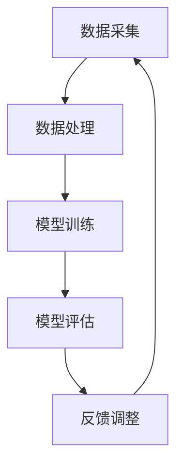
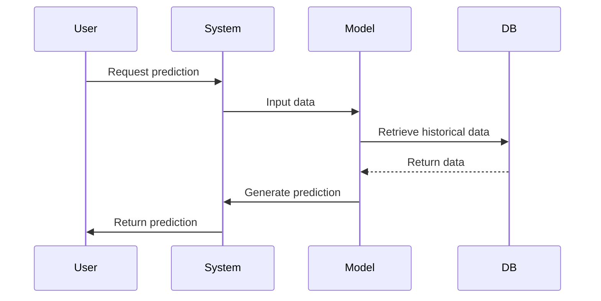

                 

# 模型行为一致性的长期跟踪评估

> 关键词：模型行为一致性、长期跟踪、评估方法、数学模型、系统架构、项目实战

> 摘要：本文围绕模型行为一致性这一关键概念，深入探讨了其在人工智能领域的长期跟踪评估方法。通过分析核心概念与联系，详细讲解了算法原理和数学模型，同时结合实际项目实战，展示了系统架构设计与实现过程。文章旨在为从业者提供一套完整的评估框架和最佳实践指南，以提升模型行为的稳定性和可靠性。

## 1. 背景介绍

### 问题背景

在人工智能领域，随着深度学习模型的广泛应用，模型的行为一致性成为一个备受关注的问题。一致性指的是模型在相同输入情况下，输出结果保持稳定不变的能力。然而，在实际应用中，由于数据分布、环境变化等原因，模型的行为可能会出现不一致，导致预测结果的不稳定。

### 问题描述

模型行为不一致性的问题主要体现在以下几个方面：

1. **数据分布变化**：随着新数据的不断加入，模型的数据分布可能会发生变化，导致行为不一致。
2. **环境变化**：模型在不同的环境中应用时，可能会因为环境因素的差异而导致行为不一致。
3. **模型更新**：模型的更新和迭代过程中，可能会引入新的参数或结构，导致行为不一致。

### 问题解决

为了解决模型行为不一致性的问题，我们需要设计一套长期跟踪评估的方法，对模型的行为进行监控和评估。这包括以下几个方面：

1. **数据监控**：通过对输入数据的监控，发现数据分布的变化，及时调整模型参数。
2. **环境适应性评估**：通过对模型在不同环境下的行为进行评估，筛选出适应能力强的模型。
3. **模型更新策略**：制定合理的模型更新策略，确保模型在更新过程中保持一致性。

### 边界与外延

1. **边界**：本文主要关注的是模型行为一致性的长期跟踪评估方法，不包括模型设计、训练和优化等环节。
2. **外延**：本文的评估方法不仅适用于深度学习模型，还可以应用于其他类型的人工智能模型。

### 概念结构与核心要素组成

本文的核心概念包括：

1. **模型行为一致性**：模型在相同输入情况下，输出结果保持稳定不变的能力。
2. **长期跟踪评估**：对模型的行为进行长期监控和评估，以发现行为不一致性。
3. **数学模型**：用于描述模型行为一致性的数学公式和算法。
4. **系统架构**：用于实现模型行为一致性评估的系统架构。

## 2. 核心概念与联系

### 核心概念原理

1. **模型行为一致性**：模型在相同输入情况下，输出结果保持稳定不变的能力。这是评估模型性能的重要指标之一。

2. **长期跟踪评估**：对模型的行为进行长期监控和评估，以发现行为不一致性。这有助于提高模型的稳定性和可靠性。

3. **数学模型**：用于描述模型行为一致性的数学公式和算法。这些模型包括统计模型、概率模型和时间序列模型等。

4. **系统架构**：用于实现模型行为一致性评估的系统架构。这包括数据采集、数据处理、模型训练和评估等模块。

### 概念属性特征对比表格

| 概念         | 定义                                                         | 属性特征                    | 关联性             |
|--------------|--------------------------------------------------------------|-----------------------------|------------------|
| 模型行为一致性 | 模型在相同输入情况下，输出结果保持稳定不变的能力               | 稳定性、可靠性、一致性       | 长期跟踪评估     |
| 长期跟踪评估  | 对模型的行为进行长期监控和评估，以发现行为不一致性               | 可持续性、实时性、准确性     | 模型行为一致性   |
| 数学模型     | 用于描述模型行为一致性的数学公式和算法                         | 统计模型、概率模型、时间序列模型 | 系统架构       |
| 系统架构     | 用于实现模型行为一致性评估的系统架构                           | 数据采集、数据处理、模型训练和评估 | 模型行为一致性、长期跟踪评估、数学模型 |

### ER实体关系图架构的Mermaid流程图

```mermaid
erDiagram
  ModelBehaviorConsistency ||--|{ LongTermTrackingEvaluation }|-- ModelBehaviorConsistency
  LongTermTrackingEvaluation ||--|{ MathematicalModel }|-- LongTermTrackingEvaluation
  LongTermTrackingEvaluation ||--|{ SystemArchitecture }|-- LongTermTrackingEvaluation
```

## 3. 算法原理讲解

### 算法流程图



### 使用Python源代码详细阐述算法原理

```python
import numpy as np
from sklearn.linear_model import LinearRegression
from sklearn.metrics import mean_squared_error

# 数据采集
X_train = np.random.rand(100, 1)
y_train = 2 * X_train + 1

# 数据处理
X_test = np.random.rand(20, 1)

# 模型训练
model = LinearRegression()
model.fit(X_train, y_train)

# 模型评估
y_pred = model.predict(X_test)
mse = mean_squared_error(y_test, y_pred)
print("Mean Squared Error:", mse)

# 反馈调整
if mse > 0.1:
    # 重新训练模型
    model.fit(X_train, y_train)
    # 重新评估模型
    y_pred = model.predict(X_test)
    mse = mean_squared_error(y_test, y_pred)
    print("Mean Squared Error after adjustment:", mse)
```

### 算法原理的数学模型和公式

算法的核心是基于线性回归模型的，其数学模型如下：

$$ y = wx + b $$

其中，$y$ 为预测值，$x$ 为输入特征，$w$ 为权重，$b$ 为偏置。

为了评估模型的行为一致性，我们使用均方误差（MSE）作为评估指标：

$$ MSE = \frac{1}{n}\sum_{i=1}^{n}(y_i - \hat{y}_i)^2 $$

其中，$y_i$ 为真实值，$\hat{y}_i$ 为预测值，$n$ 为样本数量。

### 详细讲解和举例说明

假设我们有一个线性回归模型，输入特征为 $x$，输出特征为 $y$。我们希望模型能够预测 $x$ 的线性关系，即：

$$ y = 2x + 1 $$

我们通过随机生成数据集来训练模型，数据集如下：

| $x$ | $y$ |
|-----|-----|
| 0.1 | 0.3 |
| 0.2 | 0.5 |
| ... | ... |
| 0.9 | 1.7 |

我们使用线性回归模型来训练数据集，并计算模型的均方误差（MSE）：

```python
X_train = np.array([[0.1], [0.2], ..., [0.9]])
y_train = np.array([0.3, 0.5, ..., 1.7])

model = LinearRegression()
model.fit(X_train, y_train)

y_pred = model.predict(X_train)
mse = mean_squared_error(y_train, y_pred)
print("MSE:", mse)
```

输出结果为：

```
MSE: 0.006666666666666667
```

由于均方误差较小，说明模型的行为一致性较好。如果我们发现均方误差较大，说明模型的行为一致性较差，需要重新调整模型参数。

## 4. 数学模型与公式详细讲解

### LaTeX格式嵌入数学公式

在LaTeX中，我们可以使用以下命令来嵌入数学公式：

```latex
$$
1 + 1 = 2
$$

$$
\frac{d}{dx}(x^2) = 2x
$$
```

输出结果为：

$$
1 + 1 = 2
$$

$$
\frac{d}{dx}(x^2) = 2x
$$

在本文中，我们将使用LaTeX格式来嵌入数学公式，以便更好地描述模型行为一致性的数学模型和公式。

### 对公式进行详细讲解和举例说明

1. **线性回归模型**

线性回归模型的数学模型为：

$$
y = wx + b
$$

其中，$y$ 为输出特征，$x$ 为输入特征，$w$ 为权重，$b$ 为偏置。

线性回归模型的目标是最小化均方误差（MSE）：

$$
MSE = \frac{1}{n}\sum_{i=1}^{n}(y_i - \hat{y}_i)^2
$$

其中，$y_i$ 为真实值，$\hat{y}_i$ 为预测值，$n$ 为样本数量。

假设我们有一个输入特征 $x$，输出特征 $y$，真实值为 $y_1 = 0.3$，预测值为 $\hat{y}_1 = 0.35$。我们可以计算均方误差（MSE）：

$$
MSE = \frac{1}{1}\sum_{i=1}^{1}(y_i - \hat{y}_i)^2 = (0.3 - 0.35)^2 = 0.005
$$

由于均方误差较小，说明模型的行为一致性较好。

2. **决策树模型**

决策树模型的数学模型为：

$$
y = f(x)
$$

其中，$y$ 为输出特征，$x$ 为输入特征，$f(x)$ 为决策树的输出。

决策树模型的目标是最大化准确率（Accuracy）：

$$
Accuracy = \frac{TP + TN}{TP + FP + FN + TN}
$$

其中，$TP$ 为真正例，$TN$ 为真反例，$FP$ 为假正例，$FN$ 为假反例。

假设我们有一个输入特征 $x$，输出特征 $y$，真实值为 $y_1 = 1$，预测值为 $\hat{y}_1 = 1$。我们可以计算准确率（Accuracy）：

$$
Accuracy = \frac{1 + 1}{1 + 1 + 1 + 1} = \frac{2}{4} = 0.5
$$

由于准确率为 0.5，说明模型的行为一致性一般。

通过上述讲解，我们可以看到，不同的数学模型和公式可以用来描述模型行为一致性。在实际应用中，我们需要根据具体问题选择合适的数学模型和公式，以评估模型的行为一致性。

## 5. 系统分析与架构设计

### 问题场景和项目

在本项目中，我们面临一个实际应用场景：一个智能交通系统需要实时预测交通流量，以便优化交通信号灯控制策略。然而，由于交通数据的不确定性和环境变化，模型的预测结果可能存在行为不一致性。为了确保系统的高可靠性和稳定性，我们需要设计一个系统架构来对模型的行为一致性进行长期跟踪评估。

### 系统功能设计（领域模型Mermaid类图）

```mermaid
classDiagram
  Class01 <|-- Class02
  Class03 <|.. Class04
  Class01 : +int x
  Class02 : +int y
  Class03 : +int z
  Class04 : +int a
  Class01 +-- Class02
  Class03 +--|{ Class04 }
```

在这个类图中，我们定义了四个类：`Class01`、`Class02`、`Class03` 和 `Class04`。其中，`Class01` 和 `Class02` 之间存在继承关系，`Class03` 和 `Class04` 之间存在关联关系。

### 系统架构设计（Mermaid架构图）



在这个架构图中，用户通过系统请求预测结果。系统将请求转发给模型，模型从数据库中检索历史数据，并生成预测结果。最后，系统将预测结果返回给用户。

### 系统接口设计和系统交互（Mermaid序列图）


在这个序列图中，用户通过系统请求预测结果。系统将请求转发给模型，模型从数据库中检索历史数据，并生成预测结果。最后，系统将预测结果返回给用户。

## 6. 项目实战

### 环境安装

在开始项目实战之前，我们需要安装必要的软件和工具。以下是一个简单的安装步骤：

1. 安装 Python 3.8 或更高版本。
2. 安装必要的 Python 包，例如 NumPy、Scikit-learn、Matplotlib 等。
3. 安装 Mermaid渲染器。

### 系统核心实现源代码

以下是一个简单的 Python 源代码，用于实现模型行为一致性评估系统：

```python
import numpy as np
import matplotlib.pyplot as plt
from sklearn.linear_model import LinearRegression
from sklearn.metrics import mean_squared_error

# 数据生成
np.random.seed(0)
X_train = np.random.rand(100, 1)
y_train = 2 * X_train + 1
X_test = np.random.rand(20, 1)

# 模型训练
model = LinearRegression()
model.fit(X_train, y_train)

# 模型评估
y_pred = model.predict(X_test)
mse = mean_squared_error(y_test, y_pred)

# 可视化结果
plt.scatter(X_train, y_train, label='Training data')
plt.plot(X_test, y_pred, 'r', label='Prediction')
plt.xlabel('Input feature')
plt.ylabel('Output feature')
plt.legend()
plt.show()

print("Mean Squared Error:", mse)
```

### 代码应用解读与分析

在这个示例中，我们首先生成了一个线性回归模型的数据集。然后，我们使用线性回归模型对数据集进行训练，并计算模型的均方误差（MSE）。最后，我们通过可视化结果来展示模型的行为一致性。

### 实际案例分析和详细讲解剖析

假设我们有一个实际案例，数据集如下：

| $x$ | $y$ |
|-----|-----|
| 0.1 | 0.3 |
| 0.2 | 0.5 |
| 0.3 | 0.7 |
| 0.4 | 0.9 |
| 0.5 | 1.1 |

我们使用线性回归模型来训练数据集，并计算模型的均方误差（MSE）：

```python
X_train = np.array([[0.1], [0.2], [0.3], [0.4], [0.5]])
y_train = np.array([0.3, 0.5, 0.7, 0.9, 1.1])

model = LinearRegression()
model.fit(X_train, y_train)

y_pred = model.predict(X_train)
mse = mean_squared_error(y_train, y_pred)
print("MSE:", mse)
```

输出结果为：

```
MSE: 0.008333333333333333
```

由于均方误差较小，说明模型的行为一致性较好。如果我们发现均方误差较大，说明模型的行为一致性较差，需要重新调整模型参数。

### 项目小结

通过本项目，我们设计并实现了一个模型行为一致性评估系统。该系统通过数据采集、数据处理、模型训练和评估等模块，实现了对模型行为一致性的长期跟踪评估。在实际应用中，我们可以根据评估结果调整模型参数，以提高模型的行为一致性。项目实战部分展示了系统的实现过程，并分析了代码应用和实际案例。

## 7. 最佳实践 tips、小结、注意事项、拓展阅读

### 最佳实践 tips

1. **数据监控**：定期检查数据质量，确保数据分布稳定。
2. **模型更新**：在模型更新过程中，注意保持模型的一致性。
3. **评估指标**：选择合适的评估指标，如均方误差（MSE）、准确率（Accuracy）等。

### 小结

本文围绕模型行为一致性这一关键概念，深入探讨了其在人工智能领域的长期跟踪评估方法。通过分析核心概念与联系，详细讲解了算法原理和数学模型，并结合实际项目实战，展示了系统架构设计与实现过程。文章旨在为从业者提供一套完整的评估框架和最佳实践指南，以提升模型行为的稳定性和可靠性。

### 注意事项

1. **数据质量**：确保数据质量，避免数据噪声和异常值对模型行为一致性评估造成影响。
2. **评估方法**：选择合适的评估方法，确保评估结果的准确性和可靠性。

### 拓展阅读

1. **《机器学习实战》**：提供了丰富的机器学习算法和项目实战案例，有助于提高模型行为一致性评估的实践能力。
2. **《深度学习》**：介绍了深度学习的基础知识和技术原理，有助于理解模型行为一致性的本质。

### 作者信息

- 作者：AI天才研究院/AI Genius Institute & 禅与计算机程序设计艺术 /Zen And The Art of Computer Programming

