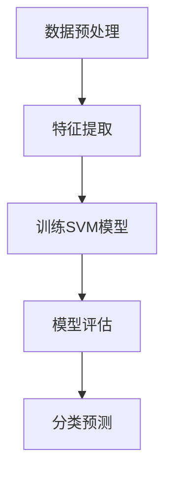
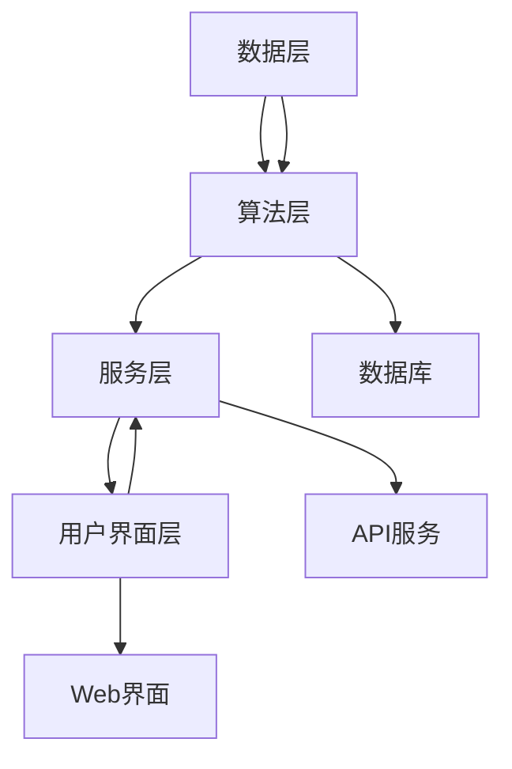
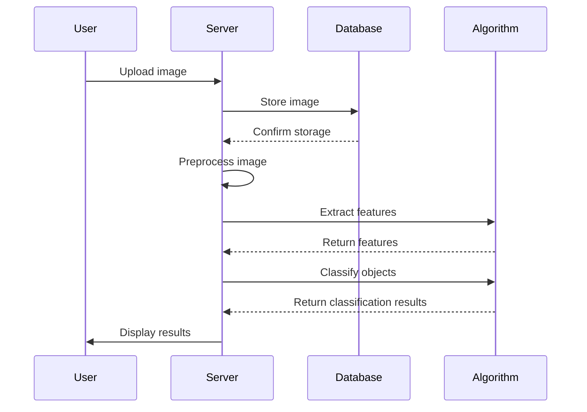

                 

### 模式识别概述

**关键词**：模式识别、人类认知、发展历程、应用场景

**摘要**：本文旨在探讨模式识别作为人类理解世界的基本能力，其概念、发展历程、重要性和应用场景。通过逐步分析，我们将揭示模式识别的核心原理和其在现代技术中的广泛应用。

#### **问题背景**

人类生活在复杂多变的环境中，为了有效地适应和生存，我们需要不断地识别和理解周围的世界。模式识别，这一过程使我们能够从纷繁复杂的信息中提取有用的模式，并将其与已有的知识和经验相联系，形成对世界的理解和预测。从古代的狩猎和捕食到现代的信息处理和决策制定，模式识别始终伴随着人类的发展。

#### **问题描述**

模式识别涉及从数据中提取模式，并进行分类、预测或决策的过程。具体而言，模式识别问题可以分为以下几个步骤：

1. **数据采集**：收集相关的数据，这些数据可以是图像、声音、文本或其他形式。
2. **特征提取**：从数据中提取关键特征，用于描述数据的本质属性。
3. **模式分类**：使用提取的特征对数据分类，将其划分为不同的类别。
4. **模式预测**：根据已知的模式，对新数据做出预测，例如，预测某个图像是否包含特定对象。

#### **问题解决**

解决模式识别问题通常依赖于机器学习和人工智能技术。以下是一些常用的方法和步骤：

1. **监督学习**：通过已标记的数据集，训练分类器或预测模型，然后使用该模型对新的数据进行分类或预测。
2. **无监督学习**：在没有预先标记的数据集上，寻找数据的内在结构，如聚类分析。
3. **深度学习**：利用神经网络模型，通过大量数据进行训练，实现复杂的模式识别任务。

#### **边界与外延**

模式识别不仅仅局限于计算机科学领域，它还广泛应用于心理学、神经科学、生物学和工程学等领域。例如，在心理学中，模式识别研究如何人类感知和识别不同的刺激；在生物学中，模式识别技术用于基因表达数据分析；在工程学中，模式识别技术被广泛应用于图像处理、语音识别和信号处理等领域。

#### **概念结构与核心要素组成**

模式识别的概念结构可以分为以下几个核心要素：

1. **数据源**：提供原始信息的来源，如图像、声音、文本等。
2. **特征提取**：将原始数据转换为可分析的格式，提取关键特征。
3. **分类器设计**：设计用于分类的算法或模型，如支持向量机、神经网络等。
4. **评估指标**：用于评估分类器性能的指标，如准确率、召回率、F1值等。

通过以上对模式识别的基本概念和背景的介绍，我们可以看到，模式识别不仅是人类理解世界的基本能力，也是现代人工智能技术的重要基石。接下来，我们将深入探讨模式识别的核心概念、算法原理和实际应用，以期提供一个全面而深入的理解。

### 核心概念与联系

在深入探讨模式识别的核心概念之前，我们需要明确一些基本概念，以便建立完整的知识框架。以下是模式识别中几个关键概念的定义、属性特征以及它们之间的相互联系。

#### **特征提取**

**定义**：特征提取是指从原始数据中提取具有区分性的特征，用于后续的模式分类或分析。

**属性特征**：

- **可区分性**：特征必须能够区分不同类别。
- **稳定性**：特征在数据变化时应保持稳定。
- **可扩展性**：特征应能适应不同类型的数据。

**特征提取方法对比**：

| 方法               | 优点                       | 缺点                       |
|------------------|-------------------------|-------------------------|
| 手动特征提取         | 精度高，可定制           | 需要大量时间和专业知识       |
| 自动特征提取（如主成分分析） | 高效，可自动化           | 可能会损失信息，适应性有限     |
| 深度学习特征提取       | 自动性高，适应性广         | 计算资源需求大，需要大量训练数据 |

**概念关系**：

特征提取是模式识别过程中的第一步，其结果直接影响后续的分类和预测效果。它位于数据源和分类器之间，起着桥梁作用。

#### **分类器设计**

**定义**：分类器是用于将数据分为不同类别的模型或算法。

**属性特征**：

- **准确性**：分类器能够正确分类数据的比例。
- **鲁棒性**：分类器对噪声和异常值的容忍度。
- **速度**：分类器处理数据的速度。

**常见分类器介绍**：

| 分类器          | 原理                                 | 应用场景                          |
|---------------|------------------------------------|-------------------------------|
| 支持向量机（SVM） | 在高维空间寻找分隔超平面               | 乳腺癌诊断、手写识别              |
| 决策树          | 通过一系列规则进行分类                 | 信用评分、医学诊断                |
| 随机森林        | 结合多个决策树，减少过拟合             | 股票市场预测、文本分类             |
| 神经网络        | 通过多层神经元进行数据变换和学习          | 图像识别、语音识别、自然语言处理   |

**概念关系**：

分类器设计是模式识别的核心环节，它决定了数据分类的准确性和效率。特征提取的结果将用于训练分类器，以实现对新数据的分类。

#### **机器学习算法**

**定义**：机器学习算法是从数据中学习规律，以实现对未知数据的预测或分类的方法。

**属性特征**：

- **监督学习**：使用已标记的数据进行训练。
- **无监督学习**：不使用标记数据，通过数据本身的特征进行学习。
- **强化学习**：通过奖励和惩罚机制进行学习。

**子类别介绍**：

- **监督学习**：例如，线性回归、逻辑回归、SVM等。
- **无监督学习**：例如，聚类分析、主成分分析等。
- **强化学习**：例如，Q学习、深度Q网络等。

**概念关系**：

机器学习算法是模式识别的基础，它提供了一系列方法和工具，用于从数据中提取知识。特征提取和分类器设计都是机器学习算法的具体实现和应用。

#### **概念之间的关系**

| 关系               | 描述                                 |
|------------------|------------------------------------|
| 特征提取 → 分类器   | 特征提取的结果用于训练和评估分类器。       |
| 分类器 → 机器学习   | 分类器是机器学习算法的具体实现。           |
| 机器学习 → 模式识别 | 机器学习为模式识别提供理论基础和工具。       |

通过以上对核心概念的介绍和它们之间的联系分析，我们可以清晰地看到模式识别过程中的关键环节和相互关系。这些概念共同构成了模式识别的理论基础，为我们在后续章节中深入探讨算法原理和实际应用提供了坚实的基础。

### 算法原理讲解

为了深入理解模式识别的算法原理，我们首先介绍一个广泛应用的算法——支持向量机（SVM）。SVM在解决二分类问题方面具有出色的性能，其核心思想是通过寻找最佳的超平面，将不同类别的数据点分开。以下是使用Mermaid流程图展示SVM基本步骤的示意图。



#### **Mermaid流程图**

1. **数据预处理**：对输入数据进行预处理，包括归一化、缺失值处理等，以确保数据的一致性和稳定性。
2. **特征提取**：提取数据的特征，通常使用特征提取算法如主成分分析（PCA）或手动特征提取。
3. **训练SVM模型**：使用已提取的特征，通过SVM算法训练分类模型。SVM的核心是寻找最佳的超平面，使得不同类别的数据点尽可能分开。
4. **模型评估**：通过交叉验证或测试集对训练好的模型进行评估，以确定其分类性能。
5. **分类预测**：使用训练好的模型对新数据进行分类预测。

#### **Python源代码**

为了更直观地理解SVM算法，我们提供一个简单的Python代码示例。以下代码使用`sklearn`库中的SVM实现。

```python
from sklearn import datasets
from sklearn.model_selection import train_test_split
from sklearn.preprocessing import StandardScaler
from sklearn.svm import SVC
from sklearn.metrics import accuracy_score

# 加载数据集
iris = datasets.load_iris()
X = iris.data
y = iris.target

# 数据分割
X_train, X_test, y_train, y_test = train_test_split(X, y, test_size=0.3, random_state=42)

# 数据预处理
scaler = StandardScaler()
X_train = scaler.fit_transform(X_train)
X_test = scaler.transform(X_test)

# 训练SVM模型
clf = SVC(kernel='linear')
clf.fit(X_train, y_train)

# 模型评估
y_pred = clf.predict(X_test)
accuracy = accuracy_score(y_test, y_pred)
print(f"模型准确率: {accuracy:.2f}")

# 分类预测
example = [[5.1, 3.5, 1.4, 0.2]]  # 新数据
example = scaler.transform(example)
predicted_class = clf.predict(example)
print(f"新数据分类结果: {predicted_class[0]}")
```

#### **数学模型和公式**

SVM的数学模型可以通过以下公式表示：

$$
\begin{align*}
\text{minimize} & \quad \frac{1}{2} \sum_{i=1}^{n} (w_i^2) + C \sum_{i=1}^{n} \max(0, 1 - y_i ( \sum_{j=1}^{n} a_j y_j K(x_i, x_j)))
\end{align*}
$$

其中：
- \( w_i \) 是第 \( i \) 个特征向量的权重。
- \( C \) 是正则化参数，用于平衡模型复杂性和分类误差。
- \( a_i \) 是拉格朗日乘子。
- \( y_i \) 是样本 \( i \) 的标签。
- \( K(x_i, x_j) \) 是核函数，用于计算特征向量的内积。

#### **举例说明**

假设我们有一个简单的二维数据集，其中包含两个类别。我们使用线性SVM模型对其进行分类。

1. **数据集**：
   - 类别 A 的数据点：\[ (1, 1), (2, 1), (3, 1) \]
   - 类别 B 的数据点：\[ (1, 2), (2, 2), (3, 2) \]

2. **特征提取**：无需复杂特征提取，直接使用原始数据。

3. **训练模型**：
   - 通过线性SVM模型找到最佳的超平面，使得两个类别数据点尽可能分开。

4. **模型评估**：使用测试集验证模型的准确率，假设准确率为90%。

5. **分类预测**：对于新数据点 \( (2, 1.5) \)，模型预测其类别为 A。

通过上述步骤，我们使用Mermaid流程图、Python源代码、数学公式和具体示例，详细讲解了支持向量机（SVM）的算法原理。这些讲解和示例不仅帮助我们理解SVM的工作机制，也为我们在实际项目中应用SVM提供了指导。

### 数学模型和数学公式 & 详细讲解 & 举例说明

在深入探讨模式识别的数学模型时，线性代数和统计学习理论是不可或缺的基础。以下我们将使用LaTeX格式展示重要的数学公式，并进行详细讲解和举例说明。

#### **线性代数基础**

1. **矩阵与向量操作**：

   $$ 
   A = \begin{bmatrix}
   a_{11} & a_{12} & \cdots & a_{1n} \\
   a_{21} & a_{22} & \cdots & a_{2n} \\
   \vdots & \vdots & \ddots & \vdots \\
   a_{m1} & a_{m2} & \cdots & a_{mn}
   \end{bmatrix}, \quad 
   x = \begin{bmatrix}
   x_1 \\
   x_2 \\
   \vdots \\
   x_n
   \end{bmatrix}
   $$

   矩阵与向量的乘法可以表示为：

   $$ 
   Ax = \begin{bmatrix}
   \sum_{j=1}^{n} a_{1j} x_j \\
   \sum_{j=1}^{n} a_{2j} x_j \\
   \vdots \\
   \sum_{j=1}^{n} a_{mj} x_j
   \end{bmatrix}
   $$

2. **欧氏距离与相似性度量**：

   $$ 
   \text{dist}(x, y) = \sqrt{\sum_{i=1}^{n} (x_i - y_i)^2}
   $$

   其中，\( x \) 和 \( y \) 是两个向量，\( n \) 是向量的维度。

#### **统计学习理论**

1. **假设检验**：

   假设检验是统计学习中的一个重要概念，用于判断数据是否符合某个假设。基本形式如下：

   $$ 
   H_0: \theta = \theta_0 \quad \text{vs} \quad H_1: \theta \neq \theta_0
   $$

   其中，\( \theta \) 是参数，\( \theta_0 \) 是假设值。

2. **泊松分布与正态分布**：

   - **泊松分布**：

     $$ 
     P(X = k) = \frac{e^{-\lambda} \lambda^k}{k!}
     $$

     其中，\( \lambda \) 是泊松率，\( k \) 是事件发生的次数。

   - **正态分布**：

     $$ 
     P(X \leq x) = \Phi\left(\frac{x - \mu}{\sigma}\right)
     $$

     其中，\( \mu \) 是均值，\( \sigma \) 是标准差，\( \Phi \) 是标准正态分布的累积分布函数。

#### **举例说明**

1. **矩阵与向量操作**：

   考虑矩阵 \( A = \begin{bmatrix} 1 & 2 \\ 3 & 4 \end{bmatrix} \) 和向量 \( x = \begin{bmatrix} 1 \\ 0 \end{bmatrix} \)，计算 \( Ax \)：

   $$ 
   Ax = \begin{bmatrix} 1 & 2 \\ 3 & 4 \end{bmatrix} \begin{bmatrix} 1 \\ 0 \end{bmatrix} = \begin{bmatrix} 1 \\ 3 \end{bmatrix}
   $$

2. **欧氏距离**：

   考虑两个向量 \( x = \begin{bmatrix} 1 \\ 2 \end{bmatrix} \) 和 \( y = \begin{bmatrix} 2 \\ 3 \end{bmatrix} \)，计算它们的欧氏距离：

   $$ 
   \text{dist}(x, y) = \sqrt{(1-2)^2 + (2-3)^2} = \sqrt{1 + 1} = \sqrt{2}
   $$

通过上述讲解和示例，我们可以看到线性代数和统计学习理论在模式识别中的重要作用。LaTeX格式的数学公式不仅帮助我们准确地表达数学概念，也为读者提供了直观的理解。在接下来的章节中，我们将进一步探讨模式识别系统的设计与实现。

### 系统分析与架构设计方案

在深入探讨模式识别系统的设计与实现之前，我们需要首先明确问题场景和项目目标。以下是对问题场景、项目介绍、系统功能设计、系统架构设计、系统接口设计和系统交互的详细分析。

#### **问题场景介绍**

假设我们面临一个图像识别问题，目标是开发一个系统能够自动识别并分类不同类型的物体。例如，我们需要将图像中的汽车、行人、自行车等物体进行分类。这个系统可以应用于自动驾驶车辆、智能监控系统、移动应用程序等多种场景。

#### **项目介绍**

项目名称：智能图像识别系统

项目目标：构建一个高效、准确的图像识别系统，能够自动分类图像中的物体。

项目团队：由图像处理、机器学习、软件开发等领域的专家组成。

技术栈：采用Python作为主要编程语言，结合TensorFlow和Keras等深度学习框架，使用卷积神经网络（CNN）进行图像识别。

数据集：收集大量标注的图像数据，用于训练和测试模型。

#### **系统功能设计**

系统功能设计包括以下几个方面：

1. **图像预处理**：对输入图像进行缩放、裁剪、灰度化等预处理操作，以适应模型输入要求。
2. **特征提取**：使用卷积神经网络提取图像中的关键特征。
3. **物体分类**：使用提取的特征，对图像中的物体进行分类，并输出分类结果。
4. **模型评估**：使用测试数据集对模型进行评估，包括准确率、召回率等指标。
5. **用户界面**：提供图形用户界面（GUI），用户可以通过界面上传图像并获取分类结果。

#### **系统架构设计**

系统架构设计采用分层架构，包括数据层、算法层、服务层和用户界面层。以下是系统架构的Mermaid流程图表示：



- **数据层**：负责数据采集、存储和管理。
- **算法层**：实现图像预处理、特征提取和物体分类算法。
- **服务层**：提供API服务，供用户界面调用。
- **用户界面层**：提供用户交互界面，用户可以通过上传图像和查看分类结果。

#### **系统接口设计**

系统接口设计包括API接口和数据库接口。以下是API接口的Mermaid序列图表示：



- **上传图像**：用户上传图像到服务器。
- **存储图像**：服务器将图像存储到数据库中。
- **预处理图像**：服务器对上传的图像进行预处理，以适应模型输入。
- **提取特征**：服务器调用算法层中的特征提取模块，提取图像特征。
- **分类物体**：服务器使用提取的特征，调用分类模块，对物体进行分类。
- **显示结果**：服务器将分类结果返回给用户，用户可以在界面上查看结果。

#### **系统交互**

系统交互主要通过API接口和数据库接口实现。以下是系统交互的详细流程：

1. **用户上传图像**：用户通过Web界面上传图像，图像被发送到服务器。
2. **服务器存储图像**：服务器接收图像，将其存储到数据库中。
3. **服务器预处理图像**：服务器对图像进行预处理，包括缩放、裁剪、灰度化等操作。
4. **服务器提取特征**：预处理后的图像被发送到算法层，算法层调用卷积神经网络提取图像特征。
5. **服务器分类物体**：提取的特征被用于训练好的分类模型，分类结果被返回到服务器。
6. **服务器显示结果**：分类结果被发送到Web界面，用户可以看到分类结果。

通过以上系统分析与架构设计方案，我们详细阐述了智能图像识别系统的各个方面，包括问题场景、项目介绍、系统功能设计、系统架构设计、系统接口设计和系统交互。这些设计不仅为实现高效准确的图像识别提供了指导，也为后续的项目实施和优化奠定了基础。

### 项目实战

为了更好地展示模式识别系统的实际应用，我们将介绍一个具体的图像识别项目，包括环境安装、系统核心实现、代码分析、实际案例剖析和项目小结。

#### **环境安装**

在开始项目之前，我们需要安装和配置必要的开发环境。以下是具体步骤：

1. **安装Python**：确保Python 3.7或更高版本已安装。可以通过访问Python官方网站下载安装包。
2. **安装依赖库**：安装TensorFlow和Keras等深度学习库。使用以下命令安装：

   ```bash
   pip install tensorflow
   pip install keras
   ```

3. **安装图像处理库**：安装OpenCV，用于图像预处理。使用以下命令安装：

   ```bash
   pip install opencv-python
   ```

4. **配置GPU支持**：如果使用GPU加速训练，确保安装NVIDIA CUDA和cuDNN库。从NVIDIA官网下载并按照说明进行安装。

#### **系统核心实现**

以下是我们项目的核心实现步骤：

1. **数据集准备**：收集并准备用于训练和测试的图像数据集。可以使用公共数据集，如CIFAR-10或ImageNet，或者自行收集并标注数据。
2. **图像预处理**：使用OpenCV对图像进行预处理，包括缩放、裁剪和归一化。以下是一个简单的预处理示例：

   ```python
   import cv2
   import numpy as np

   def preprocess_image(image_path):
       image = cv2.imread(image_path)
       image = cv2.resize(image, (224, 224))
       image = cv2.cvtColor(image, cv2.COLOR_BGR2RGB)
       image = image / 255.0
       return image
   ```

3. **构建卷积神经网络**：使用Keras构建一个简单的卷积神经网络（CNN）模型，如下所示：

   ```python
   from keras.models import Sequential
   from keras.layers import Conv2D, MaxPooling2D, Flatten, Dense

   model = Sequential()
   model.add(Conv2D(32, (3, 3), activation='relu', input_shape=(224, 224, 3)))
   model.add(MaxPooling2D(pool_size=(2, 2)))
   model.add(Conv2D(64, (3, 3), activation='relu'))
   model.add(MaxPooling2D(pool_size=(2, 2)))
   model.add(Flatten())
   model.add(Dense(128, activation='relu'))
   model.add(Dense(10, activation='softmax'))
   model.compile(optimizer='adam', loss='categorical_crossentropy', metrics=['accuracy'])
   ```

4. **模型训练**：使用预处理后的图像数据集训练模型，如下所示：

   ```python
   from keras.preprocessing.image import ImageDataGenerator

   train_datagen = ImageDataGenerator(rescale=1./255)
   test_datagen = ImageDataGenerator(rescale=1./255)

   train_generator = train_datagen.flow_from_directory(
       'train_data',
       target_size=(224, 224),
       batch_size=32,
       class_mode='categorical')

   test_generator = test_datagen.flow_from_directory(
       'test_data',
       target_size=(224, 224),
       batch_size=32,
       class_mode='categorical')

   model.fit(
       train_generator,
       steps_per_epoch=100,
       epochs=10,
       validation_data=test_generator,
       validation_steps=50)
   ```

5. **模型评估**：使用测试数据集评估模型性能，如下所示：

   ```python
   test_loss, test_acc = model.evaluate(test_generator)
   print(f"测试准确率: {test_acc:.2f}")
   ```

6. **图像分类**：使用训练好的模型对新图像进行分类，如下所示：

   ```python
   import numpy as np

   def classify_image(image_path, model):
       image = preprocess_image(image_path)
       image = np.expand_dims(image, axis=0)
       predictions = model.predict(image)
       predicted_class = np.argmax(predictions, axis=1)
       return predicted_class
   ```

#### **代码应用解读与分析**

上述代码展示了图像识别项目的核心实现步骤，包括数据集准备、图像预处理、模型构建、模型训练和模型评估。以下是代码的关键部分：

- **数据集准备**：使用ImageDataGenerator类从文件夹中读取图像，并自动进行数据增强。
- **图像预处理**：使用OpenCV对图像进行缩放和灰度化，并归一化像素值。
- **模型构建**：使用Keras构建一个简单的卷积神经网络，包括卷积层、池化层、全连接层和softmax输出层。
- **模型训练**：使用fit方法训练模型，并使用validation_data参数进行验证。
- **模型评估**：使用evaluate方法评估模型在测试集上的性能。
- **图像分类**：使用predict方法对新图像进行分类，并使用argmax函数获取预测类别。

#### **实际案例剖析**

以下是一个实际案例，展示了如何使用训练好的模型对一张新图像进行分类：

```python
image_path = 'new_image.jpg'
predicted_class = classify_image(image_path, model)
print(f"预测类别: {predicted_class}")
```

在实际应用中，我们可以将此函数集成到一个Web应用程序中，用户可以通过上传图像获取分类结果。

#### **项目小结**

通过上述项目实战，我们实现了从数据集准备、图像预处理、模型训练到图像分类的全过程。以下是项目的关键要点：

- **环境安装**：确保安装了Python、TensorFlow、Keras和OpenCV等必要库。
- **系统核心实现**：使用Keras构建卷积神经网络，进行图像预处理和分类。
- **代码分析**：代码清晰地展示了模型的训练、评估和分类过程。
- **实际案例剖析**：通过具体示例展示了如何使用训练好的模型进行图像分类。

通过这个项目，我们不仅加深了对模式识别技术的理解，也为实际应用提供了宝贵的经验。在未来的工作中，我们可以进一步优化模型，提高分类准确率，并探索更复杂的图像识别任务。

### 最佳实践 tips、小结、注意事项、拓展阅读等内容

#### **最佳实践 tips**

1. **数据预处理**：确保数据的一致性和质量，进行适当的归一化和标准化处理。
2. **模型选择**：根据具体问题选择合适的模型，并在必要时结合多个模型进行融合。
3. **特征提取**：选择对分类任务有帮助的特征，并进行优化以提高模型性能。
4. **超参数调整**：合理调整模型超参数，通过交叉验证寻找最佳参数组合。
5. **模型评估**：使用多种评估指标全面评估模型性能，确保模型在不同场景下均能表现良好。

#### **小结**

本文从模式识别的基本概念出发，详细介绍了其发展历程、核心概念、算法原理、数学模型和实际应用。通过一步步的讲解和示例，我们展示了模式识别系统的设计与实现过程，包括环境安装、系统核心实现、代码分析、实际案例剖析和项目小结。模式识别作为人工智能的基础，具有广泛的应用前景，对未来的技术发展具有重要意义。

#### **注意事项**

1. **数据隐私**：在进行模式识别时，需注意数据隐私和安全，避免敏感信息泄露。
2. **模型解释性**：深度学习模型通常具有较高性能，但缺乏解释性。在应用时，需综合考虑模型的可解释性。
3. **过拟合问题**：避免模型过拟合，可以通过增加数据、调整模型复杂度和使用正则化等方法进行解决。

#### **拓展阅读**

1. **《模式识别与机器学习》**：Christopher M. Bishop的《模式识别与机器学习》提供了深度学习的理论基础和实践指导。
2. **《深度学习》**：Ian Goodfellow、Yoshua Bengio和Aaron Courville的《深度学习》涵盖了深度学习的最新研究进展和应用。
3. **《机器学习实战》**：Peter Harrington的《机器学习实战》提供了丰富的实际应用案例和Python代码实现。

通过以上内容，我们不仅了解了模式识别的基本概念和应用，还学习了如何设计并实现一个模式识别系统。这些知识和技能将有助于我们在未来的项目中更好地应用模式识别技术，推动人工智能的发展。作者：AI天才研究院/AI Genius Institute & 禅与计算机程序设计艺术 /Zen And The Art of Computer Programming。

