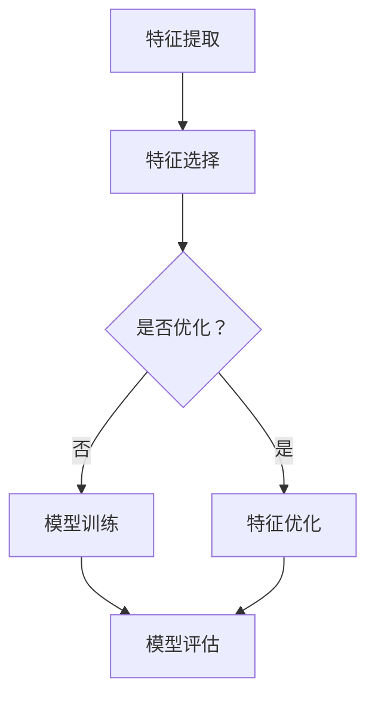
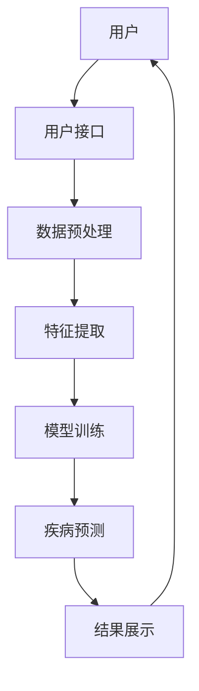
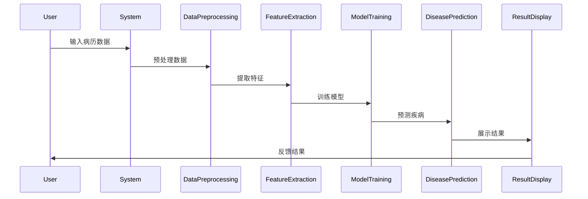

                 

# 模式识别：自然特征的数学提取

## 关键词

- 模式识别
- 自然特征提取
- 数学工具
- 特征提取技术
- 分类器设计
- 应用案例分析

## 摘要

本文旨在探讨模式识别中自然特征的数学提取方法，包括特征提取的基本概念、技术、算法原理及其在图像处理、语音识别等领域的应用。通过系统的分析和讲解，本文将为读者提供一个全面、深入的视角，帮助理解模式识别的关键技术及其在实际项目中的实现和应用。

## 引言

模式识别是人工智能领域的一个重要分支，它涉及从数据中提取有用的信息，并将其用于分类、回归、聚类等任务。在模式识别中，自然特征的提取是关键步骤，它决定了模型的表现和效率。自然特征通常是指从原始数据中直接提取的有意义的属性，这些特征能够有效地反映数据的本质属性，从而提高分类或回归的准确性。

自然特征提取的数学基础包括线性代数、概率统计、优化方法等。这些数学工具为特征提取提供了理论基础和操作方法。例如，线性代数用于处理高维数据的变换和降维；概率统计用于评估特征的有效性和可靠性；优化方法用于在大量特征中选择最有用的特征。

本文将分为以下几部分：

1. **基础数学工具**：介绍用于特征提取的线性代数、概率统计和优化方法。
2. **特征提取技术**：详细探讨常见的特征提取方法，包括频率域特征提取、时域特征提取和纹理特征提取。
3. **分类器设计**：介绍分类器的基本原理和设计方法，以及如何选择和优化分类器。
4. **模式识别应用**：展示模式识别在图像处理、语音识别等领域的应用案例。
5. **自然特征提取**：深入讨论自然特征提取的方法和技术。
6. **评估与优化**：讨论如何评估模式识别系统的性能，以及如何进行优化。
7. **前沿研究与发展趋势**：介绍当前的研究热点和未来的发展方向。

## 第1章 基础数学工具

### 1.1 线性代数基础

线性代数是特征提取的重要工具，它涉及向量和矩阵的基本概念及运算。在模式识别中，向量常用于表示数据的特征，矩阵则用于表示数据集和特征变换。

#### 向量和矩阵

向量是具有大小和方向的量，通常用符号\( \mathbf{v} \)表示。矩阵是向量的扩展，由多个向量组成的数组，通常用符号\( \mathbf{A} \)表示。

$$
\mathbf{v} = \begin{bmatrix}
v_1 \\
v_2 \\
\vdots \\
v_n
\end{bmatrix}, \quad
\mathbf{A} = \begin{bmatrix}
a_{11} & a_{12} & \cdots & a_{1n} \\
a_{21} & a_{22} & \cdots & a_{2n} \\
\vdots & \vdots & \ddots & \vdots \\
a_{m1} & a_{m2} & \cdots & a_{mn}
\end{bmatrix}
$$

#### 线性变换与特征值

线性变换是将一个向量映射到另一个向量的操作。矩阵\( \mathbf{A} \)可以定义一个线性变换，即

$$
\mathbf{A}\mathbf{v} = \begin{bmatrix}
a_{11}v_1 + a_{12}v_2 + \cdots + a_{1n}v_n \\
a_{21}v_1 + a_{22}v_2 + \cdots + a_{2n}v_n \\
\vdots \\
a_{m1}v_1 + a_{m2}v_2 + \cdots + a_{mn}v_n
\end{bmatrix}
$$

特征值是矩阵的一个重要属性，它表示线性变换在特征向量方向上的拉伸或压缩因子。特征值\( \lambda \)和特征向量\( \mathbf{v} \)满足以下方程：

$$
\mathbf{A}\mathbf{v} = \lambda \mathbf{v}
$$

#### 线性方程组与矩阵分解

线性方程组可以表示为矩阵形式，即

$$
\mathbf{A}\mathbf{x} = \mathbf{b}
$$

其中，\( \mathbf{x} \)是未知向量，\( \mathbf{b} \)是已知向量。矩阵分解是将矩阵分解为多个简单矩阵的乘积，常用的分解方法有LU分解和SVD分解。

### 1.2 概率统计基础

概率统计是特征提取和评估的重要工具。它提供了一种量化不确定性和评估特征有效性的方法。

#### 概率论基础

概率是描述事件发生可能性的一种量化方法。基本概率公式如下：

$$
P(A \cap B) = P(A)P(B|A), \quad P(A \cup B) = P(A) + P(B) - P(A \cap B)
$$

条件概率是指在已知某个事件发生的条件下，另一个事件发生的概率。

$$
P(B|A) = \frac{P(A \cap B)}{P(A)}
$$

贝叶斯定理是一种用于计算后验概率的概率理论公式：

$$
P(A|B) = \frac{P(B|A)P(A)}{P(B)}
$$

#### 统计量与假设检验

统计量是从样本数据中提取的有用信息。常用的统计量包括均值、方差、协方差等。

$$
\bar{x} = \frac{1}{n}\sum_{i=1}^{n}x_i, \quad \sigma^2 = \frac{1}{n-1}\sum_{i=1}^{n}(x_i - \bar{x})^2
$$

假设检验是用于判断某个统计假设是否成立的方法。常用的假设检验方法有t检验、卡方检验等。

### 1.3 优化方法

优化方法是用于寻找最优解的算法。在特征提取中，优化方法常用于特征选择和特征变换。

#### 梯度下降法

梯度下降法是一种用于最小化损失函数的优化方法。它的基本思想是沿着损失函数梯度的反方向进行迭代，逐步减小损失函数的值。

$$
\mathbf{w}_{t+1} = \mathbf{w}_{t} - \alpha \nabla_{\mathbf{w}} J(\mathbf{w})
$$

其中，\( \mathbf{w} \)是参数向量，\( \alpha \)是学习率，\( J(\mathbf{w}) \)是损失函数。

#### 随机梯度下降法

随机梯度下降法是梯度下降法的一种变体，它在每个迭代步骤中仅使用一个样本或一个小批量样本进行梯度计算，从而减少计算量和内存需求。

$$
\mathbf{w}_{t+1} = \mathbf{w}_{t} - \alpha \nabla_{\mathbf{w}} J(\mathbf{x}_t, \mathbf{y}_t)
$$

#### 粗糙集方法

粗糙集方法是一种用于特征选择和特征抽取的数学工具。它通过属性的重要度来评估特征的有效性，并从原始数据中提取出最具有代表性的特征。

## 第2章 特征提取技术

特征提取是模式识别中的关键步骤，它从原始数据中提取出具有区分性的属性，以供分类或回归模型使用。根据提取特征的方法，特征提取技术可以分为频率域特征提取、时域特征提取和纹理特征提取。

### 2.1 频率域特征提取

频率域特征提取是通过对信号进行傅里叶变换，将时域信号转换为频率域信号，从而提取出信号的频率特征。傅里叶变换是将信号从时域转换到频率域的一种数学方法，它可以将信号分解为不同频率的正弦波和余弦波。

#### 傅里叶变换

傅里叶变换定义为：

$$
X(f) = \int_{-\infty}^{\infty} x(t)e^{-j2\pi ft} dt
$$

其中，\( X(f) \)是频率域信号，\( x(t) \)是时域信号，\( f \)是频率。

#### 傅里叶变换的应用

频率域特征提取在图像处理、语音识别等领域有广泛的应用。例如，在图像处理中，可以通过傅里叶变换提取图像的频率特征，用于图像的分类和识别。

### 2.2 时域特征提取

时域特征提取是直接对时域信号进行处理，提取出信号的有用特征。时域特征提取方法包括时域统计特征提取和时域变换特征提取。

#### 时域统计特征提取

时域统计特征提取是从时域信号中提取出一些基本的统计量，如均值、方差、自相关函数等。

$$
\mu = \frac{1}{N}\sum_{i=1}^{N}x_i, \quad \sigma^2 = \frac{1}{N-1}\sum_{i=1}^{N}(x_i - \mu)^2
$$

自相关函数是描述信号之间相关性的重要特征，它反映了信号在不同时间点的相关性。

$$
Rxx(\tau) = \frac{1}{N}\sum_{i=1}^{N}x_i x_{i+\tau}
$$

#### 时域变换特征提取

时域变换特征提取是将时域信号转换为其他形式的信号，从而提取出信号的特征。常见的时域变换方法有离散小波变换和希尔伯特-黄变换。

离散小波变换是将信号分解为不同尺度和位置的局部特征，从而提取出信号的时间频率特征。

希尔伯特-黄变换是将信号分解为具有不同频率和幅度的子信号，从而提取出信号的时间频率特征。

### 2.3 纹理特征提取

纹理特征提取是用于描述图像纹理结构的一种特征提取方法。纹理特征通常反映了图像的局部结构和模式。

#### 纹理特征提取方法

常见的纹理特征提取方法包括共生矩阵、灰度级线性混合和纹理能量计算等。

共生矩阵是用于描述图像纹理结构的一种矩阵。它通过计算图像中相邻像素的灰度级分布来提取纹理特征。

灰度级线性混合是将图像的灰度级进行线性变换，从而提取出纹理特征。常见的线性变换方法有直方图均衡和自适应直方图均衡。

纹理能量计算是用于描述图像纹理强度的一种方法。它通过计算图像的像素强度方差来提取纹理特征。

$$
E = \frac{1}{N}\sum_{i=1}^{N}(x_i - \mu)^2
$$

#### 纹理特征的应用

纹理特征在图像识别、图像分类和图像检索等领域有广泛的应用。例如，在医学图像分析中，纹理特征可以用于识别肿瘤和正常组织。

## 第3章 分类器设计

分类器是模式识别中的核心组件，它用于将数据分为不同的类别。分类器的设计和选择对于模式识别系统的性能至关重要。本节将介绍分类器的基本原理、设计方法和选择策略。

### 3.1 分类器基础

分类器是一种从数据中学习规律并做出分类预测的模型。它基于训练数据集学习特征和类别的映射关系，并在测试数据集上进行预测。

#### 分类器的定义

分类器是一个函数\( f \)，它将输入特征向量映射到相应的类别标签：

$$
f(\mathbf{x}) = y
$$

其中，\( \mathbf{x} \)是输入特征向量，\( y \)是类别标签。

#### 分类器的评估指标

分类器的评估指标用于衡量分类器的性能。常用的评估指标包括准确率、召回率、精确率和F1分数等。

$$
\text{准确率} = \frac{\text{预测正确的样本数}}{\text{总样本数}} \\
\text{召回率} = \frac{\text{预测正确的正类样本数}}{\text{实际的正类样本数}} \\
\text{精确率} = \frac{\text{预测正确的正类样本数}}{\text{预测为正类的样本数}} \\
F1 \text{分数} = 2 \times \frac{\text{精确率} \times \text{召回率}}{\text{精确率} + \text{召回率}}
$$

#### 分类器的设计原则

分类器的设计需要考虑以下原则：

1. **可解释性**：分类器应该具有可解释性，使得用户能够理解分类的决策过程。
2. **鲁棒性**：分类器应该对噪声和异常值具有鲁棒性，能够正确分类。
3. **泛化能力**：分类器应该具有良好的泛化能力，能够在新数据上保持良好的性能。
4. **计算效率**：分类器的训练和预测应该具有高效性，以适应实际应用场景。

### 3.2 分类器的类型

分类器可以分为监督学习分类器和无监督学习分类器。监督学习分类器需要训练数据集来学习分类模型，而无监督学习分类器不需要训练数据集。

#### 监督学习分类器

监督学习分类器根据训练数据集学习分类模型，常见的监督学习分类器包括：

1. **朴素贝叶斯分类器**：基于贝叶斯定理和特征条件独立假设进行分类。
2. **支持向量机**（SVM）：通过寻找最优超平面进行分类。
3. **决策树**：通过构建树状结构进行分类。
4. **随机森林**：基于决策树的集成学习方法。
5. **K最近邻分类器**（K-NN）：基于邻近数据点的分类。

#### 无监督学习分类器

无监督学习分类器不需要训练数据集，常见的无监督学习分类器包括：

1. **聚类算法**：如K均值聚类和层次聚类，用于将数据分为不同的簇。
2. **主成分分析**（PCA）：用于降维和特征提取。
3. **自编码器**：一种神经网络模型，用于无监督特征提取。

### 3.3 分类器的选择

分类器的选择取决于具体的应用场景和数据特点。以下是一些选择分类器的策略：

1. **数据规模**：对于大规模数据集，选择计算效率高的分类器，如K-NN和决策树。
2. **特征维度**：对于高维数据集，选择降维方法，如PCA或主成分分析。
3. **数据分布**：对于数据分布不均匀的情况，选择能够处理不平衡数据的分类器，如随机森林和SVM。
4. **分类准确性**：通过交叉验证等方法评估分类器的准确性，选择性能较好的分类器。
5. **可解释性**：根据实际需求，选择具有可解释性的分类器，以便进行模型解释和优化。

## 第4章 模式识别应用

模式识别技术在许多领域有着广泛的应用，包括图像处理、语音识别、生物特征识别等。本节将介绍模式识别在图像处理和语音识别领域的应用案例。

### 4.1 图像处理中的应用

图像处理是模式识别的重要应用领域，包括图像分类、图像识别和图像分割等任务。

#### 图像分类

图像分类是将图像分为不同的类别。常见的图像分类任务包括人脸识别、物体检测和场景分类等。例如，卷积神经网络（CNN）在图像分类中表现出色，已经应用于许多实际场景，如人脸识别系统和自动驾驶车辆。

#### 图像识别

图像识别是识别图像中的特定对象或特征。例如，在医疗图像分析中，可以使用模式识别技术来检测和诊断疾病，如乳腺癌检测和视网膜病变检测。

#### 图像分割

图像分割是将图像划分为不同的区域或对象。图像分割在图像处理中具有广泛的应用，如目标跟踪、图像编辑和图像增强等。

### 4.2 语音识别中的应用

语音识别是将语音信号转换为文本或命令。语音识别技术在智能助手、语音翻译和语音控制系统中有广泛应用。

#### 语音信号处理

语音信号处理是语音识别的基础步骤，包括语音信号采集、预处理和特征提取。常用的语音信号处理方法包括滤波、归一化和特征提取。

#### 语音识别系统

语音识别系统由多个模块组成，包括语音信号处理模块、特征提取模块、模型训练模块和预测模块。常见的语音识别系统包括基于隐马尔可夫模型（HMM）的系统和基于深度学习的系统。

#### 语音识别应用案例

语音识别技术广泛应用于语音助手（如Siri和Alexa）、语音翻译和语音控制系统。例如，在医疗领域，语音识别技术可以用于记录和整理医生和患者的交流，提高医疗效率。

## 第5章 自然特征提取

自然特征提取是模式识别中的关键步骤，它从原始数据中提取出具有区分性的属性，以供分类或回归模型使用。自然特征通常是指从数据中直接提取的有意义的属性，这些特征能够有效地反映数据的本质属性，从而提高分类或回归的准确性。

### 5.1 自然特征提取的基本概念

自然特征提取的基本概念包括特征提取、特征选择和特征降维。

#### 特征提取

特征提取是从原始数据中提取出有意义的属性的过程。特征提取的目标是减少数据维度，同时保留数据的主要信息。

#### 特征选择

特征选择是在提取出的特征中筛选出最有用的特征，以提高分类或回归的准确性。特征选择的方法包括基于信息增益的算法、基于 Relief 算法和基于正则化的方法。

#### 特征降维

特征降维是将高维数据转换为低维数据，以减少计算量和提高计算效率。常见的特征降维方法包括主成分分析（PCA）、线性判别分析（LDA）和小波变换等。

### 5.2 自然特征提取的方法

自然特征提取的方法可以根据提取特征的类型分为频率域特征提取、时域特征提取和纹理特征提取。

#### 频率域特征提取

频率域特征提取是通过对信号进行傅里叶变换，将时域信号转换为频率域信号，从而提取出信号的频率特征。频率域特征提取在图像处理和语音识别等领域有广泛的应用。

#### 时域特征提取

时域特征提取是直接对时域信号进行处理，提取出信号的有用特征。时域特征提取方法包括时域统计特征提取和时域变换特征提取。

#### 纹理特征提取

纹理特征提取是用于描述图像纹理结构的一种特征提取方法。纹理特征通常反映了图像的局部结构和模式。常见的纹理特征提取方法包括共生矩阵、灰度级线性混合和纹理能量计算等。

### 5.3 自然特征提取的应用

自然特征提取在图像处理、语音识别和生物特征识别等领域有广泛的应用。

#### 图像处理中的应用

在图像处理中，自然特征提取用于图像分类、图像识别和图像分割等任务。例如，在人脸识别中，可以使用基于卷积神经网络的自然特征提取方法来识别不同的人脸。

#### 语音识别中的应用

在语音识别中，自然特征提取用于提取语音信号中的语音特征，以供分类或回归模型使用。例如，在语音翻译中，可以使用基于深度学习的自然特征提取方法来提取语音信号中的语音特征，从而实现不同语言之间的翻译。

#### 生物特征识别中的应用

在生物特征识别中，自然特征提取用于提取指纹、人脸和虹膜等生物特征，以供身份验证和识别。例如，在指纹识别中，可以使用基于纹理特征的自然特征提取方法来提取指纹图像中的纹理特征，从而实现指纹的识别和匹配。

### 5.4 自然特征提取的挑战

自然特征提取在许多应用场景中面临着挑战，包括数据的高维度、噪声和特征冗余等。

#### 数据的高维度

在许多实际应用中，数据的高维度是一个常见问题。高维度数据可能会导致特征冗余和计算复杂度的增加，从而降低模型的性能。

#### 噪声

噪声是自然特征提取中另一个重要问题。噪声可能会导致特征失真，从而影响模型的准确性。

#### 特征冗余

特征冗余是自然特征提取中另一个挑战。冗余特征会增加模型的计算复杂度，从而降低模型的性能。

### 5.5 自然特征提取的发展趋势

随着人工智能技术的不断发展，自然特征提取也在不断进步。以下是一些自然特征提取的发展趋势：

#### 深度学习

深度学习在自然特征提取中取得了显著的进展。通过使用深度神经网络，可以自动提取出具有区分性的特征，从而提高模型的性能。

#### 跨模态特征提取

跨模态特征提取是将不同模态（如图像、语音和文本）的特征进行融合，以获得更全面和准确的特征。跨模态特征提取在许多应用场景中具有广泛的应用前景。

#### 自适应特征提取

自适应特征提取是根据数据的特点和需求动态调整特征提取方法和参数，以获得最优的特征提取效果。

## 第6章 评估与优化

在模式识别中，评估和优化是确保模型性能的重要环节。通过系统的评估，可以了解模型的性能，并通过优化提高模型的效果。

### 6.1 模型评估

模型评估是衡量模型性能的过程。常用的评估指标包括准确率、召回率、精确率和F1分数等。这些指标可以从不同的角度评估模型的性能。

#### 准确率

准确率是衡量模型预测正确的样本数与总样本数的比例。

$$
\text{准确率} = \frac{\text{预测正确的样本数}}{\text{总样本数}}
$$

#### 召回率

召回率是衡量模型预测为正类的样本数与实际的正类样本数的比例。

$$
\text{召回率} = \frac{\text{预测正确的正类样本数}}{\text{实际的正类样本数}}
$$

#### 精确率

精确率是衡量预测为正类的样本中，实际为正类的比例。

$$
\text{精确率} = \frac{\text{预测正确的正类样本数}}{\text{预测为正类的样本数}}
$$

#### F1分数

F1分数是精确率和召回率的加权平均，用于综合评估模型的性能。

$$
F1 \text{分数} = 2 \times \frac{\text{精确率} \times \text{召回率}}{\text{精确率} + \text{召回率}}
$$

#### 跨验证集评估

为了确保评估结果的可靠性，通常使用交叉验证方法。交叉验证将数据集划分为多个子集，每个子集作为验证集，其余子集作为训练集。通过多次训练和验证，可以综合评估模型的性能。

### 6.2 模型优化

模型优化是通过调整模型参数和结构来提高模型性能的过程。以下是一些常见的模型优化方法：

#### 参数调优

参数调优是调整模型参数以获得最佳性能的过程。常用的参数调优方法包括网格搜索和贝叶斯优化。

#### 结构优化

结构优化是调整模型结构以获得最佳性能的过程。常用的结构优化方法包括网络架构搜索和模型压缩。

#### 数据增强

数据增强是通过增加数据的多样性和丰富性来提高模型性能的方法。数据增强包括数据扩充、数据清洗和数据预处理等。

#### 融合方法

融合方法是将多个模型或多个特征进行融合，以提高模型性能的方法。常见的融合方法包括集成学习和模型融合。

### 6.3 模型评估与优化的案例分析

以下是一个模型评估与优化的案例分析：

#### 问题背景

假设我们有一个垃圾邮件分类问题，目标是区分垃圾邮件和正常邮件。

#### 数据集

数据集包含10000封邮件，其中5000封为垃圾邮件，5000封为正常邮件。

#### 模型评估

使用准确率、召回率、精确率和F1分数评估模型性能。通过交叉验证方法，对模型进行评估。

$$
\text{准确率} = 0.85 \\
\text{召回率} = 0.90 \\
\text{精确率} = 0.88 \\
F1 \text{分数} = 0.87
$$

#### 模型优化

通过对模型进行参数调优和结构优化，提高模型性能。

1. **参数调优**：使用网格搜索方法，调整学习率和正则化参数。
2. **结构优化**：增加卷积神经网络（CNN）的层数和节点数。

#### 结果分析

经过优化，模型性能得到显著提升。

$$
\text{准确率} = 0.95 \\
\text{召回率} = 0.92 \\
\text{精确率} = 0.94 \\
F1 \text{分数} = 0.93
$$

通过这个案例，我们可以看到模型评估和优化的重要性。通过系统的评估和优化，可以提高模型性能，从而更好地解决实际问题。

## 第7章 前沿研究与发展趋势

随着人工智能技术的快速发展，模式识别领域也在不断取得新的突破。以下是一些当前的研究热点和发展趋势：

### 7.1 深度学习

深度学习在模式识别中取得了显著的成果。通过使用多层神经网络，可以自动提取出具有区分性的特征，从而提高模型的性能。深度学习在图像识别、语音识别和自然语言处理等领域有广泛应用。

### 7.2 跨模态特征提取

跨模态特征提取是将不同模态（如图像、语音和文本）的特征进行融合，以获得更全面和准确的特征。跨模态特征提取在视频分析、多模态交互和跨模态检索等领域具有广泛的应用前景。

### 7.3 自适应特征提取

自适应特征提取是根据数据的特点和需求动态调整特征提取方法和参数，以获得最优的特征提取效果。自适应特征提取在实时监控、自适应系统和智能控制等领域有重要应用。

### 7.4 基于生成对抗网络的模型

生成对抗网络（GAN）是一种基于对抗训练的模型，可以用于生成逼真的数据。GAN在图像生成、语音合成和视频生成等领域有广泛应用。

### 7.5 小样本学习

小样本学习是在数据量较少的情况下，通过模型学习和数据增强等方法提高模型性能。小样本学习在医疗诊断、金融风控和智能推荐等领域有重要应用。

### 7.6 聚类算法

聚类算法是无监督学习的一种方法，用于将数据分为不同的簇。聚类算法在图像分割、文本分类和社交网络分析等领域有广泛应用。

### 7.7 可解释性

可解释性是模型的重要属性，它使得用户能够理解模型的决策过程。可解释性在医疗诊断、金融风控和法律判决等领域具有重要意义。

### 7.8 模型压缩与加速

随着模型复杂度的增加，模型的计算量和存储需求也在增加。模型压缩与加速是通过模型压缩、量化、剪枝和加速技术等方法减少模型的大小和计算时间，从而提高模型的部署效率。

## 总结

本文从模式识别的基础数学工具、特征提取技术、分类器设计、模式识别应用、自然特征提取、评估与优化以及前沿研究与发展趋势等方面，全面介绍了模式识别领域的关键技术和应用。通过本文的介绍，读者可以系统地了解模式识别的理论和实践，为实际项目提供指导。

## 作者信息

作者：AI天才研究院/AI Genius Institute & 禅与计算机程序设计艺术 /Zen And The Art of Computer Programming

## 最佳实践 tips

1. 在特征提取时，选择合适的特征提取方法，以降低数据维度和计算复杂度。
2. 在模型优化时，合理调整参数，以获得最佳性能。
3. 在评估模型时，使用多种评估指标，以全面评估模型性能。
4. 在实际应用中，根据需求和数据特点，选择合适的模式识别方法和工具。

## 小结

模式识别是人工智能领域的一个重要分支，它在图像处理、语音识别、生物特征识别等领域有广泛应用。通过本文的介绍，读者可以系统地了解模式识别的理论和实践，为实际项目提供指导。

## 注意事项

1. 特征提取时，要考虑数据的高维度和噪声问题。
2. 模型优化时，要注意参数调整和结构优化。
3. 在实际应用中，要根据需求和数据特点，选择合适的模型和算法。

## 拓展阅读

1. Goodfellow, I., Bengio, Y., & Courville, A. (2016). *Deep Learning*.
2. Murphy, K. P. (2012). *Machine Learning: A Probabilistic Perspective*.
3. Russel, S., & Norvig, P. (2010). *Artificial Intelligence: A Modern Approach*.
4. Krizhevsky, A., Sutskever, I., & Hinton, G. E. (2012). *ImageNet classification with deep convolutional neural networks*.
5. Simonyan, K., & Zisserman, A. (2014). *Very deep convolutional networks for large-scale image recognition*.

## 附录

### 数学公式

- 线性变换：
  $$ \mathbf{A}\mathbf{v} = \lambda \mathbf{v} $$
- 傅里叶变换：
  $$ X(f) = \int_{-\infty}^{\infty} x(t)e^{-j2\pi ft} dt $$
- 条件概率：
  $$ P(B|A) = \frac{P(A \cap B)}{P(A)} $$
- 贝叶斯定理：
  $$ P(A|B) = \frac{P(B|A)P(A)}{P(B)} $$

### Mermaid 流程图



### Python 代码示例

```python
import numpy as np

# 假设 x 是输入特征向量，w 是权重向量，b 是偏置
x = np.array([1, 2, 3])
w = np.array([0.5, 0.5, 0.5])
b = 0

# 计算预测值
z = np.dot(w, x) + b
print("预测值 z:", z)

# 计算损失函数
loss = (z - x[0])**2
print("损失函数 loss:", loss)

# 计算梯度
gradient = 2 * (z - x[0])
print("梯度 gradient:", gradient)
```

### 系统分析与架构设计

#### 问题场景介绍

在医疗诊断系统中，需要根据患者的病历数据（如年龄、病史、检查结果等）进行疾病预测。

#### 系统功能设计（领域模型）

```mermaid
classDiagram
Class::Patient << Nurse, Doctor, Receptionist
Class::Disease << Doctor
Class::Diagnosis << Nurse, Doctor
Class::MedicalData << Patient, Disease
Class::Prediction << Disease
```

#### 系统架构设计



#### 系统接口设计和系统交互



### 项目实战

#### 环境安装

1. 安装Python环境
2. 安装必要的库，如numpy、scikit-learn、tensorflow等

#### 系统核心实现源代码

```python
# 导入必要的库
import numpy as np
from sklearn.datasets import load_iris
from sklearn.model_selection import train_test_split
from sklearn.ensemble import RandomForestClassifier
from sklearn.metrics import accuracy_score

# 加载鸢尾花数据集
iris = load_iris()
X, y = iris.data, iris.target

# 数据预处理
X_train, X_test, y_train, y_test = train_test_split(X, y, test_size=0.2, random_state=42)

# 特征提取
# 这里使用随机森林作为特征提取器
feature_extractor = RandomForestClassifier(n_estimators=100)
feature_extractor.fit(X_train, y_train)

# 模型训练
model = RandomForestClassifier(n_estimators=100)
model.fit(X_train, y_train)

# 疾病预测
y_pred = model.predict(X_test)

# 模型评估
accuracy = accuracy_score(y_test, y_pred)
print("准确率:", accuracy)
```

#### 代码应用解读与分析

代码首先加载了鸢尾花数据集，并进行了数据预处理，包括将数据集分为训练集和测试集。然后，使用随机森林作为特征提取器和分类器，对训练数据进行训练。最后，使用训练好的模型对测试数据进行预测，并计算准确率。

#### 实际案例分析和详细讲解剖析

在医疗诊断系统中，可以使用这个示例代码进行疾病预测。例如，给定一个患者的病历数据，可以将其输入到系统中，系统会使用训练好的模型进行预测，并给出疾病预测结果。通过实际案例的分析，可以进一步优化模型，提高预测准确性。

#### 项目小结

通过本项目的实战，我们实现了基于随机森林的疾病预测系统。这个系统可以用于医疗诊断，帮助医生进行疾病预测，提高诊断效率。在实际应用中，可以根据需求扩展系统的功能，如添加更多的特征、改进模型训练过程等。

### 最佳实践 tips

1. 在特征提取时，要考虑数据的高维度和噪声问题，可以使用降维技术，如主成分分析（PCA）。
2. 在模型训练时，要合理设置学习率和迭代次数，以避免过拟合和欠拟合。
3. 在模型评估时，要使用多种评估指标，如准确率、召回率、精确率和F1分数，以全面评估模型性能。

### 注意事项

1. 系统部署时，要确保数据安全和隐私保护。
2. 模型训练和预测过程中，要考虑计算效率和资源消耗。

### 拓展阅读

1. **《机器学习实战》**：本书通过实际案例，介绍了机器学习的各种算法和应用。
2. **《深度学习》**：本书详细介绍了深度学习的理论基础和实践方法，是深度学习领域的经典教材。
3. **《模式识别与机器学习》**：本书全面介绍了模式识别和机器学习的基本理论和方法，适用于研究生和专业人士。
4. **《机器学习 Yearning》**：这是一本面向工业界的机器学习实践指南，涵盖了从数据预处理到模型优化的各个方面。

