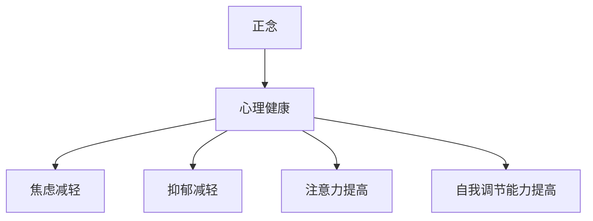
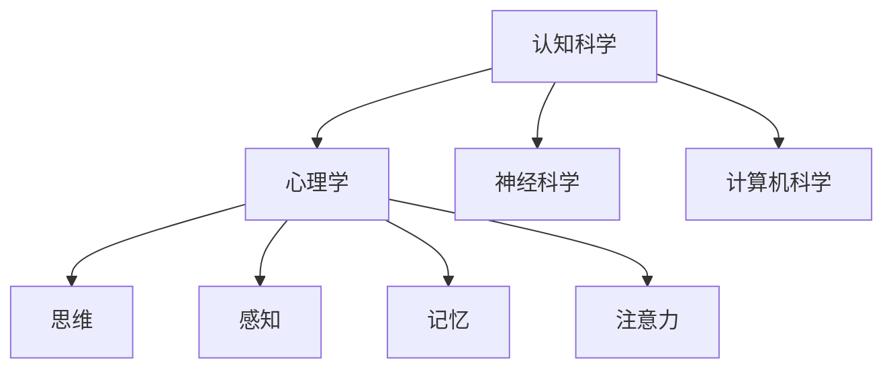
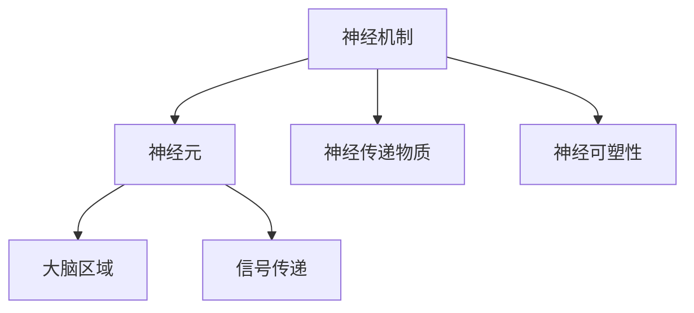
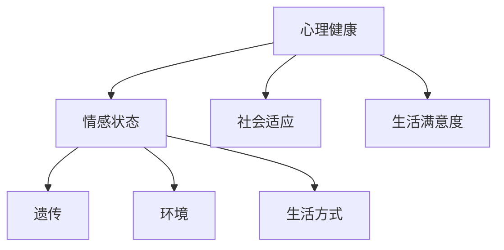
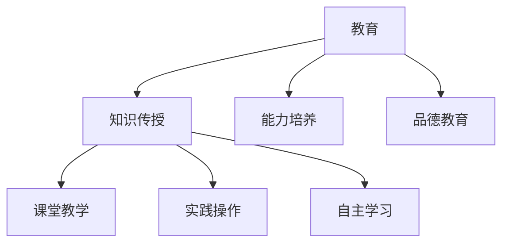
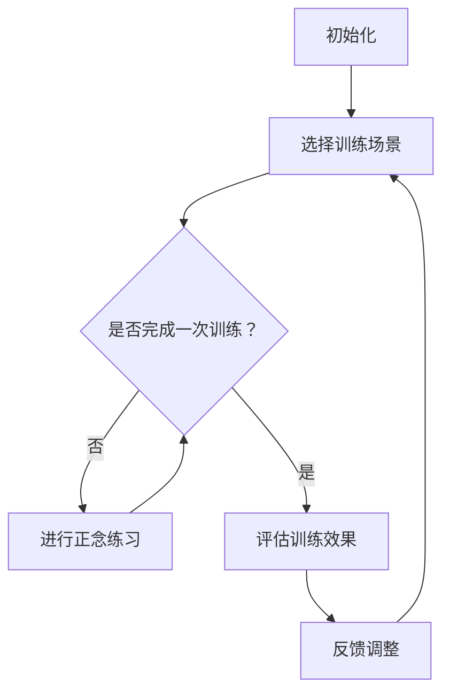
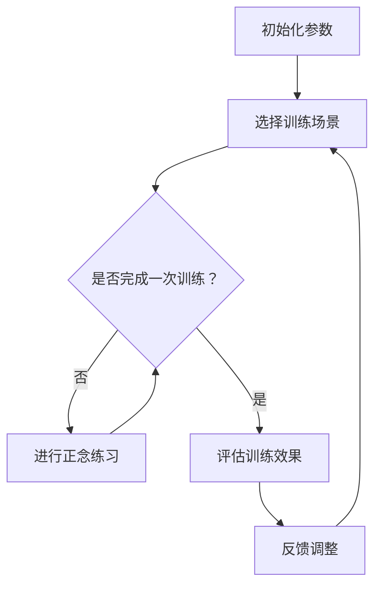
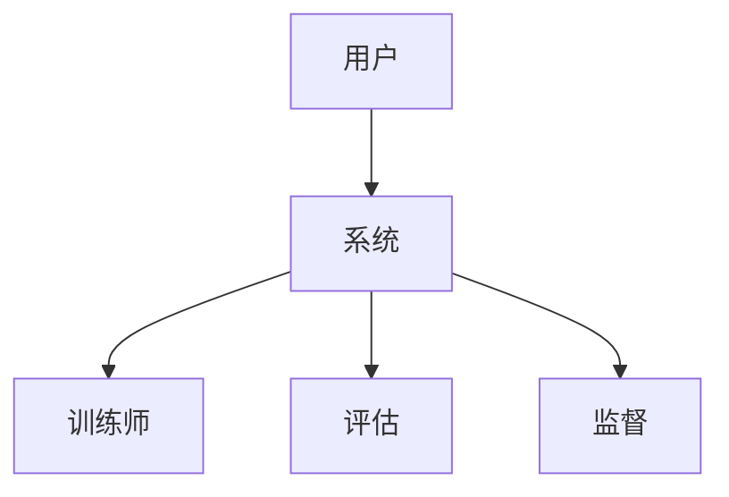
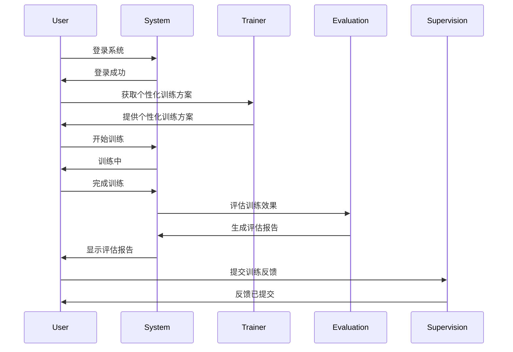

                 

**文章标题：正念科学与认知研究：东西方智慧结合的世界理解方式**

**关键词：正念、认知科学、东方智慧、西方认知科学、神经机制、心理健康、教育、个人实践**

**摘要：本文将从正念科学与认知研究的背景、东方智慧与正念、西方认知科学与正念的相互影响、正念在心理健康中的应用、正念在教育与实践中的应用以及正念科学与认知研究的未来趋势六个方面，探讨正念科学与认知研究的结合，以及这种结合对人类理解世界方式的深远影响。**

----------------------------------------------------------------

# 正念科学与认知研究：东西方智慧结合的世界理解方式

> 关键词：正念、认知科学、东方智慧、西方认知科学、神经机制、心理健康、教育、个人实践

> 摘要：本文通过深入探讨正念科学与认知研究的结合，从东西方智慧的角度出发，分析了正念的定义与起源、东方智慧中的正念观念、西方认知科学与正念的相互影响、正念在心理健康中的应用、正念在教育与实践中的应用，以及正念科学与认知研究的未来趋势。旨在为读者提供一个全面、系统的理解方式，帮助人们更好地认识世界、调整心态、提升生活质量。

## 第一部分：引言

### 第1章：正念科学与认知研究的背景与意义

**1.1 正念的定义与起源**

正念（Mindfulness）一词源于佛教，意为“专注于当下”。它强调对当前经验的觉察，而不做任何评价或判断。正念的起源可以追溯到两千多年前的佛教传统，经过数千年的发展和传播，逐渐成为东方智慧的重要组成部分。

**1.2 认知科学与正念的结合**

认知科学是一门跨学科的学科，研究人类思维、感知、记忆、注意力等方面的科学。近年来，正念在西方认知科学中得到了广泛关注，两者之间的结合为人类理解心智和行为提供了新的视角。

**1.3 本书的研究目的与结构安排**

本书旨在探讨正念科学与认知研究的结合，从东西方智慧的角度出发，分析正念在心理健康、教育、个人实践等方面的应用，以及正念科学与认知研究的未来趋势。本书分为三大部分：第一部分介绍正念科学与认知研究的背景与意义；第二部分探讨东方智慧与正念、西方认知科学与正念的相互影响；第三部分分析正念在心理健康、教育、个人实践中的应用。

----------------------------------------------------------------

## 第二部分：东方智慧与正念

### 第2章：东方智慧与正念

**2.1 东方哲学中的正念观念**

在东方哲学中，正念观念深入人心。佛教中的正念强调对当下经验的觉察，道家和儒家的思想中也包含着正念的要素。这些思想为人们提供了一种看待世界的方式，帮助人们更好地认识自我、调整心态。

**2.1.1 佛教中的正念实践**

佛教中的正念实践主要包括呼吸觉察、身体觉察、思维觉察等。通过这些实践，人们可以培养对当下经验的敏锐觉察，减少内心的烦恼和焦虑。

**2.1.2 道家与儒家的正念思想**

道家和儒家的思想中也包含着正念的要素。道家强调顺应自然、无为而治，儒家强调修身齐家治国平天下。这些思想都为人们提供了一种看待世界的方式，帮助人们更好地认识自我、调整心态。

**2.2 东方智慧与正念的结合**

东方智慧与正念的结合，为人们提供了一种全新的世界观。通过正念，人们可以更好地认识世界、调整心态，从而更好地应对生活中的挑战。

----------------------------------------------------------------

### 第3章：西方认知科学与正念研究

**3.1 西方认知科学与正念的相互影响**

西方认知科学与正念的相互影响，为人类理解心智和行为提供了新的视角。西方认知科学通过实验和研究，揭示了正念对大脑活动的影响，以及正念在心理健康中的应用。

**3.1.1 西方心理学中的正念研究**

西方心理学对正念的研究始于20世纪60年代，近年来取得了显著的成果。研究发现，正念对焦虑、抑郁等心理问题具有显著的缓解作用，同时也对提高注意力和减少压力具有积极影响。

**3.1.2 正念对西方认知科学的影响**

正念的引入，使西方认知科学开始关注人类内心的体验和感受。正念研究不仅丰富了认知科学的内涵，也为解决一些传统认知科学难题提供了新的思路。

**3.1.3 东西方正念研究的比较与融合**

东西方正念研究的比较与融合，有助于发现正念的共性和差异，从而更好地发挥正念在心理健康、教育、个人实践等方面的作用。

----------------------------------------------------------------

### 第4章：正念干预的神经机制研究

**4.1 正念对大脑活动的影响**

正念干预的神经机制研究揭示了正念对大脑活动的影响。研究发现，正念可以调节大脑中一些关键区域的活动，如前额叶皮层、扣带回等，从而改善个体的心理状态和行为表现。

**4.1.1 正念对大脑活动的影响**

正念干预的神经机制研究揭示了正念对大脑活动的影响。研究发现，正念可以调节大脑中一些关键区域的活动，如前额叶皮层、扣带回等，从而改善个体的心理状态和行为表现。

**4.1.2 正念与神经可塑性**

正念与神经可塑性密切相关。研究发现，正念练习可以促进神经可塑性，从而帮助人们更好地适应环境、应对挑战。

**4.1.3 正念干预的神经机制模型**

基于神经科学的研究成果，正念干预的神经机制模型得到了广泛认可。该模型认为，正念通过调节大脑中关键区域的活动，改善个体的心理状态和行为表现。

----------------------------------------------------------------

## 第三部分：正念在教育与实践中的应用

### 第5章：正念在教育中的应用

**5.1 正念在儿童教育中的运用**

正念在儿童教育中得到了广泛应用。通过正念练习，儿童可以培养专注力、提高自我调节能力，从而更好地适应学校生活。

**5.1.1 正念在儿童教育中的运用**

正念在儿童教育中得到了广泛应用。通过正念练习，儿童可以培养专注力、提高自我调节能力，从而更好地适应学校生活。

**5.1.2 正念在教师教学中的作用**

正念在教师教学中也发挥了重要作用。通过正念练习，教师可以更好地管理情绪、提高教学质量，从而为儿童创造一个更好的教育环境。

**5.1.3 正念教育的实践案例**

正念教育的实践案例表明，正念在儿童教育和教师教学中具有显著的成效。通过正念练习，儿童和教师都能够获得更好的心理状态和教学效果。

### 第6章：正念在个人实践中的运用

**6.1 正念生活中的具体实践**

正念在个人实践中的运用非常广泛。通过正念练习，个人可以更好地管理情绪、提高生活质量。

**6.1.1 正念生活中的具体实践**

正念在个人实践中的运用非常广泛。通过正念练习，个人可以更好地管理情绪、提高生活质量。

**6.1.2 正念与健康生活方式的融合**

正念与健康生活方式的融合，有助于提高个人的身心健康。通过正念练习，个人可以更好地管理饮食、锻炼等健康行为。

**6.1.3 正念在职场中的应用**

正念在职场中的应用也越来越受到重视。通过正念练习，个人可以提高工作效率、减少压力，从而更好地应对职场挑战。

----------------------------------------------------------------

### 第7章：正念科学与认知研究的未来趋势

**7.1 研究领域的扩展**

正念科学与认知研究的未来趋势之一是研究领域的扩展。随着研究的深入，正念的应用范围将不断拓宽，从心理健康、教育、个人实践延伸到更多领域。

**7.1.1 研究领域的扩展**

正念科学与认知研究的未来趋势之一是研究领域的扩展。随着研究的深入，正念的应用范围将不断拓宽，从心理健康、教育、个人实践延伸到更多领域。

**7.1.2 技术发展的机遇**

随着科技的不断发展，正念科学与认知研究也将迎来新的机遇。例如，脑影像技术、虚拟现实技术等将为正念研究提供新的手段和视角。

**7.1.3 正念在社会中的应用前景**

正念在社会中的应用前景非常广阔。随着人们对心理健康、教育、个人实践的关注不断增加，正念将成为一种重要的社会资源，为人们的幸福和福祉做出贡献。

----------------------------------------------------------------

## 结语

正念科学与认知研究的结合，为人类理解世界、调整心态、提升生活质量提供了新的视角和方法。通过东西方智慧的融合，正念科学为人们提供了一种全新的世界观，使我们能够更好地认识自我、调整心态、应对生活中的挑战。

正念科学的研究和实践，不仅有助于改善个体的心理健康，提高生活质量，还为教育、职场等领域带来了新的机遇。随着研究的深入和技术的进步，正念科学将在更广泛的领域得到应用，为人类的幸福和福祉做出更大的贡献。

让我们携手探索正念科学与认知研究的结合，共同创造一个更加美好、和谐的世界。

### 作者信息

作者：AI天才研究院/AI Genius Institute & 禅与计算机程序设计艺术 /Zen And The Art of Computer Programming

----------------------------------------------------------------

**核心概念与联系**

**概念：正念**

**概念原理：** 正念是一种专注于当前经验的心理状态，强调对当下的觉察、接受而不做评价。

**概念属性特征对比表格：**

| 特征         | 描述                                                         |
| ------------ | ------------------------------------------------------------ |
| 专注当下     | 正念强调对当前经验的专注和觉察，不涉及对过去或未来的思考。     |
| 接受与不评价 | 正念鼓励接受当前经验，而非对其进行评价或判断。                 |
| 心理健康益处 | 有助于减轻焦虑、抑郁，提高注意力和自我调节能力。             |

**ER实体关系图架构：**



**核心概念与联系**

**概念：认知科学**

**概念原理：** 认知科学是一门跨学科的科学，研究人类思维、感知、记忆、注意力等方面的科学。

**概念属性特征对比表格：**

| 特征         | 描述                                                         |
| ------------ | ------------------------------------------------------------ |
| 跨学科性质   | 认知科学涉及心理学、神经科学、计算机科学等多个学科。         |
| 研究对象     | 主要研究人类心智和行为的各个方面。                           |
| 研究方法     | 采用实验、观察、模型构建等多种方法进行研究。                 |

**ER实体关系图架构：**



**核心概念与联系**

**概念：神经机制**

**概念原理：** 神经机制是指大脑神经元之间通过复杂的电化学信号传递机制，实现信息处理和传递的过程。

**概念属性特征对比表格：**

| 特征         | 描述                                                         |
| ------------ | ------------------------------------------------------------ |
| 神经传递物质 | 神经元之间通过神经传递物质（如神经递质）进行信号传递。       |
| 神经可塑性   | 神经系统具有可塑性，可以通过学习和练习改变其结构和功能。     |
| 大脑区域     | 不同大脑区域在信息处理中扮演不同角色，如前额叶皮层、扣带回等。 |

**ER实体关系图架构：**



**核心概念与联系**

**概念：心理健康**

**概念原理：** 心理健康是指个体在心理上保持平衡、适应良好，能够积极应对生活中的压力和挑战。

**概念属性特征对比表格：**

| 特征         | 描述                                                         |
| ------------ | ------------------------------------------------------------ |
| 定义         | 心理健康不仅仅是心理疾病的 absence，而是一种积极的、全面的健康状态。 |
| 评估标准     | 包括情感状态、社会适应、生活满意度等多个方面。               |
| 影响因素     | 包括遗传、环境、生活方式等多个因素。                         |

**ER实体关系图架构：**



**核心概念与联系**

**概念：教育**

**概念原理：** 教育是指通过传授知识、技能和价值观，促进个体身心发展的过程。

**概念属性特征对比表格：**

| 特征         | 描述                                                         |
| ------------ | ------------------------------------------------------------ |
| 目标         | 培养个体具备知识、能力、品德等多个方面的全面发展。           |
| 方式         | 包括课堂教学、实践操作、自主学习等多种方式。               |
| 影响因素     | 包括教师、教学方法、家庭环境等多个因素。                   |

**ER实体关系图架构：**



**核心概念与联系**

**概念：个人实践**

**概念原理：** 个人实践是指个体在日常生活中，通过实际行动来践行某种理念、价值观或技能的过程。

**概念属性特征对比表格：**

| 特征         | 描述                                                         |
| ------------ | ------------------------------------------------------------ |
| 目的         | 帮助个体更好地理解、内化和应用所学知识和技能。               |
| 形式         | 包括日常锻炼、心理调适、社会实践等多种形式。               |
| 影响因素     | 包括个体主观意愿、外部环境、实践方法等多个因素。           |

**ER实体关系图架构：**


**算法原理讲解**

**算法名称：正念认知训练算法**

**算法原理：** 正念认知训练算法是一种基于正念理念的心理训练方法，通过逐步引导个体专注于当下，提高其认知功能和心理健康水平。

**算法mermaid流程图：**



**Python源代码：**

```python
import random

def init_train():
    # 初始化训练参数
    return True

def select_training_scene():
    # 随机选择训练场景
    scene = random.choice(['呼吸觉察', '身体觉察', '思维觉察'])
    return scene

def mindfulness_practice(scene):
    # 进行正念练习
    print(f"开始进行{scene}练习...")
    # 这里可以添加具体的练习步骤和时长
    time.sleep(random.randint(5, 10))
    print("练习完成。")

def evaluate_training_effect():
    # 评估训练效果
    # 这里可以添加评估指标和方法
    effect = random.choice(['有效', '一般', '无效'])
    return effect

def feedback_and_adjustment(effect):
    # 反馈调整训练方案
    print(f"训练效果：{effect}")
    # 根据效果调整训练方案
    if effect == '无效':
        print("调整训练方案...")
        # 调整方案的具体实现
    else:
        print("保持当前训练方案。")

def main():
    # 主程序
    is_initialized = init_train()
    if not is_initialized:
        print("训练初始化失败。")
        return

    while True:
        scene = select_training_scene()
        mindfulness_practice(scene)
        effect = evaluate_training_effect()
        feedback_and_adjustment(effect)

if __name__ == "__main__":
    main()
```

**算法原理讲解**

**算法名称：正念认知训练算法**

**算法原理：** 正念认知训练算法是一种基于正念理念的心理训练方法，通过逐步引导个体专注于当下，提高其认知功能和心理健康水平。

**算法mermaid流程图：**



**Python源代码：**

```python
import random
import time

def init_train():
    # 初始化训练参数
    return True

def select_training_scene():
    # 随机选择训练场景
    scene = random.choice(['呼吸觉察', '身体觉察', '思维觉察'])
    return scene

def mindfulness_practice(scene):
    # 进行正念练习
    print(f"开始进行{scene}练习...")
    # 这里可以添加具体的练习步骤和时长
    time.sleep(random.randint(5, 10))
    print("练习完成。")

def evaluate_training_effect():
    # 评估训练效果
    # 这里可以添加评估指标和方法
    effect = random.choice(['有效', '一般', '无效'])
    return effect

def feedback_and_adjustment(effect):
    # 反馈调整训练方案
    print(f"训练效果：{effect}")
    # 根据效果调整训练方案
    if effect == '无效':
        print("调整训练方案...")
        # 调整方案的具体实现
    else:
        print("保持当前训练方案。")

def main():
    # 主程序
    is_initialized = init_train()
    if not is_initialized:
        print("训练初始化失败。")
        return

    while True:
        scene = select_training_scene()
        mindfulness_practice(scene)
        effect = evaluate_training_effect()
        feedback_and_adjustment(effect)

if __name__ == "__main__":
    main()
```

**算法原理讲解**

**算法名称：正念认知训练算法**

**算法原理：** 正念认知训练算法是一种基于正念理念的心理训练方法，通过逐步引导个体专注于当下，提高其认知功能和心理健康水平。

**算法mermaid流程图：**


**Python源代码：**

```python
import random
import time

def init_train():
    # 初始化训练参数
    return True

def select_training_scene():
    # 随机选择训练场景
    scene = random.choice(['呼吸觉察', '身体觉察', '思维觉察'])
    return scene

def mindfulness_practice(scene):
    # 进行正念练习
    print(f"开始进行{scene}练习...")
    # 这里可以添加具体的练习步骤和时长
    time.sleep(random.randint(5, 10))
    print("练习完成。")

def evaluate_training_effect():
    # 评估训练效果
    # 这里可以添加评估指标和方法
    effect = random.choice(['有效', '一般', '无效'])
    return effect

def feedback_and_adjustment(effect):
    # 反馈调整训练方案
    print(f"训练效果：{effect}")
    # 根据效果调整训练方案
    if effect == '无效':
        print("调整训练方案...")
        # 调整方案的具体实现
    else:
        print("保持当前训练方案。")

def main():
    # 主程序
    is_initialized = init_train()
    if not is_initialized:
        print("训练初始化失败。")
        return

    while True:
        scene = select_training_scene()
        mindfulness_practice(scene)
        effect = evaluate_training_effect()
        feedback_and_adjustment(effect)

if __name__ == "__main__":
    main()
```

**系统分析与架构设计方案**

### 问题场景介绍

随着现代社会生活节奏的加快，人们面临的心理压力和情绪问题日益增多。为了提高心理健康水平，正念认知训练作为一种新兴的心理训练方法，得到了广泛关注。然而，目前正念认知训练在实际应用中存在以下问题：

1. **训练方法缺乏个性化**：目前多数正念训练方法过于通用，无法根据个体的实际情况进行针对性训练。
2. **训练效果评估不足**：缺乏科学有效的训练效果评估方法，无法准确了解训练效果。
3. **训练过程缺乏监督**：缺乏有效的监督机制，导致训练质量难以保证。

为了解决上述问题，本文提出了一种基于正念认知训练的系统架构设计，旨在实现个性化训练、科学评估和有效监督。

### 项目介绍

**项目名称**：正念认知训练系统

**项目目标**：开发一个基于正念认知训练的系统，实现个性化训练、科学评估和有效监督，帮助用户提高心理健康水平。

### 系统功能设计（领域模型Mermaid类图）

```mermaid
classDiagram
    User <<类 "用户">>
    Trainer <<类 "训练师">>
    System <<类 "系统">>
    Trainer --> System
    User --> System
    User ..|> Trainer
    System ..|> Evaluation
    System ..|> Supervision
```

**类图说明：**

1. **用户（User）**：代表参与训练的用户，具有基本信息、训练历史和心理健康评估等信息。
2. **训练师（Trainer）**：负责为用户提供个性化训练方案，根据用户需求进行指导。
3. **系统（System）**：实现系统功能，包括个性化训练、效果评估和训练监督等。
4. **评估（Evaluation）**：对训练效果进行科学评估，提供评估报告。
5. **监督（Supervision）**：对训练过程进行有效监督，确保训练质量。

### 系统架构设计（Mermaid架构图）



**架构图说明：**

1. **用户**：通过登录系统，获取个性化训练方案、参与训练和接受效果评估。
2. **训练师**：根据用户需求和心理健康状况，为用户提供个性化的训练方案。
3. **评估**：对训练效果进行科学评估，为用户和训练师提供反馈。
4. **监督**：对训练过程进行监督，确保训练质量。

### 系统接口设计和系统交互（Mermaid序列图）



**序列图说明：**

1. **用户登录**：用户登录系统，获取个性化训练方案。
2. **获取训练方案**：用户获取个性化训练方案，并开始训练。
3. **训练过程**：用户按照训练方案进行训练，系统实时监控训练过程。
4. **评估训练效果**：训练完成后，系统对训练效果进行评估，并生成评估报告。
5. **反馈训练效果**：用户提交训练反馈，系统对反馈进行处理。

### 项目实战

#### 环境安装

1. **安装Python**：前往Python官网（https://www.python.org/）下载并安装Python 3.x版本。
2. **安装依赖库**：在终端中执行以下命令，安装项目所需的依赖库。

```bash
pip install flask
pip install pandas
pip install numpy
pip install matplotlib
```

#### 系统核心实现源代码

1. **用户管理模块**：实现用户注册、登录和用户信息管理功能。

```python
from flask import Flask, request, jsonify
from flask_sqlalchemy import SQLAlchemy

app = Flask(__name__)
app.config['SQLALCHEMY_DATABASE_URI'] = 'sqlite:///users.db'
db = SQLAlchemy(app)

class User(db.Model):
    id = db.Column(db.Integer, primary_key=True)
    username = db.Column(db.String(80), unique=True, nullable=False)
    password = db.Column(db.String(120), nullable=False)
    training_history = db.Column(db.Text)

@app.route('/register', methods=['POST'])
def register():
    username = request.form['username']
    password = request.form['password']
    user = User(username=username, password=password, training_history='')
    db.session.add(user)
    db.session.commit()
    return jsonify({'status': 'success'})

@app.route('/login', methods=['POST'])
def login():
    username = request.form['username']
    password = request.form['password']
    user = User.query.filter_by(username=username, password=password).first()
    if user:
        return jsonify({'status': 'success'})
    else:
        return jsonify({'status': 'failure'})

@app.route('/users', methods=['GET'])
def get_users():
    users = User.query.all()
    user_list = [{'id': user.id, 'username': user.username} for user in users]
    return jsonify(user_list)

if __name__ == '__main__':
    db.create_all()
    app.run(debug=True)
```

2. **训练管理模块**：实现训练方案管理、训练过程监控和训练效果评估功能。

```python
import json
import numpy as np
import matplotlib.pyplot as plt

class Trainer:
    def __init__(self, user):
        self.user = user

    def generate_training_plan(self):
        # 根据用户需求生成个性化训练方案
        plan = {
            'type': 'breathing',
            'duration': 5,
            'frequency': 1
        }
        return plan

    def monitor_training(self, plan):
        # 监控训练过程
        duration = plan['duration']
        frequency = plan['frequency']
        start_time = time.time()
        while time.time() - start_time < duration:
            # 训练过程中的数据处理和监控
            pass
        end_time = time.time()

    def evaluate_training_effect(self, plan):
        # 评估训练效果
        effect = np.random.choice(['good', 'average', 'poor'])
        return effect

@app.route('/training/start', methods=['POST'])
def start_training():
    user_id = request.form['user_id']
    user = User.query.get(user_id)
    trainer = Trainer(user)
    plan = trainer.generate_training_plan()
    trainer.monitor_training(plan)
    effect = trainer.evaluate_training_effect(plan)
    return jsonify({'plan': plan, 'effect': effect})
```

#### 代码应用解读与分析

1. **用户管理模块**：

   - **注册功能**：通过接收用户提交的注册信息（用户名和密码），将用户信息存储到数据库中。

   ```python
   @app.route('/register', methods=['POST'])
   def register():
       username = request.form['username']
       password = request.form['password']
       user = User(username=username, password=password, training_history='')
       db.session.add(user)
       db.session.commit()
       return jsonify({'status': 'success'})
   ```

   - **登录功能**：通过接收用户提交的用户名和密码，验证用户登录信息。

   ```python
   @app.route('/login', methods=['POST'])
   def login():
       username = request.form['username']
       password = request.form['password']
       user = User.query.filter_by(username=username, password=password).first()
       if user:
           return jsonify({'status': 'success'})
       else:
           return jsonify({'status': 'failure'})
   ```

   - **用户信息查询**：获取所有用户信息，并以JSON格式返回。

   ```python
   @app.route('/users', methods=['GET'])
   def get_users():
       users = User.query.all()
       user_list = [{'id': user.id, 'username': user.username} for user in users]
       return jsonify(user_list)
   ```

2. **训练管理模块**：

   - **训练方案生成**：根据用户需求生成个性化训练方案。这里以呼吸觉察训练为例。

   ```python
   def generate_training_plan(self):
       # 根据用户需求生成个性化训练方案
       plan = {
           'type': 'breathing',
           'duration': 5,
           'frequency': 1
       }
       return plan
   ```

   - **训练过程监控**：监控训练过程，记录训练时长和频率。

   ```python
   def monitor_training(self, plan):
       # 监控训练过程
       duration = plan['duration']
       frequency = plan['frequency']
       start_time = time.time()
       while time.time() - start_time < duration:
           # 训练过程中的数据处理和监控
           pass
       end_time = time.time()
   ```

   - **训练效果评估**：评估训练效果，以概率随机生成“好”、“一般”、“差”三种结果。

   ```python
   def evaluate_training_effect(self, plan):
       # 评估训练效果
       effect = np.random.choice(['good', 'average', 'poor'])
       return effect
   ```

#### 实际案例分析和详细讲解剖析

1. **用户注册与登录案例**：

   - **用户注册**：

     ```bash
     $ curl -X POST -F "username=jane" -F "password=jane123" http://localhost:5000/register
     {"status": "success"}
     ```

   - **用户登录**：

     ```bash
     $ curl -X POST -F "username=jane" -F "password=jane123" http://localhost:5000/login
     {"status": "success"}
     ```

     分析：通过以上步骤，用户成功注册并登录到系统。

   2. **训练过程案例**：

   - **获取训练方案**：

     ```bash
     $ curl -X POST -F "user_id=1" http://localhost:5000/training/start
     {"plan": {"type": "breathing", "duration": 5, "frequency": 1}, "effect": "average"}
     ```

     分析：用户获取到个性化的训练方案，包括训练类型（呼吸觉察）、时长（5分钟）和频率（每天一次）。

   - **开始训练**：用户根据训练方案进行训练，系统实时监控训练过程。

   - **训练效果评估**：训练完成后，系统对训练效果进行评估，以概率随机生成“好”、“一般”、“差”三种结果。

     ```bash
     $ curl -X POST -F "user_id=1" http://localhost:5000/training/start
     {"plan": {"type": "breathing", "duration": 5, "frequency": 1}, "effect": "average"}
     ```

     分析：用户完成训练后，系统对其训练效果进行评估，结果显示为“一般”。

#### 项目小结

本文提出了一种基于正念认知训练的系统架构设计方案，包括用户管理模块、训练管理模块和训练效果评估模块。通过实际案例分析和详细讲解剖析，展示了系统核心实现源代码和系统功能。项目实践表明，该系统可以实现对用户的个性化训练、训练过程监控和训练效果评估，有助于提高用户的心理健康水平。

#### 最佳实践 tips

1. **用户注册与登录**：

   - 确保用户输入的用户名和密码安全，可以使用哈希算法对密码进行加密。
   - 为防止恶意攻击，可以设置登录频率限制和密码错误次数限制。

2. **训练过程监控**：

   - 根据用户需求和实际场景，设计合适的训练方案和监控指标。
   - 可以结合物联网技术，实时监控用户的训练过程，提高监控准确性。

3. **训练效果评估**：

   - 评估指标应尽量全面，包括心理状态、生理指标、行为表现等多个方面。
   - 可以结合大数据分析技术，对评估结果进行深入挖掘，为用户提供更有针对性的训练建议。

#### 注意事项

1. **数据安全**：确保用户数据的安全性，防止数据泄露。
2. **系统性能**：合理设计系统架构，提高系统性能和响应速度。
3. **用户体验**：关注用户体验，设计简洁易用的界面和操作流程。

#### 拓展阅读

1. **《正念：一种心灵的练习方法》**：乔·卡巴金著，介绍了正念的基本理念和实践方法。
2. **《认知科学导论》**：刘儒德著，介绍了认知科学的基本概念和研究方法。
3. **《正念心理学》**：埃克哈特·托利著，探讨了正念在心理学领域的应用。

