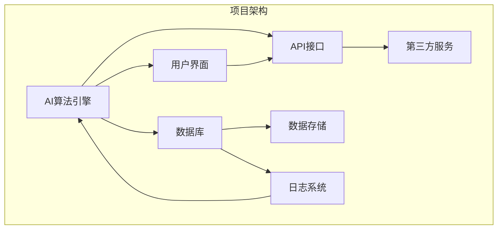
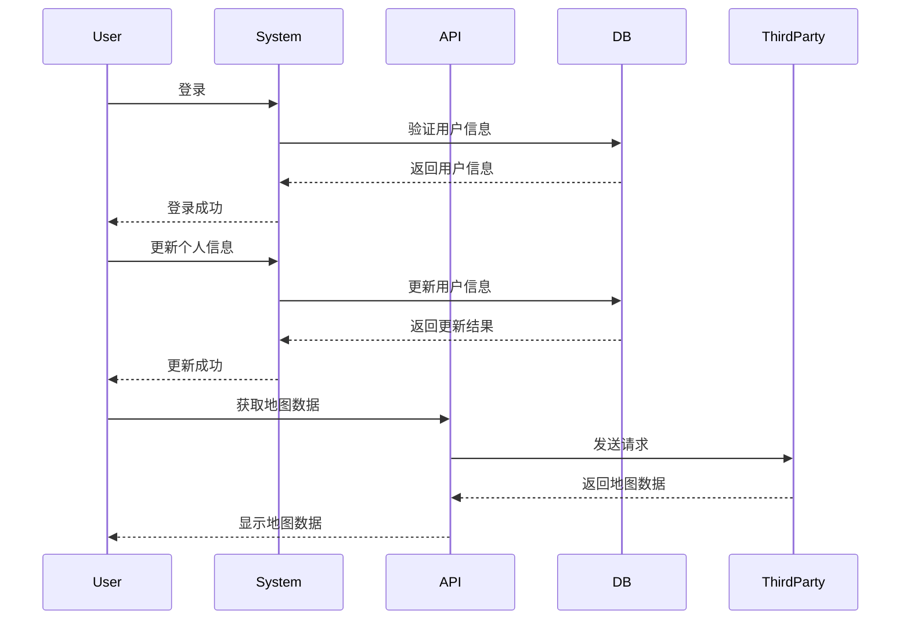

                 


# 每日站会：保持AI团队的同步与焦点

> 关键词：AI团队、站会、敏捷开发、项目管理、沟通、效率

> 摘要：本文将深入探讨每日站会在AI团队中的重要性，详细讲解站会的概念、原理、实施方法，并通过实际案例进行分析，为团队提供最佳实践和注意事项。

## 第1章 背景介绍

### 1.1 问题背景

在当前快速发展的AI领域中，团队协作与沟通变得尤为重要。然而，随着项目规模和团队成员数量的增加，沟通障碍、任务进展不明确、项目目标不一致等问题也逐渐显现出来。这些问题的存在，严重影响了团队的效率和项目进展。

### 1.2 问题描述

团队成员之间的沟通障碍主要表现在以下方面：

1. 信息传递不畅，导致团队成员对任务的理解不一致。
2. 任务进展不明确，导致团队成员对工作进度的不了解。
3. 项目目标不清晰，导致团队成员对工作目标的不明确。

### 1.3 问题解决

为了解决上述问题，每日站会作为一种有效的团队沟通机制被引入到AI团队中。站会的主要目的是通过简短的会议，让团队成员了解任务进展、讨论问题、协调工作，从而提高团队协作效率和项目进展。

### 1.4 边界与外延

每日站会的时间一般在10-15分钟之间，每天固定时间进行。参与人员包括项目团队成员、项目经理、产品经理等。站会的适用场景包括项目开发、迭代评审、任务分解等。

### 1.5 概念结构与核心要素组成

每日站会的概念结构包括以下几个方面：

1. 会议目的：明确站会的目的，如讨论任务进展、解决问题等。
2. 会议议程：制定会议议程，如检查任务进展、讨论问题、安排后续工作等。
3. 会议记录：记录会议讨论的内容和决定，以便后续跟进和评估。
4. 成果反馈：对会议决策和执行情况进行反馈，确保团队目标的达成。

## 第2章 核心概念与联系

### 2.1 核心概念原理

每日站会是一种简短的、高频次的团队沟通机制，旨在提高团队协作效率和项目进展。其核心原理在于：

1. 简化沟通流程：通过简短的会议，快速传递信息，减少冗余沟通。
2. 提高问题解决效率：及时发现问题、讨论解决方案，快速解决问题。
3. 确保任务执行一致性：通过会议记录和成果反馈，确保任务执行的一致性和有效性。

### 2.2 概念属性特征对比表格

| 概念       | 特征                | 比较             |
|------------|---------------------|------------------|
| 每日站会   | 简短、高频、团队沟通 | 敏捷开发、项目管理 |
| 敏捷开发   | 灵活、迭代、客户需求 | 项目管理、团队协作 |
| 项目管理   | 目标、计划、控制     | 团队协作、资源分配 |

### 2.3 ER实体关系图架构的Mermaid流程图

```mermaid
graph ER
    AI团队 --> 站会
    AI团队 --> 项目
    站会 --> 成员
    站会 --> 目标
    项目 --> 任务
    成员 --> 职责
```

## 第3章 算法原理讲解

### 3.1 算法流程图

```mermaid
graph 算法流程
    start --> 初始化
    初始化 --> 检查站会安排
    检查站会安排 --> 站会讨论
    站会讨论 --> 记录讨论结果
    记录讨论结果 --> 更新任务状态
    更新任务状态 --> 结束
```

### 3.2 Python源代码阐述

```python
# 初始化站会安排
def initialize_meeting():
    print("初始化站会安排")

# 检查站会安排
def check_meeting():
    print("检查站会安排")

# 站会讨论
def meeting_discussion():
    print("站会讨论")

# 记录讨论结果
def record_discussion():
    print("记录讨论结果")

# 更新任务状态
def update_task_status():
    print("更新任务状态")

# 主函数
def main():
    initialize_meeting()
    check_meeting()
    meeting_discussion()
    record_discussion()
    update_task_status()

if __name__ == "__main__":
    main()
```

### 3.3 算法原理的数学模型和公式

每日站会的算法原理可以抽象为一个流程控制模型，其核心公式为：

$$
流程 = 初始化 + 检查 + 讨论 + 记录 + 更新
$$

### 3.4 详细讲解和举例说明

每日站会的算法流程可以分解为以下几个步骤：

1. **初始化**：初始化站会安排，包括确定站会的时间、地点、参与人员等。
2. **检查**：检查站会安排是否合理，如时间是否冲突、地点是否合适等。
3. **讨论**：进行站会讨论，包括检查任务进展、讨论问题、协调工作等。
4. **记录**：记录讨论结果，包括决定事项、责任分配、后续跟进等。
5. **更新**：更新任务状态，包括更新任务进度、调整任务优先级等。

以一个实际案例为例：

**案例：** 一个AI团队正在进行一个项目开发，项目包含多个任务。团队决定每天早上9点进行站会。

1. **初始化**：团队在会议前确定了站会的时间、地点和参与人员。
2. **检查**：团队在站会前检查了站会安排，确认了时间冲突和地点问题。
3. **讨论**：团队在站会上讨论了各个任务的进展，解决了任务中的问题，并协调了后续工作。
4. **记录**：团队记录了站会讨论的内容，明确了各个任务的负责人和进度。
5. **更新**：团队根据站会讨论的结果，更新了任务状态，调整了任务优先级。

通过每日站会的算法原理和实际案例，我们可以看到站会在AI团队中的重要性。它不仅提高了团队协作效率，还有助于项目目标的达成。

## 第4章 数学模型和数学公式 & 详细讲解 & 举例说明

### 4.1 数学模型

每日站会的数学模型可以看作是一个有限状态机，其中每个状态表示站会的一个步骤，状态转移表示站会的执行过程。具体模型如下：

$$
状态 = 初始化, 检查, 讨论, 记录, 更新
$$

### 4.2 公式

每日站会的执行过程可以用以下公式表示：

$$
流程 = 初始化 + 检查 + 讨论 + 记录 + 更新
$$

### 4.3 详细讲解

1. **初始化**：站会开始前的准备工作，包括确定站会的时间、地点、参与人员等。这一步是站会的起点。
2. **检查**：在站会开始前，检查站会安排是否合理，如时间冲突、地点合适等。这一步确保站会能够顺利进行。
3. **讨论**：站会核心环节，团队成员在站会上讨论任务进展、问题解决、工作协调等。这一步是站会的核心，直接影响站会的效果。
4. **记录**：记录站会讨论的内容，包括决定事项、责任分配、后续跟进等。这一步确保站会讨论的结果能够得到有效执行。
5. **更新**：根据站会讨论的结果，更新任务状态，包括任务进度、任务优先级等。这一步确保站会的执行效果能够得到持续跟踪。

### 4.4 举例说明

以一个实际案例为例，说明每日站会的数学模型和公式的应用：

**案例：** 一个AI团队正在进行一个项目开发，项目包含多个任务。团队决定每天早上9点进行站会。

1. **初始化**：团队在会议前确定了站会的时间、地点和参与人员。
2. **检查**：团队在站会前检查了站会安排，确认了时间冲突和地点问题。
3. **讨论**：团队在站会上讨论了各个任务的进展，解决了任务中的问题，并协调了后续工作。
4. **记录**：团队记录了站会讨论的内容，明确了各个任务的负责人和进度。
5. **更新**：团队根据站会讨论的结果，更新了任务状态，调整了任务优先级。

通过这个案例，我们可以看到每日站会的数学模型和公式在实际应用中的效果。它不仅帮助团队高效地完成站会，还有助于任务进度的跟踪和管理。

## 第5章 系统分析与架构设计方案

### 5.1 问题场景介绍

假设我们有一个AI团队，他们负责开发一个大型项目。项目包含多个模块，涉及多种技术栈。团队成员分布在不同的地理位置，需要进行高效的沟通和协作。为了提高团队协作效率，我们决定引入每日站会机制。

### 5.2 项目介绍

该项目是一个智能家居系统，主要包括智能安防、智能照明、智能音响等功能。项目开发周期为6个月，团队成员包括前端开发、后端开发、UI/UX设计师、测试工程师等。

### 5.3 系统功能设计（领域模型Mermaid类图）

```mermaid
classDiagram
    Class01 <|-- Class02
    Class03 --|Deprecated Class04
    Class05 << Interface: Intellectual
    AIExpert subclass of Human
    HumanHas ABM
    AnimalIsABM
    Animal -|- Dog: Mammal
    Dog -|=> Pet
    Child --|衍生的: Person
    Employee { id, name }
    Supplier { id, name }
    Customer << Interface: External
    Employee *- Employer
    Employee *- Department
    Supplier *- Customer
    Customer *- Product
    Customer *- Order
    Product *- Review
    Product *- Category
    Category : String
    Product : { id, name, price, rating }
    Review : { id, title, body, rating }
    Order : { id, status, total }
```

### 5.4 系统架构设计Mermaid架构图



### 5.5 系统接口设计

1. **用户接口**：提供用户与系统交互的界面，包括登录、注册、个人信息管理等功能。
2. **API接口**：提供与第三方服务交互的接口，如支付、地图等。
3. **数据接口**：提供数据存储和检索的接口，包括用户数据、设备数据、日志数据等。

### 5.6 系统交互Mermaid序列图



通过系统分析与架构设计方案，我们可以清晰地了解每日站会在AI团队项目中的角色和作用。站会机制能够帮助团队高效地沟通、协调工作，确保项目目标的达成。

## 第6章 项目实战

### 6.1 环境安装

在开始项目实战之前，我们需要安装必要的开发环境和工具。以下是一个简单的安装步骤：

1. 安装Python环境：前往Python官方网站（https://www.python.org/）下载并安装Python。
2. 安装Python包管理工具：使用pip安装pip（如果尚未安装），然后使用pip安装所需的Python包。
3. 安装IDE：选择一个合适的IDE（如Visual Studio Code、PyCharm等），并安装相关插件。

### 6.2 系统核心实现源代码

以下是一个简单的系统核心实现源代码示例：

```python
# 安装Python包
pip install Flask

# 导入Flask库
from flask import Flask, jsonify, request

# 创建Flask应用
app = Flask(__name__)

# 定义API接口
@app.route('/api/task', methods=['GET', 'POST'])
def task():
    if request.method == 'GET':
        # 获取任务列表
        tasks = get_tasks()
        return jsonify(tasks)
    elif request.method == 'POST':
        # 添加新任务
        task = request.json
        add_task(task)
        return jsonify({"status": "success", "message": "Task added successfully."})

# 获取任务列表
def get_tasks():
    # 在这里实现获取任务列表的逻辑
    pass

# 添加新任务
def add_task(task):
    # 在这里实现添加新任务的逻辑
    pass

# 运行应用
if __name__ == '__main__':
    app.run()
```

### 6.3 代码应用解读与分析

上述代码是一个简单的Flask Web应用，用于实现一个任务管理API。它包括以下功能：

1. **获取任务列表**：通过GET请求获取所有任务，并在响应中返回任务列表。
2. **添加新任务**：通过POST请求添加新任务，并将任务数据存储在数据库中。

代码应用解读：

- **路由配置**：使用Flask的`@app.route`装饰器定义了两个API接口，一个用于获取任务列表，另一个用于添加新任务。
- **HTTP请求方法**：根据请求方法（GET或POST）执行不同的逻辑。
- **任务数据**：任务数据通过请求的JSON格式传递，并在响应中返回。

### 6.4 实际案例分析和详细讲解剖析

假设我们有一个任务管理API，团队需要在站会上讨论任务进展。以下是一个实际案例的分析：

**案例**：团队在站会上讨论了一个新任务的添加。

1. **初始化**：确定站会时间、地点和参与人员。
2. **检查**：检查站会安排是否合理。
3. **讨论**：团队成员在站会上讨论了新任务的添加，包括任务描述、优先级和负责人。
4. **记录**：记录讨论结果，并将任务添加到任务列表中。
5. **更新**：更新任务状态，包括任务进度和优先级。

详细讲解剖析：

- **初始化**：站会的准备工作，确保团队成员了解站会的时间和地点。
- **检查**：确保站会安排合理，避免时间冲突和地点问题。
- **讨论**：站会核心环节，团队成员讨论任务进展和问题解决。
- **记录**：记录讨论结果，确保任务得到有效执行。
- **更新**：根据讨论结果，更新任务状态，确保任务进度得到跟踪。

通过实际案例的分析和详细讲解剖析，我们可以看到每日站会在AI团队项目中的应用效果。它帮助团队高效地沟通、协调工作，确保项目目标的达成。

### 6.5 项目小结

通过本项目的实战，我们可以看到每日站会在AI团队项目中的重要性和应用效果。每日站会帮助团队高效地沟通、协调工作，确保项目目标的达成。具体来说：

1. **沟通效率提高**：每日站会提供了一个固定的时间窗口，团队成员可以在这个时间段内讨论任务进展、问题解决等，减少了信息传递的延迟。
2. **任务管理更高效**：通过每日站会的讨论和记录，团队成员能够更好地了解任务进展和责任分配，提高了任务管理的效率。
3. **项目目标达成**：每日站会确保了项目目标的达成，通过讨论和记录，团队成员能够及时调整工作计划和优先级，确保项目按计划进行。

总之，每日站会是AI团队中一种高效、实用的沟通机制，对于提高团队协作效率和项目成功率具有重要意义。

## 第7章 最佳实践 tips、小结、注意事项、拓展阅读等内容

### 7.1 最佳实践 tips

1. **明确站会目的**：在每次站会前，明确站会的目的，如检查任务进展、讨论问题、协调工作等，确保站会有序进行。
2. **遵守时间限制**：确保站会时间控制在10-15分钟内，避免讨论过于冗长，影响后续工作。
3. **准备会议材料**：在站会前准备好会议材料，如任务列表、问题记录等，确保站会讨论的针对性。
4. **会议记录**：及时记录站会讨论的内容和决策，确保站会结果得到有效执行。
5. **反馈机制**：建立站会反馈机制，对站会效果进行评估和改进，提高站会的有效性。

### 7.2 小结

每日站会作为一种高效的沟通机制，在AI团队中发挥着重要作用。通过每日站会，团队成员能够及时了解任务进展、讨论问题、协调工作，从而提高团队协作效率和项目成功率。

### 7.3 注意事项

1. **避免形式主义**：确保站会内容务实、高效，避免形式主义和冗长的讨论。
2. **避免个人偏见**：在站会中，团队成员应保持开放心态，避免个人偏见和主观判断。
3. **关注团队氛围**：营造良好的团队氛围，鼓励成员积极参与讨论，提高站会效果。

### 7.4 拓展阅读

1. 《敏捷开发实践指南》
2. 《敏捷项目管理》
3. 《团队协作的艺术》
4. 《有效沟通的技巧》
5. 《项目管理知识体系指南（PMBOK）》

作者：AI天才研究院/AI Genius Institute & 禅与计算机程序设计艺术 /Zen And The Art of Computer Programming

