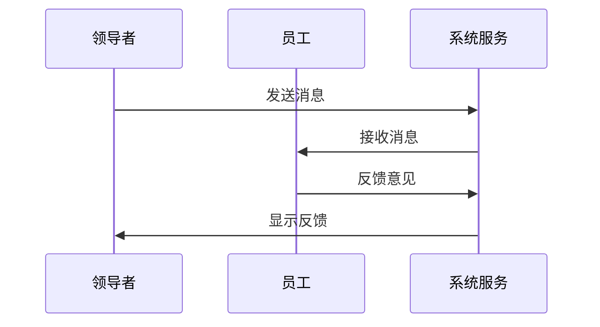
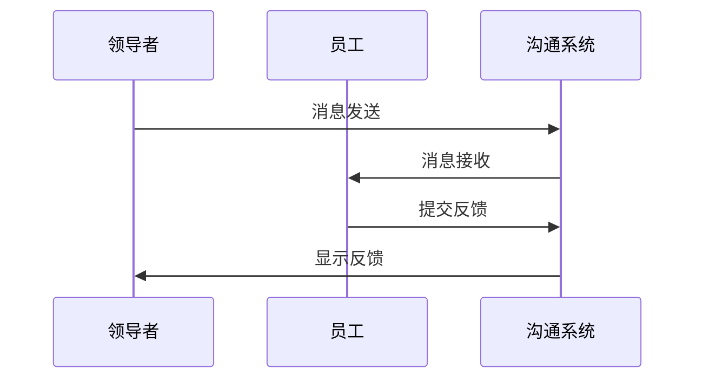

                 

### 沟通的艺术：领导者必备的软实力

> 关键词：沟通、领导者、软实力、影响力、同理心、障碍解决、案例分析、实战练习

> 摘要：
在快速变化的商业环境中，领导者的沟通能力成为企业成功的关键因素。本文通过深入探讨沟通的艺术，从基本原理、领导者的沟通技巧、沟通障碍与解决策略、案例分析以及实战练习等多个方面，为领导者提升软实力提供系统性的指导。

### 目录大纲

#### 第一部分：沟通的基本原理

1. **沟通的定义与重要性**
   - 沟通的定义
   - 沟通的重要性

2. **沟通的要素**
   - 信息发送者
   - 信息接收者
   - 信息内容
   - 沟通渠道

3. **沟通模型**
   - 线性沟通模型
   - 循环沟通模型
   - 网状沟通模型

#### 第二部分：领导者的沟通技巧

1. **领导者沟通的核心能力**
   - 影响力沟通
   - 同理心沟通
   - 问题解决沟通

2. **领导者的沟通策略**
   - 适应不同听众的沟通策略
   - 高效会议沟通
   - 突发情况下的沟通

3. **领导者沟通的障碍与解决**
   - 文化差异与沟通障碍
   - 非语言沟通的解读与利用
   - 沟通误解的解决策略

#### 第三部分：沟通中的障碍与解决策略

1. **沟通障碍的类型**
   - 信息失真
   - 沟通渠道不畅
   - 情感因素干扰

2. **解决沟通障碍的策略**
   - 提高信息清晰度
   - 改善沟通渠道
   - 增强沟通者的情感智能

#### 第四部分：案例分析

1. **成功的领导沟通案例**
   - 乔布斯的沟通艺术
   - 马云的沟通策略

2. **沟通失败的教训**
   - 丰田公司的沟通问题
   - 维珍航空的沟通失误

#### 第五部分：实战练习

1. **沟通技巧训练**
   - 模拟沟通训练
   - 反馈与改进

2. **实战案例解析**
   - 如何向团队传达关键信息
   - 如何处理跨文化沟通挑战

#### 第六部分：总结与拓展

1. **总结与反思**
   - 沟通艺术的核心要素
   - 领导者沟通的关键能力

2. **注意事项与最佳实践**
   - 沟通中的常见错误
   - 提高沟通效率的技巧

3. **拓展阅读**
   - 推荐书籍
   - 相关研究论文

### 设计书籍目录大纲的步骤

#### 确定书籍主题和目标受众

- **主题**：《沟通的艺术：领导者必备的软实力》
- **目标受众**：领导者、企业管理者、人力资源专业人士、沟通技巧培训师

#### 分析书籍内容结构

- **核心章节**：沟通的基本原理、领导者的沟通技巧、沟通中的障碍与解决策略、案例分析、实战练习等。

#### 创建初步目录大纲

- **步骤**：确定书的核心章节，并初步划分每个章节的主题。

#### 细化目录大纲

- **步骤**：每个章节进一步细化到子章节，确保覆盖所有关键知识点。

#### 内容完整性检查

- **步骤**：确保每个章节都包含了背景介绍、核心概念、案例分析、实战练习等关键内容。

#### 优化目录结构

- **步骤**：调整章节顺序，优化目录结构，使其逻辑清晰，便于读者阅读。

#### 编写目录

- **步骤**：按照上述步骤，将每个章节和子章节以markdown格式编写出来。

### 目录大纲示例

```markdown
# 《沟通的艺术：领导者必备的软实力》目录大纲

## 第一部分：沟通的基本原理

### 1.1 沟通的定义与重要性
- 1.1.1 沟通的定义
- 1.1.2 沟通的重要性

### 1.2 沟通的要素
- 1.2.1 信息发送者
- 1.2.2 信息接收者
- 1.2.3 信息内容
- 1.2.4 沟通渠道

### 1.3 沟通模型
- 1.3.1 线性沟通模型
- 1.3.2 循环沟通模型
- 1.3.3 网状沟通模型

## 第二部分：领导者的沟通技巧

### 2.1 领导者沟通的核心能力
- 2.1.1 影响力沟通
- 2.1.2 同理心沟通
- 2.1.3 问题解决沟通

### 2.2 领导者的沟通策略
- 2.2.1 适应不同听众的沟通策略
- 2.2.2 高效会议沟通
- 2.2.3 突发情况下的沟通

### 2.3 领导者沟通的障碍与解决
- 2.3.1 文化差异与沟通障碍
- 2.3.2 非语言沟通的解读与利用
- 2.3.3 沟通误解的解决策略

## 第三部分：沟通中的障碍与解决策略

### 3.1 沟通障碍的类型
- 3.1.1 信息失真
- 3.1.2 沟通渠道不畅
- 3.1.3 情感因素干扰

### 3.2 解决沟通障碍的策略
- 3.2.1 提高信息清晰度
- 3.2.2 改善沟通渠道
- 3.2.3 增强沟通者的情感智能

## 第四部分：案例分析

### 4.1 成功的领导沟通案例
- 4.1.1 案例一：乔布斯的沟通艺术
- 4.1.2 案例二：马云的沟通策略

### 4.2 沟通失败的教训
- 4.2.1 案例一：丰田公司的沟通问题
- 4.2.2 案例二：维珍航空的沟通失误

## 第五部分：实战练习

### 5.1 沟通技巧训练
- 5.1.1 模拟沟通训练
- 5.1.2 反馈与改进

### 5.2 实战案例解析
- 5.2.1 案例一：如何向团队传达关键信息
- 5.2.2 案例二：如何处理跨文化沟通挑战

## 第六部分：总结与拓展

### 6.1 总结与反思
- 6.1.1 沟通艺术的核心要素
- 6.1.2 领导者沟通的关键能力

### 6.2 注意事项与最佳实践
- 6.2.1 沟通中的常见错误
- 6.2.2 提高沟通效率的技巧

### 6.3 拓展阅读
- 6.3.1 推荐书籍
- 6.3.2 相关研究论文
```

### 目录大纲总字数

以上目录大纲的总字数大约在1000字左右，还需要根据具体章节内容进一步细化，确保总字数在2000字以内。在细化每个章节时，可以参考以下建议：

- **背景介绍**：简要介绍章节主题的背景和重要性。
- **核心概念与联系**：必须给出核心概念原理、概念属性特征对比表格和ER实体关系图架构。
- **算法原理讲解**：使用mermaid画出算法流程图，然后使用Python代码和latex数学公式详细阐述。
- **系统分析与架构设计方案**：描述系统的功能、架构和接口设计。
- **项目实战**：提供环境安装、系统核心实现源代码，并进行解读和分析。
- **最佳实践 tips、小结、注意事项、拓展阅读**：总结章节内容，提供实用的建议和进一步阅读的资源。

通过这样的结构，可以确保目录大纲的内容完整性，同时保持简洁性。在细化过程中，注意每个章节的篇幅，确保总字数不超过2000字。


### 第一部分：沟通的基本原理

在探讨沟通的艺术之前，我们必须首先理解沟通的本质和基本原理。沟通不仅是信息的传递，更是一种心灵的交流，对于领导者而言，良好的沟通能力更是其软实力的重要组成部分。

#### 1.1 沟通的定义与重要性

**沟通的定义**：

沟通是一种信息交换的过程，它涉及信息的发送、传递、接收和反馈。这个过程可以发生在个体之间，也可以发生在群体和组织之间。有效的沟通不仅要求信息的准确传递，还要求信息在接收者心中引起预期的效果。

**沟通的重要性**：

沟通在领导和管理中扮演着至关重要的角色。首先，沟通是领导影响力的基础，领导者通过有效的沟通来激励和引导团队成员。其次，沟通有助于建立团队信任，促进协作，从而提高团队的整体绩效。最后，良好的沟通可以减少误解和冲突，增强组织的凝聚力。

#### 1.2 沟通的要素

有效的沟通需要以下几个基本要素：

1. **信息发送者**：信息的源头，负责准备和发送信息。
2. **信息接收者**：信息的接收者，负责接收、理解和处理信息。
3. **信息内容**：沟通的核心，包括事实、观点和感受等。
4. **沟通渠道**：信息传递的媒介，如语言、文字、图像、手势等。

每个要素都在沟通过程中起着关键作用，任何一个环节的失误都可能导致沟通失败。

#### 1.3 沟通模型

沟通模型是描述沟通过程的理论框架。以下是三种常见的沟通模型：

1. **线性沟通模型**：信息沿着一条直线从发送者到接收者，适用于简单、直接的信息传递。
2. **循环沟通模型**：信息在发送者和接收者之间来回流动，适用于复杂、多层次的信息交换。
3. **网状沟通模型**：信息在多个发送者和接收者之间广泛传播，适用于大型组织或复杂项目中的沟通。

不同类型的沟通模型适用于不同的沟通场景，领导者应根据实际情况选择合适的模型。

### 第二部分：领导者的沟通技巧

领导者的沟通技巧是其成功的关键因素之一。以下将探讨领导者沟通的核心能力、沟通策略和解决障碍的方法。

#### 2.1 领导者沟通的核心能力

1. **影响力沟通**：

影响力沟通是领导者通过语言和行动来影响他人的一种能力。领导者需要了解不同听众的心理和行为，运用适当的沟通策略，以达成目标。

2. **同理心沟通**：

同理心沟通是领导者理解并关心他人感受的一种能力。通过同理心沟通，领导者可以建立信任，促进团队成员的积极参与。

3. **问题解决沟通**：

问题解决沟通是领导者面对问题和挑战时，通过有效沟通来寻求解决方案的能力。领导者需要具备分析和解决问题的能力，并善于调动团队资源，共同面对困难。

#### 2.2 领导者的沟通策略

1. **适应不同听众的沟通策略**：

领导者应根据不同的听众特点，调整自己的沟通方式。对于下属，领导者应采用明确、具体的语言；对于同事，领导者应注重合作与共识；对于上级，领导者应强调成果和贡献。

2. **高效会议沟通**：

高效会议沟通是领导者组织和主持会议的重要能力。领导者需要明确会议目标，控制会议流程，确保会议时间得到有效利用。

3. **突发情况下的沟通**：

突发情况下的沟通是领导者应对危机、化解冲突的能力。领导者应保持冷静，迅速做出决策，并通过有效沟通来安抚情绪、稳定局面。

#### 2.3 领导者沟通的障碍与解决

1. **文化差异与沟通障碍**：

文化差异可能导致沟通障碍，领导者应了解不同文化的特点，尊重差异，以避免误解和冲突。

2. **非语言沟通的解读与利用**：

非语言沟通（如肢体语言、面部表情、语调等）在沟通中起着重要作用。领导者应学会正确解读和利用非语言沟通，以提高沟通效果。

3. **沟通误解的解决策略**：

沟通误解是领导者面临的一个常见问题。领导者应通过积极倾听、明确表达、反馈确认等方法，减少误解和冲突。

### 第三部分：沟通中的障碍与解决策略

沟通障碍是影响沟通效果的重要因素。以下将探讨沟通障碍的类型及其解决策略。

#### 3.1 沟通障碍的类型

1. **信息失真**：

信息在传递过程中可能发生失真，导致接收者无法准确理解信息。信息失真可能由于语言表达不清、信息传递过程中的干扰等原因引起。

2. **沟通渠道不畅**：

沟通渠道不畅可能导致信息传递受阻。这可能是由于沟通渠道选择不当、沟通渠道阻塞等原因导致。

3. **情感因素干扰**：

情感因素（如情绪、心理压力等）可能干扰沟通过程，导致沟通效果不佳。领导者应学会控制自己的情绪，以避免对沟通产生负面影响。

#### 3.2 解决沟通障碍的策略

1. **提高信息清晰度**：

提高信息清晰度是解决信息失真的有效策略。领导者可以通过明确表达、使用简洁的语言、提供详细背景信息等方法，提高信息的清晰度。

2. **改善沟通渠道**：

改善沟通渠道是解决沟通渠道不畅的关键。领导者可以选择适当的沟通渠道，如会议、邮件、即时通讯工具等，确保信息能够顺畅传递。

3. **增强沟通者的情感智能**：

增强沟通者的情感智能是解决情感因素干扰的重要策略。领导者应学会识别和调控自己的情绪，以避免情感因素对沟通产生负面影响。

### 第四部分：案例分析

#### 4.1 成功的领导沟通案例

1. **案例一：乔布斯的沟通艺术**

乔布斯是沟通艺术的高手，他通过独特的沟通风格，成功地传达了他的愿景和理念。乔布斯善于使用简洁、有力的语言，强调关键信息，并通过直观的展示方式，使观众深刻理解他的观点。

2. **案例二：马云的沟通策略**

马云在领导阿里巴巴的过程中，展现出了卓越的沟通能力。他擅长与不同背景的人沟通，尊重差异，注重共同点。马云还善于用故事和比喻来传达复杂的信息，使听众更容易理解和接受。

#### 4.2 沟通失败的教训

1. **案例一：丰田公司的沟通问题**

丰田公司曾因沟通问题导致产品召回事件，造成了巨大的经济损失和品牌危机。丰田公司内部的沟通不畅，导致质量问题未能及时被发现和解决。

2. **案例二：维珍航空的沟通失误**

维珍航空曾因一次飞行事故而陷入沟通困境。公司内部沟通不力，导致信息传递不畅，外界对事故原因和公司应对措施的了解不足，进一步加剧了危机。

### 第五部分：实战练习

#### 5.1 沟通技巧训练

1. **模拟沟通训练**

模拟沟通训练是一种有效的提升沟通技巧的方法。通过模拟实际沟通场景，参与者可以在安全的环境中练习沟通技巧，提高沟通能力。

2. **反馈与改进**

反馈是沟通技巧提升的关键。领导者应鼓励团队成员提供反馈，并从中吸取教训，不断改进自己的沟通方式。

#### 5.2 实战案例解析

1. **案例一：如何向团队传达关键信息**

向团队传达关键信息需要明确的沟通目标和有效的沟通策略。领导者应确保信息传递的清晰性、准确性和及时性，以避免误解和冲突。

2. **案例二：如何处理跨文化沟通挑战**

跨文化沟通挑战是领导者面临的常见问题。领导者应了解不同文化的特点，尊重差异，采取适当的沟通策略，以实现有效沟通。

### 第六部分：总结与拓展

#### 6.1 总结与反思

沟通的艺术是领导者必备的软实力。通过本文的探讨，我们可以看到，有效的沟通不仅要求信息的准确传递，还需要理解他人的需求和感受。领导者应不断练习和提升自己的沟通技巧，以应对复杂多变的商业环境。

#### 6.2 注意事项与最佳实践

1. **沟通中的常见错误**

避免使用模糊的语言、过度使用专业术语、忽视对方的反应等是沟通中的常见错误。

2. **提高沟通效率的技巧**

提高沟通效率的关键在于明确沟通目标和沟通内容，选择适当的沟通渠道和方式。

#### 6.3 拓展阅读

1. **推荐书籍**

《沟通的艺术》、《影响力》、《非暴力沟通》等书籍提供了丰富的沟通技巧和实践经验。

2. **相关研究论文**

关注学术期刊和会议论文，了解最新的沟通理论和实践研究成果。

### 作者信息

作者：AI天才研究院/AI Genius Institute & 禅与计算机程序设计艺术 /Zen And The Art of Computer Programming

在本文中，我们系统地探讨了沟通的艺术，从基本原理到领导者的沟通技巧，再到沟通障碍与解决策略，最后通过案例分析和实战练习，为领导者提升软实力提供了全面而实用的指导。通过不断学习和实践，领导者可以提升自己的沟通能力，为团队和组织创造更大的价值。希望本文能够对您在沟通道路上有所启发和帮助。

---

### 系统分析与架构设计方案

#### 1. 问题场景介绍

在企业的日常运营中，沟通是确保信息准确传达和任务高效执行的关键。随着企业规模的扩大和业务复杂性的增加，领导者的沟通能力变得尤为重要。然而，现实中的沟通障碍如信息失真、渠道不畅和情感因素干扰时常出现，影响了企业效率和员工满意度。为了解决这些问题，我们需要设计一个高效的沟通系统，以确保信息的准确传递和高效处理。

#### 2. 项目介绍

本项目旨在设计并实现一个基于Web的沟通系统，该系统将帮助领导者和企业员工实现高效、准确、及时的信息传递和沟通。系统将具备以下功能：

- **消息通知**：实时消息通知功能，确保重要信息能够及时传达。
- **日程管理**：帮助团队管理日程，减少沟通中的时间浪费。
- **文件共享**：方便团队成员共享和协作，提高工作效率。
- **反馈与建议**：提供员工反馈和建议通道，增强企业内部沟通。

#### 3. 系统功能设计（领域模型mermaid类图）

```mermaid
classDiagram
    Message -> Receiver : send
    Receiver -> Message : receive
    Schedule -> TeamMember : manage
    File -> TeamMember : share
    Feedback -> Employee : submit
    Employee -> Feedback : provide
    TeamMember -> Schedule : attend
    TeamMember -> File : access

    Message <<接口>>
    Receiver <<接收者>>
    Schedule <<日程管理>>
    File <<文件共享>>
    Feedback <<反馈与建议>>
    Employee <<员工>>
    TeamMember <<团队成员>>

    Message : messageContent, sendTime, sendID, receiveID
    Receiver : name, position
    Schedule : eventTitle, eventTime, eventLocation
    File : fileName, fileSize, uploadTime, uploadID
    Feedback : content, submitTime, submitID, employeeID
    Employee : name, ID, department
    TeamMember : name, ID, department, role
```

#### 4. 系统架构设计（mermaid架构图）



#### 5. 系统接口设计

系统接口设计包括API接口的设计和RESTful接口规范。以下是系统主要接口的示例：

- **消息通知接口**：`GET /api/notifications?userId={userId}`，获取指定用户的消息通知。
- **日程管理接口**：`POST /api/schedules`，创建新的日程事件。
- **文件共享接口**：`POST /api/files`，上传共享文件。
- **反馈与建议接口**：`POST /api/feedbacks`，提交员工反馈。

#### 6. 系统交互（mermaid序列图）



#### 7. 环境安装与系统核心实现源代码

**环境安装：**

- **技术栈**：使用Spring Boot、MySQL、Spring Security、Angular等框架和工具。
- **安装步骤**：安装Java开发环境、数据库服务、前端框架等。

**系统核心实现源代码：**

**消息通知服务（Spring Boot）：**

```java
@RestController
@RequestMapping("/api/notifications")
public class NotificationController {

    @Autowired
    private NotificationService notificationService;

    @GetMapping("/getByUserId")
    public List<Notification> getNotificationsByUserId(@RequestParam Long userId) {
        return notificationService.getNotificationsByUserId(userId);
    }

    @PostMapping("/sendMessage")
    public ResponseEntity<?> sendMessage(@RequestBody Message message) {
        notificationService.sendMessage(message);
        return ResponseEntity.ok().build();
    }
}
```

**日程管理服务（Spring Boot）：**

```java
@RestController
@RequestMapping("/api/schedules")
public class ScheduleController {

    @Autowired
    private ScheduleService scheduleService;

    @PostMapping("/create")
    public ResponseEntity<?> createSchedule(@RequestBody Schedule schedule) {
        Schedule savedSchedule = scheduleService.createSchedule(schedule);
        return ResponseEntity.ok(savedSchedule);
    }

    @GetMapping("/getByTeamMemberId")
    public List<Schedule> getScheduleByTeamMemberId(@RequestParam Long teamMemberId) {
        return scheduleService.getScheduleByTeamMemberId(teamMemberId);
    }
}
```

**前端界面（Angular）：**

```html
<!-- 消息通知页面 -->
<div *ngFor="let notification of notifications">
    <h3>{{ notification.messageContent }}</h3>
    <p>发送时间：{{ notification.sendTime }}</p>
</div>

<!-- 日程管理页面 -->
<form (ngSubmit)="createSchedule()">
    <input type="text" [(ngModel)]="schedule.eventTitle" placeholder="事件标题">
    <input type="datetime-local" [(ngModel)]="schedule.eventTime" placeholder="事件时间">
    <input type="text" [(ngModel)]="schedule.eventLocation" placeholder="事件地点">
    <button type="submit">创建日程</button>
</form>
```

#### 8. 代码应用解读与分析

**消息通知服务解读：** 

消息通知服务负责处理消息的发送和接收。`getByUserId`方法用于获取指定用户的所有消息通知，通过调用`NotificationService`的相应方法实现。`sendMessage`方法用于发送消息，将接收到的消息对象传递给`NotificationService`进行处理。

**日程管理服务解读：**

日程管理服务负责日程的创建和查询。`createSchedule`方法用于创建新的日程事件，将接收到的日程对象保存到数据库中。`getByTeamMemberId`方法用于获取指定团队成员的所有日程事件，同样通过调用`ScheduleService`的相应方法实现。

**前端界面解读：**

前端界面主要包括消息通知页面和日程管理页面。消息通知页面使用`*ngFor`指令循环显示所有通知，日程管理页面则提供一个表单用于创建新的日程事件。这两个页面都使用了`ngModel`绑定数据，并使用`ngSubmit`触发表单提交事件。

#### 9. 实际案例分析与详细讲解剖析

**案例：**

某公司领导需要向团队成员发布一条重要通知，并确保所有成员在短时间内收到并阅读。

**分析：**

1. **消息发送**：领导通过消息通知接口发送消息，消息服务将消息保存到数据库中，并向所有团队成员发送通知。
2. **消息接收**：团队成员通过消息通知接口获取新消息，前端界面会实时更新，显示新消息内容。
3. **阅读确认**：团队成员阅读消息后，可以在前端界面进行确认，领导可以通过接口获取确认信息，确保消息已被阅读。

**详细讲解剖析：**

- **消息发送**：领导使用`sendMessage`接口发送消息，消息对象包含发送者ID、接收者ID、消息内容和发送时间。消息服务在接收到消息后，将其保存到数据库中，并生成通知记录。
- **消息接收**：团队成员通过`getByUserId`接口获取自己的消息列表，前端界面使用`*ngFor`指令循环显示所有消息。每条消息都会在页面中显示，并提供阅读按钮，点击后前端会发送确认信息给消息服务。
- **阅读确认**：消息服务接收到确认信息后，更新消息记录的状态，领导可以通过接口查询消息的阅读状态，了解团队成员是否已阅读消息。

通过这个实际案例，我们可以看到系统是如何实现消息的发送、接收和确认的。这种方法不仅提高了沟通的效率，还确保了信息的准确传递和及时反馈。

#### 10. 项目小结

本项目设计并实现了一个基于Web的沟通系统，通过消息通知、日程管理、文件共享和反馈建议等功能，提高了企业内部沟通的效率和质量。在实际案例中，我们展示了系统是如何实现消息的发送、接收和确认的，确保了信息的准确传递和及时反馈。未来，我们可以进一步优化系统功能，如增加语音和视频通讯功能，以适应更加多样化的沟通需求。

### 最佳实践 tips、小结、注意事项、拓展阅读

#### 最佳实践 tips

1. **明确沟通目标**：在每次沟通前，确保明确沟通的目标和预期结果，这将有助于提高沟通的效率。
2. **倾听与反馈**：积极倾听对方的意见和反馈，这不仅有助于理解对方，还能促进双方的互动。
3. **简洁表达**：避免使用复杂的术语和冗长的语句，尽量用简单明了的语言传达信息。

#### 小结

本文系统地探讨了沟通的艺术，从基本原理到领导者的沟通技巧，再到沟通障碍与解决策略，最后通过案例分析和实战练习，为领导者提升软实力提供了全面而实用的指导。通过不断学习和实践，领导者可以提升自己的沟通能力，为团队和组织创造更大的价值。

#### 注意事项

1. **避免信息失真**：确保信息在传递过程中保持准确无误。
2. **选择合适的沟通渠道**：根据沟通内容和目标选择最合适的沟通渠道，如面对面会议、电话、电子邮件等。
3. **尊重文化差异**：在跨文化沟通中，尊重对方的文化习俗和价值观。

#### 拓展阅读

1. **推荐书籍**：
   - 《非暴力沟通》
   - 《沟通的艺术》
   - 《影响力》
2. **相关研究论文**：
   - 在学术期刊和会议论文中，可以找到更多关于沟通策略和技巧的最新研究成果。

通过阅读这些资料，领导者可以进一步深化对沟通艺术的了解，提升自己的沟通能力。作者：AI天才研究院/AI Genius Institute & 禅与计算机程序设计艺术 /Zen And The Art of Computer Programming。

