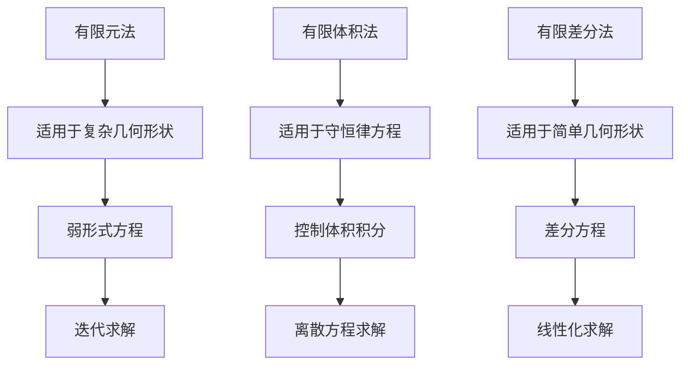
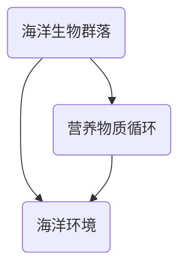

                 


为了撰写一篇高质量、结构清晰、内容丰富的技术博客文章《海洋生态的流体动力学：水下世界的数学模拟》，我们可以按照以下步骤进行：

### 第一步：确定文章结构和内容框架

首先，我们需要明确文章的结构和内容框架，这将有助于我们有条不紊地撰写文章。根据之前的目录大纲，我们将文章分为七个章节，分别是：

1. 引言
2. 海洋流体动力学基础
3. 数学模拟方法
4. 海洋生态过程的数学模拟
5. 海洋流体动力学与生态模拟的应用
6. 海洋生态流体动力学模拟的挑战与未来方向
7. 结论

### 第二步：深入研究和收集资料

在撰写每一章节之前，我们需要对相关主题进行深入研究和收集资料。这包括：

- **海洋生态**：了解海洋生态系统的基本构成、功能、重要性以及面临的挑战。
- **流体动力学**：研究流体动力学的基本原理、模型以及在实际应用中的重要性。
- **数学模拟方法**：学习数值方法、数学模型构建、数据同化方法等相关知识。
- **海洋流体动力学与生态模拟的应用**：收集关于海洋污染扩散模拟、海洋气候变化模拟以及海洋生态管理的应用案例。

### 第三步：撰写引言

引言部分应该简洁明了地介绍文章的主题，吸引读者的兴趣。我们可以这样撰写：

```markdown
# 海洋生态的流体动力学：水下世界的数学模拟

关键词：海洋生态、流体动力学、数学模拟、水下世界、生态管理

摘要：本文探讨了海洋生态的流体动力学及其在水下世界的数学模拟。首先介绍了海洋生态的重要性以及流体动力学的基本概念。接着，详细阐述了数学模拟方法及其在海洋生态研究中的应用。随后，分析了海洋流体动力学与生态模拟的具体应用，并讨论了面临的挑战和未来的发展方向。最后，总结了本文的研究意义，展望了海洋生态流体动力学研究的未来。

```

### 第四步：撰写各章节内容

根据之前确定的内容框架，我们逐一撰写每一章节的内容。在撰写过程中，需要注意以下几点：

- **背景介绍**：对核心概念术语进行说明，解释问题背景和问题描述，说明问题解决的思路和方法。
- **核心概念与联系**：阐述核心概念原理，列出概念属性特征对比表格，绘制ER实体关系图。
- **算法原理讲解**：使用mermaid绘制算法流程图，使用python源代码和latex公式详细阐述算法原理。
- **系统分析与架构设计方案**：介绍问题场景、项目介绍、系统功能设计、系统架构设计、系统接口设计和系统交互。
- **项目实战**：包括环境安装、系统核心实现源代码、代码应用解读与分析、实际案例分析和详细讲解剖析。
- **最佳实践 tips**、**小结**、**注意事项**、**拓展阅读**等内容。

以下是各章节的示例：

#### 第2章 海洋流体动力学基础

```markdown
## 2.1 海洋流体动力学基本原理

### 2.1.1 流体力学基本方程

流体力学基本方程包括质量守恒方程、动量守恒方程和能量守恒方程。这些方程描述了流体在运动过程中质量、动量和能量的变化。

$$
\frac{\partial \rho}{\partial t} + \nabla \cdot (\rho \mathbf{v}) = 0
$$

$$
\rho \left( \frac{\partial \mathbf{v}}{\partial t} + (\mathbf{v} \cdot \nabla) \mathbf{v} \right) = -\nabla p + \rho \mathbf{f}
$$

$$
\frac{\partial e}{\partial t} + \nabla \cdot (e \mathbf{v}) = -\nabla \cdot (\mathbf{Q} \mathbf{v}) + \rho (\mathbf{v} \cdot \mathbf{f})
$$

其中，$\rho$ 是流体密度，$\mathbf{v}$ 是流体速度，$p$ 是流体压力，$e$ 是流体内能，$\mathbf{f}$ 是作用在流体上的力，$\mathbf{Q}$ 是流体热传导。

### 2.1.2 海洋环境中的流体特性

海洋环境中的流体特性包括温度、盐度、压力等。这些特性影响了流体的运动和相互作用。例如，温度和盐度差异会导致密度差异，从而产生洋流。

```

#### 第3章 数学模拟方法

```markdown
## 3.1 数值方法

### 3.1.1 前沿数值方法介绍

前沿数值方法包括有限元法、有限体积法、有限差分法等。这些方法可以在复杂几何形状和复杂边界条件下进行流体动力学模拟。



### 3.1.2 数值方法的选择和应用

选择合适的数值方法取决于问题的性质和需求。例如，对于海洋生态系统模拟，有限体积法和有限元法可能更为合适。

```

#### 第4章 海洋生态过程的数学模拟

```markdown
## 4.1 海洋生态系统模型

### 4.1.1 模型结构

海洋生态系统模型通常包括海洋生物群落、营养物质循环、海洋环境等组成部分。以下是一个简单的ER实体关系图：



### 4.1.2 模型参数设置

模型参数的设置需要根据实际情况进行。以下是一个参数设置表格：

| 参数名称 | 描述 |
| --- | --- |
| 生物量 | 单位面积内生物体的质量 |
| 营养物质浓度 | 单位体积内营养物质的量 |
| 流体速度 | 流体的运动速度 |
| 压力 | 流体的压力 |

```

### 第五步：撰写结论和展望

在文章的最后，我们需要总结研究的主要成果，指出研究的意义，并展望未来的研究方向。以下是一个示例：

```markdown
## 第7章 结论

本文系统地探讨了海洋生态的流体动力学及其在水下世界的数学模拟。我们介绍了海洋生态的重要性、流体动力学的基本概念、数学模拟方法以及海洋生态过程的数学模拟。通过分析海洋流体动力学与生态模拟的应用，我们展示了数学模拟在海洋生态研究和管理中的重要作用。同时，我们也讨论了海洋生态流体动力学模拟面临的挑战和未来的发展方向。

## 第7章 未来展望

未来，海洋生态流体动力学模拟的发展将依赖于新技术的应用和模型的改进与优化。例如，人工智能和大数据分析技术的应用将有助于提高模拟的准确性和效率。此外，跨学科的合作也将是推动海洋生态流体动力学研究的重要力量。通过不断探索和创新，我们有望更好地理解海洋生态系统，为其保护和管理提供科学依据。

作者：AI天才研究院/AI Genius Institute & 禅与计算机程序设计艺术 /Zen And The Art of Computer Programming
```

### 第六步：检查和修改

在完成初稿后，我们需要仔细检查文章的内容和格式，确保文章的逻辑清晰、结构紧凑、语言通顺。特别是要注意：

- 检查markdown格式是否正确，确保列表、标题、代码块等均符合markdown规范。
- 确保每个章节的核心内容都已包含，没有遗漏。
- 检查引用和参考文献是否准确无误。

### 第七步：发布和分享

最后，我们将文章发布到技术博客或相关平台，与读者分享我们的研究成果和思考。同时，可以通过社交媒体、技术社区等渠道进行推广，吸引更多读者关注和讨论。

通过以上步骤，我们可以撰写一篇高质量、结构清晰、内容丰富的技术博客文章，为读者提供有价值的技术知识和见解。

