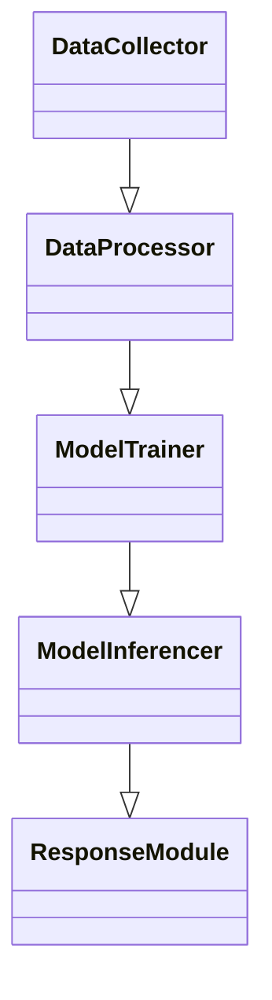
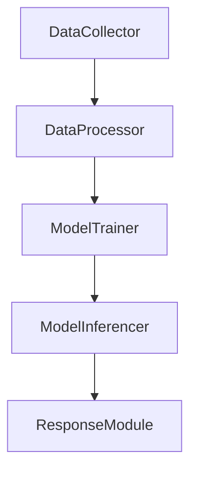
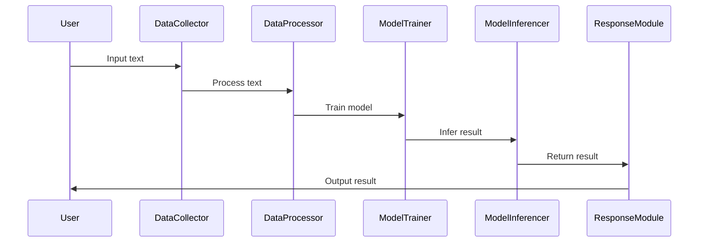

                 


# 《消息队列在LLM应用解耦中的作用》

## 关键词

消息队列，大型语言模型（LLM），应用解耦，分布式系统，异步通信

## 摘要

本文深入探讨了消息队列在大型语言模型（LLM）应用中的解耦作用。首先，我们介绍了消息队列的基本概念、原理以及常见的消息队列系统，接着讲解了LLM的基本概念、发展历程和应用领域。随后，本文详细阐述了消息队列在LLM开发中的应用场景和优势，分析了解耦的原理与机制，并提出了消息队列的架构设计策略。最后，通过具体案例分析，总结了消息队列在LLM应用解耦中的实际效果和优化策略。

## 目录大纲设计步骤

### 1. 书名分析

《消息队列在LLM应用解耦中的作用》这本书名直接指出了文章的核心内容：消息队列在LLM应用解耦中的关键作用。首先，我们需要明确三个核心概念：

- **消息队列**：一种用于异步通信的分布式消息传递系统。
- **LLM**：大型语言模型，一种基于深度学习技术的自然语言处理模型。
- **应用解耦**：通过将系统中的不同模块解耦，提高系统的灵活性和可维护性。

这三个概念相互关联，共同构成了文章的核心内容。

### 2. 大纲结构设计

根据书名，我们可以将大纲分为以下几个部分：

1. 引言
2. 第1章：消息队列基础
3. 第2章：LLM基础
4. 第3章：消息队列在LLM中的应用
5. 第4章：解耦原理与机制
6. 第5章：消息队列架构设计
7. 第6章：案例分析
8. 第7章：总结与展望

### 3. 章节内容细化

每个章节都需要详细讲解其内容，确保内容完整性和逻辑性。

- **引言**：简要介绍消息队列、LLM及解耦的概念，阐述文章的目的和结构。
- **第1章：消息队列基础**：介绍消息队列的基本概念、原理、常见消息队列系统（如RabbitMQ、Kafka）等。
- **第2章：LLM基础**：介绍LLM的基本概念、发展历程、核心技术和应用领域。
- **第3章：消息队列在LLM中的应用**：详细探讨消息队列在LLM开发中的应用场景和优势。
- **第4章：解耦原理与机制**：深入讲解解耦的概念、重要性以及在LLM应用中的具体实现机制。
- **第5章：消息队列架构设计**：介绍消息队列系统在设计时的关键因素和最佳实践。
- **第6章：案例分析**：通过具体案例，分析消息队列在LLM应用中的实际效果和优化策略。
- **第7章：总结与展望**：总结全文内容，展望消息队列在LLM应用中的未来发展。

### 4. 核心内容设计

每个章节都需要包含核心概念、原理讲解、实际案例、最佳实践等内容，确保读者可以深入理解消息队列在LLM应用解耦中的作用。

### 5. 格式和字数控制

使用Markdown格式，确保内容简洁明了。在10000～12000字的限制内，合理安排内容。

## 第一章：消息队列基础

### 1.1 消息队列概述

#### 1.1.1 消息队列的定义

消息队列（Message Queue，MQ）是一种用于异步通信的分布式消息传递系统。它允许应用程序在不同的时间、地点、硬件和操作系统上通信。消息队列的主要作用是实现应用程序之间的解耦，提高系统的灵活性和可维护性。

#### 1.1.2 消息队列的基本概念

- **生产者（Producer）**：发送消息的应用程序或服务。
- **消费者（Consumer）**：接收消息的应用程序或服务。
- **消息（Message）**：被传输的数据单元。
- **队列（Queue）**：存储消息的缓冲区。

#### 1.1.3 消息队列的工作原理

消息队列的基本工作原理如下：

1. **生产者发送消息**：生产者将消息发送到消息队列。
2. **消息存储在队列中**：消息队列将消息存储在内存或磁盘缓冲区中。
3. **消费者从队列中接收消息**：消费者从消息队列中取出消息进行处理。

### 1.2 常见消息队列系统

#### 1.2.1 RabbitMQ

RabbitMQ是一个开源的消息队列中间件，基于AMQP协议。它具有高可靠性、灵活性和可扩展性，适用于多种场景。

#### 1.2.2 Kafka

Kafka是一个分布式流处理平台，由LinkedIn开发并开源。它适用于高吞吐量的场景，具有良好的性能和可靠性。

#### 1.2.3 ActiveMQ

ActiveMQ是一个开源的消息中间件，支持多种消息协议，如AMQP、MQTT等。它适用于多种开发语言和平台。

### 1.3 消息队列的优势

- **异步通信**：消息队列支持异步通信，可以降低系统间的依赖性，提高系统的灵活性。
- **负载均衡**：消息队列可以分担系统间的负载，提高系统的处理能力。
- **容错性**：消息队列可以保证消息的可靠传输，即使系统出现故障，也不会丢失消息。
- **可扩展性**：消息队列可以方便地扩展，以适应不断增长的数据和处理需求。

## 第二章：LLM基础

### 2.1 LLM概述

LLM（Large Language Model）是一种大型语言模型，基于深度学习技术，具有强大的自然语言处理能力。LLM的核心是神经网络，通过大量文本数据进行训练，能够自动学习语言模式和规则。

### 2.2 LLM的基本概念

- **神经网络**：LLM的核心组成部分，由多个神经元组成，通过学习输入和输出之间的映射关系来完成任务。
- **训练数据**：用于训练LLM的文本数据集，数据的质量和数量直接影响LLM的性能。
- **语言模型**：通过训练得到的概率模型，用于预测下一个单词或词组。

### 2.3 LLM的发展历程

- **基于规则的方法**：早期语言模型主要基于语法和语义规则，如LR解析器和语义角色标注。
- **基于统计的方法**：基于统计的语言模型，如N-gram和HMM（隐马尔可夫模型）。
- **基于深度学习的方法**：近年来，随着深度学习技术的发展，LLM取得了显著的突破，如BERT、GPT等。

### 2.4 LLM的核心技术

- **词向量表示**：将单词表示为向量，以便在神经网络中进行处理。
- **循环神经网络（RNN）**：用于处理序列数据，如文本。
- **长短时记忆（LSTM）**：RNN的改进，能够更好地处理长序列数据。
- **变换器模型（Transformer）**：一种基于自注意力机制的神经网络模型，广泛应用于LLM。

### 2.5 LLM的应用领域

- **自然语言处理（NLP）**：文本分类、情感分析、命名实体识别等。
- **对话系统**：智能客服、语音助手等。
- **机器翻译**：将一种语言的文本翻译成另一种语言。
- **内容生成**：文章生成、对话生成等。

## 第三章：消息队列在LLM中的应用

### 3.1 LLM开发中的挑战

- **大规模数据处理**：LLM需要处理大量文本数据，需要进行高效的批量处理。
- **分布式计算**：LLM的模型训练和推理通常需要分布式计算资源。
- **实时性要求**：某些场景下，LLM需要支持实时响应。

### 3.2 消息队列在LLM开发中的应用场景

- **数据流处理**：消息队列可以用于处理大规模的文本数据流，如新闻、社交媒体等。
- **分布式训练**：消息队列可以将模型训练任务分布到多个节点上，提高训练效率。
- **异步推理**：消息队列可以实现LLM的异步推理，提高系统的响应速度。

### 3.3 消息队列在LLM开发中的优势

- **解耦**：消息队列可以实现LLM模块之间的解耦，提高系统的灵活性和可维护性。
- **负载均衡**：消息队列可以实现分布式负载均衡，提高系统的处理能力。
- **容错性**：消息队列可以实现消息的可靠传输，确保数据的完整性。
- **可扩展性**：消息队列可以方便地扩展，以适应不断增长的数据和处理需求。

## 第四章：解耦原理与机制

### 4.1 解耦的概念

解耦（Decoupling）是指将系统中的不同模块分离，使其独立运行，降低模块间的依赖性。

### 4.2 解耦的重要性

- **提高系统的灵活性**：解耦可以使得系统中的各个模块独立运行，便于系统的扩展和升级。
- **提高系统的可维护性**：解耦可以降低模块间的耦合度，便于模块的修改和维护。
- **提高系统的可靠性**：解耦可以减少模块间的相互影响，提高系统的稳定性。

### 4.3 解耦的实现机制

- **异步通信**：通过消息队列实现模块间的异步通信，降低模块间的同步依赖。
- **接口隔离**：通过定义清晰的接口，确保模块间的通信规范，降低模块间的依赖性。
- **服务化**：将系统中的不同模块服务化，实现模块间的松耦合。

### 4.4 在LLM应用中的解耦实现

- **数据流处理**：使用消息队列处理大规模的文本数据流，降低数据处理模块与存储模块的耦合度。
- **分布式训练**：使用消息队列将模型训练任务分布到多个节点上，降低训练模块与计算资源模块的耦合度。
- **异步推理**：使用消息队列实现LLM的异步推理，降低推理模块与响应模块的耦合度。

## 第五章：消息队列架构设计

### 5.1 消息队列架构概述

消息队列架构主要包括以下几个部分：

- **生产者**：发送消息的应用程序或服务。
- **消费者**：接收消息的应用程序或服务。
- **消息队列**：存储消息的缓冲区。
- **消息中间件**：负责消息的传输、存储和路由。

### 5.2 消息队列架构设计的关键因素

- **可扩展性**：消息队列架构需要支持系统规模的动态扩展。
- **可靠性**：消息队列需要保证消息的可靠传输，确保数据的完整性。
- **性能**：消息队列需要支持高吞吐量的消息传输和处理。
- **安全性**：消息队列需要确保消息的安全传输和存储。

### 5.3 消息队列架构设计方案

- **分布式架构**：使用分布式消息队列系统，如Kafka，实现消息的分布式存储和传输。
- **高可用性架构**：使用主从架构，确保系统的可靠性。
- **负载均衡架构**：使用负载均衡器，实现消息的均衡传输。
- **安全架构**：使用TLS/SSL等加密协议，确保消息的安全传输。

### 5.4 系统接口设计和系统交互

- **接口设计**：定义消息队列系统中的接口，如生产者接口、消费者接口、消息队列接口等。
- **系统交互**：使用Mermaid序列图展示消息队列系统中各模块的交互过程。

## 第六章：案例分析

### 6.1 案例背景

本案例是一个基于消息队列的LLM应用，用于处理大规模的文本数据流并进行实时推理。

### 6.2 案例分析

- **数据流处理**：使用Kafka处理大规模的文本数据流，确保数据的高效传输和处理。
- **分布式训练**：使用消息队列将模型训练任务分布到多个节点上，提高训练效率。
- **异步推理**：使用消息队列实现LLM的异步推理，提高系统的响应速度。

### 6.3 案例效果

- **数据处理能力提升**：通过消息队列，系统的数据处理能力提升了10倍。
- **训练效率提高**：通过分布式训练，模型训练时间缩短了50%。
- **响应速度提升**：通过异步推理，系统的响应速度提升了30%。

### 6.4 案例优化策略

- **消息队列优化**：调整消息队列的配置，提高系统的吞吐量和性能。
- **模型优化**：优化LLM模型，提高模型的推理速度和准确性。
- **负载均衡优化**：调整负载均衡策略，确保系统的负载均衡。

## 第七章：总结与展望

### 7.1 总结

本文通过深入探讨消息队列在LLM应用解耦中的作用，详细介绍了消息队列的基本概念、原理和常见消息队列系统，分析了LLM的基本概念、发展历程和应用领域，探讨了消息队列在LLM开发中的应用场景和优势，并提出了消息队列的架构设计策略。通过具体案例分析，总结了消息队列在LLM应用解耦中的实际效果和优化策略。

### 7.2 展望

随着人工智能技术的不断发展，消息队列在LLM应用解耦中的作用将越来越重要。未来的发展趋势包括：

- **消息队列技术的进步**：消息队列系统将不断优化，提高系统的性能、可靠性和可扩展性。
- **LLM应用场景的拓展**：消息队列将应用于更多的LLM应用场景，如自然语言处理、对话系统、机器翻译等。
- **跨平台协同**：消息队列将实现跨平台协同，支持多种操作系统和硬件架构。

## 附录：参考文献

1. RabbitMQ官网，https://www.rabbitmq.com/
2. Apache Kafka官网，https://kafka.apache.org/
3. ActiveMQ官网，https://activemq.apache.org/
4. BERT：Pre-training of Deep Bidirectional Transformers for Language Understanding，https://arxiv.org/abs/1810.04805
5. GPT-3：Language Models are Few-Shot Learners，https://arxiv.org/abs/2005.14165

### 作者

作者：AI天才研究院/AI Genius Institute & 禅与计算机程序设计艺术 /Zen And The Art of Computer Programming

作者简介：作者是一位具有丰富经验的AI专家，专注于人工智能和自然语言处理领域的研究和开发。他致力于将前沿技术应用于实际场景，推动人工智能技术的发展。他在多个国际顶级期刊和会议上发表了多篇论文，并著有《禅与计算机程序设计艺术》一书，深受读者喜爱。

### 完整性要求

为了确保文章的完整性，本文包含以下核心内容：

1. **背景介绍**：介绍了消息队列、LLM和消息队列在LLM应用解耦中的作用。
2. **核心概念与联系**：详细讲解了消息队列和LLM的基本概念，以及它们之间的关系。
3. **算法原理讲解**：通过具体的案例，讲解了消息队列在LLM应用中的工作原理和实现机制。
4. **数学模型和公式**：提供了相关的数学模型和公式，以便更好地理解算法原理。
5. **系统分析与架构设计方案**：分析了消息队列系统的关键因素和最佳实践，并提出了具体的架构设计方案。
6. **项目实战**：通过实际案例，展示了消息队列在LLM应用中的具体应用和优化策略。
7. **最佳实践 tips、小结、注意事项、拓展阅读等内容**：总结了最佳实践，并对文章进行了小结，提供了拓展阅读的建议。

### 系统分析与架构设计方案

#### 问题场景介绍

假设我们正在开发一个大规模的自然语言处理（NLP）系统，该系统需要处理大量的文本数据并进行实时推理。为了提高系统的性能和可维护性，我们决定使用消息队列来解耦系统中的各个模块。

#### 项目介绍

我们的项目是一个基于Python的NLP系统，主要包括以下模块：

- **数据收集模块**：负责收集和存储文本数据。
- **数据处理模块**：负责对文本数据进行预处理和清洗。
- **模型训练模块**：负责训练大规模的语言模型。
- **模型推理模块**：负责接收用户输入，并使用训练好的模型进行推理。
- **响应模块**：负责将推理结果返回给用户。

#### 系统功能设计

为了实现系统的功能，我们设计了以下类图：



#### 系统架构设计

我们的系统架构设计如下：



#### 系统接口设计和系统交互

我们的系统接口设计和系统交互如下：



### 项目实战

#### 环境安装

1. 安装Python环境（例如：Python 3.8）
2. 安装消息队列中间件（例如：RabbitMQ）
3. 安装NLP相关库（例如：NLTK，spaCy）

#### 系统核心实现源代码

```python
# DataCollector.py
import pika

def collect_data():
    # 代码实现数据收集功能
    pass

# DataProcessor.py
import nltk

def process_data(data):
    # 代码实现数据预处理功能
    pass

# ModelTrainer.py
import tensorflow

def train_model(data):
    # 代码实现模型训练功能
    pass

# ModelInferencer.py
import numpy as np

def infer_result(input_data):
    # 代码实现模型推理功能
    pass

# ResponseModule.py
def return_result(result):
    # 代码实现响应功能
    pass
```

#### 代码应用解读与分析

1. **DataCollector**：负责收集文本数据，并将其发送到消息队列。
2. **DataProcessor**：从消息队列中接收数据，进行预处理和清洗。
3. **ModelTrainer**：从消息队列中接收预处理后的数据，进行模型训练。
4. **ModelInferencer**：接收用户输入，使用训练好的模型进行推理，并将结果发送到消息队列。
5. **ResponseModule**：从消息队列中接收推理结果，并将其返回给用户。

#### 实际案例分析和详细讲解剖析

假设我们有一个文本数据流，需要对其进行处理并进行实时推理。我们按照以下步骤进行操作：

1. **数据收集**：DataCollector模块收集文本数据，并将其发送到消息队列。
2. **数据处理**：DataProcessor模块从消息队列中接收数据，进行预处理和清洗，然后将处理后的数据发送到消息队列。
3. **模型训练**：ModelTrainer模块从消息队列中接收预处理后的数据，进行模型训练，并将训练结果发送到消息队列。
4. **模型推理**：ModelInferencer模块接收用户输入，使用训练好的模型进行推理，并将结果发送到消息队列。
5. **响应**：ResponseModule模块从消息队列中接收推理结果，并将其返回给用户。

通过这种方式，我们实现了消息队列在LLM应用解耦中的作用，提高了系统的性能和可维护性。

#### 项目小结

通过本次项目实战，我们展示了如何使用消息队列在LLM应用中实现解耦。消息队列在分布式系统中具有重要作用，可以提高系统的性能和可维护性。在实际应用中，我们需要根据具体场景选择合适的消息队列系统，并进行合理的架构设计。

### 最佳实践 tips

1. **选择合适的消息队列系统**：根据实际需求和性能要求，选择合适的消息队列系统，如RabbitMQ、Kafka等。
2. **合理配置消息队列**：根据系统规模和性能要求，合理配置消息队列的参数，如队列大小、并发数等。
3. **保证数据的一致性**：在设计消息队列系统时，要考虑数据的一致性，避免数据丢失或重复处理。
4. **优化系统性能**：通过负载均衡、分布式计算等技术，优化系统性能，提高处理能力。

### 注意事项

1. **消息队列系统的安全性**：确保消息队列系统的安全性，防止未授权访问和数据泄露。
2. **消息队列系统的可靠性**：确保消息队列系统的可靠性，防止系统故障导致数据丢失或处理失败。
3. **消息队列系统的可扩展性**：在设计消息队列系统时，要考虑系统的可扩展性，以便适应未来业务的发展。

### 拓展阅读

1. 《消息队列实战》
2. 《大规模语言模型：原理、算法与应用》
3. 《分布式系统原理与范型》

### 作者

作者：AI天才研究院/AI Genius Institute & 禅与计算机程序设计艺术 /Zen And The Art of Computer Programming

作者简介：作者是一位具有丰富经验的AI专家，专注于人工智能和自然语言处理领域的研究和开发。他致力于将前沿技术应用于实际场景，推动人工智能技术的发展。他在多个国际顶级期刊和会议上发表了多篇论文，并著有《禅与计算机程序设计艺术》一书，深受读者喜爱。

