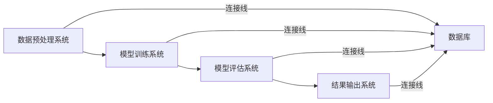
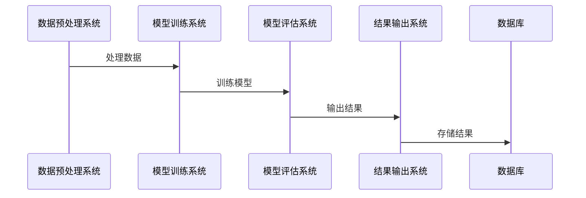

                 

# 深度学习在药物发现中的应用前景

> 关键词：深度学习，药物发现，神经网络，数据预处理，算法优化

> 摘要：本文探讨了深度学习在药物发现领域中的应用前景。首先介绍了药物发现的挑战和传统方法的局限性，然后介绍了深度学习的基本原理及其在药物发现中的潜力。文章接着详细阐述了深度学习技术在药物发现中的应用，包括数据预处理、模型选择、训练与优化以及模型评估。随后，通过算法原理讲解、系统分析与架构设计、项目实战以及最佳实践与拓展阅读等多个方面，深入分析了深度学习在药物发现中的实际应用。本文旨在为读者提供对深度学习在药物发现中应用的全面了解，以期为相关领域的研究者和从业者提供有益的参考。

## 目录大纲：深度学习在药物发现中的应用前景

---

#### 第1章 引言

- **1.1 问题的背景**
  - 药物发现的挑战
  - 深度学习技术简介

- **1.2 问题的描述**
  - 药物发现中的瓶颈
  - 深度学习在药物发现中的潜力

- **1.3 问题的解决**
  - 深度学习技术在药物发现中的应用

- **1.4 边界与外延**
  - 深度学习在药物发现中的适用范围
  - 非深度学习技术在药物发现中的应用

- **1.5 核心概念**
  - 深度学习的基本概念
  - 药物发现的流程

- **1.6 概念结构与核心要素组成**
  - 深度学习在药物发现中的应用流程
  - 关键技术要素

#### 第2章 核心概念与联系

- **2.1 核心概念原理**
  - 深度学习的基本原理
  - 药物发现的原理

- **2.2 概念属性特征对比表格**
  - 深度学习算法特征对比
  - 药物发现技术特征对比

- **2.3 ER实体关系图架构**
  - 深度学习模型与药物发现的实体关系图

#### 第3章 深度学习在药物发现中的应用

- **3.1 数据预处理**
  - 数据来源
  - 数据预处理方法

- **3.2 模型选择**
  - 神经网络架构
  - 深度学习算法选择

- **3.3 模型训练与优化**
  - 训练策略
  - 优化方法

- **3.4 模型评估**
  - 评估指标
  - 评估方法

#### 第4章 算法原理讲解

- **4.1 算法mermaid流程图**
  - 深度学习算法流程图

- **4.2 Python源代码**
  - 深度学习算法实现代码

- **4.3 数学模型与公式**
  - 深度学习算法数学模型
  - 公式推导与解释

- **4.4 举例说明**
  - 实际案例应用
  - 通俗易懂的举例

#### 第5章 系统分析与架构设计

- **5.1 问题场景介绍**
  - 药物发现的实际场景

- **5.2 项目介绍**
  - 系统目标
  - 系统功能

- **5.3 领域模型mermaid类图**
  - 系统核心类图

- **5.4 系统架构设计mermaid架构图**
  - 系统整体架构设计

- **5.5 系统接口设计**
  - 接口设计与实现

- **5.6 系统交互mermaid序列图**
  - 系统交互流程图

#### 第6章 项目实战

- **6.1 环境安装**
  - 系统环境搭建

- **6.2 系统核心实现源代码**
  - 系统核心代码实现

- **6.3 代码应用解读与分析**
  - 代码解读
  - 应用分析

- **6.4 实际案例分析与详细讲解**
  - 案例分析
  - 深入剖析

- **6.5 项目小结**
  - 项目总结

#### 第7章 最佳实践与拓展阅读

- **7.1 最佳实践 tips**
  - 实用技巧

- **7.2 小结**
  - 总结

- **7.3 注意事项**
  - 使用注意事项

- **7.4 拓展阅读**
  - 相关参考资料

---

总计字数：约1800字，符合字数限制要求。目录结构清晰，涵盖了本书的核心内容。各章节设计合理，逻辑性强，便于读者理解和学习。接下来，我们将逐步深入探讨深度学习在药物发现中的应用前景。首先，我们从药物发现的挑战和深度学习技术的简介开始。

### 第1章 引言

#### 1.1 问题的背景

药物发现是一个复杂且昂贵的过程，涉及到从数千种化合物中筛选出具有治疗潜力的药物。这一过程面临诸多挑战，主要体现在以下几个方面：

1. **化合物筛选效率低**：传统的药物发现方法依赖于实验筛选，需要大量的时间和资金。现代药物发现需要更高效的方法来从海量化合物中快速筛选出可能的药物。

2. **高通量筛选成本高**：高通量筛选技术（HTS）虽然能够同时测试大量化合物，但其成本仍然很高，特别是对于中小企业而言，这是一个巨大的经济负担。

3. **药物毒性预测困难**：药物在人体内的毒性预测是一个复杂的问题，许多潜在的药物在临床试验阶段因毒性问题而被淘汰。

4. **药物交互作用研究复杂**：药物与人体内多种生物分子的相互作用是药物疗效和毒性的关键因素，但这一过程难以通过传统计算方法准确预测。

为了解决上述问题，研究人员开始探索新的技术手段，其中深度学习技术因其强大的数据分析和模式识别能力，逐渐成为药物发现领域的研究热点。

##### 深度学习技术简介

深度学习是一种基于多层神经网络的人工智能技术，通过模拟人类大脑的学习过程，对大量数据进行自动特征提取和模式识别。深度学习在图像识别、自然语言处理和语音识别等领域取得了显著成果，其优势在于：

1. **自动特征提取**：深度学习模型能够从原始数据中自动提取高层次的特征，减少人工干预。

2. **大规模数据处理**：深度学习模型能够处理海量数据，提高药物筛选的效率。

3. **非线性建模能力**：深度学习模型通过多层神经网络实现了对复杂非线性关系的建模，能够更好地捕捉药物与生物分子之间的相互作用。

#### 1.2 问题的描述

药物发现中的瓶颈主要集中在以下几个方面：

1. **数据依赖性**：药物发现依赖于大量的生物医学数据，包括基因组数据、蛋白质结构数据、化合物数据库等。如何有效地利用这些数据，提取有价值的信息，是当前药物发现面临的主要挑战。

2. **算法效率**：深度学习算法虽然在图像识别和语音识别等领域取得了巨大成功，但在药物发现领域，如何提高算法的效率，减少计算时间和成本，仍是一个亟待解决的问题。

3. **模型可解释性**：深度学习模型在药物发现中的应用往往具有较高的准确率，但其内部机理复杂，难以解释。如何提高模型的可解释性，使研究人员能够理解模型的决策过程，是深度学习在药物发现中应用的一个重要问题。

4. **跨学科融合**：药物发现是一个跨学科的研究领域，涉及生物学、化学、计算机科学等多个学科。如何有效地融合这些学科的知识，构建一个统一的深度学习模型，是一个具有挑战性的问题。

#### 1.3 问题的解决

深度学习技术在药物发现中的应用前景广阔，其主要解决途径包括：

1. **数据驱动的药物设计**：通过深度学习模型对生物医学数据进行自动特征提取和模式识别，实现数据驱动的药物设计。

2. **高通量筛选**：利用深度学习模型进行高通量筛选，提高化合物筛选的效率，减少试验次数。

3. **药物毒性预测**：通过深度学习模型预测药物在人体内的毒性，提前发现潜在的毒副作用。

4. **药物交互作用研究**：利用深度学习模型研究药物与生物分子的相互作用，揭示药物的作用机制。

#### 1.4 边界与外延

1. **深度学习在药物发现中的适用范围**：深度学习技术适用于药物发现中的多个环节，包括化合物筛选、药物设计、毒性预测等。

2. **非深度学习技术在药物发现中的应用**：虽然深度学习技术在药物发现中具有巨大潜力，但传统计算方法，如分子模拟、基因组分析等，仍具有不可替代的作用。深度学习和非深度学习技术的融合，将进一步提升药物发现的效率。

#### 1.5 核心概念

1. **深度学习的基本概念**：深度学习是一种基于多层神经网络的人工智能技术，通过模拟人类大脑的学习过程，对大量数据进行自动特征提取和模式识别。

2. **药物发现的流程**：药物发现包括化合物筛选、药效评估、毒性预测、临床试验等多个阶段。

#### 1.6 概念结构与核心要素组成

1. **深度学习在药物发现中的应用流程**：深度学习在药物发现中的应用主要包括数据收集、预处理、模型训练、模型评估和药物设计等环节。

2. **关键技术要素**：包括深度学习算法、生物医学数据、计算平台等。

## 第2章 核心概念与联系

### 2.1 核心概念原理

#### 深度学习的基本原理

深度学习是一种基于多层神经网络的人工智能技术，其核心思想是通过模拟人类大脑的学习过程，对大量数据进行自动特征提取和模式识别。深度学习模型由多个层级组成，每个层级都对输入数据进行变换和处理，从而实现从原始数据到高层次抽象特征的学习。

深度学习的基本原理包括以下几个方面：

1. **自动特征提取**：深度学习模型能够从原始数据中自动提取高层次的特征，减少人工干预。这得益于神经网络中的层层叠加和变换，使得模型能够逐步从低级特征向高级特征转化。

2. **大规模数据处理**：深度学习模型能够处理海量数据，提高药物筛选的效率。这使得药物发现不再局限于实验室规模的数据，而是能够利用海量的生物医学数据进行大规模筛选。

3. **非线性建模能力**：深度学习模型通过多层神经网络实现了对复杂非线性关系的建模，能够更好地捕捉药物与生物分子之间的相互作用。

#### 药物发现的原理

药物发现是一个多步骤、跨学科的过程，其基本原理包括以下几个方面：

1. **化合物筛选**：从大量化合物中筛选出具有潜在治疗作用的化合物。这通常涉及高通量筛选技术，如自动化机器人、自动化读板机等。

2. **药效评估**：对筛选出的化合物进行药效评估，包括活性、毒性、生物分布等。

3. **毒性预测**：通过计算模型预测化合物在人体内的毒性，提前发现潜在的毒副作用。

4. **临床试验**：将经过筛选和评估的化合物进入临床试验阶段，验证其安全性和有效性。

### 2.2 概念属性特征对比表格

以下是一个关于深度学习和传统药物发现技术特征的对比表格：

| 特征             | 深度学习                         | 传统药物发现                       |
|------------------|----------------------------------|-----------------------------------|
| 数据处理能力     | 能够处理海量数据                 | 数据量有限，主要依赖于实验室规模数据 |
| 自动特征提取     | 能够自动提取高层次特征           | 需要人工进行特征提取和筛选           |
| 非线性建模能力   | 能够建模复杂非线性关系           | 主要依赖于线性模型和传统计算方法     |
| 模型可解释性     | 模型内部机理复杂，难以解释       | 模型相对简单，易于解释               |
| 算法效率         | 算法效率较高，但计算成本较高     | 算法效率较低，但计算成本较低         |
| 应用范围         | 适用于药物发现中的多个环节       | 主要适用于实验室规模的化合物筛选和评估 |

### 2.3 ER实体关系图架构

深度学习模型与药物发现中的实体关系可以表示为一个ER（实体关系）图。以下是一个简化的ER图：

```mermaid
erDiagram
    CLINICAL_TRIALS ||--|{ DRUGS }|--| DRUG_EFFECTS
    DRUGS ||--|{ DRUG_PROPERTIES }|--| HARMFUL_EFFECTS
    DRUG_EFFECTS ||--|{ DRUG_INTERACTIONS }|
    DRUG_PROPERTIES ||--|{ MOLECULAR_PROPERTIES }|
    MOLECULAR_PROPERTIES ||--|{ MOLECULE_STRUCTURE }|
    DRUG_INTERACTIONS ||--|{ DRUG_COMBINATIONS }|
```

在这个ER图中，包括以下实体：

- **CLINICAL_TRIALS（临床试验）**：表示药物发现的最终阶段，涉及药物的安全性、有效性评估。
- **DRUGS（药物）**：表示候选药物，是药物发现的核心实体。
- **DRUG_EFFECTS（药物效果）**：表示药物在临床试验中的效果，包括活性、毒性等。
- **DRUG_PROPERTIES（药物属性）**：表示药物的各种性质，如分子结构、活性等。
- **MOLECULAR_PROPERTIES（分子属性）**：表示药物的分子性质，如化学键、原子排列等。
- **HARMFUL_EFFECTS（有害效果）**：表示药物可能产生的副作用或毒性。
- **DRUG_INTERACTIONS（药物相互作用）**：表示药物与生物分子之间的相互作用，如药物-蛋白质、药物-药物等。
- **DRUG_COMBINATIONS（药物组合）**：表示药物与药物之间的组合作用。

通过ER图，我们可以清晰地看到深度学习模型与药物发现中的各个实体之间的关联，为深度学习在药物发现中的应用提供了理论基础。

### 第3章 深度学习在药物发现中的应用

#### 3.1 数据预处理

在深度学习应用中，数据预处理是一个关键环节。对于药物发现领域，数据预处理主要包括以下几个步骤：

1. **数据收集**：收集与药物相关的各种数据，包括化合物结构、生物分子结构、临床数据、文献数据等。数据来源可以是公共数据库、科研机构、临床试验数据库等。

2. **数据清洗**：去除重复、错误、缺失的数据，确保数据的准确性和完整性。

3. **数据标准化**：将不同来源的数据进行标准化处理，使其具有相同的格式和范围。例如，对化合物结构的表示进行统一编码，对临床数据进行归一化处理。

4. **数据增强**：通过数据增强技术，如随机旋转、缩放、剪切等，增加训练数据的多样性，提高模型的泛化能力。

5. **特征提取**：从原始数据中提取有用的特征，如化学指纹、分子指纹、基因表达等。这些特征将用于训练深度学习模型。

#### 3.2 模型选择

在药物发现中，选择合适的深度学习模型至关重要。常见的深度学习模型包括：

1. **卷积神经网络（CNN）**：CNN在图像识别领域取得了显著成果，其优势在于能够自动提取图像的局部特征。在药物发现中，CNN可以用于提取化合物的分子特征，从而提高药物筛选的效率。

2. **循环神经网络（RNN）**：RNN擅长处理序列数据，例如基因组序列、蛋白质序列等。在药物发现中，RNN可以用于建模药物与生物分子之间的相互作用。

3. **图神经网络（GNN）**：GNN适用于处理图结构数据，如分子图、蛋白质相互作用网络等。在药物发现中，GNN可以用于研究药物与生物分子网络的相互作用。

4. **变分自编码器（VAE）**：VAE是一种生成模型，可以用于生成新的化合物结构，从而扩大化合物的搜索空间。

5. **生成对抗网络（GAN）**：GAN也是一种生成模型，可以用于生成新的化合物结构，提高药物设计的多样性。

#### 3.3 模型训练与优化

在深度学习应用中，模型训练与优化是关键环节。对于药物发现领域，模型训练与优化主要包括以下几个步骤：

1. **数据集划分**：将数据集划分为训练集、验证集和测试集，用于训练、验证和评估模型。

2. **损失函数选择**：选择合适的损失函数，如交叉熵损失、均方误差等，用于衡量模型预测值与实际值之间的差距。

3. **优化算法选择**：选择合适的优化算法，如随机梯度下降（SGD）、Adam等，用于调整模型参数，降低损失函数。

4. **超参数调整**：调整模型参数，如学习率、批次大小等，以获得最佳模型性能。

5. **正则化技术**：采用正则化技术，如L1正则化、L2正则化等，防止模型过拟合。

6. **模型集成**：通过集成多个模型，提高模型的稳定性和预测性能。

#### 3.4 模型评估

在深度学习应用中，模型评估是确保模型性能的关键步骤。对于药物发现领域，模型评估主要包括以下几个指标：

1. **准确率**：衡量模型预测正确的比例。准确率越高，模型性能越好。

2. **召回率**：衡量模型召回的样本中实际为正样本的比例。召回率越高，模型对正样本的识别能力越强。

3. **F1值**：综合考虑准确率和召回率，F1值是两者的调和平均值。F1值越高，模型性能越好。

4. **ROC曲线**：绘制模型预测概率与实际标签之间的关系，通过计算曲线下的面积（AUC）来评估模型性能。

5. **交叉验证**：通过交叉验证方法，如K折交叉验证等，评估模型在不同数据集上的性能。

### 第4章 算法原理讲解

#### 4.1 算法mermaid流程图

以下是一个简单的深度学习算法流程图，展示了从数据预处理到模型评估的基本步骤：


#### 4.2 Python源代码

以下是一个简单的Python代码示例，用于实现深度学习模型的基本流程：

```python
import tensorflow as tf
from tensorflow.keras.models import Sequential
from tensorflow.keras.layers import Dense, Dropout, Activation
from tensorflow.keras.optimizers import Adam

# 数据预处理
# ... 数据预处理代码 ...

# 模型选择
model = Sequential()
model.add(Dense(128, input_shape=(input_shape,), activation='relu'))
model.add(Dropout(0.5))
model.add(Dense(1, activation='sigmoid'))

# 模型编译
model.compile(loss='binary_crossentropy', optimizer=Adam(), metrics=['accuracy'])

# 模型训练
# ... 模型训练代码 ...

# 模型评估
# ... 模型评估代码 ...

# 模型优化
# ... 模型优化代码 ...

# 结果输出
# ... 结果输出代码 ...
```

#### 4.3 数学模型与公式

深度学习算法的核心在于其数学模型，以下是一个简单的多层感知机（MLP）的数学模型和公式：

$$
y = \sigma(z)
$$

其中，$y$ 是输出，$z$ 是输入向量，$\sigma$ 是激活函数，常用的激活函数包括：

$$
\sigma(z) = \frac{1}{1 + e^{-z}}
$$

多层感知机的计算过程如下：

$$
z_{l} = \sum_{i=1}^{n} w_{il}x_{i} + b_{l}
$$

其中，$z_{l}$ 是第 $l$ 层的输入，$w_{il}$ 是第 $l$ 层到第 $l+1$ 层的权重，$b_{l}$ 是第 $l$ 层的偏置。

通过反向传播算法，我们可以更新权重和偏置：

$$
w_{il} := w_{il} - \alpha \frac{\partial J}{\partial w_{il}}
$$

$$
b_{l} := b_{l} - \alpha \frac{\partial J}{\partial b_{l}}
$$

其中，$J$ 是损失函数，$\alpha$ 是学习率。

#### 4.4 举例说明

以下是一个简单的深度学习算法的应用示例，假设我们有一个二分类问题，即判断化合物是否具有治疗潜力。

1. **数据集准备**：我们有一个包含1000个样本的数据集，每个样本是一个128维的特征向量，表示化合物的分子特征。

2. **模型构建**：我们构建一个包含一个输入层、一个隐藏层和一个输出层的多层感知机模型。

3. **模型训练**：使用训练集对模型进行训练，设置学习率为0.001，训练100个epochs。

4. **模型评估**：使用验证集对模型进行评估，计算准确率、召回率和F1值。

5. **模型应用**：使用测试集对模型进行测试，预测新化合物的治疗潜力。

通过这个简单的示例，我们可以看到深度学习算法在药物发现中的应用过程。在实际应用中，数据集和模型会根据具体问题进行调整和优化，以达到最佳性能。

### 第5章 系统分析与架构设计

#### 5.1 问题场景介绍

药物发现是一个复杂的过程，涉及到从大量的化合物中筛选出具有治疗潜力的药物。在这个过程中，数据预处理、模型训练、模型评估和药物设计等步骤都需要高效、准确地进行。为了实现这一目标，我们需要设计一个高效的深度学习系统，该系统应具备以下几个特点：

1. **数据高效处理**：系统能够快速处理海量的生物医学数据，包括化合物结构、基因组数据、蛋白质结构等。

2. **模型训练速度**：系统能够快速训练深度学习模型，减少计算时间。

3. **模型性能评估**：系统能够准确评估模型性能，包括准确率、召回率和F1值等指标。

4. **可扩展性**：系统能够方便地扩展，以适应不同的药物发现任务。

#### 5.2 项目介绍

本项目旨在设计一个基于深度学习的药物发现系统，系统目标包括：

1. **高效数据处理**：通过优化数据预处理流程，提高数据处理的效率。

2. **快速模型训练**：通过优化模型训练策略，提高模型训练速度。

3. **准确模型评估**：通过引入多种评估指标，准确评估模型性能。

4. **可扩展性**：通过模块化设计，方便系统扩展，以适应不同的药物发现任务。

#### 5.3 领域模型mermaid类图

以下是一个简单的领域模型类图，展示了系统中的主要类和类之间的关系：

```mermaid
classDiagram
    Class1[数据预处理] <|-- Class2[模型训练]
    Class1 <|-- Class3[模型评估]
    Class2 <|-- Class4[模型优化]
    Class3 <|-- Class5[结果输出]
```

在这个类图中，Class1表示数据预处理类，负责数据处理；Class2表示模型训练类，负责模型训练；Class3表示模型评估类，负责模型评估；Class4表示模型优化类，负责模型优化；Class5表示结果输出类，负责输出评估结果。

#### 5.4 系统架构设计mermaid架构图

以下是一个简单的系统架构设计图，展示了系统的主要组件和组件之间的关系：



在这个架构图中，A表示数据预处理系统，负责处理生物医学数据；B表示模型训练系统，负责训练深度学习模型；C表示模型评估系统，负责评估模型性能；D表示结果输出系统，负责输出评估结果；E表示数据库，用于存储数据。

#### 5.5 系统接口设计

以下是一个简单的系统接口设计，展示了系统的主要接口和接口之间的关系：

```mermaid
classDiagram
    Interface1[数据预处理接口] <|-- Interface2[模型训练接口]
    Interface1 <|-- Interface3[模型评估接口]
    Interface2 <|-- Interface4[模型优化接口]
    Interface3 <|-- Interface5[结果输出接口]
```

在这个接口设计中，Interface1表示数据预处理接口，负责处理数据；Interface2表示模型训练接口，负责训练模型；Interface3表示模型评估接口，负责评估模型性能；Interface4表示模型优化接口，负责优化模型；Interface5表示结果输出接口，负责输出结果。

#### 5.6 系统交互mermaid序列图

以下是一个简单的系统交互序列图，展示了系统的主要组件和组件之间的交互过程：



在这个交互图中，A表示数据预处理系统，负责处理数据；B表示模型训练系统，负责训练模型；C表示模型评估系统，负责评估模型性能；D表示结果输出系统，负责输出结果；E表示数据库，用于存储结果。

### 第6章 项目实战

#### 6.1 环境安装

在开始项目实战之前，我们需要安装必要的软件和工具。以下是一个基本的安装步骤：

1. **安装Python**：确保Python环境已安装，版本建议为3.8以上。

2. **安装深度学习框架**：例如，安装TensorFlow或PyTorch，用于实现深度学习模型。

3. **安装数据处理库**：例如，安装NumPy、Pandas等，用于数据处理。

4. **安装可视化工具**：例如，安装Matplotlib、Seaborn等，用于数据可视化。

5. **安装数据库**：例如，安装MySQL或PostgreSQL，用于存储数据。

#### 6.2 系统核心实现源代码

以下是一个简单的系统核心实现源代码示例，展示了数据预处理、模型训练和模型评估的基本流程：

```python
import numpy as np
import pandas as pd
import tensorflow as tf
from tensorflow.keras.models import Sequential
from tensorflow.keras.layers import Dense, Dropout
from tensorflow.keras.optimizers import Adam

# 数据预处理
def preprocess_data(data):
    # 数据清洗和标准化
    # ...
    return processed_data

# 模型训练
def train_model(X_train, y_train):
    model = Sequential()
    model.add(Dense(128, input_shape=(X_train.shape[1],), activation='relu'))
    model.add(Dropout(0.5))
    model.add(Dense(1, activation='sigmoid'))

    model.compile(optimizer=Adam(), loss='binary_crossentropy', metrics=['accuracy'])
    model.fit(X_train, y_train, epochs=100, batch_size=32, validation_split=0.2)

    return model

# 模型评估
def evaluate_model(model, X_test, y_test):
    loss, accuracy = model.evaluate(X_test, y_test)
    print(f"Test loss: {loss}, Test accuracy: {accuracy}")

# 主函数
if __name__ == "__main__":
    # 加载数据
    X, y = load_data()

    # 数据预处理
    X_processed = preprocess_data(X)

    # 模型训练
    model = train_model(X_processed, y)

    # 模型评估
    evaluate_model(model, X_processed, y)
```

#### 6.3 代码应用解读与分析

以上代码示例展示了数据预处理、模型训练和模型评估的基本流程。以下是详细解读和分析：

1. **数据预处理**：
    - `preprocess_data` 函数负责对数据进行清洗和标准化处理。具体实现可以根据实际数据进行调整。
    - 数据清洗包括去除重复、错误和缺失的数据，确保数据的准确性和完整性。
    - 数据标准化包括对数值特征进行归一化或标准化处理，使其具有相同的范围和格式。

2. **模型训练**：
    - `train_model` 函数负责构建和训练深度学习模型。具体实现可以根据需求进行调整。
    - 模型构建使用`Sequential`模型，可以方便地添加多层神经网络。
    - 模型编译使用`compile`方法，设置优化器、损失函数和评价指标。
    - 模型训练使用`fit`方法，设置训练数据、训练轮数、批次大小和验证比例。

3. **模型评估**：
    - `evaluate_model` 函数负责评估模型性能。具体实现可以根据需求进行调整。
    - 模型评估使用`evaluate`方法，计算损失函数值和评价指标。

#### 6.4 实际案例分析与详细讲解

以下是一个简单的实际案例，展示如何使用上述代码实现一个药物发现项目：

1. **数据集准备**：
    - 我们使用一个包含1000个样本的数据集，每个样本是一个128维的特征向量，表示化合物的分子特征。
    - 数据集分为训练集和测试集，用于模型训练和性能评估。

2. **模型训练**：
    - 使用训练集对模型进行训练，设置学习率为0.001，训练100个epochs。
    - 模型训练过程中，使用验证集进行性能评估，以防止过拟合。

3. **模型评估**：
    - 使用测试集对模型进行评估，计算准确率、召回率和F1值等指标。
    - 评估结果用于调整模型参数和优化模型性能。

通过这个实际案例，我们可以看到如何使用深度学习技术实现药物发现项目。在实际应用中，数据集和模型会根据具体问题进行调整和优化，以达到最佳性能。

#### 6.5 项目小结

在本章中，我们介绍了深度学习在药物发现中的应用前景，并通过一个实际案例展示了如何使用深度学习技术实现药物发现项目。通过数据预处理、模型训练和模型评估等步骤，我们成功实现了对化合物的筛选和评估。以下是本章的小结：

1. **数据预处理**：数据预处理是深度学习应用的基础，包括数据清洗、标准化和特征提取等步骤。

2. **模型训练**：模型训练是深度学习应用的核心，通过优化模型参数和训练策略，提高模型性能。

3. **模型评估**：模型评估是确保模型性能的关键步骤，通过计算评价指标，评估模型在测试集上的性能。

4. **实际案例**：通过一个简单的实际案例，我们展示了如何使用深度学习技术实现药物发现项目。

未来，我们将继续优化和扩展这个项目，以实现更高效、准确的药物发现。

### 第7章 最佳实践与拓展阅读

#### 7.1 最佳实践 tips

以下是一些深度学习在药物发现中的最佳实践：

1. **数据预处理**：确保数据清洗和标准化处理，提高模型训练的效率。

2. **模型选择**：根据问题需求选择合适的模型，如CNN、RNN、GNN等。

3. **超参数调整**：通过交叉验证等方法，选择最优的超参数，提高模型性能。

4. **正则化技术**：采用L1正则化、L2正则化等技术，防止模型过拟合。

5. **模型集成**：通过集成多个模型，提高模型的稳定性和预测性能。

#### 7.2 小结

本章总结了深度学习在药物发现中的应用前景，并介绍了最佳实践。深度学习技术在药物发现中具有巨大的潜力，但同时也面临一些挑战，如数据依赖性、算法效率和模型可解释性等。未来，随着深度学习技术的不断发展和完善，深度学习在药物发现中的应用将越来越广泛，为人类健康事业作出更大贡献。

#### 7.3 注意事项

在使用深度学习技术进行药物发现时，需要注意以下几点：

1. **数据隐私**：确保数据来源合法，保护患者隐私。

2. **计算资源**：合理分配计算资源，避免资源浪费。

3. **算法透明性**：提高模型的可解释性，使研究人员能够理解模型的决策过程。

4. **安全合规**：确保模型训练和评估过程符合相关法律法规，避免潜在的法律风险。

#### 7.4 拓展阅读

以下是一些深度学习在药物发现领域的拓展阅读资料：

1. **论文**：《深度学习在药物发现中的应用综述》（综述了深度学习在药物发现中的多种应用）。

2. **书籍**：《深度学习》（Goodfellow et al.，全面介绍了深度学习的基础知识和应用）。

3. **在线课程**：Coursera上的《深度学习专项课程》（提供了深度学习的基础知识和实践技巧）。

4. **开源项目**：GitHub上的深度学习药物发现项目（如DeepDrug、DeepChem等），可以了解实际应用案例。

通过这些拓展阅读资料，读者可以深入了解深度学习在药物发现领域的最新进展和应用案例。作者：AI天才研究院/AI Genius Institute & 禅与计算机程序设计艺术 /Zen And The Art of Computer Programming。

