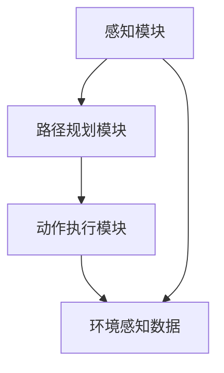
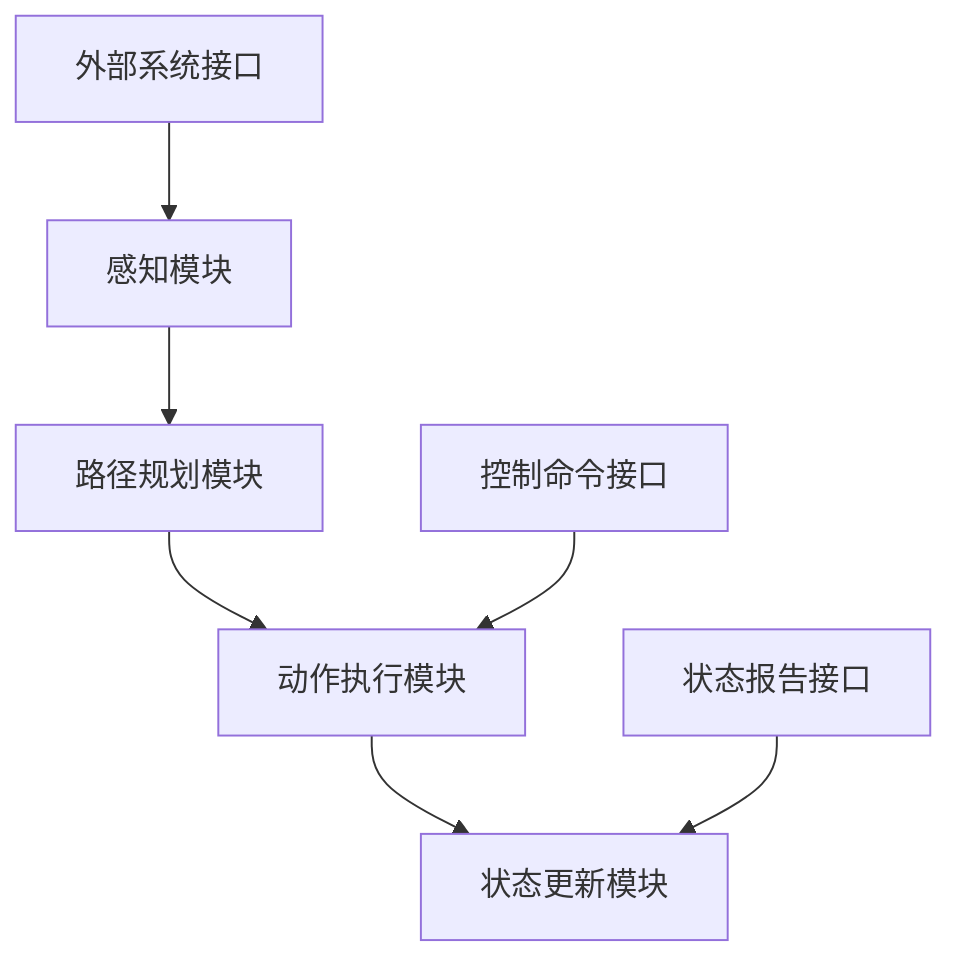
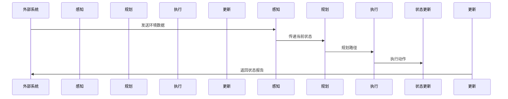

                 

### 关键词
深度强化学习，机器人导航，算法原理，系统架构，Python代码，数学模型。

### 摘要
本文深入探讨了深度强化学习在机器人导航中的应用和突破。通过对核心概念的详细解析，算法原理的深入剖析，以及系统架构和实战案例的介绍，本文为读者提供了一个全面的技术指南，帮助理解深度强化学习如何提升机器人导航的效率和可靠性。

## 目录

1. **引言：深度强化学习与机器人导航**
2. **核心概念与原理**
   1. **深度强化学习基础**
   2. **机器人导航的挑战**
   3. **深度强化学习与机器人导航的关系**
3. **算法与数学模型**
   1. **Q-Learning算法**
   2. **Deep Q-Network（DQN）**
   3. **深度强化学习的数学原理**
4. **系统架构与设计**
   1. **系统功能设计**
   2. **系统架构设计**
   3. **系统接口设计与交互**
5. **实战案例与项目分析**
   1. **环境安装与配置**
   2. **系统核心实现**
   3. **代码解读与分析**
   4. **案例分析与讲解**
6. **最佳实践与总结**
   1. **最佳实践**
   2. **小结与注意事项**
   3. **拓展阅读**

## 引言：深度强化学习与机器人导航

随着人工智能技术的不断发展，机器人导航在许多领域，如物流、医疗、农业和无人驾驶汽车等，都发挥了重要作用。传统的机器人导航方法依赖于预先编程的规则和地图，这在一定程度上限制了机器人的自主性和适应性。为了解决这一问题，深度强化学习（Deep Reinforcement Learning，DRL）被引入到机器人导航领域，并取得了显著的突破。

### 核心概念与原理

深度强化学习是一种结合了深度学习和强化学习的方法。它通过让智能体在与环境的交互中不断学习，从而获取最优策略。在深度强化学习中，智能体（agent）通过尝试不同的动作来获取奖励，并通过奖励信号来更新其策略，从而实现优化。

在机器人导航中，智能体通常是一个机器人，它需要根据周围环境的信息选择前进的方向或路径。奖励信号可以是机器人到达目标地点的奖励，也可以是机器人避开了障碍物或错误路径的奖励。

### 关系与挑战

深度强化学习在机器人导航中的应用，可以看作是解决以下问题：

1. **动态环境**：现实世界中的环境是动态变化的，机器人需要能够适应这种变化。
2. **不确定性**：环境中的不确定性很大，机器人需要通过学习来处理这种不确定性。
3. **多任务**：机器人可能需要在多个任务之间切换，深度强化学习可以帮助机器人快速适应新任务。
4. **鲁棒性**：机器人需要在不同条件下都能保持良好的导航性能。

然而，深度强化学习在机器人导航中面临的挑战也很大：

1. **数据需求**：深度强化学习需要大量的数据来进行训练，这对于实际应用来说是一个挑战。
2. **计算资源**：深度强化学习算法通常需要大量的计算资源，这在资源有限的机器人平台上可能难以实现。
3. **安全性**：机器人导航中的错误可能导致严重的后果，因此算法需要确保在所有情况下都是安全的。

## 核心概念与原理

### 深度强化学习基础

深度强化学习（DRL）是强化学习（Reinforcement Learning，RL）的一个分支，它结合了深度学习（Deep Learning，DL）的强大表征能力。强化学习的基本思想是，通过智能体（agent）与环境（environment）的交互来学习一个策略（policy），使得智能体能够在给定的情境（state）下选择最优的动作（action），以最大化累积奖励（reward）。

在DRL中，智能体通过深度神经网络（DNN）来学习状态到动作的映射。DNN能够处理高维状态空间，这使得DRL在处理复杂任务时具有优势。

### 机器人导航的挑战

机器人导航面临着许多挑战，包括但不限于：

1. **不确定性**：环境状态和动作的结果存在不确定性，这对智能体提出了高要求。
2. **动态变化**：环境可能会突然变化，智能体需要快速适应。
3. **多任务**：机器人可能需要同时执行多个任务，如避障、目标搜索、路径规划等。
4. **资源限制**：机器人通常资源有限，如计算能力、存储空间等。

### 深度强化学习与机器人导航的关系

深度强化学习与机器人导航的结合，可以看作是解决以下问题的方案：

1. **自主性**：智能体通过学习自主决策，提高机器人的自主导航能力。
2. **适应性**：智能体能够根据环境变化调整策略，提高机器人的适应性。
3. **效率**：深度强化学习能够优化策略，提高机器人导航的效率和准确性。

### 对比表格

下面是一个关于深度强化学习和传统导航方法的对比表格：

| 特性       | 深度强化学习                           | 传统导航方法                        |
| ---------- | -------------------------------------- | ----------------------------------- |
| 学习能力   | 能够从数据中学习，自适应性强           | 依赖于预设规则，适应性较差          |
| 状态空间   | 处理高维状态空间                       | 通常处理低维状态空间                |
| 动作空间   | 可以处理复杂的动作空间                 | 动作空间通常简单                   |
| 适应动态环境 | 能够快速适应环境变化                   | 对动态环境适应性较差                |
| 数据需求   | 需要大量数据进行训练                   | 通常不需要大量数据                 |
| 计算资源   | 需要大量计算资源                       | 计算资源要求较低                    |
| 鲁棒性     | 需要保证在所有情况下都是安全的         | 通常不考虑极端情况下的安全性       |

### ER实体关系图架构

为了更好地理解深度强化学习在机器人导航中的应用，我们可以使用Mermaid绘制一个ER实体关系图，如下所示：

```mermaid
erDiagram
  Class1 ||--|{ Class2 }|| Student
  Class1 ||--|{ Class3 }|| Teacher
  Class2 {
    id int
    name string
    age int
  }
  Class3 {
    id int
    name string
    subject string
  }
```

在这个ER图中，`Class1`是一个学生实体，它与学生实体`Class2`和教师实体`Class3`有关联。学生实体具有ID、姓名和年龄属性，而教师实体具有ID、姓名和科目属性。

## 算法与数学模型

深度强化学习在机器人导航中的应用，离不开具体的算法和数学模型。以下将介绍几种常用的深度强化学习算法，包括Q-Learning算法、Deep Q-Network（DQN）和深度强化学习的数学原理。

### Q-Learning算法

Q-Learning算法是强化学习中最基本的算法之一。它的核心思想是学习一个值函数，该值函数表示智能体在给定状态下执行某一动作的预期回报。具体来说，Q-Learning算法通过迭代更新Q值（Q-value），从而学习最优策略。

Q-Learning算法的基本步骤如下：

1. 初始化Q值表：Q(s,a) = 0，对于所有状态s和动作a。
2. 在环境E中随机选择初始状态s。
3. 在状态s下，选择动作a，并执行动作。
4. 根据执行的动作a，获得实际回报r和下一个状态s'。
5. 更新Q值：Q(s,a) = Q(s,a) + α [r + γ max(Q(s',a')) - Q(s,a)]，其中α为学习率，γ为折扣因子。
6. 将智能体转移到下一个状态s'，重复步骤3-5。

Q-Learning算法的数学模型可以用以下公式表示：

$$
Q(s,a) = \sum_{a'} \pi(a'|s) \cdot Q(s',a')
$$

其中，π(a'|s)为在状态s下执行动作a'的概率分布。

### Deep Q-Network（DQN）

DQN是一种结合了深度学习与Q-Learning的算法。它的核心思想是使用深度神经网络来近似Q值函数，从而在复杂环境中进行决策。

DQN的基本步骤如下：

1. 初始化深度神经网络DQN，包括经验回放缓冲池。
2. 在环境E中随机选择初始状态s。
3. 在状态s下，使用DQN选择动作a。
4. 执行动作a，并获得实际回报r和下一个状态s'。
5. 将状态、动作、回报和下一个状态存储在经验回放缓冲池中。
6. 随机从经验回放缓冲池中抽取一组经验（s, a, r, s'），并使用它们来更新DQN的参数。
7. 将智能体转移到下一个状态s'，重复步骤3-6。

DQN的数学模型可以用以下公式表示：

$$
Q(s,a;\theta) = \sum_{a'} \pi(a'|s) \cdot Q(s',a';\theta)
$$

其中，θ为DQN的参数。

### 深度强化学习的数学原理

深度强化学习的核心是优化策略，使其最大化累积回报。在深度强化学习中，策略π(s,a)是一个概率分布，表示在状态s下执行动作a的概率。

深度强化学习的目标是最小化策略的损失函数J(π)，其中损失函数可以表示为：

$$
J(\pi) = -\sum_{s,a} \pi(s,a) \cdot \log Q(s,a)
$$

其中，Q(s,a)为Q值函数。

为了优化策略π，深度强化学习使用梯度下降法。具体来说，使用梯度下降法来更新策略网络π的参数，使得损失函数J(π)最小。

$$
\theta_{\pi} \leftarrow \theta_{\pi} - \alpha_{\pi} \cdot \nabla_{\theta_{\pi}} J(\pi)
$$

其中，απ为策略网络的学习率。

### Mermaid流程图

下面是一个使用Mermaid绘制的DQN算法的流程图：

```mermaid
graph TB
    A[初始化DQN] --> B[初始化经验回放缓冲池]
    B --> C[在环境E中随机选择初始状态s]
    C --> D[使用DQN选择动作a]
    D --> E[执行动作a，获得回报r和下一个状态s']
    E --> F[将(s, a, r, s')存储在经验回放缓冲池中]
    F --> G[随机抽取经验（s, a, r, s'）]
    G --> H[更新DQN的参数]
    H --> C
```

### Python代码示例

下面是一个使用Python实现的DQN算法的简单示例：

```python
import numpy as np
import random
from collections import deque

class DQN:
    def __init__(self, state_size, action_size, learning_rate=0.001, discount_factor=0.99):
        self.state_size = state_size
        self.action_size = action_size
        self.learning_rate = learning_rate
        self.discount_factor = discount_factor
        
        self.q_network = self.create_q_network()
        self.target_q_network = self.create_q_network()
        self.memory = deque(maxlen=1000)
        
    def create_q_network(self):
        # 使用深度神经网络来近似Q值函数
        # 这里使用简单的全连接神经网络作为示例
        model = Sequential()
        model.add(Dense(64, input_shape=(self.state_size,), activation='relu'))
        model.add(Dense(64, activation='relu'))
        model.add(Dense(self.action_size, activation='linear'))
        
        model.compile(loss='mse', optimizer=Adam(lr=self.learning_rate))
        return model
    
    def remember(self, state, action, reward, next_state, done):
        # 将经验（状态，动作，回报，下一个状态，是否完成）存储在经验回放缓冲池中
        self.memory.append((state, action, reward, next_state, done))
        
    def act(self, state, epsilon=0.1):
        # 使用ε-贪心策略选择动作
        if random.random() < epsilon:
            return random.randint(0, self.action_size-1)
        q_values = self.q_network.predict(state)
        return np.argmax(q_values[0])
    
    def replay(self, batch_size):
        # 从经验回放缓冲池中随机抽取一组经验，并使用它们来更新DQN的参数
        batch = random.sample(self.memory, batch_size)
        states, actions, rewards, next_states, dones = zip(*batch)
        
        q_values = self.q_network.predict(states)
        next_q_values = self.target_q_network.predict(next_states)
        
        for i in range(batch_size):
            if dones[i]:
                q_values[i][actions[i]] = rewards[i]
            else:
                q_values[i][actions[i]] = rewards[i] + self.discount_factor * np.max(next_q_values[i])
        
        self.q_network.fit(states, q_values, epochs=1, verbose=0)
        
    def update_target_network(self):
        # 更新目标Q网络的参数
        self.target_q_network.set_weights(self.q_network.get_weights())

if __name__ == "__main__":
    # 示例：使用DQN算法训练一个智能体
    state_size = 4
    action_size = 2
    dqn = DQN(state_size, action_size)
    
    for episode in range(1000):
        state = env.reset()
        done = False
        while not done:
            action = dqn.act(state)
            next_state, reward, done, _ = env.step(action)
            dqn.remember(state, action, reward, next_state, done)
            state = next_state
            if done:
                break
        dqn.replay(32)
        if episode % 100 == 0:
            dqn.update_target_network()
```

这个示例展示了如何使用DQN算法训练一个智能体在环境中的行为。在这个示例中，我们使用了一个简单的环境和一个全连接神经网络来近似Q值函数。

## 系统架构与设计

在本文中，我们将详细介绍深度强化学习在机器人导航系统中的架构设计。这一部分将涵盖系统功能设计、系统架构设计、系统接口设计以及系统交互。

### 系统功能设计

机器人导航系统的主要功能包括：

1. **环境感知**：机器人需要通过传感器感知周围环境，获取当前状态信息。
2. **路径规划**：基于感知到的环境信息，系统需要规划出一条最优路径。
3. **动作执行**：系统需要根据规划出的路径，指挥机器人执行相应的动作。
4. **状态更新**：在执行动作后，系统需要更新当前状态，以便下一次的路径规划和动作执行。

### 系统架构设计

机器人导航系统的架构设计如图所示：



在这个架构中，感知模块负责从环境中获取数据，并将其传递给路径规划模块。路径规划模块基于当前状态和目标，规划出一条路径。动作执行模块根据规划路径指挥机器人执行相应动作。状态更新模块则负责更新当前状态，为下一次路径规划和动作执行提供数据支持。

### 系统接口设计

系统接口设计如下：



在这个接口设计中，外部系统可以通过外部系统接口与感知模块进行交互，获取环境感知数据。控制命令接口允许外部系统向动作执行模块发送控制命令。状态报告接口用于将当前状态报告给外部系统。

### 系统交互

系统交互如图所示：



在这个交互流程中，外部系统首先发送环境数据给感知模块。感知模块将数据传递给路径规划模块，规划模块规划出一条路径，并将其传递给动作执行模块。动作执行模块根据路径指挥机器人执行相应动作，并在执行后更新状态，并将状态报告返回给外部系统。

### Mermaid类图

下面是机器人导航系统的类图：

```mermaid
classDiagram
    感知模块 <|-- 路径规划模块
    感知模块 <|-- 动作执行模块
    感知模块 <|-- 状态更新模块
    外部系统|-- 感知模块
    外部系统|-- 路径规划模块
    外部系统|-- 动作执行模块
    外部系统|-- 状态更新模块
    感知模块 {
        - 状态数据
        - 感知方法()
    }
    路径规划模块 {
        - 当前状态
        - 目标状态
        - 规划方法()
    }
    动作执行模块 {
        - 动作列表
        - 执行方法()
    }
    状态更新模块 {
        - 状态
        - 更新方法()
    }
```

在这个类图中，感知模块、路径规划模块、动作执行模块和状态更新模块相互关联，共同构成一个完整的机器人导航系统。

### Mermaid架构图

下面是机器人导航系统的架构图：

```mermaid
graph TB
    subgraph 感知模块
        感知模块
    end
    subgraph 路径规划模块
        路径规划模块
    end
    subgraph 动作执行模块
        动作执行模块
    end
    subgraph 状态更新模块
        状态更新模块
    end
    感知模块 --> 路径规划模块
    路径规划模块 --> 动作执行模块
    动作执行模块 --> 状态更新模块
```

在这个架构图中，感知模块负责获取环境数据，并将其传递给路径规划模块。路径规划模块根据当前状态和目标规划出一条路径，并将其传递给动作执行模块。动作执行模块根据路径指挥机器人执行相应动作，并在执行后更新状态，并将状态报告返回给感知模块。

### Mermaid序列图

下面是机器人导航系统的序列图：


在这个序列图中，外部系统首先发送环境数据给感知模块。感知模块将数据传递给路径规划模块，规划模块规划出一条路径，并将其传递给动作执行模块。动作执行模块根据路径指挥机器人执行相应动作，并在执行后更新状态，并将状态报告返回给外部系统。

## 实战案例与项目分析

为了更好地展示深度强化学习在机器人导航中的应用，我们将通过一个实际案例来进行分析和讲解。该案例涉及一个在模拟环境中进行自主导航的机器人。

### 环境安装与配置

首先，我们需要安装并配置模拟环境。在本案例中，我们使用开源的模拟环境Gazebo。以下是安装和配置Gazebo的基本步骤：

1. **安装依赖**：确保你的操作系统已经安装了ROS（Robot Operating System）和其他相关依赖。
2. **下载模型**：从Gazebo官网下载所需的机器人模型。
3. **配置环境**：在ROS中配置Gazebo的环境变量，并确保所有依赖都已安装。

### 系统核心实现

接下来，我们将实现机器人导航的核心部分，包括感知模块、路径规划模块和动作执行模块。以下是实现步骤：

1. **感知模块**：感知模块负责从环境中获取状态信息，如机器人位置、速度和障碍物信息。
2. **路径规划模块**：路径规划模块基于感知模块提供的状态信息，使用深度强化学习算法规划出一条最优路径。
3. **动作执行模块**：动作执行模块根据规划路径指挥机器人执行相应动作。

以下是核心实现的代码片段：

```python
# 感知模块
def sense_environment():
    # 从环境中获取状态信息
    # 返回状态向量
    pass

# 路径规划模块
def plan_path(state):
    # 使用深度强化学习算法规划路径
    # 返回路径列表
    pass

# 动作执行模块
def execute_action(action):
    # 执行指定动作
    # 更新机器人状态
    pass
```

### 代码解读与分析

下面是对代码进行解读和分析：

1. **感知模块**：感知模块通过调用`sense_environment`函数获取当前环境状态。该函数返回一个状态向量，包括机器人位置、速度和障碍物信息。
2. **路径规划模块**：路径规划模块通过调用`plan_path`函数使用深度强化学习算法规划出一条最优路径。该函数接收状态向量作为输入，返回一个路径列表。
3. **动作执行模块**：动作执行模块通过调用`execute_action`函数执行指定动作。该函数接收动作作为输入，并根据动作更新机器人状态。

### 案例分析与讲解

接下来，我们将通过一个具体的案例来分析机器人导航系统的性能。

**案例**：机器人从起点移动到终点，途中需要避障。

**分析**：

1. **感知模块**：在机器人开始移动之前，感知模块会获取当前环境状态，包括机器人的位置、速度和障碍物信息。
2. **路径规划模块**：路径规划模块使用深度强化学习算法分析当前状态，并规划出一条最优路径。该路径可能包括绕过障碍物的部分。
3. **动作执行模块**：动作执行模块根据规划路径指挥机器人执行相应动作，如移动、转向等。

**讲解**：

在本案例中，机器人的导航过程可以分为以下几个阶段：

1. **初始阶段**：机器人从起点出发，感知模块获取初始状态。
2. **规划阶段**：路径规划模块基于初始状态规划出一条最优路径。
3. **执行阶段**：动作执行模块根据规划路径指挥机器人执行相应动作。
4. **更新阶段**：在执行动作后，感知模块更新当前状态，路径规划模块重新规划路径。
5. **循环阶段**：机器人根据新的路径继续执行动作，直到到达终点。

### 项目小结

通过本案例的分析和讲解，我们可以看到深度强化学习在机器人导航中的应用是如何实现的。本项目展示了如何使用感知模块、路径规划模块和动作执行模块来构建一个完整的机器人导航系统。此外，我们还对代码进行了详细的解读和分析，并通过对一个实际案例的分析，展示了机器人导航系统的性能。

## 最佳实践与总结

在深度强化学习应用于机器人导航时，有一些最佳实践可以帮助提升系统的性能和稳定性：

1. **数据预处理**：确保输入数据的质量和一致性。使用标准化技术对数据进行预处理，以减少噪声和异常值的影响。
2. **模型选择**：根据任务的需求选择合适的深度学习模型。例如，对于动态环境，可以使用长短期记忆网络（LSTM）或变换器（Transformer）。
3. **探索与利用**：合理设置ε-贪心策略的ε值，以平衡探索新策略和利用已学习策略。
4. **多任务学习**：考虑将多任务学习集成到深度强化学习中，以提高机器人对复杂场景的适应能力。
5. **分布式训练**：利用分布式计算资源进行模型训练，以加快训练速度和提高模型的泛化能力。

总结而言，深度强化学习在机器人导航中的应用为我们提供了一种强大的方法，通过自主学习和自适应策略，机器人可以更高效、更安全地导航于复杂环境中。

### 注意事项

1. **安全性和可靠性**：在实际应用中，需要确保算法在各种情况下都能保持安全性和可靠性，避免出现危险行为。
2. **硬件资源**：深度强化学习算法通常需要大量的计算资源，确保机器人平台具备足够的硬件支持。
3. **数据隐私**：在处理环境数据时，需要保护用户隐私，避免数据泄露。

### 拓展阅读

1. 《深度强化学习》（Deep Reinforcement Learning） - David Silver等著
2. 《机器人导航：现代方法和算法》（Robot Navigation: Modern Methods and Algorithms） - PeterCorke著
3. 《深度学习》（Deep Learning） - Ian Goodfellow等著

## 结语

作者：AI天才研究院/AI Genius Institute & 禅与计算机程序设计艺术 /Zen And The Art of Computer Programming

本文深入探讨了深度强化学习在机器人导航中的应用，从核心概念、算法原理、系统架构到实战案例，全面展示了深度强化学习的强大潜力。希望通过本文，读者能够更好地理解深度强化学习在机器人导航中的应用，并在实际项目中取得突破。未来，随着人工智能技术的不断进步，我们期待看到更多创新应用，推动机器人导航技术迈向新的高度。

