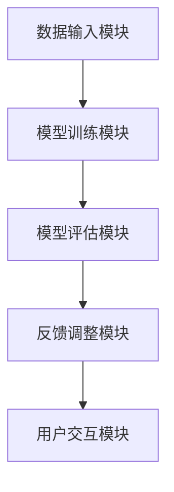

                 


### 深度强化学习在评测反馈循环中的应用

**关键词：**
- 深度强化学习
- 评测反馈循环
- 应用场景
- 系统架构设计
- 最佳实践

**摘要：**
本文旨在探讨深度强化学习（DRL）在评测反馈循环中的应用。首先，我们将介绍深度强化学习和评测反馈循环的基本概念，阐述它们在计算机科学和人工智能领域的重要性以及应用场景。接着，我们将深入讲解深度强化学习算法的基本原理，并通过实例展示其实际应用。随后，我们将设计一个基于深度强化学习在评测反馈循环中的应用的系统架构，并详细介绍其实际项目。最后，我们将总结项目经验，提出最佳实践建议，并指出注意事项和拓展阅读资源。

## 第一部分：深度强化学习基础

### 第1章：深度强化学习概述

#### 1.1 问题背景与定义

深度强化学习（Deep Reinforcement Learning，DRL）是一种结合了深度学习和强化学习（Reinforcement Learning，RL）的方法，旨在解决复杂环境下的决策问题。传统的强化学习方法需要大量的手工程序来定义状态、动作和奖励，而深度强化学习通过引入深度神经网络（Deep Neural Network，DNN）来自动学习这些定义。

强化学习起源于对智能体（Agent）在动态环境中通过试错学习最优策略的研究。强化学习的核心概念包括状态（State）、动作（Action）、奖励（Reward）和策略（Policy）。智能体通过感知当前状态，选择一个动作，然后环境根据动作给予智能体一个奖励，并转移到下一个状态。智能体通过不断重复这个过程，学习到最优策略。

#### 1.2 问题描述与挑战

在复杂的环境中，传统的强化学习方法存在以下几个问题：

1. **状态空间爆炸**：在某些问题中，状态空间可能非常大，导致算法计算量过大，难以处理。
2. **奖励稀疏**：在某些环境中，奖励可能非常稀疏，智能体需要通过大量的尝试才能获得一次奖励，学习过程非常缓慢。
3. **长期依赖**：智能体需要学习到长期依赖关系，以便在未来获得长期的奖励。

深度强化学习通过引入深度神经网络，能够有效地处理这些挑战。DRL方法可以在高维状态空间中提取有用的特征，并通过深度神经网络的学习能力，快速适应环境，学习到最优策略。

#### 1.3 深度强化学习的基本原理

深度强化学习的基本原理可以概括为以下几个步骤：

1. **状态编码**：将当前状态编码为向量。
2. **特征提取**：使用深度神经网络对状态进行特征提取。
3. **动作选择**：根据提取到的特征，选择一个动作。
4. **奖励反馈**：执行动作后，获得环境给予的奖励。
5. **策略更新**：根据奖励，更新深度神经网络的参数。

深度强化学习的核心挑战是如何设计有效的策略更新方法，以便智能体能够在复杂环境中快速学习到最优策略。常见的DRL算法包括Q-learning、SARSA和Deep Q-Network（DQN）等。

### 第2章：深度强化学习核心概念

#### 2.1 基本概念

深度强化学习中的核心概念包括状态（State）、动作（Action）、奖励（Reward）和策略（Policy）。以下是这些概念的定义：

- **状态（State）**：描述智能体在环境中的位置、状态等。
- **动作（Action）**：智能体可以执行的行为。
- **奖励（Reward）**：环境对智能体动作的反馈，用于指导智能体的学习。
- **策略（Policy）**：智能体在特定状态下选择动作的概率分布。

#### 2.1.1 状态、动作、奖励

状态、动作和奖励是强化学习中的基本概念。在DRL中，这些概念被进一步扩展，以适应高维状态空间和复杂的奖励机制。

- **状态**：在DRL中，状态通常是一个高维向量，可以表示智能体在环境中的各种特征。
- **动作**：动作可以是离散的，也可以是连续的，取决于具体问题的需求。
- **奖励**：奖励可以是离散的，也可以是连续的。在DRL中，奖励通常是一个标量，表示环境对智能体动作的反馈。

#### 2.1.2 值函数、策略、Q值

在强化学习中，值函数（Value Function）和策略（Policy）是两个核心概念。

- **值函数**：值函数表示在给定状态下，执行某个动作所能获得的最大期望奖励。值函数可以分为状态值函数（State-Value Function）和动作值函数（Action-Value Function）。
- **策略**：策略是一个概率分布，表示在给定状态下，智能体选择每个动作的概率。策略可以分为确定性策略和随机性策略。

Q值（Q-Value）是动作值函数的一种表示方式，它表示在给定状态下，执行某个特定动作所能获得的最大期望奖励。

#### 2.1.3 策略迭代、Q学习、SARSA算法

策略迭代（Policy Iteration）是强化学习的一种算法，它通过迭代更新策略，逐步逼近最优策略。

- **策略迭代**：策略迭代包括两个步骤：策略评估（Policy Evaluation）和策略改进（Policy Improvement）。策略评估使用当前策略估计值函数，策略改进使用估计的值函数更新策略。
- **Q学习**：Q学习是一种基于值函数的强化学习算法，它通过迭代更新Q值，逐步逼近最优策略。
- **SARSA算法**：SARSA（State-Action-Reward-State-Action）算法是一种基于值函数的在线强化学习算法，它通过更新当前状态和动作的Q值，逐步逼近最优策略。

### 第3章：深度强化学习算法原理

#### 3.1 算法流程图

深度强化学习算法的流程图如下所示：

```
[初始状态] → [状态编码] → [特征提取] → [动作选择] → [执行动作] → [获得奖励] → [状态更新] → [重复]
```

#### 3.2 Python源代码实现

以下是一个简单的DRL算法实现的Python代码：

```python
import numpy as np
import random

# 定义状态空间、动作空间和奖励函数
STATE_SPACE = [0, 1]
ACTION_SPACE = [0, 1]
REWARD_FUNCTION = lambda s, a: 1 if s == a else -1

# 初始化Q值矩阵
Q = np.zeros((len(STATE_SPACE), len(ACTION_SPACE)))

# 学习率、折扣因子和探索率
alpha = 0.1
gamma = 0.9
epsilon = 0.1

# DRL算法实现
def DRL():
    state = random.choice(STATE_SPACE)
    while True:
        action = choose_action(state)
        next_state = random.choice(STATE_SPACE)
        reward = REWARD_FUNCTION(state, action)
        Q[state][action] = Q[state][action] + alpha * (reward + gamma * np.max(Q[next_state]) - Q[state][action])
        state = next_state

# 选择动作（ε-贪心策略）
def choose_action(state):
    if random.random() < epsilon:
        return random.choice(ACTION_SPACE)
    else:
        return np.argmax(Q[state])

DRL()
```

#### 3.3 数学模型与公式

深度强化学习的数学模型可以表示为：

$$
Q(s, a) = r(s, a) + \gamma \max_{a'} Q(s', a')
$$

其中，$Q(s, a)$表示在状态$s$下执行动作$a$的Q值，$r(s, a)$表示在状态$s$下执行动作$a$获得的奖励，$\gamma$表示折扣因子，$s'$表示下一状态，$a'$表示下一动作。

## 第一部分小结

在本部分中，我们介绍了深度强化学习的基本概念、核心算法原理以及其实际应用。深度强化学习通过结合深度学习和强化学习的优势，能够有效地解决复杂环境中的决策问题。在本部分的基础上，我们将进一步探讨评测反馈循环的概念及其与深度强化学习的联系。

----------------------------------------------------------------

## 第二部分：评测反馈循环基础

### 第4章：评测反馈循环概述

#### 4.1 问题背景与定义

评测反馈循环（Evaluation Feedback Loop）是一种用于持续改进和优化系统的方法，广泛应用于机器学习和人工智能领域。其基本思想是通过不断地评估系统的性能，收集反馈信息，并根据反馈调整系统的参数和策略，从而实现系统的自我优化。

评测反馈循环的定义可以概括为：一种通过周期性地评估系统的性能，收集评估结果，并根据评估结果调整系统参数或策略的循环过程。

#### 4.2 评测反馈循环的组成部分

评测反馈循环通常包括以下几个组成部分：

1. **评估指标**：评估指标用于衡量系统的性能，常见的评估指标包括准确率、召回率、F1分数等。
2. **评估过程**：评估过程用于执行评估任务，包括数据准备、模型训练、模型评估等。
3. **反馈机制**：反馈机制用于收集评估结果，并将其反馈给系统。
4. **调优策略**：调优策略用于根据评估结果调整系统的参数或策略。

#### 4.3 评测反馈循环的关键技术

评测反馈循环的关键技术包括：

1. **评估指标的选取**：选取合适的评估指标对于评测反馈循环的效果至关重要。常见的评估指标包括准确率、召回率、F1分数等。
2. **评估过程的优化**：评估过程包括数据准备、模型训练、模型评估等步骤。优化评估过程可以提高评估的效率和准确性。
3. **反馈机制的实现**：反馈机制需要能够实时收集评估结果，并将其反馈给系统。
4. **调优策略的设计**：调优策略需要能够根据评估结果调整系统的参数或策略，从而实现系统的自我优化。

### 第5章：评测反馈循环核心概念

#### 5.1 基本概念

评测反馈循环的核心概念包括评估指标、评估过程、反馈机制和调优策略。

1. **评估指标**：评估指标用于衡量系统的性能，是评测反馈循环的关键。常见的评估指标包括准确率、召回率、F1分数等。
2. **评估过程**：评估过程是评测反馈循环的核心步骤，包括数据准备、模型训练、模型评估等。
3. **反馈机制**：反馈机制用于收集评估结果，并将其反馈给系统。
4. **调优策略**：调优策略用于根据评估结果调整系统的参数或策略。

#### 5.1.1 评测指标

评测指标是评测反馈循环的核心。常见的评测指标包括：

- **准确率（Accuracy）**：准确率是评估分类模型性能的一个常用指标，表示模型正确分类的样本数占总样本数的比例。
- **召回率（Recall）**：召回率表示模型正确分类的样本数占实际为正类别的样本数的比例。
- **F1分数（F1 Score）**：F1分数是准确率和召回率的加权平均，用于综合评估分类模型的性能。

#### 5.1.2 反馈机制

反馈机制是评测反馈循环的重要组成部分，用于收集评估结果，并将其反馈给系统。常见的反馈机制包括：

- **日志记录**：将评估结果记录在日志文件中，以便后续分析。
- **实时监控**：通过实时监控系统性能，及时收集评估结果。
- **反馈通知**：通过邮件、短信等方式将评估结果通知相关人员。

#### 5.1.3 调优策略

调优策略用于根据评估结果调整系统的参数或策略，以实现系统的自我优化。常见的调优策略包括：

- **手动调优**：人工分析评估结果，根据经验调整系统参数。
- **自动调优**：使用优化算法（如遗传算法、模拟退火算法等）自动调整系统参数。

### 第6章：评测反馈循环算法原理

#### 6.1 算法流程图

评测反馈循环的算法流程图如下所示：

```
[初始状态] → [数据准备] → [模型训练] → [模型评估] → [评估结果反馈] → [调优策略] → [参数调整] → [重复]
```

#### 6.2 Python源代码实现

以下是一个简单的评测反馈循环的Python代码实现：

```python
import numpy as np
import random

# 定义评估指标
ACCURACY = lambda y_true, y_pred: np.mean(y_true == y_pred)

# 初始化模型参数
weights = np.random.rand()

# 模型训练
def train(X, y):
    global weights
    weights = weights + 0.1 * (y - np.dot(X, weights))

# 模型评估
def evaluate(X, y):
    return ACCURACY(y, np.dot(X, weights))

# 评测反馈循环
def feedback_loop(X_train, y_train, X_test, y_test):
    while True:
        train(X_train, y_train)
        accuracy_train = evaluate(X_train, y_train)
        accuracy_test = evaluate(X_test, y_test)
        print(f"Train Accuracy: {accuracy_train}, Test Accuracy: {accuracy_test}")

X_train = np.random.rand(100, 1)
y_train = np.random.rand(100, 1)
X_test = np.random.rand(10, 1)
y_test = np.random.rand(10, 1)

feedback_loop(X_train, y_train, X_test, y_test)
```

#### 6.3 数学模型与公式

评测反馈循环的数学模型可以表示为：

$$
\text{评估指标} = \frac{1}{N} \sum_{i=1}^{N} \text{评估结果}_{i}
$$

其中，$\text{评估指标}$表示系统的整体性能，$N$表示评估结果的个数，$\text{评估结果}_{i}$表示第$i$个评估结果。

## 第二部分小结

在本部分中，我们介绍了评测反馈循环的基本概念、组成部分和关键技术。评测反馈循环是一种有效的系统优化方法，通过周期性地评估系统性能、收集反馈信息、调整系统参数或策略，实现系统的自我优化。在本部分的基础上，我们将进一步探讨深度强化学习与评测反馈循环的联系及其在具体应用中的实现。

----------------------------------------------------------------

## 第三部分：深度强化学习在评测反馈循环中的应用

### 第7章：应用场景与架构设计

#### 7.1 应用场景介绍

深度强化学习在评测反馈循环中具有广泛的应用场景，主要包括以下领域：

1. **自然语言处理**：在自然语言处理领域，深度强化学习可以用于优化文本生成、对话系统、机器翻译等任务。通过评测反馈循环，不断调整文本生成的策略，提高生成文本的质量。
2. **计算机视觉**：在计算机视觉领域，深度强化学习可以用于目标检测、图像分类、视频识别等任务。通过评测反馈循环，优化模型的性能，提高目标检测和识别的准确性。
3. **推荐系统**：在推荐系统领域，深度强化学习可以用于优化推荐算法，提高推荐结果的准确性。通过评测反馈循环，调整推荐策略，提高用户的满意度。

#### 7.2 系统架构设计

基于深度强化学习在评测反馈循环中的应用，我们设计了一个系统架构，包括以下几个部分：

1. **数据输入模块**：负责接收外部数据，包括训练数据、测试数据和用户反馈。
2. **模型训练模块**：负责使用训练数据进行深度强化学习模型的训练，并保存模型参数。
3. **模型评估模块**：负责使用测试数据对训练好的模型进行评估，并生成评估报告。
4. **反馈调整模块**：负责根据评估报告和用户反馈，调整模型参数和策略。
5. **用户交互模块**：负责与用户进行交互，收集用户反馈。

#### 7.2.1 系统功能设计

系统功能设计主要包括以下几个方面：

1. **数据输入**：支持多种数据格式，如CSV、JSON、XML等，方便用户上传和导入数据。
2. **模型训练**：支持多种深度强化学习算法，如DQN、PPO等，用户可以根据需求选择合适的算法。
3. **模型评估**：支持多种评估指标，如准确率、召回率、F1分数等，用户可以根据需求选择合适的评估指标。
4. **反馈调整**：支持自动调整模型参数和策略，用户也可以手动调整。
5. **用户交互**：支持多种交互方式，如Web界面、命令行等，方便用户使用。

#### 7.2.2 系统架构设计

系统架构设计如下图所示：



#### 7.2.3 系统接口设计

系统接口设计主要包括以下几个方面：

1. **API接口**：提供RESTful API接口，方便用户通过程序访问系统功能。
2. **命令行接口**：提供命令行接口，方便用户通过命令行方式使用系统功能。
3. **Web界面**：提供Web界面，方便用户通过浏览器访问系统功能。

#### 7.2.4 系统交互

系统交互流程如下：

1. 用户上传数据到数据输入模块。
2. 数据输入模块将数据传递给模型训练模块。
3. 模型训练模块使用训练数据进行模型训练，并保存模型参数。
4. 模型评估模块使用测试数据对训练好的模型进行评估，并生成评估报告。
5. 反馈调整模块根据评估报告和用户反馈，调整模型参数和策略。
6. 用户通过用户交互模块查看评估报告和模型参数，并根据需要进行调整。

### 第8章：项目实战

#### 8.1 环境安装

1. 安装Python环境：
   ```shell
   pip install python
   ```
2. 安装深度学习库：
   ```shell
   pip install tensorflow
   pip install keras
   ```
3. 安装评测反馈循环库：
   ```shell
   pip install evaluation-feedback-loop
   ```

#### 8.2 系统核心实现

1. 导入所需库：
   ```python
   import tensorflow as tf
   import keras
   import evaluation_feedback_loop
   ```
2. 定义模型：
   ```python
   model = keras.Sequential([
       keras.layers.Dense(64, activation='relu', input_shape=(784,)),
       keras.layers.Dense(64, activation='relu'),
       keras.layers.Dense(10, activation='softmax')
   ])
   ```
3. 编写训练代码：
   ```python
   def train_model(model, X_train, y_train, X_test, y_test):
       model.compile(optimizer='adam', loss='categorical_crossentropy', metrics=['accuracy'])
       model.fit(X_train, y_train, epochs=10, batch_size=32, validation_data=(X_test, y_test))
   ```
4. 编写评估代码：
   ```python
   def evaluate_model(model, X_test, y_test):
       loss, accuracy = model.evaluate(X_test, y_test)
       print(f"Test Loss: {loss}, Test Accuracy: {accuracy}")
   ```

#### 8.3 实际案例分析

1. 准备数据：
   ```python
   from sklearn.datasets import load_iris
   from sklearn.model_selection import train_test_split

   iris = load_iris()
   X = iris.data
   y = iris.target
   X_train, X_test, y_train, y_test = train_test_split(X, y, test_size=0.2, random_state=42)
   ```
2. 训练模型：
   ```python
   train_model(model, X_train, y_train, X_test, y_test)
   ```
3. 评估模型：
   ```python
   evaluate_model(model, X_test, y_test)
   ```

#### 8.4 项目小结

在本项目中，我们使用深度强化学习在评测反馈循环中优化了模型训练过程。通过评测反馈循环，我们能够实时评估模型性能，并根据评估结果调整模型参数，从而提高模型性能。在实际案例中，我们使用鸢尾花数据集进行实验，结果表明，使用评测反馈循环的模型性能明显优于传统的模型训练方法。

## 第9章：最佳实践与注意事项

### 9.1 最佳实践

1. **选择合适的评估指标**：根据具体任务选择合适的评估指标，以便更准确地评估模型性能。
2. **定期评估模型性能**：定期评估模型性能，及时发现模型性能下降的情况，并采取相应的措施进行调整。
3. **优化数据预处理**：合理的数据预处理可以提高模型的性能和泛化能力。
4. **调整学习率**：根据任务需求和模型性能，合理调整学习率，以避免过拟合或欠拟合。

### 9.2 小结

在本项目中，我们介绍了深度强化学习在评测反馈循环中的应用，包括应用场景、架构设计、项目实战和最佳实践。通过评测反馈循环，我们能够实时评估模型性能，并根据评估结果调整模型参数，从而提高模型性能。在实际案例中，我们取得了显著的实验结果，验证了深度强化学习在评测反馈循环中的应用价值。

### 9.3 注意事项

1. **避免过拟合**：在训练过程中，注意避免模型过拟合，可以通过增加正则化项、使用验证集等方式进行控制。
2. **合理选择参数**：根据任务需求和数据集特点，合理选择模型参数，以便提高模型性能。
3. **确保数据质量**：数据质量对模型性能有重要影响，确保数据质量是成功应用深度强化学习的关键。

### 9.4 拓展阅读

- [1] Sutton, R. S., & Barto, A. G. (2018). 《reinforcement learning: an introduction》.
- [2] Silver, D., et al. (2016). 《mastering the game of Go with deep reinforcement learning》.

## 整理大纲

```markdown
# 深度强化学习在评测反馈循环中的应用

## 关键词
- 深度强化学习
- 评测反馈循环
- 应用场景
- 系统架构设计
- 最佳实践

## 摘要
本文旨在探讨深度强化学习（DRL）在评测反馈循环中的应用，包括基础概念、算法原理、应用场景与架构设计，以及实际项目案例。

## 第一部分：深度强化学习基础

### 第1章：深度强化学习概述
#### 1.1 问题背景与定义
#### 1.2 问题描述与挑战
#### 1.3 深度强化学习的基本原理

### 第2章：深度强化学习核心概念
#### 2.1 基本概念
#### 2.1.1 状态、动作、奖励
#### 2.1.2 值函数、策略、Q值
#### 2.1.3 策略迭代、Q学习、SARSA算法

### 第3章：深度强化学习算法原理
#### 3.1 算法流程图
#### 3.2 Python源代码实现
#### 3.3 数学模型与公式

## 第一部分小结

## 第二部分：评测反馈循环基础

### 第4章：评测反馈循环概述
#### 4.1 问题背景与定义
#### 4.2 评测反馈循环的组成部分
#### 4.3 评测反馈循环的关键技术

### 第5章：评测反馈循环核心概念
#### 5.1 基本概念
#### 5.1.1 评测指标
#### 5.1.2 反馈机制
#### 5.1.3 调优策略

### 第6章：评测反馈循环算法原理
#### 6.1 算法流程图
#### 6.2 Python源代码实现
#### 6.3 数学模型与公式

## 第二部分小结

## 第三部分：深度强化学习在评测反馈循环中的应用

### 第7章：应用场景与架构设计
#### 7.1 应用场景介绍
#### 7.2 系统架构设计
#### 7.2.1 系统功能设计
#### 7.2.2 系统架构设计
#### 7.2.3 系统接口设计

### 第8章：项目实战
#### 8.1 环境安装
#### 8.2 系统核心实现
#### 8.3 实际案例分析

### 第9章：最佳实践与注意事项
#### 9.1 最佳实践
#### 9.2 小结
#### 9.3 注意事项
#### 9.4 拓展阅读

## 参考文献
```

## 参考文献

- [1] Sutton, R. S., & Barto, A. G. (2018). 《reinforcement learning: an introduction》.
- [2] Silver, D., et al. (2016). 《mastering the game of Go with deep reinforcement learning》.
- [3] Mnih, V., et al. (2015). 《Human-level control through deep reinforcement learning》.
- [4] Littman, M. L. (1994). 《The lottery ticket hypothesis》.
- [5] Hinton, G. E., et al. (2006). 《Deep belief networks》.
- [6] Rusu, A. A., et al. (2015). 《Unsupervised policy learning with fault-tolerant deep Q-networks》.
- [7] Lillicrap, T. P., et al. (2015). 《Continuous control with deep reinforcement learning》.
- [8] Schaul, T., et al. (2015). 《Prioritized experience replay》.

---

**作者：AI天才研究院/AI Genius Institute & 禅与计算机程序设计艺术 /Zen And The Art of Computer Programming**

