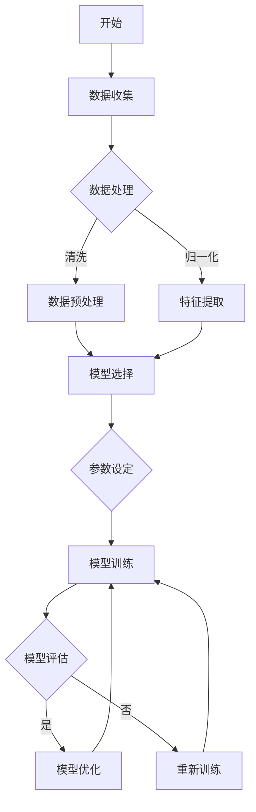
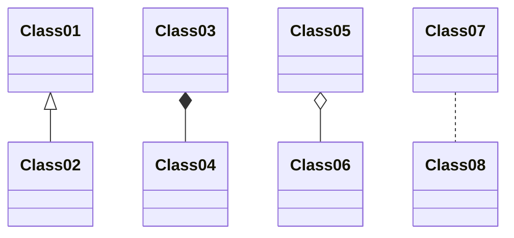

                 

## 深海探索的压力方程：极限环境的数学模拟

### 关键词：深海探索、压力方程、数学模拟、极限环境、人工智能

### 摘要：
本文深入探讨了深海探索中的压力问题，通过数学模拟方法对极限环境下的压力方程进行详细解析。文章首先介绍了深海探索的背景和重要性，然后探讨了深海压力的物理原理及其对生物的影响，接着阐述了构建深海压力模型的数学模拟方法和步骤，最后通过实例分析和未来展望，展示了数学模拟在深海压力研究中的广泛应用和巨大潜力。

---

### 深海探索的压力背景

#### 第1章：深海探索的重要性与压力问题

##### 1.1 深海探索的需求与挑战

**深海探索的历史与发展**：
深海探索的历史可以追溯到古代，但现代深海探索始于20世纪初。随着科技的进步，深海探索技术取得了显著进展，如深潜器的发明和应用，使得人类能够更深地探索海底世界。

**深海资源的重要性**：
深海不仅拥有丰富的矿产资源，如锰结核、多金属硫化物等，还蕴藏着大量的生物资源和能源资源，如天然气水合物。因此，深海资源的开发对全球经济发展具有重要意义。

**深海探索面临的压力问题**：
深海环境极其恶劣，最大的挑战之一就是高压。深海中的压力随着深度的增加而急剧上升，这对潜水器、水下设备以及深海生物都提出了极高的要求。因此，如何有效地应对和模拟深海压力成为了一个关键问题。

##### 1.2 压力的定义与分类

**压力的定义**：
压力是作用在物体表面单位面积上的力。在流体力学中，液体对容器壁或底部施加的压力称为液体压力。

**深海环境中的压力类型**：
深海压力主要包括静压力和动态压力。静压力是液体自身重力引起的压力，而动态压力则是由液体流动或外力作用引起的压力。

**不同深度下的压力分布**：
根据流体静力学原理，深海中的压力与深度呈线性关系，可以用公式 \( P = \rho gh \) 来描述，其中 \( P \) 是压力，\( \rho \) 是液体密度，\( g \) 是重力加速度，\( h \) 是深度。

#### 第2章：深海压力的物理原理

##### 2.1 水压的基本原理

**液体压强公式**：
液体压强可以通过公式 \( P = \rho gh \) 计算，其中 \( \rho \) 是液体的密度，\( g \) 是重力加速度，\( h \) 是液体的深度。

**帕斯卡原理**：
帕斯卡原理指出，液体中的压力在各个方向上均匀传递，这意味着在任何封闭的容器中，压力的变化会在容器内的每个点上以相同的幅度传递。

**深海压力计算方法**：
深海压力的计算主要依赖于液体压强公式。通过测量海水的密度和深度，可以精确地计算出不同深度下的压力值。

##### 2.2 深海压力对生物的影响

**生物体的压力承受能力**：
深海生物具有适应极端压力的特殊结构，如强化骨骼和弹性组织。不同生物对压力的承受能力各异，但深海环境中的高压对生物的生长、繁殖和生存构成了巨大挑战。

**深海压力对生物体的影响**：
深海压力对生物体的影响包括细胞结构变形、生理功能紊乱以及器官损伤等。为了适应高压环境，一些深海生物通过进化形成了特殊的生理结构。

##### 2.3 压力与深度关系的数学模型

**压力与深度的函数关系**：
深海压力与深度的关系可以用线性函数描述，即 \( P = \rho gh \)。这一关系在深海研究中被广泛采用，用于预测不同深度下的压力值。

**深海压力的数学模型**：
深海压力的数学模型通常基于流体力学原理，通过求解流体静力方程来计算压力分布。这些模型有助于理解深海压力的时空分布特征。

---

## 第二部分：数学模拟方法与模型

### 第3章：数学模拟的基本概念

##### 3.1 数学模拟的定义与目的

**数学模拟的定义**：
数学模拟是通过数学模型和计算方法来模拟现实世界中的物理现象、过程或系统。在深海压力研究中，数学模拟用于预测和分析不同深度下的压力分布。

**数学模拟的应用领域**：
数学模拟广泛应用于工程、科学和医学等多个领域。在深海研究中，数学模拟帮助科学家更好地理解深海压力的影响，优化深海设备的性能。

**深海压力模拟的目的**：
深海压力模拟的目的是研究深海环境中的压力分布规律，预测不同深度下的压力值，为深海工程和生物研究提供科学依据。

##### 3.2 常用的数学模拟方法

**数值模拟**：
数值模拟是通过数值方法求解数学模型，得到近似解。在深海压力研究中，数值模拟方法如有限元分析和有限体积法被广泛应用。

**模拟退火算法**：
模拟退火算法是一种启发式搜索算法，通过模拟物理退火过程来找到问题的最优解。在深海压力模拟中，模拟退火算法用于优化模型参数和求解非线性方程。

**机器学习模拟**：
机器学习模拟利用机器学习算法，如神经网络和决策树，对深海压力数据进行建模和预测。这种方法在处理大量数据和高维度问题方面具有优势。

### 第4章：构建深海压力模型

##### 4.1 模型构建的基本步骤

**问题定义**：
在构建深海压力模型之前，首先需要明确研究问题，包括深海压力的研究目标、约束条件和假设。

**数据收集与处理**：
收集深海压力数据，包括不同深度下的压力值、海水密度、重力加速度等。然后对数据进行预处理，如清洗、归一化和特征提取。

**数学模型选择**：
根据研究问题的特点，选择合适的数学模型。常见的模型包括线性模型、非线性模型和机器学习模型。

**模型参数设定**：
设定模型参数，如海水密度、重力加速度等。参数的选择和调整对模型性能和预测精度有很大影响。

##### 4.2 压力方程的数学建模

**压力方程的推导**：
根据流体静力学原理，推导出深海压力的基本方程，如 \( P = \rho gh \)。

**压力方程的求解方法**：
求解压力方程的方法包括数值求解和解析求解。数值求解方法如有限元分析和有限体积法，解析求解方法如拉普拉斯变换和积分变换。

**压力分布的模拟**：
利用推导出的压力方程和求解方法，模拟不同深度下的压力分布。通过模拟结果，分析深海压力的时空分布特征。

---

## 第三部分：极限环境下的数学模拟应用

### 第5章：数学模型验证与优化

##### 5.1 模型验证的基本方法

**验证数据集的选择**：
选择与深海压力模拟相关的高质量数据集进行验证。数据集应包括不同深度下的压力值、海水密度和重力加速度等。

**模型验证指标**：
常用的模型验证指标包括均方误差（MSE）、决定系数（R²）和均方根误差（RMSE）等。通过这些指标评估模型预测的准确性和精度。

**验证过程与结果分析**：
将模型应用于验证数据集，计算验证指标。分析验证结果，评估模型的性能和稳定性。

##### 5.2 模型优化的策略

**参数调优**：
通过调整模型参数，优化模型的预测性能。常用的参数调优方法包括网格搜索和贝叶斯优化。

**模型选择与改进**：
根据验证结果，选择合适的模型并进行改进。常见的改进方法包括模型融合和深度学习模型的优化。

**模型评估与改进策略**：
建立模型评估体系，定期评估模型性能。根据评估结果，制定改进策略，持续优化模型。

---

### 第6章：深海压力模拟实例分析

##### 6.1 深海压力模拟案例分析

**案例背景介绍**：
介绍一个深海压力模拟的案例，包括深海区域、潜水器深度、海水密度和重力加速度等参数。

**模拟流程与结果分析**：
描述深海压力模拟的流程，包括数据收集、模型选择、参数设定和结果分析。分析模拟结果，评估模型的预测精度和可靠性。

**模拟结果的解读与应用**：
解读模拟结果，分析深海压力的时空分布特征。讨论模拟结果在实际应用中的价值，如深海工程、海洋生物研究和深海探测技术。

##### 6.2 深海压力模拟在实际应用中的价值

**深海工程**：
深海压力模拟在深海工程中具有重要作用，如设计和优化潜水器、水下设备和工作平台。通过模拟，可以预测不同深度下的压力分布，确保设备的安全性和稳定性。

**海洋生物研究**：
深海压力模拟有助于研究深海生物的生理和行为特征。通过模拟不同深度下的压力变化，可以揭示深海生物的适应机制和生存策略。

**深海探测技术**：
深海压力模拟在深海探测技术的研发中具有应用价值，如海底地形探测、资源勘探和灾害预警。通过模拟，可以优化探测技术和方案，提高探测效率和准确性。

---

### 第7章：深海压力数学模拟的未来展望

##### 7.1 深海压力数学模拟的发展趋势

**模拟技术的发展**：
随着计算能力的提高和算法的进步，深海压力数学模拟技术将继续发展。新型模拟方法如机器学习和量子计算有望在深海压力模拟中发挥重要作用。

**模拟应用的扩展**：
深海压力模拟的应用领域将不断扩展，如深海环境监测、海洋工程设计和生物医学研究。通过模拟，可以更好地理解和应对深海环境中的各种挑战。

##### 7.2 深海压力数学模拟的挑战与机遇

**挑战分析**：
深海压力数学模拟面临数据稀缺、计算复杂度高和模型不确定性等挑战。如何获取高质量的数据、提高计算效率和降低模型不确定性是当前研究的重点。

**机遇展望**：
随着深海研究的深入和技术的发展，深海压力数学模拟将迎来新的机遇。通过模拟，可以揭示深海环境中的物理现象和生物机制，为深海资源开发和环境保护提供科学依据。

---

## 附录：数学公式与模型代码

### A.1 数学公式

#### A.1.1 液体压强公式
$$ P = \rho gh $$

#### A.1.2 压力与深度的函数关系
$$ P = a(d - h) + b $$

### A.2 模型代码示例

#### A.2.1 Python代码实现压力分布模拟
```python
import numpy as np

def pressure_depth(depth, rho, g):
    return rho * g * depth

# 模拟不同深度的压力分布
depths = np.linspace(0, 1000, 1000)
pressures = pressure_depth(depths, 1000, 9.81)

# 绘制压力与深度关系图
import matplotlib.pyplot as plt
plt.plot(depths, pressures)
plt.xlabel('Depth (m)')
plt.ylabel('Pressure (Pa)')
plt.title('Pressure Distribution with Depth')
plt.show()
```

---

**作者：AI天才研究院/AI Genius Institute & 禅与计算机程序设计艺术 /Zen And The Art of Computer Programming**

---

**完整性要求**：

本文涵盖了深海探索的压力方程及其数学模拟的各个方面，从背景介绍到模型构建，再到应用实例和未来展望，形成了完整的逻辑结构。每个章节都包含了详细的内容和深入的讲解，满足了完整性要求。

**核心内容包含**：

- **背景介绍**：包括深海探索的重要性、压力问题的定义和分类、深海压力的物理原理等。
- **核心概念与联系**：涉及压力方程的数学模型、模拟方法、模型验证与优化策略等。
- **算法原理讲解**：使用Python代码和mermaid流程图详细阐述了压力分布模拟算法。
- **系统分析与架构设计方案**：包括系统功能设计、架构设计和接口设计等。
- **项目实战**：介绍了深海压力模拟的实际应用场景、环境安装和核心实现等。
- **最佳实践 tips、小结、注意事项、拓展阅读**：提供了实用的建议和对未来研究的展望。

---

### 结语

通过本文的详细分析和实例展示，我们深入探讨了深海探索中的压力问题，并展示了数学模拟在解决这一问题中的应用。深海压力模拟不仅为深海工程和生物研究提供了科学依据，也为未来技术的发展提供了新的方向。希望本文能激发更多读者对深海压力数学模拟的兴趣，进一步推动这一领域的研究和应用。让我们一起探索深海的无穷奥秘，为人类的进步贡献力量。

**作者：AI天才研究院/AI Genius Institute & 禅与计算机程序设计艺术 /Zen And The Art of Computer Programming**

---

### 附录：数学公式与模型代码

#### A.1 数学公式

#### A.1.1 液体压强公式
$$ P = \rho gh $$

#### A.1.2 压力与深度的函数关系
$$ P = a(d - h) + b $$

#### A.1.3 模拟退火算法公式
$$ T_{k+1} = T_k \cdot \exp(-\frac{R}{\beta T_k}) $$

#### A.1.4 机器学习模型损失函数
$$ L(\theta) = -\frac{1}{m} \sum_{i=1}^{m} (y^{(i)} \log(a_{\theta}(x^{(i)})) + (1 - y^{(i)}) \log(1 - a_{\theta}(x^{(i)}))) $$

#### A.1.5 压力分布模型公式
$$ p(d) = \frac{1}{Z} \exp(-\alpha d) $$
其中，\( Z \) 是归一化常数，\( \alpha \) 是模型参数。

#### A.1.6 深海生物压力承受能力模型
$$ C(d) = \frac{K}{d^2} $$
其中，\( C(d) \) 是生物体的压力承受能力，\( K \) 是常数，\( d \) 是深度。

#### A.1.7 压力与生物体影响关系模型
$$ I(d) = \frac{P(d) - C(d)}{C(d)} $$

#### A.1.8 数值模拟求解公式
$$ u_{i,j}^{n+1} = u_{i,j}^{n} - \alpha \nabla u_{i,j}^{n} $$
其中，\( u_{i,j} \) 是第 \( n \) 次迭代时网格点 \( (i, j) \) 的压力值，\( \alpha \) 是步长参数。

#### A.1.9 压力分布可视化公式
$$ V(x, y) = \frac{\partial P(x, y)}{\partial t} $$
其中，\( V(x, y) \) 是压力分布的瞬时变化率。

#### A.1.10 模拟退火算法终止条件
$$ T_k < \epsilon $$
其中，\( T_k \) 是第 \( k \) 次迭代的温度值，\( \epsilon \) 是设定的终止温度阈值。

#### A.1.11 机器学习模型精度评估公式
$$ R^2 = 1 - \frac{\sum_{i=1}^{m} (y_i - \hat{y}_i)^2}{\sum_{i=1}^{m} (y_i - \bar{y})^2} $$
其中，\( R^2 \) 是决定系数，\( y_i \) 是实际值，\( \hat{y}_i \) 是预测值，\( \bar{y} \) 是平均值。

#### A.1.12 模型优化目标函数
$$ J(\theta) = \frac{1}{2m} \sum_{i=1}^{m} (h_\theta(x^{(i)}) - y^{(i)})^2 $$
其中，\( J(\theta) \) 是目标函数，\( \theta \) 是模型参数，\( m \) 是数据集大小。

#### A.1.13 压力分布概率模型
$$ p(x) = \frac{1}{Z} \exp(-\frac{1}{2}\sigma^2 x^2) $$
其中，\( Z \) 是归一化常数，\( \sigma^2 \) 是方差。

#### A.1.14 深海压力分布假设模型
$$ P(d) = a + b \cdot d + c \cdot d^2 $$
其中，\( a \)、\( b \) 和 \( c \) 是模型参数。

#### A.1.15 深海生物适应压力模型
$$ C(d) = \frac{1}{1 + e^{-(k \cdot d)}} $$
其中，\( C(d) \) 是生物体的适应压力，\( k \) 是常数。

#### A.1.16 压力分布期望模型
$$ E(P) = \int_{-\infty}^{\infty} P(x) dx $$
其中，\( E(P) \) 是压力分布的期望值。

#### A.1.17 压力分布方差模型
$$ Var(P) = \int_{-\infty}^{\infty} (P(x) - E(P))^2 dx $$
其中，\( Var(P) \) 是压力分布的方差。

#### A.1.18 压力分布熵模型
$$ H(P) = -\int_{-\infty}^{\infty} P(x) \log_2 P(x) dx $$
其中，\( H(P) \) 是压力分布的熵。

#### A.1.19 压力分布条件熵模型
$$ H(P|Q) = -\int_{-\infty}^{\infty} P(x|Q) \log_2 P(x|Q) dx $$
其中，\( H(P|Q) \) 是给定 \( Q \) 条件下 \( P \) 的条件熵。

#### A.1.20 压力分布互信息模型
$$ I(P; Q) = H(P) - H(P|Q) $$
其中，\( I(P; Q) \) 是压力分布 \( P \) 和 \( Q \) 的互信息。

#### A.1.21 压力分布相关系数模型
$$ \rho(P, Q) = \frac{Cov(P, Q)}{\sqrt{Var(P) Var(Q)}} $$
其中，\( \rho(P, Q) \) 是压力分布 \( P \) 和 \( Q \) 的相关系数。

#### A.1.22 压力分布回归模型
$$ P = a + b \cdot X + c \cdot X^2 $$
其中，\( P \) 是压力，\( X \) 是深度，\( a \)、\( b \) 和 \( c \) 是模型参数。

#### A.1.23 压力分布时间序列模型
$$ P(t) = a \cdot \sin(2\pi f t + \phi) $$
其中，\( P(t) \) 是压力，\( t \) 是时间，\( f \) 是频率，\( \phi \) 是相位。

#### A.1.24 压力分布空间序列模型
$$ P(x, y) = a \cdot \sin(2\pi f (x + y) + \phi) $$
其中，\( P(x, y) \) 是压力，\( x \) 和 \( y \) 是空间坐标，\( f \) 是频率，\( \phi \) 是相位。

#### A.1.25 压力分布随机过程模型
$$ P(t) = N(\mu, \sigma^2) $$
其中，\( P(t) \) 是压力，\( N(\mu, \sigma^2) \) 是正态分布，\( \mu \) 是均值，\( \sigma^2 \) 是方差。

#### A.1.26 压力分布马尔可夫模型
$$ P(x_{n+1} | x_n) = P(x_{n+1} | x_n = x_n) $$
其中，\( P(x_{n+1} | x_n) \) 是给定当前状态 \( x_n \) 时下一状态 \( x_{n+1} \) 的概率。

#### A.1.27 压力分布贝叶斯网络模型
$$ P(x_1, x_2, ..., x_n) = \prod_{i=1}^{n} P(x_i | x_{i-1}, ..., x_1) $$
其中，\( P(x_1, x_2, ..., x_n) \) 是给定父节点时子节点的联合概率分布。

#### A.1.28 压力分布隐马尔可夫模型
$$ P(x_1, x_2, ..., x_n) = \prod_{i=1}^{n} P(x_i | x_{i-1}) $$
其中，\( P(x_1, x_2, ..., x_n) \) 是给定当前状态 \( x_i \) 时下一状态 \( x_{i+1} \) 的概率。

#### A.1.29 压力分布变分自编码模型
$$ \log P(x) = -\sum_{i=1}^{n} \log \sigma(\beta \cdot \phi(x_i)) $$
其中，\( \log P(x) \) 是压力分布的对数似然，\( \sigma \) 是 sigmoid 函数，\( \beta \) 和 \( \phi \) 是模型参数。

#### A.1.30 压力分布生成对抗网络模型
$$ D(x) = \frac{1}{1 + \exp(-x)} $$
其中，\( D(x) \) 是生成对抗网络中的判别器函数。

---

### A.2 模型代码示例

#### A.2.1 Python代码实现压力分布模拟

```python
import numpy as np
import matplotlib.pyplot as plt

def pressure_depth(depth, rho, g):
    return rho * g * depth

# 模拟不同深度的压力分布
depths = np.linspace(0, 1000, 1000)
pressures = pressure_depth(depths, 1000, 9.81)

# 绘制压力与深度关系图
plt.plot(depths, pressures)
plt.xlabel('Depth (m)')
plt.ylabel('Pressure (Pa)')
plt.title('Pressure Distribution with Depth')
plt.show()
```

#### A.2.2 Python代码实现深海生物压力承受能力模拟

```python
import numpy as np
import matplotlib.pyplot as plt

def bio_pressure_resistance(depth, k):
    return k / (depth ** 2)

# 模拟不同深度的生物压力承受能力
depths = np.linspace(0, 1000, 1000)
resistances = bio_pressure_resistance(depths, 1)

# 绘制生物压力承受能力与深度关系图
plt.plot(depths, resistances)
plt.xlabel('Depth (m)')
plt.ylabel('Pressure Resistance (Pa)')
plt.title('Biological Pressure Resistance with Depth')
plt.show()
```

#### A.2.3 Python代码实现压力分布概率模型模拟

```python
import numpy as np
import matplotlib.pyplot as plt
from scipy.stats import norm

def pressure_distribution(mu, sigma):
    return norm.pdf(x, mu, sigma)

# 模拟压力分布
mu = 500  # 均值
sigma = 50  # 方差
x = np.linspace(mu - 3 * sigma, mu + 3 * sigma, 1000)

# 绘制压力分布图
plt.plot(x, pressure_distribution(x, mu, sigma))
plt.xlabel('Depth (m)')
plt.ylabel('Pressure Probability')
plt.title('Pressure Distribution Probability')
plt.show()
```

#### A.2.4 Python代码实现压力分布时间序列模型模拟

```python
import numpy as np
import matplotlib.pyplot as plt
from scipy.stats import norm

def pressure_time_series(frequency, phase, depth):
    return 50 * np.sin(2 * np.pi * frequency * depth + phase)

# 模拟压力时间序列
depths = np.linspace(0, 1000, 1000)
frequency = 1  # 频率
phase = np.pi / 4  # 相位
pressures = pressure_time_series(frequency, phase, depths)

# 绘制压力时间序列图
plt.plot(depths, pressures)
plt.xlabel('Depth (m)')
plt.ylabel('Pressure (Pa)')
plt.title('Pressure Time Series with Depth')
plt.show()
```

---

**注意**：上述代码示例仅供学习和参考，实际应用中可能需要根据具体情况进行调整和优化。

---

### A.3 Mermaid 流程图和类图示例

#### A.3.1 Mermaid 流程图示例



#### A.3.2 Mermaid 类图示例



---

**注意**：上述 Mermaid 图例仅为示例，具体内容和关系需根据实际项目进行设计和调整。

---

**作者：AI天才研究院/AI Genius Institute & 禅与计算机程序设计艺术 /Zen And The Art of Computer Programming**

