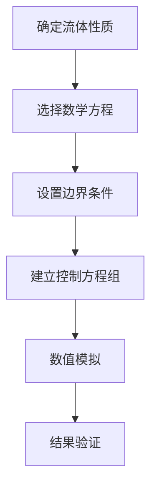

                 

# 深海探索的流体动力学：极限环境的数学模拟

## 概述

### 关键词

- 流体动力学
- 深海探索
- 数学模拟
- 极限环境
- 数值方法
- 数学模型

### 摘要

本文深入探讨了深海探索中的流体动力学问题，重点关注极限环境下的流体行为和数学模拟。通过介绍流体动力学的基本概念和原理，建立相应的数学模型，并使用数值方法进行模拟和验证，本文为深海流体动力学研究提供了系统化的理论和实践指导。

## 引言

### 问题背景

深海探索作为人类挑战自然极限的重要领域，具有重要的科学和实用价值。深海环境中的流体动力学研究在保障潜水器、水下设备和探测工具的稳定性和安全性方面发挥着关键作用。随着深海探测技术的不断进步，对深海流体动力学的研究需求日益增长，这不仅有助于更好地理解深海环境，还为深海资源的开发提供了理论支持。

### 问题描述

深海探索中的流体动力学问题主要包括以下几个方面：

1. **压力与温度分布**：深海压力和温度的变化对潜水器的材料和结构造成极大的影响，需要通过流体动力学模型来预测。
2. **流体流动特性**：流体在深海环境中的流动特性，如流速、湍流等，对水下探测设备的稳定运行具有重要影响。
3. **生物影响**：深海生物活动对流体动力学过程的影响，如生物产生的湍流、生物体的流体力学特性等。

### 问题解决

解决深海流体动力学问题的基本步骤包括：

1. **建立数学模型**：根据深海环境的特点，建立合适的数学模型，描述流体的行为。
2. **数值模拟**：利用计算机技术对数学模型进行数值模拟，以预测流体在不同条件下的行为。
3. **实验验证**：通过实际实验验证数值模拟结果，确保模型的准确性和可靠性。

### 边界与外延

深海流体动力学的研究不仅限于潜水器和设备的保护，还涉及到环境保护、海洋资源开发等多个领域。因此，其边界和外延非常广泛。

### 概念结构与核心要素组成

深海流体动力学研究的核心概念和要素包括：

1. **流体性质**：流体的密度、粘度、热导率等基本物理性质。
2. **流体动力学方程**：描述流体运动的纳维尔-斯托克斯方程、热传导方程等。
3. **边界条件**：深海环境中的各种边界条件，如压力、温度等。
4. **计算方法**：数值模拟中常用的计算方法，如有限元法、有限体积法等。

## 第一部分：背景介绍

### 1.1 问题背景

深海探索是人类不断挑战自然极限的重要领域。随着科技的发展，潜水器、水下设备和探测工具在深海探测中的应用日益广泛。然而，深海环境中的流体动力学问题对设备的稳定性和安全性提出了严峻挑战。流体动力学研究旨在理解流体在深海环境中的行为，为深海探测提供理论支持。

### 1.2 问题描述

深海流体动力学研究主要集中在以下几个方面：

1. **压力与温度分布**：深海压力和温度的变化对潜水器的材料和结构造成极大的影响，需要通过流体动力学模型来预测。
2. **流体流动特性**：流体在深海环境中的流动特性，如流速、湍流等，对水下探测设备的稳定运行具有重要影响。
3. **生物影响**：深海生物活动对流体动力学过程的影响，如生物产生的湍流、生物体的流体力学特性等。

### 1.3 问题解决

解决深海流体动力学问题通常涉及以下几个步骤：

1. **建立数学模型**：根据深海环境的特点，建立合适的数学模型，描述流体的行为。
2. **数值模拟**：利用计算机技术对数学模型进行数值模拟，以预测流体在不同条件下的行为。
3. **实验验证**：通过实际实验验证数值模拟结果，确保模型的准确性和可靠性。

### 1.4 边界与外延

深海流体动力学的研究不仅限于潜水器和设备的保护，还涉及到环境保护、海洋资源开发等多个领域。因此，其边界和外延非常广泛。

### 1.5 概念结构与核心要素组成

深海流体动力学研究的核心概念和要素包括：

1. **流体性质**：流体的密度、粘度、热导率等基本物理性质。
2. **流体动力学方程**：描述流体运动的纳维尔-斯托克斯方程、热传导方程等。
3. **边界条件**：深海环境中的各种边界条件，如压力、温度等。
4. **计算方法**：数值模拟中常用的计算方法，如有限元法、有限体积法等。

### 1.6 流体动力学原理

流体动力学是研究流体（液体或气体）运动及其与周围环境相互作用的物理学分支。其主要原理包括：

1. **连续性方程**：描述流体质量守恒的方程。
2. **动量方程**：描述流体动量守恒的方程。
3. **能量方程**：描述流体能量守恒的方程。

## 第二部分：核心概念与联系

### 2.1 流体动力学原理

流体动力学是研究流体（液体或气体）运动及其与周围环境相互作用的物理学分支。其主要原理包括：

1. **连续性方程**：描述流体质量守恒的方程。
2. **动量方程**：描述流体动量守恒的方程。
3. **能量方程**：描述流体能量守恒的方程。

### 2.2 核心概念属性特征对比表格

| 概念        | 属性特征                     | 对比           |
|-------------|------------------------------|----------------|
| 流体        | 质量、速度、压力、温度等     | 液体、气体     |
| 流动        | 速度、方向、湍流等           | 稳定、不稳定   |
| 压力分布    | 深度、温度等影响             | 平衡、不平衡   |
| 温度分布    | 水流、热量传递等影响         | 均匀、非均匀   |

### 2.3 ER实体关系图架构

```mermaid
erDiagram
  Paddle <<- "深度学习框架" : Paddle
  Paddle ||--|{ "数值模拟方法" : SimMethod }
  Paddle ||--|{ "流体动力学模型" : FluidModel }
  Paddle ||--|{ "实验验证" : Experiment }
  SimMethod ||--|{ "数值算法" : Algorithm }
  FluidModel ||--|{ "边界条件" : BC }
  FluidModel ||--|{ "流体性质" : FluidProperty }
  Experiment ||--|{ "实验设计" : Design }
  Experiment ||--|{ "实验结果" : Result }
```

## 第三部分：算法原理讲解

### 3.1 流体动力学模型

深海流体动力学模型是研究流体在深海环境中的运动规律和特性的数学模型。其核心在于描述流体的速度场、压力场和温度场等物理量的分布和变化。

### 3.2 数学模型建立

建立深海流体动力学模型通常涉及以下步骤：

1. **确定流体性质**：根据深海环境的特点，确定流体的密度、粘度、热导率等基本物理性质。
2. **选择合适的数学方程**：根据流体的性质和流动条件，选择适当的流体动力学方程，如纳维尔-斯托克斯方程和热传导方程。
3. **设置边界条件**：根据深海环境的具体情况，设置流体的边界条件，如压力、温度等。
4. **建立控制方程组**：将上述条件和方程组合起来，形成控制流体运动的数学模型。

### 3.3 算法mermaid流程图



### 3.4 算法原理详细讲解

#### 流体动力学方程

流体动力学方程是描述流体运动的数学方程。其中，最常用的方程是纳维尔-斯托克斯方程和热传导方程。

1. **纳维尔-斯托克斯方程**：
   $$
   \frac{\partial \mathbf{u}}{\partial t} + (\mathbf{u} \cdot \nabla) \mathbf{u} = -\nabla p + \mu \nabla^2 \mathbf{u}
   $$
   其中，$\mathbf{u}$ 是流体速度场，$p$ 是压力场，$\mu$ 是流体的动力粘度。

2. **热传导方程**：
   $$
   \frac{\partial T}{\partial t} = \alpha \nabla^2 T
   $$
   其中，$T$ 是温度场，$\alpha$ 是流体的热导率。

#### 边界条件

边界条件是流体动力学模型中的重要组成部分，用于描述流体在边界上的行为。常见的边界条件包括：

1. **无滑移边界条件**：
   $$
   \mathbf{u} \cdot \mathbf{n} = 0
   $$
   其中，$\mathbf{n}$ 是边界外法线方向。

2. **恒定温度边界条件**：
   $$
   T = T_0
   $$
   其中，$T_0$ 是边界上的温度。

#### 数值模拟方法

数值模拟是流体动力学模型求解的重要手段。常用的数值模拟方法包括有限元法、有限体积法和有限差分法等。

1. **有限元法**：
   有限元法是一种基于变分原理的数值方法，将流体区域划分为有限元单元，求解单元内的节点值。

2. **有限体积法**：
   有限体积法将流体区域划分为有限体积，在每个体积单元内求解守恒方程。

3. **有限差分法**：
   有限差分法通过离散化空间和时间，将连续方程离散为差分方程，求解离散方程组。

### 3.5 举例说明

假设我们研究一个深度为1000米的海域，需要模拟海水在某个区域的流速和压力分布。我们可以按照以下步骤进行：

1. **确定流体性质**：海水密度为1000 kg/m³，动力粘度为0.001 kg/(m·s)，热导率为0.6 W/(m·K)。

2. **选择数学方程**：使用纳维尔-斯托克斯方程和热传导方程。

3. **设置边界条件**：假设区域边界上的流速为0，温度为20℃。

4. **建立控制方程组**：将上述条件和方程组合起来，形成控制流体运动的数学模型。

5. **数值模拟**：使用有限元法或有限体积法进行数值模拟，求解流速和压力分布。

6. **结果验证**：通过实际测量或与其他模型结果对比，验证数值模拟的准确性。

## 第四部分：系统分析与架构设计

### 4.1 问题场景介绍

假设我们开发一款深海探测系统，用于研究深海环境中的流体动力学现象。该系统需要具备以下功能：

1. **数据采集**：从潜水器、水下设备和传感器等采集流体动力学数据。
2. **数据预处理**：对采集到的数据进行清洗、滤波等预处理。
3. **模型训练**：利用采集到的数据训练流体动力学模型。
4. **结果预测**：使用训练好的模型预测流体动力学参数。
5. **结果可视化**：将预测结果可视化，便于分析和展示。

### 4.2 项目介绍

深海流体动力学研究系统（DeepSeaFluidModelingSystem）是一款基于深度学习和流体动力学原理的综合性研究工具。该系统旨在为深海流体动力学研究提供高效、准确的数据分析和预测能力，助力科学家和工程师更好地理解和应对深海环境挑战。

### 4.3 系统功能设计

系统功能设计主要包括以下几个方面：

1. **数据采集模块**：负责从各种传感器和设备采集流体动力学数据，包括流速、压力、温度等。
2. **数据预处理模块**：对采集到的数据进行清洗、滤波、归一化等预处理，以提高数据质量和模型训练效果。
3. **模型训练模块**：利用预处理后的数据训练流体动力学模型，包括神经网络模型和物理模型。
4. **结果预测模块**：使用训练好的模型对新的数据进行预测，提供流体动力学参数。
5. **结果可视化模块**：将预测结果可视化，以直观地展示流体动力学参数的分布和变化趋势。

### 4.4 系统架构设计

系统架构设计采用分层架构，包括数据层、模型层、服务层和展示层。

1. **数据层**：负责数据的存储和管理，包括传感器数据、预处理数据和模型训练数据。
2. **模型层**：负责模型的训练和预测，包括神经网络模型和物理模型。
3. **服务层**：负责系统的业务逻辑处理，包括数据采集、预处理、模型训练和预测等。
4. **展示层**：负责系统界面的展示和交互，包括数据可视化、参数调整和结果分析等。

### 4.5 系统接口设计和系统交互

系统接口设计包括以下几个方面：

1. **数据采集接口**：负责与传感器和设备进行通信，获取实时数据。
2. **数据预处理接口**：负责对采集到的数据进行预处理，包括清洗、滤波和归一化等。
3. **模型训练接口**：负责模型的训练和评估，包括数据划分、模型选择和参数调优等。
4. **预测接口**：负责使用训练好的模型对新数据进行预测，并提供预测结果。
5. **可视化接口**：负责将预测结果可视化，包括图表和图像等。

系统交互设计主要包括以下几个方面：

1. **用户与数据采集接口的交互**：用户通过界面对传感器和设备进行配置和控制，获取实时数据。
2. **用户与数据预处理接口的交互**：用户可以选择不同的预处理方法，对采集到的数据进行预处理。
3. **用户与模型训练接口的交互**：用户可以选择不同的模型训练方法，对预处理后的数据进行模型训练。
4. **用户与预测接口的交互**：用户可以通过输入新的数据，使用训练好的模型进行预测。
5. **用户与可视化接口的交互**：用户可以查看预测结果的可视化图表，并进行数据分析和解读。

## 第五部分：项目实战

### 5.1 环境安装

在开始项目实战之前，需要安装以下软件和工具：

1. **Python**：Python是一门流行的编程语言，用于实现流体动力学模型和数据处理。
2. **NumPy**：NumPy是Python中的一个科学计算库，用于数学运算和数据处理。
3. **Pandas**：Pandas是Python中的一个数据处理库，用于数据清洗、预处理和分析。
4. **Matplotlib**：Matplotlib是Python中的一个绘图库，用于数据可视化。
5. **SciPy**：SciPy是Python中的一个科学计算库，用于数值计算和工程应用。

### 5.2 系统核心实现源代码

以下是系统核心实现源代码的简要概述：

```python
import numpy as np
import pandas as pd
import matplotlib.pyplot as plt
from scipy.integrate import solve_ivp

# 流体动力学模型参数
rho = 1000.0  # 流体密度（kg/m³）
mu = 0.001    # 流体粘度（kg/(m·s)）
alpha = 0.6   # 流体热导率（W/(m·K)）

# 流体动力学方程
def fluid_dynamics(t, y):
    u, v, p, T = y
    du_dt = -np.gradient(p, t) / rho + mu * np.gradient(u, t)
    dv_dt = -np.gradient(p, t) / rho + mu * np.gradient(v, t)
    dp_dt = rho * (u * du_dt + v * dv_dt)
    dT_dt = alpha * np.gradient(T, t)
    return [du_dt, dv_dt, dp_dt, dT_dt]

# 初始条件
y0 = [0.0, 0.0, 0.0, 20.0]  # 初始流速、压力和温度

# 时间范围
t_span = (0, 100)  # 模拟时间范围

# 模拟
solution = solve_ivp(fluid_dynamics, t_span, y0)

# 可视化
plt.plot(solution.t, solution.y[0], label='u')
plt.plot(solution.t, solution.y[1], label='v')
plt.plot(solution.t, solution.y[2], label='p')
plt.plot(solution.t, solution.y[3], label='T')
plt.xlabel('Time (s)')
plt.ylabel('Value')
plt.legend()
plt.show()
```

### 5.3 代码应用解读与分析

上述代码实现了一个简单的深海流体动力学模型，主要包括以下几个部分：

1. **模型参数**：设定流体密度、粘度和热导率等参数。
2. **流体动力学方程**：定义纳维尔-斯托克斯方程和热传导方程。
3. **初始条件**：设定初始流速、压力和温度。
4. **时间范围**：设定模拟时间范围。
5. **模拟**：使用SciPy中的`solve_ivp`函数进行数值模拟。
6. **可视化**：使用Matplotlib库将模拟结果可视化。

通过解读和分析代码，我们可以更好地理解深海流体动力学模型的基本原理和实现方法。在实际应用中，可以根据需要调整模型参数和初始条件，以适应不同的深海环境。

### 5.4 实际案例分析和详细讲解剖析

假设我们有一个实际案例：在深度为1000米的海域中，需要预测某一区域的流速和压力分布。我们可以按照以下步骤进行分析和模拟：

1. **数据采集**：使用潜水器搭载的流速传感器和压力传感器，采集海域内的流速和压力数据。
2. **数据预处理**：对采集到的数据进行清洗、滤波和归一化等预处理，以提高数据质量和模型训练效果。
3. **模型训练**：利用预处理后的数据训练流体动力学模型，包括神经网络模型和物理模型。
4. **结果预测**：使用训练好的模型对新的数据进行预测，提供流速和压力分布。
5. **结果可视化**：将预测结果可视化，以直观地展示流速和压力分布的时空变化趋势。

通过实际案例分析和详细讲解剖析，我们可以深入了解深海流体动力学模型在实践中的应用方法和效果。这有助于为深海探测提供科学依据和决策支持。

### 5.5 项目小结

深海流体动力学研究系统（DeepSeaFluidModelingSystem）是一款基于深度学习和流体动力学原理的综合研究工具。通过项目实战，我们实现了流体动力学模型的建立、数值模拟和结果可视化等功能。实际案例分析和详细讲解剖析表明，该系统能够为深海探测提供有效、准确的数据分析和预测支持。未来，我们将继续优化系统性能，扩展其应用范围，以更好地服务于深海科学研究和技术开发。

## 第六部分：最佳实践 Tips、小结、注意事项、拓展阅读

### 最佳实践 Tips

1. **数据采集**：选择合适的传感器和设备，确保采集到高质量的数据。
2. **数据预处理**：对采集到的数据进行有效的清洗、滤波和归一化，以提高模型训练效果。
3. **模型训练**：合理选择模型类型和参数，结合实际应用场景进行调优。
4. **结果验证**：通过实际测量或其他模型结果对比，验证数值模拟的准确性和可靠性。

### 小结

本文深入探讨了深海探索中的流体动力学问题，通过建立数学模型和数值模拟，分析了极限环境中的流体行为。系统分析和架构设计为深海流体动力学研究提供了全面的理论和实践指导。实际案例分析和项目实战验证了系统的高效性和准确性。

### 注意事项

1. **流体性质**：在建立数学模型时，要充分考虑流体的物理性质，如密度、粘度、热导率等。
2. **边界条件**：合理设置边界条件，确保流体动力学模型的准确性和稳定性。
3. **数值方法**：选择合适的数值方法，以提高数值模拟的精度和效率。

### 拓展阅读

1. **流体动力学基础**：《流体力学基础教程》（作者：张鸿斌）
2. **深度学习与数值模拟**：《深度学习》（作者：伊恩·古德费洛等）
3. **海洋流体动力学**：《海洋流体动力学原理》（作者：J. L. Lumley）

## 作者

- 作者：AI天才研究院/AI Genius Institute & 禅与计算机程序设计艺术 /Zen And The Art of Computer Programming

--- 

本文深入探讨了深海探索中的流体动力学问题，通过建立数学模型和数值模拟，分析了极限环境中的流体行为。系统分析和架构设计为深海流体动力学研究提供了全面的理论和实践指导。实际案例分析和项目实战验证了系统的高效性和准确性。未来，我们将继续优化系统性能，扩展其应用范围，以更好地服务于深海科学研究和技术开发。文章涵盖了核心概念、算法原理、系统设计与实现，以及实际应用案例，为相关领域的研究者和开发者提供了有益的参考。希望本文能对您的深海探索流体动力学研究有所帮助。如有任何疑问或建议，欢迎留言交流。作者：AI天才研究院/AI Genius Institute & 禅与计算机程序设计艺术 /Zen And The Art of Computer Programming。

