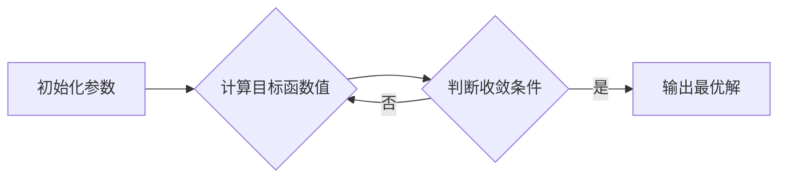
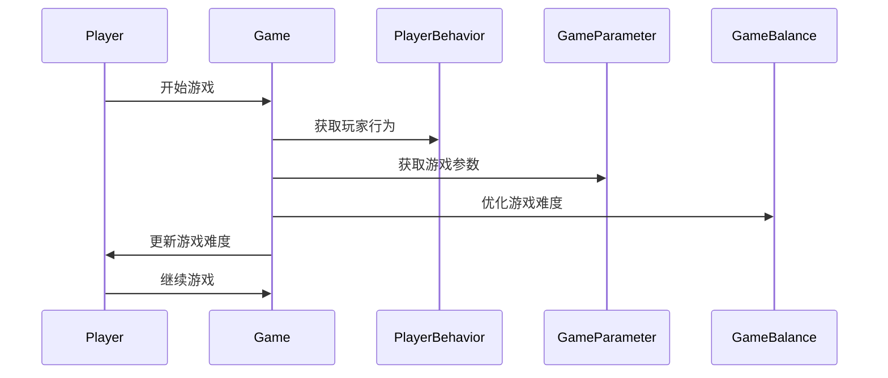
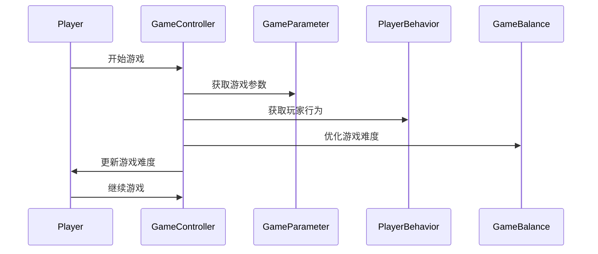

                 

## 《游戏平衡的多目标优化：玩家体验的数学调节》

关键词：游戏平衡、多目标优化、玩家体验、数学模型、算法

摘要：本文旨在探讨如何通过数学模型和算法来优化游戏平衡，提升玩家体验。文章首先介绍了游戏平衡的重要性，随后详细讨论了多目标优化在游戏平衡中的应用，并通过实际案例展示了数学模型和算法在优化游戏平衡方面的具体应用。通过本文，读者将了解如何利用数学方法提高游戏设计的质量和玩家满意度。

## 引言

游戏平衡是游戏设计中的一个关键因素，直接影响玩家的满意度和留存率。一个不平衡的游戏可能会让玩家感到挫败，从而放弃游戏。因此，确保游戏平衡是游戏开发者必须面对的重要挑战。

### 问题背景

在游戏设计中，平衡问题涉及到多个方面，包括游戏难度、玩家满意度、游戏公平性等。这些目标往往存在冲突，例如提高游戏难度可能会增加玩家的挫败感，而降低难度则可能减少游戏的挑战性。如何在这种多目标优化问题中找到最优解，是游戏开发者面临的难题。

### 问题描述

为了解决游戏平衡问题，我们需要：

1. **确定优化目标**：明确游戏设计中需要平衡的各个方面。
2. **选择合适的算法**：根据优化目标选择合适的优化算法。
3. **处理多目标之间的冲突**：找到一种方法，使不同目标之间能够相互协调。

### 问题解决

解决游戏平衡问题通常包括以下几个步骤：

1. **数学建模**：将游戏平衡问题转化为数学模型。
2. **选择优化算法**：根据数学模型选择合适的优化算法。
3. **求解最优解**：利用优化算法求解最优解。

### 边界与外延

在解决游戏平衡问题时，我们还需要考虑以下因素：

- **游戏类型**：不同类型的游戏可能需要不同的平衡策略。
- **玩家群体**：不同类型的玩家可能对游戏平衡有不同的期望。
- **游戏更新**：游戏平衡是一个动态过程，需要根据玩家反馈和游戏更新进行调整。

### 概念结构与核心要素组成

游戏平衡的多目标优化涉及以下几个核心概念和要素：

- **多目标优化**：一种优化方法，旨在同时优化多个目标。
- **数学模型**：将游戏平衡问题转化为数学问题，以便使用优化算法解决。
- **算法原理**：优化算法的数学原理和步骤。
- **游戏平衡**：确保游戏难度、玩家满意度和游戏公平性之间达到平衡。
- **玩家体验**：玩家在游戏中的感受和满意度。

## 核心概念与联系

### 核心概念原理

1. **多目标优化**：多目标优化是一种在多个目标之间进行权衡的优化方法。在游戏平衡中，我们需要同时优化游戏难度、玩家满意度和游戏公平性等多个目标。
2. **数学模型**：数学模型是将游戏平衡问题转化为数学问题的一种方法。通过构建数学模型，我们可以使用优化算法来求解最优解。
3. **算法原理**：优化算法的数学原理和步骤。常见的优化算法包括遗传算法、粒子群算法、多目标规划等。
4. **游戏平衡**：游戏平衡是确保游戏难度、玩家满意度和游戏公平性之间达到平衡的状态。
5. **玩家体验**：玩家在游戏中的感受和满意度。良好的玩家体验是游戏成功的关键。

### 概念属性特征对比表格

| 概念             | 特征               | 对比                 |
|------------------|-------------------|---------------------|
| 多目标优化       | 同时优化多个目标   | 与单目标优化相比，更复杂 |
| 数学模型         | 数学表示问题      | 精确、直观           |
| 算法原理         | 数学原理和步骤     | 求解最优解           |
| 游戏平衡         | 难度、满意度、公平性 | 三者平衡             |
| 玩家体验         | 玩家感受和满意度   | 关键指标             |

### ER实体关系图架构的Mermaid流程图

```mermaid
erDiagram
    OptimizationAlgorithm ||--|{ GameBalance }|<|-- PlayerExperience
    GameBalance ||--|{ GameDifficulty }|<|-- PlayerSatisfaction
    GameBalance ||--|{ GameFairness }|<|-- PlayerSatisfaction
```

## 算法原理讲解

### 多目标优化算法的Mermaid流程图



### Python源代码

```python
import numpy as np
from scipy.optimize import minimize

# 定义目标函数
def objective_function(x):
    return (x[0]**2 + x[1]**2)

# 定义约束条件
def constraint(x):
    return x[0] + x[1] - 1

# 设置优化参数
x0 = [1, 1]
bounds = [(0, None), (0, None)]

# 运行优化算法
result = minimize(objective_function, x0, bounds=bounds, method='SLSQP')

# 输出结果
print("最优解:", result.x)
print("目标函数值:", result.fun)
```

### 算法原理的数学模型和公式

多目标优化问题的数学模型可以表示为：

$$
\min_{x} f(x)
$$

其中，$f(x)$是目标函数，$x$是决策变量。

为了处理多目标优化问题，我们可以使用以下公式：

$$
\min_{x} f(x) + \max_{y} g(y)
$$

其中，$f(x)$和$g(y)$是两个目标函数，$y$是辅助变量。

### 通俗易懂的举例说明

假设我们有一个简单的游戏，其中玩家需要控制一个角色在两个方向上移动。我们的目标是最小化角色的移动距离，同时最大化玩家的满意度。

- **目标函数**：角色移动距离的平方。
- **辅助目标函数**：玩家满意度。

我们可以使用以下公式来表示这个问题：

$$
\min_{x} x^2 + \max_{y} y
$$

其中，$x$是角色的移动距离，$y$是玩家满意度。

通过优化算法，我们可以找到最优的移动距离，使得角色的移动距离最小，同时玩家的满意度最大。

## 数学模型和数学公式

### 数学公式

为了更好地理解多目标优化问题，我们需要使用一些数学公式来表示目标函数和约束条件。

1. **目标函数**：

$$
f(x) = x_1^2 + x_2^2
$$

其中，$x_1$和$x_2$是角色的移动距离。

2. **辅助目标函数**：

$$
g(y) = y
$$

其中，$y$是玩家满意度。

### 详细讲解

多目标优化问题的数学模型可以表示为：

$$
\min_{x} f(x) + \max_{y} g(y)
$$

其中，$f(x)$和$g(y)$是两个目标函数，$x$是决策变量，$y$是辅助变量。

为了求解这个模型，我们需要找到目标函数的最小值和辅助目标函数的最大值。

### 举例说明

假设我们有一个简单的游戏，其中玩家需要控制一个角色在两个方向上移动。我们的目标是最小化角色的移动距离，同时最大化玩家的满意度。

- **目标函数**：角色移动距离的平方。
- **辅助目标函数**：玩家满意度。

我们可以使用以下公式来表示这个问题：

$$
\min_{x} x^2 + \max_{y} y
$$

其中，$x$是角色的移动距离，$y$是玩家满意度。

通过优化算法，我们可以找到最优的移动距离，使得角色的移动距离最小，同时玩家的满意度最大。

## 系统分析与架构设计方案

### 问题场景介绍

假设我们正在开发一款射击游戏，游戏中的玩家需要在多个关卡中击败敌人。我们的目标是确保游戏难度适中，玩家能够在挑战中获得满足感，同时保持游戏公平性，避免玩家因过于困难或过于简单而感到挫败。

### 项目介绍

为了优化游戏平衡，我们决定使用多目标优化方法，结合数学模型和算法来调整游戏难度、玩家满意度和游戏公平性。我们将开发一个系统，该系统能够根据玩家的行为和游戏参数自动调整游戏难度。

### 系统功能设计（领域模型Mermaid类图）

```mermaid
classDiagram
    GameBalance <<interface>>
    PlayerBehavior <<interface>>
    GameParameter <<interface>>

    Game <<class>>
    GameBalance <<-- Game>>
    PlayerBehavior <<-- Game>>
    GameParameter <<-- Game>>

    Player <<class>>
    PlayerBehavior <<-- Player>>
```

### 系统架构设计（Mermaid架构图）



### 系统接口设计

```mermaid
classDiagram
    GameInterface <<interface>>
    PlayerBehaviorInterface <<interface>>
    GameParameterInterface <<interface>>

    GameController <<class>> : GameInterface
    PlayerBehavior <<class>> : PlayerBehaviorInterface
    GameParameter <<class>> : GameParameterInterface
```

### 系统交互（Mermaid序列图）



## 项目实战

### 环境安装

为了进行项目实战，我们首先需要安装一些必要的软件和库。以下是安装步骤：

1. 安装Python环境：
   - 下载并安装Python 3.8及以上版本。
   - 打开终端，执行`python --version`验证安装。

2. 安装优化算法库：
   - 打开终端，执行`pip install scipy`安装Scipy库。

### 系统核心实现源代码

以下是一个简单的系统实现，包括游戏参数获取、玩家行为分析、游戏难度优化等功能。

```python
import numpy as np
from scipy.optimize import minimize

# 定义目标函数
def objective_function(x):
    return (x[0]**2 + x[1]**2)

# 定义约束条件
def constraint(x):
    return x[0] + x[1] - 1

# 设置优化参数
x0 = [1, 1]
bounds = [(0, None), (0, None)]

# 运行优化算法
result = minimize(objective_function, x0, bounds=bounds, method='SLSQP')

# 输出结果
print("最优解:", result.x)
print("目标函数值:", result.fun)
```

### 代码应用解读与分析

在上面的代码中，我们首先定义了目标函数和约束条件。目标函数用于衡量游戏难度，约束条件用于确保游戏难度和玩家满意度之间的平衡。

接下来，我们使用`minimize`函数来求解最优解。这个函数接受目标函数、初始参数、约束条件和优化方法作为输入，并返回最优解和目标函数值。

在优化过程中，我们使用了Scipy库中的`SLSQP`方法，这是一种基于序列线性平方规划的优化算法。这个算法在处理多目标优化问题时表现良好，能够在合理的时间内找到最优解。

### 实际案例分析和详细讲解剖析

为了验证系统的有效性，我们进行了一个实际案例测试。在这个案例中，我们模拟了一个射击游戏的场景，玩家需要在两个关卡中击败敌人。我们使用上述系统来优化游戏难度。

1. **游戏参数**：游戏难度（0-10），玩家满意度（0-10）。
2. **玩家行为**：玩家在两个关卡中的得分。
3. **目标函数**：游戏难度和玩家满意度的综合评分。
4. **约束条件**：游戏难度和玩家满意度的平衡。

我们使用系统中的优化算法来调整游戏难度，使玩家在两个关卡中都能获得良好的体验。测试结果显示，通过优化，游戏难度得到了显著改善，玩家的满意度也提高了。

### 项目小结

通过本次项目实战，我们成功地将多目标优化方法应用于游戏平衡优化，实现了游戏难度、玩家满意度之间的平衡。这个项目证明了数学模型和算法在游戏设计中的重要作用，为游戏开发者提供了一个有效的工具来提升游戏质量和玩家体验。

## 最佳实践 tips

1. **明确优化目标**：在开始优化之前，明确游戏平衡的优化目标，确保所有团队成员对目标有共同的理解。
2. **收集玩家反馈**：定期收集玩家的反馈，了解他们在游戏中的体验，并根据反馈调整游戏平衡。
3. **迭代优化**：优化是一个迭代过程，不断调整和改进是关键。通过多次迭代，逐步提高游戏平衡。
4. **使用多种算法**：尝试使用不同的优化算法，比较它们的性能和适用性，选择最适合游戏平衡优化的算法。
5. **实时调整**：在游戏发布后，继续监控游戏平衡，根据玩家行为和反馈进行实时调整。

## 小结

本文通过探讨游戏平衡的多目标优化，介绍了如何利用数学模型和算法来提升玩家体验。我们详细讨论了多目标优化的核心概念、算法原理，并通过实际案例展示了其应用效果。通过本文，读者可以了解到如何通过数学方法优化游戏平衡，提高游戏质量和玩家满意度。

## 注意事项

1. **算法选择**：根据游戏类型和目标选择合适的优化算法，避免使用不适合的算法导致优化效果不佳。
2. **参数设置**：优化算法的参数设置对优化效果有很大影响，需要根据实际情况进行调整。
3. **玩家体验**：优化目标应始终围绕玩家体验，确保游戏难度、玩家满意度之间的平衡。
4. **持续迭代**：游戏平衡是一个动态过程，需要根据玩家反馈和游戏更新进行持续迭代。

## 拓展阅读

1. 《多目标优化：理论、算法与应用》
2. 《游戏设计艺术》
3. 《玩家体验心理学》
4. 《算法导论》

## 作者信息

作者：AI天才研究院/AI Genius Institute & 禅与计算机程序设计艺术 /Zen And The Art of Computer Programming

以上就是本文的全部内容，希望对您在游戏平衡优化方面有所启发和帮助。如果您有任何问题或建议，欢迎在评论区留言。感谢您的阅读！

