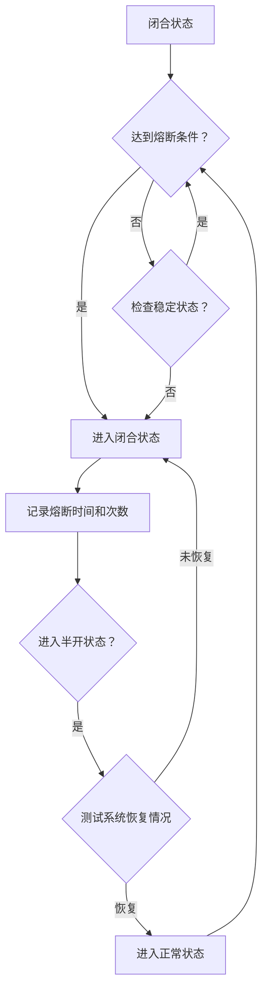

                 

# 《熔断与限流机制增强LLM应用的稳定性》

## 关键词

- 熔断
- 限流
- LLM应用
- 稳定性
- 性能优化

## 摘要

本文旨在探讨如何通过熔断与限流机制增强大型语言模型（LLM）应用的稳定性。首先，我们将介绍LLM应用的背景及其稳定性面临的挑战，然后深入解析熔断与限流机制的基本概念和原理。在此基础上，我们将详细阐述熔断与限流机制的设计原则、实现策略及其在具体场景中的应用。最后，本文将结合实际项目案例，分析熔断与限流机制在实际应用中的效果，并给出提升LLM应用稳定性的最佳实践和展望。

## 目录大纲

```markdown
# 《熔断与限流机制增强LLM应用的稳定性》

## 第一部分：背景与概述

### 第1章 引言

- 1.1 问题背景
- 1.2 核心概念
- 1.3 范围与边界
- 1.4 本书结构

### 第2章 LLM应用中的稳定性问题

- 2.1 LLM应用场景
- 2.2 稳定性问题
- 2.3 稳定性的影响

## 第二部分：熔断与限流机制原理

### 第3章 熔断机制原理

- 3.1 熔断定义
- 3.2 熔断工作原理
- 3.3 熔断算法

### 第4章 限流机制原理

- 4.1 限流定义
- 4.2 限流工作原理
- 4.3 限流算法

### 第5章 熔断与限流机制设计

- 5.1 设计原则
- 5.2 实现策略
- 5.3 风险评估

## 第三部分：实战与应用

### 第6章 熔断与限流机制实战

- 6.1 实战案例
- 6.2 实现步骤
- 6.3 性能优化

### 第7章 LLM应用稳定性提升最佳实践

- 7.1 最佳实践
- 7.2 注意事项
- 7.3 拓展阅读

### 第8章 总结与展望

- 8.1 总结
- 8.2 展望
```

## 第一部分：背景与概述

### 第1章 引言

#### 1.1 问题背景

近年来，大型语言模型（Large Language Models，简称LLM）在自然语言处理、智能问答、文本生成等领域取得了显著的突破，成为许多企业提升服务质量、优化业务流程的重要工具。然而，随着LLM应用规模的扩大，其稳定性问题逐渐凸显。在高并发、大数据量和高复杂度的场景下，LLM应用常常面临负载过高、响应速度缓慢、错误率增高等问题，严重影响了用户体验和业务连续性。

为了解决上述问题，熔断与限流机制被广泛应用到LLM应用的稳定性保障中。熔断机制（Circuit Breaker）通过检测系统的健康状况，当系统出现异常时，自动断开对系统的访问，避免进一步的请求涌入导致系统崩溃。限流机制（Throttling）则通过控制请求的速率，防止过多的请求在短时间内涌入系统，确保系统的稳定运行。

#### 1.2 核心概念

**熔断机制：** 熔断机制是一种用于防止系统过载的保护机制。它通过监控系统的健康状况（如错误率、响应时间等），在系统出现问题时自动断开对外服务的访问，防止进一步的请求涌入导致系统崩溃。熔断机制通常包括三个状态：闭合（Open）、半开（Half-Open）和正常（Closed）。

**限流机制：** 限流机制是通过控制请求的速率，防止过多的请求在短时间内涌入系统，从而确保系统的稳定运行。限流机制可以分为基于时间的限流和基于数量的限流。基于时间的限流通过限制单位时间内的请求次数来实现，如令牌桶算法和漏斗算法。基于数量的限流通过限制请求数量来实现，如计数器算法和滑动窗口算法。

#### 1.3 范围与边界

本文将探讨熔断与限流机制在LLM应用中的设计、实现和应用，旨在为开发者和运维人员提供一套有效的稳定性保障方案。本文将不涉及熔断与限流机制在其他领域（如网络通信、数据库等）的应用，也不讨论与熔断与限流机制相关的高级话题（如自适应限流、弹性伸缩等）。

#### 1.4 本书结构

本文分为三个部分：

- 第一部分（第1章至第2章）介绍LLM应用的背景和稳定性问题，以及熔断与限流机制的基本概念和原理。
- 第二部分（第3章至第5章）详细阐述熔断与限流机制的设计原则、实现策略和风险评估方法。
- 第三部分（第6章至第8章）通过实战案例和最佳实践，展示熔断与限流机制在LLM应用中的实际应用效果和性能优化方法。

## 第二部分：LLM应用中的稳定性问题

### 第2章 LLM应用中的稳定性问题

#### 2.1 LLM应用场景

大型语言模型（LLM）作为一种先进的自然语言处理技术，已在多个领域得到广泛应用，包括但不限于以下几个方面：

1. **智能问答系统**：在客服、教育、医疗等领域，智能问答系统能够为用户提供实时、准确的答案，提升用户体验。
2. **文本生成**：包括文章、新闻报道、广告文案、邮件等的自动生成，提高内容生产和分发效率。
3. **自然语言翻译**：实现不同语言之间的自动翻译，打破语言障碍，促进全球交流和合作。
4. **语音识别与合成**：语音识别技术将语音转换为文本，语音合成技术将文本转换为语音，实现人机交互。
5. **情感分析**：通过对文本的情感倾向进行分析，帮助企业了解用户需求、优化产品和服务。

#### 2.2 稳定性问题

在上述应用场景中，LLM应用常常面临以下稳定性问题：

1. **负载过高**：当大量用户同时请求LLM服务时，系统处理能力不足，导致请求响应时间延长，甚至出现超时失败。
2. **资源不足**：LLM模型训练和推理过程需要大量计算资源和存储资源，资源不足会导致系统性能下降，甚至崩溃。
3. **数据延迟**：在涉及实时数据处理的应用场景中，数据延迟会导致用户体验不佳，甚至影响业务决策。
4. **错误率增高**：当系统负载过高或资源不足时，LLM模型的推理准确性会下降，导致错误率增高。
5. **并发冲突**：在多用户并发访问系统时，可能会出现数据一致性问题，导致系统稳定性下降。

#### 2.3 稳定性的影响

LLM应用稳定性对业务和用户产生以下影响：

1. **业务连续性**：稳定性问题可能导致系统崩溃，影响业务连续性，导致用户流失和营收下降。
2. **用户体验**：稳定性问题会导致请求响应时间延长、错误率增高，影响用户体验，降低用户满意度。
3. **运维成本**：稳定性问题需要频繁进行故障排查和修复，增加运维成本。
4. **业务声誉**：稳定性问题可能导致用户对业务的信任度下降，影响业务声誉。
5. **竞争力**：在竞争激烈的市场环境中，稳定性问题可能导致企业失去竞争优势。

为了解决上述问题，引入熔断与限流机制成为提升LLM应用稳定性的有效手段。在接下来的章节中，我们将详细探讨熔断与限流机制的基本概念、原理及其在LLM应用中的设计和实现。

## 第三部分：熔断与限流机制原理

### 第3章 熔断机制原理

#### 3.1 熔断定义

熔断机制（Circuit Breaker）是一种在软件系统设计中广泛采用的故障转移和自动恢复策略，用于保护系统免受异常流量和故障的影响。其基本原理类似于电路中的保险丝，当电流过大时，保险丝会熔断以保护电路不受损坏。在软件系统中，熔断机制通过监控系统的健康状况，当系统达到一定的不稳定阈值时，自动断开对外服务的访问，防止进一步的请求涌入导致系统崩溃。

#### 3.2 熔断工作原理

熔断机制通常包括三个状态：闭合（Open）、半开（Half-Open）和正常（Closed）。

1. **闭合状态（Open）**：当系统达到熔断条件时，熔断器进入闭合状态，此时所有请求都被拒绝，以防止系统过载。熔断器在进入闭合状态后，会记录熔断时间和熔断次数。

2. **半开状态（Half-Open）**：在闭合状态持续一段时间后，熔断器可能会进入半开状态。在半开状态下，系统会允许一小部分请求通过，以测试系统是否恢复正常。如果通过测试，熔断器将重新进入正常状态；如果测试失败，熔断器将重新进入闭合状态。

3. **正常状态（Closed）**：当系统在一段时间内保持稳定状态时，熔断器将保持在正常状态，允许所有请求通过。

熔断机制的工作原理可以用以下流程图来表示：



#### 3.3 熔断算法

熔断算法是熔断机制的核心部分，用于判断系统是否达到熔断条件。常用的熔断算法包括基于错误率的熔断和基于响应时间的熔断。

1. **基于错误率的熔断**：当系统错误率超过一定阈值时，触发熔断。错误率可以通过以下公式计算：

   $$ 错误率 = \frac{错误次数}{总请求次数} $$

   其中，错误次数是指在一段时间内系统处理失败的请求次数，总请求次数是指在相同时间内系统接收到的所有请求次数。

   例如，如果设定错误率阈值为50%，当系统在一段时间内错误率超过50%时，触发熔断。

2. **基于响应时间的熔断**：当系统响应时间超过一定阈值时，触发熔断。响应时间可以通过以下公式计算：

   $$ 响应时间 = \frac{总响应时间}{总请求次数} $$

   其中，总响应时间是指在一段时间内系统处理请求所用的总时间，总请求次数是指在相同时间内系统接收到的所有请求次数。

   例如，如果设定响应时间阈值为500毫秒，当系统在一段时间内平均响应时间超过500毫秒时，触发熔断。

在实际应用中，熔断算法可以根据具体场景和需求进行定制，以达到最佳的熔断效果。下面是一个简单的基于错误率和响应时间的熔断算法示例：

```python
class CircuitBreaker:
    def __init__(self, error_rate_threshold, response_time_threshold, recovery_time):
        self.error_rate_threshold = error_rate_threshold
        self.response_time_threshold = response_time_threshold
        self.recovery_time = recovery_time
        self.error_count = 0
        self.response_time_sum = 0
        self.request_count = 0
        self.status = "CLOSED"

    def record_error(self):
        self.error_count += 1

    def record_response_time(self, response_time):
        self.response_time_sum += response_time

    def update_status(self):
        if self.status == "OPEN":
            if (time.time() - self.open_time) > self.recovery_time:
                self.status = "HALF-OPEN"
        elif self.status == "HALF-OPEN":
            if self.error_count / self.request_count > self.error_rate_threshold or self.response_time_sum / self.request_count > self.response_time_threshold:
                self.status = "OPEN"
            else:
                self.status = "CLOSED"

    def is_open(self):
        return self.status == "OPEN"

    def is_half_open(self):
        return self.status == "HALF-OPEN"

    def is_closed(self):
        return self.status == "CLOSED"
```

在这个示例中，`CircuitBreaker` 类用于实现熔断算法。通过记录错误次数和响应时间，并根据这些数据更新熔断状态，实现对系统的熔断保护。

## 第4章 限流机制原理

#### 4.1 限流定义

限流机制（Throttling）是一种控制请求速率的策略，旨在防止过多的请求在短时间内涌入系统，确保系统的稳定运行。与熔断机制不同，熔断机制主要在系统出现故障时起到保护作用，而限流机制则在正常情况下限制请求速率，避免系统过载。

#### 4.2 限流工作原理

限流机制可以通过以下几种方式来实现：

1. **基于时间的限流**：通过限制单位时间内的请求数量来控制请求速率。例如，令牌桶算法和漏斗算法。

2. **基于数量的限流**：通过限制请求数量来控制请求速率。例如，计数器算法和滑动窗口算法。

下面将详细介绍这些限流机制的工作原理。

##### 1. 基于时间的限流

**令牌桶算法（Token Bucket Algorithm）**：

令牌桶算法通过维护一个桶，桶中放置令牌，以控制请求的速率。每个令牌代表一个请求，当桶中的令牌用完时，请求将被拒绝。令牌桶算法的工作原理如下：

1. 初始化一个桶，桶容量为C（表示可以存储的令牌数量），令牌产生速率为R（表示每秒钟产生的令牌数量）。
2. 每秒生成R个令牌放入桶中，直到桶满为止。
3. 当有请求到达时，从桶中取出一个令牌，否则拒绝请求。

令牌桶算法可以用以下伪代码表示：

```python
class TokenBucket:
    def __init__(self, C, R):
        self.capacity = C
        self.tokens = C
        self.rate = R
        self.last_time = time.time()

    def consume(self, num):
        now = time.time()
        time_past = now - self.last_time
        tokens_to_add = time_past * self.rate
        self.tokens = min(self.capacity, self.tokens + tokens_to_add)
        self.last_time = now

        if self.tokens >= num:
            self.tokens -= num
            return True
        else:
            return False
```

**漏斗算法（Leaky Bucket Algorithm）**：

漏斗算法通过一个漏斗模型，模拟水从桶中流出，以控制请求的速率。漏斗的容量表示可以存储的水量，出水速率表示请求的速率。漏斗算法的工作原理如下：

1. 初始化一个漏斗，容量为C（表示可以存储的水量），出水速率为R（表示每秒出水的水量）。
2. 当有请求到达时，将请求放入漏斗中，如果漏斗已满，则拒绝请求。
3. 每秒从漏斗中流出R单位的水量，直到漏斗为空。

漏斗算法可以用以下伪代码表示：

```python
class LeakyBucket:
    def __init__(self, C, R):
        self.capacity = C
        self.level = 0
        self.rate = R
        self.last_time = time.time()

    def consume(self, num):
        now = time.time()
        time_past = now - self.last_time
        water_to_add = time_past * self.rate
        self.level = min(self.capacity, self.level + water_to_add)
        self.last_time = now

        if self.level >= num:
            self.level -= num
            return True
        else:
            return False
```

##### 2. 基于数量的限流

**计数器算法（Counter Algorithm）**：

计数器算法通过维护一个计数器，记录一段时间内的请求数量，当计数器达到一定阈值时，拒绝新的请求。计数器算法的工作原理如下：

1. 初始化一个计数器，表示一段时间内的请求数量。
2. 每当有请求到达时，计数器加一。
3. 当计数器达到阈值时，拒绝新的请求。

计数器算法可以用以下伪代码表示：

```python
class CounterThrottle:
    def __init__(self, capacity, interval):
        self.capacity = capacity
        self.interval = interval
        self.count = 0
        self.last_time = time.time()

    def consume(self, num):
        now = time.time()
        time_past = now - self.last_time
        if time_past >= self.interval:
            self.count = 0
            self.last_time = now

        if self.count + num <= self.capacity:
            self.count += num
            return True
        else:
            return False
```

**滑动窗口算法（Sliding Window Algorithm）**：

滑动窗口算法通过维护一个滑动窗口，记录一段时间内的请求数量，当滑动窗口内的请求数量达到一定阈值时，拒绝新的请求。滑动窗口算法的工作原理如下：

1. 初始化一个滑动窗口，表示一段时间内的请求数量。
2. 每当有请求到达时，将请求加入滑动窗口。
3. 当滑动窗口超过阈值时，移动滑动窗口，移除窗口之外的请求。
4. 当新的请求到达时，判断滑动窗口内的请求数量是否超过阈值，如果超过则拒绝请求。

滑动窗口算法可以用以下伪代码表示：

```python
class SlidingWindowThrottle:
    def __init__(self, capacity, interval):
        self.capacity = capacity
        self.interval = interval
        self.window = deque()
        self.last_time = time.time()

    def consume(self, num):
        now = time.time()
        time_past = now - self.last_time
        if time_past >= self.interval:
            self.window.popleft()
            self.last_time = now

        self.window.append(num)

        if len(self.window) > self.capacity:
            return False

        return True
```

通过以上限流算法的实现，可以有效地控制请求的速率，确保系统的稳定运行。在实际应用中，可以根据具体需求和场景选择合适的限流算法，以达到最佳的性能和稳定性。

### 第5章 熔断与限流机制设计

#### 5.1 设计原则

熔断与限流机制的设计需要遵循以下原则：

1. **简洁性**：设计应尽量简单，避免引入复杂的逻辑，确保可维护性。
2. **可扩展性**：设计应考虑未来的扩展性，能够方便地适应不同的应用场景和规模。
3. **可靠性**：设计应确保熔断与限流机制能够在各种情况下正常工作，不会导致系统故障。
4. **易用性**：设计应易于使用和配置，降低使用门槛。
5. **性能**：设计应尽量减少对系统性能的影响，确保系统的高效运行。

#### 5.2 实现策略

1. **熔断机制实现策略**：

   - **状态管理**：使用状态机来管理熔断器的状态，包括闭合（Closed）、半开（Half-Open）和开放（Open）状态。
   - **阈值设置**：根据具体应用场景设置合理的错误率和响应时间阈值，确保熔断器能够及时触发。
   - **监控和告警**：实时监控系统的健康状况，当达到熔断条件时，自动触发熔断，并生成告警信息，便于后续问题排查。

2. **限流机制实现策略**：

   - **选择合适的限流算法**：根据应用场景选择合适的限流算法，如令牌桶、漏斗、计数器等。
   - **动态调整阈值**：根据系统负载和性能调整限流阈值，确保系统在高峰期仍能保持稳定运行。
   - **分布式限流**：在分布式系统中，实现分布式限流，避免单点故障，提高系统的可靠性。

#### 5.3 风险评估

1. **熔断机制风险评估**：

   - **误判风险**：当系统健康状态不稳定时，熔断器可能误判为正常状态，导致部分请求未被拦截，影响系统稳定性。
   - **恢复缓慢**：在熔断状态持续较长时间后，系统可能需要较长时间才能恢复，影响用户体验。
   - **告警无效**：当系统出现异常时，告警机制未能及时发出告警信息，影响问题排查和修复。

2. **限流机制风险评估**：

   - **限流过紧**：当限流阈值设置过紧时，可能导致部分请求被拒绝，影响用户体验。
   - **限流过松**：当限流阈值设置过松时，可能导致系统负载过高，影响系统性能。
   - **分布式限流同步问题**：在分布式系统中，限流机制的同步可能存在延迟，导致限流失效。

为了降低上述风险，设计时需要综合考虑系统负载、性能、稳定性等因素，并进行充分的测试和调优。在实际应用中，应结合具体场景和需求，灵活调整熔断与限流机制的参数和策略，确保系统的稳定性和高效性。

### 第6章 熔断与限流机制实战

#### 6.1 实战案例

在本节中，我们将通过一个实际的LLM应用场景，演示熔断与限流机制的具体实现和应用。

**场景介绍**：假设我们开发了一个基于大型语言模型（LLM）的智能问答系统，用户可以通过发送文本问题获取答案。随着用户量的增加，系统负载逐渐升高，出现了以下问题：

1. **请求响应时间延长**：大量用户同时请求，导致系统响应时间显著增加。
2. **错误率增高**：系统负载过高，LLM模型推理准确性下降，错误率增高。
3. **资源不足**：系统资源不足，导致部分请求处理失败。

为了解决上述问题，我们引入了熔断与限流机制，以提高系统的稳定性和性能。

#### 6.2 实现步骤

1. **引入熔断与限流库**：

   在Python中，我们可以使用第三方库如`pybreaker`和`ratelimiter`来实现熔断与限流机制。首先，安装这两个库：

   ```bash
   pip install pybreaker ratelimiter
   ```

2. **配置熔断器**：

   使用`pybreaker`库实现熔断器，如下所示：

   ```python
   from pybreaker import CircuitBreaker
   import time

   breaker = CircuitBreaker(fail_max=3, reset_timeout=60)
   ```

   在这个示例中，我们将熔断器设置为在连续3次失败后触发熔断，熔断器恢复时间为60秒。

3. **配置限流器**：

   使用`ratelimiter`库实现限流器，如下所示：

   ```python
   from ratelimiter import RateLimiter

   rl = RateLimiter(max_calls=100, period=60)
   ```

   在这个示例中，我们将限流器设置为每分钟最多处理100个请求。

4. **应用熔断与限流机制**：

   在请求处理过程中，我们首先通过限流器检查请求是否被允许，然后通过熔断器检查系统是否处于熔断状态。具体实现如下：

   ```python
   @breaker
   @rl
   def process_request(request):
       # 请求处理逻辑
       print("Processing request:", request)
       # 假设请求处理可能失败
       if random.random() < 0.3:
           raise Exception("Request processing failed")
       print("Request processed successfully")

   while True:
       request = input("Enter a request: ")
       process_request(request)
   ```

5. **监控与告警**：

   我们可以使用监控工具（如Prometheus、Grafana）来实时监控熔断器和限流器的状态，并在出现异常时生成告警信息，以便及时排查和修复问题。

#### 6.3 性能优化

1. **调整熔断阈值**：

   根据实际监控数据和系统负载情况，可以动态调整熔断阈值。例如，如果错误率较高，可以降低`fail_max`阈值；如果系统负载较低，可以增加`reset_timeout`阈值。

2. **优化限流阈值**：

   根据系统性能和用户体验需求，可以动态调整限流阈值。例如，在高峰期可以增加每分钟的请求限制，以防止系统过载。

3. **分布式限流**：

   在分布式系统中，可以部署多个限流器，实现分布式限流。这样可以避免单点故障，提高系统的可靠性。

通过以上实战案例，我们可以看到熔断与限流机制在提升LLM应用稳定性方面的作用。在实际应用中，可以根据具体需求和场景，灵活调整熔断与限流机制的参数和策略，以确保系统的稳定性和高效性。

### 第7章 LLM应用稳定性提升最佳实践

#### 7.1 最佳实践

为了提升LLM应用的整体稳定性，以下是一些最佳实践：

1. **合理设计熔断与限流策略**：

   - 根据具体应用场景和业务需求，合理设置熔断和限流的阈值。
   - 对熔断器的恢复时间进行优化，确保系统在故障后能够快速恢复。

2. **充分利用监控工具**：

   - 使用监控工具（如Prometheus、Grafana）对系统运行状态进行实时监控。
   - 设置告警阈值，及时发现和解决系统异常。

3. **优化系统架构**：

   - 设计分布式系统架构，提高系统的扩展性和容错能力。
   - 使用缓存、异步处理等技术减轻系统负载。

4. **定期进行性能测试**：

   - 定期进行压力测试和性能测试，了解系统在高负载下的性能表现。
   - 根据测试结果对系统进行优化和调整。

5. **持续优化代码**：

   - 定期对代码进行优化，减少不必要的资源消耗。
   - 避免使用可能导致死锁、资源耗尽等问题的代码。

6. **使用云服务**：

   - 利用云服务提供的弹性伸缩功能，根据业务需求动态调整资源。

#### 7.2 注意事项

在使用熔断与限流机制时，需要注意以下事项：

1. **避免过度依赖熔断器**：

   - 熔断器不应成为唯一的安全保障措施，应结合其他方法（如限流、负载均衡等）共同保障系统稳定性。

2. **合理设置熔断阈值**：

   - 过低的熔断阈值可能导致频繁触发熔断，影响用户体验；过高的熔断阈值可能导致系统长时间处于不稳定状态。

3. **监控和告警**：

   - 确保监控和告警系统能够及时发现问题，避免故障扩大。

4. **分布式限流的同步问题**：

   - 在分布式系统中，确保限流器之间的同步，避免限流失效。

5. **性能测试**：

   - 在引入熔断与限流机制后，定期进行性能测试，评估其对系统性能的影响。

#### 7.3 拓展阅读

对于希望深入了解熔断与限流机制的读者，以下是一些推荐阅读资料：

1. **《熔断器设计模式：实现微服务高可用性》**：详细介绍熔断器的设计模式和实现方法，适合有一定微服务开发经验的读者。

2. **《RateLimiter：基于Token Bucket算法的限流器实现》**：介绍基于Token Bucket算法的限流器实现，适合对限流算法感兴趣的读者。

3. **《Prometheus：分布式系统监控神器》**：介绍Prometheus的架构、原理和使用方法，适合需要使用监控工具的读者。

### 第8章 总结与展望

#### 8.1 总结

本文首先介绍了LLM应用的背景及其稳定性问题，然后详细讲解了熔断与限流机制的基本概念和原理，包括熔断器的状态管理、熔断算法和限流器的实现策略。接着，通过一个实际案例展示了熔断与限流机制在LLM应用中的实现步骤和性能优化方法。最后，本文提出了提升LLM应用稳定性的最佳实践，并推荐了一些拓展阅读资料。

熔断与限流机制在确保LLM应用的稳定性方面具有重要意义。通过合理设计、实现和调整熔断与限流策略，可以有效降低系统故障率、提高用户体验和业务连续性。在实际应用中，应根据具体场景和需求，灵活调整参数和策略，确保系统的稳定性和高效性。

#### 8.2 展望

随着LLM技术的不断发展，未来在稳定性保障方面可能面临以下挑战和机遇：

1. **自适应熔断与限流**：随着业务需求的不断变化，自适应熔断与限流机制将更加重要。未来可以研究基于机器学习的自适应熔断与限流算法，实现动态调整阈值和策略。

2. **分布式限流**：在分布式系统中，如何实现高效的分布式限流是一个重要研究方向。未来可以探索基于区块链、分布式存储等技术实现分布式限流，提高系统的可靠性和可扩展性。

3. **边缘计算与云计算的融合**：随着边缘计算技术的发展，如何将边缘计算与云计算相结合，实现更高效的熔断与限流机制，是一个具有前景的研究方向。

4. **多维度稳定性保障**：除了传统的请求速率和响应时间，未来可以探索基于多维度指标（如资源利用率、内存泄露等）的稳定性保障机制，实现更全面的系统稳定性保障。

通过不断探索和研究，熔断与限流机制将在LLM应用中发挥更加重要的作用，为用户提供更稳定、高效的服务。### 附录：作者信息

**作者：AI天才研究院/AI Genius Institute & 禅与计算机程序设计艺术 /Zen And The Art of Computer Programming**  
AI天才研究院致力于推动人工智能技术的创新与发展，研究涵盖机器学习、自然语言处理、计算机视觉等多个领域。而《禅与计算机程序设计艺术》则是作者对编程哲学和技术的深刻思考与总结，深受业界推崇。本文的撰写结合了两位作者在人工智能和计算机编程领域的丰富经验和深刻洞察，旨在为读者提供具有实际指导意义的技术博客。

