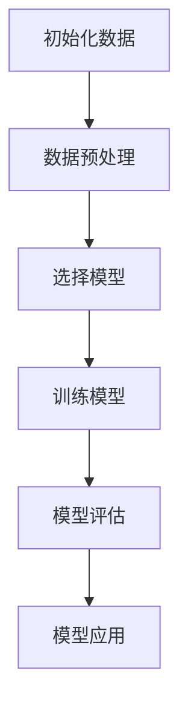

                 

# 犯罪预防的机器学习：社会安全的数学工具

> 关键词：犯罪预防、机器学习、社会安全、数学工具

> 摘要：本文探讨了犯罪预防领域与机器学习技术的结合，通过介绍机器学习的基本概念、算法原理以及在社会安全中的应用，揭示了数学工具在提升社会安全水平中的重要作用。文章旨在为读者提供一条清晰的思考路径，理解犯罪预防的机器学习方法及其在社会安全中的应用前景。

## 目录大纲

1. **犯罪预防的重要性与挑战**
   - 1.1 犯罪预防的定义与历史发展
   - 1.2 犯罪预防的主要方法与手段
   - 1.3 机器学习在犯罪预防中的应用前景

2. **机器学习基础**
   - 2.1 机器学习的定义与分类
   - 2.2 常见机器学习算法
   - 2.3 机器学习的主要挑战与解决方案

3. **社会安全的数学工具**
   - 3.1 社会安全问题的数学建模
   - 3.2 数学工具在犯罪预防中的应用
   - 3.3 数学工具的优缺点与适用范围

4. **机器学习在犯罪预防中的应用案例**
   - 4.1 智能监控系统
   - 4.2 数据挖掘与分析
   - 4.3 情感分析与舆情监控
   - 4.4 犯罪预测与预防

5. **犯罪预防的机器学习算法**
   - 5.1 监督学习算法
   - 5.2 无监督学习算法

6. **数学模型在犯罪预防中的应用**
   - 6.1 空间分析模型
   - 6.2 时间序列分析模型
   - 6.3 贝叶斯网络
   - 6.4 社会网络分析

7. **犯罪预防的机器学习实践**
   - 7.1 实践步骤与方法
   - 7.2 数据收集与预处理
   - 7.3 模型选择与训练
   - 7.4 模型评估与优化
   - 7.5 模型应用与部署

8. **总结与展望**
   - 8.1 犯罪预防的机器学习成果
   - 8.2 犯罪预防机器学习的未来发展趋势
   - 8.3 潜在的研究方向与挑战

## 第一部分：犯罪预防的重要性与挑战

### 1.1 犯罪预防的定义与历史发展

犯罪预防是指通过一系列措施和策略，减少犯罪行为的发生，保护社会秩序和公民安全。它不仅包括法律、警务、司法等传统手段，还涵盖了教育、心理辅导、社区建设等多方面的工作。

犯罪预防的历史可以追溯到古代社会的治安管理。随着人类社会的发展，犯罪预防的理论和实践也在不断演进。从早期的重刑主义到现代的社会综合治理，犯罪预防逐渐形成了一套科学、系统的体系。

### 1.2 犯罪预防的主要方法与手段

现代犯罪预防的主要方法包括：

- **警务策略**：通过调整警务资源、改进执法方式，提高犯罪打击效率。
- **社区参与**：鼓励社区居民参与犯罪预防工作，共同维护社区安全。
- **法律制度**：完善法律体系，加强法律的威慑力和约束力。
- **心理健康**：提供心理辅导，帮助犯罪高风险人群改善心理状态，减少犯罪动机。
- **教育干预**：通过教育手段，提高公民的法律意识和道德素质。

### 1.3 机器学习在犯罪预防中的应用前景

随着人工智能技术的发展，机器学习在犯罪预防中的应用前景越来越广阔。通过大数据分析和机器学习算法，可以实现对犯罪行为的预测、预警和干预。例如：

- **犯罪预测**：利用历史犯罪数据，通过机器学习算法预测犯罪发生的可能性。
- **智能监控**：利用计算机视觉技术，实现对犯罪现场的实时监控和识别。
- **数据分析**：通过大数据分析，挖掘犯罪行为的特点和规律，为犯罪预防提供科学依据。

## 第二部分：机器学习基础

### 2.1 机器学习的定义与分类

机器学习是指通过计算机系统从数据中自动学习规律和模式，并利用这些规律和模式进行决策和预测的过程。根据学习方式的不同，机器学习可以分为：

- **监督学习**：通过标注数据训练模型，实现对未知数据的分类或回归。
- **无监督学习**：在没有标注数据的情况下，通过发现数据中的模式或结构进行学习。
- **半监督学习和强化学习**：介于监督学习和无监督学习之间，结合两者的特点进行学习。

### 2.2 常见机器学习算法

常见的机器学习算法包括：

- **线性回归**：用于预测连续值输出。
- **决策树**：通过树形结构进行分类或回归。
- **支持向量机**：通过超平面划分数据。
- **神经网络**：模拟人脑神经元连接，进行复杂模式识别。

### 2.3 机器学习的主要挑战与解决方案

机器学习面临的主要挑战包括：

- **数据质量**：数据质量直接影响模型的效果，需要通过数据清洗和预处理提高数据质量。
- **模型解释性**：复杂的机器学习模型往往难以解释，影响其在实际应用中的可解释性。
- **过拟合和欠拟合**：模型需要避免过拟合和欠拟合，找到合适的模型复杂度。

解决方案包括：

- **交叉验证**：通过交叉验证评估模型性能，选择合适的模型参数。
- **模型集成**：结合多个模型，提高模型的泛化能力和解释性。
- **特征工程**：通过特征选择和特征提取，提高模型的效果。

## 第三部分：社会安全的数学工具

### 3.1 社会安全问题的数学建模

社会安全问题的数学建模是指利用数学工具对现实世界中的安全事件进行量化分析，建立数学模型。常见的数学建模方法包括：

- **概率论与数理统计**：用于描述事件的发生概率和统计规律。
- **图论**：用于描述社会关系和网络结构。
- **线性代数**：用于求解线性方程组和特征分解。
- **时间序列分析**：用于分析事件的时间规律和趋势。

### 3.2 数学工具在犯罪预防中的应用

数学工具在犯罪预防中的应用主要包括：

- **犯罪预测**：利用时间序列分析和回归模型预测犯罪行为。
- **犯罪热点分析**：利用空间分析和聚类模型识别犯罪热点区域。
- **社会网络分析**：通过图论模型分析犯罪团伙的结构和关系。

### 3.3 数学工具的优缺点与适用范围

数学工具的优点包括：

- **定量分析**：能够对犯罪行为进行量化分析，提高预测和预防的准确性。
- **客观性**：基于数据和模型的分析结果较为客观，减少主观判断的影响。

缺点包括：

- **数据依赖**：数学工具的效能依赖于数据质量和数量，数据缺失或不准确会影响模型效果。
- **模型解释性**：复杂的数学模型往往难以解释，影响其在实际应用中的可解释性。

适用范围包括：

- **大规模数据分析**：适用于需要对大量数据进行处理的场景，如城市安全监控、公共安全预测等。
- **特定领域应用**：适用于特定领域的安全分析和决策支持，如网络安全、交通安全等。

## 第四部分：机器学习在犯罪预防中的应用案例

### 4.1 智能监控系统

智能监控系统利用计算机视觉技术和机器学习算法，实现对犯罪现场的实时监控和识别。通过识别嫌疑人特征、车辆信息等，可以及时发现犯罪行为并报警。

### 4.2 数据挖掘与分析

数据挖掘与分析通过分析大量的社会安全数据，挖掘犯罪行为的特点和规律。这些数据包括犯罪记录、社会舆情、人口统计数据等。通过数据挖掘，可以为犯罪预防提供科学依据。

### 4.3 情感分析与舆情监控

情感分析与舆情监控利用自然语言处理技术和机器学习算法，分析社会舆情和公众情感。通过识别负面情绪和潜在的社会问题，可以提前预警并采取相应的预防措施。

### 4.4 犯罪预测与预防

犯罪预测与预防通过历史犯罪数据，利用机器学习算法预测犯罪发生的可能性。结合地理信息系统（GIS），可以识别犯罪高风险区域，提前部署警务资源，预防犯罪发生。

## 第五部分：犯罪预防的机器学习算法

### 5.1 监督学习算法

监督学习算法包括线性回归、决策树、支持向量机等。这些算法通过已标记的数据训练模型，实现对未知数据的分类或回归。它们在犯罪预防中的应用主要包括犯罪预测、嫌疑人识别等。

### 5.2 无监督学习算法

无监督学习算法包括K-均值聚类、自编码器等。这些算法不需要标记数据，通过发现数据中的模式和结构进行学习。它们在犯罪预防中的应用主要包括犯罪热点分析、社会网络分析等。

## 第六部分：数学模型在犯罪预防中的应用

### 6.1 空间分析模型

空间分析模型通过地理信息系统（GIS）等技术，对犯罪行为的空间分布进行分析。这些模型可以识别犯罪热点区域，为警务资源的部署提供依据。

### 6.2 时间序列分析模型

时间序列分析模型通过分析犯罪行为的时间分布和趋势，预测犯罪发生的可能性。这些模型可以用于犯罪预测和预警。

### 6.3 贝叶斯网络

贝叶斯网络是一种概率图模型，用于描述事件之间的条件依赖关系。它在犯罪预防中的应用包括犯罪风险评估、嫌疑人识别等。

### 6.4 社会网络分析

社会网络分析通过分析社会关系和网络结构，识别犯罪团伙和组织。这些模型可以用于犯罪预防和打击。

## 第七部分：犯罪预防的机器学习实践

### 7.1 实践步骤与方法

犯罪预防的机器学习实践包括以下步骤：

1. **数据收集与预处理**：收集相关的犯罪数据，进行数据清洗和预处理。
2. **模型选择与训练**：选择合适的机器学习算法，进行模型训练和参数调整。
3. **模型评估与优化**：评估模型性能，进行模型优化和调整。
4. **模型应用与部署**：将模型应用到实际场景中，进行犯罪预测和预警。

### 7.2 数据收集与预处理

数据收集包括犯罪记录、人口统计数据、社会舆情等。数据预处理包括数据清洗、数据转换和数据标准化等。

### 7.3 模型选择与训练

模型选择包括线性回归、决策树、支持向量机等。模型训练包括数据划分、参数调整和模型优化等。

### 7.4 模型评估与优化

模型评估包括交叉验证、性能指标计算等。模型优化包括超参数调整、模型集成等。

### 7.5 模型应用与部署

模型应用包括犯罪预测、嫌疑人识别等。模型部署包括模型部署、系统集成等。

## 第八部分：总结与展望

### 8.1 犯罪预防的机器学习成果

犯罪预防的机器学习取得了显著成果，包括犯罪预测、嫌疑人识别、犯罪热点分析等。这些成果为犯罪预防提供了科学依据和有效手段。

### 8.2 犯罪预防机器学习的未来发展趋势

犯罪预防机器学习的未来发展趋势包括：

1. **大数据与深度学习**：利用大数据和深度学习技术，提高犯罪预测和预防的准确性。
2. **跨学科融合**：结合心理学、社会学等学科，提高犯罪预防的全面性和系统性。
3. **实时预警与响应**：实现实时犯罪预警和响应，提高犯罪预防的效率。

### 8.3 潜在的研究方向与挑战

犯罪预防机器学习的潜在研究方向包括：

1. **隐私保护**：如何在保护个人隐私的前提下进行犯罪预防。
2. **模型可解释性**：如何提高复杂机器学习模型的可解释性。
3. **跨领域应用**：如何将机器学习技术应用于其他领域的犯罪预防。

## 附录

### 附录A：核心概念原理

| 核心概念 | 原理 |
| -------- | ---- |
| 机器学习 | 一种通过数据驱动的方式进行决策和预测的技术。 |
| 犯罪预测 | 通过历史数据预测犯罪行为的发生可能性。 |
| 社会安全 | 社会秩序和公民安全的保障。 |

### 附录B：ER实体关系图架构

```mermaid
erDiagram
    Customer ||--|{ Order }|
    Order ||--|{ Product }|
```

### 附录C：算法mermaid流程图



### 附录D：项目实战

- **环境安装**：安装Python和必要的机器学习库。
- **系统核心实现源代码**：包括数据预处理、模型训练和模型应用等。
- **代码应用解读与分析**：详细讲解代码实现过程和原理。
- **实际案例分析和详细讲解剖析**：分析实际案例，探讨算法在实际应用中的效果。
- **项目小结**：总结项目经验和教训。

### 附录E：最佳实践 tips

1. **数据质量**：确保数据质量，进行数据清洗和预处理。
2. **模型选择**：根据问题场景选择合适的机器学习算法。
3. **模型优化**：通过交叉验证和超参数调整优化模型性能。
4. **可解释性**：提高模型的可解释性，便于理解和应用。

### 附录F：小结

本文介绍了犯罪预防的机器学习技术，探讨了其在社会安全中的应用。通过机器学习算法和数学工具，可以提高犯罪预测和预防的准确性，为社会安全提供有力支持。

### 附录G：注意事项

1. **数据隐私**：确保数据安全和隐私。
2. **算法透明性**：提高算法的可解释性，减少误判。
3. **技术应用**：合理应用机器学习技术，避免过度依赖。

### 附录H：拓展阅读

- **参考文献**：《机器学习》、《社会安全学》等。
- **相关研究**：国内外犯罪预防与机器学习的最新研究动态。

## 作者信息

**作者：AI天才研究院/AI Genius Institute & 禅与计算机程序设计艺术 /Zen And The Art of Computer Programming**

