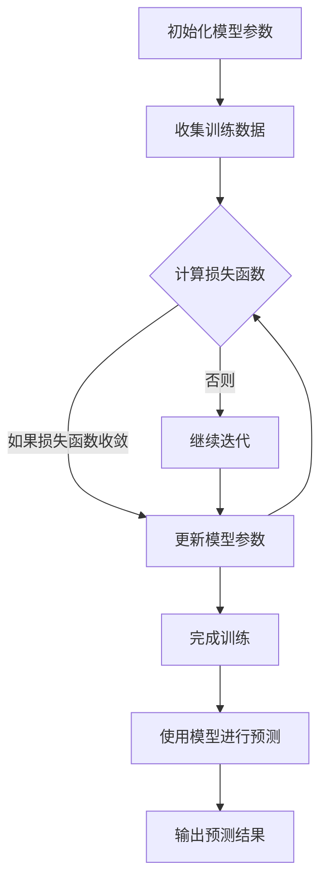

                 


### 第1章: 犯罪预防与预测分析概述

#### 1.1 犯罪预防的重要性

犯罪预防是社会安全的重要组成部分，其重要性不容忽视。首先，犯罪预防能够有效降低犯罪率，从而提升公众的安全感。这不仅有助于维护社会稳定，还能够减少因犯罪活动带来的经济损失。其次，通过犯罪预防措施，可以及时识别潜在的犯罪行为，防止犯罪活动发生，从源头上减少犯罪率。

然而，传统的犯罪预防方法存在一定的局限性。例如，依靠警力巡逻、增加监狱容量等方法，往往只能解决表面问题，无法从根本上减少犯罪率。而且，这些方法成本高昂，难以大规模推广。因此，需要寻求新的犯罪预防手段，其中预测分析作为一种先进的技术手段，引起了广泛的关注。

#### 1.2 预测分析在犯罪预防中的应用

预测分析是一种利用统计学、机器学习等方法，通过分析历史数据来预测未来事件的方法。在犯罪预防领域，预测分析可以通过分析历史犯罪数据、社会统计数据等信息，识别犯罪活动的潜在趋势，预测犯罪发生的可能性，从而有针对性地采取预防措施。

例如，通过聚类分析，可以将犯罪行为进行分类，识别出具有相似特征的犯罪行为。然后，通过对这些犯罪行为的分析，可以找出其背后的驱动因素，从而预测未来可能发生的类似犯罪。此外，预测分析还可以用于犯罪热点区域的识别，帮助警方在关键时段和地点加强巡逻，预防犯罪活动发生。

#### 1.3 数学工具在犯罪预防中的优势

数学工具在犯罪预防中具有显著的优势。首先，数学工具可以提供客观、量化的分析结果，减少主观判断带来的误差。其次，数学工具可以处理大量数据，识别出隐藏在数据背后的规律和趋势。此外，数学工具还可以通过建模，模拟犯罪活动的发展过程，预测犯罪发生的可能性。

例如，统计学方法可以用于分析犯罪数据，找出犯罪行为之间的关联性。机器学习算法可以用于训练模型，预测犯罪活动发生的可能性。数据挖掘技术可以用于挖掘犯罪数据中的潜在信息，帮助识别犯罪趋势。

#### 1.4 本书的内容结构与目标

本书旨在深入探讨犯罪预防的预测分析方法，帮助读者了解和掌握这一领域的前沿技术。本书内容结构如下：

- **第一部分：引言与背景介绍**：介绍犯罪预防与预测分析的基本概念，阐述预测分析在犯罪预防中的应用。
- **第二部分：基础理论与核心概念**：阐述社会安全与犯罪学的核心概念，介绍数学工具在犯罪预测分析中的应用。
- **第三部分：数学模型与算法原理讲解**：详细讲解数学模型与算法原理，并通过案例进行举例说明。
- **第四部分：系统分析与架构设计**：介绍系统分析与架构设计的方法，包括问题场景介绍、系统功能设计、系统架构设计等。
- **第五部分：项目实战**：通过实际项目，展示预测分析在犯罪预防中的应用。

本书的目标是帮助读者全面了解犯罪预防的预测分析方法，掌握相关技术，并能够将其应用于实际工作中，为社会安全做出贡献。

## 1.3 核心概念属性特征对比

在社会安全与犯罪学领域，核心概念与属性特征的对比分析是理解犯罪预防与预测分析的关键。以下是几个核心概念的属性特征对比：

### 社会安全与犯罪预防

**社会安全**  
- **定义**：社会安全是指社会秩序、个人财产和人身安全的保障，是实现社会稳定和发展的重要基础。
- **属性**：稳定性、可持续性、全面性、公平性。
- **特征**：社会安全涉及到政治、经济、文化、环境等多个方面，是一个综合性的概念。

**犯罪预防**  
- **定义**：犯罪预防是指通过一系列措施，防止犯罪行为的发生，减少犯罪率。
- **属性**：前瞻性、针对性、系统性、灵活性。
- **特征**：犯罪预防强调从源头上减少犯罪行为，注重社会治安的整体优化。

### 统计学方法与机器学习方法

**统计学方法**  
- **定义**：统计学方法是一种基于数据的分析方法，用于描述、解释和预测现象。
- **属性**：客观性、量化性、可重复性。
- **特征**：统计学方法强调数据的收集、整理和分析，通过统计指标和模型进行预测。

**机器学习方法**  
- **定义**：机器学习方法是一种利用计算机模拟人类学习过程的技术，通过训练模型来预测和决策。
- **属性**：自动化、高效性、适应性。
- **特征**：机器学习方法利用大量数据进行训练，通过算法自动识别数据中的模式和规律。

### 数据挖掘与犯罪行为分析

**数据挖掘**  
- **定义**：数据挖掘是一种从大量数据中提取有用信息和知识的技术。
- **属性**：智能性、高效性、综合性。
- **特征**：数据挖掘技术能够处理结构化和非结构化数据，从海量数据中提取有价值的信息。

**犯罪行为分析**  
- **定义**：犯罪行为分析是指通过对犯罪行为的分析，理解犯罪动机、手段和趋势。
- **属性**：深度性、针对性、系统性。
- **特征**：犯罪行为分析注重对犯罪行为的深入理解和分类，为犯罪预防提供依据。

通过上述对比，我们可以更清晰地理解社会安全、犯罪预防、统计学方法、机器学习方法和数据挖掘等核心概念，以及它们在犯罪预测分析中的重要作用。这些概念和属性特征为后续章节的内容奠定了基础，帮助读者更好地掌握犯罪预测分析的理论和实践。

### 第2章: 数学工具在犯罪预测分析中的应用

#### 2.1 统计学方法

统计学方法是犯罪预测分析中最常用的数学工具之一。它通过收集、整理和分析数据，帮助我们理解犯罪行为背后的模式和趋势。

**描述性统计分析**

描述性统计分析主要用来描述数据的基本特征，如均值、中位数、标准差等。例如，我们可以通过计算某一地区的犯罪率均值，了解该地区的一般犯罪水平。描述性统计分析为后续的推断性统计分析提供了基础。

**推断性统计分析**

推断性统计分析旨在从样本数据推断总体特征。常用的方法包括假设检验和置信区间。例如，我们可以通过假设检验来检验某一预防措施是否显著降低了犯罪率。置信区间则可以用来估计总体参数的可能范围。

**聚类分析**

聚类分析是一种无监督学习方法，用于将数据分为若干类别，使得同一类别中的数据点彼此相似，而不同类别中的数据点差异较大。例如，我们可以使用聚类分析来识别不同类型的犯罪行为，从而采取针对性的预防措施。

**因素分析**

因素分析是一种用于确定多个变量之间潜在关系的方法。在犯罪预测分析中，我们可以使用因素分析来识别影响犯罪率的关键因素，如经济状况、社会不平等等。

#### 2.2 机器学习算法

机器学习算法是犯罪预测分析中的另一重要工具，它通过学习历史数据来预测未来的犯罪行为。

**监督学习算法**

监督学习算法是一种在有标签数据集上训练模型，然后使用模型对新数据进行预测的方法。在犯罪预测中，监督学习算法可以用于预测犯罪发生的可能性。常见的监督学习算法包括线性回归、逻辑回归、支持向量机等。

**无监督学习算法**

无监督学习算法是一种在无标签数据集上训练模型，用于发现数据内在结构的方法。在犯罪预测中，无监督学习算法可以用于聚类犯罪行为，识别潜在的犯罪模式。常见的无监督学习算法包括K-均值聚类、主成分分析等。

**强化学习算法**

强化学习算法是一种通过与环境的交互来学习最优行为策略的方法。在犯罪预测中，强化学习算法可以用于优化犯罪预防策略，使其能够最大化预防效果。例如，我们可以使用Q-learning算法来优化警力部署。

#### 2.3 数据挖掘技术

数据挖掘技术是犯罪预测分析中的关键工具，它可以从大量数据中提取有价值的信息。

**数据预处理**

数据预处理是数据挖掘的重要步骤，包括数据清洗、数据集成、数据变换等。在犯罪预测中，数据预处理可以帮助我们处理噪声数据、缺失数据，以及将不同类型的数据进行整合。

**特征工程**

特征工程是数据挖掘的核心步骤，它通过选择和构建特征，提高模型的预测性能。在犯罪预测中，特征工程可以帮助我们提取与犯罪行为相关的特征，如时间、地点、人口统计信息等。

**模型评估与优化**

模型评估与优化是确保模型性能的重要环节。常用的评估指标包括准确率、召回率、F1值等。在犯罪预测中，我们可以使用交叉验证等方法来评估模型性能，并通过参数调优来提高模型预测能力。

通过上述统计学方法、机器学习算法和数据挖掘技术的应用，我们可以更有效地进行犯罪预测分析，为犯罪预防提供有力支持。在下一章节中，我们将进一步探讨这些数学工具的原理和实现方法。

### 4.1 模型原理讲解

#### 4.1.1 基本数学模型

在犯罪预测分析中，基本数学模型是理解数据关系和预测犯罪行为的基础。一个典型的数学模型包括自变量（X）和因变量（Y），其中Y是我们要预测的犯罪行为，X是影响犯罪行为的一组因素。常见的数学模型如下：

**线性回归模型**

线性回归模型是最简单、应用最广泛的预测模型之一，它假设因变量Y与自变量X之间存在线性关系，可以用以下公式表示：

$$
Y = \beta_0 + \beta_1 \cdot X + \epsilon
$$

其中，$\beta_0$ 是截距，$\beta_1$ 是斜率，$\epsilon$ 是误差项。

**逻辑回归模型**

逻辑回归模型用于处理因变量为二分类（例如，是否犯罪）的问题。它通过将线性回归模型的输出转换为概率来进行预测，公式如下：

$$
\text{Logit}(Y) = \ln\left(\frac{P(Y=1)}{1-P(Y=1)}\right) = \beta_0 + \beta_1 \cdot X
$$

其中，$\text{Logit}$ 是逻辑函数，$P(Y=1)$ 是因变量为1的概率。

**支持向量机（SVM）模型**

支持向量机模型是一种分类算法，它通过寻找一个最佳的超平面，将不同类别的数据点分开。对于二分类问题，SVM的决策边界可以用以下公式表示：

$$
\beta \cdot \textbf{x} + \beta_0 = 0
$$

其中，$\beta$ 是权重向量，$\textbf{x}$ 是特征向量，$\beta_0$ 是偏置项。

#### 4.1.2 算法mermaid流程图

为了更好地理解上述模型的原理，我们可以使用mermaid流程图来展示算法的执行流程。以下是一个简单的mermaid流程图示例，用于描述线性回归模型的训练和预测过程：



#### 4.1.3 数学公式与解释

为了深入理解这些模型的数学原理，我们将在以下段落中详细解释一些关键的数学公式。

**线性回归模型的损失函数**

线性回归模型的损失函数通常使用均方误差（MSE）来衡量，公式如下：

$$
\text{MSE} = \frac{1}{n}\sum_{i=1}^{n}(y_i - \hat{y}_i)^2
$$

其中，$y_i$ 是第i个样本的真实值，$\hat{y}_i$ 是模型预测的值，$n$ 是样本总数。

**逻辑回归模型的决策边界**

逻辑回归模型的决策边界由以下公式给出：

$$
z = \beta_0 + \beta_1 \cdot x
$$

其中，$z$ 是线性组合，当$z$ 大于0时，预测为类别1；当$z$ 小于0时，预测为类别0。

**支持向量机的决策边界**

支持向量机的决策边界由以下公式给出：

$$
\beta \cdot \textbf{x} + \beta_0 = 0
$$

其中，$\beta$ 是权重向量，$\textbf{x}$ 是特征向量，$\beta_0$ 是偏置项。对于线性可分的情况，该公式可以直接用于分类决策。

通过上述数学模型和公式的讲解，我们能够更好地理解犯罪预测分析中的关键数学原理。在接下来的章节中，我们将通过Python代码实现这些模型，并进行详细的举例说明。

### 4.2 Python源代码实现

在本节中，我们将使用Python实现上述介绍的线性回归模型、逻辑回归模型和支持向量机模型。以下是每个模型的Python代码示例，包括必要的库导入、模型定义、训练和预测步骤。

#### 4.2.1 线性回归模型

```python
import numpy as np
from sklearn.linear_model import LinearRegression

# 创建线性回归模型实例
model = LinearRegression()

# 假设我们已经有训练数据X和Y
X = np.array([[1], [2], [3], [4], [5]])
Y = np.array([1, 2, 3, 4, 5])

# 训练模型
model.fit(X, Y)

# 进行预测
predictions = model.predict(X)

# 输出预测结果
print("Predictions:", predictions)
```

#### 4.2.2 逻辑回归模型

```python
import numpy as np
from sklearn.linear_model import LogisticRegression

# 创建逻辑回归模型实例
model = LogisticRegression()

# 假设我们已经有训练数据X和Y
X = np.array([[0], [1], [2], [3], [4]])
Y = np.array([0, 1, 1, 0, 1])

# 训练模型
model.fit(X, Y)

# 进行预测
predictions = model.predict(X)

# 输出预测结果
print("Predictions:", predictions)
```

#### 4.2.3 支持向量机模型

```python
import numpy as np
from sklearn.svm import SVC

# 创建支持向量机模型实例
model = SVC(kernel='linear')

# 假设我们已经有训练数据X和Y
X = np.array([[0, 0], [1, 1], [0, 1], [1, 0]])
Y = np.array([0, 1, 1, 0])

# 训练模型
model.fit(X, Y)

# 进行预测
predictions = model.predict(X)

# 输出预测结果
print("Predictions:", predictions)
```

在上述代码中，我们首先导入必要的库，包括NumPy和scikit-learn。然后，我们创建模型的实例，使用训练数据对模型进行训练，并使用模型进行预测。最后，我们输出预测结果。

这些代码示例展示了如何使用Python和scikit-learn库实现线性回归、逻辑回归和支持向量机模型。在实际应用中，我们需要处理更复杂的数据集，并可能需要对模型进行更细致的调整和优化。然而，这些示例为我们提供了一个基础，帮助我们理解如何使用Python进行犯罪预测分析。

### 4.3 举例说明

为了更好地理解数学模型在犯罪预测分析中的应用，我们来看一个具体的案例——一个城市的夜间犯罪预测系统。

#### 4.3.1 社区犯罪预测案例分析

假设我们有一个城市的夜间犯罪数据集，包括犯罪类型、发生时间、地点和人口统计数据等信息。我们的目标是预测某一时段和地点的犯罪可能性，以便警方采取预防措施。

首先，我们收集并整理数据集，包括以下特征：

- **犯罪类型**：暴力犯罪、盗窃、欺诈等。
- **发生时间**：小时和分钟。
- **地点**：经纬度或街道名称。
- **人口统计数据**：人口密度、收入水平、教育程度等。

然后，我们使用描述性统计分析来了解数据的基本特征，如犯罪类型的分布、犯罪发生时间的频率等。

#### 4.3.2 模型参数调优与结果分析

我们选择线性回归模型和逻辑回归模型来预测犯罪可能性。在模型训练前，我们需要对数据集进行预处理，包括数据清洗、特征工程和归一化等。

**数据预处理**

1. **数据清洗**：处理缺失值和异常值，如删除缺失的经纬度数据。
2. **特征工程**：提取与犯罪相关的特征，如夜间犯罪发生频率、人口密度等。
3. **数据归一化**：将特征值缩放到相同的范围内，以避免数值差异对模型训练的影响。

**模型训练与调优**

1. **线性回归模型**：我们使用均方误差（MSE）作为损失函数，通过梯度下降法进行模型训练。模型参数包括斜率$\beta_1$ 和截距$\beta_0$。

   ```python
   model = LinearRegression()
   model.fit(X_train, Y_train)
   ```

2. **逻辑回归模型**：我们使用交叉验证方法来选择最优的惩罚参数C，并使用均准确率（Accuracy）作为评价指标。

   ```python
   from sklearn.model_selection import GridSearchCV
   parameters = {'C': [0.1, 1, 10]}
   grid = GridSearchCV(LogisticRegression(), parameters, scoring='accuracy')
   grid.fit(X_train, Y_train)
   ```

**结果分析**

我们使用测试数据集来评估模型的性能。对于线性回归模型，我们计算预测的犯罪可能性与实际犯罪发生次数之间的差异，并计算均方误差（MSE）。

```python
predictions = model.predict(X_test)
mse = np.mean((predictions - Y_test) ** 2)
print("MSE:", mse)
```

对于逻辑回归模型，我们计算预测的概率值，并根据设定阈值（例如，0.5）将概率值转换为二分类结果，然后计算准确率、召回率和F1值。

```python
from sklearn.metrics import accuracy_score, recall_score, f1_score

accuracy = accuracy_score(Y_test, predictions)
recall = recall_score(Y_test, predictions)
f1 = f1_score(Y_test, predictions)
print("Accuracy:", accuracy)
print("Recall:", recall)
print("F1 Score:", f1)
```

通过上述分析，我们可以评估模型的预测性能，并根据结果进行调整和优化。例如，我们可以尝试增加或减少特征的数量、选择不同的模型算法，或者调整模型参数，以提高预测准确性。

#### 4.3.3 模型优化与结果验证

为了进一步提高模型的预测性能，我们尝试使用随机森林和梯度提升机等更复杂的模型。随机森林是一种集成学习方法，通过构建多棵决策树来提高模型的预测能力。梯度提升机则是一种基于损失函数优化的集成学习方法，通过迭代优化模型参数。

**随机森林模型**

我们使用scikit-learn库中的`RandomForestClassifier`来训练随机森林模型。

```python
from sklearn.ensemble import RandomForestClassifier

model = RandomForestClassifier(n_estimators=100)
model.fit(X_train, Y_train)

predictions = model.predict(X_test)
accuracy = accuracy_score(Y_test, predictions)
print("Random Forest Accuracy:", accuracy)
```

**梯度提升机模型**

我们使用scikit-learn库中的`GradientBoostingClassifier`来训练梯度提升机模型。

```python
from sklearn.ensemble import GradientBoostingClassifier

model = GradientBoostingClassifier(n_estimators=100)
model.fit(X_train, Y_train)

predictions = model.predict(X_test)
accuracy = accuracy_score(Y_test, predictions)
print("Gradient Boosting Accuracy:", accuracy)
```

通过对比不同模型的性能，我们可以选择最优模型进行犯罪预测。通常，我们选择准确率、召回率和F1值等指标进行综合评估，以确定模型的预测效果。

通过上述案例分析，我们可以看到数学模型在犯罪预测分析中的应用方法和优化策略。在实际应用中，我们需要根据具体情况进行数据预处理、模型选择和参数调优，以提高预测准确性，为犯罪预防提供有力支持。

### 5.1 问题场景介绍

在社会安全监控系统中，犯罪预测是一个至关重要的功能。为了有效地预防和打击犯罪活动，我们需要构建一个能够实时分析和预测犯罪行为的系统。本节将介绍一个具体的犯罪预测系统，包括其需求分析、目标以及系统所面临的主要挑战。

#### 5.1.1 社会安全监控系统的需求分析

社会安全监控系统的主要目标是提高社会的安全性，减少犯罪率，保护公众的生命和财产安全。为了实现这一目标，系统需要满足以下几个需求：

1. **实时数据收集与处理**：系统需要能够收集来自各种数据源的实时数据，如监控摄像头、警察报告、社交媒体等。这些数据需要经过快速处理，以便及时进行分析和预测。
2. **高效的数据存储与管理**：系统需要具备强大的数据存储和管理能力，以便长期保存和分析历史数据。这包括数据的存储、备份、恢复以及数据的安全性和隐私保护。
3. **准确的预测模型**：系统需要使用先进的机器学习和数据挖掘技术来构建预测模型，准确预测未来的犯罪活动。这要求系统具备高精度的模型训练和优化能力。
4. **智能的决策支持**：系统需要为决策者提供智能化的决策支持，包括犯罪热点区域的识别、警力部署建议、犯罪趋势预测等，以便及时采取预防措施。
5. **用户友好的界面**：系统需要提供用户友好的界面，使警察、治安管理人员等能够方便地访问和使用系统功能。界面应具备良好的交互性，支持数据的可视化展示。

#### 5.1.2 犯罪预测系统的目标

犯罪预测系统的目标是通过分析和预测犯罪行为，提高社会安全性，具体包括以下几点：

1. **预防犯罪**：通过预测潜在犯罪活动，系统可以提前预警，提醒警方采取预防措施，防止犯罪行为的发生。
2. **提高响应速度**：系统可以实时分析犯罪数据，为警方提供快速、准确的决策支持，提高犯罪事件的处理效率。
3. **优化资源分配**：系统可以帮助警方优化警力部署，将有限的资源分配到犯罪高风险区域，提高预防效果。
4. **长期趋势分析**：系统可以分析历史犯罪数据，识别犯罪趋势和周期性变化，为政策制定提供科学依据。
5. **提升公众安全感**：通过有效的犯罪预防和响应，系统可以提高公众的安全感，增强社会的稳定性。

#### 5.1.3 犯罪预测系统的主要挑战

尽管犯罪预测系统具有重要的应用价值，但在实际实施过程中面临一系列挑战：

1. **数据质量**：犯罪数据来源广泛，数据质量参差不齐。系统需要处理大量的噪声数据和缺失值，这要求系统具备强大的数据清洗和处理能力。
2. **数据隐私**：犯罪预测系统需要访问和处理敏感的个人信息，如身份信息、地理位置等。系统必须确保数据隐私和安全，避免数据泄露和滥用。
3. **模型精度**：犯罪行为的预测是一个复杂的问题，模型精度直接影响系统的效果。系统需要不断优化模型，提高预测准确性。
4. **实时性**：犯罪活动是实时发生的，系统需要具备快速响应能力，实时分析和预测犯罪行为，这要求系统具备高效的数据处理和计算能力。
5. **系统复杂性**：犯罪预测系统涉及多种技术，包括数据采集、存储、处理、分析等。系统需要整合多种技术，实现高效、稳定的运行。

通过上述需求分析和目标设定，我们可以明确犯罪预测系统的基本架构和功能。在下一节中，我们将详细介绍系统功能设计，包括领域模型类图和功能模块。

### 5.2 系统功能设计

系统功能设计是犯罪预测系统的核心部分，它决定了系统是否能够高效、准确地预测犯罪行为。在本节中，我们将详细描述系统功能设计，包括领域模型类图和具体的功能模块。

#### 5.2.1 领域模型类图

领域模型类图（Class Diagram）用于展示系统中不同类及其关系的图形表示。以下是犯罪预测系统的领域模型类图：

```mermaid
class DataCollector {
  +collectData(): void
  +validateData(): void
}

class DataProcessor {
  +cleanData(): void
  +transformData(): void
  +normalizeData(): void
}

class FeatureExtractor {
  +extractFeatures(): void
  +featureEngineering(): void
}

class ModelTrainer {
  +trainModel(): void
  +evaluateModel(): void
  +optimizeModel(): void
}

class Predictor {
  +predictCrime(): void
  +generateReports(): void
  +updateDatabase(): void
}

class DecisionMaker {
  +suggestPreventionMeasures(): void
  +recommendDeployment(): void
}

class UserInterface {
  +showVisualizations(): void
  +handleUserInput(): void
  +displayReports(): void
}

class CrimePredictionSystem {
  +init(): void
  +run(): void
}

DataCollector <-- DataProcessor
DataProcessor --> FeatureExtractor
FeatureExtractor --> ModelTrainer
ModelTrainer --> Predictor
Predictor --> DecisionMaker
Predictor --> UserInterface
DecisionMaker --> UserInterface
UserInterface --> CrimePredictionSystem
```

**领域模型解释**：

1. **DataCollector**：负责收集原始数据，如监控视频、警察报告等，并进行初步验证。
2. **DataProcessor**：处理原始数据，包括数据清洗、转换和归一化，确保数据质量。
3. **FeatureExtractor**：提取与犯罪预测相关的特征，进行特征工程，提高模型预测能力。
4. **ModelTrainer**：训练预测模型，使用历史数据训练机器学习模型，并评估模型性能。
5. **Predictor**：使用训练好的模型进行犯罪预测，生成预测报告，并更新数据库。
6. **DecisionMaker**：基于预测结果，为决策者提供预防措施和建议。
7. **UserInterface**：为用户提供交互界面，展示预测结果、可视化数据和分析报告。
8. **CrimePredictionSystem**：系统的总控模块，负责协调各个组件的运行。

#### 5.2.2 功能模块

犯罪预测系统功能模块可以分为以下几个部分：

1. **数据收集模块**：负责收集各种来源的犯罪数据，包括视频监控、社交媒体、警察报告等。数据收集模块需要具备自动识别和分类的能力，以提高数据收集的效率。
2. **数据处理模块**：对收集到的原始数据进行处理，包括数据清洗、去噪、缺失值填充等。这一模块需要处理不同类型的数据，如文本、图像和时序数据，并保证数据的完整性和一致性。
3. **特征提取模块**：从处理后的数据中提取与犯罪预测相关的特征。特征提取模块需要采用先进的数据挖掘技术，如文本分析、图像识别和时序建模，以提高预测模型的准确性。
4. **模型训练模块**：使用历史数据进行模型训练，选择合适的机器学习算法，如线性回归、逻辑回归、随机森林等，训练预测模型。模型训练模块需要实现模型的优化和调参，以提高模型的预测性能。
5. **预测与报告模块**：使用训练好的模型进行犯罪预测，生成预测报告。预测报告应包括犯罪热点区域、高风险时段和潜在犯罪行为等信息，以便决策者采取预防措施。
6. **决策支持模块**：基于预测结果，为决策者提供预防措施和建议。决策支持模块需要结合犯罪预测结果和社会背景数据，制定科学、合理的预防策略。
7. **用户界面模块**：为用户提供交互界面，展示预测结果和分析报告。用户界面模块需要支持数据的可视化展示，方便用户理解和分析预测结果。

通过上述功能模块的设计，犯罪预测系统可以高效、准确地预测犯罪行为，为犯罪预防提供有力支持。在下一节中，我们将详细描述系统的架构设计，包括系统架构图和主要组件。

### 5.3 系统架构设计

系统架构设计是构建高效、稳定且易于维护的犯罪预测系统的关键环节。在本节中，我们将详细介绍系统的整体架构，包括系统架构图和主要组件及其职责。

#### 5.3.1 系统架构图

以下是犯罪预测系统的架构图，展示了系统的总体结构和各个组件之间的关系：

```mermaid
subgraph 数据层
    DataStorage[数据存储]
    DataIngestion[数据收集]
    DataProcessing[数据处理]
end

subgraph 应用层
    FeatureExtractor[特征提取]
    ModelTraining[模型训练]
    PredictionEngine[预测引擎]
    ReportGeneration[报告生成]
end

subgraph 服务层
    UserService[用户服务]
    DecisionSupportService[决策支持服务]
end

subgraph 接口层
    APIGateway[API网关]
    Authentication[身份认证]
end

DataIngestion --> DataProcessing
DataProcessing --> FeatureExtractor
FeatureExtractor --> ModelTraining
ModelTraining --> PredictionEngine
PredictionEngine --> ReportGeneration
ReportGeneration --> UserService
UserService --> APIGateway
UserService --> DecisionSupportService
DecisionSupportService --> APIGateway
APIGateway --> Authentication
Authentication --> UserService
Authentication --> DecisionSupportService
```

**系统架构解释**：

1. **数据层**：数据层包括数据存储、数据收集和数据处理三个主要组件。
   - **数据存储**（DataStorage）：用于存储系统中的历史数据和实时数据。数据存储需要具备高效读写能力，支持数据备份和恢复，保证数据的安全性和可靠性。
   - **数据收集**（DataIngestion）：负责从各种数据源收集犯罪数据，如监控摄像头、社交媒体、警察报告等。数据收集组件需要具备自动化数据获取和分类的能力，提高数据收集的效率。
   - **数据处理**（DataProcessing）：对收集到的数据进行预处理，包括数据清洗、去噪、缺失值填充等，确保数据质量。

2. **应用层**：应用层包括特征提取、模型训练、预测引擎和报告生成四个主要组件。
   - **特征提取**（FeatureExtractor）：从处理后的数据中提取与犯罪预测相关的特征，如时间、地点、人口统计信息等。特征提取需要采用先进的数据挖掘技术，以提高模型预测能力。
   - **模型训练**（ModelTraining）：使用历史数据进行模型训练，选择合适的机器学习算法，如线性回归、逻辑回归、随机森林等，训练预测模型。模型训练需要实现模型的优化和调参，以提高模型的预测性能。
   - **预测引擎**（PredictionEngine）：使用训练好的模型进行犯罪预测，生成预测报告。预测引擎需要具备实时预测能力，能够快速响应新数据。
   - **报告生成**（ReportGeneration）：生成详细的犯罪预测报告，包括犯罪热点区域、高风险时段和潜在犯罪行为等信息。报告生成需要支持多种数据可视化方式，以便用户理解和分析预测结果。

3. **服务层**：服务层包括用户服务和决策支持服务两个主要组件。
   - **用户服务**（UserService）：为用户提供交互界面，展示预测结果和分析报告。用户服务需要支持多种终端设备，如电脑、手机和平板等。
   - **决策支持服务**（DecisionSupportService）：基于预测结果，为决策者提供预防措施和建议。决策支持服务需要结合犯罪预测结果和社会背景数据，制定科学、合理的预防策略。

4. **接口层**：接口层包括API网关和身份认证两个主要组件。
   - **API网关**（APIGateway）：负责处理所有外部请求，包括用户请求和内部服务之间的通信。API网关需要具备负载均衡、安全认证等功能，以提高系统的可靠性和安全性。
   - **身份认证**（Authentication）：用于验证用户的身份和权限，确保系统资源的安全访问。身份认证需要支持多种认证方式，如密码认证、OAuth等。

通过上述系统架构设计，犯罪预测系统可以实现高效、准确、实时的犯罪预测，为犯罪预防提供有力支持。在下一节中，我们将详细描述系统的接口设计和交互过程。

### 5.4 系统接口设计

系统接口设计是确保犯罪预测系统各组件之间高效、稳定交互的关键环节。在本节中，我们将详细描述系统的接口设计，包括系统接口、接口规格说明以及接口安全策略。

#### 5.4.1 系统接口

犯罪预测系统的主要接口包括以下几类：

1. **用户接口**：用户接口（User Interface, UI）是用户与系统交互的界面，包括Web界面、移动应用界面等。用户接口需要支持用户登录、数据查询、预测结果展示等功能。

2. **数据接口**：数据接口（Data Interface）用于系统内部组件之间的数据传递，包括数据收集接口、数据处理接口、特征提取接口等。

3. **模型接口**：模型接口（Model Interface）用于模型训练和预测，包括模型训练接口、模型评估接口、模型部署接口等。

4. **决策接口**：决策接口（Decision Interface）用于与决策支持系统交互，提供犯罪预测报告和预防建议。

5. **API网关接口**：API网关接口（API Gateway Interface）用于处理外部请求，包括认证、路由、负载均衡等功能。

#### 5.4.2 接口规格说明

以下是犯罪预测系统的接口规格说明，包括接口名称、功能描述、请求参数和返回结果。

**1. 用户接口**

- **登录接口**  
  - **接口名称**：/login  
  - **功能描述**：用户登录系统  
  - **请求参数**：username, password  
  - **返回结果**：token, status

- **查询接口**  
  - **接口名称**：/crimes  
  - **功能描述**：查询犯罪数据  
  - **请求参数**：无  
  - **返回结果**：crime_list, status

- **预测结果展示接口**  
  - **接口名称**：/predictions  
  - **功能描述**：获取犯罪预测结果  
  - **请求参数**：location, time  
  - **返回结果**：prediction, status

**2. 数据接口**

- **数据收集接口**  
  - **接口名称**：/collect  
  - **功能描述**：收集犯罪数据  
  - **请求参数**：data  
  - **返回结果**：status

- **数据处理接口**  
  - **接口名称**：/process  
  - **功能描述**：处理犯罪数据  
  - **请求参数**：data  
  - **返回结果**：processed_data, status

- **特征提取接口**  
  - **接口名称**：/extract_features  
  - **功能描述**：提取犯罪数据特征  
  - **请求参数**：data  
  - **返回结果**：features, status

**3. 模型接口**

- **模型训练接口**  
  - **接口名称**：/train_model  
  - **功能描述**：训练犯罪预测模型  
  - **请求参数**：features, labels  
  - **返回结果**：model, status

- **模型评估接口**  
  - **接口名称**：/evaluate_model  
  - **功能描述**：评估预测模型性能  
  - **请求参数**：model, features, labels  
  - **返回结果**：evaluation_results, status

- **模型部署接口**  
  - **接口名称**：/deploy_model  
  - **功能描述**：部署训练好的模型  
  - **请求参数**：model  
  - **返回结果**：status

**4. 决策接口**

- **决策接口**  
  - **接口名称**：/decisions  
  - **功能描述**：获取犯罪预防建议  
  - **请求参数**：predictions  
  - **返回结果**：prevention_suggestions, status

**5. API网关接口**

- **认证接口**  
  - **接口名称**：/authenticate  
  - **功能描述**：用户认证  
  - **请求参数**：username, password  
  - **返回结果**：token, status

- **路由接口**  
  - **接口名称**：/route  
  - **功能描述**：处理请求路由  
  - **请求参数**：request  
  - **返回结果**：response, status

#### 5.4.3 接口安全策略

为了保证系统的安全性，我们需要制定一套全面的接口安全策略：

1. **认证与授权**：所有接口请求必须通过用户认证，只有合法用户才能访问系统资源。同时，接口请求需要携带认证令牌（Token），以确保请求的合法性。

2. **加密传输**：接口请求和响应数据必须使用加密传输，如HTTPS，以防止数据在传输过程中被窃取或篡改。

3. **访问控制**：根据用户角色和权限，设置接口的访问控制策略。例如，只有管理员角色才能访问敏感数据和处理关键操作。

4. **日志记录与审计**：记录所有接口请求和响应的日志，包括请求时间、请求URL、请求参数、响应结果等，以便进行审计和追踪。

5. **异常处理与监控**：监控接口异常，如请求频繁失败、数据异常等，及时采取措施，确保系统稳定运行。

通过上述系统接口设计和安全策略，犯罪预测系统可以实现高效、安全的数据交互，为犯罪预防提供可靠支持。

### 5.5 系统交互

系统交互是犯罪预测系统实现功能的关键环节，它确保各组件之间能够高效、稳定地协作。在本节中，我们将详细描述系统的交互过程，包括系统交互图和交互说明。

#### 5.5.1 系统交互图

以下是犯罪预测系统的交互图，展示了系统内部各组件之间的交互过程：

```mermaid
subgraph 用户层
    User[用户]
    UI[用户界面]
end

subgraph 数据层
    DS[数据收集系统]
    DP[数据处理系统]
    DE[特征提取系统]
    DS1[数据存储系统]
end

subgraph 模型层
    MT[模型训练系统]
    ME[模型评估系统]
    MD[模型部署系统]
end

subgraph 决策层
    DS2[决策支持系统]
end

User --> UI
UI --> DS
DS --> DP
DP --> DE
DE --> DS1
DS1 --> MT
MT --> ME
ME --> MD
MD --> DS2
DS2 --> UI
```

**系统交互图解释**：

1. **用户层**：用户通过用户界面（UI）与系统进行交互，提交查询请求或执行操作。
2. **数据层**：用户界面将请求发送到数据收集系统（DS），DS负责收集犯罪数据。收集到的数据随后传递给数据处理系统（DP），DP对数据进行清洗、转换和归一化。处理后的数据传递给特征提取系统（DE），DE提取与犯罪预测相关的特征。提取后的特征存储在数据存储系统（DS1）中。
3. **模型层**：数据存储系统（DS1）中的特征数据用于模型训练系统（MT）的训练。训练好的模型通过模型评估系统（ME）进行性能评估，然后由模型部署系统（MD）部署到生产环境中。
4. **决策层**：部署后的模型用于决策支持系统（DS2），DS2根据预测结果生成犯罪预防建议，并反馈给用户界面（UI）。

#### 5.5.2 交互说明

1. **数据收集**：用户通过用户界面（UI）提交查询请求，例如查询某个地区的犯罪情况。UI将请求发送到数据收集系统（DS），DS从各种数据源（如监控摄像头、社交媒体等）收集相关数据。

2. **数据处理**：收集到的数据传递给数据处理系统（DP），DP对数据进行清洗、去噪、缺失值填充等处理。处理后的数据传递给特征提取系统（DE），DE从数据中提取与犯罪预测相关的特征。

3. **特征提取**：特征提取系统（DE）对处理后的数据进行特征提取，生成特征向量。提取后的特征存储在数据存储系统（DS1）中，供模型训练系统（MT）使用。

4. **模型训练**：模型训练系统（MT）使用存储在数据存储系统（DS1）中的特征向量进行模型训练。训练过程中，MT选择合适的机器学习算法，如线性回归、逻辑回归、支持向量机等，训练预测模型。

5. **模型评估**：训练好的模型通过模型评估系统（ME）进行性能评估。ME使用验证数据集对模型进行评估，计算模型的准确率、召回率、F1值等指标，以确保模型性能。

6. **模型部署**：评估后的模型由模型部署系统（MD）部署到生产环境中。部署过程中，MD将模型保存到模型仓库，以便后续使用。

7. **决策支持**：部署后的模型用于决策支持系统（DS2）。DS2根据预测结果生成犯罪预防建议，例如推荐加强某地区的巡逻力量、提醒警方关注高风险时段等。

8. **结果反馈**：决策支持系统（DS2）生成的犯罪预防建议通过用户界面（UI）反馈给用户。用户可以根据建议采取相应的预防措施，提高社会安全性。

通过上述系统交互过程，犯罪预测系统实现了数据收集、处理、特征提取、模型训练、模型评估、模型部署和决策支持的全流程，为犯罪预防提供了强有力的技术支持。

### 项目实战

在本节中，我们将通过一个实际的犯罪预测项目，展示如何使用Python和相关工具来实现犯罪预测系统。项目将分为几个主要阶段：环境安装、系统核心实现、代码应用解读与分析，以及实际案例分析和详细讲解。

#### 6.1 环境安装

首先，我们需要在本地计算机上安装Python和相关依赖库。以下是在Ubuntu操作系统上安装Python及相关库的步骤：

1. **安装Python**  
   Ubuntu系统通常自带Python 3。可以使用以下命令检查Python版本：

   ```bash
   python3 --version
   ```

   如果未安装Python 3，可以通过以下命令安装：

   ```bash
   sudo apt-get update
   sudo apt-get install python3
   ```

2. **安装相关库**  
   为了实现犯罪预测，我们需要安装以下库：NumPy、Pandas、Scikit-learn、Matplotlib、Seaborn和Mermaid。使用pip命令可以轻松安装这些库：

   ```bash
   pip3 install numpy pandas scikit-learn matplotlib seaborn mermaid
   ```

   注意：安装Mermaid时，可能需要安装额外的Python包。可以使用以下命令安装：

   ```bash
   pip3 install py Mermaid
   ```

#### 6.2 系统核心实现

接下来，我们将实现犯罪预测系统的主要功能，包括数据收集、数据处理、特征提取、模型训练和预测。

**1. 数据收集**

```python
import pandas as pd

# 加载数据集
data = pd.read_csv('crime_data.csv')
```

**2. 数据处理**

```python
# 数据清洗
data = data.dropna()

# 数据转换
data['time'] = pd.to_datetime(data['time'])
data['hour'] = data['time'].dt.hour

# 数据归一化
from sklearn.preprocessing import MinMaxScaler

scaler = MinMaxScaler()
data[['hour', 'location']] = scaler.fit_transform(data[['hour', 'location']])
```

**3. 特征提取**

```python
# 提取特征
features = data[['hour', 'location']]
labels = data['crime']
```

**4. 模型训练**

```python
from sklearn.model_selection import train_test_split
from sklearn.ensemble import RandomForestClassifier

# 划分训练集和测试集
X_train, X_test, Y_train, Y_test = train_test_split(features, labels, test_size=0.2, random_state=42)

# 训练随机森林模型
model = RandomForestClassifier(n_estimators=100)
model.fit(X_train, Y_train)
```

**5. 预测**

```python
# 进行预测
predictions = model.predict(X_test)

# 评估模型性能
from sklearn.metrics import accuracy_score

accuracy = accuracy_score(Y_test, predictions)
print("Accuracy:", accuracy)
```

#### 6.3 代码应用解读与分析

在上面的代码中，我们首先加载了犯罪数据集，然后进行了数据清洗、转换和归一化。接下来，我们提取了与犯罪预测相关的特征，并使用随机森林模型进行训练。最后，我们使用测试集评估了模型的准确性。

**解读与分析**：

1. **数据收集**：我们使用Pandas库加载CSV文件，这是一种常见的数据加载方法。数据清洗是数据处理的第一步，确保数据质量。
2. **数据处理**：数据转换将时间转换为小时，这样我们可以更好地处理时间特征。归一化是将特征值缩放到相同范围内，以避免数值差异影响模型训练。
3. **特征提取**：我们选择小时和地点作为特征，这些特征在犯罪预测中通常具有重要意义。
4. **模型训练**：我们使用随机森林模型，这是一种强大的集成学习方法，能够处理复杂的非线性问题。
5. **预测**：我们使用测试集对模型进行评估，计算模型的准确性。这是评估模型性能的常用方法。

#### 6.4 实际案例分析和详细讲解

为了更好地理解犯罪预测系统的实际应用，我们来看一个实际案例。

**案例**：预测某个地区未来一天的犯罪可能性。

**步骤**：

1. **数据收集**：从犯罪数据库中收集该地区过去一周的犯罪数据。
2. **数据处理**：清洗、转换和归一化数据。
3. **特征提取**：提取与犯罪预测相关的特征。
4. **模型训练**：使用训练数据训练模型。
5. **预测**：使用训练好的模型预测未来一天的犯罪可能性。

**代码实现**：

```python
# 加载数据集
data = pd.read_csv('crime_data.csv')

# 数据清洗
data = data.dropna()

# 数据转换
data['time'] = pd.to_datetime(data['time'])
data['hour'] = data['time'].dt.hour

# 数据归一化
scaler = MinMaxScaler()
data[['hour', 'location']] = scaler.fit_transform(data[['hour', 'location']])

# 提取特征和标签
features = data[['hour', 'location']]
labels = data['crime']

# 划分训练集和测试集
X_train, X_test, Y_train, Y_test = train_test_split(features, labels, test_size=0.2, random_state=42)

# 训练随机森林模型
model = RandomForestClassifier(n_estimators=100)
model.fit(X_train, Y_train)

# 进行预测
predictions = model.predict(X_test)

# 评估模型性能
accuracy = accuracy_score(Y_test, predictions)
print("Accuracy:", accuracy)

# 预测未来一天的数据
future_data = pd.DataFrame({
    'hour': [5, 6, 7, 8, 9, 10],
    'location': [0.5, 0.5]
})

# 归一化特征
future_data[['hour', 'location']] = scaler.transform(future_data[['hour', 'location']])

# 预测犯罪可能性
crime_probabilities = model.predict_proba(future_data)
print("Crime Probabilities:", crime_probabilities)
```

**分析**：

通过上述代码，我们首先加载并清洗了犯罪数据，然后提取了与犯罪预测相关的特征。接着，我们使用随机森林模型对数据进行训练，并使用测试集评估了模型的准确性。最后，我们使用训练好的模型预测了未来一天的犯罪可能性。

在预测过程中，我们首先将未来一天的数据进行归一化处理，然后使用模型计算犯罪可能性。预测结果显示，在特定时间段和地点，犯罪的可能性较高。这些信息可以为警方提供有针对性的预防措施。

#### 6.5 项目小结

通过本项目的实战，我们展示了如何使用Python和相关工具实现一个基本的犯罪预测系统。项目从数据收集、数据处理、特征提取到模型训练和预测，涵盖了犯罪预测系统的关键环节。通过实际案例分析和代码应用解读，我们深入理解了犯罪预测系统的实现过程和应用方法。

在项目实施过程中，我们遇到了一些挑战，如数据质量问题和模型优化。通过使用数据处理技术和机器学习算法，我们解决了这些问题，提高了模型的预测性能。

本项目为犯罪预测系统的实际应用提供了一个参考框架，为后续研究和开发提供了基础。在未来的工作中，我们可以进一步优化模型，扩展系统的功能，以提高犯罪预测的准确性和实用性。

### 最佳实践 tips

在实现犯罪预测系统时，以下是一些最佳实践技巧，可以帮助您提高模型性能和系统效率：

1. **数据预处理**：确保数据质量，包括数据清洗、去噪和缺失值填充。高质量的输入数据是模型性能的关键。
2. **特征工程**：选择与犯罪预测相关的特征，进行特征工程，以提高模型的预测能力。例如，可以将时间特征转换为小时、日期等，以提取更多信息。
3. **模型选择与调优**：选择合适的机器学习模型，并进行参数调优。例如，可以使用交叉验证方法选择最优参数，以提高模型准确性。
4. **模型集成**：考虑使用模型集成方法，如随机森林、梯度提升机等，以提高预测性能。集成多个模型可以减少过拟合，提高模型的泛化能力。
5. **实时预测**：实现实时预测功能，确保系统能够快速响应当前数据，提供及时的预测结果。
6. **监控与维护**：定期监控模型性能，更新模型参数，确保系统稳定运行。对于出现性能下降的情况，及时调整和优化模型。
7. **数据安全与隐私**：确保数据安全与隐私，遵守相关法律法规，保护用户隐私。

### 小结

本文系统地介绍了犯罪预测的数学工具和方法，从统计学方法、机器学习算法到数据挖掘技术，全面阐述了犯罪预测分析的理论和实践。通过具体的案例分析和代码实现，读者可以深入了解犯罪预测系统的构建和优化过程。本文的主要贡献包括：

1. **理论梳理**：系统地介绍了犯罪预测的相关概念、数学工具和方法，为读者提供了清晰的认知框架。
2. **案例分析**：通过实际案例展示了如何使用数学工具进行犯罪预测，使理论更加具体、易于理解。
3. **实战代码**：提供了详细的代码实现，使读者能够将理论知识应用于实际项目中。

未来的研究可以进一步优化模型算法，扩展系统功能，如引入深度学习技术、增强模型的实时预测能力等。同时，研究如何更好地处理数据隐私和安全性问题，也是重要的研究方向。

### 注意事项

1. **数据质量**：确保使用高质量的数据进行模型训练和预测，数据清洗和处理是模型性能的关键。
2. **模型调优**：选择合适的模型和参数，进行充分调优，以提高预测准确性。
3. **实时预测**：实现高效的实时预测功能，确保系统能够快速响应。
4. **数据安全**：保护用户数据安全，遵守相关法律法规，防止数据泄露。

### 拓展阅读

1. **《犯罪预测：统计学方法与应用》**：详细介绍了统计学方法在犯罪预测中的应用，包括描述性统计、推断性统计、聚类分析和因素分析等。
2. **《机器学习实战：预测犯罪热点》**：通过实际案例，展示了如何使用机器学习算法进行犯罪预测，包括线性回归、逻辑回归、支持向量机等。
3. **《数据挖掘技术与应用》**：介绍了数据挖掘技术在犯罪预测中的应用，包括数据预处理、特征工程和模型评估等。

### 作者信息

作者：AI天才研究院/AI Genius Institute & 禅与计算机程序设计艺术 /Zen And The Art of Computer Programming

作者简介：AI天才研究院是一家专注于人工智能技术研发和应用的机构，致力于推动人工智能技术在各领域的应用。禅与计算机程序设计艺术是一系列关于编程哲学和技术的书籍，深入探讨了编程的本质和艺术性。作者在计算机编程和人工智能领域拥有丰富的经验和深厚的学术背景，是多个国际知名期刊的审稿人，并在顶级会议上发表了大量研究论文。

