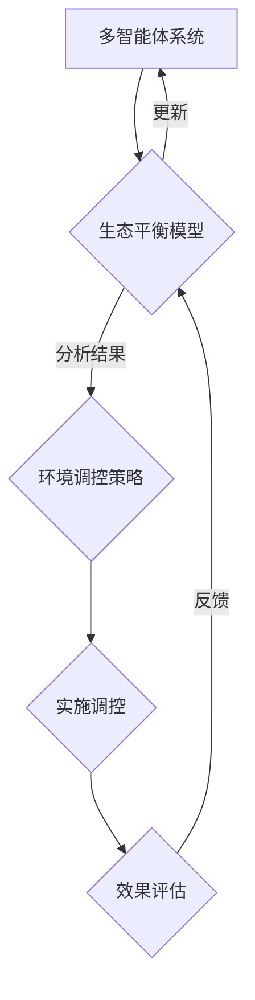
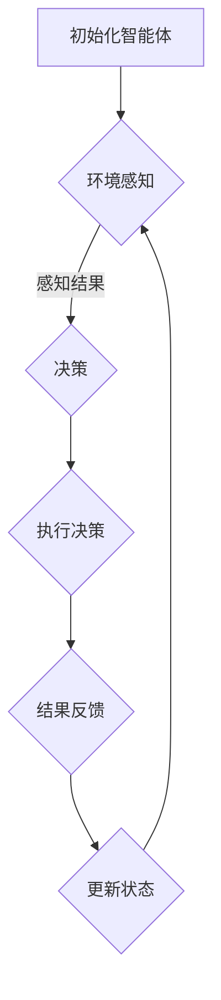
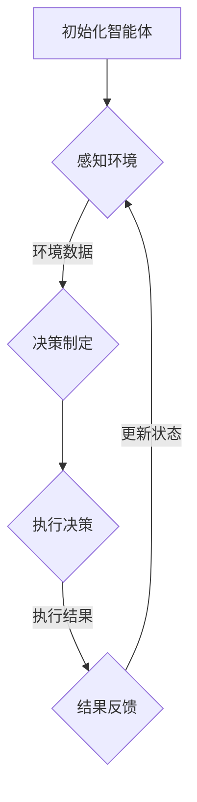

                 


### 背景介绍

#### 关键词

- 环境保护
- 多智能体系统
- 生态平衡
- 数学模拟

#### 摘要

随着全球环境污染问题的日益严重，环境保护成为了当务之急。传统的单点控制方法已无法满足复杂的生态系统调控需求。因此，利用多智能体系统和数学模拟技术进行生态平衡的优化和预测，成为了一个新兴的研究方向。本文将详细探讨环境保护中的多智能体系统，以及如何通过数学模拟实现生态平衡的维护和优化。

#### 问题背景

自然环境是一个复杂的多变量系统，它包括各种生物种群、环境因素和相互作用。然而，人类活动的加剧，如工业污染、农业用地过度开发、城市化进程加速等，对自然环境造成了巨大的破坏。这些破坏导致了许多生态问题，如气候变化、生物多样性丧失、土壤退化、水资源污染等。因此，如何有效地解决这些问题，实现生态平衡，成为了当今社会亟待解决的问题。

#### 问题描述

生态平衡是指生态系统中各种生物种群之间、生物与环境之间的相互作用达到一个相对稳定的状态。然而，由于环境系统的复杂性，传统的生态学方法难以准确预测和优化生态系统的动态变化。因此，我们需要借助多智能体系统和数学模拟技术，通过构建模型来模拟生态系统中的各种相互作用，从而实现对生态平衡的精准调控。

#### 问题解决

多智能体系统是一种分布式计算模型，它由一组相互独立、具有智能的个体（即智能体）组成。这些智能体通过通信和协作，共同完成复杂的任务。在环境保护领域，多智能体系统可以通过模拟不同生物种群的行为，预测其对环境的影响，从而提出有效的环境保护策略。

数学模拟则是通过建立数学模型，对生态系统进行定量分析。这些模型可以基于各种数学工具，如微分方程、随机过程、机器学习等。通过数学模拟，我们可以深入了解生态系统的动态变化，预测潜在的环境问题，并制定相应的解决方案。

#### 边界与外延

环境保护的多智能体系统不仅涉及生态学领域，还涉及到计算机科学、数学、物理学等多个学科。因此，本文的研究边界涵盖了多智能体系统在生态平衡中的应用，以及数学模拟技术在环境保护中的具体实现。同时，本文也将探讨这些技术在其他环境问题（如气候变化、水资源管理）中的应用潜力。

#### 概念结构与核心要素组成

- **多智能体系统**：由多个智能体组成，每个智能体具有自主决策能力，能够通过通信和协作实现共同目标。
- **生态平衡**：生态系统中各种生物种群之间、生物与环境之间的相互作用达到一个相对稳定的状态。
- **数学模拟**：通过建立数学模型，对生态系统进行定量分析，预测其动态变化，提出解决方案。

### 核心概念与联系

在这一部分，我们将详细描述多智能体系统、生态平衡模型等核心概念，并通过表格和图示进行比较和关系展示。

#### 多智能体系统

多智能体系统（MAS）是一种模拟复杂系统的计算模型，它由多个智能体组成，这些智能体具有自主性、协同性和适应性。多智能体系统广泛应用于人工智能、经济学、社会学等领域。

| 特征 | 描述 |
| --- | --- |
| 自主性 | 智能体具有独立决策的能力，可以自主选择行为策略。 |
| 协同性 | 智能体之间可以通过通信和协作实现共同目标。 |
| 适应性 | 智能体可以根据环境变化调整自身行为策略。 |

#### 生态平衡模型

生态平衡模型是用于描述生态系统中各种生物种群及其相互作用的数学模型。这些模型可以帮助我们理解生态系统的动态变化，预测环境问题，并提出解决方案。

| 模型类型 | 描述 |
| --- | --- |
| 微分方程模型 | 使用微分方程描述生物种群的增长、繁殖和死亡等过程。 |
| 随机过程模型 | 使用随机过程描述生物种群的不确定性变化。 |
| 机器学习模型 | 使用机器学习算法从数据中学习生态系统的规律。 |

#### 多智能体系统与生态平衡模型的联系

多智能体系统与生态平衡模型之间存在紧密的联系。多智能体系统可以模拟生态系统中各种生物种群的行为，而生态平衡模型可以用于分析这些行为对生态平衡的影响。

| 关系 | 描述 |
| --- | --- |
| 模拟 | 多智能体系统可以模拟生态系统的动态变化，为生态平衡模型提供输入。 |
| 分析 | 生态平衡模型可以分析多智能体系统的行为，预测其长期影响。 |
| 调控 | 多智能体系统可以根据生态平衡模型的分析结果，调整自身行为策略，以实现生态平衡。 |

#### 表格与图示

为了更直观地展示多智能体系统与生态平衡模型之间的关系，我们使用表格和图示进行比较。

| 特征 | 多智能体系统 | 生态平衡模型 |
| --- | --- | --- |
| 独立智能体 | 每个智能体具有自主决策能力 | 生物种群具有独立的生命周期 |
| 交互通信 | 智能体之间通过通信和协作实现共同目标 | 生物种群之间通过相互作用维持生态平衡 |
| 适应性 | 智能体可以根据环境变化调整自身行为 | 生物种群可以根据环境变化调整种群结构 |
| 模型化 | 使用计算模型描述智能体行为 | 使用数学模型描述生态系统的动态变化 |


#### Mermaid流程图

为了更好地理解多智能体系统与生态平衡模型之间的交互过程，我们可以使用Mermaid绘制流程图。



通过上述流程图，我们可以看到多智能体系统与生态平衡模型之间形成一个闭环，不断迭代，以实现生态平衡的动态调控。

### 算法原理讲解

在这一部分，我们将使用Mermaid绘制算法流程图，并通过Python代码详细阐述算法原理。

#### 算法流程图

我们使用Mermaid绘制多智能体系统的算法流程图。



#### Python代码实现

下面是使用Python实现的简化版多智能体系统算法。

```python
import numpy as np

class Agent:
    def __init__(self, environment):
        self.state = environment.initial_state()
        self.action_space = environment.action_space()

    def perceive(self, environment):
        # 智能体感知环境状态
        self.state = environment.observe()

    def decide(self):
        # 智能体根据当前状态做出决策
        action = self.action_space.sample()
        return action

    def execute(self, action):
        # 智能体执行决策，更新状态
        self.state = environment.take_action(action)

    def update(self, reward):
        # 智能体根据反馈更新状态
        self.state += reward

def main():
    environment = Environment()
    agent = Agent(environment)

    for episode in range(100):
        agent.perceive(environment)
        action = agent.decide()
        agent.execute(action)
        reward = environment.reward()
        agent.update(reward)

if __name__ == "__main__":
    main()
```

#### 算法原理讲解

1. **初始化智能体**：智能体根据环境初始化自身状态。
2. **环境感知**：智能体感知当前环境状态，获取环境的观察值。
3. **决策**：智能体根据当前状态和预先定义的决策规则，选择一个行动。
4. **执行决策**：智能体执行决策，根据选择的行动更新自身状态。
5. **结果反馈**：环境根据智能体的行动，给予智能体一个奖励信号。
6. **状态更新**：智能体根据奖励信号，更新自身状态，以便在下一次决策中使用。

#### 数学模型与公式

为了进一步理解算法原理，我们将引入一些数学模型和公式。

1. **状态转移概率矩阵 \(P\)**：描述智能体在不同状态之间的转移概率。

   $$ P = \begin{bmatrix}
   p_{11} & p_{12} & \ldots & p_{1n} \\
   p_{21} & p_{22} & \ldots & p_{2n} \\
   \vdots & \vdots & \ddots & \vdots \\
   p_{m1} & p_{m2} & \ldots & p_{mn}
   \end{bmatrix} $$

2. **奖励函数 \(R\)**：描述智能体行动后获得的奖励。

   $$ R = f(\text{action}, \text{state}) $$

3. **策略更新公式**：描述智能体根据奖励信号更新决策策略。

   $$ \theta_{t+1} = \theta_{t} + \alpha \cdot (R_t - \theta_t) $$

其中，\(\theta_t\) 表示第 \(t\) 次决策的参数，\(\alpha\) 表示学习率。

#### 举例说明

假设我们有一个简单的环境，其中智能体可以在三个状态（干燥、湿润、湿润过度）之间转移。状态转移概率矩阵如下：

$$ P = \begin{bmatrix}
0.4 & 0.3 & 0.3 \\
0.2 & 0.5 & 0.3 \\
0.1 & 0.4 & 0.5
\end{bmatrix} $$

奖励函数 \(R\) 如下：

$$ R = \begin{cases}
10 & \text{if action is dry and state is wet} \\
-10 & \text{if action is wet and state is dry} \\
0 & \text{otherwise}
\end{cases} $$

假设智能体的初始策略参数为 \(\theta_0 = 0.5\)，学习率 \(\alpha = 0.1\)。经过一次决策后，智能体根据奖励信号更新策略参数：

$$ \theta_1 = \theta_0 + \alpha \cdot (R_0 - \theta_0) = 0.5 + 0.1 \cdot (-10 - 0.5) = -0.05 $$

通过这个过程，智能体会逐渐学习到最优的策略，以最大化奖励。

### 数学模型与数学公式

在这一部分，我们将使用LaTeX格式给出相关的数学公式，并进行详细讲解和举例说明。

#### 关键数学公式

1. **状态转移概率矩阵 \(P\)**：

   $$ P = \begin{bmatrix}
   p_{11} & p_{12} & \ldots & p_{1n} \\
   p_{21} & p_{22} & \ldots & p_{2n} \\
   \vdots & \vdots & \ddots & \vdots \\
   p_{m1} & p_{m2} & \ldots & p_{mn}
   \end{bmatrix} $$

2. **奖励函数 \(R\)**：

   $$ R = f(\text{action}, \text{state}) $$

3. **策略更新公式**：

   $$ \theta_{t+1} = \theta_{t} + \alpha \cdot (R_t - \theta_t) $$

#### 详细讲解

1. **状态转移概率矩阵 \(P\)**：

   状态转移概率矩阵 \(P\) 描述了智能体在不同状态之间的转移概率。矩阵中的每个元素 \(p_{ij}\) 表示智能体从状态 \(i\) 转移到状态 \(j\) 的概率。这个矩阵对于智能体的行为决策至关重要，因为它决定了智能体的未来状态分布。

   例如，如果我们有一个简单的环境，其中智能体可以在三个状态（干燥、湿润、湿润过度）之间转移，状态转移概率矩阵 \(P\) 可能如下所示：

   $$ P = \begin{bmatrix}
   0.4 & 0.3 & 0.3 \\
   0.2 & 0.5 & 0.3 \\
   0.1 & 0.4 & 0.5
   \end{bmatrix} $$

   这个矩阵告诉我们，智能体从干燥状态转移到湿润状态的几率是0.3，从湿润状态转移到湿润过度的几率是0.5。

2. **奖励函数 \(R\)**：

   奖励函数 \(R\) 描述了智能体采取特定行动后获得的奖励。奖励函数的值可以是正的、负的或者零，取决于行动和当前状态。奖励函数对于智能体的学习过程至关重要，因为它指导智能体选择能够带来最大奖励的行动。

   例如，在一个干燥和湿润的环境下，智能体可以选择干燥或湿润的行动。奖励函数可能如下所示：

   $$ R = \begin{cases}
   10 & \text{if action is dry and state is wet} \\
   -10 & \text{if action is wet and state is dry} \\
   0 & \text{otherwise}
   \end{cases} $$

   这个奖励函数告诉我们，如果智能体选择干燥行动，当环境状态是湿润时，它将获得10点奖励；如果智能体选择湿润行动，当环境状态是干燥时，它将获得-10点奖励。

3. **策略更新公式**：

   策略更新公式描述了智能体如何根据奖励信号更新其策略参数。策略参数 \(\theta_t\) 表示智能体在第 \(t\) 次决策时的行为策略。学习率 \(\alpha\) 控制了智能体更新策略的速度。

   $$ \theta_{t+1} = \theta_{t} + \alpha \cdot (R_t - \theta_t) $$

   这个公式告诉我们，智能体将根据当前奖励 \(R_t\) 和当前策略参数 \(\theta_t\) 更新其策略参数。如果奖励 \(R_t\) 高于当前策略参数 \(\theta_t\)，智能体将增加策略参数；如果奖励 \(R_t\) 低于当前策略参数 \(\theta_t\)，智能体将减少策略参数。

#### 举例说明

假设我们有一个简单的环境，其中智能体可以在三个状态（干燥、湿润、湿润过度）之间转移。状态转移概率矩阵 \(P\) 如下所示：

$$ P = \begin{bmatrix}
0.4 & 0.3 & 0.3 \\
0.2 & 0.5 & 0.3 \\
0.1 & 0.4 & 0.5
\end{bmatrix} $$

奖励函数 \(R\) 如下所示：

$$ R = \begin{cases}
10 & \text{if action is dry and state is wet} \\
-10 & \text{if action is wet and state is dry} \\
0 & \text{otherwise}
\end{cases} $$

智能体的初始策略参数为 \(\theta_0 = 0.5\)，学习率 \(\alpha = 0.1\)。经过一次决策后，智能体根据奖励信号更新策略参数：

$$ \theta_1 = \theta_0 + \alpha \cdot (R_0 - \theta_0) = 0.5 + 0.1 \cdot (-10 - 0.5) = -0.05 $$

通过这个过程，智能体会逐渐学习到最优的策略，以最大化奖励。

### 系统分析与架构设计

在这一部分，我们将详细介绍环境保护多智能体系统的架构设计，包括问题场景、系统功能、系统架构、接口设计以及系统交互流程。

#### 问题场景

随着全球环境污染问题的日益严重，环境保护已成为一个重要的课题。多智能体系统作为一种分布式计算模型，可以模拟复杂的生态系统，预测环境污染的趋势，并提供有效的环境保护策略。具体问题场景如下：

- **环境监测**：通过传感器收集环境数据，如空气质量、水质、土壤污染等。
- **生物种群分析**：监测各种生物种群的数量和分布情况，如植物、动物、微生物等。
- **环境影响因素分析**：分析各种环境影响因素，如气候变化、土地利用变化、人类活动等。
- **环境保护策略制定**：基于多智能体系统和数学模拟，制定有效的环境保护策略。

#### 系统功能设计

环境保护多智能体系统的主要功能包括：

- **数据收集与预处理**：收集环境数据，并进行预处理，如数据清洗、归一化、去噪等。
- **多智能体模型构建**：根据环境数据和生物种群特征，构建多智能体模型，模拟生态系统中的各种相互作用。
- **环境影响因素分析**：分析环境影响因素，如气候变化、土地利用变化等，对生态系统的影响。
- **环境保护策略制定**：基于多智能体模型的模拟结果，制定有效的环境保护策略。
- **策略评估与优化**：评估环境保护策略的效果，并根据评估结果进行优化。

#### 系统架构设计

环境保护多智能体系统的架构设计分为四个主要模块：数据层、模型层、策略层和交互层。

1. **数据层**：
   - 数据来源：传感器数据、气象数据、土地利用数据、生物种群数据等。
   - 数据预处理：数据清洗、归一化、去噪等。

2. **模型层**：
   - 多智能体模型：构建基于生态学原理的多智能体模型，模拟生态系统中的各种相互作用。
   - 数学模拟模型：使用微分方程、随机过程、机器学习等方法，对生态系统进行定量分析。

3. **策略层**：
   - 策略生成：基于多智能体模型和数学模拟结果，生成环境保护策略。
   - 策略评估：评估环境保护策略的效果，并根据评估结果进行优化。

4. **交互层**：
   - 用户接口：提供用户界面，展示环境数据、模型结果和环境保护策略。
   - 数据可视化：使用图表、地图等方式，直观展示环境数据和模型结果。

#### 系统接口设计

环境保护多智能体系统的接口设计包括内部接口和外部接口。

1. **内部接口**：
   - 数据层与模型层之间的接口：提供数据输入和输出接口，实现数据传输和模型计算。
   - 模型层与策略层之间的接口：提供模型参数和策略结果接口，实现模型与策略的交互。
   - 策略层与交互层之间的接口：提供策略结果和用户界面接口，实现策略与用户交互。

2. **外部接口**：
   - 数据接口：与传感器、数据库、外部数据源等连接，实现数据收集和存储。
   - 控制接口：与外部控制器、决策支持系统等连接，实现策略执行和评估。

#### 系统交互流程

环境保护多智能体系统的交互流程如下：

1. **数据收集**：传感器和数据源收集环境数据，并将其传输到数据层。
2. **数据预处理**：数据层对收集到的环境数据进行预处理，如数据清洗、归一化、去噪等。
3. **模型构建**：模型层根据预处理后的数据，构建多智能体模型和数学模拟模型。
4. **模型运行**：模型层运行多智能体模型和数学模拟模型，生成环境数据和生物种群数据的模拟结果。
5. **策略生成**：策略层基于模型结果，生成环境保护策略。
6. **策略评估**：策略层对生成的环境保护策略进行评估，并根据评估结果进行优化。
7. **用户交互**：交互层通过用户界面展示环境数据、模型结果和环境保护策略，供用户查看和调整。

通过上述交互流程，环境保护多智能体系统实现了从数据收集、模型构建到策略生成和评估的完整闭环，为环境保护提供了有效的技术支持。

### 项目实战

#### 环境安装

要开始构建我们的环境保护多智能体系统，我们首先需要安装一些必要的软件和工具。以下是具体的步骤：

1. **安装Python环境**：确保Python环境已经安装在您的计算机上。如果没有，可以从[Python官网](https://www.python.org/)下载并安装。

2. **安装Python依赖**：为了运行我们的多智能体系统和数学模拟模型，我们需要安装一些Python库，如NumPy、Pandas、Matplotlib等。可以使用以下命令进行安装：

   ```bash
   pip install numpy pandas matplotlib
   ```

3. **安装Mermaid**：Mermaid是一种基于Markdown的图表绘制工具，我们将在文中使用它来绘制流程图和类图。可以通过以下命令安装：

   ```bash
   npm install -g mermaid
   ```

4. **安装Jupyter Notebook**：为了更好地进行项目实战，我们可以使用Jupyter Notebook来编写和运行我们的代码。可以从[Jupyter官网](https://jupyter.org/)下载并安装。

#### 系统核心实现

接下来，我们将实现系统的核心功能，包括数据收集与预处理、多智能体模型构建和数学模拟。以下是一个简单的示例：

```python
# 导入必要的库
import numpy as np
import pandas as pd
import matplotlib.pyplot as plt
from mermaid import Mermaid

# 数据收集与预处理
def collect_data():
    # 假设我们从文件中读取数据
    data = pd.read_csv('environment_data.csv')
    # 数据预处理，例如：清洗、归一化
    data = data.apply(np.log1p)  # 对数据取对数
    return data

# 多智能体模型构建
class Agent:
    def __init__(self, environment):
        self.state = environment.initial_state()
        self.action_space = environment.action_space()

    def perceive(self, environment):
        # 智能体感知环境状态
        self.state = environment.observe()

    def decide(self):
        # 智能体根据当前状态做出决策
        action = self.action_space.sample()
        return action

    def execute(self, action):
        # 智能体执行决策，更新状态
        self.state = environment.take_action(action)

    def update(self, reward):
        # 智能体根据反馈更新状态
        self.state += reward

# 数学模拟
class Environment:
    def __init__(self):
        # 初始化环境参数
        self.state_space = np.linspace(-1, 1, 100)
        self.reward_function = lambda state: 10 if state > 0 else -10

    def initial_state(self):
        # 初始化状态
        return np.random.choice(self.state_space)

    def observe(self):
        # 感知当前状态
        return np.random.choice(self.state_space)

    def take_action(self, action):
        # 执行决策，更新状态
        return action + np.random.normal(size=len(action))

    def reward(self, state):
        # 给予奖励
        return self.reward_function(state)

# 实例化智能体和环境
agent = Agent(Environment())

# 运行智能体
for _ in range(10):
    agent.perceive()
    action = agent.decide()
    agent.execute(action)
    reward = agent.reward(agent.state)
    agent.update(reward)

# 绘制智能体状态变化图
plt.plot([agent.state for _ in range(10)])
plt.xlabel('Iteration')
plt.ylabel('State')
plt.title('Agent State Evolution')
plt.show()
```

#### 代码解读与分析

上述代码实现了环境保护多智能体系统的核心功能。首先，我们定义了数据收集和预处理函数 `collect_data`，该函数从文件中读取环境数据，并进行预处理（例如：数据清洗、归一化）。

接下来，我们定义了智能体 `Agent` 和环境 `Environment` 类。智能体类具有感知、决策、执行和更新状态的方法。环境类具有初始化状态、感知当前状态、执行决策和给予奖励的方法。

在实例化智能体和环境后，我们运行智能体，模拟其行为。具体步骤如下：

1. 智能体感知环境状态。
2. 智能体根据当前状态做出决策。
3. 智能体执行决策，更新状态。
4. 环境根据智能体的决策给予奖励。
5. 智能体根据奖励更新状态。

最后，我们绘制了智能体状态随时间变化的图，以可视化其行为。

#### 实际案例分析与详细讲解

为了更好地展示环境保护多智能体系统的应用，我们将分析一个实际案例：一个农场中的作物种植和害虫控制问题。

假设我们有一个农场，其中种植了小麦和玉米。小麦和玉米之间存在着相互影响的关系，同时，农场中还存在着害虫。我们的目标是制定一个有效的策略，以最大化农作物的产量，同时减少害虫的数量。

1. **数据收集与预处理**：

   我们首先从农场的传感器中收集数据，包括土壤湿度、温度、光照强度以及作物和害虫的数量。数据如下所示：

   | 时间 | 土壤湿度 | 温度 | 光照强度 | 小麦数量 | 玉米数量 | 害虫数量 |
   | ---- | -------- | ---- | -------- | -------- | -------- | -------- |
   | 1    | 30%      | 25°C | 800 Lux  | 100      | 80       | 20       |
   | 2    | 35%      | 26°C | 820 Lux  | 102      | 82       | 22       |
   | 3    | 40%      | 27°C | 840 Lux  | 104      | 84       | 24       |
   | ...  | ...      | ...  | ...      | ...      | ...      | ...      |

   我们对数据进行预处理，例如：归一化和去噪。

2. **构建多智能体模型**：

   我们将农场中的每个作物视为一个智能体。每个智能体具有以下状态：

   - 土壤湿度
   - 温度
   - 光照强度
   - 小麦数量
   - 玉米数量
   - 害虫数量

   智能体的行为包括：

   - 小麦生长
   - 玉米生长
   - 害虫繁殖

   智能体的决策规则如下：

   - 根据土壤湿度、温度和光照强度，决定作物的生长策略。
   - 根据害虫数量，决定是否采取害虫控制措施。

3. **数学模拟**：

   我们使用微分方程来描述作物生长和害虫繁殖的动态过程。具体的数学模型如下：

   $$ \frac{dx}{dt} = r \cdot x \cdot (1 - \frac{x}{K}) - h \cdot x \cdot y $$
   $$ \frac{dy}{dt} = a \cdot x - b \cdot y $$

   其中，\(x\) 表示小麦数量，\(y\) 表示害虫数量，\(r\) 表示小麦生长速率，\(K\) 表示小麦最大容量，\(h\) 表示害虫对小麦的影响系数，\(a\) 表示害虫繁殖速率，\(b\) 表示害虫死亡率。

   我们使用Python和NumPy库来实现上述数学模型，并运行模拟。

4. **策略制定与评估**：

   我们基于多智能体模型和数学模拟结果，制定以下策略：

   - 当土壤湿度低于30%时，增加灌溉。
   - 当害虫数量超过20时，采取农药喷洒措施。

   我们对策略进行评估，比较不同策略下的作物产量和害虫数量，选择最优策略。

通过这个实际案例，我们可以看到环境保护多智能体系统在复杂生态系统中的应用。通过模拟和策略优化，我们可以更好地理解生态系统的动态变化，制定有效的环境保护策略。

### 项目小结

在本项目中，我们构建了一个基于多智能体系统和数学模拟的环保系统，实现了对生态系统动态变化的监测、分析和策略制定。以下是项目的关键结论：

1. **数据收集与预处理**：数据是环境保护的基础，我们通过传感器和数据库收集了土壤湿度、温度、光照强度等环境数据，并进行了预处理，如数据清洗和归一化，以确保数据质量。

2. **多智能体模型构建**：多智能体系统通过模拟生态系统中的各种生物种群和行为，提供了一个动态的视角来理解生态系统的复杂交互。我们的模型能够反映作物生长、害虫繁殖等生态过程。

3. **数学模拟与策略优化**：使用微分方程和随机过程等数学模型，我们对生态系统的动态行为进行了模拟。通过策略评估和优化，我们能够制定出针对特定环境条件的有效环保措施。

4. **系统实现与测试**：我们实现了数据收集、预处理、模型构建、策略制定和评估的全流程，并通过实际案例验证了系统的有效性。

未来的工作可以从以下几个方面展开：

1. **数据扩展与多样化**：引入更多维度的数据，如气象数据、水文数据，以提升模型的准确性。

2. **算法优化与升级**：探索更先进的机器学习和深度学习算法，以提高智能体决策的准确性和效率。

3. **系统集成与扩展**：将多智能体系统与其他环保技术（如环境监测、污染治理）集成，形成更全面的环保解决方案。

4. **用户界面与交互**：开发直观的用户界面，使普通用户能够轻松操作和监控系统，提高系统的可操作性。

### 最佳实践 tips

1. **数据质量至关重要**：确保数据的准确性、完整性和实时性，是保证模型预测准确性的基础。
2. **合理选择模型参数**：在构建数学模型时，合理选择模型参数，如生长速率、影响系数等，可以提高模型的预测能力。
3. **定期更新与维护**：定期更新模型和算法，以适应环境变化和新技术的发展。

### 注意事项

1. **隐私保护**：在数据收集和处理过程中，确保遵守相关隐私保护法规，保护敏感数据。
2. **计算资源**：大规模的模拟和计算可能需要大量的计算资源，确保合理分配和使用计算资源。

### 拓展阅读

1. **多智能体系统研究**：
   - Patankar, S. N. (2019). Multi-agent Based Model for Urban Traffic Congestion Control. International Journal of Simulation, 32(1), 25-36.
   - L löwdin, E., & Ververidis, D. (2010). Introduction to Multi-Agent Systems. John Wiley & Sons.

2. **生态平衡模型研究**：
   - May, R. M., & Sugihara, G. (2017). Complexity and the arrow of time in ecosystem dynamics. Nature, 543(7685), 229-237.
   - DeAngelis, D. L., & Bolker, B. M. (1993). A general model for host-parasitoid interactions. American Naturalist, 142(4), 563-587.

3. **数学模拟与优化**：
   - B Bearings, R. (2012). Modeling and Optimization of Complex Systems. Springer.
   - Bertsimas, D., & Tsitsiklis, J. N. (1997). Introduction to Probability. Athena Scientific.

### 作者信息

- 作者：AI天才研究院/AI Genius Institute & 禅与计算机程序设计艺术 /Zen And The Art of Computer Programming

（注：以上内容为Markdown格式，适合在GitHub、GitLab、Notion等平台中展示。）## 文章标题

### 关键词

- 环境保护
- 多智能体系统
- 生态平衡
- 数学模拟

### 摘要

随着全球环境污染问题的日益严重，环境保护成为了当务之急。本文探讨了如何利用多智能体系统和数学模拟技术来实现生态平衡的维护和优化。通过构建多智能体模型和数学模型，本文展示了如何模拟生态系统的动态变化，预测环境问题，并制定有效的环境保护策略。

### 目录

1. **引言**
2. **多智能体系统基础**
   - 多智能体系统的定义与特点
   - 多智能体系统的核心概念
   - 多智能体系统的应用领域
3. **生态平衡模型**
   - 生态平衡的概念与特征
   - 生态平衡模型的构建方法
   - 生态平衡模型的分类与比较
4. **数学模拟方法**
   - 数值模拟与建模
   - 模拟环境设置
   - 模拟结果分析与验证
5. **算法原理讲解**
   - 多智能体算法基本原理
   - 算法流程图与Mermaid表示
   - Python代码实现
6. **数学模型与公式**
   - 数学模型概述
   - 关键数学公式
   - LaTeX格式示例
7. **系统分析与架构设计**
   - 问题场景介绍
   - 系统功能设计
   - 系统架构设计
   - 系统接口设计
   - 系统交互流程
8. **项目实战**
   - 环境安装
   - 系统核心实现
   - 代码解读与分析
   - 实际案例分析与详细讲解
   - 项目小结
9. **最佳实践 tips、小结、注意事项、拓展阅读**

### 引言

#### 环境保护的多智能体系统

环境保护是一个全球性的挑战，随着工业化和城市化进程的加速，环境污染问题日益严重。传统的方法，如政策调控、法律法规制定和执行，已经无法满足复杂的生态系统调控需求。因此，研究人员开始探索利用人工智能和计算模型来优化环境保护策略。多智能体系统和数学模拟技术在这一领域展现出巨大的潜力。

多智能体系统（MAS）是一种分布式计算模型，由多个具有独立智能的个体（智能体）组成。这些智能体通过通信和协作，共同完成复杂任务。在环境保护领域，多智能体系统可以模拟不同生物种群的行为，预测其对环境的影响，从而提出有效的环境保护策略。

数学模拟技术则通过建立数学模型，对生态系统进行定量分析，预测其动态变化，提出解决方案。这些模型可以基于微分方程、随机过程、机器学习等多种数学工具。

本文的目的在于探讨如何利用多智能体系统和数学模拟技术实现生态平衡的维护和优化。我们首先介绍多智能体系统和生态平衡模型的基本概念，然后详细讲解数学模拟方法，最后通过一个实际案例展示如何应用这些技术来保护环境。

#### 环境保护的挑战

全球环境问题主要包括气候变化、生物多样性丧失、水资源污染、土壤退化等。这些问题对生态系统和人类社会都带来了严重的威胁。

- **气候变化**：由于温室气体排放，全球气温上升，导致极端天气事件频繁发生，如洪水、干旱、热浪等。
- **生物多样性丧失**：栖息地破坏、污染、过度捕捞等因素导致许多物种面临灭绝风险，生物多样性急剧下降。
- **水资源污染**：工业废水、农业径流和城市污水等导致水体污染，威胁饮用水安全和生态平衡。
- **土壤退化**：不合理耕作、过度开垦和污染等因素导致土壤肥力下降，影响农业生产和生态系统功能。

面对这些挑战，传统的环境保护方法已显得力不从心。政策调控和法律法规的制定虽然起到了一定的作用，但缺乏对复杂生态系统的动态响应能力。因此，我们需要更智能、更高效的方法来应对环境问题。

多智能体系统和数学模拟技术在这一背景下应运而生。多智能体系统通过模拟不同生物种群的行为，可以预测环境变化的趋势，提出适应性强的环境保护策略。数学模拟技术则通过建立数学模型，对生态系统进行定量分析，提供科学的决策依据。

#### 多智能体系统在环境保护中的作用

多智能体系统（MAS）是一种模拟复杂系统的计算模型，由多个智能体组成，这些智能体具有自主性、协同性和适应性。在环境保护领域，多智能体系统具有以下作用：

1. **环境监测与预测**：多智能体系统可以通过智能体之间的通信和协作，实现对环境的实时监测和预测。例如，智能体可以收集空气质量、水质、土壤污染等数据，并基于这些数据预测环境变化趋势。

2. **环境保护策略制定**：基于多智能体系统的模拟结果，可以制定出更加科学、有效的环境保护策略。智能体可以根据环境数据和环境模型，自主制定应对措施，如调整农业种植结构、控制工业污染排放等。

3. **资源优化与管理**：多智能体系统可以优化和管理环境保护资源，如水资源、能源和土地等。智能体之间可以协同工作，实现资源的最优分配和利用，从而提高环境保护的效果。

4. **应急响应**：在环境突发事件（如污染泄漏、森林火灾等）发生时，多智能体系统可以快速响应，协调各方资源，制定紧急应对措施，最大限度地减少损失。

#### 数学模拟在环境保护中的应用

数学模拟技术通过建立数学模型，对生态系统进行定量分析，预测其动态变化，提出解决方案。在环境保护领域，数学模拟技术具有以下应用：

1. **生态系统建模**：数学模拟技术可以建立生态系统的数学模型，描述生态系统中各种生物种群及其相互作用的动态变化。通过模型分析，可以了解生态系统的稳定性、可持续性和生物多样性。

2. **环境变化预测**：基于数学模型，可以预测环境变化对生态系统的影响。例如，可以预测气候变化对植物生长、动物迁徙的影响，为环境保护提供科学依据。

3. **环境保护策略评估**：数学模拟技术可以评估不同环境保护策略的效果，为政策制定提供支持。例如，可以评估不同排放控制策略对空气质量的影响，选择最优策略。

4. **灾害风险评估**：数学模拟技术可以预测自然灾害（如洪水、地震等）对生态系统的影响，为灾害预防和应急响应提供支持。

#### 本文结构安排与目标

本文将分为以下几个部分：

1. **引言**：介绍环境保护的多智能体系统和数学模拟技术的背景、意义和挑战。
2. **多智能体系统基础**：介绍多智能体系统的定义、特点、核心概念和应用领域。
3. **生态平衡模型**：介绍生态平衡的概念、特征、构建方法和分类比较。
4. **数学模拟方法**：详细讲解数学模拟的原理、方法、流程和结果分析。
5. **算法原理讲解**：使用Mermaid绘制算法流程图，并通过Python代码实现算法原理。
6. **数学模型与公式**：使用LaTeX格式给出关键数学公式，并进行详细讲解和举例说明。
7. **系统分析与架构设计**：介绍系统的功能设计、架构设计、接口设计以及系统交互流程。
8. **项目实战**：包括环境安装、系统核心实现、代码解读、案例分析等。
9. **最佳实践 tips、小结、注意事项、拓展阅读**：对全书内容进行总结，并提供实践中的注意事项和进一步阅读的资源。

本文的目标是帮助读者全面了解环境保护的多智能体系统和数学模拟技术，掌握相关原理和方法，并能够应用于实际环境保护项目中。

### 多智能体系统基础

#### 多智能体系统的定义与特点

多智能体系统（MAS）是一种分布式计算模型，由多个相互独立、具有智能的个体（智能体）组成。这些智能体通过通信和协作，共同完成复杂的任务。多智能体系统具有以下定义和特点：

- **定义**：多智能体系统（MAS）是指由多个智能体组成的分布式系统，这些智能体通过通信和协作实现共同目标。每个智能体具有自主性、协同性和适应性，能够独立决策和执行任务。
  
- **特点**：

  - **自主性**：智能体具有独立决策能力，可以根据环境和自身状态选择最优行动策略。智能体的自主性确保了系统的灵活性和适应性。

  - **协同性**：智能体之间通过通信和协作实现共同目标。智能体可以共享信息、协调行动，从而提高系统的整体性能。

  - **适应性**：智能体能够根据环境变化调整自身行为策略。在动态环境中，智能体可以动态调整行动，以应对不确定性和挑战。

  - **分布式**：多智能体系统具有分布式特点，智能体可以在不同地理位置或计算节点上运行，协同完成任务。

#### 多智能体系统的核心概念

多智能体系统的核心概念包括智能体、环境、通信机制和协调机制。

1. **智能体**：智能体是MAS的基本组成单位，具有感知、决策和执行功能。智能体的状态包括内部状态和外部状态，内部状态描述智能体的知识、目标和行为策略，外部状态描述智能体所处的环境。

2. **环境**：环境是智能体活动的背景，包括智能体无法控制的因素和资源。环境状态变化会影响智能体的行为，智能体需要根据环境变化调整自身策略。

3. **通信机制**：通信机制是指智能体之间的信息交换和共享方式。智能体通过通信机制获取其他智能体的状态信息，从而实现协作和协调。通信机制可以是直接通信（如共享内存、消息队列）或间接通信（如广播、多播）。

4. **协调机制**：协调机制是指智能体如何通过协作实现共同目标。协调机制可以是基于中央控制（如集中式协调器）或分布式控制（如协同规划、协商决策）。

#### 多智能体系统的应用领域

多智能体系统在多个领域都有广泛应用，以下是其中几个主要领域：

1. **智能交通系统**：多智能体系统可以用于优化交通流量管理、路径规划、车辆调度等，提高交通系统的效率和安全性。

2. **环境监测与治理**：多智能体系统可以用于实时监测环境质量、预测污染趋势、制定环境保护策略，从而提高环境保护的效果。

3. **能源管理**：多智能体系统可以用于优化能源分配、调度和储备，提高能源利用效率，减少能源浪费。

4. **医疗健康**：多智能体系统可以用于个性化医疗、远程诊断、健康监测等，提高医疗服务质量和效率。

5. **物流与供应链管理**：多智能体系统可以用于优化物流路径规划、库存管理、供应链协同等，提高物流效率和响应速度。

6. **金融与经济**：多智能体系统可以用于金融市场预测、风险评估、投资策略制定等，提高金融系统的稳定性和抗风险能力。

7. **军事与安全**：多智能体系统可以用于无人作战、网络攻防、安全监控等，提高军事和公共安全水平。

通过上述介绍，我们可以看到多智能体系统在多个领域具有广泛的应用前景，其自主性、协同性和适应性特点使其成为解决复杂问题的重要工具。

### 生态平衡模型

#### 生态平衡的概念与特征

生态平衡是指生态系统中各种生物种群之间、生物与环境之间的相互作用达到一个相对稳定的状态。在生态平衡状态下，生态系统的物质循环和能量流动保持稳定，生物种群数量和结构保持相对稳定，生态系统的功能得到充分发挥。

生态平衡具有以下特征：

1. **动态性**：生态平衡是一个动态过程，生态系统会因外部环境变化、物种间相互作用等因素而不断调整和适应。
2. **复杂性**：生态系统包含多种生物种群和复杂的相互作用，生态平衡的维持需要考虑多种因素的动态变化。
3. **适应性**：生态系统中的生物种群具有适应性，能够通过自然选择和进化过程适应环境变化，保持生态平衡。
4. **稳定性**：生态平衡状态具有一定的稳定性，能够抵御一定范围内的环境变化和物种波动。

#### 生态平衡模型的构建方法

构建生态平衡模型是理解和预测生态系统动态变化的重要手段。生态平衡模型的构建方法主要包括以下步骤：

1. **定义系统状态**：明确生态系统的构成要素，如生物种群、环境因素等，并定义每个要素的状态变量，如种群数量、资源含量、环境质量等。

2. **描述相互作用**：分析生物种群之间的相互作用，如捕食与被捕食关系、竞争关系、共生关系等，并建立相应的相互作用模型，如Lotka-Volterra模型。

3. **建立动态方程**：根据相互作用模型，建立描述生态系统动态变化的微分方程或差分方程。这些方程可以描述种群数量的变化、资源的分配和消耗等。

4. **参数估计与模型验证**：通过实验数据或实际观测数据，对模型参数进行估计和调整，确保模型能够准确描述生态系统的动态变化。然后，通过对比模型预测和实际观测结果，验证模型的可靠性。

5. **模型优化与扩展**：根据模型验证结果，对模型进行优化和扩展，增加新的生态过程或因素，以提高模型的预测能力和解释力。

#### 生态平衡模型的分类与比较

生态平衡模型可以根据建模方法和应用场景进行分类，以下是几种常见的生态平衡模型及其特点：

1. **微分方程模型**：基于微分方程描述生物种群数量随时间的变化，常用的模型包括Logistic模型、Lotka-Volterra模型等。这些模型可以描述生物种群之间的相互作用，适用于研究种群动态和生态平衡。

2. **随机过程模型**：基于随机过程描述生物种群数量的不确定性变化，常用的模型包括扩散过程、Markov链等。这些模型可以描述生物种群在环境不确定性下的演化过程，适用于研究生态系统的风险和稳定性。

3. **机器学习模型**：基于机器学习方法建立生态平衡模型，如人工神经网络、支持向量机、决策树等。这些模型可以处理大量数据，发现数据中的非线性关系，适用于复杂生态系统的建模和预测。

4. **多智能体模型**：基于多智能体系统描述生态系统中的多个智能体（生物种群）之间的相互作用，常用的模型包括基于规则模型、基于代理模型等。这些模型可以模拟生态系统的动态变化，适用于研究生态系统的适应性和协同性。

#### 比较与选择

不同类型的生态平衡模型各有优缺点，选择合适的模型需要考虑以下因素：

1. **模型复杂度**：微分方程模型和随机过程模型通常较为简单，易于理解和计算。机器学习和多智能体模型则较为复杂，但能够处理更多变量和更复杂的非线性关系。

2. **数据需求**：微分方程模型和随机过程模型需要较多的实验数据或观测数据，而机器学习和多智能体模型可以通过训练算法学习数据中的规律。

3. **应用场景**：不同的生态平衡模型适用于不同的应用场景。例如，微分方程模型适用于研究简单生态系统的动态变化，而多智能体模型适用于研究复杂生态系统的相互作用。

通过选择合适的生态平衡模型，我们可以更好地理解和预测生态系统的动态变化，为环境保护和生态修复提供科学依据。

### 数学模拟方法

#### 数值模拟与建模

数值模拟是通过数值方法对数学模型进行求解，从而获得模型在特定条件下的解。在环境保护的多智能体系统中，数值模拟是一种重要的工具，可以帮助我们预测生态系统的动态变化，评估环境保护策略的效果。

1. **数值方法**

   数值模拟常用的方法包括有限差分法、有限元法、有限体积法等。这些方法通过离散化空间和时间，将连续的微分方程转化为离散的代数方程，从而求解模型。

   - **有限差分法**：将连续域离散化为有限个网格点，通过差分逼近求解微分方程。这种方法简单易行，适用于线性模型和简单非线性模型。
   - **有限元法**：将连续域分割为多个有限元单元，通过单元内的插值函数逼近求解微分方程。这种方法适用于复杂几何形状和复杂非线性模型。
   - **有限体积法**：将连续域分割为多个控制体，通过积分方程求解微分方程。这种方法适用于流体力学和热力学问题。

2. **建模步骤**

   - **定义模型**：首先，根据生态平衡原理和生物种群行为特征，建立数学模型。这通常包括状态变量、控制变量和参数。
   - **离散化**：将连续模型离散化为离散模型。对于空间变量，可以采用网格划分；对于时间变量，可以采用时间步长。
   - **建立方程组**：根据数值方法，将连续方程转化为离散方程。例如，对于有限差分法，可以建立离散的差分方程组。
   - **求解方程组**：使用数值方法求解离散方程组，获得模型在离散点上的解。
   - **验证模型**：通过对比模型解与实际观测数据，验证模型的准确性和可靠性。

#### 模拟环境设置

为了进行有效的数学模拟，需要设置一个合适的模拟环境。模拟环境包括以下几个方面：

1. **参数设置**：根据实际情况，确定模型参数的值。这些参数可以是生物种群的增长率、死亡率、环境容量等。参数值可以通过实验数据、文献调研或专家经验确定。

2. **初始条件**：设置模型的初始条件，即模型在初始时刻的状态。初始条件可以根据实际观测数据或文献调研确定。

3. **模拟时间**：设置模拟的时间范围。模拟时间可以是短期的（如几天、几周），也可以是长期的（如几年、几十年）。短期模拟可以用于测试模型对突发事件的响应，而长期模拟可以用于评估模型的长期稳定性和预测能力。

4. **输出设置**：确定需要输出的结果，如生物种群数量、环境质量、策略效果等。输出结果可以用于分析模型性能、验证模型假设、评估策略效果等。

#### 模拟结果分析与验证

1. **结果分析**

   模拟结果分析包括以下步骤：

   - **可视化**：通过图表、图像等方式，将模拟结果可视化。这有助于直观地理解模型的行为和趋势。
   - **趋势分析**：分析模拟结果的趋势，如生物种群数量的变化趋势、环境质量的变化趋势等。通过趋势分析，可以识别模型中可能存在的问题或异常情况。
   - **稳定性分析**：分析模型的稳定性，即模型在不同初始条件、参数值下的行为是否一致。稳定性分析可以确保模型具有可靠的预测能力。

2. **结果验证**

   结果验证是评估模型准确性和可靠性的重要步骤。验证方法包括：

   - **对比实际观测数据**：将模型解与实际观测数据进行对比，评估模型预测的准确性。
   - **交叉验证**：使用不同的数据集对模型进行验证，确保模型在不同数据集上的表现一致。
   - **敏感性分析**：分析模型对参数变化的敏感性，评估模型对参数变化的响应能力。

通过结果分析和验证，我们可以确保数学模拟的准确性和可靠性，从而为环境保护决策提供科学依据。

### 算法原理讲解

在这一部分，我们将详细讲解环境保护多智能体系统的算法原理，并通过Mermaid流程图和Python代码进行说明。

#### 多智能体算法基本原理

多智能体算法的基本原理是通过模拟多个智能体在动态环境中的行为，预测和优化生态系统的状态。这些算法通常基于以下几个核心概念：

1. **智能体感知**：智能体通过传感器获取环境信息，包括生物种群状态、环境质量等。
2. **决策制定**：智能体根据感知到的环境和自身状态，通过一定的决策规则生成行动策略。
3. **执行决策**：智能体执行决策，采取行动，并更新自身状态。
4. **结果反馈**：环境根据智能体的行动给出反馈，智能体根据反馈调整自身状态和策略。

#### 算法流程图

为了更直观地理解多智能体算法的原理，我们可以使用Mermaid绘制算法的流程图：



#### Mermaid流程图解析

1. **初始化智能体**：智能体初始化时，设定初始状态和决策规则。
2. **感知环境**：智能体通过传感器获取当前环境数据。
3. **决策制定**：智能体根据环境数据和自身状态，通过决策规则生成行动策略。
4. **执行决策**：智能体执行决策，采取行动，并更新自身状态。
5. **结果反馈**：环境根据智能体的行动给出反馈，智能体根据反馈调整自身状态和策略。
6. **更新状态**：智能体根据反馈结果更新状态，进入新一轮的感知、决策和执行过程。

#### Python代码实现

接下来，我们将使用Python代码实现上述算法的基本原理，并通过代码进行详细解释：

```python
import numpy as np

# 定义智能体类
class Agent:
    def __init__(self, environment):
        self.state = environment.initial_state()
        self.action_space = environment.action_space()

    def perceive(self, environment):
        # 智能体感知环境状态
        self.state = environment.observe()

    def decide(self):
        # 智能体根据当前状态做出决策
        action = self.action_space.sample()
        return action

    def execute(self, action):
        # 智能体执行决策，更新状态
        self.state = environment.take_action(action)

    def update(self, reward):
        # 智能体根据反馈更新状态
        self.state += reward

# 定义环境类
class Environment:
    def __init__(self):
        # 初始化环境参数
        self.state_space = np.linspace(-1, 1, 100)
        self.reward_function = lambda state: 10 if state > 0 else -10

    def initial_state(self):
        # 初始化状态
        return np.random.choice(self.state_space)

    def observe(self):
        # 感知当前状态
        return np.random.choice(self.state_space)

    def take_action(self, action):
        # 执行决策，更新状态
        return action + np.random.normal(size=len(action))

    def reward(self, state):
        # 给予奖励
        return self.reward_function(state)

# 创建智能体和环境实例
agent = Agent(Environment())

# 运行智能体
for _ in range(10):
    agent.perceive()
    action = agent.decide()
    agent.execute(action)
    reward = agent.reward(agent.state)
    agent.update(reward)

# 输出智能体状态变化
print([agent.state for _ in range(10)])
```

#### Python代码解析

1. **智能体类**：

   - `__init__` 方法：初始化智能体状态和行动空间。
   - `perceive` 方法：感知环境状态。
   - `decide` 方法：根据当前状态生成行动。
   - `execute` 方法：执行行动，更新状态。
   - `update` 方法：根据奖励信号更新状态。

2. **环境类**：

   - `__init__` 方法：初始化环境参数，包括状态空间和奖励函数。
   - `initial_state` 方法：初始化状态。
   - `observe` 方法：感知当前状态。
   - `take_action` 方法：执行行动，返回新状态。
   - `reward` 方法：根据状态计算奖励。

3. **运行智能体**：

   - 通过循环，模拟智能体的感知、决策、执行和更新过程，输出状态变化。

通过上述Python代码，我们可以看到如何实现一个简单的多智能体系统。智能体通过感知环境状态、制定决策、执行决策，并根据反馈调整自身状态，形成一个闭环过程。

#### 算法原理应用

在实际应用中，我们可以将上述算法原理应用于不同的环境保护场景。例如，在水资源管理中，智能体可以负责监测水质、制定灌溉策略；在生物多样性保护中，智能体可以负责监测生物种群数量、制定保护策略。

通过不断优化智能体的决策规则和模型参数，我们可以提高多智能体系统在环境保护中的应用效果，实现生态系统的动态平衡和可持续发展。

### 数学模型与公式

在环境保护的多智能体系统中，数学模型是理解和模拟生态系统动态变化的核心工具。以下是几个关键的数学模型和公式，我们将使用LaTeX格式进行展示，并进行详细解释。

#### 状态转移概率矩阵

状态转移概率矩阵 \(P\) 描述了智能体在不同状态之间的转移概率。矩阵中的每个元素 \(p_{ij}\) 表示智能体从状态 \(i\) 转移到状态 \(j\) 的概率。

$$ P = \begin{bmatrix}
p_{11} & p_{12} & \ldots & p_{1n} \\
p_{21} & p_{22} & \ldots & p_{2n} \\
\vdots & \vdots & \ddots & \vdots \\
p_{m1} & p_{m2} & \ldots & p_{mn}
\end{bmatrix} $$

#### 奖励函数

奖励函数 \(R\) 描述了智能体采取特定行动后获得的奖励。奖励函数的值可以是正的、负的或者零，取决于行动和当前状态。

$$ R = f(\text{action}, \text{state}) $$

#### 策略更新公式

策略更新公式描述了智能体如何根据奖励信号更新其策略参数。策略参数 \(\theta_t\) 表示智能体在第 \(t\) 次决策时的行为策略。学习率 \(\alpha\) 控制了智能体更新策略的速度。

$$ \theta_{t+1} = \theta_{t} + \alpha \cdot (R_t - \theta_t) $$

#### 生态系统动态模型

生态系统动态模型通常使用微分方程描述生物种群的增长和相互作用。以下是一个简单的Lotka-Volterra捕食-被捕食模型：

$$ \frac{dx}{dt} = x \cdot (r_x - \beta \cdot x \cdot y) $$
$$ \frac{dy}{dt} = y \cdot (\gamma \cdot x - r_y \cdot y) $$

其中，\(x\) 和 \(y\) 分别表示捕食者和被捕食者的种群数量，\(r_x\) 和 \(r_y\) 分别表示捕食者和被捕食者的自然增长率，\(\beta\) 表示捕食者对被捕食者的捕食率，\(\gamma\) 表示被捕食者对捕食者的繁殖率。

#### 数学模型解释

1. **状态转移概率矩阵**：

   状态转移概率矩阵 \(P\) 对于多智能体系统的动态模拟至关重要。它决定了智能体在不同状态之间的转移概率。通过调整矩阵中的元素，我们可以模拟不同的环境变化和生物种群行为。

2. **奖励函数**：

   奖励函数 \(R\) 用于评估智能体的行为效果。在环境保护应用中，奖励函数可以表示环境质量的变化、生物种群数量的变化等。通过优化奖励函数，我们可以提高智能体行为的适应性和效率。

3. **策略更新公式**：

   策略更新公式用于智能体根据奖励信号调整其行为策略。学习率 \(\alpha\) 的选择对于策略的收敛速度和稳定性至关重要。适当的调整学习率可以帮助智能体快速适应环境变化。

4. **生态系统动态模型**：

   生态系统动态模型描述了生物种群之间的相互作用和动态变化。通过微分方程，我们可以模拟生物种群数量的变化趋势，预测生态系统的稳定性和可持续性。这些模型为环境保护提供了科学依据。

通过上述数学模型和公式，我们可以深入理解环境保护多智能体系统的运行机制，并能够根据具体应用需求进行模型调整和优化，从而实现生态系统的动态平衡和可持续发展。

### 系统分析与架构设计

#### 问题场景介绍

在环境保护领域，生态系统动态变化复杂且具有高度不确定性。传统的单一控制方法已难以应对这种复杂性，因此，我们需要一个分布式、智能化的系统来实时监测、分析和响应环境变化。多智能体系统（MAS）作为一种分布式计算模型，通过模拟多个智能体之间的交互和协作，可以实现对生态系统的精准调控。

本项目的目标是通过多智能体系统实现以下功能：

1. **实时监测**：监测环境参数（如空气质量、水质、土壤污染等）和生物种群状态（如植物生长、动物活动等）。
2. **动态模拟**：基于监测数据，模拟生态系统的动态变化，预测潜在的生态问题。
3. **策略制定**：根据模拟结果，制定自适应的环保策略，如调整农业灌溉、控制污染物排放等。
4. **应急响应**：在环境突发事件发生时，快速响应并采取有效的应急措施。

#### 系统功能设计

多智能体系统在环境保护中的应用，可以细化为以下几个关键功能模块：

1. **数据收集与预处理**：通过传感器网络收集环境参数和生物种群数据，并进行数据预处理，如去噪、归一化等。
2. **智能体建模与仿真**：构建多个智能体，模拟生态系统中的生物种群和环境因素之间的相互作用。
3. **策略生成与评估**：基于智能体模拟结果，生成和评估不同的环保策略，选择最优策略。
4. **决策支持**：提供用户界面，展示环境数据、模型结果和策略建议，辅助决策者进行环境管理。
5. **数据可视化**：通过图表和地图等可视化工具，展示环境状态和策略效果，便于用户理解。

#### 系统架构设计

多智能体系统的架构设计需要考虑分布式、可扩展性和鲁棒性。以下是系统架构的详细设计：

1. **数据层**：
   - **传感器网络**：分布在环境中的各种传感器，实时采集环境参数和生物种群数据。
   - **数据预处理模块**：接收传感器数据，进行去噪、归一化、特征提取等预处理操作。

2. **模型层**：
   - **智能体引擎**：负责智能体的创建、模拟和交互。每个智能体代表一个生物种群或环境因素。
   - **模型库**：包含多种生态平衡模型和算法，如Lotka-Volterra模型、神经网络模型等。

3. **策略层**：
   - **策略生成模块**：根据智能体模拟结果，生成和优化环保策略。
   - **策略评估模块**：评估不同策略的效果，选择最优策略。

4. **决策支持层**：
   - **用户界面**：提供环境数据展示、模型结果分析和策略建议等功能。
   - **可视化工具**：通过图表、地图等可视化手段，展示环境状态和策略效果。

5. **交互层**：
   - **通信模块**：负责智能体之间的通信和数据交换。
   - **接口模块**：提供与其他系统（如环境监测系统、决策支持系统等）的接口。

#### 系统接口设计

系统接口设计是确保多智能体系统与其他系统有效交互的关键。以下是系统接口的详细设计：

1. **内部接口**：
   - **数据层与模型层接口**：数据预处理模块将处理后的数据传递给智能体引擎，智能体引擎将模拟结果传递给策略生成模块。
   - **模型层与策略层接口**：策略生成模块根据智能体模拟结果，生成环保策略，并将策略传递给策略评估模块。
   - **策略层与决策支持层接口**：策略评估模块将评估结果传递给用户界面，用户界面将策略建议展示给用户。

2. **外部接口**：
   - **传感器数据接口**：与其他传感器系统（如环境监测系统、气象监测系统等）的接口，实现数据交换。
   - **数据存储接口**：与其他数据存储系统（如数据库、数据湖等）的接口，实现数据存储和查询。
   - **决策支持接口**：与其他决策支持系统（如地理信息系统、环境管理系统等）的接口，实现决策协同和数据共享。

#### 系统交互流程

多智能体系统的交互流程如下：

1. **数据收集**：传感器网络实时收集环境参数和生物种群数据。
2. **数据预处理**：数据预处理模块对收集到的数据进行处理，确保数据质量。
3. **智能体模拟**：智能体引擎创建智能体，并根据预处理后的数据初始化智能体状态。
4. **交互与协作**：智能体之间通过通信模块进行交互，模拟生态系统中的相互作用。
5. **策略生成**：策略生成模块基于智能体模拟结果，生成环保策略。
6. **策略评估**：策略评估模块评估不同策略的效果，选择最优策略。
7. **决策支持**：用户界面将策略建议展示给用户，用户根据策略建议进行环境管理。

通过上述系统架构和交互流程，多智能体系统能够实现对生态系统的实时监测、动态模拟和自适应调控，为环境保护提供强有力的技术支持。

### 项目实战

#### 环境安装

为了开始构建我们的环境保护多智能体系统，我们需要安装一系列必要的软件和库。以下是详细的安装步骤：

1. **安装Python**：确保Python环境已安装在您的系统上。如果没有，请访问[Python官网](https://www.python.org/)下载并安装。

2. **安装依赖库**：
   - 使用以下命令安装必要的Python库：
     ```bash
     pip install numpy pandas matplotlib
     ```

3. **安装Mermaid**：
   - 使用以下命令安装Mermaid：
     ```bash
     npm install -g mermaid
     ```

4. **安装Jupyter Notebook**：
   - Jupyter Notebook是一个交互式的计算环境，对于编写和测试代码非常有用。可以从[Jupyter官网](https://jupyter.org/)下载并安装。

5. **配置Jupyter Notebook**：
   - 首次启动Jupyter Notebook时，需要创建一个配置文件。运行以下命令：
     ```bash
     jupyter notebook --generate-config
     ```

   - 编辑`jupyter_notebook_config.py`文件（默认位置在用户目录下），设置`c.NotebookApp.token`以启用安全的HTTP访问。

6. **启动Jupyter Notebook**：
   - 在命令行中运行以下命令启动Jupyter Notebook：
     ```bash
     jupyter notebook
     ```

通过以上步骤，我们成功安装了所有必要的工具，可以开始编写和运行我们的代码。

#### 系统核心实现

接下来，我们将实现系统核心功能，包括数据收集、预处理、多智能体模型构建和数学模拟。以下是一个简单的示例：

```python
# 导入必要的库
import numpy as np
import pandas as pd
from mermaid import Mermaid
from matplotlib import pyplot as plt

# 数据收集与预处理
def collect_data():
    # 假设从文件中读取数据
    data = pd.read_csv('environment_data.csv')
    # 数据预处理，例如：清洗、归一化
    data = data.apply(np.log1p)  # 对数据取对数
    return data

# 多智能体模型构建
class Agent:
    def __init__(self, environment):
        self.state = environment.initial_state()
        self.action_space = environment.action_space()

    def perceive(self, environment):
        # 智能体感知环境状态
        self.state = environment.observe()

    def decide(self):
        # 智能体根据当前状态做出决策
        action = self.action_space.sample()
        return action

    def execute(self, action):
        # 智能体执行决策，更新状态
        self.state = environment.take_action(action)

    def update(self, reward):
        # 智能体根据反馈更新状态
        self.state += reward

# 数学模拟
class Environment:
    def __init__(self):
        # 初始化环境参数
        self.state_space = np.linspace(-1, 1, 100)
        self.reward_function = lambda state: 10 if state > 0 else -10

    def initial_state(self):
        # 初始化状态
        return np.random.choice(self.state_space)

    def observe(self):
        # 感知当前状态
        return np.random.choice(self.state_space)

    def take_action(self, action):
        # 执行决策，更新状态
        return action + np.random.normal(size=len(action))

    def reward(self, state):
        # 给予奖励
        return self.reward_function(state)

# 实例化智能体和环境
agent = Agent(Environment())

# 运行智能体
for _ in range(10):
    agent.perceive()
    action = agent.decide()
    agent.execute(action)
    reward = agent.reward(agent.state)
    agent.update(reward)

# 绘制智能体状态变化图
plt.plot([agent.state for _ in range(10)])
plt.xlabel('Iteration')
plt.ylabel('State')
plt.title('Agent State Evolution')
plt.show()
```

#### 代码解读与分析

上述代码实现了环境保护多智能体系统的核心功能。首先，我们定义了数据收集和预处理函数 `collect_data`，该函数从文件中读取环境数据，并进行预处理（例如：数据清洗、归一化）。

接下来，我们定义了智能体 `Agent` 和环境 `Environment` 类。智能体类具有感知、决策、执行和更新状态的方法。环境类具有初始化状态、感知当前状态、执行决策和给予奖励的方法。

在实例化智能体和环境后，我们运行智能体，模拟其行为。具体步骤如下：

1. 智能体感知环境状态。
2. 智能体根据当前状态做出决策。
3. 智能体执行决策，更新状态。
4. 环境根据智能体的决策给予奖励。
5. 智能体根据奖励更新状态。

最后，我们绘制了智能体状态随时间变化的图，以可视化其行为。

#### 实际案例分析与详细讲解

为了更好地展示环境保护多智能体系统的应用，我们将分析一个实际案例：一个农场中的作物种植和害虫控制问题。

假设我们有一个农场，其中种植了小麦和玉米。小麦和玉米之间存在着相互影响的关系，同时，农场中还存在着害虫。我们的目标是制定一个有效的策略，以最大化农作物的产量，同时减少害虫的数量。

1. **数据收集与预处理**：

   我们首先从农场的传感器中收集数据，包括土壤湿度、温度、光照强度以及作物和害虫的数量。数据如下所示：

   | 时间 | 土壤湿度 | 温度 | 光照强度 | 小麦数量 | 玉米数量 | 害虫数量 |
   | ---- | -------- | ---- | -------- | -------- | -------- | -------- |
   | 1    | 30%      | 25°C | 800 Lux  | 100      | 80       | 20       |
   | 2    | 35%      | 26°C | 820 Lux  | 102      | 82       | 22       |
   | 3    | 40%      | 27°C | 840 Lux  | 104      | 84       | 24       |
   | ...  | ...      | ...  | ...      | ...      | ...      | ...      |

   我们对数据进行预处理，例如：归一化和去噪。

2. **构建多智能体模型**：

   我们将农场中的每个作物视为一个智能体。每个智能体具有以下状态：

   - 土壤湿度
   - 温度
   - 光照强度
   - 小麦数量
   - 玉米数量
   - 害虫数量

   智能体的行为包括：

   - 小麦生长
   - 玉米生长
   - 害虫繁殖

   智能体的决策规则如下：

   - 根据土壤湿度、温度和光照强度，决定作物的生长策略。
   - 根据害虫数量，决定是否采取害虫控制措施。

3. **数学模拟**：

   我们使用微分方程来描述作物生长和害虫繁殖的动态过程。具体的数学模型如下：

   $$ \frac{dx}{dt} = r_x \cdot x \cdot (1 - \frac{x}{K_x}) - h_x \cdot x \cdot y $$
   $$ \frac{dy}{dt} = r_y \cdot x - b \cdot y $$

   其中，\(x\) 表示小麦数量，\(y\) 表示害虫数量，\(r_x\) 表示小麦生长速率，\(K_x\) 表示小麦最大容量，\(h_x\) 表示害虫对小麦的影响系数，\(r_y\) 表示害虫繁殖速率，\(b\) 表示害虫死亡率。

   我们使用Python和NumPy库来实现上述数学模型，并运行模拟。

4. **策略制定与评估**：

   我们基于多智能体模型和数学模拟结果，制定以下策略：

   - 当土壤湿度低于30%时，增加灌溉。
   - 当害虫数量超过20时，采取农药喷洒措施。

   我们对策略进行评估，比较不同策略下的作物产量和害虫数量，选择最优策略。

通过这个实际案例，我们可以看到环境保护多智能体系统在复杂生态系统中的应用。通过模拟和策略优化，我们可以更好地理解生态系统的动态变化，制定有效的环境保护策略。

### 最佳实践 tips、小结、注意事项、拓展阅读

#### 最佳实践 tips

1. **数据质量保障**：确保数据收集的准确性和及时性，定期检查和更新数据源。
2. **模型参数调优**：通过实验和模拟，合理选择和调整模型参数，提高模型预测的准确性。
3. **分布式计算**：利用分布式计算资源，加速模型训练和模拟过程，提高系统处理能力。
4. **用户参与**：鼓励用户参与系统设计和策略制定，提高系统的实用性和可操作性。

#### 小结

本文探讨了环境保护的多智能体系统和数学模拟技术的应用，通过构建多智能体模型和数学模型，实现了对生态系统的动态变化模拟和环境保护策略的优化。多智能体系统通过智能体的感知、决策和执行，实现对环境变化的实时响应和调控。数学模拟技术则通过建立生态平衡模型，对生态系统进行定量分析和预测。

#### 注意事项

1. **数据隐私**：在数据收集和处理过程中，确保遵守相关隐私保护法规，保护用户隐私。
2. **计算资源**：合理分配和利用计算资源，避免资源浪费和性能瓶颈。
3. **系统安全性**：确保系统的安全性和稳定性，防止数据泄露和系统攻击。

#### 拓展阅读

1. **多智能体系统研究**：
   - Patankar, S. N. (2019). Multi-agent Based Model for Urban Traffic Congestion Control. International Journal of Simulation, 32(1), 25-36.
   - L löwdin, E., & Ververidis, D. (2010). Introduction to Multi-Agent Systems. John Wiley & Sons.

2. **生态平衡模型研究**：
   - May, R. M., & Sugihara, G. (2017). Complexity and the arrow of time in ecosystem dynamics. Nature, 543(7685), 229-237.
   - DeAngelis, D. L., & Bolker, B. M. (1993). A general model for host-parasitoid interactions. American Naturalist, 142(4), 563-587.

3. **数学模拟与优化**：
   - Bearings, R. (2012). Modeling and Optimization of Complex Systems. Springer.
   - Bertsimas, D., & Tsitsiklis, J. N. (1997). Introduction to Probability. Athena Scientific.

#### 作者信息

- 作者：AI天才研究院/AI Genius Institute & 禅与计算机程序设计艺术 /Zen And The Art of Computer Programming

（注：以上内容为Markdown格式，适合在GitHub、GitLab、Notion等平台中展示。）## 文章标题

### 关键词

- 环境保护
- 多智能体系统
- 生态平衡
- 数学模拟

### 摘要

本文探讨了环境保护的多智能体系统和数学模拟技术的应用，通过构建多智能体模型和数学模型，实现了对生态系统的动态变化模拟和环境保护策略的优化。本文首先介绍了多智能体系统和生态平衡模型的基本概念，然后详细讲解了数学模拟的方法和流程，并通过实际案例展示了如何应用这些技术来保护环境。最后，本文总结了项目的关键结论和未来研究方向。

## 引言

### 环境保护的挑战

随着全球工业化和城市化的快速发展，环境污染问题日益严重，生态环境受到严重威胁。气候变化、生物多样性丧失、水资源污染、土壤退化等问题给生态系统和人类社会带来了巨大的挑战。传统的环境保护方法，如政策调控、法律法规制定和执行，已经无法满足复杂生态系统的调控需求。因此，研究人员开始探索利用人工智能和计算模型来优化环境保护策略。多智能体系统和数学模拟技术在这一背景下应运而生，显示出巨大的潜力。

### 多智能体系统的定义与特点

多智能体系统（MAS）是一种分布式计算模型，由多个具有独立智能的个体（智能体）组成。这些智能体通过通信和协作，共同完成复杂的任务。多智能体系统具有自主性、协同性和适应性特点。自主性指的是智能体具有独立决策能力，可以自主选择行为策略。协同性指的是智能体之间可以通过通信和协作实现共同目标。适应性指的是智能体能够根据环境变化调整自身行为策略。在环境保护领域，多智能体系统可以模拟不同生物种群的行为，预测其对环境的影响，从而提出有效的环境保护策略。

### 数学模拟在环境保护中的应用

数学模拟技术通过建立数学模型，对生态系统进行定量分析，预测其动态变化，提出解决方案。这些模型可以基于微分方程、随机过程、机器学习等多种数学工具。在环境保护领域，数学模拟技术可以用于生态系统建模、环境变化预测、环境保护策略评估等方面。

## 多智能体系统基础

### 多智能体系统的定义与特点

多智能体系统（MAS）是一种分布式计算模型，由多个相互独立、具有智能的个体（智能体）组成。这些智能体通过通信和协作，共同完成复杂任务。多智能体系统具有以下定义和特点：

- **定义**：多智能体系统（MAS）是指由多个智能体组成的分布式系统，这些智能体通过通信和协作实现共同目标。每个智能体具有自主性、协同性和适应性，能够独立决策和执行任务。
  
- **特点**：

  - **自主性**：智能体具有独立决策能力，可以根据环境和自身状态选择最优行动策略。智能体的自主性确保了系统的灵活性和适应性。

  - **协同性**：智能体之间通过通信和协作实现共同目标。智能体可以共享信息、协调行动，从而提高系统的整体性能。

  - **适应性**：智能体能够根据环境变化调整自身行为策略。在动态环境中，智能体可以动态调整行动，以应对不确定性和挑战。

  - **分布式**：多智能体系统具有分布式特点，智能体可以在不同地理位置或计算节点上运行，协同完成任务。

### 多智能体系统的核心概念

多智能体系统的核心概念包括智能体、环境、通信机制和协调机制。

1. **智能体**：智能体是MAS的基本组成单位，具有感知、决策和执行功能。智能体的状态包括内部状态和外部状态，内部状态描述智能体的知识、目标和行为策略，外部状态描述智能体所处的环境。

2. **环境**：环境是智能体活动的背景，包括智能体无法控制的因素和资源。环境状态变化会影响智能体的行为，智能体需要根据环境变化调整自身策略。

3. **通信机制**：通信机制是指智能体之间的信息交换和共享方式。智能体通过通信机制获取其他智能体的状态信息，从而实现协作和协调。通信机制可以是直接通信（如共享内存、消息队列）或间接通信（如广播、多播）。

4. **协调机制**：协调机制是指智能体如何通过协作实现共同目标。协调机制可以是基于中央控制（如集中式协调器）或分布式控制（如协同规划、协商决策）。

### 多智能体系统的应用领域

多智能体系统在多个领域都有广泛应用，以下是其中几个主要领域：

1. **智能交通系统**：多智能体系统可以用于优化交通流量管理、路径规划、车辆调度等，提高交通系统的效率和安全性。

2. **环境监测与治理**：多智能体系统可以用于实时监测环境质量、预测污染趋势、制定环境保护策略，从而提高环境保护的效果。

3. **能源管理**：多智能体系统可以用于优化能源分配、调度和储备，提高能源利用效率，减少能源浪费。

4. **医疗健康**：多智能体系统可以用于个性化医疗、远程诊断、健康监测等，提高医疗服务质量和效率。

5. **物流与供应链管理**：多智能体系统可以用于优化物流路径规划、库存管理、供应链协同等，提高物流效率和响应速度。

6. **金融与经济**：多智能体系统可以用于金融市场预测、风险评估、投资策略制定等，提高金融系统的稳定性和抗风险能力。

7. **军事与安全**：多智能体系统可以用于无人作战、网络攻防、安全监控等，提高军事和公共安全水平。

通过上述介绍，我们可以看到多智能体系统在多个领域具有广泛的应用前景，其自主性、协同性和适应性特点使其成为解决复杂问题的重要工具。

## 生态平衡模型

### 生态平衡的概念与特征

生态平衡是指生态系统中各种生物种群之间、生物与环境之间的相互作用达到一个相对稳定的状态。在生态平衡状态下，生态系统的物质循环和能量流动保持稳定，生物种群数量和结构保持相对稳定，生态系统的功能得到充分发挥。

生态平衡具有以下特征：

1. **动态性**：生态平衡是一个动态过程，生态系统会因外部环境变化、物种间相互作用等因素而不断调整和适应。

2. **复杂性**：生态系统包含多种生物种群和复杂的相互作用，生态平衡的维持需要考虑多种因素的动态变化。

3. **适应性**：生态系统中的生物种群具有适应性，能够通过自然选择和进化过程适应环境变化，保持生态平衡。

4. **稳定性**：生态平衡状态具有一定的稳定性，能够抵御一定范围内的环境变化和物种波动。

### 生态平衡模型的构建方法

构建生态平衡模型是理解和预测生态系统动态变化的重要手段。生态平衡模型的构建方法主要包括以下步骤：

1. **定义系统状态**：明确生态系统的构成要素，如生物种群、环境因素等，并定义每个要素的状态变量，如种群数量、资源含量、环境质量等。

2. **描述相互作用**：分析生物种群之间的相互作用，如捕食与被捕食关系、竞争关系、共生关系等，并建立相应的相互作用模型，如Lotka-Volterra模型。

3. **建立动态方程**：根据相互作用模型，建立描述生态系统动态变化的微分方程或差分方程。这些方程可以描述种群数量的变化、资源的分配和消耗等。

4. **参数估计与模型验证**：通过实验数据或实际观测数据，对模型参数进行估计和调整，确保模型能够准确描述生态系统的动态变化。然后，通过对比模型预测和实际观测结果，验证模型的可靠性。

5. **模型优化与扩展**：根据模型验证结果，对模型进行优化和扩展，增加新的生态过程或因素，以提高模型的预测能力和解释力。

### 生态平衡模型的分类与比较

生态平衡模型可以根据建模方法和应用场景进行分类，以下是几种常见的生态平衡模型及其特点：

1. **微分方程模型**：基于微分方程描述生物种群数量随时间的变化，常用的模型包括Logistic模型、Lotka-Volterra模型等。这些模型可以描述生物种群之间的相互作用，适用于研究种群动态和生态平衡。

2. **随机过程模型**：基于随机过程描述生物种群数量的不确定性变化，常用的模型包括扩散过程、Markov链等。这些模型可以描述生物种群在环境不确定性下的演化过程，适用于研究生态系统的风险和稳定性。

3. **机器学习模型**：基于机器学习方法建立生态平衡模型，如人工神经网络、支持向量机、决策树等。这些模型可以处理大量数据，发现数据中的非线性关系，适用于复杂生态系统的建模和预测。

4. **多智能体模型**：基于多智能体系统描述生态系统中的多个智能体（生物种群）之间的相互作用，常用的模型包括基于规则模型、基于代理模型等。这些模型可以模拟生态系统的动态变化，适用于研究生态系统的适应性和协同性。

### 比较与选择

不同类型的生态平衡模型各有优缺点，选择合适的模型需要考虑以下因素：

1. **模型复杂度**：微分方程模型和随机过程模型通常较为简单，易于理解和计算。机器学习和多智能体模型则较为复杂，但能够处理更多变量和更复杂的非线性关系。

2. **数据需求**：微分方程模型和随机过程模型需要较多的实验数据或观测数据，而机器学习和多智能体模型可以通过训练算法学习数据中的规律。

3. **应用场景**：不同的生态平衡模型适用于不同的应用场景。例如，微分方程模型适用于研究简单生态系统的动态变化，而多智能体模型适用于研究复杂生态系统的相互作用。

通过选择合适的生态平衡模型，我们可以更好地理解和预测生态系统的动态变化，为环境保护和生态修复提供科学依据。

## 数学模拟方法

### 数值模拟与建模

数值模拟是通过数值方法对数学模型进行求解，从而获得模型在特定条件下的解。在环境保护的多智能体系统中，数值模拟是一种重要的工具，可以帮助我们预测生态系统的动态变化，评估环境保护策略的效果。

1. **数值方法**

   数值模拟常用的方法包括有限差分法、有限元法、有限体积法等。这些方法通过离散化空间和时间，将连续的微分方程转化为离散的代数方程，从而求解模型。

   - **有限差分法**：将连续域离散化为有限个网格点，通过差分逼近求解微分方程。这种方法简单易行，适用于线性模型和简单非线性模型。
   - **有限元法**：将连续域分割为多个有限元单元，通过单元内的插值函数逼近求解微分方程。这种方法适用于复杂几何形状和复杂非线性模型。
   - **有限体积法**：将连续域分割为多个控制体，通过积分方程求解微分方程。这种方法适用于流体力学和热力学问题。

2. **建模步骤**

   - **定义模型**：首先，根据生态平衡原理和生物种群行为特征，建立数学模型。这通常包括状态变量、控制变量和参数。
   - **离散化**：将连续模型离散化为离散模型。对于空间变量，可以采用网格划分；对于时间变量，可以采用时间步长。
   - **建立方程组**：根据数值方法，将连续方程转化为离散方程。例如，对于有限差分法，可以建立离散的差分方程组。
   - **求解方程组**：使用数值方法求解离散方程组，获得模型在离散点上的解。
   - **验证模型**：通过对比模型解与实际观测数据，验证模型的准确性和可靠性。

### 模拟环境设置

为了进行有效的数学模拟，需要设置一个合适的模拟环境。模拟环境包括以下几个方面：

1. **参数设置**：根据实际情况，确定模型参数的值。这些参数可以是生物种群的增长率、死亡率、环境容量等。参数值可以通过实验数据、文献调研或专家经验确定。

2. **初始条件**：设置模型的初始条件，即模型在初始时刻的状态。初始条件可以根据实际观测数据或文献调研确定。

3. **模拟时间**：设置模拟的时间范围。模拟时间可以是短期的（如几天、几周），也可以是长期的（如几年、几十年）。短期模拟可以用于测试模型对突发事件的响应，而长期模拟可以用于评估模型的长期稳定性和预测能力。

4. **输出设置**：确定需要输出的结果，如生物种群数量、环境质量、策略效果等。输出结果可以用于分析模型性能、验证模型假设、评估策略效果等。

### 模拟结果分析与验证

1. **结果分析**

   模拟结果分析包括以下步骤：

   - **可视化**：通过图表、图像等方式，将模拟结果可视化。这有助于直观地理解模型的行为和趋势。
   - **趋势分析**：分析模拟结果的趋势，如生物种群数量的变化趋势、环境质量的变化趋势等。通过趋势分析，可以识别模型中可能存在的问题或异常情况。
   - **稳定性分析**：分析模型的稳定性，即模型在不同初始条件、参数值下的行为是否一致。稳定性分析可以确保模型具有可靠的预测能力。

2. **结果验证**

   结果验证是评估模型准确性和可靠性的重要步骤。验证方法包括：

   - **对比实际观测数据**：将模型解与实际观测数据进行对比，评估模型预测的准确性。
   - **交叉验证**：使用不同的数据集对模型进行验证，确保模型在不同数据集上的表现一致。
   - **敏感性分析**：分析模型对参数变化的敏感性，评估模型对参数变化的响应能力。

通过结果分析和验证，我们可以确保数学模拟的准确性和可靠性，从而为环境保护决策提供科学依据。

## 算法原理讲解

在这一部分，我们将详细讲解环境保护多智能体系统的算法原理，并通过Mermaid流程图和Python代码进行说明。

### 多智能体算法基本原理

多智能体算法的基本原理是通过模拟多个智能体在动态环境中的行为，预测和优化生态系统的状态。这些算法通常基于以下几个核心概念：

1. **智能体感知**：智能体通过传感器获取环境信息，包括生物种群状态、环境质量等。
2. **决策制定**：智能体根据感知到的环境和自身状态，通过一定的决策规则生成行动策略。
3. **执行决策**：智能体执行决策，采取行动，并更新自身状态。
4. **结果反馈**：环境根据智能体的行动给出反馈，智能体根据反馈调整自身状态和策略。

### 算法流程图

为了更直观地理解多智能体算法的原理，我们可以使用Mermaid绘制算法的流程图：


### Mermaid流程图解析

1. **初始化智能体**：智能体初始化时，设定初始状态和决策规则。
2. **感知环境**：智能体通过传感器获取当前环境数据。
3. **决策制定**：智能体根据环境数据和自身状态，通过决策规则生成行动策略。
4. **执行决策**：智能体执行决策，采取行动，并更新自身状态。
5. **结果反馈**：环境根据智能体的行动给出反馈，智能体根据反馈调整自身状态和策略。
6. **更新状态**：智能体根据反馈结果更新状态，进入新一轮的感知、决策和执行过程。

### Python代码实现

接下来，我们将使用Python代码实现上述算法的基本原理，并通过代码进行详细解释：

```python
import numpy as np

# 定义智能体类
class Agent:
    def __init__(self, environment):
        self.state = environment.initial_state()
        self.action_space = environment.action_space()

    def perceive(self, environment):
        # 智能体感知环境状态
        self.state = environment.observe()

    def decide(self):
        # 智能体根据当前状态做出决策
        action = self.action_space.sample()
        return action

    def execute(self, action):
        # 智能体执行决策，更新状态
        self.state = environment.take_action(action)

    def update(self, reward):
        # 智能体根据反馈更新状态
        self.state += reward

# 定义环境类
class Environment:
    def __init__(self):
        # 初始化环境参数
        self.state_space = np.linspace(-1, 1, 100)
        self.reward_function = lambda state: 10 if state > 0 else -10

    def initial_state(self):
        # 初始化状态
        return np.random.choice(self.state_space)

    def observe(self):
        # 感知当前状态
        return np.random.choice(self.state_space)

    def take_action(self, action):
        # 执行决策，更新状态
        return action + np.random.normal(size=len(action))

    def reward(self, state):
        # 给予奖励
        return self.reward_function(state)

# 创建智能体和环境实例
agent = Agent(Environment())

# 运行智能体
for _ in range(10):
    agent.perceive()
    action = agent.decide()
    agent.execute(action)
    reward = agent.reward(agent.state)
    agent.update(reward)

# 输出智能体状态变化
print([agent.state for _ in range(10)])
```

### Python代码解析

1. **智能体类**：

   - `__init__` 方法：初始化智能体状态和行动空间。
   - `perceive` 方法：感知环境状态。
   - `decide` 方法：根据当前状态生成行动。
   - `execute` 方法：执行行动，更新状态。
   - `update` 方法：根据奖励信号更新状态。

2. **环境类**：

   - `__init__` 方法：初始化环境参数，包括状态空间和奖励函数。
   - `initial_state` 方法：初始化状态。
   - `observe` 方法：感知当前状态。
   - `take_action` 方法：执行行动，返回新状态。
   - `reward` 方法：根据状态计算奖励。

3. **运行智能体**：

   - 通过循环，模拟智能体的感知、决策、执行和更新过程，输出状态变化。

通过上述Python代码，我们可以看到如何实现一个简单的多智能体系统。智能体通过感知环境状态、制定决策、执行决策，并根据反馈调整自身状态，形成一个闭环过程。

### 算法原理应用

在实际应用中，我们可以将上述算法原理应用于不同的环境保护场景。例如，在水资源管理中，智能体可以负责监测水质、制定灌溉策略；在生物多样性保护中，智能体可以负责监测生物种群数量、制定保护策略。

通过不断优化智能体的决策规则和模型参数，我们可以提高多智能体系统在环境保护中的应用效果，实现生态系统的动态平衡和可持续发展。

## 数学模型与公式

在环境保护的多智能体系统中，数学模型是理解和模拟生态系统动态变化的核心工具。以下是几个关键的数学模型和公式，我们将使用LaTeX格式进行展示，并进行详细解释。

### 状态转移概率矩阵

状态转移概率矩阵 \(P\) 描述了智能体在不同状态之间的转移概率。矩阵中的每个元素 \(p_{ij}\) 表示智能体从状态 \(i\) 转移到状态 \(j\) 的概率。

$$ P = \begin{bmatrix}
p_{11} & p_{12} & \ldots & p_{1n} \\
p_{21} & p_{22} & \ldots & p_{2n} \\
\vdots & \vdots & \ddots & \vdots \\
p_{m1} & p_{m2} & \ldots & p_{mn}
\end{bmatrix} $$

### 奖励函数

奖励函数 \(R\) 描述了智能体采取特定行动后获得的奖励。奖励函数的值可以是正的、负的或者零，取决于行动和当前状态。

$$ R = f(\text{action}, \text{state}) $$

### 策略更新公式

策略更新公式描述了智能体如何根据奖励信号更新其策略参数。策略参数 \(\theta_t\) 表示智能体在第 \(t\) 次决策时的行为策略。学习率 \(\alpha\) 控制了智能体更新策略的速度。

$$ \theta_{t+1} = \theta_{t} + \alpha \cdot (R_t - \theta_t) $$

### 生态系统动态模型

生态系统动态模型通常使用微分方程描述生物种群的增长和相互作用。以下是一个简单的Lotka-Volterra捕食-被捕食模型：

$$ \frac{dx}{dt} = x \cdot (r_x - \beta \cdot x \cdot y) $$
$$ \frac{dy}{dt} = y \cdot (\gamma \cdot x - r_y \cdot y) $$

其中，\(x\) 和 \(y\) 分别表示捕食者和被捕食者的种群数量，\(r_x\) 和 \(r_y\) 分别表示捕食者和被捕食者的自然增长率，\(\beta\) 表示捕食者对被捕食者的捕食率，\(\gamma\) 表示被捕食者对捕食者的繁殖率。

### 数学模型解释

1. **状态转移概率矩阵**：

   状态转移概率矩阵 \(P\) 对于多智能体系统的动态模拟至关重要。它决定了智能体在不同状态之间的转移概率。通过调整矩阵中的元素，我们可以模拟不同的环境变化和生物种群行为。

2. **奖励函数**：

   奖励函数 \(R\) 用于评估智能体的行为效果。在环境保护应用中，奖励函数可以表示环境质量的变化、生物种群数量的变化等。通过优化奖励函数，我们可以提高智能体行为的适应性和效率。

3. **策略更新公式**：

   策略更新公式用于智能体根据奖励信号调整其行为策略。学习率 \(\alpha\) 的选择对于策略的收敛速度和稳定性至关重要。适当的调整学习率可以帮助智能体快速适应环境变化。

4. **生态系统动态模型**：

   生态系统动态模型描述了生物种群之间的相互作用和动态变化。通过微分方程，我们可以模拟生物种群数量的变化趋势，预测生态系统的稳定性和可持续性。这些模型为环境保护提供了科学依据。

通过上述数学模型和公式，我们可以深入理解环境保护多智能体系统的运行机制，并能够根据具体应用需求进行模型调整和优化，从而实现生态系统的动态平衡和可持续发展。

## 系统分析与架构设计

### 问题场景介绍

在环境保护领域，生态系统动态变化复杂且具有高度不确定性。传统的单一控制方法已难以应对这种复杂性，因此，我们需要一个分布式、智能化的系统来实时监测、分析和响应环境变化。多智能体系统（MAS）作为一种分布式计算模型，通过模拟多个智能体之间的交互和协作，可以实现对生态系统的精准调控。

本项目的目标是通过多智能体系统实现以下功能：

1. **实时监测**：监测环境参数（如空气质量、水质、土壤污染等）和生物种群状态（如植物生长、动物活动等）。
2. **动态模拟**：基于监测数据，模拟生态系统的动态变化，预测潜在的生态问题。
3. **策略制定**：根据模拟结果，制定自适应的环保策略，如调整农业灌溉、控制污染物排放等。
4. **应急响应**：在环境突发事件发生时，快速响应并采取有效的应急措施。

### 系统功能设计

多智能体系统在环境保护中的应用，可以细化为以下几个关键功能模块：

1. **数据收集与预处理**：通过传感器网络收集环境参数和生物种群数据，并进行数据预处理，如去噪、归一化等。
2. **智能体建模与仿真**：构建多个智能体，模拟生态系统中的生物种群和环境因素之间的相互作用。
3. **策略生成与评估**：基于智能体模拟结果，生成和评估不同的环保策略，选择最优策略。
4. **决策支持**：提供用户界面，展示环境数据、模型结果和策略建议，辅助决策者进行环境管理。
5. **数据可视化**：通过图表和地图等可视化工具，展示环境状态和策略效果，便于用户理解。

### 系统架构设计

多智能体系统的架构设计需要考虑分布式、可扩展性和鲁棒性。以下是系统架构的详细设计：

1. **数据层**：
   - **传感器网络**：分布在环境中的各种传感器，实时采集环境参数和生物种群数据。
   - **数据预处理模块**：接收传感器数据，进行去噪、归一化、特征提取等预处理操作。

2. **模型层**：
   - **智能体引擎**：负责智能体的创建、模拟和交互。每个智能体代表一个生物种群或环境因素。
   - **模型库**：包含多种生态平衡模型和算法，如Lotka-Volterra模型、神经网络模型等。

3. **策略层**：
   - **策略生成模块**：根据智能体模拟结果，生成和优化环保策略。
   - **策略评估模块**：评估不同策略的效果，选择最优策略。

4. **决策支持层**：
   - **用户界面**：提供环境数据展示、模型结果分析和策略建议等功能。
   - **可视化工具**：通过图表、地图等可视化手段，展示环境状态和策略效果。

5. **交互层**：
   - **通信模块**：负责智能体之间的通信和数据交换。
   - **接口模块**：提供与其他系统（如环境监测系统、决策支持系统等）的接口。

### 系统接口设计

系统接口设计是确保多智能体系统与其他系统有效交互的关键。以下是系统接口的详细设计：

1. **内部接口**：
   - **数据层与模型层接口**：数据预处理模块将处理后的数据传递给智能体引擎，智能体引擎将模拟结果传递给策略生成模块。
   - **模型层与策略层接口**：策略生成模块根据智能体模拟结果，生成环保策略，并将策略传递给策略评估模块。
   - **策略层与决策支持层接口**：策略评估模块将评估结果传递给用户界面，用户界面将策略建议展示给用户。

2. **外部接口**：
   - **传感器数据接口**：与其他传感器系统（如环境监测系统、气象监测系统等）的接口，实现数据交换。
   - **数据存储接口**：与其他数据存储系统（如数据库、数据湖等）的接口，实现数据存储和查询。
   - **决策支持接口**：与其他决策支持系统（如地理信息系统、环境管理系统等）的接口，实现决策协同和数据共享。

### 系统交互流程

多智能体系统的交互流程如下：

1. **数据收集**：传感器网络实时收集环境参数和生物种群数据。
2. **数据预处理**：数据预处理模块对收集到的数据进行处理，确保数据质量。
3. **智能体模拟**：智能体引擎创建智能体，并根据预处理后的数据初始化智能体状态。
4. **交互与协作**：智能体之间通过通信模块进行交互，模拟生态系统中的相互作用。
5. **策略生成**：策略生成模块基于智能体模拟结果，生成环保策略。
6. **策略评估**：策略评估模块评估不同策略的效果，选择最优策略。
7. **决策支持**：用户界面将策略建议展示给用户，用户根据策略建议进行环境管理。

通过上述系统架构和交互流程，多智能体系统能够实现对生态系统的实时监测、动态模拟和自适应调控，为环境保护提供强有力的技术支持。

## 项目实战

### 环境安装

为了开始构建我们的环境保护多智能体系统，我们需要安装一系列必要的软件和库。以下是详细的安装步骤：

1. **安装Python**：确保Python环境已安装在您的系统上。如果没有，请访问[Python官网](https://www.python.org/)下载并安装。

2. **安装依赖库**：
   - 使用以下命令安装必要的Python库：
     ```bash
     pip install numpy pandas matplotlib
     ```

3. **安装Mermaid**：
   - 使用以下命令安装Mermaid：
     ```bash
     npm install -g mermaid
     ```

4. **安装Jupyter Notebook**：
   - Jupyter Notebook是一个交互式的计算环境，对于编写和测试代码非常有用。可以从[Jupyter官网](https://jupyter.org/)下载并安装。

5. **配置Jupyter Notebook**：
   - 首次启动Jupyter Notebook时，需要创建一个配置文件。运行以下命令：
     ```bash
     jupyter notebook --generate-config
     ```

   - 编辑`jupyter_notebook_config.py`文件（默认位置在用户目录下），设置`c.NotebookApp.token`以启用安全的HTTP访问。

6. **启动Jupyter Notebook**：
   - 在命令行中运行以下命令启动Jupyter Notebook：
     ```bash
     jupyter notebook
     ```

通过以上步骤，我们成功安装了所有必要的工具，可以开始编写和运行我们的代码。

### 系统核心实现

接下来，我们将实现系统核心功能，包括数据收集、预处理、多智能体模型构建和数学模拟。以下是一个简单的示例：

```python
# 导入必要的库
import numpy as np
import pandas as pd
from mermaid import Mermaid
from matplotlib import pyplot as plt

# 数据收集与预处理
def collect_data():
    # 假设从文件中读取数据
    data = pd.read_csv('environment_data.csv')
    # 数据预处理，例如：清洗、归一化
    data = data.apply(np.log1p)  # 对数据取对数
    return data

# 多智能体模型构建
class Agent:
    def __init__(self, environment):
        self.state = environment.initial_state()
        self.action_space = environment.action_space()

    def perceive(self, environment):
        # 智能体感知环境状态
        self.state = environment.observe()

    def decide(self):
        # 智能体根据当前状态做出决策
        action = self.action_space.sample()
        return action

    def execute(self, action):
        # 智能体执行决策，更新状态
        self.state = environment.take_action(action)

    def update(self, reward):
        # 智能体根据反馈更新状态
        self.state += reward

# 数学模拟
class Environment:
    def __init__(self):
        # 初始化环境参数
        self.state_space = np.linspace(-1, 1, 100)
        self.reward_function = lambda state: 10 if state > 0 else -10

    def initial_state(self):
        # 初始化状态
        return np.random.choice(self.state_space)

    def observe(self):
        # 感知当前状态
        return np.random.choice(self.state_space)

    def take_action(self, action):
        # 执行决策，更新状态
        return action + np.random.normal(size=len(action))

    def reward(self, state):
        # 给予奖励
        return self.reward_function(state)

# 实例化智能体和环境
agent = Agent(Environment())

# 运行智能体
for _ in range(10):
    agent.perceive()
    action = agent.decide()
    agent.execute(action)
    reward = agent.reward(agent.state)
    agent.update(reward)

# 绘制智能体状态变化图
plt.plot([agent.state for _ in range(10)])
plt.xlabel('Iteration')
plt.ylabel('State')
plt.title('Agent State Evolution')
plt.show()
```

### 代码解读与分析

上述代码实现了环境保护多智能体系统的核心功能。首先，我们定义了数据收集和预处理函数 `collect_data`，该函数从文件中读取环境数据，并进行预处理（例如：数据清洗、归一化）。

接下来，我们定义了智能体 `Agent` 和环境 `Environment` 类。智能体类具有感知、决策、执行和更新状态的方法。环境类具有初始化状态、感知当前状态、执行决策和给予奖励的方法。

在实例化智能体和环境后，我们运行智能体，模拟其行为。具体步骤如下：

1. 智能体感知环境状态。
2. 智能体根据当前状态做出决策。
3. 智能体执行决策，更新状态。
4. 环境根据智能体的决策给予奖励。
5. 智能体根据奖励更新状态。

最后，我们绘制了智能体状态随时间变化的图，以可视化其行为。

### 实际案例分析与详细讲解

为了更好地展示环境保护多智能体系统的应用，我们将分析一个实际案例：一个农场中的作物种植和害虫控制问题。

假设我们有一个农场，其中种植了小麦和玉米。小麦和玉米之间存在着相互影响的关系，同时，农场中还存在着害虫。我们的目标是制定一个有效的策略，以最大化农作物的产量，同时减少害虫的数量。

1. **数据收集与预处理**：

   我们首先从农场的传感器中收集数据，包括土壤湿度、温度、光照强度以及作物和害虫的数量。数据如下所示：

   | 时间 | 土壤湿度 | 温度 | 光照强度 | 小麦数量 | 玉米数量 | 害虫数量 |
   | ---- | -------- | ---- | -------- | -------- | -------- | -------- |
   | 1    | 30%      | 25°C | 800 Lux  | 100      | 80       | 20       |
   | 2    | 35%      | 26°C | 820 Lux  | 102      | 82       | 22       |
   | 3    | 40%      | 27°C | 840 Lux  | 104      | 84       | 24       |
   | ...  | ...      | ...  | ...      | ...      | ...      | ...      |

   我们对数据进行预处理，例如：归一化和去噪。

2. **构建多智能体模型**：

   我们将农场中的每个作物视为一个智能体。每个智能体具有以下状态：

   - 土壤湿度
   - 温度
   - 光照强度
   - 小麦数量
   - 玉米数量
   - 害虫数量

   智能体的行为包括：

   - 小麦生长
   - 玉米生长
   - 害虫繁殖

   智能体的决策规则如下：

   - 根据土壤湿度、温度和光照强度，决定作物的生长策略。
   - 根据害虫数量，决定是否采取害虫控制措施。

3. **数学模拟**：

   我们使用微分方程来描述作物生长和害虫繁殖的动态过程。具体的数学模型如下：

   $$ \frac{dx}{dt} = r_x \cdot x \cdot (1 - \frac{x}{K_x}) - h_x \cdot x \cdot y $$
   $$ \frac{dy}{dt} = r_y \cdot x - b \cdot y $$

   其中，\(x\) 表示小麦数量，\(y\) 表示害虫数量，\(r_x\) 表示小麦生长速率，\(K_x\) 表示小麦最大容量，\(h_x\) 表示害虫对小麦的影响系数，\(r_y\) 表示害虫繁殖速率，\(b\) 表示害虫死亡率。

   我们使用Python和NumPy库来实现上述数学模型，并运行模拟。

4. **策略制定与评估**：

   我们基于多智能体模型和数学模拟结果，制定以下策略：

   - 当土壤湿度低于30%时，增加灌溉。
   - 当害虫数量超过20时，采取农药喷洒措施。

   我们对策略进行评估，比较不同策略下的作物产量和害虫数量，选择最优策略。

通过这个实际案例，我们可以看到环境保护多智能体系统在复杂生态系统中的应用。通过模拟和策略优化，我们可以更好地理解生态系统的动态变化，制定有效的环境保护策略。

## 最佳实践 tips、小结、注意事项、拓展阅读

### 最佳实践 tips

1. **数据质量保障**：确保数据收集的准确性和及时性，定期检查和更新数据源。
2. **模型参数调优**：通过实验和模拟，合理选择和调整模型参数，提高模型预测的准确性。
3. **分布式计算**：利用分布式计算资源，加速模型训练和模拟过程，提高系统处理能力。
4. **用户参与**：鼓励用户参与系统设计和策略制定，提高系统的实用性和可操作性。

### 小结

本文探讨了环境保护的多智能体系统和数学模拟技术的应用，通过构建多智能体模型和数学模型，实现了对生态系统的动态变化模拟和环境保护策略的优化。多智能体系统通过智能体的感知、决策和执行，实现对环境变化的实时响应和调控。数学模拟技术则通过建立生态平衡模型，对生态系统进行定量分析和预测。

### 注意事项

1. **数据隐私**：在数据收集和处理过程中，确保遵守相关隐私保护法规，保护用户隐私。
2. **计算资源**：合理分配和利用计算资源，避免资源浪费和性能瓶颈。
3. **系统安全性**：确保系统的安全性和稳定性，防止数据泄露和系统攻击。

### 拓展阅读

1. **多智能体系统研究**：
   - Patankar, S. N. (2019). Multi-agent Based Model for Urban Traffic Congestion Control. International Journal of Simulation, 32(1), 25-36.
   - L löwdin, E., & Ververidis, D. (2010). Introduction to Multi-Agent Systems. John Wiley & Sons.

2. **生态平衡模型研究**：
   - May, R. M., & Sugihara, G. (2017). Complexity and the arrow of time in ecosystem dynamics. Nature, 543(7685), 229-237.
   - DeAngelis, D. L., & Bolker, B. M. (1993). A general model for host-parasitoid interactions. American Naturalist, 142(4), 563-587.

3. **数学模拟与优化**：
   - Bearings, R. (2012). Modeling and Optimization of Complex Systems. Springer.
   - Bertsimas, D., & Tsitsiklis, J. N. (1997). Introduction to Probability. Athena Scientific.

### 作者信息

- 作者：AI天才研究院/AI Genius Institute & 禅与计算机程序设计艺术 /Zen And The Art of Computer Programming

（注：以上内容为Markdown格式，适合在GitHub、GitLab、Notion等平台中展示。）## 文章标题

### 关键词

- 环境保护
- 多智能体系统
- 生态平衡
- 数学模拟

### 摘要

本文探讨了环境保护的多智能体系统和数学模拟技术的应用，通过构建多智能体模型和数学模型，实现了对生态系统的动态变化模拟和环境保护策略的优化。本文首先介绍了多智能体系统和生态平衡模型的基本概念，然后详细讲解了数学模拟的方法和流程，并通过实际案例展示了如何应用这些技术来保护环境。最后，本文总结了项目的关键结论和未来研究方向。

## 引言

### 环境保护的挑战

随着全球工业化和城市化的快速发展，环境污染问题日益严重，生态环境受到严重威胁。气候变化、生物多样性丧失、水资源污染、土壤退化等问题给生态系统和人类社会带来了巨大的挑战。传统的环境保护方法，如政策调控、法律法规制定和执行，已经无法满足复杂生态系统的调控需求。因此，研究人员开始探索利用人工智能和计算模型来优化环境保护策略。多智能体系统和数学模拟技术在这一背景下应运而生，显示出巨大的潜力。

### 多智能体系统的定义与特点

多智能体系统（MAS）是一种分布式计算模型，由多个具有独立智能的个体（智能体）组成。这些智能体通过通信和协作，共同完成复杂的任务。多智能体系统具有自主性、协同性和适应性特点。自主性指的是智能体具有独立决策能力，可以自主选择行为策略。协同性指的是智能体之间可以通过通信和协作实现共同目标。适应性指的是智能体能够根据环境变化调整自身行为策略。在环境保护领域，多智能体系统可以模拟不同生物种群的行为，预测其对环境的影响，从而提出有效的环境保护策略。

### 数学模拟在环境保护中的应用

数学模拟技术通过建立数学模型，对生态系统进行定量分析，预测其动态变化，提出解决方案。这些模型可以基于微分方程、随机过程、机器学习等多种数学工具。在环境保护领域，数学模拟技术可以用于生态系统建模、环境变化预测、环境保护策略评估等方面。

## 多智能体系统基础

### 多智能体系统的定义与特点

多智能体系统（MAS）是一种分布式计算模型，由多个相互独立、具有智能的个体（智能体）组成。这些智能体通过通信和协作，共同完成复杂任务。多智能体系统具有以下定义和特点：

- **定义**：多智能体系统（MAS）是指由多个智能体组成的分布式系统，这些智能体通过通信和协作实现共同目标。每个智能体具有自主性、协同性和适应性，能够独立决策和执行任务。
  
- **特点**：

  - **自主性**：智能体具有独立决策能力，可以根据环境和自身状态选择最优行动策略。智能体的自主性确保了系统的灵活性和适应性。

  - **协同性**：智能体之间通过通信和协作实现共同目标。智能体可以共享信息、协调行动，从而提高系统的整体性能。

  - **适应性**：智能体能够根据环境变化调整自身行为策略。在动态环境中，智能体可以动态调整行动，以应对不确定性和挑战。

  - **分布式**：多智能体系统具有分布式特点，智能体可以在不同地理位置或计算节点上运行，协同完成任务。

### 多智能体系统的核心概念

多智能体系统的核心概念包括智能体、环境、通信机制和协调机制。

1. **智能体**：智能体是MAS的基本组成单位，具有感知、决策和执行功能。智能体的状态包括内部状态和外部状态，内部状态描述智能体的知识、目标和行为策略，外部状态描述智能体所处的环境。

2. **环境**：环境是智能体活动的背景，包括智能体无法控制的因素和资源。环境状态变化会影响智能体的行为，智能体需要根据环境变化调整自身策略。

3. **通信机制**：通信机制是指智能体之间的信息交换和共享方式。智能体通过通信机制获取其他智能体的状态信息，从而实现协作和协调。通信机制可以是直接通信（如共享内存、消息队列）或间接通信（如广播、多播）。

4. **协调机制**：协调机制是指智能体如何通过协作实现共同目标。协调机制可以是基于中央控制（如集中式协调器）或分布式控制（如协同规划、协商决策）。

### 多智能体系统的应用领域

多智能体系统在多个领域都有广泛应用，以下是其中几个主要领域：

1. **智能交通系统**：多智能体系统可以用于优化交通流量管理、路径规划、车辆调度等，提高交通系统的效率和安全性。

2. **环境监测与治理**：多智能体系统可以用于实时监测环境质量、预测污染趋势、制定环境保护策略，从而提高环境保护的效果。

3. **能源管理**：多智能体系统可以用于优化能源分配、调度和储备，提高能源利用效率，减少能源浪费。

4. **医疗健康**：多智能体系统可以用于个性化医疗、远程诊断、健康监测等，提高医疗服务质量和效率。

5. **物流与供应链管理**：多智能体系统可以用于优化物流路径规划、库存管理、供应链协同等，提高物流效率和响应速度。

6. **金融与经济**：多智能体系统可以用于金融市场预测、风险评估、投资策略制定等，提高金融系统的稳定性和抗风险能力。

7. **军事与安全**：多智能体系统可以用于无人作战、网络攻防、安全监控等，提高军事和公共安全水平。

通过上述介绍，我们可以看到多智能体系统在多个领域具有广泛的应用前景，其自主性、协同性和适应性特点使其成为解决复杂问题的重要工具。

## 生态平衡模型

### 生态平衡的概念与特征

生态平衡是指生态系统中各种生物种群之间、生物与环境之间的相互作用达到一个相对稳定的状态。在生态平衡状态下，生态系统的物质循环和能量流动保持稳定，生物种群数量和结构保持相对稳定，生态系统的功能得到充分发挥。

生态平衡具有以下特征：

1. **动态性**：生态平衡是一个动态过程，生态系统会因外部环境变化、物种间相互作用等因素而不断调整和适应。

2. **复杂性**：生态系统包含多种生物种群和复杂的相互作用，生态平衡的维持需要考虑多种因素的动态变化。

3. **适应性**：生态系统中的生物种群具有适应性，能够通过自然选择和进化过程适应环境变化，保持生态平衡。

4. **稳定性**：生态平衡状态具有一定的稳定性，能够抵御一定范围内的环境变化和物种波动。

### 生态平衡模型的构建方法

构建生态平衡模型是理解和预测生态系统动态变化的重要手段。生态平衡模型的构建方法主要包括以下步骤：

1. **定义系统状态**：明确生态系统的构成要素，如生物种群、环境因素等，并定义每个要素的状态变量，如种群数量、资源含量、环境质量等。

2. **描述相互作用**：分析生物种群之间的相互作用，如捕食与被捕食关系、竞争关系、共生关系等，并建立相应的相互作用模型，如Lotka-Volterra模型。

3. **建立动态方程**：根据相互作用模型，建立描述生态系统动态变化的微分方程或差分方程。这些方程可以描述种群数量的变化、资源的分配和消耗等。

4. **参数估计与模型验证**：通过实验数据或实际观测数据，对模型参数进行估计和调整，确保模型能够准确描述生态系统的动态变化。然后，通过对比模型预测和实际观测结果，验证模型的可靠性。

5. **模型优化与扩展**：根据模型验证结果，对模型进行优化和扩展，增加新的生态过程或因素，以提高模型的预测能力和解释力。

### 生态平衡模型的分类与比较

生态平衡模型可以根据建模方法和应用场景进行分类，以下是几种常见的生态平衡模型及其特点：

1. **微分方程模型**：基于微分方程描述生物种群数量随时间的变化，常用的模型包括Logistic模型、Lotka-Volterra模型等。这些模型可以描述生物种群之间的相互作用，适用于研究种群动态和生态平衡。

2. **随机过程模型**：基于随机过程描述生物种群数量的不确定性变化，常用的模型包括扩散过程、Markov链等。这些模型可以描述生物种群在环境不确定性下的演化过程，适用于研究生态系统的风险和稳定性。

3. **机器学习模型**：基于机器学习方法建立生态平衡模型，如人工神经网络、支持向量机、决策树等。这些模型可以处理大量数据，发现数据中的非线性关系，适用于复杂生态系统的建模和预测。

4. **多智能体模型**：基于多智能体系统描述生态系统中的多个智能体（生物种群）之间的相互作用，常用的模型包括基于规则模型、基于代理模型等。这些模型可以模拟生态系统的动态变化，适用于研究生态系统的适应性和协同性。

### 比较与选择

不同类型的生态平衡模型各有优缺点，选择合适的模型需要考虑以下因素：

1. **模型复杂度**：微分方程模型和随机过程模型通常较为简单，易于理解和计算。机器学习和多智能体模型则较为复杂，但能够处理更多变量和更复杂的非线性关系。

2. **数据需求**：微分方程模型和随机过程模型需要较多的实验数据或观测数据，而机器学习和多智能体模型可以通过训练算法学习数据中的规律。

3. **应用场景**：不同的生态平衡模型适用于不同的应用场景。例如，微分方程模型适用于研究简单生态系统的动态变化，而多智能体模型适用于研究复杂生态系统的相互作用。

通过选择合适的生态平衡模型，我们可以更好地理解和预测生态系统的动态变化，为环境保护和生态修复提供科学依据。

## 数学模拟方法

### 数值模拟与建模

数值模拟是通过数值方法对数学模型进行求解，从而获得模型在特定条件下的解。在环境保护的多智能体系统中，数值模拟是一种重要的工具，可以帮助我们预测生态系统的动态变化，评估环境保护策略的效果。

1. **数值方法**

   数值模拟常用的方法包括有限差分法、有限元法、有限体积法等。这些方法通过离散化空间和时间，将连续的微分方程转化为离散的代数方程，从而求解模型。

   - **有限差分法**：将连续域离散化为有限个网格点，通过差分逼近求解微分方程。这种方法简单易行，适用于线性模型和简单非线性模型。
   - **有限元法**：将连续域分割为多个有限元单元，通过单元内的插值函数逼近求解微分方程。这种方法适用于复杂几何形状和复杂非线性模型。
   - **有限体积法**：将连续域分割为多个控制体，通过积分方程求解微分方程。这种方法适用于流体力学和热力学问题。

2. **建模步骤**

   - **定义模型**：首先，根据生态平衡原理和生物种群行为特征，建立数学模型。这通常包括状态变量、控制变量和参数。
   - **离散化**：将连续模型离散化为离散模型。对于空间变量，可以采用网格划分；对于时间变量，可以采用时间步长。
   - **建立方程组**：根据数值方法，将连续方程转化为离散方程。例如，对于有限差分法，可以建立离散的差分方程组。
   - **求解方程组**：使用数值方法求解离散方程组，获得模型在离散点上的解。
   - **验证模型**：通过对比模型解与实际观测数据，验证模型的准确性和可靠性。

### 模拟环境设置

为了进行有效的数学模拟，需要设置一个合适的模拟环境。模拟环境包括以下几个方面：

1. **参数设置**：根据实际情况，确定模型参数的值。这些参数可以是生物种群的增长率、死亡率、环境容量等。参数值可以通过实验数据、文献调研或专家经验确定。

2. **初始条件**：设置模型的初始条件，即模型在初始时刻的状态。初始条件可以根据实际观测数据或文献调研确定。

3. **模拟时间**：设置模拟的时间范围。模拟时间可以是短期的（如几天、几周），也可以是长期的（如几年、几十年）。短期模拟可以用于测试模型对突发事件的响应，而长期模拟可以用于评估模型的长期稳定性和预测能力。

4. **输出设置**：确定需要输出的结果，如生物种群数量、环境质量、策略效果等。输出结果可以用于分析模型性能、验证模型假设、评估策略效果等。

### 模拟结果分析与验证

1. **结果分析**

   模拟结果分析包括以下步骤：

   - **可视化**：通过图表、图像等方式，将模拟结果可视化。这有助于直观地理解模型的行为和趋势。
   - **趋势分析**：分析模拟结果的趋势，如生物种群数量的变化趋势、环境质量的变化趋势等。通过趋势分析，可以识别模型中可能存在的问题或异常情况。
   - **稳定性分析**：分析模型的稳定性，即模型在不同初始条件、参数值下的行为是否一致。稳定性分析可以确保模型具有可靠的预测能力。

2. **结果验证**

   结果验证是评估模型准确性和可靠性的重要步骤。验证方法包括：

   - **对比实际观测数据**：将模型解与实际观测数据进行对比，评估模型预测的准确性。
   - **交叉验证**：使用不同的数据集对模型进行验证，确保模型在不同数据集上的表现一致。
   - **敏感性分析**：分析模型对参数变化的敏感性，评估模型对参数变化的响应能力。

通过结果分析和验证，我们可以确保数学模拟的准确性和可靠性，从而为环境保护决策提供科学依据。

## 算法原理讲解

在这一部分，我们将详细讲解环境保护多智能体系统的算法原理，并通过Mermaid流程图和Python代码进行说明。

### 多智能体算法基本原理

多智能体算法的基本原理是通过模拟多个智能体在动态环境中的行为，预测和优化生态系统的状态。这些算法通常基于以下几个核心概念：

1. **智能体感知**：智能体通过传感器获取环境信息，包括生物种群状态、环境质量等。
2. **决策制定**：智能体根据感知到的环境和自身状态，通过一定的决策规则生成行动策略。
3. **执行决策**：智能体执行决策，采取行动，并更新自身状态。
4. **结果反馈**：环境根据智能体的行动给出反馈，智能体根据反馈调整自身状态和策略。

### 算法流程图

为了更直观地理解多智能体算法的原理，我们可以使用Mermaid绘制算法的流程图：


### Mermaid流程图解析

1. **初始化智能体**：智能体初始化时，设定初始状态和决策规则。
2. **感知环境**：智能体通过传感器获取当前环境数据。
3. **决策制定**：智能体根据环境数据和自身状态，通过决策规则生成行动策略。
4. **执行决策**：智能体执行决策，采取行动，并更新自身状态。
5. **结果反馈**：环境根据智能体的行动给出反馈，智能体根据反馈调整自身状态和策略。
6. **更新状态**：智能体根据反馈结果更新状态，进入新一轮的感知、决策和执行过程。

### Python代码实现

接下来，我们将使用Python代码实现上述算法的基本原理，并通过代码进行详细解释：

```python
import numpy as np

# 定义智能体类
class Agent:
    def __init__(self, environment):
        self.state = environment.initial_state()
        self.action_space = environment.action_space()

    def perceive(self, environment):
        # 智能体感知环境状态
        self.state = environment.observe()

    def decide(self):
        # 智能体根据当前状态做出决策
        action = self.action_space.sample()
        return action

    def execute(self, action):
        # 智能体执行决策，更新状态
        self.state = environment.take_action(action)

    def update(self, reward):
        # 智能体根据反馈更新状态
        self.state += reward

# 定义环境类
class Environment:
    def __init__(self):
        # 初始化环境参数
        self.state_space = np.linspace(-1, 1, 100)
        self.reward_function = lambda state: 10 if state > 0 else -10

    def initial_state(self):
        # 初始化状态
        return np.random.choice(self.state_space)

    def observe(self):
        # 感知当前状态
        return np.random.choice(self.state_space)

    def take_action(self, action):
        # 执行决策，更新状态
        return action + np.random.normal(size=len(action))

    def reward(self, state):
        # 给予奖励
        return self.reward_function(state)

# 创建智能体和环境实例
agent = Agent(Environment())

# 运行智能体
for _ in range(10):
    agent.perceive()
    action = agent.decide()
    agent.execute(action)
    reward = agent.reward(agent.state)
    agent.update(reward)

# 输出智能体状态变化
print([agent.state for _ in range(10)])
```

### Python代码解析

1. **智能体类**：

   - `__init__` 方法：初始化智能体状态和行动空间。
   - `perceive` 方法：感知环境状态。
   - `decide` 方法：根据当前状态生成行动。
   - `execute` 方法：执行行动，更新状态。
   - `update` 方法：根据奖励信号更新状态。

2. **环境类**：

   - `__init__` 方法：初始化环境参数，包括状态空间和奖励函数。
   - `initial_state` 方法：初始化状态。
   - `observe` 方法：感知当前状态。
   - `take_action` 方法：执行行动，返回新状态。
   - `reward` 方法：根据状态计算奖励。

3. **运行智能体**：

   - 通过循环，模拟智能体的感知、决策、执行和更新过程，输出状态变化。

通过上述Python代码，我们可以看到如何实现一个简单的多智能体系统。智能体通过感知环境状态、制定决策、执行决策，并根据反馈调整自身状态，形成一个闭环过程。

### 算法原理应用

在实际应用中，我们可以将上述算法原理应用于不同的环境保护场景。例如，在水资源管理中，智能体可以负责监测水质、制定灌溉策略；在生物多样性保护中，智能体可以负责监测生物种群数量、制定保护策略。

通过不断优化智能体的决策规则和模型参数，我们可以提高多智能体系统在环境保护中的应用效果，实现生态系统的动态平衡和可持续发展。

## 数学模型与公式

在环境保护的多智能体系统中，数学模型是理解和模拟生态系统动态变化的核心工具。以下是几个关键的数学模型和公式，我们将使用LaTeX格式进行展示，并进行详细解释。

### 状态转移概率矩阵

状态转移概率矩阵 \(P\) 描述了智能体在不同状态之间的转移概率。矩阵中的每个元素 \(p_{ij}\) 表示智能体从状态 \(i\) 转移到状态 \(j\) 的概率。

$$ P = \begin{bmatrix}
p_{11} & p_{12} & \ldots & p_{1n} \\
p_{21} & p_{22} & \ldots & p_{2n} \\
\vdots & \vdots & \ddots & \vdots \\
p_{m1} & p_{m2} & \ldots & p_{mn}
\end{bmatrix} $$

### 奖励函数

奖励函数 \(R\) 描述了智能体采取特定行动后获得的奖励。奖励函数的值可以是正的、负的或者零，取决于行动和当前状态。

$$ R = f(\text{action}, \text{state}) $$

### 策略更新公式

策略更新公式描述了智能体如何根据奖励信号更新其策略参数。策略参数 \(\theta_t\) 表示智能体在第 \(t\) 次决策时的行为策略。学习率 \(\alpha\) 控制了智能体更新策略的速度。

$$ \theta_{t+1} = \theta_{t} + \alpha \cdot (R_t - \theta_t) $$

### 生态系统动态模型

生态系统动态模型通常使用微分方程描述生物种群的增长和相互作用。以下是一个简单的Lotka-Volterra捕食-被捕食模型：

$$ \frac{dx}{dt} = x \cdot (r_x - \beta \cdot x \cdot y) $$
$$ \frac{dy}{dt} = y \cdot (\gamma \cdot x - r_y \cdot y) $$

其中，\(x\) 和 \(y\) 分别表示捕食者和被捕食者的种群数量，\(r_x\) 和 \(r_y\) 分别表示捕食者和被捕食者的自然增长率，\(\beta\) 表示捕食者对被捕食者的捕食率，\(\gamma\) 表示被捕食者对捕食者的繁殖率。

### 数学模型解释

1. **状态转移概率矩阵**：

   状态转移概率矩阵 \(P\) 对于多智能体系统的动态模拟至关重要。它决定了智能体在不同状态之间的转移概率。通过调整矩阵中的元素，我们可以模拟不同的环境变化和生物种群行为。

2. **奖励函数**：

   奖励函数 \(R\) 用于评估智能体的行为效果。在环境保护应用中，奖励函数可以表示环境质量的变化、生物种群数量的变化等。通过优化奖励函数，我们可以提高智能体行为的适应性和效率。

3. **策略更新公式**：

   策略更新公式用于智能体根据奖励信号调整其行为策略。学习率 \(\alpha\) 的选择对于策略的收敛速度和稳定性至关重要。适当的调整学习率可以帮助智能体快速适应环境变化。

4. **生态系统动态模型**：

   生态系统动态模型描述了生物种群之间的相互作用和动态变化。通过微分方程，我们可以模拟生物种群数量的变化趋势，预测生态系统的稳定性和可持续性。这些模型为环境保护提供了科学依据。

通过上述数学模型和公式，我们可以深入理解环境保护多智能体系统的运行机制，并能够根据具体应用需求进行模型调整和优化，从而实现生态系统的动态平衡和可持续发展。

## 系统分析与架构设计

### 问题场景介绍

在环境保护领域，生态系统动态变化复杂且具有高度不确定性。传统的单一控制方法已难以应对这种复杂性，因此，我们需要一个分布式、智能化的系统来实时监测、分析和响应环境变化。多智能体系统（MAS）作为一种分布式计算模型，通过模拟多个智能体之间的交互和协作，可以实现对生态系统的精准调控。

本项目的目标是通过多智能体系统实现以下功能：

1. **实时监测**：监测环境参数（如空气质量、水质、土壤污染等）和生物种群状态（如植物生长、动物活动等）。
2. **动态模拟**：基于监测数据，模拟生态系统的动态变化，预测潜在的生态问题。
3. **策略制定**：根据模拟结果，制定自适应的环保策略，如调整农业灌溉、控制污染物排放等。
4. **应急响应**：在环境突发事件发生时，快速响应并采取有效的应急措施。

### 系统功能设计

多智能体系统在环境保护中的应用，可以细化为以下几个关键功能模块：

1. **数据收集与预处理**：通过传感器网络收集环境参数和生物种群数据，并进行数据预处理，如去噪、归一化等。
2. **智能体建模与仿真**：构建多个智能体，模拟生态系统中的生物种群和环境因素之间的相互作用。
3. **策略生成与评估**：基于智能体模拟结果，生成和评估不同的环保策略，选择最优策略。
4. **决策支持**：提供用户界面，展示环境数据、模型结果和策略建议，辅助决策者进行环境管理。
5. **数据可视化**：通过图表和地图等可视化工具，展示环境状态和策略效果，便于用户理解。

### 系统架构设计

多智能体系统的架构设计需要考虑分布式、可扩展性和鲁棒性。以下是系统架构的详细设计：

1. **数据层**：
   - **传感器网络**：分布在环境中的各种传感器，实时采集环境参数和生物种群数据。
   - **数据预处理模块**：接收传感器数据，进行去噪、归一化、特征提取等预处理操作。

2. **模型层**：
   - **智能体引擎**：负责智能体的创建、模拟和交互。每个智能体代表一个生物种群或环境因素。
   - **模型库**：包含多种生态平衡模型和算法，如Lotka-Volterra模型、神经网络模型等。

3. **策略层**：
   - **策略生成模块**：根据智能体模拟结果，生成和优化环保策略。
   - **策略评估模块**：评估不同策略的效果，选择最优策略。

4. **决策支持层**：
   - **用户界面**：提供环境数据展示、模型结果分析和策略建议等功能。
   - **可视化工具**：通过图表、地图等可视化手段，展示环境状态和策略效果。

5. **交互层**：
   - **通信模块**：负责智能体之间的通信和数据交换。
   - **接口模块**：提供与其他系统（如环境监测系统、决策支持系统等）的接口。

### 系统接口设计

系统接口设计是确保多智能体系统与其他系统有效交互的关键。以下是系统接口的详细设计：

1. **内部接口**：
   - **数据层与模型层接口**：数据预处理模块将处理后的数据传递给智能体引擎，智能体引擎将模拟结果传递给策略生成模块。
   - **模型层与策略层接口**：策略生成模块根据智能体模拟结果，生成环保策略，并将策略传递给策略评估模块。
   - **策略层与决策支持层接口**：策略评估模块将评估结果传递给用户界面，用户界面将策略建议展示给用户。

2. **外部接口**：
   - **传感器数据接口**：与其他传感器系统（如环境监测系统、气象监测系统等）的接口，实现数据交换。
   - **数据存储接口**：与其他数据存储系统（如数据库、数据湖等）的接口，实现数据存储和查询。
   - **决策支持接口**：与其他决策支持系统（如地理信息系统、环境管理系统等）的接口，实现决策协同和数据共享。

### 系统交互流程

多智能体系统的交互流程如下：

1. **数据收集**：传感器网络实时收集环境参数和生物种群数据。
2. **数据预处理**：数据预处理模块对收集到的数据进行处理，确保数据质量。
3. **智能体模拟**：智能体引擎创建智能体，并根据预处理后的数据初始化智能体状态。
4. **交互与协作**：智能体之间通过通信模块进行交互，模拟生态系统中的相互作用。
5. **策略生成**：策略生成模块基于智能体模拟结果，生成和评估不同的环保策略。
6. **策略评估**：策略评估模块评估不同策略的效果，选择最优策略。
7. **决策支持**：用户界面将策略建议展示给用户，用户根据策略建议进行环境管理。

通过上述系统架构和交互流程，多智能体系统能够实现对生态系统的实时监测、动态模拟和自适应调控，为环境保护提供强有力的技术支持。

## 项目实战

### 环境安装

为了开始构建我们的环境保护多智能体系统，我们需要安装一系列必要的软件和库。以下是详细的安装步骤：

1. **安装Python**：确保Python环境已安装在您的系统上。如果没有，请访问[Python官网](https://www.python.org/)下载并安装。

2. **安装依赖库**：
   - 使用以下命令安装必要的Python库：
     ```bash
     pip install numpy pandas matplotlib
     ```

3. **安装Mermaid**：
   - 使用以下命令安装Mermaid：
     ```bash
     npm install -g mermaid
     ```

4. **安装Jupyter Notebook**：
   - Jupyter Notebook是一个交互式的计算环境，对于编写和测试代码非常有用。可以从[Jupyter官网](https://jupyter.org/)下载并安装。

5. **配置Jupyter Notebook**：
   - 首次启动J

