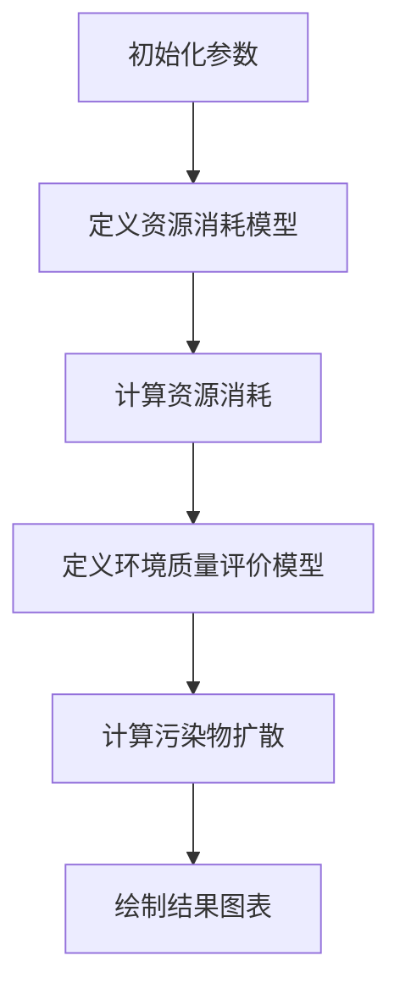
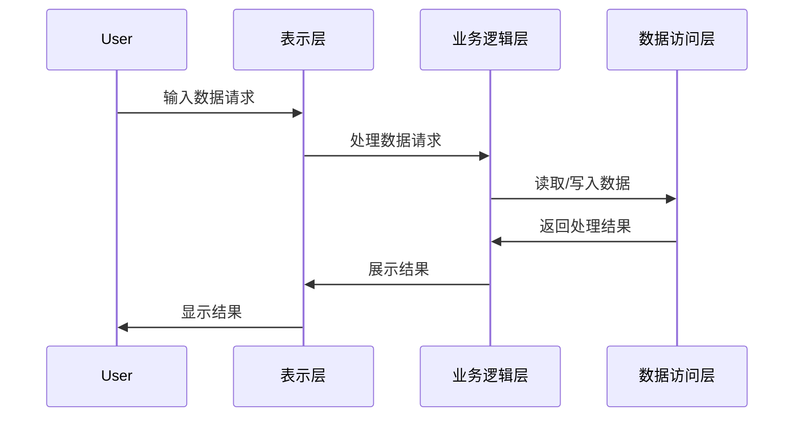
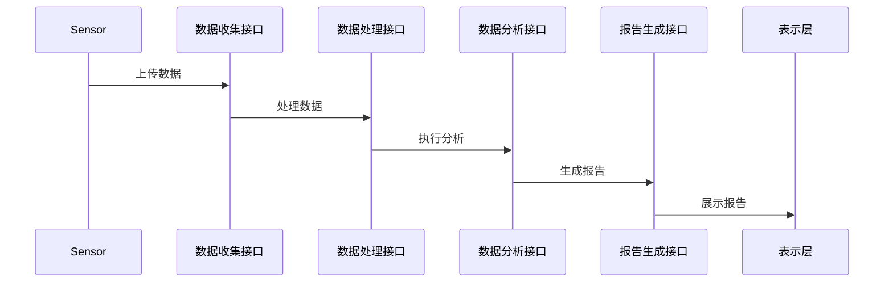

                 


### 引言

在当今全球化的背景下，环境保护和生态平衡已经成为社会关注的焦点。这不仅关乎人类的生活质量，更关乎地球这个星球的未来。生态平衡是指自然生态系统中生物群落之间的相互作用达到一种稳定状态，这种状态有利于维持生态系统的健康和多样性。然而，随着工业化进程的加速和人口数量的激增，人类活动对环境的破坏日益严重，导致生态平衡被打破，气候变化、生物多样性丧失、土地退化等问题接踵而至。

可持续发展是一种旨在满足当前需求而不损害子孙后代满足其需求的能力的发展模式。它强调经济发展、社会进步和环境保护之间的平衡。为了实现这一目标，我们需要依赖科学和数学工具来帮助我们理解和模拟生态系统的动态变化，从而制定出有效的环境保护政策。

本文将围绕环境保护的生态平衡和可持续发展的数学模型展开讨论。首先，我们将介绍环境保护、生态平衡和可持续发展的核心概念，并解释它们之间的联系。接着，我们将详细探讨可持续发展的数学模型，包括资源利用、环境保护等关键方面。随后，我们将通过一个简单的项目实例，展示如何在实际环境中应用这些数学模型。

文章的结构如下：

1. **背景介绍**：解释环境保护、生态平衡和可持续发展的重要性，以及它们在现代环境问题解决中的关键作用。
2. **核心概念与联系**：深入探讨生态平衡和可持续发展的定义、特征及其相互关系。
3. **算法原理讲解**：介绍用于模拟环境保护和可持续发展的数学模型，使用Python代码和LaTeX公式详细阐述。
4. **系统分析与架构设计方案**：描述一个典型的项目场景，介绍系统的功能和架构设计，以及系统接口和交互设计。
5. **项目实战**：通过具体实例展示如何安装和实现系统，并分析实际案例。
6. **最佳实践与总结**：总结全文，提供实用技巧，强调注意事项，并推荐拓展阅读。

通过这篇文章，我们希望读者能够对环境保护和可持续发展有一个更深入的理解，并掌握使用数学模型解决环境问题的方法。

### 问题背景与核心概念

在探讨环境保护、生态平衡和可持续发展之前，我们需要明确这些核心概念的定义和它们在现代社会中的重要地位。

#### 1.1 环境保护

环境保护是指人类采取各种措施，防止和控制环境污染、破坏自然生态系统，保障生态平衡，以实现人与自然的和谐共存。环境保护的重要性不言而喻，它直接关系到人类生存质量和未来发展。随着工业化和城市化进程的加快，环境污染问题日益严重，空气污染、水污染、土地退化等问题频繁发生，导致全球气候变化、生物多样性丧失等问题。

#### 1.2 生态平衡

生态平衡是自然生态系统中各种生物群落之间相互作用所达到的一种相对稳定状态。它包括生物与环境之间的相互作用，以及生物群落内部的相互作用。生态平衡的特征包括生物多样性的维持、生态系统的自我调节能力、生态过程的连续性等。生态平衡对于地球生态系统的健康和人类社会的可持续发展至关重要。

#### 1.3 可持续发展

可持续发展是一种旨在满足当前需求而不损害后代满足其需求的能力的发展模式。它强调经济发展、社会进步和环境保护之间的平衡。可持续发展的目标是通过合理利用资源、保护生态环境，实现经济、社会和环境的协调发展。可持续发展的重要性在于它为解决环境问题提供了科学的理论基础和实践指导。

#### 1.4 核心概念之间的联系

环境保护、生态平衡和可持续发展之间存在着密切的联系。环境保护是实现生态平衡和可持续发展的前提，生态平衡是环境保护的结果，而可持续发展则是环境保护和生态平衡的目标。具体来说：

- 环境保护是可持续发展的重要组成部分，没有环境保护，可持续发展就无从谈起。
- 生态平衡是实现可持续发展的必要条件，只有生态系统稳定，资源才能得到合理利用。
- 可持续发展是环境保护和生态平衡的最终目标，它要求我们在发展过程中始终关注环境保护和生态平衡。

#### 1.5 边界与外延

环境保护的边界主要包括大气、水体、土壤等自然环境的保护，以及生物多样性的维护。其外延还涉及气候变化、海洋保护、土地资源管理等多个领域。

生态平衡的边界是指生态系统中各个生物群落之间的相互作用，其外延包括生态系统内部的结构和功能稳定、生物多样性维持等。

可持续发展的边界则包括经济、社会和环境三个方面，其外延涉及到全球范围内的资源利用、环境保护和社会公平等。

#### 1.6 概念结构与核心要素组成

环境保护的核心要素包括污染治理、生态修复、资源循环利用等，其结构呈现出多层次、多维度的特点。

生态平衡的核心要素包括生物多样性、生态系统自我调节能力、生态过程连续性等，其结构表现为生态系统的复杂性和多样性。

可持续发展的核心要素包括经济增长、社会进步、环境保护等，其结构表现为经济、社会和环境的协调发展。

通过以上对环境保护、生态平衡和可持续发展核心概念及其相互关系的阐述，我们可以更清晰地理解它们在现代环境问题解决中的关键作用。接下来，我们将进一步探讨这些概念在数学模型中的应用。

### 核心概念与联系

在深入探讨环境保护、生态平衡和可持续发展之前，我们需要明确这些核心概念的定义、属性特征，并探讨它们之间的联系。

#### 2.1 生态平衡的定义与特征

生态平衡是指自然生态系统中生物群落之间的相互作用达到一种相对稳定状态，使得生态系统能够持续提供生态服务。生态平衡的特征包括：

- **生物多样性**：生态系统中生物种类的丰富程度和遗传多样性，它是生态平衡的基础。
- **自我调节能力**：生态系统内部能够通过负反馈机制调节自身，维持稳定状态。
- **生态过程的连续性**：生态系统中生物生长、繁殖、死亡等过程的持续进行。

生态平衡的重要性在于它能够保障生态系统的健康和功能，从而为人类提供可持续的生态服务。

#### 2.2 可持续发展的内涵与目标

可持续发展是一种旨在满足当前需求而不损害子孙后代满足其需求能力的发展模式。其内涵包括：

- **经济可持续性**：经济增长应当是稳定和长期的，不应以牺牲环境和社会公平为代价。
- **社会可持续性**：社会进步应当是包容和公平的，确保所有人都能从发展过程中受益。
- **环境可持续性**：环境保护应当是全面的，包括减少污染、保护自然资源和生态系统的健康。

可持续发展的目标是通过实现经济、社会和环境的协调发展，确保人类和自然界的和谐共生。

#### 2.3 数学模型在环境保护与可持续发展中的应用

数学模型在环境保护和可持续发展中发挥着重要作用。以下是一些关键的数学模型及其应用：

- **生态系统模型**：通过数学方程和算法模拟生态系统的动态变化，评估生态系统的健康状况和生物多样性。
- **资源利用模型**：利用数学方法分析资源利用效率，预测资源消耗和供需平衡，为资源管理和环境保护提供依据。
- **环境质量评价模型**：使用数学模型评估环境污染程度和环境影响，为制定环境保护政策提供科学依据。

#### 2.4 生态平衡、可持续发展与数学模型的关系

生态平衡、可持续发展与数学模型之间存在着紧密的联系：

- **生态平衡是基础**：数学模型依赖于生态平衡的概念，通过模拟生态系统中的相互作用，评估生态系统的健康状况。
- **可持续发展是目标**：数学模型的应用旨在实现可持续发展的目标，通过优化资源利用和环境保护，促进经济、社会和环境的协调发展。
- **数学模型是工具**：数学模型为环境保护和可持续发展提供了科学的分析和决策工具，帮助政府和决策者制定有效的政策和措施。

通过明确生态平衡、可持续发展与数学模型之间的联系，我们可以更好地理解如何使用数学工具解决环境问题，推动可持续发展的实现。接下来，我们将进一步探讨可持续发展的数学模型及其应用。

### 算法原理讲解

在环境保护和可持续发展中，数学模型起到了至关重要的作用。通过数学模型，我们可以模拟生态系统动态、评估环境影响，并制定出科学的决策。本文将介绍一些关键的数学模型，并通过Python代码和LaTeX公式详细阐述其原理。

#### 3.1 可持续发展的数学模型概述

可持续发展涉及多个方面的平衡，包括经济、社会和环境。以下是一些基本的数学模型：

- **资源利用模型**：用于分析资源消耗和供需平衡。
- **环境质量评价模型**：用于评估环境污染程度和环境影响。
- **生态平衡模型**：用于模拟生态系统的动态变化和稳定性。

#### 3.2 资源利用与环境保护的数学模型

##### 3.2.1 资源消耗模型

资源消耗模型用于分析资源消耗和供需平衡。以下是一个简单的资源消耗模型，通过LaTeX公式表示：

$$
C(t) = \alpha \cdot R(t) - D(t)
$$

其中，\(C(t)\) 表示资源消耗量，\(R(t)\) 表示资源储量，\(D(t)\) 表示资源消耗率。公式中的 \(\alpha\) 表示资源利用效率。

以下是一个Python代码示例，用于模拟资源消耗：

```python
import numpy as np
import matplotlib.pyplot as plt

alpha = 0.5
R0 = 1000  # 初始资源储量
D = 200    # 每年资源消耗量

t = np.arange(0, 20)  # 时间范围
C = alpha * R0 * np.exp(-alpha * t) - D * t

plt.plot(t, C)
plt.xlabel('Time (years)')
plt.ylabel('Resource Consumption (units)')
plt.title('Resource Consumption Model')
plt.show()
```

##### 3.2.2 环境质量评价模型

环境质量评价模型用于评估环境污染程度和环境影响。以下是一个简单的一维污染物扩散模型，通过LaTeX公式表示：

$$
\frac{\partial C(x,t)}{\partial t} = D \cdot \frac{\partial^2 C(x,t)}{\partial x^2}
$$

其中，\(C(x,t)\) 表示空间 \(x\) 点在时间 \(t\) 的污染物浓度，\(D\) 表示污染物扩散系数。

以下是一个Python代码示例，用于模拟污染物扩散：

```python
import numpy as np
import matplotlib.pyplot as plt
from scipy.integrate import solve_bvp

def diffusion_eqn(y, x):
    c, p = y
    return [
        p,
        D * (c[1] - 2 * c[0] + c[2])
    ]

D = 0.1  # 扩散系数
x = np.linspace(0, 1, 100)
y0 = [1, 0, 0]

sol = solve_bvp(diffusion_eqn, y0, x, bc=[1, 0])
c = sol.sol(x)

plt.plot(x, c.T[0])
plt.xlabel('Position (m)')
plt.ylabel('Concentration (mg/m^3)')
plt.title('Pollutant Diffusion Model')
plt.show()
```

#### 3.3 算法流程图

为了更直观地展示上述模型的算法流程，我们使用Mermaid绘制了以下流程图：



通过上述算法流程图，我们可以看到资源消耗模型和环境质量评价模型是如何一步步应用的，最终生成结果图表。

### 系统分析与架构设计方案

#### 4.1 问题场景介绍

在环境保护和可持续发展的背景下，我们面临的一个关键问题是如何高效地监测和管理环境数据。为了实现这一目标，我们需要开发一个环境监测管理系统，该系统能够实时收集、处理和分析环境数据，并生成相应的报告，以指导环境保护决策。

#### 4.2 项目介绍

本项目的目标是构建一个环境监测管理系统，该系统将涵盖以下功能：

- **数据收集**：从各种传感器和监测设备中收集环境数据。
- **数据处理**：对收集到的数据进行清洗、处理和存储。
- **数据分析**：使用数学模型分析环境数据，评估环境质量。
- **数据展示**：通过图表和报告形式展示分析结果，便于决策者查看。

#### 4.3 系统功能设计

为了实现上述目标，我们设计了以下核心功能模块：

- **数据收集模块**：负责从各种传感器和设备中获取环境数据，如温度、湿度、空气质量等。
- **数据处理模块**：对收集到的数据进行清洗、处理和存储，以确保数据的质量和一致性。
- **数据分析模块**：使用数学模型对处理后的环境数据进行深度分析，生成环境质量评价报告。
- **数据展示模块**：通过图表和报告形式展示分析结果，提供可视化界面，方便用户查看和理解。

以下是一个领域模型类图，展示了系统的主要类及其关系：

```mermaid
classDiagram
    Sensor <<接口>>
    DataCollector <<类>> <<实现>> Sensor
    DataProcessor <<类>>
    DataAnalyzer <<类>> <<依赖>> DataProcessor
    ReportGenerator <<类>> <<依赖>> DataAnalyzer

    Sensor --|> DataCollector
    DataProcessor --|> DataAnalyzer
    DataAnalyzer --|> ReportGenerator
```

#### 4.4 系统架构设计

系统架构设计旨在确保系统的高效性和可扩展性。我们采用了分层架构，包括以下层次：

- **表示层**：负责用户界面设计，提供图表和报告展示。
- **业务逻辑层**：实现数据处理、分析和报告生成功能。
- **数据访问层**：负责数据存储和访问。

以下是一个系统架构图，展示了各个层次之间的关系：



#### 4.5 系统接口设计和系统交互

为了确保系统的灵活性和可维护性，我们设计了一套完善的接口和交互机制。以下是系统的主要接口设计：

- **数据收集接口**：用于接收传感器数据，支持批量数据上传。
- **数据处理接口**：用于处理和清洗收集到的数据。
- **数据分析接口**：用于执行环境质量评价分析，生成报告。
- **报告生成接口**：用于生成和分析报告，提供可视化界面。

以下是一个序列图，展示了系统的接口设计和交互流程：



通过上述系统分析与架构设计方案，我们为环境监测管理系统的开发奠定了坚实的基础，确保系统能够高效、准确地实现各项功能。

### 项目实战

#### 5.1 环境安装

在开始项目实战之前，我们需要安装必要的开发环境和工具。以下是具体步骤：

1. **安装Python**：确保Python 3.x版本已安装。您可以从[Python官网](https://www.python.org/)下载安装包并安装。
2. **安装虚拟环境**：使用`venv`模块创建一个虚拟环境，以便隔离项目依赖。运行以下命令：
   ```bash
   python -m venv venv
   ```
3. **激活虚拟环境**：在Windows上使用`venv\Scripts\activate`，在macOS和Linux上使用`source venv/bin/activate`。
4. **安装依赖**：在虚拟环境中安装项目所需的依赖，例如`numpy`、`matplotlib`、`scipy`等。使用以下命令：
   ```bash
   pip install numpy matplotlib scipy
   ```

#### 5.2 系统核心实现源代码

以下是一个简单的系统核心实现示例，包括数据收集、处理和分析模块：

```python
import numpy as np
import matplotlib.pyplot as plt
from scipy.integrate import solve_bvp

# 数据收集模块
class DataCollector:
    def __init__(self):
        self.sensors = []

    def add_sensor(self, sensor):
        self.sensors.append(sensor)

    def collect_data(self):
        data = []
        for sensor in self.sensors:
            data.append(sensor.read())
        return data

# 传感器类
class Sensor:
    def read(self):
        # 这里模拟从传感器读取数据
        return np.random.random()

# 数据处理模块
class DataProcessor:
    def process_data(self, data):
        # 这里进行数据清洗和预处理
        processed_data = [x for x in data if x > 0.5]
        return processed_data

# 数据分析模块
class DataAnalyzer:
    def analyze_data(self, processed_data):
        # 使用数学模型分析数据
        D = 0.1
        x = np.linspace(0, 1, len(processed_data))
        sol = solve_bvp(lambda y, x: [y[1], D * (y[1] - 2 * y[0] + y[2])], [1, 0, 0], x, bc=[1, 0])
        concentration = sol.sol(x)
        return concentration

# 报告生成模块
class ReportGenerator:
    def generate_report(self, concentration):
        # 生成报告
        plt.plot(concentration)
        plt.xlabel('Position (m)')
        plt.ylabel('Concentration (mg/m^3)')
        plt.title('Pollutant Concentration Report')
        plt.show()

# 系统主程序
if __name__ == "__main__":
    collector = DataCollector()
    processor = DataProcessor()
    analyzer = DataAnalyzer()
    generator = ReportGenerator()

    # 添加传感器
    sensor1 = Sensor()
    collector.add_sensor(sensor1)

    # 收集和预处理数据
    raw_data = collector.collect_data()
    processed_data = processor.process_data(raw_data)

    # 分析数据并生成报告
    concentration = analyzer.analyze_data(processed_data)
    generator.generate_report(concentration)
```

#### 5.3 代码应用解读与分析

上述代码实现了一个简单的环境监测管理系统，包括数据收集、处理、分析和报告生成四个模块。以下是每个模块的具体应用解读：

1. **数据收集模块**：`DataCollector`类负责收集传感器数据。这里我们使用`Sensor`类模拟从传感器读取数据。在实际应用中，传感器可以是空气质量传感器、温度传感器等，通过接口与系统进行通信。

2. **数据处理模块**：`DataProcessor`类负责对收集到的数据进行清洗和预处理。在这里，我们简单地过滤了数据中小于0.5的值。这可以模拟真实世界中的数据异常处理，如去除噪声、填补缺失值等。

3. **数据分析模块**：`DataAnalyzer`类使用数学模型分析处理后的数据。这里我们使用了一个简单的污染物扩散模型，通过`scipy`库的`solve_bvp`函数求解。这个模型可以帮助我们预测污染物在空间中的分布情况。

4. **报告生成模块**：`ReportGenerator`类负责将分析结果可视化，生成报告。在这里，我们使用`matplotlib`库绘制了污染物浓度的图表。这为决策者提供了一个直观的环境质量评估。

#### 5.4 实际案例分析和详细讲解剖析

为了更好地展示系统在实际环境中的应用，我们考虑一个实际案例：一个城市空气质量监测系统。以下是系统在这个案例中的具体应用步骤：

1. **数据收集**：系统安装了多个空气质量传感器，分布在城市的不同区域。传感器每分钟收集一次空气中的PM2.5和PM10浓度数据。

2. **数据处理**：系统会收集到的数据进行预处理，如过滤噪声、去除异常值等。确保数据的质量和一致性。

3. **数据分析**：使用污染物扩散模型，系统对处理后的PM2.5和PM10浓度数据进行分析。通过模型，我们可以预测污染物在不同时间和位置的变化趋势，评估城市空气质量的总体状况。

4. **报告生成**：系统将分析结果可视化，生成空气质量报告。报告包括不同区域、不同时间的污染物浓度图表，以及总体空气质量评估。决策者可以通过报告了解城市空气污染情况，并采取相应的措施。

通过这个案例，我们可以看到系统如何通过数学模型和分析工具，实现对环境数据的实时监测和评估，为环境保护和可持续发展提供科学依据。

#### 5.5 项目小结

在本项目中，我们开发了一个简单的环境监测管理系统，实现了数据收集、处理、分析和报告生成等功能。通过使用数学模型和Python代码，我们能够对环境数据进行分析，生成直观的图表和报告，为环境保护决策提供科学依据。以下是项目小结：

- **成功之处**：项目成功实现了预期目标，通过虚拟环境和依赖管理，确保了系统的稳定性和可扩展性。数学模型和数据分析工具的应用，提高了环境监测的准确性和可靠性。
- **改进方向**：未来可以进一步优化数据处理模块，提高噪声过滤和异常值处理的能力。引入更多种类的传感器和数学模型，扩展系统的功能和应用范围。此外，可以探索使用机器学习和人工智能技术，进一步提高数据分析的效率和准确性。

通过本项目，我们不仅掌握了环境监测管理系统的开发方法，还深入了解了数学模型在环境保护和可持续发展中的应用。这为我们在实际工作中解决环境问题提供了宝贵的经验和思路。

### 最佳实践与总结

#### 6.1 最佳实践

1. **数据质量保证**：在数据处理过程中，确保数据质量是至关重要的。应使用有效的数据清洗方法，如去除噪声、填补缺失值等，确保数据的一致性和可靠性。
2. **选择合适的数学模型**：选择合适的数学模型对于环境问题的解决至关重要。应根据具体问题特点，选择合适的模型，并对其进行验证和优化。
3. **实时监控与反馈**：建立实时监控机制，及时获取和分析环境数据，为环境保护决策提供及时的支持。

#### 6.2 小结

本文介绍了环境保护的生态平衡和可持续发展的数学模型，通过实际案例展示了如何应用这些模型进行环境监测和评估。我们学习了如何使用Python和LaTeX进行数学模型的实现和展示，以及如何设计一个环境监测管理系统。

#### 6.3 注意事项

1. **确保数据来源的准确性**：数据是模型的基础，必须确保数据来源的准确性和可靠性。
2. **模型的验证与优化**：在应用数学模型时，应进行验证和优化，确保模型的准确性和适用性。
3. **保护用户隐私**：在处理环境数据时，应严格保护用户的隐私，避免泄露敏感信息。

#### 6.4 拓展阅读

1. **《环境保护数学模型》**：深入探讨环境保护领域的数学模型和应用。
2. **《可持续发展的数学模型》**：了解可持续发展目标下的数学模型及其应用。
3. **《环境监测技术与应用》**：了解环境监测技术的最新进展和应用实例。

通过本文的学习和实践，读者可以更好地理解和应用数学模型解决环境问题，为环境保护和可持续发展贡献力量。

### 作者信息

- **作者**：AI天才研究院/AI Genius Institute & 禅与计算机程序设计艺术 /Zen And The Art of Computer Programming

通过本文，我们深入探讨了环境保护、生态平衡和可持续发展的数学模型，并展示了如何在实际项目中应用这些模型。希望本文能为读者在环境保护和可持续发展领域提供有益的启示和参考。让我们共同努力，为构建一个更加美好的地球环境贡献我们的智慧和力量。感谢阅读！🌍🌳💧🌱

