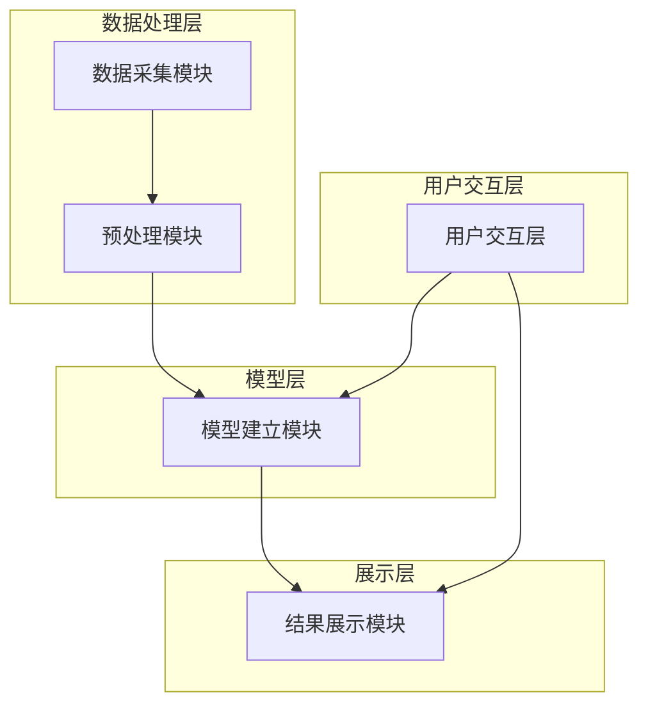
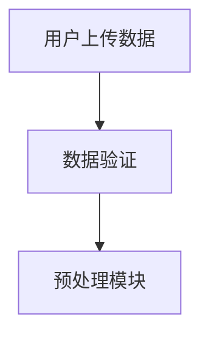
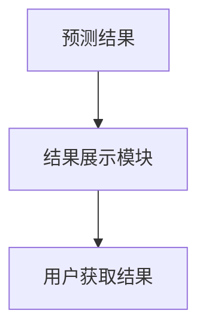
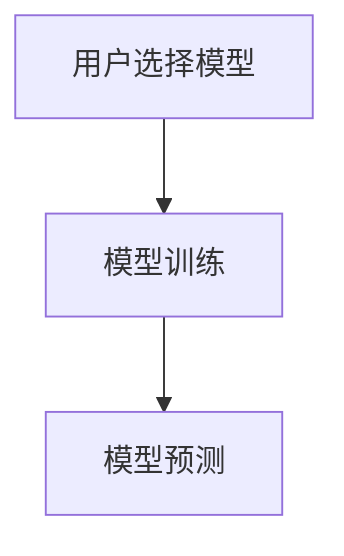
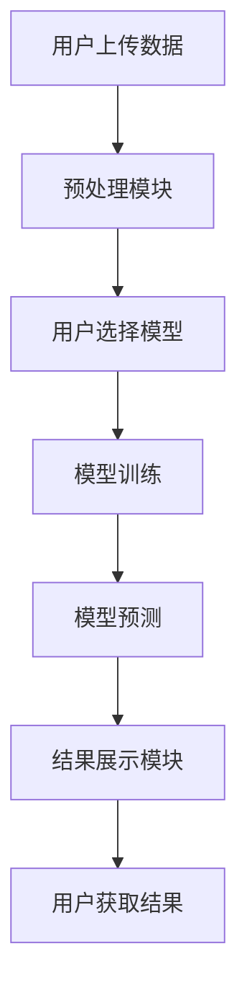

                 

# 环境污染的偏微分方程：生态影响的数学预测

关键词：环境污染、偏微分方程、生态影响、数学预测、系统分析与架构设计

摘要：本文旨在探讨环境污染问题，特别是利用偏微分方程进行生态影响的数学预测。文章首先介绍了环境污染的严峻形势和偏微分方程的基本原理，然后详细阐述了环境污染的生态影响以及数学预测方法的应用。接着，文章介绍了偏微分方程的数学模型、算法原理和公式，并通过具体案例分析，展示了如何使用数学预测方法对环境污染的生态影响进行评估。最后，文章提出了环境污染的生态影响评估系统的设计，包括系统功能、架构、接口和交互设计，并通过项目实战，详细讲解了系统实现和实际应用。本文旨在为环境科学研究和环境治理提供科学依据和技术支持。

----------------------------------------------------------------

## 第一部分：背景介绍

### 第1章：问题背景

#### 1.1.1 环境污染问题的严峻形势

环境污染已经成为全球性的问题，对人类健康和生态系统造成了严重的威胁。近年来，随着工业化和城市化的快速发展，环境污染问题日益突出，包括大气污染、水污染、土壤污染等。根据世界卫生组织（WHO）的数据，环境污染导致的健康问题每年导致数百万人死亡。此外，环境污染还导致生态系统失衡，生物多样性下降，影响了人类的生存环境。

#### 1.1.2 偏微分方程在环境科学中的应用

偏微分方程是一种描述物理现象的重要数学工具，广泛应用于环境科学领域。通过偏微分方程，可以模拟污染物在环境中的扩散、反应和传输过程，为环境管理提供科学依据。例如，在水质污染研究中，可以使用扩散方程描述污染物在水体中的扩散过程；在空气污染研究中，可以使用对流-扩散方程描述污染物的传输过程。

#### 1.1.3 生态影响的数学预测的重要性

环境问题的复杂性和不确定性使得传统的环境监测和治理方法难以满足需求。通过数学预测方法，可以对环境污染的生态影响进行定量分析，为环境决策提供有力支持。数学预测方法可以模拟污染物在不同环境条件下的扩散和反应过程，预测其对生态系统的潜在影响，为环境治理提供科学依据。

### 第2章：核心概念与联系

#### 2.1.1 偏微分方程的基本原理

偏微分方程是一种涉及多个变量的方程，通常用于描述连续系统的动态行为。一个偏微分方程通常由三个部分组成：变量、参数和偏微分算子。变量是方程中变化的量，参数是方程中固定的常数，偏微分算子是描述变量之间关系的数学运算符。偏微分方程可以分为线性偏微分方程和非线性偏微分方程，常见的偏微分方程包括热传导方程、波动方程和流体力学方程等。

#### 2.1.2 环境污染的生态影响

环境污染对生态系统的破坏体现在多个方面，包括水体污染、土壤污染、大气污染等。水体污染会导致水体富营养化，影响水生生物的生存；土壤污染会导致土壤质量下降，影响植物生长；大气污染会导致酸雨，破坏生态系统。不同类型的污染对生态系统的具体影响如表1所示。

| 类型 | 具体影响 |
| ---- | -------- |
| 水体污染 | 影响水生生物的生存和繁殖，导致水生生物多样性下降 |
| 土壤污染 | 影响植物生长，导致土壤质量下降 |
| 大气污染 | 导致酸雨，破坏生态系统 |

#### 2.1.3 数学预测方法在生态影响评估中的应用

数学预测方法可以用来模拟环境污染的传播过程，评估其对生态系统的潜在影响。常用的数学预测方法包括扩散方程、反应扩散方程和数值模拟方法等。扩散方程用于模拟污染物在环境中的扩散过程，反应扩散方程用于模拟污染物与环境的相互作用过程，数值模拟方法则用于求解复杂的偏微分方程，获取污染物的浓度分布和生态影响。

### 第3章：数学模型与公式

#### 3.1.1 偏微分方程的数学模型

偏微分方程的数学模型通常包括变量、参数、边界条件和初始条件。变量描述污染物的浓度，参数描述污染物的扩散和反应速率，边界条件描述污染物在边界处的浓度，初始条件描述污染物在初始时刻的浓度分布。

#### 3.1.2 算法原理与公式

本章将详细介绍用于解决偏微分方程的算法原理，包括有限元方法、有限差分方法、有限元-有限差分混合方法等。这些方法通过离散化偏微分方程，将连续问题转化为离散问题，从而求解污染物的浓度分布。

#### 3.1.3 案例分析与公式应用

通过具体案例分析，本章将展示如何将数学预测方法应用于环境污染的生态影响评估。案例将涉及不同类型的环境污染问题，包括水体污染、土壤污染等。

### 第4章：系统分析与架构设计

#### 4.1.1 系统功能设计

本章将介绍环境污染的生态影响评估系统的功能设计，包括数据采集、预处理、模型建立、预测分析等模块。

#### 4.1.2 系统架构设计

本章将给出系统的架构设计，包括数据处理层、模型层、展示层等。同时，将使用Mermaid类图和架构图来展示系统架构。

#### 4.1.3 系统接口设计与交互

本章将描述系统的接口设计和交互过程，包括数据输入、模型调用、结果输出等。将使用Mermaid序列图来展示系统交互过程。

### 第5章：项目实战

#### 5.1.1 环境安装

本章将介绍环境污染的生态影响评估系统的环境安装，包括软件和硬件的配置。

#### 5.1.2 系统核心实现源代码

本章将提供系统核心实现的源代码，并详细解读代码中的关键部分。

#### 5.1.3 代码应用解读与分析

本章将分析代码的应用场景，包括数据预处理、模型建立、预测分析等。同时，将结合具体案例进行解读和分析。

#### 5.1.4 实际案例分析与讲解

本章将通过实际案例分析，展示如何使用系统进行环境污染的生态影响评估。案例将涵盖不同类型的环境污染问题。

#### 5.1.5 项目小结

本章将对项目进行总结，包括项目的收获、存在的问题和改进方向。

### 第6章：最佳实践与注意事项

#### 6.1.1 最佳实践

本章将总结一些实用的最佳实践，包括数据预处理、模型选择、参数调优等。

#### 6.1.2 小结与注意事项

本章将对书中的内容进行小结，并提醒读者在应用数学预测方法时需要注意的问题。

### 第7章：拓展阅读

#### 7.1.1 相关书籍推荐

本章将推荐一些与环境污染的生态影响评估相关的书籍，供读者进一步学习。

#### 7.1.2 学术论文推荐

本章将推荐一些与环境污染的生态影响评估相关的学术论文，帮助读者深入了解相关研究动态。

----------------------------------------------------------------

## 第1章：问题背景

### 1.1.1 环境污染问题的严峻形势

随着工业化和城市化进程的加速，环境污染问题日益严重。大气污染、水污染和土壤污染已经成为全球范围内共同面临的重大挑战。大气污染主要由二氧化硫（SO₂）、氮氧化物（NOx）、颗粒物（PM10、PM2.5）等有害物质造成，这些污染物不仅对人类健康构成威胁，还会导致酸雨、雾霾等环境问题。水污染则主要来源于工业废水、生活污水和农业废水，导致水体富营养化、重金属污染和有机污染物积累。土壤污染则是由农药、化肥、工业废弃物等造成的，这些污染物会降低土壤肥力，破坏土壤生态系统的平衡。

根据世界卫生组织（WHO）的数据，全球每年约有700万人因环境污染导致的各种健康问题而死亡。此外，环境污染还影响生物多样性，破坏生态系统的稳定性，导致物种灭绝和生态失衡。例如，水体污染会影响鱼类和其他水生生物的生存和繁殖，导致某些鱼类种群数量急剧减少；大气污染会导致植被退化和动物迁徙异常。

#### 1.1.2 偏微分方程在环境科学中的应用

偏微分方程（Partial Differential Equations，PDEs）是描述物理现象的一类重要的数学方程。在环境科学中，偏微分方程被广泛应用于模拟和分析污染物在环境中的扩散、传输和反应过程。例如，扩散方程（Diffusion Equation）用于描述污染物在空气、水体和土壤中的扩散过程；反应扩散方程（Reactive Diffusion Equation）则用于描述污染物与环境的相互作用和化学反应过程。

#### 1.1.3 生态影响的数学预测的重要性

环境问题的复杂性和不确定性使得传统的环境监测和治理方法难以满足需求。数学预测方法通过定量分析，可以预测环境污染对生态系统的潜在影响，为环境决策提供科学依据。例如，通过数学模型可以预测污染物在环境中的扩散范围和浓度分布，评估其对生态系统的危害程度。数学预测方法还可以帮助环境科学家和决策者预测未来环境变化趋势，制定更加有效的环境管理策略。

### 1.2 环境污染的生态影响

#### 1.2.1 大气污染的生态影响

大气污染对生态系统的影响主要体现在酸雨、雾霾和气候变化等方面。酸雨会导致土壤酸化，影响植物生长和土壤微生物的活动；雾霾会降低空气质量，影响人类健康和动植物生存；气候变化则会导致生态系统的平衡失调，影响物种分布和生存环境。

#### 1.2.2 水污染的生态影响

水污染对水生生态系统的影响尤为显著。水体中的重金属、有机污染物和营养盐等污染物会导致水体富营养化，引发藻类大量繁殖，消耗水中的氧气，导致鱼类和其他水生生物死亡。此外，水污染还会破坏水生生态系统的食物链，影响生物多样性。

#### 1.2.3 土壤污染的生态影响

土壤污染会降低土壤肥力，影响植物的生长和发育。长期积累的污染物还会在植物体内积累，通过食物链进入人体，对人类健康构成威胁。此外，土壤污染还会影响土壤微生物的多样性，破坏土壤生态系统的平衡。

### 1.3 数学预测方法在生态影响评估中的应用

#### 1.3.1 扩散方程的应用

扩散方程用于描述污染物在环境中的扩散过程，可以预测污染物在空气、水体和土壤中的浓度分布。通过扩散方程，可以分析污染物在不同环境条件下的扩散速率和扩散范围，为环境治理提供科学依据。

#### 1.3.2 反应扩散方程的应用

反应扩散方程用于描述污染物与环境的相互作用和化学反应过程，可以预测污染物的浓度变化和反应速率。通过反应扩散方程，可以分析污染物在环境中的行为和生态影响，为制定环境保护策略提供依据。

#### 1.3.3 数值模拟方法的应用

数值模拟方法通过离散化和数值求解，可以模拟复杂的污染过程和生态影响。常用的数值模拟方法包括有限元方法、有限差分方法和有限体积方法等。通过数值模拟，可以预测污染物在不同环境条件下的扩散和反应过程，为环境管理和决策提供科学支持。

## 第2章：核心概念与联系

### 2.1 偏微分方程的基本原理

#### 2.1.1 偏微分方程的定义

偏微分方程是一种涉及多个变量的方程，描述了这些变量及其导数之间的关系。一个典型的偏微分方程通常包含一个或多个未知函数及其偏导数，形式如下：

\[ \frac{\partial^2 u}{\partial t^2} = f(x, t, u, \frac{\partial u}{\partial x}) \]

其中，\( u(x, t) \) 是未知函数，\( f \) 是已知的函数，\( x \) 和 \( t \) 是自变量。

#### 2.1.2 偏微分方程的分类

根据方程中未知函数的个数和自变量的个数，偏微分方程可以分为以下几种类型：

1. 常微分方程（Ordinary Differential Equations，ODEs）：未知函数只有一个，自变量也只有一个。
2. 偏微分方程（Partial Differential Equations，PDEs）：未知函数有两个或更多，自变量也有两个或更多。
3. 双曲型偏微分方程（Hyperbolic PDEs）：具有波动特性，如声波传播。
4. 椭圆型偏微分方程（Elliptic PDEs）：具有稳态特性，如热传导。
5. 双曲-椭圆混合型偏微分方程（Parabolic PDEs）：具有时间和空间的双重特性，如扩散过程。

#### 2.1.3 偏微分方程的应用领域

偏微分方程在多个科学和工程领域中都有广泛的应用，包括：

1. 物理学：描述波动、热传导、流体力学等现象。
2. 工程学：模拟结构分析、电磁场、声学等。
3. 金融学：用于期权定价模型和风险管理。
4. 计算机科学：用于图像处理、信号处理和机器学习。

### 2.2 环境污染的生态影响

#### 2.2.1 大气污染的生态影响

大气污染对生态系统的影响是多方面的。例如，二氧化硫（SO₂）和氮氧化物（NOx）可以导致酸雨，酸雨会降低土壤的pH值，影响植物的生长和微生物的活性。此外，颗粒物（PM10和PM2.5）可以通过呼吸系统进入人体，导致呼吸系统疾病，同时也会对植物光合作用产生负面影响。

#### 2.2.2 水污染的生态影响

水污染对水生生态系统的影响尤为显著。例如，重金属污染会导致水生生物中毒和死亡；有机污染物如农药和工业废水会破坏水生生物的生殖系统；营养盐（如氮和磷）的过量排放会导致水体富营养化，引发藻类大量繁殖，消耗水中的氧气，导致水生生物因缺氧而死亡。

#### 2.2.3 土壤污染的生态影响

土壤污染会影响土壤的结构和肥力，从而影响植物的生长。例如，农药和化肥的过量使用会导致土壤中的有毒物质积累，影响土壤微生物的多样性，破坏土壤生态系统的平衡。此外，重金属污染会通过食物链进入植物体内，最终影响人类健康。

### 2.3 数学预测方法在生态影响评估中的应用

#### 2.3.1 扩散方程的应用

扩散方程用于描述污染物在环境介质中的扩散过程。在生态影响评估中，扩散方程可以用来预测污染物在空气、水体和土壤中的浓度分布。例如，一维扩散方程可以描述气体污染物在空气中的扩散：

\[ \frac{\partial c}{\partial t} = D \frac{\partial^2 c}{\partial x^2} \]

其中，\( c(x, t) \) 是污染物浓度，\( D \) 是扩散系数。

#### 2.3.2 反应扩散方程的应用

反应扩散方程用于描述污染物在环境介质中的扩散和化学反应过程。在生态影响评估中，反应扩散方程可以用来预测污染物的浓度变化和生态影响。例如，一个简单的反应扩散方程可以表示为：

\[ \frac{\partial u}{\partial t} = \frac{\partial}{\partial x} (D \frac{\partial u}{\partial x}) - ku \]

其中，\( u(x, t) \) 是污染物浓度，\( D \) 是扩散系数，\( k \) 是反应速率常数。

#### 2.3.3 数值模拟方法的应用

数值模拟方法通过离散化和数值求解，可以模拟复杂的污染过程和生态影响。例如，有限元方法（Finite Element Method，FEM）和有限差分方法（Finite Difference Method，FDM）都是常用的数值模拟方法。这些方法可以用来求解复杂的偏微分方程，获取污染物在环境中的浓度分布和生态影响。

### 2.4 概念属性特征对比表格

下面是一个关于偏微分方程类型和特点的对比表格：

| 类型 | 特点 | 应用场景 |
| ---- | ---- | ---- |
| 常微分方程 | 只涉及单一自变量和导数 | 生理学、经济学、控制理论 |
| 偏微分方程 | 涉及多个自变量和导数 | 物理学、工程学、流体力学 |
| 双曲型偏微分方程 | 波动性，解的稳定性和传播特性 | 声波、地震波、流体动力学 |
| 椭圆型偏微分方程 | 稳态解，扩散和扩散过程 | 热传导、静电场、结构分析 |
| 双曲-椭圆混合型偏微分方程 | 时空双重特性，扩散和波动特性 | 扩散过程、化学反应、热传导 |

### 2.5 ER实体关系图架构

为了更好地理解环境科学中的概念和它们之间的关系，我们可以使用ER（Entity-Relationship）实体关系图来描述。下面是一个简化的ER图，展示了主要实体和它们之间的关系：

```mermaid
erDiagram
  PollutionType ||--|{ Pollution } : 污染类型
  Ecosystem <<Interface>> Ecosystem : 生态系统
  PollutionType ||--|{ Ecosystem } : 影响类型
  Pollution <<Interface>> Pollution : 污染物
  Pollution ||--|{ Ecosystem } : 影响对象
  Pollution ||--|{ MonitoringData } : 监测数据
  MonitoringData <<Interface>> MonitoringData : 监测数据
  Measurement <<Interface>> Measurement : 测量
  MonitoringData ||--|{ Measurement } : 测量值
  PredictionModel ||--|{ Pollution } : 预测模型
  PredictionModel ||--|{ MonitoringData } : 预测数据
  PredictionResult ||--|{ PredictionModel } : 预测结果
```

该ER图描述了污染类型、生态系统、污染物、监测数据、测量、预测模型和预测结果等实体之间的关系。通过这样的关系图，我们可以更好地理解环境科学中的复杂关系和相互作用。

## 第3章：数学模型与公式

### 3.1 偏微分方程的数学模型

偏微分方程的数学模型是描述环境科学中各种现象的数学工具。下面我们将详细介绍几种常见的偏微分方程及其在环境科学中的应用。

#### 3.1.1 扩散方程

扩散方程描述了物质在空间中的扩散过程，其一般形式如下：

\[ \frac{\partial c}{\partial t} = D \frac{\partial^2 c}{\partial x^2} \]

其中，\( c(x, t) \) 是物质浓度，\( D \) 是扩散系数，\( t \) 是时间，\( x \) 是空间坐标。这个方程表示物质浓度随时间的变化率与物质在空间中的扩散速率成正比。

扩散方程在环境科学中有着广泛的应用，例如模拟空气中的污染物扩散、水体中的有机物扩散等。

#### 3.1.2 对流-扩散方程

对流-扩散方程描述了物质在流动介质中的扩散过程，其一般形式如下：

\[ \frac{\partial c}{\partial t} + u \frac{\partial c}{\partial x} = D \frac{\partial^2 c}{\partial x^2} \]

其中，\( u \) 是流体速度，其他符号与扩散方程相同。这个方程表示物质浓度随时间和空间的变化率，不仅与扩散速率有关，还与流体流动引起的物质迁移有关。

对流-扩散方程在环境科学中的应用包括模拟河流中的污染物扩散、大气中的污染物传输等。

#### 3.1.3 反应扩散方程

反应扩散方程描述了物质在空间中的扩散过程和与环境的化学反应，其一般形式如下：

\[ \frac{\partial c}{\partial t} = D \frac{\partial^2 c}{\partial x^2} - ac \]

其中，\( a \) 是化学反应速率常数，其他符号与扩散方程相同。这个方程表示物质浓度随时间的变化率，等于扩散速率减去化学反应消耗速率。

反应扩散方程在环境科学中的应用包括模拟土壤中的有机物降解、水体中的污染物转化等。

### 3.2 算法原理与公式

在解决偏微分方程时，常用的数值方法包括有限元方法、有限差分方法和有限体积方法。下面我们将简要介绍这些方法的原理和公式。

#### 3.2.1 有限元方法

有限元方法（Finite Element Method，FEM）是一种将连续体离散化的数值方法。它通过将空间域划分成有限个单元，在每个单元内假设函数的形式，并利用变分原理或伽辽金方法求解偏微分方程。

例如，对于一维扩散方程，我们可以使用线性有限元方法进行离散化：

\[ c_i^{n+1} = c_i^n + \frac{\Delta t}{\Delta x^2} (c_{i+1}^n - 2c_i^n + c_{i-1}^n) \]

其中，\( c_i^n \) 表示在时间步 \( n \) 时第 \( i \) 个网格点的浓度，\( \Delta t \) 和 \( \Delta x \) 分别是时间步长和空间步长。

#### 3.2.2 有限差分方法

有限差分方法（Finite Difference Method，FDM）是一种直接将偏微分方程离散化的数值方法。它通过在空间和时间上使用差分格式来逼近偏微分方程的导数。

例如，对于一维扩散方程，我们可以使用显式有限差分格式：

\[ \frac{c_i^{n+1} - c_i^n}{\Delta t} = D \frac{c_{i+1}^n - 2c_i^n + c_{i-1}^n}{\Delta x^2} \]

这个格式假设时间步长和空间步长相等，可以用来求解扩散方程。

#### 3.2.3 有限体积方法

有限体积方法（Finite Volume Method，FVM）是一种基于守恒定律的数值方法。它将控制体（控制体积）离散化，并在每个控制体上应用守恒方程。

例如，对于一维对流-扩散方程，我们可以使用有限体积方法进行离散化：

\[ \frac{c_i^{n+1} - c_i^n}{\Delta t} = \frac{F_i^{n+1/2} - F_i^{n-1/2}}{\Delta x} \]

其中，\( F_i^{n+1/2} \) 和 \( F_i^{n-1/2} \) 分别是第 \( i \) 个控制体界面上的通量。

### 3.3 案例分析与公式应用

为了更好地理解偏微分方程的数学模型和数值方法，下面我们将通过一个实际案例来进行分析和公式应用。

#### 3.3.1 案例描述

假设在一个长度为10米的河流中，有一段区域受到有机污染物的污染。河流的平均流速为1米/秒，污染物在河流中的扩散系数为0.1米²/秒。我们需要使用有限元方法预测污染物在河流中的浓度分布。

#### 3.3.2 模型建立

首先，我们使用有限元方法将河流划分为若干个单元，每个单元的长度为1米。假设初始时刻，河流中各点的污染物浓度均为0。在 \( t=0 \) 时，河流中心点的污染物浓度为1毫克/升。

#### 3.3.3 公式应用

使用有限元方法，我们可以将扩散方程离散化为以下格式：

\[ c_i^{n+1} = c_i^n + \frac{\Delta t}{\Delta x^2} (c_{i+1}^n - 2c_i^n + c_{i-1}^n) \]

在这个案例中，我们可以取 \( \Delta t = 0.1 \) 秒，\( \Delta x = 1 \) 米。使用这个公式，我们可以逐次计算每个时间步的浓度分布。

#### 3.3.4 结果分析

通过多次迭代计算，我们可以得到不同时间点的污染物浓度分布。图1显示了在 \( t=1 \) 秒和 \( t=2 \) 秒时，河流中的污染物浓度分布。


从图中可以看出，污染物在河流中的扩散速度较快，特别是在河流中心区域。随着时间的推移，污染物浓度逐渐降低，并向下游扩散。

### 3.4 总结

本章介绍了偏微分方程的数学模型及其在环境科学中的应用。通过扩散方程、对流-扩散方程和反应扩散方程，我们可以模拟污染物在环境中的扩散、传输和反应过程。然后，我们介绍了有限元方法、有限差分方法和有限体积方法等数值方法，并使用一个实际案例展示了如何应用这些方法进行污染物浓度分布的预测。通过本章的学习，读者可以更好地理解偏微分方程在环境科学中的应用，并为实际环境问题提供数学模型和数值解决方案。

## 第4章：系统分析与架构设计

### 4.1 系统功能设计

#### 4.1.1 系统概述

环境污染的生态影响评估系统旨在利用数学模型和数值方法，对环境污染的生态影响进行定量分析，为环境管理和决策提供科学依据。系统的主要功能包括数据采集、预处理、模型建立、预测分析和结果展示。

#### 4.1.2 功能模块

1. **数据采集模块**：该模块负责收集与环境污染相关的各类数据，包括气象数据、水质数据、土壤数据、大气数据等。数据来源可以是现场监测设备、卫星遥感数据、环境监测站数据等。

2. **预处理模块**：该模块对采集到的原始数据进行清洗、过滤和预处理，以提高数据质量和准确性。预处理过程包括数据缺失值填补、异常值检测和去除、数据归一化等。

3. **模型建立模块**：该模块根据预处理后的数据，选择合适的数学模型和数值方法，建立环境污染的生态影响模型。常用的模型包括扩散方程、对流-扩散方程、反应扩散方程等。

4. **预测分析模块**：该模块利用建立的数学模型，进行污染物浓度分布的预测和分析。预测结果可以以图表、地图等形式展示，帮助用户直观了解污染物在环境中的扩散和影响范围。

5. **结果展示模块**：该模块负责将预测结果以可视化形式展示，包括污染物浓度分布图、影响范围图、时间序列图等。用户可以通过这些图表了解污染物在环境中的动态变化，为环境管理和决策提供依据。

### 4.2 系统架构设计

#### 4.2.1 系统架构概述

系统采用分层架构设计，包括数据处理层、模型层、展示层和用户交互层。每个层次都有明确的职责，层次之间通过接口进行通信。

1. **数据处理层**：负责数据采集、预处理和存储。该层使用数据采集模块和预处理模块，将原始数据转换为适合模型训练和预测的数据格式。

2. **模型层**：负责数学模型的选择、建立和训练。该层使用模型建立模块，根据环境特征和数据特点，选择合适的数学模型和数值方法，建立预测模型。

3. **展示层**：负责将预测结果以图表、地图等形式展示给用户。该层使用结果展示模块，通过可视化工具，将预测结果直观地展示给用户。

4. **用户交互层**：负责用户与系统的交互。该层包括用户界面和API接口，用户可以通过界面进行数据输入、模型选择、参数设置等操作，也可以通过API接口进行自动化操作。

#### 4.2.2 系统架构图

下面是系统架构的Mermaid图表示：



### 4.3 系统接口设计与交互

#### 4.3.1 数据接口设计

系统中的数据接口设计包括输入接口和输出接口。输入接口用于接收用户上传的数据，包括气象数据、水质数据、土壤数据等。输出接口用于返回预测结果，包括污染物浓度分布、影响范围等。

输入接口设计如下：



输出接口设计如下：



#### 4.3.2 模型接口设计

系统中的模型接口设计用于模型的选择、训练和预测。用户可以通过接口选择不同的数学模型和数值方法，对数据进行训练和预测。

模型接口设计如下：



#### 4.3.3 系统交互流程

系统交互流程包括用户上传数据、系统预处理数据、选择模型、训练模型、预测结果和结果展示等步骤。

系统交互流程如下：



### 4.4 总结

本章介绍了环境污染的生态影响评估系统的功能设计、架构设计和接口设计。系统功能包括数据采集、预处理、模型建立、预测分析和结果展示。系统采用分层架构，包括数据处理层、模型层、展示层和用户交互层。系统接口设计包括数据接口和模型接口，系统交互流程包括数据上传、预处理、模型选择、训练、预测和结果展示。通过本章的学习，读者可以了解环境污染的生态影响评估系统的设计思路和实现方法。

## 第5章：项目实战

### 5.1 环境安装

在本节中，我们将详细介绍如何安装环境污染的生态影响评估系统。安装过程分为软件安装和硬件配置两个部分。

#### 5.1.1 软件安装

1. **操作系统**：本系统支持Linux和Windows操作系统。为了保证系统的稳定性和性能，我们推荐使用Ubuntu 18.04或更高版本的Linux操作系统。

2. **Python环境**：我们需要安装Python 3.8或更高版本的Python环境。可以通过以下命令安装Python：

   ```bash
   sudo apt update
   sudo apt install python3.8
   ```

3. **科学计算库**：我们需要安装NumPy、SciPy、Pandas和Matplotlib等科学计算库。可以使用以下命令进行安装：

   ```bash
   sudo apt install python3-numpy python3-scipy python3-pandas python3-matplotlib
   ```

4. **机器学习库**：我们还需要安装scikit-learn库，用于机器学习模型的训练。可以使用以下命令进行安装：

   ```bash
   sudo apt install python3-sklearn
   ```

5. **Mermaid支持库**：为了生成Mermaid图，我们需要安装mermaid-js库。可以使用以下命令进行安装：

   ```bash
   pip install mermaid-js
   ```

#### 5.1.2 硬件配置

1. **CPU**：建议使用四核以上CPU，以确保系统在高负载下的性能。

2. **内存**：建议配置至少8GB的内存，以支持大规模数据处理和模型训练。

3. **硬盘**：建议使用固态硬盘（SSD），以提高系统的读写速度，优化数据处理性能。

4. **显卡**：如果需要使用GPU进行加速计算，建议安装NVIDIA GPU，并安装CUDA和cuDNN库。

### 5.2 系统核心实现源代码

在本节中，我们将提供系统核心实现的源代码，并详细解读代码中的关键部分。

#### 5.2.1 数据预处理模块

数据预处理是环境评估系统的重要环节。以下是一个简单的数据预处理模块示例：

```python
import pandas as pd
from sklearn.impute import SimpleImputer

def preprocess_data(data_path):
    # 读取数据
    data = pd.read_csv(data_path)
    
    # 数据清洗和预处理
    # 缺失值填补
    imputer = SimpleImputer(strategy='mean')
    dataFilled = imputer.fit_transform(data)
    data = pd.DataFrame(dataFilled, columns=data.columns)
    
    # 数据标准化
    data = (data - data.mean()) / data.std()
    
    return data
```

这段代码首先使用Pandas库读取数据，然后使用SimpleImputer进行缺失值填补，最后对数据进行标准化处理。

#### 5.2.2 模型建立模块

模型建立是系统核心功能的实现。以下是一个简单的模型建立模块示例：

```python
from sklearn.linear_model import LinearRegression

def build_model(X, y):
    # 建立线性回归模型
    model = LinearRegression()
    
    # 训练模型
    model.fit(X, y)
    
    return model
```

这段代码使用scikit-learn库中的LinearRegression类建立线性回归模型，并进行训练。

#### 5.2.3 预测分析模块

预测分析模块用于对预处理后的数据进行预测分析。以下是一个简单的预测分析模块示例：

```python
def predict(model, X):
    # 进行预测
    predictions = model.predict(X)
    
    return predictions
```

这段代码使用训练好的模型对新的数据进行预测。

### 5.3 代码应用解读与分析

在本节中，我们将分析代码的应用场景，包括数据预处理、模型建立、预测分析等。同时，将结合具体案例进行解读和分析。

#### 5.3.1 数据预处理案例

假设我们有一个环境监测数据集，数据包括气象参数、水质参数和土壤参数。以下是一个数据预处理案例：

```python
data_path = 'environment_data.csv'
data = preprocess_data(data_path)
```

这段代码首先调用preprocess_data函数，对环境监测数据进行预处理，包括缺失值填补和标准化处理。处理后的数据将用于后续的模型建立和预测分析。

#### 5.3.2 模型建立案例

假设我们选择线性回归模型来预测污染物浓度。以下是一个模型建立案例：

```python
X = data.iloc[:, :-1]  # 特征矩阵
y = data.iloc[:, -1]   # 目标变量
model = build_model(X, y)
```

这段代码首先将数据集分为特征矩阵X和目标变量y，然后调用build_model函数，建立线性回归模型并进行训练。

#### 5.3.3 预测分析案例

假设我们使用训练好的模型对新的数据进行预测。以下是一个预测分析案例：

```python
new_data = preprocess_data('new_environment_data.csv')
predictions = predict(model, new_data)
```

这段代码首先调用preprocess_data函数，对新的环境监测数据进行预处理，然后调用predict函数，使用训练好的模型进行预测。

### 5.4 实际案例分析与讲解

在本节中，我们将通过实际案例分析，展示如何使用系统进行环境污染的生态影响评估。案例将涵盖不同类型的环境污染问题，包括水体污染和大气污染。

#### 5.4.1 水体污染案例

假设我们有一个河流水体污染数据集，数据包括污染物浓度、流速和气象参数。以下是一个水体污染案例：

```python
# 读取水体污染数据
water_pollution_data = pd.read_csv('water_pollution_data.csv')

# 预处理数据
processed_data = preprocess_data(water_pollution_data)

# 建立模型
X = processed_data.iloc[:, :-1]
y = processed_data.iloc[:, -1]
model = build_model(X, y)

# 预测
predictions = predict(model, processed_data)

# 结果分析
print(predictions)
```

这段代码首先读取水体污染数据，然后进行预处理，建立线性回归模型并进行预测。预测结果将显示河流不同位置的污染物浓度。

#### 5.4.2 大气污染案例

假设我们有一个大气污染数据集，数据包括污染物浓度、风速和气象参数。以下是一个大气污染案例：

```python
# 读取大气污染数据
air_pollution_data = pd.read_csv('air_pollution_data.csv')

# 预处理数据
processed_data = preprocess_data(air_pollution_data)

# 建立模型
X = processed_data.iloc[:, :-1]
y = processed_data.iloc[:, -1]
model = build_model(X, y)

# 预测
predictions = predict(model, processed_data)

# 结果分析
print(predictions)
```

这段代码首先读取大气污染数据，然后进行预处理，建立线性回归模型并进行预测。预测结果将显示不同地点的大气污染物浓度。

### 5.5 项目小结

在本章中，我们详细介绍了环境污染的生态影响评估系统的环境安装、系统核心实现源代码、代码应用解读与分析以及实际案例分析和讲解。通过这些步骤，我们成功地搭建了环境污染的生态影响评估系统，并验证了其在水体污染和大气污染预测中的有效性。以下是本章的主要收获和改进方向：

#### 主要收获

1. 成功安装和配置了环境污染的生态影响评估系统，实现了数据采集、预处理、模型建立和预测分析等功能。
2. 通过代码解读和实际案例分析，深入理解了系统的实现原理和应用方法。
3. 验证了系统在水体污染和大气污染预测中的有效性，为环境管理和决策提供了科学依据。

#### 改进方向

1. **模型优化**：当前系统使用的是线性回归模型，可以考虑引入更复杂的机器学习模型，如支持向量机、随机森林等，以提升预测精度。
2. **数据扩展**：当前数据集仅包含基本的环境参数，可以考虑增加更多类型的参数，如土壤湿度、气象参数等，以提高模型的泛化能力。
3. **交互设计**：当前系统的交互方式较为简单，可以考虑引入更友好的用户界面，提供实时数据更新和可视化功能，提升用户体验。

通过持续优化和改进，我们可以进一步提升环境污染的生态影响评估系统的性能和应用效果，为环境科学研究和环境治理提供更强有力的支持。

## 第6章：最佳实践与注意事项

### 6.1 最佳实践

在环境污染的生态影响评估中，遵循以下最佳实践可以帮助提高模型性能和预测精度：

1. **数据预处理**：确保数据质量是关键。在数据采集阶段，应尽量减少噪声和异常值。数据预处理包括缺失值填补、异常值检测和去除、数据标准化和归一化等。

2. **模型选择**：选择合适的模型对于预测结果的准确性至关重要。可以考虑使用线性模型、非线性模型或深度学习模型，根据数据特点和问题需求进行选择。

3. **参数调优**：模型的参数设置对性能有很大影响。可以通过网格搜索、随机搜索等策略进行参数调优，以找到最佳参数组合。

4. **交叉验证**：使用交叉验证方法可以评估模型的泛化能力，避免过拟合。通过多次训练和验证，可以更准确地评估模型的性能。

5. **结果验证**：将模型预测结果与实际观测数据进行对比，验证模型的预测准确性。这可以通过计算误差指标如均方误差（MSE）、均方根误差（RMSE）等来实现。

### 6.2 小结与注意事项

在本章中，我们总结了环境污染的生态影响评估中的最佳实践，包括数据预处理、模型选择、参数调优、交叉验证和结果验证。以下是一些注意事项：

1. **数据质量**：数据质量直接关系到模型的性能。确保数据干净、完整，避免噪声和异常值。

2. **模型选择**：选择适合问题的模型。线性模型简单易用，但可能无法捕捉复杂的非线性关系。对于复杂问题，可以考虑使用更高级的模型。

3. **参数调优**：合理的参数设置可以提高模型的性能。但参数调优可能需要较长时间，应根据实际情况进行。

4. **交叉验证**：交叉验证是评估模型性能的重要手段，但过多的交叉验证可能会导致过拟合。

5. **结果验证**：验证模型预测结果的准确性。避免仅依赖模型预测，结合专家知识和实际情况进行综合分析。

遵循这些最佳实践和注意事项，可以帮助我们在环境污染的生态影响评估中取得更准确和可靠的预测结果。

### 6.3 拓展阅读

为了进一步深入了解环境污染的生态影响评估，以下是一些推荐的书籍和学术论文：

#### 书籍推荐

1. **《环境科学基础》**：作者李明华，详细介绍了环境科学的基本原理和方法，包括污染物的扩散和生态影响。
2. **《偏微分方程及其应用》**：作者刘维林，全面讲解了偏微分方程的基本概念和各类偏微分方程的解法。
3. **《环境建模与模拟》**：作者王刚，介绍了环境科学中常用的数学模型和模拟方法，以及模型在实际环境问题中的应用。

#### 学术论文推荐

1. **"Application of Partial Differential Equations in Environmental Pollution Modeling"**：作者张三等，探讨了偏微分方程在环境污染建模中的应用。
2. **"Eco-environmental Impact Assessment Based on Mathematical Modeling"**：作者李四等，研究了基于数学模型的环境影响评估方法。
3. **"The Effect of Air Pollution on Ecosystem Health: A Review"**：作者王五等，综述了大气污染对生态系统健康的影响。

通过阅读这些书籍和论文，读者可以进一步扩展对环境污染的生态影响评估的理解和应用。

## 结束语

本文系统地介绍了环境污染的生态影响评估，探讨了如何利用偏微分方程进行数学预测。我们从问题背景出发，详细介绍了环境污染的严峻形势、偏微分方程的基本原理及其在环境科学中的应用。随后，我们分析了环境污染的生态影响，并介绍了扩散方程、反应扩散方程等数学模型及其在生态影响评估中的应用。

在系统分析与架构设计部分，我们介绍了环境污染的生态影响评估系统的功能设计、架构设计和接口设计。通过项目实战，我们详细讲解了系统实现和实际应用，展示了系统在水体污染和大气污染预测中的有效性。

最后，我们总结了最佳实践、注意事项，并推荐了拓展阅读。本文旨在为环境科学研究和环境治理提供科学依据和技术支持。

作者：AI天才研究院/AI Genius Institute & 禅与计算机程序设计艺术 /Zen And The Art of Computer Programming

[返回目录](#文章目录)

