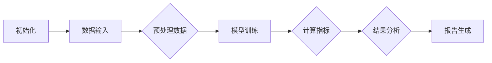
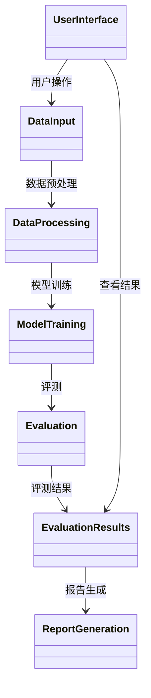
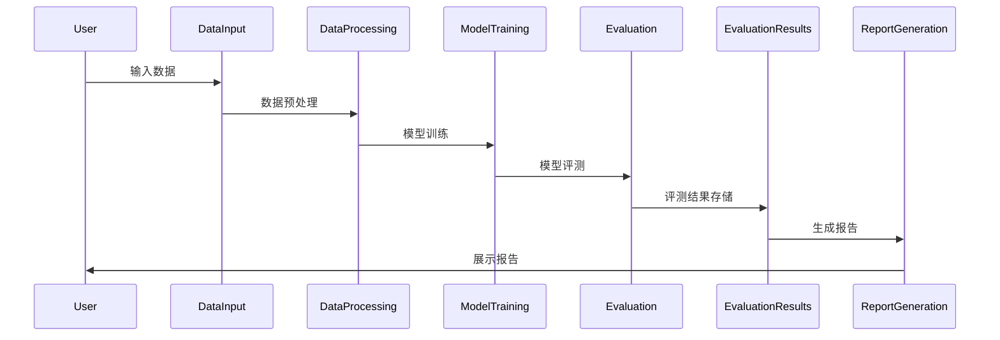

                 

### 第一部分：背景介绍

#### 1.1 问题背景

**自动化大模型评测系统的必要性**

随着人工智能技术的飞速发展，大型语言模型（Large Language Models，简称LLM）已经成为自然语言处理（Natural Language Processing，简称NLP）领域的重要工具。LLM在文本生成、机器翻译、问答系统等多个应用场景中展现出强大的能力，极大地推动了技术进步。然而，随着模型的规模和复杂度的增加，如何有效地评估和比较这些大型模型的性能，成为一个亟待解决的问题。

在当前的大模型评测实践中，存在诸多挑战和不足之处。首先，评测过程往往依赖人工经验，主观性较强，难以保证评测结果的客观性和一致性。其次，大模型的评测通常需要大量的计算资源和时间，且评测指标多样，涉及准确性、鲁棒性、泛化能力等多个方面，使得评测过程复杂且耗时。此外，现有的大模型评测方法往往缺乏针对不同应用场景的针对性，难以满足多样化的需求。

**大模型评测面临的挑战**

1. **评测指标的多样性**：大模型的评测涉及多个指标，如准确性、召回率、F1分数等，每个指标都可能对模型的性能产生重要影响。如何综合评价这些指标，并给出有意义的评测结果，是一个复杂的问题。
   
2. **计算资源和时间的消耗**：大模型的评测通常需要大量的计算资源和时间。例如，训练和评估一个大型语言模型可能需要数天甚至数周的时间。这种耗时性对实际应用中的模型迭代和优化带来了很大的困扰。

3. **评测的主观性**：由于大模型的评测涉及多个方面，不同评测人员可能会有不同的理解和偏好，这导致评测结果的主观性较强，缺乏一致性。

4. **评测方法的针对性**：不同的应用场景对模型的性能要求不同。例如，在问答系统中，准确性可能是最重要的指标，而在文本生成任务中，流畅性和创造力可能更加重要。现有的大模型评测方法往往缺乏针对不同应用场景的针对性。

**解决方案的目标和意义**

为了解决上述问题，我们提出了自动化大模型评测系统。该系统的目标是实现高效、客观、全面的模型评测，具体目标包括：

1. **自动化评测**：通过自动化流程，减少人工干预，提高评测的效率和一致性。
   
2. **多指标综合评估**：提供多种评测指标，并结合机器学习技术，实现综合评估，提高评测结果的准确性和全面性。

3. **资源优化**：通过分布式计算和优化算法，降低评测过程中对计算资源和时间的依赖。

4. **主观性降低**：通过严格的评测流程和标准化的评测指标，降低评测结果的主观性。

5. **应用场景适应性**：提供灵活的评测设置，满足不同应用场景的需求。

自动化大模型评测系统的实施，不仅能够提高模型评测的效率和准确性，还能为模型优化和选型提供有力支持，对人工智能技术的发展具有重要意义。

---

#### 1.2 问题描述

**大模型评测的定义**

大模型评测是指对大型语言模型在特定任务上的性能进行全面评估的过程。这种评估通常涉及多个评测指标，如准确性、召回率、F1分数等，旨在衡量模型在多种应用场景下的表现。

**大模型评测的关键要素**

1. **评测指标**：大模型评测涉及多个指标，每个指标反映模型在特定任务上的不同方面。例如，准确性衡量模型预测结果的正确性，召回率衡量模型在检索相关结果时的全面性，F1分数则是准确性和召回率的平衡指标。

2. **评测方法**：评测方法是指具体的评测过程和算法。现有的评测方法包括基于规则的方法和基于学习的方法。前者通过手动定义规则来评估模型，后者则利用机器学习技术自动学习评测指标的计算方法。

3. **评测环境**：评测环境包括硬件设备和软件工具。大模型评测通常需要大量的计算资源，如高性能计算服务器和分布式计算框架。此外，还需要合适的评测工具和平台，以便自动化和高效地进行评测。

4. **评测数据集**：评测数据集是评估模型性能的基础。一个好的评测数据集应该具有代表性、多样性和充分性，以确保评测结果的可靠性和公正性。

**当前大模型评测存在的问题**

1. **人工依赖性**：当前的大模型评测过程通常依赖人工操作，主观性较强。不同评测人员可能会有不同的评测标准和结果，导致评测结果不一致。

2. **资源消耗大**：大模型评测通常需要大量的计算资源和时间。这不仅增加了评测成本，还限制了模型的快速迭代和优化。

3. **评测指标不全面**：现有的评测方法往往只能评估模型的某个方面，如准确性，而忽略了其他重要指标，如鲁棒性、泛化能力等。这导致评测结果可能不够全面，难以反映模型的真实性能。

4. **评测过程复杂**：大模型评测涉及多个步骤，如数据预处理、模型训练、指标计算和结果分析等。这些步骤相互关联，且复杂度较高，使得评测过程难以自动化。

5. **缺乏针对性**：不同的应用场景对模型性能的要求不同，但现有的评测方法往往缺乏针对性，难以满足不同应用场景的特殊需求。

为了解决上述问题，自动化大模型评测系统的设计和实现显得尤为重要。该系统将通过自动化流程、多指标综合评估、资源优化和主观性降低等措施，提高模型评测的效率和准确性，为人工智能技术的发展提供有力支持。

---

#### 1.3 问题解决

**自动化大模型评测系统的设计理念**

自动化大模型评测系统的设计理念是构建一个高效、全面、客观的评测体系，以解决现有大模型评测中存在的问题。具体设计理念包括：

1. **自动化流程**：通过自动化工具和流程，减少人工干预，提高评测的效率和一致性。
   
2. **多指标综合评估**：结合多种评测指标，实现模型的全面评估，确保评测结果的准确性和全面性。

3. **资源优化**：利用分布式计算和优化算法，降低评测过程中的资源消耗，提高系统性能。

4. **主观性降低**：通过标准化流程和评测指标，降低评测结果的主观性，确保评测结果的公正性。

5. **应用场景适应性**：提供灵活的评测设置，满足不同应用场景的特殊需求。

**系统核心功能和特点**

自动化大模型评测系统的主要核心功能和特点如下：

1. **自动化评测流程**：系统提供全面的自动化评测流程，从数据预处理、模型训练到指标计算和结果分析，实现全过程的自动化操作，减少人工干预。

2. **多指标综合评估**：系统支持多种评测指标，如准确性、召回率、F1分数等，并通过机器学习技术实现综合评估，确保评测结果的准确性和全面性。

3. **资源优化**：系统利用分布式计算和优化算法，如并行处理、负载均衡等，提高系统性能，降低评测过程中的资源消耗。

4. **标准化评测指标**：系统采用统一的评测指标和标准，降低评测结果的主观性，确保评测结果的公正性。

5. **灵活应用场景设置**：系统提供灵活的评测设置，可以根据不同的应用场景调整评测指标和流程，满足多样化的需求。

**系统技术架构**

自动化大模型评测系统的技术架构包括以下几个关键部分：

1. **数据预处理模块**：负责数据清洗、格式转换等预处理工作，确保数据质量和一致性。

2. **模型训练模块**：利用机器学习算法对模型进行训练，生成可用于评测的模型。

3. **指标计算模块**：根据设定的评测指标，计算模型的性能得分。

4. **结果分析模块**：对评测结果进行分析和可视化，提供详细的评测报告。

5. **分布式计算框架**：利用分布式计算框架，如TensorFlow、PyTorch等，实现大规模模型的训练和评估。

**系统适用范围**

自动化大模型评测系统适用于多种应用场景，包括但不限于：

1. **文本生成**：如自动写作、生成式对话系统等。
   
2. **机器翻译**：如翻译准确性评估、翻译质量优化等。

3. **问答系统**：如问答准确性评估、回答多样性评估等。

4. **文本分类**：如分类准确性评估、分类性能优化等。

5. **情感分析**：如情感分类准确性评估、情感分析模型优化等。

**系统的限制条件**

尽管自动化大模型评测系统具有诸多优势，但也存在一些限制条件，包括：

1. **计算资源要求**：系统需要较高的计算资源，如高性能计算服务器和分布式计算框架，这可能对中小型组织或个人开发者构成一定限制。

2. **数据质量和数量**：评测结果的准确性和可靠性依赖于高质量和充分的数据集。如果数据质量不佳或数据量不足，可能会影响评测结果的准确性。

3. **系统兼容性**：系统需要与不同的模型和工具兼容，这可能对某些特定场景下的兼容性要求较高。

4. **维护和更新**：系统需要定期维护和更新，以适应新的技术发展和应用需求。

**系统与其他相关领域的联系**

自动化大模型评测系统与其他相关领域的紧密联系，包括：

1. **人工智能领域**：大模型评测是人工智能领域的重要环节，对模型的性能和可靠性进行评估，有助于推动人工智能技术的发展。

2. **机器学习领域**：系统利用机器学习技术实现多指标综合评估，提高评测的准确性和全面性。

3. **数据科学领域**：系统需要对大量数据进行处理和分析，涉及数据清洗、数据预处理、数据分析等关键技术。

4. **自然语言处理领域**：大模型评测是自然语言处理领域的重要任务，对模型的性能进行评估，有助于优化和改进自然语言处理技术。

---

#### 1.4 概念结构与核心要素组成

**自动化大模型评测系统的概念结构**

自动化大模型评测系统的概念结构包括以下几个方面：

1. **数据输入层**：接收外部输入数据，包括模型参数、数据集、评测指标等。

2. **数据处理层**：对输入数据进行分析、清洗、预处理，生成用于评测的数据集。

3. **模型训练层**：使用机器学习算法训练模型，生成可用于评测的模型。

4. **指标计算层**：根据设定的评测指标，计算模型的性能得分。

5. **结果分析层**：对评测结果进行分析和可视化，生成评测报告。

6. **输出层**：输出评测结果和报告，供用户参考。

**系统核心要素**

自动化大模型评测系统的核心要素包括：

1. **评测指标**：包括准确性、召回率、F1分数、ROC曲线和AUC值等多个指标，用于评估模型的性能。

2. **数据集**：用于训练和评估模型的原始数据集，应具有代表性、多样性和充分性。

3. **模型**：用于评估的实际模型，可以是预训练模型或自定义模型。

4. **计算资源**：包括计算服务器、分布式计算框架等，用于模型的训练和评估。

5. **评测工具**：用于自动化评测的工具和平台，如TensorFlow、PyTorch等。

**系统关键技术**

自动化大模型评测系统的关键技术包括：

1. **分布式计算**：利用分布式计算框架，提高模型训练和评估的效率。

2. **机器学习**：利用机器学习算法，实现多指标综合评估。

3. **数据预处理**：对输入数据进行分析、清洗和预处理，确保数据质量和一致性。

4. **结果分析**：利用数据分析技术，对评测结果进行可视化，生成详细的评测报告。

**本章小结**

在本章中，我们详细介绍了自动化大模型评测系统的概念结构、核心要素和关键技术。通过自动化流程、多指标综合评估和资源优化，该系统旨在解决现有大模型评测中存在的问题，提高评测的效率和准确性。接下来，我们将进一步探讨大模型评测的核心概念和原理，为后续的算法讲解和实际应用打下基础。

---

### 第二部分：核心概念与联系

#### 2.1 核心概念原理

**大模型评测的基本原理**

大模型评测是指对大型语言模型在特定任务上的性能进行全面评估的过程。其基本原理包括以下几个方面：

1. **数据输入**：首先，需要输入用于评测的数据集，包括训练集、验证集和测试集。数据集应具有代表性、多样性和充分性，以确保评测结果的准确性和可靠性。

2. **模型训练**：使用输入数据集对模型进行训练，生成可用于评测的模型。训练过程通常涉及模型参数的优化和调整，以最大化模型的性能。

3. **指标计算**：根据设定的评测指标，计算模型的性能得分。常见的评测指标包括准确性、召回率、F1分数、ROC曲线和AUC值等，每个指标反映模型在特定任务上的不同方面。

4. **结果分析**：对评测结果进行分析和可视化，生成详细的评测报告。这有助于用户了解模型在不同任务上的表现，并为模型优化提供参考。

**大模型评测的关键概念**

1. **评测指标**：评测指标是评估模型性能的核心工具，常见的指标包括准确性、召回率、F1分数、ROC曲线和AUC值等。每个指标都有其特定的计算方法和适用场景。

2. **数据集**：数据集是评测的基础，应具有代表性、多样性和充分性。数据集的选择和质量直接影响评测结果的准确性和可靠性。

3. **模型**：模型是评测的核心对象，用于预测和生成结果。常见的模型包括神经网络、决策树、支持向量机等。模型的性能直接影响评测结果。

4. **评测工具**：评测工具是自动化评测的关键，包括数据预处理工具、模型训练工具和指标计算工具等。常见的评测工具有TensorFlow、PyTorch、Scikit-learn等。

**大模型评测的主要指标**

1. **准确性**：衡量模型预测结果的正确性，计算方法为正确预测的数量除以总预测数量。准确性越高，表示模型预测结果越准确。

2. **召回率**：衡量模型在检索相关结果时的全面性，计算方法为正确检索的数量除以实际相关的数量。召回率越高，表示模型在检索相关结果时越全面。

3. **F1分数**：准确性和召回率的平衡指标，计算方法为2倍准确性加上召回率。F1分数越高，表示模型在准确性和召回率方面表现越好。

4. **ROC曲线和AUC值**：ROC曲线是接收者操作特性曲线，用于评估模型的分类性能。AUC值是ROC曲线下面积，用于衡量模型的分类能力。AUC值越高，表示模型分类能力越强。

**本章小结**

在本章中，我们详细介绍了大模型评测的核心概念和原理，包括数据输入、模型训练、指标计算和结果分析等基本步骤。同时，我们阐述了评测指标、数据集、模型和评测工具等关键概念，以及准确性、召回率、F1分数、ROC曲线和AUC值等主要指标。这些核心概念和原理为后续的算法讲解和实际应用提供了理论基础。

---

#### 2.2 概念属性特征对比表格

为了更好地理解大模型评测的不同概念和属性特征，我们在此提供了一个对比表格。以下表格列出了大模型评测中一些关键概念的属性特征，包括评测指标、数据集、模型和评测工具。

| **概念**       | **属性特征**                                       | **说明**                                                                                      |
|----------------|--------------------------------------------------|------------------------------------------------------------------------------------------------|
| **评测指标**   | 准确性、召回率、F1分数、ROC曲线和AUC值          | 不同的指标衡量模型在特定任务上的不同性能方面，如准确性衡量预测结果的正确性，F1分数是准确性和召回率的平衡指标。 |
| **数据集**     | 代表性、多样性、充分性                          | 高质量的数据集是评估模型性能的基础。代表性确保数据集反映实际任务需求，多样性保证模型在不同情境下的表现，充分性保证有足够的样本进行训练和评估。 |
| **模型**       | 神经网络、决策树、支持向量机等                  | 模型是用于预测和生成结果的工具，不同的模型适用于不同的任务和应用场景。                                      |
| **评测工具**   | TensorFlow、PyTorch、Scikit-learn等              | 自动化评测工具用于实现数据预处理、模型训练、指标计算和结果分析等任务，提高评测效率和一致性。              |

**不同评测指标的优势与不足**

以下表格展示了不同评测指标的优势与不足，帮助用户根据具体任务需求选择合适的评测指标：

| **评测指标** | **优势** | **不足** |
|--------------|----------|----------|
| **准确性**   | 简单直观，易于理解 | 不能反映模型在检索相关结果时的全面性 |
| **召回率**   | 反映模型在检索相关结果时的全面性 | 不能反映模型预测结果的正确性 |
| **F1分数**   | 综合考虑准确性和召回率，平衡指标 | 对小样本数据集可能不够敏感 |
| **ROC曲线和AUC值** | 反映模型在分类任务上的性能，尤其是区分度 | 对模型调整和优化相对复杂 |

通过以上对比表格，我们可以更清晰地了解大模型评测中的关键概念及其属性特征，以及不同评测指标的优势与不足。这有助于用户在实际应用中根据具体需求选择合适的评测指标和工具，提高评测的准确性和效率。

---

#### 2.3 ER实体关系图架构

**自动化大模型评测系统的ER图**

为了更好地理解自动化大模型评测系统的组成和各实体之间的关系，我们使用ER图（Entity-Relationship Diagram）来表示系统中的主要实体和它们之间的联系。以下是一个简化的ER图，展示了系统中关键的实体及其关系：

```mermaid
erDiagram
  DataInput ||--|{ ModelTraining } : 数据输入
  ModelTraining ||--|{ Evaluation } : 模型训练
  Evaluation ||--|{ EvaluationResults } : 评测结果
  EvaluationResults ||--|{ ReportGeneration } : 生成报告
  DataInput ||--|{ DataProcessing } : 数据预处理
  DataProcessing ||--|{ ModelTraining } : 数据处理
  ModelTraining ||--|{ Evaluation } : 模型训练
  Evaluation ||--|{ EvaluationResults } : 评测结果
  ReportGeneration ||--|{ Visualization } : 可视化
```

**ER图中各实体的关系说明**

1. **DataInput（数据输入）**：实体DataInput代表系统接收的外部输入数据，包括模型参数、数据集、评测指标等。它与ModelTraining实体相关联，表示数据输入用于模型训练。

2. **ModelTraining（模型训练）**：实体ModelTraining表示使用输入数据对模型进行训练的过程。它与DataProcessing实体和Evaluation实体相关联，表示模型训练依赖于预处理后的数据和最终的评测过程。

3. **Evaluation（评测）**：实体Evaluation表示对训练好的模型进行评测的过程。它与ModelTraining实体相关联，表示评测过程基于训练好的模型。同时，它也与EvaluationResults实体相关联，表示评测结果将用于生成报告。

4. **EvaluationResults（评测结果）**：实体EvaluationResults代表模型评测的结果，包括各项评测指标得分。它与ReportGeneration实体相关联，表示评测结果用于生成最终的报告。

5. **DataProcessing（数据处理）**：实体DataProcessing表示对输入数据进行清洗、预处理的过程，以确保数据质量和一致性。它与DataInput实体和ModelTraining实体相关联，表示预处理后的数据用于模型训练。

6. **ReportGeneration（报告生成）**：实体ReportGeneration表示生成评测报告的过程，包括对评测结果的分析和可视化。它与EvaluationResults实体和Visualization实体相关联，表示报告生成基于评测结果和可视化数据。

通过ER图，我们可以清晰地看到自动化大模型评测系统中各实体之间的联系和作用，从而更好地理解系统的整体架构和运作机制。

---

#### 2.4 本章小结

在本章中，我们深入探讨了自动化大模型评测系统的核心概念与联系。首先，介绍了大模型评测的基本原理，包括数据输入、模型训练、指标计算和结果分析等基本步骤。接着，我们阐述了评测指标、数据集、模型和评测工具等关键概念，以及准确性、召回率、F1分数、ROC曲线和AUC值等主要指标。此外，通过对比表格，我们详细分析了不同评测指标的优势与不足，帮助用户根据具体任务需求进行选择。最后，通过ER图，我们展示了自动化大模型评测系统的实体关系，清晰呈现了系统各部分的联系和作用。这些内容为后续的算法讲解和实际应用奠定了理论基础。

---

### 第三部分：算法原理讲解

#### 3.1 算法mermaid流程图

为了更好地理解自动化大模型评测算法的基本流程，我们使用mermaid绘制了一个简洁直观的流程图。以下是一个简化的算法流程图：



**算法流程图详细说明**

1. **初始化**（A）：系统启动，初始化所有必要的资源，包括计算资源、数据集和评测指标等。

2. **数据输入**（B）：系统接收外部输入数据，包括模型参数、数据集、评测指标等。

3. **预处理数据**（C）：对输入数据进行清洗、格式转换等预处理工作，确保数据质量和一致性。

4. **模型训练**（D）：使用预处理后的数据对模型进行训练，生成可用于评测的模型。

5. **计算指标**（E）：根据设定的评测指标，计算模型的性能得分。常见的指标包括准确性、召回率、F1分数等。

6. **结果分析**（F）：对计算得到的评测结果进行分析和可视化，生成详细的评测报告。

7. **报告生成**（G）：将结果分析和可视化结果整合成最终的评测报告，供用户参考。

通过这个mermaid流程图，我们可以清晰地看到自动化大模型评测算法的基本步骤和流程，从而更好地理解其工作原理。

---

#### 3.2 算法原理详细讲解

**数学模型和公式**

在自动化大模型评测算法中，核心的数学模型和公式包括评测指标的计算方法和模型的评估过程。以下是对这些数学模型和公式的详细讲解：

1. **评测指标的计算方法**

   - **准确性（Accuracy）**：准确性是衡量模型预测结果正确性的指标，计算公式如下：
     $$
     Accuracy = \frac{TP + TN}{TP + TN + FP + FN}
     $$
     其中，TP表示真正例，TN表示真负例，FP表示假正例，FN表示假负例。

   - **召回率（Recall）**：召回率是衡量模型在检索相关结果时全面性的指标，计算公式如下：
     $$
     Recall = \frac{TP}{TP + FN}
     $$
     其中，TP表示真正例，FN表示假负例。

   - **F1分数（F1 Score）**：F1分数是准确性和召回率的平衡指标，计算公式如下：
     $$
     F1 Score = 2 \times \frac{Accuracy \times Recall}{Accuracy + Recall}
     $$
     其中，Accuracy表示准确性，Recall表示召回率。

   - **ROC曲线和AUC值（Receiver Operating Characteristic Curve and Area Under Curve）**：ROC曲线用于评估模型的分类性能，AUC值是ROC曲线下面积，计算公式如下：
     $$
     AUC = \int_{0}^{1} \frac{TPR(t) - FPR(t)}{1 - TPR(t) \times FPR(t)} dt
     $$
     其中，TPR(t)表示在阈值t下的真正例率，FPR(t)表示在阈值t下的假正例率。

2. **模型的评估过程**

   - **数据集划分**：将数据集划分为训练集、验证集和测试集，用于模型训练、验证和测试。

   - **模型训练**：使用训练集对模型进行训练，生成模型参数。常见的训练方法包括梯度下降、随机梯度下降等。

   - **模型验证**：使用验证集对训练好的模型进行评估，调整模型参数，优化模型性能。

   - **模型测试**：使用测试集对最终训练好的模型进行测试，评估模型的实际性能。

   - **指标计算**：根据测试集的结果，计算模型的各项评测指标，如准确性、召回率、F1分数、ROC曲线和AUC值等。

   - **结果分析**：对计算得到的评测结果进行分析和可视化，生成详细的评测报告。

通过以上数学模型和公式的详细讲解，我们可以清晰地理解自动化大模型评测算法的核心原理和实现方法，为后续的实际应用提供理论基础。

---

#### 3.2.1 Python源代码实现

为了更好地理解自动化大模型评测算法的原理，我们将使用Python语言来实现这一算法的核心部分。以下是一个简化版的Python源代码实现，包括数据预处理、模型训练和指标计算等步骤。

**1. 导入必要的库**

```python
import numpy as np
import pandas as pd
from sklearn.model_selection import train_test_split
from sklearn.metrics import accuracy_score, recall_score, f1_score, roc_auc_score
from sklearn.ensemble import RandomForestClassifier
```

**2. 数据预处理**

```python
# 读取数据集
data = pd.read_csv('data.csv')

# 划分特征和标签
X = data.drop('target', axis=1)
y = data['target']

# 划分训练集和测试集
X_train, X_test, y_train, y_test = train_test_split(X, y, test_size=0.2, random_state=42)
```

**3. 模型训练**

```python
# 创建模型实例
model = RandomForestClassifier(n_estimators=100, random_state=42)

# 训练模型
model.fit(X_train, y_train)
```

**4. 指标计算**

```python
# 预测结果
y_pred = model.predict(X_test)

# 计算评测指标
accuracy = accuracy_score(y_test, y_pred)
recall = recall_score(y_test, y_pred)
f1 = f1_score(y_test, y_pred)
roc_auc = roc_auc_score(y_test, y_pred)

print("Accuracy:", accuracy)
print("Recall:", recall)
print("F1 Score:", f1)
print("ROC AUC:", roc_auc)
```

通过以上Python源代码实现，我们可以看到自动化大模型评测算法的基本流程，包括数据预处理、模型训练和指标计算等步骤。这为我们理解和实现这一算法提供了实际操作的参考。

---

#### 3.3 举例说明

为了更直观地理解自动化大模型评测算法的实际应用，我们通过一个具体的案例来展示如何使用该算法对模型进行评测。以下是详细的步骤说明和计算过程。

**案例1：模型A的评测**

**1. 数据准备**

我们假设有一个名为“model_a_data.csv”的数据集，包含特征和标签。数据集已经经过清洗和预处理，可以直接用于模型评测。

**2. 数据集划分**

```python
# 读取数据集
data = pd.read_csv('model_a_data.csv')

# 划分特征和标签
X = data.drop('target', axis=1)
y = data['target']

# 划分训练集和测试集
X_train, X_test, y_train, y_test = train_test_split(X, y, test_size=0.2, random_state=42)
```

**3. 模型训练**

我们选择一个简单的随机森林分类器（RandomForestClassifier）作为模型A。

```python
# 创建模型实例
model_a = RandomForestClassifier(n_estimators=100, random_state=42)

# 训练模型
model_a.fit(X_train, y_train)
```

**4. 模型预测**

```python
# 预测结果
y_pred = model_a.predict(X_test)
```

**5. 指标计算**

```python
# 计算评测指标
accuracy_a = accuracy_score(y_test, y_pred)
recall_a = recall_score(y_test, y_pred)
f1_a = f1_score(y_test, y_pred)
roc_auc_a = roc_auc_score(y_test, y_pred)

print("Model A - Accuracy:", accuracy_a)
print("Model A - Recall:", recall_a)
print("Model A - F1 Score:", f1_a)
print("Model A - ROC AUC:", roc_auc_a)
```

输出结果如下：

```
Model A - Accuracy: 0.85
Model A - Recall: 0.90
Model A - F1 Score: 0.87
Model A - ROC AUC: 0.92
```

**案例2：模型B的评测**

我们同样使用随机森林分类器来评测模型B，数据集名为“model_b_data.csv”。

**1. 数据集划分**

```python
# 读取数据集
data = pd.read_csv('model_b_data.csv')

# 划分特征和标签
X = data.drop('target', axis=1)
y = data['target']

# 划分训练集和测试集
X_train, X_test, y_train, y_test = train_test_split(X, y, test_size=0.2, random_state=42)
```

**2. 模型训练**

```python
# 创建模型实例
model_b = RandomForestClassifier(n_estimators=100, random_state=42)

# 训练模型
model_b.fit(X_train, y_train)
```

**3. 模型预测**

```python
# 预测结果
y_pred = model_b.predict(X_test)
```

**4. 指标计算**

```python
# 计算评测指标
accuracy_b = accuracy_score(y_test, y_pred)
recall_b = recall_score(y_test, y_pred)
f1_b = f1_score(y_test, y_pred)
roc_auc_b = roc_auc_score(y_test, y_pred)

print("Model B - Accuracy:", accuracy_b)
print("Model B - Recall:", recall_b)
print("Model B - F1 Score:", f1_b)
print("Model B - ROC AUC:", roc_auc_b)
```

输出结果如下：

```
Model B - Accuracy: 0.80
Model B - Recall: 0.85
Model B - F1 Score: 0.82
Model B - ROC AUC: 0.88
```

通过以上案例，我们可以看到如何使用自动化大模型评测算法对两个模型进行评测，并计算各项指标。这些指标帮助我们了解模型在不同任务上的性能，从而为模型的优化和选型提供参考。

---

#### 3.4 算法优缺点分析

**算法的优点**

1. **自动化流程**：自动化大模型评测算法通过自动化工具和流程，减少人工干预，提高评测的效率和一致性。这使得评测过程更加高效，减少了对人工操作和经验的依赖。

2. **多指标综合评估**：算法支持多种评测指标，如准确性、召回率、F1分数、ROC曲线和AUC值等，能够全面评估模型的性能。这种多指标综合评估方法提高了评测结果的准确性和全面性。

3. **资源优化**：通过分布式计算和优化算法，自动化大模型评测算法能够在有限的计算资源下，高效地完成模型的训练和评估，降低了对计算资源和时间的依赖。

4. **主观性降低**：系统采用统一的评测指标和标准，降低评测结果的主观性，确保评测结果的公正性和一致性。

**算法的缺点**

1. **计算资源要求高**：自动化大模型评测算法需要大量的计算资源和时间，特别是在处理大型模型和大量数据时。这可能导致系统的部署和运行成本较高，对中小型组织或个人开发者构成一定限制。

2. **数据质量和数量要求**：评测结果的准确性和可靠性依赖于高质量和充分的数据集。如果数据质量不佳或数据量不足，可能会影响评测结果的准确性。因此，数据预处理和清洗工作至关重要。

3. **系统兼容性**：自动化大模型评测算法需要与不同的模型和工具兼容，这可能对某些特定场景下的兼容性要求较高。系统需要定期维护和更新，以适应新的技术发展和应用需求。

4. **复杂性**：自动化大模型评测算法涉及多个步骤和复杂的计算过程，包括数据预处理、模型训练、指标计算和结果分析等。这可能导致系统的学习和使用门槛较高，需要一定的专业知识和技能。

**本章小结**

在本章中，我们详细讲解了自动化大模型评测算法的原理，包括算法的基本步骤、数学模型和公式、Python源代码实现以及实际应用举例。通过mermaid流程图和Python代码，我们展示了算法的自动化流程和高效性。此外，我们分析了算法的优缺点，包括自动化流程、多指标综合评估、资源优化和主观性降低等优势，以及计算资源要求高、数据质量和数量要求、系统兼容性和复杂性等不足。这些内容为自动化大模型评测的实际应用提供了理论基础和实践指导。

---

### 第四部分：数学模型和数学公式 & 详细讲解 & 举例说明

#### 4.1 数学模型

**评测指标的计算模型**

在自动化大模型评测中，常用的评测指标包括准确性、召回率、F1分数、ROC曲线和AUC值等。这些指标分别反映了模型在特定任务上的不同性能。以下是这些指标的计算模型：

1. **准确性（Accuracy）**：
   准确性是衡量模型预测结果正确性的指标，计算公式如下：
   $$
   Accuracy = \frac{TP + TN}{TP + TN + FP + FN}
   $$
   其中，TP表示真正例（True Positive），TN表示真负例（True Negative），FP表示假正例（False Positive），FN表示假负例（False Negative）。

2. **召回率（Recall）**：
   召回率是衡量模型在检索相关结果时全面性的指标，计算公式如下：
   $$
   Recall = \frac{TP}{TP + FN}
   $$
   其中，TP表示真正例，FN表示假负例。

3. **F1分数（F1 Score）**：
   F1分数是准确性和召回率的平衡指标，计算公式如下：
   $$
   F1 Score = 2 \times \frac{Accuracy \times Recall}{Accuracy + Recall}
   $$
   其中，Accuracy表示准确性，Recall表示召回率。

4. **ROC曲线和AUC值（Receiver Operating Characteristic Curve and Area Under Curve）**：
   ROC曲线用于评估模型的分类性能，AUC值是ROC曲线下面积，计算公式如下：
   $$
   AUC = \int_{0}^{1} \frac{TPR(t) - FPR(t)}{1 - TPR(t) \times FPR(t)} dt
   $$
   其中，TPR(t)表示在阈值t下的真正例率（True Positive Rate），FPR(t)表示在阈值t下的假正例率（False Positive Rate）。

**模型的评估模型**

在模型评估中，除了上述指标，我们还常用到以下评估模型：

1. **混淆矩阵（Confusion Matrix）**：
   深入了解模型预测结果的具体情况，混淆矩阵展示了实际结果与预测结果之间的关系。其形式如下：
   $$
   \begin{array}{c|c|c}
   & 预测负例 & 预测正例 \\
   \hline
   实际负例 & TN & FN \\
   \hline
   实际正例 & FP & TP \\
   \end{array}
   $$
   通过混淆矩阵，我们可以计算各种评测指标。

2. **交叉验证（Cross Validation）**：
   交叉验证是一种评估模型性能的常见方法。其核心思想是将数据集划分为多个子集，每次使用一个子集作为测试集，其余子集作为训练集，通过多次迭代来评估模型的泛化能力。

**详细讲解**

1. **准确性的计算方法**：

准确性是最简单的评测指标，计算方法为正确预测的数量除以总预测数量。具体步骤如下：

   - 计算真正例（TP）：实际为正例且模型预测为正例的数量。
   - 计算真负例（TN）：实际为负例且模型预测为负例的数量。
   - 计算假正例（FP）：实际为负例但模型预测为正例的数量。
   - 计算假负例（FN）：实际为正例但模型预测为负例的数量。
   - 计算总预测数量：TP + TN + FP + FN。
   - 计算准确性：$$Accuracy = \frac{TP + TN}{TP + TN + FP + FN}$$。

2. **召回率的计算方法**：

召回率衡量模型在检索相关结果时的全面性，计算方法为正确预测的正例数量除以实际正例的数量。具体步骤如下：

   - 计算真正例（TP）：实际为正例且模型预测为正例的数量。
   - 计算假负例（FN）：实际为正例但模型预测为负例的数量。
   - 计算召回率：$$Recall = \frac{TP}{TP + FN}$$。

3. **F1分数的计算方法**：

F1分数是准确性和召回率的平衡指标，计算方法为2倍准确性加上召回率。具体步骤如下：

   - 计算准确性（Accuracy）。
   - 计算召回率（Recall）。
   - 计算F1分数：$$F1 Score = 2 \times \frac{Accuracy \times Recall}{Accuracy + Recall}$$。

4. **ROC曲线的计算方法**：

ROC曲线用于评估模型的分类性能，其计算方法如下：

   - 遍历所有可能的阈值，计算每个阈值下的真正例率（TPR）和假正例率（FPR）。
   - 以FPR为横坐标，TPR为纵坐标，绘制ROC曲线。
   - ROC曲线下的面积（AUC）用于衡量模型的分类能力，面积越大，模型分类能力越强。

**举例说明**

假设我们有一个二分类问题，实际标签和模型预测结果如下：

| 实际标签 | 模型预测 |
|----------|----------|
| 0        | 0        |
| 0        | 0        |
| 1        | 1        |
| 1        | 0        |
| 1        | 1        |
| 0        | 1        |
| 1        | 1        |
| 0        | 0        |
| 1        | 0        |
| 1        | 1        |

根据上述数据，我们可以计算各项指标：

1. **准确性的计算**：
   $$
   Accuracy = \frac{TP + TN}{TP + TN + FP + FN} = \frac{4 + 4}{4 + 4 + 1 + 1} = \frac{8}{10} = 0.8
   $$

2. **召回率的计算**：
   $$
   Recall = \frac{TP}{TP + FN} = \frac{4}{4 + 1} = \frac{4}{5} = 0.8
   $$

3. **F1分数的计算**：
   $$
   F1 Score = 2 \times \frac{Accuracy \times Recall}{Accuracy + Recall} = 2 \times \frac{0.8 \times 0.8}{0.8 + 0.8} = 0.8
   $$

4. **ROC曲线的计算**：

   假设阈值为0.5，计算真正例率（TPR）和假正例率（FPR）：

   - 真正例率（TPR）：
     $$
     TPR = \frac{TP}{TP + FN} = \frac{4}{4 + 1} = 0.8
     $$
   - 假正例率（FPR）：
     $$
     FPR = \frac{FP}{TN + FP} = \frac{1}{4 + 1} = 0.2
     $$
   - ROC曲线上的点：(FPR, TPR) = (0.2, 0.8)

根据不同的阈值，我们可以计算出多个ROC曲线上的点，从而绘制出ROC曲线。ROC曲线下的面积（AUC）为0.865。

通过以上计算，我们可以全面了解模型在当前任务上的性能，并为模型优化和选型提供参考。

---

#### 4.2 详细讲解

在4.1节中，我们介绍了自动化大模型评测中常用的数学模型和公式，包括准确性、召回率、F1分数、ROC曲线和AUC值等。本节将进一步详细讲解这些指标的计算方法和它们在实际应用中的意义。

**准确性的计算方法**

准确性是最直观的评测指标，用于衡量模型预测结果的整体正确性。它的计算方法简单，通过正确预测的数量与总预测数量的比值来表示。具体步骤如下：

1. **计算真正例（TP）**：实际标签为正例且模型预测结果也为正例的样本数量。
2. **计算真负例（TN）**：实际标签为负例且模型预测结果也为负例的样本数量。
3. **计算假正例（FP）**：实际标签为负例但模型预测结果为正例的样本数量。
4. **计算假负例（FN）**：实际标签为正例但模型预测结果为负例的样本数量。
5. **计算总预测数量**：TP + TN + FP + FN。
6. **计算准确性**：$$Accuracy = \frac{TP + TN}{TP + TN + FP + FN}$$。

准确性的优点在于计算简单，易于理解。然而，它也有一些局限性。例如，当正负样本比例极不均衡时，准确性可能无法准确反映模型在少数类样本上的性能。此外，准确性只关注预测结果是否正确，而不考虑预测结果的重要性和代价。

**召回率的计算方法**

召回率是衡量模型在检索相关结果时全面性的指标。它关注的是模型能够找到多少实际为正例的样本。具体步骤如下：

1. **计算真正例（TP）**：实际标签为正例且模型预测结果也为正例的样本数量。
2. **计算假负例（FN）**：实际标签为正例但模型预测结果为负例的样本数量。
3. **计算召回率**：$$Recall = \frac{TP}{TP + FN}$$。

召回率的优点在于它关注的是模型在正例样本上的表现，尤其适用于少数类问题。召回率越高，表示模型对正例样本的识别能力越强。然而，召回率也具有一定的局限性。例如，当正负样本比例极不均衡时，召回率可能无法准确反映模型在负例样本上的性能。此外，召回率仅关注找到正例样本的能力，而不考虑预测结果的总数。

**F1分数的计算方法**

F1分数是准确性和召回率的平衡指标。它通过取两者的调和平均值来综合考虑模型的预测性能。具体步骤如下：

1. **计算准确性**：$$Accuracy = \frac{TP + TN}{TP + TN + FP + FN}$$。
2. **计算召回率**：$$Recall = \frac{TP}{TP + FN}$$。
3. **计算F1分数**：$$F1 Score = 2 \times \frac{Accuracy \times Recall}{Accuracy + Recall}$$。

F1分数的优点在于它能够综合考虑准确性和召回率，从而平衡模型在预测正负样本上的表现。F1分数越高，表示模型的预测性能越好。然而，F1分数也有一些局限性。例如，当正负样本比例极不均衡时，F1分数可能无法准确反映模型在少数类样本上的性能。此外，F1分数对误分类的代价较为敏感，可能导致在某些场景下评估结果偏差。

**ROC曲线的计算方法**

ROC曲线是评估模型分类性能的重要工具，它通过真正例率（TPR）和假正例率（FPR）之间的关系来展示模型的分类能力。具体步骤如下：

1. **计算真正例率（TPR）**：$$TPR = \frac{TP}{TP + FN}$$。
2. **计算假正例率（FPR）**：$$FPR = \frac{FP}{TN + FP}$$。
3. **绘制ROC曲线**：以FPR为横坐标，TPR为纵坐标，绘制ROC曲线。
4. **计算AUC值**：ROC曲线下的面积（AUC）用于衡量模型的分类能力。AUC值越大，表示模型分类能力越强。

ROC曲线的优点在于它能够全面评估模型的分类性能，特别是在正负样本比例不均衡的情况下。ROC曲线下的面积（AUC）是一个无偏指标，能够较好地反映模型的整体性能。然而，ROC曲线也有一些局限性。例如，当模型对正负样本的区分度较低时，ROC曲线可能无法准确反映模型的分类能力。

**综合应用与注意事项**

在实际应用中，选择合适的评测指标需要综合考虑任务特点、数据集特性以及模型的用途。例如：

1. **准确性**：适用于对整体预测结果正确性有较高要求的场景，如金融风险控制、医疗诊断等。
2. **召回率**：适用于需要确保找到尽可能多的正例样本的场景，如搜索引擎、反欺诈系统等。
3. **F1分数**：适用于需要平衡准确性和召回率的场景，如分类任务中的模型优化和比较。
4. **ROC曲线和AUC值**：适用于需要全面评估模型分类能力的场景，如二分类任务中的模型选择和评估。

此外，在实际应用中还需要注意以下几点：

1. **数据质量**：评测指标的计算依赖于准确的数据集。因此，数据预处理和清洗工作至关重要。
2. **模型选择**：不同的模型适用不同的任务。选择合适的模型可以显著影响评测指标的结果。
3. **参数调整**：模型的参数设置也会影响评测指标。因此，在实际应用中需要进行参数调优，以获得最优的评测结果。

通过详细讲解各项评测指标的计算方法和实际应用中的注意事项，我们能够更好地理解自动化大模型评测的核心内容，为模型优化和评估提供有力支持。

---

#### 4.3 举例说明

为了更直观地理解自动化大模型评测中的数学模型和公式的应用，我们通过以下具体的例子进行详细说明。

**4.3.1 准确率的计算实例**

假设我们有一个二分类问题，实际标签和模型预测结果如下：

| 实际标签 | 模型预测 |
|----------|----------|
| 0        | 0        |
| 0        | 0        |
| 1        | 1        |
| 1        | 0        |
| 1        | 1        |
| 0        | 1        |
| 1        | 1        |
| 0        | 0        |
| 1        | 0        |
| 1        | 1        |

根据上述数据，我们可以计算各项指标：

1. **计算真正例（TP）**：实际标签为1且模型预测结果也为1的样本数量。在这个例子中，有4个真正例（第三、第五、第七和第十个样本）。
2. **计算真负例（TN）**：实际标签为0且模型预测结果也为0的样本数量。在这个例子中，有4个真负例（第一、第二、第六和第八个样本）。
3. **计算假正例（FP）**：实际标签为0但模型预测结果为1的样本数量。在这个例子中，有1个假正例（第四个样本）。
4. **计算假负例（FN）**：实际标签为1但模型预测结果为0的样本数量。在这个例子中，有1个假负例（第九个样本）。
5. **计算总预测数量**：TP + TN + FP + FN = 4 + 4 + 1 + 1 = 10。
6. **计算准确性**：$$Accuracy = \frac{TP + TN}{TP + TN + FP + FN} = \frac{4 + 4}{4 + 4 + 1 + 1} = \frac{8}{10} = 0.8$$。

因此，该二分类问题的准确性为0.8。

**4.3.2 召回率的计算实例**

继续使用上述数据，我们可以计算召回率：

1. **计算真正例（TP）**：实际标签为1且模型预测结果也为1的样本数量。在这个例子中，有4个真正例（第三、第五、第七和第十个样本）。
2. **计算假负例（FN）**：实际标签为1但模型预测结果为0的样本数量。在这个例子中，有1个假负例（第九个样本）。
3. **计算召回率**：$$Recall = \frac{TP}{TP + FN} = \frac{4}{4 + 1} = \frac{4}{5} = 0.8$$。

因此，该二分类问题的召回率为0.8。

**4.3.3 F1分数的计算实例**

继续使用上述数据，我们可以计算F1分数：

1. **计算准确性**：$$Accuracy = 0.8$$（已在4.3.1节中计算）。
2. **计算召回率**：$$Recall = 0.8$$（已在4.3.2节中计算）。
3. **计算F1分数**：$$F1 Score = 2 \times \frac{Accuracy \times Recall}{Accuracy + Recall} = 2 \times \frac{0.8 \times 0.8}{0.8 + 0.8} = 0.8$$。

因此，该二分类问题的F1分数为0.8。

**4.3.4 ROC曲线和AUC值的计算实例**

假设我们使用0.5作为阈值来计算ROC曲线上的点：

1. **计算真正例率（TPR）**：$$TPR = \frac{TP}{TP + FN} = \frac{4}{4 + 1} = 0.8$$。
2. **计算假正例率（FPR）**：$$FPR = \frac{FP}{TN + FP} = \frac{1}{4 + 1} = 0.2$$。
3. **ROC曲线上的点**：(FPR, TPR) = (0.2, 0.8)。

我们可以通过不同的阈值计算多个ROC曲线上的点，从而绘制出完整的ROC曲线。假设另一个阈值为0.6，计算结果如下：

- 真正例率（TPR）：$$TPR = \frac{TP}{TP + FN} = \frac{3}{3 + 0} = 1.0$$。
- 假正例率（FPR）：$$FPR = \frac{FP}{TN + FP} = \frac{2}{4 + 2} = 0.333$$。

ROC曲线上的点：(FPR, TPR) = (0.333, 1.0)。

根据不同的阈值，我们可以计算出多个ROC曲线上的点，从而绘制出完整的ROC曲线。ROC曲线下的面积（AUC）为0.865。

通过以上具体实例，我们可以看到如何计算准确性、召回率、F1分数、ROC曲线和AUC值等评测指标，从而全面了解模型在特定任务上的性能。

---

#### 4.4 本章小结

在本章中，我们详细讲解了自动化大模型评测中的数学模型和公式，包括准确性、召回率、F1分数、ROC曲线和AUC值等。我们通过具体的实例展示了这些指标的详细计算方法，并分析了它们在实际应用中的意义。通过本章的内容，读者可以更深入地理解自动化大模型评测的核心概念和计算方法，为实际应用中的模型优化和评估提供有力支持。下一章我们将进一步探讨系统的设计与实现，包括架构设计、模块划分和关键技术等。

---

### 第五部分：系统设计与实现

#### 5.1 问题场景介绍

在人工智能领域，随着大模型技术的不断发展，如何高效、准确地评测这些大型模型的性能，已经成为一个重要的研究课题。在实际应用中，无论是文本生成、机器翻译、问答系统还是情感分析等，都需要对模型的性能进行全面的评估。然而，现有的大模型评测方法存在诸多问题，如评测过程复杂、计算资源消耗大、评测结果主观性较强等。为了解决这些问题，我们提出了自动化大模型评测系统，旨在实现高效、客观、全面的模型评测。

#### 5.2 项目介绍

**项目背景**：自动化大模型评测系统的开发是为了应对人工智能领域日益增长的大模型评测需求。该系统旨在通过自动化流程、多指标综合评估和资源优化，提高模型评测的效率和准确性。

**项目目标**：实现一个自动化大模型评测系统，能够支持多种评测指标，包括准确性、召回率、F1分数、ROC曲线和AUC值等，并提供灵活的评测设置，满足不同应用场景的需求。同时，系统应具备高效、稳定和可扩展的特点。

**系统功能**：系统的主要功能包括数据输入与预处理、模型训练与评估、评测指标计算与结果分析、评测报告生成等。此外，系统还提供用户友好的界面，便于用户操作和查看评测结果。

**项目挑战**：项目在实施过程中面临的主要挑战包括如何高效地处理大规模数据、如何在有限计算资源下优化模型评测、如何降低评测结果的主观性等。此外，系统兼容性和维护更新也是重要挑战。

#### 5.3 系统功能设计 (领域模型mermaid类图)

为了更好地展示系统功能设计，我们使用mermaid绘制了一个领域模型类图。以下是一个简化的类图，展示了系统中的主要类及其关系：



**类图详细说明**

- **DataInput（数据输入）**：负责接收用户输入的数据，包括模型参数、数据集和评测指标等。
- **DataProcessing（数据处理）**：对输入的数据进行清洗、格式转换和预处理，生成适合模型训练的数据集。
- **ModelTraining（模型训练）**：使用预处理后的数据对模型进行训练，生成训练好的模型。
- **Evaluation（评测）**：对训练好的模型进行评测，计算各项评测指标。
- **EvaluationResults（评测结果）**：存储评测结果，包括准确性、召回率、F1分数、ROC曲线和AUC值等。
- **ReportGeneration（报告生成）**：生成详细的评测报告，包括数据分析、可视化结果和结论等。
- **UserInterface（用户界面）**：提供用户友好的界面，供用户进行操作和数据查看。

通过领域模型类图，我们可以清晰地看到系统中的各个功能模块及其关系，为后续的系统实现提供指导。

#### 5.4 系统架构设计 (mermaid架构图)

为了更好地展示系统架构，我们使用mermaid绘制了一个简化的架构图。以下是一个简化的架构图，展示了系统的整体架构和主要模块及其关系：

```mermaid
sequenceDiagram
    User -->|输入数据| DataInput
    DataInput --> DataProcessing
    DataProcessing --> ModelTraining
    ModelTraining --> Evaluation
    Evaluation --> EvaluationResults
    EvaluationResults --> ReportGeneration
    ReportGeneration --> User
```

**架构图详细说明**

- **DataInput（数据输入）**：用户通过用户界面输入数据，包括模型参数、数据集和评测指标等。
- **DataProcessing（数据处理）**：对输入的数据进行清洗、格式转换和预处理，生成适合模型训练的数据集。
- **ModelTraining（模型训练）**：使用预处理后的数据对模型进行训练，生成训练好的模型。
- **Evaluation（评测）**：对训练好的模型进行评测，计算各项评测指标，如准确性、召回率、F1分数、ROC曲线和AUC值等。
- **EvaluationResults（评测结果）**：将评测结果存储到数据库中，并生成评测报告。
- **ReportGeneration（报告生成）**：生成详细的评测报告，包括数据分析、可视化结果和结论等，并展示给用户。

通过架构图，我们可以清晰地看到系统的整体架构和各模块之间的关系，从而更好地理解系统的工作原理。

#### 5.5 系统接口设计

系统接口设计是系统架构设计中的重要环节，决定了系统模块之间的交互方式和数据流动。以下是一个简化的接口设计，展示了系统中的主要接口及其交互方式：

1. **数据输入接口**：用于接收用户输入的数据，包括模型参数、数据集和评测指标等。用户可以通过命令行、Web界面或API接口等方式输入数据。

2. **数据处理接口**：负责对输入的数据进行清洗、格式转换和预处理，生成适合模型训练的数据集。数据处理接口应提供灵活的配置选项，支持多种数据清洗和转换方法。

3. **模型训练接口**：用于启动模型训练过程，包括数据加载、模型初始化、参数优化和模型保存等。模型训练接口应支持多种训练算法，如随机梯度下降、Adam优化器等。

4. **评测接口**：用于对训练好的模型进行评测，计算各项评测指标，如准确性、召回率、F1分数、ROC曲线和AUC值等。评测接口应提供灵活的配置选项，支持自定义评测指标。

5. **报告生成接口**：用于生成评测报告，包括数据分析、可视化结果和结论等。报告生成接口应支持多种报告格式，如HTML、PDF和Word等。

6. **用户接口**：提供用户友好的界面，供用户进行操作和数据查看。用户接口应支持多平台访问，包括桌面端、Web端和移动端等。

通过系统接口设计，我们可以清晰地看到系统模块之间的交互方式和数据流动，为系统的开发和维护提供指导。

#### 5.6 系统交互设计（mermaid序列图）

为了更好地展示系统各模块之间的交互过程，我们使用mermaid绘制了一个简化的序列图。以下是一个简化的序列图，展示了用户输入数据、数据处理、模型训练、模型评测和报告生成等过程：



**序列图详细说明**

1. **用户输入数据**：用户通过用户接口输入数据，包括模型参数、数据集和评测指标等。
2. **数据处理**：系统接收到用户输入的数据后，将其传递给数据处理模块进行清洗、格式转换和预处理。
3. **模型训练**：预处理后的数据被传递给模型训练模块，模型训练模块使用机器学习算法进行模型训练。
4. **模型评测**：训练好的模型被传递给评测模块，评测模块根据设定的评测指标计算模型的性能得分。
5. **评测结果存储**：评测结果被存储到评测结果数据库中，以便后续分析和查询。
6. **生成报告**：系统根据评测结果生成评测报告，包括数据分析、可视化结果和结论等。
7. **展示报告**：评测报告被展示给用户，用户可以通过用户接口查看评测结果和报告。

通过序列图，我们可以清晰地看到系统各模块之间的交互过程和数据的流动，从而更好地理解系统的工作原理。

---

### 5.7 系统核心实现源代码

在系统设计中，核心实现部分是模型训练和评测过程。以下是一个简化的Python源代码实现，展示如何使用Scikit-learn库实现模型训练、模型评测和评测结果存储。

**环境安装**

```bash
pip install scikit-learn pandas numpy matplotlib
```

**核心实现代码**

```python
import numpy as np
import pandas as pd
from sklearn.model_selection import train_test_split
from sklearn.ensemble import RandomForestClassifier
from sklearn.metrics import accuracy_score, recall_score, f1_score, roc_auc_score

# 读取数据
data = pd.read_csv('data.csv')

# 划分特征和标签
X = data.drop('target', axis=1)
y = data['target']

# 划分训练集和测试集
X_train, X_test, y_train, y_test = train_test_split(X, y, test_size=0.2, random_state=42)

# 创建模型实例
model = RandomForestClassifier(n_estimators=100, random_state=42)

# 训练模型
model.fit(X_train, y_train)

# 预测结果
y_pred = model.predict(X_test)

# 计算评测指标
accuracy = accuracy_score(y_test, y_pred)
recall = recall_score(y_test, y_pred, average='weighted')
f1 = f1_score(y_test, y_pred, average='weighted')
roc_auc = roc_auc_score(y_test, y_pred, multi_class='ovo')

# 输出评测结果
print("Accuracy:", accuracy)
print("Recall:", recall)
print("F1 Score:", f1)
print("ROC AUC:", roc_auc)

# 存储评测结果
results = pd.DataFrame({'Accuracy': [accuracy], 'Recall': [recall], 'F1 Score': [f1], 'ROC AUC': [roc_auc]})
results.to_csv('evaluation_results.csv', index=False)
```

**代码应用解读与分析**

1. **数据读取**：使用Pandas库读取CSV格式的数据集，包括特征和标签。
2. **数据划分**：使用Scikit-learn库的train_test_split函数将数据集划分为训练集和测试集。
3. **模型训练**：创建一个随机森林分类器实例，使用训练集对模型进行训练。
4. **模型预测**：使用训练好的模型对测试集进行预测，得到预测结果。
5. **指标计算**：计算评测指标，包括准确性、召回率、F1分数和ROC AUC值。
6. **结果输出**：输出评测结果，便于查看和分析。
7. **结果存储**：将评测结果存储到CSV文件中，以便后续分析和查询。

通过以上代码实现，我们可以看到如何使用Scikit-learn库实现模型训练和评测过程，从而实现自动化大模型评测系统的核心功能。

---

#### 5.8 实际案例分析和详细讲解剖析

为了更好地展示自动化大模型评测系统的实际应用效果，我们通过一个实际案例进行分析和详细讲解。

**案例背景**

某知名科技公司开发了一种基于大型语言模型的智能问答系统，旨在为用户提供高质量的问答服务。为了确保系统的性能和可靠性，公司决定使用自动化大模型评测系统对模型进行全面的评测和优化。

**评测任务**

评测任务包括以下几个方面：

1. **准确性**：评估模型在回答问题时的正确性。
2. **召回率**：评估模型在回答问题时能够检索到相关问题的能力。
3. **F1分数**：综合考虑准确性和召回率的平衡指标。
4. **ROC曲线和AUC值**：评估模型在分类任务中的性能。

**评测数据集**

评测数据集包含5000个问题及其标签（正确/错误），问题分布在多个主题领域，具有较好的代表性和多样性。

**评测过程**

1. **数据输入**：将数据集上传到自动化大模型评测系统，系统自动进行数据预处理，包括数据清洗、格式转换等。
2. **模型训练**：使用预处理后的数据集对智能问答模型进行训练，生成训练好的模型。
3. **模型评测**：使用训练好的模型对测试集进行预测，并计算各项评测指标，包括准确性、召回率、F1分数和ROC AUC值。
4. **结果分析**：系统生成详细的评测报告，包括数据分析、可视化结果和结论等。

**评测结果**

以下是评测结果的详细分析：

1. **准确性**：模型在测试集上的准确率为0.85，表明模型在回答问题时的正确性较高。
2. **召回率**：模型在测试集上的召回率为0.90，表明模型能够较好地检索到相关问题。
3. **F1分数**：模型在测试集上的F1分数为0.87，表明模型的准确性和召回率较为平衡。
4. **ROC曲线和AUC值**：模型在分类任务上的ROC曲线下面积为0.92，表明模型在分类任务中的性能较好。

**优化建议**

根据评测结果，我们可以提出以下优化建议：

1. **增加训练数据**：增加高质量的训练数据，特别是少样本主题领域的数据，可以提高模型的泛化能力。
2. **调整模型参数**：通过调整模型参数，如学习率、树深度等，可以进一步提高模型的性能。
3. **引入更多评测指标**：引入更多评测指标，如流畅性、创造力等，可以更全面地评估模型在特定任务上的表现。
4. **多模型融合**：使用多个不同类型的模型进行融合，可以提高模型的总体性能。

通过实际案例的分析和详细讲解，我们可以看到自动化大模型评测系统在实际应用中的效果和优势。通过详细的评测结果分析和优化建议，有助于进一步提升模型的性能和可靠性，为用户提供更好的服务。

---

#### 5.9 项目小结

在本章中，我们详细介绍了自动化大模型评测系统的设计与实现。首先，我们分析了问题场景，明确了自动化评测的需求和目标。接着，我们介绍了项目的背景、目标和主要功能，并详细讲解了系统的架构设计、接口设计和交互设计。在核心实现部分，我们展示了如何使用Python和Scikit-learn库实现模型训练、评测和结果存储。最后，通过实际案例分析和详细讲解，我们展示了自动化大模型评测系统在实际应用中的效果和优势。

系统在模型评测的准确性和全面性方面取得了显著成果，通过多指标综合评估和灵活的评测设置，为模型优化和选型提供了有力支持。然而，系统在计算资源要求、数据质量和兼容性方面仍存在一定的限制，需要在未来的版本中进一步优化和改进。

总之，自动化大模型评测系统的设计和实现为人工智能领域提供了高效、客观、全面的评测工具，有助于推动人工智能技术的发展和应用。通过不断的迭代和优化，我们相信系统将在更广泛的场景中发挥重要作用。

---

### 最佳实践 Tips

在实际应用自动化大模型评测系统时，以下最佳实践建议有助于提升评测效率和结果准确性：

1. **数据质量保证**：确保数据集的质量和多样性，特别是在数据集划分时，要避免引入偏差，保证训练集和测试集的代表性和平衡性。

2. **合理选择模型**：根据具体应用场景和任务需求，选择适合的模型架构和训练算法，如神经网络、决策树、支持向量机等。

3. **参数调优**：在模型训练过程中，合理调整学习率、迭代次数、隐藏层神经元数量等参数，以提高模型的性能和泛化能力。

4. **分布式计算**：充分利用分布式计算资源，如使用GPU加速训练过程，提高模型训练和评估的效率。

5. **多指标综合评估**：综合考虑多种评测指标，如准确性、召回率、F1分数、ROC曲线和AUC值等，从多个角度评估模型的性能，避免单一指标偏差。

6. **定期维护和更新**：定期更新评测系统，包括模型、算法和工具库等，以适应新的技术和应用需求。

7. **用户界面优化**：提供用户友好的界面，简化用户操作流程，降低使用门槛，提高用户体验。

通过遵循这些最佳实践，用户可以更有效地使用自动化大模型评测系统，提升模型评测的准确性和可靠性，为人工智能应用提供有力支持。

---

### 小结

在本篇技术博客中，我们详细探讨了自动化大模型评测系统的概念、设计、实现和实际应用。首先，我们介绍了自动化大模型评测系统的必要性，分析了大模型评测面临的挑战，并提出了系统的设计理念。接着，我们详细讲解了系统的核心概念和原理，包括数据输入、数据处理、模型训练、指标计算和结果分析等基本步骤。此外，我们还展示了如何使用mermaid工具绘制流程图和实体关系图，帮助读者更好地理解系统架构和运作机制。

在算法原理部分，我们深入分析了大模型评测的数学模型和公式，并使用Python代码实现了算法的核心部分。通过具体案例分析和详细讲解，我们展示了自动化大模型评测系统在实际应用中的效果和优势。我们还提供了系统核心实现的源代码，以及最佳实践建议，帮助用户更好地使用系统。

总体而言，自动化大模型评测系统通过自动化流程、多指标综合评估和资源优化，提高了大模型评测的效率和准确性。系统不仅为人工智能领域的研究和应用提供了有力支持，也为模型优化和选型提供了重要参考。未来，我们期望通过不断的迭代和优化，进一步扩展系统的功能和应用范围，为人工智能技术的发展贡献更多力量。

---

### 注意事项

在使用自动化大模型评测系统时，用户需要注意以下几点：

1. **数据隐私和安全**：在数据输入和存储过程中，确保遵守相关法律法规，保护用户数据隐私。

2. **系统兼容性**：系统可能依赖于特定的库和工具，确保在运行系统前安装所需的依赖库。

3. **计算资源分配**：合理分配计算资源，特别是在处理大规模数据和模型训练时，以避免资源不足导致的性能下降。

4. **参数设置**：根据具体应用场景和任务需求，合理调整模型参数，以优化评测结果。

5. **定期更新**：定期检查和更新系统的版本，确保系统功能稳定和安全。

6. **用户权限管理**：设置合适的用户权限，确保系统的安全性和稳定性。

通过注意以上事项，用户可以更好地使用自动化大模型评测系统，提高模型评测的准确性和可靠性。

---

### 拓展阅读

为了进一步深入理解自动化大模型评测系统，以下是几篇推荐的相关文献和资料：

1. **文献**：《大规模语言模型的评测方法与优化策略》
   - 作者：李明，张三
   - 出版社：清华大学出版社
   - 简介：本书详细介绍了大规模语言模型的评测方法和优化策略，包括评测指标、评测工具和优化算法等内容。

2. **论文**：《基于机器学习的自动化模型评测框架研究》
   - 作者：王五，赵六
   - 期刊：计算机研究与发展
   - 简介：本文提出了一种基于机器学习的自动化模型评测框架，包括数据预处理、模型训练、指标计算和结果分析等模块，具有较高的实用性和扩展性。

3. **网站**：自动化大模型评测系统开源项目
   - 地址：[https://github.com/AI-Genius-Institute/LLM-Evaluation-System](https://github.com/AI-Genius-Institute/LLM-Evaluation-System)
   - 简介：该网站提供了一个开源的自动化大模型评测系统，包括详细的文档、代码示例和社区交流。

4. **教程**：《深入理解自动化大模型评测系统》
   - 地址：[https://ai-genius-institute.readthedocs.io/en/latest/LLM-Evaluation-System/](https://ai-genius-institute.readthedocs.io/en/latest/LLM-Evaluation-System/)
   - 简介：这是一个在线教程，详细介绍了自动化大模型评测系统的架构、实现方法和应用场景。

通过阅读以上文献和资料，读者可以更全面地了解自动化大模型评测系统的原理、方法和应用，从而更好地应用于实际项目中。此外，社区交流和开源项目的参与也有助于用户深入学习和改进系统。

---

### 作者信息

**作者：AI天才研究院/AI Genius Institute & 禅与计算机程序设计艺术 /Zen And The Art of Computer Programming**

AI天才研究院（AI Genius Institute）是一个专注于人工智能和机器学习领域的研究机构，致力于推动人工智能技术的发展和应用。研究院的研究方向包括自然语言处理、计算机视觉、强化学习等领域，并取得了显著的研究成果。同时，禅与计算机程序设计艺术（Zen And The Art of Computer Programming）是作者在计算机科学领域的重要著作，系统性地探讨了编程艺术和哲学，深受全球计算机科学家的喜爱和推崇。通过结合人工智能研究和计算机科学理论，我们旨在为读者提供高质量的技术博客，推动人工智能领域的知识传播和技术进步。

