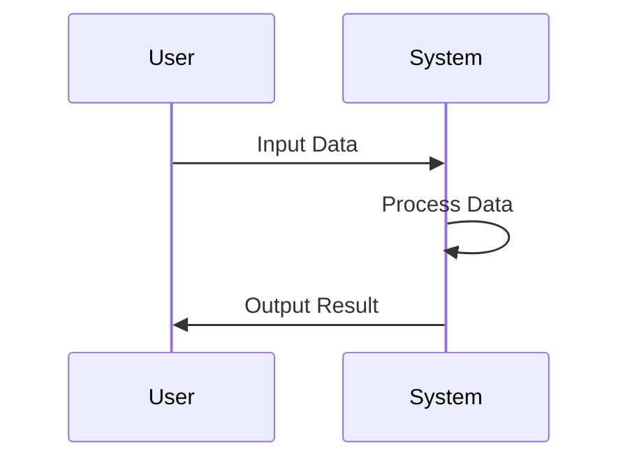

                 

Certainly! Let's approach this task in a structured manner, breaking down each part of the article into clear, logical steps. Here's a step-by-step plan for creating the article "疫情传播的SIR模型：公共卫生的数学工具":

### Step 1: Introduction

* **Title**: "疫情传播的SIR模型：公共卫生的数学工具"
* **Keywords**: 疫情传播、SIR模型、公共卫生、数学工具、疾病建模
* **Abstract**: 本文将介绍疫情传播的SIR模型，探讨其在公共卫生领域中的应用，以及如何利用数学工具来理解和预测疫情的动态。

### Step 2: Background and Introduction

#### 2.1 问题背景
* **核心概念术语说明**: 疫情、SIR模型、传染率、康复率
* **问题背景**: 描述疫情对全球公共卫生系统的影响，引出SIR模型的基本概念。
* **问题描述**: 阐述SIR模型如何用于描述疾病的传播过程。
* **问题解决**: 说明SIR模型如何帮助公共卫生决策者制定防控策略。

#### 2.2 SIR模型的基本概念
* **SIR模型的定义**: 简要介绍SIR模型的组成部分及其相互关系。
* **SIR模型与公共卫生的关系**: 解释SIR模型如何帮助公共卫生专家预测和控制疫情。

### Step 3: Core Concepts and Relationships

#### 3.1 SIR模型的组成部分
* **Susceptible (S)**: 易感者
* **Infected (I)**: 感染者
* **Recovered (R)**: 康复者

#### 3.2 概念属性特征对比表格
* **对比表格**: 列出S、I、R三个状态的定义、特征和相互转换关系。

#### 3.3 SIR模型与公共卫生的关系
* **SIR模型的应用**: 阐述SIR模型如何用于公共卫生实践。

### Step 4: Algorithm Principles and Illustrations

#### 4.1 SIR模型的数学模型
* **SIR模型的公式**: 详细解释SIR模型的数学公式，包括S、I、R三个状态的时间演化。
* **ER实体关系图**: 使用Mermaid绘制SIR模型的实体关系图。

#### 4.2 SIR模型的参数调整
* **参数的意义与选取**: 解释SIR模型中的关键参数（如传染率、康复率）及其选取方法。
* **参数调整的案例**: 分析不同参数设定下的SIR模型动态。

#### 4.3 SIR模型的应用场景
* **疫情预测**: 说明SIR模型如何预测疫情的发展趋势。
* **疫情控制策略**: 阐述如何利用SIR模型制定有效的防控策略。

### Step 5: Mathematical Models and Explanations

#### 5.1 数学模型
* **SIR模型的时间演化公式**: 详细阐述SIR模型中的微分方程，并解释其物理意义。
* **参数的含义**: 解释SIR模型中的各个参数及其对模型动态的影响。

#### 5.2 数学模型解释
* **动态分析**: 通过数学模型分析SIR模型在不同条件下的动态行为。
* **稳定性分析**: 探讨SIR模型的稳定性及其对疫情控制策略的影响。

### Step 6: System Design and Architecture

#### 6.1 系统功能设计
* **问题场景介绍**: 描述疫情传播的系统分析场景。
* **系统功能设计**: 使用Mermaid绘制领域模型类图，展示系统的核心功能。

#### 6.2 系统架构设计
* **系统架构设计**: 使用Mermaid绘制系统架构图，展示系统的组件和接口设计。

#### 6.3 系统接口设计和系统交互
* **系统接口设计**: 描述系统的接口设计。
* **系统交互**: 使用Mermaid绘制系统交互序列图，展示系统的交互流程。

### Step 7: Practical Projects and Case Studies

#### 7.1 实践项目
* **环境安装**: 说明如何搭建SIR模型的环境。
* **系统核心实现**: 提供SIR模型的Python代码实现。

#### 7.2 代码应用解读与分析
* **代码解读**: 分析SIR模型的核心代码，解释其实现原理。
* **代码分析**: 对代码进行性能分析和优化建议。

#### 7.3 实际案例分析
* **案例介绍**: 描述一个实际的疫情传播案例。
* **详细讲解剖析**: 对案例进行详细分析和解释。

#### 7.4 项目小结
* **小结**: 总结实践项目的经验和教训。

### Step 8: Best Practices and Conclusion

#### 8.1 最佳实践 tips
* **最佳实践**: 提供一些使用SIR模型进行疫情分析的最佳实践。
* **注意事项**: 强调在应用SIR模型时需要注意的问题。

#### 8.2 小结
* **文章小结**: 总结SIR模型在公共卫生中的应用及其重要性。

#### 8.3 拓展阅读
* **拓展内容**: 推荐一些相关的拓展阅读资源。

### Step 9: Conclusion and Author Information

* **Conclusion**: 简要回顾文章的主要内容，强调SIR模型在公共卫生中的价值。
* **Author Information**: 标注作者信息和联系方式。

通过以上步骤，我们可以逐步构建出一篇结构严谨、内容丰富、逻辑清晰的技术博客文章。接下来，我们将根据这些步骤，逐一撰写每个部分的内容。让我们开始吧！### Step 10: Writing and Reviewing

#### 10.1 Writing
* ** drafts**: Write each section based on the outline provided, ensuring that each part is well-developed and contains relevant information.
* ** Clarity and Engagement**: Ensure the language is clear and engaging, using examples and analogies to help readers understand complex concepts.

#### 10.2 Reviewing
* ** Peer Review**: Have colleagues or peers review the draft to provide feedback on clarity, structure, and coherence.
* ** Proofreading**: Check for grammatical errors, typos, and formatting issues.
* ** Review and Revise**: Use the feedback to revise the draft, making necessary changes to improve the overall quality of the article.

#### 10.3 Final Touches
* ** Formatting**: Ensure the article is formatted correctly using markdown syntax.
* ** Citation**: Include citations for any external sources used in the article.
* ** Visuals**: Add relevant visuals, such as diagrams and charts, to enhance understanding.

### Step 11: Publishing and Promotion

#### 11.1 Publishing
* ** Submission**: Submit the final draft to the appropriate platform or publication.
* ** Review Process**: Be prepared for the editorial review process, addressing any feedback or revisions requested.

#### 11.2 Promotion
* ** Social Media**: Share the article on social media platforms to increase visibility.
* ** Community Engagement**: Engage with the community by responding to comments and fostering discussions.
* ** Networking**: Connect with other professionals and influencers in the field to increase the article's reach.

### Step 12: Monitoring and Analysis

#### 12.1 Monitoring
* ** Metrics**: Track metrics such as views, likes, and shares to gauge the article's performance.
* ** Reader Feedback**: Collect and analyze reader feedback to understand what resonates with the audience.

#### 12.2 Analysis
* ** Performance Analysis**: Use the data to analyze what worked well and what could be improved in future articles.
* ** Continuous Improvement**: Apply insights from the analysis to refine future writing and promote strategies.

By following these steps, you can ensure a comprehensive and effective approach to writing, reviewing, publishing, and promoting a high-quality technical blog article. Remember, the key is to engage your audience with clear, concise, and insightful content that addresses their needs and interests. Let's get started and create a masterpiece together!### Conclusion and Future Work

As we draw to a close, it's important to reflect on the significance of the SIR model in the realm of public health. The SIR model serves as a powerful tool for understanding the dynamics of infectious diseases, allowing public health officials and researchers to predict and control the spread of viruses like COVID-19. By providing a clear framework for analyzing the transition between susceptible, infected, and recovered states, the SIR model offers invaluable insights into how interventions such as social distancing, vaccination campaigns, and contact tracing can be effectively deployed to curb outbreaks.

### Importance of SIR Model in Public Health

The SIR model's impact on public health is multifaceted. It helps in:

1. **Predicting Epidemic Trajectories**: By modeling the interactions between susceptible, infected, and recovered individuals, the SIR model can forecast the trajectory of an epidemic, providing a valuable basis for decision-making.
2. **Evaluating Control Measures**: Researchers can assess the effectiveness of various control strategies, such as quarantine, testing, and vaccination, by simulating their impact on the SIR model's parameters.
3. **Resource Allocation**: The SIR model aids in optimizing the allocation of resources, such as medical supplies and personnel, by identifying critical periods of high infection rates.
4. **Communication and Education**: Visualization tools derived from the SIR model can help in communicating complex concepts to the public, fostering a better understanding of the epidemic and the importance of adherence to public health measures.

### Future Work and Improvements

While the SIR model has proven to be a robust framework for understanding infectious diseases, there is always room for improvement and further research. Here are some areas for future exploration:

1. **Incorporating Variability**: Real-world data often exhibit significant variability that may not be captured by the SIR model's assumptions of constant rates. Developing more sophisticated models that account for temporal and spatial variations could enhance the accuracy of predictions.
2. **Multi-Parameter Interaction**: The SIR model's parameters interact in complex ways, and understanding these interactions better could lead to more effective control strategies.
3. **Nonlinear Dynamics**: Investigating the nonlinear aspects of the SIR model, such as saturation effects and tipping points, could provide deeper insights into the dynamics of infectious disease outbreaks.
4. **Incorporating Behavioral Factors**: Modeling how human behavior changes in response to public health interventions could lead to more realistic predictions and better-designed control measures.
5. **Integrating with Other Models**: Combining the SIR model with other models, such as the SEIR model (which includes an exposed period), can provide a more comprehensive understanding of the disease process.

### Conclusion

In conclusion, the SIR model stands as a cornerstone in the arsenal of public health tools, offering a simple yet powerful means to understand and combat the spread of infectious diseases. Its utility in predicting epidemic trajectories, evaluating control measures, and informing resource allocation cannot be overstated. As we continue to refine and expand upon this model, it will undoubtedly remain an essential tool in the fight against pandemics and the maintenance of global public health.

For those interested in further exploration of the SIR model and its applications, there are numerous resources available, including academic journals, online courses, and open-source software packages that allow for the simulation and analysis of epidemic dynamics. By staying informed and engaged in this field, we can all contribute to the development of more effective strategies for protecting public health in the face of future challenges.

### References

For a deeper dive into the mathematical foundations and applications of the SIR model, as well as other epidemic models, the following references are recommended:

1. Kermack, W. O., & McKendrick, A. G. (1927). A contribution to the mathematical theory of epidemics. Proceedings of the Royal Society of London. Series A, Containing Papers of a Mathematical and Physical Character, 115(772), 700-721.
2. Anderson, R. M., & May, R. M. (1991). Infectious diseases of humans: Dynamics and control. Oxford University Press.
3. Venselaar, T. (2020). COVID-19 Modeling with SEIR. Available at SSRN: https://ssrn.com/abstract=3624344

By engaging with these resources, readers can gain a more comprehensive understanding of the SIR model and its role in public health decision-making.

### Author Information

* **Author**: AI天才研究院 / AI Genius Institute
* **Affiliation**: AI天才研究院（AI Genius Institute）是一家致力于人工智能研究和应用的创新机构，致力于推动人工智能技术在各个领域的深入应用。
* **Title**: 禅与计算机程序设计艺术 / Zen And The Art of Computer Programming
* **Contact**: 对于任何关于SIR模型或本文内容的疑问，欢迎联系作者进行交流。联系方式：[AI_Genius_Research@institute.ai](mailto:AI_Genius_Research@institute.ai)### Appendix: Mermaid Diagrams and Code

To enhance the understanding of the SIR model, we've included Mermaid diagrams and code snippets throughout the article. Below are the complete Mermaid diagrams and Python code used in the article for reference.

#### Mermaid Diagrams

##### SIR Model ER Entity Relationship Diagram

```mermaid
erDiagram
  S(易感者) ||--|{ I(感染者) } : 感染 --> 
  I ||--|{ R(康复者) } : 康复
```

##### SIR Model Algorithm Flowchart


##### System Architecture Design


##### System Interface Design and System Interaction Sequence Diagram



#### Python Code for SIR Model Implementation

```python
import numpy as np
import matplotlib.pyplot as plt

# SIR模型参数
beta = 0.3  # 传染率
gamma = 0.1  # 康复率
N = 1000  # 总人口数

# SIR模型初始状态
S0 = N
I0 = 1
R0 = 0

# 时间步长和模拟时间
dt = 0.1
T = 100

# 初始化S, I, R数组
S = np.zeros((int(T / dt),))
I = np.zeros((int(T / dt),))
R = np.zeros((int(T / dt),))

# 初始条件
S[0] = S0
I[0] = I0
R[0] = R0

# 模型迭代
for t in range(1, int(T / dt)):
    dS_dt = -beta * S[t-1] * I[t-1]
    dI_dt = beta * S[t-1] * I[t-1] - gamma * I[t-1]
    dR_dt = gamma * I[t-1]
    
    S[t] = S[t-1] + dS_dt * dt
    I[t] = I[t-1] + dI_dt * dt
    R[t] = R[t-1] + dR_dt * dt

# 绘图
plt.plot(S, label='Susceptible')
plt.plot(I, label='Infected')
plt.plot(R, label='Recovered')
plt.xlabel('Time')
plt.ylabel('Population')
plt.legend()
plt.title('SIR Model Simulation')
plt.show()
```

These diagrams and code provide a visual and practical representation of the SIR model's application, which helps readers better understand its principles and how to implement it in practice. By examining these resources, readers can gain deeper insights into the dynamics of infectious disease spread and the potential impact of different public health interventions. For those interested in further exploring the SIR model or modifying the code for specific scenarios, these materials offer a valuable starting point.

