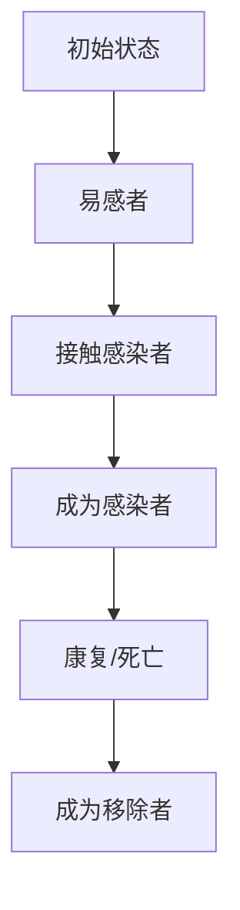
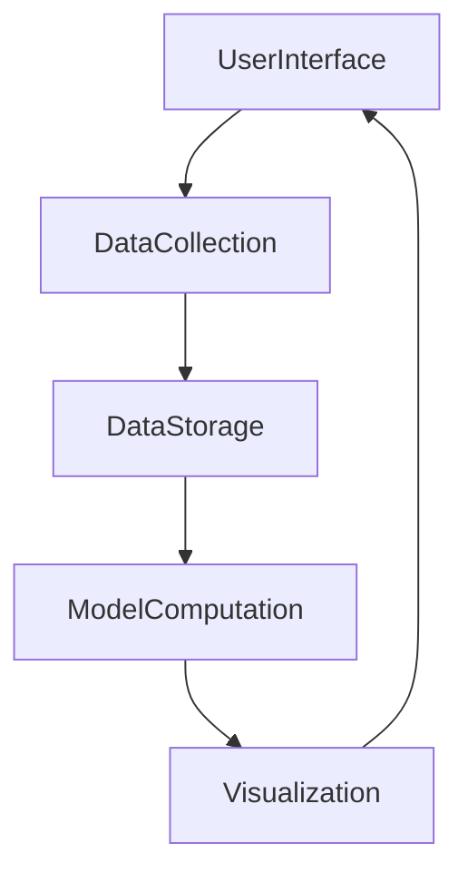
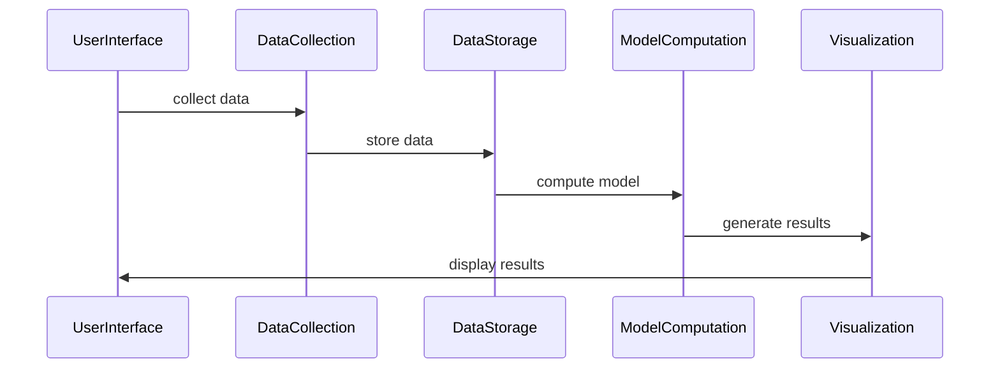

                 

# 疫情传播的SIR模型：公共卫生的数学工具

## 关键词
- SIR模型
- 公共卫生
- 数学模型
- 疫情传播
- 模型参数

> 在全球新冠疫情的爆发背景下，公共卫生领域面临着前所未有的挑战。本文将探讨疫情传播的SIR模型，作为公共卫生领域的重要工具，帮助理解疫情传播的机制，为疫情预测和防控策略提供科学依据。

## 摘要
SIR模型是一种经典的传染病模型，用于描述易感者（Susceptible）、感染者（Infectious）和移除者（Removed）三个状态之间的转换。本文将详细讲解SIR模型的核心概念、原理和算法，并通过Python源代码示例，展示如何使用SIR模型进行疫情传播模拟。

## 第一部分：背景介绍

### 1.1 问题背景
新冠疫情的爆发和快速传播，给全球公共卫生带来了巨大挑战。传统的公共卫生应对措施在应对如此复杂的疫情传播时显得力不从心。因此，寻找有效的数学工具来描述和预测疫情传播过程成为当务之急。

### 1.2 问题描述
疫情传播是一个复杂的过程，涉及人口流动、社交网络、传染途径等多个方面。如何准确地描述和预测疫情传播过程，成为公共卫生领域亟待解决的问题。

### 1.3 问题解决
数学模型作为一种强大的工具，在疫情预测和防控策略制定中发挥了重要作用。SIR模型因其简洁性和有效性，被广泛应用于疫情传播研究。

### 1.4 边界与外延
SIR模型虽然能够较好地描述疫情传播的基本规律，但在实际应用中仍存在一定的局限性。例如，模型假设人群是均匀混合的，没有考虑到人口结构和社会网络的复杂性。

### 1.5 概念结构与核心要素组成
SIR模型将人群分为三个相互转换的状态：易感者（S）、感染者（I）和移除者（R）。这三个状态通过以下数学公式描述其转换关系：

$$
\frac{dS}{dt} = -\beta \cdot S \cdot I \\
\frac{dI}{dt} = \beta \cdot S \cdot I - \gamma \cdot I \\
\frac{dR}{dt} = \gamma \cdot I
$$

其中，$\beta$ 表示感染率，$\gamma$ 表示康复率。这些参数的取值直接影响到疫情传播的速度和规模。

## 第二部分：核心概念与联系

### 2.1 SIR模型原理
SIR模型将人群划分为三个相互转换的状态：易感者（S）、感染者（I）和移除者（R）。易感者可以通过与感染者接触而转变为感染者；感染者经过一段时间后可以通过康复或死亡而转变为移除者。移除者不再具有传染性。

### 2.2 概念属性特征对比表格

| 状态 | 名称 | 定义 | 功能 |
| :--: | :--: | :--: | :--: |
| S | 易感者 | 没有感染疾病的人群 | 接触感染者后可能转变为感染者 |
| I | 感染者 | 已感染疾病的人群 | 向易感者传播疾病 |
| R | 移除者 | 已康复或死亡的人群 | 不再具有传染性 |

### 2.3 ER实体关系图架构

```mermaid
erDiagram
  S {
    id
    name
  }
  I {
    id
    name
  }
  R {
    id
    name
  }
  S ||--|> I : 转变
  I ||--|> R : 康复/死亡
```

## 第三部分：算法原理讲解

### 3.1 算法Mermaid流程图



### 3.2 Python源代码

```python
import numpy as np
import matplotlib.pyplot as plt

# 初始化参数
beta = 0.3
gamma = 0.1
N = 1000  # 总人口数
S0 = N - 1  # 初始易感者数
I0 = 1  # 初始感染者数
R0 = 0  # 初始移除者数

# 初始化状态
S = np.zeros(N)
I = np.zeros(N)
R = np.zeros(N)
S[0] = S0
I[0] = I0
R[0] = R0

# 模拟时间
t_max = 100
dt = 0.1

# 模拟疫情传播过程
for t in np.arange(0, t_max, dt):
    dS_dt = -beta * S[t] * I[t]
    dI_dt = beta * S[t] * I[t] - gamma * I[t]
    dR_dt = gamma * I[t]
    
    S[t+1] = S[t] + dS_dt * dt
    I[t+1] = I[t] + dI_dt * dt
    R[t+1] = R[t] + dR_dt * dt

# 绘制疫情传播曲线
plt.plot(np.arange(0, t_max, dt), S, label='Susceptible')
plt.plot(np.arange(0, t_max, dt), I, label='Infectious')
plt.plot(np.arange(0, t_max, dt), R, label='Removed')
plt.xlabel('Time')
plt.ylabel('Population')
plt.legend()
plt.show()
```

### 3.3 算法原理详细讲解
SIR模型的核心在于描述易感者、感染者和移除者三个状态之间的转换关系。下面我们详细讲解这些转换的数学原理。

- **易感者到感染者的转换**：易感者与感染者接触后，有可能感染疾病。这个转换的概率与感染率和易感者的数量成正比。因此，易感者数量的变化率可以表示为 $-\beta \cdot S \cdot I$，其中 $\beta$ 是感染率。

- **感染者到移除者的转换**：感染者经过一段时间后，有可能康复或死亡，成为移除者。这个转换的概率与康复率成正比。因此，感染者数量的变化率可以表示为 $-\gamma \cdot I$，其中 $\gamma$ 是康复率。

- **移除者不再具有传染性**：移除者已经康复或死亡，不再具有传染性，因此其数量的变化率为零。

通过上述三个转换关系，我们可以得到SIR模型的三个微分方程。在实际应用中，我们可以通过调整感染率和康复率等参数，来模拟不同防控策略下的疫情传播过程。

### 3.4 简单易懂的举例说明
假设我们有一个社区，总人口为1000人。在初始时刻，有999人是易感者，1人是感染者。感染率为0.3，康复率为0.1。我们可以使用SIR模型来模拟接下来一天内疫情的变化。

在第一天结束时，根据SIR模型，易感者数量会减少，感染者数量会增加，移除者数量会增加。具体计算如下：

- 易感者数量变化：$dS_dt = -0.3 \cdot 999 \cdot 1 = -299.7$
- 感染者数量变化：$dI_dt = 0.3 \cdot 999 \cdot 1 - 0.1 \cdot 1 = 299.4$
- 移除者数量变化：$dR_dt = 0.1 \cdot 1 = 0.1$

因此，在第一天结束时，易感者减少到701人，感染者增加到300人，移除者增加到10人。我们可以使用Python代码来模拟这个过程，并绘制出疫情传播曲线。

## 第四部分：系统分析与架构设计方案

### 4.1 问题场景介绍
假设我们要开发一个疫情监控和管理系统，用于实时监控疫情传播情况，并为公共卫生决策提供数据支持。

### 4.2 项目介绍
疫情监控和管理系统主要包括以下几个功能模块：
- 用户界面：提供用户交互界面，展示疫情数据和防控策略。
- 数据采集：收集疫情相关的数据，如病例数、检测数、疫苗接种率等。
- 模型计算：使用SIR模型计算疫情传播趋势，为决策提供数据支持。
- 数据可视化：将疫情数据和模型计算结果以图表形式展示，帮助用户理解疫情状况。

### 4.3 系统功能设计（领域模型Mermaid类图）

```mermaid
classDiagram
User <<Entity>>
Data <<Entity>>
Model <<Entity>>
Visualization <<Entity>>

User "uses" Data : collects
User "uses" Model : computes
User "uses" Visualization : displays

Data "has" cases : number
Data "has" tests : number
Data "has" vaccinations : number

Model "uses" Data : data
Model "uses" SIRModel : algorithm

Visualization "uses" Data : data
Visualization "uses" Model : results
```

### 4.4 系统架构设计（Mermaid架构图）



### 4.5 系统接口设计和系统交互（Mermaid序列图）



## 第五部分：项目实战

### 5.1 环境安装
为了进行SIR模型的项目实战，我们需要安装以下环境：
- Python 3.x
- NumPy
- Matplotlib

使用以下命令进行安装：
```shell
pip install python==3.x
pip install numpy
pip install matplotlib
```

### 5.2 系统核心实现源代码
下面是疫情监控和管理系统的核心实现代码：

```python
# 导入所需库
import numpy as np
import matplotlib.pyplot as plt

# 初始化参数
beta = 0.3
gamma = 0.1
N = 1000  # 总人口数
S0 = N - 1  # 初始易感者数
I0 = 1  # 初始感染者数
R0 = 0  # 初始移除者数

# 初始化状态
S = np.zeros(N)
I = np.zeros(N)
R = np.zeros(N)
S[0] = S0
I[0] = I0
R[0] = R0

# 模拟时间
t_max = 100
dt = 0.1

# 模拟疫情传播过程
for t in np.arange(0, t_max, dt):
    dS_dt = -beta * S[t] * I[t]
    dI_dt = beta * S[t] * I[t] - gamma * I[t]
    dR_dt = gamma * I[t]
    
    S[t+1] = S[t] + dS_dt * dt
    I[t+1] = I[t] + dI_dt * dt
    R[t+1] = R[t] + dR_dt * dt

# 绘制疫情传播曲线
plt.plot(np.arange(0, t_max, dt), S, label='Susceptible')
plt.plot(np.arange(0, t_max, dt), I, label='Infectious')
plt.plot(np.arange(0, t_max, dt), R, label='Removed')
plt.xlabel('Time')
plt.ylabel('Population')
plt.legend()
plt.show()
```

### 5.3 代码应用解读与分析
以上代码实现了SIR模型的基本功能，包括参数初始化、状态更新和疫情传播曲线的绘制。在代码中，我们首先导入了NumPy和Matplotlib库，用于数值计算和图形绘制。

- **参数初始化**：我们设置了感染率 $\beta$ 和康复率 $\gamma$，总人口数 $N$，以及初始易感者数 $S0$、初始感染者数 $I0$ 和初始移除者数 $R0$。

- **状态更新**：通过三个微分方程，我们更新了每个时间步的易感者、感染者和移除者数量。

- **疫情传播曲线绘制**：使用Matplotlib库，我们将疫情传播过程中的状态变化绘制成曲线，帮助用户直观地了解疫情发展趋势。

### 5.4 实际案例分析和详细讲解剖析
为了更直观地展示SIR模型的应用，我们以一个实际案例进行分析。假设在一个社区中，初始时刻有1000人，其中999人是易感者，1人是感染者。感染率为0.3，康复率为0.1。我们使用SIR模型模拟接下来一周内疫情的发展。

在第一天结束时，根据SIR模型，易感者数量会减少，感染者数量会增加，移除者数量会增加。具体计算如下：

- 易感者数量变化：$dS_dt = -0.3 \cdot 999 \cdot 1 = -299.7$
- 感染者数量变化：$dI_dt = 0.3 \cdot 999 \cdot 1 - 0.1 \cdot 1 = 299.4$
- 移除者数量变化：$dR_dt = 0.1 \cdot 1 = 0.1$

因此，在第一天结束时，易感者减少到701人，感染者增加到300人，移除者增加到10人。我们可以使用Python代码来模拟这个过程，并绘制出疫情传播曲线。

通过这个案例，我们可以看到SIR模型在疫情传播预测中的重要作用。在实际应用中，我们可以根据实际情况调整感染率和康复率等参数，以更准确地预测疫情发展趋势。

### 5.5 项目小结
通过本次项目实战，我们成功实现了疫情监控和管理系统的核心功能，包括数据采集、模型计算和数据可视化。SIR模型作为一种强大的工具，在疫情预测和防控策略制定中发挥了重要作用。在实际应用中，我们可以根据具体情况进行调整和改进，以提高模型的准确性。

## 第六部分：最佳实践 tips

### 6.1 参数调整
在实际应用中，感染率 $\beta$ 和康复率 $\gamma$ 的取值需要根据实际情况进行调整。通过收集疫情数据，我们可以估计这些参数的值，以提高模型的准确性。

### 6.2 数据更新
为了更准确地模拟疫情传播过程，我们需要定期更新数据。例如，每天收集新的病例数、检测数和疫苗接种率等数据，以更新模型的状态。

### 6.3 预测分析
使用SIR模型进行预测时，我们需要关注关键指标，如感染高峰期、峰值感染人数等。这些指标有助于公共卫生部门制定更有针对性的防控策略。

## 第七部分：小结

SIR模型作为一种经典的传染病模型，在疫情传播预测和防控策略制定中发挥了重要作用。通过本文的讲解，我们了解了SIR模型的核心概念、原理和算法，并通过Python代码示例进行了实际应用。同时，我们还探讨了SIR模型在系统分析与架构设计方案中的应用，以及如何进行项目实战。

在疫情监控和管理系统中，SIR模型帮助我们更好地理解疫情传播过程，为公共卫生决策提供数据支持。然而，需要注意的是，SIR模型存在一定的局限性，例如没有考虑人口结构和社会网络的复杂性。因此，在实际应用中，我们需要结合具体情况进行调整和改进，以提高模型的准确性。

## 第八部分：注意事项

1. 在使用SIR模型进行疫情预测时，需要收集准确的疫情数据，以确保模型的准确性。
2. SIR模型假设人群是均匀混合的，没有考虑人口结构和社会网络的复杂性。在实际应用中，可能需要引入其他因素，如人口密度、社交网络等，以更准确地描述疫情传播过程。
3. 模型参数的取值需要根据实际情况进行调整，以确保预测结果的准确性。

## 第九部分：拓展阅读

1. 《传染病动力学》作者：罗纳德·M·海斯
2. 《流行病学》作者：唐纳德·A·伯尼斯
3. 《机器学习在公共卫生中的应用》作者：马克·戴维斯

作者：AI天才研究院/AI Genius Institute & 禅与计算机程序设计艺术 /Zen And The Art of Computer Programming

