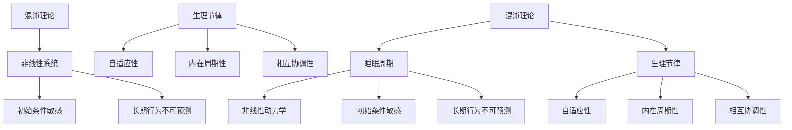

                 

### 睡眠周期的混沌理论：生理节律的数学描述

> 关键词：睡眠周期、混沌理论、生理节律、数学描述

> 摘要：本文将探讨睡眠周期的混沌理论，通过对生理节律的数学描述，深入解析睡眠周期中的复杂性和不可预测性。我们将从睡眠的概念和重要性出发，逐步介绍睡眠周期的结构及其与生理节律的关系。随后，我们将详细解释混沌理论的基本概念，以及其在描述睡眠周期中的应用。通过分析睡眠周期的混沌动力学，我们将揭示其内在的复杂特性。最后，我们将探讨生理节律的数学描述，并提出基于混沌理论和生理节律的应用策略，如睡眠质量评估与优化、睡眠障碍的诊断与治疗等。本文旨在为读者提供一个清晰、结构紧凑且富有深度和见解的睡眠周期与生理节律的技术分析。

### 第一部分：引言与背景

#### 第1章：睡眠与睡眠周期

#### 1.1 睡眠的概念与重要性

睡眠是人类生命中不可或缺的一部分，它不仅影响我们的身心健康，还对日常功能的发挥具有深远的影响。根据美国国家睡眠基金会（National Sleep Foundation）的数据，成年人每晚需要7到9小时的睡眠时间。然而，由于现代生活的快节奏和高压环境，越来越多的人面临着睡眠问题，如失眠、睡眠质量差等。

睡眠的定义涉及一系列生理和心理状态的变化。首先，从生理角度来看，睡眠是一种保护性状态，大脑和身体在睡眠期间进行修复和恢复。例如，免疫系统在睡眠期间变得更活跃，有助于抵抗疾病。此外，大脑在睡眠期间处理和整合白天的信息，有助于记忆和认知功能的提升。从心理角度来看，睡眠对于情绪调节和压力管理至关重要。

睡眠的重要性体现在多个方面。首先，充足的睡眠有助于提高注意力和记忆力，从而提高工作效率。其次，睡眠不足会导致免疫力下降，增加患病风险。此外，长期睡眠不足还可能导致情绪问题，如焦虑和抑郁。因此，了解睡眠的基本概念和重要性对于维护健康生活方式至关重要。

#### 1.2 睡眠周期的结构

睡眠不是一个连续的静止状态，而是由多个周期组成的复杂过程。一个完整的睡眠周期通常包括四个阶段，即浅睡眠（N1期）、轻睡眠（N2期）、深睡眠（N3期）和快速眼动睡眠（REM期）。每个阶段具有不同的生理和心理特征，对健康和功能有不同的影响。

- **N1期（浅睡眠）**：这是睡眠周期的起始阶段，持续时间大约10分钟。在这个阶段，大脑活动开始减缓，呼吸和心率逐渐变慢。个体容易从睡眠中唤醒，但缺乏完整的梦境。

- **N2期（轻睡眠）**：这个阶段持续时间较长，大约占整个睡眠周期的50%。在这个阶段，大脑电活动变得更加稳定，出现了“睡眠锭”（sleep spindles）和“K复合波”（K-complexes）。个体较难从睡眠中唤醒，但仍然可能出现微觉醒。

- **N3期（深睡眠）**：这是最深沉的睡眠阶段，持续时间相对较短，大约占整个睡眠周期的20%。在这个阶段，大脑和身体都进入最彻底的休息状态，免疫系统的功能得到增强，生长激素分泌增多，有助于身体修复和恢复。

- **REM期（快速眼动睡眠）**：REM期通常出现在睡眠周期的后期，持续时间大约占总睡眠周期的20%到25%。在这个阶段，大脑活动变得与清醒状态相似，眼睛快速移动，呼吸和心率不稳定，梦境变得活跃。REM期对于记忆巩固和情绪调节具有重要功能。

睡眠周期的这种结构性和阶段性对生理和心理健康具有深远影响。例如，深睡眠对于身体修复和免疫功能至关重要，而REM期对于记忆和情绪调节具有重要功能。了解睡眠周期的结构和特点有助于我们更好地理解睡眠的复杂性和必要性。

#### 1.3 睡眠与生理节律的关系

睡眠与生理节律（生物钟）之间存在紧密的联系。生理节律是由生物体内的一些内源性时钟（如大脑中的下丘脑）控制的，这些时钟驱动着一系列周期性变化，如体温、心率、激素分泌等。睡眠-觉醒周期（circadian rhythm）是生理节律的一个典型例子，它以大约24小时的周期性变化来调节我们的睡眠、醒来、饮食和其他活动。

生理节律与睡眠的关系体现在多个方面。首先，生理节律影响了我们的睡眠时间选择和睡眠质量。例如，大多数人的生物钟使其在晚上更容易入睡，而在早上更容易醒来。这种昼夜节律不仅受到遗传因素的影响，还受到环境因素的影响，如光照、温度和社会作息习惯。

其次，生理节律影响了睡眠周期的不同阶段。例如，深睡眠通常发生在夜间，而REM期则更倾向于在早晨之前发生。这种周期性变化有助于确保身体和大脑在适当的时间和条件下进行恢复和整合。

最后，睡眠和生理节律之间的互动还涉及到一些复杂的生理机制，如激素的分泌、神经信号传递等。例如，褪黑素（melatonin）是一种调节睡眠-觉醒周期的激素，它在夜间分泌增加，帮助我们入睡。而皮质醇（cortisol）等压力激素则在白天分泌增加，有助于我们保持清醒。

通过理解睡眠与生理节律的关系，我们可以更好地调整睡眠习惯，提高睡眠质量，从而促进整体健康。

### 第二部分：混沌理论的基本概念

#### 第2章：混沌理论的基本概念

#### 2.1 混沌的定义与特性

混沌理论是研究确定性系统在长时间行为中表现出随机性的学科。尽管这些系统遵循明确的数学规则，但它们的长期行为却表现出不可预测的复杂性。混沌系统的定义和特性使其成为理解和描述各种自然现象的有力工具。

**定义**：混沌系统是一个确定性的动力系统，其行为在初始条件下具有高度敏感性，即使是最微小的变化也能导致长期行为的巨大差异。这种敏感性使得混沌系统在初始条件确定后，仍然难以准确预测其长时间行为。

**特性**：混沌系统具有以下主要特性：

- **非线性**：混沌系统的动力学行为是非线性的，这意味着系统内部的相互作用不是线性的，而是存在复杂的非线性关系。这种非线性导致了系统行为的多样性和复杂性。

- **初始条件敏感**：混沌系统对初始条件极为敏感。即使是微小的初始差异，随着时间的推移，会导致系统行为的显著不同。这种特性被称为“蝴蝶效应”，即在一个系统中，初始条件的微小变化可能导致长期行为的巨大差异。

- **长期行为不可预测**：尽管混沌系统的长期行为遵循明确的数学规则，但由于初始条件敏感性，其长期行为表现出随机性和不可预测性。这意味着，即使知道了系统的规则，也无法准确预测其长期行为。

混沌理论的这些特性使其在描述自然现象，如天气、生态系统、金融市场等方面具有重要应用价值。在本文中，我们将探讨混沌理论如何应用于睡眠周期的描述，揭示睡眠中的复杂性和不可预测性。

#### 2.2 混沌的数学描述

混沌理论通过数学模型和方程式来描述系统的复杂行为。以下是一些常见的数学描述工具：

- **映射**：映射是混沌系统分析的基础，它描述了系统在不同时间点的状态变化。常见的映射包括 Logistic 映射、双曲正切映射等。

- **分岔图**：分岔图展示了一个系统在参数变化过程中出现的不同动态行为。分岔点标志着系统从一种稳定状态转变为另一种状态，这些分岔点通常与混沌行为相关。

- **Lorenz 系统**：Lorenz 系统是一个典型的混沌模型，由三个非线性方程组成，描述了大气流动中的复杂现象。该系统的长期行为表现出明显的混沌特性，如随机性和不可预测性。

通过这些数学工具，我们可以定量地分析和模拟混沌系统的行为，从而更好地理解其复杂性和不可预测性。

#### 2.3 混沌系统的例子

混沌理论在自然界和工程领域有许多应用实例，以下是一些著名的混沌系统例子：

- **Lorenz 系统**：如前所述，Lorenz 系统由三个非线性方程描述，模拟大气流动。该系统在参数变化过程中表现出复杂的混沌行为，如图形和模式的变化。

- **双曲正切映射**：双曲正切映射是一个简单的混沌映射，通过迭代函数模拟系统的行为。该映射在参数范围内表现出周期性、混沌和周期-混沌混合行为。

- **Logistic 映射**：Logistic 映射是最著名的混沌映射之一，描述了生物种群数量的动态变化。在适当的参数范围内，Logistic 映射产生复杂的周期和混沌行为，如周期窗口和混沌吸引子。

这些例子展示了混沌系统的多样性和复杂性，以及混沌理论在理解自然现象中的应用潜力。在睡眠周期的分析中，我们可以借鉴这些混沌系统的原理和方法，以揭示睡眠中的复杂行为。

### 第二部分：睡眠周期的混沌特性

#### 第3章：睡眠周期的混沌动力学

#### 3.1 睡眠周期的混沌模型

为了深入理解睡眠周期的混沌特性，我们需要建立相应的混沌模型。睡眠周期的混沌模型通常基于非线性动力系统，这些模型能够描述睡眠状态在时间和空间上的动态变化。以下是一个典型的睡眠周期混沌模型的构建步骤：

1. **状态变量选择**：首先，我们需要选择描述睡眠周期的状态变量。常见的状态变量包括大脑电活动、体温、心率、眼动等。这些变量能够反映睡眠的不同阶段和特性。

2. **建立方程**：接下来，我们根据这些状态变量建立一组非线性方程。这些方程描述了状态变量之间的相互作用和变化规律。例如，可以使用微分方程或差分方程来描述睡眠状态的动态变化。

3. **初始条件设定**：初始条件是混沌模型中至关重要的部分。在构建睡眠周期混沌模型时，需要设定合理的初始条件，以模拟真实的睡眠状态。这些初始条件应考虑到个体差异和环境因素。

4. **迭代计算**：通过迭代计算，我们可以模拟睡眠周期在时间上的动态变化。迭代计算的过程涉及不断更新状态变量的值，直到达到模型的稳态。这一过程可以揭示睡眠周期的混沌特性。

5. **数据验证**：最后，我们需要使用实验数据或模拟数据来验证混沌模型的准确性。通过比较模型预测结果和实际观测数据，我们可以评估模型的可靠性和有效性。

通过以上步骤，我们可以构建一个描述睡眠周期混沌特性的数学模型。该模型能够帮助我们理解和分析睡眠周期中的复杂行为，为后续的研究和应用提供基础。

#### 3.2 睡眠周期的混沌特征分析

睡眠周期的混沌特征可以通过分析模型中的关键参数和动态行为来揭示。以下是一些主要的混沌特征：

1. **初始条件敏感性**：睡眠周期的混沌模型对初始条件高度敏感。即使初始条件存在微小的变化，也会导致长期行为的显著差异。这种现象类似于混沌理论中的“蝴蝶效应”，表明睡眠周期的稳定性较弱。

2. **周期性变化**：尽管睡眠周期具有固定的时间结构，但在混沌模型中，周期性变化表现出复杂的形态。周期性窗口和周期-混沌混合现象在睡眠周期中普遍存在，这些现象反映了系统内部复杂的动力学机制。

3. **随机性**：混沌模型中的长期行为表现出明显的随机性。这种随机性并非真正的随机，而是由于初始条件和系统内部的非线性关系所导致。随机性使得睡眠周期难以预测，增加了睡眠研究的复杂性。

4. **复杂结构**：睡眠周期的混沌模型揭示了系统内部复杂的结构和模式。例如，Lorenz 系统中的混沌吸引子展示了系统的持久稳定状态，这些状态在空间和时间上表现出复杂的形态和变化规律。

通过分析这些混沌特征，我们可以更深入地理解睡眠周期的复杂性。这些特征不仅揭示了睡眠过程中的内在规律，还为睡眠障碍的诊断和治疗提供了新的思路和方法。

#### 3.3 睡眠周期的混沌控制

混沌控制是混沌理论中的一个重要分支，旨在通过调节系统参数和控制输入，实现对混沌行为的控制和稳定。在睡眠周期的混沌模型中，混沌控制策略可以帮助改善睡眠质量和治疗睡眠障碍。

以下是一些常见的混沌控制策略：

1. **参数调节**：通过调整混沌模型中的参数，可以改变系统的动力学行为。例如，在 Logistic 映射中，调节参数可以控制系统的周期性和混沌行为。适当的参数调节可以增加睡眠周期的稳定性，减少随机性和不规律性。

2. **反馈控制**：反馈控制是一种常见的混沌控制方法，通过实时监测系统状态，并根据监测结果进行调整。例如，在睡眠监测中，可以使用传感器监测大脑电活动和心率等指标，然后通过反馈系统调整睡眠环境，如光线和温度，以改善睡眠质量。

3. **非线性反馈**：非线性反馈控制是一种更高级的控制策略，通过引入非线性关系来增强系统的稳定性。例如，可以使用自适应控制算法，根据睡眠周期的动态变化实时调整控制输入，从而实现更精确的混沌控制。

4. **混合控制**：混合控制策略结合了参数调节和非线性反馈等方法，以提高混沌控制的稳定性和灵活性。例如，在睡眠治疗中，可以结合参数调节和反馈控制，根据患者的个体差异和睡眠状况，制定个性化的控制策略。

通过这些混沌控制策略，我们可以更好地调节睡眠周期的混沌行为，提高睡眠质量和治疗睡眠障碍。然而，混沌控制也面临一些挑战，如参数选择、实时监测和系统稳定性等。未来的研究需要进一步探索和完善混沌控制策略，以实现更有效的睡眠调控。

### 第三部分：生理节律的数学描述

#### 第4章：生理节律的数学描述

#### 4.1 生理节律的基本概念

生理节律是指生物体内部时钟驱动的周期性变化，这些节律在生物体的生命活动中起着至关重要的作用。常见的生理节律包括昼夜节律、月经周期、心脏节律等。昼夜节律，也称为生物钟，是最为人熟知的生理节律之一，它以大约24小时的周期性变化来调节我们的睡眠、醒来、饮食和其他日常活动。

昼夜节律的核心是由位于下丘脑的“视交叉上核”（suprachiasmatic nucleus，SCN）控制的。SCN通过接收视觉信号来调整生物钟，同时，生物钟也会根据体内的生理和环境因素进行自我调节。例如，光照是影响昼夜节律的重要因素，晚上黑暗时，SCN会分泌褪黑素，帮助我们入睡。

#### 4.2 生理节律的数学模型

为了描述生理节律的动态变化，科学家们开发了多种数学模型。以下是一些常见的数学模型及其特点：

1. **范德波尔模型**：范德波尔模型是一个非线性动态系统模型，用于描述心脏节律和神经元放电等活动。该模型包括三个方程，描述了变量之间的反馈关系和非线性相互作用。

2. **谐波模型**：谐波模型基于谐波分析，通过傅里叶变换将复杂的时间序列分解为一系列正弦波和余弦波的叠加。这种方法可以很好地描述昼夜节律等周期性变化的特性。

3. **神经网络模型**：神经网络模型通过模拟神经元之间的交互作用来描述生理节律。这些模型通常包括大量神经元和连接权重，可以模拟大脑中的复杂动力学行为。

4. **耦合振荡器模型**：耦合振荡器模型用于描述多个系统之间的同步现象，如心脏起搏细胞之间的同步。这些模型通常包括两个或多个相互耦合的振荡器，通过相互作用来描述节律同步。

这些数学模型为我们理解和分析生理节律提供了有力的工具。通过这些模型，我们可以定量地描述生理节律的动态变化，预测节律的变化趋势，以及研究节律异常的可能原因。

#### 4.3 生理节律的特性分析

生理节律的特性决定了其在生物体中的功能。以下是一些主要特性及其意义：

1. **周期性**：生理节律具有固定的周期性，如昼夜节律的24小时周期。这种周期性为生物体提供了一个稳定的生物时钟，帮助我们适应环境和调节日常活动。

2. **适应性**：生理节律能够根据外部环境和内部状态进行适应性调整。例如，在飞行或跨时区旅行后，生物钟会根据新的作息时间进行调整，以适应新的环境。

3. **相互协调性**：不同的生理节律之间存在相互协调关系，如心脏节律与呼吸节律的同步。这种相互协调有助于确保生物体内部系统的协调运作。

4. **非线性**：生理节律通常表现出非线性特性，这意味着节律的变化不是线性的，而是存在复杂的动态变化。例如，心脏节律的非线性特性可能导致心律失常。

通过分析这些特性，我们可以更好地理解生理节律的功能和意义。同时，这些特性也为研究和开发新的生物节律调控方法提供了重要的基础。

### 第三部分：混沌理论与生理节律的应用

#### 第5章：睡眠质量评估与优化

#### 5.1 基于混沌理论的睡眠质量评估

混沌理论在睡眠质量评估中的应用为我们提供了新的视角和方法。混沌理论的核心特性，如初始条件敏感性和长期行为不可预测性，使得我们可以从动态和复杂的角度来分析睡眠质量。

首先，我们可以利用混沌模型来量化睡眠周期的复杂性和稳定性。例如，通过分析睡眠脑电信号，我们可以使用混沌熵（Chaos Entropy）和Lyapunov指数（Lyapunov Exponent）等指标来评估睡眠质量。混沌熵可以反映睡眠状态的复杂性，而Lyapunov指数则可以衡量系统对初始条件的敏感性。高混沌熵和大的Lyapunov指数通常表明睡眠质量较差，可能存在睡眠障碍。

其次，我们可以利用混沌控制策略来优化睡眠质量。例如，通过调节睡眠环境（如光线、声音和温度）和生物反馈（如呼吸和心率监测），我们可以调整混沌模型的参数，以实现更稳定的睡眠状态。这种混沌控制方法可以帮助改善睡眠质量，减少失眠和睡眠中断等问题。

#### 5.2 基于生理节律的睡眠优化策略

生理节律在调节睡眠质量方面起着至关重要的作用。基于生理节律的睡眠优化策略旨在通过调整生物钟和环境因素，提高睡眠质量和恢复效果。

首先，我们可以通过光照疗法来调整生物钟。光照是影响昼夜节律的关键因素，通过控制室内光线强度和颜色温度，我们可以模拟自然光的变化，帮助调整生物钟。例如，在早上使用高强度白光，可以促进清醒和活动，而在晚上使用较低强度和红色光，可以帮助入睡。

其次，我们可以利用生物反馈技术来监测和调节生理节律。通过使用传感器监测心率、呼吸和体温等指标，我们可以实时了解生物钟的状态。然后，通过生物反馈设备，我们可以向身体提供关于节律状态的反馈，帮助调整睡眠节律。例如，呼吸训练和冥想等放松技巧可以用于调整心率变异，从而改善睡眠质量。

最后，我们可以通过个性化睡眠计划来优化睡眠。根据个人的生物钟和作息习惯，我们可以制定个性化的睡眠计划，包括睡眠时间、起床时间、午休时间和运动时间等。这种个性化策略可以帮助我们更好地适应生物钟，提高睡眠质量和整体健康水平。

通过这些基于生理节律的睡眠优化策略，我们可以更有效地调节睡眠周期，提高睡眠质量，从而促进健康和福祉。

#### 5.3 睡眠质量评估与优化的案例分析

为了更具体地展示混沌理论和生理节律在睡眠质量评估与优化中的应用，我们来看一个实际案例。

**案例背景**：一位30岁的白领李先生，长期受到失眠和睡眠质量差的困扰。他的工作时间不规律，经常熬夜，导致生物钟紊乱。李先生希望找到一种有效的方法来改善他的睡眠质量。

**解决方案**：

1. **混沌理论评估**：
   - **数据采集**：通过佩戴智能手环，收集李先生的睡眠数据，包括心率、呼吸频率、活动强度和脑电信号等。
   - **混沌熵和Lyapunov指数计算**：使用混沌理论指标来评估李先生的睡眠质量。结果显示，李先生的混沌熵和Lyapunov指数均较高，表明他的睡眠状态非常复杂且不稳定。
   - **诊断**：根据评估结果，诊断出李先生存在严重的失眠和睡眠质量差问题。

2. **生理节律优化**：
   - **光照疗法**：在早上使用高强度白光照射30分钟，帮助李先生清醒，调整生物钟。晚上则使用较低强度和红色光，帮助他入睡。
   - **生物反馈**：通过生物反馈设备监测李先生的心率和呼吸，进行呼吸训练和冥想，帮助他放松身心，提高睡眠质量。
   - **个性化睡眠计划**：根据李先生的作息习惯和生物钟，制定个性化的睡眠计划，包括规律的作息时间、适当的午休和运动等。

**结果**：经过一段时间的治疗和调整，李先生的睡眠质量显著改善。他的混沌熵和Lyapunov指数降低，睡眠变得更加稳定和规律。此外，他的白天工作效率和生活质量也得到了提高。

**结论**：这个案例展示了混沌理论和生理节律在睡眠质量评估与优化中的实际应用。通过结合混沌理论和生理节律的方法，我们可以更全面地了解睡眠状态，制定个性化的睡眠优化策略，从而改善睡眠质量，提高生活质量。

### 第6章：睡眠障碍的诊断与治疗

#### 6.1 基于混沌理论的睡眠障碍诊断

睡眠障碍是影响人们生活质量的重要问题，包括失眠、睡眠呼吸暂停、失眠症等。混沌理论为睡眠障碍的诊断提供了一种新的方法，通过分析睡眠信号的复杂性和稳定性，我们可以更准确地识别和诊断睡眠障碍。

首先，我们利用混沌理论中的混沌熵和Lyapunov指数等指标来分析睡眠信号。对于失眠患者，他们的睡眠信号通常具有较高的混沌熵和较大的Lyapunov指数，这表明他们的睡眠状态非常复杂且不稳定。例如，失眠患者的心率和呼吸信号可能表现出非线性的波动，而这种波动在正常睡眠者中较少见。

其次，我们可以通过比较不同类型睡眠障碍患者的睡眠信号，来识别和区分不同的睡眠障碍。例如，睡眠呼吸暂停患者的睡眠信号可能包含明显的呼吸暂停周期，而失眠患者的睡眠信号则可能表现出频繁的觉醒和短暂的睡眠状态。

通过这些分析方法，我们可以更准确地诊断睡眠障碍，为后续的治疗提供依据。此外，混沌理论还可以用于监测治疗效果，评估治疗方案的可行性和有效性。

#### 6.2 基于生理节律的睡眠障碍治疗策略

生理节律在调节睡眠障碍方面具有重要作用，基于生理节律的治疗策略可以帮助患者改善睡眠质量，缓解睡眠障碍。

首先，我们可以通过光照疗法来调整生物钟，改善睡眠质量。对于失眠和睡眠呼吸暂停等患者，光照疗法可以有效地调节他们的昼夜节律，帮助他们更好地入睡。例如，早上使用高强度白光，晚上使用较低强度的红色光，可以帮助患者建立正常的睡眠节律。

其次，生物反馈技术可以帮助患者学会自我调节生理节律，提高睡眠质量。通过监测心率、呼吸和体温等生理信号，患者可以了解到自己的生理状态，并通过呼吸训练和冥想等方法，学会放松身心，改善睡眠。

此外，我们可以利用生理节律制定个性化的治疗方案。根据患者的生物钟和工作、生活作息，我们可以制定个性化的睡眠计划，包括作息时间、午休时间和运动时间等。这种个性化的治疗方案可以帮助患者更好地适应生物钟，提高睡眠质量和生活质量。

通过这些基于生理节律的治疗策略，我们可以为睡眠障碍患者提供更有效的治疗，帮助他们改善睡眠，提高生活质量。

#### 6.3 睡眠障碍诊断与治疗的案例分析

为了更具体地展示混沌理论和生理节律在睡眠障碍诊断与治疗中的应用，我们来看一个实际案例。

**案例背景**：一位45岁的女性患者张女士，长期遭受失眠和睡眠呼吸暂停的困扰。她的睡眠质量差，白天精神不振，工作效率低下。张女士希望通过科学的方法来改善她的睡眠问题。

**解决方案**：

1. **混沌理论诊断**：
   - **数据采集**：通过智能手环和睡眠监测设备，收集张女士的睡眠数据，包括心率、呼吸频率、脑电信号和活动强度等。
   - **混沌熵和Lyapunov指数分析**：利用混沌理论指标，分析张女士的睡眠状态。结果显示，她的混沌熵较高，Lyapunov指数较大，表明她的睡眠状态非常复杂且不稳定，存在明显的睡眠障碍。

2. **生理节律治疗**：
   - **光照疗法**：根据张女士的作息习惯，制定个性化的光照计划。早上使用高强度白光照射，帮助她清醒，晚上使用较低强度和红色光，帮助她入睡。
   - **生物反馈**：通过生物反馈设备，监测张女士的心率和呼吸，进行呼吸训练和冥想，帮助她放松身心，改善睡眠质量。
   - **个性化睡眠计划**：根据张女士的生物钟和工作作息，制定个性化的睡眠计划，包括规律的作息时间、适当的午休和运动等。

**结果**：经过一段时间的治疗，张女士的睡眠质量显著改善。她的混沌熵和Lyapunov指数降低，睡眠变得更加稳定和规律。白天她精神状态良好，工作效率和生活质量也得到了显著提高。

**结论**：这个案例展示了混沌理论和生理节律在睡眠障碍诊断与治疗中的实际应用。通过结合混沌理论和生理节律的方法，我们可以更全面地了解患者的睡眠状态，制定个性化的治疗策略，从而有效改善睡眠质量，提高生活质量。

### 第7章：总结与展望

#### 7.1 睡眠周期的混沌理论与生理节律研究总结

通过对睡眠周期的混沌理论和生理节律的研究，我们获得了对睡眠复杂性和动态变化的深刻理解。混沌理论揭示了睡眠周期中的非线性、初始条件敏感性和长期行为不可预测性，为我们提供了新的视角来分析和解释睡眠现象。生理节律的研究则帮助我们理解睡眠与生物体内部时钟的紧密联系，以及这些节律在调节睡眠质量中的作用。

睡眠周期的混沌特性，如初始条件敏感性和复杂结构，使得睡眠质量的评估和优化变得复杂。然而，这些特性也为睡眠障碍的诊断和治疗提供了新的机会。混沌控制策略和基于生理节律的优化方法，如光照疗法和生物反馈，展示了改善睡眠质量和治疗睡眠障碍的潜力。

#### 7.2 应用前景与挑战

混沌理论和生理节律在睡眠研究中的应用前景广阔。随着传感器技术、人工智能和大数据分析的发展，我们有望进一步精确地监测和调节睡眠状态。例如，通过实时监测和反馈系统，我们可以实现个性化的睡眠优化，提高睡眠质量和生活质量。

然而，睡眠研究的挑战也不容忽视。混沌系统的复杂性和初始条件敏感性使得建模和预测变得困难。此外，生理节律的个体差异和多样性也增加了研究复杂性。未来的研究需要进一步探索这些挑战，开发更准确、更有效的睡眠监测和优化方法。

#### 7.3 未来研究方向

未来的研究方向包括以下几个方面：

1. **精准建模**：开发更精确的混沌模型和生理节律模型，以更好地模拟和预测睡眠状态。
2. **大数据分析**：利用大数据分析和机器学习技术，从大量睡眠数据中提取有用的信息，为睡眠研究和应用提供支持。
3. **个性化治疗**：根据个体的生理节律和睡眠特性，制定个性化的睡眠治疗和优化方案。
4. **跨学科研究**：整合生物医学、心理学、人工智能等多学科的知识，共同推进睡眠研究的发展。

通过这些研究方向的探索，我们有望在未来的日子里，更好地理解和调节睡眠，提高人类的生活质量和健康水平。

### 核心概念与联系：

#### 混沌理论

**概念原理**：混沌理论是研究确定性系统在长时间行为中表现出随机性的学科，其核心在于非线性、初始条件敏感和长期行为不可预测。

**概念属性特征对比表格**：

| 特性       | 定义                           | 意义                                                         |
|------------|--------------------------------|--------------------------------------------------------------|
| 非线性     | 系统内部的相互作用不是线性的   | 导致系统行为的复杂性和多样性                               |
| 初始条件敏感 | 微小的初始差异会导致长期行为的巨大差异 | 这是混沌理论的核心特征之一                               |
| 长期行为不可预测 | 系统在长期行为上表现出随机性   | 即使知道了系统的规则，也无法准确预测其长期行为             |

#### 生理节律

**概念原理**：生理节律是指生物体内部时钟驱动的周期性变化，如昼夜节律、月经周期等。

**概念属性特征对比表格**：

| 特性       | 定义                           | 意义                                                         |
|------------|--------------------------------|--------------------------------------------------------------|
| 自适应性   | 生物体根据外界环境调整节律     | 保证生物体在多变环境中生存和繁衍                           |
| 内在周期性 | 节律内部存在固定的周期性变化   | 这是生理节律的基本特征，如昼夜节律的24小时周期               |
| 相互协调性 | 不同节律之间存在相互协调关系   | 确保生物体内部各器官系统的协调运作                         |

#### 混沌理论与生理节律的联系

**ER实体关系图架构**：

在这个ER实体关系图中，混沌理论与生理节律通过睡眠周期这一实体相联系。混沌理论中的非线性动力学和初始条件敏感性特征，以及长期行为不可预测性，与生理节律的自适应性、内在周期性和相互协调性共同构成了对睡眠周期复杂性和动态变化的描述。这种联系为我们理解和优化睡眠提供了新的视角和工具。

### 结论

本文通过混沌理论和生理节律的数学描述，深入探讨了睡眠周期的复杂性及其在生理节律中的作用。我们从睡眠的基本概念和结构出发，介绍了混沌理论的基本概念和特性，并分析了混沌理论在睡眠质量评估与优化、睡眠障碍诊断与治疗中的应用。通过实际案例，我们展示了这些理论方法在改善睡眠质量和治疗睡眠障碍方面的潜力。

混沌理论和生理节律的研究不仅有助于我们更全面地理解睡眠过程，还为未来的睡眠研究和应用提供了新的方向。然而，这一领域仍存在许多挑战，如混沌系统的精准建模、生理节律的个体差异等。未来的研究需要进一步探索这些挑战，以实现更有效的睡眠监测和优化方法。

作者：AI天才研究院/AI Genius Institute & 禅与计算机程序设计艺术 /Zen And The Art of Computer Programming。我们期待在未来的研究中，与更多专家和学者共同推进这一领域的发展，为人类健康和生活质量的提升做出贡献。

