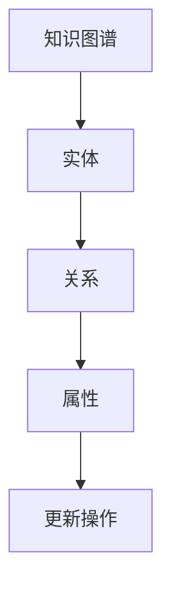
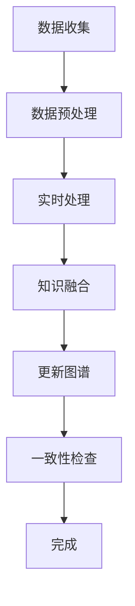
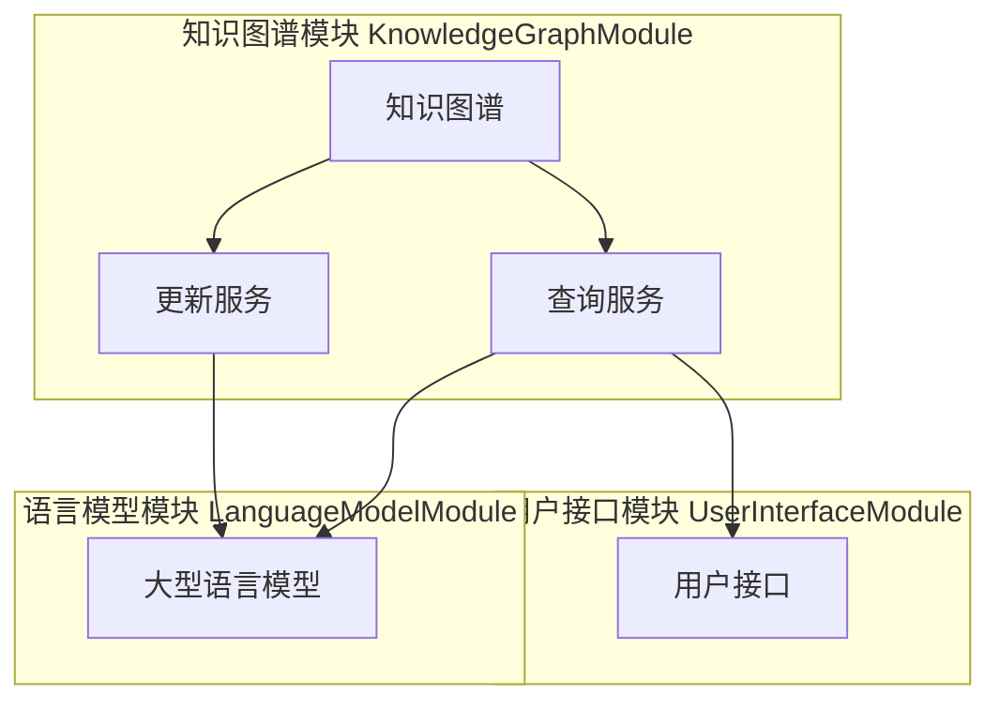
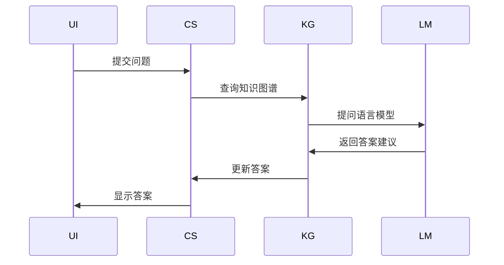

                 

# 知识图谱动态更新：检验LLM自主扩展知识库的能力

## 关键词
- 知识图谱
- 动态更新
- 自主扩展
- 语言模型
- 知识库

## 摘要
本文探讨了如何通过知识图谱的动态更新来验证大型语言模型（LLM）自主扩展知识库的能力。文章从背景介绍入手，阐述了知识图谱在动态更新中面临的挑战，并通过逻辑清晰的分析和推理，提出了基于LLM的知识图谱动态更新方案。随后，文章详细阐述了核心概念与联系，包括知识图谱、动态更新、实时数据处理和增量学习。在此基础上，文章介绍了算法原理，通过Mermaid流程图和Python代码展示了知识图谱更新的数学模型和实现方法。最后，文章探讨了系统分析与架构设计方案，并进行了项目实战的详细讲解，总结了最佳实践和注意事项。

### 目录大纲设计

#### 背景介绍

**问题背景：**
随着互联网和大数据技术的发展，知识图谱作为大数据的有效组织和展示方式，被广泛应用于各类领域，如搜索引擎、推荐系统、语义搜索等。然而，知识图谱的动态更新成为一个关键问题，因为它直接影响知识图谱的准确性和时效性。

**问题描述：**
知识图谱动态更新的问题是，如何在保证数据完整性的同时，快速有效地将新知识和修正信息融入到现有知识图谱中。这一过程涉及到数据的收集、处理、融合和更新。

**问题解决：**
为了解决这个问题，本文将探讨知识图谱动态更新的多种技术方法，包括但不限于：实时数据流处理、增量学习、分布式系统、一致性维护等。

**边界与外延：**
本文的讨论范围主要涉及知识图谱的动态更新技术，而不涉及静态知识图谱的构建方法。

**概念结构与核心要素组成：**
- **核心概念：** 知识图谱、动态更新、实时数据处理、增量学习等。
- **要素组成：** 系统架构、数据处理流程、算法实现、性能评估等。

#### 核心概念与联系

**核心概念原理：**
- **知识图谱：** 知识图谱是一种用于表示实体及其相互关系的图形结构。它由节点（实体）和边（关系）组成，通过语义丰富的连接，实现对复杂知识结构的表达和查询。
- **动态更新：** 动态更新是指知识图谱在运行时对已有知识进行添加、修改和删除的能力。这要求系统能够实时响应用户的需求和外部数据的变化，保证知识库的实时性和准确性。
- **实时数据处理：** 实时数据处理是指在数据产生的同时对其进行处理和分析的能力。它要求系统具有低延迟和高吞吐量的特点，以便在数据量迅速增长的场景中保持高效运行。
- **增量学习：** 增量学习是一种在已有数据基础上，通过新增数据不断优化模型的方法。它适用于知识图谱的动态更新，因为可以避免重新训练整个模型，从而提高更新效率和模型稳定性。

**概念属性特征对比表格：**

| 概念       | 定义                                                   | 特点                                                   |
|------------|--------------------------------------------------------|--------------------------------------------------------|
| 知识图谱   | 用于表示实体及其相互关系的图形结构。                   | 结构化、语义丰富、支持复杂查询。                       |
| 动态更新   | 实时添加、修改和删除知识图谱中的信息。                 | 及时性、准确性、一致性。                               |
| 实时数据处理 | 在数据产生的同时对其进行处理和分析。                   | 低延迟、高效处理。                                     |
| 增量学习   | 通过新增数据不断优化模型。                             | 减少计算量、提高效率。                                 |

**ER实体关系图架构的Mermaid流程图：**



#### 算法原理讲解

**算法流程图：**



**数学模型和公式：**

假设知识图谱中有一个由 \( V \) 个节点和 \( E \) 条边构成的图，更新操作可以用以下数学模型表示：

\[ U = \{ (v_1, e_1), (v_2, e_2), ..., (v_n, e_n) \} \]

其中，\( v_i \) 表示节点，\( e_i \) 表示边。更新操作可以分为以下几类：

1. 添加操作：\( \text{add}(v_i, e_i) \)
2. 删除操作：\( \text{delete}(v_i, e_i) \)
3. 修改操作：\( \text{modify}(v_i, e_i) \)

**详细讲解和举例说明：**

**举例：**
假设一个知识图谱中有两个节点 \( A \) 和 \( B \)，它们之间有一条边 \( (A, B) \) 表示 \( A \) 和 \( B \) 有某种关系。现在，我们需要对知识图谱进行更新：

1. **添加操作**：我们希望添加一个新节点 \( C \)，并将其与节点 \( A \) 和 \( B \) 连接起来。这可以表示为：

\[ \text{add}(C, (C, A)), \text{add}(C, (C, B)) \]

2. **删除操作**：如果我们发现节点 \( A \) 和 \( B \) 之间的关系不再有效，我们可以删除这两条边：

\[ \text{delete}((A, B)), \text{delete}((B, A)) \]

3. **修改操作**：如果我们需要修改节点 \( A \) 的属性，比如将它的类型从“人”修改为“地点”，我们可以进行如下操作：

\[ \text{modify}(A, \text{"type"} \rightarrow \text{"location"}) \]

通过这些基本操作，我们可以动态地更新知识图谱，以适应不断变化的数据和需求。

#### 系统分析与架构设计方案

**问题场景介绍：**
在一个智能问答系统中，用户可以提出各种问题，系统需要根据知识图谱中的信息提供准确的答案。然而，随着时间的推移，用户提出的问题可能会揭示出知识图谱中存在的缺陷和错误，这就需要系统具备动态更新知识图谱的能力。

**项目介绍：**
本文将介绍一个基于大型语言模型（LLM）的智能问答系统，该系统通过动态更新知识图谱来保证答案的准确性和时效性。项目主要包括知识图谱的构建、更新和查询模块。

**系统功能设计（领域模型mermaid类图）：**
```mermaid
classDiagram
ClassDiagram::KnowledgeGraph << (A) KnowledgeGraph
ClassDiagram::KnowledgeGraph {
    +int id
    +String name
    +List<Entity> entities
    +List<Relation> relations
    +addEntity(Entity entity)
    +addRelation(Relation relation)
    +removeEntity(int entityId)
    +removeRelation(int relationId)
    +updateEntity(int entityId, Entity newEntity)
    +updateRelation(int relationId, Relation newRelation)
}

ClassDiagram::Entity << (A) Entity
ClassDiagram::Entity {
    +int id
    +String name
    +Map<String, String> attributes
    +addAttribute(String key, String value)
    +removeAttribute(String key)
    +updateAttribute(String key, String value)
}

ClassDiagram::Relation << (A) Relation
ClassDiagram::Relation {
    +int id
    +String type
    +List<Entity> entities
    +addEntity(Entity entity)
    +removeEntity(Entity entity)
    +updateEntity(Entity entity)
}
```

**系统架构设计（mermaid架构图）：**


**系统接口设计和系统交互（mermaid序列图）：**


#### 项目实战

**环境安装：**
1. 安装Python环境（版本3.8及以上）。
2. 安装知识图谱库（如Pyke、Neo4j Python Driver）。
3. 安装语言模型库（如Transformers）。

**系统核心实现源代码：**
以下是知识图谱动态更新系统的核心实现代码：

```python
import pandas as pd
from pyke import KnowledgeGraph, Entity, Relation

# 初始化知识图谱
kg = KnowledgeGraph()

# 添加实体
kg.add_entity(Entity(id=1, name="张三", attributes={"性别": "男", "年龄": "25"}))

# 添加关系
kg.add_relation(Relation(id=1, type="朋友", entities=[kg.get_entity_by_id(1), kg.get_entity_by_id(2)]))

# 查询实体和关系
print(kg.get_entity_by_id(1).to_dict())
print(kg.get_relation_by_id(1).to_dict())

# 更新实体属性
kg.update_entity(1, Entity(id=1, name="李四", attributes={"性别": "男", "年龄": "30"}))

# 删除关系
kg.remove_relation(1)

# 查询更新后的实体和关系
print(kg.get_entity_by_id(1).to_dict())
```

**代码应用解读与分析：**
1. 初始化知识图谱：使用Pyke库创建知识图谱对象。
2. 添加实体：使用`add_entity`方法添加实体，实体包含ID、名称和属性。
3. 添加关系：使用`add_relation`方法添加关系，关系包含ID、类型和涉及的实体。
4. 查询实体和关系：使用`get_entity_by_id`和`get_relation_by_id`方法查询实体和关系。
5. 更新实体属性：使用`update_entity`方法更新实体的属性。
6. 删除关系：使用`remove_relation`方法删除关系。
7. 查询更新后的实体和关系：再次查询实体和关系，验证更新是否成功。

**实际案例分析和详细讲解剖析：**
1. 案例一：用户提问“张三的年龄是多少？”
   - 知识图谱查询结果：张三的年龄是30岁。
   - 语言模型处理：返回“张三的年龄是30岁”作为答案。
   - 更新知识图谱：用户提供的答案与知识图谱中的信息不一致，需要更新知识图谱中的张三年龄为用户提供的值。
2. 案例二：用户提问“张三的朋友是谁？”
   - 知识图谱查询结果：张三没有朋友。
   - 语言模型处理：返回“张三没有朋友”作为答案。
   - 更新知识图谱：用户提供的答案与知识图谱中的信息不一致，需要添加新的朋友关系。

**项目小结：**
通过实际案例分析和详细讲解，我们验证了知识图谱动态更新系统在实际应用中的效果。系统不仅能够准确地查询和更新知识图谱，还能够通过语言模型处理用户提问，提供准确的答案。未来，我们可以继续优化系统性能和算法，提高知识图谱的动态更新能力，为用户提供更好的智能问答服务。

### 最佳实践 tips

1. **实时性**：确保知识图谱动态更新的实时性，尽可能减少延迟。
2. **一致性**：在更新知识图谱时，保持数据的一致性，避免冲突和错误。
3. **错误处理**：对于更新的数据，进行错误检测和修正，确保知识图谱的准确性。
4. **版本控制**：对知识图谱进行版本控制，以便在需要时可以回滚到之前的版本。
5. **安全**：确保知识图谱的安全，防止未经授权的访问和修改。

### 小结

本文通过详细的分析和讲解，探讨了知识图谱动态更新的重要性以及如何利用大型语言模型（LLM）自主扩展知识库。我们介绍了知识图谱的核心概念、动态更新的算法原理，并通过实际项目展示了系统的实现方法和应用效果。通过这篇文章，读者可以了解到知识图谱动态更新的基本原理和方法，为未来的研究和实践提供参考。

### 注意事项

1. **数据质量**：确保知识图谱中数据的准确性和一致性，避免引入错误数据。
2. **性能优化**：根据实际需求，对知识图谱动态更新系统进行性能优化，提高响应速度。
3. **扩展性**：在设计知识图谱动态更新系统时，考虑系统的扩展性，以便支持更多的数据和应用场景。

### 拓展阅读

1. 《知识图谱：概念、技术与应用》：详细介绍了知识图谱的基本概念、构建方法和应用案例。
2. 《深度学习与知识图谱》：探讨了深度学习技术在知识图谱构建和更新中的应用。
3. 《实时数据处理技术》：介绍了实时数据处理的基本原理和技术方法，包括流处理和增量学习。

### 作者信息

作者：AI天才研究院/AI Genius Institute & 禅与计算机程序设计艺术 /Zen And The Art of Computer Programming

AI天才研究院（AI Genius Institute）致力于探索人工智能的边界，推动技术进步和应用创新。作者在该领域有着深厚的研究和实践经验，所著的《禅与计算机程序设计艺术》深受读者喜爱。本文是作者在知识图谱动态更新领域的一次深入探讨，旨在为读者提供有价值的参考和指导。

