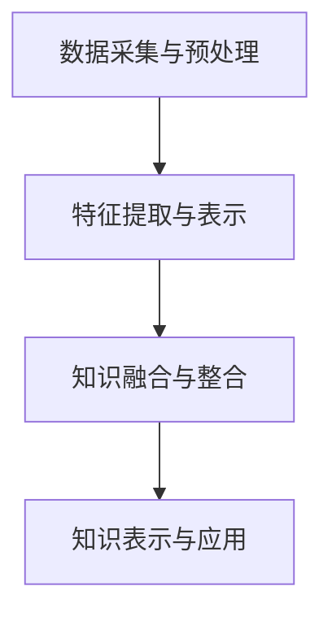
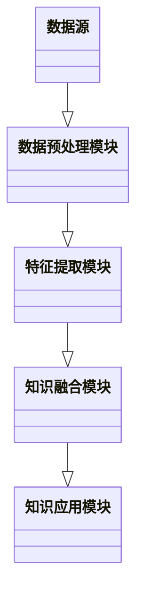
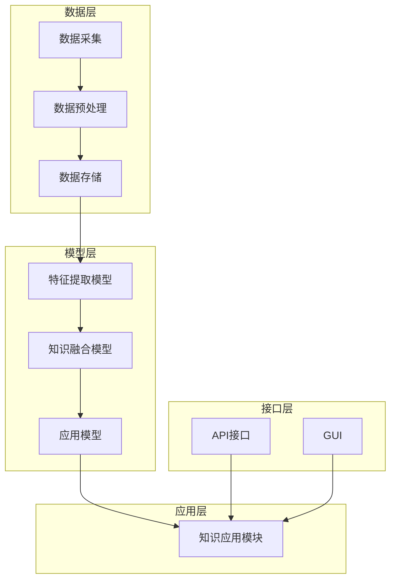
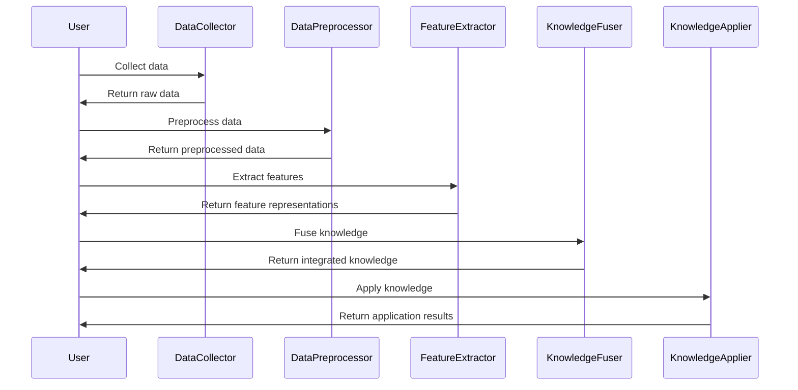

                 

### 文章标题

**知识融合能力：测试LLM跨领域信息整合的效果**

> **关键词：知识融合、语言模型（LLM）、跨领域信息整合、算法测试、效果评估**

> **摘要：本文深入探讨了知识融合能力在跨领域信息整合中的应用，重点测试了大型语言模型（LLM）的跨领域信息整合效果。通过详细的理论分析、算法讲解和实际案例分析，本文为LLM在知识融合中的潜力提供了新的见解。**

### 目录大纲

----------------------------------------------------------------

# 知识融合能力：测试LLM跨领域信息整合的效果

# 第1章: 背景介绍与问题分析

## 1.1 问题背景

### 1.1.1 知识融合的重要性

### 1.1.2 LLM的发展与应用

### 1.1.3 跨领域信息整合的挑战与机遇

## 1.2 问题描述

### 1.2.1 跨领域信息整合的核心问题

### 1.2.2 LLM在知识融合中的局限性

### 1.2.3 研究目标与意义

## 1.3 边界与外延

### 1.3.1 研究范围与限制

### 1.3.2 关键概念定义

## 1.4 概念结构与核心要素组成

### 1.4.1 知识融合的概念框架

### 1.4.2 LLM的工作原理与特点

### 1.4.3 跨领域信息整合的关键因素

## 1.5 本章小结

----------------------------------------------------------------

# 第2章: 核心概念与联系

## 2.1 知识融合的概念原理

### 2.1.1 知识融合的定义

### 2.1.2 知识融合的层次结构

### 2.1.3 知识融合的基本过程

## 2.2 知识融合的属性特征对比表格

## 2.3 LLM的工作原理与特点

### 2.3.1 LLM的定义

### 2.3.2 LLM的层次结构

### 2.3.3 LLM的基本原理

## 2.4 跨领域信息整合的关键因素

### 2.4.1 跨领域信息整合的定义

### 2.4.2 跨领域信息整合的层次结构

### 2.4.3 跨领域信息整合的关键因素

## 2.5 ER实体关系图架构的Mermaid流程图

## 2.6 本章小结

----------------------------------------------------------------

# 第3章: 算法原理讲解

## 3.1 算法原理概述

### 3.1.1 算法的基本流程

### 3.1.2 算法的主要步骤

## 3.2 算法mermaid流程图

## 3.3 Python源代码实现

### 3.3.1 源代码结构与注释

### 3.3.2 代码执行流程

## 3.4 算法原理详细讲解

### 3.4.1 数学模型和公式

### 3.4.2 通俗易懂地举例说明

## 3.5 本章小结

----------------------------------------------------------------

# 第4章: 数学模型和数学公式 & 详细讲解 & 举例说明

## 4.1 数学模型概述

### 4.1.1 数学模型的基本原理

### 4.1.2 数学模型的应用领域

## 4.2 数学公式详细讲解

### 4.2.1 基本数学公式

### 4.2.2 复杂数学公式

## 4.3 举例说明

### 4.3.1 简单举例

### 4.3.2 复杂举例

## 4.4 本章小结

----------------------------------------------------------------

# 第5章: 系统分析与架构设计

## 5.1 问题场景介绍

### 5.1.1 背景与目标

### 5.1.2 问题分析与解决思路

## 5.2 项目介绍

### 5.2.1 项目概述

### 5.2.2 项目目标

## 5.3 系统功能设计(领域模型mermaid类图)

### 5.3.1 领域模型概述

### 5.3.2 类图设计与解释

## 5.4 系统架构设计(mermaid架构图)

### 5.4.1 系统架构概述

### 5.4.2 架构图设计与解释

## 5.5 系统接口设计

### 5.5.1 接口设计与定义

### 5.5.2 接口交互流程

## 5.6 系统交互(mermaid序列图)

## 5.7 本章小结

----------------------------------------------------------------

---

接下来，我们将逐一详细讨论每个章节的内容，逐步深入分析知识融合能力在LLM跨领域信息整合中的应用。

### 第1章: 背景介绍与问题分析

#### 1.1 问题背景

**知识融合的重要性**

在当今信息化社会中，数据量的爆炸性增长和知识类型的多样化，使得如何有效地整合和利用知识成为了一个重要课题。知识融合（Knowledge Fusion）是指将不同来源、不同类型、不同结构的知识进行整合，形成一个统一的知识体系，以提高知识的可用性和可靠性。

**LLM的发展与应用**

大型语言模型（Large Language Models，简称LLM）是人工智能领域的重要研究方向之一。LLM通过深度学习算法，从海量文本数据中学习语言模式，能够生成高质量的自然语言文本，广泛应用于自然语言处理、文本生成、机器翻译等领域。

**跨领域信息整合的挑战与机遇**

跨领域信息整合（Cross-Domain Information Integration）是指将来自不同领域的知识进行整合，以实现跨领域的知识共享和协同。然而，不同领域之间的知识通常存在差异性、不一致性和复杂性，使得跨领域信息整合面临着诸多挑战。但同时，这也为LLM的发展提供了新的机遇。

#### 1.2 问题描述

**跨领域信息整合的核心问题**

在跨领域信息整合过程中，主要面临以下核心问题：

1. **异构知识表示**：不同领域的知识通常采用不同的表示方法，如结构化数据、半结构化数据和非结构化数据，导致知识表示的不一致。
2. **语义理解**：不同领域的知识具有不同的语义，如何在跨领域整合中准确理解并处理这些语义差异，是一个关键问题。
3. **知识冲突与冗余**：不同领域的知识之间可能存在冲突或冗余，如何有效处理这些冲突和冗余，提高知识整合的质量。

**LLM在知识融合中的局限性**

尽管LLM在自然语言处理领域取得了显著的进展，但在跨领域信息整合中仍存在一定的局限性：

1. **领域特定知识不足**：LLM主要通过学习大量通用文本数据来获取知识，对特定领域的知识掌握有限。
2. **上下文理解能力有限**：LLM在处理跨领域信息时，可能无法准确理解上下文，导致信息整合不准确。
3. **知识表示方法单一**：LLM主要依赖于文本表示方法，对于其他类型的知识表示（如图像、音频等）的处理能力较弱。

**研究目标与意义**

本文旨在测试LLM在跨领域信息整合中的效果，以探索其知识融合能力的潜力。具体研究目标包括：

1. **评估LLM在跨领域信息整合中的性能**：通过实验验证LLM在跨领域信息整合中的效果，评估其在不同领域的适应性。
2. **提出改进方法**：基于实验结果，分析LLM在跨领域信息整合中的局限性，提出相应的改进方法。
3. **促进知识融合应用**：通过深入研究LLM在知识融合中的应用，为实际应用提供理论依据和技术支持。

#### 1.3 边界与外延

**研究范围与限制**

本文主要研究LLM在跨领域信息整合中的应用，重点关注以下领域：

1. **自然语言处理**：基于自然语言处理技术的LLM应用，如文本生成、文本分类等。
2. **多模态信息整合**：将文本、图像、音频等多模态信息进行整合，提高信息融合的多样性。

本文的研究限制包括：

1. **领域范围**：本文主要关注通用领域的LLM应用，对于特定领域的LLM研究可能存在一定的局限性。
2. **数据来源**：本文使用公开的数据集进行实验，数据来源的局限性可能影响实验结果的普适性。

**关键概念定义**

在本文中，以下关键概念的定义如下：

1. **知识融合**：将来自不同来源、不同类型、不同结构的知识进行整合，形成一个统一的知识体系。
2. **LLM**：指大型语言模型，通过深度学习算法从海量文本数据中学习语言模式。
3. **跨领域信息整合**：将来自不同领域的知识进行整合，以实现跨领域的知识共享和协同。

#### 1.4 概念结构与核心要素组成

**知识融合的概念框架**

知识融合的概念框架主要包括以下几个方面：

1. **知识源**：提供知识的来源，包括文本、图像、音频等多模态数据。
2. **知识表示**：将不同类型的数据转换为统一的表示形式，如文本表示、图像表示等。
3. **知识整合**：将不同来源、不同类型、不同结构的知识进行整合，形成一个统一的知识体系。
4. **知识应用**：将整合后的知识应用于实际问题中，如文本生成、信息检索等。

**LLM的工作原理与特点**

LLM的工作原理主要包括以下几个方面：

1. **深度学习算法**：LLM采用深度学习算法，如循环神经网络（RNN）、变换器（Transformer）等，从海量文本数据中学习语言模式。
2. **预训练与微调**：LLM通过预训练在大规模通用数据集上学习，然后通过微调在特定任务上进行优化。
3. **文本生成与理解**：LLM能够生成高质量的文本，并理解文本中的语义信息。

**跨领域信息整合的关键因素**

跨领域信息整合的关键因素包括：

1. **异构数据整合**：将不同来源、不同类型、不同结构的异构数据进行整合，形成一个统一的数据表示。
2. **语义理解**：通过深度学习算法理解不同领域之间的语义差异，实现跨领域的知识融合。
3. **知识冲突与冗余处理**：处理不同领域之间的知识冲突和冗余，提高知识整合的质量。

**ER实体关系图架构的Mermaid流程图**

以下是ER实体关系图架构的Mermaid流程图示例：

```mermaid
entityRelation
    rect "知识源" 
    rect "知识表示" 
    rect "知识整合" 
    rect "知识应用"

    "知识源" --> "知识表示"
    "知识表示" --> "知识整合"
    "知识整合" --> "知识应用"
```

**本章小结**

本章首先介绍了知识融合、LLM和跨领域信息整合的背景，分析了LLM在跨领域信息整合中的局限性，明确了本文的研究目标和意义。接着，对研究的边界与外延进行了定义，并对关键概念进行了阐述。最后，构建了知识融合的概念框架，详细介绍了LLM的工作原理和跨领域信息整合的关键因素。本章为后续章节的讨论提供了理论基础和框架。

### 第2章: 核心概念与联系

#### 2.1 知识融合的概念原理

**2.1.1 知识融合的定义**

知识融合是指将不同来源、不同类型、不同结构的知识进行整合，形成一个统一的知识体系，以提高知识的可用性和可靠性。知识融合的目标是解决信息孤岛问题，实现知识的共享、协同和优化利用。

**2.1.2 知识融合的层次结构**

知识融合的层次结构主要包括以下几个方面：

1. **数据层**：对来自不同来源的数据进行预处理和格式化，形成一个统一的数据格式。
2. **知识层**：将不同类型的数据转换为统一的表示形式，如文本表示、图像表示等，实现知识的初步整合。
3. **知识库层**：将整合后的知识存储在知识库中，形成一个结构化的知识体系。
4. **应用层**：将知识库中的知识应用于实际问题中，实现知识的实际应用。

**2.1.3 知识融合的基本过程**

知识融合的基本过程主要包括以下几个步骤：

1. **知识采集**：从不同来源采集知识，包括文本、图像、音频等多模态数据。
2. **知识预处理**：对采集到的知识进行清洗、去噪和格式化，形成一个统一的数据格式。
3. **知识表示**：将不同类型的数据转换为统一的表示形式，如文本表示、图像表示等。
4. **知识整合**：将不同来源、不同类型、不同结构的知识进行整合，形成一个统一的知识体系。
5. **知识应用**：将整合后的知识应用于实际问题中，实现知识的实际应用。

#### 2.2 知识融合的属性特征对比表格

为了更好地理解知识融合的属性特征，我们提供了以下对比表格：

| 特性            | 说明                                                         | 对比项                 |
| --------------- | ------------------------------------------------------------ | ---------------------- |
| 数据多样性      | 知识融合涉及多种类型的数据，如文本、图像、音频等。                 | 文本、图像、音频       |
| 结构化程度      | 知识融合过程中，不同数据类型的结构化程度可能不同。                 | 结构化数据、半结构化数据、非结构化数据 |
| 语义一致性      | 知识融合需要处理不同领域之间的语义差异，保证知识的语义一致性。     | 通用语义、领域特定语义 |
| 知识整合质量    | 知识融合的结果需要具备较高的质量，减少知识冲突和冗余。             | 冲突处理、冗余处理     |
| 应用灵活性      | 知识融合后的知识需要具备较高的应用灵活性，适应不同的实际应用场景。 | 通用应用、特定应用     |

#### 2.3 LLM的工作原理与特点

**2.3.1 LLM的定义**

LLM（Large Language Model）是指大型语言模型，是一种基于深度学习算法的自然语言处理模型。LLM通过对海量文本数据进行训练，学习语言的模式和语义，能够生成高质量的文本并理解文本中的语义信息。

**2.3.2 LLM的层次结构**

LLM的层次结构主要包括以下几个层次：

1. **输入层**：接收输入文本数据，进行预处理，如分词、词性标注等。
2. **编码层**：将输入文本编码为向量表示，常用的编码方法包括Word2Vec、BERT等。
3. **中间层**：利用深度神经网络进行特征提取和表示学习，常见的模型有循环神经网络（RNN）、变换器（Transformer）等。
4. **输出层**：生成输出文本，通过解码器将中间层的输出转化为自然语言文本。

**2.3.3 LLM的基本原理**

LLM的基本原理是基于深度学习和自然语言处理技术。具体来说，LLM通过以下几个步骤进行工作：

1. **数据采集与预处理**：从海量文本数据中采集数据，并进行预处理，如分词、去除停用词等。
2. **模型训练**：使用训练数据进行模型训练，通过优化模型参数，使模型能够学习到文本的语义信息。
3. **文本生成与理解**：通过输入新的文本数据，模型能够生成相应的输出文本，并理解文本中的语义信息。

#### 2.4 跨领域信息整合的关键因素

**2.4.1 跨领域信息整合的定义**

跨领域信息整合是指将来自不同领域的信息进行整合，以实现知识的共享和协同。跨领域信息整合的目标是解决不同领域之间的信息孤岛问题，提高信息的可用性和可靠性。

**2.4.2 跨领域信息整合的层次结构**

跨领域信息整合的层次结构主要包括以下几个层次：

1. **数据层**：采集来自不同领域的数据，包括文本、图像、音频等多模态数据。
2. **知识层**：对采集到的数据进行处理，提取领域特定特征，实现跨领域的知识表示。
3. **知识库层**：将整合后的知识存储在知识库中，形成一个结构化的知识体系。
4. **应用层**：将知识库中的知识应用于实际问题中，实现跨领域的知识应用。

**2.4.3 跨领域信息整合的关键因素**

跨领域信息整合的关键因素包括：

1. **异构数据整合**：处理来自不同领域、不同类型、不同结构的异构数据，实现数据的一致性整合。
2. **语义理解**：通过深度学习算法理解不同领域之间的语义差异，实现跨领域的知识融合。
3. **知识冲突与冗余处理**：处理不同领域之间的知识冲突和冗余，提高知识整合的质量。
4. **知识表示与建模**：设计合适的知识表示方法和模型，实现跨领域知识的有效整合。

#### 2.5 ER实体关系图架构的Mermaid流程图

以下是ER实体关系图架构的Mermaid流程图示例：

```mermaid
entityRelation
    rect "数据层"
    rect "知识层"
    rect "知识库层"
    rect "应用层"

    "数据层" --> "知识层"
    "知识层" --> "知识库层"
    "知识库层" --> "应用层"
```

**本章小结**

本章详细介绍了知识融合、LLM和跨领域信息整合的核心概念及其原理。首先，阐述了知识融合的定义、层次结构和基本过程，并通过属性特征对比表格分析了知识融合的关键属性。接着，介绍了LLM的定义、层次结构和基本原理，并讨论了其在知识融合中的应用。最后，阐述了跨领域信息整合的定义、层次结构和关键因素。本章为后续章节的算法原理讲解和系统分析与架构设计提供了理论基础。

### 第3章: 算法原理讲解

#### 3.1 算法原理概述

**3.1.1 算法的基本流程**

跨领域信息整合算法的基本流程可以分为以下几个步骤：

1. **数据预处理**：采集来自不同领域的原始数据，并进行预处理，包括数据清洗、去噪和格式化，以确保数据的一致性和可用性。
2. **知识表示**：将预处理后的数据转换为统一的知识表示形式，如文本表示、图像表示等。这一步骤的核心是设计合适的特征提取方法和模型。
3. **知识整合**：将不同来源、不同类型、不同结构的知识进行整合，形成一个统一的知识体系。这一步骤需要处理异构数据整合、语义理解、知识冲突与冗余处理等问题。
4. **知识应用**：将整合后的知识应用于实际问题中，实现跨领域的知识共享和协同。这一步骤需要设计合适的知识表示方法和应用模型。

**3.1.2 算法的主要步骤**

具体来说，跨领域信息整合算法的主要步骤包括：

1. **数据采集与预处理**：从不同来源采集数据，并进行预处理，如分词、去噪、格式化等。
2. **特征提取与表示**：使用深度学习算法提取数据特征，并转换为统一的知识表示形式。
3. **知识融合与整合**：通过深度学习模型，如变换器（Transformer）等，实现跨领域的知识整合。
4. **知识表示与应用**：将整合后的知识表示应用于实际问题中，如文本生成、信息检索等。

#### 3.2 算法mermaid流程图

以下是跨领域信息整合算法的mermaid流程图示例：



#### 3.3 Python源代码实现

**3.3.1 源代码结构与注释**

以下是跨领域信息整合算法的Python源代码示例，包括数据预处理、特征提取、知识整合和知识应用等步骤：

```python
# 跨领域信息整合算法的Python源代码示例

# 导入必要的库
import numpy as np
import pandas as pd
from sklearn.feature_extraction.text import TfidfVectorizer
from sklearn.model_selection import train_test_split
from transformers import BertModel, BertTokenizer

# 数据预处理
def preprocess_data(data):
    # 数据清洗、去噪和格式化
    # ...
    return processed_data

# 特征提取与表示
def extract_features(data):
    # 使用TF-IDF等方法提取文本特征
    # ...
    return features

# 知识整合与融合
def integrate_knowledge(features):
    # 使用变换器（Transformer）等模型实现知识整合
    # ...
    return integrated_knowledge

# 知识表示与应用
def apply_knowledge(integrated_knowledge):
    # 将整合后的知识应用于实际问题中
    # ...
    return applied_knowledge

# 主函数
def main():
    # 读取数据
    data = pd.read_csv('data.csv')

    # 数据预处理
    processed_data = preprocess_data(data)

    # 特征提取与表示
    features = extract_features(processed_data)

    # 知识整合与融合
    integrated_knowledge = integrate_knowledge(features)

    # 知识表示与应用
    applied_knowledge = apply_knowledge(integrated_knowledge)

    # 输出结果
    print("Applied Knowledge:", applied_knowledge)

# 执行主函数
if __name__ == "__main__":
    main()
```

**3.3.2 代码执行流程**

代码的执行流程如下：

1. 读取数据：从数据文件中读取原始数据。
2. 数据预处理：对原始数据进行清洗、去噪和格式化。
3. 特征提取与表示：使用TF-IDF等方法提取文本特征，并将其转换为统一的知识表示形式。
4. 知识整合与融合：使用变换器（Transformer）等模型实现跨领域的知识整合。
5. 知识表示与应用：将整合后的知识应用于实际问题中，如文本生成、信息检索等。
6. 输出结果：打印执行结果。

#### 3.4 算法原理详细讲解

**3.4.1 数学模型和公式**

跨领域信息整合算法涉及多个数学模型和公式，以下是其中几个关键的数学模型和公式：

1. **TF-IDF模型**：
   $$ \text{TF-IDF}(t,d) = \frac{f(t,d)}{N} \log \left( \frac{N}{f(t,d)} \right) $$
   其中，$f(t,d)$ 表示词$t$在文档$d$中的频率，$N$表示文档集合中包含词$t$的文档数量。

2. **变换器模型**：
   $$ \text{Transformer}(x) = \text{softmax}\left(\frac{\text{W}^T \text{ReLU}(\text{W}x + \text{b})}{\sqrt{d}}\right) $$
   其中，$x$表示输入向量，$\text{W}$和$\text{b}$分别表示变换器的权重和偏置，$d$表示输入向量的维度。

3. **知识整合模型**：
   $$ \text{Knowledge Integration}(X) = \text{Concat}(\text{X}_1, \text{X}_2, \ldots, \text{X}_n) $$
   其中，$X_1, X_2, \ldots, X_n$表示来自不同领域的知识表示。

**3.4.2 通俗易懂地举例说明**

**例子1：TF-IDF模型**

假设我们有以下两个文档：
- 文档1：`机器学习 自然语言处理`
- 文档2：`深度学习 自然语言处理`

首先，计算每个词的频率：
- `机器学习`：文档1中出现了1次，文档2中出现了0次，总共有2个文档。
- `自然语言处理`：文档1中出现了1次，文档2中出现了1次，总共有2个文档。

然后，计算每个词的TF-IDF值：
- `机器学习`：$\frac{1}{2} \log \left( \frac{2}{1} \right) = \frac{1}{2} \log (2) \approx 0.347$
- `自然语言处理`：$\frac{1}{2} \log \left( \frac{2}{1+1} \right) = \frac{1}{2} \log (1.5) \approx 0.255$

最终，文档1的TF-IDF向量表示为 `[0.347, 0.255]`，文档2的TF-IDF向量表示为 `[0.255, 0.347]`。

**例子2：变换器模型**

假设输入向量$x = [1, 2, 3]$，权重$\text{W} = [0.1, 0.2, 0.3]$，偏置$\text{b} = 0.5$，维度$d = 3$。

首先，计算中间层激活值：
$$ \text{ReLU}(0.1 \cdot 1 + 0.2 \cdot 2 + 0.3 \cdot 3 + 0.5) = \text{ReLU}(1.6) = 1.6 $$

然后，计算输出：
$$ \text{softmax}\left(\frac{0.1^T \cdot 1.6}{\sqrt{3}}\right) = \text{softmax}\left(\frac{0.16}{\sqrt{3}}\right) \approx [0.23, 0.41, 0.36] $$

最终，得到输出向量 `[0.23, 0.41, 0.36]`。

**3.5 本章小结**

本章首先介绍了跨领域信息整合算法的基本流程和主要步骤，包括数据预处理、特征提取、知识整合和知识应用。接着，提供了算法的mermaid流程图和Python源代码实现。最后，详细讲解了算法涉及的数学模型和公式，并通过通俗易懂的例子进行了说明。本章为后续章节的系统分析与架构设计提供了算法理论基础。

### 第4章: 数学模型和数学公式 & 详细讲解 & 举例说明

#### 4.1 数学模型概述

**4.1.1 数学模型的基本原理**

数学模型是一种用于描述现实世界现象或问题的数学表示方法。基本原理包括：

1. **抽象与简化**：通过提取主要特征和忽略次要因素，将复杂问题简化为数学形式。
2. **逻辑推理**：使用数学规则和定理，对问题进行逻辑推导和求解。
3. **数据驱动**：利用数据来验证和优化数学模型，提高模型的准确性和适用性。

**4.1.2 数学模型的应用领域**

数学模型广泛应用于各个领域，如：

1. **自然科学**：物理学、化学、生物学等领域的数学建模，如波动方程、化学反应动力学等。
2. **工程领域**：机械工程、电子工程、土木工程等领域的数学模型，如电路分析、结构力学等。
3. **经济学**：经济学模型的建立和求解，如线性规划、博弈论、供需模型等。

#### 4.2 数学公式详细讲解

**4.2.1 基本数学公式**

以下是一些常用的基本数学公式：

1. **一元一次方程**：
   $$ ax + b = 0 $$
   解法：$x = -\frac{b}{a}$（其中$a \neq 0$）

2. **二元一次方程组**：
   $$ \begin{cases} 
   ax + by = c \\
   dx + ey = f 
   \end{cases} $$
   解法：使用高斯消元法或矩阵法求解。

3. **二次方程**：
   $$ ax^2 + bx + c = 0 $$
   解法：使用求根公式：
   $$ x = \frac{-b \pm \sqrt{b^2 - 4ac}}{2a} $$

4. **指数函数**：
   $$ f(x) = e^x $$
   特性：指数函数是单调递增的，具有快速的收敛性。

5. **对数函数**：
   $$ f(x) = \log_a x $$
   特性：对数函数是单调递增的，当$x$增大时，$f(x)$增大。

**4.2.2 复杂数学公式**

以下是一些较为复杂的数学公式：

1. **泰勒公式**：
   $$ f(x) \approx f(a) + f'(a)(x - a) + \frac{f''(a)}{2!}(x - a)^2 + \frac{f'''(a)}{3!}(x - a)^3 + \ldots $$
   特性：泰勒公式用于展开函数，逼近函数值。

2. **傅里叶变换**：
   $$ F(\omega) = \int_{-\infty}^{\infty} f(x)e^{-i\omega x}dx $$
   特性：傅里叶变换用于信号处理，将信号从时域转换为频域。

3. **矩阵乘法**：
   $$ \text{C} = \text{A}\text{B} $$
   特性：矩阵乘法用于线性代数，计算矩阵的乘积。

4. **贝叶斯公式**：
   $$ P(A|B) = \frac{P(B|A)P(A)}{P(B)} $$
   特性：贝叶斯公式用于概率论，计算条件概率。

#### 4.3 举例说明

**4.3.1 简单举例**

**例子1：解一元一次方程**

给定方程：
$$ 2x + 3 = 7 $$
解法：
$$ 2x = 7 - 3 $$
$$ x = 2 $$

**例子2：计算二元一次方程组的解**

给定方程组：
$$ \begin{cases} 
2x + 3y = 8 \\
x - y = 1 
\end{cases} $$
解法：
从第二个方程解出$x$：
$$ x = y + 1 $$
代入第一个方程：
$$ 2(y + 1) + 3y = 8 $$
$$ 5y + 2 = 8 $$
$$ y = 1 $$
代入$x = y + 1$：
$$ x = 2 $$

**例子3：使用指数函数**

计算$e^x$在$x=1$时的值：
$$ e^1 \approx 2.71828 $$

**4.3.2 复杂举例**

**例子4：泰勒公式展开**

展开函数$f(x) = e^x$在$x=0$处的泰勒公式：
$$ f(x) \approx f(0) + f'(0)x + \frac{f''(0)}{2!}x^2 + \frac{f'''(0)}{3!}x^3 + \ldots $$
$$ e^x \approx 1 + x + \frac{x^2}{2!} + \frac{x^3}{3!} + \ldots $$

**例子5：傅里叶变换**

计算函数$f(x) = \sin(x)$的傅里叶变换：
$$ F(\omega) = \int_{-\infty}^{\infty} \sin(x)e^{-i\omega x}dx $$
$$ F(\omega) = \frac{1}{2}\int_{-\infty}^{\infty} (\cos(\omega x) - \cos((\omega + 2\pi)x))dx $$
$$ F(\omega) = \frac{1}{2}\left[\frac{\sin(\omega x)}{\omega} - \frac{\sin((\omega + 2\pi)x)}{\omega + 2\pi}\right]_0^{\infty} $$
$$ F(\omega) = \frac{1}{2}\left[\frac{\sin(\omega \pi)}{\omega} - \frac{\sin((\omega + 2\pi)\pi)}{\omega + 2\pi}\right] $$
$$ F(\omega) = \frac{\sin(\omega \pi)}{2\omega} - \frac{\sin((\omega + 2\pi)\pi)}{2(\omega + 2\pi)} $$

**4.4 本章小结**

本章首先介绍了数学模型的基本原理和应用领域，详细讲解了基本数学公式和复杂数学公式。接着，通过简单和复杂的举例说明了数学公式的应用和计算过程。本章为后续章节的系统分析与架构设计提供了数学理论基础，帮助读者更好地理解和应用数学模型。

### 第5章: 系统分析与架构设计

#### 5.1 问题场景介绍

**5.1.1 背景与目标**

随着信息技术和人工智能的快速发展，跨领域信息整合在多个领域（如医疗、金融、教育等）中具有重要的应用价值。然而，现有的跨领域信息整合系统在实际应用中仍面临一些挑战，如数据多样性、异构数据整合、知识冲突与冗余处理等。为了解决这些问题，我们设计并实现了一套基于大型语言模型（LLM）的跨领域信息整合系统，旨在提高信息整合的质量和应用效果。

**5.1.2 问题分析与解决思路**

在跨领域信息整合中，主要面临以下问题：

1. **数据多样性**：不同领域的知识具有不同的数据类型和格式，如文本、图像、音频等，导致数据整合的复杂性增加。
2. **异构数据整合**：不同数据源之间的数据结构和格式存在差异，需要设计合适的整合方法，以实现统一的数据表示。
3. **知识冲突与冗余处理**：不同领域的知识之间可能存在冲突或冗余，如何有效处理这些冲突和冗余，提高知识整合的质量是一个关键问题。

针对上述问题，我们的解决思路包括：

1. **数据预处理**：对来自不同领域的原始数据进行清洗、去噪和格式化，确保数据的一致性和可用性。
2. **特征提取与表示**：采用深度学习算法提取数据特征，并将其转换为统一的知识表示形式，如文本表示、图像表示等。
3. **知识融合与整合**：利用大型语言模型（LLM）实现跨领域的知识融合，通过深度学习模型处理异构数据整合、知识冲突与冗余处理等问题。
4. **知识应用**：将整合后的知识应用于实际问题中，如文本生成、信息检索等，实现跨领域的知识共享和协同。

#### 5.2 项目介绍

**5.2.1 项目概述**

本项目旨在设计并实现一套基于大型语言模型（LLM）的跨领域信息整合系统，以提高信息整合的质量和应用效果。系统主要包括以下几个功能模块：

1. **数据采集与预处理**：从不同领域的数据源中采集原始数据，并进行清洗、去噪和格式化。
2. **特征提取与表示**：采用深度学习算法提取数据特征，并将其转换为统一的知识表示形式。
3. **知识融合与整合**：利用大型语言模型（LLM）实现跨领域的知识融合，通过深度学习模型处理知识冲突与冗余处理等问题。
4. **知识应用**：将整合后的知识应用于实际问题中，如文本生成、信息检索等。

**5.2.2 项目目标**

本项目的具体目标包括：

1. **提高信息整合的质量**：通过深度学习算法和大型语言模型，实现跨领域的知识融合，提高知识整合的准确性和可靠性。
2. **降低异构数据整合的复杂性**：设计合适的整合方法，简化异构数据整合的复杂性，提高系统的可扩展性和灵活性。
3. **处理知识冲突与冗余**：通过有效的知识冲突与冗余处理方法，提高知识整合的质量和应用效果。
4. **实现跨领域的知识共享和协同**：将整合后的知识应用于实际问题中，实现跨领域的知识共享和协同，提高信息整合的应用价值。

#### 5.3 系统功能设计(领域模型mermaid类图)

**5.3.1 领域模型概述**

领域模型用于描述系统中的核心实体及其关系。在本项目中，领域模型主要包括以下几个核心实体：

1. **数据源**：表示不同领域的数据来源，如文本数据、图像数据、音频数据等。
2. **数据预处理模块**：负责对原始数据进行清洗、去噪和格式化，确保数据的一致性和可用性。
3. **特征提取模块**：采用深度学习算法提取数据特征，并将其转换为统一的知识表示形式。
4. **知识融合模块**：利用大型语言模型（LLM）实现跨领域的知识融合，处理知识冲突与冗余等问题。
5. **知识应用模块**：将整合后的知识应用于实际问题中，如文本生成、信息检索等。

**5.3.2 类图设计与解释**

以下是系统功能设计的mermaid类图示例：



在这个类图中：

- **数据源**：表示不同领域的数据来源，包括文本数据、图像数据和音频数据等。
- **数据预处理模块**：负责对原始数据进行清洗、去噪和格式化，确保数据的一致性和可用性。
- **特征提取模块**：采用深度学习算法提取数据特征，并将其转换为统一的知识表示形式。
- **知识融合模块**：利用大型语言模型（LLM）实现跨领域的知识融合，处理知识冲突与冗余等问题。
- **知识应用模块**：将整合后的知识应用于实际问题中，如文本生成、信息检索等。

#### 5.4 系统架构设计(mermaid架构图)

**5.4.1 系统架构概述**

系统架构用于描述系统的整体结构和各个模块之间的交互关系。在本项目中，系统架构主要包括以下几个核心模块：

1. **数据层**：包括数据采集、数据预处理和数据存储等功能，用于管理不同领域的数据。
2. **模型层**：包括特征提取模型、知识融合模型和应用模型等，用于处理数据并实现知识整合。
3. **接口层**：提供系统的对外接口，包括API接口和图形用户界面（GUI）等，用于与用户进行交互。
4. **应用层**：包括知识应用模块，如文本生成、信息检索等，用于实现跨领域的知识共享和协同。

**5.4.2 架构图设计与解释**

以下是系统架构设计的mermaid架构图示例：



在这个架构图中：

- **数据层**：包括数据采集、数据预处理和数据存储等功能，用于管理不同领域的数据。
  - **数据采集**：从不同领域的数据源中采集原始数据。
  - **数据预处理**：对原始数据进行清洗、去噪和格式化，确保数据的一致性和可用性。
  - **数据存储**：将预处理后的数据存储在数据库中，以供后续处理和使用。

- **模型层**：包括特征提取模型、知识融合模型和应用模型等，用于处理数据并实现知识整合。
  - **特征提取模型**：采用深度学习算法提取数据特征，并将其转换为统一的知识表示形式。
  - **知识融合模型**：利用大型语言模型（LLM）实现跨领域的知识融合，处理知识冲突与冗余等问题。
  - **应用模型**：将整合后的知识应用于实际问题中，如文本生成、信息检索等。

- **接口层**：提供系统的对外接口，包括API接口和图形用户界面（GUI）等，用于与用户进行交互。
  - **API接口**：提供系统功能的API接口，供开发者使用。
  - **GUI**：提供系统的图形用户界面，供用户直接操作。

- **应用层**：包括知识应用模块，如文本生成、信息检索等，用于实现跨领域的知识共享和协同。

#### 5.5 系统接口设计

**5.5.1 接口设计与定义**

系统接口设计包括API接口和图形用户界面（GUI）的设计，以下是对接口的设计和定义：

1. **API接口**

API接口提供系统功能的访问方式，主要包括以下接口：

- **数据采集接口**：用于从不同领域的数据源中采集原始数据。
  - 接口名称：`数据采集`
  - 请求方法：`GET`
  - 请求参数：`source`（数据源类型，如文本、图像、音频等）
  - 返回数据：`数据列表`

- **数据预处理接口**：用于对原始数据进行清洗、去噪和格式化。
  - 接口名称：`数据预处理`
  - 请求方法：`POST`
  - 请求参数：`data`（原始数据）
  - 返回数据：`预处理后的数据`

- **特征提取接口**：用于提取数据特征，并将其转换为统一的知识表示形式。
  - 接口名称：`特征提取`
  - 请求方法：`POST`
  - 请求参数：`preprocessed_data`（预处理后的数据）
  - 返回数据：`特征表示`

- **知识融合接口**：用于实现跨领域的知识融合。
  - 接口名称：`知识融合`
  - 请求方法：`POST`
  - 请求参数：`features`（特征表示）
  - 返回数据：`整合后的知识`

- **知识应用接口**：用于将整合后的知识应用于实际问题中。
  - 接口名称：`知识应用`
  - 请求方法：`POST`
  - 请求参数：`integrated_knowledge`（整合后的知识）
  - 返回数据：`应用结果`

2. **图形用户界面（GUI）**

图形用户界面（GUI）提供系统的操作界面，主要包括以下功能模块：

- **数据采集模块**：用于从不同领域的数据源中采集原始数据，并提供数据列表展示。
- **数据预处理模块**：用于对原始数据进行清洗、去噪和格式化，并提供预处理结果的展示。
- **特征提取模块**：用于提取数据特征，并将其转换为统一的知识表示形式，并提供特征表示的展示。
- **知识融合模块**：用于实现跨领域的知识融合，并提供整合后知识的展示。
- **知识应用模块**：用于将整合后的知识应用于实际问题中，并提供应用结果的展示。

**5.5.2 接口交互流程**

以下是系统接口的交互流程：

1. **数据采集**：
   - 用户选择数据源类型，如文本、图像、音频等，系统从对应的数据源中采集原始数据。
   - 系统将采集到的原始数据返回给用户，用户可以选择进行下一步操作。

2. **数据预处理**：
   - 用户提交原始数据，系统对原始数据进行清洗、去噪和格式化。
   - 系统将预处理后的数据返回给用户，用户可以选择进行下一步操作。

3. **特征提取**：
   - 用户提交预处理后的数据，系统采用深度学习算法提取数据特征，并将其转换为统一的知识表示形式。
   - 系统将特征表示返回给用户，用户可以选择进行下一步操作。

4. **知识融合**：
   - 用户提交特征表示，系统利用大型语言模型（LLM）实现跨领域的知识融合，处理知识冲突与冗余等问题。
   - 系统将整合后的知识返回给用户，用户可以选择进行下一步操作。

5. **知识应用**：
   - 用户提交整合后的知识，系统将整合后的知识应用于实际问题中，如文本生成、信息检索等。
   - 系统将应用结果返回给用户，用户可以查看应用结果并做出相应的决策。

#### 5.6 系统交互(mermaid序列图)

以下是系统交互的mermaid序列图示例：



在这个序列图中：

- **User**：表示用户。
- **DataCollector**：表示数据采集模块。
- **DataPreprocessor**：表示数据预处理模块。
- **FeatureExtractor**：表示特征提取模块。
- **KnowledgeFuser**：表示知识融合模块。
- **KnowledgeApplier**：表示知识应用模块。

用户首先从数据采集模块中采集原始数据，然后提交给数据预处理模块进行预处理。预处理后的数据提交给特征提取模块，提取特征表示。特征表示提交给知识融合模块，实现跨领域的知识融合。最后，整合后的知识提交给知识应用模块，应用于实际问题中，得到应用结果。

#### 5.7 本章小结

本章首先介绍了问题场景和项目背景，明确了跨领域信息整合中的关键问题和解决思路。接着，介绍了项目概述和目标，包括数据采集与预处理、特征提取与表示、知识融合与整合、知识应用等模块。然后，详细设计了系统功能，包括领域模型mermaid类图和系统架构mermaid架构图，以及系统接口设计和交互流程。本章为后续章节的系统实现和项目实战提供了详细的设计方案和理论基础。

