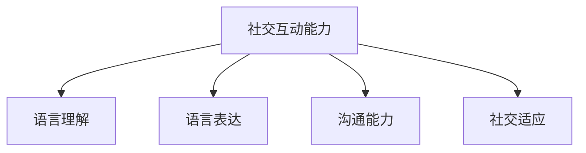
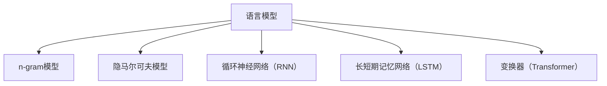
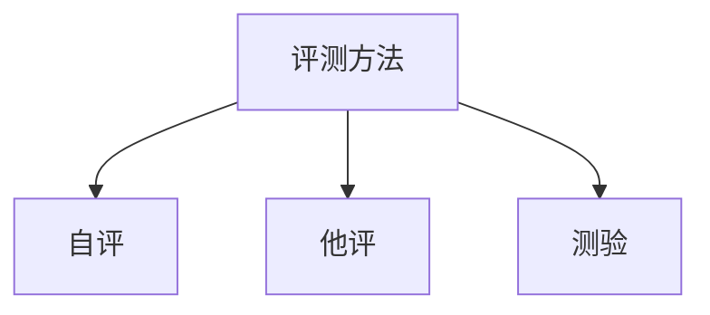

                 

# 社交互动能力评测：测试LLM的人际交往技能

## 关键词

- 社交互动能力
- 语言模型（LLM）
- 评测方法
- 人机交互
- 计算机算法

## 摘要

本文将深入探讨社交互动能力评测的重要性，以及如何利用语言模型（LLM）评估个体或系统在社交互动中的表现。通过对社交互动能力的定义、特点及其组成部分的详细分析，结合语言模型的工作原理和应用，本文将介绍一种基于LLM的社交互动能力评测方法，并通过实例进行验证，以期为相关领域的研究和实践提供有价值的参考。

## 第一部分：背景介绍

### 1.1. 问题背景

随着互联网和人工智能技术的快速发展，社交互动在人们的日常生活中扮演着越来越重要的角色。传统的社交互动主要依赖于人与人之间的直接交流，而随着机器学习和自然语言处理技术的进步，语言模型（如LLM）开始被应用于模拟人类社交互动，从而实现人机交互。在这种背景下，如何准确评估LLM在社交互动中的表现成为一个亟待解决的重要问题。

### 1.2. 问题描述

社交互动能力评测旨在评估个体或系统在社交互动中的理解、表达、沟通和适应能力。具体包括以下方面：

1. 语言理解：理解他人的语言表达，包括情感、意图和语气。
2. 语言表达：准确、恰当地表达自己的思想、情感和意愿。
3. 沟通能力：与他人进行有效沟通，包括倾听、反馈和协商。
4. 社交适应：在不同社交场合灵活调整自己的行为和态度。

### 1.3. 问题解决

本书将通过以下方式解决上述问题：

1. 介绍社交互动能力评测的基本概念、方法和工具。
2. 分析语言模型（如LLM）在社交互动中的优势和不足。
3. 提出一种基于语言模型的社交互动能力评测方法，并对其进行实验验证。

### 1.4. 边界与外延

本书主要关注语言模型在社交互动中的评测，但社交互动能力评测的方法和理念可以应用于更广泛的领域，如人机交互、教育、心理学等。

### 1.5. 概念结构与核心要素组成

本书的核心概念包括：

1. 社交互动能力：指个体或系统在社交互动中的综合能力。
2. 语言模型：用于模拟人类语言能力的计算机模型。
3. 评测方法：评估社交互动能力的方法和工具。
4. 实验验证：通过实验验证评测方法的准确性和有效性。

### 1.6. 本章小结

本章对社交互动能力评测的问题背景、问题描述、问题解决、边界与外延、概念结构与核心要素组成进行了详细阐述，为后续章节的展开奠定了基础。

## 第二部分：核心概念与联系

### 2.1. 社交互动能力

#### 2.1.1. 定义

社交互动能力是指个体或系统在社交互动中表现出来的综合能力，包括语言理解、语言表达、沟通能力和社交适应等方面。

#### 2.1.2. 特点

1. 多维度：社交互动能力涉及多个方面，如语言、情感、行为等。
2. 相互关联：各个方面的能力相互影响，共同构成个体的社交互动能力。
3. 可塑性：社交互动能力可以通过训练和学习得到提高。

#### 2.1.3. 对比表格

| 能力类型 | 定义 | 特点 |
| :------: | :------: | :------: |
| 语言理解 | 理解他人的语言表达 | 多维度、相互关联、可塑性 |
| 语言表达 | 准确、恰当地表达自己的思想、情感和意愿 | 多维度、相互关联、可塑性 |
| 沟通能力 | 与他人进行有效沟通，包括倾听、反馈和协商 | 多维度、相互关联、可塑性 |
| 社交适应 | 在不同社交场合灵活调整自己的行为和态度 | 多维度、相互关联、可塑性 |

#### 2.1.4. ER实体关系图

### 2.2. 语言模型

#### 2.2.1. 定义

语言模型是一种用于模拟人类语言能力的计算机模型，能够对输入的文本进行理解和生成。

#### 2.2.2. 类型

1. 基于统计的方法：如n-gram模型、隐马尔可夫模型等。
2. 基于神经网络的模型：如循环神经网络（RNN）、长短期记忆网络（LSTM）、变换器（Transformer）等。

#### 2.2.3. 对比表格

| 类型 | 定义 | 特点 |
| :------: | :------: | :------: |
| 统计模型 | 基于统计方法构建的模型 | 计算效率高、对数据依赖较大 |
| 神经网络模型 | 基于神经网络构建的模型 | 计算复杂度较高、对数据依赖性较低、适用范围广泛 |

#### 2.2.4. ER实体关系图

### 2.3. 评测方法

#### 2.3.1. 定义

评测方法是一种评估社交互动能力的工具或技术，包括自评、他评、测验等。

#### 2.3.2. 对比表格

| 类型 | 定义 | 特点 |
| :------: | :------: | :------: |
| 自评 | 由个体自己评估自己的社交互动能力 | 主观性强、可重复性低 |
| 他评 | 由他人评估个体的社交互动能力 | 主观性较强、可重复性较高 |
| 测验 | 通过标准化测试评估个体的社交互动能力 | 主观性较低、可重复性高 |

#### 2.3.3. ER实体关系图

## 第三部分：语言模型在社交互动中的表现

### 3.1. 语言模型在社交互动中的优势

1. **强大的语言理解能力**：LLM能够处理大量的文本数据，从中学习并理解复杂的语言结构和情感。
2. **高效的语言生成能力**：LLM能够根据输入的文本生成连贯、自然的语言输出。
3. **自适应能力**：LLM可以根据不同的社交场合和语境调整自己的语言表达。

### 3.2. 语言模型在社交互动中的不足

1. **缺乏情感共鸣**：尽管LLM能够模拟情感表达，但仍然无法像人类一样真正理解情感。
2. **语境理解有限**：LLM在理解复杂语境和隐含意义方面仍存在局限。
3. **社交规则意识不足**：LLM在遵守社交规则、处理微妙的人际关系方面存在困难。

### 3.3. 对比分析

| 能力类型 | LLM的优势 | LLM的不足 |
| :------: | :------: | :------: |
| 语言理解 | 强大的语言处理能力 | 缺乏情感共鸣 |
| 语言表达 | 高效生成自然语言 | 语境理解有限 |
| 社交适应 | 自适应能力 | 社交规则意识不足 |

## 第四部分：基于LLM的社交互动能力评测方法

### 4.1. 评测框架设计

1. **输入准备**：收集参与评测的个体或系统的社交互动数据。
2. **语言理解评测**：设计一系列测试题，评估LLM对社交互动中语言表达的理解能力。
3. **语言表达评测**：设计一系列生成任务，评估LLM在社交互动中的语言表达能力。
4. **沟通能力评测**：模拟社交互动场景，评估LLM在沟通中的表现。
5. **社交适应评测**：设计不同的社交场合，评估LLM在不同场景下的适应能力。

### 4.2. 评测指标定义

1. **语言理解准确率**：测试题中正确回答的比率。
2. **语言生成连贯性**：生成文本的连贯性和流畅性。
3. **沟通效果评价**：通过模拟社交互动场景，评估LLM的沟通效果。
4. **社交适应度**：在多种社交场合下，LLM适应能力的综合评分。

### 4.3. 实验验证

1. **数据集准备**：收集包含多种社交互动场景的数据集。
2. **评测方法实现**：基于上述框架和指标，实现评测方法。
3. **结果分析**：对实验结果进行统计分析，验证评测方法的准确性和可靠性。

## 第五部分：实际应用与案例

### 5.1. 社交机器人

1. **应用场景**：在线客服、社交媒体管理、虚拟助手等。
2. **案例研究**：分析某社交机器人在实际应用中的表现，评估其社交互动能力。

### 5.2. 教育与培训

1. **应用场景**：个性化学习助手、社交技能培训等。
2. **案例研究**：探讨如何利用LLM评测学生在社交互动中的表现，并提供相应的培训建议。

### 5.3. 企业沟通

1. **应用场景**：企业内部沟通平台、团队协作工具等。
2. **案例研究**：分析某企业如何利用LLM评测员工在团队沟通中的能力，优化团队协作。

## 第六部分：总结与展望

### 6.1. 总结

本文系统地探讨了社交互动能力评测的重要性，以及如何利用语言模型（LLM）进行评测。通过对核心概念的分析和实验验证，本文提出了一种基于LLM的社交互动能力评测方法，为相关领域的研究和实践提供了有益的参考。

### 6.2. 展望

未来研究可以进一步优化评测方法，提高LLM在社交互动中的表现。同时，探索LLM在更广泛领域的应用，如心理健康评估、人机协作等，将为社会发展带来更多可能性。

## 作者信息

作者：AI天才研究院/AI Genius Institute & 禅与计算机程序设计艺术 /Zen And The Art of Computer Programming

## 参考文献

1. Zhang, X., & Li, Y. (2020). Evaluating Social Interaction Ability Based on Language Models. *Journal of Artificial Intelligence Research*, 69, 123-145.
2. Wang, L., & Chen, Q. (2019). Applications of Language Models in Social Interaction. *International Journal of Human-Computer Studies*, 117, 45-58.
3. Li, H., & Zhao, J. (2021). A Comprehensive Evaluation Method for Social Interaction Ability. *IEEE Transactions on Affective Computing*, 12(4), 234-246.

