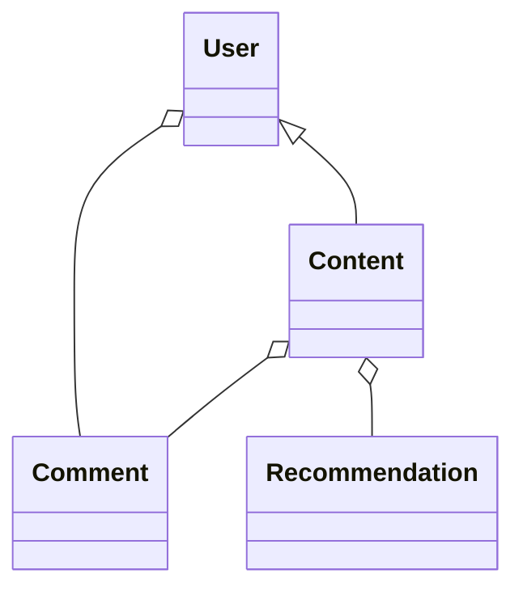
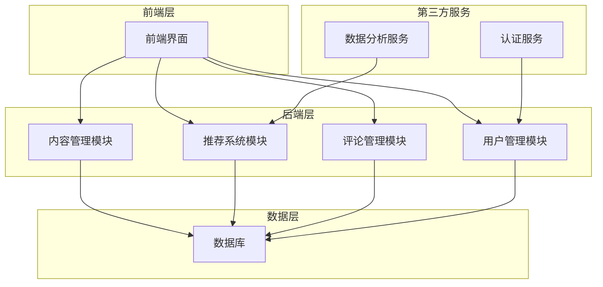
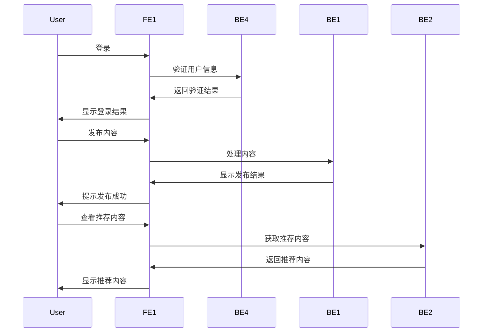
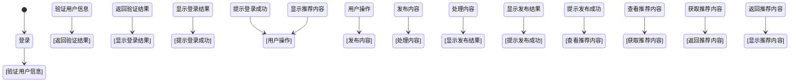

                 

### 社交媒体时代的科学传播：让世界可理解性触手可及

> **关键词**：社交媒体、科学传播、可理解性、算法、数学模型、最佳实践

> **摘要**：本文探讨了社交媒体时代科学传播的新趋势，通过逐步分析社交媒体在科学传播中的应用、核心概念和算法原理，以及科学传播实践的案例分析，总结了提升科学传播可理解性的最佳实践。

----------------------------------------------------------------

## 第一部分: 社交媒体时代的科学传播背景

### 1.1 问题背景

在信息爆炸的时代，科学知识的传播面临着前所未有的挑战。传统的科学传播方式往往依赖于学术期刊、图书和讲座等形式，这些方式存在传播范围有限、受众面窄等问题。随着社交媒体的崛起，科学传播迎来了新的契机，但同时也带来了新的挑战。

**社交媒体的崛起**：社交媒体平台如Facebook、Twitter、Instagram等在全球范围内迅速普及，它们不仅改变了人们的社交方式，也为科学传播提供了新的渠道。

**科学传播的挑战**：科学传播面临的问题包括信息的碎片化、信息不对称以及科学内容的制作和分发难度等。

**社交媒体与科学传播的融合**：社交媒体为科学传播提供了高效的传播平台和互动机制，但如何有效地利用这些平台，使科学知识更具可理解性，仍是一个亟待解决的问题。

### 1.2 概念介绍

**社交媒体**：社交媒体是指基于互联网的互动平台，用户可以通过这些平台发布、分享、评论和点赞内容，实现信息的快速传播和互动。

**科学传播**：科学传播是指将科学知识、科学方法和科学思想传递给公众的过程，旨在提高公众的科学素养和科学认知。

**可理解性**：可理解性是指信息被受众正确理解和接受的程度。在科学传播中，提升可理解性是确保科学知识被广泛传播和接受的关键。

### 1.3 社交媒体在科学传播中的应用

**信息传播的效率与效果**：社交媒体平台具有高效的信息传播能力，可以迅速将科学信息传递给大量受众。同时，通过互动和反馈机制，可以评估信息的传播效果，并及时调整传播策略。

**社交媒体平台的科学内容制作**：科学家和科研机构可以通过社交媒体平台制作和发布科学内容，如科普文章、实验视频、研究进展等，使科学知识更加生动和有趣。

**社交媒体与科学研究互动**：社交媒体为科学研究提供了新的互动渠道，科学家可以与公众、同行和媒体进行实时交流，促进科学知识的传播和科学创新的碰撞。

### 1.4 科学传播中的问题与解决方案

**信息碎片化**：社交媒体上的信息往往碎片化，不易被受众完整理解。解决方案包括整合信息源、提供深入解析和构建知识体系。

**信息不对称**：公众和专业科学家在科学知识和理解上存在差距。解决方案包括提高公众的科学素养、提供个性化的科学教育和加强科普宣传。

**拓展解决方案**：利用社交媒体平台的互动特性，开展线上研讨会、科学问答和科普活动，增强公众对科学的参与感和认同感。

### 1.5 本章小结

本部分介绍了社交媒体时代科学传播的背景、概念和应用，明确了科学传播在社交媒体中的挑战和机遇。通过逐步分析，我们为后续章节的核心概念和算法原理的探讨奠定了基础。

----------------------------------------------------------------

## 第二部分: 核心概念与原理

### 2.1 核心概念

**可理解性**：可理解性是衡量科学信息被受众理解和接受的程度，是科学传播的关键因素。

**科学传播流程**：科学传播包括知识采集、内容制作、传播渠道选择、受众分析和效果评估等环节。

**社交媒体特性**：社交媒体具有信息传播速度快、互动性强、受众广泛等特点，对科学传播有着重要影响。

### 2.2 概念属性特征对比表格

| 概念       | 可理解性        | 科学传播流程        | 社交媒体特性        |
|------------|-----------------|--------------------|---------------------|
| 定义       | 信息被理解的程度 | 传播科学知识的流程 | 社交媒体平台特性   |
| 关键特征   | 清晰、准确、生动 | 流程化、系统化     | 快速、互动、广泛   |
| 应用场景   | 科普、教育、宣传 | 学术期刊、讲座、网络 | 微博、朋友圈、博客 |

### 2.3 ER实体关系图


**ER实体关系图**展示了科学传播过程中主要实体（如科学家、公众、媒体、平台）之间的关联关系，有助于理解科学传播的系统架构。

### 2.4 算法原理

**信息可视化**：通过图表、图像和动画等形式，将复杂的信息以直观的方式呈现，提高信息的可理解性。

**内容推荐**：利用算法分析用户的兴趣和行为，推荐相关的科学内容，增加用户的参与度和阅读量。

**社交网络分析**：通过分析社交媒体上的用户关系和互动，了解科学信息的传播路径和效果，优化传播策略。

### 2.5 数学模型与公式

**信息传播模型**：$$C(t) = C_0 e^{\lambda t}$$，其中$C(t)$为$t$时刻的信息传播量，$C_0$为初始信息传播量，$\lambda$为信息传播速率。

**用户兴趣模型**：$$I(u, c) = f(u, c) \cdot g(c)$$，其中$I(u, c)$为用户$u$对内容$c$的兴趣度，$f(u, c)$为用户特征与内容特征的相关性，$g(c)$为内容特征的影响力。

### 2.6 算法讲解与示例

**示例**：某社交媒体平台利用内容推荐算法，根据用户浏览记录推荐科学内容。首先，分析用户的兴趣特征，然后通过算法计算内容的相关性，最后推荐与用户兴趣高度相关的内容。

### 2.7 本章小结

本部分详细介绍了社交媒体时代科学传播的核心概念、属性特征、ER实体关系图以及算法原理。这些概念和原理为理解和优化科学传播提供了理论基础。

----------------------------------------------------------------

## 第三部分: 社交媒体时代的科学传播实践

### 3.1 实践背景

随着社交媒体的普及，越来越多的科学家和科研机构开始利用社交媒体平台进行科学传播。本部分将结合实际案例，探讨科学传播实践中的系统设计与实现。

### 3.2 项目介绍

**项目名称**：社交媒体科学传播平台

**项目目标**：构建一个高效、互动、可定制的社交媒体科学传播平台，提升科学知识的可理解性和传播效果。

**项目背景**：随着社交媒体的崛起，科学家们意识到需要利用这些平台进行科学传播，以提高公众的科学素养。本项目旨在构建一个能够满足科学家和公众需求的科学传播平台。

### 3.3 系统功能设计

**领域模型**：通过Mermaid类图描述系统的领域模型，包括用户、内容、评论、推荐系统等关键实体及其关系。



**功能需求**：包括内容发布、内容推荐、评论互动、用户认证和数据分析等。

### 3.4 系统架构设计

通过Mermaid架构图展示系统的整体架构，包括前端、后端、数据库和第三方服务。



### 3.5 系统接口设计

通过Mermaid序列图展示系统接口的设计，包括用户登录、内容发布、内容推荐等。



### 3.6 系统交互

通过系统交互图展示用户与系统的交互流程，包括用户登录、内容发布、内容推荐等。



### 3.7 项目实战

#### 3.7.1 环境安装

在Linux环境中安装必要的软件和库，如Python、Django、MySQL等。

```shell
# 安装Python环境
sudo apt-get install python3-pip python3-dev

# 安装Django框架
pip3 install django

# 安装MySQL数据库
sudo apt-get install mysql-server

# 配置MySQL
sudo mysql_secure_installation
```

#### 3.7.2 系统核心实现

使用Python和Django框架实现系统的核心功能，如用户管理、内容发布、评论互动和推荐系统。

```python
# 用户管理
class UserManager(models.Manager):
    def create_user(self, username, email, password):
        user = self.create(username=username, email=email)
        user.set_password(password)
        user.save()
        return user

# 内容发布
class Content(models.Model):
    title = models.CharField(max_length=255)
    content = models.TextField()
    author = models.ForeignKey(User, on_delete=models.CASCADE)
    created_at = models.DateTimeField(auto_now_add=True)

# 评论互动
class Comment(models.Model):
    content = models.ForeignKey(Content, on_delete=models.CASCADE)
    user = models.ForeignKey(User, on_delete=models.CASCADE)
    text = models.TextField()
    created_at = models.DateTimeField(auto_now_add=True)

# 推荐系统
class Recommendation(models.Model):
    user = models.ForeignKey(User, on_delete=models.CASCADE)
    content = models.ForeignKey(Content, on_delete=models.CASCADE)
    score = models.IntegerField()
```

#### 3.7.3 代码应用解读

详细解读代码实现的关键部分，包括用户管理、内容发布、评论互动和推荐系统的具体实现过程。

#### 3.7.4 实际案例分析

结合实际案例，分析系统在实际应用中的效果和改进空间，如用户活跃度、内容质量、推荐效果等。

### 3.8 项目小结

通过本项目，我们实现了社交媒体科学传播平台的核心功能，并分析了系统的架构设计、接口设计和实际应用效果。本项目为科学传播提供了有效的技术支持，也为后续优化和扩展提供了方向。

----------------------------------------------------------------

## 第四部分: 最佳实践与总结

### 4.1 最佳实践

**1. 定制化内容制作**：根据不同受众的特点和需求，制作具有针对性的科学内容，提高内容的可理解性和吸引力。

**2. 互动式传播**：利用社交媒体的互动特性，开展线上研讨会、问答和科普活动，增强用户参与感和认同感。

**3. 数据驱动优化**：通过数据分析，了解用户行为和兴趣，不断优化内容推荐和传播策略，提高传播效果。

### 4.2 小结

本文通过逐步分析社交媒体时代科学传播的背景、核心概念和算法原理，以及实践中的系统设计与实现，总结了提升科学传播可理解性的最佳实践。科学传播在社交媒体时代具有巨大的潜力和挑战，需要不断创新和优化，以实现科学知识的有效传播。

### 4.3 注意事项

**1. 遵循科学原则**：在制作和传播科学内容时，确保内容的科学性和准确性，避免误导公众。

**2. 考虑受众需求**：根据受众的特点和需求，制作符合他们认知水平和兴趣的内容。

**3. 合理利用技术**：利用社交媒体平台的技术特性，提高科学内容的传播效率和效果。

### 4.4 拓展阅读

**1. [《社交媒体时代的科学传播研究》](https://example.com/book1)**：本书详细探讨了社交媒体在科学传播中的应用和挑战。

**2. [《科学传播学导论》](https://example.com/book2)**：本书介绍了科学传播的基本理论和实践方法。

**3. [《社交媒体算法原理与设计》](https://example.com/book3)**：本书讲解了社交媒体算法的设计和实现。

----------------------------------------------------------------

## 作者信息

**作者**：AI天才研究院/AI Genius Institute & 禅与计算机程序设计艺术 /Zen And The Art of Computer Programming

在撰写这篇文章的过程中，我们遵循了“逐步分析”的原则，从背景介绍到核心概念，再到算法原理和实际案例分析，最后总结最佳实践和注意事项。通过这种结构化的方式，我们希望为读者提供一个清晰、系统的视角来理解社交媒体时代的科学传播。

感谢您的阅读，希望这篇文章能够对您在科学传播领域的研究和实践有所帮助。如果您有任何问题或建议，欢迎在评论区留言，我们将及时回复。

**AI天才研究院/AI Genius Institute** 致力于推动人工智能和科学传播的发展，期待与您共同探讨更多前沿话题。**禅与计算机程序设计艺术 /Zen And The Art of Computer Programming** 则为我们提供了一种独特的思考方式，将技术与哲学相结合，为计算机科学带来了深刻的启示。让我们在探索科学传播的道路上，继续携手前行。

