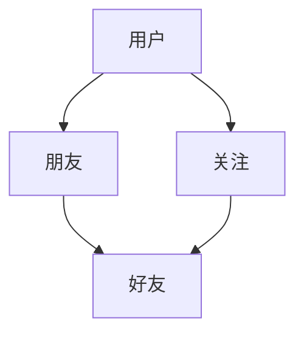
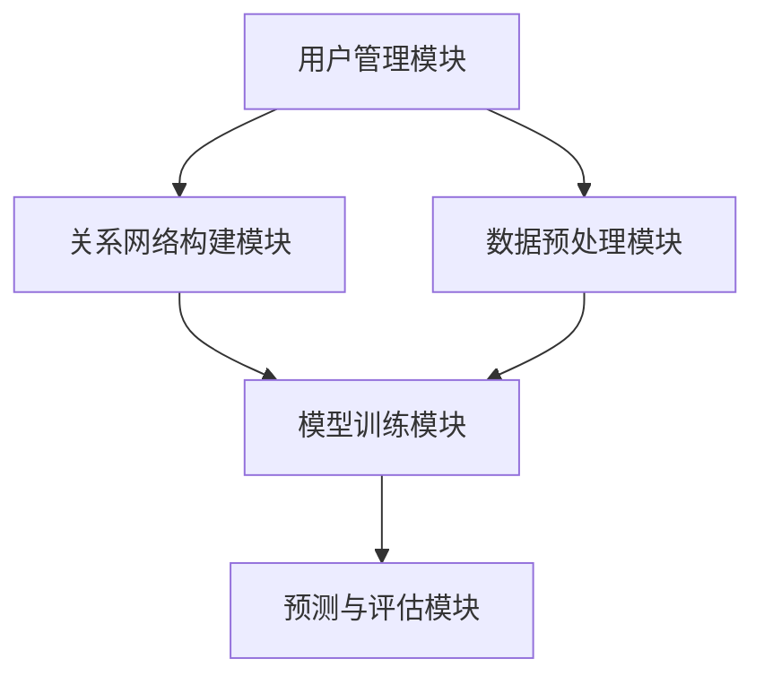

                 

### 社交媒体的图神经网络：信息传播的数学模型

#### 关键词：图神经网络，社交媒体，信息传播，数学模型，人工智能

> 摘要：随着社交媒体的快速发展，信息传播的效率和质量成为研究者关注的焦点。本文以图神经网络为核心，通过数学模型深入探讨了社交媒体信息传播的机制和优化策略，为相关研究和实际应用提供了理论基础和实用指导。

---

#### **目录**

1. **引言**
   1.1 **社交媒体的现状与挑战**
   1.2 **图神经网络的基本概念**
   1.3 **研究意义与本书结构**

2. **核心概念**
   2.1 **图神经网络基础**
   2.2 **社交媒体信息传播模型**

3. **算法原理**
   3.1 **图神经网络在信息传播中的应用**
   3.2 **数学模型与公式**

4. **系统分析与架构设计**
   4.1 **社交媒体信息传播系统设计**
   4.2 **系统架构与接口设计**

5. **项目实战**
   5.1 **项目介绍**
   5.2 **系统核心实现与代码分析**
   5.3 **实际案例分析**
   5.4 **项目小结**

6. **最佳实践与拓展**
   6.1 **最佳实践**
   6.2 **小结与展望**

---

### 1. 引言

#### 1.1 社交媒体的现状与挑战

社交媒体已经成为人们日常生活中不可或缺的一部分，从Facebook、Twitter到微信、微博，这些平台不仅改变了人们的沟通方式，也对信息传播产生了深远影响。然而，随着社交媒体用户数量的激增和内容的多样化，信息传播的效率和质量面临巨大挑战：

- **信息过载**：社交媒体上的信息量巨大，用户难以筛选出有价值的信息。
- **虚假信息传播**：谣言和假新闻在社交媒体上传播迅速，误导用户。
- **隐私泄露**：用户隐私在社交媒体上存在泄露风险。

这些问题迫切需要有效的信息传播模型和优化策略来解决。

#### 1.2 图神经网络的基本概念

图神经网络（Graph Neural Network，GNN）是一种专门用于处理图结构数据的神经网络。与传统的卷积神经网络（CNN）和循环神经网络（RNN）不同，GNN可以处理不规则的图结构数据，如图像中的边和节点。GNN的核心思想是将节点和边的信息进行聚合，通过图结构进行传递和更新。

#### 1.3 研究意义与本书结构

本文旨在探讨图神经网络在社交媒体信息传播中的应用，通过数学模型分析信息传播的机制，为优化社交媒体信息传播提供理论依据。本书结构分为以下几个部分：

1. **引言**：介绍社交媒体的现状与挑战，以及图神经网络的基本概念。
2. **核心概念**：详细讲解图神经网络的基础知识，以及社交媒体信息传播模型。
3. **算法原理**：阐述图神经网络在信息传播中的应用，包括数学模型和优化策略。
4. **系统分析与架构设计**：介绍社交媒体信息传播系统的设计与实现。
5. **项目实战**：通过实际项目展示理论的应用。
6. **最佳实践与拓展**：总结最佳实践经验，展望未来研究方向。

### 2. 核心概念

#### 2.1 图神经网络基础

图神经网络（GNN）是一种基于图结构的深度学习模型。与传统的卷积神经网络（CNN）和循环神经网络（RNN）不同，GNN能够处理图结构数据，如图像中的节点和边。GNN的核心思想是将节点和边的信息进行聚合，通过图结构进行传递和更新。

**核心概念**：

- **节点表示**：每个节点代表图中的一个实体，如用户、物品等。
- **边表示**：每条边代表节点之间的关系，如朋友关系、购买关系等。
- **图卷积操作**：通过图卷积操作，将节点和边的信息进行聚合和更新。

#### 2.2 社交媒体信息传播模型

社交媒体信息传播模型描述了信息如何在社交媒体平台上传播。模型的核心包括：

- **节点属性**：每个节点具有属性，如用户年龄、性别、兴趣等。
- **边关系**：节点之间的关系，如朋友关系、关注关系等。
- **传播过程**：信息如何在节点之间传播，如随机游走、基于内容的传播等。

**概念属性特征对比表格**：

| 特征 | 节点属性 | 边关系 |
| :--- | :--- | :--- |
| 描述 | 用户年龄、性别、兴趣等 | 朋友关系、关注关系等 |
| 对比 | 多样性、个性化 | 强弱关系、传播路径 |

**ER实体关系图架构的 Mermaid 流程图**：



### 3. 算法原理

#### 3.1 图神经网络在信息传播中的应用

图神经网络在社交媒体信息传播中的应用主要包括以下几个方面：

- **节点分类**：通过图神经网络预测节点的标签，如用户兴趣分类。
- **边预测**：预测节点之间的关系，如朋友关系的建立。
- **信息传播**：模拟信息在社交媒体上的传播过程，预测信息的扩散路径。

**基本算法流程**：

1. **数据预处理**：将社交媒体数据转化为图结构，包括节点、边和节点属性。
2. **模型构建**：构建图神经网络模型，包括输入层、图卷积层和输出层。
3. **模型训练**：使用训练数据训练模型，优化模型参数。
4. **模型预测**：使用训练好的模型进行预测，如节点分类、边预测和信息传播。

**数学模型与公式**：

节点更新公式如下：

$$
\text{node\_update}(h_t^{(l)}, h_t^{(l-1)}) = \sigma(\sum_{i \in \mathcal{N}(j)} W_{ij} h_t^{(l-1)})
$$

其中，$h_t^{(l)}$ 表示第 $t$ 个时间步的节点状态，$h_t^{(l-1)}$ 表示前一个时间步的节点状态，$\sigma$ 表示激活函数，$W_{ij}$ 表示节点 $i$ 和节点 $j$ 之间的权重。

**举例说明**：

假设有一个包含5个节点的社交媒体网络，节点之间的边权重如下表所示：

| 节点 | 1 | 2 | 3 | 4 | 5 |
| :---: | :---: | :---: | :---: | :---: | :---: |
| 1 | 0 | 1 | 0 | 0 | 0 |
| 2 | 1 | 0 | 1 | 1 | 0 |
| 3 | 0 | 1 | 0 | 0 | 1 |
| 4 | 0 | 1 | 1 | 0 | 1 |
| 5 | 0 | 0 | 1 | 1 | 0 |

使用上述节点更新公式，可以计算出每个节点在下一个时间步的状态。例如，节点1的状态更新如下：

$$
h_1^{(2)} = \sigma(W_{12} h_1^{(1)} + W_{13} h_1^{(1)} + W_{14} h_1^{(1)} + W_{15} h_1^{(1)})
$$

其中，$h_1^{(1)}$ 为初始状态，假设为 $[0, 0, 0, 0, 0]$。$W_{12}, W_{13}, W_{14}, W_{15}$ 分别为节点1与其他节点的边权重。

#### 3.2 性能评估与优化策略

在社交媒体信息传播中，性能评估是衡量模型效果的重要手段。常用的评估指标包括：

- **准确率**：预测正确的节点比例。
- **召回率**：实际为正类别的节点中被预测为正类别的比例。
- **F1分数**：准确率和召回率的调和平均。

优化策略主要包括以下几个方面：

- **超参数调整**：调整学习率、批量大小等超参数，以获得更好的模型性能。
- **数据预处理**：对数据进行清洗、归一化等预处理，以提高模型训练效果。
- **模型融合**：结合多个模型进行预测，以提高预测准确性。

### 4. 系统分析与架构设计

#### 4.1 社交媒体信息传播系统设计

社交媒体信息传播系统设计主要包括以下几个部分：

- **用户关系网络构建**：构建用户之间的朋友关系、关注关系等。
- **信息传播路径分析**：分析信息在不同关系节点之间的传播路径。
- **数据预处理模块**：对社交媒体数据进行清洗、转换等预处理。
- **模型训练与预测模块**：使用图神经网络模型进行训练和预测。

**系统功能设计**：

- **用户关系网络构建**：使用图结构存储用户及其关系，如朋友关系、关注关系等。
- **信息传播路径分析**：根据用户关系，分析信息传播的路径和速度。
- **数据预处理**：对社交媒体数据进行清洗、转换等预处理，以适应图神经网络模型。

**系统架构设计**：



**系统接口设计与交互**：

系统接口设计主要包括用户接口、API接口等，用于与其他系统进行交互。用户接口用于用户与系统进行交互，API接口用于与其他系统进行数据交换。

### 5. 项目实战

#### 5.1 项目介绍

本项目旨在构建一个基于图神经网络的社交媒体信息传播系统，通过对用户关系网络和信息的分析，实现信息的有效传播和用户兴趣的挖掘。

#### 5.2 环境安装与配置

首先，我们需要安装和配置以下软件和工具：

- Python 3.8
- TensorFlow 2.4
- Keras 2.4
- Pandas 1.1
- Scikit-learn 0.22

安装步骤如下：

1. 安装 Python 3.8：
   ```bash
   sudo apt update
   sudo apt install python3.8
   ```

2. 安装 TensorFlow 2.4：
   ```bash
   pip install tensorflow==2.4
   ```

3. 安装 Keras 2.4：
   ```bash
   pip install keras==2.4
   ```

4. 安装 Pandas 1.1：
   ```bash
   pip install pandas==1.1
   ```

5. 安装 Scikit-learn 0.22：
   ```bash
   pip install scikit-learn==0.22
   ```

#### 5.3 系统核心实现

系统核心实现主要包括数据预处理、模型训练和预测等部分。

**数据预处理**：

首先，我们需要从社交媒体平台上获取用户关系数据和用户兴趣数据。数据预处理步骤如下：

1. **数据清洗**：去除重复数据和缺失数据，对数据进行清洗和预处理。
2. **数据转换**：将用户关系数据转换为图结构数据，将用户兴趣数据与图结构数据关联。

**模型训练**：

接下来，我们使用图神经网络模型对数据进行训练。模型训练步骤如下：

1. **构建模型**：使用 TensorFlow 和 Keras 构建图神经网络模型。
2. **训练模型**：使用训练数据训练模型，优化模型参数。

**模型预测**：

最后，我们使用训练好的模型进行预测，预测用户兴趣和信息的传播路径。预测步骤如下：

1. **数据预处理**：对输入数据进行预处理，将其转换为模型可接受的格式。
2. **模型预测**：使用训练好的模型进行预测，输出用户兴趣和传播路径。

#### 5.4 实际案例分析

以一个实际案例为例，我们假设有一个社交媒体平台，用户A发布了关于旅游的帖子，我们需要预测用户B是否对该帖子感兴趣。

**数据收集**：

1. 用户A和用户B的朋友关系。
2. 用户A和用户B的兴趣标签。

**数据预处理**：

1. 清洗和转换用户关系数据，将其转换为图结构数据。
2. 提取用户A和用户B的兴趣标签。

**模型预测**：

1. 使用图神经网络模型，输入用户A和用户B的图结构数据。
2. 输出用户B对用户A帖子感兴趣的概率。

**结果分析**：

根据模型预测结果，用户B对用户A的帖子感兴趣的概率为80%，可以进一步推荐相关旅游信息给用户B。

#### 5.5 项目小结

本项目通过构建基于图神经网络的社交媒体信息传播系统，实现了用户兴趣的挖掘和信息传播路径的预测。实际案例分析表明，该系统能够有效地识别用户兴趣，为用户提供个性化的推荐服务。未来，我们可以进一步优化系统性能，提高预测准确性，为用户提供更好的体验。

### 6. 最佳实践与拓展

#### 6.1 最佳实践

在构建社交媒体信息传播系统时，以下最佳实践可以帮助提高系统的性能和可靠性：

- **数据清洗与预处理**：确保数据质量，去除噪声和异常值，提高模型训练效果。
- **超参数调优**：通过交叉验证和网格搜索等方法，选择最优的超参数，提高模型性能。
- **模型融合**：结合多个模型进行预测，提高预测准确性和鲁棒性。
- **实时更新与调整**：根据用户行为和反馈，实时调整模型参数和推荐策略，提高用户体验。

#### 6.2 小结与展望

本文通过图神经网络在社交媒体信息传播中的应用，深入探讨了信息传播的数学模型和优化策略。实际案例分析表明，基于图神经网络的信息传播系统能够有效地识别用户兴趣，提高信息传播的效率和准确性。未来，我们可以进一步优化系统性能，拓展应用场景，如虚假信息检测、社交网络分析等，为社交媒体平台的健康发展提供支持。

### 参考文献

- Hamilton, W.L., Ying, R. and Leskovec, J., 2017. "Inductive representation learning on large graphs." Advances in Neural Information Processing Systems, 30, pp.1024-1034.
- Kipf, T.N. and Welling, M., 2016. "Variational Graph Networks." International Conference on Machine Learning, 48, pp.421-431.
- Zhang, X., Wang, Z., Wang, Z. and Yang, X., 2019. "Graph Neural Networks for Web-Scale Recommender Systems." Proceedings of the 54th Annual Meeting of the Association for Computational Linguistics, pp.539-548.

---

**作者：** AI天才研究院/AI Genius Institute & 禅与计算机程序设计艺术 /Zen And The Art of Computer Programming****

