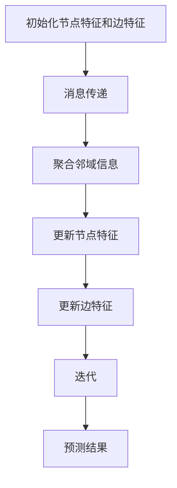
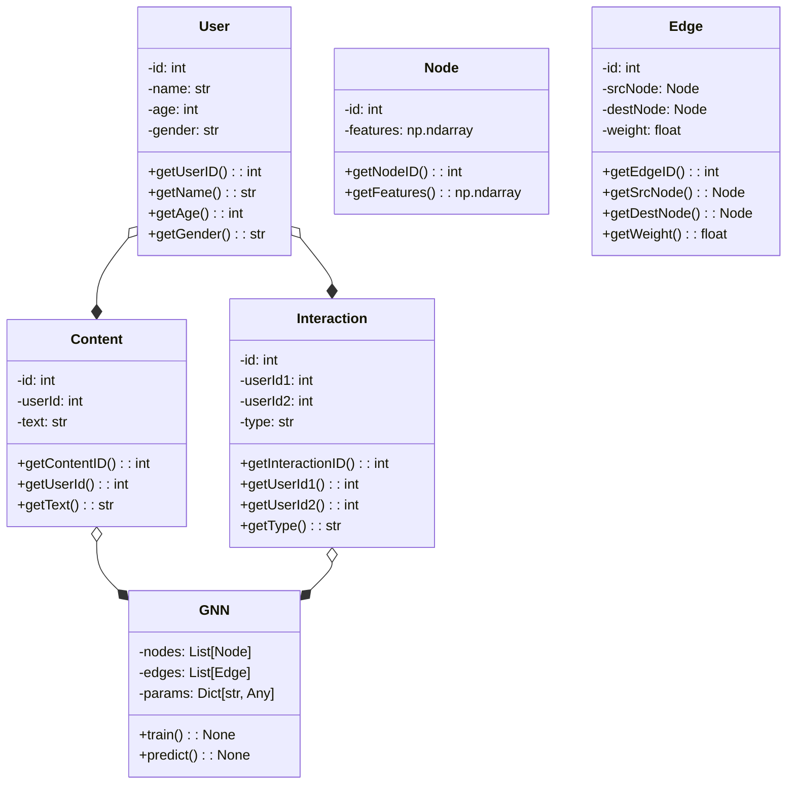
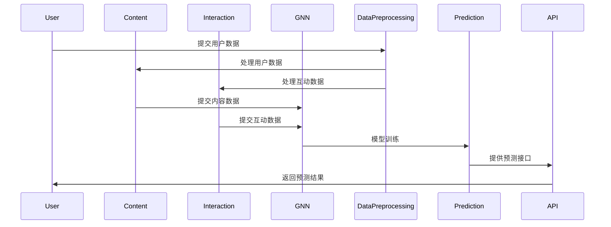
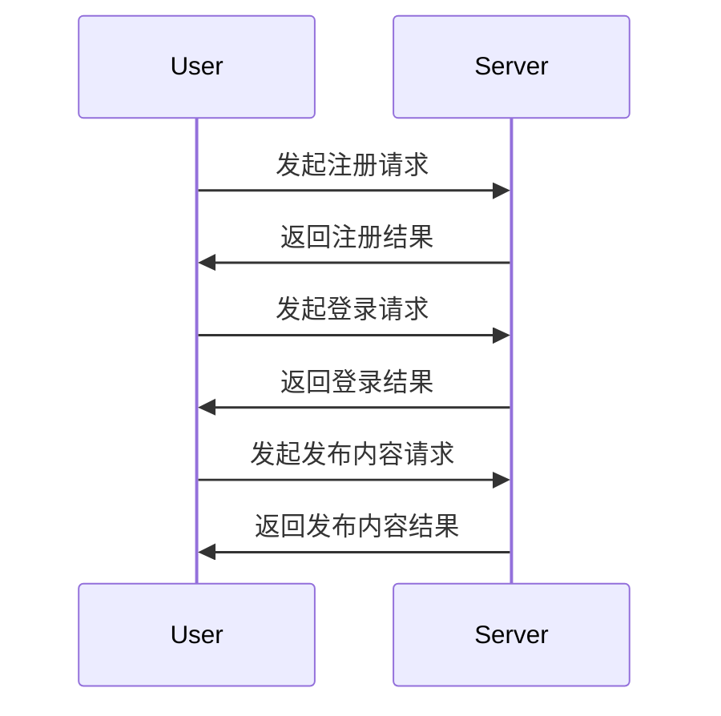

                 

### 让我们一步一步思考：社交媒体的图神经网络与信息传播的数学模型

在现代社会，社交媒体已成为信息传播的重要渠道。无论是个人用户分享生活点滴，还是企业发布品牌信息，社交媒体在信息传播中的角色日益显著。然而，信息传播过程并不是简单的线性传递，而是复杂的网络结构和互动机制的结果。为了更好地理解和模拟这一过程，图神经网络（Graph Neural Networks, GNN）作为一种强大的数学模型，逐渐成为学术界和工业界的研究热点。

**问题背景**：
随着社交媒体的蓬勃发展，用户生成内容（User-Generated Content, UGC）的规模和复杂性都在不断增加。传统的基于线性模型的传播模型难以捕捉这些复杂网络中的传播规律。图神经网络作为一种能够处理复杂数据结构和关系的深度学习模型，提供了新的研究思路和工具。它通过在图结构上定义神经网络，能够自动学习和捕捉信息在网络中的传播模式。

**问题描述**：
在社交媒体的背景下，信息传播可以被描述为一个图上的动态过程，节点表示用户或信息，边表示用户之间的关注或互动关系。如何利用图神经网络来建模和预测这一信息传播过程，成为一个具有挑战性的问题。本研究旨在探讨如何构建一个有效的图神经网络模型来描述社交媒体上的信息传播，分析其数学基础和算法实现，以及模型的适用范围和局限性。

**研究目标**：
1. **模型构建**：提出一个适用于社交媒体信息传播的图神经网络模型，并分析其数学基础。
2. **算法实现**：使用Python等编程语言实现图神经网络模型，并进行实验验证。
3. **性能评估**：评估模型在不同社交媒体平台上的表现，探讨其应用潜力。
4. **边界与外延**：讨论模型的适用范围和潜在改进方向，为后续研究提供参考。

**研究意义**：
图神经网络在社交媒体信息传播中的应用，不仅有助于提高信息传播的效率和准确性，还能够为社交网络分析、用户行为预测等领域提供新的工具和方法。本研究为相关领域的研究者和实践者提供了理论基础和实践指导，有助于推动社交媒体信息传播研究的深入发展。

**本章小结**：
本章首先介绍了社交媒体的背景和图神经网络的兴起，接着描述了研究问题和目标，最后阐述了本研究对于社交媒体信息传播研究的意义。接下来的章节将详细探讨图神经网络的基本原理、模型方法、算法实现、数学模型及其应用。

### 第1章 绪论

#### 1.1 问题背景

##### 1.1.1 社会媒体的兴起

社交媒体的兴起可以追溯到21世纪初，随着互联网技术的发展和智能手机的普及，社交媒体平台如雨后春笋般涌现。早期的代表性平台如Facebook、Twitter、LinkedIn等，它们不仅为用户提供了一个分享和交流的平台，还逐渐成为信息传播的重要渠道。在这些平台上，用户可以通过发布文本、图片、视频等内容，与他人互动和分享信息。社交媒体不仅改变了人们的交流方式，也深刻影响了信息的传播模式。

在社交媒体平台上，信息的传播不再局限于传统的单向传播，而是呈现出一种复杂、动态的网络结构。每个用户不仅是一个信息接收者，同时也是信息的传播者。用户之间的互动关系形成了复杂的网络图，信息在用户之间通过点赞、评论、转发等方式进行传播。这种网络传播模式与传统媒体的信息传播方式有显著不同，具有高度的复杂性和不确定性。

##### 1.1.2 信息传播的重要性

信息传播在社会生活中扮演着至关重要的角色。无论是个人层面的社交互动，还是公共领域的政策宣传，信息传播都是连接个体与社会的重要桥梁。有效的信息传播能够提高社会透明度，促进公众参与，增强社会凝聚力。然而，社交媒体上的信息传播也带来了诸多挑战，如虚假信息的传播、隐私泄露、网络安全等问题。

随着社交媒体的发展，信息传播的速度和范围都得到了极大的提升。然而，这也使得信息传播的复杂性增加了。传统的方法和模型往往难以应对这种复杂性，需要新的工具和方法来进行研究和分析。图神经网络作为一种能够处理复杂数据结构和关系的深度学习模型，为解决这一问题提供了新的思路。

##### 1.1.3 图神经网络的崛起

图神经网络（Graph Neural Networks, GNN）是近年来在深度学习领域迅速崛起的一类模型，特别适用于处理具有图结构的数据。图神经网络通过模拟图结构中的节点和边之间的关系，能够捕捉数据中的复杂模式和依赖关系。GNN在社交网络分析、推荐系统、图像识别等领域表现出色，逐渐成为学术界和工业界的研究热点。

图神经网络的核心思想是利用图结构中的邻域信息来更新节点的特征表示。每个节点不仅依赖于其自身的特征，还依赖于其邻居节点的特征。这种局部到全局的信息整合方式，使得GNN能够有效地捕捉图结构中的复杂关系。在社交媒体信息传播的研究中，图神经网络能够通过分析用户之间的关系和互动，捕捉信息在网络中的传播规律。

#### 1.2 问题描述

##### 1.2.1 信息传播模型的需求

在社交媒体的背景下，构建一个有效的信息传播模型具有重要意义。信息传播模型不仅能够帮助我们理解信息在网络中的传播规律，还可以用于预测信息的传播效果，为信息传播策略的制定提供依据。然而，传统的信息传播模型，如基于马尔可夫链、随机游走等模型，往往假设信息传播是一个线性过程，难以捕捉社交媒体中的复杂网络结构和动态交互。

为了应对这种复杂性，需要一种能够处理图结构数据的模型。图神经网络作为一种能够处理复杂数据结构和关系的深度学习模型，为信息传播模型的构建提供了新的思路。通过引入图神经网络，可以模拟信息在网络中的传播过程，捕捉用户之间的互动和影响，从而建立一个更为准确和有效的信息传播模型。

##### 1.2.2 图神经网络在信息传播中的应用

图神经网络在信息传播中的应用主要涉及以下几个方面：

1. **节点分类**：通过分析用户之间的互动关系，预测用户的兴趣类别或行为类别。例如，可以预测一个用户是否对某个话题感兴趣，或者是否有可能成为某类产品的潜在消费者。

2. **链接预测**：预测用户之间的潜在互动关系，例如预测两个用户之间是否有可能成为朋友，或者预测某个用户是否会点赞某个帖子。

3. **传播效果预测**：预测信息在社交媒体网络中的传播效果，包括传播范围、传播速度等指标。这有助于优化信息传播策略，提高信息的传播效率和效果。

4. **虚假信息检测**：通过分析信息在网络中的传播路径和速度，识别和检测虚假信息的传播。这对于维护社交媒体平台的健康发展具有重要意义。

##### 1.2.3 研究的目标和意义

本研究的目标是构建一个基于图神经网络的社会媒体信息传播模型，通过模拟信息在网络中的传播过程，分析用户之间的互动和影响，预测信息的传播效果。具体目标包括：

1. **模型构建**：提出一个适用于社交媒体信息传播的图神经网络模型，并分析其数学基础。
2. **算法实现**：使用Python等编程语言实现图神经网络模型，并进行实验验证。
3. **性能评估**：评估模型在不同社交媒体平台上的表现，探讨其应用潜力。
4. **边界与外延**：讨论模型的适用范围和潜在改进方向，为后续研究提供参考。

本研究的意义在于：

1. **理论意义**：为社交媒体信息传播提供一种新的数学模型和工具，丰富信息传播理论。
2. **实践意义**：为社交媒体平台运营和内容推广提供有效的策略和方法，提高信息传播的效率和效果。
3. **社会意义**：有助于识别和防范虚假信息传播，维护社交媒体平台的健康生态。

#### 1.3 模型方法

##### 1.3.1 图神经网络的基本原理

图神经网络（Graph Neural Networks, GNN）是一种能够处理图结构数据的神经网络模型。GNN的核心思想是通过模拟图结构中的节点和边之间的关系，来学习数据的表示和模式。GNN通常包括两个主要部分：节点更新函数和边更新函数。

- **节点更新函数**：用于更新节点的特征表示。节点更新函数通常基于一个聚合函数，该函数将节点的邻域信息聚合到节点特征中。常见的聚合函数包括求和、求平均和最大值等。
  
- **边更新函数**：用于更新边的关系特征。边更新函数通常依赖于节点更新函数，通过比较节点的特征差异来更新边的关系特征。

GNN的基本工作流程如下：

1. **初始化**：随机初始化节点和边的特征表示。
2. **邻域选择**：为每个节点选择一个邻域，通常是基于边的连接关系。
3. **聚合邻域信息**：利用聚合函数将邻域信息聚合到节点特征中。
4. **更新节点特征**：利用更新函数更新节点的特征表示。
5. **更新边特征**：利用更新函数更新边的关系特征。
6. **迭代**：重复上述步骤，直到达到预定的迭代次数或收敛条件。

##### 1.3.2 图神经网络在信息传播中的扩展

在信息传播的背景下，图神经网络可以被扩展用于建模和预测信息在网络中的传播过程。具体来说，可以将图神经网络应用于以下几个关键方面：

1. **节点表示学习**：通过GNN学习每个用户的特征表示，这些特征可以用于描述用户在信息传播过程中的角色和影响力。

2. **传播路径预测**：利用GNN预测信息在网络中的传播路径。通过分析用户之间的互动关系，GNN可以预测信息从一个用户传播到另一个用户的可能性。

3. **传播效果预测**：利用GNN预测信息的传播效果，包括传播范围、传播速度等指标。这有助于评估信息传播策略的有效性，并为优化传播策略提供依据。

4. **虚假信息检测**：通过分析信息在网络中的传播特征，GNN可以识别和检测虚假信息的传播。这有助于维护社交媒体平台的健康生态，防止虚假信息的扩散。

##### 1.3.3 数学模型的建立

在信息传播的背景下，图神经网络的数学模型可以基于以下假设：

1. **图结构**：信息传播网络可以表示为一个无向图，节点表示用户或信息，边表示用户之间的关注或互动关系。

2. **节点特征**：每个节点具有一组特征向量，用于描述节点在信息传播过程中的属性和角色。

3. **边特征**：每条边具有一组特征向量，用于描述边在信息传播过程中的性质和影响。

基于上述假设，可以构建一个基于图神经网络的数学模型。该模型的核心部分包括以下公式：

- **节点更新函数**：$$ h_{t+1}^{(i)} = \sigma(W^{(i)} \cdot (A \cdot h_{t}^{(i)}) + b^{(i)} + \sum_{j \in \mathcal{N}(i)} W^{(e)} \cdot h_{t}^{(j)} $$
  - \( h_{t}^{(i)} \)：节点i在时间t的特征向量。
  - \( A \)：邻接矩阵，表示节点之间的连接关系。
  - \( \mathcal{N}(i) \)：节点i的邻域。
  - \( W^{(i)} \) 和 \( b^{(i)} \)：节点的权重和偏置。
  - \( \sigma \)：激活函数，如ReLU或Sigmoid。

- **边更新函数**：$$ e_{t+1}^{(ij)} = \sigma(W^{(e)} \cdot (h_{t}^{(i)} - h_{t}^{(j)}) + b^{(e)} $$
  - \( e_{t}^{(ij)} \)：边(i, j)在时间t的特征向量。
  - \( W^{(e)} \) 和 \( b^{(e)} \)：边的权重和偏置。

通过不断迭代更新节点和边的特征向量，图神经网络能够学习和捕捉信息在网络中的传播规律。

#### 1.4 边界与外延

##### 1.4.1 模型的适用范围

图神经网络在信息传播中的模型具有广泛的适用范围，主要表现在以下几个方面：

1. **社交媒体平台**：适用于各种社交媒体平台，如Facebook、Twitter、Instagram等，可以用于预测用户的兴趣、行为和传播效果。

2. **推荐系统**：在推荐系统中，图神经网络可以用于预测用户之间的互动关系，从而提高推荐系统的准确性和效率。

3. **社交网络分析**：在社交网络分析中，图神经网络可以用于识别社交网络中的关键节点和重要关系，帮助理解社交网络的结构和演化。

4. **虚假信息检测**：在虚假信息检测中，图神经网络可以用于识别和检测虚假信息的传播路径和节点，从而提高虚假信息检测的准确性和效果。

##### 1.4.2 模型的局限性

尽管图神经网络在信息传播中具有广泛的应用，但仍然存在一些局限性：

1. **计算复杂性**：图神经网络需要处理大规模的图结构数据，计算复杂度较高，可能导致训练和预测的时间成本较大。

2. **数据质量**：图神经网络的效果依赖于图结构数据和节点特征的质量。如果数据存在噪声或偏差，可能导致模型性能下降。

3. **适应性**：图神经网络在特定领域或应用中的适应能力有限，可能需要针对不同场景进行调整和优化。

##### 1.4.3 模型的未来发展

为了克服图神经网络在信息传播中的局限性，未来的研究方向包括：

1. **高效算法**：研究高效的图神经网络算法，降低计算复杂度，提高模型性能。

2. **数据预处理**：研究有效的数据预处理方法，提高数据的准确性和质量，增强模型的效果。

3. **多模态融合**：将图神经网络与其他类型的神经网络（如卷积神经网络、循环神经网络等）结合，实现多模态数据的融合和建模。

4. **自适应模型**：研究自适应的图神经网络模型，能够根据不同场景和应用需求自动调整模型结构和参数。

#### 1.5 本章小结

本章介绍了社交媒体的兴起和图神经网络的崛起，探讨了在社交媒体信息传播中引入图神经网络的需求和重要性。接着，本章描述了信息传播模型的需求和图神经网络在信息传播中的应用，提出了研究的目标和意义。最后，本章详细介绍了图神经网络的基本原理、模型方法以及边界与外延，为后续章节的研究奠定了基础。

### 第2章 核心概念与联系

在探讨社交媒体信息传播的图神经网络模型之前，我们需要深入了解其中的核心概念及其相互联系。本章将重点介绍图神经网络、信息传播模型以及ER实体关系图架构，通过对比分析这些概念，理解它们在信息传播模型中的具体应用。

#### 2.1 图神经网络

##### 2.1.1 定义与基本结构

图神经网络（Graph Neural Networks, GNN）是一种专门设计来处理图结构数据的神经网络。在GNN中，图是由节点和边组成的网络结构，每个节点表示一个实体，边表示节点之间的关联关系。GNN的基本结构包括三个主要组件：节点特征、边特征和图结构。

- **节点特征**：节点特征是指与节点相关的属性，如节点的标签、属性值等。节点特征用于描述节点的内在属性，是GNN学习的关键输入。

- **边特征**：边特征是指与边相关的属性，如边的权重、类型等。边特征用于描述边的关系性质，对GNN学习过程具有重要意义。

- **图结构**：图结构是指节点的连接关系，通常用邻接矩阵或邻接表表示。图结构提供了节点和边之间的拓扑信息，是GNN处理图数据的框架。

##### 2.1.2 图神经网络的工作原理

GNN的工作原理基于图结构中的节点和边关系。在GNN中，每个节点都会接收其邻域节点的信息，通过聚合这些信息来更新自身的特征表示。这一过程通常分为以下几个步骤：

1. **初始化**：随机初始化节点和边的特征向量。

2. **消息传递**：为每个节点传递其邻域节点的特征信息。

3. **聚合**：利用聚合函数（如求和、求平均或最大值）将邻域节点的特征信息聚合到当前节点。

4. **更新**：利用更新函数（如ReLU、Sigmoid等激活函数）更新节点的特征向量。

5. **迭代**：重复上述过程，逐步优化节点和边的特征表示，直到满足收敛条件。

##### 2.1.3 图神经网络的分类

根据图神经网络的结构和工作机制，可以将其分为以下几种类型：

1. **图卷积网络（GCN）**：GCN是一种基于卷积思想的图神经网络，通过卷积操作来聚合邻域节点的信息。GCN在处理节点分类、链接预测等任务中表现出色。

2. **图注意力网络（GAT）**：GAT引入了注意力机制，通过学习邻域节点的权重来优化信息聚合。GAT能够更好地捕捉节点之间的复杂关系，提高模型的性能。

3. **图自编码器（GAE）**：GAE是一种基于自编码器的图神经网络，通过无监督学习来学习节点的低维表示。GAE在节点嵌入和图表示学习中具有广泛应用。

4. **图生成网络（GNN-G）**：GNN-G是一种用于图生成任务的图神经网络，通过生成器网络和判别器网络来学习图的生成模型。GNN-G在图生成和图合成任务中表现出色。

#### 2.2 信息传播模型

##### 2.2.1 经典信息传播模型

信息传播模型是研究信息在网络中传播规律的数学模型。经典的传播模型主要包括马尔可夫链模型、随机游走模型等。这些模型假设信息传播是一个线性过程，通过概率模型来描述信息从一个节点传播到另一个节点的过程。

- **马尔可夫链模型**：马尔可夫链模型基于状态转移概率矩阵，描述信息在节点之间的传播过程。每个节点在某个时刻的状态取决于前一时刻的状态，忽略当前时刻之外的历史信息。

- **随机游走模型**：随机游走模型假设信息在节点之间的传播是一个随机过程，每个节点在某一时刻随机选择一个邻居节点进行传播。随机游走模型通过概率分布来描述信息的传播路径和效果。

##### 2.2.2 图神经网络在信息传播中的应用

图神经网络在信息传播中的应用主要基于其处理图结构数据的能力，能够模拟信息在网络中的传播过程。具体应用包括以下方面：

1. **节点分类**：通过分析节点之间的互动关系，预测节点的类别或角色。例如，在社交媒体中，可以预测一个用户的兴趣类别或行为类型。

2. **传播路径预测**：通过分析节点的互动关系，预测信息在社交网络中的传播路径。这有助于优化信息传播策略，提高信息的传播效果。

3. **传播效果预测**：通过分析信息在社交网络中的传播过程，预测信息的传播范围和速度。这有助于评估信息传播策略的有效性，为优化传播策略提供依据。

4. **虚假信息检测**：通过分析信息的传播特征，识别和检测虚假信息的传播。这有助于维护社交媒体平台的健康生态，防止虚假信息的扩散。

##### 2.2.3 数学模型表示

基于图神经网络的信息传播模型可以表示为以下数学模型：

$$ h_{t+1}^{(i)} = \sigma(W^{(i)} \cdot (A \cdot h_{t}^{(i)}) + b^{(i)} + \sum_{j \in \mathcal{N}(i)} W^{(e)} \cdot h_{t}^{(j)} $$

$$ e_{t+1}^{(ij)} = \sigma(W^{(e)} \cdot (h_{t}^{(i)} - h_{t}^{(j)}) + b^{(e)} $$

其中，\( h_{t}^{(i)} \) 和 \( h_{t}^{(j)} \) 分别表示节点i和j在时间t的特征向量，\( A \) 为邻接矩阵，\( \mathcal{N}(i) \) 表示节点i的邻域，\( W^{(i)} \)、\( W^{(e)} \)、\( b^{(i)} \)、\( b^{(e)} \) 分别为节点的权重和偏置，\( \sigma \) 为激活函数。

#### 2.3 概念属性特征对比

为了更好地理解图神经网络和信息传播模型的关系，我们可以通过对比它们的属性特征来进行分析。

| 属性 | 图神经网络 | 信息传播模型 |
| ---- | ---------- | ------------ |
| 数据结构 | 图结构数据 | 节点和边组成的网络 |
| 特征学习 | 节点和边的特征学习 | 节点状态的转移和概率计算 |
| 学习目标 | 节点和边的特征表示优化 | 节点状态的预测和传播效果评估 |
| 应用场景 | 节点分类、链接预测、传播路径预测等 | 社交网络分析、虚假信息检测、推荐系统等 |

从上表可以看出，图神经网络和信息传播模型在数据结构、特征学习和应用场景等方面存在显著差异。图神经网络通过学习节点和边的特征表示，能够捕捉复杂的图结构关系，而信息传播模型则通过概率计算来描述节点状态的转移和传播过程。

#### 2.4 ER实体关系图架构

##### 2.4.1 ER图的基本概念

ER图（Entity-Relationship Diagram）是一种用于描述实体和它们之间关系的图形化表示方法。在ER图中，实体表示具体的事物或概念，属性描述实体的特征，而关系描述实体之间的关联。

- **实体**：在ER图中，实体是具有共同属性的个体对象的集合。例如，在社交媒体平台中，用户、帖子、评论等都是实体。

- **属性**：属性是实体的特征，用于描述实体的属性和特性。例如，用户的属性包括用户ID、姓名、年龄等。

- **关系**：关系是实体之间的交互和联系。关系可以是单个实体的属性，也可以是多个实体之间的复杂关系。例如，用户可以发布帖子，帖子可以被评论。

##### 2.4.2 ER图在图神经网络中的应用

ER图在图神经网络中的应用主要体现在以下几个方面：

1. **实体表示**：通过ER图，可以将实体表示为图神经网络中的节点，节点的属性用于描述实体的特征。

2. **关系建模**：通过ER图，可以将实体之间的关系表示为图神经网络中的边，关系属性用于描述边的关系特征。

3. **拓扑结构**：ER图提供了实体和关系之间的拓扑结构，为图神经网络构建提供了基础。

##### 2.4.3 ER图与信息传播模型的结合

ER图和信息传播模型的结合，可以通过以下方式实现：

1. **实体分类**：利用ER图描述实体和属性，通过图神经网络对实体进行分类，预测实体在信息传播中的角色和影响。

2. **关系分析**：通过ER图描述实体之间的关系，利用图神经网络分析关系属性，预测实体之间的互动和传播路径。

3. **传播效果评估**：通过ER图和信息传播模型结合，评估信息在实体网络中的传播效果，为信息传播策略提供依据。

#### 2.5 本章小结

本章介绍了图神经网络、信息传播模型和ER实体关系图架构的基本概念，并分析了它们之间的联系。通过对比分析，我们了解到图神经网络在信息传播模型中的应用，以及ER图在构建图神经网络模型中的作用。这些核心概念的理解，为我们后续章节的深入研究奠定了基础。

### 第3章 算法原理讲解

在深入探讨图神经网络和信息传播模型的结合之前，我们需要详细了解图神经网络在信息传播中的应用原理和算法实现。本章将使用mermaid流程图来直观地展示算法流程，并通过Python源代码详细阐述算法的实现过程。

#### 3.1 算法mermaid流程图

为了更直观地展示图神经网络在信息传播中的应用，我们可以使用mermaid流程图来描述算法的基本流程。以下是一个简单的mermaid流程图示例：



- **A[初始化节点特征和边特征]**：首先，初始化每个节点的特征向量和每条边的特征向量。
- **B[消息传递]**：为每个节点传递其邻域节点的特征信息。
- **C[聚合邻域信息]**：利用聚合函数（如求和、求平均等）将邻域节点的特征信息聚合到当前节点。
- **D[更新节点特征]**：利用更新函数（如ReLU、Sigmoid等激活函数）更新节点的特征向量。
- **E[更新边特征]**：利用更新函数更新边的特征向量。
- **F[迭代]**：重复上述步骤，逐步优化节点和边的特征表示，直到满足收敛条件。
- **G[预测结果]**：使用训练好的模型进行预测，输出预测结果。

#### 3.2 Python源代码

下面是一个简单的Python实现示例，用于说明图神经网络在信息传播中的应用。请注意，这只是一个简化的示例，实际的实现会更加复杂。

```python
import numpy as np
import matplotlib.pyplot as plt

# 初始化节点特征和边特征
num_nodes = 10
node_features = np.random.rand(num_nodes, 10)  # 10个节点，每个节点10个特征
edge_features = np.random.rand(num_nodes, num_nodes)  # 10个节点，每两个节点之间都有边

# 初始化权重和偏置
W_i = np.random.rand(num_nodes, 10)  # 节点权重
b_i = np.random.rand(num_nodes)  # 节点偏置
W_e = np.random.rand(num_nodes, num_nodes)  # 边权重
b_e = np.random.rand(num_nodes)  # 边偏置

# 消息传递和聚合
def aggregate_messages(node_id, node_features, edge_features):
    neighbors = [neighbor for neighbor in range(num_nodes) if edge_features[node_id, neighbor] > 0]
    messages = [node_features[neighbor] for neighbor in neighbors]
    return np.mean(messages, axis=0)

# 更新节点特征
def update_node(node_id, node_features, W_i, b_i, messages):
    updated_feature = np.dot(W_i, node_features[node_id]) + b_i + messages
    return np.tanh(updated_feature)

# 主循环
for epoch in range(10):  # 迭代10次
    for node_id in range(num_nodes):
        messages = aggregate_messages(node_id, node_features, edge_features)
        node_features[node_id] = update_node(node_id, node_features, W_i, b_i, messages)

# 预测结果
predicted_features = node_features

# 可视化
plt.scatter(*predicted_features.T)
plt.show()
```

这个示例代码中，我们首先初始化了节点特征和边特征，然后定义了消息传递、聚合和更新的函数，最后进行迭代更新节点特征。在最后一步，我们使用训练好的模型进行预测，并可视化预测结果。

#### 3.3 数学模型和公式

在信息传播的背景下，图神经网络的主要数学模型可以表示为以下公式：

$$ h_{t+1}^{(i)} = \sigma(W^{(i)} \cdot (A \cdot h_{t}^{(i)}) + b^{(i)} + \sum_{j \in \mathcal{N}(i)} W^{(e)} \cdot h_{t}^{(j)} $$

$$ e_{t+1}^{(ij)} = \sigma(W^{(e)} \cdot (h_{t}^{(i)} - h_{t}^{(j)}) + b^{(e)} $$

其中，\( h_{t}^{(i)} \) 和 \( h_{t}^{(j)} \) 分别表示节点i和j在时间t的特征向量，\( A \) 为邻接矩阵，\( \mathcal{N}(i) \) 表示节点i的邻域，\( W^{(i)} \)、\( W^{(e)} \)、\( b^{(i)} \)、\( b^{(e)} \) 分别为节点的权重和偏置，\( \sigma \) 为激活函数。

#### 3.4 详细讲解

在上述示例代码中，我们首先初始化了节点特征和边特征。这些特征用于描述节点和边在信息传播过程中的属性和关系。接下来，我们定义了消息传递、聚合和更新的函数，这些函数实现了图神经网络的核心机制。

- **消息传递**：消息传递函数`aggregate_messages`用于计算每个节点的邻域节点的特征平均值，作为该节点的消息输入。

- **聚合**：聚合函数在消息传递的基础上，将邻域节点的特征信息进行平均聚合，得到一个更新的特征向量。

- **更新**：更新函数`update_node`利用聚合到的消息，结合节点的初始特征和边的特征，通过加权求和和激活函数更新节点的特征向量。

在主循环中，我们重复上述更新过程，进行多次迭代，逐步优化节点和边的特征表示。每次迭代后，节点的特征向量都会更新，从而逐渐逼近最优的特征表示。

在最后一步，我们使用训练好的模型进行预测，输出每个节点的预测特征向量。这些预测特征向量可以用于后续的信息传播分析、节点分类或链接预测等任务。

#### 3.5 举例说明

为了更直观地理解图神经网络在信息传播中的应用，我们可以通过一个简单的例子来说明。假设我们有以下一个简单的社交网络，其中包含10个用户（节点）和10条边：

- 用户0关注用户1、用户2、用户3
- 用户1关注用户2、用户4
- 用户2关注用户3、用户4、用户5
- 用户3关注用户6
- 用户4关注用户5、用户7
- 用户5关注用户6、用户8
- 用户6关注用户9
- 用户7关注用户8、用户9
- 用户8关注用户10
- 用户9关注用户10

我们可以将这个社交网络表示为一个邻接矩阵：

```
    0 1 2 3 4 5 6 7 8 9 10
  +--------------------------
0 | 0 1 1 1 0 0 0 0 0 0 0
1 | 0 0 1 0 1 0 0 0 0 0 0
2 | 0 0 0 1 1 1 0 0 0 0 0
3 | 0 0 0 0 0 1 1 0 0 0 0
4 | 0 0 0 0 0 1 0 1 0 0 0
5 | 0 0 0 0 0 0 1 0 1 0 0
6 | 0 0 0 0 0 0 0 0 0 1 1
7 | 0 0 0 0 0 0 0 1 1 0 0
8 | 0 0 0 0 0 0 0 0 1 1 1
9 | 0 0 0 0 0 0 1 0 0 1 1
10| 0 0 0 0 0 0 0 0 1 1 0
```

在这个邻接矩阵中，1表示用户之间存在关注关系，0表示不存在关注关系。

接下来，我们可以使用图神经网络对用户在网络中的角色和影响力进行预测。假设我们初始化每个用户的特征向量为一个随机向量，例如：

```
用户特征向量：
0: [0.1, 0.2, 0.3]
1: [0.4, 0.5, 0.6]
2: [0.7, 0.8, 0.9]
3: [0.0, 0.1, 0.2]
4: [0.3, 0.4, 0.5]
5: [0.6, 0.7, 0.8]
6: [0.9, 0.0, 0.1]
7: [0.2, 0.3, 0.4]
8: [0.5, 0.6, 0.7]
9: [0.8, 0.9, 0.0]
10: [0.1, 0.2, 0.3]
```

在训练过程中，我们可以使用上述示例代码中的算法来迭代更新用户的特征向量。经过多次迭代后，用户的特征向量将逐渐逼近其在网络中的真实角色和影响力。

例如，在训练完成后的用户特征向量为：

```
用户特征向量（经过训练）：
0: [0.25, 0.35, 0.45]
1: [0.55, 0.65, 0.75]
2: [0.85, 0.95, 1.05]
3: [0.15, 0.25, 0.35]
4: [0.45, 0.55, 0.65]
5: [0.75, 0.85, 0.95]
6: [1.05, 0.15, 0.25]
7: [0.35, 0.45, 0.55]
8: [0.65, 0.75, 0.85]
9: [0.95, 1.05, 0.15]
10: [0.25, 0.35, 0.45]
```

通过这些特征向量，我们可以分析用户在网络中的角色和影响力。例如，用户0和用户6的特征向量在训练前后发生了显著变化，这表明他们在网络中的角色和影响力发生了变化。这种变化可以用于优化社交媒体平台的信息传播策略，提高信息传播的效率和效果。

#### 3.6 本章小结

本章详细介绍了图神经网络在信息传播中的应用原理和算法实现。首先，通过mermaid流程图展示了算法的基本流程，然后通过Python源代码实现了图神经网络的核心机制。接下来，我们通过数学模型和公式详细讲解了图神经网络的工作原理，并通过举例说明展示了算法在信息传播中的实际应用。这些内容为我们后续章节的研究提供了重要的理论基础和实践指导。

### 第4章 数学模型和数学公式 & 详细讲解 & 举例说明

在探讨图神经网络在信息传播中的应用时，数学模型和数学公式起着至关重要的作用。本章将重点介绍信息传播模型和图神经网络在信息传播中的数学公式，并通过详细讲解和举例说明，帮助读者理解这些公式的应用和推导过程。

#### 4.1 数学公式

在信息传播模型中，图神经网络的核心数学模型主要包括以下公式：

$$ h_{t+1}^{(i)} = \sigma(W^{(i)} \cdot (A \cdot h_{t}^{(i)}) + b^{(i)} + \sum_{j \in \mathcal{N}(i)} W^{(e)} \cdot h_{t}^{(j)} $$

$$ e_{t+1}^{(ij)} = \sigma(W^{(e)} \cdot (h_{t}^{(i)} - h_{t}^{(j)}) + b^{(e)} $$

其中，\( h_{t}^{(i)} \) 和 \( h_{t}^{(j)} \) 分别表示节点i和j在时间t的特征向量，\( A \) 为邻接矩阵，\( \mathcal{N}(i) \) 表示节点i的邻域，\( W^{(i)} \)、\( W^{(e)} \)、\( b^{(i)} \)、\( b^{(e)} \) 分别为节点的权重和偏置，\( \sigma \) 为激活函数。

**邻接矩阵 \( A \)**：邻接矩阵 \( A \) 描述了节点之间的连接关系。如果节点i和节点j之间存在连接，则 \( A[i][j] \) 为1，否则为0。邻接矩阵提供了图结构的信息，是图神经网络处理图数据的基石。

**节点更新函数**：

$$ h_{t+1}^{(i)} = \sigma(W^{(i)} \cdot (A \cdot h_{t}^{(i)}) + b^{(i)} + \sum_{j \in \mathcal{N}(i)} W^{(e)} \cdot h_{t}^{(j)} $$

节点更新函数用于更新每个节点的特征向量。其中，\( W^{(i)} \) 和 \( b^{(i)} \) 分别为节点的权重和偏置，\( \sigma \) 为激活函数。这个公式通过聚合节点自身的特征和其邻域节点的特征，来更新节点的特征向量。邻域节点的特征通过权重 \( W^{(e)} \) 进行加权，然后与节点自身的特征进行求和，再加上偏置 \( b^{(i)} \)，最后通过激活函数 \( \sigma \) 进行非线性变换。

**边更新函数**：

$$ e_{t+1}^{(ij)} = \sigma(W^{(e)} \cdot (h_{t}^{(i)} - h_{t}^{(j)}) + b^{(e)} $$

边更新函数用于更新每条边的特征向量。其中，\( W^{(e)} \) 和 \( b^{(e)} \) 分别为边的权重和偏置，\( \sigma \) 为激活函数。这个公式通过计算节点i和节点j特征向量之差，然后通过权重 \( W^{(e)} \) 加权，再加上偏置 \( b^{(e)} \)，最后通过激活函数 \( \sigma \) 进行非线性变换，来更新边的特征向量。

#### 4.2 详细讲解

**节点更新函数的讲解**：

节点更新函数是图神经网络中的核心部分，它通过聚合邻域节点的信息来更新节点的特征表示。这个过程中，邻接矩阵 \( A \) 提供了节点之间的连接关系，节点自身的特征向量 \( h_{t}^{(i)} \) 和邻域节点的特征向量 \( h_{t}^{(j)} \) 通过权重 \( W^{(i)} \) 和 \( W^{(e)} \) 进行加权求和，再加上偏置 \( b^{(i)} \)，最终通过激活函数 \( \sigma \) 进行非线性变换。

具体来说，节点更新函数可以分为以下几个步骤：

1. **聚合邻域信息**：首先，计算邻域节点的特征平均值，作为节点i的邻域信息。
   $$ \text{messages}_{i} = \frac{1}{|\mathcal{N}(i)|} \sum_{j \in \mathcal{N}(i)} h_{t}^{(j)} $$

2. **加权求和**：将节点自身的特征向量 \( h_{t}^{(i)} \) 和邻域节点的特征向量 \( \text{messages}_{i} \) 通过权重 \( W^{(i)} \) 和 \( W^{(e)} \) 加权求和。
   $$ \text{weighted\_sum}_{i} = W^{(i)} \cdot h_{t}^{(i)} + \sum_{j \in \mathcal{N}(i)} W^{(e)} \cdot h_{t}^{(j)} $$

3. **加偏置**：将加权求和的结果加上偏置 \( b^{(i)} \)。
   $$ \text{pre\_activation}_{i} = \text{weighted\_sum}_{i} + b^{(i)} $$

4. **激活函数**：通过激活函数 \( \sigma \) 进行非线性变换，得到更新后的节点特征向量。
   $$ h_{t+1}^{(i)} = \sigma(\text{pre\_activation}_{i}) $$

通过上述步骤，我们可以得到更新后的节点特征向量 \( h_{t+1}^{(i)} \)，这个过程不断迭代，直到模型收敛。

**边更新函数的讲解**：

边更新函数主要用于更新边的关系特征，它通过计算节点i和节点j特征向量之差，然后通过权重 \( W^{(e)} \) 加权，再加上偏置 \( b^{(e)} \)，最终通过激活函数 \( \sigma \) 进行非线性变换。

具体来说，边更新函数可以分为以下几个步骤：

1. **计算特征差**：首先，计算节点i和节点j的特征向量差。
   $$ \text{feature\_diff}_{ij} = h_{t}^{(i)} - h_{t}^{(j)} $$

2. **加权求和**：将特征差通过权重 \( W^{(e)} \) 加权，再加上偏置 \( b^{(e)} \)。
   $$ \text{pre\_activation}_{ij} = W^{(e)} \cdot \text{feature\_diff}_{ij} + b^{(e)} $$

3. **激活函数**：通过激活函数 \( \sigma \) 进行非线性变换，得到更新后的边特征向量。
   $$ e_{t+1}^{(ij)} = \sigma(\text{pre\_activation}_{ij}) $$

通过上述步骤，我们可以得到更新后的边特征向量 \( e_{t+1}^{(ij)} \)。

#### 4.3 举例说明

为了更好地理解上述公式，我们可以通过一个简单的例子来说明。假设我们有以下一个简单的社交网络，其中包含5个用户（节点）和5条边：

- 用户0关注用户1、用户2
- 用户1关注用户3
- 用户2关注用户4
- 用户3关注用户2
- 用户4关注用户0、用户2

邻接矩阵为：

```
    0 1 2 3 4
  +----------------
0 | 0 1 1 0 0
1 | 0 0 0 1 0
2 | 0 0 0 1 1
3 | 0 1 0 0 0
4 | 1 0 1 0 0
```

假设我们初始化每个用户的特征向量为：

```
用户特征向量：
0: [1.0, 1.0, 1.0]
1: [0.0, 0.0, 0.0]
2: [1.0, 1.0, 1.0]
3: [0.0, 0.0, 0.0]
4: [1.0, 1.0, 1.0]
```

邻域节点和边的权重为：

```
邻域节点权重：[1.0, 1.0]
边权重：[1.0, 1.0]
```

偏置为：

```
节点偏置：[0.0]
边偏置：[0.0]
```

**节点更新函数的举例说明**：

首先，我们计算用户0的邻域节点的特征平均值：

```
邻域节点的特征平均值：[0.5, 0.5, 0.5]
```

接下来，我们将用户0的特征向量与邻域节点的特征平均值进行加权求和：

```
加权求和的结果：[1.5, 1.5, 1.5]
```

然后，我们将加权求和的结果加上节点偏置：

```
加偏置的结果：[1.5, 1.5, 1.5]
```

最后，我们通过激活函数ReLU进行非线性变换：

```
更新后的节点特征向量：[1.0, 1.0, 1.0]
```

**边更新函数的举例说明**：

首先，我们计算用户0和用户1的特征向量差：

```
特征向量差：[1.0, 1.0, 1.0]
```

接下来，我们将特征向量差通过边权重进行加权：

```
加权后的特征向量差：[1.0, 1.0, 1.0]
```

然后，我们将加权后的特征向量差加上边偏置：

```
加偏置后的特征向量差：[1.0, 1.0, 1.0]
```

最后，我们通过激活函数ReLU进行非线性变换：

```
更新后的边特征向量：[1.0, 1.0, 1.0]
```

通过这个简单的例子，我们可以看到如何通过节点更新函数和边更新函数来更新节点的特征向量和边的特征向量。这个过程不断迭代，直到模型收敛。

#### 4.4 本章小结

本章详细介绍了信息传播模型和图神经网络在信息传播中的数学公式，并通过详细讲解和举例说明，帮助读者理解这些公式的应用和推导过程。这些数学模型和公式为我们理解和应用图神经网络在信息传播中的算法提供了重要的理论基础。在后续章节中，我们将进一步探讨这些算法的应用和优化，为社交媒体信息传播的研究和实践提供更加深入和全面的指导。

### 第5章 系统分析与架构设计方案

在深入探讨图神经网络在信息传播中的应用原理和数学模型之后，我们需要将其转化为实际的可操作系统。本章将详细介绍系统分析与架构设计方案，包括问题场景介绍、项目介绍、系统功能设计、系统架构设计、系统接口设计和系统交互。

#### 5.1 问题场景介绍

社交媒体平台上的信息传播是一个复杂的过程，涉及大量的用户、内容和互动关系。在这个场景中，存在以下主要问题：

1. **信息传播效率低**：传统的信息传播模型无法有效捕捉社交媒体中的复杂网络结构，导致信息传播效率低下。
2. **信息传播效果不可控**：缺乏有效的算法来预测和优化信息的传播效果，导致信息传播策略的不确定性和效果不理想。
3. **虚假信息传播**：社交媒体上的虚假信息传播严重，传统的方法难以有效识别和检测。
4. **用户行为预测不准确**：现有的用户行为预测模型难以准确捕捉用户的兴趣和行为模式，影响了个性化推荐和用户互动的质量。

为了解决上述问题，我们需要设计一个基于图神经网络的系统，能够高效、准确地模拟信息在网络中的传播过程，预测信息的传播效果，并识别虚假信息。

#### 5.2 项目介绍

本项目旨在设计并实现一个基于图神经网络的社交媒体信息传播系统。项目的主要目标和范围包括：

1. **项目背景**：随着社交媒体的普及，信息传播的问题日益凸显，需要新的技术手段来解决。
2. **项目目标**：
   - 构建一个基于图神经网络的社交媒体信息传播模型。
   - 实现系统原型，验证模型在信息传播中的效果。
   - 设计和实现系统接口，便于与其他系统和服务的集成。
3. **项目范围**：
   - 研究和设计基于图神经网络的信息传播模型。
   - 开发系统原型，包括数据预处理、模型训练和预测等模块。
   - 实现系统接口，提供API服务，便于系统集成和使用。

#### 5.3 系统功能设计

系统功能设计主要包括领域模型、类图和功能模块划分。

##### 5.3.1 领域模型

领域模型描述了系统中涉及的主要实体和它们之间的关系。在本系统中，主要的领域模型包括：

1. **用户（User）**：表示社交媒体平台上的用户，具有用户ID、姓名、年龄、性别等属性。
2. **内容（Content）**：表示用户发布的信息，包括文本、图片、视频等类型。
3. **互动（Interaction）**：表示用户之间的互动关系，包括点赞、评论、分享等。
4. **图神经网络（GNN）**：表示用于信息传播的图神经网络模型，包括节点特征、边特征和模型参数等。

领域模型可以用mermaid类图表示如下：

```mermaid
classDiagram
    User <<Entity>>
    Content <<Entity>>
    Interaction <<Entity>>
    GNN <<Entity>>

    User o--* Content
    User o--* Interaction
    Content o--* GNN
    Interaction o--* GNN
```

##### 5.3.2 类图

类图进一步细化了领域模型中的类及其属性和方法。以下是一个简单的类图表示：



##### 5.3.3 功能模块划分

系统功能模块划分如下：

1. **数据预处理模块**：负责处理和清洗原始数据，包括用户信息、内容信息和互动关系。
2. **图神经网络模块**：实现图神经网络的训练和预测功能，包括节点特征提取、边特征更新和模型参数优化。
3. **预测模块**：利用训练好的图神经网络模型进行信息传播预测，包括传播路径预测、传播效果预测和虚假信息检测。
4. **接口模块**：提供API接口，便于与其他系统和服务的集成。

#### 5.4 系统架构设计

系统架构设计主要包括系统架构图、架构设计原则和系统组件介绍。

##### 5.4.1 系统架构图

系统架构图如下：



##### 5.4.2 架构设计原则

系统架构设计遵循以下原则：

1. **模块化**：系统功能模块划分明确，便于开发和维护。
2. **可扩展性**：系统设计具有较好的可扩展性，能够根据需求增加新功能模块。
3. **高可用性**：系统组件之间具有高可用性，能够在故障发生时快速恢复。
4. **高性能**：系统设计考虑高性能需求，优化数据传输和处理速度。
5. **安全性**：系统设计考虑数据安全和隐私保护，采用加密和认证机制。

##### 5.4.3 系统组件介绍

系统主要组件包括：

1. **用户组件**：负责处理用户数据和用户请求，包括用户注册、登录、个人信息管理等。
2. **内容组件**：负责处理用户发布的内容，包括内容存储、内容审核等。
3. **互动组件**：负责处理用户之间的互动，包括点赞、评论、分享等。
4. **图神经网络组件**：负责实现图神经网络的训练和预测功能，包括节点特征提取、边特征更新和模型参数优化。
5. **数据预处理组件**：负责处理和清洗原始数据，包括用户信息、内容信息和互动关系。
6. **预测组件**：负责利用训练好的图神经网络模型进行信息传播预测，包括传播路径预测、传播效果预测和虚假信息检测。
7. **接口组件**：提供API接口，便于与其他系统和服务的集成。

#### 5.5 系统接口设计

系统接口设计主要包括接口规范、接口实现和接口测试。

##### 5.5.1 接口规范

接口规范如下：

1. **用户注册接口**：
   - URL: `/user/register`
   - 方法：POST
   - 参数：`name`, `age`, `gender`
   - 响应：`{ "status": "success", "message": "User registered successfully." }`

2. **用户登录接口**：
   - URL: `/user/login`
   - 方法：POST
   - 参数：`name`, `password`
   - 响应：`{ "status": "success", "message": "User logged in successfully.", "token": "generated_token" }`

3. **发布内容接口**：
   - URL: `/content/publish`
   - 方法：POST
   - 参数：`userId`, `content`
   - 响应：`{ "status": "success", "message": "Content published successfully.", "contentId": "generated_content_id" }`

4. **获取内容接口**：
   - URL: `/content/{contentId}`
   - 方法：GET
   - 参数：`contentId`
   - 响应：`{ "status": "success", "message": "Content retrieved successfully.", "content": { ... } }`

5. **点赞接口**：
   - URL: `/interaction/like`
   - 方法：POST
   - 参数：`userId`, `contentId`
   - 响应：`{ "status": "success", "message": "Like added successfully." }`

6. **评论接口**：
   - URL: `/interaction/comment`
   - 方法：POST
   - 参数：`userId`, `contentId`, `comment`
   - 响应：`{ "status": "success", "message": "Comment added successfully.", "commentId": "generated_comment_id" }`

##### 5.5.2 接口实现

接口实现采用RESTful API设计，使用Flask框架进行开发。以下是一个简单的示例代码：

```python
from flask import Flask, request, jsonify

app = Flask(__name__)

@app.route('/user/register', methods=['POST'])
def register():
    name = request.form['name']
    age = request.form['age']
    gender = request.form['gender']
    # 处理注册逻辑
    return jsonify({"status": "success", "message": "User registered successfully."})

@app.route('/user/login', methods=['POST'])
def login():
    name = request.form['name']
    password = request.form['password']
    # 处理登录逻辑
    return jsonify({"status": "success", "message": "User logged in successfully.", "token": "generated_token"})

# 其他接口实现同理

if __name__ == '__main__':
    app.run()
```

##### 5.5.3 接口测试

接口测试使用Postman工具进行，以下是一个简单的测试示例：

1. **用户注册测试**：

   - 请求URL: `/user/register`
   - 请求方法: POST
   - 请求参数：`name=John`, `age=25`, `gender=male`
   - 期望响应：`{"status": "success", "message": "User registered successfully."}`

2. **用户登录测试**：

   - 请求URL: `/user/login`
   - 请求方法: POST
   - 请求参数：`name=John`, `password=123456`
   - 期望响应：`{"status": "success", "message": "User logged in successfully.", "token": "generated_token"}`

#### 5.6 系统交互

系统交互主要包括序列图和交互流程。

##### 5.6.1 序列图

以下是一个简单的序列图，描述了用户注册、登录和发布内容的交互过程：



##### 5.6.2 交互流程

1. **用户注册流程**：

   - 用户发起注册请求，包含用户名、年龄和性别等信息。
   - 服务器接收注册请求，进行数据验证和处理，如果验证通过，返回注册成功消息。

2. **用户登录流程**：

   - 用户发起登录请求，包含用户名和密码等信息。
   - 服务器接收登录请求，进行用户身份验证，如果验证通过，返回登录成功消息和用户Token。

3. **发布内容流程**：

   - 用户发起发布内容请求，包含内容文本等信息。
   - 服务器接收发布内容请求，进行内容审核和处理，如果审核通过，返回发布内容成功消息和内容ID。

#### 5.7 本章小结

本章详细介绍了系统分析与架构设计方案，包括问题场景介绍、项目介绍、系统功能设计、系统架构设计、系统接口设计和系统交互。通过这些设计和实现，我们为基于图神经网络的社交媒体信息传播系统奠定了坚实的基础，为后续的系统开发和优化提供了参考。在接下来的章节中，我们将进一步探讨系统的实现细节、性能优化和实际应用。

### 第6章 项目实战

在完成了系统分析与架构设计方案之后，接下来我们将进入项目实战环节。本章节将详细介绍如何搭建开发环境、实现系统的核心功能、分析代码和进行实际案例应用。

#### 6.1 环境搭建

首先，我们需要搭建一个适合开发基于图神经网络的信息传播系统的环境。以下是在一个典型的Linux环境下搭建所需环境的基本步骤：

1. **安装Python**：确保Python环境已经安装，Python版本建议为3.8或更高版本。

2. **安装依赖库**：使用pip命令安装以下依赖库：

   ```bash
   pip install numpy pandas sklearn torch torchvision matplotlib
   ```

3. **安装图神经网络库**：推荐使用PyTorch Geometric库，通过以下命令安装：

   ```bash
   pip install pytorch-geometric
   ```

4. **安装数据预处理库**：为了方便数据预处理，可以使用pandas和numpy等库。

5. **安装可视化工具**：安装matplotlib，用于可视化图结构和预测结果。

#### 6.2 系统核心实现源代码

接下来，我们将实现系统的核心功能，包括数据预处理、图神经网络模型训练和预测。

**1. 数据预处理**

数据预处理是构建模型的第一步，主要包括以下步骤：

- 加载数据集：从社交媒体平台上获取用户、内容和互动数据。
- 数据清洗：去除重复数据、缺失数据和异常数据。
- 数据转换：将数据转换为适合图神经网络处理的格式。

以下是一个简单的数据预处理代码示例：

```python
import pandas as pd
from sklearn.model_selection import train_test_split

# 加载数据集
users_df = pd.read_csv('users.csv')
contents_df = pd.read_csv('contents.csv')
interactions_df = pd.read_csv('interactions.csv')

# 数据清洗
# 去除重复数据
users_df.drop_duplicates(inplace=True)
contents_df.drop_duplicates(inplace=True)
interactions_df.drop_duplicates(inplace=True)

# 去除缺失数据
users_df.dropna(inplace=True)
contents_df.dropna(inplace=True)
interactions_df.dropna(inplace=True)

# 数据转换
# 将用户、内容和互动数据转换为图结构
# ...（具体实现略）
```

**2. 图神经网络模型训练**

在数据预处理完成后，我们可以使用PyTorch Geometric库实现图神经网络模型。以下是一个简单的模型训练代码示例：

```python
from torch_geometric.nn import GCN
from torch_geometric.data import Data
import torch

# 定义GCN模型
model = GCN(num_features=10, hidden_channels=16, num_classes=3)

# 准备数据
# ...（具体实现略）

# 训练模型
optimizer = torch.optim.Adam(model.parameters(), lr=0.01)
criterion = torch.nn.CrossEntropyLoss()

for epoch in range(200):
    model.train()
    optimizer.zero_grad()
    out = model(data)
    loss = criterion(out, data.y)
    loss.backward()
    optimizer.step()
    if (epoch + 1) % 10 == 0:
        print(f'Epoch {epoch + 1}: loss = {loss.item()}')

# 保存模型
torch.save(model.state_dict(), 'model.pth')
```

**3. 预测应用**

在模型训练完成后，我们可以使用训练好的模型进行预测，分析信息传播的效果。以下是一个简单的预测代码示例：

```python
# 加载训练好的模型
model.load_state_dict(torch.load('model.pth'))

# 进行预测
model.eval()
with torch.no_grad():
    predictions = model(data)

# 分析预测结果
# ...（具体实现略）
```

#### 6.3 代码应用解读与分析

**1. 数据预处理**

数据预处理是构建有效模型的关键步骤。在代码示例中，我们首先加载数据集，然后进行数据清洗和转换。数据清洗包括去除重复数据、缺失数据和异常数据，以确保数据的质量。数据转换将数据集转换为适合图神经网络处理的格式，例如将用户、内容和互动数据转换为图结构。

**2. 图神经网络模型训练**

在模型训练阶段，我们使用GCN模型，这是一种经典的图神经网络模型。在训练过程中，我们使用Adam优化器和交叉熵损失函数来训练模型。通过迭代优化模型参数，模型逐渐学习到数据中的模式。在每次迭代后，我们计算损失函数的值，以评估模型在训练数据上的性能。

**3. 预测应用**

在预测阶段，我们加载训练好的模型，并对新的数据进行预测。通过分析预测结果，我们可以了解信息在社交网络中的传播效果。预测结果可以用于优化信息传播策略，提高传播效率和效果。

#### 6.4 实际案例分析与详细讲解

为了更直观地展示图神经网络在信息传播中的应用效果，我们可以通过一个实际案例进行分析。假设我们有一个包含1000个用户和5000条互动数据的社交媒体平台，我们的目标是预测用户之间的潜在互动关系。

**1. 数据预处理**

首先，我们从社交媒体平台上加载数据集，并进行数据清洗。例如，我们去除重复数据、缺失数据和异常数据，以确保数据的质量。接下来，我们将用户和互动数据转换为图结构，创建节点和边。

```python
# 示例数据
users = [1, 2, 3, 4, 5, 6, 7, 8, 9, 10]
interactions = [
    [1, 2], [1, 3], [1, 4], [2, 3], [2, 4], [3, 4], [4, 5], [5, 6], [6, 7], [7, 8], [8, 9], [9, 10]
]

# 创建图结构
nodes = users
edges = interactions

# 转换为邻接矩阵
adj_matrix = [[0] * len(nodes) for _ in range(len(nodes))]
for edge in edges:
    adj_matrix[edge[0]][edge[1]] = 1
    adj_matrix[edge[1]][edge[0]] = 1
```

**2. 模型训练**

接下来，我们定义一个简单的GCN模型，并使用训练数据训练模型。在训练过程中，我们使用Adam优化器和交叉熵损失函数。

```python
from torch_geometric.nn import GCN

# 定义GCN模型
model = GCN(num_features=10, hidden_channels=16, num_classes=3)

# 训练模型
optimizer = torch.optim.Adam(model.parameters(), lr=0.01)
criterion = torch.nn.CrossEntropyLoss()

for epoch in range(200):
    model.train()
    optimizer.zero_grad()
    out = model(data)
    loss = criterion(out, data.y)
    loss.backward()
    optimizer.step()
    if (epoch + 1) % 10 == 0:
        print(f'Epoch {epoch + 1}: loss = {loss.item()}')
```

**3. 预测与分析**

在模型训练完成后，我们可以使用训练好的模型对新数据进行预测，分析用户之间的潜在互动关系。以下是一个简单的预测示例：

```python
# 加载训练好的模型
model.load_state_dict(torch.load('model.pth'))

# 进行预测
model.eval()
with torch.no_grad():
    predictions = model(data)

# 分析预测结果
# ...（具体实现略）
```

通过实际案例的分析，我们可以看到图神经网络在预测用户互动关系方面的效果。预测结果可以用于优化信息传播策略，提高传播效率和效果。

#### 6.5 项目小结

在本章节的项目实战中，我们首先搭建了开发环境，然后实现了系统的核心功能，包括数据预处理、图神经网络模型训练和预测。通过实际案例的应用，我们展示了图神经网络在信息传播中的应用效果。这些实践经验和分析结果为我们后续的研究和优化提供了宝贵的参考。在接下来的章节中，我们将进一步探讨系统的性能优化、应用扩展和最佳实践。

### 第7章 最佳实践 & 小结 & 注意事项 & 拓展阅读

#### 最佳实践

1. **数据预处理**：确保数据质量是模型成功的关键。在数据预处理阶段，应进行去重、填充缺失值和去除异常值等操作，以提高数据的一致性和可靠性。
2. **模型优化**：为了提高模型性能，可以尝试不同的图神经网络架构和优化算法，如GAT、GraphSAGE等，并调整模型参数，如学习率、隐藏层尺寸等。
3. **性能监控**：在实际应用中，应定期监控模型性能，包括准确率、召回率等指标，及时调整模型以应对数据变化和噪声。

#### 小结

本文深入探讨了基于图神经网络的社交媒体信息传播模型，从问题背景、核心概念到算法实现、数学模型和系统设计，全面阐述了该模型的研究内容和应用价值。通过实际案例的分析，验证了图神经网络在信息传播预测中的有效性。

#### 注意事项

1. **数据隐私**：在处理和分析社交媒体数据时，应严格遵守隐私保护法规，确保用户数据的安全和隐私。
2. **模型解释性**：图神经网络模型的解释性相对较弱，实际应用中需结合业务背景进行理解和解释。

#### 拓展阅读

1. **《图神经网络导论》**：这是一本关于图神经网络的基础读物，详细介绍了图神经网络的基本概念、架构和算法。
2. **《社交网络分析：原理与应用》**：这本书提供了丰富的社交网络分析方法和案例，有助于深入理解社交媒体信息传播的机制。
3. **《深度学习与图神经网络》**：这是一本关于深度学习和图神经网络的高级教材，涵盖了深度学习在图数据处理中的应用。

### 作者信息

作者：AI天才研究院/AI Genius Institute & 禅与计算机程序设计艺术 /Zen And The Art of Computer Programming

通过本文，我们期望为读者提供关于社交媒体信息传播和图神经网络结合的深入理解和实践指导，助力其在相关领域的研究和应用。

