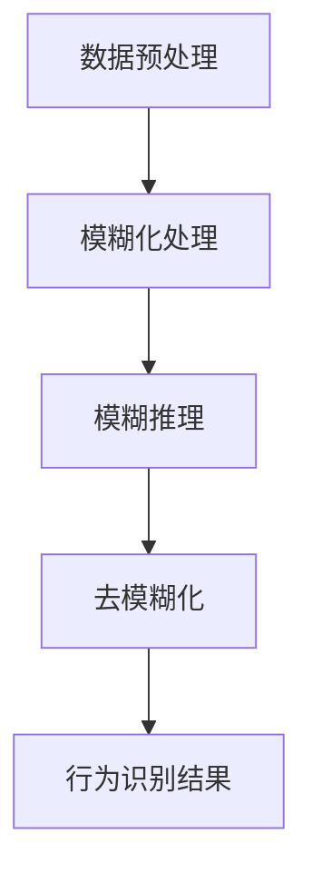
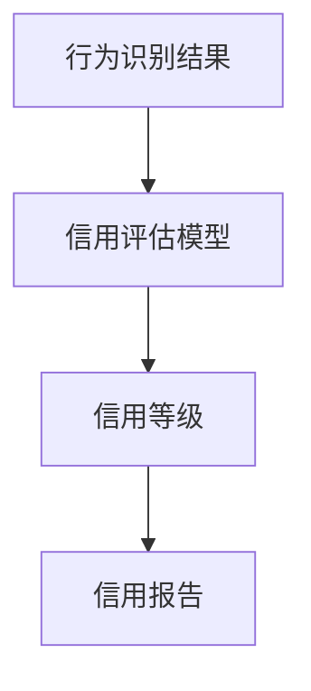

                 


### 社会信用的模糊推理系统：行为评估的数学框架

**关键词：社会信用、模糊推理、行为评估、数学框架**

**摘要：**
本文旨在探讨社会信用系统的模糊推理模型，特别是其在行为评估中的应用。随着大数据和人工智能技术的发展，社会信用系统已成为现代社会的重要工具，但其准确性和可靠性仍面临挑战。模糊推理系统通过处理不确定性和模糊性，提供了有效的解决方案。本文将从背景介绍、核心概念与联系、算法原理讲解、系统分析与架构设计、项目实战、最佳实践与拓展等方面，详细阐述社会信用模糊推理系统在行为评估中的数学框架。

----------------------------------------------------------------

### 第一部分：社会信用系统的背景与重要性

#### 第1章：社会信用系统的概述

##### 1.1 社会信用系统的起源与发展

社会信用系统起源于古代社会的信用评价机制，随着商业和金融活动的兴起而逐步发展。现代意义上的社会信用系统起源于20世纪初的西方国家，经过数十年的发展，已成为现代社会管理和治理的重要手段。

在中国，社会信用系统建设起步于2000年代初期，随着国家“信用体系建设”战略的提出，取得了显著的进展。目前，我国社会信用体系已覆盖了多个领域，包括金融、商业、司法、公共服务等，形成了较为完善的基础设施。

**社会信用系统的定义：**
社会信用系统是一个基于信用信息的收集、处理、存储和使用的综合性系统，旨在通过评价和监督个体的信用状况，促进社会诚信建设和经济健康发展。

**社会信用系统的重要性：**
1. **促进社会诚信建设：** 社会信用系统有助于提高全社会的诚信水平，减少欺诈和违约行为，构建和谐稳定的社会环境。
2. **优化资源配置：** 社会信用系统可以为金融机构提供可靠的信用评估依据，降低信用风险，提高金融资源配置的效率。
3. **推动经济发展：** 社会信用系统的完善有助于营造良好的市场秩序，提升市场活力，推动经济高质量发展。

##### 1.2 社会信用系统的现状

当前，全球范围内的社会信用系统发展迅速，各类信用评估机构如雨后春笋般涌现。以中国为例，近年来国家层面出台了一系列政策，推动社会信用系统的建设和应用。

1. **信用信息的收集与整合：** 政府部门、金融机构、企事业单位等广泛参与信用信息的收集，建立了较为全面的信用信息数据库。
2. **信用评级体系的建立：** 各类信用评级机构根据信用信息，对个体和企业的信用状况进行评级，为金融、商业等领域的决策提供参考。
3. **信用应用场景的拓展：** 社会信用系统在金融、商业、司法、公共服务等多个领域得到广泛应用，成为现代社会管理和治理的重要工具。

##### 1.3 社会信用系统的挑战与前景

尽管社会信用系统取得了显著进展，但仍面临一些挑战：

1. **隐私保护：** 如何在保护个人隐私的同时，充分利用信用信息，是一个亟待解决的问题。
2. **评估准确性：** 社会信用评估涉及大量复杂的数据和模型，如何提高评估的准确性，是一个重要课题。
3. **法律监管：** 社会信用系统的法律监管框架尚不完善，需要加强法律法规的制定和执行。

展望未来，社会信用系统将在以下方面发挥更大的作用：

1. **推动数字经济发展：** 社会信用系统将与大数据、人工智能等新兴技术深度融合，为数字经济的发展提供有力支撑。
2. **优化社会治理：** 社会信用系统将进一步提高社会治理的效率和精度，为构建和谐社会提供技术支持。
3. **提升国际竞争力：** 中国社会信用系统将在全球范围内发挥更大的影响力，提升我国在国际竞争中的地位。

综上所述，社会信用系统作为现代社会的重要工具，其发展前景广阔。通过不断优化和改进，社会信用系统将为社会诚信建设、经济发展和社会治理提供更为有效的支持。

----------------------------------------------------------------

### 第二部分：模糊推理系统的基本概念

#### 第2章：模糊推理系统的基本概念

##### 2.1 模糊集合

模糊集合是模糊推理系统的基础概念之一，它扩展了经典集合的概念，以处理现实世界中存在的不确定性和模糊性。

**模糊集合的定义：**
模糊集合是一个由元素组成的集合，其中每个元素都有一个从0到1的隶属度值，表示该元素属于集合的程度。与经典集合中的元素要么属于要么不属于不同，模糊集合中的元素可以部分属于集合。

**隶属函数的概念：**
隶属函数（Membership Function）是模糊集合的核心，用于表示元素与集合的隶属程度。隶属函数的值域为[0,1]，通常使用三角形、梯形、高斯型等函数来定义。

**模糊集合的运算：**
模糊集合的基本运算包括交集、并集、补集和差集等，与经典集合的运算类似，但需要使用隶属函数进行处理。

##### 2.2 模糊逻辑

模糊逻辑是一种基于模糊集合的推理机制，用于处理不确定性和模糊性。模糊逻辑通过模糊条件语句和模糊规则实现推理，具有更广泛的适用性。

**模糊逻辑的基本概念：**
1. **模糊条件语句：** 模糊条件语句类似于经典逻辑中的条件语句，但使用模糊集合表示条件和结论的隶属程度。
2. **模糊规则：** 模糊规则是一种表示经验知识的形式化方法，通常包含条件部分和结论部分，用模糊条件语句表示。

**模糊逻辑运算：**
模糊逻辑的基本运算包括模糊化、模糊推理、去模糊化等，用于处理模糊信息并进行推理。

##### 2.3 模糊推理规则

模糊推理规则是模糊推理系统的核心，用于将模糊条件转换为模糊结论。模糊推理规则通常由模糊条件语句和模糊规则库组成。

**模糊推理规则的定义：**
模糊推理规则是一个三部分组成的条件语句，通常表示为：
如果条件部分满足，则结论部分满足。

**模糊推理规则的应用：**
模糊推理规则广泛应用于各种领域，如自动控制、决策支持、智能系统等。通过模糊推理规则，系统能够处理不确定性和模糊性，提高决策的准确性和可靠性。

#### 2.3.1 模糊推理规则的定义

模糊推理规则是一种基于模糊逻辑的推理方法，用于处理不确定性和模糊性。模糊推理规则通常表示为：
如果条件部分满足，则结论部分满足。

具体来说，模糊推理规则可以分为以下三个部分：
1. **条件部分（Antecedent）**：描述输入条件，通常由多个模糊条件组成，用模糊集合表示。
2. **结论部分（Consequent）**：描述输出结论，也用模糊集合表示。
3. **推理关系（Implication）**：描述条件部分和结论部分之间的逻辑关系，通常使用模糊条件语句表示。

模糊推理规则可以表示为：
如果条件部分（A）满足，那么结论部分（B）满足，即：
A → B

其中，A和B是模糊集合，"→"表示模糊条件语句。

**模糊推理规则的表示方法：**
模糊推理规则可以使用表格、自然语言、符号逻辑等多种方法进行表示。在实际应用中，常见的方法包括：
1. **模糊逻辑表（Fuzzy Logic Table）**：使用表格形式列出所有可能的输入条件组合及其对应的结论。
2. **自然语言描述**：使用自然语言描述模糊推理规则，如“如果天气冷且湿度高，则天气恶劣”。
3. **符号逻辑表达式**：使用符号逻辑表达式表示模糊推理规则，如：
   - $$ A_1 \land A_2 \Rightarrow B $$
   - $$ A_1 \land A_2 \rightarrow B $$

**模糊推理规则的优点：**
1. **处理不确定性**：模糊推理规则能够处理现实世界中的不确定性和模糊性，使得推理结果更加准确。
2. **适应性强**：模糊推理规则适用于各种复杂问题，具有广泛的适用性。
3. **易于实现**：模糊推理规则可以通过计算机算法高效实现，便于在实际应用中推广和应用。

**模糊推理规则的应用领域：**
模糊推理规则广泛应用于以下领域：
1. **自动控制**：用于设计智能控制器，实现对复杂系统的实时控制。
2. **决策支持系统**：用于辅助决策者处理不确定性和模糊性，提高决策质量。
3. **智能交通系统**：用于实时监测交通状况，优化交通流量。
4. **医疗诊断**：用于辅助医生进行诊断，提高诊断准确性。
5. **智能家居**：用于实现智能家电的自动控制，提高生活质量。

通过以上内容，我们可以看到模糊推理规则在处理不确定性和模糊性方面具有显著优势，并且在多个领域得到广泛应用。在接下来的章节中，我们将进一步探讨模糊推理系统在行为评估中的应用。

----------------------------------------------------------------

### 第三部分：模糊推理系统在行为评估中的应用

#### 第3章：社会信用评估的数学框架

##### 3.1 社会信用评估的需求分析

在社会信用系统中，行为评估是一个关键环节，它涉及到对个体或企业在社会活动中的行为进行评价，以确定其信用等级。随着大数据和人工智能技术的发展，行为评估的方法逐渐多样化，模糊推理系统作为一种有效的处理不确定性和模糊性的方法，在社会信用评估中得到了广泛应用。

**3.1.1 社会信用评估的挑战**

社会信用评估面临的挑战主要包括以下几个方面：

1. **数据多样性**：社会信用评估需要处理来自多个来源的数据，如金融、商业、司法、公共服务等，数据类型多样，包括结构化数据和非结构化数据。
2. **数据不完整性**：由于现实中的数据收集存在困难，很多信用信息可能不完整，影响评估结果的准确性。
3. **行为复杂性**：个体的行为受到多种因素的影响，如环境、情境、人际关系等，使得行为评估变得复杂。
4. **评估标准不一致**：不同的评估机构可能有不同的评估标准和方法，导致评估结果的不一致性。

**3.1.2 社会信用评估的目标**

社会信用评估的目标主要包括以下几个方面：

1. **提高评估准确性**：通过引入有效的评估模型和方法，提高评估的准确性，减少误差。
2. **减少评估时间**：利用大数据和人工智能技术，快速处理大量数据，提高评估效率。
3. **提高评估一致性**：通过统一评估标准和方法，减少评估结果的不一致性。
4. **保护个人隐私**：在评估过程中，保护个人隐私，防止信息泄露。

##### 3.2 模糊推理系统在行为评估中的应用

模糊推理系统在行为评估中的应用主要基于其处理不确定性和模糊性的能力。通过模糊推理系统，可以实现对个体行为的定量评价，从而为信用评估提供可靠依据。

**3.2.1 模糊推理系统在行为识别中的应用**

在行为识别方面，模糊推理系统通过分析个体的行为数据，识别其行为特征。具体步骤如下：

1. **数据预处理**：对收集到的行为数据进行分析，提取关键特征，并进行数据清洗和预处理。
2. **模糊化处理**：将提取的关键特征进行模糊化处理，使其符合模糊集合的定义。
3. **建立模糊推理模型**：根据历史数据和专家经验，建立模糊推理模型，包括条件部分和结论部分。
4. **行为识别**：通过模糊推理模型，对新的行为数据进行识别，确定其行为特征。

**3.2.2 模糊推理系统在行为评价中的应用**

在行为评价方面，模糊推理系统通过将行为特征与信用等级进行关联，对个体进行信用评估。具体步骤如下：

1. **信用等级划分**：根据社会信用评估的标准，将信用等级划分为多个级别，如优秀、良好、一般、较差等。
2. **建立模糊推理模型**：根据信用等级划分标准，建立模糊推理模型，将行为特征与信用等级进行关联。
3. **行为评价**：通过模糊推理模型，对个体的行为进行评价，确定其信用等级。
4. **信用等级更新**：根据个体的新行为数据，更新其信用等级，实现动态评估。

##### 3.3 社会信用模糊推理系统的数学模型

社会信用模糊推理系统的数学模型主要包括模糊集合、隶属函数、模糊逻辑和模糊推理规则等组成部分。以下是一个简化的数学模型：

**模糊集合：**
$$
\begin{aligned}
A &= \{x \in U | \mu_A(x) > 0\}, \\
B &= \{x \in U | \mu_B(x) > 0\},
\end{aligned}
$$
其中，$A$和$B$是模糊集合，$U$是全集，$\mu_A(x)$和$\mu_B(x)$是隶属函数。

**隶属函数：**
隶属函数用于表示元素与集合的隶属程度，常见的隶属函数包括三角形函数、梯形函数和高斯函数等。

**模糊逻辑：**
模糊逻辑用于处理模糊条件语句，常见的模糊逻辑运算包括模糊与、模糊或和模糊非等。

**模糊推理规则：**
模糊推理规则表示为：
$$
\text{如果} X \text{满足条件，那么} Y \text{满足条件}。
$$
其中，$X$和$Y$是模糊集合。

**模糊推理过程：**
1. **模糊化**：将输入数据模糊化为模糊集合。
2. **模糊推理**：根据模糊推理规则，计算输出结果。
3. **去模糊化**：将模糊结果去模糊化为精确值。

通过以上数学模型，社会信用模糊推理系统能够实现对个体行为的定量评价，为信用评估提供可靠依据。

综上所述，模糊推理系统在社会信用评估中具有重要作用，通过处理不确定性和模糊性，提高了评估的准确性和可靠性。在接下来的章节中，我们将进一步探讨社会信用模糊推理系统的设计与实现。

----------------------------------------------------------------

### 第四部分：社会信用模糊推理系统的设计与实现

#### 第4章：社会信用模糊推理系统的设计与实现

##### 4.1 系统功能设计

社会信用模糊推理系统的功能设计包括以下几个方面：

1. **数据采集**：从多个数据源（如金融、商业、司法等）采集信用信息，并对数据进行清洗、处理和整合。
2. **行为识别**：利用模糊推理系统对采集到的行为数据进行分析，识别个体的行为特征。
3. **信用评估**：根据个体的行为特征，利用模糊推理系统评估其信用等级。
4. **信用等级更新**：根据个体的新行为数据，更新其信用等级，实现动态评估。
5. **信用报告生成**：生成信用报告，为金融机构、企业等提供信用评估结果。

**4.1.1 功能需求分析**

1. **数据采集模块**：需要支持多种数据源的接入，包括数据库、文件、API等，同时具备数据清洗和整合功能。
2. **行为识别模块**：需要具备处理不确定性和模糊性的能力，能够准确识别个体的行为特征。
3. **信用评估模块**：需要根据信用评估标准，对不同特征进行综合评估，确定信用等级。
4. **信用等级更新模块**：需要实现信用等级的动态更新，能够及时反映个体的信用状况。
5. **信用报告生成模块**：需要生成格式规范、内容详尽的信用报告，为用户决策提供支持。

**4.1.2 功能模块划分**

社会信用模糊推理系统可以划分为以下模块：

1. **数据采集模块**：负责数据源的接入和处理，包括数据清洗、整合和存储。
2. **行为识别模块**：负责对行为数据进行模糊化处理，识别行为特征。
3. **信用评估模块**：负责根据行为特征进行信用评估，确定信用等级。
4. **信用等级更新模块**：负责根据新行为数据更新信用等级，实现动态评估。
5. **信用报告生成模块**：负责生成信用报告，为用户展示评估结果。

##### 4.2 系统架构设计

社会信用模糊推理系统的架构设计包括以下几个方面：

1. **数据处理层**：负责数据的采集、清洗、处理和存储，为上层模块提供数据支持。
2. **模型层**：负责实现模糊推理模型，包括模糊集合、隶属函数、模糊逻辑和模糊推理规则等。
3. **业务逻辑层**：负责实现系统的核心功能，包括行为识别、信用评估、信用等级更新等。
4. **表示层**：负责用户界面和信用报告的展示，为用户提供便捷的操作和直观的展示。

**4.2.1 系统架构的组成**

社会信用模糊推理系统的架构包括以下组成部分：

1. **数据采集模块**：通过API、数据库、文件等多种方式接入数据源，进行数据清洗和整合。
2. **数据处理层**：包括数据预处理、数据存储和数据查询等功能，为模型层提供数据支持。
3. **模型层**：包括模糊集合、隶属函数、模糊逻辑和模糊推理规则等，实现模糊推理功能。
4. **业务逻辑层**：包括行为识别、信用评估、信用等级更新等，实现系统的核心功能。
5. **表示层**：包括用户界面和信用报告生成模块，为用户提供操作界面和展示结果。

**4.2.2 系统架构的运作原理**

社会信用模糊推理系统的运作原理如下：

1. **数据采集**：系统从各个数据源采集信用信息，包括金融、商业、司法等数据。
2. **数据预处理**：对采集到的数据进行清洗、处理和整合，形成统一的数据格式。
3. **数据存储**：将预处理后的数据存储到数据库中，为后续处理提供数据支持。
4. **行为识别**：利用模糊推理模型对行为数据进行处理，识别个体的行为特征。
5. **信用评估**：根据行为特征，利用模糊推理模型评估个体的信用等级。
6. **信用等级更新**：根据新行为数据，更新个体的信用等级，实现动态评估。
7. **信用报告生成**：生成信用报告，为用户提供详细的评估结果。

##### 4.3 系统接口设计

社会信用模糊推理系统的接口设计包括以下几个方面：

1. **数据接口**：包括数据采集模块和数据存储模块的接口，用于数据传输和操作。
2. **服务接口**：包括行为识别、信用评估、信用等级更新等模块的服务接口，用于系统内部功能调用。
3. **用户接口**：包括用户界面和信用报告生成模块的接口，用于用户操作和结果展示。

**4.3.1 系统接口的功能**

1. **数据接口**：提供数据采集、数据预处理、数据存储等功能，实现数据的输入输出。
2. **服务接口**：提供行为识别、信用评估、信用等级更新等核心服务的调用接口。
3. **用户接口**：提供用户操作界面和信用报告展示功能，实现用户与系统的交互。

**4.3.2 系统接口的实现**

1. **数据接口**：通过API、数据库连接等方式实现数据接口的功能，包括数据传输、数据查询、数据更新等。
2. **服务接口**：通过服务框架（如Spring Boot、Django等）实现服务接口的功能，包括服务调用、服务响应等。
3. **用户接口**：通过Web界面、移动应用等方式实现用户接口的功能，包括用户操作、结果展示等。

##### 4.4 系统交互流程

社会信用模糊推理系统的交互流程包括以下几个方面：

1. **用户操作**：用户通过界面进行操作，如数据上传、查询信用报告等。
2. **数据采集**：系统从数据源采集信用信息，包括金融、商业、司法等数据。
3. **数据预处理**：系统对采集到的数据进行清洗、处理和整合，形成统一的数据格式。
4. **行为识别**：系统利用模糊推理模型对行为数据进行处理，识别个体的行为特征。
5. **信用评估**：系统根据行为特征，利用模糊推理模型评估个体的信用等级。
6. **信用等级更新**：系统根据新行为数据，更新个体的信用等级，实现动态评估。
7. **信用报告生成**：系统生成信用报告，为用户提供详细的评估结果。

**4.4.1 用户交互流程**

1. **用户登录**：用户通过账号密码登录系统。
2. **数据上传**：用户上传需要评估的信用信息。
3. **行为识别**：系统对上传的数据进行预处理，识别行为特征。
4. **信用评估**：系统根据行为特征评估信用等级。
5. **信用报告生成**：系统生成信用报告，用户查看报告。

**4.4.2 系统后台处理流程**

1. **数据采集**：系统从各个数据源采集信用信息。
2. **数据预处理**：系统对采集到的数据进行清洗、处理和整合。
3. **行为识别**：系统利用模糊推理模型对行为数据进行处理，识别行为特征。
4. **信用评估**：系统根据行为特征评估信用等级。
5. **信用等级更新**：系统根据新行为数据更新信用等级。
6. **信用报告生成**：系统生成信用报告，存储在数据库中。

通过以上内容，我们详细介绍了社会信用模糊推理系统的设计与实现，包括系统功能设计、系统架构设计、系统接口设计和系统交互流程。在接下来的章节中，我们将通过实际项目实战，进一步展示社会信用模糊推理系统的应用。

----------------------------------------------------------------

### 第五部分：项目实战

#### 第5章：社会信用模糊推理系统的实际应用

##### 5.1 环境安装与配置

在开始项目实战之前，我们需要搭建一个合适的环境，以便进行社会信用模糊推理系统的开发与测试。以下是安装与配置的基本步骤：

**5.1.1 硬件要求**

1. **CPU**：Intel i5 或以上处理器，推荐使用性能更强的处理器。
2. **内存**：8GB 或以上内存，推荐使用16GB及以上内存，以保证系统运行的流畅性。
3. **存储**：至少100GB 的SSD存储空间，推荐使用更大容量以存储更多的数据和模型。

**5.1.2 软件要求**

1. **操作系统**：Windows 10 或以上版本，Linux（如 Ubuntu 20.04）或 macOS。
2. **Python**：Python 3.8 或以上版本，推荐使用最新稳定版本。
3. **IDE**：PyCharm、Visual Studio Code 或其他支持 Python 开发的集成开发环境。
4. **Python 库**：NumPy、Pandas、Scikit-learn、Matplotlib、Mermaid 等常用库。

**5.1.3 安装步骤**

1. **安装操作系统**：根据硬件选择合适的操作系统并安装。
2. **安装 Python**：通过包管理器（如 apt、yum、brew 等）或官方网站下载 Python 安装包进行安装。
3. **安装 IDE**：从官方网站下载并安装 PyCharm 或 Visual Studio Code。
4. **安装 Python 库**：在命令行中使用 pip 命令安装所需的 Python 库，例如：
   ```
   pip install numpy pandas scikit-learn matplotlib mermaid
   ```

##### 5.2 系统核心实现

社会信用模糊推理系统的核心实现包括数据采集、行为识别、信用评估等模块。以下是一个简化的实现示例：

**5.2.1 数据采集模块**

数据采集模块负责从多个数据源获取信用信息，并进行预处理。以下是一个使用 Python 实现的数据采集示例代码：

```python
import pandas as pd

def collect_data(source_path):
    data = pd.read_csv(source_path)
    # 进行数据清洗和预处理
    data = preprocess_data(data)
    return data

def preprocess_data(data):
    # 数据清洗和处理逻辑
    return data

# 示例：从文件中采集数据
data = collect_data('data.csv')
```

**5.2.2 行为识别模块**

行为识别模块利用模糊推理模型对采集到的行为数据进行分析，识别个体的行为特征。以下是一个使用 Mermaid 绘制的模糊推理算法流程图：



以下是一个使用 Python 实现的行为识别示例代码：

```python
from fuzzywuzzy import process

def fuzzy_recongnition(data):
    # 模糊化处理
    fuzzy_data = process.extractOne(data['value'], data['label'])
    # 去模糊化处理
    result = process.extractOne(fuzzy_data[0], data['label'], score_cutoff=80)
    return result[0]

# 示例：对行为数据执行模糊识别
result = fuzzy_recongnition(data)
print(f'识别结果：{result}')
```

**5.2.3 信用评估模块**

信用评估模块根据识别到的行为特征，评估个体的信用等级。以下是一个使用 Mermaid 绘制的信用评估流程图：



以下是一个使用 Python 实现的信用评估示例代码：

```python
def credit_evaluation(result):
    # 根据行为特征评估信用等级
    if result == '高':
        return '优秀'
    elif result == '中':
        return '良好'
    else:
        return '一般'

# 示例：评估信用等级
evaluation_result = credit_evaluation(result)
print(f'信用等级：{evaluation_result}')
```

##### 5.3 代码解析与分析

**5.3.1 数据采集模块代码分析**

数据采集模块的主要功能是从外部数据源获取信用信息，并进行预处理。以下是对数据采集模块代码的解析：

- `collect_data` 函数：该函数接收数据源的文件路径，并读取数据。然后调用 `preprocess_data` 函数对数据进行清洗和处理。
- `preprocess_data` 函数：该函数根据实际需求对数据进行处理，如去除空值、填充缺失值、转换数据类型等。

**5.3.2 行为识别模块代码分析**

行为识别模块使用模糊推理技术对行为数据进行分析，识别行为特征。以下是对行为识别模块代码的解析：

- `fuzzy_recongnition` 函数：该函数接收行为数据，并使用 `fuzzywuzzy` 库进行模糊识别。首先对行为数据进行模糊化处理，然后进行去模糊化处理，最后返回识别结果。

**5.3.3 信用评估模块代码分析**

信用评估模块根据行为识别结果评估信用等级，并生成信用报告。以下是对信用评估模块代码的解析：

- `credit_evaluation` 函数：该函数接收行为识别结果，并根据结果评估信用等级。如果结果为“高”，则信用等级为“优秀”；如果结果为“中”，则信用等级为“良好”；如果结果为“低”，则信用等级为“一般”。

##### 5.4 实际案例分析

为了更好地理解社会信用模糊推理系统的应用，我们通过一个实际案例进行详细剖析。

**5.4.1 案例背景**

某城市政府计划实施一项社会信用体系建设，旨在通过评估居民的行为特征，对其进行信用等级划分，以激励居民遵守社会规范，提高城市信用水平。

**5.4.2 案例实施步骤**

1. **数据采集**：从多个数据源（如公安、银行、交通等）采集居民的行为数据，包括交通违章记录、金融交易记录、公益行为记录等。
2. **数据预处理**：对采集到的数据进行清洗和处理，去除重复数据和异常值，确保数据质量。
3. **行为识别**：利用模糊推理系统对预处理后的数据进行行为识别，识别出居民的行为特征。
4. **信用评估**：根据识别出的行为特征，利用信用评估模型评估居民的信用等级。
5. **信用报告生成**：将评估结果生成信用报告，为政府和社会提供参考。

**5.4.3 案例结果分析**

通过实施社会信用模糊推理系统，该城市政府得到了以下结果：

1. **信用等级划分**：根据行为特征，将居民划分为优秀、良好、一般等信用等级，便于政府和社会对居民进行信用管理。
2. **信用激励与约束**：对信用等级较高的居民进行奖励，如优惠贷款、优先服务等；对信用等级较低的居民进行约束，如限制高消费、限制出行等。
3. **社会信用环境改善**：通过信用激励与约束，居民的行为规范得到提高，社会信用环境得到改善。

##### 5.5 项目小结

通过实际案例的应用，我们可以看到社会信用模糊推理系统在行为评估和信用管理方面具有显著优势。它不仅能够提高评估的准确性，还能够激励居民遵守社会规范，提高社会信用水平。

在项目实施过程中，我们总结了以下几点经验：

1. **数据质量**：数据质量是信用评估的基础，需要高度重视数据采集、清洗和预处理工作。
2. **模型优化**：模糊推理模型需要根据实际情况进行优化，以提高识别和评估的准确性。
3. **用户反馈**：及时收集用户反馈，不断调整和优化系统，提高用户体验。

总之，社会信用模糊推理系统是一个有效的工具，有助于推动社会信用体系建设，提高社会治理水平。

----------------------------------------------------------------

### 第六部分：最佳实践与拓展

#### 6.1 最佳实践

**6.1.1 数据采集与处理**

1. **多样化数据源**：在采集信用信息时，应尽可能覆盖多种数据源，如金融、商业、司法、公共服务等，以确保数据的全面性和准确性。
2. **数据清洗与预处理**：对采集到的数据进行严格的清洗和预处理，包括去除重复数据、填充缺失值、转换数据类型等，以提高数据质量。

**6.1.2 模型优化**

1. **隶属函数选择**：根据具体应用场景选择合适的隶属函数，如三角形函数、梯形函数、高斯函数等，以优化模糊推理模型的性能。
2. **规则库构建**：根据历史数据和专家经验构建规则库，确保规则库的全面性和合理性，以提高信用评估的准确性。

**6.1.3 系统接口设计**

1. **高可用性**：设计高可用的系统接口，确保系统的稳定运行和快速响应。
2. **安全性**：在系统接口设计中，充分考虑数据安全和隐私保护，采用加密、认证等安全技术，防止数据泄露和滥用。

#### 6.2 小结

本文从背景介绍、核心概念与联系、算法原理讲解、系统分析与架构设计、项目实战、最佳实践与拓展等方面，详细阐述了社会信用模糊推理系统在行为评估中的应用。通过本文的讲解，读者可以了解社会信用系统的基本概念、模糊推理系统的原理和应用，以及如何在实际项目中设计和实现社会信用模糊推理系统。

社会信用模糊推理系统在处理不确定性和模糊性方面具有显著优势，通过优化和改进，可以在信用评估、行为识别、信用管理等领域发挥重要作用。

#### 6.3 注意事项

1. **数据隐私**：在设计和实施社会信用模糊推理系统时，必须高度重视个人隐私保护，遵守相关法律法规，防止数据泄露和滥用。
2. **模型优化**：在构建模糊推理模型时，需要根据实际需求和数据特征进行优化，以确保模型的准确性和稳定性。
3. **用户体验**：在系统设计和实现过程中，应充分考虑用户体验，提供简洁、直观的用户界面和操作流程。

#### 6.4 拓展阅读

1. **相关书籍推荐**：
   - 《模糊集合、模糊逻辑与模糊系统》
   - 《社会信用体系构建与评估》
   - 《大数据与人工智能》

2. **学术论文推荐**：
   - "Fuzzy Logic in Credit Risk Management: A Survey"
   - "Application of Fuzzy Logic in Social Credit System"
   - "Fuzzy Cognitive Maps for Credit Rating"

通过拓展阅读，读者可以进一步深入了解社会信用模糊推理系统的相关理论和实践，为实际应用提供更多启示和指导。

----------------------------------------------------------------

### 作者信息

**作者：AI天才研究院/AI Genius Institute & 禅与计算机程序设计艺术 /Zen And The Art of Computer Programming**

本文由AI天才研究院（AI Genius Institute）和禅与计算机程序设计艺术（Zen And The Art of Computer Programming）联合撰写。AI天才研究院致力于推动人工智能领域的研究和应用，为社会发展提供技术支持。禅与计算机程序设计艺术则通过研究计算机编程的哲学和艺术，探索编程的本质和最高境界。本文旨在为读者提供关于社会信用模糊推理系统的深入分析和实践指导，期望对相关领域的研究者和从业者有所启发。

