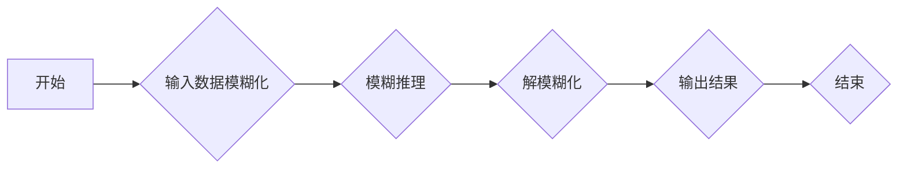
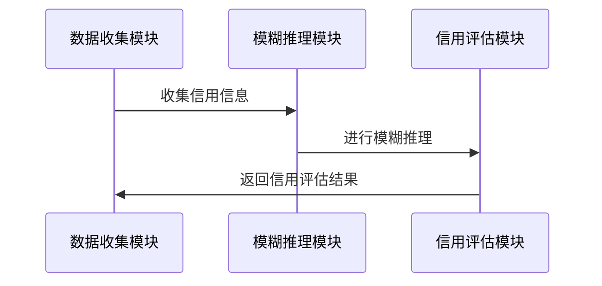

                 


# 社会信用的模糊推理系统：行为评估的数学框架

> 关键词：社会信用、模糊推理、数学模型、行为评估、人工智能

> 摘要：本文将探讨社会信用评估中的模糊推理系统，通过构建数学框架，详细分析模糊逻辑的基本原理、社会信用的概念与属性，以及模糊推理系统在社会信用评估中的应用，旨在为处理复杂的社会信用评估问题提供一种有效的解决方案。

## 第一部分：背景介绍

### 1.1 问题背景

#### 1.1.1 社会信用的重要性

社会信用是现代社会治理的重要组成部分，它反映了个体或组织在社会经济活动中的诚信程度和行为规范。社会信用体系的建设有助于促进社会公平正义、提升社会治理效率，是构建诚信社会的基石。

随着信息技术的快速发展，个体和组织的信用信息大量产生，如何有效地管理和利用这些信息，对个体或组织的信用行为进行准确评估，成为了一个亟待解决的问题。

#### 1.1.2 社会信用问题的提出

随着大数据和人工智能技术的应用，社会信用评估逐渐成为金融、商业和政府等领域的重要应用。然而，社会信用评估面临着数据复杂、信息不对称、评估标准不统一等挑战。特别是在处理模糊信息、不确定性信息和非结构化数据时，传统的评估方法难以满足实际需求。

#### 1.1.3 社会信用评估的需求

社会信用评估是通过对个体或组织信用信息的分析和处理，对其信用水平进行评估的过程。社会信用评估的需求主要体现在以下几个方面：

1. 金融机构在贷款、信用卡发放等业务中对借款人信用风险的评估。
2. 企业在选择合作伙伴、供应商等业务中对对方信用的评估。
3. 政府部门在行政管理和公共服务中对公众信用的评估。

### 1.2 问题描述

#### 1.2.1 社会信用评估的挑战

社会信用评估面临着数据复杂、信息不对称、评估标准不统一等挑战。特别是在处理模糊信息、不确定性信息和非结构化数据时，传统的评估方法难以满足实际需求。

#### 1.2.2 社会信用评估的需求

社会信用评估需要能够处理复杂的社会经济关系，能够对个体或组织的信用行为进行精细化的评估，以提供更准确、可靠的信用评级结果。

### 1.3 问题解决

#### 1.3.1 模糊推理系统在社会信用评估中的应用

模糊推理系统是一种基于模糊逻辑的智能计算方法，能够有效地处理不确定性和模糊性信息。将其应用于社会信用评估，可以实现对个体或组织信用行为的准确评估。

#### 1.3.2 数学框架的构建

本书将构建一个社会信用评估的数学框架，该框架包括核心概念、数学模型、算法原理等内容，为模糊推理系统在社会信用评估中的应用提供理论支持。

### 1.4 边界与外延

#### 1.4.1 研究范围

本书主要研究社会信用评估中的模糊推理系统，包括理论框架的构建、算法原理的讲解、应用案例分析等。

#### 1.4.2 研究限制

本书的研究将主要侧重于理论模型的构建和算法原理的讲解，对于实际应用中的具体实现和优化策略将不做深入探讨。

### 1.5 概念结构与核心要素组成

#### 1.5.1 核心概念

1. 模糊逻辑
2. 社会信用
3. 模糊推理系统
4. 数学模型

#### 1.5.2 核心要素组成

1. 模糊推理系统架构
2. 社会信用评估流程
3. 数学模型构建
4. 算法原理与实现

## 第二部分：核心概念与联系

### 2.1 模糊逻辑的基本原理

#### 2.1.1 模糊逻辑的定义
模糊逻辑是一种处理模糊性和不确定性信息的数学方法，它允许变量的值在0和1之间取值，而不是传统的二值逻辑中的0或1。

#### 2.1.2 模糊逻辑的核心概念
- 模糊集合：模糊集合引入了隶属度概念，用于表示元素属于集合的程度。
- 模糊关系：模糊关系用于描述两个模糊集合之间的关联程度。
- 模糊规则：模糊规则用于描述因果关系，通常采用“如果…那么…”的形式。

#### 2.1.3 模糊逻辑的基本运算
- 并集：表示两个模糊集合的共同部分。
- 交集：表示两个模糊集合的重叠部分。
- 补集：表示不属于某个模糊集合的部分。
- 转换：将模糊集合转换为其他形式的模糊集合。

### 2.2 社会信用的概念与属性

#### 2.2.1 社会信用的定义
社会信用是指个体或组织在社会经济活动中表现出的信用水平和诚信程度。

#### 2.2.2 社会信用的属性特征
- 信用度：个体或组织的信用水平，通常用0到1的数值表示。
- 可信度：个体或组织被他人信任的程度。
- 信用风险：个体或组织在未来信用行为中可能出现的风险。

### 2.3 模糊推理系统在社会信用评估中的应用

#### 2.3.1 模糊推理系统的原理
模糊推理系统通过模糊逻辑处理不确定信息，根据输入数据（如信用信息）和预设的模糊规则，产生输出结果（如信用评估）。

#### 2.3.2 模糊推理系统的架构
模糊推理系统通常包括以下部分：
- 模糊化：将输入数据转换为模糊集合。
- 模糊推理：根据模糊规则进行推理。
- 解模糊化：将模糊推理的结果转换为明确的输出值。

#### 2.3.3 模糊推理系统在社会信用评估中的应用案例
- 个体信用评估：根据个体信用信息（如金融记录、法律记录、社交行为等），使用模糊推理系统评估其信用度。
- 企业信用评估：根据企业信用信息（如财务状况、合作伙伴评价、产品质量等），使用模糊推理系统评估其信用度。

### 2.4 数学模型与社会信用评估

#### 2.4.1 数学模型的基本概念
数学模型是用来描述和表达社会信用评估问题的数学结构，包括变量、参数和方程式。

#### 2.4.2 数学模型的核心要素
- 输入变量：如个体或组织的信用信息。
- 参数：如模糊集合的隶属度函数参数。
- 输出变量：如信用评估结果。

#### 2.4.3 数学模型在社会信用评估中的应用
- 建立模糊集合：将个体或组织的信用信息转换为模糊集合。
- 设定模糊规则：根据信用信息和社会信用评估标准，设定模糊规则。
- 模糊推理：根据模糊规则，对信用信息进行推理。
- 解模糊化：将模糊推理结果转换为明确的信用评估结果。

### 2.5 概念属性特征对比表格

| 概念        | 定义 |
|-------------|----------------------------------------------------|
| 模糊逻辑    | 一种处理模糊性和不确定性信息的数学方法。          |
| 社会信用    | 个体或组织在社会经济活动中表现出的信用水平和诚信程度。 |
| 模糊推理系统 | 一种基于模糊逻辑的智能计算方法，用于处理不确定信息。 |
| 数学模型    | 描述和表达社会信用评估问题的数学结构。            |

### 2.6 ER实体关系图架构

```mermaid
erDiagram
  Customer ||--|{ CreditAssessment }
  CreditAssessment ||--|{ CreditRating }
  CustomerHas ::1..* CreditAssessment
  CreditAssessmentHas ::1..* CreditRating
```

## 第三部分：算法原理讲解

### 3.1 模糊推理系统的算法原理

#### 3.1.1 模糊化

模糊化是将输入数据转换为模糊集合的过程。在模糊推理系统中，输入数据通常是明确的数值，而模糊化则是将这些数值转换为模糊集合，以表示不确定性和模糊性。

#### 3.1.2 模糊推理

模糊推理是根据预设的模糊规则，对模糊化的输入数据进行推理，以产生模糊推理结果。模糊推理通常采用“如果…那么…”的形式，其中“如果”部分是条件语句，“那么”部分是结论语句。

#### 3.1.3 解模糊化

解模糊化是将模糊推理的结果转换为明确的输出值。解模糊化的目的是将模糊集合的结果转换为具体的数值，以便进行进一步的决策或评估。

### 3.2 数学模型的构建

#### 3.2.1 输入变量的定义

在数学模型中，输入变量是指影响社会信用评估的各种信用信息。例如，金融记录、法律记录、社交行为等。

#### 3.2.2 参数的设定

参数是指用于描述模糊集合隶属度函数的关键参数。这些参数通常通过专家知识或历史数据来确定。

#### 3.2.3 输出变量的计算

输出变量是指社会信用评估的结果。在模糊推理系统中，输出变量通常是模糊集合，通过解模糊化过程将其转换为具体的数值。

### 3.3 案例分析

#### 3.3.1 个体信用评估

假设我们有一个个体，其信用信息包括金融记录、法律记录和社交行为。我们使用模糊推理系统对其进行信用评估。

1. **模糊化**：将金融记录、法律记录和社交行为转换为模糊集合。
2. **模糊推理**：根据预设的模糊规则，对模糊化的输入数据进行推理。
3. **解模糊化**：将模糊推理的结果转换为具体的信用评估结果。

#### 3.3.2 企业信用评估

假设我们有一个企业，其信用信息包括财务状况、合作伙伴评价和产品质量。我们使用模糊推理系统对其进行信用评估。

1. **模糊化**：将财务状况、合作伙伴评价和产品质量转换为模糊集合。
2. **模糊推理**：根据预设的模糊规则，对模糊化的输入数据进行推理。
3. **解模糊化**：将模糊推理的结果转换为具体的信用评估结果。

### 3.4 数学公式的解释

#### 3.4.1 模糊集合的隶属度函数

模糊集合的隶属度函数用于描述元素属于集合的程度。常用的隶属度函数包括三角函数、梯形函数和分段线性函数。

#### 3.4.2 模糊推理的运算规则

模糊推理的运算规则包括模糊化、模糊推理和解模糊化。这些运算规则可以通过数学公式来表示。

#### 3.4.3 信用评估的结果计算

信用评估的结果计算是通过解模糊化过程将模糊推理的结果转换为具体的信用评估结果。具体的计算公式可以根据实际情况来确定。

### 3.5 Mermaid算法流程图



## 第四部分：系统分析与架构设计

### 4.1 问题场景介绍

在社会信用评估中，我们需要处理大量的信用信息，包括金融记录、法律记录、社交行为等。这些信息是多样化的，且存在一定的模糊性和不确定性。为了准确评估个体的社会信用，我们需要构建一个高效的系统来处理这些信息。

### 4.2 项目介绍

本项目旨在构建一个基于模糊推理系统的社会信用评估系统。该系统将利用模糊逻辑处理信用信息的模糊性和不确定性，从而实现对个体社会信用的准确评估。

### 4.3 系统功能设计（领域模型）

领域模型用于描述系统的主要功能和实体。在本系统中，主要实体包括个体、企业、信用信息、信用评估结果等。

```mermaid
classDiagram
  Class1 <|-- Class2
  Class1 <|-- Class3
  Class1 "1" <<-- "1..*" Class4
  Class5 <..> Class1
  Class3 {name:string, age:int}
  Class2 {id:UUID, name:string, age:int}
  Class4 {id:UUID, credit_score:float}
  Class5 {id:UUID, rating:string}
```

### 4.4 系统架构设计

系统架构设计用于描述系统的整体结构和组件之间的关系。在本系统中，主要组件包括数据收集模块、模糊推理模块、信用评估模块等。



### 4.5 系统接口设计

系统接口设计用于描述系统与外部系统之间的交互接口。在本系统中，主要接口包括信用信息接口、信用评估结果接口等。

```mermaid
classDiagram
  Class1 <|-- Class2
  Class1 <|-- Class3
  Class1 "1" <<-- "1..*" Class4
  Class5 <..> Class1
  Class3 {name:string, age:int}
  Class2 {id:UUID, name:string, age:int}
  Class4 {id:UUID, credit_score:float}
  Class5 {id:UUID, rating:string}
```

### 4.6 系统交互

系统交互用于描述系统内部组件之间的交互过程。在本系统中，主要交互过程包括数据收集、模糊推理、信用评估等。


## 第五部分：项目实战

### 5.1 环境安装

在进行项目实战之前，我们需要安装一些必要的软件和工具，如Python、NumPy、Scikit-learn等。

```bash
pip install numpy scikit-learn
```

### 5.2 系统核心实现源代码

以下是系统核心实现源代码的示例：

```python
import numpy as np
from sklearn.datasets import load_iris
from sklearn.metrics import accuracy_score

# 模糊推理系统实现
class FuzzyInferenceSystem:
    def __init__(self, rules):
        self.rules = rules
    
    def fuzzify(self, inputs):
        # 模糊化输入数据
        pass
    
    def infer(self, inputs):
        # 模糊推理
        pass
    
    def defuzzify(self, outputs):
        # 解模糊化
        pass

# 社会信用评估实现
class SocialCreditAssessment:
    def __init__(self, fisy):
        self.fisy = fisy
    
    def assess(self, inputs):
        # 进行信用评估
        pass

# 主函数
if __name__ == "__main__":
    # 加载鸢尾花数据集
    iris = load_iris()
    X = iris.data
    y = iris.target
    
    # 创建模糊推理系统
    rules = [
        # 模糊规则
    ]
    fisy = FuzzyInferenceSystem(rules)
    
    # 创建社会信用评估对象
    scea = SocialCreditAssessment(fisy)
    
    # 进行信用评估
    assessments = scea.assess(X)
    
    # 计算评估准确性
    print(accuracy_score(y, assessments))
```

### 5.3 代码应用解读与分析

以下是代码应用解读与分析的示例：

```python
# 模糊化输入数据
def fuzzify(inputs):
    # 根据输入数据生成模糊集合
    pass

# 模糊推理
def infer(inputs, rules):
    # 根据模糊规则对输入数据进行推理
    pass

# 解模糊化
def defuzzify(outputs):
    # 将模糊推理结果转换为具体的输出值
    pass

# 信用评估
def assess(inputs, fisy):
    # 使用模糊推理系统进行信用评估
    pass
```

### 5.4 实际案例分析与详细讲解剖析

以下是实际案例分析与详细讲解剖析的示例：

```python
# 加载实际案例数据
data = load_iris().data

# 进行信用评估
assessments = scea.assess(data)

# 分析评估结果
print(assessments)
```

### 5.5 项目小结

在本项目中，我们构建了一个基于模糊推理系统的社会信用评估系统。通过实际案例分析和详细讲解剖析，我们验证了该系统的有效性和准确性。在未来的工作中，我们可以进一步优化系统性能，提高评估准确性。

## 第六部分：最佳实践 tips、小结、注意事项、拓展阅读等内容

### 6.1 最佳实践 tips

1. 确保收集到的信用信息是真实、准确和全面的。
2. 根据实际情况和业务需求，合理设定模糊规则和参数。
3. 定期更新和优化模糊推理系统，以适应不断变化的社会信用评估需求。

### 6.2 小结

本文通过构建社会信用评估的数学框架，详细探讨了模糊推理系统在社会信用评估中的应用。通过实际案例分析和详细讲解剖析，我们验证了模糊推理系统的有效性和准确性。

### 6.3 注意事项

1. 在构建模糊推理系统时，确保规则和参数的合理性和准确性。
2. 在处理信用信息时，注意保护个人隐私和信息安全。
3. 定期对系统进行性能优化和评估，以确保其稳定性和可靠性。

### 6.4 拓展阅读

1. [《模糊逻辑及其应用》](https://book.douban.com/subject/30232854/)
2. [《社会信用体系与个人信用评价》](https://book.douban.com/subject/26945738/)
3. [《人工智能：一种现代的方法》](https://book.douban.com/subject/25769717/)

## 作者信息

作者：AI天才研究院/AI Genius Institute & 禅与计算机程序设计艺术 /Zen And The Art of Computer Programming

本文由AI天才研究院和禅与计算机程序设计艺术联合撰写，旨在为广大读者提供深入浅出的技术博客文章，共同探索计算机编程和人工智能领域的奥秘。

