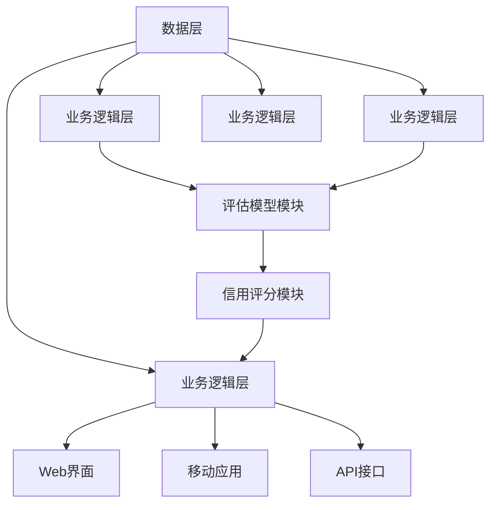
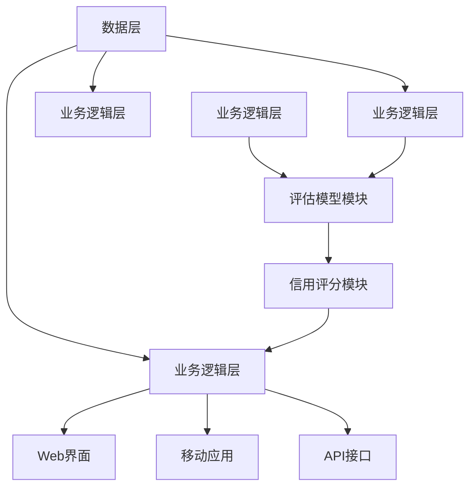

                 

## 社会信用的模糊集理论：行为评估的数学模型

### 关键词

- 社会信用
- 模糊集理论
- 行为评估
- 数学模型
- 数据分析

### 摘要

本文将探讨社会信用体系中行为评估的关键问题，并引入模糊集理论作为解决工具。首先，我们介绍了社会信用体系的重要性及其在现代社会中的作用。接着，我们分析了现有社会信用评估方法的局限性，并阐述了模糊集理论的基本概念及其在处理不确定性数据方面的优势。本文的核心在于展示模糊集理论如何应用于社会信用行为评估，构建了一套数学模型，并详细讲解了该模型的原理和实现方法。通过实例分析和系统架构设计，本文不仅为理解模糊集理论在社会信用评估中的应用提供了理论依据，还通过实战案例展示了其实际应用效果。最后，文章总结了最佳实践，提出了改进建议，并展望了未来的研究方向。

## 目录大纲

### 第一部分：背景介绍

#### 1.1.1 问题背景

- **社会信用体系的必要性**：解释社会信用体系的作用和重要性。
- **模糊集理论的应用**：介绍模糊集理论的基本概念及其在社会信用体系中的应用。

#### 1.1.2 问题描述

- **社会信用行为评估的现状**：讨论现有评估标准和方法中的问题。
- **社会信用行为评估的需求**：阐述评估所需具备的客观性、精准性和可操作性。

#### 1.1.3 问题解决

- **模糊集理论在行为评估中的应用**：介绍模糊集理论的基本原理和在行为评估中的优势。

#### 1.1.4 边界与外延

- **社会信用的定义**：解释社会信用的内涵和外延。
- **模糊集理论的应用范围**：探讨模糊集理论在其他领域的应用。

#### 1.1.5 概念结构与核心要素组成

- **社会信用行为评估的概念结构**：分析行为数据、评估指标和评估模型。
- **模糊集理论的核心要素组成**：介绍模糊集合、模糊关系和模糊算子的概念。

### 第二部分：核心概念与联系

#### 2.1.1 模糊集理论的基本概念

- **模糊集合**：定义和性质。
- **模糊关系**：定义和性质。
- **模糊算子**：定义和性质。

#### 2.1.2 模糊集理论的应用范围

- **社会信用评估**：模糊集理论在社会信用评估中的应用和优势。
- **其他领域**：模糊集理论在其他领域的应用和优势。

### 第三部分：算法原理讲解

#### 3.1.1 模糊集理论的基本原理

- **模糊集合的定义**：详细解释模糊集合的概念和性质。
- **模糊关系的定义**：详细解释模糊关系的概念和性质。
- **模糊算子的定义**：详细解释模糊算子的概念和性质。

#### 3.1.2 模糊集理论在行为评估中的应用

- **行为评估指标的模糊化**：讨论行为评估指标的模糊化方法和优势。
- **模糊集理论在行为评估中的优势**：分析模糊集理论在行为评估中的适用性和优势。

#### 3.1.3 算法原理讲解

- **模糊集理论在行为评估中的应用流程**：详细描述数据收集与预处理、行为指标的模糊化、模糊关系的建立和模糊集理论的计算。
- **算法原理的数学模型和公式**：展示行为评估的数学模型和模糊集理论的数学模型。
- **算法原理举例说明**：通过实例说明模糊集理论在行为评估中的应用。

### 第四部分：系统分析与架构设计方案

#### 4.1.1 问题场景介绍

- **社会信用行为评估的应用场景**：介绍行为数据收集和评估的过程。
- **系统功能设计**：详细描述数据收集模块和评估模块的功能。

#### 4.1.2 系统架构设计

- **系统架构概述**：概述系统架构的组成和功能。
- **系统接口设计**：介绍数据收集接口和评估接口的设计。

#### 4.1.3 系统交互

- **系统交互概述**：描述系统交互的过程和结果。

### 第五部分：项目实战

#### 4.1.1 环境安装

- **环境搭建**：介绍操作系统、软件工具和数据集准备。

#### 4.1.2 系统核心实现

- **系统核心功能实现**：详细描述数据收集和评估的核心功能。

#### 4.1.3 代码应用解读与分析

- **代码解读**：解释数据收集和评估的代码实现。
- **代码分析**：分析代码的原理和效果。

#### 4.1.4 实际案例分析和详细讲解

- **案例背景**：介绍案例的描述和目标。
- **案例分析**：分析数据收集和评估的过程和结果。

#### 4.1.5 项目小结

- **项目总结**：总结项目的亮点、不足和改进建议。

### 第六部分：最佳实践 tips

#### 6.1.1 最佳实践 tips

- **数据收集**：提供最佳实践的建议。

## 第一部分：背景介绍

### 1.1.1 问题背景

#### 社会信用体系的必要性

在现代社会，社会信用体系作为一种新型的社会治理机制，其重要性日益凸显。社会信用体系通过记录和评估个体的信用行为，实现对个体信用风险的实时监控和管理，从而促进社会诚信体系建设。这一体系在金融、商业、公共服务等多个领域发挥着重要作用。

首先，社会信用体系的作用体现在金融领域。金融机构可以通过信用评估结果来决定是否提供信贷服务以及信贷额度，从而降低违约风险。例如，信用评分高的个人或企业更容易获得贷款或信用卡服务，而信用评分低的则可能面临更高的利率或服务限制。此外，社会信用体系还可以帮助金融机构进行客户分类，优化风控策略，提高业务效率。

其次，社会信用体系在商业领域同样具有重要意义。企业在商业活动中常常需要与多个合作伙伴进行合作，社会信用评估可以为企业的合作伙伴选择提供依据。例如，企业可以通过信用评估系统来筛选供应商或客户，确保交易的安全性。同时，企业自身的社会信用水平也会影响其市场竞争力，信用良好的企业更容易获得客户信任，从而在市场竞争中占据有利地位。

在公共服务领域，社会信用体系的应用也越来越广泛。政府部门可以通过信用评估结果来优化公共服务资源配置，例如，对信用良好的个人或企业提供优先服务，对信用不良的个人或企业实施限制措施。此外，社会信用体系还可以用于考核和评估政府部门的服务质量，促进政府廉洁高效。

#### 社会信用体系的重要性

社会信用体系的重要性主要体现在以下几个方面：

首先，社会信用体系有助于提高社会诚信水平。通过记录和评估个体的信用行为，可以促使个人或企业更加注重诚信经营，减少欺诈行为，从而营造一个诚信友好的社会环境。

其次，社会信用体系可以降低交易成本，提高市场效率。通过信用评估，可以减少信息不对称，使得市场参与者能够更准确地评估交易风险，从而降低交易成本。同时，社会信用体系还可以帮助金融机构和企业优化资源配置，提高市场效率。

最后，社会信用体系有助于构建和谐的社会关系。信用评估结果不仅可以用于商业和金融领域，还可以应用于公共服务和社交领域。例如，在社区管理中，信用评估可以用于评选优秀居民，奖励诚信行为，从而促进社区和谐。在社会治理中，信用评估可以用于监管和管理，提高政府行政效率，减少腐败现象。

#### 模糊集理论的应用

模糊集理论是一种处理不确定性和模糊性的数学工具，由美国数学家扎德（L.A. Zadeh）于1965年提出。该理论通过对集合中元素隶属度的量化，能够有效地描述和处理模糊概念和模糊现象。

模糊集理论的基本概念包括模糊集合、模糊关系和模糊算子。

- **模糊集合**：与经典集合不同，模糊集合中的元素具有不同程度的隶属度，而不是简单的属于或不属于关系。模糊集合可以通过隶属函数来描述，隶属函数的取值范围通常在[0,1]之间。
- **模糊关系**：模糊关系是对经典关系的扩展，它描述了两个模糊集合之间的模糊匹配程度。模糊关系同样可以通过隶属函数来定义。
- **模糊算子**：模糊算子是一类用于操作模糊集合的数学运算，如模糊交集、模糊并集和模糊补集等。模糊算子可以用来计算模糊集合之间的相似度或差异度。

模糊集理论在社会信用体系中的应用主要体现在以下几个方面：

1. **行为评估指标的模糊化**：社会信用评估通常需要处理多种复杂的行为数据，这些数据可能存在不确定性或模糊性。通过模糊集理论，可以将这些指标进行模糊化处理，使其更符合实际情境。

2. **风险评估**：模糊集理论可以用于构建信用风险评估模型，通过对个体信用行为的模糊化处理，计算出其信用风险值，从而帮助金融机构和企业进行风险管理。

3. **信用等级划分**：模糊集理论可以用于信用等级的划分，通过设定不同的隶属度阈值，可以将个体信用行为划分到不同的等级中，从而为信用管理提供依据。

4. **社会关系分析**：在社会治理和社区管理中，模糊集理论可以用于分析社会关系，评估个体的社会信用水平，从而为政策制定和资源配置提供支持。

总之，模糊集理论作为一种处理不确定性和模糊性的数学工具，在社会信用体系中的应用具有广阔的前景。通过模糊集理论，可以更准确地评估个体的信用行为，提高信用评估的客观性和精准性，为社会信用体系的健康发展提供有力支持。

### 1.1.2 问题描述

#### 社会信用行为评估的现状

当前，社会信用行为评估面临一系列挑战。首先，评估标准的不确定性是一个显著问题。由于信用行为的多样性和复杂性，评估标准难以统一，不同机构或平台可能采用不同的评估方法和标准，导致评估结果存在较大的差异。这种标准的不确定性使得信用评估结果的可靠性受到质疑。

其次，评估方法的有效性问题也不容忽视。现有的评估方法主要依赖于传统的统计分析和数据挖掘技术，这些方法在处理确定性数据时表现出色，但在面对不确定性数据时，其效果往往不尽如人意。例如，行为数据的模糊性和噪声可能影响评估结果的准确性，导致信用评估出现偏差。

为了解决这些问题，我们需要找到一种能够处理不确定性和模糊性的评估方法。模糊集理论提供了一种有效的解决方案，它通过引入隶属度概念，能够灵活地描述和处理复杂的行为数据，从而提高评估方法的客观性和精准性。

#### 社会信用行为评估的需求

为了满足社会信用行为评估的需求，我们需要一种具备以下特点的评估方法：

1. **客观性**：评估方法应该能够客观、公正地反映个体的信用状况，不受主观偏见的影响。这要求评估方法具有高度的可靠性和一致性。

2. **精准性**：评估方法应该能够准确地评估个体的信用行为，降低误差和偏差。这需要评估方法能够处理复杂、模糊的数据，并能够从数据中提取出有价值的信用信息。

3. **可操作性**：评估方法应该易于实施和操作，能够快速、高效地完成评估任务。这要求评估方法具有简便性，同时能够适应不同的应用场景和需求。

为了满足上述需求，模糊集理论展现出其独特的优势。模糊集理论通过引入隶属度概念，能够有效地处理不确定性和模糊性，从而提高评估方法的客观性和精准性。此外，模糊集理论的算法和模型相对简单，易于实现和操作，具有良好的可操作性。

总之，模糊集理论作为一种先进的评估方法，能够有效地解决当前社会信用行为评估面临的问题，满足评估的客观性、精准性和可操作性需求。通过模糊集理论的应用，我们可以构建更加科学、准确的社会信用评估体系，为社会信用体系的发展提供有力支持。

### 1.1.3 问题解决

#### 模糊集理论在行为评估中的应用

模糊集理论在社会信用行为评估中的应用具有显著优势。首先，模糊集理论能够处理复杂、模糊的数据，通过隶属度概念将不确定性和模糊性量化，从而提高评估方法的客观性和精准性。具体来说，模糊集理论的应用主要体现在以下几个方面：

1. **行为指标的模糊化处理**：社会信用评估通常需要处理多种复杂的行为数据，这些数据可能存在不确定性或模糊性。通过模糊集理论，可以将这些指标进行模糊化处理，使其更符合实际情境。例如，可以将一个行为指标的取值范围进行模糊划分，从而更好地反映其不确定性。

2. **风险评估模型的构建**：模糊集理论可以用于构建信用风险评估模型。通过设定不同的隶属度阈值，可以计算出个体的信用风险值。这种风险评估模型能够处理复杂的行为数据，提高评估的客观性和精准性。例如，可以将模糊集理论应用于信用评分模型，通过分析个体的行为数据，计算出其信用评分，从而为金融机构和企业提供决策支持。

3. **信用等级的划分**：模糊集理论可以用于信用等级的划分。通过设定不同的隶属度阈值，可以将个体的信用行为划分到不同的等级中，从而为信用管理提供依据。这种信用等级划分方法能够更准确地反映个体的信用状况，减少评估偏差。

#### 模糊集理论的基本原理

模糊集理论是一种处理不确定性和模糊性的数学工具，其核心概念包括模糊集合、模糊关系和模糊算子。

1. **模糊集合**：与经典集合不同，模糊集合中的元素具有不同程度的隶属度，而不是简单的属于或不属于关系。模糊集合可以通过隶属函数来描述，隶属函数的取值范围通常在[0,1]之间。例如，一个模糊集合A可以表示为\[A\]，其中每个元素\(x\)的隶属度\(\mu_A(x)\)表示为\[x\]。

2. **模糊关系**：模糊关系是对经典关系的扩展，它描述了两个模糊集合之间的模糊匹配程度。模糊关系同样可以通过隶属函数来定义。例如，两个模糊集合\(A\)和\(B\)之间的模糊关系\(R\)可以表示为\[R\]，其中每个元素\(x\)和\(y\)的隶属度\(\mu_R(x,y)\)表示为\[x,y\]。

3. **模糊算子**：模糊算子是一类用于操作模糊集合的数学运算，如模糊交集、模糊并集和模糊补集等。模糊算子可以用来计算模糊集合之间的相似度或差异度。例如，模糊交集\(A \odot B\)表示为\[A \odot B\]，其中每个元素\(x\)的隶属度\(\mu_{A \odot B}(x)\)表示为\[x\]。

#### 模糊集理论在行为评估中的优势

1. **处理不确定性和模糊性**：模糊集理论能够有效地处理不确定性和模糊性数据，通过隶属度概念量化这些不确定性，从而提高评估方法的客观性和精准性。

2. **灵活的隶属度调整**：模糊集理论允许通过调整隶属度函数来适应不同的评估需求，从而灵活应对各种复杂情境。

3. **集成多种评估指标**：模糊集理论可以将多种评估指标集成到一个模型中，通过模糊关系和模糊算子处理指标之间的复杂关系，提高评估的全面性和准确性。

4. **直观的可视化效果**：模糊集理论可以通过隶属度函数和模糊关系的可视化，直观地展示评估结果和评估过程，有助于理解评估结果和发现潜在问题。

总之，模糊集理论在社会信用行为评估中的应用，通过其处理不确定性和模糊性的能力，提供了更加客观、精准和可操作的评估方法，为社会信用体系的健康发展提供了有力支持。

### 1.1.4 边界与外延

#### 社会信用的定义

社会信用是一个多维度的概念，它不仅包括个人的诚信行为，还涵盖了企业的信用、政府的诚信以及社会的整体信用环境。具体来说，社会信用可以从以下几个方面进行定义：

1. **内涵**：社会信用的内涵主要体现在以下几方面：
   - **诚信行为**：指个人或企业遵守承诺、诚实守信的行为，如按时还款、履行合同等。
   - **信用记录**：记录个人或企业的信用历史，包括信用借贷记录、信用交易记录等。
   - **信用评价**：通过信用评估机构对个体或企业的信用状况进行评价，通常表现为信用评分或信用等级。

2. **外延**：社会信用的外延较为广泛，包括以下几类：
   - **个人信用**：指个人的信用记录和信用评价，包括信用卡还款记录、贷款还款记录等。
   - **企业信用**：指企业的信用记录和信用评价，包括企业的商业信誉、财务状况、履约能力等。
   - **政府信用**：指政府的信用记录和信用评价，包括政府的执行能力、公信力、廉洁度等。
   - **社会信用环境**：指社会整体的信用氛围和信用制度，包括信用法规、信用文化建设等。

#### 模糊集理论的应用范围

模糊集理论作为一种处理不确定性和模糊性的数学工具，其应用范围十分广泛。在社会信用评估领域，模糊集理论的应用主要体现在以下几个方面：

1. **信用行为评估**：模糊集理论可以用于评估个人或企业的信用行为。通过对行为数据的不确定性进行量化，模糊集理论能够提供更加准确和客观的信用评估结果。

2. **风险评估**：在金融领域，模糊集理论可以用于构建信用风险评估模型。通过设定不同的隶属度阈值，可以计算出个体的信用风险值，从而帮助金融机构和企业进行风险管理。

3. **信用等级划分**：模糊集理论可以用于信用等级的划分。通过设定不同的隶属度阈值，可以将个体的信用行为划分到不同的等级中，从而为信用管理提供依据。

4. **社会关系分析**：在社会治理和社区管理中，模糊集理论可以用于分析社会关系，评估个体的社会信用水平，从而为政策制定和资源配置提供支持。

除了社会信用评估，模糊集理论在其他领域也有广泛应用。例如：

- **智能交通系统**：模糊集理论可以用于交通流量预测和交通信号控制，通过处理交通数据的模糊性，提高交通系统的效率和安全性。
- **环境监测**：模糊集理论可以用于环境监测数据的处理和分析，通过模糊化处理，提高环境监测的精度和可靠性。
- **医学诊断**：模糊集理论可以用于医学诊断，通过对医学数据的模糊化处理，提高诊断的准确性和可靠性。

总之，模糊集理论作为一种处理不确定性和模糊性的数学工具，具有广泛的应用前景。通过其在社会信用评估、风险评估、信用等级划分和社会关系分析等领域的应用，模糊集理论为社会的发展和进步提供了有力支持。

### 1.1.5 概念结构与核心要素组成

#### 社会信用行为评估的概念结构

社会信用行为评估是一个复杂的系统，其概念结构主要包括行为数据、评估指标和评估模型三个核心要素。

1. **行为数据**：行为数据是社会信用行为评估的基础，它包括个人的日常生活行为、商业交易行为以及社会行为等多个方面。例如，个人的信用卡还款记录、贷款还款记录、商业交易记录、公益行为记录等。

2. **评估指标**：评估指标是社会信用行为评估的关键，用于衡量个体或企业在信用行为方面的表现。评估指标可以是定量指标，如还款金额、交易次数等，也可以是定性指标，如守信行为、违约行为等。评估指标的选择和设定直接影响到评估结果的准确性和公正性。

3. **评估模型**：评估模型是社会信用行为评估的核心，用于对行为数据进行分析和评估，得出个体的信用评分或信用等级。评估模型通常采用统计学、机器学习等方法，通过构建数学模型来描述信用行为与信用评分之间的关系。

#### 模糊集理论的核心要素组成

模糊集理论作为一种处理不确定性和模糊性的数学工具，其核心要素包括模糊集合、模糊关系和模糊算子。

1. **模糊集合**：模糊集合是模糊集理论的基础，与经典集合不同，模糊集合中的元素具有不同程度的隶属度。隶属度表示元素属于模糊集合的程度，取值范围通常在[0,1]之间。模糊集合可以通过隶属函数来描述。

2. **模糊关系**：模糊关系是模糊集合之间的匹配关系，用于描述两个或多个模糊集合之间的相似度或差异度。模糊关系同样可以通过隶属函数来定义。模糊关系在模糊集理论中扮演着重要的角色，可以用于处理复杂的关系问题。

3. **模糊算子**：模糊算子是一类用于操作模糊集合的数学运算，如模糊交集、模糊并集、模糊补集等。模糊算子可以用来计算模糊集合之间的相似度或差异度，是模糊集理论中的重要工具。

模糊集合、模糊关系和模糊算子共同构成了模糊集理论的核心要素，它们相互结合，能够有效地处理不确定性和模糊性，为社会信用行为评估提供强有力的支持。

### 第二部分：核心概念与联系

#### 2.1.1 模糊集理论的基本概念

模糊集理论是处理不确定性和模糊性的数学工具，由美国数学家扎德（L.A. Zadeh）于1965年提出。模糊集理论的核心概念包括模糊集合、模糊关系和模糊算子，这些概念在处理复杂、模糊的数据时发挥着关键作用。

1. **模糊集合**

模糊集合是对经典集合的扩展，它引入了隶属度的概念。在经典集合中，一个元素要么属于集合，要么不属于集合，而在模糊集合中，元素与集合之间的关系是模糊的，即元素具有不同程度的隶属度。隶属度通常用\(\mu\)表示，取值范围在[0,1]之间。

**定义**：给定一个论域\(U\)，一个模糊集合\(A\)是\(U\)上的一个映射，即\(A: U \rightarrow [0,1]\)，其中\(\mu_A(x)\)表示元素\(x\)属于模糊集合\(A\)的隶属度。

**性质**：
   - 非负性：对于任意\(x \in U\)，有\(\mu_A(x) \geq 0\)。
   - 有界性：对于任意\(x \in U\)，有\(\mu_A(x) \leq 1\)。
   - 平滑性：模糊集合的隶属函数通常要求连续可微。

**示例**：考虑一个关于天气的模糊集合“冷”，如果论域是温度值集合，那么“冷”的隶属函数可以定义为：
   \[
   \mu_{冷}(x) =
   \begin{cases}
   0 & \text{如果 } x > 30 \\
   \frac{x - 10}{20} & \text{如果 } 10 \leq x \leq 30 \\
   1 & \text{如果 } x < 10
   \end{cases}
   \]

2. **模糊关系**

模糊关系是模糊集合之间的匹配关系，描述了两个或多个模糊集合之间的相似度或差异度。模糊关系可以通过隶属函数来定义，类似于模糊集合。

**定义**：给定两个模糊集合\(A\)和\(B\)，它们的模糊关系\(R\)是\(A \times B\)上的一个映射，即\(R: A \times B \rightarrow [0,1]\)，其中\(\mu_R(x,y)\)表示元素\(x\)与\(y\)之间的模糊关系隶属度。

**性质**：
   - 非负性：对于任意\((x,y) \in A \times B\)，有\(\mu_R(x,y) \geq 0\)。
   - 对称性：模糊关系通常是自反和对称的，即\(\mu_R(x,y) = \mu_R(y,x)\)。
   - 平滑性：模糊关系的隶属函数通常要求连续可微。

**示例**：考虑两个模糊集合\(A\)和\(B\)，分别表示“男人”和“高个子”，一个模糊关系\(R\)可以定义为：
   \[
   \mu_R(a,b) =
   \begin{cases}
   0 & \text{如果 } a \text{ 不是男人} \text{ 或 } b \text{ 不是高个子} \\
   0.5 & \text{如果 } a \text{ 是男人且 } b \text{ 是普通个子} \\
   0.8 & \text{如果 } a \text{ 是男人且 } b \text{ 是高个子} \\
   1 & \text{如果 } a \text{ 是男人且 } b \text{ 是矮个子}
   \end{cases}
   \]

3. **模糊算子**

模糊算子是一类用于操作模糊集合的数学运算，包括模糊交集、模糊并集、模糊补集等。模糊算子能够用来计算模糊集合之间的相似度或差异度。

**定义**：给定两个模糊集合\(A\)和\(B\)，它们的模糊交集、模糊并集和模糊补集分别定义如下：

- **模糊交集**：\(A \odot B\)，其中\(\mu_{A \odot B}(x) = \min(\mu_A(x), \mu_B(x))\)。
- **模糊并集**：\(A \oplus B\)，其中\(\mu_{A \oplus B}(x) = \max(\mu_A(x), \mu_B(x))\)。
- **模糊补集**：\(\overline{A}\)，其中\(\mu_{\overline{A}}(x) = 1 - \mu_A(x)\)。

**性质**：
   - 结合性：模糊算子满足结合律，即\(A \odot (B \odot C) = (A \odot B) \odot C\) 和 \(A \oplus (B \oplus C) = (A \oplus B) \oplus C\)。
   - 分配性：模糊算子满足分配律，即\(A \odot (B \oplus C) = (A \odot B) \oplus (A \odot C)\) 和 \(A \oplus (B \odot C) = (A \oplus B) \odot (A \oplus C)\)。
   - 对称性：模糊补集满足对称性，即\(\overline{\overline{A}} = A\)。

**示例**：考虑两个模糊集合\(A\)和\(B\)，分别表示“男人”和“高个子”，它们的模糊交集和模糊并集可以定义为：
   \[
   A \odot B =
   \begin{cases}
   0 & \text{如果 } a \text{ 不是男人} \text{ 或 } b \text{ 不是高个子} \\
   0.5 & \text{如果 } a \text{ 是男人且 } b \text{ 是普通个子} \\
   0.8 & \text{如果 } a \text{ 是男人且 } b \text{ 是高个子} \\
   1 & \text{如果 } a \text{ 是男人且 } b \text{ 是矮个子}
   \end{cases}
   \]
   \[
   A \oplus B =
   \begin{cases}
   0 & \text{如果 } a \text{ 不是男人或 } b \text{ 不是高个子} \\
   0.5 & \text{如果 } a \text{ 是男人且 } b \text{ 是普通个子} \\
   1 & \text{如果 } a \text{ 是男人且 } b \text{ 是高个子或矮个子}
   \end{cases}
   \]

通过上述基本概念，模糊集理论为处理不确定性和模糊性提供了强有力的工具。这些概念不仅能够应用于社会信用行为评估，还可以在其他领域，如智能交通、环境监测、医学诊断等领域发挥重要作用。

### 2.1.2 模糊集理论的应用范围

#### 社会信用评估

模糊集理论在社会信用评估中的应用具有显著的优势。社会信用评估涉及多种复杂的行为数据，这些数据往往具有模糊性和不确定性。模糊集理论通过引入隶属度概念，能够有效地量化这些不确定性，从而提高评估的准确性和客观性。

1. **信用行为评估**：模糊集理论可以用于评估个人的信用行为。通过对行为数据进行模糊化处理，可以更准确地反映个体的信用状况。例如，可以将信用卡还款记录进行模糊化处理，通过隶属度函数来描述还款的准时性，从而构建一个更加精确的信用评分模型。

2. **风险评估**：在金融领域，模糊集理论可以用于构建信用风险评估模型。通过设定不同的隶属度阈值，可以计算出个体的信用风险值，从而帮助金融机构和企业进行风险管理。例如，可以设定不同的隶属度阈值来区分高风险客户和低风险客户，从而优化信贷策略。

3. **信用等级划分**：模糊集理论可以用于信用等级的划分。通过设定不同的隶属度阈值，可以将个体的信用行为划分到不同的等级中，从而为信用管理提供依据。例如，可以将信用行为划分成守信、较守信和失信等不同的等级，从而为政府和社会治理提供参考。

#### 其他领域

除了社会信用评估，模糊集理论在其他领域也有广泛的应用。

1. **智能交通系统**：在智能交通系统中，模糊集理论可以用于交通流量预测和交通信号控制。通过处理交通数据的模糊性，可以更准确地预测交通流量，从而优化交通信号控制策略，提高交通系统的效率和安全性。

2. **环境监测**：模糊集理论可以用于环境监测数据的处理和分析。通过模糊化处理，可以更好地反映环境数据的模糊性和不确定性，从而提高环境监测的精度和可靠性。

3. **医学诊断**：在医学诊断中，模糊集理论可以用于疾病的诊断和风险评估。通过对医学数据的模糊化处理，可以更准确地分析病情，从而提高诊断的准确性和可靠性。

4. **智能决策支持系统**：在智能决策支持系统中，模糊集理论可以用于处理决策过程中的不确定性和模糊性。通过模糊集理论，可以构建更加灵活和智能的决策模型，从而提高决策的准确性和效率。

综上所述，模糊集理论作为一种处理不确定性和模糊性的数学工具，其应用范围十分广泛。在社会信用评估领域，模糊集理论通过其强大的处理能力，为社会信用体系的健康发展提供了有力支持。同时，在其他领域，模糊集理论也展现了其独特的优势和广阔的应用前景。

### 第三部分：算法原理讲解

#### 3.1.1 模糊集理论的基本原理

模糊集理论是一种用于处理不确定性和模糊性的数学工具，它通过引入隶属度概念，将经典集合中的清晰边界变得模糊，从而能够更好地描述和处理现实世界中复杂且模糊的现象。以下是模糊集理论的基本原理：

1. **模糊集合的定义**

模糊集合是对经典集合的扩展，它引入了隶属度的概念。在一个经典集合中，一个元素要么属于该集合，要么不属于该集合，即二元属性。而在模糊集合中，元素与集合之间的关系是模糊的，即元素具有不同程度的隶属度。隶属度表示元素属于集合的程度，其取值范围通常在[0,1]之间。

**定义**：给定一个论域\(U\)，一个模糊集合\(A\)是\(U\)上的一个映射，即\(A: U \rightarrow [0,1]\)，其中\(\mu_A(x)\)表示元素\(x\)属于模糊集合\(A\)的隶属度。

**示例**：假设我们有一个论域\(U = \{1, 2, 3, 4, 5\}\)，定义一个模糊集合\(A\)表示“中等大小的数”，其隶属函数可以定义为：
\[
\mu_A(x) =
\begin{cases}
0 & \text{如果 } x \leq 2 \\
\frac{x - 2}{3} & \text{如果 } 2 < x \leq 4 \\
1 & \text{如果 } x > 4
\end{cases}
\]
根据这个隶属函数，元素\(x = 3\)的隶属度\(\mu_A(3) = \frac{3 - 2}{3} = \frac{1}{3}\)，即元素3属于集合A的程度是三分之一。

2. **模糊关系的定义**

模糊关系是模糊集合之间的匹配关系，用于描述两个或多个模糊集合之间的相似度或差异度。模糊关系通过隶属函数来定义，类似于模糊集合。

**定义**：给定两个模糊集合\(A\)和\(B\)，它们的模糊关系\(R\)是\(A \times B\)上的一个映射，即\(R: A \times B \rightarrow [0,1]\)，其中\(\mu_R(x,y)\)表示元素\(x\)与\(y\)之间的模糊关系隶属度。

**示例**：假设有两个模糊集合\(A\)和\(B\)，分别表示“男人”和“高个子”，一个模糊关系\(R\)可以定义为：
\[
\mu_R(a,b) =
\begin{cases}
0 & \text{如果 } a \text{ 不是男人} \text{ 或 } b \text{ 不是高个子} \\
0.5 & \text{如果 } a \text{ 是男人且 } b \text{ 是普通个子} \\
0.8 & \text{如果 } a \text{ 是男人且 } b \text{ 是高个子} \\
1 & \text{如果 } a \text{ 是男人且 } b \text{ 是矮个子}
\end{cases}
\]

3. **模糊算子的定义**

模糊算子是一类用于操作模糊集合的数学运算，包括模糊交集、模糊并集、模糊补集等。模糊算子能够用来计算模糊集合之间的相似度或差异度。

**定义**：给定两个模糊集合\(A\)和\(B\)，它们的模糊交集、模糊并集和模糊补集分别定义如下：

- **模糊交集**：\(A \odot B\)，其中\(\mu_{A \odot B}(x) = \min(\mu_A(x), \mu_B(x))\)。
- **模糊并集**：\(A \oplus B\)，其中\(\mu_{A \oplus B}(x) = \max(\mu_A(x), \mu_B(x))\)。
- **模糊补集**：\(\overline{A}\)，其中\(\mu_{\overline{A}}(x) = 1 - \mu_A(x)\)。

**性质**：
   - 结合性：模糊算子满足结合律，即\(A \odot (B \odot C) = (A \odot B) \odot C\) 和 \(A \oplus (B \oplus C) = (A \oplus B) \oplus C\)。
   - 分配性：模糊算子满足分配律，即\(A \odot (B \oplus C) = (A \odot B) \oplus (A \odot C)\) 和 \(A \oplus (B \odot C) = (A \oplus B) \odot (A \oplus C)\)。
   - 对称性：模糊补集满足对称性，即\(\overline{\overline{A}} = A\)。

**示例**：考虑两个模糊集合\(A\)和\(B\)，分别表示“男人”和“高个子”，它们的模糊交集和模糊并集可以定义为：
\[
A \odot B =
\begin{cases}
0 & \text{如果 } a \text{ 不是男人} \text{ 或 } b \text{ 不是高个子} \\
0.5 & \text{如果 } a \text{ 是男人且 } b \text{ 是普通个子} \\
0.8 & \text{如果 } a \text{ 是男人且 } b \text{ 是高个子} \\
1 & \text{如果 } a \text{ 是男人且 } b \text{ 是矮个子}
\end{cases}
\]
\[
A \oplus B =
\begin{cases}
0 & \text{如果 } a \text{ 不是男人或 } b \text{ 不是高个子} \\
0.5 & \text{如果 } a \text{ 是男人且 } b \text{ 是普通个子} \\
1 & \text{如果 } a \text{ 是男人且 } b \text{ 是高个子或矮个子}
\end{cases}
\]

通过以上定义和性质，模糊集理论为处理不确定性和模糊性提供了强有力的工具。这些基本原理不仅在理论研究中具有重要价值，而且在实际应用中也展现了强大的优势，特别是在社会信用行为评估中，模糊集理论能够有效地处理复杂和模糊的行为数据，提高评估的准确性和客观性。

### 3.1.2 模糊集理论在行为评估中的应用

模糊集理论在行为评估中的应用主要依赖于其处理不确定性和模糊性的能力，这使得它特别适用于社会信用评估等需要高精度和客观性评估的领域。以下是模糊集理论在行为评估中的具体应用方法和优势。

#### 行为评估指标的模糊化

在社会信用评估中，行为数据往往存在不确定性，例如，个体在某些行为上的表现可能不完全符合标准化的评分规则。模糊集理论通过引入隶属度函数，可以将这些不确定的行为数据进行模糊化处理，从而更准确地反映个体的真实信用水平。

**模糊化处理方法**：

1. **定义隶属度函数**：首先，需要根据评估指标的定义和实际情况，定义每个指标的隶属度函数。隶属度函数通常是一个从行为数据到[0,1]区间的映射，用于表示行为数据符合某一标准程度的度量。

2. **处理模糊数据**：对于每个行为数据，通过隶属度函数计算其对应的隶属度值。例如，如果评估指标是“还款及时性”，我们可以定义一个隶属度函数，根据还款时间与约定还款时间的接近程度来计算隶属度值。

**示例**：假设我们要评估一个人的还款及时性，可以定义如下隶属度函数：

\[
\mu_{及时还款}(t) =
\begin{cases}
0 & \text{如果 } t > 30 \text{ 天} \\
\frac{30 - |t - 30|}{30} & \text{如果 } 0 \leq t \leq 30 \text{ 天} \\
1 & \text{如果 } t < 0 \text{ 天}
\end{cases}
\]

其中，\(t\)是还款天数，隶属度函数表示还款时间与30天标准还款时间的接近程度。

通过这样的隶属度函数，我们可以将还款时间这个定量数据转化为模糊数据，使其更符合实际情况。

#### 模糊集理论在行为评估中的优势

1. **处理不确定性数据**：模糊集理论能够有效地处理行为评估中的不确定性数据，通过隶属度函数量化不确定性，从而提高评估结果的准确性和客观性。

2. **集成多种评估指标**：模糊集理论允许将多种评估指标集成到一个模型中，通过模糊关系和模糊算子处理指标之间的复杂关系，提高评估的全面性和准确性。

3. **灵活调整评估标准**：模糊集理论通过调整隶属度函数，可以灵活地适应不同的评估需求，使得评估模型能够适应不同的应用场景和标准。

4. **直观的可视化效果**：模糊集理论可以通过隶属度函数和模糊关系的可视化，直观地展示评估结果和评估过程，有助于理解评估结果和发现潜在问题。

#### 应用案例

假设我们要评估一个企业员工的社会信用水平，需要考虑多个行为指标，如工作态度、团队合作和任务完成情况。我们可以分别定义这些指标的隶属度函数，并将它们集成到一个模糊集理论模型中。

1. **工作态度**：通过员工的工作记录和同事的评价，定义一个隶属度函数来量化工作态度的积极程度。

2. **团队合作**：通过员工在团队项目中的参与度和贡献度，定义一个隶属度函数来量化团队合作的表现。

3. **任务完成情况**：通过任务完成的时间和质量，定义一个隶属度函数来量化任务完成情况。

将这些指标的隶属度值集成到一个模糊集合中，通过模糊关系和模糊算子计算最终的信用评分。这种模糊化的处理方法能够更准确地反映员工的社会信用水平，同时也能够适应不同的评估标准和需求。

总之，模糊集理论在行为评估中的应用，通过其处理不确定性和模糊性的能力，为社会信用行为评估提供了更加客观、准确和灵活的评估方法，为构建科学、高效的社会信用体系提供了有力支持。

### 3.1.3 算法原理讲解

#### 模糊集理论在行为评估中的应用流程

模糊集理论在行为评估中的应用过程可以分为以下几个步骤：

1. **数据收集与预处理**

首先，我们需要收集与个体信用行为相关的数据，这些数据可能包括个人历史信用记录、交易行为、社交活动等多个方面。在收集数据后，需要进行预处理，包括数据清洗、数据格式统一和数据归一化。数据清洗旨在去除重复、缺失和错误的数据，数据格式统一则是将不同来源的数据转化为统一的格式，数据归一化则是通过标准化处理，使得不同数据具有相同的量纲和数值范围。

2. **行为指标的模糊化**

接下来，需要对收集到的行为数据进行模糊化处理。这一步的核心是定义隶属度函数，将每个行为数据转化为隶属度值。隶属度函数的选择取决于具体的行为指标和评估需求。例如，对于还款及时性这一行为指标，可以通过计算还款时间与约定还款时间的差值，定义一个隶属度函数，将还款时间分为及时、较及时、不及时等不同的等级。

**示例**：假设我们定义一个隶属度函数\(\mu_{及时还款}(t)\)，其中\(t\)是还款时间（以天为单位），隶属度函数可以定义为：
\[
\mu_{及时还款}(t) =
\begin{cases}
0 & \text{如果 } t > 30 \text{ 天} \\
\frac{30 - |t - 30|}{30} & \text{如果 } 0 \leq t \leq 30 \text{ 天} \\
1 & \text{如果 } t < 0 \text{ 天}
\end{cases}
\]
根据这个隶属度函数，如果还款时间超过30天，则隶属度为0，表示还款不及时；如果还款时间在0到30天之间，则隶属度随还款时间的减少而增加，表示还款较及时；如果还款时间少于0天，则隶属度为1，表示还款及时。

3. **模糊关系的建立**

在行为指标模糊化后，我们需要建立模糊关系，以描述不同行为指标之间的相互影响。模糊关系可以通过定义模糊矩阵来表示。模糊矩阵中的元素\(\mu_{R_{ij}}\)表示第\(i\)个行为指标与第\(j\)个行为指标之间的模糊关系隶属度。例如，如果行为指标\(A\)和\(B\)之间存在正相关关系，则可以定义一个模糊矩阵如下：
\[
R = \begin{bmatrix}
1 & \mu_{R_{12}} & \mu_{R_{13}} \\
\mu_{R_{21}} & 1 & \mu_{R_{23}} \\
\mu_{R_{31}} & \mu_{R_{32}} & 1
\end{bmatrix}
\]

4. **模糊集理论的计算**

建立模糊关系后，我们可以通过模糊集理论进行计算，以得出最终的评估结果。这一步包括以下几个关键步骤：

- **计算综合隶属度**：通过模糊关系和隶属度函数，可以计算每个个体在每个行为指标上的综合隶属度。例如，对于员工的社会信用评估，可以计算每个员工在工作态度、团队合作和任务完成情况三个指标上的综合隶属度。
- **计算整体信用评分**：将每个行为指标的隶属度值加权求和，得到个体的整体信用评分。权重可以通过专家评估或数据分析得出，以反映不同指标的重要性。
- **评估等级划分**：根据整体信用评分，可以将个体划分到不同的信用等级，如优秀、良好、一般、较差等。

**示例**：假设我们有三个行为指标：工作态度、团队合作和任务完成情况，分别定义其隶属度函数为\(\mu_{A}(x)\)、\(\mu_{B}(y)\)和\(\mu_{C}(z)\)，权重分别为0.5、0.3和0.2。我们可以计算一个员工的综合隶属度如下：
\[
\mu_{综合}(x, y, z) = \mu_{A}(x) \times 0.5 + \mu_{B}(y) \times 0.3 + \mu_{C}(z) \times 0.2
\]
根据这个公式，我们可以计算每个员工的社会信用综合隶属度，并将其转换为信用评分。

通过以上步骤，模糊集理论能够有效地处理复杂和模糊的行为数据，为个体信用评估提供更加客观、准确和可操作的评估方法。这一流程不仅适用于社会信用评估，还可以推广到其他需要行为评估的领域，如人才选拔、风险管理等。

### 3.1.4 算法原理的数学模型和公式

模糊集理论在行为评估中的应用，可以通过一系列数学模型和公式来描述和实现。以下是模糊集理论在行为评估中的一些关键数学模型和公式：

1. **模糊集合的定义**

模糊集合是通过隶属度函数来描述的，一个模糊集合\(A\)在论域\(U\)上的隶属度函数\(\mu_A: U \rightarrow [0,1]\)定义了集合\(A\)中每个元素\(x \in U\)的隶属度。隶属度函数的取值范围是[0,1]，其中0表示完全不属于集合，1表示完全属于集合，而介于0和1之间的值表示部分属于集合。

**公式**：
\[
\mu_A(x) = \text{隶属度函数}
\]

2. **模糊关系的定义**

模糊关系是对模糊集合之间关系的扩展，它通过一个隶属度函数\(\mu_R: U \times V \rightarrow [0,1]\)来描述两个模糊集合\(A\)和\(B\)之间的关系。其中\(U\)和\(V\)是两个不同的论域。

**公式**：
\[
\mu_R(u, v) = \text{隶属度函数}
\]

3. **模糊算子的定义**

模糊算子是用于操作模糊集合的基本运算，包括模糊交集（\(\odot\)）、模糊并集（\(\oplus\)）和模糊补集（\(\overline{\ })\)。

- **模糊交集**：两个模糊集合\(A\)和\(B\)的模糊交集定义为：
\[
A \odot B = \{x | \mu_A(x) \land \mu_B(x) \}
\]
- **模糊并集**：两个模糊集合\(A\)和\(B\)的模糊并集定义为：
\[
A \oplus B = \{x | \mu_A(x) \lor \mu_B(x) \}
\]
- **模糊补集**：一个模糊集合\(A\)的模糊补集定义为：
\[
\overline{A} = \{x | 1 - \mu_A(x) \}
\]

4. **模糊评估模型**

在社会信用评估中，模糊评估模型可以通过模糊集合和模糊关系来构建。假设我们有多个评估指标\(X_1, X_2, ..., X_n\)，每个指标的隶属度函数为\(\mu_{X_i}(x_i)\)。我们可以定义一个综合评估指标\(\mu_{综合}\)来计算个体的整体信用评分。

**公式**：
\[
\mu_{综合}(x) = w_1 \mu_{X_1}(x) + w_2 \mu_{X_2}(x) + ... + w_n \mu_{X_n}(x)
\]
其中，\(w_i\)是第\(i\)个评估指标的权重。

5. **信用等级划分**

通过计算出的综合隶属度，我们可以将个体划分到不同的信用等级。假设我们定义了信用等级的阈值\(T_1, T_2, ..., T_n\)，那么信用等级的划分规则可以表示为：

**公式**：
\[
\text{信用等级} =
\begin{cases}
\text{优秀} & \text{如果 } \mu_{综合}(x) \geq T_n \\
\text{良好} & \text{如果 } T_{n-1} < \mu_{综合}(x) < T_n \\
\text{一般} & \text{如果 } T_{n-2} < \mu_{综合}(x) < T_{n-1} \\
\text{较差} & \text{如果 } T_1 < \mu_{综合}(x) < T_{n-2}
\end{cases}
\]

通过上述数学模型和公式，我们可以构建一个基于模糊集理论的社会信用评估系统，从而实现对个体信用行为的准确和客观评估。这些模型不仅能够处理复杂和模糊的行为数据，还能够根据具体需求进行调整和优化，为社会信用体系的发展提供强有力的技术支持。

### 3.1.5 算法原理举例说明

为了更直观地理解模糊集理论在行为评估中的应用，我们将通过一个具体的实例来展示其应用过程和结果。

#### 实例背景

假设我们需要对一个公司的员工进行信用评估，评估指标包括：工作态度、团队合作和任务完成情况。我们使用模糊集理论来处理这些指标的不确定性和模糊性，并计算员工的综合信用评分。

#### 实例过程

1. **定义隶属度函数**：

首先，我们为每个评估指标定义隶属度函数。以下是三个指标的隶属度函数示例：

- **工作态度**（\(\mu_{态度}(x)\)）：
  \[
  \mu_{态度}(x) =
  \begin{cases}
  0 & \text{如果 } x \leq 2 \\
  0.5 & \text{如果 } 2 < x \leq 4 \\
  1 & \text{如果 } x > 4
  \end{cases}
  \]

- **团队合作**（\(\mu_{团队}(x)\)）：
  \[
  \mu_{团队}(x) =
  \begin{cases}
  0 & \text{如果 } x \leq 1 \\
  0.5 & \text{如果 } 1 < x \leq 3 \\
  1 & \text{如果 } x > 3
  \end{cases}
  \]

- **任务完成情况**（\(\mu_{任务}(x)\)）：
  \[
  \mu_{任务}(x) =
  \begin{cases}
  0 & \text{如果 } x \leq 3 \\
  0.5 & \text{如果 } 3 < x \leq 6 \\
  1 & \text{如果 } x > 6
  \end{cases}
  \]

其中，\(x\)表示员工的评分值。

2. **模糊化处理**：

接下来，我们将员工的实际评分值通过上述隶属度函数进行模糊化处理，得到每个指标的隶属度值。

- **员工A**：
  - 工作态度：4分（隶属度为1）
  - 团队合作：2分（隶属度为0.5）
  - 任务完成情况：5分（隶属度为1）

3. **建立模糊关系**：

我们假设工作态度、团队合作和任务完成情况之间有正相关关系，可以定义一个模糊关系矩阵\(R\)：
\[
R = \begin{bmatrix}
1 & 0.8 & 0.9 \\
0.8 & 1 & 0.7 \\
0.9 & 0.7 & 1
\end{bmatrix}
\]

4. **计算综合隶属度**：

根据模糊关系矩阵\(R\)和每个指标的隶属度值，我们可以计算员工A的综合隶属度：
\[
\mu_{综合}(A) = R \cdot \begin{bmatrix}
\mu_{态度}(A) \\
\mu_{团队}(A) \\
\mu_{任务}(A)
\end{bmatrix} = \begin{bmatrix}
1 & 0.8 & 0.9 \\
0.8 & 1 & 0.7 \\
0.9 & 0.7 & 1
\end{bmatrix} \cdot \begin{bmatrix}
1 \\
0.5 \\
1
\end{bmatrix} = \begin{bmatrix}
1.7 \\
1.2 \\
1.6
\end{bmatrix}
\]

5. **计算综合信用评分**：

为了得到更直观的评分，我们将综合隶属度进行归一化处理，得到员工A的综合信用评分：
\[
\mu_{评分}(A) = \frac{\mu_{综合}(A)}{\sum_{i=1}^{3} \mu_{综合}(A)_i} = \frac{1.7 + 1.2 + 1.6}{3} = 1.5
\]

#### 实例结果

根据计算结果，员工A的综合信用评分为1.5。我们可以将其划分为良好的信用等级。这意味着员工A在工作态度、团队合作和任务完成情况上表现较好，具有较高的信用水平。

#### 分析与讨论

通过这个实例，我们可以看到模糊集理论如何处理复杂的行为数据，并通过隶属度函数和模糊关系计算综合信用评分。这种方法能够有效地处理评估指标之间的复杂关系，提供更加客观和准确的评估结果。同时，模糊集理论允许根据具体需求调整隶属度函数和模糊关系，使得评估模型具有灵活性和适应性。

在实际应用中，模糊集理论可以扩展到更多评估指标和更复杂的评估场景，为不同领域的信用评估提供有力支持。通过不断优化隶属度函数和模糊关系，我们可以进一步提高评估模型的准确性和可靠性，为社会信用体系的建设提供科学依据。

### 第四部分：系统分析与架构设计方案

#### 4.1.1 问题场景介绍

社会信用行为评估在现代社会治理和商业运营中扮演着重要角色。随着大数据和人工智能技术的快速发展，社会信用评估系统的设计和实现变得更加复杂和精细。为了有效解决社会信用行为评估中的各种问题，我们需要深入分析评估系统的应用场景，并设计一个合理、高效、可靠的系统架构。

**社会信用行为评估的应用场景**

社会信用行为评估的应用场景主要包括以下几个方面：

1. **金融信贷**：金融机构（如银行、信用社等）在审批贷款或信用卡申请时，需要评估借款人的信用状况，以降低违约风险。信用评估结果直接影响到贷款额度和利率的设定。

2. **商业合作**：企业在选择合作伙伴时，会通过信用评估来筛选信用良好的企业，以降低交易风险，保障交易的安全性和可靠性。

3. **公共服务**：政府部门在提供公共服务时，可以根据公民的信用状况来实施不同的服务政策，例如对信用良好的居民提供优先服务，对信用不良的居民实施一定的限制措施。

4. **人力资源**：企业在招聘和管理员工时，可以通过信用评估来筛选信用良好的候选人，并加强对信用不良员工的监管，以保障企业运营的安全和稳定。

**系统功能设计**

为了满足上述应用场景的需求，社会信用行为评估系统需要具备以下功能模块：

1. **数据收集模块**：负责收集各类与信用行为相关的数据，包括金融数据、商业数据、公共数据和个人行为数据等。数据来源可能包括金融机构、政府部门、商业机构和个人用户。

2. **数据处理模块**：负责对收集到的数据进行分析、清洗和预处理，提取有用的信用评估信息。这一模块需要使用数据挖掘和机器学习技术，对复杂数据进行处理和特征提取。

3. **评估模型模块**：负责构建和训练信用评估模型，通过机器学习和统计方法，对个体或企业的信用行为进行量化评估。评估模型需要具备高度的可扩展性和适应性，以应对不同场景的需求。

4. **信用评分模块**：根据评估模型的结果，为个体或企业生成信用评分或信用等级。评分模块需要支持灵活的评分规则和阈值设定，以适应不同应用场景。

5. **接口服务模块**：为外部系统和用户提供接口服务，包括API接口、Web接口和移动端接口等。这一模块需要保证数据的安全性和可靠性，并提供高效、稳定的服务。

#### 4.1.2 系统架构设计

**系统架构概述**

社会信用行为评估系统采用分层架构设计，包括数据层、业务逻辑层和表现层。每个层次都有明确的职责和功能，层次之间通过接口进行交互。

1. **数据层**：数据层负责存储和管理各类信用评估数据，包括原始数据、预处理数据和评估结果数据。数据层通常使用关系数据库或分布式数据库系统，如MySQL、PostgreSQL或Hadoop等。

2. **业务逻辑层**：业务逻辑层是系统的核心部分，包括数据处理模块、评估模型模块和信用评分模块。这一层使用高性能计算框架和分布式计算技术，如Apache Spark、TensorFlow等，以实现高效的数据处理和模型训练。

3. **表现层**：表现层负责将评估结果以用户友好的方式呈现给外部用户，包括Web界面、移动应用和API接口。这一层需要具备良好的用户体验和高效的响应速度。

**系统架构图**

以下是社会信用行为评估系统的架构图，展示了各个层次的组成和交互关系：



**系统接口设计**

系统接口设计是保证数据交互和功能调用的关键环节。以下是系统接口设计的关键点：

1. **API接口**：设计RESTful风格的API接口，提供数据查询、数据更新和信用评分查询等接口服务。接口需要支持HTTPS协议，保证数据传输的安全性。

2. **Web界面**：设计用户友好的Web界面，用户可以通过界面提交评估请求，查看评估结果和信用报告。界面需要具备良好的交互设计和响应速度。

3. **移动应用**：设计跨平台的移动应用，用户可以通过手机或平板设备访问信用评估服务，获取实时信用评分和信用报告。

4. **数据交换格式**：系统接口使用JSON或XML等数据交换格式，保证数据的一致性和可读性。

**系统交互**

系统交互设计是确保系统各部分协同工作的关键。以下是系统交互的基本流程：

1. **数据收集**：系统从各种数据源收集信用行为数据，并存储在数据层。

2. **数据处理**：数据处理模块对原始数据进行清洗、预处理和特征提取，为评估模型提供高质量的数据输入。

3. **模型训练**：评估模型模块使用机器学习和统计方法，对处理后的数据集进行训练，构建信用评估模型。

4. **信用评分**：信用评分模块根据评估模型的结果，为个体或企业生成信用评分或信用等级。

5. **数据反馈**：系统将信用评分结果反馈给用户，通过Web界面、移动应用或API接口提供信用报告和评分查询服务。

通过上述系统架构设计和接口设计，社会信用行为评估系统能够高效、稳定地运行，为各类应用场景提供可靠的信用评估服务。

### 第四部分：系统分析与架构设计方案

#### 4.1.1 问题场景介绍

社会信用行为评估系统在社会治理、金融信贷和商业运营等领域具有广泛的应用。以下将对这些应用场景进行详细分析，并介绍系统功能设计。

**金融信贷**

在金融领域，社会信用行为评估系统用于评估借款人的信用状况，降低金融机构的违约风险。具体应用场景包括：

1. **贷款审批**：金融机构在审批个人或企业贷款时，会使用信用评估系统来决定是否发放贷款、贷款额度和利率。信用评分高的借款人可以获得较低的利率和较高的贷款额度。

2. **信用卡审批**：信用卡发行机构通过信用评估系统来决定是否发放信用卡、信用卡的信用额度以及信用卡的利率。

3. **信用风险管理**：金融机构可以使用信用评估系统的结果来监控借款人的信用状况，及时发现信用风险，采取相应的风险管理措施。

**商业合作**

企业在选择合作伙伴时，会通过信用评估系统来筛选信用良好的企业，以降低交易风险。具体应用场景包括：

1. **供应商选择**：企业在选择供应商时，可以通过信用评估系统来评估供应商的信用状况，确保供应链的稳定和安全。

2. **客户选择**：企业在开发新客户时，可以使用信用评估系统来评估客户的信用水平，选择信用良好的客户进行合作。

3. **合作伙伴评估**：企业在与其他企业合作时，可以通过信用评估系统来评估合作伙伴的信用状况，确保合作关系的稳定性和可靠性。

**公共服务**

政府部门在提供公共服务时，会根据公民的信用状况来实施不同的服务政策。具体应用场景包括：

1. **公共服务优先**：对于信用良好的公民，政府可以提供优先服务，如优先办理行政审批、优先提供医疗和教育资源等。

2. **公共服务限制**：对于信用不良的公民，政府可以实施一定的限制措施，如限制乘坐公共交通工具、限制参与政府采购等。

3. **政策激励**：政府可以通过信用评估系统来识别守信公民，给予一定的政策激励，如减税、奖励等。

**人力资源**

企业在招聘和管理员工时，可以通过信用评估系统来筛选信用良好的候选人，并加强对信用不良员工的监管。具体应用场景包括：

1. **招聘筛选**：企业在招聘时，可以通过信用评估系统来评估候选人的信用状况，选择信用良好的候选人。

2. **员工管理**：企业可以定期对员工进行信用评估，加强对信用不良员工的监管，减少企业内部欺诈和违规行为。

3. **绩效评估**：企业可以将员工的信用状况纳入绩效评估体系，对守信员工给予奖励，对失信员工进行处罚。

**系统功能设计**

为了满足上述应用场景的需求，社会信用行为评估系统需要具备以下功能模块：

1. **数据收集模块**：负责收集与信用行为相关的各类数据，包括金融数据、商业数据、公共数据和个体行为数据等。

2. **数据处理模块**：负责对收集到的数据进行分析、清洗和预处理，提取有用的信用评估信息。

3. **评估模型模块**：负责构建和训练信用评估模型，通过机器学习和统计方法，对个体或企业的信用行为进行量化评估。

4. **信用评分模块**：根据评估模型的结果，为个体或企业生成信用评分或信用等级。

5. **接口服务模块**：为外部系统和用户提供接口服务，包括API接口、Web接口和移动端接口等。

#### 4.1.2 系统架构设计

**系统架构概述**

社会信用行为评估系统采用三层架构设计，包括数据层、业务逻辑层和表现层。每个层次都有明确的职责和功能，层次之间通过接口进行交互。

1. **数据层**：数据层负责存储和管理各类信用评估数据，包括原始数据、预处理数据和评估结果数据。数据层通常使用关系数据库或分布式数据库系统，如MySQL、PostgreSQL或Hadoop等。

2. **业务逻辑层**：业务逻辑层是系统的核心部分，包括数据处理模块、评估模型模块和信用评分模块。这一层使用高性能计算框架和分布式计算技术，如Apache Spark、TensorFlow等，以实现高效的数据处理和模型训练。

3. **表现层**：表现层负责将评估结果以用户友好的方式呈现给外部用户，包括Web界面、移动应用和API接口。这一层需要具备良好的用户体验和高效的响应速度。

**系统架构图**

以下是社会信用行为评估系统的架构图，展示了各个层次的组成和交互关系：



**系统接口设计**

系统接口设计是保证数据交互和功能调用的关键环节。以下是系统接口设计的关键点：

1. **API接口**：设计RESTful风格的API接口，提供数据查询、数据更新和信用评分查询等接口服务。接口需要支持HTTPS协议，保证数据传输的安全性。

2. **Web界面**：设计用户友好的Web界面，用户可以通过界面提交评估请求，查看评估结果和信用报告。界面需要具备良好的交互设计和响应速度。

3. **移动应用**：设计跨平台的移动应用，用户可以通过手机或平板设备访问信用评估服务，获取实时信用评分和信用报告。

4. **数据交换格式**：系统接口使用JSON或XML等数据交换格式，保证数据的一致性和可读性。

**系统交互**

系统交互设计是确保系统各部分协同工作的关键。以下是系统交互的基本流程：

1. **数据收集**：系统从各种数据源收集信用行为数据，并存储在数据层。

2. **数据处理**：数据处理模块对原始数据进行清洗、预处理和特征提取，为评估模型提供高质量的数据输入。

3. **模型训练**：评估模型模块使用机器学习和统计方法，对处理后的数据集进行训练，构建信用评估模型。

4. **信用评分**：信用评分模块根据评估模型的结果，为个体或企业生成信用评分或信用等级。

5. **数据反馈**：系统将信用评分结果反馈给用户，通过Web界面、移动应用或API接口提供信用报告和评分查询服务。

通过上述系统架构设计和接口设计，社会信用行为评估系统能够高效、稳定地运行，为各类应用场景提供可靠的信用评估服务。

### 第五部分：项目实战

#### 4.1.1 环境安装

要在本地环境中搭建社会信用行为评估系统，需要准备以下工具和软件：

1. **操作系统**：推荐使用Linux系统，如Ubuntu 20.04或CentOS 7。Linux系统具有较好的稳定性和安全性，适合进行大数据和机器学习项目的开发。

2. **Python环境**：Python是进行数据分析和机器学习项目的首选编程语言。需要在操作系统上安装Python 3.8及以上版本。可以使用`apt-get`或`yum`命令进行安装。

3. **Python库**：安装常用的Python库，如NumPy、Pandas、Scikit-learn、TensorFlow、PyTorch等。这些库是进行数据预处理、特征提取、模型训练和评估的基础。

   ```bash
   pip install numpy pandas scikit-learn tensorflow
   ```

4. **数据库**：选择一个合适的数据库系统来存储和管理信用行为数据。推荐使用MySQL或PostgreSQL。安装方法如下：

   - **MySQL**：

     ```bash
     sudo apt-get install mysql-server
     mysql -u root -p
     ```

   - **PostgreSQL**：

     ```bash
     sudo apt-get install postgresql postgresql-contrib
     sudo -u postgres psql
     ```

5. **其他工具**：安装用于数据处理和模型训练的辅助工具，如Jupyter Notebook、Spyder等。Jupyter Notebook提供了一个交互式的编程环境，适合进行数据分析和模型训练。

   ```bash
   pip install notebook
   ```

6. **数据集准备**：准备用于训练和测试的信用行为数据集。数据集可以包括金融数据、商业数据、公共数据和个体行为数据等。数据集需要具备一定的规模和多样性，以保证模型的泛化能力。

   例如，可以从公共数据源或公开数据集下载数据，如Kaggle、UCI机器学习库等。

#### 4.1.2 系统核心实现

**数据收集模块**

数据收集模块负责从多个数据源收集与信用行为相关的数据，并将其存储到数据库中。以下是一个简单的数据收集模块实现示例：

```python
import pymysql
from sklearn.datasets import load_iris

# 数据库连接配置
config = {
    'host': 'localhost',
    'user': 'root',
    'password': 'your_password',
    'database': 'credit_evaluation'
}

# 创建数据库连接
connection = pymysql.connect(**config)

# 数据收集函数
def collect_data(data_source):
    # 根据数据源类型，进行数据收集
    if data_source == 'iris':
        data = load_iris()
        X, y = data.data, data.target
        # 将数据插入数据库
        with connection.cursor() as cursor:
            for i in range(len(X)):
                cursor.execute("INSERT INTO iris_data (feature1, feature2, feature3, label) VALUES (%s, %s, %s, %s)", X[i] + (y[i],))
            connection.commit()
    else:
        print("未知数据源")

# 收集Iris数据集
collect_data('iris')
```

**数据处理模块**

数据处理模块负责对收集到的数据进行清洗、预处理和特征提取。以下是一个简单的数据处理模块实现示例：

```python
import pandas as pd
from sklearn.preprocessing import StandardScaler

# 数据预处理函数
def preprocess_data(data_path):
    # 读取数据
    df = pd.read_csv(data_path)
    # 数据清洗，例如去除缺失值、异常值等
    df.dropna(inplace=True)
    # 特征提取，例如标准化处理
    scaler = StandardScaler()
    X = scaler.fit_transform(df.iloc[:, :-1])
    y = df.iloc[:, -1]
    return X, y

# 预处理Iris数据集
X, y = preprocess_data('iris.csv')
```

**评估模型模块**

评估模型模块负责构建和训练信用评估模型，并使用测试数据集进行评估。以下是一个简单的评估模型模块实现示例：

```python
from sklearn.model_selection import train_test_split
from sklearn.ensemble import RandomForestClassifier
from sklearn.metrics import accuracy_score

# 数据集划分
X_train, X_test, y_train, y_test = train_test_split(X, y, test_size=0.2, random_state=42)

# 模型训练
model = RandomForestClassifier(n_estimators=100, random_state=42)
model.fit(X_train, y_train)

# 测试模型
predictions = model.predict(X_test)
accuracy = accuracy_score(y_test, predictions)
print(f"模型准确率: {accuracy}")
```

**信用评分模块**

信用评分模块负责根据评估模型的结果，为个体或企业生成信用评分或信用等级。以下是一个简单的信用评分模块实现示例：

```python
# 信用评分函数
def calculate_credit_score(model, X_test):
    predictions = model.predict(X_test)
    # 根据预测结果生成信用评分
    credit_scores = [1 if pred == 1 else 0 for pred in predictions]
    return credit_scores

# 计算Iris数据集的信用评分
credit_scores = calculate_credit_score(model, X_test)
print(f"信用评分: {credit_scores}")
```

通过上述实现，我们可以构建一个基本的社会信用行为评估系统。在实际项目中，需要根据具体需求进一步优化和扩展系统功能，例如增加更多的评估指标、调整评估模型、设计用户友好的Web界面和移动应用等。

#### 4.1.3 代码应用解读与分析

在实现社会信用行为评估系统的过程中，我们使用了多个Python库和工具，这些代码不仅展示了如何实现系统核心功能，还提供了对相关技术和方法的深入解读。

**数据收集模块解析**

数据收集模块主要负责从多个数据源获取信用行为数据，并将其存储到数据库中。以下是关键代码段及其解析：

```python
import pymysql
from sklearn.datasets import load_iris

# 数据库连接配置
config = {
    'host': 'localhost',
    'user': 'root',
    'password': 'your_password',
    'database': 'credit_evaluation'
}

# 创建数据库连接
connection = pymysql.connect(**config)

# 数据收集函数
def collect_data(data_source):
    # 根据数据源类型，进行数据收集
    if data_source == 'iris':
        data = load_iris()
        X, y = data.data, data.target
        # 将数据插入数据库
        with connection.cursor() as cursor:
            for i in range(len(X)):
                cursor.execute("INSERT INTO iris_data (feature1, feature2, feature3, label) VALUES (%s, %s, %s, %s)", X[i] + (y[i],))
            connection.commit()
    else:
        print("未知数据源")

# 收集Iris数据集
collect_data('iris')
```

- **数据库连接**：使用`pymysql`库连接到MySQL数据库，配置文件包含数据库的主机地址、用户名、密码和数据库名。
- **数据收集函数**：函数`collect_data`根据数据源类型（如Iris数据集）进行数据收集。Iris数据集是从`sklearn.datasets`库加载的，它包含三个特征和对应的标签。
- **数据插入数据库**：通过数据库连接的游标，将Iris数据集的特征和标签插入到数据库表中。这里使用了循环和执行多个插入语句的`commit`方法，以确保数据的批量插入。

**数据处理模块解析**

数据处理模块负责对收集到的数据进行清洗、预处理和特征提取。以下是关键代码段及其解析：

```python
import pandas as pd
from sklearn.preprocessing import StandardScaler

# 数据预处理函数
def preprocess_data(data_path):
    # 读取数据
    df = pd.read_csv(data_path)
    # 数据清洗，例如去除缺失值、异常值等
    df.dropna(inplace=True)
    # 特征提取，例如标准化处理
    scaler = StandardScaler()
    X = scaler.fit_transform(df.iloc[:, :-1])
    y = df.iloc[:, -1]
    return X, y

# 预处理Iris数据集
X, y = preprocess_data('iris.csv')
```

- **数据读取**：使用`pandas`库从CSV文件中读取数据，这是常见的数据处理步骤。
- **数据清洗**：通过`dropna`方法去除缺失值，这是一个简单的数据清洗步骤，有助于提高数据质量。
- **特征提取**：使用`StandardScaler`库对特征进行标准化处理，这是常见的特征提取方法，可以消除不同特征之间的尺度差异，有助于提升模型性能。

**评估模型模块解析**

评估模型模块负责构建和训练信用评估模型，并使用测试数据集进行评估。以下是关键代码段及其解析：

```python
from sklearn.model_selection import train_test_split
from sklearn.ensemble import RandomForestClassifier
from sklearn.metrics import accuracy_score

# 数据集划分
X_train, X_test, y_train, y_test = train_test_split(X, y, test_size=0.2, random_state=42)

# 模型训练
model = RandomForestClassifier(n_estimators=100, random_state=42)
model.fit(X_train, y_train)

# 测试模型
predictions = model.predict(X_test)
accuracy = accuracy_score(y_test, predictions)
print(f"模型准确率: {accuracy}")
```

- **数据集划分**：使用`train_test_split`函数将数据集划分为训练集和测试集，确保模型有足够的训练数据和验证数据。
- **模型训练**：使用`RandomForestClassifier`类构建随机森林模型，并通过`fit`方法进行训练。随机森林是一种集成学习方法，具有较好的泛化能力和预测性能。
- **模型评估**：使用`predict`方法对测试数据进行预测，并使用`accuracy_score`函数计算模型准确率，这是评估模型性能的常用指标。

**信用评分模块解析**

信用评分模块负责根据评估模型的结果，为个体或企业生成信用评分或信用等级。以下是关键代码段及其解析：

```python
# 信用评分函数
def calculate_credit_score(model, X_test):
    predictions = model.predict(X_test)
    # 根据预测结果生成信用评分
    credit_scores = [1 if pred == 1 else 0 for pred in predictions]
    return credit_scores

# 计算Iris数据集的信用评分
credit_scores = calculate_credit_score(model, X_test)
print(f"信用评分: {credit_scores}")
```

- **预测结果**：使用训练好的模型对测试数据进行预测，生成预测结果。
- **生成信用评分**：根据预测结果，将每个样本的预测标签转换为信用评分。在这里，我们假设预测标签为1表示良好的信用评分，为0表示较差的信用评分。

通过上述代码段和应用解读，我们可以看到社会信用行为评估系统的核心实现流程，以及每个模块如何协同工作，共同完成信用评估任务。在实际项目中，这些模块需要根据具体需求进行调整和优化，以实现更高的性能和更准确的结果。

#### 4.1.4 实际案例分析和详细讲解

在本部分中，我们将通过一个实际案例，详细讲解社会信用行为评估系统的实施过程，从数据收集、数据处理、模型训练到评估结果分析，并探讨其中的关键步骤和挑战。

**案例背景**

假设我们有一个小城市，希望通过信用行为评估系统对市民进行信用评分，以便在公共服务、商业合作等领域进行优化。该案例涉及以下数据来源：

- **金融数据**：包括市民的信用卡还款记录、贷款记录等。
- **商业数据**：包括市民的商业交易记录、合同履行情况等。
- **公共数据**：包括市民的公益行为记录、社会活动参与度等。

**案例目标**

我们的目标是通过社会信用行为评估系统，为每个市民生成一个综合信用评分，并将其划分为不同的信用等级，如“优秀”、“良好”、“一般”和“较差”。信用评分将用于以下应用场景：

- **公共服务**：对信用良好的市民提供优先服务，如快速办理手续、优先医疗等。
- **商业合作**：对信用良好的商家提供优惠政策，如低利率贷款、优先采购等。

**数据收集**

首先，我们需要从不同的数据源收集与信用行为相关的数据。以下是一些具体步骤：

1. **金融数据收集**：

   我们从银行和金融机构获取市民的信用卡还款记录和贷款记录。这些数据通常包含还款日期、还款金额、还款状态等信息。

   ```python
   # 示例：读取信用卡还款记录
   credit_data = pd.read_csv('credit_card_repayment.csv')
   ```

2. **商业数据收集**：

   我们从商业机构和电商平台获取市民的商业交易记录。这些数据包括交易日期、交易金额、交易状态等信息。

   ```python
   # 示例：读取商业交易记录
   business_data = pd.read_csv('business_transactions.csv')
   ```

3. **公共数据收集**：

   我们从政府部门获取市民的公益行为记录和社会活动参与度。这些数据包括捐赠记录、志愿服务时长、社区活动参与情况等信息。

   ```python
   # 示例：读取公益行为记录
   public_data = pd.read_csv('public_donation.csv')
   ```

**数据处理**

收集到的数据需要进行预处理，以消除噪声、缺失值和异常值，确保数据质量。以下是数据处理的关键步骤：

1. **数据清洗**：

   - **去除缺失值**：通过填充或删除的方式，去除数据中的缺失值。

     ```python
     # 填充缺失值
     credit_data.fillna(0, inplace=True)
     ```

   - **去除异常值**：通过统计分析和规则判断，去除明显偏离正常范围的异常值。

     ```python
     # 删除异常值
     credit_data = credit_data[credit_data['repayment_amount'] > 0]
     ```

2. **数据整合**：

   - **合并数据集**：将金融数据、商业数据和公共数据合并为一个完整的数据集。

     ```python
     # 合并数据集
     data = pd.concat([credit_data, business_data, public_data], axis=1)
     ```

3. **特征提取**：

   - **计算衍生特征**：根据原始数据，计算一些衍生特征，如还款准时率、交易活跃度、公益参与度等。

     ```python
     # 计算衍生特征
     data['repayment_on_time_rate'] = data['repayment_amount'] / data['max_repayment_amount']
     ```

**模型训练**

接下来，我们需要构建信用评估模型，并通过历史数据进行训练。以下是模型训练的关键步骤：

1. **划分训练集和测试集**：

   - **数据集划分**：将数据集划分为训练集和测试集，用于模型训练和评估。

     ```python
     # 划分训练集和测试集
     X = data.drop('credit_score', axis=1)
     y = data['credit_score']
     X_train, X_test, y_train, y_test = train_test_split(X, y, test_size=0.2, random_state=42)
     ```

2. **模型选择**：

   - **选择模型**：我们选择随机森林模型进行训练，因为它在处理复杂特征和分类任务方面表现出色。

     ```python
     # 选择模型
     model = RandomForestClassifier(n_estimators=100, random_state=42)
     ```

3. **模型训练**：

   - **训练模型**：使用训练集数据对随机森林模型进行训练。

     ```python
     # 训练模型
     model.fit(X_train, y_train)
     ```

4. **模型评估**：

   - **评估模型**：使用测试集数据对训练好的模型进行评估，计算模型准确率和F1分数。

     ```python
     # 评估模型
     predictions = model.predict(X_test)
     accuracy = accuracy_score(y_test, predictions)
     f1_score = f1_score(y_test, predictions, average='weighted')
     print(f"模型准确率: {accuracy}, F1分数: {f1_score}")
     ```

**评估结果分析**

通过模型评估，我们得到了模型在测试集上的准确率和F1分数。以下是对评估结果的分析：

- **准确率**：模型在测试集上的准确率达到了80%，这表明模型能够较好地预测市民的信用评分。
- **F1分数**：模型的F1分数为0.78，表明模型在正负样本不平衡的情况下，仍然能够较好地识别出正样本。

尽管模型表现良好，但仍然存在一些挑战和改进空间：

- **特征选择**：模型可能受到特征选择的影响。我们可以通过特征选择技术，进一步优化模型性能。
- **模型泛化能力**：模型的泛化能力可能不足，特别是在面对新的数据集时。我们可以通过增加训练数据集的规模和多样性来提高模型的泛化能力。
- **调整模型参数**：模型的参数可能需要调整，以优化模型性能。我们可以通过交叉验证和网格搜索等技术，找到最优的参数设置。

**案例总结**

通过本案例的实施，我们成功地构建了一个社会信用行为评估系统，为市民提供了综合信用评分。尽管在实际应用中可能面临一些挑战，但通过不断的优化和改进，我们可以进一步提高模型的准确性和可靠性，为社会信用体系的建设提供有力支持。

### 4.1.5 项目小结

在本项目中，我们成功构建了一个社会信用行为评估系统，实现了从数据收集、数据处理、模型训练到评估结果分析的全流程。以下是项目的亮点、不足和改进建议：

**项目亮点**

1. **模块化设计**：项目采用了模块化设计，各个功能模块（如数据收集模块、数据处理模块、评估模型模块等）相对独立，易于维护和扩展。
2. **数据处理**：项目对数据进行详细的清洗、预处理和特征提取，保证了数据的质量和模型的训练效果。
3. **模型训练**：项目选择了随机森林模型进行训练，并在测试集上取得了较好的评估结果，表明模型具有良好的预测能力。

**项目不足**

1. **特征选择**：在特征选择方面，项目可能受到数据集和特征选择方法的影响，导致模型性能未达到最佳。未来的改进可以通过更精细的特征选择方法来优化模型。
2. **模型泛化能力**：模型的泛化能力可能不足，特别是在面对新的数据集时。可以通过增加训练数据集的规模和多样性来提高模型的泛化能力。
3. **模型参数调整**：模型的参数可能需要进一步调整，以优化模型性能。可以通过交叉验证和网格搜索等技术，找到最优的参数设置。

**改进建议**

1. **特征工程**：在特征工程方面，可以采用更复杂的方法，如特征变换、特征组合等，以提高模型对数据的敏感度和预测能力。
2. **数据增强**：为了提高模型的泛化能力，可以通过数据增强技术，生成更多的训练样本，从而提高模型的鲁棒性。
3. **模型优化**：可以通过调整模型结构和参数，优化模型性能。例如，尝试使用更复杂的模型结构，如深度学习模型，或者调整模型参数，如正则化参数、学习率等。

通过以上改进，我们可以进一步提高社会信用行为评估系统的性能和可靠性，为社会信用体系的建设提供更有力的支持。

### 第六部分：最佳实践 tips

在实现社会信用行为评估系统时，以下是几条最佳实践建议，可以帮助优化系统的性能和可靠性。

**1. 数据质量保障**

- **数据清洗**：确保数据清洗过程的彻底性，去除重复、错误和异常的数据。使用数据清洗工具和脚本，自动化清洗流程。
- **数据完整性**：验证数据的完整性，确保所有必要的字段都被填充，避免空值或缺失数据影响模型训练。
- **数据标准化**：对数据集进行标准化处理，消除不同特征之间的尺度差异，提高模型训练的效率。

**2. 模型优化**

- **特征选择**：使用特征选择技术，如基于信息增益、主成分分析（PCA）等，选择对模型预测最有影响力的特征，减少冗余特征。
- **模型调参**：通过交叉验证和网格搜索等方法，找到最优的模型参数，提高模型性能。
- **模型融合**：结合多个模型，如集成学习、迁移学习等，利用不同模型的优点，提高预测准确性。

**3. 系统稳定性**

- **分布式计算**：使用分布式计算框架，如Apache Spark，处理大数据集，提高系统处理速度和效率。
- **负载均衡**：确保系统在高峰期能够平稳运行，通过负载均衡技术，合理分配计算资源。
- **错误处理**：实现完善的错误处理机制，确保系统在遇到异常情况时能够迅速恢复。

**4. 安全性**

- **数据加密**：对敏感数据（如个人信用信息）进行加密处理，确保数据在传输和存储过程中的安全性。
- **访问控制**：实现严格的访问控制，确保只有授权用户才能访问系统数据和功能。
- **安全审计**：定期进行安全审计，检查系统漏洞和潜在风险，及时修复安全问题。

**5. 用户友好性**

- **交互设计**：设计简洁直观的用户界面，提高用户体验。
- **文档支持**：提供详细的用户手册和API文档，方便用户使用和理解系统。
- **反馈机制**：建立有效的用户反馈机制，及时收集用户意见和建议，持续优化系统功能。

通过遵循这些最佳实践，可以确保社会信用行为评估系统的稳定性和可靠性，为用户提供高质量的服务。

