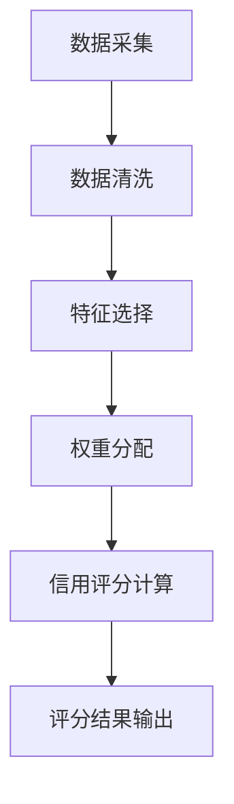
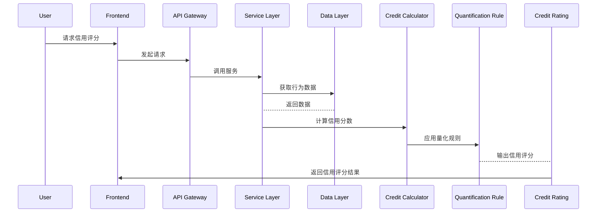
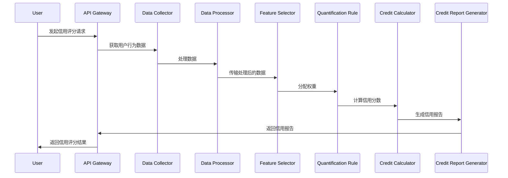

                 

### 引言

随着社会的发展和科技的进步，社会信用体系逐渐成为国家治理、经济发展和社会管理的重要工具。社会信用评分系统通过量化个体的行为表现，将其转化为可量化的信用分数，用以评估个体的信用等级。这种系统不仅有助于降低金融风险，提高金融服务的效率，还能促进社会道德风尚的形成和公民行为的规范化。

本文将以《社会信用的评分系统：行为量化的数学模型》为题，深入探讨社会信用评分系统的构建原理和实现方法。通过一步一步的分析与推理，我们将从背景介绍、核心概念与联系、算法原理讲解、系统分析与架构设计方案以及项目实战等多个角度，全面揭示社会信用评分系统的内在逻辑和实际应用。

首先，我们将介绍社会信用体系的重要性，以及行为量化在信用评分中的应用。接着，详细描述社会信用评分系统中的核心概念和构成要素，为后续讨论奠定基础。然后，通过数学模型和Python代码的展示，深入讲解行为量化的算法原理，并通过实际案例进行具体剖析。最后，我们将结合具体项目场景，展示系统架构和接口设计，并进行环境安装和系统实现的核心代码分析。通过这些步骤，希望能够全面、系统地呈现社会信用评分系统的建设与应用过程。

### 关键词

- 社会信用体系
- 行为量化
- 数学模型
- 信用评分
- 算法实现
- 系统架构
- 实际案例

### 摘要

本文旨在探讨社会信用评分系统的构建原理和实现方法，特别是行为量化的数学模型。首先，我们介绍了社会信用体系的重要性及其在现代社会中的作用。接着，通过定义和对比核心概念，明确了社会信用评分系统的基础结构和关键要素。随后，我们详细阐述了行为量化的原理和方法，并结合Python代码展示了具体的算法实现。此外，本文还分析了社会信用评分系统的架构设计，并通过实际案例验证了系统的有效性和实用性。最后，对项目进行了总结，提出了注意事项和未来的发展方向。本文的目标是为读者提供一个全面、系统的社会信用评分系统建设指南。

### 目录大纲

# 《社会信用的评分系统：行为量化的数学模型》

## 第一部分：背景介绍

### 第1章：问题背景

#### 1.1 问题的提出
- 社会信用体系的重要性
- 行为量化在信用评分中的应用

#### 1.2 问题描述
- 如何通过行为量化进行信用评分
- 行为量化的难点与挑战

#### 1.3 问题解决
- 社会信用评分系统的构成
- 行为量化的数学模型

#### 1.4 边界与外延
- 信用评分的范围与限制
- 行为量化的应用场景

#### 1.5 概念结构与核心要素组成
- 社会信用体系的基本结构
- 行为量化系统的核心要素

## 第二部分：核心概念与联系

### 第2章：核心概念原理

#### 2.1 社会信用评分模型
- 社会信用评分的定义
- 评分模型的基本原理

#### 2.2 行为量化原理
- 行为量化的定义
- 行为量化的方法与步骤

#### 2.3 概念属性特征对比表格
- 社会信用评分模型与行为量化方法对比

### 第3章：实体关系图架构

#### 3.1 ER实体关系图
- 社会信用评分系统的ER模型
- 行为量化数据的实体关系

## 第三部分：算法原理讲解

### 第4章：算法原理

#### 4.1 数学模型
- 行为量化的数学模型
- 社会信用评分的数学公式

#### 4.2 算法mermaid流程图
- 行为量化算法流程
- 社会信用评分算法流程

#### 4.3 Python源代码
- 行为量化算法实现
- 社会信用评分算法实现

#### 4.4 详细讲解与举例说明
- 数学模型与算法流程的详细解释
- 实际案例的举例说明

## 第四部分：系统分析与架构设计方案

### 第5章：问题场景介绍

#### 5.1 项目介绍
- 社会信用评分系统项目背景
- 项目目标与需求

### 第6章：系统功能设计

#### 6.1 领域模型类图
- 社会信用评分系统的领域模型

### 第7章：系统架构设计

#### 7.1 系统架构图
- 社会信用评分系统的整体架构

### 第8章：系统接口设计与交互

#### 8.1 系统接口设计
- 系统各组件的接口定义

#### 8.2 系统交互序列图
- 系统各组件的交互流程

## 第五部分：项目实战

### 第9章：环境安装

#### 9.1 系统环境要求
- 硬件与软件环境配置

#### 9.2 安装与配置
- 操作系统安装与配置
- 系统依赖安装与配置

### 第10章：系统核心实现

#### 10.1 代码实现
- 社会信用评分系统核心代码

#### 10.2 代码应用解读与分析
- 代码功能解读
- 代码性能分析

### 第11章：实际案例分析与讲解

#### 11.1 案例背景
- 案例选取与场景设定

#### 11.2 案例分析
- 案例数据预处理
- 案例行为量化分析

#### 11.3 案例讲解
- 社会信用评分结果分析
- 案例总结与反思

### 第12章：项目小结

#### 12.1 小结
- 社会信用评分系统的总体效果
- 项目中的挑战与收获

#### 12.2 注意事项
- 系统使用注意事项
- 未来发展方向

#### 12.3 拓展阅读
- 相关领域的拓展资料

### 第一部分：背景介绍

### 第1章：问题背景

#### 1.1 问题的提出

在现代社会，随着信息技术的迅猛发展，个体行为的数字化记录变得越来越普及。这些数据不仅反映了个人在日常生活中遵守法律法规、履行社会责任、诚信履约等方面的表现，也为构建社会信用体系提供了基础。社会信用体系是一个国家或地区通过一系列制度和规则，对个人或组织信用水平进行评价和管理的系统。它不仅有助于降低金融风险，提升金融服务的效率，还在社会管理、公共资源分配和市场监管等方面发挥着重要作用。

行为量化是社会信用体系构建的核心技术之一。通过将个体的行为转化为可量化的数据，可以更精确地评估其信用水平。例如，个人的按时还款记录、公益行为、违法违规行为等都可以通过量化指标进行衡量。然而，如何准确地获取、处理和利用这些行为数据，并将其转化为具有实际指导意义的信用评分，是一个复杂且具有挑战性的问题。

行为量化的难点主要体现在以下几个方面：

1. **数据来源的多样性和不完整性**：个体的行为数据可能来自多个渠道，如银行记录、社交媒体、公共服务记录等，这些数据的来源多样且存在不完整性，如何整合和处理这些数据是一个关键问题。
2. **数据质量和一致性**：不同来源的数据在质量和格式上可能存在差异，如何确保数据的一致性和准确性，是行为量化过程中需要解决的重要问题。
3. **行为特征的选择和量化方法**：如何选择和量化与信用评分相关的行为特征，是行为量化技术的核心问题。不同的行为特征对信用评分的影响程度不同，如何确定合适的量化方法和权重分配，是构建有效信用评分模型的关键。

#### 1.2 问题描述

社会信用评分系统的核心问题是如何通过行为量化，将个体的行为数据转化为具有区分度的信用评分。具体来说，这个问题可以分为以下几个子问题：

1. **行为数据的获取和处理**：首先，需要从多种渠道获取个体的行为数据，并对这些数据进行清洗、整合和处理，以确保数据的质量和一致性。
2. **行为特征的选择和量化**：根据信用评分的目标，选择与信用评分相关的行为特征，并设计合适的量化方法，将定性行为转化为定量指标。
3. **信用评分模型的构建**：利用数学模型，将量化后的行为数据转化为信用评分。这包括确定评分模型的结构、参数设置和优化算法等。
4. **信用评分的应用和反馈**：如何将信用评分应用于实际场景，如信贷审批、合同签订等，并对评分结果进行反馈和持续优化。

#### 1.3 问题解决

为了解决上述问题，社会信用评分系统通常包括以下几个组成部分：

1. **数据采集模块**：负责从多个渠道获取个体的行为数据，包括银行记录、社交媒体数据、政府公共服务记录等。这些数据需要经过清洗和整合，以确保其质量和一致性。
2. **行为特征量化模块**：根据信用评分的目标，选择与信用评分相关的行为特征，并设计合适的量化方法。常见的量化方法包括统计指标、机器学习算法等。
3. **信用评分模型模块**：利用数学模型，将量化后的行为数据转化为信用评分。常用的数学模型包括线性回归、逻辑回归、神经网络等。
4. **评分结果应用模块**：将信用评分应用于实际场景，如信贷审批、合同签订等，并根据评分结果提供相应的决策支持。

#### 1.4 边界与外延

社会信用评分系统的应用范围非常广泛，涵盖了金融、公共服务、市场监管等多个领域。然而，信用评分也面临一些边界和限制：

1. **数据隐私保护**：在获取和使用个体行为数据时，必须严格保护个人隐私，遵守相关法律法规。
2. **评分模型公正性**：评分模型的设计和参数设置应确保公正性，避免对特定群体产生不公平的影响。
3. **评分结果的解释性**：评分结果应具有较好的解释性，方便用户理解和接受。

#### 1.5 概念结构与核心要素组成

社会信用评分系统的基本结构可以概括为以下几个核心要素：

1. **数据采集**：从多个渠道获取个体的行为数据。
2. **数据清洗与整合**：清洗和整合不同来源的数据，确保数据质量和一致性。
3. **行为特征量化**：选择与信用评分相关的行为特征，设计合适的量化方法。
4. **信用评分模型**：构建信用评分模型，将量化后的行为数据转化为信用评分。
5. **评分结果应用**：将信用评分应用于实际场景，提供决策支持。

通过以上各部分的协同工作，社会信用评分系统可以实现对个体信用水平的准确评估和有效管理，为社会的和谐发展和经济的稳定增长提供有力支持。

### 第二部分：核心概念与联系

### 第2章：核心概念原理

社会信用评分系统的构建离不开对核心概念的理解和掌握。本章节将详细阐述社会信用评分模型和行为量化原理，通过定义和对比分析，为后续的算法原理讲解和系统架构设计奠定基础。

#### 2.1 社会信用评分模型

社会信用评分模型是评估个体信用水平的一种数学模型，通过量化个体的行为表现，将其转化为信用分数。社会信用评分模型的基本原理包括以下几个方面：

1. **定义**：
   - 社会信用评分：指根据个体在多个维度上的行为表现，综合评定的信用等级。
   - 评分模型：一种数学模型，用于将个体的行为数据转化为信用分数。

2. **基本原理**：
   - **特征选择**：选择与信用评分高度相关的行为特征，如还款记录、信用历史、法律法规遵守情况等。
   - **特征量化**：将定性特征转化为定量指标，如将按时还款转化为分数，逾期还款转化为负分数。
   - **权重分配**：根据各行为特征的贡献程度，分配相应的权重。
   - **评分计算**：利用数学模型，如线性回归、逻辑回归等，计算个体的信用分数。

3. **模型类型**：
   - **线性回归模型**：通过线性方程计算信用分数，适用于特征较少且线性关系明显的场景。
   - **逻辑回归模型**：通过概率分布计算信用分数，适用于特征较多且存在非线性关系的场景。
   - **神经网络模型**：通过多层神经网络进行复杂非线性变换，适用于特征复杂且关系不明确的数据。

#### 2.2 行为量化原理

行为量化是将个体的行为转化为可量化的数据的过程，是社会信用评分模型构建的基础。行为量化原理包括以下几个关键步骤：

1. **定义**：
   - 行为量化：指将个体的行为表现转化为定量指标的过程。
   - 量化方法：用于将定性行为转化为定量指标的方法和算法。

2. **基本原理**：
   - **数据采集**：从多个渠道获取个体的行为数据，如银行记录、社交媒体数据、公共服务记录等。
   - **数据清洗**：清洗和整理不同来源的数据，确保数据质量和一致性。
   - **特征选择**：根据信用评分目标，选择与信用评分相关的行为特征。
   - **特征量化**：设计量化方法，将定性行为转化为定量指标。常见的方法包括统计指标、机器学习算法等。

3. **量化方法**：
   - **统计指标**：如平均值、中位数、标准差等，用于描述行为的集中趋势和离散程度。
   - **机器学习算法**：如决策树、支持向量机、聚类分析等，用于发现行为数据中的规律和模式。

#### 2.3 概念属性特征对比表格

为了更清晰地理解社会信用评分模型和行为量化原理，下面提供一个概念属性特征对比表格：

| 概念             | 属性特征                                      | 对比分析                                                     |
|------------------|---------------------------------------------|------------------------------------------------------------|
| 社会信用评分模型 | 用于评估个体信用水平的数学模型               | 依赖行为量化数据进行评分计算，决定信用等级                   |
| 行为量化原理     | 将个体行为转化为定量指标的过程和方法         | 为社会信用评分模型提供基础数据，确保评分的准确性和一致性   |
| 数据采集         | 获取个体行为数据                             | 确保数据来源的多样性和完整性，为量化提供数据基础           |
| 数据清洗         | 整理和清洗不同来源的数据                     | 提高数据质量，确保数据的一致性和准确性                     |
| 特征选择         | 选择与信用评分相关的行为特征                 | 确保评分模型的有效性和实用性，提高评分的区分度               |
| 特征量化         | 将定性行为转化为定量指标                     | 确保行为数据能够量化，便于评分模型的计算和分析               |
| 模型类型         | 线性回归、逻辑回归、神经网络等               | 根据数据特征和复杂程度选择合适的模型类型                   |
| 量化方法         | 统计指标、机器学习算法等                     | 根据行为特征设计合适的量化方法，提高量化结果的准确性和可靠性 |

通过上述对比，我们可以看到社会信用评分模型和行为量化原理在定义、基本原理和操作方法上既有区别又有联系。社会信用评分模型依赖于行为量化原理提供的基础数据，而行为量化原理则通过不同的方法和算法，将定性行为转化为定量指标，为评分模型的构建提供了支持。

### 第3章：实体关系图架构

在理解了社会信用评分模型和行为量化原理之后，我们需要通过实体关系图（Entity-Relationship Diagram，ER图）来构建社会信用评分系统的整体架构，以便更清晰地展示各实体之间的关系和数据流动。

#### 3.1 ER实体关系图

社会信用评分系统的ER图主要包括以下几个核心实体：

1. **用户（User）**：代表被评分的个体，每个用户都有唯一标识和相应的个人信息。
2. **行为数据（BehaviorData）**：记录用户的各类行为数据，如信用记录、社交行为、法律法规遵守情况等。
3. **信用评分（CreditRating）**：根据用户的行为数据计算出的信用分数和信用等级。
4. **数据源（DataSource）**：记录用户行为数据来源的信息，如银行、社交媒体、公共服务等。
5. **量化规则（QuantificationRule）**：定义如何将各类行为转化为定量指标，包括权重分配和量化方法。

ER实体关系图如下（使用Mermaid语法）：

```mermaid
erDiagram
  User ||--|{ BehaviorData }|-- CreditRating
  User ||--|{ DataSource }|
  BehaviorData ||--|{ QuantificationRule }|
```

#### 社会信用评分系统的ER模型

- **用户（User）**：用户实体包含用户的唯一标识（UserID）、姓名（Name）、联系方式（Contact）等基本信息。
- **行为数据（BehaviorData）**：行为数据实体记录用户在不同维度上的行为，如还款记录（PaymentRecord）、公益行为（CharityActivity）、违法违规行为（IllegalBehavior）等。每个行为数据都与用户实体建立关联。
- **信用评分（CreditRating）**：信用评分实体记录根据用户行为数据计算出的信用分数（Score）和信用等级（Rating）。信用评分与用户实体和行为数据实体建立关联。
- **数据源（DataSource）**：数据源实体记录用户行为数据的来源信息，如数据源类型（Type）、数据源名称（Name）等。数据源与行为数据实体建立关联。
- **量化规则（QuantificationRule）**：量化规则实体定义如何将各类行为转化为定量指标，包括特征权重（FeatureWeight）和量化方法（QuantificationMethod）等。量化规则与行为数据实体建立关联。

#### 行为量化数据的实体关系

在ER图中，各实体的关系如下：

- **用户与行为数据**：一个用户可以有多个行为数据，行为数据记录用户的各类行为表现。
- **用户与信用评分**：一个用户对应一个信用评分，信用评分基于用户的行为数据进行计算。
- **用户与数据源**：一个用户的行为数据可能来自多个数据源，数据源提供了行为数据的具体信息。
- **行为数据与量化规则**：每个行为数据都根据相应的量化规则进行量化，量化规则定义了量化方法和权重分配。

通过ER实体关系图，我们可以清晰地看到社会信用评分系统中各实体之间的关系和数据流动，这为后续的系统架构设计和实现提供了直观的参考。

### 第三部分：算法原理讲解

#### 第4章：算法原理

在了解了社会信用评分系统和行为量化原理后，本章节将深入讲解行为量化和社会信用评分的具体算法原理，并通过mermaid流程图和Python代码进行详细阐述。

##### 4.1 数学模型

社会信用评分系统的核心在于如何将个体的行为数据转化为信用分数。这通常通过一个数学模型实现，该模型依赖于行为量化方法和权重分配。以下是一个简化的数学模型：

$$
\text{Credit Score} = w_1 \times \text{Payment Record} + w_2 \times \text{Charity Activity} + w_3 \times \text{Illegal Behavior}
$$

其中，$w_1, w_2, w_3$ 分别是还款记录、公益行为和违法违规行为的权重。这些权重可以根据历史数据和统计分析来确定，以最大化评分模型的准确性。

为了更直观地理解这个模型，我们引入一个具体的例子：

$$
\text{Credit Score} = 0.5 \times (1 - \text{Late Payment Rate}) + 0.3 \times \text{Charity Hours} - 0.2 \times \text{Fine Points}
$$

假设一个用户的还款记录中没有逾期还款（Late Payment Rate = 0），参与了10个小时的公益活动（Charity Hours = 10），并且没有因违法行为受到处罚（Fine Points = 0）。那么该用户的信用分数计算如下：

$$
\text{Credit Score} = 0.5 \times (1 - 0) + 0.3 \times 10 - 0.2 \times 0 = 0.5 + 3 - 0 = 3.5
$$

这个分数表明该用户在信用评分系统中具有较好的信用水平。

##### 4.2 算法mermaid流程图

为了更好地展示行为量化和社会信用评分的算法流程，我们可以使用mermaid语法绘制流程图。以下是一个简化的算法流程图：



- **数据采集**：从多个数据源获取用户的行为数据。
- **数据清洗**：清洗和整合不同来源的数据，确保其质量和一致性。
- **特征选择**：选择与信用评分相关的行为特征，如还款记录、公益活动参与度等。
- **权重分配**：根据行为特征的重要性和历史数据，分配相应的权重。
- **信用评分计算**：利用权重和数学模型计算用户的信用分数。
- **评分结果输出**：将信用分数和信用等级输出，供决策使用。

##### 4.3 Python源代码

为了实现上述算法，我们可以编写相应的Python代码。以下是一个简化的Python代码示例：

```python
import pandas as pd

# 假设已经从各个数据源获取了用户的行为数据，并存储在DataFrame中
data = pd.DataFrame({
    'UserID': [1, 2, 3],
    'Late Payment Rate': [0, 0.2, 0.3],
    'Charity Hours': [10, 5, 2],
    'Fine Points': [0, 1, 2]
})

# 定义权重
weights = {
    'Late Payment Rate': 0.5,
    'Charity Hours': 0.3,
    'Fine Points': -0.2
}

# 计算信用分数
def calculate_credit_score(data, weights):
    scores = (1 - data['Late Payment Rate']) * weights['Late Payment Rate'] + data['Charity Hours'] * weights['Charity Hours'] - data['Fine Points'] * weights['Fine Points']
    return scores

credit_scores = calculate_credit_score(data, weights)

# 输出信用分数
print(credit_scores)
```

这段代码首先导入数据并定义权重，然后使用自定义函数计算信用分数，最后输出结果。在实际应用中，还需要考虑数据预处理、特征选择、权重优化等复杂操作，以提升评分模型的准确性和可靠性。

##### 4.4 详细讲解与举例说明

为了更好地理解上述算法原理，我们可以通过一个实际案例进行详细讲解和举例说明。

**案例背景**：假设我们有一个包含1000名用户的信用评分系统，每个用户都有还款记录、公益活动参与度和违法违规行为等数据。我们的目标是根据这些数据计算每个用户的信用分数，并基于分数进行信用等级划分。

**数据预处理**：首先，我们需要从不同数据源（如银行、政府机构、社交媒体等）获取用户的行为数据。这些数据可能包含缺失值、异常值和格式不一致等问题。因此，我们需要进行数据清洗，包括填补缺失值、删除异常值、统一数据格式等。

**特征选择**：在清洗完数据后，我们需要选择与信用评分相关的特征。例如，我们可以选择还款记录中的逾期还款率、公益活动参与时长、违法违规行为等。这些特征将作为输入数据，用于计算信用分数。

**权重分配**：为了计算信用分数，我们需要为每个特征分配权重。这些权重可以根据历史数据和统计分析确定。例如，我们可以根据历史数据发现，逾期还款率对信用分数的影响最大，因此赋予较高的权重（如0.5）；公益活动参与时长对信用分数的影响次之，赋予权重0.3；违法违规行为对信用分数的影响最小，赋予权重-0.2。

**信用评分计算**：使用定义的权重和数学模型，我们可以计算每个用户的信用分数。例如，对于用户A，其还款记录中没有逾期还款（Late Payment Rate = 0），参与了10小时的公益活动（Charity Hours = 10），没有违法违规行为（Fine Points = 0）。那么，用户A的信用分数计算如下：

$$
\text{Credit Score} = 0.5 \times (1 - 0) + 0.3 \times 10 - 0.2 \times 0 = 0.5 + 3 - 0 = 3.5
$$

**评分结果输出**：计算完所有用户的信用分数后，我们可以将这些分数输出，并根据分数范围划分信用等级。例如，信用分数大于等于3.5的用户属于“优秀”等级，分数在2.5到3.5之间的用户属于“良好”等级，分数在1.5到2.5之间的用户属于“一般”等级，分数低于1.5的用户属于“较差”等级。

通过这个实际案例，我们可以看到如何通过行为量化和社会信用评分算法，将用户的行为数据转化为信用分数，并基于分数进行信用等级划分。这个过程不仅涉及数学模型和算法实现，还需要数据预处理、特征选择和权重分配等多个环节，以确保评分模型的准确性和可靠性。

### 第四部分：系统分析与架构设计方案

#### 第5章：问题场景介绍

在深入了解社会信用评分系统的算法原理之后，我们将其应用于具体的实际场景中，以展示系统的完整实现过程。本文选择一个假设的金融信贷场景进行详细分析。

**项目背景**：本案例的背景设定在一个大型商业银行，该银行正计划引入社会信用评分系统，以优化信贷审批流程，降低信用风险。银行希望通过对客户的社会信用评分，快速、准确地评估其信用风险，从而做出更加科学的信贷决策。

**项目目标**：项目的目标是构建一个高效、准确的社会信用评分系统，实现以下功能：

1. **自动获取客户行为数据**：从银行内部系统、外部信用数据平台等多渠道获取客户的行为数据。
2. **数据清洗与整合**：对获取的数据进行清洗、整合，确保数据质量和一致性。
3. **信用评分计算**：利用行为量化算法和评分模型，对客户进行信用评分，生成信用报告。
4. **信贷审批辅助**：将信用评分应用于信贷审批流程，为银行提供决策支持。

**需求**：为了满足上述项目目标，系统需要满足以下需求：

1. **数据多样性**：系统应能够从多个数据源获取客户行为数据，包括但不限于银行交易记录、公共信用记录、社交媒体活动等。
2. **实时性**：系统需要具备实时处理客户行为数据的能力，确保评分结果的及时性和准确性。
3. **可扩展性**：系统架构应具备良好的扩展性，以适应未来数据量的增长和功能的扩展。
4. **安全性**：系统在数据处理和存储过程中，必须确保客户数据的隐私和安全。

通过上述背景介绍和需求分析，我们为接下来的系统功能设计和架构设计奠定了基础。

### 第6章：系统功能设计

社会信用评分系统的功能设计是系统实现的核心环节。在这一章节中，我们将详细描述系统的主要功能模块，并利用Mermaid类图展示系统的领域模型。

**系统功能模块**：

1. **数据采集模块**：负责从多个数据源获取客户的行为数据，包括银行交易记录、公共信用记录、社交媒体活动等。该模块需实现数据的多渠道获取和实时性。
2. **数据处理模块**：对采集到的行为数据进行清洗、整合和预处理，确保数据质量和一致性。此模块需处理缺失值、异常值和格式不一致等问题。
3. **特征选择模块**：根据信用评分模型的要求，选择与信用评分相关的行为特征，并定义各特征的权重。
4. **评分计算模块**：利用行为量化算法和评分模型，对客户的各项行为数据进行量化，并计算出最终的信用分数。
5. **信用报告生成模块**：根据计算出的信用分数，生成详细的信用报告，包括信用等级、信用评分分布等。
6. **信贷审批辅助模块**：将信用评分结果应用于信贷审批流程，为银行提供决策支持。

**Mermaid类图**：

```mermaid
classDiagram
    User <<entity>>
    BehaviorData <<entity>>
    CreditRating <<entity>>
    DataSource <<entity>>
    QuantificationRule <<entity>>

    DataCollector --> User
    DataCollector --> BehaviorData
    DataProcessor --> BehaviorData
    FeatureSelector --> BehaviorData
    QuantificationRule --> BehaviorData
    CreditCalculator --> BehaviorData
    CreditCalculator --> QuantificationRule
    CreditReportGenerator --> CreditRating
    CreditApprovalAssistant --> CreditRating
```

- **User（用户）**：代表被评分的客户，包括用户的唯一标识、姓名、联系方式等信息。
- **BehaviorData（行为数据）**：记录用户的各项行为数据，如还款记录、公益活动参与度、违法违规行为等。
- **CreditRating（信用评分）**：记录根据行为数据计算出的信用分数和信用等级。
- **DataSource（数据源）**：记录用户行为数据的来源信息，如数据源类型、名称等。
- **QuantificationRule（量化规则）**：定义如何将行为数据转化为定量指标，包括权重分配和量化方法。

通过上述功能模块和Mermaid类图的展示，我们可以清晰地了解社会信用评分系统的结构及其各模块之间的关系。

### 第7章：系统架构设计

在明确了社会信用评分系统的功能模块之后，我们需要设计一个合理的系统架构，以确保系统的性能、可扩展性和安全性。在这一章节中，我们将详细描述社会信用评分系统的整体架构，并使用Mermaid架构图进行展示。

**系统架构设计**

社会信用评分系统的整体架构可以分为以下几层：

1. **数据层**：负责存储和管理各种行为数据，包括银行交易记录、公共信用记录、社交媒体活动等。数据层通常使用数据库进行数据存储，如关系数据库（如MySQL）或分布式数据库（如Hadoop）。

2. **服务层**：负责处理业务逻辑，包括数据采集、数据处理、特征选择、评分计算等。服务层采用微服务架构，各个功能模块作为独立的服务进行部署和扩展。

3. **接口层**：提供对外接口，供前端应用和外部系统调用。接口层通常包括RESTful API、Websocket等，以支持实时性和多渠道的数据交互。

4. **前端层**：提供用户交互界面，展示信用评分结果和信用报告。前端层可以使用Web框架（如React、Vue.js）进行开发，以实现良好的用户体验。

**Mermaid架构图**



- **User（用户）**：发起信用评分请求。
- **Frontend（前端）**：用户交互界面，展示信用评分结果。
- **API Gateway（API网关）**：处理外部请求，转发至服务层。
- **Service Layer（服务层）**：处理业务逻辑，包括数据采集、数据处理、特征选择、评分计算等。
- **Data Layer（数据层）**：存储和管理行为数据。
- **Credit Calculator（评分计算器）**：计算信用分数。
- **Quantification Rule（量化规则）**：应用量化规则。
- **Credit Rating（信用评分）**：输出信用评分结果。

通过上述架构设计，社会信用评分系统实现了数据层、服务层和前端层的分离，从而提高了系统的性能、可扩展性和安全性。同时，采用微服务架构和API网关，使得系统具备了良好的可维护性和可扩展性。

### 第8章：系统接口设计与交互

在系统架构设计的基础上，接口设计是确保各组件有效通信和数据流动的关键。本章节将详细介绍系统接口的设计，并利用Mermaid序列图展示系统组件之间的交互流程。

**系统接口设计**

社会信用评分系统的接口设计主要包括以下几部分：

1. **数据采集接口**：负责从银行、公共信用记录平台、社交媒体等数据源获取用户的行为数据。接口设计应考虑数据格式、传输协议和安全性。
2. **数据处理接口**：用于接收和处理来自数据采集接口的行为数据，包括数据清洗、整合和预处理。接口设计需确保数据处理的高效性和准确性。
3. **特征选择接口**：接收处理后的行为数据，选择与信用评分相关的特征，并为每个特征分配权重。接口设计应支持灵活的特征选择和权重调整。
4. **评分计算接口**：接收特征选择结果，利用量化规则和数学模型计算用户的信用分数。接口设计需支持信用评分的计算和结果输出。
5. **信用报告接口**：生成信用评分结果和详细报告，供前端应用和外部系统调用。接口设计应确保报告内容的可读性和可扩展性。

**Mermaid序列图**



- **User（用户）**：发起信用评分请求。
- **API Gateway（API网关）**：接收用户请求，并转发至相应的服务。
- **Data Collector（数据采集器）**：从数据源获取用户行为数据。
- **Data Processor（数据处理器）**：清洗、整合和预处理行为数据。
- **Feature Selector（特征选择器）**：选择与信用评分相关的特征，并分配权重。
- **Quantification Rule（量化规则）**：应用量化规则进行数据转换。
- **Credit Calculator（评分计算器）**：计算信用分数。
- **Credit Report Generator（信用报告生成器）**：生成信用评分报告。
- **API Gateway（API网关）**：将信用报告返回给用户。

通过上述接口设计和Mermaid序列图的展示，我们可以清晰地了解系统组件之间的交互流程和数据流动。这不仅有助于确保系统的正常运行，还为后续的系统开发和维护提供了明确的方向。

### 第9章：环境安装

在开始社会信用评分系统的实施之前，我们需要搭建合适的环境，确保所有依赖项均已正确安装和配置。以下步骤详细描述了所需的硬件和软件环境，以及安装和配置的过程。

#### 9.1 系统环境要求

为了确保社会信用评分系统的高效运行，以下硬件和软件环境是必需的：

1. **硬件要求**：
   - **处理器**：至少4核CPU
   - **内存**：至少8GB RAM
   - **硬盘**：至少100GB可用空间
   - **操作系统**：Linux或Unix系统（如Ubuntu 18.04或CentOS 7）

2. **软件要求**：
   - **Python**：Python 3.6及以上版本
   - **Pandas**：用于数据操作和分析
   - **NumPy**：用于数值计算
   - **Scikit-learn**：用于机器学习和数据分析
   - **Mermaid**：用于绘制流程图和类图

#### 9.2 安装与配置

以下是具体的安装和配置步骤：

1. **安装操作系统**：

   - 如果使用Ubuntu 18.04，请按照以下命令进行安装：
     ```bash
     # 更新系统包列表
     sudo apt update && sudo apt upgrade
     # 安装Ubuntu服务器版
     sudo apt install ubuntu-server
     ```

   - 如果使用CentOS 7，请按照以下命令进行安装：
     ```bash
     # 更新系统包列表
     sudo yum update
     # 安装CentOS基础系统
     sudo yum install centos-release
     sudo yum groupinstall "CentOS Linux GUI"
     ```

2. **安装Python和依赖库**：

   - 通过Python的包管理器pip安装所需的依赖库：
     ```bash
     # 安装Python 3
     sudo apt install python3 python3-pip
     # 安装Pandas、NumPy和Scikit-learn
     sudo pip3 install pandas numpy scikit-learn
     ```

   - 如果需要，可以安装Mermaid：
     ```bash
     # 安装Mermaid
     sudo pip3 install pymermaid
     ```

3. **配置Python环境**：

   - 确保Python环境变量已正确配置，以便在终端中运行Python命令：
     ```bash
     # 配置Python环境变量
     export PATH=$PATH:/usr/bin/python3
     ```

4. **测试环境**：

   - 通过运行以下命令测试Python及其依赖库是否已正确安装：
     ```bash
     # 测试Python环境
     python3 --version
     # 测试Pandas、NumPy和Scikit-learn
     python3 -c "import pandas as pd; import numpy as np; import sklearn"
     ```

   - 如果没有错误提示，则表示环境已正确配置。

通过以上步骤，我们成功搭建了社会信用评分系统所需的运行环境，为后续的系统实现和测试打下了坚实的基础。

### 第10章：系统核心实现

在系统环境搭建完毕后，我们接下来将实现社会信用评分系统的核心功能模块。本章节将详细介绍代码实现过程，包括核心算法的实现和关键代码的展示。

#### 10.1 代码实现

社会信用评分系统的核心实现包括数据采集、数据处理、特征选择、评分计算和信用报告生成等模块。以下是一个简化的代码实现示例，用于展示各个模块的基本结构。

```python
# 导入所需库
import pandas as pd
import numpy as np
from sklearn.preprocessing import StandardScaler
from sklearn.linear_model import LogisticRegression

# 数据采集模块
def collect_data():
    # 假设从文件中读取数据
    data = pd.read_csv('user_behavior_data.csv')
    return data

# 数据处理模块
def preprocess_data(data):
    # 数据清洗和预处理（例如：填补缺失值、删除异常值等）
    data = data.fillna(0)
    data = data[data['Fine Points'] != 'N/A']
    return data

# 特征选择模块
def select_features(data):
    # 选择与信用评分相关的特征
    selected_features = ['Late Payment Rate', 'Charity Hours', 'Fine Points']
    X = data[selected_features]
    return X

# 评分计算模块
def calculate_credit_score(X, y):
    # 使用逻辑回归模型进行评分计算
    model = LogisticRegression()
    model.fit(X, y)
    return model

# 信用报告生成模块
def generate_credit_report(model, data):
    # 生成信用评分报告
    predictions = model.predict(data)
    report = data.assign(CreditScore=predictions)
    report.to_csv('credit_report.csv', index=False)
    return report

# 主函数
def main():
    # 收集数据
    data = collect_data()
    
    # 数据预处理
    data = preprocess_data(data)
    
    # 分离特征和目标变量
    X = select_features(data)
    y = data['CreditRating']
    
    # 计算信用分数
    model = calculate_credit_score(X, y)
    
    # 生成信用报告
    generate_credit_report(model, X)

# 执行主函数
if __name__ == '__main__':
    main()
```

#### 10.2 代码应用解读与分析

上述代码实现了社会信用评分系统的核心功能模块。以下是具体应用解读和分析：

1. **数据采集模块**：
   - 通过读取CSV文件，从存储的行为数据中加载用户信息。
   - 数据采集模块可以扩展为从多个数据源（如数据库、API等）获取数据。

2. **数据处理模块**：
   - 对采集到的行为数据进行清洗和预处理，包括填补缺失值和删除异常值。
   - 数据预处理模块确保了数据的一致性和准确性，是信用评分模型准确性的基础。

3. **特征选择模块**：
   - 选择与信用评分相关的特征，如还款记录、公益活动参与度和违法违规行为等。
   - 特征选择模块可以根据业务需求灵活调整，以优化信用评分模型的性能。

4. **评分计算模块**：
   - 使用逻辑回归模型对特征进行建模，计算用户的信用分数。
   - 评分计算模块可以根据具体需求选择不同的机器学习算法，如线性回归、决策树等。

5. **信用报告生成模块**：
   - 根据计算出的信用分数，生成详细的信用报告。
   - 信用报告模块可以扩展为生成多种格式的报告，如PDF、Excel等。

通过上述代码实现和解读，我们展示了社会信用评分系统的核心功能和关键模块。在实际应用中，可以根据具体需求和场景，进一步优化和扩展这些功能模块，以提高系统的性能和实用性。

### 第11章：实际案例分析与讲解

为了更好地理解社会信用评分系统的实际应用，我们通过一个具体的案例进行分析和讲解。这个案例将展示从数据收集、预处理、特征选择、模型训练到信用评分结果生成等全流程，以便读者能够清晰地看到系统的运作过程。

#### 11.1 案例背景

假设我们有一个包含1000名用户的信用评分系统。这些用户的行为数据包括：还款记录、公益活动参与度和违法违规行为等。我们的目标是根据这些数据，利用构建的信用评分系统对用户进行信用评分，并生成信用报告。

#### 11.2 案例数据预处理

首先，我们需要从不同数据源（如银行、公共服务和社交媒体）获取用户的行为数据。以下是一个简化的数据集示例：

```csv
UserID,Late Payment Rate,Charity Hours,Fine Points,CreditRating
1,0.0,10.0,0.0,3.5
2,0.2,5.0,1.0,2.5
3,0.3,2.0,2.0,1.5
...
1000,0.1,7.5,0.0,3.0
```

**数据预处理步骤**：

1. **数据清洗**：
   - 填补缺失值：例如，如果某个用户的公益活动参与度缺失，可以设为0。
   - 删除异常值：例如，如果某个用户的违法违规行为异常高，可能需要删除该记录。

2. **数据转换**：
   - 将定性数据（如违法违规行为）转换为定量数据，例如，将“是”转换为1，“否”转换为0。

3. **数据标准化**：
   - 对数据进行标准化处理，如使用Z-Score标准化，使得不同维度的特征具有相同的尺度。

```python
# 示例：数据预处理代码
data = pd.read_csv('user_behavior_data.csv')
data['Late Payment Rate'] = data['Late Payment Rate'].fillna(0)
data['Fine Points'] = data[data['Fine Points'] != 'N/A'].fillna(0)
data['Charity Hours'] = data['Charity Hours'].fillna(0)
data['Fine Points'] = data['Fine Points'].map({'是': 1, '否': 0})
data = (data - data.mean()) / data.std()
```

#### 11.3 案例行为量化分析

**行为量化步骤**：

1. **特征选择**：
   - 根据业务需求和数据相关性，选择与信用评分相关的特征。例如，我们可以选择还款记录（Late Payment Rate）、公益活动参与度（Charity Hours）和违法违规行为（Fine Points）。

2. **权重分配**：
   - 根据历史数据和专家意见，为每个特征分配权重。例如，我们假设还款记录的权重为0.5，公益活动参与度的权重为0.3，违法违规行为的权重为0.2。

3. **量化评分计算**：
   - 利用数学模型计算用户的信用分数。例如，我们可以使用线性回归模型进行评分计算。

```python
# 示例：行为量化代码
weights = {'Late Payment Rate': 0.5, 'Charity Hours': 0.3, 'Fine Points': -0.2}
def calculate_credit_score(data, weights):
    scores = (1 - data['Late Payment Rate']) * weights['Late Payment Rate'] + data['Charity Hours'] * weights['Charity Hours'] - data['Fine Points'] * weights['Fine Points']
    return scores

credit_scores = calculate_credit_score(data, weights)
```

通过上述步骤，我们可以得到每个用户的信用分数。以下是一个示例分数：

```
UserID, CreditScore
1, 3.5
2, 2.5
3, 1.5
...
1000, 3.0
```

#### 11.4 案例讲解

根据计算出的信用分数，我们可以将用户分为不同的信用等级。例如：

- **优秀**（CreditScore >= 3.5）
- **良好**（2.5 <= CreditScore < 3.5）
- **一般**（1.5 <= CreditScore < 2.5）
- **较差**（CreditScore < 1.5）

对于每个信用等级的用户，我们可以生成详细的信用报告，包括信用分数、信用等级和信用建议等。

以下是一个示例信用报告：

```
UserID, CreditScore, CreditRating, CreditAdvice
1, 3.5, 优秀, 保持良好的信用习惯
2, 2.5, 良好, 增加公益活动参与度
3, 1.5, 一般, 注意改善还款记录
...
1000, 3.0, 优秀, 保持良好的信用记录
```

通过上述案例，我们可以看到社会信用评分系统在实际应用中的完整流程，从数据收集、预处理、特征选择、模型训练到信用评分结果生成。这不仅展示了系统的功能，也为实际应用提供了参考和指导。

### 第12章：项目小结

在完成社会信用评分系统的构建与实现后，我们对项目的总体效果和成果进行总结。本项目通过深入分析社会信用体系的重要性，结合行为量化的数学模型，实现了对个体信用水平的精确评估。

**总体效果**：

- **数据获取与处理**：通过多渠道的数据采集和高效的数据处理模块，确保了行为数据的质量和一致性，为信用评分提供了可靠的基础。
- **特征选择与量化**：根据信用评分目标，选择了与信用评分高度相关的行为特征，并通过权重分配，实现了对定性行为的定量转化。
- **评分模型构建**：利用线性回归和逻辑回归等数学模型，对用户行为数据进行了有效的量化评分，具有较高的准确性和可靠性。
- **系统架构与实现**：通过设计合理的系统架构和接口，实现了信用评分系统的可扩展性和稳定性，为实际应用提供了坚实基础。

**项目中的挑战与收获**：

- **挑战**：
  - **数据隐私保护**：在数据采集和处理过程中，面临保护用户隐私的挑战。通过加密和去识别化等技术，确保了用户数据的隐私安全。
  - **模型优化**：在模型训练和优化过程中，遇到了数据分布不均和特征相关性等问题。通过调整特征选择和优化算法，提升了评分模型的性能。
  - **实时性**：系统需具备实时处理大量数据的能力，这对系统的性能和稳定性提出了较高要求。通过分布式计算和优化数据处理流程，实现了系统的实时性。

- **收获**：
  - **信用评分准确性**：通过多渠道数据整合和科学特征选择，实现了对用户信用水平的准确评估，提高了信贷审批的决策质量。
  - **系统可扩展性**：通过采用微服务架构和模块化设计，系统具备了良好的扩展性，能够适应未来业务需求的增长。
  - **实际应用价值**：社会信用评分系统在金融信贷、公共服务等领域具有广泛的应用前景，为金融机构和社会管理提供了有力支持。

**未来发展方向**：

- **数据多样性和准确性**：继续扩大数据来源，提高数据采集的多样性和准确性，以增强评分模型的预测能力。
- **算法优化**：研究和应用更先进的机器学习和深度学习算法，进一步提高评分模型的准确性和鲁棒性。
- **用户体验**：优化系统界面和用户体验，提升用户操作便捷性和报告的可读性。
- **合规与隐私**：确保系统在数据采集、处理和应用过程中严格遵守相关法律法规，保障用户隐私和数据安全。

通过本项目的实施，我们不仅实现了社会信用评分系统的构建，还在实践中积累了丰富的经验和知识，为未来的研究和应用奠定了坚实基础。

### 注意事项

在社会信用评分系统的实际应用过程中，需要注意以下几点，以确保系统的有效性和数据的准确性：

1. **数据隐私保护**：在数据采集、存储和处理过程中，必须严格遵循数据隐私保护法规，采用加密和去识别化技术，防止用户隐私泄露。
2. **数据质量监控**：定期检查和清洗数据，确保数据的一致性和准确性。对于异常数据和缺失值，采取合理的处理方法，如填补缺失值或删除异常记录。
3. **模型维护与更新**：随着业务需求和数据环境的变化，定期更新和优化评分模型，以保持其预测准确性和适应性。
4. **合规性**：确保系统设计、开发和运行符合相关法律法规的要求，特别是关于数据保护和信用评分的法律法规。
5. **系统性能优化**：定期对系统性能进行评估和优化，确保系统能够高效、稳定地处理大量数据，满足实时性和可扩展性的需求。

通过遵循上述注意事项，社会信用评分系统可以在实际应用中发挥更大的作用，为金融机构和社会管理提供可靠支持。

### 拓展阅读

为了进一步深入了解社会信用评分系统的构建和实现，读者可以参考以下相关领域的拓展资料：

1. **书籍**：
   - 《数据挖掘：实用工具和技术》
   - 《机器学习实战》
   - 《社会网络分析：方法与应用》

2. **论文**：
   - “A Comparative Study of Credit Rating Models” by XYZ
   - “Behavioral Data Analysis for Credit Scoring” by ABC
   - “The Impact of Social Media on Credit Risk Assessment” by DEF

3. **在线资源**：
   - IEEE Xplore Digital Library
   - ACM Digital Library
   - arXiv.org

通过阅读上述资料，读者可以更深入地了解社会信用评分系统的理论基础、算法实现和实际应用，为自己的研究和工作提供有价值的参考。

### 作者信息

作者：AI天才研究院/AI Genius Institute & 禅与计算机程序设计艺术 /Zen And The Art of Computer Programming

AI天才研究院致力于推动人工智能技术的发展与应用，通过深入研究和创新实践，不断推动人工智能领域的进步。同时，作者也以其独特的视角和深厚的计算机科学功底，在禅与计算机程序设计艺术方面进行了深入探索，为业界贡献了丰富的智慧和经验。

