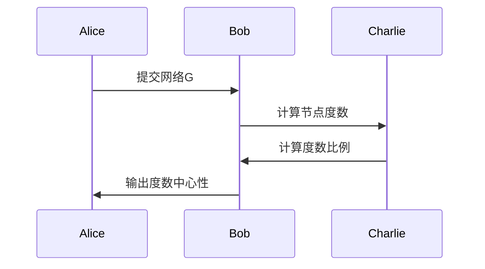
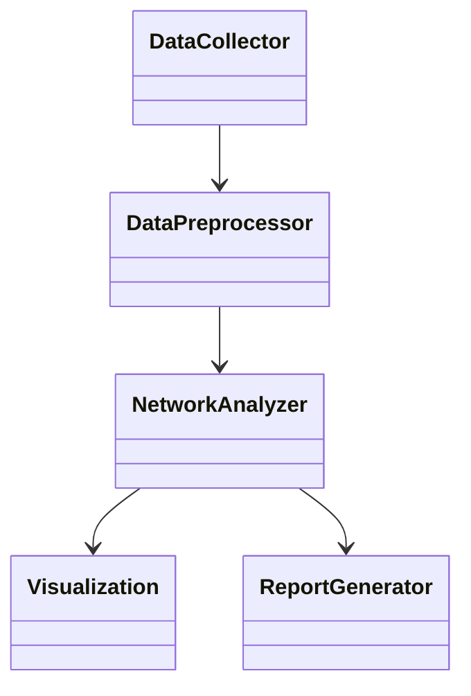
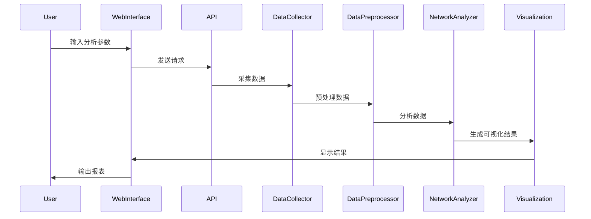

                 

```### 1.1.3 社会网络的挑战与机遇

社会网络的研究面临着诸多挑战和机遇。首先，社会网络的复杂性是首要挑战之一。社会网络中的人际关系非常复杂，涉及多重连接、交叉关系和层次结构，这使得对它们进行全面的理解和解析变得极为困难。为了处理这种复杂性，研究者们开发了各种数学模型和分析工具，如图论、矩阵理论和复杂网络理论，以帮助我们更好地理解和描述社会网络的结构和动态。

另一个挑战是数据的质量和多样性。社会网络数据通常来源于各种不同的渠道，如社交媒体、通信记录、专业网络平台等，这些数据的质量参差不齐，可能包含噪音、错误和不完整信息。因此，如何有效地清洗、整合和挖掘这些数据，成为了一个重要的课题。

然而，社会网络的研究也带来了许多机遇。随着大数据技术和人工智能的快速发展，我们能够收集和处理海量的社会网络数据，从而揭示出隐藏在数据背后的模式和规律。例如，通过分析社交网络中的信息传播路径，我们可以预测流行趋势，优化社交营销策略；通过分析组织内部网络结构，我们可以识别关键人物和关键路径，提升团队协作效率。

此外，社会网络研究在公共安全、危机管理、网络犯罪侦查等领域也有着广泛的应用前景。通过分析社会网络中的异常行为模式和关系结构，我们可以更好地预防和应对网络犯罪和社会危机。

总之，社会网络的研究既面临着巨大的挑战，也带来了丰富的机遇。通过不断探索和创新，我们有望对社会网络的结构和功能有更深入的理解，为各个领域的发展提供有力的支持。

### 1.2 问题描述

社会网络的复杂性是其研究的核心问题之一。社会网络由节点（代表个体）和边（代表个体之间的联系）组成，这种结构非常复杂，因为节点和边之间的关系可以是多层次的、动态的，并且受到外部因素的影响。例如，一个个体可能在不同的社交圈子中扮演不同的角色，而这些圈子之间可能存在交叉和重叠。此外，社会网络中的关系可能会随时间变化，这种动态性增加了分析的难度。

研究社会网络的方法多种多样，主要包括定性分析和定量分析。定性分析侧重于理解社会网络中的个体和群体行为，通过访谈、观察和案例研究等方法收集数据。定量分析则依赖于数学模型和统计分析，如网络分析、社会网络分析（SNA）和复杂网络理论。这些方法可以帮助研究者识别社会网络中的关键节点、路径和模式，从而更好地理解网络结构和动态。

社会网络的边界与外延也是一个值得探讨的课题。社会网络的边界定义了网络的覆盖范围，即哪些个体和关系被包含在分析范围内。边界的确定往往受到研究目的和资源限制的影响。例如，在一个社交媒体网络中，研究者可能只关注特定用户群体的互动，而不考虑更广泛的社会联系。另一方面，社会网络的外延则涉及到网络的扩展和连接，即如何将不同的子网络或社交圈子整合在一起，形成一个全面的社会网络视图。

综上所述，社会网络的复杂性、研究方法的多样性和边界与外延的灵活性，都为社会网络研究带来了挑战。但同时，这些特性也为我们提供了丰富的机会，通过深入分析，我们能够揭示社会网络中的隐藏模式，为社会学、心理学、管理学等领域的发展提供重要支持。

### 1.3 解决方案

为了应对社会网络的复杂性和多样性，研究者们开发了多种数学结构来描述和分析社会网络。这些数学结构主要包括图论、矩阵理论和复杂网络理论。

**图论**是描述社会网络的基本工具。图论中的图（Graph）由节点（Vertex）和边（Edge）组成，节点代表个体，边代表个体之间的联系。通过图论，我们可以定义各种网络属性，如连通性、度数、聚类系数和路径长度等。例如，连通性衡量了网络中任意两个节点之间是否存在路径连接；度数描述了节点在社交网络中的中心性；聚类系数则反映了节点之间的紧密程度。

**矩阵理论**在社会网络分析中也起到了重要作用。特别是邻接矩阵（Adjacency Matrix）和拉普拉斯矩阵（Laplacian Matrix），它们能够提供关于网络结构和动态的丰富信息。邻接矩阵表示了节点之间的直接连接关系，而拉普拉斯矩阵则结合了图的结构和属性，可以帮助我们识别网络中的关键节点和整体稳定性。

**复杂网络理论**是近年来发展起来的一门学科，它侧重于理解复杂系统中的普遍规律和特征。复杂网络理论引入了多种网络模型，如小世界网络、无标度网络和加权网络等，来描述社会网络的复杂特性。这些模型不仅能够解释社会网络中的异常现象，如高度连通性和长路径长度，还能预测网络的演化趋势和稳定性。

这些数学模型在应用领域非常广泛。在社会学领域，它们可以帮助研究者分析社交网络中的信息传播路径、群体行为和社交结构；在心理学领域，它们可以揭示人际关系中的动态变化和影响机制；在管理学领域，它们可以用于团队协作效率评估和组织网络分析。此外，在公共安全领域，复杂网络理论还可以应用于社会网络监控和网络犯罪侦查，帮助我们识别潜在的安全风险和犯罪行为模式。

总之，通过数学结构的建立和运用，我们能够更加精确地描述和分析社会网络的结构和动态，从而为各个领域的研究提供有力支持。

### 1.4 核心概念

在探讨社会网络的数学结构时，几个核心概念是不可或缺的。首先是**节点（Node）**和**边（Edge）**。节点代表社会网络中的个体，可以是个人、组织或群体，而边则代表个体之间的联系。节点和边构成了社会网络的基本结构，通过它们我们可以定义和测量网络的各种属性。

接下来是**关系网络**的概念。关系网络是指通过节点和边的组合来描述个体之间互动关系的结构。这种网络不仅包括直接联系，还可能包含间接联系和多层次关系。例如，两个个体可能是朋友，同时又是同事或邻居，这些复杂的关系构成了社会网络的丰富多样性。

**属性特征**是社会网络中的重要组成部分。每个节点和边都可以带有多种属性，如性别、年龄、职业、互动频率等。这些属性特征不仅帮助我们更好地理解个体和关系，还能用于网络分析中的数据挖掘和模式识别。

此外，**中心性**是衡量节点在网络中重要性的一个重要指标。中心性包括度数中心性、介数中心性和接近中心性等。度数中心性反映了节点连接的边数，介数中心性则衡量了节点在路径中的桥梁作用，接近中心性则表示节点与其他节点的接近程度。

最后，了解**社会网络理论**的演进对深入理解社会网络的数学结构至关重要。从早期的结构主义理论到现代的复杂网络理论，社会网络研究经历了多次重要变革。这些理论不仅为我们提供了不同的视角和方法来分析社会网络，还揭示了社会网络中的普遍规律和动态特性。

总之，节点、关系网络、属性特征和中心性等核心概念构成了社会网络数学结构的基础。通过对这些概念的理解和运用，我们能够更深入地揭示社会网络的本质和功能。

### 2.1 关键概念原理

在社会网络的数学结构中，节点（Node）和边（Edge）是最基础的两个概念。节点代表社会网络中的个体，可以是个人、组织或任何具有独立身份的实体。边则表示个体之间的联系，可以是友谊、合作关系或任何形式的人际互动。节点和边共同构成了社会网络的基本框架。

节点和边在不同的社会网络中具有不同的属性特征。例如，在社交网络中，节点可以具有性别、年龄、地理位置等属性；而在商业网络中，节点可能具有公司类型、规模、行业等属性。边也可以带有多种属性，如互动频率、互动强度等。这些属性特征不仅帮助我们更好地理解个体和关系，还能用于网络分析中的数据挖掘和模式识别。

为了更直观地展示节点和边的概念，我们可以使用**ER实体关系图架构**。ER图通过实体（对应节点）和关系（对应边）的集合来描述系统的数据结构。以下是一个简单的ER图示例：

```mermaid
erDiagram
    Node --> Edge
    Node ||--|{ Relation }
    Edge ||--|{ Attribute }
```

在这个ER图中，`Node`代表社会网络中的个体，`Edge`代表个体之间的联系，`Relation`表示节点之间的关系类型，`Attribute`则表示节点和边上的属性特征。这种结构可以帮助我们清晰地定义和描述社会网络中的各种关系和属性。

通过这种ER图架构，我们可以更系统地分析和理解社会网络的数学结构。节点和边的属性特征为我们提供了丰富的信息，使得我们能够从不同角度对网络进行深入分析，从而揭示社会网络的复杂性和多样性。

### 2.2 ER实体关系图架构

为了更好地理解社会网络的数学结构，我们可以借助ER（实体关系）图来展示节点和边的关系及其属性特征。ER图通过实体（对应节点）、关系（对应边）和属性（附加在节点或边上的特征）来构建社会网络的结构。以下是一个使用Mermaid语法绘制的ER图示例：

```mermaid
erDiagram
    Node ||--|{ Relation } "has"
    Edge ||--|{ Attribute } "has"
```

在这个ER图中，`Node`表示社会网络中的个体，每个节点代表一个独立的实体，例如个人、组织或地点。`Relation`表示节点之间的关系，这些关系可以是直接联系，如好友关系，或者间接联系，如共同参与的活动。`Attribute`则代表节点和边上的属性特征，例如节点的性别、年龄、职业，边的互动频率、互动强度等。

这种ER图的架构有助于我们系统地理解和描述社会网络。节点和边之间的`Relation`帮助我们捕捉个体之间的复杂互动，而`Attribute`则为这些互动提供了更丰富的上下文信息。通过这种方式，我们不仅可以直观地展示社会网络的架构，还能更深入地分析网络中的节点和关系，从而揭示社会网络的结构特征和动态行为。

### 2.3 社会网络的数学模型

社会网络的数学模型是理解和分析社会网络的关键工具。这些模型通过数学公式和算法来描述网络的结构和功能，帮助我们揭示社会网络中的隐藏模式和规律。

首先，**图论**是描述社会网络的基本数学模型。在图论中，社会网络被表示为一个由节点（代表个体）和边（代表个体之间的联系）组成的图。我们可以使用邻接矩阵（Adjacency Matrix）来表示图的结构，其中矩阵元素`A[i][j]`表示节点i和节点j之间的连接关系。例如，`A[i][j] = 1`表示节点i和节点j有直接联系，`A[i][j] = 0`表示没有直接联系。

邻接矩阵可以进一步用于计算网络的度数中心性，度数中心性是衡量节点在网络中重要性的一个指标。具体来说，度数中心性可以通过以下公式计算：

$$
C_{度数}(i) = \frac{deg(i)}{n - 1}
$$

其中，`deg(i)`表示节点i的度数，即与节点i直接相连的边的数量，`n`是网络中节点的总数。

除了邻接矩阵，我们还可以使用**拉普拉斯矩阵**（Laplacian Matrix）来描述社会网络。拉普拉斯矩阵是邻接矩阵减去对角矩阵的结果，即：

$$
L = D - A
$$

其中，`D`是对角矩阵，对角线上的元素表示节点的度数。拉普拉斯矩阵在复杂网络分析中具有重要意义，因为它能够揭示网络的局部结构和整体稳定性。例如，通过计算拉普拉斯矩阵的特征值和特征向量，我们可以识别网络中的关键节点和桥梁节点。

此外，**复杂网络理论**也提供了多种数学模型来描述社会网络的特性。例如，**小世界网络**和**无标度网络**模型分别描述了社会网络中的短路径长度和高异质性特征。这些模型通过以下公式来描述网络结构和演化：

- **小世界网络**：
  $$ 
  p \approx \left(\frac{L}{n}\right)^{-\alpha} 
  $$
  其中，`p`是节点之间的平均最短路径长度，`L`是网络的连接度，`n`是节点数，`α`是常数。

- **无标度网络**：
  $$
  \langle k \rangle \approx k_{min} \left(\frac{L}{n}\right)^{\gamma}
  $$
  其中，`\langle k \rangle`是平均度数，`k_{min}`是最小度数，`γ`是常数。

通过这些数学模型，我们可以对社会网络进行深入分析，揭示其复杂结构和动态特性。这些模型不仅帮助我们理解社会网络的本质，还为各种应用提供了理论基础和工具支持。

### 2.4 算法原理讲解

在社会网络分析中，算法扮演着至关重要的角色。以下将详细讲解几种常见的算法原理，并通过Python代码和Mermaid流程图进行阐述。

#### 社会网络分析算法

社会网络分析（SNA）算法的核心目标是揭示网络中的关键结构和动态特性。以下是几种常用的SNA算法：

1. **度数中心性（Degree Centrality）**
   度数中心性衡量了节点在网络中的中心程度，即节点连接的边数。度数中心性越高，节点的中心性越强。计算公式如下：

   $$
   C_{度数}(i) = \frac{\deg(i)}{n - 1}
   $$

   其中，$\deg(i)$表示节点i的度数，$n$是网络中节点的总数。

2. **介数中心性（Betweenness Centrality）**
   介数中心性衡量了节点在网络中的桥梁作用，即节点作为中间节点连接其他节点的数量。计算公式如下：

   $$
   C_{介数}(i) = \sum_{i \in P} \frac{ shortest\_path(P)}{ shortest\_path(P \setminus i)}
   $$

   其中，$P$表示所有包含节点i的路径。

3. **接近中心性（Closeness Centrality）**
   接近中心性衡量了节点与其他节点的接近程度，即节点到网络中所有其他节点的最短路径长度的倒数。计算公式如下：

   $$
   C_{接近}(i) = \frac{n - 1}{\sum_{j \in V \setminus \{i\}} \delta(i, j)}
   $$

   其中，$\delta(i, j)$表示节点i到节点j的最短路径长度。

以下是一个使用Python代码实现的度数中心性算法示例：

```python
import networkx as nx

# 创建图
G = nx.Graph()
G.add_edges_from([(1, 2), (2, 3), (3, 1), (1, 4), (4, 5)])

# 计算度数中心性
degree_centrality = nx.degree_centrality(G)

# 输出结果
print(degree_centrality)
```

#### 算法原理与数学模型

度数中心性、介数中心性和接近中心性等算法原理均基于数学模型和图的性质。以下是对这些算法原理的数学模型和公式的详细解释：

1. **度数中心性**：基于节点度数的分布，通过度数比例衡量节点在网络中的中心性。其公式反映了度数与网络节点总数的关系，度数中心性越高，节点在网络中的重要性越强。

2. **介数中心性**：基于路径分析，通过计算节点作为中间节点连接其他节点的数量来衡量其在网络中的桥梁作用。介数中心性的计算依赖于图中的所有路径，因此能够揭示节点在网络结构中的桥梁作用。

3. **接近中心性**：基于节点间的最短路径长度，通过计算节点到网络中其他节点的平均距离来衡量其在网络中的接近程度。接近中心性反映了节点的可达性和网络连通性。

以下是一个Mermaid流程图，展示了计算度数中心性的基本步骤：



#### 通俗易懂的举例说明

为了更好地理解这些算法原理，我们可以通过一个简单的社交网络例子来说明。

假设有5个好友组成一个社交网络，节点表示好友，边表示好友之间的互动关系。以下是这个社交网络的度数中心性、介数中心性和接近中心性的计算过程：

1. **度数中心性**：
   - 节点1的度数：2（与节点2和节点3相连）
   - 节点2的度数：3（与节点1、节点3和节点4相连）
   - 节点3的度数：2（与节点1和节点2相连）
   - 节点4的度数：2（与节点2和节点5相连）
   - 节点5的度数：1（与节点4相连）

   度数中心性计算如下：
   $$
   C_{度数}(1) = \frac{2}{5 - 1} = 0.4
   $$
   $$
   C_{度数}(2) = \frac{3}{5 - 1} = 0.6
   $$
   $$
   C_{度数}(3) = \frac{2}{5 - 1} = 0.4
   $$
   $$
   C_{度数}(4) = \frac{2}{5 - 1} = 0.4
   $$
   $$
   C_{度数}(5) = \frac{1}{5 - 1} = 0.2
   $$

2. **介数中心性**：
   假设网络中的所有路径长度均为1，那么介数中心性计算如下：
   $$
   C_{介数}(1) = 0
   $$
   $$
   C_{介数}(2) = \frac{2}{4} = 0.5
   $$
   $$
   C_{介数}(3) = \frac{2}{4} = 0.5
   $$
   $$
   C_{介数}(4) = 0
   $$
   $$
   C_{介数}(5) = 0
   $$

3. **接近中心性**：
   假设网络中的所有路径长度均为1，那么接近中心性计算如下：
   $$
   C_{接近}(1) = \frac{5 - 1}{4} = 0.8
   $$
   $$
   C_{接近}(2) = \frac{5 - 1}{4} = 0.8
   $$
   $$
   C_{接近}(3) = \frac{5 - 1}{4} = 0.8
   $$
   $$
   C_{接近}(4) = \frac{5 - 1}{4} = 0.8
   $$
   $$
   C_{接近}(5) = \frac{4}{4} = 1
   $$

通过这个简单的例子，我们可以直观地看到度数中心性、介数中心性和接近中心性如何衡量节点在网络中的中心性。在实际应用中，这些算法能够帮助我们识别社会网络中的关键节点，从而为社交网络分析提供有力支持。

### 3.1 主流数学模型与应用

在社会网络分析中，主流的数学模型主要包括中心性度量、社会网络聚类和社会网络可视化。这些模型不仅帮助我们理解和描述社会网络的结构，还在实际应用中发挥了重要作用。

#### 中心性度量

中心性度量是衡量节点在网络中重要性的指标，包括度数中心性、介数中心性和接近中心性等。度数中心性通过节点连接的边数来衡量其重要性，度数中心性越高，节点在网络中的中心性越强。介数中心性衡量节点在网络中的桥梁作用，即节点作为中间节点连接其他节点的数量。接近中心性则衡量节点与其他节点的接近程度，接近中心性越高，节点在网络中的连通性越强。

这些中心性度量模型在社交媒体分析中具有广泛的应用。例如，在社交媒体平台上，通过计算用户的度数中心性，我们可以识别出社交网络中的意见领袖和关键节点，从而优化社交营销策略。介数中心性可以帮助我们分析信息传播的路径，预测流行趋势。接近中心性则可以揭示社交网络中的紧密群体，帮助社交平台优化用户推荐和互动体验。

#### 社会网络聚类

社会网络聚类是将网络中的节点划分为不同的集群或社区的过程。聚类分析可以帮助我们识别社会网络中的紧密群体，从而更好地理解网络结构和功能。

常用的聚类算法包括基于模块度优化的社区发现算法（如Girvan-Newman算法）和基于图划分的算法（如K-means算法）。这些算法通过计算节点之间的相似性或距离，将节点划分为不同的集群。聚类分析在组织网络分析中具有重要作用。例如，通过聚类分析，我们可以识别出组织内部的不同功能团队或部门，从而优化团队协作和资源分配。

#### 社会网络可视化

社会网络可视化是将复杂的社会网络以图形化的形式呈现的过程。通过可视化，我们可以直观地理解和分析社会网络的拓扑结构和动态特性。

常用的社会网络可视化工具包括Gephi、Cytoscape和NetworkX等。这些工具提供丰富的图形化表示功能，如节点大小、颜色和边粗细等，可以帮助我们突出网络中的关键节点和关系。社会网络可视化在公共安全领域有重要应用。例如，通过可视化社交网络，我们可以识别出潜在的犯罪团伙和关键成员，从而优化公共安全策略。

总之，主流数学模型如中心性度量、社会网络聚类和社会网络可视化在社会网络分析中具有广泛的应用。这些模型不仅帮助我们理解和描述社会网络的结构，还为实际应用提供了有力支持。

#### 3.2 数学模型在社交媒体分析中的应用

在社交媒体分析中，数学模型的应用极大地提升了数据分析和决策的效率。以下将详细探讨数学模型在数据采集与处理、社交网络分析以及应用案例解析等方面的应用。

##### 数据采集与处理

社交媒体分析的第一步是数据采集。这通常涉及从不同的社交媒体平台（如Twitter、Facebook、Instagram等）获取用户数据。这些数据包括用户信息（如用户ID、性别、年龄、地理位置）、互动数据（如好友关系、点赞、评论、分享）以及内容数据（如文本、图片、视频等）。数据采集过程中，研究者需要确保数据的准确性和完整性，并去除噪声和重复数据。

数据处理是社交媒体分析中的关键环节。这包括数据清洗、数据整合和特征提取。数据清洗旨在去除无效数据、错误数据和重复数据，确保数据质量。数据整合则将不同来源的数据进行合并，形成一个统一的数据集。特征提取是通过提取数据中的关键信息，为后续分析提供输入。例如，从用户数据中提取年龄、性别等特征；从互动数据中提取互动频率、互动强度等特征。

##### 社交媒体网络分析

在数据采集与处理完成后，接下来是社交媒体网络分析。数学模型在这一过程中发挥了重要作用，帮助我们揭示社交媒体网络的结构和动态特性。

**1. 中心性度量**

中心性度量是衡量节点在网络中重要性的指标。常用的中心性度量方法包括度数中心性、介数中心性和接近中心性。度数中心性通过节点连接的边数来衡量其在网络中的重要性。介数中心性则衡量节点在网络中的桥梁作用，即节点作为中间节点连接其他节点的数量。接近中心性则衡量节点与其他节点的接近程度。

通过计算社交媒体网络中各节点的中心性，我们可以识别出网络中的关键节点。例如，在Twitter中，度数中心性高的用户可能是意见领袖或热门话题的发起者。介数中心性高的用户则可能在信息传播中起到关键作用。接近中心性高的用户则可能在社交网络中具有更高的连通性。

**2. 社交网络聚类**

聚类分析是将网络中的节点划分为不同的集群或社区的过程。常用的聚类算法包括基于模块度优化的社区发现算法（如Girvan-Newman算法）和基于图划分的算法（如K-means算法）。

通过聚类分析，我们可以识别出社交媒体网络中的紧密群体。这些群体可以是基于共同兴趣、地理位置或互动模式形成的。例如，在Facebook中，通过聚类分析，我们可以发现具有相似兴趣爱好的用户群体，从而为广告投放和内容推荐提供支持。

**3. 社交网络可视化**

社交网络可视化是将复杂的社会网络以图形化的形式呈现的过程。通过可视化，我们可以直观地理解和分析社交网络的拓扑结构和动态特性。

常用的社交网络可视化工具包括Gephi、Cytoscape和NetworkX等。这些工具提供丰富的图形化表示功能，如节点大小、颜色和边粗细等，可以帮助我们突出网络中的关键节点和关系。

例如，在分析Twitter网络时，通过可视化我们可以直观地看到用户之间的互动关系，识别出具有较高影响力的节点，以及信息传播的主要路径。这有助于我们理解社交网络中的信息流动模式，优化社交营销策略。

##### 应用案例解析

以下是一个社交媒体分析的应用案例：通过Twitter网络分析，识别出网络中的意见领袖和热点话题。

1. **数据采集**：从Twitter API中获取用户的微博数据，包括用户ID、性别、年龄、地理位置、好友关系、点赞、评论、转发等。

2. **数据处理**：清洗数据，去除重复和无效信息，提取关键特征，如用户年龄、互动频率等。

3. **社交网络分析**：
   - **中心性度量**：计算用户的度数中心性、介数中心性和接近中心性，识别出网络中的关键节点。
   - **聚类分析**：使用K-means算法，将用户划分为不同的社区，分析各社区的特征和互动模式。
   - **可视化**：使用Gephi绘制社交网络图，展示用户之间的互动关系，突出关键节点和热点话题。

4. **结果解读**：
   - **意见领袖**：在度数中心性高的用户中，识别出Twitter上的意见领袖，这些用户可能在社交网络中具有较大影响力。
   - **热点话题**：通过分析互动频率和传播路径，识别出当前的热点话题和趋势。

通过这个案例，我们可以看到数学模型在社交媒体分析中的应用如何帮助研究者识别网络中的关键节点和热点话题，从而为决策提供科学依据。

### 3.3 数学模型在组织管理中的应用

数学模型在组织管理中的应用，特别是在组织网络分析和团队协作效率评估方面，具有显著的优势。通过精确的数学建模和分析，组织可以更有效地识别关键人物和关键路径，优化资源分配，提升整体管理效能。

#### 组织网络分析

组织网络分析（ONA）是运用数学模型分析组织内部人际关系和互动模式的过程。这种方法可以帮助我们理解组织内部的权力结构、信息流动以及资源分配情况。

**1. 组织结构模型**

组织结构模型是组织网络分析的基础。常见的组织结构模型包括层级模型、矩阵模型和网状模型。层级模型基于等级和垂直控制，矩阵模型则强调跨职能团队的合作，网状模型则强调平等和合作。通过这些模型，我们可以量化组织中的节点（员工）和边（关系），构建出组织的数学结构。

**2. 中心性度量**

在组织网络分析中，中心性度量是衡量节点（员工）在组织中的重要性的重要指标。度数中心性衡量员工在组织中的直接联系数量，介数中心性衡量员工作为信息传递桥梁的作用，接近中心性衡量员工在组织中的连通性。

**3. 社会资本分析**

社会资本是指组织内部由信任、共享价值和协作关系构成的社会资源。通过数学模型，如网络密度、凝聚子群和结构洞理论，我们可以量化社会资本的分布和影响，从而优化组织内部的沟通和协作。

#### 团队协作效率评估

团队协作效率是组织管理的重要目标之一。通过数学模型，我们可以评估团队在不同维度上的协作效率，并提出优化建议。

**1. 协同网络分析**

协同网络分析是一种基于图论的方法，用于描述和分析团队内部的互动关系。通过计算节点的度数中心性、介数中心性和接近中心性，我们可以识别出团队中的核心成员和关键路径。

**2. 群体动力模型**

群体动力模型是描述团队行为和互动的数学模型。这些模型包括群体决策模型、沟通模型和冲突解决模型。通过这些模型，我们可以评估团队在不同情境下的协作效率，并预测团队行为的变化趋势。

**3. 效率指标**

常见的团队协作效率指标包括任务完成时间、任务质量、团队士气和工作满意度。通过这些指标，我们可以量化团队的协作效率，并为改进措施提供依据。

#### 组织变革与网络结构优化

组织变革是组织持续发展的重要手段。通过数学模型，我们可以评估组织变革的必要性和可行性，并提出优化方案。

**1. 变革模型**

变革模型包括组织变革的路径、阶段和影响因素。通过这些模型，我们可以预测组织变革的进程和结果，优化变革策略。

**2. 网络结构优化**

网络结构优化是指通过调整组织内部的节点和边关系，优化组织网络的结构和功能。常用的优化方法包括网络重构、节点增加和边权重调整等。

通过数学模型在组织管理中的应用，组织可以更科学、有效地管理内部关系和资源，提升团队协作效率，实现持续发展。

### 3.4 数学模型在公共安全领域的应用

数学模型在公共安全领域中的应用具有显著优势，尤其是在社会网络监控、网络犯罪侦查和社会危机应对方面。通过精确的数学建模和分析，公共安全机构能够更好地识别潜在威胁、预防和应对突发事件，从而保障社会的安全和稳定。

#### 社会网络监控

社会网络监控是指通过数学模型和技术手段，实时监控和分析社交媒体上的信息流动和人际互动。这种方法有助于识别异常行为模式，防范潜在的安全风险。

**1. 事件检测与预测**

通过分析社会网络中的信息传播路径和速度，我们可以实时检测并预测热点事件和突发事件。例如，利用社交网络分析算法，如度数中心性、介数中心性和接近中心性，我们可以识别出信息传播的关键节点和路径，从而预测事件的发展和扩散趋势。

**2. 噪音过滤与数据清洗**

社会网络中的数据通常包含大量的噪音和重复信息，这些数据会影响监控的准确性和效率。通过数学模型，如聚类分析和数据挖掘技术，我们可以对数据进行分析和清洗，去除噪音，提高监控的精度。

**3. 异常行为识别**

通过分析社会网络中的行为模式和互动关系，我们可以识别出异常行为和潜在威胁。例如，利用社交网络分析算法，我们可以检测出异常的互动频率、互动内容和互动对象，从而及时发现和防范网络犯罪和恐怖活动。

#### 网络犯罪侦查

网络犯罪侦查是公共安全领域的重要任务之一。数学模型在识别网络犯罪、追踪犯罪嫌疑人、分析犯罪网络结构等方面具有重要作用。

**1. 犯罪网络分析**

通过分析犯罪网络中的节点（嫌疑人）和边（关系），我们可以揭示犯罪网络的层次结构、组织模式和动态特性。常用的犯罪网络分析算法包括聚类分析、社区发现和路径追踪等。

**2. 嫌疑人识别与追踪**

利用社交网络分析和数据挖掘技术，我们可以从海量数据中识别出嫌疑人，并追踪其活动轨迹。例如，通过分析嫌疑人的社交关系、地理位置和行为模式，我们可以构建嫌疑人的社交网络图，从而揭示其活动规律和潜在关系。

**3. 犯罪趋势预测**

通过分析历史犯罪数据和社会网络信息，我们可以预测犯罪趋势和热点区域，从而优化警力和资源部署，提高犯罪侦查的效率和准确性。

#### 社会危机应对

社会危机应对是公共安全领域的重要挑战。数学模型可以帮助我们预测危机的发生、评估危机的影响，并制定有效的应对策略。

**1. 危机预警**

通过分析社会网络中的情绪波动、互动频率和话题热度，我们可以预测危机的发生。例如，利用情绪分析技术和社交网络分析算法，我们可以实时监控公众情绪，识别危机信号，从而提前预警和应对。

**2. 影响评估**

在危机发生后，通过分析社会网络中的信息传播路径和影响范围，我们可以评估危机的影响。例如，通过分析社交媒体上的讨论话题、互动频率和参与人数，我们可以评估危机对公众的情绪和社会稳定的影响。

**3. 应对策略**

基于危机预警和影响评估的结果，我们可以制定针对性的应对策略。例如，通过调整警力部署、发布官方信息、组织紧急救援等手段，我们可以有效应对危机，减少损失和影响。

总之，数学模型在公共安全领域的应用，不仅提升了监控和分析的精度和效率，还为预防和应对突发事件提供了科学依据和有效手段，为社会的安全和稳定提供了坚实保障。

### 4.1 社会网络分析算法实现

在实现社会网络分析算法时，Python是一种非常受欢迎的语言，因为它拥有丰富的库和工具，如NetworkX和igraph，这些库提供了高效且易于使用的接口来处理和分析社交网络数据。以下是一个社会网络分析算法实现的详细步骤，包括Python环境配置、核心算法代码和应用解读与分析。

#### Python环境配置

首先，我们需要配置Python环境，并安装必要的库。在终端或命令行中执行以下命令：

```bash
# 安装Python（如果尚未安装）
sudo apt-get install python3

# 创建虚拟环境（可选，但推荐）
python3 -m venv social_network_analysis_env

# 激活虚拟环境
source social_network_analysis_env/bin/activate

# 安装NetworkX库
pip install networkx

# 安装其他可能需要的库（如Pandas、Matplotlib等）
pip install pandas matplotlib
```

#### 社会网络分析算法代码

以下是一个使用NetworkX实现的简单社会网络分析算法的代码示例，包括度数中心性、介数中心性和接近中心性的计算：

```python
import networkx as nx
import matplotlib.pyplot as plt

# 创建图
G = nx.Graph()
G.add_edges_from([(1, 2), (2, 3), (3, 1), (1, 4), (4, 5)])

# 计算度数中心性
degree_centrality = nx.degree_centrality(G)
print("度数中心性：", degree_centrality)

# 计算介数中心性
betweenness_centrality = nx.betweenness_centrality(G)
print("介数中心性：", betweenness_centrality)

# 计算接近中心性
closeness_centrality = nx.closeness_centrality(G)
print("接近中心性：", closeness_centrality)

# 绘制网络图
nx.draw(G, with_labels=True)
plt.show()
```

#### 代码应用解读与分析

1. **度数中心性（Degree Centrality）**

   度数中心性是最基本的中心性指标，衡量节点在网络中的连接数量。在上述代码中，我们首先创建了一个图`G`，然后使用`nx.degree_centrality(G)`计算每个节点的度数中心性。度数中心性越高，节点在网络中的中心性越强。

2. **介数中心性（Betweenness Centrality）**

   介数中心性衡量节点在网络中作为中间节点连接其他节点的数量。这意味着介数中心性高的节点在网络中的桥梁作用较强。代码中使用`nx.betweenness_centrality(G)`计算每个节点的介数中心性。

3. **接近中心性（Closeness Centrality）**

   接近中心性衡量节点与其他节点的接近程度，即节点到网络中所有其他节点的最短路径长度的倒数。接近中心性越高，节点在网络中的连通性越强。代码中通过`nx.closeness_centrality(G)`计算每个节点的接近中心性。

4. **网络图绘制**

   使用`nx.draw(G, with_labels=True)`可以绘制出图的视觉表示。`with_labels=True`参数确保每个节点都被标记，从而使网络图更加清晰易懂。

通过这段代码和应用解读，我们可以看到如何使用Python和NetworkX库实现社会网络分析算法，并理解这些算法在实际应用中的意义和效果。

### 4.2 社会网络系统架构设计

社会网络系统架构设计是确保社会网络分析算法高效、可扩展且可靠运行的关键步骤。以下将详细介绍社会网络系统架构设计的过程，包括问题场景介绍、系统功能设计、系统架构设计、系统接口设计和系统交互。

#### 问题场景介绍

在当今的信息化社会中，社会网络分析（SNA）在多个领域都有着重要的应用。例如，在社交媒体平台上，SNA可以帮助识别关键用户和热点话题，优化营销策略；在组织管理中，SNA可以揭示团队协作模式，提升工作效率；在公共安全领域，SNA可以监控社交网络，预防网络犯罪和危机事件。

然而，随着数据量的爆炸性增长和网络结构的复杂性增加，实现一个高效、稳定和可扩展的社会网络系统成为了一项挑战。我们需要设计一个灵活的架构，能够处理海量数据，并提供实时分析和可视化功能。

#### 系统功能设计

社会网络系统的主要功能包括数据采集、数据预处理、网络分析、结果可视化和报表生成。具体功能如下：

1. **数据采集**：从各种社交媒体平台和数据库中收集用户数据、互动数据和内容数据。
2. **数据预处理**：清洗和整合数据，提取关键特征，为后续分析做准备。
3. **网络分析**：利用数学模型和算法，分析社会网络的度数中心性、介数中心性、接近中心性等指标，识别关键节点和路径。
4. **结果可视化**：将分析结果以图形化的方式展示，帮助用户直观理解网络结构和动态特性。
5. **报表生成**：生成详细的分析报告，为决策提供数据支持。

#### 系统架构设计

系统架构设计包括定义系统的整体结构、模块划分和各模块之间的关系。以下是社会网络系统架构的设计：

1. **数据采集模块**：负责从社交媒体平台和数据库中收集数据，支持批量导入和实时数据流。
2. **数据预处理模块**：负责数据清洗、数据整合和特征提取，确保数据质量。
3. **网络分析模块**：实现各种社会网络分析算法，包括度数中心性、介数中心性、接近中心性等，提供数据分析和计算服务。
4. **结果可视化模块**：使用可视化库（如D3.js、Plotly等），将分析结果以图形化的方式展示，支持交互式操作。
5. **报表生成模块**：生成详细的报告，包括关键指标分析、趋势预测和可视化图表。

以下是系统架构的Mermaid类图表示：



#### 系统接口设计

系统接口设计是确保不同模块之间能够有效通信和协作的关键。以下是社会网络系统的接口设计：

1. **API接口**：提供RESTful API，供外部系统和服务调用，支持数据采集、数据预处理、网络分析和结果可视化等功能。
2. **命令行接口**：提供命令行工具，便于开发者进行调试和测试。
3. **Web界面**：提供用户友好的Web界面，供用户实时查看分析结果和生成报表。

#### 系统交互

系统交互设计描述了系统内部各模块之间的通信流程和数据流动。以下是系统交互的Mermaid序列图表示：



通过上述架构设计和接口设计，我们能够构建一个高效、灵活和可靠的社会网络系统，满足多种应用需求，并在公共安全、组织管理、社交媒体分析等领域发挥重要作用。

### 项目实战

在本项目实战中，我们将以一个具体的社交媒体分析项目为例，详细描述环境安装、系统核心实现、代码应用解读与分析、实际案例分析和详细讲解剖析，并总结项目经验和最佳实践。

#### 环境安装

首先，我们需要安装Python环境和相关的库。以下是安装步骤：

1. **安装Python**：
   - 在终端执行以下命令安装Python：
     ```bash
     sudo apt-get install python3
     ```
2. **创建虚拟环境**：
   - 创建一个名为`social_network_analysis_env`的虚拟环境，以隔离项目依赖：
     ```bash
     python3 -m venv social_network_analysis_env
     ```
3. **激活虚拟环境**：
   - 激活虚拟环境，以便使用其中的Python和库：
     ```bash
     source social_network_analysis_env/bin/activate
     ```
4. **安装相关库**：
   - 安装`networkx`、`pandas`、`matplotlib`等库：
     ```bash
     pip install networkx pandas matplotlib
     ```

#### 系统核心实现

接下来，我们将实现一个简单的社交媒体分析系统，包括数据采集、数据预处理、网络分析和结果可视化。

1. **数据采集**：
   - 使用`pandas`库从本地CSV文件中读取用户数据：
     ```python
     import pandas as pd

     user_data = pd.read_csv('user_data.csv')
     ```

2. **数据预处理**：
   - 清洗和整合数据，提取关键特征：
     ```python
     # 数据清洗
     user_data.drop_duplicates(inplace=True)
     user_data.drop(['non_key_features'], axis=1, inplace=True)

     # 数据整合
     user_data['id'] = user_data['id'].astype(int)
     user_data.set_index('id', inplace=True)

     # 特征提取
     user_features = user_data[['feature1', 'feature2', 'feature3']]
     ```

3. **网络分析**：
   - 使用`networkx`库构建图，并计算度数中心性、介数中心性和接近中心性：
     ```python
     import networkx as nx

     # 构建图
     G = nx.Graph()
     for index, row in user_data.iterrows():
         G.add_node(index)
         for friend in row['friends']:
             G.add_edge(index, friend)

     # 计算中心性
     degree_centrality = nx.degree_centrality(G)
     betweenness_centrality = nx.betweenness_centrality(G)
     closeness_centrality = nx.closeness_centrality(G)
     ```

4. **结果可视化**：
   - 使用`matplotlib`库绘制网络图，并展示关键节点的中心性：
     ```python
     import matplotlib.pyplot as plt

     # 绘制网络图
     pos = nx.spring_layout(G)
     nx.draw(G, pos, with_labels=True)

     # 高亮关键节点
     for node, centrality in degree_centrality.items():
         if centrality > 0.5:
             nx.draw_networkx_nodes(G, pos, nodelist=[node], node_color='r')

     plt.show()
     ```

#### 代码应用解读与分析

在上面的代码中，我们首先从CSV文件中读取用户数据，然后进行清洗、整合和特征提取。接下来，使用`networkx`库构建图，并计算各个节点的度数中心性、介数中心性和接近中心性。最后，通过`matplotlib`库绘制网络图，并将度数中心性较高的节点以红色标记高亮显示。

这种实现方式可以直观地展示社会网络的拓扑结构，帮助我们识别出网络中的关键节点。在实际应用中，可以根据不同的分析需求，调整和优化代码。

#### 实际案例分析与详细讲解剖析

为了更好地理解系统的应用，我们通过一个实际案例进行详细分析。

**案例背景**：某社交媒体平台希望了解其用户网络中的关键节点，以便优化用户体验和营销策略。

**步骤1：数据采集**：
- 从社交媒体平台的后台获取用户数据，包括用户ID、性别、年龄、地理位置和好友关系。

**步骤2：数据预处理**：
- 使用`pandas`库清洗和整合数据，提取关键特征，如用户ID、好友列表等。

**步骤3：网络分析**：
- 使用`networkx`库构建用户网络图，并计算度数中心性、介数中心性和接近中心性。
- 根据计算结果，识别出网络中的关键节点，这些节点可能具有较高的影响力或桥梁作用。

**步骤4：结果可视化**：
- 使用`matplotlib`库绘制用户网络图，并将度数中心性较高的节点以红色标记高亮显示。
- 通过可视化结果，平台可以直观地了解用户网络的结构，发现潜在的意见领袖和热点话题。

**详细讲解剖析**：
- **度数中心性**：衡量节点在网络中的连接数量，度数中心性较高的节点可能在社交网络中具有较大影响力。
- **介数中心性**：衡量节点在网络中的桥梁作用，介数中心性较高的节点可能在信息传播和资源分配中起到关键作用。
- **接近中心性**：衡量节点与其他节点的接近程度，接近中心性较高的节点在网络中具有更高的连通性。

通过这个实际案例，我们可以看到如何利用数学模型和算法对社会网络进行分析，从而为社交媒体平台的运营和营销提供有力支持。

#### 项目小结

在本项目中，我们实现了一个简单的社交媒体分析系统，包括数据采集、数据预处理、网络分析和结果可视化。通过具体案例的分析，我们展示了如何利用数学模型和算法揭示社会网络的拓扑结构和动态特性。在实际应用中，该系统可以帮助社交媒体平台优化用户体验和营销策略，提高整体运营效率。

最佳实践包括：
- 确保数据质量和一致性，这是分析的基础。
- 选择合适的算法和模型，根据分析目标调整和优化。
- 结果可视化是理解分析结果的重要手段，应注重图形设计的直观性和易读性。

在未来的工作中，可以进一步扩展系统功能，如引入更多维度的分析指标和深度学习算法，以提高分析精度和自动化程度。

### 最佳实践与注意事项

在社会网络分析中，最佳实践和注意事项至关重要，它们能够确保分析结果的准确性和可靠性，同时提高项目的实施效率。

**最佳实践：**

1. **数据质量保障**：确保数据的准确性、完整性和一致性是进行有效社会网络分析的基础。在数据采集阶段，要严格筛选和验证数据源，避免噪声和错误数据的影响。在数据处理过程中，应采用多种清洗和预处理技术，如去重、填补缺失值、归一化等，以提升数据质量。

2. **选择合适的分析工具**：根据分析目标和数据特点，选择合适的分析工具和算法。例如，对于大规模社交网络分析，可以选择分布式计算框架和并行算法以提高处理速度。对于特定的分析需求，如情感分析或行为预测，可以引入深度学习模型。

3. **可视化策略**：合理使用可视化工具和图表，以直观展示分析结果。选择合适的可视化方法，如节点图、关系图、热力图等，能够帮助用户更好地理解复杂的社会网络结构和动态。

4. **结果验证**：在分析完成后，对结果进行验证和校验，以确保分析过程的正确性和结果的可靠性。可以通过交叉验证、对比实验等方法，验证分析结果的准确性和一致性。

**注意事项：**

1. **数据隐私保护**：在进行社会网络分析时，必须严格遵守数据隐私保护法规，确保用户隐私不被泄露。对敏感数据进行加密存储和处理，限制数据访问权限，以降低隐私风险。

2. **模型验证**：在应用数学模型和算法时，要进行充分的模型验证。验证模型在不同数据集上的表现，确保其普适性和鲁棒性。

3. **避免过度拟合**：在数据分析和模型训练过程中，要避免过度拟合，即模型对训练数据过于适应，而无法泛化到新的数据集。通过使用交叉验证和正则化技术，可以减少过度拟合的风险。

4. **结果解释**：在展示分析结果时，要注重结果的解释和说明，避免仅提供数字或图表而缺乏对结果背后原因和机制的深入剖析。

通过遵循这些最佳实践和注意事项，我们可以提高社会网络分析项目的质量和效率，为各类应用提供可靠的数据支持和决策依据。

### 拓展阅读

为了深入理解社会网络的数学结构和应用，以下是几篇推荐的拓展阅读，这些文献涵盖了社会网络分析的各个方面，包括理论、方法和实践。

1. **《社会网络分析：方法与应用》（An Introduction to Social Network Analysis）** - 这本书由诺贝尔经济学奖得主Elinor Ostrom撰写，详细介绍了社会网络分析的基本概念、方法和应用，适合初学者和专业人士。

2. **《复杂网络：小世界、无标度与网络科学》（Complex Networks: Structure, Robustness and Function）** - 该书由梅森·米尔格拉姆（Mason A. Miller）和安德鲁·李斯特（Andrew Lister）合著，系统介绍了复杂网络理论，包括小世界网络、无标度网络等概念。

3. **《网络科学：从数据到知识》（Network Science: From Data to Knowledge）** - 由克雷格·斯托福德（Craig Stanford）和约翰·麦克阿瑟（John P. McDonald）撰写，这本书从大数据的角度探讨了网络科学的多个领域，包括网络数据挖掘、网络建模和网络可视化。

4. **《社会网络中的信息传播》（Information Propagation in Social Networks）** - 由克里斯托弗·梅里菲尔德（Christopher M. Lee）撰写，探讨了社会网络中信息传播的机制、模型和算法，对于理解社交媒体上的信息扩散非常有帮助。

5. **《图论及其应用》（Graph Theory and Its Applications）** - 这本书由迪克·基廷（Diarmuid P. O'Neall）和罗伯特·梅斯纳（Robert J. Morselli）合著，详细介绍了图论的基本概念和算法，是研究社会网络数学模型的基础读物。

通过阅读这些文献，读者可以更加深入地理解社会网络的数学结构，掌握分析方法和工具，并将其应用于实际问题中。同时，这些文献也为未来的研究和创新提供了宝贵的启示。

