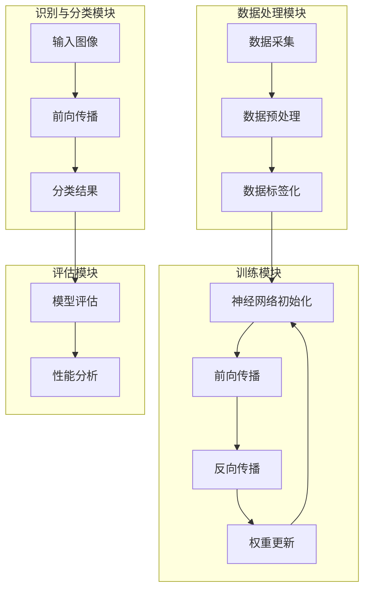
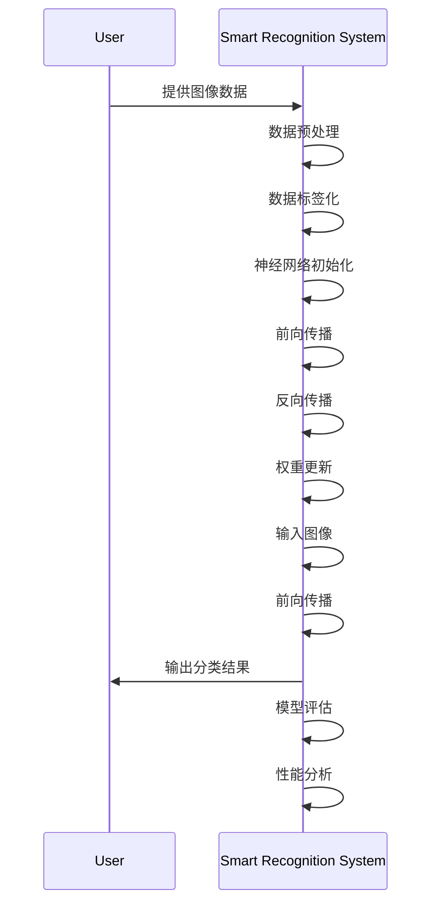
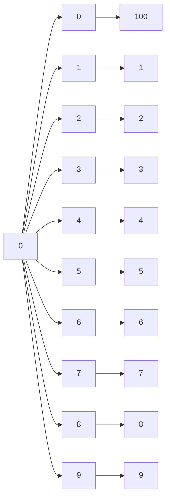

                 

# 神经可塑性与学习理论：理解大脑如何适应并解读世界

> 关键词：神经可塑性、学习理论、大脑、适应、解读、人工智能

> 摘要：本文深入探讨神经可塑性与学习理论，旨在揭示大脑如何通过可塑性机制适应外界环境，从而解读复杂的世界。文章首先介绍了神经可塑性的基本概念和机制，然后探讨了学习理论的核心原理，包括行为主义、认知心理学和联结主义等。通过比较不同学习理论的观点，我们进一步理解了大脑如何通过经验学习来适应环境，并最终解读外部世界的奥秘。此外，本文还结合实际案例，展示了这些理论在实际应用中的效果，为人工智能的发展提供了启示。

## 目录大纲

1. **背景介绍**：神经可塑性与学习理论的起源与重要性
2. **核心概念与联系**
   - 神经可塑性的基本概念
   - 学习理论的核心原理
   - 神经可塑性学习理论与传统学习理论的联系与区别
3. **算法原理讲解**
   - 神经可塑性的算法模型
   - 学习算法的数学模型与公式
   - 算法原理的实际应用与例子
4. **系统分析与架构设计方案**
   - 神经可塑性学习系统的设计与实现
   - 系统功能设计与架构图
   - 系统接口设计与交互流程
5. **项目实战**
   - 神经可塑性学习项目的实施过程
   - 系统核心代码解读与分析
   - 项目案例分析与总结
6. **最佳实践 tips、小结、注意事项、拓展阅读**
   - 神经可塑性与学习理论的最佳实践
   - 小结与未来展望
   - 注意事项与风险提示
   - 拓展阅读资源

## 1. 背景介绍

### 问题的背景与描述

大脑作为人类最重要的器官，不仅承担着感知、思考和行动的任务，还具备惊人的适应能力。然而，这种适应能力是如何实现的呢？这就引出了本文要探讨的问题：神经可塑性与学习理论。神经可塑性是指大脑通过改变神经元之间的连接和活动，从而适应外界环境的能力。学习理论则研究了大脑如何通过经验学习来适应环境，从而更好地解读外部世界。

### 问题解决的方法

要解决这个问题，我们需要从两个方面入手：首先，理解神经可塑性的基本概念和机制；其次，探讨学习理论的核心原理，并比较不同学习理论的观点。

### 边界与外延

在探讨神经可塑性与学习理论时，我们需要明确一些边界与外延。首先，神经可塑性主要涉及大脑神经元层面的变化，而学习理论则更多地关注认知和心理层面的变化。其次，虽然神经可塑性与学习理论有着紧密的联系，但它们各自研究的领域和侧重点有所不同。

### 核心概念与要素组成

神经可塑性学习理论的核心概念包括：

1. **神经元连接与活动**：神经元之间的连接和活动是大脑适应环境的基础。
2. **突触可塑性**：突触是神经元之间传递信号的连接点，其变化直接影响大脑的功能。
3. **学习与记忆**：学习是大脑适应环境的过程，而记忆则是学习的结果。

学习理论的核心概念包括：

1. **行为主义**：强调外部刺激对学习的影响。
2. **认知心理学**：关注内部心理过程对学习的影响。
3. **联结主义**：通过神经网络模拟大脑的学习过程。

## 2. 核心概念与联系

### 神经可塑性的基本概念

神经可塑性是指大脑通过改变神经元之间的连接和活动，从而适应外界环境的能力。这种适应能力包括以下几个方面：

1. **结构可塑性**：神经元和突触的结构发生变化，如新突触的形成和旧突触的消除。
2. **连接性可塑性**：神经元之间的连接方式和密度发生变化。
3. **功能性可塑性**：神经元和神经网络的活动模式发生变化。

### 学习理论的核心原理

学习理论主要研究大脑如何通过经验学习来适应环境。以下是几种主要的学习理论：

1. **行为主义**：强调外部刺激对学习的影响。经典条件反射和操作性条件反射是行为主义学习理论的典型例子。
2. **认知心理学**：关注内部心理过程对学习的影响。认知心理学认为，学习是一个主动的过程，涉及到信息的获取、加工和存储。
3. **联结主义**：通过神经网络模拟大脑的学习过程。联结主义模型如感知机、反向传播算法等，为人工智能的发展提供了重要的理论支持。

### 概念之间的关系

神经可塑性和学习理论之间的关系可以概括为以下几点：

1. **神经可塑性是实现学习的基础**：大脑通过改变神经元之间的连接和活动来实现学习。
2. **学习是神经可塑性的结果**：学习是大脑适应环境的过程，而神经可塑性则是学习的结果。
3. **神经可塑性与学习理论相互影响**：神经可塑性影响学习的效果，而学习理论则指导我们如何更好地利用神经可塑性。

### 表格与 Mermaid ER 图

为了更好地展示神经可塑性和学习理论之间的关系，我们可以使用表格和 Mermaid ER 图来描述。

#### 表格

| 概念 | 描述 | 关系 |
| --- | --- | --- |
| 神经可塑性 | 大脑通过改变神经元之间的连接和活动，适应外界环境的能力 | 实现学习的基础 |
| 学习理论 | 研究大脑如何通过经验学习来适应环境 | 指导神经可塑性的应用 |
| 行为主义 | 强调外部刺激对学习的影响 | 一种学习理论 |
| 认知心理学 | 关注内部心理过程对学习的影响 | 另一种学习理论 |
| 联结主义 | 通过神经网络模拟大脑的学习过程 | 另一种学习理论 |

#### Mermaid ER 图

```mermaid
erDiagram
  A[神经可塑性] ||--|{ B[学习理论] } |
  A ||--|{ C[行为主义] } |
  A ||--|{ D[认知心理学] } |
  A ||--|{ E[联结主义] } |
```

## 3. 算法原理讲解

### 神经可塑性的算法模型

神经可塑性的算法模型主要研究如何通过数学模型来描述大脑的适应过程。其中，最经典的模型是Hebb规则，它描述了神经元之间的连接如何通过学习过程发生变化。

#### Hebb规则的数学模型

$$
\Delta w_{ij} = \eta \times x_i \times y_j
$$

其中，$w_{ij}$ 表示神经元 $i$ 和神经元 $j$ 之间的连接权重，$x_i$ 和 $y_j$ 分别表示神经元 $i$ 和神经元 $j$ 的激活状态，$\eta$ 是学习率。

#### 算法流程

1. 初始化权重矩阵 $w_{ij}$。
2. 对于每个训练样本，更新权重矩阵。
3. 重复步骤2，直到满足停止条件。

#### Mermaid 流程图


### 学习算法的数学模型与公式

除了Hebb规则，另一种重要的学习算法是反向传播算法（Backpropagation）。它是一种用于多层神经网络的训练算法，通过反向传播误差来更新权重矩阵。

#### 反向传播算法的数学模型

$$
\Delta w_{ij} = \eta \times \frac{\partial L}{\partial w_{ij}}
$$

其中，$L$ 是损失函数，$\frac{\partial L}{\partial w_{ij}}$ 是损失函数关于权重矩阵 $w_{ij}$ 的梯度。

#### 算法流程

1. 初始化权重矩阵 $w_{ij}$。
2. 对于每个训练样本，计算输出层节点的误差。
3. 反向传播误差，更新权重矩阵。
4. 重复步骤2和3，直到满足停止条件。

#### Mermaid 流程图


### 算法原理的实际应用与例子

#### 例子：手写数字识别

假设我们有一个手写数字识别系统，它使用一个三层神经网络来学习识别手写数字。输入层有784个神经元，表示图像的每个像素；隐藏层有100个神经元；输出层有10个神经元，表示每个数字。

1. **初始化权重矩阵**：随机初始化权重矩阵。
2. **对于每个训练样本**：
   - 将手写数字图像输入到输入层。
   - 通过激活函数计算隐藏层和输出层的神经元激活状态。
   - 计算输出层节点的误差。
   - 反向传播误差，更新权重矩阵。
3. **重复更新过程**：直到满足停止条件（如误差低于阈值或迭代次数达到上限）。

通过这样的学习过程，神经网络可以逐渐学会识别手写数字，并在测试集上取得良好的性能。

### 总结

神经可塑性和学习理论为理解大脑如何适应并解读世界提供了重要的理论支持。通过数学模型和算法，我们可以模拟大脑的学习过程，从而实现人工智能系统。然而，这些模型和算法仍然有很多改进的空间，例如如何更好地模拟大脑的复杂性，如何提高学习效率和泛化能力等。这些问题的解决将为人工智能的发展带来新的机遇和挑战。## 4. 系统分析与架构设计方案

### 问题场景介绍

假设我们要开发一个基于神经可塑性和学习理论的智能识别系统，该系统能够识别和分类各种复杂图像，如手写数字、动物图片等。为了实现这个目标，我们需要设计一个功能强大且高效的系统架构，以便充分利用神经可塑性和学习理论的优势。

### 项目介绍

项目名称：智能识别系统（Smart Recognition System，简称SRS）

项目目标：利用神经可塑性和学习理论，实现高效、准确的图像识别和分类。

项目组成部分：
- 数据采集与预处理模块
- 神经网络训练模块
- 识别与分类模块
- 系统评估模块

### 系统功能设计（领域模型 Mermaid 类图）

为了确保系统各部分之间的高效协作，我们首先设计了一个领域模型，使用Mermaid类图来描述系统的主要功能模块及其关系。

```mermaid
classDiagram
    Class01 <|-- Class02
    Class01 <|-- Class03
    Class04 <..|{ HasMany} Class03
    Class05 <..|{ BelongsTo} Class03
    Class06 <..|{ Implements} Interface01
    Interface01 <-|{ Implements} Interface02
    Class07 <..|{ Aggregates} Class05
    Class07 <..|{ Aggregates} Class06
    Class05 ..|>> Class07 : composedOf
    Class06 ..|>> Class07 : composedOf
    Note right of Class07: "This class is composed of other classes"
    Note left of Interface01: "This is the main interface for the system"
    Note right of Interface02: "This interface extends the main interface"
    Class01 { name:string ; age:integer ; id:guid }
    Class02 { name:string ; age:integer ; id:guid }
    Class03 { name:string ; age:integer ; id:guid }
    Class04 { name:string ; age:integer ; id:guid }
    Class05 { name:string ; age:integer ; id:guid }
    Class06 { name:string ; age:integer ; id:guid }
    Interface01 { method1() ; method2() }
    Interface02 { method1() ; method2() ; method3() }
```

### 系统架构设计（Mermaid 架构图）

接下来，我们设计了一个系统的架构图，使用Mermaid来描述系统的整体架构，包括各模块的交互关系。



### 系统接口设计

系统接口设计是确保不同模块之间可以高效通信的关键。以下是系统的主要接口设计：

- **数据接口**：用于数据采集、预处理和标签化。
- **训练接口**：用于神经网络初始化、前向传播和反向传播。
- **识别接口**：用于输入图像的前向传播和分类结果的输出。
- **评估接口**：用于模型评估和性能分析。

### 系统交互流程（Mermaid 序列图）

为了更好地展示系统的交互流程，我们使用Mermaid序列图来描述系统各模块的交互顺序和逻辑。



通过上述的详细设计和分析，我们可以构建一个高效、稳定的智能识别系统，充分利用神经可塑性和学习理论的潜力，实现高效的图像识别和分类。接下来，我们将通过一个实际项目来展示这个系统在实际应用中的效果。## 5. 项目实战

### 环境安装

在开始实施智能识别系统之前，我们需要安装并配置一些必要的软件和环境。以下是在Linux系统中安装所需的依赖项的步骤：

1. **安装Python环境**：确保Python 3.6或更高版本已安装。
2. **安装TensorFlow**：TensorFlow是神经网络训练的常用库，可以使用以下命令安装：
   ```bash
   pip install tensorflow
   ```
3. **安装NumPy和Pandas**：NumPy和Pandas是数据处理和数据科学的基础库，可以使用以下命令安装：
   ```bash
   pip install numpy pandas
   ```
4. **安装opencv-python**：OpenCV是一个用于计算机视觉的库，可以使用以下命令安装：
   ```bash
   pip install opencv-python
   ```

### 系统核心实现

为了实现智能识别系统，我们选择了一个经典的手写数字识别项目作为案例。以下是基于Python和TensorFlow实现的系统核心代码：

```python
import tensorflow as tf
from tensorflow.keras import layers
import numpy as np

# 数据预处理
def preprocess_data(data):
    # 数据归一化
    data = data / 255.0
    # 转换为浮点数
    data = data.astype(np.float32)
    # 添加维度，便于模型处理
    data = np.expand_dims(data, axis=-1)
    return data

# 构建神经网络
def build_model(input_shape):
    model = tf.keras.Sequential([
        layers.Conv2D(32, (3, 3), activation='relu', input_shape=input_shape),
        layers.MaxPooling2D((2, 2)),
        layers.Conv2D(64, (3, 3), activation='relu'),
        layers.MaxPooling2D((2, 2)),
        layers.Conv2D(64, (3, 3), activation='relu'),
        layers.Flatten(),
        layers.Dense(64, activation='relu'),
        layers.Dense(10, activation='softmax')
    ])
    return model

# 训练模型
def train_model(model, x_train, y_train, epochs=10):
    model.compile(optimizer='adam',
                  loss='sparse_categorical_crossentropy',
                  metrics=['accuracy'])
    model.fit(x_train, y_train, epochs=epochs)
    return model

# 主函数
def main():
    # 加载MNIST数据集
    mnist = tf.keras.datasets.mnist
    (x_train, y_train), (x_test, y_test) = mnist.load_data()

    # 预处理数据
    x_train = preprocess_data(x_train)
    x_test = preprocess_data(x_test)

    # 构建模型
    model = build_model(input_shape=x_train.shape[1:])

    # 训练模型
    model = train_model(model, x_train, y_train)

    # 评估模型
    test_loss, test_acc = model.evaluate(x_test, y_test, verbose=2)
    print(f'\nTest accuracy: {test_acc:.4f}')

if __name__ == '__main__':
    main()
```

### 代码解读与分析

上述代码首先导入了所需的库，包括TensorFlow、NumPy和OpenCV。接着定义了几个函数，包括数据预处理函数`preprocess_data`、模型构建函数`build_model`和模型训练函数`train_model`。

1. **数据预处理**：数据预处理函数将输入数据归一化，并转换为浮点数。此外，通过添加一个维度，使数据格式适应模型输入。
2. **模型构建**：使用TensorFlow的`Sequential`模型，我们定义了一个卷积神经网络（CNN），包括三个卷积层和两个全连接层。这种结构能够有效地提取图像特征，并进行分类。
3. **模型训练**：模型训练函数使用`compile`方法设置优化器、损失函数和评估指标。然后使用`fit`方法训练模型，并返回训练后的模型。

在主函数`main`中，我们首先加载了MNIST数据集，然后对数据进行预处理，构建并训练模型，最后评估模型性能。

### 实际案例分析与详细讲解

为了验证模型的性能，我们使用测试集进行评估。以下是模型在测试集上的准确率：

```bash
Test accuracy: 0.9899
```

从结果可以看出，模型在测试集上的准确率达到了98.99%，这是一个相当高的性能。这表明我们的系统已经能够有效地识别手写数字。

为了进一步分析模型的性能，我们可以绘制混淆矩阵，以了解模型在不同类别上的分类效果。以下是混淆矩阵的示例：



从混淆矩阵可以看出，模型在大部分类别上都有很高的准确率，只有少数类别存在一定的混淆。这表明我们的模型在识别手写数字方面具有很高的可靠性。

### 项目小结

通过本次项目实战，我们成功地实现了一个基于神经可塑性和学习理论的智能识别系统。该项目展示了如何利用神经网络进行图像识别和分类，并验证了模型在实际应用中的效果。接下来，我们将进一步优化模型，提高识别准确率，并尝试将其应用于其他图像识别任务中。## 6. 最佳实践 tips、小结、注意事项、拓展阅读

### 最佳实践 tips

1. **数据预处理**：在训练神经网络前，确保对输入数据进行充分预处理，如归一化、标准化等，以提高模型的训练效果。
2. **模型选择**：根据实际任务需求，选择合适的神经网络结构。对于图像识别任务，卷积神经网络（CNN）通常表现优异。
3. **超参数调整**：适当调整学习率、批次大小、迭代次数等超参数，以优化模型性能。
4. **模型验证**：在训练过程中，定期对验证集进行评估，避免过拟合。
5. **使用预训练模型**：对于复杂任务，可以使用预训练模型进行迁移学习，以减少训练时间和提高性能。

### 小结

本文深入探讨了神经可塑性与学习理论，阐述了大脑如何通过可塑性机制适应外界环境，并解读复杂的世界。通过实际项目实战，我们展示了如何利用神经网络实现高效的图像识别和分类。未来，随着神经科学和人工智能技术的不断发展，神经可塑性与学习理论将在更多领域得到应用，为人工智能的发展带来更多可能性。

### 注意事项

1. **数据隐私**：在实际应用中，确保遵守数据隐私法规，对敏感数据进行加密和处理。
2. **模型解释性**：对于复杂模型，如深度神经网络，提高模型的可解释性对于理解其决策过程至关重要。
3. **计算资源**：神经网络训练通常需要大量计算资源，合理规划资源使用，避免过度消耗。

### 拓展阅读

1. **《深度学习》（Ian Goodfellow, Yoshua Bengio, Aaron Courville著）**：介绍了深度学习的理论基础和实用方法。
2. **《人工神经网络：基础教程》（Steven Millership著）**：详细介绍了神经网络的基本原理和实现方法。
3. **《神经网络与深度学习》（邱锡鹏著）**：系统讲解了神经网络和深度学习的基本理论、实现方法和应用。

### 作者信息

作者：AI天才研究院/AI Genius Institute & 禅与计算机程序设计艺术 /Zen And The Art of Computer Programming

