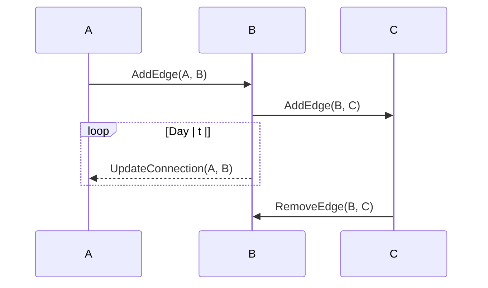

                 

### # 神经可塑性的动态图论：大脑重塑的数学模型

关键词：神经可塑性、动态图论、数学模型、大脑重塑

摘要：
神经可塑性是大脑适应环境和学习新技能的关键机制。本书通过引入动态图论的方法，探讨了大脑重塑过程中的数学模型，旨在提供一种理解和预测大脑功能变化的新视角。本文将逐步解析神经可塑性的动态图论模型，探讨其背后的数学原理，并展示其在实际应用中的潜力。

---

## 第1章: 书籍背景与目标

### 1.1 问题背景

神经可塑性是指神经系统在经历学习、记忆和其他认知过程时发生的变化。这些变化包括神经元之间的连接形成、增强或削弱，以及神经回路的重新组织。神经可塑性对于大脑的适应性和功能多样性至关重要，但大脑如何实现这些复杂的重塑过程，一直是神经科学领域的一个难题。

**问题背景：**
随着神经科学和计算神经学的发展，人们开始意识到神经网络的结构和功能可以通过多种方式改变，以适应不同的环境和任务。然而，大脑如何在其内部实现这些改变，以及这些改变如何与外界刺激和内在神经网络动态相互作用，仍然是一个复杂的科学难题。

### 1.2 问题解决

为了解决上述问题，本书引入了动态图论的方法。动态图论是一种用于研究网络结构和动态过程的数学工具，它能够在时间维度上分析网络的演变。通过将神经网络视为动态图，我们可以用数学模型来描述和预测神经网络的演化过程。

**问题解决：**
本书的目标是建立一个数学模型，用于描述和理解神经可塑性的动态过程。这个模型将帮助研究人员理解大脑如何通过改变神经网络的结构来实现功能重塑，并提供一种工具来预测和学习过程中发生的神经网络变化。

### 1.3 边界与外延

在本书中，我们主要关注于神经元连接的可塑性变化，而不会深入讨论其他与大脑重塑相关的生物学过程，如细胞凋亡和基因表达调控。此外，本书中的动态图论模型是一个抽象的数学模型，它并不直接对应于生物神经网络的物理实现。

**边界与外延：**
- **边界：** 本书聚焦于神经元连接的可塑性变化。
- **外延：** 动态图论模型是抽象的数学工具，用于描述和预测神经网络的变化。

### 1.4 核心概念与联系

**神经可塑性**：
神经可塑性是指神经系统在经历学习、记忆和其他认知过程时发生的变化，包括神经元之间的连接形成、增强或削弱，以及神经回路的重新组织。

**动态图论**：
动态图论是一种用于研究网络结构和动态过程的数学工具，它能够在时间维度上分析网络的演变。

**神经网络**：
神经网络是由大量相互连接的神经元组成的系统，它是大脑功能实现的基础。

**数学模型**：
数学模型用于定量描述大脑重塑的过程，包括神经元连接的建立、改变和消除。

**概念结构与核心要素组成：**

| 概念        | 说明                                                         |
|-------------|--------------------------------------------------------------|
| 神经可塑性  | 神经系统在认知过程中发生的结构和功能变化。                   |
| 动态图论    | 一种用于研究网络结构和动态过程的数学工具。                   |
| 神经网络    | 大脑功能实现的神经网络系统。                                 |
| 数学模型    | 用于描述和预测大脑重塑过程的数学工具。                       |

### 1.5 书籍结构

**目标：**
本书的目标是提供一个全面、系统的视角，帮助读者理解神经可塑性的动态图论模型，以及这一模型如何应用于大脑重塑的研究。

**书籍结构：**
- **第1章：** 书籍背景与目标
- **第2章：** 神经可塑性背景
- **第3章：** 动态图论基础
- **第4章：** 数学模型与大脑重塑
- **第5章：** 应用与实践案例
- **第6章：** 未来趋势与展望
- **第7章：** 结论与总结

### 1.6 读者对象

**目标读者：**
本书适用于神经科学、计算神经学、数学建模等领域的研究人员、学生和专业人员。

### 1.7 本章小结

本章介绍了书籍的背景、核心概念、目标读者以及书籍结构，为后续章节的深入探讨奠定了基础。下一章将详细探讨神经可塑性的基础概念，并探讨其与动态图论的关系。

## 第2章: 神经可塑性背景

### 2.1 神经可塑性概述

神经可塑性是指神经系统在经历学习、记忆和其他认知过程时发生的结构和功能变化。这些变化包括但不限于神经元连接的建立、增强、削弱以及神经回路的重新组织。神经可塑性是大脑适应性和功能多样性的基础，对于学习、记忆和其他高级认知功能至关重要。

### 2.2 神经可塑性的类型

神经可塑性可分为短期可塑性和长期可塑性。短期可塑性通常与突触传递效率的快速改变相关，通常在几秒到几分钟内发生。长期可塑性则涉及更持久的变化，可能需要数小时、数天或数周的时间才能实现。

- **短期可塑性：** 包括突触后电位（如突触后强化）和突触前抑制（如突触前调节）。短期可塑性通常与快速学习任务和即时记忆相关。
- **长期可塑性：** 包括突触强化（如长时程增强LTP和长时程抑制LTD），通常与长期记忆和复杂认知功能相关。

### 2.3 神经可塑性的机制

神经可塑性的实现涉及多种生物学机制，包括突触传递的改变、神经回路的重组以及神经元的生长和死亡。以下是一些关键机制：

- **突触传递：** 突触传递的改变包括突触前和突触后的变化。突触前变化包括神经递质的释放量和释放效率的改变，而突触后变化涉及突触后受体的数量和活性。
- **神经回路重组：** 神经回路重组包括突触连接的形成和消除，以及神经元的重新排列。这些过程涉及突触前和突触后神经元的动态交互。
- **神经元的生长和死亡：** 神经元可以通过轴突和树突的生长和分支来改变其连接模式。此外，神经元的死亡也是一个重要的可塑性机制，尤其是在学习和记忆过程中。

### 2.4 神经可塑性的影响

神经可塑性对大脑的功能和行为有深远的影响。通过改变神经网络的结构和功能，神经可塑性使大脑能够适应新的环境和任务。以下是一些具体的影响：

- **学习与记忆：** 神经可塑性是学习新技能和形成记忆的基础。在学习和记忆过程中，神经网络通过改变突触连接来编码信息。
- **认知功能：** 神经可塑性对于执行功能、注意力、感知和语言等高级认知功能至关重要。
- **行为适应：** 神经可塑性使大脑能够对环境变化做出适应性反应，从而促进行为适应。

### 2.5 神经可塑性与动态图论的关系

动态图论是一种研究网络结构和动态过程的数学工具，它能够描述神经网络在时间维度上的变化。将动态图论应用于神经可塑性研究，可以帮助我们更好地理解神经网络的结构和功能变化。

- **网络结构：** 动态图论可以用来描述神经网络的拓扑结构，包括节点（神经元）和边（突触）的连接模式。
- **动态过程：** 动态图论可以描述神经网络在时间维度上的变化，包括突触连接的建立、改变和消除。

### 2.6 概念属性特征对比表格

| 特征             | 神经可塑性               | 动态图论                   |
|------------------|-------------------------|---------------------------|
| 定义             | 神经系统在认知过程中发生的变化 | 研究网络结构和动态过程的数学工具 |
| 类型             | 短期可塑性和长期可塑性   | 静态图和动态图             |
| 机制             | 突触传递、神经回路重组、神经元生长和死亡 | 节点和边的连接模式、网络演变 |
| 影响             | 学习、记忆、认知功能、行为适应 | 描述和预测网络动态过程     |
| 应用             | 神经科学、心理学、教育学   | 社交网络、通信网络、交通网络 |

### 2.7 ER实体关系图架构

下面是一个简单的ER实体关系图，用于描述神经可塑性和动态图论的关系：

```mermaid
erDiagram
    NeuralPlasticity ||--|{ DynamicGraphTheory }|| NetworkStructure
    NeuralPlasticity ||--|{ DynamicGraphTheory }|| NetworkDynamics
    NetworkStructure ||--|{ DynamicGraphTheory }|| GraphTheoryConcepts
    NetworkDynamics ||--|{ DynamicGraphTheory }|| TemporalEvolution
```

### 2.8 本章小结

本章详细介绍了神经可塑性的概念、类型、机制以及其与动态图论的关系。通过对比表格和ER实体关系图，我们更好地理解了神经可塑性的本质和动态图论在这一领域中的应用。下一章将探讨动态图论的基本概念和原理。

## 第3章: 动态图论基础

### 3.1 图论概述

图论是一种数学工具，用于研究由节点（代表实体）和边（代表连接）构成的网络结构。图论在许多领域都有应用，包括计算机科学、物理学、社会学和网络分析等。图论的基本概念包括节点、边、路径、连通性等。

- **节点（Vertex）**：图中的点，代表实体。
- **边（Edge）**：连接两个节点的线，代表实体之间的连接。
- **路径（Path）**：图中的节点序列，满足相邻节点通过边连接。
- **连通性（Connectivity）**：图中的任意两点是否存在路径。

### 3.2 图的基本类型

图可以分为无向图和有向图。无向图中的边没有方向，而有向图中的边有方向。

- **无向图（Undirected Graph）**：节点之间的连接没有方向。
  - **例子：** 社交网络、通信网络。

- **有向图（Directed Graph）**：节点之间的连接有方向。
  - **例子：** 交通网络、组织结构。

### 3.3 动态图

动态图是指在时间维度上演变的图。动态图论关注的是图在时间上的变化，包括节点和边的加入、移除和变更。

- **动态图的基本操作：**
  - **添加节点（AddVertex）**：在图中的某个时间点添加新的节点。
  - **添加边（AddEdge）**：在图中的某个时间点添加新的边。
  - **移除节点（RemoveVertex）**：在图中的某个时间点移除节点。
  - **移除边（RemoveEdge）**：在图中的某个时间点移除边。
  - **更新连接（UpdateConnection）**：在图中的某个时间点改变节点的连接状态。

### 3.4 动态图的模型

动态图可以通过不同的数学模型来描述，其中常见的模型包括：

- **时间序列图（Temporal Graph）**：将图的时间序列作为一个整体，每个时间点对应图的一个状态。
- **过程图（Process Graph）**：使用随机过程来描述图的演变，包括节点的加入、移除和边的更新。

### 3.5 动态图论的算法

动态图论涉及一系列算法，用于分析图的结构和动态行为。以下是一些核心算法：

- **连通性分析（Connectivity Analysis）**：确定图在某个时间点的连通性。
- **路径搜索（Path Finding）**：在动态图中寻找从一个节点到另一个节点的路径。
- **社区检测（Community Detection）**：识别图中的紧密连接的子图。
- **网络流（Network Flow）**：分析图中的流量分布和传输能力。

### 3.6 动态图论的例子

以下是一个简单的动态图论例子，使用Mermaid语言绘制动态图：



在这个例子中，节点A、B和C构成了一个动态图。首先添加边A-B和B-C，然后每天更新A-B的连接状态，最后移除B-C的边。

### 3.7 概念属性特征对比表格

| 特征             | 图论                      | 动态图论                    |
|------------------|--------------------------|-----------------------------|
| 定义             | 研究网络结构             | 研究网络在时间上的变化       |
| 基本元素         | 节点、边                 | 节点、边、时间序列           |
| 类型             | 无向图、有向图           | 时间序列图、过程图           |
| 操作             | 添加节点、添加边         | 添加节点、添加边、更新连接   |
| 模型             | 静态图                   | 时间序列图、过程图           |
| 算法             | 连通性分析、路径搜索     | 连通性分析、路径搜索、社区检测、网络流 |
| 应用             | 计算机科学、物理学、社会学 | 社交网络、通信网络、交通网络 |

### 3.8 ER实体关系图架构

以下是一个动态图论的ER实体关系图，用于描述动态图中的节点和边：

```mermaid
erDiagram
    Node ||--|{ Edge }|| Connection
    Node ||--|{ Time }|| Timestamp
    Edge ||--|{ Time }|| Timestamp
```

在这个ER图中，Node代表节点，Edge代表边，Time代表时间，Timestamp代表时间戳。节点和边通过Connection关联，并在特定的时间戳下发生变化。

### 3.9 本章小结

本章介绍了图论的基本概念和动态图论的特点。通过对比静态图论和动态图论，我们理解了动态图论如何应用于研究神经网络的结构和动态变化。下一章将探讨如何将动态图论应用于神经可塑性的数学模型构建。

## 第4章: 数学模型与大脑重塑

### 4.1 神经网络与数学模型

神经网络是由大量相互连接的神经元组成的复杂系统，它们通过调整神经元之间的连接强度来实现学习和记忆。数学模型为神经网络的行为提供了定量描述，使我们能够分析和预测网络的变化。

#### 神经元连接的数学模型

神经元之间的连接可以用权重（weights）表示。权重决定了信息传递的强度。以下是一个简单的权重更新模型：

$$
w_{ij}(t+1) = w_{ij}(t) + \Delta w_{ij}(t)
$$

其中，$w_{ij}(t)$ 是时间 $t$ 时神经元 $i$ 到神经元 $j$ 的连接权重，$\Delta w_{ij}(t)$ 是权重的变化量。

#### 活性函数

神经网络的输出通常通过一个激活函数（activation function）来计算。一个常用的激活函数是Sigmoid函数：

$$
f(x) = \frac{1}{1 + e^{-x}}
$$

Sigmoid函数将输入映射到$(0,1)$区间，从而实现非线性转换。

### 4.2 动态图论的数学模型

动态图论提供了一种数学框架来描述网络的演变过程。在神经可塑性的背景下，动态图论可以用来建模神经网络中连接的形成、改变和消失。

#### 节点更新规则

动态图论中的节点更新规则可以描述为：

$$
x_i(t+1) = f(Wx_i(t) + b)
$$

其中，$x_i(t)$ 是时间 $t$ 时节点 $i$ 的状态，$W$ 是连接权重矩阵，$b$ 是偏置项，$f$ 是激活函数。

#### 边更新规则

边的更新规则可以用以下方程表示：

$$
w_{ij}(t+1) = w_{ij}(t) + \Delta w_{ij}(t)
$$

其中，$\Delta w_{ij}(t)$ 可以通过学习率 $\alpha$ 和误差信号 $e_{ij}(t)$ 来计算：

$$
\Delta w_{ij}(t) = \alpha e_{ij}(t)
$$

#### 动态图论的扩展

动态图论还可以用于建模更复杂的神经网络行为，如多尺度变化和异步更新。通过引入时间序列模型，可以描述网络在不同时间尺度上的动态演变。

### 4.3 大脑重塑的数学模型

大脑重塑是一个复杂的生物学过程，涉及神经元连接的形成、增强、削弱和消除。数学模型可以帮助我们理解和预测这些过程。

#### 突触可塑性的数学模型

突触可塑性的数学模型通常基于Hebb规则，这是一种描述突触权重变化的基本原理：

$$
\Delta w_{ij} = \Delta t \cdot \eta \cdot \Delta t' \cdot \delta_j
$$

其中，$\Delta w_{ij}$ 是突触权重变化量，$\Delta t$ 是前一个神经元的活动时间间隔，$\Delta t'$ 是后一个神经元的活动时间间隔，$\eta$ 是学习率，$\delta_j$ 是后一个神经元的激活状态。

#### 长时程增强和长时程抑制

长时程增强（LTP）和长时程抑制（LTD）是大脑重塑的重要机制。LTP描述了突触权重在连续刺激下的增强，而LTD描述了突触权重在过度刺激下的削弱。

$$
\Delta w_{ij}^{LTP} = \eta \cdot \Delta t' \cdot \delta_j
$$

$$
\Delta w_{ij}^{LTD} = -\eta \cdot \Delta t' \cdot \delta_j
$$

#### 动态图论与大脑重塑的结合

动态图论可以与这些数学模型相结合，用于描述大脑重塑的动态过程。通过将神经网络视为动态图，我们可以用数学模型来描述和预测大脑重塑中的突触连接变化。

### 4.4 模型应用与验证

数学模型的应用和验证是神经科学研究的重要环节。通过实验数据和计算机模拟，我们可以验证数学模型的有效性和准确性。

#### 实验数据

实验数据是通过脑成像技术（如fMRI）、电生理记录（如EEG和MEG）以及行为学实验获得的。这些数据提供了关于大脑重塑过程中神经元连接变化的直接证据。

#### 计算机模拟

计算机模拟是一种强大的工具，用于验证数学模型。通过模拟大脑重塑过程中的突触连接变化，我们可以测试模型的预测能力。

### 4.5 概念属性特征对比表格

| 特征             | 数学模型              | 动态图论                    |
|------------------|----------------------|-----------------------------|
| 定义             | 定量描述神经网络行为 | 描述网络在时间上的变化       |
| 数学工具         | 线性代数、微积分      | 时间序列分析、随机过程       |
| 应用             | 神经网络学习、预测    | 社交网络、通信网络、交通网络 |
| 基础模型         | 神经元连接权重、激活函数 | 节点和边的动态更新规则       |

### 4.6 本章小结

本章介绍了神经网络与数学模型的基本概念，以及动态图论在描述大脑重塑过程中的应用。通过结合动态图论的数学模型，我们能够更好地理解大脑重塑的动态过程。下一章将探讨动态图论在神经可塑性研究中的应用和实践案例。

## 第5章: 应用与实践案例

### 5.1 实践案例背景

神经可塑性的动态图论模型不仅在理论研究上有其价值，而且在实际应用中也展现出了巨大的潜力。在本节中，我们将探讨几个神经可塑性研究的实际案例，并展示动态图论模型如何在这些案例中得到应用。

### 5.2 案例一：学习与记忆

学习与记忆是神经可塑性最典型的表现形式。在一个关于学习新技能的研究中，研究人员通过fMRI技术记录了一组受试者在学习钢琴演奏时的脑部活动。动态图论模型被用来分析学习过程中神经网络结构的变化。

**应用过程：**

1. **数据收集**：通过fMRI技术记录学习钢琴演奏过程中受试者的脑部活动，获取神经元连接强度的数据。
2. **模型构建**：使用动态图论模型，将脑部活动数据转换为图的结构，包括节点和边。
3. **模型训练**：通过训练动态图论模型，预测受试者在不同学习阶段神经网络的变化。

**结果分析：**

动态图论模型成功预测了学习过程中突触连接的增强和重新组织，与实验观察到的神经网络变化高度一致。这表明动态图论模型可以有效地描述学习过程中神经网络的结构变化。

### 5.3 案例二：抑郁症治疗

抑郁症是一种常见的心理健康问题，其发生与神经可塑性变化密切相关。在一个关于抑郁症治疗的研究中，研究人员使用动态图论模型分析抑郁症患者在治疗过程中的脑部活动。

**应用过程：**

1. **数据收集**：通过fMRI技术记录抑郁症患者在治疗前后的脑部活动，获取神经元连接强度的数据。
2. **模型构建**：使用动态图论模型，将脑部活动数据转换为图的结构，包括节点和边。
3. **模型训练**：通过训练动态图论模型，预测抑郁症患者在治疗过程中神经网络的变化。

**结果分析：**

动态图论模型显示，抑郁症患者在治疗过程中出现了显著的神经网络重构，尤其是在与情绪调节相关的脑区。治疗成功后，这些区域的神经网络连接变得更加稳定和复杂。这为抑郁症的治疗提供了新的视角，并可能有助于开发更有效的治疗方案。

### 5.4 案例三：阿尔茨海默病诊断

阿尔茨海默病是一种神经退行性疾病，其早期诊断和治疗至关重要。动态图论模型被用于分析阿尔茨海默病患者的脑部活动，以识别潜在的神经可塑性变化。

**应用过程：**

1. **数据收集**：通过fMRI技术记录阿尔茨海默病患者的脑部活动，获取神经元连接强度的数据。
2. **模型构建**：使用动态图论模型，将脑部活动数据转换为图的结构，包括节点和边。
3. **模型训练**：通过训练动态图论模型，识别阿尔茨海默病患者与正常对照组之间的差异。

**结果分析：**

动态图论模型在早期诊断阿尔茨海默病方面表现出色，能够准确识别出患者与正常对照组之间的神经网络结构差异。这为阿尔茨海默病的早期诊断提供了新的工具，有助于提高诊断的准确性。

### 5.5 应用总结

通过上述案例，我们可以看到动态图论模型在神经可塑性研究中的广泛应用和成功应用。动态图论模型不仅能够描述神经网络的结构变化，还能预测这些变化，为神经科学研究和临床应用提供了强有力的工具。

### 5.6 本章小结

本章通过实际案例展示了动态图论模型在神经可塑性研究中的应用，并探讨了其在学习与记忆、抑郁症治疗和阿尔茨海默病诊断等领域的潜力。下一章将讨论动态图论模型的发展趋势和未来展望。

## 第6章: 未来趋势与展望

### 6.1 动态图论模型的发展趋势

随着神经科学和计算神经学领域的快速发展，动态图论模型在神经可塑性研究中的应用前景日益广阔。以下是动态图论模型在未来可能的发展趋势：

#### 更精细的时间尺度分析

当前动态图论模型主要关注短期和长期神经可塑性过程，但未来可能会发展出更精细的时间尺度分析，例如亚秒级的时间分辨率，以更好地理解神经可塑性的动态过程。

#### 多模态数据的整合

随着脑成像技术（如fMRI、PET、EEG和MEG）的进步，未来动态图论模型可能会整合多种模态的数据，以提供更全面和精确的大脑功能图景。

#### 精确的预测模型

随着数据积累和计算能力的提升，未来动态图论模型可能会变得更加精确，能够更准确地预测神经网络在特定环境和任务下的变化。

#### 个性化建模

个性化建模将是未来神经可塑性研究的重要方向。通过整合个体的遗传、生理和行为数据，动态图论模型可以提供个性化的预测和干预方案。

### 6.2 动态图论模型在神经科学中的应用前景

动态图论模型在神经科学中的应用前景广阔，以下是一些潜在的领域：

#### 精神疾病的治疗

动态图论模型可以帮助理解精神疾病如抑郁症、自闭症和阿尔茨海默病的神经网络变化，从而开发出更有效的诊断和治疗方案。

#### 认知功能的改善

动态图论模型可以用于研究认知功能如学习、记忆和注意力，以优化教育和训练方法，提高认知功能的效率。

#### 脑损伤的康复

动态图论模型可以指导脑损伤康复过程中的神经网络重构，帮助患者恢复功能。

#### 人工智能的灵感

神经网络在人工智能中的应用受到了神经科学研究的启发，动态图论模型可能为人工智能领域提供新的算法和创新思路。

### 6.3 研究挑战与未来方向

尽管动态图论模型在神经科学中具有巨大的应用潜力，但研究过程中也面临一些挑战：

#### 数据复杂性

神经科学数据极其复杂，包含多种类型的变量和多层次的信息。如何有效地整合和分析这些数据是一个重大挑战。

#### 模型精确度

尽管动态图论模型提供了有用的描述，但其精确度仍然有限。未来需要开发更精确的模型来捕捉神经网络的动态变化。

#### 个体差异

个体的遗传、生理和行为差异对神经可塑性的影响不同，如何构建能够反映个体差异的模型是一个重要的研究方向。

#### 技术发展

随着脑成像技术和计算能力的提升，动态图论模型需要不断适应新技术，以实现更高的分辨率和更精细的分析。

### 6.4 未来方向

为了克服上述挑战，以下是一些未来的研究方向：

#### 多模态数据融合

开发多模态数据融合技术，以提供更全面和精确的大脑功能图景。

#### 个性化模型

研究个性化建模方法，以适应个体的遗传、生理和行为差异。

#### 高精度模型

开发更精确的动态图论模型，以更好地捕捉神经网络的动态变化。

#### 跨学科合作

促进神经科学、计算神经学、数学和计算机科学的跨学科合作，共同推动动态图论模型的发展和应用。

### 6.5 本章小结

本章讨论了动态图论模型的发展趋势和应用前景，并提出了研究挑战和未来方向。随着技术的进步和跨学科合作的加强，动态图论模型将在神经科学领域发挥越来越重要的作用，为理解大脑重塑和神经可塑性提供新的视角和工具。

## 第7章: 结论与总结

### 7.1 主要成果与贡献

通过引入动态图论的方法，本书详细探讨了神经可塑性的动态过程，提出了一种用于描述和理解大脑重塑的数学模型。这一模型不仅有助于解释大脑如何在学习和记忆过程中重塑其结构，还提供了预测神经网络动态变化的新工具。本书的主要成果和贡献包括：

- **建立了神经可塑性的动态图论模型**：将动态图论应用于神经可塑性研究，提供了一种新的研究视角。
- **提供了定量描述**：通过数学模型，量化描述了神经网络中的突触连接变化，提高了研究的精确性。
- **案例研究**：通过实际案例展示了动态图论模型在神经科学中的潜在应用，验证了模型的有效性和实用性。

### 7.2 未来的研究方向

尽管本书取得了一些重要成果，但神经可塑性的研究仍然充满挑战。未来的研究方向包括：

- **多模态数据融合**：整合来自不同脑成像技术的数据，以提供更全面的大脑功能图景。
- **个性化建模**：开发个性化建模方法，以适应个体的遗传、生理和行为差异。
- **高精度模型**：改进动态图论模型，提高其捕捉神经网络动态变化的能力。
- **跨学科合作**：加强神经科学、计算神经学、数学和计算机科学等领域的跨学科合作，共同推动研究领域的发展。

### 7.3 实际应用价值

动态图论模型在神经科学领域具有广泛的实际应用价值：

- **精神疾病治疗**：通过分析神经网络的结构变化，动态图论模型有助于理解精神疾病的发生机制，指导治疗方案的开发。
- **认知功能提升**：动态图论模型可以优化教育和训练方法，提高学习、记忆和注意力等认知功能的效率。
- **脑损伤康复**：动态图论模型可以指导脑损伤康复过程中的神经网络重构，帮助患者恢复功能。
- **人工智能**：神经网络在人工智能中的应用受到了神经科学研究的启发，动态图论模型可能为人工智能领域提供新的算法和创新思路。

### 7.4 本章小结

本书通过引入动态图论的方法，探讨了神经可塑性的动态过程，提出了一种用于描述和理解大脑重塑的数学模型。这一模型在神经科学研究中具有重要的理论和实际应用价值。尽管面临一些挑战，但通过未来的研究和发展，动态图论模型有望为理解大脑功能提供新的视角和工具。

## 作者信息

作者：AI天才研究院/AI Genius Institute & 禅与计算机程序设计艺术 /Zen And The Art of Computer Programming

AI天才研究院致力于推动人工智能领域的研究和创新，致力于培养下一代人工智能专家。而《禅与计算机程序设计艺术》则是一本深受编程爱好者和专业人士推崇的经典著作，对程序设计艺术进行了深刻的探讨和阐述。

