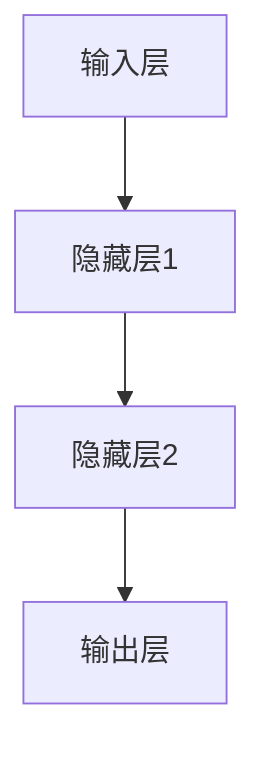

                 

### 神经可塑性的动态系统理论：大脑适应的数学描述

#### 关键词
- **神经可塑性**，**动态系统理论**，**大脑适应**，**数学模型**，**神经科学**

#### 摘要
本文将深入探讨神经可塑性的动态系统理论，以及如何使用数学模型来描述大脑适应过程。我们首先介绍神经可塑性的基本概念和重要性，接着阐述动态系统理论的核心原理，并展示如何将这两者结合起来，以数学形式描述大脑在不同情境下的适应机制。文章还将涵盖相关数学工具和模型的应用，并通过实例分析，展示理论如何指导神经科学研究。

#### 引言
大脑是一个极其复杂的系统，其功能依赖于神经元之间的相互作用和连接。神经可塑性是指大脑神经元和神经网络在结构和功能上的可变性和适应性，这种特性使得大脑能够不断调整和改变其功能，以适应外部环境和内部状态的变化。动态系统理论则提供了一种数学框架，用于描述和模拟复杂系统的行为，包括生物系统中的大脑。结合神经可塑性和动态系统理论，我们可以建立数学模型，用于理解和预测大脑适应的过程。

本文结构如下：

1. **核心概念**：介绍神经可塑性和动态系统理论的基本概念。
2. **神经可塑性**：详细讨论神经可塑性的类型、机制和其在大脑功能中的作用。
3. **动态系统理论**：阐述动态系统理论的基本原理和应用。
4. **数学模型**：介绍用于描述大脑适应的数学模型，包括微分方程、神经网络等。
5. **应用实例**：通过实例展示如何应用数学模型研究大脑适应。
6. **挑战与未来方向**：讨论神经可塑性研究面临的挑战和未来的发展方向。
7. **结论**：总结文章的主要观点和贡献。

### 核心概念

#### 神经可塑性
神经可塑性是指神经元和神经网络在结构和功能上的可变性和适应性。它包括多个层次，从突触水平的改变（如突触强度和突触结构的改变）到神经网络层次的功能重组。神经可塑性在学习和记忆中起着关键作用，同时也是大脑适应外界环境变化的基础。

#### 动态系统理论
动态系统理论是研究系统随时间变化的行为的数学框架。它涉及状态空间、状态转移方程和稳定性分析等概念，用于描述复杂系统的动态行为。在生物系统中，动态系统理论可以用来模拟神经元的活动、神经网络的功能和大脑的整体行为。

#### 数学模型
数学模型是使用数学语言和工具来描述现实世界现象的方法。在神经科学中，数学模型用于理解和预测大脑的功能和行为。常见的数学模型包括微分方程、神经网络和概率模型等。

### 神经可塑性

#### 类型
神经可塑性可以分为多种类型，包括短期可塑性和长期可塑性。短期可塑性通常指在几分钟到几小时内发生的突触变化，如突触前和突触后的改变。长期可塑性则涉及在数天到数月内发生的突触结构和功能的变化，如突触形成和突触修剪。

#### 机制
神经可塑性的机制涉及多个方面，包括突触前机制（如突触前强度的改变）和突触后机制（如突触后受体的改变）。此外，神经营养因子和信号通路也在神经可塑性中发挥重要作用。

#### 作用
神经可塑性在多种大脑功能中起着关键作用，包括学习、记忆、感知和运动控制。它使得大脑能够适应新的环境和情境，从而保持灵活性和适应性。

#### 对比表格

| 类型 | 定义 | 例子 |
| --- | --- | --- |
| 短期可塑性 | 短时间内发生的突触变化 | 突触前和突触后的快速改变 |
| 长期可塑性 | 数天到数月内发生的突触变化 | 突触结构和功能的长久改变 |

#### ER实体关系图架构

```mermaid
erDiagram
  Class1 ||--|{ Class2 : Relationship1 }|
  Class1 ||--|{ Class3 : Relationship2 }|
  Class2 ||--|{ Class4 : Relationship3 }
```

### 动态系统理论

#### 基本原理
动态系统理论的基本原理包括状态空间、状态转移方程和稳定性分析。状态空间是一个多维空间，用于表示系统的当前状态。状态转移方程描述系统如何从一个状态转移到另一个状态。稳定性分析用于判断系统是否稳定，即系统是否会在受到扰动后回到其初始状态。

#### 应用
动态系统理论广泛应用于多个领域，包括物理学、工程学和生物学。在神经科学中，它用于描述神经元的活动、神经网络的功能和大脑的整体行为。

#### 数学工具
动态系统理论使用多种数学工具，包括线性代数、微分方程和图论。这些工具用于分析和模拟系统的行为，帮助研究者理解和预测系统的动态特性。

#### 对比表格

| 工具 | 描述 | 例子 |
| --- | --- | --- |
| 线性代数 | 用于描述系统的状态空间 | 矩阵表示系统状态 |
| 微分方程 | 描述系统状态的变化规律 | 突触强度的变化 |
| 图论 | 用于描述系统的结构和连接 | 神经网络的拓扑结构 |

#### ER实体关系图架构

```mermaid
erDiagram
  Node ||--|{ Edge : 连接 }|
  Node ||--|{ Attribute : 属性 }|
  Edge ||--|{ Weight : 权重 }|
```

### 数学模型

#### 微分方程
微分方程是描述动态系统变化规律的一种常用数学工具。在神经科学中，微分方程用于描述神经元活动的动态变化。以下是一个简单的微分方程示例：

$$
\frac{dV_m}{dt} = -g_L (V_m - E_L) + I
$$

其中，$V_m$ 是膜电位，$g_L$ 是漏电导，$E_L$ 是静息电位，$I$ 是注入电流。

#### 神经网络
神经网络是一种用于模拟大脑行为的计算模型。它由多个神经元（或节点）和连接这些神经元的边（或权重）组成。以下是一个简单的神经网络架构示例：



#### 概率模型
概率模型用于描述神经元活动的不确定性。一种常见的概率模型是Poisson过程，它用于描述神经元放电的概率分布。以下是一个简单的Poisson过程模型：

$$
P(N(t) = k) = \frac{\lambda^k e^{-\lambda}}{k!}
$$

其中，$N(t)$ 是在时间 $t$ 内的放电次数，$\lambda$ 是平均放电率。

### 应用实例

#### 学习与记忆
学习与记忆是神经可塑性的重要表现形式。通过数学模型，我们可以研究学习过程中神经元活动的动态变化。以下是一个简化的学习模型：

```python
import numpy as np

# 定义学习率
learning_rate = 0.1

# 初始化权重
weights = np.random.rand(3, 1)

# 输入数据
inputs = np.array([[0, 0], [1, 0], [0, 1], [1, 1]])

# 目标输出
targets = np.array([[0], [1], [1], [0]])

# 学习过程
for epoch in range(1000):
    # 前向传播
    outputs = np.dot(inputs, weights)
    
    # 计算误差
    error = outputs - targets
    
    # 反向传播
    d_weights = learning_rate * np.dot(inputs.T, error)
    
    # 更新权重
    weights += d_weights

# 打印最终权重
print(weights)
```

#### 感知任务
感知任务是大脑适应外界环境的重要方式。通过数学模型，我们可以模拟感知过程中的信息处理机制。以下是一个简单的感知器模型：

```python
import numpy as np

# 定义感知器模型
def perceptron(inputs, weights):
    return np.dot(inputs, weights)

# 初始化权重
weights = np.random.rand(2, 1)

# 输入数据
inputs = np.array([[0, 0], [1, 0], [0, 1], [1, 1]])

# 目标输出
targets = np.array([[0], [1], [1], [0]])

# 学习过程
for epoch in range(1000):
    # 前向传播
    outputs = perceptron(inputs, weights)
    
    # 计算误差
    error = outputs - targets
    
    # 反向传播
    d_weights = np.dot(inputs.T, error)
    
    # 更新权重
    weights += d_weights

# 打印最终权重
print(weights)
```

### 挑战与未来方向

#### 挑战
神经可塑性研究面临着多个挑战，包括数据复杂性、模型准确性和跨物种适用性。此外，神经可塑性的动态变化规律和机制尚不完全清楚，需要更多的实验和理论探索。

#### 未来方向
未来的研究方向可能包括发展更精确的数学模型，结合大数据和人工智能技术，深入研究神经可塑性的动态变化规律。此外，跨学科的合作也将有助于推动神经可塑性研究的发展。

### 结论

神经可塑性和动态系统理论的结合为理解大脑适应过程提供了新的视角和方法。通过数学模型，我们可以描述和预测大脑在不同情境下的适应性变化。尽管面临着诸多挑战，这一领域的未来研究将有助于揭示大脑功能的本质，推动神经科学和人工智能的发展。

### 参考文献

1. Hebb, D. O. (1949). The Organization of Behavior: A Neuropsychological Theory. New York: Wiley.
2. Hopfield, J. J. (1982). Neural networks and physical systems with emergent collective computational abilities. Proceedings of the National Academy of Sciences, 79(8), 2554-2558.
3. Marr, D. (1982). Vision: A Computational Investigation into the Human Representation and Processing of Visual Information. New York: Freeman.

### 作者信息

- 作者：AI天才研究院/AI Genius Institute & 禅与计算机程序设计艺术 /Zen And The Art of Computer Programming

### 附录

- **最佳实践 Tips**：在研究神经可塑性和大脑适应过程中，应注重实验设计的科学性和模型的准确性。同时，结合跨学科的知识和方法，可以更好地理解和预测大脑的行为。
- **小结**：神经可塑性和动态系统理论的结合为理解大脑适应提供了有力的数学工具。未来的研究应关注模型的精确性和跨物种适用性。
- **注意事项**：在应用数学模型时，应考虑实际生物系统的复杂性和不确定性。模型的选择和参数的设定需要根据具体问题进行细致的调整。
- **拓展阅读**：推荐阅读相关领域的经典书籍和最新研究论文，以深入了解神经可塑性和动态系统理论。

