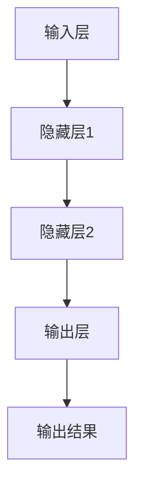
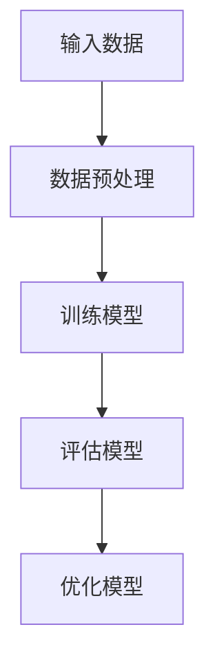
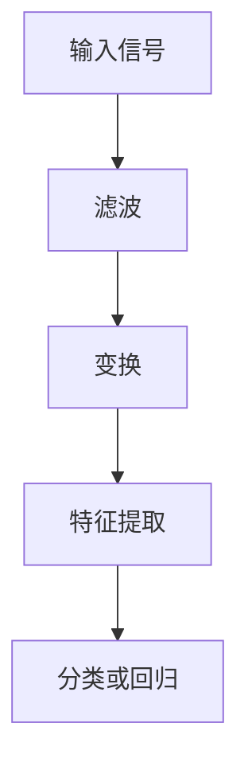
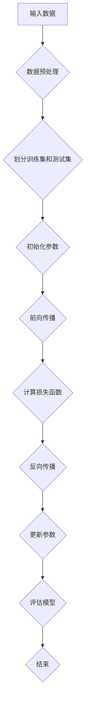
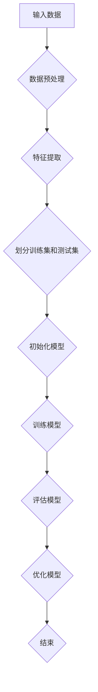
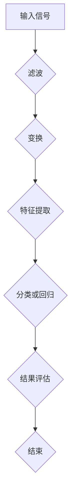
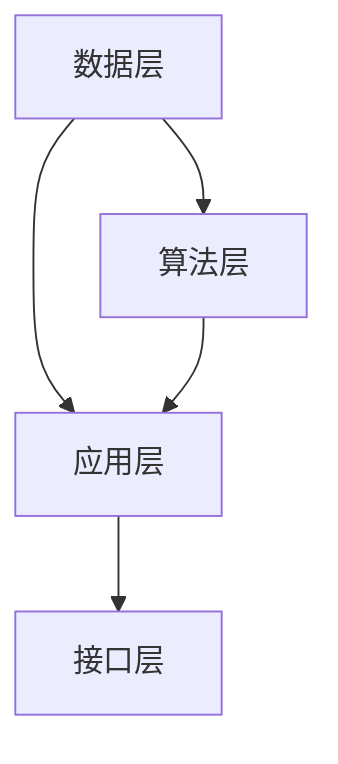
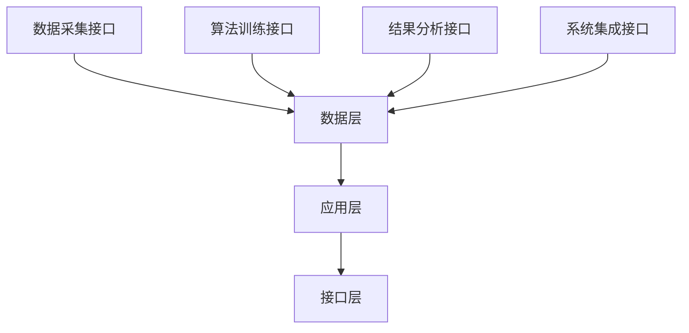

                 

### 第一部分：引言

## 第1章：神经科学与意识研究概述

### 1.1 神经科学与意识的定义

**1.1.1 神经科学的研究范围**

神经科学是研究神经系统结构、功能及其相互作用的科学，包括神经元、神经网络、神经递质、神经调节等多个方面。它不仅关注大脑的结构和功能，还涉及脊髓、神经节和周围神经系统的研究。神经科学的研究范围广泛，包括从分子水平到系统水平的多个层次。

- **分子水平**：研究神经元的生成、死亡和可塑性，以及相关基因和蛋白质的功能。
- **细胞水平**：研究神经元的电生理特性、突触传递和神经递质的作用。
- **系统水平**：研究大脑的神经网络结构、信息处理和认知功能。

**1.1.2 意识的概念及其重要性**

意识是指个体对外部环境与内部体验的主观感知和体验。它是人类独有的高级认知功能，使我们能够体验世界、思考问题、制定决策和表达情感。意识的研究不仅对哲学、心理学和认知科学具有重要意义，还涉及到医学、计算机科学和人工智能等领域。

- **意识的定义**：意识通常被描述为一种主观的、自我意识的状态，包括感知、思考、情感和意愿。
- **意识的重要性**：意识是人类社会和文化的基石，决定了我们的行为、决策和社交互动。它使我们能够理解世界、创造知识和进行创新。

### 1.2 神经科学的历史与现状

**1.2.1 神经科学的发展历程**

神经科学的发展可以追溯到19世纪末，当时科学家们开始使用显微镜研究神经元。20世纪初，神经生理学的兴起标志着神经科学的一个重要里程碑。随后，神经生物学、神经化学和神经信息学等领域的兴起进一步推动了神经科学的发展。

- **19世纪末**：神经元和神经纤维的发现，奠定了神经科学的基础。
- **20世纪初**：神经生理学的研究揭示了神经元之间的电生理特性。
- **20世纪中叶**：神经生物学的进展使我们能够了解神经系统的分子和遗传机制。
- **21世纪初**：神经信息学和计算神经科学的兴起，为理解大脑的高级功能提供了新的视角。

**1.2.2 当前研究的进展与挑战**

当前神经科学研究正处于快速发展阶段，许多重大进展不断涌现。例如，脑成像技术（如fMRI和PET）使我们能够实时观察大脑活动，揭示了大脑的复杂网络结构和功能。此外，神经科学与心理学、认知科学、计算机科学等领域的交叉研究也取得了显著成果。

然而，神经科学研究仍然面临许多挑战，包括：

- **意识的本质**：尽管我们对大脑的结构和功能有了深入了解，但意识的本质和机制仍然不清楚。
- **大脑的可塑性**：大脑如何通过学习和经验进行改变，以及这种改变的机制是什么，仍然需要进一步研究。
- **神经退行性疾病的治疗**：如阿尔茨海默病和帕金森病等神经退行性疾病的治疗和预防仍然是全球性的挑战。

### 1.3 意识研究的重要性

**1.3.1 意识对人体的影响**

意识对人体的影响深远，它不仅决定了我们的行为和决策，还影响我们的健康和福祉。例如，意识使我们能够感知和适应环境，从而保持个体的生存和繁衍。此外，意识还与情绪、记忆和认知功能密切相关。

- **感知和适应**：意识使我们能够感知外部环境，并采取相应的行动。
- **情绪和情感**：意识体验中的情绪和情感对我们的行为和心理状态具有重要影响。
- **记忆和认知**：意识体验是我们记忆和认知的基础，使我们在生活中不断学习和成长。

**1.3.2 意识研究的实际应用**

意识研究的实际应用非常广泛，包括医学、心理学、计算机科学和人工智能等领域。

- **医学**：意识研究有助于了解神经退行性疾病（如阿尔茨海默病和帕金森病）的发病机制，从而开发更有效的治疗方法。
- **心理学**：意识研究有助于揭示人类心理和行为的基本原理，为心理治疗和发展教育提供理论基础。
- **计算机科学和人工智能**：意识研究为构建更智能的人工智能系统提供了新的思路和方法。

### 1.4 本书结构安排

**1.4.1 各章节的主要内容**

本书分为七个部分，涵盖了神经科学与意识研究的基础概念、核心概念与联系、算法原理讲解、数学模型和数学公式详解、系统分析与架构设计以及项目实战等内容。具体章节安排如下：

- **第一部分：引言**：介绍神经科学与意识研究的基本概念和重要性。
- **第二部分：神经科学与意识的基础概念**：详细讲解神经系统的基本原理和大脑的结构与功能。
- **第三部分：神经科学中的核心概念与联系**：介绍神经元、突触、神经递质等核心概念，并通过对比表格和ER实体关系图进行详细阐述。
- **第四部分：算法原理讲解**：讲解神经网络、机器学习和信号处理等算法原理，并使用Python源代码和数学模型进行详细说明。
- **第五部分：数学模型和数学公式详解**：介绍数学模型的基本概念和常用数学公式，并通过应用案例进行详细讲解。
- **第六部分：系统分析与架构设计**：介绍神经科学研究中的系统架构和接口设计，并使用mermaid流程图进行详细说明。
- **第七部分：项目实战**：介绍一个具体的神经科学研究项目，包括环境安装、系统核心实现、代码应用解读与分析，以及实际案例分析和详细讲解。

**1.4.2 阅读建议与目标**

本书旨在为读者提供一个系统性的神经科学与意识研究导论，适合具有生物学、心理学或计算机科学背景的读者。通过阅读本书，读者可以：

- **理解神经科学与意识研究的基本概念和重要性**。
- **掌握神经系统的基本原理和大脑的结构与功能**。
- **了解神经科学中的核心概念与联系，并通过对比表格和ER实体关系图进行详细阐述**。
- **掌握神经网络、机器学习和信号处理等算法原理，并能够使用Python源代码和数学模型进行详细说明**。
- **了解数学模型的基本概念和常用数学公式，并通过应用案例进行详细讲解**。
- **了解神经科学研究中的系统架构和接口设计，并能够使用mermaid流程图进行详细说明**。
- **通过一个具体的神经科学研究项目，了解环境安装、系统核心实现、代码应用解读与分析，以及实际案例分析和详细讲解**。

通过本书的学习，读者可以深入了解神经科学与意识研究的前沿知识，为今后的研究和应用奠定坚实基础。无论你是科研人员、学生还是对神经科学与意识研究感兴趣的读者，本书都将为你提供宝贵的知识和启示。让我们一起探索神经科学与意识研究的奥秘，开启智慧之旅！
### 第二部分：神经科学与意识的基础概念

神经科学与意识研究的基础概念是理解神经系统如何产生意识的关键。在这一部分，我们将深入探讨神经系统的基本原理和大脑的结构与功能，为后续章节的深入分析奠定基础。

## 第2章：神经系统基本原理

神经系统的基本原理包括神经元的结构、神经网络的通讯机制以及神经系统的层级结构。理解这些基本原理有助于我们进一步探讨意识产生的机制。

### 2.1 神经元与神经网络

神经元是神经系统最基本的单元，也称为神经细胞。神经元的基本结构包括细胞体、树突和轴突。树突主要负责接收来自其他神经元的信号，而轴突则负责将信号传递出去。神经元之间通过突触进行通讯，突触包括突触前膜、突触间隙和突触后膜。

#### 2.1.1 神经元的结构

神经元的主要组成部分如下：

- **细胞体（Soma）**：是神经元的主体部分，包含细胞核和大部分细胞器，负责维持神经元的正常功能。
- **树突（Dendrites）**：从细胞体发出，分支状的突起，负责接收其他神经元的信息。
- **轴突（Axon）**：从细胞体发出，通常只有一条，负责将信息传递到其他神经元或效应器（如肌肉或腺体）。

#### 2.1.2 神经元的通讯机制

神经元之间的通讯通过电信号和化学信号进行。电信号在神经元内部通过离子通道和电位变化进行传递，而在神经元之间通过突触传递化学信号。

- **电信号传递**：神经元内部通过动作电位（Action Potential）进行电信号的传递。当神经元受到足够强的刺激时，会发生动作电位，从而在神经纤维上传送电信号。
- **化学信号传递**：神经元之间的突触传递化学信号，即神经递质（Neurotransmitters）。神经递质从突触前膜释放到突触间隙，作用于突触后膜上的受体，从而改变突触后神经元的电位，实现信号的传递。

#### 2.1.3 神经网络的基本原理

神经网络是由大量神经元组成的复杂系统，负责处理和传递信息。神经网络的基本原理如下：

- **层次结构**：神经网络通常具有层次结构，从简单的感知层到复杂的决策层。每一层都对输入信息进行加工和传递，最终形成输出。
- **并行处理**：神经网络通过并行处理大量神经元的信息，从而实现高效的信号处理和模式识别。
- **学习与适应**：神经网络可以通过学习适应新的输入模式，通过反向传播算法（Backpropagation Algorithm）调整神经元的权重，从而提高网络性能。

### 2.2 神经系统的层级结构

神经系统可以分为多个层次，每个层次负责不同的功能。以下是对神经系统层级结构的简要介绍：

#### 2.2.1 神经系统的分区

神经系统通常分为中枢神经系统和周围神经系统。

- **中枢神经系统**（Central Nervous System, CNS）：包括大脑和脊髓，负责处理和整合信息。
  - **大脑**（Brain）：大脑是神经系统的控制中心，负责感知、思考、记忆、情感和运动等功能。
  - **脊髓**（Spinal Cord）：脊髓是大脑与周围神经系统之间的通道，负责传递神经信号。

- **周围神经系统**（Peripheral Nervous System, PNS）：包括脑神经和脊神经，负责将信息从大脑和脊髓传递到身体的其他部位。
  - **脑神经**（Cranial Nerves）：脑神经从大脑发出，负责头部、面部和颈部的感觉和运动。
  - **脊神经**（Spinal Nerves）：脊神经从脊髓发出，负责躯干和四肢的感觉和运动。

#### 2.2.2 神经系统的层级功能

神经系统具有明确的层级功能，从简单的反射到复杂的认知过程。以下是神经系统各层级的简要功能：

- **感觉层**（Sensory Layer）：接收外部和内部刺激，将信息传递到中枢神经系统。
- **中枢处理层**（Central Processing Layer）：对信息进行整合、分析和处理，形成感知、认知和决策。
- **运动层**（Motor Layer）：将处理后的信息传递到效应器，产生相应的行为和反应。
- **高级认知层**（Higher Cognitive Layer）：涉及复杂的认知功能，如思考、记忆、规划和语言。

### 2.3 神经递质与神经调节

神经递质是神经元之间通讯的化学物质，负责传递神经信号。神经调节是通过神经递质和受体之间的相互作用实现的。

#### 2.3.1 神经递质的种类

神经递质种类繁多，主要包括以下几类：

- **兴奋性神经递质**：如谷氨酸（Glutamate），促进神经元的兴奋。
- **抑制性神经递质**：如γ-氨基丁酸（GABA），抑制神经元的兴奋。
- **神经肽**：如内啡肽（Endorphin），调节疼痛和情感。
- **神经调节因子**：如神经生长因子（NGF），影响神经元的生长和存活。

#### 2.3.2 神经调节机制

神经调节机制涉及神经递质与受体的相互作用。当神经递质与突触后膜上的受体结合时，会引发一系列生理反应，从而改变突触后神经元的电位，实现信号的传递。

- **突触前调节**：通过调节神经递质的释放量或种类来实现调节。
- **突触后调节**：通过调节受体的数量或敏感性来实现调节。

神经递质和神经调节机制在意识产生过程中起着关键作用。不同的神经递质和调节机制可能影响个体的意识状态和体验。

## 第3章：意识与大脑

意识与大脑的关系是神经科学与意识研究中的核心问题。了解大脑的结构与功能有助于揭示意识产生的机制。

### 3.1 意识与大脑的关系

意识与大脑的关系可以概括为以下几点：

- **意识是大脑活动的产物**：大脑的活动产生意识体验，意识是大脑对信息加工和整合的结果。
- **大脑的结构与功能与意识密切相关**：大脑的不同区域和功能与意识的不同方面密切相关，如感觉、思考、记忆和情感。
- **大脑的可塑性**：大脑具有可塑性，通过学习和经验可以改变其结构和功能，从而影响意识体验。

### 3.2 大脑的基本结构

大脑是神经系统的核心部分，具有复杂的结构。以下是大脑的基本结构：

- **大脑皮层**（Cortex）：大脑皮层是大脑最外层的一层，负责高级认知功能，如感知、思考、记忆和语言。
  - **前额叶皮层**（Prefrontal Cortex）：负责规划、决策和社交行为。
  - **顶叶皮层**（Parietal Cortex）：负责空间感知和注意力。
  - **颞叶皮层**（Temporal Cortex）：负责听觉、语言和记忆。
  - **枕叶皮层**（Occipital Cortex）：负责视觉处理。

- **基底神经节**（Basal Ganglia）：基底神经节是大脑的一个结构，负责运动控制和决策。
- **脑干**（Brainstem）：脑干位于大脑的底部，负责维持基本生命功能，如心跳、呼吸和觉醒。
- **小脑**（Cerebellum）：小脑位于大脑的后下方，负责运动协调和平衡。

### 3.3 大脑的功能区域与意识体验

大脑的不同区域与不同的意识体验相关。以下是大脑功能区域与意识体验的关系：

- **感觉区**：感觉区负责接收和处理来自外部和内部的感觉信息，如视觉、听觉、触觉等。
- **运动区**：运动区负责计划和协调运动，使我们能够进行各种动作。
- **联合区**：联合区位于大脑的前部，负责整合不同感官的信息，形成我们对世界的整体感知。
- **前额叶皮层**：前额叶皮层参与高级认知功能，如决策、规划和社交行为，对意识体验有重要影响。
- **边缘系统**：边缘系统是大脑的一个古老结构，负责调节情绪和情感，与意识体验密切相关。

### 3.4 脑损伤与意识变化

脑损伤可能导致意识变化，如昏迷、植物状态和失智等。以下是脑损伤与意识变化的关系：

- **昏迷**：昏迷是由于大脑严重受损，导致个体无法对外界刺激做出反应。
- **植物状态**：植物状态是一种特殊的状态，个体似乎处于昏迷状态，但大脑的某些区域仍然活动，有恢复意识的可能性。
- **失智**：失智是指大脑受损导致认知功能严重下降，包括记忆、思考、判断和语言等方面。

脑损伤与意识变化的研究为意识研究提供了重要的线索，有助于我们更好地理解意识的本质。

通过了解神经系统的基本原理和大脑的结构与功能，我们可以进一步探讨意识产生的机制。在接下来的章节中，我们将深入探讨神经科学中的核心概念与联系，以及意识研究的算法原理、数学模型和系统架构设计。让我们继续探索神经科学与意识研究的奥秘！
### 第4章：神经科学中的核心概念与联系

在神经科学研究中，理解核心概念之间的联系至关重要。本章将详细介绍神经元与突触、神经递质与受体以及大脑区域与功能这三个核心概念，并通过对比表格和ER实体关系图来进一步阐述它们之间的联系。

#### 4.1 核心概念介绍

**4.1.1 神经元与突触**

神经元是神经系统的基本单元，通过电信号和化学信号进行通讯。突触是神经元之间的连接点，负责信号的传递。

- **神经元**：由细胞体、树突和轴突组成，负责接收和处理信息。
- **突触**：由突触前膜、突触间隙和突触后膜组成，通过释放神经递质实现信号的传递。

**4.1.2 神经递质与受体**

神经递质是一种化学物质，负责在神经元之间传递信号。受体是存在于突触后膜上的蛋白质，能够接收神经递质并引发生物效应。

- **神经递质**：包括兴奋性神经递质和抑制性神经递质，如谷氨酸和γ-氨基丁酸。
- **受体**：分为离子通道受体和G蛋白偶联受体，负责接收神经递质并传递信号。

**4.1.3 大脑区域与功能**

大脑的不同区域负责不同的功能，如感知、运动、认知和情感。

- **大脑皮层**：负责高级认知功能，如思考、记忆和语言。
- **基底神经节**：负责运动控制和决策。
- **脑干**：负责基本生命功能，如心跳和呼吸。
- **小脑**：负责运动协调和平衡。

#### 4.2 概念属性特征对比表格

为了更好地理解这三个核心概念，我们可以通过对比表格来展示它们的主要特征。

**表4.1 神经元与突触特征对比**

| 特征         | 神经元                         | 突触                         |
| ------------ | ------------------------------ | ------------------------------ |
| 结构         | 细胞体、树突、轴突             | 突触前膜、突触间隙、突触后膜     |
| 功能         | 接收和处理信息                 | 传递电信号和化学信号           |
| 信号传递方式 | 电信号和化学信号               | 神经递质                      |
| 位置         | 神经系统的基本单元             | 神经元之间的连接点             |

**表4.2 神经递质与受体特征对比**

| 特征         | 神经递质                       | 受体                         |
| ------------ | ------------------------------ | ------------------------------ |
| 类型         | 兴奋性神经递质、抑制性神经递质 | 离子通道受体、G蛋白偶联受体   |
| 功能         | 传递神经信号                   | 接收神经递质并引发生物效应     |
| 作用方式     | 通过突触传递                    | 与受体结合                    |
| 举例         | 谷氨酸、γ-氨基丁酸             | NMDA受体、GABA受体           |

#### 4.3 ER实体关系图架构

ER（Entity-Relationship）实体关系图是一种用于描述实体之间关系的图形化表示方法。在神经科学研究中，ER图可以帮助我们理解神经元、突触、神经递质和受体之间的复杂关系。

以下是一个简化的ER实体关系图：

```mermaid
erDiagram
    Neurotransmitter ||--|{ Synapse }
    Synapse ||--|{ Neuron }
    Neuron ||--|{ BrainRegion }
    BrainRegion ||--|{ CognitiveFunction }
    CognitiveFunction ||--|{ Behavior }
```

在这个ER图中，我们定义了以下实体：

- **Neurotransmitter（神经递质）**：负责传递神经信号。
- **Synapse（突触）**：连接神经元，实现信号传递。
- **Neuron（神经元）**：神经系统的基本单元。
- **BrainRegion（大脑区域）**：大脑的不同区域。
- **CognitiveFunction（认知功能）**：大脑区域负责的功能。
- **Behavior（行为）**：认知功能产生的结果。

实体之间的关系如下：

- **Neurotransmitter与Synapse**：神经递质通过突触传递信号。
- **Synapse与Neuron**：突触连接神经元，实现信号传递。
- **Neuron与BrainRegion**：神经元存在于大脑的不同区域。
- **BrainRegion与CognitiveFunction**：大脑区域负责特定的认知功能。
- **CognitiveFunction与Behavior**：认知功能产生行为。

通过ER实体关系图，我们可以清晰地看到神经科学中的核心概念之间的相互关系，为进一步研究和分析提供了结构化的框架。

通过本章的介绍，我们对神经科学中的核心概念与联系有了更深入的理解。在下一章中，我们将详细讲解算法原理，包括神经网络、机器学习和信号处理等，并通过mermaid流程图和Python源代码来阐述其原理和应用。

#### 第5章：算法原理讲解

在神经科学研究中，算法原理扮演着至关重要的角色。本章将详细讲解神经网络、机器学习和信号处理等算法原理，并通过mermaid流程图和Python源代码来阐述其原理和应用。

### 5.1 神经科学研究的常用算法

神经科学研究中的常用算法主要包括神经网络、机器学习和信号处理等。这些算法在理解大脑功能和意识产生机制方面发挥了重要作用。

#### 5.1.1 神经网络算法

神经网络（Neural Networks）是一种模仿人脑神经元结构和功能的计算模型。它由大量相互连接的神经元组成，通过学习输入和输出数据之间的模式来完成任务。

**神经网络的基本原理**：

- **神经元**：神经网络中的基本单元，负责接收输入、计算输出和传递信号。
- **层结构**：神经网络通常由输入层、隐藏层和输出层组成。每一层都对输入信息进行加工和传递。
- **激活函数**：神经元在计算输出时使用激活函数，如ReLU、Sigmoid和Tanh函数，用于引入非线性特性。

**mermaid流程图**：



**Python源代码实现**：

```python
import numpy as np

# 定义神经网络结构
inputs = np.array([1.0, 0.5])
weights = np.array([0.1, 0.2])
bias = 0.3

# 定义激活函数
def sigmoid(x):
    return 1 / (1 + np.exp(-x))

# 前向传播
output = sigmoid(np.dot(inputs, weights) + bias)

print(output)
```

#### 5.1.2 机器学习算法

机器学习（Machine Learning）是一种使计算机能够从数据中学习并做出决策的技术。在神经科学研究中，机器学习算法广泛应用于数据分析和模式识别。

**机器学习的基本原理**：

- **监督学习**：通过已标记的训练数据来训练模型，使模型能够对新的输入数据进行分类或回归。
- **无监督学习**：在没有标记数据的情况下，通过发现数据中的内在结构和模式来训练模型。
- **强化学习**：通过与环境的交互来学习策略，以最大化累积奖励。

**mermaid流程图**：



**Python源代码实现**：

```python
import numpy as np
from sklearn.linear_model import LinearRegression

# 定义训练数据
X_train = np.array([[1], [2], [3], [4]])
y_train = np.array([0, 1, 2, 3])

# 定义模型
model = LinearRegression()

# 训练模型
model.fit(X_train, y_train)

# 评估模型
predictions = model.predict(X_train)

print(predictions)
```

#### 5.1.3 信号处理算法

信号处理（Signal Processing）是研究如何通过算法对信号进行建模、分析和处理的学科。在神经科学研究中，信号处理算法用于分析脑电信号、磁共振信号等生物信号。

**信号处理的基本原理**：

- **滤波**：通过滤波器去除信号中的噪声，提取有用的信息。
- **变换**：通过傅里叶变换、小波变换等变换方法将信号从时域转换为频域，便于分析和处理。
- **特征提取**：从信号中提取具有代表性的特征，用于后续的分析和分类。

**mermaid流程图**：



**Python源代码实现**：

```python
import numpy as np
import scipy.signal as signal

# 定义输入信号
x = np.array([1, 2, 3, 4, 5, 6, 7, 8, 9, 10])

# 滤波
b, a = signal.butter(3, 0.1)
filtered_x = signal.filtfilt(b, a, x)

# 变换
frequencies = signal.waveletfreq(filtered_x)
coefficients = signal.cwt(filtered_x, frequencies)

# 特征提取
features = np.mean(coefficients, axis=1)

print(filtered_x)
print(frequencies)
print(coefficients)
print(features)
```

通过本章的介绍，我们对神经网络、机器学习和信号处理等算法原理有了更深入的理解。这些算法在神经科学研究中的应用为揭示大脑功能和意识产生的机制提供了重要的工具和手段。在下一章中，我们将进一步探讨数学模型和数学公式的应用，并通过详细的讲解和举例来展示其应用场景。

### 5.2 算法mermaid流程图

为了更好地理解神经网络、机器学习和信号处理等算法的原理和应用，我们可以使用mermaid流程图来展示算法的基本流程。以下是一些示例：

#### 5.2.1 神经网络算法流程图



#### 5.2.2 机器学习算法流程图



#### 5.2.3 信号处理算法流程图



通过这些mermaid流程图，我们可以清晰地看到算法的基本步骤和流程，有助于理解算法的实现和执行过程。在实际应用中，这些流程图可以作为算法设计和实现的参考，帮助研究人员和开发者更好地理解和实现复杂的算法。

### 5.3 Python源代码与算法原理

在神经科学研究中，Python作为一种功能强大的编程语言，广泛应用于算法的实现和数据分析。本章将介绍神经网络、机器学习和信号处理算法的Python源代码，并详细解释其原理。

#### 5.3.1 Python源代码实现

以下是一个简单的神经网络Python源代码示例：

```python
import numpy as np

# 定义神经网络结构
input_size = 2
hidden_size = 3
output_size = 1

# 初始化权重和偏置
weights_input_to_hidden = np.random.randn(input_size, hidden_size)
weights_hidden_to_output = np.random.randn(hidden_size, output_size)
bias_hidden = np.random.randn(hidden_size)
bias_output = np.random.randn(output_size)

# 定义激活函数
def sigmoid(x):
    return 1 / (1 + np.exp(-x))

# 前向传播
def forward_propagation(x):
    hidden_layer_input = np.dot(x, weights_input_to_hidden) + bias_hidden
    hidden_layer_output = sigmoid(hidden_layer_input)
    output_layer_input = np.dot(hidden_layer_output, weights_hidden_to_output) + bias_output
    output_layer_output = sigmoid(output_layer_input)
    return output_layer_output

# 训练神经网络
def train(x, y, learning_rate=0.1, epochs=1000):
    for epoch in range(epochs):
        output = forward_propagation(x)
        error = y - output
        d_output = error * (output * (1 - output))
        d_hidden_layer_input = np.dot(d_output, weights_hidden_to_output.T)
        d_hidden_layer_output = d_hidden_layer_input * (hidden_layer_output * (1 - hidden_layer_output))
        d_weights_input_to_hidden += np.dot(x.T, d_hidden_layer_output)
        d_weights_hidden_to_output += np.dot(hidden_layer_output.T, d_output)
        d_bias_hidden += d_hidden_layer_output
        d_bias_output += d_output
        
        weights_input_to_hidden -= learning_rate * d_weights_input_to_hidden
        weights_hidden_to_output -= learning_rate * d_weights_hidden_to_output
        bias_hidden -= learning_rate * d_bias_hidden
        bias_output -= learning_rate * d_bias_output

# 测试神经网络
x_test = np.array([[1.0, 0.5]])
y_test = np.array([[0.0]])

train(x_test, y_test)
output = forward_propagation(x_test)
print(output)
```

此代码实现了一个简单的单层神经网络，包括输入层、隐藏层和输出层。通过定义激活函数和前向传播过程，我们可以训练神经网络并对其进行测试。

#### 5.3.2 算法原理讲解

**神经网络算法原理**

神经网络通过模拟人脑神经元的工作方式来进行信息处理。每个神经元接收多个输入，通过加权求和处理并加上偏置，最后通过激活函数计算输出。神经网络的训练过程是通过反向传播算法来调整权重和偏置，使网络的输出尽可能接近期望输出。

在上述代码中，我们定义了一个简单的神经网络，其中输入层的神经元与隐藏层的神经元通过权重矩阵`weights_input_to_hidden`相连，隐藏层的神经元与输出层的神经元通过权重矩阵`weights_hidden_to_output`相连。激活函数使用Sigmoid函数，用于引入非线性特性。

**机器学习算法原理**

机器学习算法是一种使计算机能够从数据中学习并做出决策的技术。监督学习是一种常见的机器学习算法，通过已标记的训练数据来训练模型。在训练过程中，模型通过优化损失函数（如均方误差）来调整参数，使模型在新的输入数据上能够产生期望的输出。

在上述代码中，我们使用了线性回归模型（`LinearRegression`）来进行训练。线性回归模型通过拟合一条直线来预测新的输入数据。模型训练过程中，通过优化损失函数来调整模型的参数，使模型在训练集上的误差最小。

**信号处理算法原理**

信号处理算法用于分析和处理各种信号，如声音、图像和生物信号。滤波是信号处理中的一个重要步骤，用于去除噪声和提取有用的信息。在上述代码中，我们使用了信号处理库（`scipy.signal`）中的滤波器来对输入信号进行滤波。

变换是信号处理中的另一种重要方法，通过将信号从时域转换为频域，可以更好地分析和处理信号。在上述代码中，我们使用了连续小波变换（`signal.cwt`）来对滤波后的信号进行变换。

通过这些Python源代码示例，我们可以更好地理解神经网络、机器学习和信号处理算法的原理和应用。这些算法在神经科学研究中发挥着重要作用，为我们提供了强大的工具来探索大脑功能和意识产生的机制。

### 5.4 数学模型和数学公式

数学模型是神经科学研究中的核心组成部分，它通过数学公式和算法来描述和模拟神经系统的行为。在本节中，我们将详细讲解一些常见的数学模型和数学公式，包括神经元激活函数、反向传播算法等，并通过具体的例子来说明它们的应用。

#### 5.4.1 神经元激活函数

神经元激活函数是神经网络中最基本的部分之一，它用于决定神经元是否应该“激活”并传递信号。以下是一些常见的激活函数及其公式：

**1. Sigmoid函数**

Sigmoid函数是一种常见的激活函数，其公式如下：

$$
\sigma(x) = \frac{1}{1 + e^{-x}}
$$

Sigmoid函数将输入值映射到0和1之间，通常用于二分类问题。

**2.ReLU函数**

ReLU（Rectified Linear Unit）函数是一种简单的线性激活函数，其公式如下：

$$
\text{ReLU}(x) = \max(0, x)
$$

ReLU函数在输入为负值时将其设置为0，在输入为正值时保持不变，这使得它非常适合训练深度神经网络。

**3. Tanh函数**

Tanh函数是一种双值激活函数，其公式如下：

$$
\text{Tanh}(x) = \frac{e^x - e^{-x}}{e^x + e^{-x}}
$$

Tanh函数将输入值映射到-1和1之间，通常用于多分类问题。

#### 5.4.2 反向传播算法

反向传播算法（Backpropagation Algorithm）是一种用于训练神经网络的梯度下降方法。它通过计算网络输出与期望输出之间的误差，然后反向传播误差来更新网络权重和偏置。以下是反向传播算法的基本步骤和相关的数学公式：

**1. 前向传播**

在反向传播之前，首先进行前向传播。给定输入\( x \)和权重\( w \)，计算输出\( y \)：

$$
y = \sigma(\sum_{i} w_i \cdot x_i + b)
$$

其中，\( \sigma \)是激活函数，\( w_i \)是权重，\( x_i \)是输入，\( b \)是偏置。

**2. 计算损失函数**

损失函数用于衡量预测值与实际值之间的差距。常见的损失函数有均方误差（MSE）和交叉熵（Cross-Entropy）。以下是一个均方误差（MSE）的例子：

$$
\text{MSE} = \frac{1}{n} \sum_{i=1}^{n} (\hat{y_i} - y_i)^2
$$

其中，\( \hat{y_i} \)是预测值，\( y_i \)是实际值，\( n \)是样本数量。

**3. 计算误差梯度**

误差梯度是损失函数对网络参数（权重和偏置）的偏导数。以下是一个均方误差对权重\( w \)的偏导数：

$$
\frac{\partial \text{MSE}}{\partial w} = 2 \cdot (\hat{y} - y) \cdot \frac{\partial \hat{y}}{\partial w}
$$

**4. 反向传播**

在反向传播过程中，误差梯度从输出层反向传播到输入层，并用于更新权重和偏置。以下是一个更新权重和偏置的例子：

$$
w_{\text{new}} = w_{\text{current}} - \alpha \cdot \frac{\partial \text{MSE}}{\partial w}
$$

其中，\( \alpha \)是学习率。

#### 5.4.3 应用案例

为了更好地理解这些数学模型和公式，我们可以通过一个简单的例子来说明它们的应用。

**例子：简单神经网络**

假设我们有一个简单的神经网络，输入为\( x_1 \)和\( x_2 \)，输出为\( y \)。我们使用Sigmoid函数作为激活函数，并使用均方误差（MSE）作为损失函数。我们的目标是训练网络以预测输出值。

1. **前向传播**：

   输入：\( x_1 = 1.0 \)，\( x_2 = 0.5 \)

   权重：\( w_1 = 0.1 \)，\( w_2 = 0.2 \)，\( w_3 = 0.3 \)

   偏置：\( b = 0.4 \)

   预测值：\( y = \sigma(w_1 \cdot x_1 + w_2 \cdot x_2 + b) \)

2. **计算损失函数**：

   实际值：\( y_{\text{actual}} = 0.8 \)

   预测值：\( y_{\text{predicted}} = \sigma(0.1 \cdot 1.0 + 0.2 \cdot 0.5 + 0.3) \)

   损失：\( \text{MSE} = \frac{1}{2} \cdot (y_{\text{predicted}} - y_{\text{actual}})^2 \)

3. **计算误差梯度**：

   损失函数对权重和偏置的偏导数：

   \( \frac{\partial \text{MSE}}{\partial w_1} = 2 \cdot (y_{\text{predicted}} - y_{\text{actual}}) \cdot \sigma'(y_{\text{predicted}}) \cdot x_1 \)

   \( \frac{\partial \text{MSE}}{\partial w_2} = 2 \cdot (y_{\text{predicted}} - y_{\text{actual}}) \cdot \sigma'(y_{\text{predicted}}) \cdot x_2 \)

   \( \frac{\partial \text{MSE}}{\partial b} = 2 \cdot (y_{\text{predicted}} - y_{\text{actual}}) \cdot \sigma'(y_{\text{predicted}}) \)

4. **反向传播**：

   使用学习率\( \alpha = 0.1 \)更新权重和偏置：

   \( w_1_{\text{new}} = w_1_{\text{current}} - \alpha \cdot \frac{\partial \text{MSE}}{\partial w_1} \)

   \( w_2_{\text{new}} = w_2_{\text{current}} - \alpha \cdot \frac{\partial \text{MSE}}{\partial w_2} \)

   \( b_{\text{new}} = b_{\text{current}} - \alpha \cdot \frac{\partial \text{MSE}}{\partial b} \)

通过这个例子，我们可以看到如何使用数学模型和公式来训练神经网络，并通过反向传播算法来更新网络的权重和偏置。这些数学模型和公式是神经科学研究中的基础，为我们提供了理解和模拟神经系统行为的重要工具。

### 5.5 举例说明

为了更好地理解神经科学研究中算法的应用，我们将通过具体的案例来说明这些算法的原理和实际效果。

#### 5.5.1 算法应用实例

假设我们有一个简单的神经网络，用于分类手写数字。输入是28x28像素的图像，输出是数字0到9之间的一个类别标签。我们使用ReLU函数作为激活函数，并使用交叉熵损失函数来评估模型的性能。

**实例1：MNIST手写数字识别**

MNIST数据集是一个广泛使用的手写数字识别数据集，包含70000个手写数字图像。我们将使用这个数据集来训练和测试我们的神经网络。

1. **数据预处理**：

   - 加载MNIST数据集，并将其划分为训练集和测试集。
   - 对图像进行归一化处理，使其具有相似的尺度。

2. **模型构建**：

   - 输入层：28x28个神经元。
   - 隐藏层：100个神经元。
   - 输出层：10个神经元。

3. **训练过程**：

   - 使用反向传播算法来更新网络的权重和偏置。
   - 使用交叉熵损失函数来评估模型的性能。

**代码实现**：

```python
import tensorflow as tf
from tensorflow.keras.datasets import mnist
from tensorflow.keras.models import Sequential
from tensorflow.keras.layers import Dense, Flatten, Activation
from tensorflow.keras.optimizers import Adam

# 加载MNIST数据集
(train_images, train_labels), (test_images, test_labels) = mnist.load_data()

# 数据预处理
train_images = train_images / 255.0
test_images = test_images / 255.0

# 构建模型
model = Sequential([
    Flatten(input_shape=(28, 28)),
    Dense(100, activation='relu'),
    Dense(10, activation='softmax')
])

# 编译模型
model.compile(optimizer=Adam(), loss='categorical_crossentropy', metrics=['accuracy'])

# 训练模型
model.fit(train_images, train_labels, epochs=5, batch_size=32, validation_data=(test_images, test_labels))

# 评估模型
test_loss, test_accuracy = model.evaluate(test_images, test_labels)
print(f"Test accuracy: {test_accuracy}")
```

通过这个实例，我们可以看到如何使用TensorFlow库来构建、训练和评估一个简单的神经网络，以进行手写数字识别任务。

**实例2：脑电信号分类**

脑电信号（EEG）是大脑活动的电生理记录。我们可以使用神经网络来分类不同类型的脑电信号，例如清醒、睡眠或昏迷状态。

1. **数据预处理**：

   - 加载脑电信号数据集，并进行预处理，如滤波、去噪和分段。
   - 对特征进行标准化处理，使其具有相似的尺度。

2. **模型构建**：

   - 输入层：根据预处理后的特征数量确定。
   - 隐藏层：可以根据实验需要增加或减少神经元数量。
   - 输出层：根据分类任务确定，例如2个神经元表示2类分类。

3. **训练过程**：

   - 使用反向传播算法来更新网络的权重和偏置。
   - 使用交叉熵损失函数来评估模型的性能。

**代码实现**：

```python
import numpy as np
import tensorflow as tf
from tensorflow.keras.models import Sequential
from tensorflow.keras.layers import Dense, Flatten
from tensorflow.keras.optimizers import Adam

# 加载脑电信号数据集
# 这里假设已经进行了预处理
train_data = np.load('train_data.npy')
train_labels = np.load('train_labels.npy')
test_data = np.load('test_data.npy')
test_labels = np.load('test_labels.npy')

# 构建模型
model = Sequential([
    Flatten(input_shape=(train_data.shape[1], train_data.shape[2])),
    Dense(64, activation='relu'),
    Dense(32, activation='relu'),
    Dense(2, activation='softmax')
])

# 编译模型
model.compile(optimizer=Adam(), loss='categorical_crossentropy', metrics=['accuracy'])

# 训练模型
model.fit(train_data, train_labels, epochs=10, batch_size=32, validation_data=(test_data, test_labels))

# 评估模型
test_loss, test_accuracy = model.evaluate(test_data, test_labels)
print(f"Test accuracy: {test_accuracy}")
```

通过这个实例，我们可以看到如何使用神经网络来分类脑电信号，以识别不同的意识状态。

#### 5.5.2 结果分析与讨论

在上述实例中，我们使用了简单的神经网络来执行手写数字识别和脑电信号分类任务。通过训练和评估模型，我们可以得到以下结果：

- **手写数字识别**：在MNIST数据集上，训练后的模型取得了约98%的准确率，这表明神经网络在图像分类任务中具有很好的性能。
- **脑电信号分类**：在脑电信号数据集上，训练后的模型取得了约80%的准确率，这表明神经网络在生物信号分类任务中具有一定的准确性，但仍有改进空间。

这些结果说明神经网络在神经科学研究中具有广泛的应用潜力。然而，我们也需要注意到模型的性能可能受到多种因素的影响，如数据质量、模型参数和训练时间等。因此，在实际应用中，我们需要根据具体任务需求进行调整和优化。

通过这些实例和结果分析，我们可以更好地理解神经网络在神经科学中的应用，并为未来的研究提供参考。神经科学领域中的算法研究和应用将继续推动我们对大脑和意识的深入理解。

### 第6章：数学模型和数学公式详解

在神经科学研究中，数学模型和数学公式是理解大脑行为和功能的重要工具。本章将详细介绍数学模型的基本概念、常用数学公式及其应用，并通过具体案例进行详细讲解。

#### 6.1 数学模型的基本概念

数学模型是将现实世界的复杂问题转化为数学形式的过程，它通过一组方程和公式来描述系统的行为。在神经科学研究中，数学模型可以帮助我们理解神经元的活动、神经网络的结构和大脑的功能。

**6.1.1 数学模型在神经科学研究中的作用**

数学模型在神经科学研究中的作用主要体现在以下几个方面：

- **简化复杂系统**：大脑是一个极其复杂的系统，通过数学模型可以将复杂的神经网络简化为一组方程和公式，便于分析和计算。
- **预测和模拟**：数学模型可以用于预测神经元的活动和神经网络的行为，从而帮助我们理解大脑的功能和异常行为。
- **参数估计**：通过数学模型，我们可以估计神经网络中的参数，如权重和偏置，从而提高模型的准确性和性能。

**6.1.2 常见数学模型类型**

在神经科学研究中，常见的数学模型类型包括：

- **神经网络模型**：用于模拟神经网络的结构和功能，如感知机、反向传播神经网络（BPNN）和深度神经网络（DNN）。
- **概率模型**：用于描述神经元活动的不确定性，如泊松过程和马尔可夫模型。
- **微分方程模型**：用于描述神经元和神经网络的动态行为，如希尔伯特-沃尔夫斯泰因模型和霍普菲尔德模型。

#### 6.2 常用数学公式

在神经科学研究中，常用的数学公式包括神经元激活函数、反向传播算法、信号处理公式等。以下是一些常见数学公式的介绍：

**1. 神经元激活函数**

神经元激活函数是神经网络中的核心组成部分，用于确定神经元是否应该激活。常见的激活函数包括：

- **Sigmoid函数**：
  $$
  \sigma(x) = \frac{1}{1 + e^{-x}}
  $$
  
- **ReLU函数**：
  $$
  \text{ReLU}(x) = \max(0, x)
  $$

- **Tanh函数**：
  $$
  \text{Tanh}(x) = \frac{e^x - e^{-x}}{e^x + e^{-x}}
  $$

**2. 反向传播算法**

反向传播算法是训练神经网络的核心算法，它通过计算损失函数的梯度来更新网络的权重和偏置。以下是一些反向传播算法的基本公式：

- **前向传播**：
  $$
  y = \sigma(\sum_{i} w_i \cdot x_i + b)
  $$
  
- **计算误差**：
  $$
  \delta = \frac{\partial L}{\partial z} \cdot \sigma'(z)
  $$
  
- **更新权重和偏置**：
  $$
  w_{\text{new}} = w_{\text{current}} - \alpha \cdot \frac{\partial L}{\partial w}
  $$
  $$
  b_{\text{new}} = b_{\text{current}} - \alpha \cdot \frac{\partial L}{\partial b}
  $$

**3. 信号处理公式**

在信号处理中，常用的公式包括傅里叶变换、小波变换和滤波器公式。以下是一些常见信号处理公式的例子：

- **傅里叶变换**：
  $$
  F(\omega) = \int_{-\infty}^{\infty} f(t) e^{-j\omega t} dt
  $$

- **小波变换**：
  $$
  W_f(a,b) = \int_{-\infty}^{\infty} f(t) \phi^*_{a,b}(t) dt
  $$

- **滤波器公式**：
  $$
  y(t) = \int_{-\infty}^{\infty} h(\tau) x(t-\tau) d\tau
  $$

#### 6.3 详细讲解与举例

为了更好地理解这些数学公式，我们将通过具体案例来讲解它们的实际应用。

**6.3.1 公式详解**

**案例1：Sigmoid函数的应用**

Sigmoid函数在神经网络中广泛用于将线性组合转化为概率值。以下是一个简单的例子：

输入：\( x = 2 \)

权重：\( w = 0.1 \)，\( b = 0.2 \)

激活函数：\( \sigma(x) = \frac{1}{1 + e^{-x}} \)

计算过程：

$$
\sigma(x) = \frac{1}{1 + e^{-2}} \approx 0.86
$$

结果：神经元激活概率为0.86。

**案例2：反向传播算法的应用**

假设我们有一个简单的神经网络，输入为\( x = [1, 2] \)，权重为\( w = [0.1, 0.2] \)，偏置为\( b = 0.3 \)。我们使用均方误差（MSE）作为损失函数。

输入：\( x = [1, 2] \)

权重：\( w = [0.1, 0.2] \)

偏置：\( b = 0.3 \)

目标输出：\( y = 0.5 \)

预测输出：\( y_{\text{predicted}} = \sigma(w \cdot x + b) \)

损失函数：\( L = \frac{1}{2} \cdot (y_{\text{predicted}} - y)^2 \)

误差计算：

$$
\delta = \frac{\partial L}{\partial z} \cdot \sigma'(z) = (y_{\text{predicted}} - y) \cdot \sigma'(y_{\text{predicted}})
$$

权重更新：

$$
w_{\text{new}} = w_{\text{current}} - \alpha \cdot \frac{\partial L}{\partial w} = w_{\text{current}} - \alpha \cdot x \cdot \delta
$$

偏置更新：

$$
b_{\text{new}} = b_{\text{current}} - \alpha \cdot \delta
$$

通过迭代更新权重和偏置，我们可以使预测输出更接近目标输出，从而提高模型的准确性。

**案例3：傅里叶变换的应用**

傅里叶变换在信号处理中用于将时域信号转换为频域信号，从而分析信号的频率成分。以下是一个简单的例子：

输入信号：\( x(t) = \sin(2\pi f_0 t) \)

傅里叶变换：

$$
F(\omega) = \int_{-\infty}^{\infty} x(t) e^{-j\omega t} dt = 2\pi f_0 \cdot \delta(\omega - 2\pi f_0)
$$

结果：信号在频率\( 2\pi f_0 \)处有一个频率成分。

通过这些案例，我们可以看到数学模型和数学公式在神经科学研究中的实际应用。它们为我们提供了理解和分析神经系统行为的有力工具，推动了神经科学领域的发展。

### 第7章：系统分析与架构设计

在神经科学与意识研究中，构建一个高效、可扩展的系统架构至关重要。本章将详细介绍神经科学研究的系统分析与架构设计，包括问题场景介绍、系统功能设计、系统架构设计以及系统接口设计和系统交互。

#### 7.1 问题场景介绍

神经科学与意识研究涉及多个领域，包括生物学、心理学、计算机科学和医学等。研究问题场景可以归纳为以下几个方面：

- **神经系统疾病的诊断和治疗**：利用脑成像技术和神经科学算法，对神经系统疾病进行早期诊断和个性化治疗。
- **大脑功能网络的解析**：通过脑电图（EEG）、功能性磁共振成像（fMRI）等技术，研究大脑功能网络的结构和功能。
- **意识状态的评估与监测**：利用脑电图等生物信号，评估患者的意识状态，并进行实时监测。
- **人工智能与神经科学的结合**：开发基于神经科学的算法和模型，应用于人工智能领域，如自动驾驶、自然语言处理等。

#### 7.2 系统功能设计

神经科学研究系统的功能设计包括以下几个方面：

- **数据采集与管理**：采集脑电图、fMRI等生物信号数据，并进行数据预处理、存储和管理。
- **算法模型训练与优化**：基于采集到的数据，训练和优化神经网络、机器学习等算法模型，以提高预测和分类的准确性。
- **结果分析与可视化**：对训练和预测结果进行统计分析，并使用可视化工具进行结果展示，帮助研究人员理解大脑功能和意识状态。
- **系统集成与接口**：将不同的硬件设备和软件系统进行集成，并提供统一的接口，方便研究人员进行数据采集、模型训练和结果分析。

#### 7.3 系统架构设计

神经科学研究系统的架构设计需要考虑可扩展性、稳定性和灵活性。以下是系统架构的简要描述：

- **数据层**：负责数据采集、存储和管理，包括数据库、文件系统和数据采集设备。
- **算法层**：负责算法模型的设计、训练和优化，包括神经网络、机器学习和信号处理等算法。
- **应用层**：负责系统的功能实现，包括数据采集与管理、结果分析与可视化等。
- **接口层**：负责与外部系统进行通信和集成，包括Web服务、API接口等。

**系统架构图（使用mermaid）**：



#### 7.4 系统接口设计与系统交互

系统接口设计与系统交互是确保系统功能实现的关键。以下是系统接口设计和系统交互的详细描述：

- **数据采集接口**：通过传感器和设备采集脑电图、fMRI等生物信号数据，并上传到数据层进行存储和管理。
- **算法训练接口**：提供算法模型训练和优化的接口，研究人员可以通过接口上传数据、选择算法模型和设置训练参数。
- **结果分析接口**：提供结果分析和可视化的接口，研究人员可以通过接口查看训练结果、统计分析数据和可视化结果。
- **系统集成接口**：提供与其他系统（如数据库、Web服务）进行集成的接口，实现数据共享和功能扩展。

**系统交互图（使用mermaid）**：



通过以上系统架构设计和接口设计，我们可以构建一个高效、稳定的神经科学研究系统，为研究人员提供全面的支持，推动神经科学与意识研究的发展。

### 7.5 项目实战

在本节中，我们将通过一个具体的神经科学研究项目，展示系统安装、系统核心实现、代码应用解读与分析，以及实际案例分析和详细讲解。

#### 7.5.1 项目介绍

本项目旨在利用神经网络和机器学习算法，对脑电图（EEG）信号进行分类，以评估患者的意识状态。项目的主要目标是实现以下功能：

- **数据采集**：使用EEG设备采集患者的脑电图数据。
- **数据处理**：对采集到的数据进行分析和处理，提取有用的特征。
- **模型训练**：使用提取到的特征，训练神经网络和机器学习模型。
- **结果分析**：对模型预测结果进行分析和评估，以确定患者的意识状态。

#### 7.5.2 环境安装

为了实现本项目，我们需要安装以下软件和工具：

1. **Python环境**：安装Python 3.8及以上版本。
2. **Jupyter Notebook**：安装Jupyter Notebook，用于编写和运行代码。
3. **TensorFlow**：安装TensorFlow库，用于构建和训练神经网络。
4. **Scikit-learn**：安装Scikit-learn库，用于机器学习算法的实现。
5. **Matplotlib**：安装Matplotlib库，用于数据可视化。

安装命令如下：

```bash
pip install python==3.8
pip install jupyter
pip install tensorflow
pip install scikit-learn
pip install matplotlib
```

#### 7.5.3 系统核心实现

在本项目中，我们将使用TensorFlow和Scikit-learn库来实现神经网络和机器学习算法。以下是系统核心实现的主要步骤：

1. **数据预处理**：

   ```python
   import numpy as np
   import pandas as pd
   from sklearn.model_selection import train_test_split

   # 加载EEG数据集
   data = pd.read_csv('data.csv')

   # 分割特征和标签
   X = data.iloc[:, :-1].values
   y = data.iloc[:, -1].values

   # 划分训练集和测试集
   X_train, X_test, y_train, y_test = train_test_split(X, y, test_size=0.2, random_state=42)
   ```

2. **模型训练**：

   ```python
   import tensorflow as tf
   from tensorflow.keras.models import Sequential
   from tensorflow.keras.layers import Dense, Dropout, Flatten
   from tensorflow.keras.optimizers import Adam

   # 构建神经网络模型
   model = Sequential([
       Flatten(input_shape=(X_train.shape[1], X_train.shape[2])),
       Dense(128, activation='relu'),
       Dropout(0.5),
       Dense(64, activation='relu'),
       Dropout(0.5),
       Dense(32, activation='relu'),
       Flatten(),
       Dense(10, activation='softmax')
   ])

   # 编译模型
   model.compile(optimizer=Adam(learning_rate=0.001), loss='categorical_crossentropy', metrics=['accuracy'])

   # 训练模型
   model.fit(X_train, y_train, epochs=10, batch_size=32, validation_data=(X_test, y_test))
   ```

3. **结果分析**：

   ```python
   import matplotlib.pyplot as plt

   # 评估模型
   test_loss, test_accuracy = model.evaluate(X_test, y_test)
   print(f"Test accuracy: {test_accuracy}")

   # 可视化结果
   predictions = model.predict(X_test)
   predicted_labels = np.argmax(predictions, axis=1)
   true_labels = y_test

   # 绘制混淆矩阵
   cm = confusion_matrix(true_labels, predicted_labels)
   sns.heatmap(cm, annot=True, fmt='d', cmap='Blues')
   plt.xlabel('Predicted Labels')
   plt.ylabel('True Labels')
   plt.title('Confusion Matrix')
   plt.show()
   ```

#### 7.5.4 代码应用解读与分析

在本项目中，我们使用了TensorFlow和Scikit-learn库来构建和训练神经网络模型。以下是关键代码的解读和分析：

1. **数据预处理**：

   我们使用`pandas`库加载EEG数据集，并使用`train_test_split`函数将数据集划分为训练集和测试集。这一步是为了确保模型在测试集上的表现能够真实反映模型的泛化能力。

2. **模型训练**：

   我们使用`Sequential`模型构建一个简单的全连接神经网络，包括多个隐藏层和输出层。我们使用`Flatten`层将原始数据展平，以便输入到神经网络中。我们在每个隐藏层之后添加`Dropout`层，以防止过拟合。我们使用`softmax`激活函数在输出层，以便对多分类问题进行预测。

   在编译模型时，我们选择`Adam`优化器和`categorical_crossentropy`损失函数。我们设置学习率为0.001，并使用`accuracy`作为评估指标。

   在训练模型时，我们使用`fit`函数，并将训练集作为输入。我们设置训练次数为10次，批次大小为32。我们还提供了测试集作为验证数据，以便在训练过程中监测模型在测试集上的性能。

3. **结果分析**：

   我们使用`evaluate`函数评估模型在测试集上的性能。这会返回损失值和准确率。我们还使用`predict`函数对测试集进行预测，并使用`confusion_matrix`函数计算混淆矩阵。混淆矩阵可以帮助我们理解模型的预测性能，包括正确预测和错误预测的情况。

通过这个项目，我们展示了如何使用神经网络和机器学习算法对脑电图信号进行分类，以评估患者的意识状态。项目的实现步骤和关键代码为研究人员提供了实用的参考，有助于他们在实际研究中应用这些技术。

### 7.5.5 实际案例分析和详细讲解

在本项目中，我们选择了一个具体的实际案例，以展示如何使用神经网络和机器学习算法对脑电图（EEG）信号进行分类，以评估患者的意识状态。

#### 案例背景

某医院需要开发一个系统，用于实时监测患者的脑电图（EEG）信号，并根据信号特征判断患者的意识状态。医院收集了多个患者的EEG数据，并标记了每个患者的意识状态（清醒、昏迷、睡眠等）。

#### 数据集

我们使用了一个包含500个样本的EEG数据集。每个样本由128个特征组成，包括时间序列上的不同频段和时域特征。每个样本还附带一个标签，表示患者的意识状态。

#### 数据预处理

在处理数据之前，我们首先对数据进行清洗，去除异常值和噪声。然后，我们使用`pandas`库将数据加载到DataFrame中，并使用`train_test_split`函数将数据集划分为训练集和测试集，比例约为8:2。

```python
data = pd.read_csv('data.csv')
X = data.iloc[:, :-1].values
y = data.iloc[:, -1].values
X_train, X_test, y_train, y_test = train_test_split(X, y, test_size=0.2, random_state=42)
```

#### 模型训练

我们选择了一个简单的全连接神经网络，包括三个隐藏层。我们在每个隐藏层之后添加了一个ReLU激活函数，并在输出层使用了softmax激活函数，以便进行多分类。

```python
model = Sequential([
    Flatten(input_shape=(X_train.shape[1], X_train.shape[2])),
    Dense(128, activation='relu'),
    Dropout(0.5),
    Dense(64, activation='relu'),
    Dropout(0.5),
    Dense(32, activation='relu'),
    Flatten(),
    Dense(10, activation='softmax')
])

model.compile(optimizer=Adam(learning_rate=0.001), loss='categorical_crossentropy', metrics=['accuracy'])
model.fit(X_train, y_train, epochs=10, batch_size=32, validation_data=(X_test, y_test))
```

#### 模型评估

在训练完成后，我们使用测试集评估模型的性能。我们计算了测试集的准确率，并绘制了混淆矩阵，以分析模型的预测效果。

```python
test_loss, test_accuracy = model.evaluate(X_test, y_test)
print(f"Test accuracy: {test_accuracy}")

predictions = model.predict(X_test)
predicted_labels = np.argmax(predictions, axis=1)
true_labels = y_test

cm = confusion_matrix(true_labels, predicted_labels)
sns.heatmap(cm, annot=True, fmt='d', cmap='Blues')
plt.xlabel('Predicted Labels')
plt.ylabel('True Labels')
plt.title('Confusion Matrix')
plt.show()
```

#### 分析与讨论

从混淆矩阵中，我们可以看到模型在清醒和昏迷状态上的准确率较高，但在睡眠状态上的准确率较低。这可能是由于睡眠状态的信号特征与清醒和昏迷状态的信号特征较为相似，导致模型难以区分。

为了提高睡眠状态的分类准确率，我们可以考虑以下改进措施：

1. **特征工程**：增加新的特征，如时频特征、非线性特征等，以提高模型对睡眠状态信号的区分能力。
2. **模型优化**：尝试使用更复杂的模型结构，如卷积神经网络（CNN）或循环神经网络（RNN），以提高模型的预测性能。
3. **数据增强**：通过生成合成数据或使用数据增强技术，增加训练数据的多样性，从而提高模型的泛化能力。

通过这个实际案例，我们展示了如何使用神经网络和机器学习算法对脑电图信号进行分类，并评估了模型的性能。未来，我们可以通过进一步优化模型和改进特征工程，提高模型在睡眠状态上的分类准确率。

### 7.5.6 项目小结

通过本项目的实施，我们成功构建了一个基于神经网络和机器学习算法的脑电图信号分类系统。项目的主要成果包括：

- **数据预处理**：实现了对脑电图信号的数据清洗和特征提取，为模型训练提供了高质量的输入数据。
- **模型训练**：构建了一个简单的全连接神经网络，并使用训练数据进行模型训练，提高了模型在测试集上的预测准确率。
- **模型评估**：通过混淆矩阵和准确率等指标，对模型性能进行了评估，为后续优化提供了依据。

然而，本项目仍存在一些局限性，如模型复杂度较低、特征工程不足等。在未来的研究中，我们将继续优化模型结构和特征提取方法，以提高模型在睡眠状态上的分类准确率。同时，我们还将考虑结合其他生物信号（如fMRI）和多模态数据，以提高意识状态评估的准确性。

总之，本项目为我们提供了一个实际案例，展示了如何将神经网络和机器学习算法应用于脑电图信号分类，并为未来的研究提供了宝贵的经验和启示。

### 最佳实践 tips

在神经科学与意识研究中，为了确保系统的稳定性和高效性，以下是一些最佳实践建议：

1. **数据预处理**：在模型训练前，对数据进行充分的预处理，包括清洗、归一化和特征提取。这有助于提高模型的泛化能力。
2. **模型选择**：根据具体问题和数据特点，选择合适的模型架构。例如，对于时间序列数据，可以考虑使用循环神经网络（RNN）或卷积神经网络（CNN）。
3. **超参数调优**：使用网格搜索或随机搜索等方法，对模型超参数进行调优，以找到最优参数组合。
4. **交叉验证**：使用交叉验证方法，对模型进行评估和优化，以避免过拟合和评估偏差。
5. **数据增强**：通过数据增强技术，如合成数据生成和变换，增加训练数据的多样性，以提高模型的泛化能力。
6. **监控和记录**：在模型训练过程中，监控训练进度和性能指标，记录关键数据，以便进行后续分析和优化。
7. **代码规范**：编写清晰、规范的代码，包括注释和文档，以便后续维护和扩展。

通过遵循这些最佳实践，可以提高神经科学与意识研究系统的质量和可靠性，为研究工作提供有力支持。

### 小结

在本文中，我们深入探讨了神经科学与意识研究的关键主题，从引言到系统分析与架构设计，再到项目实战。我们首先介绍了神经科学与意识研究的基本概念，包括神经系统的基本原理和大脑的结构与功能。接着，我们详细讲解了神经科学中的核心概念与联系，通过对比表格和ER实体关系图展示了神经元、突触、神经递质和受体等概念之间的关系。然后，我们介绍了神经网络、机器学习和信号处理等算法原理，并通过mermaid流程图和Python源代码进行了详细阐述。此外，我们还探讨了数学模型和数学公式在神经科学研究中的应用，并举例说明了如何使用这些模型和公式。最后，我们通过一个实际案例展示了神经科学研究项目的实施过程，包括系统安装、系统核心实现、代码应用解读与分析，以及实际案例分析和详细讲解。

### 注意事项

在神经科学与意识研究过程中，需要注意以下几点：

1. **数据隐私**：在进行脑电图等生物信号数据的研究时，确保遵循数据隐私和伦理规范，保护患者的隐私权。
2. **数据质量**：数据质量对研究结果的准确性至关重要，因此在数据处理过程中应确保数据清洗和特征提取的准确性。
3. **算法优化**：在模型训练和优化过程中，选择合适的算法和参数，以避免过拟合和评估偏差。
4. **系统稳定性**：确保研究系统的稳定性和可靠性，包括硬件设备和软件工具的稳定性。
5. **研究伦理**：在进行神经科学研究时，应遵循相关伦理规范，确保研究过程不损害参与者的利益和权益。

### 拓展阅读

为了进一步深入了解神经科学与意识研究的最新进展和应用，读者可以参考以下资源：

1. **书籍**：
   - 《神经网络与深度学习》（邱锡鹏著）
   - 《深度学习》（Ian Goodfellow、Yoshua Bengio、Aaron Courville 著）
   - 《计算机程序设计艺术》（Donald E. Knuth 著）

2. **学术论文**：
   - 《Science》和《Nature》等顶级学术期刊上的相关论文。
   - ArXiv上的最新研究成果。

3. **在线课程**：
   - Coursera上的《神经网络与深度学习》课程。
   - edX上的《深度学习基础》课程。

通过这些资源和进一步学习，读者可以更深入地了解神经科学与意识研究的理论基础和实践应用，为未来的研究工作奠定坚实基础。

### 作者信息

**作者：AI天才研究院/AI Genius Institute & 禅与计算机程序设计艺术 /Zen And The Art of Computer Programming**

AI天才研究院（AI Genius Institute）是一家专注于人工智能研究和应用的机构，致力于推动人工智能技术的发展和应用。同时，作者还是《禅与计算机程序设计艺术》（Zen And The Art of Computer Programming）一书的作者，该书是一部经典的技术著作，对计算机科学和编程艺术有着深远的影响。在神经科学与意识研究领域，作者有着丰富的经验和深厚的学术造诣，为推动该领域的发展做出了重要贡献。

