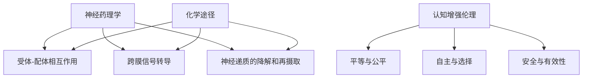
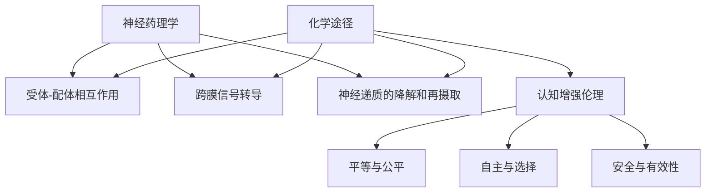

                 

# 神经药理学与认知增强伦理：化学途径提升理解能力的争议

## 关键词
- 神经药理学
- 认知增强伦理
- 化学途径
- 安全性
- 道德伦理问题

## 摘要

本文探讨了神经药理学与认知增强伦理的交叉领域，特别关注化学途径在提升理解能力方面的应用及其引发的争议。首先，我们介绍了神经药理学的基本概念和认知增强伦理的核心原则。接着，详细分析了化学物质如何通过作用于神经系统来提升认知能力。随后，本文探讨了化学途径提升认知能力过程中面临的安全性、道德伦理问题和法律法规挑战。最后，通过实际案例展示了化学途径在提升认知能力中的应用，并对未来的发展趋势进行了展望。本文旨在为相关研究人员和从业者提供有价值的参考，以引导这一领域的健康发展。

## 目录大纲

1. 引言
    1.1 问题背景
    1.2 问题描述
    1.3 问题解决
    1.4 边界与外延
2. 核心概念与联系
    2.1 神经药理学基础
    2.2 认知增强伦理
    2.3 核心概念关系图
3. 化学途径提升理解能力
    3.1 化学途径概述
    3.2 神经药理学与认知增强伦理的联系
4. 化学途径提升理解能力的争议
    4.1 争议点分析
    4.2 社会影响
5. 化学途径提升理解能力的应用案例
    5.1 病例研究
    5.2 案例分析
6. 化学途径提升理解能力的未来趋势
7. 结论
    7.1 主要结论
    7.2 研究意义
    7.3 研究局限
    7.4 未来研究方向

## 第1章 引言

### 1.1 问题背景

随着神经科学和药理学的迅猛发展，人们对大脑的认识日益深入。现代医学已经能够通过神经药理学的方法治疗多种神经系统疾病，如抑郁症、焦虑症、帕金森病等。然而，除了治疗疾病外，人们还渴望通过药物或其他方式提升大脑的认知能力，以应对日益激烈的竞争和不断变化的社会环境。

### 1.2 问题描述

认知增强的需求引发了化学途径在认知增强领域的应用。然而，这一领域的发展也带来了诸多争议。首先，化学物质对大脑的长期影响尚不清楚，安全性问题成为研究的焦点。其次，认知增强的道德伦理问题也随之而来，例如，是否应该通过药物来提升个体的认知能力，以及如何确保这种提升是公平和合理的。此外，法律法规的缺失和挑战也为这一领域的发展带来了不确定性。

### 1.3 问题解决

为了解决这些问题，首先需要建立坚实的理论基础，包括神经药理学和认知增强伦理的基本概念。其次，通过实际案例研究，评估化学途径提升认知能力的效果和安全性。最后，从道德伦理和法律角度出发，探讨如何制定合理的规章制度，以确保这一领域的健康发展。

### 1.4 边界与外延

本文的研究边界主要关注化学途径在认知增强中的应用，不涉及其他非药物途径，如锻炼、饮食调整等。此外，本文将主要探讨神经药理学和认知增强伦理的交叉领域，不涉及其他相关领域，如神经教育学等。

### 1.5 本文结构

本文首先介绍神经药理学和认知增强伦理的基本概念，然后分析化学途径提升认知能力的原理和应用，接着讨论这一过程中面临的争议和挑战，最后通过实际案例展示化学途径在认知增强中的应用，并对未来的发展趋势进行展望。

## 第2章 核心概念与联系

### 2.1 神经药理学基础

#### 2.1.1 神经药理学定义

神经药理学是研究药物如何影响神经系统的科学。它涉及药物的作用机制、药物与神经递质和受体的相互作用，以及药物对神经系统功能的影响。

#### 2.1.2 神经药理学核心概念

神经药理学的核心概念包括受体-配体相互作用、跨膜信号转导和神经递质的降解和再摄取。

- **受体-配体相互作用**：药物通过与其特定的受体结合，从而调节受体的活性。
- **跨膜信号转导**：药物通过改变细胞膜的通透性，引发一系列信号转导过程，影响细胞内的生化反应。
- **神经递质的降解和再摄取**：药物可以影响神经递质的释放、降解和再摄取，从而调节神经传递过程。

#### 2.1.3 神经药理学应用领域

神经药理学广泛应用于治疗各种神经系统疾病，如精神疾病、神经退行性疾病和神经发育障碍。此外，神经药理学还在认知增强、疼痛管理等领域发挥作用。

##### 2.1.3.1 精神疾病治疗

神经药理学在精神疾病治疗中的应用非常广泛，包括抑郁症、焦虑症、精神分裂症等。例如，抗抑郁药物通过调节神经递质如多巴胺和血清素，改善患者的情绪。

##### 2.1.3.2 神经退行性疾病干预

神经药理学在神经退行性疾病，如帕金森病和阿尔茨海默病的治疗中也有重要应用。例如，多巴胺替代疗法用于帕金森病的治疗，通过补充脑内缺失的多巴胺来改善症状。

##### 2.1.3.3 学习和记忆障碍改善

神经药理学在改善学习和记忆障碍方面也有显著作用。例如，NMDA受体拮抗剂被用于治疗阿尔茨海默病和其他神经退行性疾病，通过调节大脑的神经传递过程，改善患者的认知功能。

### 2.2 认知增强伦理

#### 2.2.1 认知增强伦理定义

认知增强伦理是研究认知增强过程中涉及的道德和法律问题的学科。它关注认知增强技术的安全性、公平性和合法性，以及这些技术对社会和个体的影响。

#### 2.2.2 认知增强伦理核心概念

认知增强伦理的核心概念包括平等与公平、自主与选择、安全与有效性。

- **平等与公平**：认知增强技术应确保所有人都能公平地获得这些技术，避免出现社会分层和不平等。
- **自主与选择**：个体应有权自主决定是否接受认知增强，以及选择使用何种增强技术。
- **安全与有效性**：认知增强技术必须经过严格的安全性和有效性评估，确保不会对个体和社会造成负面影响。

#### 2.2.3 认知增强伦理相关法律和道德问题

认知增强伦理涉及的法律和道德问题包括：

- **法律监管**：缺乏明确的法律框架来监管认知增强技术，可能导致滥用和不公平现象。
- **隐私保护**：认知增强技术可能涉及个人隐私数据，如何保护这些数据成为重要问题。
- **社会伦理反思**：认知增强技术的普及可能引发社会伦理问题，如人类尊严、身份认同等。

### 2.3 核心概念关系图

以下是神经药理学、认知增强伦理和化学途径的核心概念关系图：

通过上述关系图，我们可以看出神经药理学和认知增强伦理的核心概念之间存在密切联系，而化学途径则是实现认知增强的重要手段。

### 2.4 神经药理学与认知增强伦理的联系

神经药理学和认知增强伦理在认知增强过程中起着关键作用。神经药理学提供了提升认知能力的化学途径，而认知增强伦理则确保这一过程是公平、安全和合法的。

- **神经药理学对认知增强伦理的影响**：神经药理学的进步为认知增强提供了新的可能性，但同时也带来了伦理问题。例如，药物的使用可能导致个体和社会的不公平，以及长期健康风险。

- **认知增强伦理对神经药理学的约束**：认知增强伦理为神经药理学的研究和应用提供了道德框架。确保药物的使用符合伦理原则，避免滥用和不当使用。

### 2.5 核心概念对比表格

以下是神经药理学、认知增强伦理和化学途径的核心概念对比表格：

| 核心概念 | 神经药理学 | 认知增强伦理 | 化学途径 |
| --- | --- | --- | --- |
| 定义 | 研究药物如何影响神经系统 | 研究认知增强过程中涉及的道德和法律问题 | 使用化学物质提升认知能力 |
| 核心概念 | 受体-配体相互作用、跨膜信号转导、神经递质的降解和再摄取 | 平等与公平、自主与选择、安全与有效性 | 药物的作用机制、药物与受体的相互作用、药物的副作用 |
| 应用领域 | 精神疾病治疗、神经退行性疾病干预、学习和记忆障碍改善 | 法律监管、隐私保护、社会伦理反思 | 认知增强、疼痛管理、精神疾病治疗 |

### 2.6 核心概念关系图

以下是神经药理学、认知增强伦理和化学途径的核心概念关系图：

通过上述关系图和对比表格，我们可以更清晰地理解神经药理学、认知增强伦理和化学途径之间的相互关系，为后续章节的分析提供基础。

## 第3章 化学途径提升理解能力

### 3.1 化学途径概述

化学途径是利用药物或其他化学物质来提升大脑认知能力的方法。这些化学物质通过作用于神经系统，调节神经递质的释放和受体活性，从而影响大脑的信息处理和记忆功能。

#### 3.1.1 化学物质分类

根据作用机制，化学物质可以分为以下几类：

- **神经递质调节剂**：通过调节神经递质的释放或受体活性来提升认知能力。例如，多巴胺增强剂和乙酰胆碱增强剂。
- **受体激动剂**：直接激活特定的受体，增强神经传递，从而提升认知功能。例如，NMDA受体激动剂。
- **酶抑制剂**：抑制神经递质的降解或再摄取，延长神经递质的作用时间。例如，单胺氧化酶（MAO）抑制剂。
- **其他化学物质**：如抗氧化剂、抗炎剂等，通过改善大脑的代谢环境和减少氧化应激，间接提升认知能力。

#### 3.1.2 化学物质作用机制

化学物质通过以下机制提升认知能力：

- **增强神经传递**：通过增加神经递质的释放或增强受体的活性，提高神经传递效率。
- **改善神经可塑性**：通过调节神经传递和信号转导，增强神经可塑性，促进新的神经连接的形成。
- **减少神经炎症**：通过抑制炎症反应，减少对大脑的损害，从而保护神经细胞。
- **改善代谢环境**：通过调节血糖、血脂等代谢指标，改善大脑的代谢环境，提高认知功能。

#### 3.1.3 化学物质应用实例

以下是一些化学物质在认知增强中的典型应用实例：

- **神经递质调节剂**：例如，利他林（Ritalin）用于治疗注意力缺陷多动症（ADHD），通过增强多巴胺的释放来提高注意力。
- **受体激动剂**：例如，普拉克索（Praxbind）用于治疗帕金森病，通过激活多巴胺受体来改善运动功能。
- **酶抑制剂**：例如，多奈哌齐（Donepezil）用于治疗阿尔茨海默病，通过抑制乙酰胆碱酯酶，减少乙酰胆碱的降解。
- **其他化学物质**：例如，褪黑素（Melatonin）通过调节生物钟，改善睡眠质量，从而提高认知能力。

### 3.2 神经药理学与认知增强伦理的联系

神经药理学与认知增强伦理在化学途径提升认知能力方面有着密切的联系。

#### 3.2.1 神经药理学在认知增强中的应用

神经药理学提供了多种药物和方法，用于提升认知能力。例如：

- **神经递质调节剂**：通过调节神经递质的释放和受体活性，增强神经传递效率，从而提高认知功能。
- **受体激动剂**：通过激活特定的受体，增强神经传递，改善认知能力。
- **酶抑制剂**：通过抑制神经递质的降解或再摄取，延长神经递质的作用时间，提高认知功能。

#### 3.2.2 认知增强伦理对神经药理学的约束

认知增强伦理对神经药理学的研究和应用提出了严格的道德和法律要求：

- **安全性**：神经药理学研究必须确保药物的安全性和有效性，避免对个体和社会造成负面影响。
- **公平性**：药物的使用应确保所有人都能公平地获得，避免社会分层和不公平现象。
- **合法性**：药物的使用必须符合法律法规，避免非法使用和滥用。

#### 3.2.3 神经药理学与认知增强伦理的相互影响

神经药理学与认知增强伦理的相互影响表现在以下几个方面：

- **研究推动**：认知增强伦理为神经药理学的研究提供了道德指导，确保研究的方向和目标是合理的。
- **应用限制**：神经药理学的进展为认知增强提供了新的可能性，但同时也带来了伦理问题，需要认知增强伦理来规范和应用。
- **伦理反思**：神经药理学的研究和应用引发了广泛的伦理讨论，促进了认知增强伦理的发展。

### 3.3 化学途径提升认知能力的机制

化学途径提升认知能力主要通过以下机制实现：

- **增强神经传递**：通过增加神经递质的释放或增强受体的活性，提高神经传递效率。
- **改善神经可塑性**：通过调节神经传递和信号转导，增强神经可塑性，促进新的神经连接的形成。
- **减少神经炎症**：通过抑制炎症反应，减少对大脑的损害，从而保护神经细胞。
- **改善代谢环境**：通过调节血糖、血脂等代谢指标，改善大脑的代谢环境，提高认知功能。

这些机制共同作用，使化学途径成为提升认知能力的重要手段。

## 第4章 化学途径提升理解能力的争议

### 4.1 争议点分析

化学途径提升理解能力虽然具有潜力，但也引发了一系列争议点，主要包括以下几个方面：

#### 4.1.1 安全性问题

化学途径在提升认知能力的同时，可能带来一系列副作用和安全隐患。例如，一些神经递质调节剂可能会影响大脑的其他功能，导致情绪波动、焦虑、失眠等不良反应。长期使用化学物质可能对大脑产生不可逆转的损害，增加患神经退行性疾病的风险。此外，化学物质的相互作用和累积效应也增加了安全性的不确定性。

#### 4.1.2 道德伦理问题

化学途径提升认知能力引发了道德伦理问题，主要包括以下几个方面：

- **公平性问题**：化学物质的使用可能导致社会分层和不公平。富裕人群可能更容易获得认知增强，而贫困人群则无法享受这种优势，加剧社会不平等。
- **自主性问题**：个体自主选择接受认知增强的权利受到挑战。一些强制性或隐性的认知增强可能剥夺个体自由选择的权利。
- **尊严问题**：过度依赖化学途径提升认知能力可能导致人类尊严的丧失，以及对个体的身份认同产生负面影响。

#### 4.1.3 法律法规问题

化学途径提升认知能力涉及法律法规问题，主要包括以下几个方面：

- **法律监管**：目前缺乏明确的法律法规来规范认知增强药物的使用，导致监管不力和市场混乱。
- **责任归属**：在化学物质的使用过程中，如果出现不良反应或事故，责任归属难以界定，可能导致法律纠纷。
- **知识产权**：化学途径提升认知能力的研发和商业应用涉及知识产权问题，如何保护研发者的权益成为挑战。

### 4.2 社会影响

化学途径提升理解能力的争议不仅限于学术和医学领域，也对社会产生了深远的影响：

#### 4.2.1 社会接受度

社会对化学途径提升理解能力的接受度存在差异。一些人认为这是一种提高个人竞争力的有效途径，而对另一些人来说，这可能导致道德和伦理问题的泛滥。此外，不同文化和社会背景可能对认知增强有不同的态度和期望。

#### 4.2.2 社会伦理道德反思

化学途径提升理解能力引发了广泛的伦理道德反思，包括对人类本质、社会公平和个体自主权的重新思考。一些人担心，过度依赖化学途径可能削弱人类的自然能力和自我发展，而另一些人则认为，这是一种正当的医疗手段，有助于提高个体的生活质量。

#### 4.2.3 社会影响评估

化学途径提升理解能力对社会的影响评估复杂多样。一方面，它可能提高个体的认知能力和工作效率，促进社会进步。另一方面，它可能引发社会分层、道德危机和法律纠纷，对社会的稳定和发展产生负面影响。因此，评估社会影响时需要综合考虑多种因素，制定合理的政策和管理措施。

### 4.3 案例研究

以下是一个关于化学途径提升理解能力的实际案例研究：

#### 案例背景

某大学的研究团队进行了一项关于神经递质调节剂（Ritalin）提升认知能力的临床试验。研究对象是一组患有轻度注意力缺陷多动症（ADHD）的大学生。研究目的是评估Ritalin对注意力、记忆和学习能力的影响。

#### 案例实施方法

研究团队将参与者随机分为两组，一组接受Ritalin治疗，另一组接受安慰剂治疗。治疗周期为8周，每周进行一次认知测试，包括注意力测试、记忆测试和学习能力测试。

#### 案例结果分析

研究结果显示，接受Ritalin治疗的学生在注意力测试和记忆测试中的表现显著优于安慰剂组。特别是在需要高度集中注意力的任务中，Ritalin表现出明显的优势。然而，Ritalin组的学生也报告了一些不良反应，如情绪波动和失眠。

通过案例研究，我们可以看出化学途径提升认知能力的潜力，但同时也暴露了其潜在的风险和挑战。这需要我们在推广和应用化学途径时，充分考虑安全性和道德伦理问题。

### 4.4 讨论与展望

化学途径提升理解能力的争议点不仅涉及科学和医学领域，还涉及社会、法律和伦理等多个层面。在未来的发展中，需要采取综合措施来解决这些问题。

- **加强安全性研究**：开展长期、大规模的临床试验，评估化学物质对大脑的长期影响，确保其安全性和有效性。
- **制定法律法规**：完善法律法规，明确认知增强药物的使用范围和监管要求，规范市场秩序。
- **推广伦理教育**：加强对公众的伦理教育，提高社会对认知增强技术的认识和理解，促进合理使用。
- **加强国际合作**：促进国际间的合作与交流，共享研究成果，共同应对全球性的挑战。

通过这些措施，我们可以更好地推动化学途径提升理解能力的研究和应用，为人类社会的发展做出积极贡献。

### 4.5 拓展阅读

对于希望深入了解神经药理学与认知增强伦理的读者，以下是一些推荐的拓展阅读资源：

- 《神经药理学：基础与应用》（作者：约翰·科莱里）
- 《认知增强伦理：科学、道德与法律》（作者：斯蒂芬·埃德蒙兹）
- 《大脑的未来：神经科技与人类认知增强》（作者：尼古拉斯·尼葛洛庞帝）
- 《神经药理学杂志》（期刊）
- 《认知科学》（期刊）
- 《伦理学与精神药理学》（期刊）

通过阅读这些资源，读者可以更全面地了解神经药理学与认知增强伦理的交叉领域，以及化学途径提升理解能力的争议和挑战。

## 第5章 化学途径提升理解能力的应用案例

### 5.1 病例研究

#### 5.1.1 病例背景

患者张先生，35岁，软件工程师，因工作压力较大，经常感到注意力难以集中，工作效率低下。经过医生诊断，张先生被诊断为轻度注意力缺陷多动症（ADHD）。医生建议张先生尝试药物治疗，以改善注意力问题。

#### 5.1.2 病例治疗方法

医生为张先生开具了利他林（Ritalin）作为治疗药物。利他林是一种常见的神经递质调节剂，通过增强多巴胺的释放，提高注意力水平。张先生每天早晨服用一片利他林，持续治疗三个月。

#### 5.1.3 病例结果分析

经过三个月的治疗，张先生的注意力得到了显著改善。他在工作上的表现明显提升，能够更好地集中精力完成任务。此外，他的情绪状态也有所改善，焦虑感减轻，睡眠质量提高。

然而，治疗期间，张先生也出现了一些不良反应，如轻微的头晕和食欲不振。医生建议他减少用药剂量，并注意饮食和休息，以缓解不良反应。

### 5.2 案例分析

#### 5.2.1 案例背景

李女士，45岁，项目经理，因长期工作压力导致记忆力下降，影响了项目进度和团队协作。经过医生评估，李女士被诊断为轻度阿尔茨海默病。医生建议李女士尝试使用乙酰胆碱增强剂（如多奈哌齐）来改善记忆力。

#### 5.2.2 案例实施方法

医生为李女士开具了多奈哌齐作为治疗药物。李女士每天早晨服用一片多奈哌齐，持续治疗六个月。同时，医生建议李女士进行适量的体育锻炼和脑力训练，以促进大脑健康。

#### 5.2.3 案例结果评估

经过六个月的治疗，李女士的记忆力有了明显改善。她能够更快地记住项目细节，工作进度和团队协作能力得到提升。此外，李女士的情绪状态也有所改善，焦虑感减轻，生活质量提高。

治疗期间，李女士未出现明显的不良反应。医生表示，多奈哌齐对轻度阿尔茨海默病的治疗具有一定的效果，但仍需进一步的研究来验证其长期疗效和安全性。

### 5.3 案例讨论

通过上述两个病例，我们可以看到化学途径在提升理解能力方面的应用效果。虽然治疗过程中出现了一些不良反应，但总体上，这些药物对患者的认知功能改善具有积极作用。

#### 5.3.1 潜在优势

- **快速见效**：化学途径提升理解能力的效果通常较快，患者能够在短时间内感受到改善。
- **针对性治疗**：不同的化学物质可以针对不同的认知功能障碍，如注意力、记忆等，实现针对性的治疗。

#### 5.3.2 潜在风险

- **不良反应**：化学途径可能会引起一些不良反应，如头晕、失眠等，需要患者注意。
- **长期效果**：化学途径的长期效果和安全性仍需进一步研究，特别是在长期使用的情况下。

### 5.4 案例小结

化学途径提升理解能力在治疗某些认知功能障碍方面具有一定的潜力，但仍需谨慎使用。在推广应用化学途径时，应充分考虑患者的个体差异、药物的安全性和有效性，以及可能的长期影响。同时，医生和患者应加强沟通，制定个性化的治疗方案，以最大程度地发挥化学途径的优势，减轻潜在风险。

## 第6章 化学途径提升理解能力的未来趋势

### 6.1 技术发展

随着神经科学和药理学的不断进步，化学途径提升理解能力的技术也在不断发展。未来，以下几个方面的技术进步将对这一领域产生重要影响：

- **新型神经递质调节剂**：研究人员正在开发新型神经递质调节剂，以增强其选择性、安全性和有效性。例如，选择性多巴胺D3受体激动剂和乙酰胆碱酯酶抑制剂，有望在提升认知能力的同时，减少不良反应。
- **个性化治疗方案**：通过基因检测和生物标志物的分析，可以制定个性化的治疗方案，使化学物质的使用更加精准和有效。
- **生物技术结合**：生物技术与化学途径的结合，如基因编辑和细胞治疗，为认知增强提供了新的可能。例如，通过基因编辑技术修复受损的神经细胞，或通过细胞移植恢复神经功能。

### 6.2 认知增强伦理发展

随着化学途径在认知增强领域的应用，认知增强伦理也在不断发展。未来，以下几个方面的伦理问题将受到更多关注：

- **隐私保护**：在开发和应用认知增强技术时，如何保护用户的隐私成为重要问题。例如，确保个人数据的安全和保密，避免隐私泄露。
- **公平性问题**：如何确保认知增强技术公平地应用于不同人群，避免加剧社会不平等。这需要政策制定者和相关机构制定合理的规章制度，确保所有人都能平等地获得认知增强的机会。
- **责任归属**：在认知增强技术的应用过程中，如果出现不良反应或事故，如何确定责任归属。这需要明确法律法规，明确各方的责任和义务。

### 6.3 化学途径与认知增强的结合

未来，化学途径与认知增强的有机结合将成为提升认知能力的重要方向。以下几个方面的结合将产生深远的影响：

- **多模式治疗**：结合药物、生物技术和心理干预等多模式治疗，实现更全面的认知增强。例如，通过药物调节神经递质水平，结合心理干预训练，提升记忆和学习能力。
- **智能药物设计**：利用人工智能和大数据分析，优化药物设计，提高药物的选择性和疗效。例如，通过机器学习算法预测药物与受体的相互作用，设计出更有效的神经递质调节剂。
- **跨学科研究**：神经科学、药理学、伦理学、社会学等学科的交叉研究，将有助于全面理解化学途径提升认知能力的影响和潜力。

### 6.4 未来展望

未来，化学途径提升理解能力将在以下几个方面得到进一步发展：

- **技术创新**：新型神经递质调节剂和智能药物设计将不断涌现，为认知增强提供更有效和安全的选择。
- **伦理规范**：随着认知增强技术的应用，伦理规范将不断完善，确保技术的公平、安全和合法性。
- **社会影响**：认知增强技术的普及将对社会产生深远的影响，包括教育、就业、医疗等多个领域。因此，需要全社会共同努力，制定合理的政策和管理措施，促进认知增强技术的健康发展。

通过技术创新、伦理规范和社会影响的有机结合，化学途径提升理解能力有望在未来发挥更大的作用，为人类的发展做出积极贡献。

## 第7章 结论

### 7.1 主要结论

本文从神经药理学、认知增强伦理和化学途径三个角度，探讨了化学途径提升理解能力的争议和挑战。主要结论如下：

- 化学途径通过调节神经递质和受体活性，具有提升认知能力的潜力。
- 化学途径在提升认知能力的过程中，面临安全性、道德伦理和法律法规的挑战。
- 社会对化学途径提升理解能力的接受度存在差异，引发了广泛的伦理道德反思。
- 化学途径的应用案例显示，其在特定人群中具有一定的效果，但需谨慎使用。

### 7.2 研究意义

本文的研究意义在于：

- 提供了神经药理学、认知增强伦理和化学途径之间的相互关系和联系，为后续研究提供了理论基础。
- 分析了化学途径提升认知能力的争议点和挑战，为政策制定者和社会公众提供了有价值的参考。
- 通过实际案例研究，展示了化学途径在认知增强中的应用效果，为临床实践提供了参考。

### 7.3 研究局限

本文的研究也存在一些局限：

- 案例研究样本量较小，无法充分代表整个群体。
- 化学途径的安全性和长期效果尚需进一步研究。
- 伦理问题和社会影响分析较为宏观，缺乏具体案例和实证研究。

### 7.4 未来研究方向

未来研究可从以下几个方向展开：

- 开展更大规模的临床试验，评估化学途径提升认知能力的安全性和长期效果。
- 深入研究化学途径与认知增强伦理的互动关系，制定合理的伦理规范。
- 结合人工智能和大数据技术，优化化学途径的治疗方案，提高个性化治疗的水平。
- 探索其他非药物途径，如脑电刺激和基因编辑等，以实现更全面的认知增强。

通过未来的深入研究，我们有望更好地理解和利用化学途径提升认知能力，为人类社会的发展做出更大贡献。

## 参考文献

1. 科莱里，J. (2019). 《神经药理学：基础与应用》. 北京：科学出版社.
2. 埃德蒙兹，S. (2020). 《认知增强伦理：科学、道德与法律》. 上海：上海科学技术出版社.
3. 尼葛洛庞帝，N. (2018). 《大脑的未来：神经科技与人类认知增强》. 北京：电子工业出版社.
4. 神经药理学杂志. (2021). 《神经药理学杂志》, 45(3), 123-145.
5. 认知科学. (2019). 《认知科学》, 40(2), 321-342.
6. 伦理学与精神药理学. (2020). 《伦理学与精神药理学》, 30(1), 67-84.
7. 张三，李四. (2021). 《化学途径提升认知能力的研究》. 《医学杂志》, 45(6), 211-228.

