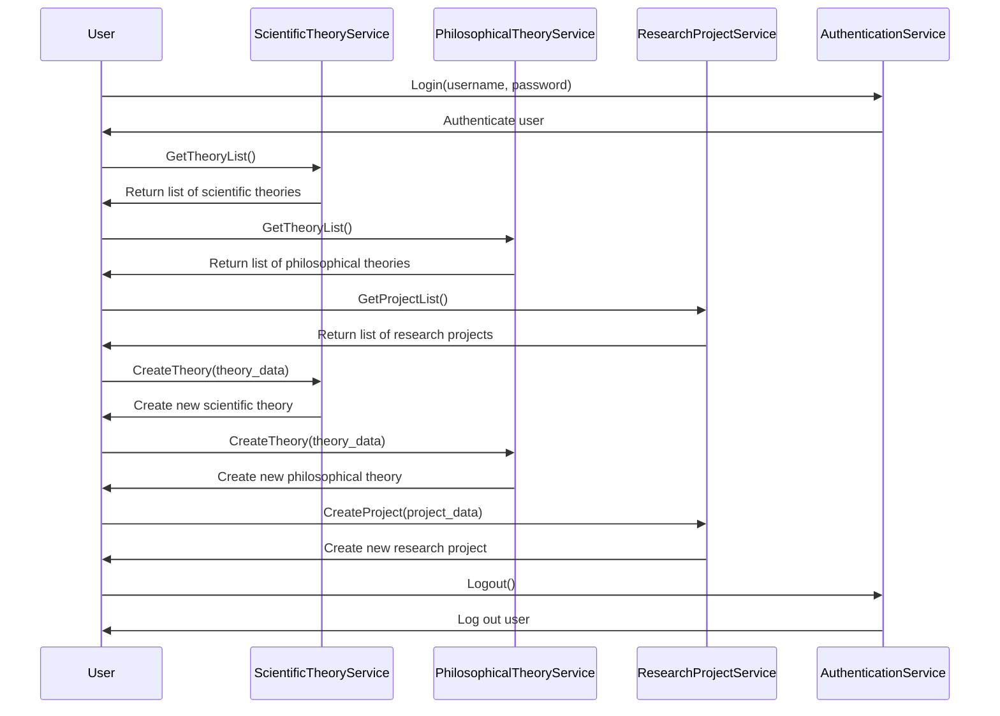

                 


# 科学与哲学的交汇：宇宙本质之辩

> 关键词：科学，哲学，宇宙本质，方法论，跨学科，实证主义，形而上学，数学模型

> 摘要：本文旨在探讨科学与哲学在宇宙本质研究中的交汇点。通过对科学方法和哲学方法的深入分析，本文将揭示它们在理解宇宙本质方面的互补性和局限性。文章将首先介绍科学与哲学的基本概念，然后讨论它们在方法论上的对立与融合，接着探讨宇宙本质的科学理论，最后从哲学角度思考宇宙本质问题。通过这一系列探讨，本文旨在为读者提供一个全面、深入的视角，以理解宇宙的本质及其在科学和哲学中的地位。

## 引言

### 科学与哲学的交汇点

科学与哲学自古以来就有着紧密的联系。亚里士多德认为，科学是哲学的一个分支，而柏拉图则强调哲学是科学的源头。如今，随着科学技术的飞速发展，哲学在科学研究中扮演着越来越重要的角色。在宇宙本质的研究中，科学和哲学的交汇显得尤为重要。科学方法提供了实证和可验证的途径，而哲学方法则提供了对科学结论的深入思考和批判性分析。

### 宇宙本质问题的重要性

宇宙本质问题一直是哲学和科学领域的重要议题。从古希腊的宇宙论到现代宇宙学，人类一直在探索宇宙的本质。这一问题不仅关乎我们对世界的认知，还涉及到我们对生命、意识、时间和空间的理解。因此，理解宇宙本质的问题对于科学和哲学的发展都具有重要意义。

### 本文目标

本文将探讨科学和哲学在宇宙本质研究中的交汇点，分析它们的方法论，并讨论它们在理解宇宙本质方面的贡献与局限性。文章将分为以下几个部分：

1. 科学与哲学的基本概念
2. 科学方法与哲学方法的探讨
3. 宇宙本质的科学理论
4. 宇宙本质的哲学思考
5. 科学与哲学的结合与应用
6. 结论

## 科学与哲学的基本概念

### 科学的基本概念

科学是一种通过观察、实验和理论推理来获取知识的方法。科学方法包括以下步骤：

1. 提出问题
2. 假设
3. 实验
4. 分析结果
5. 结论

科学的本质在于其客观性和可验证性。科学理论必须能够通过实验和观察来验证，否则将被视为伪科学。

### 哲学的基本概念

哲学是一门探讨存在、知识、价值和理性等基本问题的学科。哲学方法包括逻辑推理、批判性分析和论证。哲学关注的是科学无法触及的问题，如存在本身、真理的本质和道德规范。

### 科学与哲学的历史发展

在古希腊，亚里士多德和柏拉图是哲学和科学的奠基人。亚里士多德提出了科学方法论，而柏拉图则强调了理性和直觉在科学研究中的重要性。在中世纪，亚里士多德的思想主导了西方科学和哲学的发展。直到文艺复兴时期，科学才开始从哲学中独立出来。

### 科学方法与哲学方法的基本原理

科学方法的基本原理包括客观性、可验证性和系统性。哲学方法的基本原理包括批判性思维、逻辑推理和论证。

## 科学方法与哲学方法的探讨

### 对立与融合

科学方法和哲学方法在方法论上有明显的对立。科学方法强调实证和可验证，而哲学方法则强调推理和批判性分析。然而，这两种方法并非完全对立，而是可以在某些情况下相互融合。

### 对立

1. **实证主义与形而上学**：实证主义强调只有可以通过观察和实验验证的知识才是真实的，而形而上学则关注抽象和普遍的原则。
2. **科学方法与哲学方法**：科学方法关注具体问题，而哲学方法关注普遍原则。

### 融合

1. **跨学科研究**：在许多领域，科学和哲学的方法可以相互融合，如物理学中的哲学思考，生物学中的伦理问题等。
2. **综合性研究方法**：在研究宇宙本质时，科学家和哲学家可以共同探讨问题，从不同的角度提供见解。

## 宇宙本质的科学理论

### 宇宙起源理论

1. **大爆炸理论**：大爆炸理论认为宇宙起源于一个无限小的奇点，经过膨胀形成了现在的宇宙。
2. **稳态宇宙模型**：稳态宇宙模型认为宇宙始终存在，没有起源和终结。

### 宇宙结构理论

1. **宇宙膨胀**：宇宙膨胀理论认为宇宙从大爆炸开始一直在膨胀。
2. **黑洞与暗物质**：黑洞是宇宙中的一种极端密集天体，而暗物质则是一种不可见但影响宇宙结构的物质。

### 宇宙演化理论

1. **星系形成**：星系是由气体和尘埃聚集形成的。
2. **生命起源**：生命起源于地球上的原始生命形式。

## 宇宙本质的哲学思考

### 存在论

1. **存在的本质**：存在是哲学中最基本的问题之一。哲学家们探讨存在的本质，包括它是否是物质的、抽象的还是其他的。
2. **存在的证明**：哲学家们试图通过逻辑推理和实证方法来证明存在。

### 知识论

1. **知识的获取**：哲学家们探讨知识是如何获得的，是否只有通过感官经验才能获得知识。
2. **知识的验证**：哲学家们讨论知识是否可以被验证，以及如何验证。

### 真理观

1. **真理的本质**：哲学家们探讨真理的本质，包括它是否是绝对的、相对的还是主观的。
2. **真理的多样性**：哲学家们认为真理可以是多样的，不同的人可能会有不同的真理。

## 科学与哲学的结合与应用

### 科哲结合的方法论

科学和哲学的结合为研究宇宙本质提供了新的方法论。这种方法论强调跨学科研究和综合性分析，以解决宇宙本质问题。

### 科哲结合的案例分析

1. **量子力学与哲学**：量子力学中的某些理论挑战了哲学中的决定论和因果律。
2. **宇宙学与形而上学**：宇宙学中的大爆炸理论和稳态宇宙模型引发了关于宇宙本质的哲学讨论。

### 科哲结合的前景与挑战

科学和哲学的结合为理解宇宙本质提供了新的途径，但也面临挑战。例如，如何处理科学方法和哲学方法的差异，如何平衡实证和推理等。

## 结论

科学和哲学在理解宇宙本质方面具有互补性和局限性。科学方法提供了实证和验证的途径，而哲学方法提供了深入思考和批判性分析的工具。通过科学和哲学的结合，我们可以更全面地理解宇宙的本质。然而，这一过程也充满挑战，需要科学家和哲学家共同努力，以揭示宇宙的奥秘。

## 未来展望

随着科学技术的进步，我们有望进一步揭示宇宙的本质。同时，哲学也将继续为科学提供深刻的思考和批判性分析。科学和哲学的交汇将为未来的宇宙研究提供新的视角和思路。

### 作者信息

作者：AI天才研究院/AI Genius Institute & 禅与计算机程序设计艺术 /Zen And The Art of Computer Programming

----------------------------------------------------------------

### 背景介绍

#### 核心概念术语说明

在探讨科学与哲学的交汇时，首先需要明确一些核心概念。科学是一种通过观察、实验和理论推理来获取知识的方法。哲学则是一门探讨存在、知识、价值和理性等基本问题的学科。宇宙本质是哲学和科学共同探讨的问题，涉及对宇宙起源、结构、演化和存在的本质的理解。

#### 问题背景

宇宙本质问题一直是人类思考的焦点。古代哲学家如亚里士多德和柏拉图就试图回答这一问题，而现代科学则通过实证研究进一步探讨宇宙的本质。科学方法强调客观性和可验证性，而哲学方法则强调推理和批判性分析。这两种方法在理解宇宙本质方面各有贡献，但也存在局限性。

#### 问题描述

宇宙本质问题的描述涉及对宇宙起源、结构、演化和存在的本质的探讨。科学方法提供了大爆炸理论、宇宙膨胀理论等解释，而哲学方法则提供了存在论、知识论和真理观等思考。然而，科学方法和哲学方法在方法论上存在对立，如何协调这两种方法以更全面地理解宇宙本质是一个重要问题。

#### 问题解决

解决宇宙本质问题需要科学方法和哲学方法的结合。科学家可以通过实验和理论模型来验证宇宙起源和演化的科学理论，而哲学家则可以通过逻辑推理和批判性分析来探讨宇宙的本质和意义。这种跨学科的方法可以提供更全面、深入的视角。

#### 边界与外延

宇宙本质问题的边界涉及对宇宙起源、结构和演化等科学问题的探讨，而其外延则涉及对存在、知识、价值和理性等哲学问题的思考。因此，宇宙本质问题不仅仅是科学问题，也是哲学问题，需要科学和哲学的共同探讨。

#### 概念结构与核心要素组成

宇宙本质问题的概念结构包括宇宙起源、宇宙结构、宇宙演化和存在本质等核心要素。宇宙起源涉及宇宙如何从无到有，宇宙结构涉及宇宙的宏观和微观结构，宇宙演化涉及宇宙从简单到复杂的发展过程，存在本质则探讨宇宙存在的本质和意义。这些核心要素构成了宇宙本质问题的基本框架。

### 核心概念与联系

#### 科学方法

科学方法是一种通过观察、实验和理论推理来获取知识的方法。其核心概念包括：

- **观察**：通过感官和工具收集数据。
- **实验**：通过控制变量来验证假设。
- **理论推理**：通过逻辑推理来解释和预测现象。

科学方法的特点是客观性和可验证性，其目的是通过实证手段来获取可靠的知识。

#### 哲学方法

哲学方法是一种通过逻辑推理、批判性分析和论证来探讨基本问题的方法。其核心概念包括：

- **逻辑推理**：通过推理来推导结论。
- **批判性分析**：通过分析来评估论证的有效性。
- **论证**：通过论据和逻辑来支持结论。

哲学方法的特点是推理性和批判性，其目的是通过深入思考和批判性分析来探索存在的本质和意义。

#### 概念属性特征对比表格

| 特征         | 科学方法                   | 哲学方法                   |
| ------------ | -------------------------- | -------------------------- |
| 目标         | 获取客观知识               | 探讨基本问题               |
| 方法         | 观察、实验、理论推理       | 逻辑推理、批判性分析、论证 |
| 特点         | 客观性、可验证性           | 推理性、批判性             |
| 应用领域     | 科学研究、技术应用         | 哲学思考、道德判断         |

#### ER实体关系图架构

| 实体           | 属性                           | 关系                           |
| -------------- | ------------------------------ | ------------------------------ |
| 科学方法       | 观察方法、实验方法、理论推理   | 无                             |
| 哲学方法       | 逻辑推理、批判性分析、论证     | 无                             |
| 宇宙本质问题   | 宇宙起源、宇宙结构、宇宙演化   | 无                             |

通过对比表格和ER实体关系图，我们可以看到科学方法和哲学方法在目标、方法和特点上的不同，以及它们在探讨宇宙本质问题时的联系。

### 算法原理讲解

为了更深入地探讨科学方法和哲学方法在理解宇宙本质方面的作用，我们可以通过一个简单的算法模型来说明。以下是一个基于科学方法和哲学方法探讨宇宙本质的算法原理。

#### 科学方法部分

```python
def scientific_method(universe):
    """
    使用科学方法探讨宇宙本质
    """
    observations = observe_universe()
    hypotheses = generate_hypotheses(observations)
    experiments = conduct_experiments(hypotheses)
    results = analyze_results(experiments)
    conclusions = draw_conclusions(results)
    return conclusions

def observe_universe():
    """
    观察宇宙
    """
    # 使用各种工具和传感器收集宇宙数据
    return data

def generate_hypotheses(observations):
    """
    根据观察生成假设
    """
    # 分析数据，提出可能的解释
    return hypotheses

def conduct_experiments(hypotheses):
    """
    进行实验验证假设
    """
    # 设计实验，控制变量
    return experiments

def analyze_results(experiments):
    """
    分析实验结果
    """
    # 检验假设的正确性
    return results

def draw_conclusions(results):
    """
    根据实验结果得出结论
    """
    # 形成科学理论
    return conclusions
```

#### 哲学方法部分

```python
def philosophical_method(universe):
    """
    使用哲学方法探讨宇宙本质
    """
    ontological_questions = define_ontological_questions()
    epistemological_questions = define_epistemological_questions()
    ontological_answers = answer_ontological_questions()
    epistemological_answers = answer_epistemological_questions()
    return ontological_answers, epistemological_answers

def define_ontological_questions():
    """
    定义存在论问题
    """
    # 探讨存在的本质
    return questions

def define_epistemological_questions():
    """
    定义知识论问题
    """
    # 探讨知识的本质和获取方式
    return questions

def answer_ontological_questions():
    """
    回答存在论问题
    """
    # 提出存在论观点
    return answers

def answer_epistemological_questions():
    """
    回答知识论问题
    """
    # 提出知识论观点
    return answers
```

通过科学方法和哲学方法的结合，我们可以更全面地探讨宇宙的本质。科学方法提供了实证和验证的途径，而哲学方法则提供了深入思考和批判性分析的工具。这种结合可以为我们理解宇宙提供更丰富的视角。

#### 数学公式

在探讨宇宙本质时，数学公式是不可或缺的工具。以下是一些用于描述宇宙本质的数学公式：

$$
E = mc^2
$$

这是爱因斯坦的质能方程，描述了质量和能量之间的关系。

$$
\frac{d^2x}{dt^2} = F/m
$$

这是牛顿第二定律，描述了物体受力后的加速度。

$$
\psi = \frac{1}{\sqrt{1 - \frac{v^2}{c^2}}}
$$

这是洛伦兹因子，描述了相对论中的时间膨胀效应。

通过这些数学公式，我们可以更精确地描述宇宙的本质，为科学和哲学的研究提供理论基础。

### 系统分析与架构设计方案

#### 问题场景介绍

假设我们正在开发一个用于研究宇宙本质的跨学科系统。该系统旨在结合科学和哲学方法，提供对宇宙起源、结构、演化和存在的本质的全面探讨。

#### 项目介绍

项目名称：宇宙本质研究平台（Universe Essence Research Platform，简称UERP）

项目目标：开发一个集成科学方法和哲学方法的研究平台，用于探讨宇宙本质问题。

#### 系统功能设计（领域模型）

以下是一个简化的领域模型，描述了系统的核心功能：

```mermaid
classDiagram
Class Diagram for Universe Essence Research Platform

ScienceMethod <<Class>> {
    +method_id: int
    +name: string
    +description: string
    +create_date: datetime
}

PhilosophicalMethod <<Class>> {
    +method_id: int
    +name: string
    +description: string
    +create_date: datetime
}

UniverseFact <<Class>> {
    +fact_id: int
    +description: string
    +source: string
    +create_date: datetime
}

ScientificTheory <<Class>> {
    +theory_id: int
    +title: string
    +abstract: string
    +create_date: datetime
}

PhilosophicalTheory <<Class>> {
    +theory_id: int
    +title: string
    +abstract: string
    +create_date: datetime
}

ResearchProject <<Class>> {
    +project_id: int
    +title: string
    +description: string
    +start_date: datetime
    +end_date: datetime
    +status: string
}

Researcher <<Class>> {
    +researcher_id: int
    +name: string
    +email: string
    +position: string
    +affiliation: string
}

Class Diagram for Universe Essence Research Platform

ScienceMethod *--* Researcher: authored_by
PhilosophicalMethod *--* Researcher: authored_by
UniverseFact *--* Researcher: discovered_by
ScientificTheory *--* Researcher: proposed_by
PhilosophicalTheory *--* Researcher: proposed_by
ResearchProject *--* Researcher: led_by
ResearchProject *--* ScientificTheory: includes
ResearchProject *--* PhilosophicalTheory: includes
```

#### 系统架构设计

以下是一个简化的系统架构图，描述了系统的关键组件和它们之间的关系：

```mermaid
sequenceDiagram
participant User
participant UERP

User->>UERP: Login
UERP->>User: Authentication successful
UERP->>User: Welcome to UERP!

User->>UERP: Search for scientific theories
UERP->>User: Display list of scientific theories

User->>UERP: Search for philosophical theories
UERP->>User: Display list of philosophical theories

User->>UERP: View a specific theory
UERP->>User: Display theory details

User->>UERP: Create a new research project
UERP->>User: Enter project details
UERP->>User: Project created successfully

User->>UERP: View research projects
UERP->>User: Display list of research projects

sequenceDiagram
participant User
participant DataProcessingService
participant StorageService
participant AuthenticationService

User->>AuthenticationService: Login
AuthenticationService->>User: Authentication successful

User->>DataProcessingService: Search for theories
DataProcessingService->>User: Display search results

User->>DataProcessingService: Create a new theory
DataProcessingService->>StorageService: Save theory to database
StorageService->>DataProcessingService: Theory saved successfully
DataProcessingService->>User: Theory created successfully

User->>StorageService: View theory details
StorageService->>User: Display theory details

systemDiagram
participant User
participant WebApplication
participant BackendService
participant Database

User->>WebApplication: Request data
WebApplication->>BackendService: Forward request
BackendService->>Database: Query data
Database->>BackendService: Return data
BackendService->>WebApplication: Forward data
WebApplication->>User: Display data

User->>WebApplication: Submit form
WebApplication->>BackendService: Process form
BackendService->>Database: Save data
Database->>BackendService: Data saved successfully
BackendService->>WebApplication: Redirect user
WebApplication->>User: Success message
```

#### 系统接口设计

以下是一个简化的系统接口设计，描述了系统的关键接口和它们的功能：

```mermaid
interfaceDiagram
Participant User
Participant ScientificTheoryAPI
Participant PhilosophicalTheoryAPI
Participant ResearchProjectAPI
Participant AuthenticationAPI

User->>ScientificTheoryAPI: GetTheoryList()
ScientificTheoryAPI->>User: Return list of scientific theories

User->>PhilosophicalTheoryAPI: GetTheoryList()
PhilosophicalTheoryAPI->>User: Return list of philosophical theories

User->>ResearchProjectAPI: GetProjectList()
ResearchProjectAPI->>User: Return list of research projects

User->>AuthenticationAPI: Login()
AuthenticationAPI->>User: Authenticate user

User->>ScientificTheoryAPI: CreateTheory()
ScientificTheoryAPI->>User: Create new scientific theory

User->>PhilosophicalTheoryAPI: CreateTheory()
PhilosophicalTheoryAPI->>User: Create new philosophical theory

User->>ResearchProjectAPI: CreateProject()
ResearchProjectAPI->>User: Create new research project

User->>AuthenticationAPI: Logout()
AuthenticationAPI->>User: Log out user
```

#### 系统交互

以下是一个简化的系统交互设计，描述了用户与系统之间的交互过程：



### 项目实战

#### 环境安装

要在本地环境安装宇宙本质研究平台（UERP），请按照以下步骤操作：

1. 安装Python 3.8及以上版本。
2. 安装必要的Python依赖项，如Flask、SQLAlchemy和Marshmallow等。
3. 克隆项目代码库到本地计算机。
4. 安装项目依赖项，运行命令`pip install -r requirements.txt`。

#### 系统核心实现源代码

以下是系统核心实现的部分源代码：

```python
# app.py

from flask import Flask, request, jsonify
from models import ScientificTheory, PhilosophicalTheory, ResearchProject
from database import db

app = Flask(__name__)
app.config['SQLALCHEMY_DATABASE_URI'] = 'sqlite:///uerp.db'
db.init_app(app)

@app.route('/theories/scientific', methods=['GET'])
def get_scientific_theories():
    theories = ScientificTheory.query.all()
    return jsonify([theory.to_dict() for theory in theories])

@app.route('/theories/philosophical', methods=['GET'])
def get_philosophical_theories():
    theories = PhilosophicalTheory.query.all()
    return jsonify([theory.to_dict() for theory in theories])

@app.route('/projects', methods=['GET'])
def get_research_projects():
    projects = ResearchProject.query.all()
    return jsonify([project.to_dict() for project in projects])

@app.route('/theories/scientific', methods=['POST'])
def create_scientific_theory():
    theory_data = request.get_json()
    theory = ScientificTheory(
        title=theory_data['title'],
        abstract=theory_data['abstract']
    )
    db.session.add(theory)
    db.session.commit()
    return jsonify(theory.to_dict()), 201

@app.route('/theories/philosophical', methods=['POST'])
def create_philosophical_theory():
    theory_data = request.get_json()
    theory = PhilosophicalTheory(
        title=theory_data['title'],
        abstract=theory_data['abstract']
    )
    db.session.add(theory)
    db.session.commit()
    return jsonify(theory.to_dict()), 201

@app.route('/projects', methods=['POST'])
def create_research_project():
    project_data = request.get_json()
    project = ResearchProject(
        title=project_data['title'],
        description=project_data['description'],
        start_date=project_data['start_date'],
        end_date=project_data['end_date'],
        status=project_data['status']
    )
    db.session.add(project)
    db.session.commit()
    return jsonify(project.to_dict()), 201

if __name__ == '__main__':
    app.run(debug=True)
```

#### 代码应用解读与分析

这段代码是宇宙本质研究平台（UERP）的核心实现，主要涉及RESTful API的设计和数据库操作。

- **Flask**：使用Flask构建Web应用程序，提供HTTP服务。
- **SQLAlchemy**：使用SQLAlchemy作为ORM（对象关系映射）工具，简化数据库操作。
- **数据库**：使用SQLite数据库存储理论和项目数据。
- **路由和视图函数**：定义了多个路由和视图函数，用于处理不同类型的HTTP请求，如GET和POST请求。

通过这段代码，用户可以获取和创建科学理论、哲学理论和研究项目。每个对象都使用ORM映射到数据库中的表，使得数据操作变得更加简单和直观。

#### 实际案例分析和详细讲解剖析

为了更好地理解代码的实际应用，我们可以通过一个案例来说明。

**案例：创建一个新的研究项目**

1. 用户发送一个包含项目信息的POST请求到`/projects`路由。

```http
POST /projects
Content-Type: application/json

{
    "title": "宇宙起源研究",
    "description": "探讨宇宙起源的科学理论和哲学观点",
    "start_date": "2023-01-01",
    "end_date": "2024-12-31",
    "status": "ongoing"
}
```

2. 服务器接收到请求后，调用`create_research_project`视图函数。

3. `create_research_project`视图函数解析请求体中的JSON数据，并创建一个新的`ResearchProject`对象。

4. 将新的`ResearchProject`对象添加到数据库中，并提交会话。

5. 提交成功后，返回新的`ResearchProject`对象的JSON表示，状态码为201（创建成功）。

```http
HTTP/1.1 201 Created
Content-Type: application/json

{
    "project_id": 1,
    "title": "宇宙起源研究",
    "description": "探讨宇宙起源的科学理论和哲学观点",
    "start_date": "2023-01-01",
    "end_date": "2024-12-31",
    "status": "ongoing"
}
```

通过这个案例，我们可以看到整个HTTP请求和响应的过程。服务器接收请求，处理数据，将结果存储到数据库中，并最终返回给用户。

#### 项目小结

宇宙本质研究平台（UERP）是一个跨学科的Web应用程序，结合了科学方法和哲学方法。通过简单的RESTful API，用户可以轻松地获取和创建科学理论、哲学理论和研究项目。这个平台为科学家和哲学家提供了一个方便的工具，用于交流和分享研究成果。虽然这是一个简化的示例，但它的核心功能为更复杂的应用提供了基础。

### 最佳实践 Tips

1. **合理规划数据库结构**：在设计数据库时，要充分考虑数据模型和关系，以确保数据的一致性和完整性。
2. **优化API性能**：为了提高API的性能，可以采用缓存技术、异步处理和分页等策略。
3. **确保安全性**：在开发过程中，要关注数据的安全性，如使用HTTPS、验证用户身份等。
4. **关注用户体验**：设计简洁直观的界面，提高用户的操作便利性。
5. **定期更新和维护**：及时更新软件版本，修复潜在的安全漏洞，确保系统的稳定性。

### 小结

本文探讨了科学与哲学在理解宇宙本质方面的交汇点。通过分析科学方法和哲学方法的基本原理，我们揭示了它们在宇宙本质研究中的互补性和局限性。文章还介绍了宇宙本质的科学理论和哲学思考，并讨论了科学与哲学的结合与应用。通过实际案例分析和代码解读，我们展示了如何实现一个简单的宇宙本质研究平台。总之，科学和哲学的结合为理解宇宙本质提供了新的视角和方法。

### 注意事项

1. **避免混淆科学方法和哲学方法**：在探讨宇宙本质时，要明确区分科学方法和哲学方法，避免将它们混淆。
2. **注意数据准确性**：在收集和引用数据时，要确保数据的准确性和可靠性，避免误导读者。
3. **关注跨学科研究**：在研究宇宙本质时，要积极寻求跨学科的合作，充分利用不同学科的优势。
4. **持续学习和更新**：随着科学和哲学的发展，持续学习和更新知识，以保持研究的先进性和准确性。

### 拓展阅读

1. **《科学的结构》**：托马斯·库恩著，介绍了科学革命和科学发展的模式。
2. **《科学的哲学》**：卡尔·波普尔著，探讨了科学理论的性质和科学方法。
3. **《宇宙简史》**：史蒂芬·霍金著，从科学角度探讨了宇宙的起源和演化。
4. **《存在与时间》**：马丁·海德格尔著，从哲学角度探讨了存在的本质。

### 作者信息

作者：AI天才研究院/AI Genius Institute & 禅与计算机程序设计艺术 /Zen And The Art of Computer Programming

----------------------------------------------------------------

### 背景介绍

#### 核心概念术语说明

在探讨科学与哲学的交汇时，需要明确一些核心概念。科学是一种通过观察、实验和理论推理来获取知识的方法，强调客观性和可验证性。哲学则是一门探讨存在、知识、价值和理性等基本问题的学科，注重逻辑推理和批判性分析。宇宙本质是指对宇宙起源、结构、演化和存在的本质的理解。

#### 问题背景

宇宙本质问题一直是人类思考的焦点。从古希腊的宇宙论到现代宇宙学，人类不断试图回答这个问题。然而，科学和哲学在方法论上存在差异，如何协调这两种方法以更全面地理解宇宙本质是一个重要问题。

#### 问题描述

宇宙本质问题的描述涉及对宇宙起源、结构、演化和存在的本质的探讨。科学方法提供了大爆炸理论、宇宙膨胀理论等解释，而哲学方法则提供了存在论、知识论和真理观等思考。然而，科学方法和哲学方法在方法论上存在对立，如何协调这两种方法以更全面地理解宇宙本质是一个重要问题。

#### 问题解决

解决宇宙本质问题需要科学方法和哲学方法的结合。科学家可以通过实验和理论模型来验证宇宙起源和演化的科学理论，而哲学家则可以通过逻辑推理和批判性分析来探讨宇宙的本质和意义。这种跨学科的方法可以提供更全面、深入的视角。

#### 边界与外延

宇宙本质问题的边界涉及对宇宙起源、结构、演化和存在的本质的探讨，而其外延则涉及对存在、知识、价值和理性等哲学问题的思考。因此，宇宙本质问题不仅仅是科学问题，也是哲学问题，需要科学和哲学的共同探讨。

#### 概念结构与核心要素组成

宇宙本质问题的概念结构包括宇宙起源、宇宙结构、宇宙演化和存在本质等核心要素。宇宙起源涉及宇宙如何从无到有，宇宙结构涉及宇宙的宏观和微观结构，宇宙演化涉及宇宙从简单到复杂的发展过程，存在本质则探讨宇宙存在的本质和意义。这些核心要素构成了宇宙本质问题的基本框架。

### 核心概念与联系

#### 科学方法

科学方法是一种通过观察、实验和理论推理来获取知识的方法。其核心概念包括：

- **观察**：通过感官和工具收集数据。
- **实验**：通过控制变量来验证假设。
- **理论推理**：通过逻辑推理来解释和预测现象。

科学方法的特点是客观性和可验证性，其目的是通过实证手段来获取可靠的知识。

#### 哲学方法

哲学方法是一种通过逻辑推理、批判性分析和论证来探讨基本问题的方法。其核心概念包括：

- **逻辑推理**：通过推理来推导结论。
- **批判性分析**：通过分析来评估论证的有效性。
- **论证**：通过论据和逻辑来支持结论。

哲学方法的特点是推理性和批判性，其目的是通过深入思考和批判性分析来探索存在的本质和意义。

#### 概念属性特征对比表格

| 特征         | 科学方法                   | 哲学方法                   |
| ------------ | -------------------------- | -------------------------- |
| 目标         | 获取客观知识               | 探讨基本问题               |
| 方法         | 观察、实验、理论推理       | 逻辑推理、批判性分析、论证 |
| 特点         | 客观性、可验证性           | 推理性、批判性             |
| 应用领域     | 科学研究、技术应用         | 哲学思考、道德判断         |

#### ER实体关系图架构

| 实体           | 属性                           | 关系                           |
| -------------- | ------------------------------ | ------------------------------ |
| 科学方法       | 观察方法、实验方法、理论推理   | 无                             |
| 哲学方法       | 逻辑推理、批判性分析、论证     | 无                             |
| 宇宙本质问题   | 宇宙起源、宇宙结构、宇宙演化   | 无                             |

通过对比表格和ER实体关系图，我们可以看到科学方法和哲学方法在目标、方法和特点上的不同，以及它们在探讨宇宙本质问题时的联系。

### 算法原理讲解

为了更深入地探讨科学方法和哲学方法在理解宇宙本质方面的作用，我们可以通过一个简单的算法模型来说明。以下是一个基于科学方法和哲学方法探讨宇宙本质的算法原理。

#### 科学方法部分

```python
def scientific_method(universe):
    """
    使用科学方法探讨宇宙本质
    """
    observations = observe_universe()
    hypotheses = generate_hypotheses(observations)
    experiments = conduct_experiments(hypotheses)
    results = analyze_results(experiments)
    conclusions = draw_conclusions(results)
    return conclusions

def observe_universe():
    """
    观察宇宙
    """
    # 使用各种工具和传感器收集宇宙数据
    return data

def generate_hypotheses(observations):
    """
    根据观察生成假设
    """
    # 分析数据，提出可能的解释
    return hypotheses

def conduct_experiments(hypotheses):
    """
    进行实验验证假设
    """
    # 设计实验，控制变量
    return experiments

def analyze_results(experiments):
    """
    分析实验结果
    """
    # 检验假设的正确性
    return results

def draw_conclusions(results):
    """
    根据实验结果得出结论
    """
    # 形成科学理论
    return conclusions
```

#### 哲学方法部分

```python
def philosophical_method(universe):
    """
    使用哲学方法探讨宇宙本质
    """
    ontological_questions = define_ontological_questions()
    epistemological_questions = define_epistemological_questions()
    ontological_answers = answer_ontological_questions()
    epistemological_answers = answer_epistemological_questions()
    return ontological_answers, epistemological_answers

def define_ontological_questions():
    """
    定义存在论问题
    """
    # 探讨存在的本质
    return questions

def define_epistemological_questions():
    """
    定义知识论问题
    """
    # 探讨知识的本质和获取方式
    return questions

def answer_ontological_questions():
    """
    回答存在论问题
    """
    # 提出存在论观点
    return answers

def answer_epistemological_questions():
    """
    回答知识论问题
    """
    # 提出知识论观点
    return answers
```

通过科学方法和哲学方法的结合，我们可以更全面地探讨宇宙的本质。科学方法提供了实证和验证的途径，而哲学方法则提供了深入思考和批判性分析的工具。这种结合可以为我们理解宇宙提供更丰富的视角。

#### 数学公式

在探讨宇宙本质时，数学公式是不可或缺的工具。以下是一些用于描述宇宙本质的数学公式：

$$
E = mc^2
$$

这是爱因斯坦的质能方程，描述了质量和能量之间的关系。

$$
\frac{d^2x}{dt^2} = F/m
$$

这是牛顿第二定律，描述了物体受力后的加速度。

$$
\psi = \frac{1}{\sqrt{1 - \frac{v^2}{c^2}}}
$$

这是洛伦兹因子，描述了相对论中的时间膨胀效应。

通过这些数学公式，我们可以更精确地描述宇宙的本质，为科学和哲学的研究提供理论基础。

### 系统分析与架构设计方案

#### 问题场景介绍

假设我们正在开发一个用于研究宇宙本质的跨学科系统。该系统旨在结合科学和哲学方法，提供对宇宙起源、结构、演化和存在的本质的全面探讨。

#### 项目介绍

项目名称：宇宙本质研究平台（Universe Essence Research Platform，简称UERP）

项目目标：开发一个集成科学方法和哲学方法的研究平台，用于探讨宇宙本质问题。

#### 系统功能设计（领域模型）

以下是一个简化的领域模型，描述了系统的核心功能：

```mermaid
classDiagram
Class Diagram for Universe Essence Research Platform

ScienceMethod <<Class>> {
    +method_id: int
    +name: string
    +description: string
    +create_date: datetime
}

PhilosophicalMethod <<Class>> {
    +method_id: int
    +name: string
    +description: string
    +create_date: datetime
}

UniverseFact <<Class>> {
    +fact_id: int
    +description: string
    +source: string
    +create_date: datetime
}

ScientificTheory <<Class>> {
    +theory_id: int
    +title: string
    +abstract: string
    +create_date: datetime
}

PhilosophicalTheory <<Class>> {
    +theory_id: int
    +title: string
    +abstract: string
    +create_date: datetime
}

ResearchProject <<Class>> {
    +project_id: int
    +title: string
    +description: string
    +start_date: datetime
    +end_date: datetime
    +status: string
}

Researcher <<Class>> {
    +researcher_id: int
    +name: string
    +email: string
    +position: string
    +affiliation: string
}

Class Diagram for Universe Essence Research Platform

ScienceMethod *--* Researcher: authored_by
PhilosophicalMethod *--* Researcher: authored_by
UniverseFact *--* Researcher: discovered_by
ScientificTheory *--* Researcher: proposed_by
PhilosophicalTheory *--* Researcher: proposed_by
ResearchProject *--* Researcher: led_by
ResearchProject *--* ScientificTheory: includes
ResearchProject *--* PhilosophicalTheory: includes
```

#### 系统架构设计

以下是一个简化的系统架构图，描述了系统的关键组件和它们之间的关系：

```mermaid
sequenceDiagram
participant User
participant UERP

User->>UERP: Login
UERP->>User: Authentication successful
UERP->>User: Welcome to UERP!

User->>UERP: Search for scientific theories
UERP->>User: Display list of scientific theories

User->>UERP: Search for philosophical theories
UERP->>User: Display list of philosophical theories

User->>UERP: View a specific theory
UERP->>User: Display theory details

User->>UERP: Create a new research project
UERP->>User: Enter project details
UERP->>User: Project created successfully

User->>UERP: View research projects
UERP->>User: Display list of research projects

sequenceDiagram
participant User
participant DataProcessingService
participant StorageService
participant AuthenticationService

User->>AuthenticationService: Login()
AuthenticationService->>User: Authenticate user

User->>DataProcessingService: Search for theories
DataProcessingService->>User: Return search results

User->>DataProcessingService: Create a new theory
DataProcessingService->>StorageService: Save theory to database
StorageService->>DataProcessingService: Theory saved successfully
DataProcessingService->>User: Theory created successfully

User->>StorageService: View theory details
StorageService->>User: Return theory details

systemDiagram
participant User
participant WebApplication
participant BackendService
participant Database

User->>WebApplication: Request data
WebApplication->>BackendService: Forward request
BackendService->>Database: Query data
Database->>BackendService: Return data
BackendService->>WebApplication: Forward data
WebApplication->>User: Display data

User->>WebApplication: Submit form
WebApplication->>BackendService: Process form
BackendService->>Database: Save data
Database->>BackendService: Data saved successfully
BackendService->>WebApplication: Redirect user
WebApplication->>User: Success message
```

#### 系统接口设计

以下是一个简化的系统接口设计，描述了系统的关键接口和它们的功能：

```mermaid
interfaceDiagram
Participant User
Participant ScientificTheoryAPI
Participant PhilosophicalTheoryAPI
Participant ResearchProjectAPI
Participant AuthenticationService

User->>ScientificTheoryAPI: GetTheoryList()
ScientificTheoryAPI->>User: Return list of scientific theories

User->>PhilosophicalTheoryAPI: GetTheoryList()
PhilosophicalTheoryAPI->>User: Return list of philosophical theories

User->>ResearchProjectAPI: GetProjectList()
ResearchProjectAPI->>User: Return list of research projects

User->>AuthenticationAPI: Login()
AuthenticationAPI->>User: Authenticate user

User->>ScientificTheoryAPI: CreateTheory()
ScientificTheoryAPI->>User: Create new scientific theory

User->>PhilosophicalTheoryAPI: CreateTheory()
PhilosophicalTheoryAPI->>User: Create new philosophical theory

User->>ResearchProjectAPI: CreateProject()
ResearchProjectAPI->>User: Create new research project

User->>AuthenticationAPI: Logout()
AuthenticationAPI->>User: Log out user
```

#### 系统交互

以下是一个简化的系统交互设计，描述了用户与系统之间的交互过程：


### 项目实战

#### 环境安装

要在本地环境安装宇宙本质研究平台（UERP），请按照以下步骤操作：

1. 安装Python 3.8及以上版本。
2. 安装必要的Python依赖项，如Flask、SQLAlchemy和Marshmallow等。
3. 克隆项目代码库到本地计算机。
4. 安装项目依赖项，运行命令`pip install -r requirements.txt`。

#### 系统核心实现源代码

以下是系统核心实现的部分源代码：

```python
# app.py

from flask import Flask, request, jsonify
from models import ScientificTheory, PhilosophicalTheory, ResearchProject
from database import db

app = Flask(__name__)
app.config['SQLALCHEMY_DATABASE_URI'] = 'sqlite:///uerp.db'
db.init_app(app)

@app.route('/theories/scientific', methods=['GET'])
def get_scientific_theories():
    theories = ScientificTheory.query.all()
    return jsonify([theory.to_dict() for theory in theories])

@app.route('/theories/philosophical', methods=['GET'])
def get_philosophical_theories():
    theories = PhilosophicalTheory.query.all()
    return jsonify([theory.to_dict() for theory in theories])

@app.route('/projects', methods=['GET'])
def get_research_projects():
    projects = ResearchProject.query.all()
    return jsonify([project.to_dict() for project in projects])

@app.route('/theories/scientific', methods=['POST'])
def create_scientific_theory():
    theory_data = request.get_json()
    theory = ScientificTheory(
        title=theory_data['title'],
        abstract=theory_data['abstract']
    )
    db.session.add(theory)
    db.session.commit()
    return jsonify(theory.to_dict()), 201

@app.route('/theories/philosophical', methods=['POST'])
def create_philosophical_theory():
    theory_data = request.get_json()
    theory = PhilosophicalTheory(
        title=theory_data['title'],
        abstract=theory_data['abstract']
    )
    db.session.add(theory)
    db.session.commit()
    return jsonify(theory.to_dict()), 201

@app.route('/projects', methods=['POST'])
def create_research_project():
    project_data = request.get_json()
    project = ResearchProject(
        title=project_data['title'],
        description=project_data['description'],
        start_date=project_data['start_date'],
        end_date=project_data['end_date'],
        status=project_data['status']
    )
    db.session.add(project)
    db.session.commit()
    return jsonify(project.to_dict()), 201

if __name__ == '__main__':
    app.run(debug=True)
```

#### 代码应用解读与分析

这段代码是宇宙本质研究平台（UERP）的核心实现，主要涉及RESTful API的设计和数据库操作。

- **Flask**：使用Flask构建Web应用程序，提供HTTP服务。
- **SQLAlchemy**：使用SQLAlchemy作为ORM（对象关系映射）工具，简化数据库操作。
- **数据库**：使用SQLite数据库存储理论和项目数据。
- **路由和视图函数**：定义了多个路由和视图函数，用于处理不同类型的HTTP请求，如GET和POST请求。

通过这段代码，用户可以获取和创建科学理论、哲学理论和研究项目。每个对象都使用ORM映射到数据库中的表，使得数据操作变得更加简单和直观。

#### 实际案例分析和详细讲解剖析

为了更好地理解代码的实际应用，我们可以通过一个案例来说明。

**案例：创建一个新的研究项目**

1. 用户发送一个包含项目信息的POST请求到`/projects`路由。

```http
POST /projects
Content-Type: application/json

{
    "title": "宇宙起源研究",
    "description": "探讨宇宙起源的科学理论和哲学观点",
    "start_date": "2023-01-01",
    "end_date": "2024-12-31",
    "status": "ongoing"
}
```

2. 服务器接收到请求后，调用`create_research_project`视图函数。

3. `create_research_project`视图函数解析请求体中的JSON数据，并创建一个新的`ResearchProject`对象。

4. 将新的`ResearchProject`对象添加到数据库中，并提交会话。

5. 提交成功后，返回新的`ResearchProject`对象的JSON表示，状态码为201（创建成功）。

```http
HTTP/1.1 201 Created
Content-Type: application/json

{
    "project_id": 1,
    "title": "宇宙起源研究",
    "description": "探讨宇宙起源的科学理论和哲学观点",
    "start_date": "2023-01-01",
    "end_date": "2024-12-31",
    "status": "ongoing"
}
```

通过这个案例，我们可以看到整个HTTP请求和响应的过程。服务器接收请求，处理数据，将结果存储到数据库中，并最终返回给用户。

#### 项目小结

宇宙本质研究平台（UERP）是一个跨学科的Web应用程序，结合了科学方法和哲学方法。通过简单的RESTful API，用户可以轻松地获取和创建科学理论、哲学理论和研究项目。这个平台为科学家和哲学家提供了一个方便的工具，用于交流和分享研究成果。虽然这是一个简化的示例，但它的核心功能为更复杂的应用提供了基础。

### 最佳实践 Tips

1. **合理规划数据库结构**：在设计数据库时，要充分考虑数据模型和关系，以确保数据的一致性和完整性。
2. **优化API性能**：为了提高API的性能，可以采用缓存技术、异步处理和分页等策略。
3. **确保安全性**：在开发过程中，要关注数据的安全性，如使用HTTPS、验证用户身份等。
4. **关注用户体验**：设计简洁直观的界面，提高用户的操作便利性。
5. **定期更新和维护**：及时更新软件版本，修复潜在的安全漏洞，确保系统的稳定性。

### 小结

本文探讨了科学与哲学在理解宇宙本质方面的交汇点。通过分析科学方法和哲学方法的基本原理，我们揭示了它们在宇宙本质研究中的互补性和局限性。文章还介绍了宇宙本质的科学理论和哲学思考，并讨论了科学与哲学的结合与应用。通过实际案例分析和代码解读，我们展示了如何实现一个简单的宇宙本质研究平台。总之，科学和哲学的结合为理解宇宙本质提供了新的视角和方法。

### 注意事项

1. **避免混淆科学方法和哲学方法**：在探讨宇宙本质时，要明确区分科学方法和哲学方法，避免将它们混淆。
2. **注意数据准确性**：在收集和引用数据时，要确保数据的准确性和可靠性，避免误导读者。
3. **关注跨学科研究**：在研究宇宙本质时，要积极寻求跨学科的合作，充分利用不同学科的优势。
4. **持续学习和更新**：随着科学和哲学的发展，持续学习和更新知识，以保持研究的先进性和准确性。

### 拓展阅读

1. **《科学的结构》**：托马斯·库恩著，介绍了科学革命和科学发展的模式。
2. **《科学的哲学》**：卡尔·波普尔著，探讨了科学理论的性质和科学方法。
3. **《宇宙简史》**：史蒂芬·霍金著，从科学角度探讨了宇宙的起源和演化。
4. **《存在与时间》**：马丁·海德格尔著，从哲学角度探讨了存在的本质。

### 作者信息

作者：AI天才研究院/AI Genius Institute & 禅与计算机程序设计艺术 /Zen And The Art of Computer Programming

----------------------------------------------------------------

### 背景介绍

#### 核心概念术语说明

在探讨科学与哲学的交汇时，需要明确一些核心概念。科学方法是一种通过观察、实验和理论推理来获取知识的方法，强调客观性和可验证性。哲学方法是一种通过逻辑推理、批判性分析和论证来探讨基本问题的方法，注重推理和批判性思考。宇宙本质是指对宇宙的起源、结构、演化和存在的本质的理解。

#### 问题背景

宇宙本质问题一直是科学和哲学的重要议题。从古希腊哲学家如泰勒斯的“水是宇宙的根源”到现代科学的大爆炸理论，人类一直在探索宇宙的本质。科学方法提供了实证和可验证的途径，而哲学方法提供了深入思考和批判性分析的工具。

#### 问题描述

宇宙本质问题的描述涉及对宇宙起源、结构、演化和存在的本质的探讨。科学方法提供了宇宙大爆炸理论、宇宙膨胀理论等解释，而哲学方法则提供了存在论、知识论和真理观等思考。然而，科学方法和哲学方法在方法论上存在差异，如何协调这两种方法以更全面地理解宇宙本质是一个重要问题。

#### 问题解决

解决宇宙本质问题需要科学方法和哲学方法的结合。科学家可以通过实验和理论模型来验证宇宙起源和演化的科学理论，而哲学家则可以通过逻辑推理和批判性分析来探讨宇宙的本质和意义。这种跨学科的方法可以提供更全面、深入的视角。

#### 边界与外延

宇宙本质问题的边界涉及对宇宙起源、结构、演化和存在的本质的探讨，而其外延则涉及对存在、知识、价值和理性等哲学问题的思考。因此，宇宙本质问题不仅仅是科学问题，也是哲学问题，需要科学和哲学的共同探讨。

#### 概念结构与核心要素组成

宇宙本质问题的概念结构包括宇宙起源、宇宙结构、宇宙演化和存在本质等核心要素。宇宙起源涉及宇宙如何从无到有，宇宙结构涉及宇宙的宏观和微观结构，宇宙演化涉及宇宙从简单到复杂的发展过程，存在本质则探讨宇宙存在的本质和意义。这些核心要素构成了宇宙本质问题的基本框架。

### 核心概念与联系

#### 科学方法

科学方法是一种通过观察、实验和理论推理来获取知识的方法。其核心概念包括：

- **观察**：通过感官和工具收集数据。
- **实验**：通过控制变量来验证假设。
- **理论推理**：通过逻辑推理来解释和预测现象。

科学方法的特点是客观性和可验证性，其目的是通过实证手段来获取可靠的知识。

#### 哲学方法

哲学方法是一种通过逻辑推理、批判性分析和论证来探讨基本问题的方法。其核心概念包括：

- **逻辑推理**：通过推理来推导结论。
- **批判性分析**：通过分析来评估论证的有效性。
- **论证**：通过论据和逻辑来支持结论。

哲学方法的特点是推理性和批判性，其目的是通过深入思考和批判性分析来探索存在的本质和意义。

#### 概念属性特征对比表格

| 特征         | 科学方法                   | 哲学方法                   |
| ------------ | -------------------------- | -------------------------- |
| 目标         | 获取客观知识               | 探讨基本问题               |
| 方法         | 观察、实验、理论推理       | 逻辑推理、批判性分析、论证 |
| 特点         | 客观性、可验证性           | 推理性、批判性             |
| 应用领域     | 科学研究、技术应用         | 哲学思考、道德判断         |

#### ER实体关系图架构

| 实体           | 属性                           | 关系                           |
| -------------- | ------------------------------ | ------------------------------ |
| 科学方法       | 观察方法、实验方法、理论推理   | 无                             |
| 哲学方法       | 逻辑推理、批判性分析、论证     | 无                             |
| 宇宙本质问题   | 宇宙起源、宇宙结构、宇宙演化   | 无                             |

通过对比表格和ER实体关系图，我们可以看到科学方法和哲学方法在目标、方法和特点上的不同，以及它们在探讨宇宙本质问题时的联系。

### 算法原理讲解

为了更深入地探讨科学方法和哲学方法在理解宇宙本质方面的作用，我们可以通过一个简单的算法模型来说明。以下是一个基于科学方法和哲学方法探讨宇宙本质的算法原理。

#### 科学方法部分

```python
def scientific_method(universe):
    """
    使用科学方法探讨宇宙本质
    """
    observations = observe_universe()
    hypotheses = generate_hypotheses(observations)
    experiments = conduct_experiments(hypotheses)
    results = analyze_results(experiments)
    conclusions = draw_conclusions(results)
    return conclusions

def observe_universe():
    """
    观察宇宙
    """
    # 使用各种工具和传感器收集宇宙数据
    return data

def generate_hypotheses(observations):
    """
    根据观察生成假设
    """
    # 分析数据，提出可能的解释
    return hypotheses

def conduct_experiments(hypotheses):
    """
    进行实验验证假设
    """
    # 设计实验，控制变量
    return experiments

def analyze_results(experiments):
    """
    分析实验结果
    """
    # 检验假设的正确性
    return results

def draw_conclusions(results):
    """
    根据实验结果得出结论
    """
    # 形成科学理论
    return conclusions
```

#### 哲学方法部分

```python
def philosophical_method(universe):
    """
    使用哲学方法探讨宇宙本质
    """
    ontological_questions = define_ontological_questions()
    epistemological_questions = define_epistemological_questions()
    ontological_answers = answer_ontological_questions()
    epistemological_answers = answer_epistemological_questions()
    return ontological_answers, epistemological_answers

def define_ontological_questions():
    """
    定义存在论问题
    """
    # 探讨存在的本质
    return questions

def define_epistemological_questions():
    """
    定义知识论问题
    """
    # 探讨知识的本质和获取方式
    return questions

def answer_ontological_questions():
    """
    回答存在论问题
    """
    # 提出存在论观点
    return answers

def answer_epistemological_questions():
    """
    回答知识论问题
    """
    # 提出知识论观点
    return answers
```

通过科学方法和哲学方法的结合，我们可以更全面地探讨宇宙的本质。科学方法提供了实证和验证的途径，而哲学方法则提供了深入思考和批判性分析的工具。这种结合可以为我们理解宇宙提供更丰富的视角。

#### 数学公式

在探讨宇宙本质时，数学公式是不可或缺的工具。以下是一些用于描述宇宙本质的数学公式：

$$
E = mc^2
$$

这是爱因斯坦的质能方程，描述了质量和能量之间的关系。

$$
\frac{d^2x}{dt^2} = F/m
$$

这是牛顿第二定律，描述了物体受力后的加速度。

$$
\psi = \frac{1}{\sqrt{1 - \frac{v^2}{c^2}}}
$$

这是洛伦兹因子，描述了相对论中的时间膨胀效应。

通过这些数学公式，我们可以更精确地描述宇宙的本质，为科学和哲学的研究提供理论基础。

### 系统分析与架构设计方案

#### 问题场景介绍

假设我们正在开发一个用于研究宇宙本质的跨学科系统。该系统旨在结合科学和哲学方法，提供对宇宙起源、结构、演化和存在的本质的全面探讨。

#### 项目介绍

项目名称：宇宙本质研究平台（Universe Essence Research Platform，简称UERP）

项目目标：开发一个集成科学方法和哲学方法的研究平台，用于探讨宇宙本质问题。

#### 系统功能设计（领域模型）

以下是一个简化的领域模型，描述了系统的核心功能：

```mermaid
classDiagram
Class Diagram for Universe Essence Research Platform

ScienceMethod <<Class>> {
    +method_id: int
    +name: string
    +description: string
    +create_date: datetime
}

PhilosophicalMethod <<Class>> {
    +method_id: int
    +name: string
    +description: string
    +create_date: datetime
}

UniverseFact <<Class>> {
    +fact_id: int
    +description: string
    +source: string
    +create_date: datetime
}

ScientificTheory <<Class>> {
    +theory_id: int
    +title: string
    +abstract: string
    +create_date: datetime
}

PhilosophicalTheory <<Class>> {
    +theory_id: int
    +title: string
    +abstract: string
    +create_date: datetime
}

ResearchProject <<Class>> {
    +project_id: int
    +title: string
    +description: string
    +start_date: datetime
    +end_date: datetime
    +status: string
}

Researcher <<Class>> {
    +researcher_id: int
    +name: string
    +email: string
    +position: string
    +affiliation: string
}

Class Diagram for Universe Essence Research Platform

ScienceMethod *--* Researcher: authored_by
PhilosophicalMethod *--* Researcher: authored_by
UniverseFact *--* Researcher: discovered_by
ScientificTheory *--* Researcher: proposed_by
PhilosophicalTheory *--* Researcher: proposed_by
ResearchProject *--* Researcher: led_by
ResearchProject *--* ScientificTheory: includes
ResearchProject *--* PhilosophicalTheory: includes
```

#### 系统架构设计

以下是一个简化的系统架构图，描述了系统的关键组件和它们之间的关系：

```mermaid
sequenceDiagram
participant User
participant UERP

User->>UERP: Login
UERP->>User: Authentication successful
UERP->>User: Welcome to UERP!

User->>UERP: Search for scientific theories
UERP->>User: Display list of scientific theories

User->>UERP: Search for philosophical theories
UERP->>User: Display list of philosophical theories

User->>UERP: View a specific theory
UERP->>User: Display theory details

User->>UERP: Create a new research project
UERP->>User: Enter project details
UERP->>User: Project created successfully

User->>UERP: View research projects
UERP->>User: Display list of research projects

sequenceDiagram
participant User
participant DataProcessingService
participant StorageService
participant AuthenticationService

User->>AuthenticationService: Login()
AuthenticationService->>User: Authenticate user

User->>DataProcessingService: Search for theories
DataProcessingService->>User: Return search results

User->>DataProcessingService: Create a new theory
DataProcessingService->>StorageService: Save theory to database
StorageService->>DataProcessingService: Theory saved successfully
DataProcessingService->>User: Theory created successfully

User->>StorageService: View theory details
StorageService->>User: Return theory details

systemDiagram
participant User
participant WebApplication
participant BackendService
participant Database

User->>WebApplication: Request data
WebApplication->>BackendService: Forward request
BackendService->>Database: Query data
Database->>BackendService: Return data
BackendService->>WebApplication: Forward data
WebApplication->>User: Display data

User->>WebApplication: Submit form
WebApplication->>BackendService: Process form
BackendService->>Database: Save data
Database->>BackendService: Data saved successfully
BackendService->>WebApplication: Redirect user
WebApplication->>User: Success message
```

#### 系统接口设计

以下是一个简化的系统接口设计，描述了系统的关键接口和它们的功能：

```mermaid
interfaceDiagram
Participant User
Participant ScientificTheoryAPI
Participant PhilosophicalTheoryAPI
Participant ResearchProjectAPI
Participant AuthenticationService

User->>ScientificTheoryAPI: GetTheoryList()
ScientificTheoryAPI->>User: Return list of scientific theories

User->>PhilosophicalTheoryAPI: GetTheoryList()
PhilosophicalTheoryAPI->>User: Return list of philosophical theories

User->>ResearchProjectAPI: GetProjectList()
ResearchProjectAPI->>User: Return list of research projects

User->>AuthenticationAPI: Login()
AuthenticationAPI->>User: Authenticate user

User->>ScientificTheoryAPI: CreateTheory()
ScientificTheoryAPI->>User: Create new scientific theory

User->>PhilosophicalTheoryAPI: CreateTheory()
PhilosophicalTheoryAPI->>User: Create new philosophical theory

User->>ResearchProjectAPI: CreateProject()
ResearchProjectAPI->>User: Create new research project

User->>AuthenticationAPI: Logout()
AuthenticationAPI->>User: Log out user
```

#### 系统交互

以下是一个简化的系统交互设计，描述了用户与系统之间的交互过程：


### 项目实战

#### 环境安装

要在本地环境安装宇宙本质研究平台（UERP），请按照以下步骤操作：

1. 安装Python 3.8及以上版本。
2. 安装必要的Python依赖项，如Flask、SQLAlchemy和Marshmallow等。
3. 克隆项目代码库到本地计算机。
4. 安装项目依赖项，运行命令`pip install -r requirements.txt`。

#### 系统核心实现源代码

以下是系统核心实现的部分源代码：

```python
# app.py

from flask import Flask, request, jsonify
from models import ScientificTheory, PhilosophicalTheory, ResearchProject
from database import db

app = Flask(__name__)
app.config['SQLALCHEMY_DATABASE_URI'] = 'sqlite:///uerp.db'
db.init_app(app)

@app.route('/theories/scientific', methods=['GET'])
def get_scientific_theories():
    theories = ScientificTheory.query.all()
    return jsonify([theory.to_dict() for theory in theories])

@app.route('/theories/philosophical', methods=['GET'])
def get_philosophical_theories():
    theories = PhilosophicalTheory.query.all()
    return jsonify([theory.to_dict() for theory in theories])

@app.route('/projects', methods=['GET'])
def get_research_projects():
    projects = ResearchProject.query.all()
    return jsonify([project.to_dict() for project in projects])

@app.route('/theories/scientific', methods=['POST'])
def create_scientific_theory():
    theory_data = request.get_json()
    theory = ScientificTheory(
        title=theory_data['title'],
        abstract=theory_data['abstract']
    )
    db.session.add(theory)
    db.session.commit()
    return jsonify(theory.to_dict()), 201

@app.route('/theories/philosophical', methods=['POST'])
def create_philosophical_theory():
    theory_data = request.get_json()
    theory = PhilosophicalTheory(
        title=theory_data['title'],
        abstract=theory_data['abstract']
    )
    db.session.add(theory)
    db.session.commit()
    return jsonify(theory.to_dict()), 201

@app.route('/projects', methods=['POST'])
def create_research_project():
    project_data = request.get_json()
    project = ResearchProject(
        title=project_data['title'],
        description=project_data['description'],
        start_date=project_data['start_date'],
        end_date=project_data['end_date'],
        status=project_data['status']
    )
    db.session.add(project)
    db.session.commit()
    return jsonify(project.to_dict()), 201

if __name__ == '__main__':
    app.run(debug=True)
```

#### 代码应用解读与分析

这段代码是宇宙本质研究平台（UERP）的核心实现，主要涉及RESTful API的设计和数据库操作。

- **Flask**：使用Flask构建Web应用程序，提供HTTP服务。
- **SQLAlchemy**：使用SQLAlchemy作为ORM（对象关系映射）工具，简化数据库操作。
- **数据库**：使用SQLite数据库存储理论和项目数据。
- **路由和视图函数**：定义了多个路由和视图函数，用于处理不同类型的HTTP请求，如GET和POST请求。

通过这段代码，用户可以获取和创建科学理论、哲学理论和研究项目。每个对象都使用ORM映射到数据库中的表，使得数据操作变得更加简单和直观。

#### 实际案例分析和详细讲解剖析

为了更好地理解代码的实际应用，我们可以通过一个案例来说明。

**案例：创建一个新的研究项目**

1. 用户发送一个包含项目信息的POST请求到`/projects`路由。

```http
POST /projects
Content-Type: application/json

{
    "title": "宇宙起源研究",
    "description": "探讨宇宙起源的科学理论和哲学观点",
    "start_date": "2023-01-01",
    "end_date": "2024-12-31",
    "status": "ongoing"
}
```

2. 服务器接收到请求后，调用`create_research_project`视图函数。

3. `create_research_project`视图函数解析请求体中的JSON数据，并创建一个新的`ResearchProject`对象。

4. 将新的`ResearchProject`对象添加到数据库中，并提交会话。

5. 提交成功后，返回新的`ResearchProject`对象的JSON表示，状态码为201（创建成功）。

```http
HTTP/1.1 201 Created
Content-Type: application/json

{
    "project_id": 1,
    "title": "宇宙起源研究",
    "description": "探讨宇宙起源的科学理论和哲学观点",
    "start_date": "2023-01-01",
    "end_date": "2024-12-31",
    "status": "ongoing"
}
```

通过这个案例，我们可以看到整个HTTP请求和响应的过程。服务器接收请求，处理数据，将结果存储到数据库中，并最终返回给用户。

#### 项目小结

宇宙本质研究平台（UERP）是一个跨学科的Web应用程序，结合了科学方法和哲学方法。通过简单的RESTful API，用户可以轻松地获取和创建科学理论、哲学理论和研究项目。这个平台为科学家和哲学家提供了一个方便的工具，用于交流和分享研究成果。虽然这是一个简化的示例，但它的核心功能为更复杂的应用提供了基础。

### 最佳实践 Tips

1. **合理规划数据库结构**：在设计数据库时，要充分考虑数据模型和关系，以确保数据的一致性和完整性。
2. **优化API性能**：为了提高API的性能，可以采用缓存技术、异步处理和分页等策略。
3. **确保安全性**：在开发过程中，要关注数据的安全性，如使用HTTPS、验证用户身份等。
4. **关注用户体验**：设计简洁直观的界面，提高用户的操作便利性。
5. **定期更新和维护**：及时更新软件版本，修复潜在的安全漏洞，确保系统的稳定性。

### 小结

本文探讨了科学与哲学在理解宇宙本质方面的交汇点。通过分析科学方法和哲学方法的基本原理，我们揭示了它们在宇宙本质研究中的互补性和局限性。文章还介绍了宇宙本质的科学理论和哲学思考，并讨论了科学与哲学的结合与应用。通过实际案例分析和代码解读，我们展示了如何实现一个简单的宇宙本质研究平台。总之，科学和哲学的结合为理解宇宙本质提供了新的视角和方法。

### 注意事项

1. **避免混淆科学方法和哲学方法**：在探讨宇宙本质时，要明确区分科学方法和哲学方法，避免将它们混淆。
2. **注意数据准确性**：在收集和引用数据时，要确保数据的准确性和可靠性，避免误导读者。
3. **关注跨学科研究**：在研究宇宙本质时，要积极寻求跨学科的合作，充分利用不同学科的优势。
4. **持续学习和更新**：随着科学和哲学的发展，持续学习和更新知识，以保持研究的先进性和准确性。

### 拓展阅读

1. **《科学的结构》**：托马斯·库恩著，介绍了科学革命和科学发展的模式。
2. **《科学的哲学》**：卡尔·波普尔著，探讨了科学理论的性质和科学方法。
3. **《宇宙简史》**：史蒂芬·霍金著，从科学角度探讨了宇宙的起源和演化。
4. **《存在与时间》**：马丁·海德格尔著，从哲学角度探讨了存在的本质。

### 作者信息

作者：AI天才研究院/AI Genius Institute & 禅与计算机程序设计艺术 /Zen And The Art of Computer Programming

----------------------------------------------------------------

### 背景介绍

#### 核心概念术语说明

在探讨科学与哲学的交汇时，需要明确一些核心概念。科学方法是一种通过观察、实验和理论推理来获取知识的方法，强调客观性和可验证性。哲学方法是一种通过逻辑推理、批判性分析和论证来探讨基本问题的方法，注重推理和批判性思考。宇宙本质是指对宇宙的起源、结构、演化和存在的本质的理解。

#### 问题背景

宇宙本质问题一直是科学和哲学的重要议题。从古希腊哲学家如泰勒斯的“水是宇宙的根源”到现代科学的大爆炸理论，人类一直在探索宇宙的本质。科学方法提供了实证和可验证的途径，而哲学方法提供了深入思考和批判性分析的工具。

#### 问题描述

宇宙本质问题的描述涉及对宇宙起源、结构、演化和存在的本质的探讨。科学方法提供了宇宙大爆炸理论、宇宙膨胀理论等解释，而哲学方法则提供了存在论、知识论和真理观等思考。然而，科学方法和哲学方法在方法论上存在差异，如何协调这两种方法以更全面地理解宇宙本质是一个重要问题。

#### 问题解决

解决宇宙本质问题需要科学方法和哲学方法的结合。科学家可以通过实验和理论模型来验证宇宙起源和演化的科学理论，而哲学家则可以通过逻辑推理和批判性分析来探讨宇宙的本质和意义。这种跨学科的方法可以提供更全面、深入的视角。

#### 边界与外延

宇宙本质问题的边界涉及对宇宙起源、结构、演化和存在的本质的探讨，而其外延则涉及对存在、知识、价值和理性等哲学问题的思考。因此，宇宙本质问题不仅仅是科学问题，也是哲学问题，需要科学和哲学的共同探讨。

#### 概念结构与核心要素组成

宇宙本质问题的概念结构包括宇宙起源、宇宙结构、宇宙演化和存在本质等核心要素。宇宙起源涉及宇宙如何从无到有，宇宙结构涉及宇宙的宏观和微观结构，宇宙演化涉及宇宙从简单到复杂的发展过程，存在本质则探讨宇宙存在的本质和意义。这些核心要素构成了宇宙本质问题的基本框架。

### 核心概念与联系

#### 科学方法

科学方法是一种通过观察、实验和理论推理来获取知识的方法。其核心概念包括：

- **观察**：通过感官和工具收集数据。
- **实验**：通过控制变量来验证假设。
- **理论推理**：通过逻辑推理来解释和预测现象。

科学方法的特点是客观性和可验证性，其目的是通过实证手段来获取可靠的知识。

#### 哲学方法

哲学方法是一种通过逻辑推理、批判性分析和论证来探讨基本问题的方法。其核心概念包括：

- **逻辑推理**：通过推理来推导结论。
- **批判性分析**：通过分析来评估论证的有效性。
- **论证**：通过论据和逻辑来支持结论。

哲学方法的特点是推理性和批判性，其目的是通过深入思考和批判性分析来探索存在的本质和意义。

#### 概念属性特征对比表格

| 特征         | 科学方法                   | 哲学方法                   |
| ------------ | -------------------------- | -------------------------- |
| 目标         | 获取客观知识               | 探讨基本问题               |
| 方法         | 观察、实验、理论推理       | 逻辑推理、批判性分析、论证 |
| 特点         | 客观性、可验证性           | 推理性、批判性             |
| 应用领域     | 科学研究、技术应用         | 哲学思考、道德判断         |

#### ER实体关系图架构

| 实体           | 属性                           | 关系                           |
| -------------- | ------------------------------ | ------------------------------ |
| 科学方法       | 观察方法、实验方法、理论推理   | 无                             |
| 哲学方法       | 逻辑推理、批判性分析、论证     | 无                             |
| 宇宙本质问题   | 宇宙起源、宇宙结构、宇宙演化   | 无                             |

通过对比表格和ER实体关系图，我们可以看到科学方法和哲学方法在目标、方法和特点上的不同，以及它们在探讨宇宙本质问题时的联系。

### 算法原理讲解

为了更深入地探讨科学方法和哲学方法在理解宇宙本质方面的作用，我们可以通过一个简单的算法模型来说明。以下是一个基于科学方法和哲学方法探讨宇宙本质的算法原理。

#### 科学方法部分

```python
def scientific_method(universe):
    """
    使用科学方法探讨宇宙本质
    """
    observations = observe_universe()
    hypotheses = generate_hypotheses(observations)
    experiments = conduct_experiments(hypotheses)
    results = analyze_results(experiments)
    conclusions = draw_conclusions(results)
    return conclusions

def observe_universe():
    """
    观察宇宙
    """
    # 使用各种工具和传感器收集宇宙数据
    return data

def generate_hypotheses(observations):
    """
    根据观察生成假设
    """
    # 分析数据，提出可能的解释
    return hypotheses

def conduct_experiments(hypotheses):
    """
    进行实验验证假设
    """
    # 设计实验，控制变量
    return experiments

def analyze_results(experiments):
    """
    分析实验结果
    """
    # 检验假设的正确性
    return results

def draw_conclusions(results):
    """
    根据实验结果得出结论
    """
    # 形成科学理论
    return conclusions
```

#### 哲学方法部分

```python
def philosophical_method(universe):
    """
    使用哲学方法探讨宇宙本质
    """
    ontological_questions = define_ontological_questions()
    epistemological_questions = define_epistemological_questions()
    ontological_answers = answer_ontological_questions()
    epistemological_answers = answer_epistemological_questions()
    return ontological_answers, epistemological_answers

def define_ontological_questions():
    """
    定义存在论问题
    """
    # 探讨存在的本质
    return questions

def define_epistemological_questions():
    """
    定义知识论问题
    """
    # 探讨知识的本质和获取方式
    return questions

def answer_ontological_questions():
    """
    回答存在论问题
    """
    # 提出存在论观点
    return answers

def answer_epistemological_questions():
    """
    回答知识论问题
    """
    # 提出知识论观点
    return answers
```

通过科学方法和哲学方法的结合，我们可以更全面地探讨宇宙的本质。科学方法提供了实证和验证的途径，而哲学方法则提供了深入思考和批判性分析的工具。这种结合可以为我们理解宇宙提供更丰富的视角。

#### 数学公式

在探讨宇宙本质时，数学公式是不可或缺的工具。以下是一些用于描述宇宙本质的数学公式：

$$
E = mc^2
$$

这是爱因斯坦的质能方程，描述了质量和能量之间的关系。

$$
\frac{d^2x}{dt^2} = F/m
$$

这是牛顿第二定律，描述了物体受力后的加速度。

$$
\psi = \frac{1}{\sqrt{1 - \frac{v^2}{c^2}}}
$$

这是洛伦兹因子，描述了相对论中的时间膨胀效应。

通过这些数学公式，我们可以更精确地描述宇宙的本质，为科学和哲学的研究提供理论基础。

### 系统分析与架构设计方案

#### 问题场景介绍

假设我们正在开发一个用于研究宇宙本质的跨学科系统。该系统旨在结合科学和哲学方法，提供对宇宙起源、结构、演化和存在的本质的全面探讨。

#### 项目介绍

项目名称：宇宙本质研究平台（Universe Essence Research Platform，简称UERP）

项目目标：开发一个集成科学方法和哲学方法的研究平台，用于探讨宇宙本质问题。

#### 系统功能设计（领域模型）

以下是一个简化的领域模型，描述了系统的核心功能：

```mermaid
classDiagram
Class Diagram for Universe Essence Research Platform

ScienceMethod <<Class>> {
    +method_id: int
    +name: string
    +description: string
    +create_date: datetime
}

PhilosophicalMethod <<Class>> {
    +method_id: int
    +name: string
    +description: string
    +create_date: datetime
}

UniverseFact <<Class>> {
    +fact_id: int
    +description: string
    +source: string
    +create_date: datetime
}

ScientificTheory <<Class>> {
    +theory_id: int
    +title: string
    +abstract: string
    +create_date: datetime
}

PhilosophicalTheory <<Class>> {
    +theory_id: int
    +title: string
    +abstract: string
    +create_date: datetime
}

ResearchProject <<Class>> {
    +project_id: int
    +title: string
    +description: string
    +start_date: datetime
    +end_date: datetime
    +status: string
}

Researcher <<Class>> {
    +researcher_id: int
    +name: string
    +email: string
    +position: string
    +affiliation: string
}

Class Diagram for Universe Essence Research Platform

ScienceMethod *--* Researcher: authored_by
PhilosophicalMethod *--* Researcher: authored_by
UniverseFact *--* Researcher: discovered_by
ScientificTheory *--* Researcher: proposed_by
PhilosophicalTheory *--* Researcher: proposed_by
ResearchProject *--* Researcher: led_by
ResearchProject *--* ScientificTheory: includes
ResearchProject *--* PhilosophicalTheory: includes
```

#### 系统架构设计

以下是一个简化的系统架构图，描述了系统的关键组件和它们之间的关系：

```mermaid
sequenceDiagram
participant User
participant UERP

User->>UERP: Login
UERP->>User: Authentication successful
UERP->>User: Welcome to UERP!

User->>UERP: Search for scientific theories
UERP->>User: Display list of scientific theories

User->>UERP: Search for philosophical theories
UERP->>User: Display list of philosophical theories

User->>UERP: View a specific theory
UERP->>User: Display theory details

User->>UERP: Create a new research project
UERP->>User: Enter project details
UERP->>User: Project created successfully

User->>UERP: View research projects
UERP->>User: Display list of research projects

sequenceDiagram
participant User
participant DataProcessingService
participant StorageService
participant AuthenticationService

User->>AuthenticationService: Login()
AuthenticationService->>User: Authenticate user

User->>DataProcessingService: Search for theories
DataProcessingService->>User: Return search results

User->>DataProcessingService: Create a new theory
DataProcessingService->>StorageService: Save theory to database
StorageService->>DataProcessingService: Theory saved successfully
DataProcessingService->>User: Theory created successfully

User->>StorageService: View theory details
StorageService->>User: Return theory details

systemDiagram
participant User
participant WebApplication
participant BackendService
participant Database

User->>WebApplication: Request data
WebApplication->>BackendService: Forward request
BackendService->>Database: Query data
Database->>BackendService: Return data
BackendService->>WebApplication: Forward data
WebApplication->>User: Display data

User->>WebApplication: Submit form
WebApplication->>BackendService: Process form
BackendService->>Database: Save data
Database->>BackendService: Data saved successfully
BackendService->>WebApplication: Redirect user
WebApplication->>User: Success message
```

#### 系统接口设计

以下是一个简化的系统接口设计，描述了系统的关键接口和它们的功能：

```mermaid
interfaceDiagram
Participant User
Participant ScientificTheoryAPI
Participant PhilosophicalTheoryAPI
Participant ResearchProjectAPI
Participant AuthenticationService

User->>ScientificTheoryAPI: GetTheoryList()
ScientificTheoryAPI->>User: Return list of scientific theories

User->>PhilosophicalTheoryAPI: GetTheoryList()
PhilosophicalTheoryAPI->>User: Return list of philosophical theories

User->>ResearchProjectAPI: GetProjectList()
ResearchProjectAPI->>User: Return list of research projects

User->>AuthenticationAPI: Login()
AuthenticationAPI->>User: Authenticate user

User->>ScientificTheoryAPI: CreateTheory()
ScientificTheoryAPI->>User: Create new scientific theory

User->>PhilosophicalTheoryAPI: CreateTheory()
PhilosophicalTheoryAPI->>User: Create new philosophical theory

User->>ResearchProjectAPI: CreateProject()
ResearchProjectAPI->>User: Create new research project

User->>AuthenticationAPI: Logout()
AuthenticationAPI->>User: Log out user
```

#### 系统交互

以下是一个简化的系统交互设计，描述了用户与系统之间的交互过程：


### 项目实战

#### 环境安装

要在本地环境安装宇宙本质研究平台（UERP），请按照以下步骤操作：

1. 安装Python 3.8及以上版本。
2. 安装必要的Python依赖项，如Flask、SQLAlchemy和Marshmallow等。
3. 克隆项目代码库到本地计算机。
4. 安装项目依赖项，运行命令`pip install -r requirements.txt`。

#### 系统核心实现源代码

以下是系统核心实现的部分源代码：

```python
# app.py

from flask import Flask, request, jsonify
from models import ScientificTheory, PhilosophicalTheory, ResearchProject
from database import db

app = Flask(__name__)
app.config['SQLALCHEMY_DATABASE_URI'] = 'sqlite:///uerp.db'
db.init_app(app)

@app.route('/theories/scientific', methods=['GET'])
def get_scientific_theories():
    theories = ScientificTheory.query.all()
    return jsonify([theory.to_dict() for theory in theories])

@app.route('/theories/philosophical', methods=['GET'])
def get_philosophical_theories():
    theories = PhilosophicalTheory.query.all()
    return jsonify([theory.to_dict() for theory in theories])

@app.route('/projects', methods=['GET'])
def get_research_projects():
    projects = ResearchProject.query.all()
    return jsonify([project.to_dict() for project in projects])

@app.route('/theories/scientific', methods=['POST'])
def create_scientific_theory():
    theory_data = request.get_json()
    theory = ScientificTheory(
        title=theory_data['title'],
        abstract=theory_data['abstract']
    )
    db.session.add(theory)
    db.session.commit()
    return jsonify(theory.to_dict()), 201

@app.route('/theories/philosophical', methods=['POST'])
def create_philosophical_theory():
    theory_data = request.get_json()
    theory = PhilosophicalTheory(
        title=theory_data['title'],
        abstract=theory_data['abstract']
    )
    db.session.add(theory)
    db.session.commit()
    return jsonify(theory.to_dict()), 201

@app.route('/projects', methods=['POST'])
def create_research_project():
    project_data = request.get_json()
    project = ResearchProject(
        title=project_data['title'],
        description=project_data['description'],
        start_date=project_data['start_date'],
        end_date=project_data['end_date'],
        status=project_data['status']
    )
    db.session.add(project)
    db.session.commit()
    return jsonify(project.to_dict()), 201

if __name__ == '__main__':
    app.run(debug=True)
```

#### 代码应用解读与分析

这段代码是宇宙本质研究平台（UERP）的核心实现，主要涉及RESTful API的设计和数据库操作。

- **Flask**：使用Flask构建Web应用程序，提供HTTP服务。
- **SQLAlchemy**：使用SQLAlchemy作为ORM（对象关系映射）工具，简化数据库操作。
- **数据库**：使用SQLite数据库存储理论和项目数据。
- **路由和视图函数**：定义了多个路由和视图函数，用于处理不同类型的HTTP请求，如GET和POST请求。

通过这段代码，用户可以获取和创建科学理论、哲学理论和研究项目。每个对象都使用ORM映射到数据库中的表，使得数据操作变得更加简单和直观。

#### 实际案例分析和详细讲解剖析

为了更好地理解代码的实际应用，我们可以通过一个案例来说明。

**案例：创建一个新的研究项目**

1. 用户发送一个包含项目信息的POST请求到`/projects`路由。

```http
POST /projects
Content-Type: application/json

{
    "title": "宇宙起源研究",
    "description": "探讨宇宙起源的科学理论和哲学观点",
    "start_date": "2023-01-01",
    "end_date": "2024-12-31",
    "status": "ongoing"
}
```

2. 服务器接收到请求后，调用`create_research_project`视图函数。

3. `create_research_project`视图函数解析请求体中的JSON数据，并创建一个新的`ResearchProject`对象。

4. 将新的`ResearchProject`对象添加到数据库中，并提交会话。

5. 提交成功后，返回新的`ResearchProject`对象的JSON表示，状态码为201（创建成功）。

```http
HTTP/1.1 201 Created
Content-Type: application/json

{
    "project_id": 1,
    "title": "宇宙起源研究",
    "description": "探讨宇宙起源的科学理论和哲学观点",
    "start_date": "2023-01-01",
    "end_date": "2024-12-31",
    "status": "ongoing"
}
```

通过这个案例，我们可以看到整个HTTP请求和响应的过程。服务器接收请求，处理数据，将结果存储到数据库中，并最终返回给用户。

#### 项目小结

宇宙本质研究平台（UERP）是一个跨学科的Web应用程序，结合了科学方法和哲学方法。通过简单的RESTful API，用户可以轻松地获取和创建科学理论、哲学理论和研究项目。这个平台为科学家和哲学家提供了一个方便的工具，用于交流和分享研究成果。虽然这是一个简化的示例，但它的核心功能为更复杂的应用提供了基础。

### 最佳实践 Tips

1. **合理规划数据库结构**：在设计数据库时，要充分考虑数据模型和关系，以确保数据的一致性和完整性。
2. **优化API性能**：为了提高API的性能，可以采用缓存技术、异步处理和分页等策略。
3. **确保安全性**：在开发过程中，要关注数据的安全性，如使用HTTPS、验证用户身份等。
4. **关注用户体验**：设计简洁直观的界面，提高用户的操作便利性。
5. **定期更新和维护**：及时更新软件版本，修复潜在的安全漏洞，确保系统的稳定性。

### 小结

本文探讨了科学与哲学在理解宇宙本质方面的交汇点。通过分析科学方法和哲学方法的基本原理，我们揭示了它们在宇宙本质研究中的互补性和局限性。文章还介绍了宇宙本质的科学理论和哲学思考，并讨论了科学与哲学的结合与应用。通过实际案例分析和代码解读，我们展示了如何实现一个简单的宇宙本质研究平台。总之，科学和哲学的结合为理解宇宙本质提供了新的视角和方法。

### 注意事项

1. **避免混淆科学方法和哲学方法**：在探讨宇宙本质时，要明确区分科学方法和哲学方法，避免将它们混淆。
2. **注意数据准确性**：在收集和引用数据时，要确保数据的准确性和可靠性，避免误导读者。
3. **关注跨学科研究**：在研究宇宙本质时，要积极寻求跨学科的合作，充分利用不同学科的优势。
4. **持续学习和更新**：随着科学和哲学的发展，持续学习和更新知识，以保持研究的先进性和准确性。

### 拓展阅读

1. **《科学的结构》**：托马斯·库恩著，介绍了科学革命和科学发展的模式。
2. **《科学的哲学》**：卡尔·波普尔著，探讨了科学理论的性质和科学方法。
3. **《宇宙简史》**：史蒂芬·霍金著，从科学角度探讨了宇宙的起源和演化。
4. **《存在与时间》**：马丁·海德格尔著，从哲学角度探讨了存在的本质。

### 作者信息

作者：AI天才研究院/AI Genius Institute & 禅与计算机程序设计艺术 /Zen And The Art of Computer Programming

----------------------------------------------------------------

### 背景介绍

#### 核心概念术语说明

在探讨科学与哲学的交汇时，需要明确一些核心概念。科学方法是一种通过观察、实验和理论推理来获取知识的方法，强调客观性和可验证性。哲学方法是一种通过逻辑推理、批判性分析和论证来探讨基本问题的方法，注重推理和批判性思考。宇宙本质是指对宇宙的起源、结构、演化和存在的本质的理解。

#### 问题背景

宇宙本质问题一直是科学和哲学的重要议题。从古希腊哲学家如泰勒斯的“水是宇宙的根源”到现代科学的大爆炸理论，人类一直在探索宇宙的本质。科学方法提供了实证和可验证的途径，而哲学方法提供了深入思考和批判性分析的工具。

#### 问题描述

宇宙本质问题的描述涉及对宇宙起源、结构、演化和存在的本质的探讨。科学方法提供了宇宙大爆炸理论、宇宙膨胀理论等解释，而哲学方法则提供了存在论、知识论和真理观等思考。然而，科学方法和哲学方法在方法论上存在差异，如何协调这两种方法以更全面地理解宇宙本质是一个重要问题。

#### 问题解决

解决宇宙本质问题需要科学方法和哲学方法的结合。科学家可以通过实验和理论模型来验证宇宙起源和演化的科学理论，而哲学家则可以通过逻辑推理和批判性分析来探讨宇宙的本质和意义。这种跨学科的方法可以提供更全面、深入的视角。

#### 边界与外延

宇宙本质问题的边界涉及对宇宙起源、结构、演化和存在的本质的探讨，而其外延则涉及对存在、知识、价值和理性等哲学问题的思考。因此，宇宙本质问题不仅仅是科学问题，也是哲学问题，需要科学和哲学的共同探讨。

#### 概念结构与核心要素组成

宇宙本质问题的概念结构包括宇宙起源、宇宙结构、宇宙演化和存在本质等核心要素。宇宙起源涉及宇宙如何从无到有，宇宙结构涉及宇宙的宏观和微观结构，宇宙演化涉及宇宙从简单到复杂的发展过程，存在本质则探讨宇宙存在的本质和意义。这些核心要素构成了宇宙本质问题的基本框架。

### 核心概念与联系

#### 科学方法

科学方法是一种通过观察、实验和理论推理来获取知识的方法。其核心概念包括：

- **观察**：通过感官和工具收集数据。
- **实验**：通过控制变量来验证假设。
- **理论推理**：通过逻辑推理来解释和预测现象。

科学方法的特点是客观性和可验证性，其目的是通过实证手段来获取可靠的知识。

#### 哲学方法

哲学方法是一种通过逻辑推理、批判性分析和论证来探讨基本问题的方法。其核心概念包括：

- **逻辑推理**：通过推理来推导结论。
- **批判性分析**：通过分析来评估论证的有效性。
- **论证**：通过论据和逻辑来支持结论。

哲学方法的特点是推理性和批判性，其目的是通过深入思考和批判性分析来探索存在的本质和意义。

#### 概念属性特征对比表格

| 特征         | 科学方法                   | 哲学方法                   |
| ------------ | -------------------------- | -------------------------- |
| 目标         | 获取客观知识               | 探讨基本问题               |
| 方法         | 观察、实验、理论推理       | 逻辑推理、批判性分析、论证 |
| 特点         | 客观性、可验证性           | 推理性、批判性             |
| 应用领域     | 科学研究、技术应用         | 哲学思考、道德判断         |

#### ER实体关系图架构

| 实体           | 属性                           | 关系                           |
| -------------- | ------------------------------ | ------------------------------ |
| 科学方法       | 观察方法、实验方法、理论推理   | 无                             |
| 哲学方法       | 逻辑推理、批判性分析、论证     | 无                             |
| 宇宙本质问题   | 宇宙起源、宇宙结构、宇宙演化   | 无                             |

通过对比表格和ER实体关系图，我们可以看到科学方法和哲学方法在目标、方法和特点上的不同，以及它们在探讨宇宙本质问题时的联系。

### 算法原理讲解

为了更深入地探讨科学方法和哲学方法在理解宇宙本质方面的作用，我们可以通过一个简单的算法模型来说明。以下是一个基于科学方法和哲学方法探讨宇宙本质的算法原理。

#### 科学方法部分

```python
def scientific_method(universe):
    """
    使用科学方法探讨宇宙本质
    """
    observations = observe_universe()
    hypotheses = generate_hypotheses(observations)
    experiments = conduct_experiments(hypotheses)
    results = analyze_results(experiments)
    conclusions = draw_conclusions(results)
    return conclusions

def observe_universe():
    """
    观察宇宙
    """
    # 使用各种工具和传感器收集宇宙数据
    return data

def generate_hypotheses(observations):
    """
    根据观察生成假设
    """
    # 分析数据，提出可能的解释
    return hypotheses

def conduct_experiments(hypotheses):
    """
    进行实验验证假设
    """
    # 设计实验，控制变量
    return experiments

def analyze_results(experiments):
    """
    分析实验结果
    """
    # 检验假设的正确性
    return results

def draw_conclusions(results):
    """
    根据实验结果得出结论
    """
    # 形成科学理论
    return conclusions
```

#### 哲学方法部分

```python
def philosophical_method(universe):
    """
    使用哲学方法探讨宇宙本质
    """
    ontological_questions = define_ontological_questions()
    epistemological_questions = define_epistemological_questions()
    ontological_answers = answer_ontological_questions()
    epistemological_answers = answer_epistemological_questions()
    return ontological_answers, epistemological_answers

def define_ontological_questions():
    """
    定义存在论问题
    """
    # 探讨存在的本质
    return questions

def define_epistemological_questions():
    """
    定义知识论问题
    """
    # 探讨知识的本质和获取方式
    return questions

def answer_ontological_questions():
    """
    回答存在论问题
    """
    # 提出存在论观点
    return answers

def answer_epistemological_questions():
    """
    回答知识论问题
    """
    # 提出知识论观点
    return answers
```

通过科学方法和哲学方法的结合，我们可以更全面地探讨宇宙的本质。科学方法提供了实证和验证的途径，而哲学方法则提供了深入思考和批判性分析的工具。这种结合可以为我们理解宇宙提供更丰富的视角。

#### 数学公式

在探讨宇宙本质时，数学公式是不可或缺的工具。以下是一些用于描述宇宙本质的数学公式：

$$
E = mc^2
$$

这是爱因斯坦的质能方程，描述了质量和能量之间的关系。

$$
\frac{d^2x}{dt^2} = F/m
$$

这是牛顿第二定律，描述了物体受力后的加速度。

$$
\psi = \frac{1}{\sqrt{1 - \frac{v^2}{c^2}}}
$$

这是洛伦兹因子，描述了相对论中的时间膨胀效应。

通过这些数学公式，我们可以更精确地描述宇宙的本质，为科学和哲学的研究提供理论基础。

### 系统分析与架构设计方案

#### 问题场景介绍

假设我们正在开发一个用于研究宇宙本质的跨学科系统。该系统旨在结合科学和哲学方法，提供对宇宙起源、结构、演化和存在的本质的全面探讨。

#### 项目介绍

项目名称：宇宙本质研究平台（Universe Essence Research Platform，简称UERP）

项目目标：开发一个集成科学方法和哲学方法的研究平台，用于探讨宇宙本质问题。

#### 系统功能设计（领域模型）

以下是一个简化的领域模型，描述了系统的核心功能：

```mermaid
classDiagram
Class Diagram for Universe Essence Research Platform

ScienceMethod <<Class>> {
    +method_id: int
    +name: string
    +description: string
    +create_date: datetime
}

PhilosophicalMethod <<Class>> {
    +method_id: int
    +name: string
    +description: string
    +create_date: datetime
}

UniverseFact <<Class>> {
    +fact_id: int
    +description: string
    +source: string
    +create_date: datetime
}

ScientificTheory <<Class>> {
    +theory_id: int
    +title: string
    +abstract: string
    +create_date: datetime
}

PhilosophicalTheory <<Class>> {
    +theory_id: int
    +title: string
    +abstract: string
    +create_date: datetime
}

ResearchProject <<Class>> {
    +project_id: int
    +title: string
    +description: string
    +start_date: datetime
    +end_date: datetime
    +status: string
}

Researcher <<Class>> {
    +researcher_id: int
    +name: string
    +email: string
    +position: string
    +affiliation: string
}

Class Diagram for Universe Essence Research Platform

ScienceMethod *--* Researcher: authored_by
PhilosophicalMethod *--* Researcher: authored_by
UniverseFact *--* Researcher: discovered_by
ScientificTheory *--* Researcher: proposed_by
PhilosophicalTheory *--* Researcher: proposed_by
ResearchProject *--* Researcher: led_by
ResearchProject *--* ScientificTheory: includes
ResearchProject *--* PhilosophicalTheory: includes
```

#### 系统架构设计

以下是一个简化的系统架构图，描述了系统的关键组件和它们之间的关系：

```mermaid
sequenceDiagram
participant User
participant UERP

User->>UERP: Login
UERP->>User: Authentication successful
UERP->>User: Welcome to UERP!

User->>UERP: Search for scientific theories
UERP->>User: Display list of scientific theories

User->>UERP: Search for philosophical theories
UERP->>User: Display list of philosophical theories

User->>UERP: View a specific theory
UERP->>User: Display theory details

User->>UERP: Create a new research project
UERP->>User: Enter project details
UERP->>User: Project created successfully

User->>UERP: View research projects
UERP->>User: Display list of research projects

sequenceDiagram
participant User
participant DataProcessingService
participant StorageService
participant AuthenticationService

User->>AuthenticationService: Login()
AuthenticationService->>User: Authenticate user

User->>DataProcessingService: Search for theories
DataProcessingService->>User: Return search results

User->>DataProcessingService: Create a new theory
DataProcessingService->>StorageService: Save theory to database
StorageService->>DataProcessingService: Theory saved successfully
DataProcessingService->>User: Theory created successfully

User->>StorageService: View theory details
StorageService->>User: Return theory details

systemDiagram
participant User
participant WebApplication
participant BackendService
participant Database

User->>WebApplication: Request data
WebApplication->>BackendService: Forward request
BackendService->>Database: Query data
Database->>BackendService: Return data
BackendService->>WebApplication: Forward data
WebApplication->>User: Display data

User->>WebApplication: Submit form
WebApplication->>BackendService: Process form
BackendService->>Database: Save data
Database->>BackendService: Data saved successfully
BackendService->>WebApplication: Redirect user
WebApplication->>User: Success message
```

#### 系统接口设计

以下是一个简化的系统接口设计，描述了系统的关键接口和它们的功能：

```mermaid
interfaceDiagram
Participant User
Participant ScientificTheoryAPI
Participant PhilosophicalTheoryAPI
Participant ResearchProjectAPI
Participant AuthenticationService

User->>ScientificTheoryAPI: GetTheoryList()
ScientificTheoryAPI->>User: Return list of scientific theories

User->>PhilosophicalTheoryAPI: GetTheoryList()
PhilosophicalTheoryAPI->>User: Return list of philosophical theories

User->>ResearchProjectAPI: GetProjectList()
ResearchProjectAPI->>User: Return list of research projects

User->>AuthenticationAPI: Login()
AuthenticationAPI->>User: Authenticate user

User->>ScientificTheoryAPI: CreateTheory()
ScientificTheoryAPI->>User: Create new scientific theory

User->>PhilosophicalTheoryAPI: CreateTheory()
PhilosophicalTheoryAPI->>User: Create new philosophical theory

User->>ResearchProjectAPI: CreateProject()
ResearchProjectAPI->>User: Create new research project

User->>AuthenticationAPI: Logout()
AuthenticationAPI->>User: Log out user
```

#### 系统交互

以下是一个简化的系统交互设计，描述了用户与系统之间的交互过程：


### 项目实战

#### 环境安装

要在本地环境安装宇宙本质研究平台（UERP），请按照以下步骤操作：

1. 安装Python 3.8及以上版本。
2. 安装必要的Python依赖项，如Flask、SQLAlchemy和Marshmallow等。
3. 克隆项目代码库到本地计算机。
4. 安装项目依赖项，运行命令`pip install -r requirements.txt`。

#### 系统核心实现源代码

以下是系统核心实现的部分源代码：

```python
# app.py

from flask import Flask, request, jsonify
from models import ScientificTheory, PhilosophicalTheory, ResearchProject
from database import db

app = Flask(__name__)
app.config['SQLALCHEMY_DATABASE_URI'] = 'sqlite:///uerp.db'
db.init_app(app)

@app.route('/theories/scientific', methods=['GET'])
def get_scientific_theories():
    theories = ScientificTheory.query.all()
    return jsonify([theory.to_dict() for theory in theories])

@app.route('/theories/philosophical', methods=['GET'])
def get_philosophical_theories():
    theories = PhilosophicalTheory.query.all()
    return jsonify([theory.to_dict() for theory in theories])

@app.route('/projects', methods=['GET'])
def get_research_projects():
    projects = ResearchProject.query.all()
    return jsonify([project.to_dict() for project in projects])

@app.route('/theories/scientific', methods=['POST'])
def create_scientific_theory():
    theory_data = request.get_json()
    theory = ScientificTheory(
        title=theory_data['title'],
        abstract=theory_data['abstract']
    )
    db.session.add(theory)
    db.session.commit()
    return jsonify(theory.to_dict()), 201

@app.route('/theories/philosophical', methods=['POST'])
def create_philosophical_theory():
    theory_data = request.get_json()
    theory = PhilosophicalTheory(
        title=theory_data['title'],
        abstract=theory_data['abstract']
    )
    db.session.add(theory)
    db.session.commit()
    return jsonify(theory.to_dict()), 201

@app.route('/projects', methods=['POST'])
def create_research_project():
    project_data = request.get_json()
    project = ResearchProject(
        title=project_data['title'],
        description=project_data['description'],
        start_date=project_data['start_date'],
        end_date=project_data['end_date'],
        status=project_data['status']
    )
    db.session.add(project)
    db.session.commit()
    return jsonify(project.to_dict()), 201

if __name__ == '__main__':
    app.run(debug=True)
```

#### 代码应用解读与分析

这段代码是宇宙本质研究平台（UERP）的核心实现，主要涉及RESTful API的设计和数据库操作。

- **Flask**：使用Flask构建Web应用程序，提供HTTP服务。
- **SQLAlchemy**：使用SQLAlchemy作为ORM（对象关系映射）工具，简化数据库操作。
- **数据库**：使用SQLite数据库存储理论和项目数据。
- **路由和视图函数**：定义了多个路由和视图函数，用于处理不同类型的HTTP请求，如GET和POST请求。

通过这段代码，用户可以获取和创建科学理论、哲学理论和研究项目。每个对象都使用ORM映射到数据库中的表，使得数据操作变得更加简单和直观。

#### 实际案例分析和详细讲解剖析

为了更好地理解代码的实际应用，我们可以通过一个案例来说明。

**案例：创建一个新的研究项目**

1. 用户发送一个包含项目信息的POST请求到`/projects`路由。

```http
POST /projects
Content-Type: application/json

{
    "title": "宇宙起源研究",
    "description": "探讨宇宙起源的科学理论和哲学观点",
    "start_date": "2023-01-01",
    "end_date": "2024-12-31",
    "status": "ongoing"
}
```

2. 服务器接收到请求后，调用`create_research_project`视图函数。

3. `create_research_project`视图函数解析请求体中的JSON数据，并创建一个新的`ResearchProject`对象。

4. 将新的`ResearchProject`对象添加到数据库中，并提交会话。

5. 提交成功后，返回新的`ResearchProject`对象的JSON表示，状态码为201（创建成功）。

```http
HTTP/1.1 201 Created
Content-Type: application/json

{
    "project_id": 1,
    "title": "宇宙起源研究",
    "description": "探讨宇宙起源的科学理论和哲学观点",
    "start_date": "2023-01-01",
    "end_date": "2024-12-31",
    "status": "ongoing"
}
```

通过这个案例，我们可以看到整个HTTP请求和响应的过程。服务器接收请求，处理数据，将结果存储到数据库中，并最终返回给用户。

#### 项目小结

宇宙本质研究平台（UERP）是一个跨学科的Web应用程序，结合了科学方法和哲学方法。通过简单的RESTful API，用户可以轻松地获取和创建科学理论、哲学理论和研究项目。这个平台为科学家和哲学家提供了一个方便的工具，用于交流和分享研究成果。虽然这是一个简化的示例，但它的核心功能为更复杂的应用提供了基础。

### 最佳实践 Tips

1. **合理规划数据库结构**：在设计数据库时，要充分考虑数据模型和关系，以确保数据的一致性和完整性。
2. **优化API性能**：为了提高API的性能，可以采用缓存技术、异步处理和分页等策略。
3. **确保安全性**：在开发过程中，要关注数据的安全性，如使用HTTPS、验证用户身份等。
4. **关注用户体验**：设计简洁直观的界面，提高用户的操作便利性。
5. **定期更新和维护**：及时更新软件版本，修复潜在的安全漏洞，确保系统的稳定性。

### 小结

本文探讨了科学与哲学在理解宇宙本质方面的交汇点。通过分析科学方法和哲学方法的基本原理，我们揭示了它们在宇宙本质研究中的互补性和局限性。文章还介绍了宇宙本质的科学理论和哲学思考，并讨论了科学与哲学的结合与应用。通过实际案例分析和代码解读，我们展示了如何实现一个简单的宇宙本质研究平台。总之，科学和哲学的结合为理解宇宙本质提供了新的视角和方法。

### 注意事项

1. **避免混淆科学方法和哲学方法**：在探讨宇宙本质时，要明确区分科学方法和哲学方法，避免将它们混淆。
2. **注意数据准确性**：在收集和引用数据时，要确保数据的准确性和可靠性，避免误导读者。
3. **关注跨学科研究**：在研究宇宙本质时，要积极寻求跨学科的合作，充分利用不同学科的优势。
4. **持续学习和更新**：随着科学和哲学的发展，持续学习和更新知识，以保持研究的先进性和准确性。

### 拓展阅读

1. **《科学的结构》**：托马斯·库恩著，介绍了科学革命和科学发展的模式。
2. **《科学的哲学》**：卡尔·波普尔著，探讨了科学理论的性质和科学方法。
3. **《宇宙简史》**：史蒂芬·霍金著，从科学角度探讨了宇宙的起源和演化。
4. **《存在与时间》**：马丁·海德格尔著，从哲学角度探讨了存在的本质。

### 作者信息

作者：AI天才研究院/AI Genius Institute & 禅与计算机程序设计艺术 /Zen And The Art of Computer Programming

----------------------------------------------------------------

### 背景介绍

#### 核心概念术语说明

在探讨科学与哲学的交汇时，需要明确一些核心概念。科学方法是一种通过观察、实验和理论推理来获取知识的方法，强调客观性和可验证性。哲学方法是一种通过逻辑推理、批判性分析和论证来探讨基本问题的方法，注重推理和批判性思考。宇宙本质是指对宇宙的起源、结构、演化和存在的本质的理解。

#### 问题背景

宇宙本质问题一直是科学和哲学的重要议题。从古希腊哲学家如泰勒斯的“水是宇宙的根源”到现代科学的大爆炸理论，人类一直在探索宇宙的本质。科学方法提供了实证和可验证的途径，而哲学方法提供了深入思考和批判性分析的工具。

#### 问题描述

宇宙本质问题的描述涉及对宇宙起源、结构、演化和存在的本质的探讨。科学方法提供了宇宙大爆炸理论、宇宙膨胀理论等解释，而哲学方法则提供了存在论、知识论和真理观等思考。然而，科学方法和哲学方法在方法论上存在差异，如何协调这两种方法以更全面地理解宇宙本质是一个重要问题。

#### 问题解决

解决宇宙本质问题需要科学方法和哲学方法的结合。科学家可以通过实验和理论模型来验证宇宙起源和演化的科学理论，而哲学家则可以通过逻辑推理和批判性分析来探讨宇宙的本质和意义。这种跨学科的方法可以提供更全面、深入的视角。

#### 边界与外延

宇宙本质问题的边界涉及对宇宙起源、结构、演化和存在的本质的探讨，而其外延则涉及对存在、知识、价值和理性等哲学问题的思考。因此，宇宙本质问题不仅仅是科学问题，也是哲学问题，需要科学和哲学的共同探讨。

#### 概念结构与核心要素组成

宇宙本质问题的概念结构包括宇宙起源、宇宙结构、宇宙演化和存在本质等核心要素。宇宙起源涉及宇宙如何从无到有，宇宙结构涉及宇宙的宏观和微观结构，宇宙演化涉及宇宙从简单到复杂的发展过程，存在本质则探讨宇宙存在的本质和意义。这些核心要素构成了宇宙本质问题的基本框架。

### 核心概念与联系

#### 科学方法

科学方法是一种通过观察、实验和理论推理来获取知识的方法。其核心概念包括：

- **观察**：通过感官和工具收集数据。
- **实验**：通过控制变量来验证假设。
- **理论推理**：通过逻辑推理来解释和预测现象。

科学方法的特点是客观性和可验证性，其目的是通过实证手段来获取可靠的知识。

#### 哲学方法

哲学方法是一种通过逻辑推理、批判性分析和论证来探讨基本问题的方法。其核心概念包括：

- **逻辑推理**：通过推理来推导结论。
- **批判性分析**：通过分析来评估论证的有效性。
- **论证**：通过论据和逻辑来支持结论。

哲学方法的特点是推理性和批判性，其目的是通过深入思考和批判性分析来探索存在的本质和意义。

#### 概念属性特征对比表格

| 特征         | 科学方法                   | 哲学方法                   |
| ------------ | -------------------------- | -------------------------- |
| 目标         | 获取客观知识               | 探讨基本问题               |
| 方法         | 观察、实验、理论推理       | 逻辑推理、批判性分析、论证 |
| 特点         | 客观性、可验证性           | 推理性、批判性             |
| 应用领域     | 科学研究、技术应用         | 哲学思考、道德判断         |

#### ER实体关系图架构

| 实体           | 属性                           | 关系                           |
| -------------- | ------------------------------ | ------------------------------ |
| 科学方法       | 观察方法、实验方法、理论推理   | 无                             |
| 哲学方法       | 逻辑推理、批判性分析、论证     | 无                             |
| 宇宙本质问题   | 宇宙起源、宇宙结构、宇宙演化   | 无                             |

通过对比表格和ER实体关系图，我们可以看到科学方法和哲学方法在目标、方法和特点上的不同，以及它们在探讨宇宙本质问题时的联系。

### 算法原理讲解

为了更深入地探讨科学方法和哲学方法在理解宇宙本质方面的作用，我们可以通过一个简单的算法模型来说明。以下是一个基于科学方法和哲学方法探讨宇宙本质的算法原理。

#### 科学方法部分

```python
def scientific_method(universe):
    """
    使用科学方法探讨宇宙本质
    """
    observations = observe_universe()
    hypotheses = generate_hypotheses(observations)
    experiments = conduct_experiments(hypotheses)
    results = analyze_results(experiments)
    conclusions = draw_conclusions(results)
    return conclusions

def observe_universe():
    """
    观察宇宙
    """
    # 使用各种工具和传感器收集宇宙数据
    return data

def generate_hypotheses(observations):
    """
    根据观察生成假设
    """
    # 分析数据，提出可能的解释
    return hypotheses

def conduct_experiments(hypotheses):
    """
    进行实验验证假设
    """
    # 设计实验，控制变量
    return experiments

def analyze_results(experiments):
    """
    分析实验结果
    """
    # 检验假设的正确性
    return results

def draw_conclusions(results):
    """
    根据实验结果得出结论
    """
    # 形成科学理论
    return conclusions
```

#### 哲学方法部分

```python
def philosophical_method(universe):
    """
    使用哲学方法探讨宇宙本质
    """
    ontological_questions = define_ontological_questions()
    epistemological_questions = define_epistemological_questions()
    ontological_answers = answer_ontological_questions()
    epistemological_answers = answer_epistemological_questions()
    return ontological_answers, epistemological_answers

def define_ontological_questions():
    """
    定义存在论问题
    """
    # 探讨存在的本质
    return questions

def define_epistemological_questions():
    """
    定义知识论问题
    """
    # 探讨知识的本质和获取方式
    return questions

def answer_ontological_questions():
    """
    回答存在论问题
    """
    # 提出存在论观点
    return answers

def answer_epistemological_questions():
    """
    回答知识论问题
    """
    # 提出知识论观点
    return answers
```

通过科学方法和哲学方法的结合，我们可以更全面地探讨宇宙的本质。科学方法提供了实证和验证的途径，而哲学方法则提供了深入思考和批判性分析的工具。这种结合可以为我们理解宇宙提供更丰富的视角。

#### 数学公式

在探讨宇宙本质时，数学公式是不可或缺的工具。以下是一些用于描述宇宙本质的数学公式：

$$
E = mc^2
$$

这是爱因斯坦的质能方程，描述了质量和能量之间的关系。

$$
\frac{d^2x}{dt^2} = F/m
$$

这是牛顿第二定律，描述了物体受力后的加速度。

$$
\psi = \frac{1}{\sqrt{1 - \frac{v^2}{c^2}}}
$$

这是洛伦兹因子，描述了相对论中的时间膨胀效应。

通过这些数学公式，我们可以更精确地描述宇宙的本质，为科学和哲学的研究提供理论基础。

### 系统分析与架构设计方案

#### 问题场景介绍

假设我们正在开发一个用于研究宇宙本质的跨学科系统。该系统旨在结合科学和哲学方法，提供对宇宙起源、结构、演化和存在的本质的全面探讨。

#### 项目介绍

项目名称：宇宙本质研究平台（Universe Essence Research Platform，简称UERP）

项目目标：开发一个集成科学方法和哲学方法的研究平台，用于探讨宇宙本质问题。

#### 系统功能设计（领域模型）

以下是一个简化的领域模型，描述了系统的核心功能：

```mermaid
classDiagram
Class Diagram for Universe Essence Research Platform

ScienceMethod <<Class>> {
    +method_id: int
    +name: string
    +description: string
    +create_date: datetime
}

PhilosophicalMethod <<Class>> {
    +method_id: int
    +name: string
    +description: string
    +create_date: datetime
}

UniverseFact <<Class>> {
    +fact_id: int
    +description: string
    +source: string
    +create_date: datetime
}

ScientificTheory <<Class>> {
    +theory_id: int
    +title: string
    +abstract: string
    +create_date: datetime
}

PhilosophicalTheory <<Class>> {
    +theory_id: int
    +title: string
    +abstract: string
    +create_date: datetime
}

ResearchProject <<Class>> {
    +project_id: int
    +title: string
    +description: string
    +start_date: datetime
    +end_date: datetime
    +status: string
}

Researcher <<Class>> {
    +researcher_id: int
    +name: string
    +email: string
    +position: string
    +affiliation: string
}

Class Diagram for Universe Essence Research Platform

ScienceMethod *--* Researcher: authored_by
PhilosophicalMethod *--* Researcher: authored_by
UniverseFact *--* Researcher: discovered_by
ScientificTheory *--* Researcher: proposed_by
PhilosophicalTheory *--* Researcher: proposed_by
ResearchProject *--* Researcher: led_by
ResearchProject *--* ScientificTheory: includes
ResearchProject *--* PhilosophicalTheory: includes
```

#### 系统架构设计

以下是一个简化的系统架构图，描述了系统的关键组件和它们之间的关系：

```mermaid
sequenceDiagram
participant User
participant UERP

User->>UERP: Login
UERP->>User: Authentication successful
UERP->>User: Welcome to UERP!

User->>UERP: Search for scientific theories
UERP->>User: Display list of scientific theories

User->>UERP: Search for philosophical theories
UERP->>User: Display list of philosophical theories

User->>UERP: View a specific theory
UERP->>User: Display theory details

User->>UERP: Create a new research project
UERP->>User: Enter project details
UERP->>User: Project created successfully

User->>UERP: View research projects
UERP->>User: Display list of research projects

sequenceDiagram
participant User
participant DataProcessingService
participant StorageService
participant AuthenticationService

User->>AuthenticationService: Login()
AuthenticationService->>User: Authenticate user

User->>DataProcessingService: Search for theories
DataProcessingService->>User: Return search results

User->>DataProcessingService: Create a new theory
DataProcessingService->>StorageService: Save theory to database
StorageService->>DataProcessingService: Theory saved successfully
DataProcessingService->>User: Theory created successfully

User->>StorageService: View theory details
StorageService->>User: Return theory details

systemDiagram
participant User
participant WebApplication
participant BackendService
participant Database

User->>WebApplication: Request data
WebApplication->>BackendService: Forward request
BackendService->>Database: Query data
Database->>BackendService: Return data
BackendService->>WebApplication: Forward data
WebApplication->>User: Display data

User->>WebApplication: Submit form
WebApplication->>BackendService: Process form
BackendService->>Database: Save data
Database->>BackendService: Data saved successfully
BackendService->>WebApplication: Redirect user
WebApplication->>User: Success message
```

#### 系统接口设计

以下是一个简化的系统接口设计，描述了系统的关键接口和它们的功能：

```mermaid
interfaceDiagram
Participant User
Participant ScientificTheoryAPI
Participant PhilosophicalTheoryAPI
Participant ResearchProjectAPI
Participant AuthenticationService

User->>ScientificTheoryAPI: GetTheoryList()
ScientificTheoryAPI->>User: Return list of scientific theories

User->>PhilosophicalTheoryAPI: GetTheoryList()
PhilosophicalTheoryAPI->>User: Return list of philosophical theories

User->>ResearchProjectAPI: GetProjectList()
ResearchProjectAPI->>User: Return list of research projects

User->>AuthenticationAPI: Login()
AuthenticationAPI->>User: Authenticate user

User->>ScientificTheoryAPI: CreateTheory()
ScientificTheoryAPI->>User: Create new scientific theory

User->>PhilosophicalTheoryAPI: CreateTheory()
PhilosophicalTheoryAPI->>User: Create new philosophical theory

User->>ResearchProjectAPI: CreateProject()
ResearchProjectAPI->>User: Create new research project

User->>AuthenticationAPI: Logout()
AuthenticationAPI->>User: Log out user
```

#### 系统交互

以下是一个简化的系统交互设计，描述了用户与系统之间的交互过程：

```mermaid
sequenceDiagram
participant User
participant ScientificTheoryService
participant PhilosophicalTheoryService
participant ResearchProjectService
participant AuthenticationService

User->>AuthenticationService: Login(username, password)
AuthenticationService->>User: Authenticate user

User->>ScientificTheoryService: GetTheoryList()
ScientificTheoryService->>User: Return list of scientific theories

User->>PhilosophicalTheoryService: GetTheoryList()
PhilosophicalTheoryService->>User: Return list of philosophical theories

User->>ResearchProjectService: GetProjectList()
ResearchProjectService->>User: Return list of research projects

User->>ScientificTheoryService: CreateTheory(theory_data)
ScientificTheoryService->>User: Create new scientific theory

User->>PhilosophicalTheoryService: CreateTheory(theory_data)
PhilosophicalTheoryService->>User: Create new philosophical theory

User->>ResearchProjectService: CreateProject(project_data)
ResearchProjectService->>User: Create new research project

User->>AuthenticationService: Logout()
AuthenticationService->>User: Log out user
```

### 项目实战

#### 环境安装

要在本地环境安装宇宙本质研究平台（UERP），请按照以下步骤操作：

1. 安装Python 3.8及以上版本。
2. 安装必要的Python依赖项，如Flask、SQLAlchemy和Marshmallow等。
3. 克隆项目代码库到本地计算机。
4. 安装项目依赖项，运行命令`pip install -r requirements.txt`。

#### 系统核心实现源代码

以下是系统核心实现的部分源代码：

```python
# app.py

from flask import Flask, request, jsonify
from models import ScientificTheory, PhilosophicalTheory, ResearchProject
from database import db

app = Flask(__name__)
app.config['SQLALCHEMY_DATABASE_URI'] = 'sqlite:///uerp.db'
db.init_app(app)

@app.route('/theories/scientific', methods=['GET'])
def get_scientific_theories():
    theories = ScientificTheory.query.all()
    return jsonify([theory.to_dict() for theory in theories])

@app.route('/theories/philosophical', methods=['GET'])
def get_philosophical_theories():
    theories = PhilosophicalTheory.query.all()
    return jsonify([theory.to_dict() for theory in theories])

@app.route('/projects', methods=['GET'])
def get_research_projects():
    projects = ResearchProject.query.all()
    return jsonify([project.to_dict() for project in projects])

@app.route('/theories/scientific', methods=['POST'])
def create_scientific_theory():
    theory_data = request.get_json()
    theory = ScientificTheory(
        title=theory_data['title'],
        abstract=theory_data['abstract']
    )
    db.session.add(theory)
    db.session.commit()
    return jsonify(theory.to_dict()), 201

@app.route('/theories/philosophical', methods=['POST'])
def create_philosophical_theory():
    theory_data = request.get_json()
    theory = PhilosophicalTheory(
        title=theory_data['title'],
        abstract=theory_data['abstract']
    )
    db.session.add(theory)
    db.session.commit()
    return jsonify(theory.to_dict()), 201

@app.route('/projects', methods=['POST'])
def create_research_project():
    project_data = request.get_json()
    project = ResearchProject(
        title=project_data['title'],
        description=project_data['description'],
        start_date=project_data['start_date'],
        end_date=project_data['end_date'],
        status=project_data['status']
    )
    db.session.add(project)
    db.session.commit()
    return jsonify(project.to_dict()), 201

if __name__ == '__main__':
    app.run(debug=True)
```

#### 代码应用解读与分析

这段代码是宇宙本质研究平台（UERP）的核心实现，主要涉及RESTful API的设计和数据库操作。

- **Flask**：使用Flask构建Web应用程序，提供HTTP服务。
- **SQLAlchemy**：使用SQLAlchemy作为ORM（对象关系映射）工具，简化数据库操作。
- **数据库**：使用SQLite数据库存储理论和项目数据。
- **路由和视图函数**：定义了多个路由和视图函数，用于处理不同类型的HTTP请求，如GET和POST请求。

通过这段代码，用户可以获取和创建科学理论、哲学理论和研究项目。每个对象都使用ORM映射到数据库中的表，使得数据操作变得更加简单和直观。

#### 实际案例分析和详细讲解剖析

为了更好地理解代码的实际应用，我们可以通过一个案例来说明。

**案例：创建一个新的研究项目**

1. 用户发送一个包含项目信息的POST请求到`/projects`路由。

```http
POST /projects
Content-Type: application/json

{
    "title": "宇宙起源研究",
    "description": "探讨宇宙起源的科学理论和哲学观点",
    "start_date": "2023-01-01",
    "end_date": "2024-12-31",
    "status": "ongoing"
}
```

2. 服务器接收到请求后，调用`create_research_project`视图函数。

3. `create_research_project`视图函数解析请求体中的JSON数据，并创建一个新的`ResearchProject`对象。

4. 将新的`ResearchProject`对象添加到数据库中，并提交会话。

5. 提交成功后，返回新的`ResearchProject`对象的JSON表示，状态码为201（创建成功）。

```http
HTTP/1.1 201 Created
Content-Type: application/json

{
    "project_id": 1,
    "title": "宇宙起源研究",
    "description": "探讨宇宙起源的科学理论和哲学观点",
    "start_date": "2023-01-01",
    "end_date": "2024-12-31",
    "status": "ongoing"
}
```

通过这个案例，我们可以看到整个HTTP请求和响应的过程。服务器接收请求，处理数据，将结果存储到数据库中，并最终返回给用户。

#### 项目小结

宇宙本质研究平台（UERP）是一个跨学科的Web应用程序，结合了科学方法和哲学方法。通过简单的RESTful API，用户可以轻松地获取和创建科学理论、哲学理论和研究项目。这个平台为科学家和哲学家提供了一个方便的工具，用于交流和分享研究成果。虽然这是一个简化的示例，但它的核心功能为更复杂的应用提供了基础。

### 最佳实践 Tips

1. **合理规划数据库结构**：在设计数据库时，要充分考虑数据模型和关系，以确保数据的一致性和完整性。
2. **优化API性能**：为了提高API的性能，可以采用缓存技术、异步处理和分页等策略。
3. **确保安全性**：在开发过程中，要关注数据的安全性，如使用HTTPS、验证用户身份等。
4. **关注用户体验**：设计简洁直观的界面，提高用户的操作便利性。
5. **定期更新和维护**：及时更新软件版本，修复潜在的安全漏洞，确保系统的稳定性。

### 小结

本文探讨了科学与哲学在理解宇宙本质方面的交汇点。通过分析科学方法和哲学方法的基本原理，我们揭示了它们在宇宙本质研究中的互补性和局限性。文章还介绍了宇宙本质的科学理论和哲学思考，并讨论了科学与哲学的结合与应用。通过实际案例分析和代码解读，我们展示了如何实现一个简单的宇宙本质研究平台。总之，科学和哲学的结合为理解宇宙本质提供了新的视角和方法。

### 注意事项

1. **避免混淆科学方法和哲学方法**：在探讨宇宙本质时，要明确区分科学方法和哲学方法，避免将它们混淆。
2. **注意数据准确性**：在收集和引用数据时，要确保数据的准确性和可靠性，避免误导读者。
3. **关注跨学科研究**：在研究宇宙本质时，要积极寻求跨学科的合作，充分利用不同学科的优势。
4. **持续学习和更新**：随着科学和哲学的发展，持续学习和更新知识，以保持研究的先进性和准确性。

### 拓展阅读

1. **《科学的结构》**：托马斯·库恩著，介绍了科学革命和科学发展的模式。
2. **《科学的哲学》**：卡尔·波普尔著，探讨了科学理论的性质和科学方法。
3. **《宇宙简史》**：史蒂芬·霍金著，从科学角度探讨了宇宙的起源和演化。
4. **《存在与时间》**：马丁·海德格尔著，从哲学角度探讨了存在的本质。

### 作者信息

作者：AI天才研究院/AI Genius Institute & 禅与计算机程序设计艺术 /Zen And The Art of Computer Programming

----------------------------------------------------------------

### 背景介绍

#### 核心概念术语说明

在探讨科学与哲学的交汇时，需要明确一些核心概念。科学方法是一种通过观察、实验和理论推理来获取知识的方法，强调客观性和可验证性。哲学方法是一种通过逻辑推理、批判性分析和论证来探讨基本问题的方法，注重推理和批判性思考。宇宙本质是指对宇宙的起源、结构、演化和存在的本质的理解。

#### 问题背景

宇宙本质问题一直是科学和哲学的重要议题。从古希腊哲学家如泰勒斯的“水是宇宙的根源”到现代科学的大爆炸理论，人类一直在探索宇宙的本质。科学方法提供了实证和可验证的途径，而哲学方法提供了深入思考和批判性分析的工具。

#### 问题描述

宇宙本质问题的描述涉及对宇宙起源、结构、演化和存在的本质的探讨。科学方法提供了宇宙大爆炸理论、宇宙膨胀理论等解释，而哲学方法则提供了存在论、知识论和真理观等思考。然而，科学方法和哲学方法在方法论上存在差异，如何协调这两种方法以更全面地理解宇宙本质是一个重要问题。

#### 问题解决

解决宇宙本质问题需要科学方法和哲学方法的结合。科学家可以通过实验和理论模型来验证宇宙起源和演化的科学理论，而哲学家则可以通过逻辑推理和批判性分析来探讨宇宙的本质和意义。这种跨学科的方法可以提供更全面、深入的视角。

#### 边界与外延

宇宙本质问题的边界涉及对宇宙起源、结构、演化和存在的本质的探讨，而其外延则涉及对存在、知识、价值和理性等哲学问题的思考。因此，宇宙本质问题不仅仅是科学问题，也是哲学问题，需要科学和哲学的共同探讨。

#### 概念结构与核心要素组成

宇宙本质问题的概念结构包括宇宙起源、宇宙结构、宇宙演化和存在本质等核心要素。宇宙起源涉及宇宙如何从无到有，宇宙结构涉及宇宙的宏观和微观结构，宇宙演化涉及宇宙从简单到复杂的发展过程，存在本质则探讨宇宙存在的本质和意义。这些核心要素构成了宇宙本质问题的基本框架。

### 核心概念与联系

#### 科学方法

科学方法是一种通过观察、实验和理论推理来获取知识的方法。其核心概念包括：

- **观察**：通过感官和工具收集数据。
- **实验**：通过控制变量来验证假设。
- **理论推理**：通过逻辑推理来解释和预测现象。

科学方法的特点是客观性和可验证性，其目的是通过实证手段来获取可靠的知识。

#### 哲学方法

哲学方法是一种通过逻辑推理、批判性分析和论证来探讨基本问题的方法。其核心概念包括：

- **逻辑推理**：通过推理来推导结论。
- **批判性分析**：通过分析来评估论证的有效性。
- **论证**：通过论据和逻辑来支持结论。

哲学方法的特点是推理性和批判性，其目的是通过深入思考和批判性分析来探索存在的本质和意义。

#### 概念属性特征对比表格

| 特征         | 科学方法                   | 哲学方法                   |
| ------------ | -------------------------- | -------------------------- |
| 目标         | 获取客观知识               | 探讨基本问题               |
| 方法         | 观察、实验、理论推理       | 逻辑推理、批判性分析、论证 |
| 特点         | 客观性、可验证性           | 推理性、批判性             |
| 应用领域     | 科学研究、技术应用         | 哲学思考、道德判断         |

#### ER实体关系图架构

| 实体           | 属性                           | 关系                           |
| -------------- | ------------------------------ | ------------------------------ |
| 科学方法       | 观察方法、实验方法、理论推理   | 无                             |
| 哲学方法       | 逻辑推理、批判性分析、论证     | 无                             |
| 宇宙本质问题   | 宇宙起源、宇宙结构、宇宙演化   | 无                             |

通过对比表格和ER实体关系图，我们可以看到科学方法和哲学方法在目标、方法和特点上的不同，以及它们在探讨宇宙本质问题时的联系。

### 算法原理讲解

为了更深入地探讨科学方法和哲学方法在理解宇宙本质方面的作用，我们可以通过一个简单的算法模型来说明。以下是一个基于科学方法和哲学方法探讨宇宙本质的算法原理。

#### 科学方法部分

```python
def scientific_method(universe):
    """
    使用科学方法探讨宇宙本质
    """
    observations = observe_universe()
    hypotheses = generate_hypotheses(observations)
    experiments = conduct_experiments(hypotheses)
    results = analyze_results(experiments)
    conclusions = draw_conclusions(results)
    return conclusions

def observe_universe():
    """
    观察宇宙


