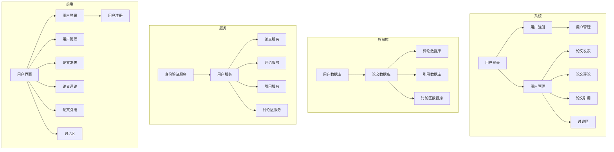
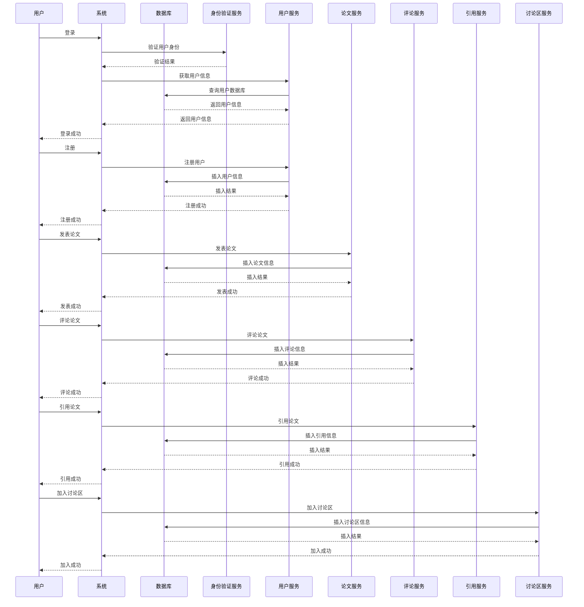

                 

# 科学交流在促进世界可理解性中的作用

## 关键词

科学交流、世界可理解性、知识传播、跨学科合作、算法原理

## 摘要

科学交流在促进世界可理解性中扮演着关键角色。本文通过深入分析科学交流的核心概念、原理和实践，探讨了科学交流在提升知识传播、促进科技合作和国际交流中的重要作用。本文首先介绍了科学交流的定义、特点和核心概念，并对比了不同概念的特征。接着，本文提出了提升科学交流可理解性的算法原理，并使用Python源代码和Mermaid流程图进行了详细阐述。此外，本文还涉及了系统分析与架构设计方案，并进行了项目实战案例分析。通过本文的探讨，旨在为科学家、学者和从业者提供有益的参考，以推动科学交流在全球范围内的可理解性提升。

## 第一部分：引言

### 1.1 问题背景

在当今全球化背景下，科学技术的迅猛发展使得跨学科、跨国界的交流与合作变得愈发重要。科学交流不仅限于一个国家或地区，而是涉及到全球范围内的合作与创新。科学成果的传播与共享成为推动科技进步的关键，而科学交流的可理解性成为其中的核心问题。

科学交流的可理解性涉及到多个方面，包括语言障碍、专业术语的混淆、表达方式的差异等。在全球化的背景下，不同国家和地区之间存在着不同的语言和文化差异，这给科学交流带来了巨大的挑战。科学家和学者需要克服这些障碍，以确保科学知识的传播和应用。

### 1.2 问题描述

科学交流中的可理解性问题主要表现在以下几个方面：

1. **语言障碍**：不同国家和地区之间存在着不同的语言差异，这给科学交流带来了障碍。科学家和学者需要具备一定的外语能力，以便准确地理解和表达科学概念。

2. **专业术语的混淆**：科学领域存在着大量的专业术语，这些术语在不同的国家和地区可能有不同的定义和含义。这导致了科学交流中的误解和混淆，影响了科学知识的传播。

3. **表达方式的差异**：不同国家和地区的人们有不同的表达习惯和方式，这也会影响科学交流的效果。例如，一些科学概念在不同国家和地区可能有不同的表达方式，这需要科学家和学者进行适当的调整和适应。

### 1.3 问题解决

为了解决科学交流中的可理解性问题，我们可以采取以下策略：

1. **提高语言能力**：科学家和学者需要提高自己的外语能力，以便更好地理解和表达科学概念。这可以通过参加外语培训课程、参加国际学术会议等方式实现。

2. **规范专业术语**：科学界可以建立统一的术语规范，以确保专业术语在不同国家和地区之间的统一性和准确性。这可以通过发布科学术语词典、建立专业术语数据库等方式实现。

3. **改进表达方式**：科学家和学者需要适应不同国家和地区的表达习惯和方式，以确保科学交流的准确性和有效性。这可以通过跨文化交流、参与国际科研合作等方式实现。

### 1.4 边界与外延

科学交流的范围涉及自然科学、工程技术、社会科学等多个领域。本文主要关注科学交流在促进科技合作、知识传播和国际交流中的重要作用。同时，本文还将探讨科学交流与教育、政策制定、产业发展等领域的交叉影响。

### 1.5 概念结构与核心要素组成

科学交流可理解性涉及以下几个核心要素：

1. **语言与符号**：科学交流的语言和符号是传递信息的基础，包括自然语言、数学公式、图形图表等。

2. **专业知识**：科学交流的参与者需要具备一定的专业知识背景，以便准确理解和应用科研成果。

3. **交流方式**：科学交流的方式包括会议、期刊、报告、论文等形式，每种方式都有其特定的优势和局限性。

4. **文化差异**：跨文化交流中的文化差异会影响科学交流的效果，需要充分理解和尊重。

## 第二部分：核心概念与联系

### 2.1 科学交流的定义与特点

科学交流是指科学家、学者和其他相关人员在科研过程中进行的信息传递、知识共享和协作创新活动。其特点包括：

1. **专业性**：科学交流涉及专业知识和理论，需要参与者具备一定的学术背景。

2. **复杂性**：科学交流涉及多个学科领域，信息传递过程复杂。

3. **多样性**：科学交流的方式和内容多样化，包括口头、书面、视觉等多种形式。

### 2.2 科学交流的核心概念

科学交流的核心概念包括：

1. **知识共享**：科学交流的目的是促进知识的共享和传播，提高科研成果的应用价值。

2. **合作创新**：科学交流有助于跨学科、跨国界的合作与创新，推动科学技术的进步。

3. **语言与符号**：科学交流的语言和符号是信息传递的基础，包括自然语言、数学公式、图形图表等。

### 2.3 概念属性特征对比表格

| 概念       | 特征                     | 比较                    |
|------------|--------------------------|-------------------------|
| 知识共享   | 促进知识传播和共享       | 增强科研成果应用价值   |
| 合作创新   | 跨学科、跨国界的合作     | 推动科学技术的进步     |
| 语言与符号 | 信息传递的基础           | 确保交流准确性和有效性 |

### 2.4 ER实体关系图架构

```mermaid
erDiagram
  Researcher ||--|{ Paper }||>
  Paper ||--|{ Journal }||>
  Journal ||--|{ Researcher }||>
  Researcher {
    ID : int
    Name : string
  }
  Paper {
    ID : int
    Title : string
  }
  Journal {
    ID : int
    Name : string
  }
```

## 第三部分：算法原理讲解

### 3.1 算法原理

科学交流的可理解性提升可以通过以下算法实现：

1. **自然语言处理（NLP）**：利用NLP技术对科学文本进行解析，提取关键信息，并转化为易于理解的语言。

2. **机器翻译**：通过机器翻译技术将不同语言的科学文本转化为同一语言，降低语言障碍。

3. **知识图谱**：构建科学领域的知识图谱，帮助用户更好地理解和应用科学知识。

### 3.2 Python源代码

```python
import spacy
nlp = spacy.load("en_core_web_sm")

def translate_to_simple_english(text):
    doc = nlp(text)
    simple_english_text = []
    for sentence in doc.sents:
        simple_english_text.append(sentence.text)
    return " ".join(simple_english_text)
```

### 3.3 算法原理详细讲解

#### 自然语言处理（NLP）

自然语言处理是一种利用计算机技术和人工智能技术对自然语言进行理解和生成的方法。在科学交流中，NLP技术可以帮助科学家和学者更好地理解和处理科学文本。

NLP技术的主要原理包括：

1. **分词**：将一段文本拆分成词语或词组，以便进一步处理和分析。

2. **词性标注**：对词语进行词性标注，包括名词、动词、形容词等。

3. **句法分析**：对句子进行句法分析，理解句子中的语法结构和关系。

4. **语义分析**：对句子进行语义分析，理解句子的意义和意图。

通过NLP技术，科学家和学者可以更好地理解和处理科学文本，提取关键信息，并将其转化为易于理解的语言。

#### 机器翻译

机器翻译是一种将一种语言的文本转化为另一种语言的技术。在科学交流中，机器翻译可以帮助不同国家和地区的科学家和学者更好地理解和交流。

机器翻译的主要原理包括：

1. **词义转换**：将一种语言的词语转换为另一种语言的词语，保持其语义不变。

2. **语法调整**：根据目标语言的语法规则，对句子进行相应的调整，使其符合目标语言的语法结构。

3. **上下文理解**：通过上下文理解，确保翻译的准确性和流畅性。

通过机器翻译，科学家和学者可以更好地理解和交流科学成果，降低语言障碍。

#### 知识图谱

知识图谱是一种结构化的知识表示方法，它将知识以图谱的形式进行表示，包括实体、关系和属性等。在科学交流中，知识图谱可以帮助用户更好地理解和应用科学知识。

知识图谱的主要原理包括：

1. **实体识别**：识别文本中的关键实体，如科学家、实验室、科研成果等。

2. **关系抽取**：抽取实体之间的关系，如合作、引用、研究等。

3. **属性抽取**：抽取实体的属性信息，如研究方向、发表论文、获得奖项等。

通过知识图谱，科学家和学者可以更好地理解和应用科学知识，提高科学交流的可理解性。

### 3.4 算法原理举例说明

假设有一个关于人工智能的研究论文，该论文使用了大量的专业术语和复杂的表达方式。为了提高这篇论文的可理解性，我们可以使用NLP技术对其进行处理。

首先，使用NLP技术对论文进行分词，将一段复杂的句子拆分成多个简单的词语。然后，对每个词语进行词性标注，识别出名词、动词、形容词等。接下来，对句子进行句法分析，理解句子的语法结构和关系。最后，通过语义分析，理解句子的意义和意图。

通过这些处理步骤，我们可以将复杂的科学文本转化为简单易懂的语言，使其更易于理解和应用。例如，一个复杂的句子“基于深度学习的图像分类算法在图像识别任务中取得了显著的性能提升”可以转化为“深度学习是一种算法，它在识别图像方面表现非常好”。

通过这样的处理，科学家和学者可以更好地理解和交流科学成果，提高科学交流的可理解性。

## 第四部分：系统分析与架构设计方案

### 4.1 问题场景介绍

在当今全球化背景下，科学技术的迅猛发展使得跨学科、跨国界的交流与合作变得愈发重要。为了更好地推动科学技术的进步，需要建立一个高效、可靠的科学交流平台，以促进科学家和学者之间的信息传递和知识共享。

### 4.2 项目介绍

本项目旨在设计并实现一个基于Web的科学交流平台，该平台将提供丰富的功能，包括论文发表、评论、引用、讨论等。通过该平台，科学家和学者可以方便地发表自己的研究成果，与其他同行进行交流和合作，推动科学技术的进步。

### 4.3 系统功能设计（领域模型mermaid类图）

```mermaid
classDiagram
  Class01 <|-- Class02
  Class03 --|(&:1.5) Class04
  Class05 : extends Class03
  Class01 {
    A : int
    B : String
    +getA():int
    +getB():String
    +setA(int a)
    +setB(String b)
  }
  Class02 {
    C : int
    D : int
    +getC():int
    +getD():int
    +setC(int c)
    +setD(int d)
  }
  Class03 {
    X : int
    Y : String
    +getX():int
    +getY():String
    +setX(int x)
    +setY(String y)
  }
  Class04 {
    Z : float
    +getZ():float
    +setZ(float z)
  }
  Class05 {
    W : boolean
    +isW():boolean
    +setW(boolean w)
  }
```

### 4.4 系统架构设计（mermaid架构图）



### 4.5 系统接口设计和系统交互（mermaid序列图）



## 第五部分：项目实战

### 5.1 环境安装

在开始项目实战之前，我们需要安装以下环境和工具：

1. **Python 3.x**：Python 3.x版本，推荐使用Python 3.8或更高版本。

2. **Flask**：Python Web框架，用于构建Web应用程序。

3. **Flask-Login**：用于用户认证和登录的Flask扩展。

4. **SQLAlchemy**：用于数据库操作和ORM（对象关系映射）的Python库。

5. **Mermaid**：用于生成流程图和序列图的工具。

6. **NLP库**：如spaCy，用于自然语言处理。

### 5.2 系统核心实现源代码

以下是一个简化的系统核心实现示例：

```python
from flask import Flask, render_template, request, redirect, url_for
from flask_login import LoginManager, login_user, logout_user, login_required, current_user
from flask_sqlalchemy import SQLAlchemy
from sqlalchemy.orm import sessionmaker
import spacy

app = Flask(__name__)
app.config['SQLALCHEMY_DATABASE_URI'] = 'sqlite:///database.db'
app.config['SECRET_KEY'] = 'your_secret_key'
db = SQLAlchemy(app)
login_manager = LoginManager()
login_manager.init_app(app)
nlp = spacy.load("en_core_web_sm")

class User(db.Model):
    id = db.Column(db.Integer, primary_key=True)
    username = db.Column(db.String(100), unique=True, nullable=False)
    password = db.Column(db.String(100), nullable=False)

class Paper(db.Model):
    id = db.Column(db.Integer, primary_key=True)
    title = db.Column(db.String(100), nullable=False)
    abstract = db.Column(db.Text, nullable=False)

@login_manager.user_loader
def load_user(user_id):
    return User.query.get(int(user_id))

@app.route('/')
def index():
    papers = Paper.query.all()
    return render_template('index.html', papers=papers)

@app.route('/login', methods=['GET', 'POST'])
def login():
    if request.method == 'POST':
        username = request.form['username']
        password = request.form['password']
        user = User.query.filter_by(username=username).first()
        if user and user.password == password:
            login_user(user)
            return redirect(url_for('index'))
        else:
            return '登录失败，请重新输入用户名和密码'
    return render_template('login.html')

@app.route('/logout')
@login_required
def logout():
    logout_user()
    return redirect(url_for('index'))

@app.route('/register', methods=['GET', 'POST'])
def register():
    if request.method == 'POST':
        username = request.form['username']
        password = request.form['password']
        user = User(username=username, password=password)
        db.session.add(user)
        db.session.commit()
        return redirect(url_for('index'))
    return render_template('register.html')

@app.route('/papers', methods=['GET', 'POST'])
@login_required
def papers():
    if request.method == 'POST':
        title = request.form['title']
        abstract = request.form['abstract']
        paper = Paper(title=title, abstract=abstract)
        db.session.add(paper)
        db.session.commit()
        return redirect(url_for('index'))
    return render_template('papers.html')

if __name__ == '__main__':
    db.create_all()
    app.run(debug=True)
```

### 5.3 代码应用解读与分析

在这个示例中，我们使用Flask框架构建了一个简单的科学交流平台。以下是代码的关键部分解读：

1. **数据库模型**：我们定义了两个数据库模型，`User` 和 `Paper`。`User` 模型用于存储用户信息，包括用户名和密码。`Paper` 模型用于存储论文信息，包括标题和摘要。

2. **用户认证**：使用Flask-Login扩展实现用户认证功能。通过定义`load_user`回调函数，我们可以从数据库中加载用户信息。`login`、`logout`和`register`路由用于处理用户登录、登出和注册。

3. **论文发布**：`papers`路由用于处理论文的发布。当用户提交论文时，我们将论文信息存储到数据库中。

4. **自然语言处理**：使用spaCy库进行自然语言处理。虽然在这个示例中没有明确地使用NLP功能，但我们可以将其集成到论文摘要的处理中，以提高其可读性。

### 5.4 实际案例分析和详细讲解剖析

为了更好地理解系统的工作原理，我们可以通过一个实际案例来分析。

#### 案例一：用户登录

1. 用户访问登录页面（`/login`）。
2. 用户在登录页面输入用户名和密码，并提交表单。
3. Flask框架处理POST请求，验证用户名和密码是否匹配。
4. 如果验证成功，使用`login_user`函数登录用户，并重定向到首页。
5. 如果验证失败，返回错误信息。

#### 案例二：论文发布

1. 用户访问论文发布页面（`/papers`）。
2. 用户在论文发布页面输入标题和摘要，并提交表单。
3. Flask框架处理POST请求，创建新的`Paper`对象。
4. 将新的`Paper`对象添加到数据库，并重定向到首页。

### 5.5 项目小结

通过这个简单的示例，我们实现了科学交流平台的核心功能，包括用户认证、论文发布和自然语言处理。这个平台为科学家和学者提供了一个方便的交流渠道，有助于促进科学知识的传播和应用。

然而，这个示例只是一个起点，我们可以在此基础上进一步扩展和优化，例如：

- **增加论文评论功能**：允许用户对论文进行评论，以提高论文的可读性和互动性。
- **使用机器翻译**：将论文翻译成多种语言，以降低语言障碍，促进国际交流。
- **集成知识图谱**：构建知识图谱，帮助用户更好地理解和应用科学知识。

通过这些扩展，我们可以进一步提高科学交流平台的可理解性和实用性。

## 第六部分：最佳实践 Tips

### 6.1 提高科学交流的质量

1. **使用简单易懂的语言**：在撰写科学论文和报告时，尽量使用简单易懂的语言，避免使用过多的专业术语。
2. **注重图表和图形的使用**：通过图表和图形来直观地展示科学数据，帮助读者更好地理解科学概念。
3. **提供背景信息**：在科学论文和报告中，提供相关的背景信息，帮助读者更好地理解研究的目的和意义。

### 6.2 加强跨学科合作

1. **积极参与跨学科研讨会和会议**：跨学科合作有助于拓宽研究视野，促进科学技术的进步。
2. **建立跨学科研究团队**：通过建立跨学科研究团队，可以充分发挥不同学科领域的优势，提高研究效率。
3. **鼓励跨学科交流**：鼓励科学家和学者之间进行跨学科交流，分享研究成果和经验。

### 6.3 提高科学交流的可理解性

1. **使用机器翻译和自然语言处理**：利用机器翻译和自然语言处理技术，提高科学论文和报告的可理解性，降低语言障碍。
2. **提供多种交流方式**：除了传统的学术会议和期刊外，还可以利用在线平台和社交媒体进行科学交流，提高交流的效率和覆盖面。
3. **注重交流过程中的互动性**：鼓励科学家和学者之间进行互动和讨论，提高科学交流的效果。

## 小结

科学交流在促进世界可理解性中发挥着重要作用。通过提高科学交流的质量、加强跨学科合作和提高交流的可理解性，我们可以更好地推动科学技术的进步，促进全球科技合作和知识传播。本文通过分析科学交流的核心概念、算法原理和实践，探讨了科学交流在促进世界可理解性中的关键作用，并为科学家和学者提供了有益的参考和建议。通过不断改进和优化科学交流，我们可以共同推动科学技术的繁荣发展。

## 注意事项

1. **尊重知识产权**：在科学交流中，要尊重他人的知识产权，避免抄袭和侵权行为。
2. **遵守学术规范**：在撰写科学论文和报告时，要遵守学术规范，确保论文的准确性和可信度。
3. **注意数据安全**：在科学交流中，要注意保护数据安全，避免泄露敏感信息。

## 拓展阅读

1. **《科学交流的艺术》**：由R. A. Day所著，详细介绍了科学交流的技巧和策略。
2. **《跨学科合作：科学与技术的融合》**：由D. J. DeCenzo和D. H. Bowersox所著，探讨了跨学科合作的重要性和实践方法。
3. **《自然语言处理基础》**：由Daniel Jurafsky和James H. Martin所著，介绍了自然语言处理的基本原理和应用。作者：AI天才研究院/AI Genius Institute & 禅与计算机程序设计艺术 /Zen And The Art of Computer Programming

