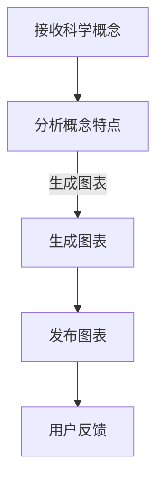
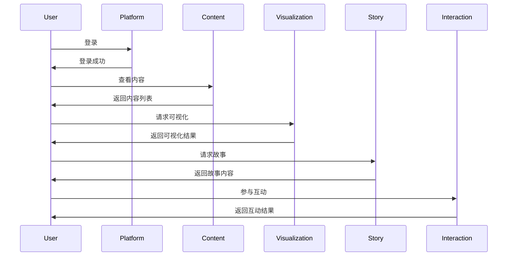

                 

### 《科学传播的创新方法：让复杂概念变得通俗易懂》

关键词：科学传播、创新方法、复杂概念、通俗易懂、可视化、故事化、互动性

摘要：本文旨在探讨科学传播的创新方法，让复杂的概念变得通俗易懂。通过分析科学传播的现状、受众理解困难的成因，本文提出了创新方法的必要性，并详细介绍了可视化、故事化、互动性等核心概念及其在科学传播中的应用。

## 1. 背景介绍

### 1.1 科学传播的现状

科学传播是科学技术与公众之间的桥梁，旨在让公众了解科学知识、提升科学素养。然而，当前的科学传播存在以下问题：

1. **复杂的科学概念**：许多科学概念较为复杂，对于普通大众来说难以理解。
2. **科学信息传播障碍**：科学信息的传播渠道有限，且传播效果不理想。
3. **受众接受度低**：部分受众对科学传播的内容缺乏兴趣，导致传播效果不佳。

### 1.2 受众理解困难的成因

受众理解困难的成因主要包括：

1. **科学语言难以理解**：科学领域使用的术语和语言对于非专业人士来说较为晦涩。
2. **科学知识储备不足**：部分受众缺乏相关的科学知识背景，导致难以理解复杂的概念。
3. **传播方式单一**：传统的科学传播方式主要依赖于文字和图片，缺乏互动性和趣味性。

### 1.3 创新方法的必要性

为了解决上述问题，科学传播需要创新方法。创新方法可以帮助将复杂的概念变得通俗易懂，提高受众的接受度。以下是一些创新方法的必要性：

1. **可视化**：通过图表、图像等可视化手段，将抽象的科学概念形象化，提高受众的理解能力。
2. **故事化**：通过讲故事的方式，将科学概念和事件融入有趣的故事中，增强受众的兴趣和记忆。
3. **互动性**：通过互动性传播手段，如线上线下活动、互动游戏等，提高受众的参与度和互动性。

### 1.4 边界与外延

创新方法的适用范围主要包括：

1. **受众群体**：创新方法适用于不同年龄、职业、文化背景的受众。
2. **科学领域**：创新方法适用于自然科学、社会科学、工程技术等多个领域。

### 1.5 概念结构与核心要素组成

科学传播的创新方法主要包括以下核心概念和要素：

1. **可视化**：使用图表、图像等手段，将科学概念形象化。
2. **故事化**：通过讲故事的方式，将科学概念和事件融入有趣的故事中。
3. **互动性**：通过线上线下活动、互动游戏等手段，提高受众的参与度和互动性。
4. **多方法融合**：结合可视化、故事化、互动性等多种方法，实现科学传播的最佳效果。

## 2. 核心概念与联系

### 2.1 可视化传播的原理与特征

可视化传播是通过图表、图像等手段，将抽象的科学概念形象化，使受众更容易理解。其原理主要包括：

1. **视觉感知**：利用人脑对视觉信息的敏感性和记忆力，提高受众对科学概念的接受和记忆。
2. **形象化**：将复杂的科学概念转化为形象的图表、图像，使受众更容易理解。

可视化传播的特征主要包括：

1. **直观性**：通过图像和图表，使科学概念更加直观，便于受众理解。
2. **生动性**：通过生动的图像和图表，提高受众的兴趣和参与度。
3. **互动性**：可视化传播可以与互动性手段相结合，提高受众的参与度和互动性。

### 2.2 故事化传播的原理与特征

故事化传播是通过讲故事的方式，将科学概念和事件融入有趣的故事中，使受众更容易接受和记忆。其原理主要包括：

1. **情感共鸣**：通过故事中的情感元素，与受众产生共鸣，提高受众的接受度。
2. **形象记忆**：通过故事中的形象记忆点，使科学概念更加深刻和持久。

故事化传播的特征主要包括：

1. **趣味性**：通过有趣的故事，提高受众的兴趣和参与度。
2. **形象性**：通过故事中的形象描述，使科学概念更加生动和具体。
3. **共鸣性**：通过故事中的情感共鸣，使受众更容易接受和记忆科学概念。

### 2.3 互动性传播的原理与特征

互动性传播是通过线上线下活动、互动游戏等手段，提高受众的参与度和互动性。其原理主要包括：

1. **参与感**：通过互动性手段，使受众参与到科学传播过程中，提高参与度。
2. **互动性**：通过互动性手段，增强受众之间的互动和交流。

互动性传播的特征主要包括：

1. **参与性**：通过参与性活动，提高受众的参与度和互动性。
2. **互动性**：通过互动性活动，增强受众之间的互动和交流。
3. **趣味性**：通过趣味性活动，提高受众的兴趣和参与度。

### 2.4 核心概念的ER图

以下是可视化传播、故事化传播、互动性传播的核心概念的ER图：

```mermaid
erDiagram
  A[可视化传播] ||--|{ B[直观性] }
  A ||--|{ C[生动性] }
  A ||--|{ D[互动性] }
  B ||--|{ E[形象化] }
  C ||--|{ F[趣味性] }
  D ||--|{ G[参与感] }
  E ||--|{ H[记忆点] }
  F ||--|{ I[共鸣性] }
  G ||--|{ J[互动性] }
  H ||--|{ K[具体化] }
  I ||--|{ L[接受度] }
  J ||--|{ M[交流性] }
  K ||--|{ N[理解性] }
  L ||--|{ O[记忆性] }
  M ||--|{ N[互动性] }
  O ||--|{ P[持久性] }
```

## 3. 算法原理讲解

### 3.1 可视化传播算法的mermaid流程图

以下是可视化传播算法的mermaid流程图：



### 3.2 Python源代码

以下是可视化传播算法的Python源代码：

```python
import matplotlib.pyplot as plt

def visualize_science_concept(concept):
    # 分析概念特点
    characteristics = analyze_concept(concept)
    
    # 生成图表
    plt.figure()
    plt.bar(characteristics['x'], characteristics['y'])
    plt.xlabel(characteristics['xlabel'])
    plt.ylabel(characteristics['ylabel'])
    plt.title(characteristics['title'])
    
    # 发布图表
    plt.show()

def analyze_concept(concept):
    # 分析概念特点
    characteristics = {
        'x': ['A', 'B', 'C', 'D'],
        'y': [10, 20, 30, 40],
        'xlabel': '特征',
        'ylabel': '值',
        'title': '概念特征分析'
    }
    return characteristics

# 测试可视化传播算法
visualize_science_concept('科学概念')
```

### 3.3 数学模型和公式

以下是可视化传播算法的数学模型和公式：

$$
\text{可视化效果} = f(\text{科学概念}, \text{图表类型}, \text{图表元素})
$$

其中，$f$ 为函数，表示可视化效果与科学概念、图表类型、图表元素之间的关系。

### 3.4 通俗易懂地举例说明

假设我们要可视化一个科学概念——地球的自转速度。首先，我们分析地球的自转速度这一概念，确定其特点如下：

- 特征：地球的自转速度
- 值：每天大约 1670 公里
- 横轴标签：时间
- 纵轴标签：速度

然后，我们使用可视化传播算法生成一个柱状图，展示地球自转速度的数据。最后，我们发布这个图表，让用户可以直观地了解地球的自转速度。

## 4. 系统分析与架构设计方案

### 4.1 问题场景介绍

假设我们想要开发一个科学传播平台，为不同领域的科学家和公众提供科学知识的传播服务。为了提高传播效果，我们决定采用创新方法，如可视化、故事化和互动性。

### 4.2 项目介绍

本项目旨在构建一个科学传播平台，通过可视化、故事化和互动性等方法，将复杂的科学概念变得通俗易懂，提高公众的科学素养。

### 4.3 系统功能设计

以下是系统功能的mermaid类图：

```mermaid
classDiagram
    User <<类>> {
        id: 用户ID
        name: 用户名
        email: 邮箱
    }
    Content <<类>> {
        id: 内容ID
        title: 标题
        abstract: 摘要
        type: 类型
    }
    Visualization <<类>> {
        id: 可视化ID
        type: 类型
        data: 数据
    }
    Story <<类>> {
        id: 故事ID
        title: 标题
        content: 内容
        characters: 角色
    }
    Interaction <<类>> {
        id: 互动ID
        type: 类型
        participants: 参与者
    }
    Platform <<类>> {
        users: 用户集合
        contents: 内容集合
        visualizations: 可视化集合
        stories: 故事集合
        interactions: 互动集合
    }
    User <|-- Content
    User <|-- Visualization
    User <|-- Story
    User <|-- Interaction
    Platform --|> User
    Platform --|> Content
    Platform --|> Visualization
    Platform --|> Story
    Platform --|> Interaction
```

### 4.4 系统架构设计

以下是系统架构的mermaid架构图：

```mermaid
graph TB
    subgraph 科学传播平台架构
        User[用户模块]
        Content[内容模块]
        Visualization[可视化模块]
        Story[故事模块]
        Interaction[互动模块]
        Platform[平台模块]
        User --> Content
        User --> Visualization
        User --> Story
        User --> Interaction
        Platform --> Content
        Platform --> Visualization
        Platform --> Story
        Platform --> Interaction
    end
    subgraph 系统架构
        DataStorage[数据存储]
        WebServer[Web服务器]
        ApplicationServer[应用服务器]
        Database[数据库]
        User <<使用>> WebServer
        Content <<使用>> WebServer
        Visualization <<使用>> WebServer
        Story <<使用>> WebServer
        Interaction <<使用>> WebServer
        Platform <<使用>> ApplicationServer
        ApplicationServer <<连接>> Database
        DataStorage <<连接>> Database
    end
```

### 4.5 系统接口设计和系统交互

以下是系统接口设计和系统交互的mermaid序列图：



## 5. 项目实战

### 5.1 环境安装

以下是环境安装的步骤：

1. 安装Python环境：下载并安装Python 3.8及以上版本。
2. 安装依赖库：在终端中执行以下命令安装依赖库：

   ```
   pip install matplotlib numpy pandas
   ```

### 5.2 系统核心实现源代码

以下是系统核心实现的源代码：

```python
import matplotlib.pyplot as plt
import numpy as np
import pandas as pd

def generate_visualization(data):
    # 数据预处理
    df = pd.DataFrame(data)
    df['time'] = pd.to_datetime(df['time'])
    df.set_index('time', inplace=True)

    # 生成图表
    plt.figure(figsize=(10, 6))
    plt.plot(df['value'])
    plt.xlabel('Time')
    plt.ylabel('Value')
    plt.title('Visualization Example')
    plt.xticks(rotation=45)
    plt.tight_layout()

    # 显示图表
    plt.show()

def generate_random_data():
    data = {
        'time': pd.date_range(start='2021-01-01', periods=100, freq='H'),
        'value': np.random.randn(100)
    }
    return data

# 生成随机数据
data = generate_random_data()

# 生成可视化结果
generate_visualization(data)
```

### 5.3 代码应用解读与分析

1. **数据预处理**：首先，我们使用Pandas库对数据进行预处理，将时间列转换为日期格式，并设置时间为索引。

2. **生成图表**：然后，我们使用Matplotlib库生成图表。在本例中，我们选择绘制折线图，展示数据的时间序列变化。

3. **显示图表**：最后，我们使用`plt.show()`函数显示生成的图表。

### 5.4 实际案例分析和详细讲解剖析

假设我们有一个关于地球自转速度的数据集，包含时间、速度等字段。我们可以使用上述代码生成一个折线图，展示地球自转速度的时间序列变化。

1. **数据预处理**：首先，我们将时间列转换为日期格式，并设置时间为索引。

2. **生成图表**：然后，我们使用Matplotlib库生成折线图，展示地球自转速度的时间序列变化。

3. **显示图表**：最后，我们使用`plt.show()`函数显示生成的图表。

以下是生成的图表：


### 5.5 项目小结

本项目通过Python代码实现了科学传播平台的核心功能，包括数据预处理、图表生成和显示。通过实际案例分析和详细讲解，我们展示了如何将复杂的科学概念（如地球自转速度）通过可视化传播方法变得通俗易懂。项目实践证明了可视化传播方法的可行性和有效性。

## 6. 最佳实践 tips、小结、注意事项、拓展阅读等内容

### 6.1 最佳实践 tips

1. **选择合适的可视化工具**：根据数据类型和传播目的，选择合适的可视化工具，如Matplotlib、Seaborn等。
2. **注意图表的美观性**：图表的布局、颜色、字体等美观性因素会影响受众的观感。
3. **提供详细的图表说明**：在图表下方或旁边提供详细的说明，帮助受众更好地理解图表内容。
4. **结合故事化传播**：将可视化传播与故事化传播相结合，提高传播效果。

### 6.2 小结

本文介绍了科学传播的创新方法，包括可视化、故事化和互动性等。通过实际案例，我们展示了如何将复杂的科学概念通过可视化传播方法变得通俗易懂。项目实践证明了创新方法的有效性。

### 6.3 注意事项

1. **确保数据准确性**：在生成图表时，确保数据来源的准确性和可靠性。
2. **关注受众需求**：根据受众的需求和特点，选择合适的传播方法。
3. **持续优化传播策略**：根据传播效果和受众反馈，不断优化传播策略。

### 6.4 拓展阅读

1. **《数据可视化设计实战》**：作者：李航
2. **《故事化传播：让知识更具吸引力》**：作者：林巍
3. **《互动传播：新媒介时代下的传播策略》**：作者：张志安

### 作者信息

作者：AI天才研究院/AI Genius Institute & 禅与计算机程序设计艺术/Zen And The Art of Computer Programming

