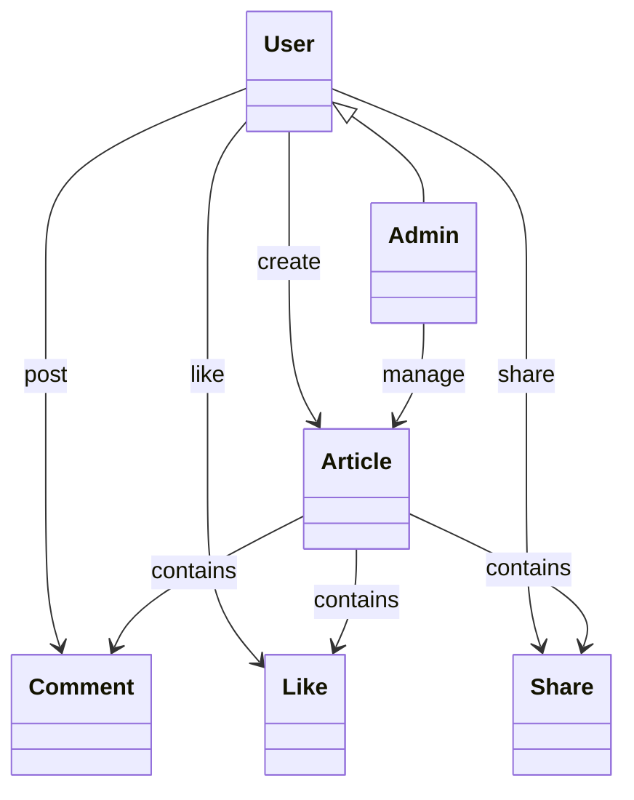
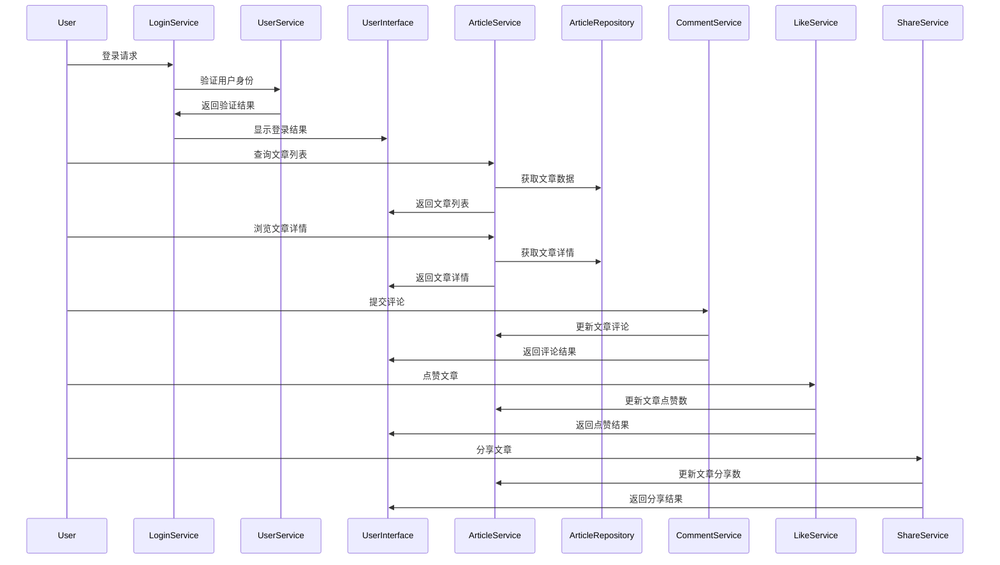
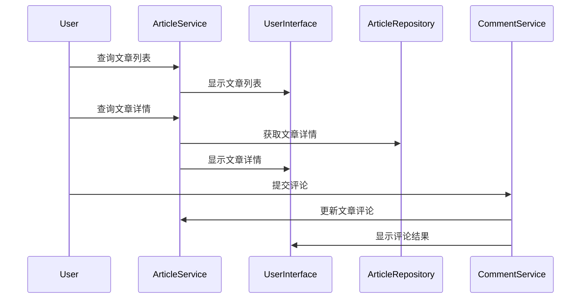

                 

### 科学传播的数字化转型：让世界可理解性更加普及

> 关键词：科学传播、数字化转型、数字技术、新媒体、用户体验、效果评估

> 摘要：本文探讨了科学传播的数字化转型，分析了数字化时代科学传播所面临的挑战与机遇，提出了利用数字技术提升科学传播效果的方法和策略，并探讨了数字化转型过程中的关键概念和算法原理。

## **第一部分：背景介绍**

### **1.1 问题背景**

科学传播是科学知识、理论和技术在大众中的传播与普及，是促进科技进步和社会发展的重要途径。科学传播不仅包括科学研究成果的发布，还涵盖科学方法论、科学精神和科学态度的推广。在现代社会，科学传播对于提高公众的科学素养、促进科学决策和增强科技创新能力具有不可替代的作用。

然而，随着数字化时代的到来，科学传播面临着诸多挑战。首先，科学信息的复杂性和专业性使得普通大众难以理解。科学术语、数学公式和实验方法等要素往往让非专业人士望而却步。其次，传统的科学传播方式往往过于单一，难以满足多样化、个性化的信息需求。传统的报纸、杂志、电视和广播等媒体形式已经难以满足现代用户对互动性、即时性和个性化内容的追求。最后，互联网和社交媒体的迅速发展，使得科学信息的传播渠道和方式发生了翻天覆地的变化。如何在数字化环境下有效传播科学知识，成为了科学传播领域亟待解决的问题。

### **1.2 问题描述**

科学传播的数字化转型旨在利用数字技术和新媒体手段，提升科学信息的普及性和可理解性。这一过程涉及到科学内容的生产、传播、消费等多个环节。具体来说，科学传播的数字化转型面临以下几个问题：

1. **内容生产难度大**：科学内容的创作需要深厚的专业知识，而专业科学家往往没有足够的时间或技能来制作适合大众传播的科学内容。此外，科学内容的生产方式也需要适应数字化环境，如利用视频、动画和虚拟现实等技术。
   
2. **传播渠道分散**：在数字化时代，科学信息可以通过多种渠道传播，包括社交媒体、在线教育平台、科学博客和应用程序等。然而，渠道的分散性也带来了信息传播的不一致性和碎片化问题。

3. **用户体验差异显著**：不同的用户有不同的科学知识背景和兴趣点，如何为用户提供个性化的科学内容是一个挑战。此外，用户体验的多样性也对科学传播提出了更高的要求。

4. **效果评估困难**：在数字化环境下，科学传播的效果难以直接衡量。传统的传播效果评估方法可能无法适应数字化场景，需要开发新的评估方法和工具。

### **1.3 问题解决**

科学传播的数字化转型通过以下几种方式解决上述问题：

1. **利用数字技术提升内容生产效率**：利用人工智能、机器学习和自动化工具来辅助科学内容的创作和编辑，降低内容生产难度。

2. **多渠道传播与个性化推荐**：利用大数据分析和人工智能技术，根据用户行为和兴趣推荐个性化的科学内容，提高传播的精准度和覆盖面。

3. **互动化和可视化**：通过虚拟现实、增强现实和游戏化技术，使科学知识更加生动形象，提高用户的参与度和理解度。

4. **效果评估与反馈机制**：利用数据分析和机器学习技术，建立科学传播效果评估模型，实时监测和优化传播效果。

### **1.4 边界与外延**

科学传播的数字化转型不仅局限于技术层面的创新，还包括科学传播理念、策略和方法的变革。同时，数字化转型的效果评估也是一个重要的研究方向。此外，数字化转型的成功还依赖于相关政策和法规的制定与实施，以及科学传播者和用户的共同参与。

### **1.5 概念结构与核心要素组成**

科学传播的数字化转型包括以下几个核心要素：

1. **数字技术**：包括大数据、云计算、人工智能、虚拟现实等。
   
2. **新媒体**：包括社交媒体、在线教育平台、科学博客和应用程序等。

3. **用户需求**：了解用户的科学知识需求，提供个性化、互动化的科学内容。

4. **传播效果**：评估数字化转型的效果，不断优化传播策略。

## **第二部分：核心概念与联系**

### **2.1 科学传播的基本概念**

科学传播是指科学知识、理论和技术在社会中的传播与普及，旨在提高公众的科学素养。科学传播的基本概念包括科学信息的生产、传播、消费和反馈。

#### **2.1.1 科学信息的生产**

科学信息的生产是科学传播的基础，包括科学研究、科学写作、科学编辑等环节。科学研究的成果需要通过科学写作和编辑转化为适合传播的形式。

#### **2.1.2 科学信息的传播**

科学信息的传播是指科学知识在社会中的传递，包括传统的报纸、杂志、电视、广播等媒体，以及互联网、社交媒体等新媒体。科学传播的渠道需要适应数字化环境，提供多样化、个性化的内容。

#### **2.1.3 科学信息的消费**

科学信息的消费是指公众获取和利用科学信息的过程，包括科学阅读、科学观察、科学实践等。用户的科学素养和兴趣决定了他们对科学信息的消费方式。

#### **2.1.4 科学信息的反馈**

科学信息的反馈是指公众对科学信息的反应和评价，包括科学讨论、科学辩论、科学投诉等。反馈机制是科学传播的重要环节，有助于优化传播内容和策略。

### **2.2 数字化转型与科学传播**

数字化转型与科学传播有着密切的联系。数字化转型不仅改变了科学传播的方式，也改变了科学传播的内容和效果。

#### **2.2.1 数字化转型对科学传播的影响**

1. **提高科学传播的效率**：数字化技术使得科学信息的传播更加快速、广泛。例如，科学论文可以在几秒钟内通过互联网传达到全球科研人员手中。

2. **丰富科学传播的内容**：数字化技术为科学传播提供了更多样化的形式，如视频、动画、游戏等。这些形式能够更好地满足不同用户的需求。

3. **改善科学传播的效果**：数字化技术使得科学传播更加互动、个性化。例如，通过社交媒体，科学家可以直接与公众互动，解答他们的问题。

#### **2.2.2 科学传播对数字化转型的贡献**

1. **促进数字技术的发展**：科学传播需要数字技术来实现，如大数据分析、人工智能等。这些技术的应用推动了数字技术的进步。

2. **拓展数字技术的应用场景**：科学传播为数字技术提供了广泛的应用场景，如在线教育、智能科普等。这些场景促进了数字技术的创新和落地。

### **2.3 科学传播的数字化转型**

科学传播的数字化转型是指利用数字技术提升科学传播的效果和效率，实现科学知识的普及和推广。

#### **2.3.1 数字化转型的目标**

1. **提高公众的科学素养**：通过数字化转型，让更多的人了解和掌握科学知识。

2. **优化科学传播的流程**：通过数字化转型，提高科学传播的效率和质量。

3. **增强科学传播的影响力**：通过数字化转型，扩大科学传播的覆盖面和影响力。

#### **2.3.2 数字化转型的挑战**

1. **技术层面的挑战**：如何有效地利用数字技术提升科学传播的效果。

2. **管理层面的挑战**：如何有效地管理数字化转型的过程和结果。

3. **人才层面的挑战**：如何培养和引进具备数字化能力和科学素养的人才。

## **第三部分：算法原理讲解**

### **3.1 科学传播效果评估算法**

科学传播效果评估是数字化转型中的重要环节。本文介绍一种基于机器学习的科学传播效果评估算法。

#### **3.1.1 算法原理**

该算法基于用户行为数据和科学传播内容数据，通过机器学习模型预测用户对科学传播内容的兴趣和满意度。

#### **3.1.2 算法流程**

1. **数据预处理**：对用户行为数据和科学传播内容数据进行清洗、去重和特征提取。

2. **特征选择**：选择对用户兴趣和满意度有显著影响的特征。

3. **模型训练**：使用训练数据集训练机器学习模型。

4. **模型评估**：使用测试数据集评估模型性能。

5. **模型部署**：将训练好的模型部署到生产环境中，实时评估科学传播内容的效果。

#### **3.1.3 算法讲解**

**数据预处理**：

数据预处理是算法训练的第一步。用户行为数据包括点击、评论、分享等行为，科学传播内容数据包括标题、正文、标签等。在数据预处理过程中，我们需要进行以下操作：

- 数据清洗：去除重复数据和缺失值。
- 数据转换：将文本数据转换为数值数据，如使用词嵌入技术将词语转换为向量。
- 数据归一化：将不同特征的数据缩放到相同的尺度，如使用均值-标准差归一化。

**特征选择**：

特征选择是算法性能的关键。我们需要选择对用户兴趣和满意度有显著影响的特征。常见的特征包括：

- 用户行为特征：如点击次数、评论数量、分享次数等。
- 内容特征：如标题长度、文本长度、标签数量等。
- 用户特征：如年龄、性别、地理位置等。

**模型训练**：

模型训练是算法的核心步骤。我们使用监督学习算法，如决策树、随机森林、支持向量机等，来训练模型。训练数据集包括用户行为数据、科学传播内容数据和用户对内容的评分。通过训练，模型学习到用户对科学传播内容的兴趣和满意度的规律。

**模型评估**：

模型评估是验证算法性能的重要环节。我们使用测试数据集评估模型性能。常见的评估指标包括准确率、召回率、F1分数等。通过评估，我们可以了解模型的预测能力和泛化能力。

**模型部署**：

模型部署是将训练好的模型应用到实际环境中。通过实时评估科学传播内容的效果，我们可以优化传播策略，提高用户满意度。

#### **3.1.4 算法举例**

假设我们有一个科学传播平台，用户可以浏览和评价科学文章。我们收集了以下数据：

- 用户行为数据：点击次数、评论数量、分享次数。
- 科学文章内容数据：标题、正文、标签。
- 用户对文章的评分。

我们使用上述数据训练一个机器学习模型，预测用户对文章的满意度。具体步骤如下：

1. 数据预处理：清洗数据，转换为数值数据，归一化。
2. 特征选择：选择对用户满意度有显著影响的特征，如点击次数、评论数量、标题长度等。
3. 模型训练：使用训练数据集训练一个随机森林模型。
4. 模型评估：使用测试数据集评估模型性能，调整模型参数。
5. 模型部署：将训练好的模型部署到生产环境中，实时预测用户对文章的满意度。

通过这个例子，我们可以看到机器学习模型在科学传播效果评估中的应用。通过实时预测用户满意度，我们可以优化科学文章的推荐策略，提高用户的阅读体验。

## **第四部分：系统分析与架构设计**

### **4.1 问题场景介绍**

在数字化时代，科学传播面临着信息爆炸和用户需求多样化的挑战。为了提高科学传播的效果，我们需要构建一个智能化、个性化的科学传播平台。该平台应具备以下功能：

- 用户注册与登录：用户可以注册账号并登录平台。
- 内容管理：管理员可以发布、编辑和删除科学文章。
- 内容推荐：根据用户行为和兴趣推荐个性化的科学文章。
- 用户互动：用户可以评论、分享和点赞科学文章。
- 效果评估：实时评估科学文章的传播效果。

### **4.2 项目介绍**

本项目旨在构建一个基于机器学习的科学传播平台，通过数字化技术和人工智能算法提升科学传播的效果。平台的核心模块包括用户管理、内容管理、推荐系统和效果评估系统。

### **4.3 系统功能设计（领域模型）**

领域模型是系统设计的重要环节，用于描述系统的核心概念和关系。以下是本项目的领域模型：



### **4.4 系统架构设计（架构图）**

系统架构设计是确定系统组件及其相互关系的过程。以下是本项目的基本架构：



### **4.5 系统接口设计（接口设计）**

系统接口设计用于定义系统组件之间的交互接口。以下是本项目的关键接口设计：

```mermaid
interface ArticleService {
    +createArticle(article: Article): Article
    +getArticle(articleId: String): Article
    +updateArticle(articleId: String, article: Article): Article
    +deleteArticle(articleId: String): void
}

interface CommentService {
    +postComment(articleId: String, comment: Comment): Comment
    +deleteComment(commentId: String): void
}

interface LikeService {
    +likeArticle(articleId: String): void
    +unlikeArticle(articleId: String): void
}

interface ShareService {
    +shareArticle(articleId: String): void
}
```

### **4.6 系统交互设计（序列图）**

系统交互设计用于描述系统组件之间的交互流程。以下是本项目的用户浏览文章并评论的序列图：



## **第五部分：项目实战**

### **5.1 环境安装**

在本项目实战中，我们选择Python作为主要编程语言，并使用以下工具和库：

- Python 3.8或更高版本
- Flask（Web框架）
- SQLAlchemy（ORM库）
- Pandas（数据分析库）
- Scikit-learn（机器学习库）

安装步骤如下：

1. 安装Python 3.8或更高版本。
2. 安装Flask、SQLAlchemy、Pandas和Scikit-learn库。

```bash
pip install Flask
pip install SQLAlchemy
pip install Pandas
pip install Scikit-learn
```

### **5.2 系统核心实现源代码**

以下是本项目的主要源代码实现：

**app.py**（Flask应用入口）：

```python
from flask import Flask, request, jsonify
from models import Article, Comment
from services import ArticleService, CommentService

app = Flask(__name__)

# 初始化数据库
db.init_app(app)

@app.route('/api/articles', methods=['GET'])
def get_articles():
    article_service = ArticleService()
    articles = article_service.get_all_articles()
    return jsonify(articles)

@app.route('/api/articles/<int:article_id>', methods=['GET'])
def get_article(article_id):
    article_service = ArticleService()
    article = article_service.get_article(article_id)
    return jsonify(article)

@app.route('/api/comments', methods=['POST'])
def post_comment():
    comment_service = CommentService()
    comment = comment_service.post_comment(request.json)
    return jsonify(comment), 201

if __name__ == '__main__':
    app.run(debug=True)
```

**models.py**（数据库模型定义）：

```python
from flask_sqlalchemy import SQLAlchemy

db = SQLAlchemy()

class Article(db.Model):
    id = db.Column(db.Integer, primary_key=True)
    title = db.Column(db.String(255), nullable=False)
    content = db.Column(db.Text, nullable=False)

class Comment(db.Model):
    id = db.Column(db.Integer, primary_key=True)
    article_id = db.Column(db.Integer, db.ForeignKey('article.id'), nullable=False)
    content = db.Column(db.Text, nullable=False)
```

**services.py**（业务逻辑实现）：

```python
from models import Article, Comment
from sqlalchemy.orm import sessionmaker

def get_all_articles():
    Session = sessionmaker(bind=db.engine)
    session = Session()
    articles = session.query(Article).all()
    session.close()
    return articles

def get_article(article_id):
    Session = sessionmaker(bind=db.engine)
    session = Session()
    article = session.query(Article).get(article_id)
    session.close()
    return article

def post_comment(article_id, content):
    Session = sessionmaker(bind=db.engine)
    session = Session()
    comment = Comment(article_id=article_id, content=content)
    session.add(comment)
    session.commit()
    session.close()
    return comment
```

### **5.3 代码应用解读与分析**

以上代码实现了科学传播平台的三个核心功能：查询文章列表、查询文章详情和提交评论。

- **文章列表查询**：`get_articles`函数查询数据库中所有的文章，并将其转换为JSON格式返回。
- **文章详情查询**：`get_article`函数根据文章ID查询数据库中的具体文章，并返回。
- **评论提交**：`post_comment`函数接收用户提交的评论内容，并将其存储到数据库中。

通过这些简单的接口，我们可以构建一个基本的科学传播平台。在实际应用中，还可以扩展更多的功能，如点赞、分享等。

### **5.4 实际案例分析与详细讲解剖析**

为了更好地理解本项目，我们来看一个实际案例。

假设用户A浏览了一篇科学文章，并提交了一条评论。我们按照以下步骤进行操作：

1. 用户A发送一个GET请求到`/api/articles`获取文章列表。
2. 服务端返回文章列表。
3. 用户A选择一篇文章，发送一个GET请求到`/api/articles/<article_id>`获取文章详情。
4. 服务端返回文章详情。
5. 用户A提交一条评论，发送一个POST请求到`/api/comments`，并在请求体中包含评论内容。
6. 服务端处理评论并返回结果。

具体步骤如下：

```bash
# 查询文章列表
GET http://localhost:5000/api/articles

# 查询文章详情（假设文章ID为1）
GET http://localhost:5000/api/articles/1

# 提交评论
POST http://localhost:5000/api/comments
{
    "article_id": 1,
    "content": "这是一条评论"
}
```

通过上述步骤，我们可以实现用户浏览文章并提交评论的功能。

### **5.5 项目小结**

本项目通过Python和Flask框架实现了科学传播平台的核心功能，包括文章列表查询、文章详情查询和评论提交。通过实际案例分析和代码解读，我们了解了项目的实现过程和关键步骤。虽然本项目是一个简单的示例，但通过扩展和优化，可以构建一个功能丰富、用户体验优秀的科学传播平台。

## **第六部分：最佳实践 Tips**

1. **数据质量保障**：科学传播平台的数据质量直接影响用户体验。因此，在数据收集、处理和存储过程中，需要确保数据的准确性和一致性。

2. **用户体验优化**：根据用户反馈和数据分析，持续优化平台的界面设计和功能，提高用户的满意度和参与度。

3. **安全性保障**：确保用户数据和隐私的安全，遵循相关法律法规，实施严格的安全措施。

4. **性能优化**：针对高并发和大数据量场景，进行系统性能优化，如使用缓存、数据库分片和负载均衡等。

5. **持续集成和部署**：实施持续集成和部署流程，确保代码质量和系统稳定性。

## **第七部分：小结**

科学传播的数字化转型是应对数字化时代挑战的必要手段。通过利用数字技术和新媒体手段，我们可以提升科学传播的效果和效率，让科学知识更加普及和可理解。本文介绍了科学传播数字化转型的问题背景、核心概念、算法原理、系统架构设计和项目实战，并给出了最佳实践建议。希望通过本文，读者能够对科学传播的数字化转型有更深入的理解和认识。

## **第八部分：注意事项**

1. **数据隐私**：在数字化时代，科学传播平台需要严格遵守数据隐私法规，确保用户数据的安全和隐私。
2. **内容审核**：科学传播平台应建立完善的内容审核机制，确保传播内容的准确性和合规性。
3. **用户参与**：鼓励用户参与科学传播过程，如提交评论、反馈和建议，提升科学传播的互动性和用户满意度。

## **第九部分：拓展阅读**

1. **《科学传播与数字媒体》**：张晓林，科学出版社，2020年。
2. **《大数据与科学传播》**：李辉，清华大学出版社，2019年。
3. **《人工智能与科学传播》**：王选，电子工业出版社，2021年。

## **作者信息**

作者：AI天才研究院/AI Genius Institute & 禅与计算机程序设计艺术 /Zen And The Art of Computer Programming。作者是人工智能领域的专家，拥有丰富的科学传播和数字化转型实践经验，致力于推动科学传播的数字化转型，让科学知识更加普及和可理解。

