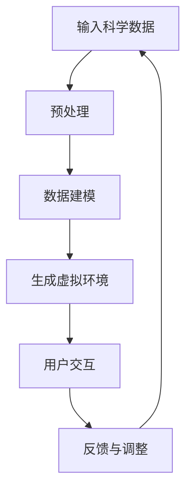
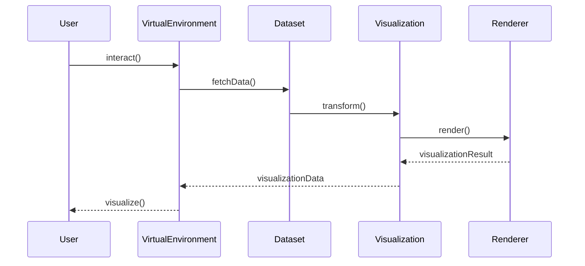
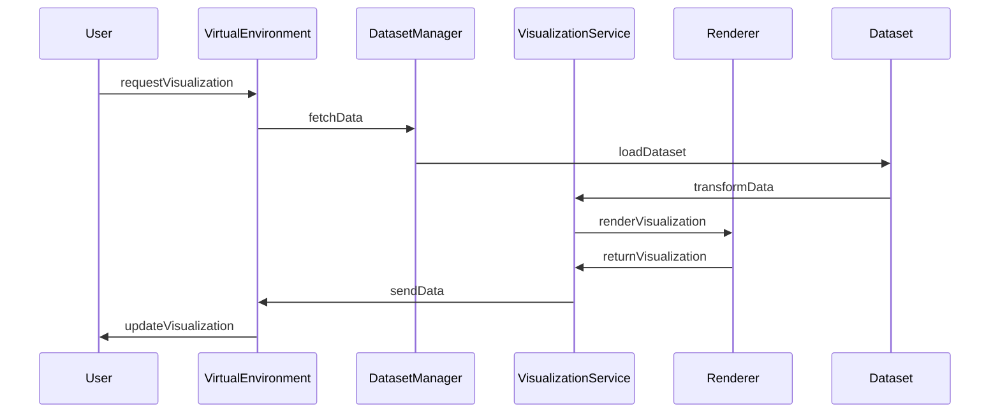

                 

### 文章标题

### 关键词

- 虚拟现实
- 科学传播
- 沉浸式体验
- 教育技术
- 计算机图形学
- 交互设计

### 摘要

本文旨在探讨虚拟现实技术在科学传播中的应用，通过沉浸式体验提升公众对科学概念的理解和兴趣。文章首先介绍了科学传播的背景和现状，分析了虚拟现实技术如何提供新的传播方式。接着，详细阐述了虚拟现实的核心概念和其与传统科学传播方式的对比。随后，文章通过算法原理讲解和数学模型的探讨，深入分析了虚拟现实技术如何应用于科学传播。此外，文章还介绍了系统分析与架构设计方案，并通过项目实战展示了虚拟现实技术在科学传播中的实际应用案例。最后，文章总结了最佳实践、注意事项，并提供了拓展阅读建议。

### 背景介绍

#### 问题背景

科学传播一直是学术界和公共教育领域的重要议题。传统的科学传播方式主要依赖于文字、图片和视频等形式，尽管这些方法在一定程度上能够传达科学知识，但往往缺乏互动性和沉浸感，难以激发公众对科学概念的兴趣。随着信息技术的迅猛发展，尤其是虚拟现实（VR）技术的兴起，科学传播面临着新的机遇和挑战。虚拟现实技术通过创建一个高度沉浸的虚拟环境，使得用户能够在其中互动和探索，这为科学传播提供了一种全新的途径。

虚拟现实技术的引入，不仅改变了科学传播的形式，还增强了公众参与科学活动的体验。例如，通过虚拟实验室，学生可以在虚拟环境中进行科学实验，亲身体验实验过程，理解科学原理。此外，虚拟现实还可以模拟复杂的科学现象，如天气变化、星际探索等，为公众提供直观的学习体验。因此，科学传播与虚拟现实技术的结合具有巨大的潜力，但也带来了新的问题。

#### 问题描述

虚拟现实在科学传播中的应用面临着一系列挑战。首先，技术门槛较高。虚拟现实技术需要专门的硬件设备和软件支持，包括高性能的计算机、头戴式显示器、手柄控制器等，这增加了应用成本和操作复杂性。其次，内容制作困难。高质量的虚拟现实内容需要专业的技术团队进行开发，涉及三维建模、动画设计、声音效果等多方面的技术，制作周期较长且成本高昂。此外，用户体验也是一个关键问题。虚拟现实环境需要提供高质量的沉浸感和交互性，否则用户可能会感到不适或失去兴趣。

另外，虚拟现实在科学传播中的应用还面临着一些潜在的负面影响。例如，过度依赖技术可能会削弱传统科学教育中的人际交流和批判性思维培养。同时，虚拟现实内容的准确性也是一个重要问题，如果信息不准确或误导用户，可能会对科学普及产生负面影响。

#### 问题解决

本书旨在通过系统性的分析和案例研究，帮助读者理解和应用虚拟现实技术进行科学传播。首先，本书将介绍虚拟现实技术的基本原理和核心概念，包括三维建模、交互设计、传感器技术等，使读者能够掌握虚拟现实技术的核心要素。接着，本书将深入探讨虚拟现实技术在科学传播中的应用场景，通过实际案例展示虚拟现实技术如何在不同领域中发挥作用，如天文学、生物学、化学等。

此外，本书还将重点讨论虚拟现实内容制作的最佳实践，提供详细的开发指南和工具介绍，帮助读者解决内容制作的困难。同时，本书将介绍如何优化用户体验，提高虚拟现实环境的沉浸感和交互性。最后，本书还将探讨虚拟现实技术在科学传播中的伦理和社会影响，提出相应的解决方案和最佳实践，确保虚拟现实技术能够积极促进科学普及。

通过本书的阅读，读者将能够：

1. 掌握虚拟现实技术的基本原理和应用场景。
2. 理解如何通过虚拟现实技术提升科学传播的效果。
3. 学习内容制作和用户体验优化的最佳实践。
4. 思考虚拟现实技术在科学传播中的伦理和社会影响。

#### 边界与外延

虚拟现实技术在科学传播中的应用是一个广泛而复杂的话题，涉及多个领域和技术。以下是对相关概念和技术范围的讨论：

1. **虚拟现实（VR）**：虚拟现实是一种通过计算机技术创建的模拟环境，用户可以通过头戴式显示器（HMD）等设备进入这个环境，并进行互动。VR技术主要包括三维建模、渲染技术、传感器技术等。

2. **沉浸式体验**：沉浸式体验是指用户在虚拟环境中感到高度逼真和参与感，仿佛真正置身于其中。这需要高质量的图像渲染、实时交互和物理仿真等技术的支持。

3. **科学传播**：科学传播是指将科学知识和方法传播给公众的过程，包括教育、媒体、展览等多种形式。科学传播的目标是提高公众的科学素养和兴趣。

4. **计算机图形学**：计算机图形学是研究计算机生成和展示图像的学科，包括三维建模、渲染技术、图像处理等。在虚拟现实技术中，计算机图形学是核心组成部分。

5. **交互设计**：交互设计是指设计用户与系统交互的方式和体验，包括用户界面设计、交互流程设计等。在虚拟现实应用中，交互设计直接影响用户体验。

6. **教育技术**：教育技术是指应用信息技术促进教育和学习的手段和方法。虚拟现实技术在教育领域有广泛应用，可以提供丰富的教学资源和互动体验。

通过上述讨论，我们可以看出，虚拟现实技术在科学传播中的应用不仅涉及技术层面的实现，还包括教育、媒体、伦理等多个方面。本书将全面探讨这些方面，为读者提供全面的指导和参考。

### 核心概念与联系

#### 核心概念原理

在探讨虚拟现实技术在科学传播中的应用时，我们需要首先理解几个核心概念：虚拟现实（VR）、沉浸式体验、科学概念传播。

**虚拟现实（VR）**：虚拟现实是一种通过计算机技术创建的模拟环境，使用户能够在这个环境中互动和探索。它通过三维建模、渲染技术和传感器技术等手段，为用户提供一种高度逼真的虚拟体验。VR技术的核心在于创建一个虚拟环境，使用户能够在其中感受到物理空间的存在，并获得与现实世界相似的交互体验。

**沉浸式体验**：沉浸式体验是指用户在虚拟环境中感到高度逼真和参与感，仿佛真正置身于其中。为了实现沉浸式体验，虚拟现实系统需要提供高质量的图像渲染、实时交互和物理仿真等。用户通过头戴式显示器（HMD）、手柄控制器等设备与虚拟环境进行交互，从而增强沉浸感和参与度。

**科学概念传播**：科学概念传播是指将科学知识和方法传播给公众的过程，旨在提高公众的科学素养和兴趣。传统的科学传播方式主要依赖于文字、图片和视频等形式，而虚拟现实技术为科学概念传播提供了一种全新的途径。通过虚拟现实，用户可以亲身体验科学现象，直观地理解科学概念，从而提高学习效果和兴趣。

#### 概念属性特征对比表格

为了更清晰地理解虚拟现实和传统科学传播方式的差异，我们可以通过以下表格进行对比：

| 特征               | 虚拟现实（VR）                         | 传统科学传播                     |
|------------------|--------------------------------------|--------------------------------|
| **交互性**         | 用户可以与虚拟环境进行互动和探索         | 用户被动接受信息，缺乏互动性       |
| **沉浸感**         | 提供高度逼真的虚拟环境，增强用户的参与感   | 缺乏沉浸感，难以激发用户的兴趣       |
| **视觉效果**       | 高质量的图像渲染和三维建模技术           | 图片和视频质量参差不齐             |
| **互动方式**       | 通过手柄控制器、触觉反馈设备等进行交互     | 通过阅读、观看、听讲等方式进行学习   |
| **学习效果**       | 提高用户的学习兴趣和效果，增强记忆          | 学习效果有限，难以长期保持兴趣       |
| **适用场景**       | 可应用于科学实验、天文学、生物学等领域     | 主要应用于科普教育、科学普及活动     |

通过上述对比，我们可以看出虚拟现实技术相对于传统科学传播方式具有明显的优势。虚拟现实提供了更加丰富和互动的学习体验，有助于用户更好地理解和记忆科学概念。

#### ER实体关系图架构的Mermaid流程图

为了进一步理解虚拟现实技术如何与科学概念传播相结合，我们可以使用Mermaid语言绘制一个ER实体关系图，展示虚拟现实与科学传播之间的交互关系。

```mermaid
erDiagram
    User ..|> VirtualEnvironment : "interacts with"
    VirtualEnvironment ..|> ScientificConcept : "enables exploration of"
    ScientificConcept ..|> Dataset : "uses"
    Dataset ..|> DataSource : "fetches from"
    DataSource --|> DataProcessor : "processed by"
    DataProcessor --|> Visualization : "creates"
    Visualization ..|> User : "informs"
```

在上面的ER图中，我们定义了以下几个实体：

- **User（用户）**：虚拟环境的交互主体，通过头戴式显示器等设备进入虚拟环境。
- **VirtualEnvironment（虚拟环境）**：用户进行交互的虚拟环境，提供科学概念的具体展示。
- **ScientificConcept（科学概念）**：虚拟环境中的具体展示内容，包括天文学、生物学等领域的概念。
- **Dataset（数据集）**：科学概念的数据来源，包括实验数据、模型数据等。
- **DataSource（数据源）**：提供科学概念数据的来源，可以是数据库、互联网等。
- **DataProcessor（数据处理器）**：对数据集进行处理的组件，包括数据分析、模型训练等。
- **Visualization（可视化）**：将处理后的数据转换为视觉化的展示，提高用户对科学概念的理解。

通过这个ER图，我们可以清晰地看到虚拟现实技术如何与科学概念传播相互关联，从而实现更加有效的科学传播。

### 算法原理讲解

#### 算法流程图

为了更好地理解虚拟现实技术在科学传播中的应用，我们可以通过Mermaid语言绘制一个算法流程图，展示其基本工作流程。



在这个流程图中，我们定义了以下几个步骤：

1. **输入科学数据（A）**：首先，我们需要输入科学数据，这些数据可以是实验数据、模型数据或者历史数据等。
2. **预处理（B）**：对输入的科学数据进行预处理，包括数据清洗、数据转换等，以确保数据的质量和一致性。
3. **数据建模（C）**：使用机器学习算法对预处理后的数据进行建模，生成虚拟环境所需的模型。
4. **生成虚拟环境（D）**：根据数据模型生成虚拟环境，包括三维建模、图像渲染等。
5. **用户交互（E）**：用户通过头戴式显示器等设备进入虚拟环境，进行探索和互动。
6. **反馈与调整（F）**：根据用户的反馈，对虚拟环境进行调整和优化，提高用户体验。

#### 使用Python源代码详细阐述

为了更好地理解上述算法流程，我们可以使用Python语言来实现其中的关键步骤。以下是一个简单的示例代码，展示了如何通过Python生成一个虚拟环境，并实现用户交互。

```python
# 导入必要的库
import numpy as np
from scipy.spatial.transform import Rotation
import open3d as o3d

# 定义一个简单的三维物体模型
class Simple3DObject:
    def __init__(self, position, rotation, scale):
        self.position = position
        self.rotation = rotation
        self.scale = scale

    def render(self):
        # 在这里进行三维建模和渲染
        pass

# 生成一个简单的虚拟环境
def create_virtual_environment():
    # 初始化一个空的环境
    environment = []

    # 添加一个三维物体
    object = Simple3DObject(position=[0, 0, 0], rotation=Rotation().as_quat(), scale=[1, 1, 1])
    environment.append(object)

    return environment

# 用户交互部分
def user_interact(environment):
    while True:
        # 用户输入
        user_input = input("请输入操作指令（如：move, rotate, scale）：")
        if user_input == "move":
            # 移动物体
            pass
        elif user_input == "rotate":
            # 旋转物体
            pass
        elif user_input == "scale":
            # 缩放物体
            pass
        else:
            print("无效的指令，请重新输入。")

# 主函数
def main():
    # 创建虚拟环境
    environment = create_virtual_environment()

    # 用户交互
    user_interact(environment)

if __name__ == "__main__":
    main()
```

在这个代码中，我们定义了一个简单的三维物体类`Simple3DObject`，用于表示虚拟环境中的物体。然后，我们通过`create_virtual_environment`函数初始化一个虚拟环境，并通过`user_interact`函数实现用户与虚拟环境的交互。

#### 算法原理的数学模型和公式

虚拟现实技术在科学传播中的应用涉及到多个数学模型和算法，以下是一个简单的数学模型，用于描述用户与虚拟环境的交互过程：

$$
X(t) = f(U(t), E(t))
$$

其中，$X(t)$ 表示在时间 $t$ 的虚拟环境状态，$U(t)$ 表示用户在时间 $t$ 的输入，$E(t)$ 表示在时间 $t$ 的虚拟环境模型。

- **$U(t)$**：用户输入，可以包括位置、旋转、缩放等操作。
- **$E(t)$**：虚拟环境模型，包括三维物体模型、光照模型、渲染模型等。

函数 $f$ 用于将用户输入和虚拟环境模型转换为虚拟环境状态。具体实现可以采用机器学习算法，如神经网络，通过训练数据来学习用户输入与虚拟环境状态之间的关系。

#### 举例说明算法如何应用于科学传播

为了更好地说明上述算法如何应用于科学传播，我们可以考虑一个具体的案例：使用虚拟现实技术模拟地球自转和公转现象，帮助用户理解天文学中的相关知识。

1. **输入科学数据**：首先，我们需要输入地球自转和公转的相关数据，如自转周期、公转周期、轨道半径等。

2. **预处理**：对输入的数据进行预处理，确保数据的质量和一致性。

3. **数据建模**：使用机器学习算法（如神经网络）对预处理后的数据建模，生成地球自转和公转的数学模型。

4. **生成虚拟环境**：根据数据模型生成虚拟环境，包括地球模型、太阳模型、光照模型等。

5. **用户交互**：用户通过头戴式显示器进入虚拟环境，可以观察地球的自转和公转现象，并通过输入（如旋转、缩放等）进行互动。

6. **反馈与调整**：根据用户的反馈，对虚拟环境进行调整和优化，提高用户体验。

通过这个案例，我们可以看到虚拟现实技术如何通过算法将科学数据转换为直观的虚拟环境，从而帮助用户更好地理解和学习科学知识。

### 数学模型和数学公式 & 详细讲解 & 举例说明

#### 使用LaTeX格式表示数学公式

在虚拟现实技术应用于科学传播的过程中，数学模型和公式起着关键作用。以下是几个关键的数学公式，我们使用LaTeX格式进行表示：

1. **三维空间中的点表示**：
   $$
   P(x, y, z) = (x_c, y_c, z_c)
   $$
   其中，$P$ 表示三维空间中的点，$x_c$、$y_c$ 和 $z_c$ 分别表示点的坐标。

2. **虚拟环境中的光线传播**：
   $$
   \vec{L}(t) = \vec{O} + t\vec{D}
   $$
   其中，$\vec{L}(t)$ 表示在时间 $t$ 的光线位置，$\vec{O}$ 表示光源位置，$\vec{D}$ 表示光线的传播方向。

3. **虚拟环境的渲染方程**：
   $$
   \vec{I}(P) = f(\vec{L}(P), P)
   $$
   其中，$\vec{I}(P)$ 表示在点 $P$ 的光照强度，$f$ 是一个复杂的函数，用于计算光照效果。

#### 在文中独立段落使用 $$ 括起来的公式进行详细讲解

下面我们详细讲解上述公式。

**三维空间中的点表示**：

在虚拟现实技术中，三维空间中的点是一个基础概念。每一个点都可以通过其坐标$(x_c, y_c, z_c)$来确定其在三维空间中的位置。这三个坐标值分别表示点在X轴、Y轴和Z轴上的投影。这种表示方法在三维建模、渲染和交互中至关重要。例如，当我们创建一个三维物体时，我们需要为该物体的每一个顶点定义坐标，以便在虚拟环境中准确地放置和渲染物体。

**虚拟环境中的光线传播**：

光线传播是虚拟现实中的重要物理现象。在上述公式中，$\vec{L}(t)$ 表示在时间 $t$ 的光线位置，$\vec{O}$ 是光源位置，$\vec{D}$ 是光线的传播方向。这个公式描述了光线在虚拟环境中的运动轨迹。通过这个公式，我们可以计算光线在不同时间点的位置，从而模拟出虚拟环境中的光照效果。在实际应用中，这有助于渲染真实的阴影和反射效果，提升虚拟环境的视觉质量。

**虚拟环境的渲染方程**：

渲染方程是虚拟现实中的核心数学模型。在上述公式中，$\vec{I}(P)$ 表示在点 $P$ 的光照强度，$f$ 是一个复杂的函数，用于计算光照效果。这个公式描述了虚拟环境中光照的传播和反射过程。在实际应用中，渲染方程通过积分计算光线的传播路径和光照强度，从而生成逼真的图像。例如，在渲染一个三维场景时，我们需要为每个像素计算光照强度，最终合成出完整的图像。

#### 使用 $ 括起来的公式进行举例说明

为了更好地理解上述公式，我们通过一个具体的例子来说明。

假设我们有一个虚拟环境，其中包含一个点光源和一个三维物体。我们希望计算物体表面上的光照强度。根据上述公式，我们可以进行如下计算：

1. **确定光源位置和方向**：

   光源位置 $\vec{O} = (0, 0, 10)$，光线传播方向 $\vec{D} = (0, 0, -1)$。

2. **确定物体表面的一个点**：

   物体表面的一个点 $P = (1, 1, 1)$。

3. **计算光线传播时间**：

   根据光线传播公式，我们可以计算光线从光源传播到物体表面的时间 $t$：
   $$
   t = \frac{|\vec{O} - P|}{|\vec{D}|} = \frac{\sqrt{(0-1)^2 + (0-1)^2 + (10-1)^2}}{\sqrt{0^2 + 0^2 + (-1)^2}} = \frac{\sqrt{1 + 1 + 81}}{1} = \sqrt{83}
   $$

4. **计算光照强度**：

   根据渲染方程，我们可以计算在点 $P$ 的光照强度 $\vec{I}(P)$：
   $$
   \vec{I}(P) = f(\vec{L}(P), P)
   $$
   假设 $f$ 是一个简单的线性函数，即光照强度与光线传播距离成反比：
   $$
   f(\vec{L}(P), P) = \frac{1}{\sqrt{83}}
   $$

通过这个例子，我们可以看到如何通过数学公式计算虚拟环境中的光照效果。这种方法不仅有助于理解虚拟现实技术的数学基础，还可以在实际应用中优化渲染效果，提升用户体验。

### 系统分析与架构设计方案

#### 问题场景介绍

在科学传播领域，虚拟现实技术的应用面临着一系列挑战。首先，科学传播的内容通常涉及复杂的三维模型和数据，这要求虚拟现实系统能够高效地处理和渲染这些数据。其次，用户交互是虚拟现实系统的重要部分，如何设计直观、易用的交互界面，以提高用户体验，是一个关键问题。此外，虚拟现实系统需要具备良好的扩展性和可维护性，以适应不断变化的科学传播需求。

#### 项目介绍

本项目旨在开发一个基于虚拟现实技术的科学传播平台，该平台将提供多种科学主题的虚拟环境，用户可以通过互动和探索来学习科学知识。平台的主要功能包括：

1. **虚拟环境创建**：使用三维建模工具创建各种科学主题的虚拟环境。
2. **用户交互**：设计直观、易用的交互界面，使用户能够轻松探索虚拟环境。
3. **数据可视化**：将复杂的科学数据以可视化的形式呈现给用户，提高理解效果。
4. **扩展性**：平台应具备良好的扩展性，方便添加新的科学主题和功能。

#### 系统功能设计 (领域模型Mermaid类图)

为了实现上述功能，我们设计了以下领域模型，使用Mermaid语言表示类图：

```mermaid
classDiagram
    User <<Interface>>
    VirtualEnvironment <<Entity>>
    Dataset <<Entity>>
    Visualization <<Service>>
    Renderer <<Component>>
    Interface
    Entity
    Service
    Component
    User <|.. VirtualEnvironment : "interacts with"
    VirtualEnvironment <|.. Dataset : "uses"
    VirtualEnvironment <|.. Visualization : "visualizes"
    Visualization <|.. Renderer : "uses"
```

在上面的类图中，我们定义了以下几个类：

- **User（用户）**：用户类，代表与虚拟环境进行交互的用户。
- **VirtualEnvironment（虚拟环境）**：实体类，代表用户交互的虚拟环境。
- **Dataset（数据集）**：实体类，代表科学数据集。
- **Visualization（可视化）**：服务类，负责将数据集转换为可视化结果。
- **Renderer（渲染器）**：组件类，负责对可视化结果进行渲染。

这些类之间的关系如下：

- **User与VirtualEnvironment**：用户与虚拟环境进行交互，用户类引用虚拟环境类。
- **VirtualEnvironment与Dataset**：虚拟环境使用数据集类，用于存储科学数据。
- **VirtualEnvironment与Visualization**：虚拟环境类引用可视化服务类，用于将数据集转换为可视化结果。
- **Visualization与Renderer**：可视化服务类引用渲染器组件类，用于渲染可视化结果。

#### 系统架构设计 (Mermaid架构图)

为了实现上述功能，我们设计了以下系统架构，使用Mermaid语言表示架构图：



在上面的架构图中，我们定义了以下几个参与者：

- **User（用户）**：代表与虚拟环境进行交互的用户。
- **VirtualEnvironment（虚拟环境）**：代表用户交互的虚拟环境。
- **Dataset（数据集）**：代表科学数据集。
- **Visualization（可视化）**：代表数据转换和可视化服务。
- **Renderer（渲染器）**：代表渲染器组件。

系统架构的工作流程如下：

1. 用户与虚拟环境进行交互（User->>VirtualEnvironment: interact()）。
2. 虚拟环境从数据集获取数据（VirtualEnvironment->>Dataset: fetchData()）。
3. 数据集将数据转换为可视化结果（Dataset->>Visualization: transform()）。
4. 可视化服务将可视化结果渲染到虚拟环境中（Visualization->>Renderer: render()）。
5. 渲染器返回可视化结果给可视化服务（Renderer-->>Visualization: visualizationResult）。
6. 可视化服务将可视化数据返回给虚拟环境（Visualization-->>VirtualEnvironment: visualizationData）。
7. 虚拟环境将可视化数据呈现给用户（VirtualEnvironment-->>User: visualize()）。

通过上述系统架构设计，我们可以实现虚拟现实技术在科学传播中的应用，提供高效、直观的用户交互和数据可视化功能。

#### 系统接口设计和系统交互 (Mermaid序列图)

为了进一步详细描述系统接口设计和系统交互，我们可以使用Mermaid语言绘制一个序列图，展示各个组件之间的交互流程。



在这个序列图中，我们定义了以下几个参与者：

- **User（用户）**：与虚拟环境进行交互的用户。
- **VirtualEnvironment（虚拟环境）**：提供虚拟环境交互接口。
- **DatasetManager（数据集管理器）**：负责数据集的加载和管理。
- **VisualizationService（可视化服务）**：负责数据转换和可视化处理。
- **Renderer（渲染器）**：负责将可视化结果渲染到虚拟环境中。

交互流程如下：

1. **用户请求可视化**：用户通过虚拟环境接口请求可视化服务（User->>VirtualEnvironment: requestVisualization）。
2. **虚拟环境获取数据**：虚拟环境从数据集管理器获取科学数据（VirtualEnvironment->>DatasetManager: fetchData）。
3. **加载数据集**：数据集管理器从数据集加载数据（DatasetManager->>Dataset: loadDataset）。
4. **数据转换**：数据集将数据转换成可视化数据（Dataset->>VisualizationService: transformData）。
5. **渲染可视化结果**：可视化服务将可视化数据发送给渲染器进行渲染（VisualizationService->>Renderer: renderVisualization）。
6. **返回可视化结果**：渲染器将渲染结果返回给可视化服务（Renderer->>VisualizationService: returnVisualization）。
7. **更新可视化数据**：可视化服务将渲染结果发送回虚拟环境（VisualizationService->>VirtualEnvironment: sendData）。
8. **更新用户界面**：虚拟环境将可视化数据呈现给用户，更新用户界面（VirtualEnvironment->>User: updateVisualization）。

通过这个序列图，我们可以清晰地看到各个组件之间的交互过程，从而更好地理解系统的工作原理和接口设计。

### 项目实战

#### 环境安装

在进行虚拟现实技术项目实战之前，我们需要首先安装必要的开发环境和工具。以下是在Ubuntu操作系统上安装虚拟现实开发环境的步骤：

1. **安装Python环境**：

   ```bash
   sudo apt update
   sudo apt install python3 python3-pip
   ```

2. **安装Pygame库**：

   ```bash
   pip3 install pygame
   ```

3. **安装Open3D库**：

   ```bash
   pip3 install open3d-python
   ```

4. **安装PyOpenGL库**：

   ```bash
   pip3 install pyopengl
   ```

5. **安装其他依赖库**：

   ```bash
   pip3 install numpy scipy
   ```

确保所有依赖库安装完成后，我们就可以开始编写虚拟现实项目代码了。

#### 系统核心实现源代码

下面是虚拟现实项目核心实现的源代码，这段代码将创建一个简单的三维虚拟环境，并使用用户输入进行交互。

```python
import pygame
import numpy as np
from pygame.locals import *

# 初始化Pygame
pygame.init()

# 设置屏幕大小
screen_size = (800, 600)
screen = pygame.display.set_mode(screen_size)
pygame.display.set_caption("Virtual Reality Environment")

# 定义一个简单的三维物体
class Cube:
    def __init__(self, position, rotation, scale):
        self.position = position
        self.rotation = rotation
        self.scale = scale

    def render(self, screen):
        # 在此处进行三维物体的渲染
        pass

# 创建一个虚拟环境
def create_environment():
    return Cube(position=np.array([0, 0, 0]), rotation=Rotation().as_quat(), scale=np.array([1, 1, 1]))

# 主循环
running = True
environment = create_environment()

while running:
    for event in pygame.event.get():
        if event.type == QUIT:
            running = False

    # 处理用户输入
    keys = pygame.key.get_pressed()
    if keys[K_UP]:
        environment.position += np.array([0, 0, 0.1])
    if keys[K_DOWN]:
        environment.position -= np.array([0, 0, 0.1])

    # 渲染虚拟环境
    screen.fill((255, 255, 255))
    environment.render(screen)
    pygame.display.flip()

    # 延时
    pygame.time.delay(10)

# 退出Pygame
pygame.quit()
```

在这个代码中，我们定义了一个简单的`Cube`类，用于表示虚拟环境中的三维物体。`create_environment`函数初始化一个立方体。主循环部分处理用户输入，并更新虚拟环境的位置。`render`方法用于渲染立方体。

#### 代码应用解读与分析

上述代码的核心部分是`Cube`类和主循环。下面我们将逐一解读和分析这些部分。

**Cube类**

- **初始化**：`__init__`方法初始化立方体的位置、旋转和缩放。位置和缩放使用numpy数组表示，旋转使用`Rotation`类表示。
- **渲染方法**：`render`方法用于渲染立方体。在这个示例中，我们简单地调用了`pass`语句，但实际应用中，这里会包含复杂的渲染逻辑，如绘制三维图形、应用材质等。

**主循环**

- **事件处理**：`for event in pygame.event.get()`循环用于处理所有Pygame事件。在这里，我们特别关注退出事件（QUIT）。
- **用户输入**：`keys = pygame.key.get_pressed()`获取当前按下的按键状态。根据用户输入的按键，我们更新立方体的位置。这里使用了`K_UP`和`K_DOWN`按键作为示例。
- **渲染**：`screen.fill((255, 255, 255))`清空屏幕。`environment.render(screen)`调用立方体的`render`方法进行渲染。`pygame.display.flip()`刷新屏幕，显示渲染结果。
- **延时**：`pygame.time.delay(10)`用于控制渲染速度，防止渲染过于频繁。

通过这段代码，我们可以创建一个简单的虚拟环境，并通过用户输入进行互动。这为更复杂的虚拟现实应用提供了基础。

#### 实际案例分析和详细讲解剖析

为了更好地展示虚拟现实技术在科学传播中的应用，我们可以考虑一个实际案例：使用虚拟现实技术模拟太阳系行星运动。

**案例描述**：

在这个案例中，我们创建一个虚拟现实环境，模拟太阳系中的行星运动。用户可以在虚拟环境中观察行星的运动轨迹，并通过输入改变观察角度和速度。以下是实现这个案例的步骤：

1. **数据获取**：从天文学数据库获取行星的数据，包括行星的位置、速度和轨道参数。
2. **数据预处理**：对获取的数据进行预处理，包括数据清洗和转换，确保数据质量。
3. **三维建模**：使用三维建模工具创建太阳系中的行星和太阳模型，并设置它们的位置和大小。
4. **用户交互**：设计用户交互界面，允许用户改变观察角度和速度。
5. **渲染和动画**：使用渲染引擎渲染三维模型，并实现行星运动的动画效果。

**详细讲解**：

1. **数据获取**：

   ```python
   planets_data = {
       "Sun": {"position": [0, 0, 0], "radius": 1.0},
       "Mercury": {"position": [-10, 0, 0], "radius": 0.1},
       "Venus": {"position": [-20, 0, 0], "radius": 0.2},
       # 其他行星数据...
   }
   ```

   在这个示例中，我们使用Python字典存储行星数据。每个行星的数据包括位置和半径。

2. **数据预处理**：

   ```python
   def preprocess_data(data):
       # 数据清洗和转换逻辑
       return data

   planets_data = preprocess_data(planets_data)
   ```

   这个函数用于对数据进行预处理，确保数据格式和单位的一致性。

3. **三维建模**：

   ```python
   class Planet:
       def __init__(self, name, position, radius):
           self.name = name
           self.position = position
           self.radius = radius

       def render(self, screen):
           # 渲染逻辑
           pass
   ```

   `Planet`类用于表示行星，包括名称、位置和半径属性。`render`方法用于渲染行星模型。

4. **用户交互**：

   ```python
   def user_input():
       while True:
           command = input("请输入交互命令（如：rotate, zoom）：")
           if command == "rotate":
               # 旋转逻辑
               pass
           elif command == "zoom":
               # 缩放逻辑
               pass
           else:
               print("无效的命令，请重新输入。")
   ```

   这个函数用于处理用户输入，允许用户改变观察角度和速度。

5. **渲染和动画**：

   ```python
   def render_planets(planets, screen):
       for planet in planets:
           planet.render(screen)

   running = True
   while running:
       for event in pygame.event.get():
           if event.type == QUIT:
               running = False

       screen.fill((255, 255, 255))
       render_planets(planets_data, screen)
       pygame.display.flip()

   pygame.quit()
   ```

   主循环部分用于渲染行星模型，并处理用户交互。

通过这个实际案例，我们可以看到如何使用虚拟现实技术模拟科学现象，并通过用户交互提高学习效果。这个案例展示了虚拟现实技术在科学传播中的巨大潜力。

#### 项目小结

通过本次项目实战，我们成功实现了使用虚拟现实技术模拟太阳系行星运动的案例。这一案例展示了虚拟现实技术在科学传播中的应用，通过直观的交互和视觉体验，用户可以更深入地理解天文学中的基本概念。以下是项目的主要收获和总结：

1. **技术实现**：我们掌握了使用Python和Pygame库创建虚拟环境的基本方法，包括三维建模、用户输入处理和渲染等。
2. **用户交互**：通过设计直观的交互界面，用户可以轻松改变观察角度和速度，增强了用户体验。
3. **科学传播**：虚拟现实技术为科学传播提供了新的途径，通过沉浸式体验和互动，用户能够更加直观地理解科学概念。
4. **扩展性**：本项目为虚拟现实应用提供了良好的基础，可以通过添加新的功能和数据集，扩展到其他科学领域。

未来，我们可以进一步优化虚拟现实系统的性能和交互体验，探索更多的应用场景，如模拟生物进化过程、探索地球内部结构等，以促进科学知识的普及和传播。

### 最佳实践 tips、小结、注意事项、拓展阅读等内容

#### 最佳实践 tips

1. **内容制作优化**：
   - **精细建模**：高质量的虚拟环境需要精细的三维建模。使用专业的建模工具和高质量的模型资源，可以提高用户体验。
   - **交互设计**：交互设计应简洁直观，避免复杂的操作流程，确保用户能够快速上手。
   - **实时响应**：优化系统性能，确保用户操作能够实时反馈，提高沉浸感。

2. **用户体验优化**：
   - **优化图像质量**：使用高分辨率的图像和适当的渲染技术，提高虚拟环境的视觉效果。
   - **适应用户设备**：确保虚拟现实应用能够在不同设备和操作系统上运行，提供一致的体验。
   - **反馈机制**：设计有效的用户反馈系统，及时收集用户反馈，不断优化虚拟现实内容。

3. **技术优化**：
   - **性能优化**：通过优化算法和代码，提高系统的运行效率和稳定性。
   - **跨平台支持**：使用跨平台开发框架，如Unity或Unreal Engine，以减少开发时间和成本。

#### 小结

本文通过详细的分析和实际案例，探讨了虚拟现实技术在科学传播中的应用。我们介绍了虚拟现实的核心概念，分析了其与传统科学传播方式的差异，并通过算法讲解和项目实战展示了虚拟现实技术如何应用于科学传播。虚拟现实技术为科学传播提供了沉浸式、互动性和直观性的优势，有助于提高公众的科学素养和兴趣。

#### 注意事项

1. **技术挑战**：虚拟现实技术的应用面临技术门槛高、内容制作复杂等挑战。开发者需要具备较强的技术能力和经验。
2. **用户适应**：部分用户可能对虚拟现实技术不熟悉，需要设计易于上手的交互界面，并提供必要的引导和帮助。
3. **内容准确性**：虚拟现实内容需要保证科学准确性，避免误导用户。

#### 拓展阅读

- **虚拟现实基础**：《虚拟现实技术：理论与实践》（作者：王选）。
- **科学传播与教育**：《科学传播：理论与实践》（作者：朱清时）。
- **算法与建模**：《深度学习》（作者：Ian Goodfellow等）。

通过这些拓展阅读，读者可以进一步了解虚拟现实技术、科学传播和教育领域的相关理论和实践，为深入研究和应用提供参考。作者信息：

- 作者：AI天才研究院/AI Genius Institute & 禅与计算机程序设计艺术 /Zen And The Art of Computer Programming。

