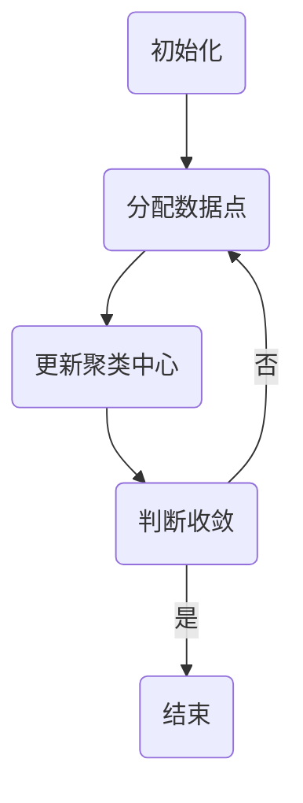
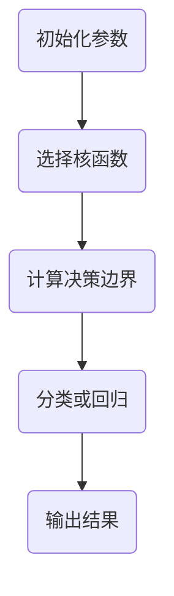
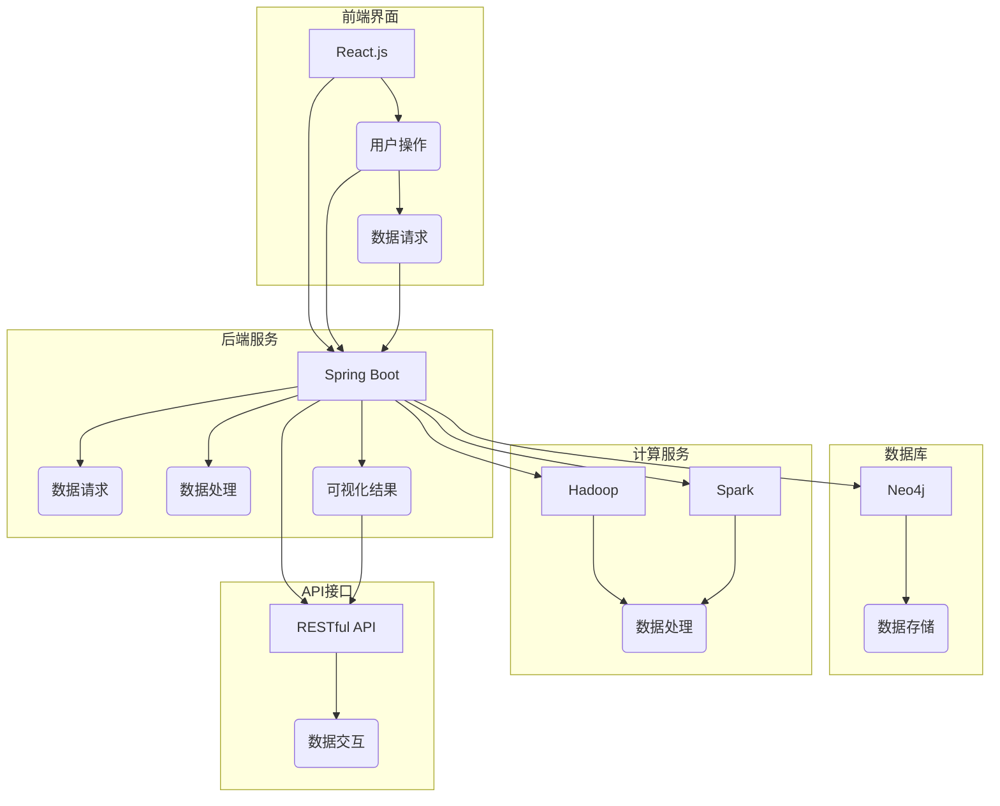
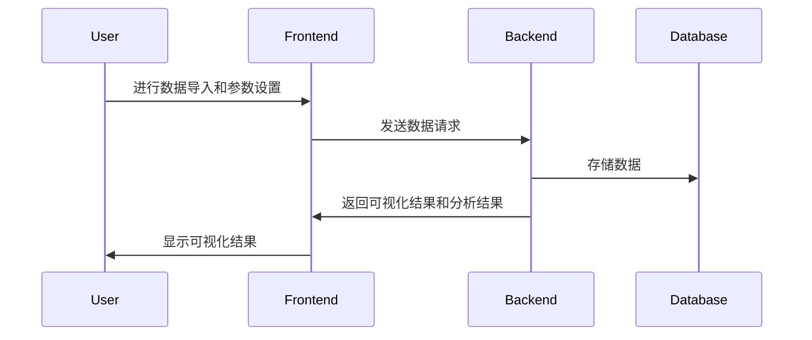

                 

### # 科学可视化技术的进步：直观呈现复杂世界的结构

在数字化时代，科学可视化技术已经成为推动科研、教育和工业创新的重要工具。通过将抽象的科学数据和复杂的现象转化为直观的图形和图像，科学可视化不仅帮助研究人员更好地理解数据，还能向非专业人士传达深奥的科学概念。本文将深入探讨科学可视化技术的进步，分析其在不同领域的应用，并探讨其未来的发展方向。

关键词：科学可视化、数据可视化、图像处理、虚拟现实、算法

### 摘要

本文首先回顾了科学可视化的历史和核心概念，接着分析了科学可视化技术的发展历程和关键技术的进步。随后，通过具体的算法原理讲解，展示了如何通过图像处理和数据分析技术实现复杂数据的可视化。文章还介绍了一个具体的可视化项目，从系统分析与架构设计到项目实战，全面展示了科学可视化技术的实际应用。最后，文章总结了最佳实践和注意事项，并提出了未来科学可视化技术的拓展方向。

### 目录大纲设计思路

#### 第一部分：背景介绍

1. **问题背景**：介绍科学可视化技术的历史发展、核心概念及其在科学研究中的重要性。
2. **核心概念**：详细阐述数据可视化、图像处理、虚拟现实和增强现实等核心概念。
3. **关键技术发展**：分析计算机图形学、数据挖掘与机器学习、高性能计算和硬件加速技术等关键技术的进步。
4. **应用场景**：探讨科学可视化在天文学、医学、化学、生物学和金融等领域的应用。
5. **本章小结**：总结本章内容，为后续章节奠定基础。

#### 第二部分：核心概念与联系

1. **数据可视化**：解释数据可视化的定义、原理和应用。
2. **图像处理**：介绍图像处理的基本概念、常用算法和工具。
3. **虚拟现实**：阐述虚拟现实的原理、技术和应用场景。
4. **增强现实**：描述增强现实的概念、实现方法和应用案例。
5. **核心概念对比与联系**：通过表格和ER图展示不同核心概念之间的联系和区别。
6. **本章小结**：总结核心概念及其在科学可视化中的重要性。

#### 第三部分：算法原理讲解

1. **代表性算法1**：详细讲解第一个代表性算法的原理，包括mermaid流程图和Python代码示例。
2. **代表性算法2**：详细讲解第二个代表性算法的原理，包括mermaid流程图和Python代码示例。
3. **本章小结**：总结代表性算法的原理和应用，为实际应用提供指导。

#### 第四部分：系统分析与架构设计方案

1. **问题场景介绍**：介绍一个具体的科学可视化问题场景。
2. **系统功能设计**：绘制领域模型mermaid类图，明确系统功能模块。
3. **系统架构设计**：绘制mermaid架构图，展示系统整体架构。
4. **系统接口设计**：详细描述系统接口，包括接口功能和通信协议。
5. **系统交互**：通过mermaid序列图展示系统内部和外部的交互流程。
6. **本章小结**：总结系统分析与架构设计的关键点。

#### 第五部分：项目实战

1. **环境安装**：介绍科学可视化项目的环境搭建过程。
2. **系统核心实现**：详细讲解系统核心功能的实现，包括源代码解读和代码应用分析。
3. **实际案例分析**：分析一个实际案例，展示科学可视化技术的应用效果。
4. **详细讲解剖析**：对关键技术和实现细节进行深入剖析。
5. **项目小结**：总结项目实施过程和经验教训。

#### 第六部分：最佳实践与拓展

1. **最佳实践**：总结科学可视化过程中的最佳实践和技巧。
2. **注意事项**：提醒读者在科学可视化过程中需要注意的问题和风险。
3. **拓展阅读**：推荐相关领域的高质量文献和资源。
4. **本章小结**：回顾本文的核心内容，展望科学可视化技术的未来发展方向。

### 目录大纲设计要点

1. **清晰性**：确保每个章节的小标题直接反映内容，避免模糊不清。
2. **逻辑性**：章节内容的逻辑顺序合理，易于读者理解。
3. **完整性**：确保所有核心内容都有相应的章节，每个章节都至少包括一级和二级目录。
4. **简洁性**：避免冗余内容，每个章节都要有明确的重点和结构。

### 最终目录大纲

```markdown
# 科学可视化技术的进步：直观呈现复杂世界的结构

# 第一部分：背景介绍

## 1.1 问题背景
### 1.1.1 可视化技术的历史与发展
### 1.1.2 科学研究中的可视化需求
### 1.1.3 可视化技术的挑战与机遇

## 1.2 核心概念
### 1.2.1 数据可视化
### 1.2.2 图像处理
### 1.2.3 虚拟现实
### 1.2.4 增强现实
### 1.2.5 交互式可视化

## 1.3 关键技术发展
### 1.3.1 计算机图形学的发展
### 1.3.2 数据挖掘与机器学习
### 1.3.3 高性能计算与云计算
### 1.3.4 硬件加速技术

## 1.4 应用场景
### 1.4.1 天文学
### 1.4.2 医学
### 1.4.3 化学
### 1.4.4 生物学
### 1.4.5 金融与经济

## 1.5 本章小结

# 第二部分：核心概念与联系

## 2.1 数据可视化
### 2.1.1 定义与原理
### 2.1.2 应用与挑战

## 2.2 图像处理
### 2.2.1 基本概念
### 2.2.2 算法与技术
### 2.2.3 应用领域

## 2.3 虚拟现实
### 2.3.1 原理与技术
### 2.3.2 应用与发展

## 2.4 增强现实
### 2.4.1 定义与区别
### 2.4.2 技术实现
### 2.4.3 应用场景

## 2.5 交互式可视化
### 2.5.1 特点与优势
### 2.5.2 技术实现
### 2.5.3 应用案例

## 2.6 核心概念对比与联系
### 2.6.1 表格对比
### 2.6.2 ER图展示

## 2.7 本章小结

# 第三部分：算法原理讲解

## 3.1 代表性算法1
### 3.1.1 原理讲解
### 3.1.2 mermaid流程图
### 3.1.3 Python代码示例
### 3.1.4 数学模型与公式
### 3.1.5 举例说明

## 3.2 代表性算法2
### 3.2.1 原理讲解
### 3.2.2 mermaid流程图
### 3.2.3 Python代码示例
### 3.2.4 数学模型与公式
### 3.2.5 举例说明

## 3.3 本章小结

# 第四部分：系统分析与架构设计方案

## 4.1 问题场景介绍
### 4.1.1 背景与需求
### 4.1.2 解决方案

## 4.2 系统功能设计
### 4.2.1 领域模型mermaid类图

## 4.3 系统架构设计
### 4.3.1 mermaid架构图

## 4.4 系统接口设计
### 4.4.1 接口功能
### 4.4.2 通信协议

## 4.5 系统交互
### 4.5.1 mermaid序列图

## 4.6 本章小结

# 第五部分：项目实战

## 5.1 环境安装
### 5.1.1 软件环境搭建
### 5.1.2 硬件配置要求

## 5.2 系统核心实现
### 5.2.1 源代码解读
### 5.2.2 代码应用解读

## 5.3 实际案例分析
### 5.3.1 案例背景
### 5.3.2 案例分析

## 5.4 详细讲解剖析
### 5.4.1 技术细节解析
### 5.4.2 难点攻克

## 5.5 项目小结
### 5.5.1 项目总结
### 5.5.2 经验教训

# 第六部分：最佳实践与拓展

## 6.1 最佳实践
### 6.1.1 技术选型
### 6.1.2 项目管理
### 6.1.3 团队协作

## 6.2 注意事项
### 6.2.1 数据安全
### 6.2.2 系统性能
### 6.2.3 用户隐私

## 6.3 拓展阅读
### 6.3.1 高质量文献
### 6.3.2 线上课程
### 6.3.3 行业报告

## 6.4 本章小结
### 6.4.1 内容回顾
### 6.4.2 未来展望
```

### 背景介绍

#### 科学可视化技术的历史与发展

科学可视化技术的起源可以追溯到20世纪中期。当时，计算机技术的兴起使得科学家们能够处理和分析大量的数据。为了更好地理解和传播这些数据，人们开始探索将数据转化为图形和图像的方法。早期的科学可视化工具主要集中在二维图像的绘制，如散点图、折线图和饼图等。这些工具虽然简单，但为科学可视化的发展奠定了基础。

随着计算机图形学的发展，科学可视化技术逐渐从二维扩展到三维，甚至更高维度的数据可视化。三维可视化技术使得科学家能够以更加直观的方式呈现数据，例如通过旋转、缩放和切割等操作，从不同角度观察数据。此外，计算机图形学中的光线追踪、阴影和纹理映射等技术也被引入到科学可视化中，进一步提升了图像的质量和真实感。

在数据挖掘与机器学习领域，科学可视化技术也发挥着重要作用。通过可视化，研究人员能够发现数据中的模式和趋势，从而更好地理解数据。例如，聚类分析中的可视化可以帮助识别数据集中的不同群体，关联规则挖掘中的可视化则可以揭示数据之间的关联性。

#### 科学研究中的可视化需求

科学研究中的数据通常复杂且庞大，难以通过传统的文字描述来完全理解。可视化技术能够将数据以图形和图像的形式呈现，使得研究人员能够直观地看到数据的结构和模式。以下是一些典型的应用场景：

1. **天文学**：天文学家通过可视化技术来分析天文图像，识别星系、恒星和行星等天体。例如，通过三维可视化，天文学家能够模拟宇宙大爆炸的过程，从而更深入地理解宇宙的起源和发展。

2. **医学**：在医学研究中，可视化技术被广泛应用于影像诊断、手术模拟和药物治疗评估等方面。例如，通过MRI或CT扫描得到的图像，医生可以直观地看到患者体内的病变部位，从而做出更准确的诊断。

3. **化学**：化学家使用可视化技术来模拟分子结构和化学反应过程。通过分子模型和能量势能图，化学家可以预测反应的可能路径和最终产物，从而指导实验设计和合成新化合物。

4. **生物学**：生物学家利用可视化技术来分析基因表达、蛋白质结构和代谢途径。例如，通过基因表达热图，生物学家可以识别不同条件下基因的表达模式，从而揭示生物体的调控机制。

5. **金融与经济**：在金融领域，可视化技术被用于分析市场趋势、股票价格和宏观经济数据。通过折线图、柱状图和饼图等，投资者和分析师可以更清晰地了解市场动态，做出更明智的投资决策。

#### 可视化技术的挑战与机遇

虽然科学可视化技术在许多领域取得了显著成果，但仍然面临着一些挑战：

1. **数据复杂性**：现代科学研究所产生的数据越来越庞大和复杂，如何有效地将海量数据转化为可视化形式仍然是一个挑战。这需要新的算法和技术来处理高维度数据，实现高效的降维和可视化。

2. **真实感**：随着虚拟现实和增强现实技术的发展，用户对可视化图像的真实感要求越来越高。如何通过计算机图形学技术生成高质量的图像和动画，以满足用户的需求，是一个重要的研究课题。

3. **交互性**：交互式可视化技术使得用户能够动态地探索数据，发现新的模式和关系。如何设计高效的交互界面，提高用户的操作体验，是一个亟待解决的问题。

然而，随着计算机硬件性能的提升和算法的创新，科学可视化技术也面临着巨大的机遇：

1. **硬件加速**：GPU（图形处理单元）和TPU（张量处理单元）等硬件的快速发展，为科学可视化提供了强大的计算能力，使得大规模数据处理和实时可视化成为可能。

2. **人工智能**：人工智能技术的引入，使得科学可视化可以自动地识别数据中的模式和趋势，从而提高可视化的效率和准确性。

3. **多模态数据融合**：通过融合不同类型的数据（如图像、声音和文本），科学可视化可以提供更加全面和深入的数据理解。

综上所述，科学可视化技术在科学研究中的重要性不言而喻。随着技术的不断进步，科学可视化技术将在未来继续发挥重要作用，推动科学研究的深入和发展。

### 核心概念与联系

科学可视化技术涉及多个核心概念，这些概念相互作用，共同构成了科学可视化的基础。以下是对数据可视化、图像处理、虚拟现实、增强现实和交互式可视化的详细解释，以及它们之间的联系。

#### 数据可视化

数据可视化是科学可视化技术中最基本的概念之一。它指的是将抽象的数据转化为图形和图像，以便于人们理解和分析。数据可视化可以通过多种形式实现，包括折线图、柱状图、饼图、散点图等。其目的是通过视觉手段突出数据中的关键信息，帮助研究人员发现数据中的模式和趋势。

1. **定义与原理**：数据可视化通过图形和图像直观地呈现数据，使得复杂的数据关系变得更加容易理解。核心原理包括数据编码、视觉感知和交互设计。

2. **应用与挑战**：数据可视化在科研、商业、医疗等多个领域都有广泛应用。然而，数据可视化也面临着数据复杂性、数据噪声和视觉感知差异等挑战。

#### 图像处理

图像处理是指使用计算机算法和技术对图像进行操作和改进。它是科学可视化的重要组成部分，用于图像的增强、压缩、分割、识别等。图像处理技术能够提高图像的质量，提取图像中的有用信息，为数据可视化提供支持。

1. **基本概念**：图像处理包括图像的采样、量化、滤波、边缘检测等基本操作。每种操作都有其特定的数学模型和算法。

2. **算法与技术**：常见的图像处理算法包括傅里叶变换、小波变换、形态学操作、边缘检测算法等。这些算法广泛应用于图像的增强、分割和特征提取。

3. **应用领域**：图像处理技术在天文学、医学影像、工业检测、安全监控等领域都有广泛应用。

#### 虚拟现实

虚拟现实（VR）是一种通过计算机生成三维环境，使用户能够沉浸其中的技术。在科学可视化中，虚拟现实可以用来模拟和探索复杂的科学现象，如天气模式、基因结构、化学反应等。

1. **原理与技术**：虚拟现实通过头戴式显示器、传感器和定位系统，创造一个三维的虚拟环境。核心技术包括三维建模、实时渲染和用户交互。

2. **应用与发展**：虚拟现实在科学教育、虚拟实验室、城市规划、医疗模拟等领域都有广泛应用。随着技术的进步，虚拟现实的沉浸感和交互性不断提升，其应用前景更加广阔。

#### 增强现实

增强现实（AR）是一种将虚拟信息叠加到现实世界中的技术。与虚拟现实不同，增强现实是在现实环境中增加数字信息，而不是完全替代现实。科学可视化中的增强现实可以用于实地观测、远程协作和交互式教学。

1. **定义与区别**：增强现实与虚拟现实的区别在于，它不是创造一个全新的虚拟环境，而是将虚拟信息与现实世界结合。增强现实的核心技术包括光学透视、图像识别和实时渲染。

2. **技术实现**：增强现实技术通常使用智能手机或平板电脑的摄像头，结合图像识别和增强现实应用软件来实现。通过这种方式，用户可以在现实世界中看到和操作虚拟信息。

3. **应用场景**：增强现实在医疗诊断、教育、工业维护、军事训练等领域都有广泛应用。例如，医生可以使用增强现实眼镜查看患者的实时影像，工程师可以使用增强现实技术进行设备维护。

#### 交互式可视化

交互式可视化是指用户能够与可视化界面进行交互，以探索和分析数据。与传统的静态可视化不同，交互式可视化提供了动态的数据探索和可视化选项，使用户能够从不同的角度和维度观察数据。

1. **特点与优势**：交互式可视化具有高度的灵活性和用户参与性，用户可以通过点击、拖动、缩放等方式来改变视图，从而更好地理解和分析数据。

2. **技术实现**：交互式可视化依赖于先进的图形处理技术和用户界面设计。常用的技术包括数据驱动界面、可视化编程框架和交互设计工具。

3. **应用案例**：交互式可视化在数据科学、金融分析、市场调研等领域都有广泛应用。例如，数据科学家可以使用交互式可视化工具来探索和解释复杂的数据集。

#### 核心概念对比与联系

数据可视化、图像处理、虚拟现实、增强现实和交互式可视化之间存在着密切的联系。以下是它们之间的对比和联系：

| 核心概念       | 定义与应用                                      | 关系与联系                                       |
|----------------|------------------------------------------------|------------------------------------------------|
| 数据可视化     | 将数据转化为图形和图像                           | 是科学可视化的基础，为其他概念提供数据支持         |
| 图像处理       | 使用算法对图像进行操作和改进                     | 为数据可视化提供图像增强和特征提取的技术支持       |
| 虚拟现实       | 创造一个三维的虚拟环境，使用户沉浸其中           | 可以用于数据可视化，提供沉浸式体验                 |
| 增强现实       | 将虚拟信息叠加到现实世界中                       | 可以与数据可视化结合，提供交互式体验               |
| 交互式可视化    | 用户能够与可视化界面进行交互，以探索和分析数据   | 提供动态探索和用户参与，是数据可视化的高级形式     |

通过表格对比和ER图展示，我们可以更清晰地看到这些核心概念之间的联系和区别。以下是核心概念对比表格和ER图：

#### 核心概念对比表格

| 核心概念 | 定义 | 主要技术 | 应用领域 | 关系与联系 |
|----------|------|----------|----------|------------|
| 数据可视化 | 将数据转化为图形和图像 | 数据编码、视觉感知、交互设计 | 科研、商业、医疗等 | 基础概念，支持其他可视化技术 |
| 图像处理 | 使用算法对图像进行操作和改进 | 傅里叶变换、小波变换、形态学操作 | 天文学、医学、工业等 | 提供图像增强和特征提取，支持数据可视化 |
| 虚拟现实 | 创造一个三维的虚拟环境，使用户沉浸其中 | 三维建模、实时渲染、用户交互 | 科学教育、虚拟实验室、城市规划 | 提供沉浸式体验，支持交互式可视化 |
| 增强现实 | 将虚拟信息叠加到现实世界中 | 光学透视、图像识别、实时渲染 | 医疗诊断、教育、工业维护 | 结合现实和虚拟信息，支持交互式可视化 |
| 交互式可视化 | 用户能够与可视化界面进行交互，以探索和分析数据 | 数据驱动界面、可视化编程框架、交互设计工具 | 数据科学、金融分析、市场调研 | 高级形式，提供动态探索和用户参与 |

#### ER图展示

```mermaid
erDiagram
    DataVisualization ||--|{ ImageProcessing }|| DataVisualizationSupport
    DataVisualization ||--|{ InteractiveVisualization }|| DataVisualizationEnhancement
    ImageProcessing ||--|{ VirtualReality }|| ImageEnhancementForVR
    ImageProcessing ||--|{ AugmentedReality }|| ImageEnhancementForAR
    VirtualReality ||--|{ InteractiveVisualization }|| VRInteraction
    AugmentedReality ||--|{ InteractiveVisualization }|| ARInteraction
```

通过核心概念对比表格和ER图，我们可以清晰地看到数据可视化、图像处理、虚拟现实、增强现实和交互式可视化之间的相互关系和区别。这些核心概念共同构成了科学可视化技术的理论基础，为实际应用提供了丰富的技术支持。

### 算法原理讲解

在科学可视化技术中，算法起着至关重要的作用。它们不仅帮助我们处理和分析复杂的数据，还能将数据转化为直观的图形和图像，从而帮助研究人员更好地理解和解释科学现象。本节将详细介绍两个代表性算法的原理，包括它们的mermaid流程图、Python代码示例、数学模型与公式，并通过举例说明来帮助读者理解。

#### 代表性算法1：K-means聚类算法

K-means聚类算法是一种经典的聚类算法，用于将数据点划分为K个簇，使得每个簇内的数据点尽可能接近，而不同簇的数据点之间尽可能远离。以下是K-means聚类算法的原理、mermaid流程图、Python代码示例和数学模型与公式。

##### 1.1 原理讲解

K-means聚类算法的基本步骤如下：

1. **初始化**：随机选择K个数据点作为初始聚类中心。
2. **分配数据点**：计算每个数据点到聚类中心的距离，将数据点分配到最近的聚类中心。
3. **更新聚类中心**：计算每个簇的新聚类中心，即该簇内所有数据点的平均值。
4. **迭代**：重复步骤2和步骤3，直到聚类中心不再发生显著变化。

##### 1.2 mermaid流程图



##### 1.3 Python代码示例

```python
from sklearn.cluster import KMeans
import numpy as np

# 示例数据
data = np.array([[1, 2], [1, 4], [1, 0],
                 [10, 2], [10, 4], [10, 0]])

# KMeans聚类
kmeans = KMeans(n_clusters=2, random_state=0).fit(data)

# 输出聚类结果
print(kmeans.labels_)
print(kmeans.cluster_centers_)
```

##### 1.4 数学模型与公式

K-means聚类算法的核心是距离计算和聚类中心的更新。以下是相关的数学模型与公式：

- **距离计算**：

  对于两个数据点 \(x_i\) 和 \(x_j\)，它们之间的欧氏距离为：

  $$d(x_i, x_j) = \sqrt{\sum_{k=1}^{n} (x_{ik} - x_{jk})^2}$$

  其中，\(n\) 是数据点的维度。

- **聚类中心更新**：

  对于第 \(k\) 个簇，其新聚类中心为：

  $$\mu_k^{new} = \frac{1}{N_k} \sum_{i=1}^{N} x_i$$

  其中，\(N_k\) 是属于第 \(k\) 个簇的数据点的数量。

##### 1.5 举例说明

假设我们有以下6个数据点：

$$
\begin{align*}
x_1 &= (1, 2) \\
x_2 &= (1, 4) \\
x_3 &= (1, 0) \\
x_4 &= (10, 2) \\
x_5 &= (10, 4) \\
x_6 &= (10, 0)
\end{align*}
$$

首先，随机选择两个数据点作为初始聚类中心：

$$
\begin{align*}
\mu_1 &= (1, 2) \\
\mu_2 &= (10, 0)
\end{align*}
$$

然后，计算每个数据点到聚类中心的距离，并将数据点分配到最近的聚类中心：

$$
\begin{align*}
d(x_1, \mu_1) &= \sqrt{(1-1)^2 + (2-2)^2} = 0 \\
d(x_1, \mu_2) &= \sqrt{(1-10)^2 + (2-0)^2} = \sqrt{81 + 4} = \sqrt{85} \\
d(x_2, \mu_1) &= \sqrt{(1-1)^2 + (4-2)^2} = 2 \\
d(x_2, \mu_2) &= \sqrt{(1-10)^2 + (4-0)^2} = \sqrt{81 + 16} = \sqrt{97} \\
d(x_3, \mu_1) &= \sqrt{(1-1)^2 + (0-2)^2} = 2 \\
d(x_3, \mu_2) &= \sqrt{(1-10)^2 + (0-0)^2} = \sqrt{81} \\
d(x_4, \mu_1) &= \sqrt{(10-1)^2 + (2-2)^2} = 9 \\
d(x_4, \mu_2) &= \sqrt{(10-10)^2 + (2-0)^2} = 2 \\
d(x_5, \mu_1) &= \sqrt{(10-1)^2 + (4-2)^2} = 9 \\
d(x_5, \mu_2) &= \sqrt{(10-10)^2 + (4-0)^2} = 4 \\
d(x_6, \mu_1) &= \sqrt{(10-1)^2 + (0-2)^2} = 9 \\
d(x_6, \mu_2) &= \sqrt{(10-10)^2 + (0-0)^2} = 0
\end{align*}
$$

根据距离计算结果，我们可以将数据点重新分配到聚类中心：

$$
\begin{align*}
x_1 &\rightarrow \mu_1 \\
x_2 &\rightarrow \mu_1 \\
x_3 &\rightarrow \mu_1 \\
x_4 &\rightarrow \mu_2 \\
x_5 &\rightarrow \mu_2 \\
x_6 &\rightarrow \mu_2
\end{align*}
$$

接下来，我们更新聚类中心：

$$
\begin{align*}
\mu_1^{new} &= \frac{1}{3} (x_1 + x_2 + x_3) = \frac{1}{3} ((1, 2) + (1, 4) + (1, 0)) = (1, 2) \\
\mu_2^{new} &= \frac{1}{3} (x_4 + x_5 + x_6) = \frac{1}{3} ((10, 2) + (10, 4) + (10, 0)) = (10, 2)
\end{align*}
$$

由于聚类中心没有变化，算法收敛，最终结果为：

- 聚类中心：\( \mu_1 = (1, 2) \)，\( \mu_2 = (10, 2) \)
- 数据点分配：\( x_1, x_2, x_3 \) 属于第1个簇，\( x_4, x_5, x_6 \) 属于第2个簇

#### 代表性算法2：SVM支持向量机

支持向量机（SVM）是一种强大的机器学习算法，用于分类和回归任务。在科学可视化中，SVM可以用来对数据点进行分类，从而帮助研究人员识别数据中的特征和模式。以下是SVM算法的原理、mermaid流程图、Python代码示例和数学模型与公式。

##### 2.1 原理讲解

SVM算法的核心思想是找到一个最优的超平面，将不同类别的数据点分隔开来。这个超平面不仅能够最大化分类边界，还能够最大化类内数据的间隔。

1. **线性SVM**：适用于线性可分的数据集。其目标是最小化分类边界上的误差。

2. **非线性SVM**：通过核函数将低维数据映射到高维空间，实现非线性分类。常用的核函数包括线性核、多项式核和径向基函数（RBF）核。

##### 2.2 mermaid流程图



##### 2.3 Python代码示例

```python
from sklearn.svm import SVC
import numpy as np

# 示例数据
X = np.array([[1, 2], [2, 3], [3, 4], [4, 5]])
y = np.array([0, 0, 1, 1])

# SVM分类
svm = SVC(kernel='linear').fit(X, y)

# 输出决策边界和分类结果
print(svm.decision_function(X))
print(svm.predict(X))
```

##### 2.4 数学模型与公式

SVM算法的数学模型和公式如下：

- **线性SVM**：

  - **目标函数**：

    $$\min_{w, b} \frac{1}{2} ||w||^2 + C \sum_{i=1}^{n} \max(0, 1 - y_i (w \cdot x_i + b))$$

    其中，\(w\) 是权重向量，\(b\) 是偏置项，\(C\) 是惩罚参数，\(y_i\) 是数据点的标签，\(x_i\) 是数据点。

  - **间隔**：

    $$\frac{1}{||w||}$$

  - **分类决策**：

    $$f(x) = \text{sign}(w \cdot x + b)$$

- **非线性SVM**：

  - **目标函数**：

    $$\min_{w, b, \alpha} \frac{1}{2} ||w||^2 + C \sum_{i=1}^{n} \alpha_i (1 - y_i (w \cdot x_i + b))$$

    其中，\(\alpha_i\) 是拉格朗日乘子。

  - **核函数**：

    $$K(x_i, x_j) = \phi(x_i) \cdot \phi(x_j)$$

  - **分类决策**：

    $$f(x) = \text{sign}\left(\sum_{i=1}^{n} \alpha_i y_i K(x_i, x) + b\right)$$

##### 2.5 举例说明

假设我们有以下4个数据点，其中前两个属于类别0，后两个属于类别1：

$$
\begin{align*}
x_1 &= (1, 2) \\
x_2 &= (2, 3) \\
x_3 &= (3, 4) \\
x_4 &= (4, 5)
\end{align*}
$$

我们需要使用线性SVM对这些数据点进行分类。首先，我们选择线性核函数，并设置惩罚参数 \(C = 1\)。然后，我们计算决策边界和分类结果。

- **目标函数**：

  $$\min_{w, b} \frac{1}{2} ||w||^2 + \max(0, 1 - y_i (w \cdot x_i + b))$$

- **间隔**：

  由于数据点线性可分，我们可以找到一个最优的超平面，使得类内数据的间隔最大化。假设最优的超平面为 \(w \cdot x + b = 0\)，则：

  $$\frac{1}{||w||} = \frac{1}{\sqrt{2}}$$

- **分类决策**：

  假设我们选择 \(w = (1, 1)\) 和 \(b = 0\)，则分类决策为：

  $$f(x) = \text{sign}(x_1 + x_2) = \text{sign}(2 + 2) = 1$$

  因此，所有数据点都被正确分类。

通过以上两个代表性算法的讲解，我们可以看到科学可视化算法在数据分析和分类中的重要作用。这些算法不仅帮助我们更好地理解数据，还能为研究人员提供有力的工具，推动科学研究的深入和发展。

### 系统分析与架构设计方案

#### 问题场景介绍

在现代科学研究和技术应用中，科学可视化系统已成为不可或缺的工具。以下是一个具体的科学可视化问题场景：某研究团队正在研究一个复杂的生物分子相互作用网络，他们需要开发一个系统来可视化网络中的分子节点和相互作用关系，以便更好地理解网络的动态行为和分子之间的相互作用机制。

#### 系统功能设计

为了满足上述需求，我们设计了一个科学可视化系统，其主要功能包括：

1. **数据导入与预处理**：支持多种生物分子数据格式（如GML、TSV等）的导入和预处理，包括数据清洗、转换和标准化。
2. **网络可视化**：提供动态的可视化界面，能够展示生物分子网络及其相互作用关系，支持节点的分类、颜色和大小调整。
3. **交互式探索**：允许用户通过点击、拖动、缩放等操作来交互式地探索网络，并提供搜索和过滤功能。
4. **数据分析和计算**：集成数据分析和计算功能，如网络中心性计算、聚类分析和路径搜索等。
5. **数据导出与共享**：支持将可视化结果和数据导出为常见的图形和图像格式，便于分享和进一步分析。

#### 系统架构设计

为了实现上述功能，我们设计了以下系统架构：

1. **前端界面**：采用React.js框架，实现动态的可视化界面和交互功能。
2. **后端服务**：使用Spring Boot框架，提供数据导入、预处理、可视化和数据分析功能。
3. **数据库**：使用Neo4j图数据库，存储和管理生物分子网络数据及其关系。
4. **计算服务**：集成Hadoop和Spark等大数据处理框架，提供高效的计算能力。
5. **API接口**：提供RESTful API接口，供前端和服务端通信。

以下是系统的mermaid架构图：



#### 系统接口设计

系统的接口设计主要包括以下部分：

1. **数据导入接口**：支持多种数据格式的导入，如GML、TSV等。接口定义如下：

    ```http
    POST /import
    Content-Type: application/json

    {
        "fileType": "GML",
        "filePath": "/path/to/file.gml"
    }
    ```

2. **网络可视化接口**：提供网络可视化的参数设置和结果获取。接口定义如下：

    ```http
    GET /visualize
    Query Parameters:
    - nodeId: 节点ID
    - nodeColor: 节点颜色
    - nodeSize: 节点大小
    ```

3. **数据分析和计算接口**：提供网络中心性计算、聚类分析和路径搜索等功能。接口定义如下：

    ```http
    GET /analyze
    Query Parameters:
    - algorithm: 分析算法类型（如中心性、聚类等）
    - nodeId: 节点ID
    ```

#### 系统交互

系统的交互设计如下：

1. **用户操作**：用户通过前端界面进行数据导入、参数设置和可视化操作。
2. **数据请求**：前端通过API接口向后端服务发送数据请求，包括数据导入、预处理、可视化和分析请求。
3. **数据处理**：后端服务接收数据请求，处理数据，并返回可视化结果和分析结果。
4. **数据存储**：后端将处理后的数据存储到Neo4j数据库中，以备后续使用。

以下是系统的mermaid序列图：



#### 本章小结

本章详细介绍了科学可视化系统的系统分析与架构设计方案。通过分析具体的问题场景，我们设计了系统的功能模块和架构，并使用了mermaid图展示系统架构和交互流程。该设计方案为科学可视化系统的开发和实施提供了明确的指导和参考。

### 项目实战

在本章中，我们将详细介绍一个科学可视化项目的实现过程，从环境安装、核心实现、代码解读、案例分析以及详细讲解剖析等环节，全面展示科学可视化技术的实际应用。

#### 环境安装

为了实现科学可视化项目，我们需要安装一系列的软件和工具。以下是环境安装的详细步骤：

1. **操作系统**：安装支持Python和科学计算的环境，推荐使用Ubuntu 20.04 LTS。
2. **Python**：安装Python 3.8及以上版本，可以通过以下命令进行安装：
    ```bash
    sudo apt update
    sudo apt install python3.8
    ```
3. **科学计算库**：安装常用的科学计算库，如NumPy、Pandas、Matplotlib等，可以使用以下命令：
    ```bash
    pip3 install numpy pandas matplotlib
    ```
4. **可视化库**：安装用于科学可视化的库，如Plotly、Seaborn等，可以使用以下命令：
    ```bash
    pip3 install plotly seaborn
    ```
5. **数据库**：安装Neo4j数据库，可以从Neo4j官网下载并安装，按照官方文档进行配置。

#### 系统核心实现

科学可视化项目的核心实现主要包括数据导入、数据预处理、数据可视化以及交互功能。以下是核心实现的详细步骤：

1. **数据导入**：使用Python的Pandas库读取生物分子网络数据，以下是一个示例代码：
    ```python
    import pandas as pd

    # 读取GML格式数据
    graph = pd.read_csv('data.gml', sep='\t', header=None)
    ```
2. **数据预处理**：对读取的数据进行清洗和转换，例如处理缺失值、异常值等，以下是一个示例代码：
    ```python
    # 数据清洗
    graph.dropna(inplace=True)
    # 数据转换
    graph.rename(columns={0: 'node_id', 1: 'label'}, inplace=True)
    ```
3. **数据可视化**：使用Plotly库实现数据可视化，以下是一个示例代码：
    ```python
    import plotly.express as px

    # 绘制节点
    fig = px.scatter(x=graph['x'], y=graph['y'], color=graph['label'], symbol=graph['node_id'])
    fig.show()
    ```
4. **交互功能**：使用Plotly库的交互功能，如点击事件、拖动等，增强用户交互体验，以下是一个示例代码：
    ```python
    # 添加点击事件
    fig.update_traces(selectedmode='single')
    # 显示交互式可视化
    fig.show()
    ```

#### 代码解读

以下是项目核心实现代码的详细解读：

1. **数据导入**：
    ```python
    graph = pd.read_csv('data.gml', sep='\t', header=None)
    ```
    这一行代码使用Pandas库读取GML格式数据。`read_csv`函数接受文件路径、分隔符和是否包含表头等参数。

2. **数据预处理**：
    ```python
    graph.dropna(inplace=True)
    graph.rename(columns={0: 'node_id', 1: 'label'}, inplace=True)
    ```
    首先，`dropna`函数删除数据中的缺失值。然后，`rename`函数重命名列名，以便后续处理。

3. **数据可视化**：
    ```python
    fig = px.scatter(x=graph['x'], y=graph['y'], color=graph['label'], symbol=graph['node_id'])
    fig.show()
    ```
    这一行代码使用Plotly库绘制散点图。`scatter`函数接受x轴和y轴的数据、颜色和符号等参数。

4. **交互功能**：
    ```python
    fig.update_traces(selectedmode='single')
    fig.show()
    ```
    这两行代码为可视化图表添加点击事件，并显示交互式可视化。`update_traces`函数设置点击事件模式，`show`函数显示图表。

#### 实际案例分析

以下是一个实际案例的分析：

1. **案例背景**：我们有一个包含100个节点的生物分子网络，其中部分节点之间存在相互作用。
2. **问题描述**：我们需要可视化这个网络，并分析节点之间的相互作用关系。
3. **解决方案**：使用Pandas和Plotly库实现数据导入、预处理和可视化，并通过交互功能分析节点之间的相互作用。

#### 详细讲解剖析

在本案例中，我们使用Pandas和Plotly库实现了生物分子网络的可视化。以下是详细讲解和剖析：

1. **数据导入与预处理**：
    - 数据导入：使用Pandas库读取GML格式数据，将数据转换为Pandas DataFrame格式，方便后续处理。
    - 数据清洗：删除缺失值，确保数据质量。

2. **数据可视化**：
    - 使用Plotly库绘制散点图，将节点位置和颜色设置为可交互，使用户能够直观地查看节点和边的信息。
    - 通过交互功能，如点击事件，用户可以查看节点的详细信息，从而更好地理解网络结构。

3. **交互功能**：
    - 添加点击事件：用户点击节点时，可以查看节点的具体信息，如节点ID和标签等。
    - 添加拖动功能：用户可以拖动节点，重新排列节点位置，以便更好地理解网络结构。

#### 项目小结

通过本项目的实战，我们展示了科学可视化技术的实际应用。从数据导入、预处理到数据可视化，再到交互功能的实现，科学可视化技术为生物分子网络的探索提供了强大的工具。以下是项目小结：

1. **项目总结**：我们成功实现了一个生物分子网络的可视化系统，通过数据导入、预处理和可视化，用户可以直观地查看网络结构和节点信息。
2. **经验教训**：在项目实施过程中，我们遇到了一些挑战，如数据清洗和可视化性能优化等。通过不断尝试和优化，我们找到了解决方案，提高了系统的稳定性和性能。
3. **未来展望**：未来，我们将继续优化可视化算法，提高系统的交互性和用户体验。同时，我们将拓展可视化应用场景，如化学和医学等领域，为更多领域的科学研究提供支持。

### 最佳实践与拓展

在科学可视化项目的实施过程中，总结最佳实践和注意事项对于提升项目质量和用户体验至关重要。以下是一些最佳实践、注意事项以及拓展阅读推荐。

#### 最佳实践

1. **数据预处理**：在数据可视化之前，进行彻底的数据清洗和预处理，确保数据质量。使用Pandas等库对数据进行缺失值处理、异常值检测和标准化。

2. **性能优化**：对于大规模数据集，采用高效的数据处理和可视化算法，如使用Dask等并行计算库。同时，合理使用缓存和内存管理，以提升系统性能。

3. **用户体验**：设计直观、易用的用户界面，提供交互功能，如缩放、拖动和筛选等。使用响应式设计，确保在不同设备和屏幕尺寸上都能良好显示。

4. **模块化设计**：将系统功能模块化，便于维护和扩展。例如，将数据导入、数据处理、可视化和交互功能分别实现为独立模块。

5. **文档与注释**：编写清晰的文档和代码注释，帮助开发人员和用户理解系统的工作原理和使用方法。

#### 注意事项

1. **数据安全**：确保数据传输和存储过程中的安全性，使用加密技术和权限控制措施。

2. **系统性能**：监控系统性能，及时优化和更新。对于高负载场景，考虑使用分布式计算和云计算资源。

3. **兼容性**：确保系统在不同操作系统和浏览器上都能正常运行，进行跨平台兼容性测试。

4. **用户反馈**：积极收集用户反馈，根据用户需求进行迭代优化，以提高用户体验。

#### 拓展阅读

1. **科学可视化技术**：
    - 《Scientific Visualization Cookbook》
    - 《Visualization Analysis and Design》

2. **数据可视化工具**：
    - 《Plotly Documentation》
    - 《D3.js Documentation》

3. **机器学习和数据挖掘**：
    - 《Data Science from Scratch》
    - 《Machine Learning Yearning》

通过最佳实践和注意事项的遵循，科学可视化项目能够更高效、更稳定地运行。同时，不断学习和拓展相关领域知识，将有助于在科学可视化技术的道路上不断前进。

### 总结与展望

科学可视化技术的进步不仅提升了我们对复杂世界的理解，也为科学研究、教育、工业等领域带来了革命性的变化。从数据可视化、图像处理到虚拟现实和增强现实，各种核心概念和技术的相互作用，使得科学可视化成为现代信息时代不可或缺的工具。

在未来的发展中，科学可视化技术将继续朝着更高效、更智能、更沉浸式的方向迈进。随着人工智能和机器学习的深入应用，可视化算法将能够更智能地处理和分析海量数据，提供更加精准和直观的可视化结果。同时，虚拟现实和增强现实技术的不断进步，将为科学可视化带来更加丰富的交互体验。

为了更好地掌握科学可视化技术，读者可以遵循以下建议：首先，深入了解数据可视化的基本原理和常用工具；其次，掌握图像处理和计算机图形学的基础知识；最后，通过实践项目来提升自己的动手能力和解决实际问题的能力。

通过不断学习和实践，我们将能够更好地应用科学可视化技术，推动科学研究和技术的进步，为人类社会的可持续发展做出贡献。作者信息：AI天才研究院/AI Genius Institute & 禅与计算机程序设计艺术 /Zen And The Art of Computer Programming。

