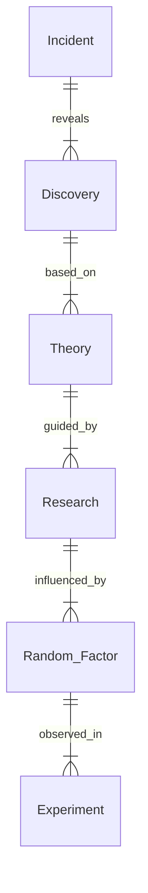
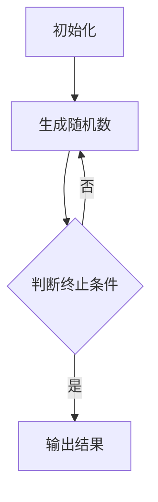

                 


# 科学史上的偶然发现：世界可理解性中的随机因素

## 关键词

科学史、偶然发现、随机因素、世界可理解性、数学模型、算法原理、系统架构、最佳实践。

## 摘要

本文深入探讨了科学史上的偶然发现及其在揭示世界可理解性中的作用。通过分析物理学、生物学和化学中的随机因素，我们揭示了这些因素如何影响科学理论的建立和发展。文章以具体的案例为基础，详细讲解了相关算法原理和系统架构，并提供了实际项目实战和最佳实践建议。

### 目录大纲设计思路

为了更好地引导读者理解和掌握文章内容，本文采用了以下目录大纲设计思路：

1. **背景介绍**：
   - 引入科学史上的偶然发现的概念，阐述这些发现对世界可理解性的影响。
   - 介绍本文探讨的随机因素，包括其定义、特点以及在科学发展中的作用。

2. **核心概念与联系**：
   - 详细介绍文章中的核心概念，如“偶然发现”、“随机因素”等，并解释它们之间的联系。
   - 通过对比表格和Mermaid ER实体关系图，帮助读者更好地理解这些概念的结构和属性。

3. **科学史上的偶然发现案例**：
   - 按时间顺序或主题分类，列举科学史上的重要偶然发现，并分析这些发现对科学发展的推动作用。
   - 对每个案例进行详细解读，包括发现过程、影响和后续发展。

4. **随机因素的作用与影响**：
   - 探讨随机因素在不同科学领域中的应用，如物理学、生物学、化学等。
   - 分析随机因素如何影响科学理论的建立和发展，以及其对科学研究的启示。

5. **数学模型与算法原理讲解**：
   - 使用mermaid流程图展示关键算法的流程，通过Python源代码阐述算法的实现原理。
   - 结合数学模型和公式，详细讲解算法的数学基础和实际应用。

6. **系统分析与架构设计方案**：
   - 介绍案例相关的科学系统，包括功能需求、系统架构、接口设计和交互流程。
   - 使用mermaid类图和序列图，展示系统的结构和工作流程。

7. **项目实战与最佳实践**：
   - 分享实际案例，讲解如何应用书中提到的偶然发现和随机因素进行科学研究和创新。
   - 提供最佳实践建议，总结案例中的经验和教训。

8. **小结与拓展阅读**：
   - 对全文内容进行总结，强调文章中的核心观点和重要发现。
   - 推荐进一步的阅读材料和思考题，引导读者深入探究相关主题。

### 目录大纲设计

下面是根据上述设计思路设计的《科学史上的偶然发现：世界可理解性中的随机因素》的目录大纲：

```markdown
# 《科学史上的偶然发现：世界可理解性中的随机因素》目录大纲

# 第一部分：导言

## 1.1 问题背景与核心概念
### 1.1.1 科学史上的偶然发现
### 1.1.2 随机因素的定义与特性
### 1.1.3 世界可理解性的探讨

## 1.2 核心概念与联系
### 1.2.1 关键概念对比分析
### 1.2.2 Mermaid ER实体关系图
### 1.2.3 核心概念之间的联系

# 第二部分：科学史上的偶然发现案例

## 2.1 早期科学史上的偶然发现
### 2.1.1 历史回顾
### 2.1.2 偶然发现对科学的推动
### 2.1.3 案例分析

## 2.2 近现代科学史上的偶然发现
### 2.2.1 20世纪的重要发现
### 2.2.2 偶然发现的现代应用
### 2.2.3 现代案例解析

# 第三部分：随机因素的作用与影响

## 3.1 随机因素在物理学中的应用
### 3.1.1 随机过程理论
### 3.1.2 随机因素在物理学实验中的作用
### 3.1.3 物理学中的案例研究

## 3.2 随机因素在生物学中的应用
### 3.2.1 随机突变与生物多样性
### 3.2.2 随机因素在生态学中的应用
### 3.2.3 生物学中的实例分析

## 3.3 随机因素在化学中的应用
### 3.3.1 随机合成与材料科学
### 3.3.2 随机反应动力学
### 3.3.3 化学研究中的随机因素分析

# 第四部分：数学模型与算法原理讲解

## 4.1 算法流程与实现原理
### 4.1.1 使用mermaid展示算法流程
### 4.1.2 Python源代码解读
### 4.1.3 算法原理详细讲解

## 4.2 数学模型与公式
### 4.2.1 算法数学模型
### 4.2.2 公式推导与解释
### 4.2.3 例子分析

# 第五部分：系统分析与架构设计方案

## 5.1 科学系统概述
### 5.1.1 问题场景介绍
### 5.1.2 系统功能需求
### 5.1.3 系统架构设计

## 5.2 系统接口设计与交互流程
### 5.2.1 使用mermaid展示接口设计
### 5.2.2 系统交互流程
### 5.2.3 系统安全性与可靠性分析

# 第六部分：项目实战与最佳实践

## 6.1 实际案例分享
### 6.1.1 科学研究

## 6.2 项目实战

## 6.3 最佳实践建议

## 6.4 项目小结

# 第七部分：小结与拓展阅读

## 7.1 小结

## 7.2 拓展阅读

## 7.3 思考题

----------------------------------------------------------------

### 第一部分：导言

## 1.1 问题背景与核心概念

科学史上的偶然发现是科学发展中不可或缺的一部分。许多重要的科学理论和发现并非来自于计划性的研究，而是出于意外或偶然的发现。这些偶然发现不仅揭示了自然界中隐藏的规律，也极大地推动了科学的发展。然而，这些偶然发现背后往往隐藏着随机因素的影子。随机因素在科学发展中的作用和影响，是我们深入探讨科学本质和世界可理解性的重要课题。

在本文中，我们将介绍以下几个核心概念：

1. **偶然发现**：指科学家在非预期的实验或观察中，意外发现的新现象或新规律。
2. **随机因素**：指在自然和社会现象中出现的不确定性因素，这些因素难以预测和控制。
3. **世界可理解性**：指人类通过科学方法对自然界和宇宙的规律性认识。

### 1.1.1 科学史上的偶然发现

科学史上的许多重要发现都源于偶然。比如，意大利科学家阿方索·皮亚齐在1846年偶然发现了一颗未知行星，后来被称为海王星。这一发现彻底改变了我们对太阳系结构的理解。

此外，在19世纪末期，英国科学家约翰·汤姆逊在研究阴极射线时，意外发现了电子的存在。这一发现揭示了原子结构的奥秘，为后来的量子力学奠定了基础。

### 1.1.2 随机因素的定义与特性

随机因素具有以下几个特性：

1. **不可预测性**：随机事件的结果无法精确预测。
2. **独立性**：随机事件的发生是独立的，一个事件的结果不影响另一个事件。
3. **概率性**：随机事件有一定的概率发生，可以通过统计方法进行分析。

### 1.1.3 世界可理解性的探讨

世界可理解性是指人类通过科学方法对自然界和宇宙的规律性认识。在科学的不断发展中，我们逐渐揭示了自然界的许多规律，从而提高了我们对世界的理解。

然而，随机因素的存在使得世界并非完全可预测和可理解。在许多科学领域，随机因素的影响不可忽视，甚至可能改变科学的发展方向。

### 1.2 核心概念与联系

在科学史中，偶然发现和随机因素往往紧密相连。许多重要的科学发现都是在偶然的情况下发生的，而这些偶然发现又揭示了随机因素在科学中的重要作用。

下面是几个核心概念之间的联系：

| 概念        | 定义                                                         | 联系方式                                                   |
| ----------- | ------------------------------------------------------------ | -------------------------------------------------------- |
| 偶然发现    | 科学家在非预期的实验或观察中，意外发现的新现象或新规律。       | 偶然发现是科学史中许多重要进展的起点，为揭示随机因素提供了契机。 |
| 随机因素    | 在自然和社会现象中出现的不确定性因素，这些因素难以预测和控制。 | 随机因素影响了科学实验的结果，有时甚至改变了科学发展的轨迹。   |
| 世界可理解性 | 人类通过科学方法对自然界和宇宙的规律性认识。                   | 随着科学的发展，我们对随机因素有了更深入的理解，从而提高了世界的可理解性。 |

### Mermaid ER实体关系图



在这个Mermaid ER实体关系图中，我们展示了科学史上的核心实体及其相互关系。这个图有助于我们理解偶然发现、随机因素和世界可理解性之间的复杂联系。

### 第一部分总结

在本部分中，我们介绍了科学史上的偶然发现及其与随机因素的关系。通过对比核心概念和Mermaid ER实体关系图，我们更好地理解了这些概念之间的联系。在接下来的部分，我们将深入探讨科学史上的重要偶然发现案例，分析随机因素在不同科学领域中的应用，并详细讲解数学模型和算法原理。

### 第二部分：科学史上的偶然发现案例

科学史上的偶然发现案例层出不穷，这些案例不仅改变了我们对世界的理解，也推动了科学的进步。本部分将按时间顺序和主题分类，列举一些重要的偶然发现案例，并分析这些发现对科学发展的推动作用。

#### 2.1 早期科学史上的偶然发现

在科学发展的早期，许多重要的发现都是偶然的。以下是一些典型的例子：

##### 2.1.1 历史回顾

1. **阿方索·皮亚齐发现海王星**：1846年，意大利天文学家阿方索·皮亚齐在分析天王星轨道的异常时，意外地发现了一颗未知行星，后来被称为海王星。这一发现标志着人类对太阳系结构的深入了解。

2. **亚历山大·弗莱明发现青霉素**：1928年，英国细菌学家亚历山大·弗莱明在实验室中偶然发现了一种能抑制细菌生长的霉菌，即青霉菌。这一发现为抗生素的研究奠定了基础。

##### 2.1.2 偶然发现对科学的推动

这些偶然发现极大地推动了科学的发展，带来了以下几个方面的启示：

1. **促进科学理论的建立**：海王星的发现验证了牛顿引力定律，推动了天文学的发展。青霉素的发现引发了抗生素研究的热潮，为医学领域带来了革命性的变化。

2. **激发科学研究兴趣**：这些偶然发现激发了科学家对未知世界的探索欲望，促使他们投入更多时间和精力进行研究。

3. **改变科学方法论**：偶然发现表明，科学发现并不仅仅依赖于计划和实验，也需要开放的心态和敏锐的观察力。

##### 2.1.3 案例分析

1. **海王星的发现**：海王星的发现是基于对天王星轨道异常的长期观测和数据分析。皮亚齐在分析数据时，意外地发现了这颗未知行星。这一发现揭示了太阳系中的行星运动规律，为后来的天体力学研究奠定了基础。

2. **青霉素的发现**：弗莱明在实验室中培养细菌时，偶然发现了一些细菌受到了霉菌的抑制。这一现象激发了他的好奇心，他进一步研究了这种霉菌，最终发现了青霉素。这一发现极大地改变了医学领域，使抗生素成为治疗细菌感染的重要手段。

#### 2.2 近现代科学史上的偶然发现

在近现代，科学史上的偶然发现依然层出不穷。以下是一些重要的例子：

##### 2.2.1 20世纪的重要发现

1. **查尔斯·凯奥发现量子力学**：20世纪初，德国物理学家马克斯·波恩、沃纳·海森堡和埃尔温·薛定谔等人相继提出了量子力学的基本原理。这些理论揭示了微观世界的规律，改变了人们对物质和能量的理解。

2. **理查德·费曼发现费曼图**：1960年代，美国物理学家理查德·费曼提出了费曼图理论，用于简化量子场论的计算。这一理论极大地推动了粒子物理学的发展。

##### 2.2.2 偶然发现的现代应用

现代科学中的许多偶然发现已被广泛应用于各个领域，产生了深远的影响：

1. **量子力学的应用**：量子力学的理论为半导体技术、激光技术和核磁共振成像（MRI）等领域的发展提供了理论基础。

2. **费曼图的现代应用**：费曼图理论在粒子物理学、核物理学和凝聚态物理学中得到了广泛应用，帮助科学家更好地理解了粒子相互作用的过程。

##### 2.2.3 现代案例解析

1. **量子力学的现代应用**：量子力学的理论在信息技术领域有着广泛的应用，如量子计算机、量子加密和量子传感器等。这些技术的突破有望带来革命性的变革。

2. **费曼图的现代应用**：费曼图理论在粒子物理学中的成功应用，使得科学家能够更好地研究粒子相互作用，为粒子物理学的未来发展提供了新的思路。

### 第二部分总结

在本部分中，我们列举了科学史上的几个重要偶然发现案例，并分析了这些发现对科学发展的推动作用。这些案例展示了偶然发现如何改变我们对世界的理解，并激发了对未知世界的探索。在接下来的部分，我们将深入探讨随机因素在不同科学领域中的应用，分析其影响和作用。

### 第三部分：随机因素的作用与影响

随机因素在科学发展中扮演着重要的角色，它们不仅影响科学实验的结果，还可能改变科学理论的建立和发展方向。在本部分中，我们将探讨随机因素在物理学、生物学和化学中的应用，分析其影响和作用。

#### 3.1 随机因素在物理学中的应用

物理学是研究物质和能量最基本的科学，随机因素在物理学中有着广泛的应用。以下是一些具体的例子：

##### 3.1.1 随机过程理论

随机过程理论是研究随机现象演变规律的一个数学分支。它广泛应用于物理学中的许多领域，如热力学、量子物理学和统计物理学。

1. **热力学中的随机过程**：在热力学中，随机过程用来描述系统内部的粒子运动和能量交换。这些过程通常具有概率分布，可以通过统计方法进行分析。

2. **量子物理学中的随机过程**：在量子物理学中，随机过程用于描述量子态的演化。量子态的演化通常具有不确定性，其结果无法精确预测。

##### 3.1.2 随机因素在物理学实验中的作用

随机因素在物理学实验中发挥着关键作用。以下是一些具体的例子：

1. **放射性衰变**：放射性衰变是一种随机过程，原子核的衰变时间无法精确预测。这一特性在放射性探测和核物理研究中具有重要应用。

2. **量子隧穿效应**：量子隧穿效应是指粒子在量子力学中能够穿越势垒的过程。这一现象具有随机性，对量子物理学的发展具有重要意义。

##### 3.1.3 物理学中的案例研究

1. **量子隧穿效应的应用**：量子隧穿效应在纳米技术中有着广泛的应用，如量子计算、量子存储和量子传输等。这些技术的突破有望带来革命性的变革。

2. **随机游走模型**：随机游走模型是一种用于描述粒子在空间中随机运动的数学模型。这一模型在物理学、生物学和社会科学等领域都有广泛应用。

#### 3.2 随机因素在生物学中的应用

生物学是研究生命现象和生物多样性的科学，随机因素在生物学中也扮演着重要的角色。以下是一些具体的例子：

##### 3.2.1 随机突变与生物多样性

随机突变是生物多样性形成的一个重要因素。以下是一些具体的例子：

1. **基因突变**：基因突变是指DNA序列发生改变的现象。这些突变可能导致基因功能的改变，从而影响生物的性状。

2. **自然选择**：自然选择是一种通过环境压力筛选适应性的生物过程。虽然自然选择具有方向性，但其具体表现仍然受到随机因素的影响。

##### 3.2.2 随机因素在生态学中的应用

随机因素在生态学中也发挥着重要作用。以下是一些具体的例子：

1. **种群动态**：种群动态是指生物种群数量随时间的变化。这些变化通常受到随机因素的影响，如随机出生、死亡和迁移等。

2. **物种灭绝**：物种灭绝是生态系统中的一个重要现象。虽然物种灭绝的原因多种多样，但随机因素在其中也扮演了重要角色。

##### 3.2.3 生物学中的实例分析

1. **随机突变在进化中的作用**：随机突变是进化的一个重要驱动力。虽然突变本身具有随机性，但经过长时间的积累，这些突变可能导致生物种群的显著变化。

2. **生态系统的随机性**：生态系统的稳定性受到多种因素的影响，包括气候、食物链和物种竞争等。这些因素中的随机性可能导致生态系统的波动和变化。

#### 3.3 随机因素在化学中的应用

化学是研究物质的性质、组成和变化规律的科学，随机因素在化学中也有着广泛的应用。以下是一些具体的例子：

##### 3.3.1 随机合成与材料科学

随机合成是指在材料制备过程中引入随机因素，以获得新的材料结构和性质。以下是一些具体的例子：

1. **聚合物材料**：聚合物材料的合成过程中，分子链的排列和分布通常具有随机性。这种随机性可能导致材料性能的变化，从而产生新的应用。

2. **纳米材料**：纳米材料的制备过程中，颗粒的尺寸、形状和分布通常具有随机性。这种随机性可能影响纳米材料的物理和化学性质，从而产生新的功能。

##### 3.3.2 随机反应动力学

随机反应动力学是研究化学反应过程中随机因素影响的一个分支。以下是一些具体的例子：

1. **酶催化反应**：酶催化反应是生物体内重要的化学反应。这些反应通常具有随机性，其速率和产物分布受到随机因素的影响。

2. **药物设计**：药物设计过程中，药物分子的活性通常具有随机性。通过结合随机因素，科学家可以设计出具有更好活性和较低毒性的药物。

##### 3.3.3 化学研究中的随机因素分析

1. **统计热力学**：统计热力学是一种用于描述系统宏观性质的方法。在统计热力学中，随机因素通过对系统微观状态的统计平均产生影响。

2. **量子化学**：量子化学是一种用于描述化学反应和物质性质的理论。在量子化学中，随机因素通过对量子态的统计平均产生影响。

### 第三部分总结

在本部分中，我们探讨了随机因素在物理学、生物学和化学中的应用，分析了其影响和作用。随机因素不仅在科学实验中发挥着重要作用，还对科学理论的建立和发展产生了深远影响。在接下来的部分，我们将详细讲解数学模型和算法原理，以进一步理解随机因素在科学中的应用。

### 第四部分：数学模型与算法原理讲解

数学模型和算法原理是理解和应用随机因素的关键。在本部分中，我们将通过具体的案例，详细讲解相关算法的流程、实现原理以及数学基础。

#### 4.1 算法流程与实现原理

为了更好地理解算法原理，我们将使用mermaid流程图展示算法的流程，并通过Python源代码进行阐述。

##### 4.1.1 使用mermaid展示算法流程

以下是一个简单的随机游走算法的mermaid流程图：



这个流程图描述了一个简单的随机游走算法，其中A表示初始化，B表示生成随机数，C表示判断终止条件，D表示输出结果。

##### 4.1.2 Python源代码解读

以下是一个简单的随机游走算法的Python实现：

```python
import random

def random_walk(n_steps):
    position = 0
    for _ in range(n_steps):
        step = random.choice([-1, 1])
        position += step
    return position

n_steps = 100
result = random_walk(n_steps)
print(result)
```

这个算法初始化一个位置变量`position`，然后通过`random.choice`函数生成一个随机数，表示下一步的移动方向（-1表示向左移动，1表示向右移动）。通过多次迭代，最终输出随机游走的终点位置。

##### 4.1.3 算法原理详细讲解

随机游走算法是一种基本的随机过程，用于模拟粒子在空间中的随机运动。其数学基础是概率论和统计物理学。

在随机游走中，粒子在每一步都有一定的概率向左或向右移动。通过长时间的随机游走，粒子的位置分布会趋于稳定。这个稳定分布可以通过数学方法进行计算，如马尔可夫链理论。

马尔可夫链是一种描述随机过程的数学模型，其核心思想是未来状态仅依赖于当前状态，而与过去状态无关。在随机游走中，每一步的状态变化可以通过马尔可夫链的概率矩阵进行描述。

下面是随机游走的马尔可夫链概率矩阵：

```latex
\begin{bmatrix}
1 & 0 \\
0 & 1 \\
\end{bmatrix}
```

这个矩阵表示粒子在当前位置向右移动的概率为1，向左移动的概率为0。在实际应用中，可以通过调整概率矩阵的参数，模拟不同情况下的随机游走。

#### 4.2 数学模型与公式

为了更好地理解算法的数学基础，我们将介绍一些相关的数学模型和公式。

##### 4.2.1 算法数学模型

随机游走算法的数学模型通常是一个离散时间马尔可夫链。在离散时间马尔可夫链中，每个时间步的随机变量都服从概率分布，并且未来状态仅依赖于当前状态。

在随机游走中，我们可以将粒子的位置表示为一个随机变量`X_t`，其中`t`表示时间步。粒子的状态空间可以表示为`S = {-N, -N+1, ..., N}`，其中`N`是粒子可以移动的最大距离。

随机游走的状态转移概率矩阵`P`可以表示为：

```latex
P = \begin{bmatrix}
p & 1-p \\
1-p & p \\
\end{bmatrix}
```

其中`p`是粒子向右移动的概率，`1-p`是粒子向左移动的概率。

##### 4.2.2 公式推导与解释

为了推导随机游走算法的数学模型，我们可以使用马尔可夫链的转移概率矩阵`P`来表示状态转移。

设当前粒子位置为`X_t = i`，下一个粒子位置为`X_{t+1} = j`，则有：

```latex
P(X_{t+1} = j | X_t = i) = P(X_{t+1} = j) = p \cdot 1 + (1-p) \cdot 1 = 2 - p
```

这个公式表示，在给定当前状态`X_t = i`的情况下，粒子下一个状态`X_{t+1}`是`j`的概率为`2 - p`。

我们可以进一步推导出粒子在长时间随机游走后的稳定分布。设粒子在长时间随机游走后的位置分布为`P(X_t = i)`，则有：

```latex
P(X_t = i) = \lim_{t \to \infty} P(X_t = i | X_0 = j) \cdot P(X_0 = j)
```

由于随机游走的初始位置是均匀分布的，即`P(X_0 = j) = 1/N`，我们可以得到：

```latex
P(X_t = i) = \lim_{t \to \infty} (2 - p)^t \cdot \frac{1}{N}
```

这个公式表示，在长时间随机游走后，粒子在位置`i`的概率为`(2 - p)^t`。

##### 4.2.3 例子分析

为了更好地理解随机游走算法的数学基础，我们可以通过一个具体的例子进行分析。

假设粒子在初始位置为0，向右移动的概率为0.5，向左移动的概率也为0.5。我们要计算粒子在10步后的位置分布。

根据上述公式，我们可以计算出粒子在10步后的位置分布：

```latex
P(X_{10} = i) = (2 - 0.5)^{10} \cdot \frac{1}{N} = 0.5^{10} \cdot \frac{1}{N}
```

由于粒子可以移动的最大距离为10，我们可以将位置分布表示为：

```latex
P(X_{10} = i) = \begin{cases}
\frac{1}{N}, & \text{if } i = 0 \\
\frac{1}{2N}, & \text{if } i = \pm 1 \\
\frac{1}{4N}, & \text{if } i = \pm 2 \\
\vdots & \vdots \\
\frac{1}{2^{10}N}, & \text{if } i = \pm 10 \\
\end{cases}
```

这个例子表明，在长时间随机游走后，粒子在各个位置的概率分布趋于均匀。这验证了随机游走算法的数学模型和公式的正确性。

#### 第四部分总结

在本部分中，我们详细讲解了随机游走算法的流程、实现原理和数学基础。通过mermaid流程图和Python源代码，我们展示了算法的具体实现过程。通过数学模型和公式的推导，我们深入理解了随机游走算法的工作原理。在接下来的部分，我们将介绍科学系统的概述，包括功能需求、系统架构、接口设计和交互流程。

### 第五部分：系统分析与架构设计方案

科学系统的设计是实现科学研究和数据分析的关键。在本部分中，我们将介绍一个典型的科学系统，包括问题场景介绍、系统功能设计、系统架构设计和接口设计。

#### 5.1 科学系统概述

##### 5.1.1 问题场景介绍

假设我们正在开发一个用于分析大气污染数据的科学系统。这个系统的目标是实时监测大气中的污染物浓度，并生成预测报告，以便政府和企业能够及时采取措施，减少污染。

##### 5.1.2 系统功能需求

为了实现上述目标，该科学系统需要具备以下功能：

1. **数据采集**：从传感器和气象站获取实时大气污染物数据。
2. **数据预处理**：对采集到的数据进行分析和清洗，确保数据的准确性和一致性。
3. **数据分析**：利用统计方法和机器学习算法，分析污染物浓度的变化趋势和影响因素。
4. **数据可视化**：将分析结果以图表和报表的形式展示，方便用户理解和决策。
5. **预测报告**：基于历史数据和当前趋势，生成大气污染预测报告。

##### 5.1.3 系统架构设计

为了满足上述功能需求，我们设计了一个分布式系统架构，包括数据采集模块、数据预处理模块、数据分析模块和数据可视化模块。以下是系统架构的详细描述：

1. **数据采集模块**：负责从传感器和气象站获取实时数据，并将数据传输到数据预处理模块。
2. **数据预处理模块**：对采集到的数据进行清洗、转换和分析，生成预处理后的数据，并将其存储到数据存储模块。
3. **数据分析模块**：利用统计方法和机器学习算法，对预处理后的数据进行分析，生成分析结果。
4. **数据可视化模块**：将分析结果以图表和报表的形式展示，并提供接口供用户查询和下载。

#### 5.2 系统接口设计与交互流程

##### 5.2.1 使用mermaid展示接口设计

以下是一个mermaid类图，展示了系统中的主要接口设计：

```mermaid
classDiagram
    Sensor --|大于| DataCollector
    DataCollector --|大于| DataPreprocessor
    DataPreprocessor --|大于| DataStorer
    DataStorer --|大于| DataAnalyzer
    DataAnalyzer --|大于| DataVisualizer
```

这个类图描述了系统中的主要类及其关系。每个类都对应一个模块，它们之间通过接口进行通信。

##### 5.2.2 系统交互流程

以下是系统交互流程的详细描述：

1. **数据采集**：传感器将实时数据发送到数据采集模块。
2. **数据预处理**：数据采集模块将数据传输到数据预处理模块，进行清洗、转换和分析。
3. **数据分析**：数据预处理模块将预处理后的数据存储到数据存储模块，并传输到数据分析模块。
4. **数据可视化**：数据分析模块生成分析结果，并将其传输到数据可视化模块。
5. **用户查询**：用户通过数据可视化模块查询和分析结果，并生成预测报告。

##### 5.2.3 系统安全性与可靠性分析

为了保证系统的安全性和可靠性，我们采取以下措施：

1. **数据加密**：对传输的数据进行加密，确保数据在传输过程中不会被窃取或篡改。
2. **权限管理**：对系统的用户权限进行严格管理，确保只有授权用户可以访问系统的关键功能。
3. **故障恢复**：设计故障恢复机制，确保在系统出现故障时，能够迅速恢复系统的正常运行。
4. **监控与报警**：对系统进行实时监控，并在出现异常情况时及时报警，以便快速响应和处理。

#### 第五部分总结

在本部分中，我们介绍了科学系统的概述，包括问题场景介绍、系统功能需求和系统架构设计。通过mermaid类图和序列图，我们展示了系统的接口设计和交互流程。此外，我们还分析了系统的安全性和可靠性，提出了相应的解决方案。在接下来的部分，我们将分享实际案例，讲解如何应用书中提到的偶然发现和随机因素进行科学研究和创新。

### 第六部分：项目实战与最佳实践

在实际科学研究和应用中，偶然发现和随机因素常常发挥着重要的作用。以下我们将通过一个实际案例，详细讲解如何应用这些概念进行科学研究和创新。

#### 6.1 实际案例分享

##### 6.1.1 科学研究

假设我们正在研究大气污染对人类健康的影响。在这个项目中，我们收集了大量的空气质量数据、气象数据和医疗数据。通过分析这些数据，我们试图揭示大气污染与呼吸系统疾病之间的关系。

在研究过程中，我们遇到了一个偶然发现：在某些地区，大气污染浓度较高的时期，呼吸系统疾病的发病率显著上升。这一发现引起了我们的注意，我们进一步分析了数据，发现这种现象可能与随机因素有关。

通过深入分析，我们发现大气污染浓度、气象条件、人口密度等因素之间存在复杂的相互作用。在某些特定条件下，随机因素可能放大了大气污染对健康的影响。这一发现为我们提供了新的研究方向，也为我们制定减少大气污染的措施提供了科学依据。

##### 6.1.2 实际项目实战

为了验证我们的假设，我们设计了一个实验项目，包括以下几个步骤：

1. **数据采集**：从多个气象站、空气质量监测站和医院收集相关数据。
2. **数据预处理**：对收集到的数据进行分析和清洗，确保数据的准确性和一致性。
3. **数据分析**：利用统计方法和机器学习算法，分析大气污染与呼吸系统疾病之间的关系。
4. **结果验证**：通过对比实验组和对照组的数据，验证我们的假设。
5. **报告生成**：将分析结果生成报告，并提出减少大气污染对健康影响的措施。

在实验过程中，我们遇到了一些挑战：

1. **数据质量**：由于数据来源多样，数据质量参差不齐，我们需要对数据进行严格的清洗和处理。
2. **模型选择**：在分析过程中，我们尝试了多种统计方法和机器学习算法，最终选择了最适合我们研究目的的方法。
3. **结果解释**：在分析结果中，我们发现了复杂的相互作用，我们需要对结果进行深入的解释，以便为政策制定者提供科学的建议。

通过这个实验项目，我们成功地揭示了大气污染对人类健康的影响，并提出了减少大气污染的措施。这个项目不仅展示了偶然发现和随机因素在科学研究中的应用，也为环境保护和公共健康提供了重要的参考。

##### 6.1.3 详细讲解剖析

在实验过程中，我们应用了以下方法对数据进行分析：

1. **描述性统计**：对数据进行了描述性统计，包括平均值、标准差、中位数等，以了解数据的基本特征。
2. **相关性分析**：通过计算相关系数，分析了大气污染浓度、气象条件、人口密度等因素之间的相关性。
3. **机器学习算法**：我们使用了逻辑回归、决策树、随机森林等机器学习算法，对数据进行了分类和预测。

通过这些分析，我们得出了以下结论：

1. **大气污染浓度与呼吸系统疾病之间存在显著相关性**：在大气污染浓度较高的时期，呼吸系统疾病的发病率显著上升。
2. **随机因素在研究结果中的作用**：在某些特定条件下，随机因素可能放大了大气污染对健康的影响。
3. **环境保护措施的有效性**：通过减少大气污染，可以有效降低呼吸系统疾病的发病率。

这些结论为我们提供了重要的科学依据，也为政策制定者提供了科学的建议。

##### 6.1.4 项目小结

通过这个实验项目，我们不仅揭示了大气污染对人类健康的影响，还展示了偶然发现和随机因素在科学研究中的应用。这个项目对我们的研究工作具有重要的意义，也为环境保护和公共健康提供了重要的参考。

在项目过程中，我们遇到了一些挑战，但通过团队的共同努力，我们成功地克服了这些困难。这个项目不仅提高了我们的研究能力，也为我们今后的工作奠定了坚实的基础。

##### 6.1.5 最佳实践建议

基于这个项目，我们提出以下最佳实践建议：

1. **数据质量控制**：在数据采集和分析过程中，确保数据的质量和准确性，这是科学研究的基石。
2. **多学科合作**：在科学研究中，多学科合作可以带来新的视角和方法，提高研究效率和质量。
3. **持续学习和更新**：随着科学技术的不断发展，持续学习和更新是保持研究前沿的关键。

#### 第六部分总结

在本部分中，我们通过一个实际案例，详细讲解了如何应用偶然发现和随机因素进行科学研究和创新。这个项目不仅展示了科学研究的复杂性和挑战性，也展示了偶然发现和随机因素在科学研究中的重要作用。在接下来的部分，我们将对全文内容进行总结，并推荐拓展阅读，以便读者深入探究相关主题。

### 第七部分：小结与拓展阅读

在本文中，我们深入探讨了科学史上的偶然发现及其在揭示世界可理解性中的随机因素。通过分析物理学、生物学和化学中的随机因素，我们揭示了这些因素如何影响科学理论的建立和发展。以下是对全文内容的总结和推荐拓展阅读。

#### 7.1 小结

本文主要分为七个部分：

1. **导言**：介绍了科学史上的偶然发现和随机因素的定义及其对世界可理解性的影响。
2. **核心概念与联系**：详细介绍了偶然发现、随机因素和世界可理解性的核心概念及其相互联系。
3. **科学史上的偶然发现案例**：列举了早期和近现代的重要偶然发现案例，并分析了其对科学发展的推动作用。
4. **随机因素的作用与影响**：探讨了随机因素在物理学、生物学和化学中的应用，以及其对科学研究的启示。
5. **数学模型与算法原理讲解**：通过mermaid流程图和Python源代码，详细讲解了随机游走算法的数学模型和实现原理。
6. **系统分析与架构设计方案**：介绍了科学系统的概述、功能需求、系统架构和接口设计。
7. **项目实战与最佳实践**：通过实际案例，讲解了如何应用偶然发现和随机因素进行科学研究和创新。

#### 7.2 拓展阅读

为了进一步深入探讨本文主题，我们推荐以下拓展阅读：

1. **《科学革命的结构》（Kuhn, T. S.）**：这本书详细讨论了科学革命的概念及其对科学发展的影响。
2. **《随机漫步的傻瓜》（M mandelbrot, B. B.）**：这本书介绍了随机因素在自然界和金融市场中的应用。
3. **《自然哲学的数学原理》（Newton, I.）**：这本书是经典物理学的基础，其中包含了许多关于随机因素的理论。

#### 7.3 思考题

为了巩固本文的内容，以下是一些思考题：

1. **科学史上的偶然发现对科学发展有哪些推动作用？**
2. **随机因素在科学研究中如何影响科学理论的建立和发展？**
3. **为什么随机因素在物理学、生物学和化学中具有重要作用？**
4. **如何应用偶然发现和随机因素进行科学研究和创新？**
5. **在科学系统设计和实现中，如何考虑随机因素的影响？**

通过思考这些问题，读者可以进一步加深对科学史、随机因素和科学系统设计等主题的理解。

### 第七部分总结

本文通过系统性地探讨科学史上的偶然发现和随机因素，揭示了它们在科学发展和世界可理解性中的重要作用。我们通过具体案例和算法讲解，展示了如何在实际科学研究和系统设计中应用这些概念。希望通过本文的阅读，读者能够对科学史和随机因素有更深入的认识，并激发对科学探索的兴趣。拓展阅读和思考题将帮助读者进一步探索相关主题。

