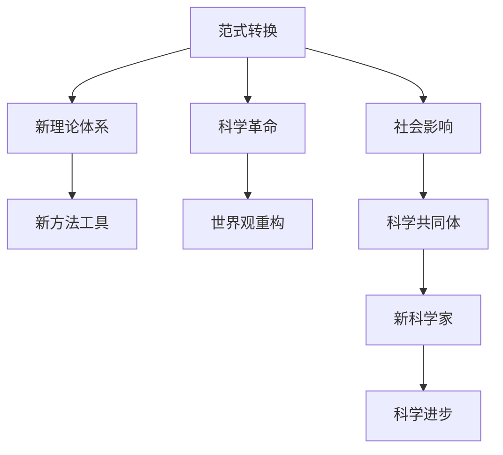
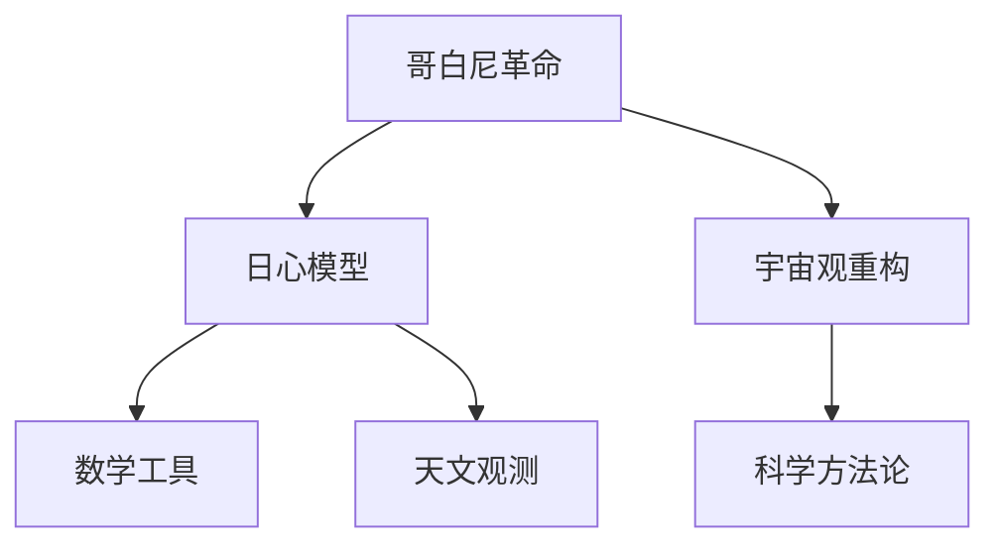
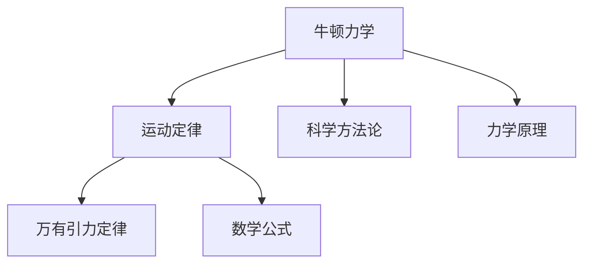
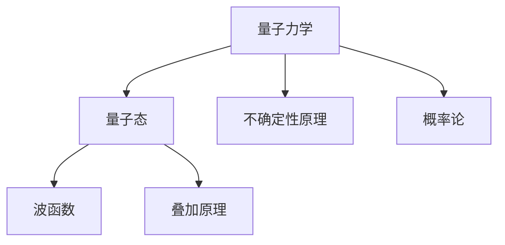
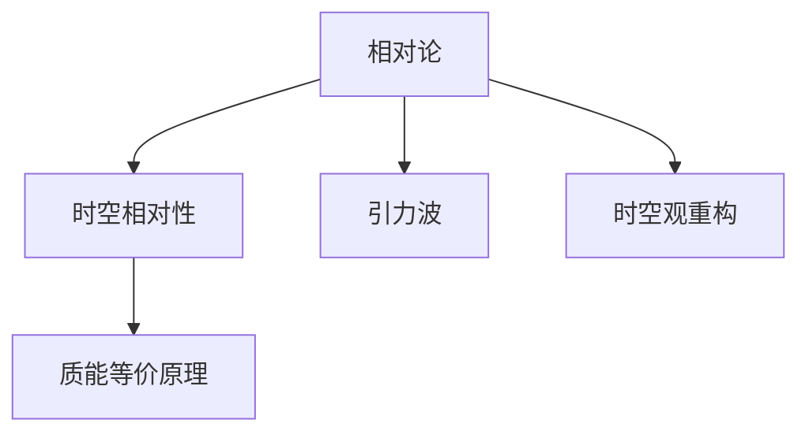
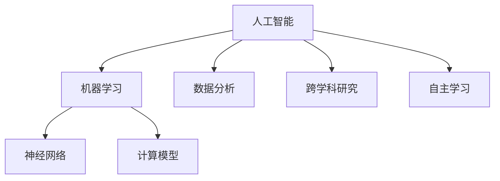
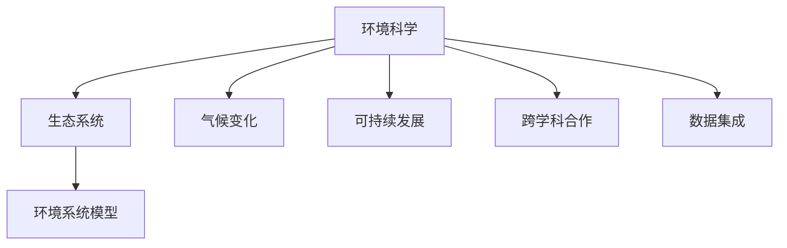
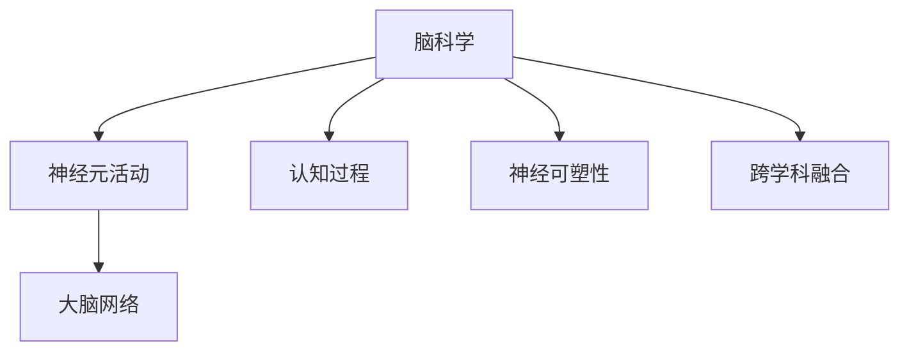
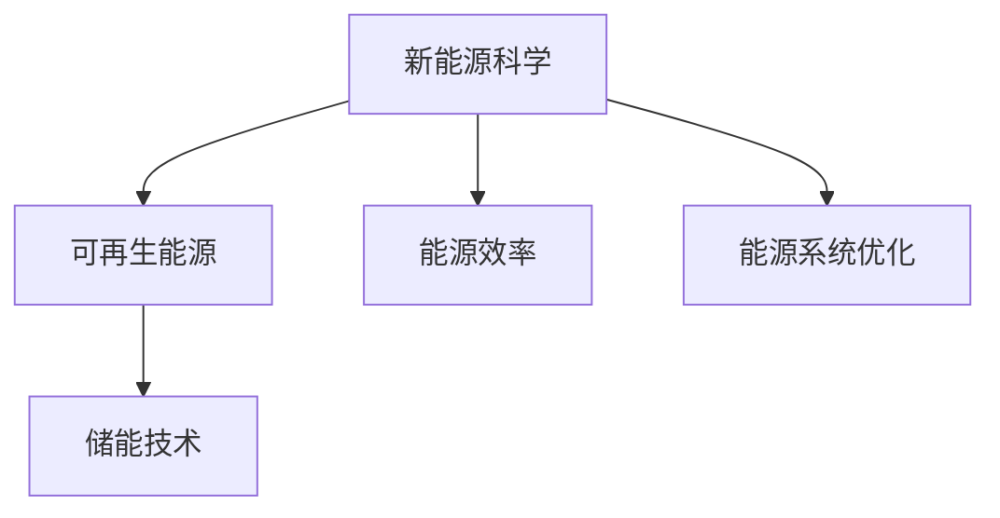

                 

### 范式转换的概念与重要性

#### 科学中的范式转换

范式（paradigm）一词源于希腊语“paradeigma”，意为“模范”或“样式”。在科学领域，范式可以理解为一个科学共同体在一段时间内所共同接受的理论、方法、工具和价值观。范式转换（paradigm shift）则是指当现有范式不足以解释新出现的问题或现象时，科学共同体通过引入新的理论、方法或观点，从而实现科学认知的重大变革。

范式转换在科学发展中具有重要意义。首先，范式转换能够推动科学知识的积累和进步。当一种新范式取代旧范式时，往往会带来新的理论模型、研究方法和实验技术，这些创新极大地扩展了科学研究的范围和深度。其次，范式转换也反映了科学共同体的自我纠错能力。科学不是一成不变的，而是不断发展的，通过范式转换，科学能够纠正过去的错误或不足，实现自我更新和提升。

在科学史上，有许多重要的范式转换时刻。例如，哥白尼的日心说取代了地心说，牛顿力学推翻了亚里士多德的自然哲学，量子力学和相对论则彻底改变了我们对微观世界和宏观宇宙的理解。这些范式转换不仅推动了科学的进步，也对哲学、宗教和社会产生了深远的影响。

#### 范式转换与世界观重构

范式转换不仅仅是一个科学理论的更新，它往往涉及到对整个世界观的重构。世界观（worldview）是指人们对世界的总体看法和理解，包括对自然、社会、人类及其相互关系的认知。当一种新的范式取代旧范式时，它不仅仅改变了科学的解释框架，还往往改变了人们的世界观。

例如，哥白尼的日心说挑战了教会支持的地球中心说，从根本上改变了人们对宇宙结构的理解。牛顿力学不仅提供了一种精确描述物理现象的工具，还推动了机械论世界观的形成。量子力学和相对论则揭示了一个与我们直觉截然不同的微观和宏观世界，使得人们不得不重新思考时间和空间的概念。

范式转换对世界观的重构具有深远的影响。首先，它改变了我们对自然规律的认识，使我们能够更准确地预测和控制自然现象。其次，它也影响了我们对人类自身和人类社会的认知，促使我们反思和调整我们的价值观和行为准则。例如，相对论提出的时间相对性概念改变了我们对时间和历史的理解，量子力学的不确定性原理挑战了我们关于确定性和因果性的传统观念。

#### 科学史上的范式转换案例

为了更具体地理解范式转换的重要性，我们可以看看科学史上的一些重要案例。以下是几个关键的时刻：

1. **哥白尼革命**：尼古拉·哥白尼在16世纪提出了日心说，认为太阳是宇宙的中心，而不是地球。这一理论挑战了当时流行的地心说，导致了一场科学革命。哥白尼的革命不仅改变了人们对宇宙结构的理解，也促进了科学方法的发展。

2. **牛顿力学**：艾萨克·牛顿在17世纪末和18世纪初提出了经典力学的基本定律，这些定律能够描述宏观世界中物体的运动和相互作用。牛顿力学的出现标志着物理学的一个新纪元，它为科学提供了强大的解释和预测能力。

3. **量子力学**：20世纪初，物理学家发现经典物理学无法解释微观世界的现象，如原子和粒子的行为。量子力学的诞生带来了对物质和能量本质的全新理解，它揭示了不确定性原理和波粒二象性，颠覆了经典物理学的确定性观念。

4. **相对论**：阿尔伯特·爱因斯坦在20世纪初提出了广义相对论和狭义相对论，这些理论不仅解释了引力的本质，还改变了我们对时间、空间和物质的认识。相对论的出现进一步深化了科学对宇宙的理解。

这些范式转换时刻不仅改变了科学的面貌，也对人类社会和文化的认知产生了深远的影响。它们揭示了科学知识的动态性和变革性，表明科学进步是一个不断探索和修正的过程。

#### 总结

范式转换是科学史上的关键事件，它不仅推动了科学的发展，也重构了我们对世界的认知。通过理解范式转换的概念和重要性，我们可以更好地把握科学的本质，认识到科学是一个不断进步和演变的领域。在接下来的章节中，我们将深入探讨几个关键的范式转换案例，分析它们如何改变了我们对自然世界的理解，以及它们对科学和社会的深远影响。

### 背景介绍

#### 核心概念术语说明

在深入探讨范式转换之前，我们需要明确一些核心概念和术语，以便我们能够更准确地理解和分析科学史上的范式转换事件。

**范式**：范式是一个科学共同体在一段时间内共同接受的理论、方法、工具和价值观的集合。它不仅包括具体的科学理论，还涵盖了科学研究的思维方式、研究方法和实验技术。

**范式转换**：范式转换是指当现有范式无法解释新出现的问题或现象时，科学共同体通过引入新的理论、方法或观点，从而实现科学认知的重大变革。

**世界观**：世界观是指人们对世界的总体看法和理解，包括对自然、社会、人类及其相互关系的认知。

**科学革命**：科学革命是指科学领域发生的一系列深刻变化，通常伴随着旧范式的崩溃和新范式的建立。

**科学共同体**：科学共同体是指从事同一领域研究的科学家群体，他们共享相同的理论、方法和价值观，并通过学术交流和合作推动科学的发展。

**科学方法论**：科学方法论是指科学研究过程中的基本方法和原则，包括观察、实验、假设、验证和理论构建等步骤。

**科学知识积累**：科学知识积累是指科学家通过不断的实验、观察和理论构建，逐步积累和扩展对自然世界的理解。

#### 问题背景

科学史上的范式转换并非偶然，而是科学发展过程中不可避免的必然现象。随着科学的不断进步，新问题的出现和旧问题的解决，科学共同体需要不断更新和调整其理论框架和研究方法。这种变革往往发生在以下几种情况下：

1. **新发现与现有理论的矛盾**：当科学家发现一些无法用现有范式解释的现象时，他们往往需要提出新的理论或方法来填补这一空白。

2. **实验技术的进步**：新的实验技术和工具能够提供更精确的数据和观测结果，这些数据往往能够挑战旧有的理论。

3. **科学交流与合作的加强**：科学共同体的成员通过广泛的学术交流和合作，能够更快地分享新知识和新观点，从而推动科学认知的变革。

4. **社会需求与科学发展的互动**：社会对科学知识的需求往往能够推动科学的进步，反之，科学的发展也能满足社会的需求，这种互动促进了科学范式转换的发生。

#### 问题描述

范式转换的关键问题在于如何从一个旧的、不再适用的范式过渡到一个新的、更符合实际情况的范式。这个过程通常包括以下几个步骤：

1. **识别问题**：科学家需要识别出现有范式无法解释的现象或问题，这是范式转换的起点。

2. **提出新理论**：科学家需要提出新的理论或假设，这些理论能够更好地解释新现象或问题。

3. **实验验证**：新理论需要通过实验和观测来验证，这包括设计新的实验和收集新的数据。

4. **理论完善**：通过实验和观测的结果，科学家可以不断完善和修正新理论，使其更加准确和可靠。

5. **接受与传播**：当一个新范式被广泛接受并成为科学共同体的共识时，范式转换便得以实现。

#### 问题解决

范式转换的成功依赖于以下几个关键因素：

1. **科学家的洞察力和创造力**：科学家需要有敏锐的洞察力和创造力，能够提出新的理论或方法，挑战旧有的范式。

2. **实验数据和观测结果的准确性**：新理论需要基于可靠的实验数据和观测结果，这些数据必须能够验证新理论的正确性。

3. **科学共同体的支持和合作**：科学共同体的成员需要支持和合作，共同推动新理论的验证和传播。

4. **学术交流与传播**：通过学术会议、论文发表和学术交流，新理论可以更快地传播和接受。

5. **社会需求的推动**：社会的需求往往能够推动科学的发展，促进范式转换的实现。

#### 边界与外延

范式转换不仅仅发生在科学领域，它还涉及到哲学、宗教和社会等多个领域。例如，哥白尼革命不仅改变了人们对宇宙结构的理解，也挑战了宗教和哲学的基本观念。牛顿力学和相对论的出现不仅推动了科学的发展，也对哲学和物理学产生了深远的影响。

此外，范式转换并非一成不变，它也是一个动态的过程。一个范式可能在一段时间内主导科学的发展，但随着新问题和新现象的出现，它可能需要被新的范式所取代。这种不断的更新和变革是科学进步的重要动力。

#### 概念结构与核心要素组成

为了更好地理解范式转换，我们可以将其概念结构和核心要素组成进行分解：

1. **核心概念**：范式、范式转换、世界观、科学革命。

2. **相关概念**：科学共同体、科学方法论、科学知识积累、实验技术、社会需求。

3. **核心要素**：新现象的识别、新理论的提出、实验验证、理论完善、接受与传播。

4. **动态过程**：识别问题、提出新理论、实验验证、理论完善、接受与传播。

通过这些概念和要素的分解，我们可以更清晰地把握范式转换的本质和过程，从而深入分析科学史上的重要范式转换事件。

### 核心概念与联系

为了深入理解科学史上的范式转换，我们需要详细探讨几个核心概念，并分析它们之间的相互关系。以下是几个关键的概念以及它们之间的联系：

#### 范式转换的定义

范式转换是指当现有范式不足以解释新出现的问题或现象时，科学共同体通过引入新的理论、方法或观点，从而实现科学认知的重大变革。范式转换不仅仅是理论的更新，它还涉及到科学方法论、研究工具和价值观的全面变革。

**关键概念 1：范式（Paradigm）**

范式是一个科学共同体在一段时间内共同接受的理论、方法、工具和价值观的集合。它是科学研究的指导框架，决定了科学家如何提出问题、解决问题以及评价研究成果。范式不仅仅是具体的理论，还包括科学研究的思维方式、实验技术和研究方法。

**关键概念 2：世界观（Worldview）**

世界观是指人们对世界的总体看法和理解，包括对自然、社会、人类及其相互关系的认知。世界观与范式紧密相关，因为范式决定了我们对自然世界的理解和解释。当一种新范式取代旧范式时，我们的世界观也会随之发生重大变化。

**关键概念 3：科学革命（Scientific Revolution）**

科学革命是指科学领域发生的一系列深刻变化，通常伴随着旧范式的崩溃和新范式的建立。科学革命不仅改变了科学理论，还推动了科学方法的发展，从而极大地扩展了科学知识的范围和深度。

**核心概念之间的联系**

1. **范式与世界观**：范式决定了我们的世界观，因为它是我们理解和解释世界的理论基础。当一种新范式取代旧范式时，我们的世界观也会发生相应的变化。例如，哥白尼的日心说取代了地心说，改变了人们对宇宙结构的理解。

2. **范式转换与科学革命**：范式转换是科学革命的核心组成部分。科学革命通常伴随着一系列范式转换，这些转换推动了科学知识的大幅进步。例如，牛顿力学和相对论的兴起都是科学革命的重要标志。

3. **范式与科学方法论**：范式不仅包括理论，还包括科学方法论。科学方法论是科学家进行研究的基本原则和步骤，如观察、实验、假设和验证。范式决定了科学方法论的发展方向，影响了科学研究的方法和工具。

4. **范式转换与社会**：范式转换不仅发生在科学领域，还对社会产生了深远的影响。新的科学理论和方法往往能够改变人们对自然世界的认知，进而影响社会价值观、宗教信仰和政治制度。例如，相对论和量子力学的出现不仅改变了科学，也改变了人类对宇宙和时间的理解。

#### 范式转换的属性特征对比表格

为了更直观地理解范式转换的属性特征，我们可以将其与旧范式进行对比，以下是一个简化的对比表格：

| 特征 | 范式转换 | 旧范式 |
| --- | --- | --- |
| **理论基础** | 新的理论体系，能够解释新现象 | 旧的理论体系，无法解释新现象 |
| **方法论** | 新的研究方法和工具 | 旧的研究方法和工具 |
| **价值观** | 新的科学价值观，强调创新和实证 | 旧的科学价值观，可能保守或教条 |
| **社会影响** | 深远的社会影响，可能挑战传统观念 | 较有限的社会影响，主要限于科学领域 |
| **接受过程** | 需要时间被广泛接受，可能遭遇阻力 | 较快被接受，但随着时间的推移可能不再适用 |
| **科学共同体** | 新的科学共同体，可能与旧共同体有显著差异 | 旧的科学共同体，可能逐渐分化 |
| **代表性人物** | 新的代表性科学家，推动科学进步 | 旧的代表性科学家，维持旧有范式 |
| **成果** | 创造新的科学知识，推动科学革命 | 稳定现有科学知识，可能缺乏创新 |

#### ER实体关系图架构

为了更好地展示范式转换中的核心概念及其相互关系，我们可以使用Mermaid流程图来绘制一个简化的ER（实体关系）图。以下是ER实体关系图的Markdown格式表示：

在这个ER实体关系图中，范式转换（A）是核心实体，它与其他实体如新理论体系（B）、新方法工具（C）、科学革命（D）、世界观重构（E）、社会影响（F）、科学共同体（G）和新科学家（H）之间有直接关系。这些关系展示了范式转换如何通过新的理论、方法和社会影响，推动科学进步和世界观的重构。

通过这个核心概念与联系的分析，我们不仅能够更深入地理解范式转换的本质，还能够更好地把握科学史上的重要变革时刻。在接下来的章节中，我们将进一步探讨具体的历史案例，分析这些范式转换如何改变了我们对自然世界的理解，以及它们对科学和社会的深远影响。

### 范式转换案例分析

在科学史上，范式转换是一个不断发生的过程，每一个关键的范式转换都深刻地改变了人类对自然世界的理解。以下是几个关键的范式转换案例，我们将逐一进行分析。

#### 1. 哥白尼革命：日心说的兴起

**背景与描述**：
尼古拉·哥白尼（Nicolaus Copernicus）在16世纪提出了日心说（heliocentric model），即太阳是宇宙的中心，地球和其他行星围绕太阳运行。这一理论彻底颠覆了当时广为接受的亚里士多德-托勒密（Aristotelian-Ptolemaic）地心说（geocentric model），即地球是宇宙的中心，所有天体围绕地球运行。

**核心概念与联系**：
哥白尼革命的核心概念是行星运动的日心模型，这一模型通过数学计算提供了比地心说更准确的行星轨道预测。日心说不仅改变了我们对宇宙结构的理解，还揭示了行星运动的规律性。哥白尼的理论基于大量的天文观测数据，他使用了新的数学工具和计算方法来验证和解释这些数据。

**ER实体关系图**：

**影响**：
哥白尼革命对科学、哲学和宗教都产生了深远的影响。科学上，它标志着天文学从纯粹观测向理论计算和数学模型分析的重大转变。哲学上，它挑战了中世纪的地心宇宙观，推动了科学哲学的发展。宗教上，哥白尼的理论与基督教教义产生了冲突，导致了科学和宗教的紧张关系。

#### 2. 牛顿力学：经典物理学的巅峰

**背景与描述**：
艾萨克·牛顿（Isaac Newton）在17世纪末至18世纪初提出了经典力学的基本定律，包括牛顿运动定律和万有引力定律。牛顿力学提供了一个统一的框架，能够描述从宏观物体到微观粒子的各种运动和相互作用。

**核心概念与联系**：
牛顿力学基于三大运动定律和万有引力定律，这些定律描述了物体运动的规律性。牛顿引入了“力”的概念，认为力是改变物体运动状态的原因。牛顿的理论通过精确的数学公式和方程，为物理学提供了一个强大的工具。

**ER实体关系图**：

**影响**：
牛顿力学的出现标志着物理学的一个新纪元，它为科学提供了强大的解释和预测能力。牛顿的理论不仅在力学领域产生了深远影响，还促进了数学和天文学的发展。牛顿力学为工程学和机械制造提供了基础，推动了工业革命的到来。

#### 3. 量子力学：微观世界的革命

**背景与描述**：
20世纪初，物理学家发现经典物理学无法解释微观世界的现象，如原子和粒子的行为。量子力学的诞生带来了对物质和能量本质的全新理解，它揭示了不确定性原理和波粒二象性。

**核心概念与联系**：
量子力学的核心概念包括量子态、波函数、叠加原理和不确定性原理。这些概念表明，微观世界的规律性与宏观世界截然不同。量子力学引入了概率论来描述粒子行为，打破了经典物理学中的确定性观念。

**ER实体关系图**：

**影响**：
量子力学的出现彻底改变了我们对物质和能量本质的理解，它不仅为现代物理学奠定了基础，还推动了计算机科学、材料科学和纳米技术的发展。量子力学挑战了经典物理学的确定性观念，推动了科学哲学的深刻变革。

#### 4. 相对论：时空观的转变

**背景与描述**：
阿尔伯特·爱因斯坦（Albert Einstein）在20世纪初提出了狭义相对论和广义相对论，这些理论改变了我们对时间、空间和引力的理解。相对论提出了时空是相对的，而不是绝对的，这一观点颠覆了牛顿力学中的时空观念。

**核心概念与联系**：
相对论的核心概念包括时空相对性、质能等价原理和引力波。相对论表明，时间、空间和物质的属性依赖于观察者的运动状态，同时也揭示了能量和物质之间的转化。

**ER实体关系图**：

**影响**：
相对论的提出极大地扩展了物理学的研究领域，它不仅解释了经典力学无法解释的现象，如光速不变和引力弯曲，还预言了引力波的存在。相对论对天文学、宇宙学和粒子物理学产生了深远影响，它也挑战了我们对宇宙起源和结构的理解。

#### 总结

这些范式转换案例不仅改变了我们对自然世界的理解，还推动了科学和技术的巨大进步。哥白尼革命重新定义了宇宙结构，牛顿力学统一了物理学的基本定律，量子力学揭示了微观世界的本质，相对论则改变了我们对时空和引力的认知。每一个范式转换都标志着科学认知的重大变革，它们共同构建了现代科学的基础。

### 范式转换的影响

范式转换不仅对科学自身产生了深远的影响，还对人类社会和文化产生了广泛的冲击。以下是几个关键方面，详细描述了范式转换如何改变科学、社会和文化。

#### 科学进步与范式转换

范式转换是科学进步的重要动力。新的范式通常提供了更强大的理论工具和更精确的预测能力，从而推动科学知识的大幅扩展。例如，牛顿力学在17世纪和18世纪的兴起，使得科学家能够更准确地描述和预测物体的运动，这极大地推动了天文学、力学和工程学的发展。同样，量子力学和相对论的出现，不仅解决了经典物理学无法解释的问题，还开辟了新的研究领域，如量子计算和宇宙学。

范式转换也促进了科学方法的改进。新的范式往往引入了新的实验技术、研究方法和数学工具，这些创新推动了科学研究的深化和扩展。例如，量子力学引入了波函数和叠加原理，使得科学家能够更深入地探索微观世界的规律。相对论中的时空相对性原理，则促使科学家重新思考实验设计和观测方法。

#### 社会影响与范式转换

范式转换对社会的直接影响体现在技术进步和经济发展的推动上。例如，牛顿力学的发展为工业革命奠定了基础，使得机器和机械制造成为可能。相对论中关于引力波和时空弯曲的理论，推动了卫星导航和全球定位系统（GPS）的发展，这对现代交通和通信技术产生了深远影响。

范式转换还影响了社会的价值观和道德观念。新的科学发现和理论挑战了传统观念和信仰，促使社会进行反思和调整。例如，哥白尼革命挑战了教会的宇宙观，引发了宗教改革和科学哲学的兴起。量子力学中的不确定性原理和量子纠缠现象，挑战了经典物理学中的确定性和因果性观念，这促使人们重新思考人类的知识结构和认知方式。

#### 文化遗产与范式转换

范式转换对文化的影响也是不可忽视的。每一个范式转换都深刻地改变了人类对自然和宇宙的认知，这影响了文学、艺术和哲学等领域。例如，牛顿力学和科学革命促使启蒙运动的发展，推动了科学理性主义的兴起，这在文学和艺术中表现为对自然世界的客观描绘和科学精神的推崇。

相对论和量子力学的出现，也对哲学和科学哲学产生了深远影响。相对论挑战了绝对时空观念，量子力学中的波粒二象性和量子纠缠现象，挑战了传统因果律和确定性的观念。这些科学理论不仅改变了科学的基础，也影响了人们对宇宙、时间和意识的理解。

#### 总结

范式转换对科学、社会和文化的深远影响体现在多个方面。它推动了科学知识的积累和进步，促进了技术发展和经济增长，改变了社会的价值观和道德观念，并对文学、艺术和哲学产生了重要影响。范式转换是一个动态的过程，它不断推动科学和社会的发展，为我们提供了更全面、更深刻地理解世界的视角。

在科学史中，范式转换是科学进步的重要标志，它不仅改变了科学理论和方法的框架，还深刻地影响了人类对自然世界的认知。通过分析这些影响，我们可以更好地理解范式转换的重要性，认识到它们在科学、社会和文化中的持久影响。

### 现代科学中的范式转换

在当代科学中，我们正在经历一系列新的范式转换，这些转换不仅挑战了传统的科学理论，还开辟了全新的研究领域和应用方向。以下是几个正在发生或可能发生的范式转换，以及它们对科学、技术和社会的潜在影响。

#### 1. 人工智能与范式转换

人工智能（AI）的快速发展正在推动科学领域的一场深刻变革。传统上，科学研究依赖于人类科学家通过理论模型和实验设计来揭示自然规律，而人工智能则通过算法和大数据分析实现了对复杂系统的自动理解和预测。这种转变不仅提高了研究的效率，还开辟了新的研究方法，如深度学习、强化学习和自然语言处理等。

**核心概念与联系**：
人工智能的核心概念包括机器学习、神经网络和计算模型。这些技术通过模拟人类思维过程，实现了对数据的自动分析和决策。与传统的科学方法相比，人工智能具有以下几个特点：

- **数据驱动的发现**：人工智能通过分析大量数据，自动发现隐藏的模式和规律，这为科学研究提供了新的视角和方法。
- **跨学科的融合**：人工智能技术能够应用于多个学科领域，如生物学、物理学、化学和工程学等，从而促进跨学科的研究。
- **自主学习和适应**：人工智能系统能够自我学习和适应，通过不断优化算法和模型，提高预测和决策的准确性。

**ER实体关系图**：

**影响**：
人工智能对科学研究的影响体现在多个方面。首先，它提高了科研的效率和准确性，使得科学家能够更快地处理和分析海量数据。其次，人工智能技术推动了新领域的产生，如人工智能医学、人工智能天文学和人工智能化学等。此外，人工智能还改变了科学方法论，促使科学家采用更加数据驱动和模型驱动的思维方式。

#### 2. 环境科学与社会范式转换

随着全球气候变化和环境问题的日益严峻，环境科学正经历一场重大的范式转换。传统上，环境科学研究主要关注单一的环境问题，如空气质量、水污染和物种灭绝等，而现代环境科学则强调多因素相互作用和系统性的研究方法。

**核心概念与联系**：
环境科学的核心概念包括生态系统、环境系统模型、气候变化和可持续发展。现代环境科学强调以下几个关键点：

- **系统思维**：环境科学不再局限于单一环境问题的研究，而是关注环境系统的整体性和复杂性，通过系统思维来理解和解决环境问题。
- **跨学科合作**：环境科学需要跨学科的合作，如生态学、物理学、化学、经济学和社会学等，以综合多方面的知识和方法。
- **数据集成与模型化**：通过大数据分析和模型构建，环境科学能够更好地预测和模拟环境变化，提供更有效的决策支持。

**ER实体关系图**：

**影响**：
环境科学范式转换对科学和社会产生了深远的影响。科学上，它推动了环境科学和可持续发展的理论和方法的发展，为全球环境治理提供了新的工具。社会上，它促使人们更加关注环境问题，推动政策制定者和社会公众采取行动，以应对环境挑战。

#### 3. 脑科学与认知科学的范式转换

随着神经科学和认知科学的发展，我们正在进入一个全新的研究时代，这涉及到对人类大脑和认知过程的深入理解。传统上，科学家主要研究大脑的生理结构和基本功能，而现代脑科学与认知科学则强调大脑的整体性和复杂性。

**核心概念与联系**：
脑科学和认知科学的核心概念包括神经元活动、大脑网络、认知过程和神经可塑性。现代脑科学与认知科学关注以下几个关键点：

- **整体性研究**：通过多模态成像技术，如功能性磁共振成像（fMRI）和光遗传学，科学家能够同时观察大脑多个区域的活动，揭示大脑的整体功能。
- **动态研究**：脑科学和认知科学强调大脑的动态性和适应性，通过研究大脑在不同时间和情境下的活动，揭示认知过程的复杂性。
- **跨学科融合**：脑科学和认知科学需要跨学科的合作，如心理学、计算机科学、物理学和数学等，以综合多方面的知识和方法。

**ER实体关系图**：

**影响**：
脑科学和认知科学范式转换对科学和社会产生了深远的影响。科学上，它推动了我们对大脑和认知过程的理解，为神经疾病的治疗和认知增强提供了新的途径。社会上，它改变了人们对大脑和意识的看法，促进了教育、心理学和社会科学等领域的发展。

#### 4. 新能源科学与技术的范式转换

随着对化石燃料依赖和环境问题的关注增加，新能源科学和技术正成为科学研究的前沿领域。传统上，能源研究主要关注化石燃料的开采和利用，而现代新能源科学则强调可再生能源的开发和利用。

**核心概念与联系**：
新能源科学的核心概念包括可再生能源、储能技术、能源效率和能源系统优化。现代新能源科学关注以下几个关键点：

- **可再生能源**：太阳能、风能、水能和生物质能等可再生能源的研究和开发，以减少对化石燃料的依赖。
- **储能技术**：高效、安全、可持续的储能技术，如电池和超级电容器的研究，以支持可再生能源的广泛应用。
- **能源系统优化**：通过智能电网和能源管理系统，优化能源的分配和使用，提高能源效率和可持续性。

**ER实体关系图**：

**影响**：
新能源科学和技术的范式转换对科学和社会产生了深远的影响。科学上，它推动了新能源和可再生能源技术的发展，为能源转型提供了新的解决方案。社会上，它促进了能源市场的变革，推动了绿色经济的发展，改善了人们的生活质量。

#### 总结

现代科学中的范式转换不仅改变了科学的理论和方法，还对社会和技术产生了深远的影响。人工智能、环境科学、脑科学和新能源科学等领域的新范式，为科学研究提供了新的工具和方法，推动了科学技术的快速发展。这些范式转换不仅促进了科学知识的积累和进步，也为社会和人类带来了新的机遇和挑战。

在未来的科学探索中，范式转换将继续发挥重要作用，推动科学技术的持续发展。科学家和研究人员需要不断探索新的领域，采用新的方法和工具，以应对日益复杂和多样化的科学问题。同时，社会各界也需要积极参与和支持科学探索，共同推动科学技术的进步，为人类社会的可持续发展贡献力量。

### 人工智能与范式转换

人工智能（AI）的快速发展正在成为现代科学中最为显著的范式转换之一。作为一门交叉学科，人工智能融合了计算机科学、统计学、神经科学和哲学等多个领域，通过模拟人类智能行为，实现了对复杂系统的自动理解和预测。在这一过程中，人工智能不仅改变了科学研究的方法，还深刻影响了科学领域的发展方向。

#### 人工智能的核心概念

人工智能的核心概念包括机器学习、神经网络、深度学习、自然语言处理和计算机视觉等。这些技术通过模拟人类思维过程，实现了对数据的自动分析和决策。以下是这些核心概念的简要介绍：

1. **机器学习（Machine Learning）**：机器学习是一种通过数据训练模型，使计算机能够自动学习和改进性能的技术。它包括监督学习、无监督学习和强化学习等不同类型。

2. **神经网络（Neural Networks）**：神经网络是一种模仿生物神经系统的计算模型，通过多个神经元的互联，实现了对复杂数据的高效处理和模式识别。

3. **深度学习（Deep Learning）**：深度学习是神经网络的一种扩展，它通过多层神经网络结构，实现了对复杂数据的深层特征提取和表示。

4. **自然语言处理（Natural Language Processing, NLP）**：自然语言处理是使计算机能够理解和生成人类语言的技术，包括文本分类、情感分析、机器翻译和问答系统等。

5. **计算机视觉（Computer Vision）**：计算机视觉是使计算机能够通过图像和视频获取信息的学科，包括图像识别、目标检测、人脸识别和图像分割等。

#### 人工智能的范式转换

人工智能的范式转换主要体现在以下几个方面：

1. **从规则导向到数据驱动**：传统的科学方法通常依赖于明确的理论和规则，而人工智能则通过数据驱动的方法，从海量数据中自动发现模式和规律。这种方法不仅提高了科研的效率，还使得科学家能够处理和分析复杂的数据集。

2. **从定性研究到定量研究**：人工智能的引入使得科学研究更加注重定量分析，通过数据建模和算法优化，科学家能够更精确地描述和预测现象。

3. **从单一领域到跨学科融合**：人工智能技术的应用范围广泛，从生物医学到天文学，从经济学到社会科学，都取得了显著成果。这种跨学科的融合推动了科学技术的综合发展。

4. **从静态分析到动态适应**：人工智能系统能够在运行过程中自我学习和适应，通过不断优化算法和模型，提高预测和决策的准确性。

#### 人工智能的影响

人工智能的快速发展对科学、技术和社会产生了深远的影响：

1. **科学研究**：人工智能提高了科学研究的效率和准确性，使得科学家能够快速处理和分析海量数据，发现新的科学规律。

2. **技术应用**：人工智能技术广泛应用于各个领域，如医疗诊断、自动驾驶、智能客服和金融分析等，推动了技术进步和产业升级。

3. **社会变革**：人工智能改变了人类的生活方式和工作方式，提高了生产效率和劳动质量，同时也引发了一系列社会问题，如就业结构变化和数据隐私等。

#### 具体案例分析

为了更好地理解人工智能的范式转换，我们可以通过一些具体案例进行分析：

1. **医疗诊断**：人工智能在医疗诊断中的应用，如图像识别和疾病预测，大大提高了诊断的准确性和效率。例如，AI系统能够通过分析医学图像，快速检测出癌症和其他疾病，为医生提供准确的诊断建议。

2. **自动驾驶**：自动驾驶技术是人工智能在工业界的典型应用。通过深度学习和计算机视觉技术，自动驾驶系统能够在复杂路况下实现车辆的自主导航和驾驶，这将为交通系统带来革命性的变化。

3. **金融分析**：人工智能在金融领域的应用，如量化交易和风险控制，提高了金融市场分析的准确性和效率。通过机器学习算法，金融机构能够更快速地识别市场趋势和风险，从而优化投资策略。

4. **科学研究**：人工智能在科学研究中的应用，如数据分析和模式识别，推动了科学发现的进程。例如，科学家通过AI技术分析了大量的天文数据，发现了新的天体现象和宇宙规律。

通过这些案例，我们可以看到人工智能如何通过范式转换，改变了科学研究的方法和方向，推动了科学技术的快速发展。

#### 总结

人工智能作为现代科学中的范式转换，不仅改变了科学研究的范式，还对技术发展和社会变革产生了深远的影响。它推动了科学方法的变革，促进了多学科的融合，提高了科研效率和准确性。在未来的发展中，人工智能将继续发挥重要作用，为科学、技术和社会带来更多创新和变革。

### 环境科学与社会范式转换

环境科学和社会范式转换是应对全球环境危机和可持续发展的关键领域。随着气候变化、资源枯竭和生态系统破坏等问题日益严峻，环境科学正从单一的研究方向转向综合性、系统性和跨学科的研究方法。这种范式转换不仅改变了科学研究的路径，还对全球社会产生了深远的影响。

#### 环境科学的核心概念

环境科学的核心概念包括生态系统、环境系统模型、气候变化、可持续发展、生态系统服务、环境治理和环境保护等。以下是这些概念的关键解释：

1. **生态系统**：生态系统是指生物群落与其非生物环境之间的相互作用。它包括植物、动物、微生物以及它们所处的环境条件，如土壤、水源和气候。

2. **环境系统模型**：环境系统模型是用于描述和预测环境系统行为和动态的数学和计算机模型。这些模型可以帮助科学家和决策者理解和评估环境问题的严重性及其潜在的解决方案。

3. **气候变化**：气候变化是指地球气候系统中长期的显著变化，包括全球温度升高、极端气候事件的频率和强度增加等。人类活动，如燃烧化石燃料和森林砍伐，是导致气候变化的主要原因。

4. **可持续发展**：可持续发展是指在满足当前需求的同时，不损害后代满足其需求的能力。它强调经济、社会和环境的平衡，旨在实现长期的可持续发展。

5. **生态系统服务**：生态系统服务是指生态系统为人类提供的各种功能和服务，如食物生产、水源供给、气候调节和生物多样性维持。

6. **环境治理**：环境治理是指通过政策、法律、管理和教育等手段，管理和保护环境资源，以实现环境保护和可持续发展的目标。

7. **环境保护**：环境保护是指通过技术、政策和法律等手段，保护自然环境和生态系统，防止环境退化。

#### 社会范式转换的影响

环境科学和社会范式转换对科学、社会和技术产生了深远的影响：

1. **科学研究**：环境科学范式转换推动了环境研究从单一学科向跨学科综合研究的发展。例如，气候科学、生态学和地球系统科学之间的融合，为解决复杂环境问题提供了新的视角和方法。

2. **技术应用**：环境科学技术的进步，如遥感、地理信息系统（GIS）、大数据分析和建模工具，提高了环境监测、评估和预测的准确性，促进了环境管理和决策的科学化。

3. **社会影响**：环境科学范式转换改变了人们对自然和环境的认知，提高了公众对环境保护和可持续发展的意识。政策制定者和社会各界也开始更加重视环境问题，推动了环境法规的制定和实施。

4. **经济转型**：环境科学范式转换推动了绿色经济的兴起，促进了可再生能源、环保技术和清洁生产等产业的发展。这些产业不仅创造了新的就业机会，还提高了资源利用效率和环境保护水平。

5. **国际合作**：全球环境问题需要国际合作和协调。环境科学范式转换促进了国际社会在气候变化、生物多样性保护和环境保护等方面的合作，推动了全球环境治理的进程。

#### 具体案例分析

为了更好地理解环境科学和社会范式转换的影响，我们可以通过一些具体案例进行分析：

1. **气候变化应对**：联合国气候变化框架公约（UNFCCC）和巴黎协定（Paris Agreement）是全球应对气候变化的标志性协议。这些协议通过国际合作和集体行动，推动了各国在减排温室气体、适应气候变化和资金支持等方面的努力。

2. **生态系统服务评估**：联合国可持续发展目标（SDGs）中的第15个目标，即“保护和可持续利用海洋和陆地生态系统，应对气候变化”，强调了生态系统服务在可持续发展中的重要性。通过评估生态系统服务，决策者可以更好地制定环境保护和可持续发展政策。

3. **环境保护政策**：许多国家已经实施了环境保护政策，如美国的清洁空气法案（Clean Air Act）和欧洲的废物框架指令（Waste Framework Directive）。这些政策通过限制污染物排放、推广可再生能源和提高资源回收率，实现了环境保护和可持续发展的目标。

4. **绿色经济转型**：许多城市和地区已经开始实施绿色经济转型计划，如欧盟的绿色 Deal 和中国的“双碳”目标（即碳达峰和碳中和）。这些计划通过推广绿色能源、提高能源效率和减少碳排放，推动了经济结构的绿色转型。

#### 总结

环境科学和社会范式转换是应对全球环境危机和可持续发展的关键。通过跨学科研究、技术创新和政策合作，环境科学正在推动科学、社会和技术的深刻变革。在未来的发展中，环境科学将继续发挥重要作用，为实现全球可持续发展目标提供科学支持和政策建议。

### 科学与社会的未来

在科学与社会的互动中，范式转换不仅推动了科学的进步，也为社会带来了深刻的变化。展望未来，我们可以预见几个趋势，这些趋势将进一步加强科学与社会之间的互动，带来新的机遇和挑战。

#### 1. 科学与社会的融合

随着科技的不断进步，科学与社会之间的界限越来越模糊。未来的科学研究将更加注重跨学科合作和社会参与，形成一种全新的“科学与社会共同体”。科学家将不再是孤立的个体，而是与社会各界紧密合作的成员。这种融合将促进科学知识的普及和传播，提高公众的科学素养，从而增强社会对科学研究的支持和参与度。

#### 2. 科学治理与政策制定

科学在政策制定中的影响力将继续增强。随着科学知识在社会各个领域的广泛应用，政策制定者将更加依赖科学研究成果来指导决策。未来，科学治理将变得更加重要，科学方法和研究成果将成为政策制定的重要依据。同时，科学家也将更多地参与到政策制定过程中，为政策制定提供科学依据和专家建议。

#### 3. 可持续发展的推动

可持续发展是未来社会的主要目标之一。在应对气候变化、资源枯竭和环境退化等全球性挑战中，科学将发挥关键作用。未来，科学研究将更加关注可持续发展，通过技术创新和科学管理，推动经济、社会和环境的协调发展。例如，可再生能源技术、环保材料和绿色工业等领域的突破，将为实现可持续发展目标提供强有力的支持。

#### 4. 科技伦理与法律规制

随着科技的快速发展，科技伦理和法律规制问题也日益突出。未来，科技伦理和法律规制将成为科学研究和社会发展的重要保障。科学家和社会各界将共同探讨和解决科技伦理问题，如数据隐私、人工智能伦理、生物伦理等。同时，法律制度也将不断完善，确保科技创新在符合伦理和法律框架内进行。

#### 5. 教育与科普的提升

科学教育的普及和科普工作的重要性将进一步提升。为了培养未来的科学家和社会成员，教育体系将更加注重科学素养的培养。同时，科普工作也将更加深入和广泛，通过多种形式和渠道，将科学知识传递给公众，提高社会的科学意识和科学素养。

#### 6. 国际合作与全球治理

面对全球性的科学挑战，国际合作和全球治理将变得更加重要。未来，各国科学家将更加紧密地合作，共享资源和知识，共同应对气候变化、疾病流行、环境保护等全球性挑战。国际科学组织和国际治理机构也将发挥更大的作用，推动全球科学合作和全球治理的进程。

#### 总结

科学与社会的未来充满了无限的可能性和挑战。通过科学与社会的深度融合、科学治理的加强、可持续发展的推动、科技伦理的规制、教育科普的提升和国际合作的深化，科学将继续为社会带来变革和进步。未来，科学家和社会成员将携手合作，共同应对全球性挑战，构建一个更加科学、可持续和和谐的社会。

### 最佳实践 Tips

在科学研究和实际应用中，以下是一些最佳实践，这些经验可以帮助我们更好地理解和应用范式转换的概念，推动科学和社会的发展：

1. **培养跨学科思维**：随着科学领域的不断扩展和交叉，跨学科研究已成为推动科学进步的重要途径。培养跨学科思维，能够帮助我们更好地整合不同领域的知识和方法，从而实现创新突破。

2. **持续学习和更新知识**：科学知识是不断发展的，科学家和研究人员需要持续学习和更新知识，紧跟科学前沿。通过不断学习，我们能够及时了解新的理论、方法和工具，从而更好地应对科学问题。

3. **加强科学传播和交流**：科学传播和交流是推动科学普及和科技创新的重要手段。科学家应积极参与学术交流，分享研究成果，促进科学知识的传播和交流。

4. **注重实验验证和数据分析**：实验验证和数据分析是科学研究的核心环节。确保实验设计的科学性和数据的可靠性，是得出准确结论和提出创新理论的前提。

5. **关注社会需求和伦理问题**：科学研究和应用应关注社会需求和伦理问题。在推动科学发展的同时，我们应确保科技进步不会对社会和环境造成负面影响，实现科学、社会和环境的协调发展。

6. **积极参与公共政策和决策**：科学家应积极参与公共政策和决策过程，为政府和社会提供科学依据和专家建议。通过参与决策，科学家能够更好地发挥科学对社会发展的引导和推动作用。

7. **促进国际科学合作**：国际科学合作是应对全球性科学挑战的重要手段。通过国际合作，各国科学家可以共同分享资源和知识，推动科学进步和科技创新。

8. **鼓励创新思维和创业精神**：创新思维和创业精神是推动科技进步和社会发展的重要动力。我们应鼓励科学家和研究人员敢于创新，勇于尝试，以实现科学和社会的可持续发展。

通过以上最佳实践，我们可以在科学研究和实际应用中更好地应用范式转换的概念，推动科学和社会的持续进步。

### 小结

本文详细探讨了科学史上的范式转换及其重要性，从定义、背景介绍、核心概念、案例分析、影响、现代科学中的范式转换以及科学与社会的未来展望等多个角度进行了深入分析。通过这些探讨，我们不仅理解了范式转换在科学进步中的关键作用，还认识到它对哲学、宗教、社会和文化产生的深远影响。

范式转换不仅是科学理论更新和研究的深化，它还涉及到人类世界观的变革。每一个范式转换，如哥白尼革命、牛顿力学、量子力学和相对论，都为我们提供了新的认知工具和思维方式，极大地扩展了我们对自然世界的理解。这些变革不仅推动了科学的发展，也改变了人类社会和文化的面貌。

在未来，随着人工智能、环境科学、脑科学和新能源科学等领域的快速发展，我们将继续见证科学范式的新一轮转变。这些转变不仅会带来科学技术的进步，还将在社会各个层面产生深远的影响。科学与社会之间的互动将更加紧密，科学知识将更加普及和广泛应用，为人类社会的可持续发展提供强有力的支持。

在总结中，我们可以看到，范式转换是科学发展的动力，它不断推动我们对自然世界的认知和科技的进步。同时，范式转换也提醒我们，科学不是一成不变的，而是一个不断探索和修正的过程。作为科学家和研究人员，我们肩负着推动科学进步和社会发展的重任，应以开放和创新的心态，迎接未来科学范式转换带来的挑战和机遇。

### 注意事项

在研究范式转换和应用科学理论时，以下是一些需要注意的关键点：

1. **数据可靠性与准确性**：确保研究数据的可靠性和准确性是科学研究的基石。在收集和分析数据时，应采用科学的方法和工具，避免数据偏差和错误。

2. **跨学科合作**：在探索新范式和解决复杂科学问题时，跨学科合作至关重要。不同学科的知识和方法可以互补，有助于提供更全面和深入的理解。

3. **伦理和社会影响**：科学研究和应用应遵循伦理原则，充分考虑社会影响。特别是在涉及人工智能、生物技术等前沿领域时，应重视伦理问题和公众接受度。

4. **持续学习与更新**：科学领域不断进步，研究者应保持持续学习的态度，及时了解最新的研究成果和理论，以保持知识的更新和前瞻性。

5. **科学普及与教育**：科学知识的普及和教育是推动社会进步的重要环节。科学家应积极参与科普活动，提高公众的科学素养，促进科学与社会之间的互动。

6. **政策支持与法规**：政策制定者和立法者应基于科学研究成果，制定合理的政策和法规，为科学研究提供支持和保障。

通过关注这些注意事项，我们可以在科学研究和实际应用中更好地发挥范式转换的作用，推动科学和社会的可持续发展。

### 拓展阅读

为了更深入地了解科学史上的范式转换及其对科学和社会的影响，以下是几本推荐阅读的书籍：

1. **《科学革命的结构》（The Structure of Scientific Revolutions）**：作者托马斯·库恩（Thomas S. Kuhn），此书是关于科学范式的经典著作，详细探讨了科学革命和范式转换的概念。

2. **《科学发现的逻辑》（The Logic of Scientific Discovery）**：作者卡尔·波普尔（Karl Popper），这本书介绍了科学发现的逻辑和方法，强调了科学理论的验证和证伪。

3. **《大设计》（The Big Picture: On the Origins of Life, Meaning, and the Universe Itself）**：作者史蒂芬·霍金（Stephen Hawking）和列纳德·蒙洛迪诺（Leonard Mlodinow），本书探讨了科学对生命、意义和宇宙的理解，涉及多个科学领域的范式转换。

4. **《第三次工业革命》（The Third Industrial Revolution）**：作者杰里米·里夫金（Jeremy Rifkin），这本书详细阐述了信息技术、可再生能源和可持续发展的融合，是关于现代社会范式转换的重要著作。

5. **《科学的社会功能》（The Social Function of Science）**：作者罗伯特·默顿（Robert Merton），此书探讨了科学在社会中的作用和影响，分析了科学范式转换对社会结构和文化的深远影响。

这些书籍为我们提供了丰富的理论知识和实际案例，有助于深入理解科学史上的范式转换及其重要性。通过阅读这些书籍，读者可以更全面地了解科学的发展脉络和社会影响。

