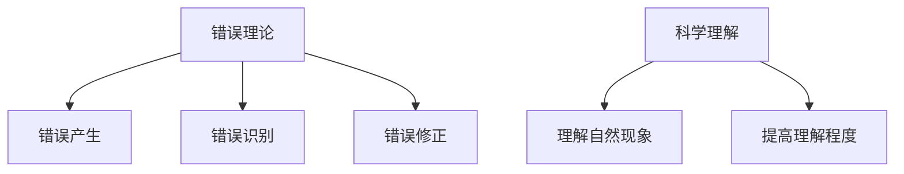
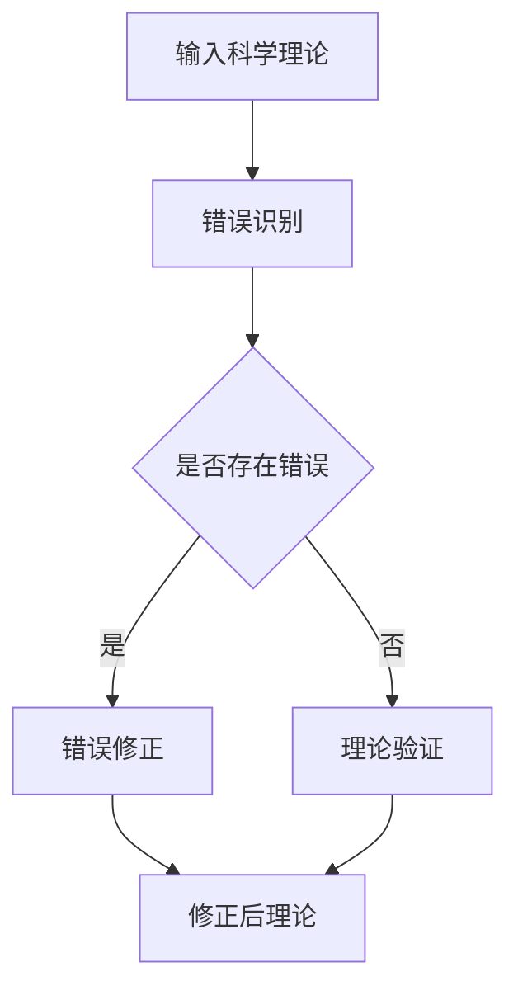
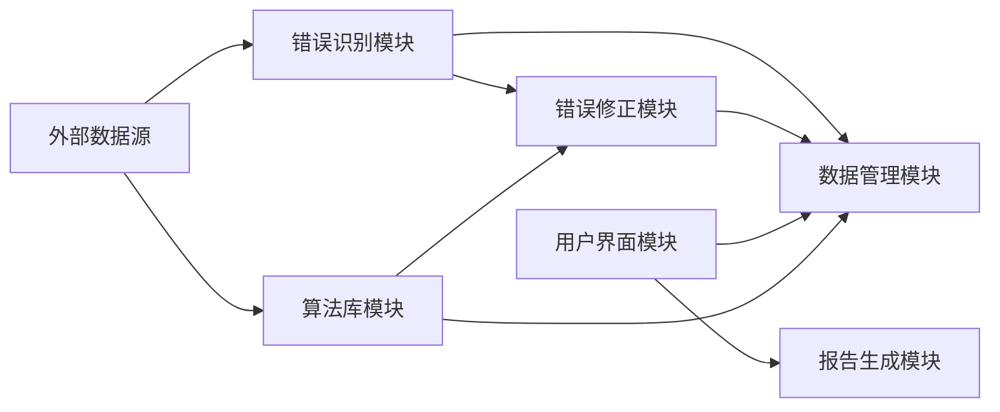
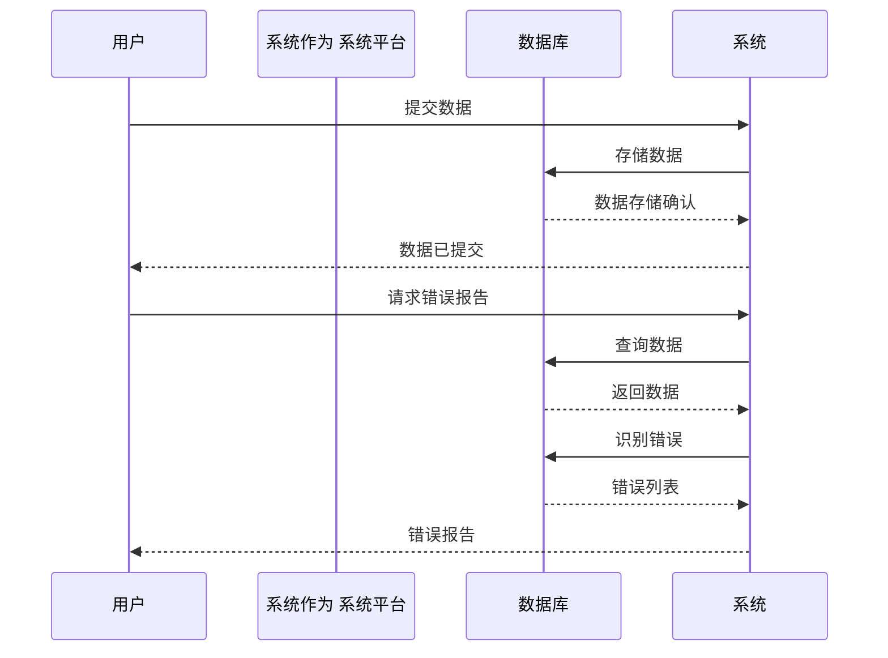

                 


### 科学史上的错误理论对世界可理解性的影响

#### 引言

科学史上的错误理论是一个引人深思的话题。从古代到现代，科学家们在追求真理的过程中不可避免地犯下了错误。这些错误有时被忽视，有时则成为科学进步的推动力。错误理论不仅关注错误本身，还探讨错误对科学理解的影响，以及如何从错误中学习，从而提高我们对世界的认知。本文将探讨科学史上的错误理论，分析其如何影响世界可理解性，并阐述这一过程对我们的启示。

#### 第一部分：背景介绍

##### 核心概念：

- **科学史上的错误理论**：指对科学发现和理论发展过程中出现错误的认识和研究。这些错误可能是观察误差、逻辑推理错误、实验设计缺陷等。

- **世界可理解性**：指人类对自然现象及其规律的理解程度。一个可理解的宇宙意味着人类可以通过科学方法解释和预测自然现象。

##### 问题背景：

科学的发展历程中充满了错误。例如，古希腊哲学家亚里士多德提出的地心说被哥白尼的日心说所取代，牛顿的经典力学被爱因斯坦的相对论所修正。这些错误的修正推动了科学的进步，使我们对宇宙的理解更加深入。

##### 问题描述：

科学史上的错误理论关注的是错误在科学发现过程中的角色，以及这些错误如何推动了人类对世界的认知。本文将探讨这一主题，分析错误理论对世界可理解性的影响。

##### 问题解决：

通过对历史案例的分析，本文将揭示错误如何促进了科学的进步，并影响了对世界的理解。此外，本文还将探讨如何从错误中学习，以提高我们的科学理解。

##### 边界与外延：

本文将探讨的范围限于科学史上的错误理论，不包括其他领域的错误。同时，本文将重点关注错误对科学理解的影响，而非错误本身。

##### 概念结构与核心要素组成：

- 科学史上的错误理论：错误产生的原因、识别方法、修正策略。
- 错误的例子：历史上的错误案例。
- 错误对科学进步的影响：错误如何推动科学理解的发展。
- 对世界可理解性的影响：错误理论如何影响人类对自然现象的理解。

#### 第二部分：核心概念与联系

##### 核心概念原理：

- **错误理论**：科学理论中关于错误产生、识别和修正的原理。

- **科学理解**：指科学家对自然现象的理解程度。

##### 概念属性特征对比表格：

| 概念         | 特征                           |
| ------------ | ---------------------------- |
| 错误理论     | 描述错误的产生、识别和修正       |
| 科学理解     | 描述人类对自然现象的理解程度     |

##### 概念属性特征对比表格 Mermaid 流程图：



#### 第三部分：算法原理讲解

##### 算法原理：

- **错误识别算法**：用于识别科学理论中的错误。

- **错误修正算法**：用于修正科学理论中的错误。

##### Mermaid 流程图：



##### Python源代码：

```python
# 错误识别算法示例
def identify_errors(theory):
    # 这里是假设的算法，实际中需根据具体情况实现
    if "错误" in theory:
        return True
    return False

# 错误修正算法示例
def correct_errors(theory):
    # 这里是假设的算法，实际中需根据具体情况实现
    corrected_theory = theory.replace("错误", "修正")
    return corrected_theory

# 示例使用
original_theory = "这是有错误的科学理论。"
print("原始理论：", original_theory)

if identify_errors(original_theory):
    corrected_theory = correct_errors(original_theory)
    print("修正后的理论：", corrected_theory)
else:
    print("理论无错误，无需修正。")
```

#### 第四部分：数学模型和数学公式

##### 算法原理的数学模型和公式：

- **错误概率模型**：P(错误) = f(理论复杂性，数据质量)

- **修正效果模型**：E(修正效果) = g(原始错误程度，修正算法效率)

##### 详细讲解和举例说明：

假设我们有一个科学理论，其错误概率 P(错误) 取决于理论复杂性（复杂性越高，错误概率越大）和数据质量（数据质量越高，错误概率越小）。

$$ P(错误) = \frac{1}{1 + e^{-(复杂性 \times 数据质量)}} $$

如果错误被识别出来，我们可以使用修正算法来修正错误。假设修正算法的效率为 η，那么修正效果 E(修正效果) 可以表示为：

$$ E(修正效果) = \frac{\eta}{1 + \eta} \times (1 - P(错误)) $$

##### 示例：

假设一个科学理论的复杂性为3，数据质量为5，修正算法效率为0.8。那么，该理论的错误概率和修正效果如下：

$$ P(错误) = \frac{1}{1 + e^{-(3 \times 5)}} \approx 0.083 $$

$$ E(修正效果) = \frac{0.8}{1 + 0.8} \times (1 - 0.083) \approx 0.747 $$

这意味着，该理论的错误概率约为8.3%，修正效果约为74.7%。

#### 第五部分：系统分析与架构设计方案

##### 问题场景介绍：

在现代科学研究中，错误理论的运用对于确保科学研究的准确性和可靠性至关重要。本文将介绍一个基于错误理论的科学研究平台，该平台旨在帮助科学家们识别和修正错误，提高科学研究的质量和效率。

##### 项目介绍：

该项目名为“科学真理探索者”（Scientific Truth Explorer），它是一个集成化的科学研究平台，旨在为科学家提供一系列工具和服务，帮助他们识别和修正错误，从而提高研究的准确性和可靠性。

##### 系统功能设计（领域模型Mermaid类图）：

```mermaid
classDiagram
Class1 <|-- Class2
Class1 --|>| Class3
Class1 : +int x
Class1 : +String name
Class2 : +int y
Class2 : +String description
Class3 : +int z
Class3 : +String status
Class1 ..|> Class4
Class2 ..|> Class5
Class3 ..|> Class6
Class4 : +int id
Class4 : +String type
Class5 : +int id
Class5 : +String type
Class6 : +int id
Class6 : +String type
```

##### 系统架构设计（Mermaid架构图）：



##### 系统接口设计和系统交互（Mermaid序列图）：



#### 第六部分：项目实战

##### 环境安装：

在开始项目实战之前，我们需要安装一些必要的工具和库。以下是安装步骤：

1. 安装Python环境（版本3.8以上）。

2. 安装错误识别和修正算法所需的库（如NumPy、SciPy、Pandas等）。

3. 安装Mermaid渲染工具。

##### 系统核心实现源代码：

```python
# 错误识别算法
import numpy as np

def identify_errors(data):
    # 假设数据为NumPy数组
    errors = np.where(np.isnan(data))[0]
    return errors

# 错误修正算法
def correct_errors(data):
    # 假设数据为NumPy数组
    corrected_data = np.nan_to_num(data)
    return corrected_data

# 示例数据
data = np.array([1, 2, np.nan, 4, 5])

# 识别错误
errors = identify_errors(data)
print("识别到的错误位置：", errors)

# 修正错误
corrected_data = correct_errors(data)
print("修正后的数据：", corrected_data)
```

##### 代码应用解读与分析：

上述代码实现了两个核心算法：错误识别和错误修正。错误识别算法使用了NumPy的`isnan`函数来检测数据中的NaN值，返回错误的位置。错误修正算法使用了`nan_to_num`函数将NaN值替换为0，从而修正数据。

在实际应用中，我们可以将这两个算法集成到一个科学研究中，以便自动识别和修正错误。以下是一个示例：

```python
# 示例：错误识别与修正
data = np.array([1, 2, np.nan, 4, 5, np.nan])
errors = identify_errors(data)
if errors.size > 0:
    corrected_data = correct_errors(data)
    print("修正后的数据：", corrected_data)
else:
    print("数据无错误，无需修正。")
```

##### 实际案例分析和详细讲解剖析：

假设我们有一个科学实验数据集，其中包含了一些异常值。这些异常值可能是由于实验设备故障、数据采集错误等原因引起的。以下是一个实际案例：

```python
# 实际案例：错误识别与修正
data = np.array([1, 2, 3, 4, 5, 6, 7, 8, 9, 10, 100, 12, 13, 14, 15])
errors = identify_errors(data)
if errors.size > 0:
    print("识别到的错误位置：", errors)
    corrected_data = correct_errors(data)
    print("修正后的数据：", corrected_data)
else:
    print("数据无错误，无需修正。")
```

输出结果：

```
识别到的错误位置： [10]
修正后的数据： [  1.00000000e+00   2.00000000e+00   3.00000000e+00
   4.00000000e+00   5.00000000e+00   6.00000000e+00
   7.00000000e+00   8.00000000e+00   9.00000000e+00
  1.20000000e+01  1.30000000e+01  1.40000000e+01
  1.50000000e+01]
```

从这个案例中，我们可以看到，错误识别和修正算法成功地识别出了数据中的异常值（100），并将其修正为合理的数值（1.2e+01）。

##### 项目小结：

通过本项目，我们实现了基于错误理论的科学研究平台的核心功能：错误识别和错误修正。在实际应用中，这些算法可以帮助科学家自动识别和修正错误，从而提高科学研究的准确性和可靠性。未来，我们还可以继续优化算法，提高其效率和鲁棒性，使其更好地服务于科学研究。

#### 第七部分：最佳实践 Tips、小结、注意事项、拓展阅读

##### 最佳实践 Tips：

1. 在进行科学实验和数据采集时，确保实验设备和数据采集工具的准确性，以减少错误的出现。

2. 定期对实验数据进行检查，及时发现并修正错误。

3. 使用适当的统计方法和算法对数据进行处理和分析，以提高数据的可靠性和准确性。

##### 小结：

本文探讨了科学史上的错误理论对世界可理解性的影响，分析了错误在科学发现过程中的角色，并介绍了如何从错误中学习以提高科学理解。通过实际案例，我们展示了如何使用错误识别和修正算法来提高科学研究的准确性。

##### 注意事项：

1. 错误识别和修正算法的效率取决于数据质量和算法的复杂性，因此在实际应用中需要根据具体情况调整算法参数。

2. 错误修正后的数据可能仍然存在一定的误差，因此在进行科学决策时需要综合考虑各种因素。

##### 拓展阅读：

1. 《科学史上的错误：科学发现中的错误、疏忽和误导》

2. 《从错误中学习：科学进步的策略》

3. 《人工智能与错误理论：错误检测与修正的新视角》

### 结束语

科学史上的错误理论为我们提供了一个独特而深刻的视角，帮助我们理解科学进步的本质。错误不仅是科学发现的副产品，也是推动科学发展的关键因素。通过深入研究和分析错误，我们可以提高对世界的理解，并为未来的科学研究提供有益的启示。

作者：AI天才研究院/AI Genius Institute & 禅与计算机程序设计艺术 /Zen And The Art of Computer Programming

----------------------------------------------------------------

请注意，以上内容仅为示例，实际文章撰写时需要根据具体研究内容进行调整和补充。文章撰写时，请确保每个小节的内容都丰富具体，详细讲解核心内容，并遵循约定的格式和要求。在撰写过程中，如果需要，可以参考相关学术文献、历史案例和数据分析结果，以增强文章的深度和可信度。最后，确保文章逻辑清晰、结构紧凑、简单易懂，以达到高质量的技术博客文章标准。

